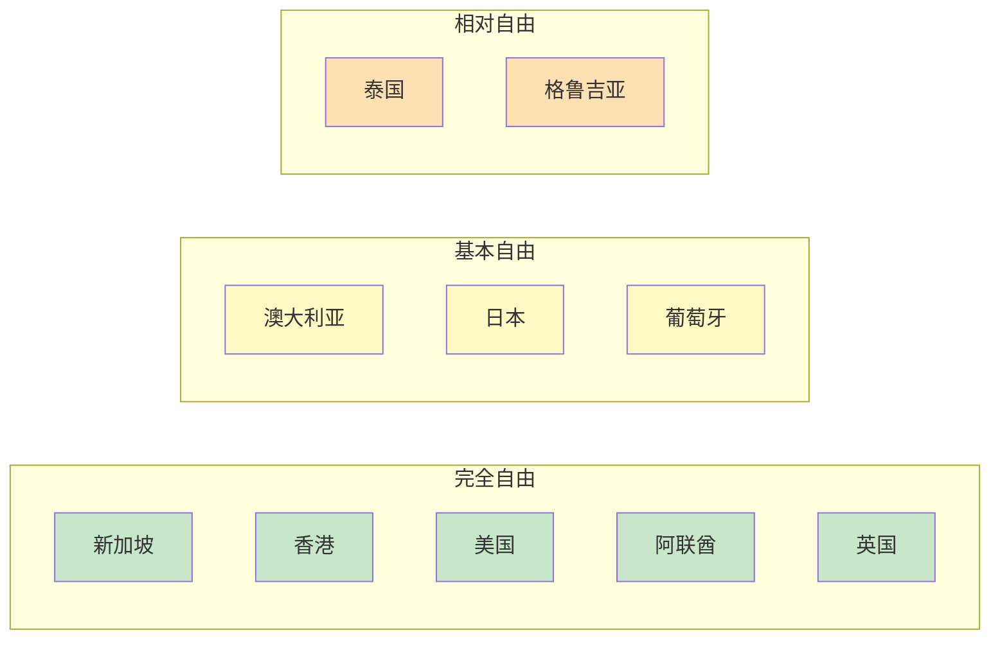

## 五、不同国家投资环境快速比较

选择投资目的地是全球化搞钱的第一道关卡。每个国家的税收制度、市场准入门槛、法律体系、资本流动限制都截然相同——选对了事半功倍，选错了可能面临资产冻结甚至法律风险。本节从七个核心维度横向对比全球主要投资目的地，帮你快速建立决策框架。

### 1. 评估框架：七个核心维度

在比较任何国家之前，先建立统一的评估标准。以下七个维度覆盖了投资者最关心的问题：

| 维度 | 核心问题 | 权重建议 |
|------|----------|----------|
| **税收环境** | 企业所得税率、个人所得税率、资本利得税、股息税、是否有双重征税协定 | ★★★★★ |
| **市场准入** | 外资准入限制、行业禁入清单、注册公司流程复杂度、最低注册资本 | ★★★★☆ |
| **资本流动** | 外汇管制程度、利润汇回限制、资金进出自由度 | ★★★★★ |
| **法律体系** | 法治水平、合同执行力、知识产权保护、争端解决机制 | ★★★★☆ |
| **基础设施** | 金融基础设施、银行体系成熟度、支付系统、互联网普及率 | ★★★☆☆ |
| **政治稳定性** | 政策连续性、政权稳定性、国际关系、制裁风险 | ★★★★☆ |
| **营商便利度** | 开户难度、签证/居留政策、语言障碍、生活成本 | ★★★☆☆ |

不同投资者侧重点不同：做跨境电商的更看重市场准入和物流；做资产配置的更看重税收和资本流动；做技术出海的更看重法律体系和知识产权保护。

### 2. 十大热门投资目的地全景对比

#### 2.1 新加坡

**定位：** 亚洲财富管理中心，中国投资者出海首选跳板

**税收环境：**
- 企业所得税：17%（实际有效税率可低至 8.5-10%，因新创企业免税计划）
- 个人所得税：0-22% 累进制
- 资本利得税：**无**
- 股息税：**无**（单层制，公司利润分配不再征税）
- 消费税（GST）：9%（2024年起）
- 与中国有双重征税协定（DTA），股息预提税降至 10%

**市场准入：**
- 几乎所有行业对外资开放，无外资持股比例限制
- 注册公司 1-2 天完成，最低注册资本 1 新币
- 需要至少一名本地董事（可找代理提供）

**资本流动：**
- 无外汇管制，资金自由进出
- 利润可 100% 汇回，无汇出税
- 新加坡元与一篮子货币挂钩，汇率相对稳定

**优势：**
- 华人社会，中文沟通无障碍
- 亚洲时区，方便管理
- 亚太区银行开户相对容易（但近年收紧）
- 签证/就业准证体系成熟

**劣势：**
- 生活成本极高（全球前五）
- 市场体量小，本地市场有限
- 近年反洗钱审查趋严，开户门槛提高

**适合人群：** 做亚洲区域总部、基金管理、跨境电商转口、家族办公室

---

#### 2.2 中国香港

**定位：** 连接中国内地与全球市场的超级通道

**税收环境：**
- 利得税（企业所得税）：8.25%（首 200 万港币）/ 16.5%（超出部分）
- 个人薪俸税：2-17%，标准税率 15%
- 资本利得税：**无**
- 股息税：**无**
- 增值税/消费税：**无**
- 属地征税原则：仅对来源于香港的收入征税

**市场准入：**
- 外资准入极为宽松，绝大多数行业无限制
- 注册公司约 1 周，无需本地董事
- 但公司需有香港注册地址和法定秘书

**资本流动：**
- 完全无外汇管制
- 港币与美元挂钩（联系汇率制度），汇率高度稳定
- 资金进出自由，但大额转账需配合反洗钱审查

**优势：**
- 作为中国特别行政区，与内地沟通最便利
- 港股通/沪深港通为跨境投资提供合法通道
- 金融体系极度成熟，银行/券商选择丰富
- 无资本利得税 + 无股息税，税务优势突出

**劣势：**
- 地缘政治风险增加（中美博弈背景）
- 租金极高，办公成本高
- 银行开户近年审核趋严，尤其是大陆背景公司
- 社会环境近年有不确定性

**适合人群：** 做港股投资、跨境贸易公司、持有内地资产的海外架构搭建

---

#### 2.3 美国

**定位：** 全球最大资本市场，科技投资和美元资产配置的核心目的地

**税收环境：**
- 联邦企业所得税：21%
- 州企业所得税：0-12%（加州最高，得州/佛州/内华达州无州税）
- 个人所得税：联邦 10-37% + 州税
- 资本利得税：长期（持有>1年）0-20%，短期按普通收入税率
- 股息税：合格股息 0-20%，非合格股息按普通收入税率
- 与中国的 DTA：股息预提税 10%，利息 10%，特许权使用费 10%

**市场准入：**
- 外资可进入大多数行业，但有国家安全审查（CFIUS）
- 受限行业：电信、航空、能源、媒体、农业用地（部分州）
- 注册公司流程简单（LLC 可在 1-3 天内完成），但后续税务申报复杂

**资本流动：**
- 无外汇管制
- 但外国人在美开户近年越来越难（FATCA 合规要求）
- 部分券商对非居民限制较多

**优势：**
- 全球最深、最流动的资本市场
- 美元作为全球储备货币，资产天然对冲人民币贬值风险
- 科技股/指数基金长期回报优秀（标普500年化约10%）
- 法律体系成熟，投资者保护强

**劣势：**
- 税务体系极其复杂（联邦+州+地方三层）
- 非居民开户门槛提高，部分券商不再接受中国居民
- FATCA/CRS 信息交换，税务透明度高
- 地缘政治风险影响中概股

**适合人群：** 长期价值投资者、科技行业从业者、需要美元资产配置的高净值人群

---

#### 2.4 日本

**定位：** 低利率环境下的房产投资和日元资产避风港

**税收环境：**
- 法人税：约 23.2%（实际有效税率约 30% 含地方税）
- 个人所得税：5-45% 累进 + 住民税 10%
- 资本利得税：20.315%（含复兴特别所得税）
- 股息税：20.315%
- 消费税：10%（食品8%）
- 与中国的 DTA：股息预提税 10%

**市场准入：**
- 外资准入相对开放，但农业、航空、广播等有限制
- 注册公司需要约 2-4 周，需有日本地址
- 语言障碍较大，英语普及率低

**资本流动：**
- 无外汇管制
- 日元为避险货币，但近年波动加大
- 银行开户对外国人较难（需在留卡）

**优势：**
- 日元贬值窗口期，房产投资性价比极高
- 低利率环境，融资成本低（日本房贷利率约 0.5-1.5%）
- 政治高度稳定，法治水平极高
- 旅游/短租市场火热（尤其东京、大阪、京都）

**劣势：**
- 语言障碍大，多数事务需要日语
- 人口老龄化、经济长期低增长
- 房产管理需要本地代理
- 银行开户流程繁琐，对外国人限制多

**适合人群：** 房产投资者、日元资产配置者、看好日本旅游/民宿市场的人

---

#### 2.5 泰国

**定位：** 东南亚新兴市场入口，低成本创业和房产投资目的地

**税收环境：**
- 企业所得税：20%
- 个人所得税：0-35% 累进
- 资本利得税：按普通收入税率（15%封顶对证券）
- 股息税：预提税 10%（可抵扣）
- 增值税：7%
- 与中国的 DTA：股息预提税 10%

**市场准入：**
- 《外商经营法》限制三类行业：A类禁止、B类需许可、C类需批准
- 常见规避方式：BOI 优惠投资、与泰国人合资（泰方持股51%以上）
- 注册公司约 2-4 周

**资本流动：**
- 外汇管制相对宽松，但大额汇出需说明用途
- 利润汇回需缴纳 10% 预提税（可通过 DTA 减免）
- 泰铢汇率波动中等

**优势：**
- 生活成本低（曼谷月生活费 5000-8000 元人民币）
- 签证选择多（精英签、养老签、工作签、LTR 长期居留签）
- 东南亚区域中心，辐射印尼、越南、菲律宾
- 数字经济快速发展

**劣势：**
- 外资持股限制多，多数行业需合资
- 政治环境偶有动荡（军方影响力大）
- 法律执行效率参差不齐
- 语言障碍（英语普及率中等）

**适合人群：** 东南亚跨境电商、数字游民、低成本创业者、养老规划

---

#### 2.6 阿联酋（迪拜）

**定位：** 中东财富中心，零税率天堂

**税收环境：**
- 企业所得税：9%（2023年起，利润超 37.5 万迪拉姆部分）
- 个人所得税：**0%**
- 资本利得税：**0%**
- 股息税：**0%**
- 增值税：5%
- 自贸区内企业可享 0% 企业所得税（最长50年）
- 与中国有 DTA

**市场准入：**
- 自贸区内允许 100% 外资持股
- 大陆公司（Mainland）2020年起也允许多数行业100%外资
- 注册公司 3-7 天（自贸区更快）
- 需要当地注册代理/地址

**资本流动：**
- 无外汇管制
- 迪拉姆与美元挂钩
- 资金自由进出，无利润汇回限制

**优势：**
- 零个人所得税，对高收入者极具吸引力
- 地理位置连接欧亚非，时区覆盖东西方工作时间
- 无 CRS 强制交换（与多数国家有协议但执行较松）
- 基础设施一流，国际化程度高

**劣势：**
- 生活成本高（迪拜已跻身全球高成本城市）
- 气候极端（夏季 45°C+）
- 法律体系与普通法/大陆法不同（伊斯兰法影响）
- 开户虽不难但合规要求趋严

**适合人群：** 高净值人群税务规划、中东/非洲贸易、加密货币相关业务

---

#### 2.7 英国

**定位：** 欧洲金融中心，英语世界的成熟市场

**税收环境：**
- 企业所得税：25%（2023年起，利润超 25 万英镑部分）/ 19%（小企业）
- 个人所得税：20/40/45% 三档
- 资本利得税：10/20%（基本/高税率纳税人）
- 股息税：8.75/33.75/39.35%（基本/高/附加税率纳税人，有 1000 英镑免税额）
- 增值税：20%
- 与中国的 DTA：股息预提税 10%

**市场准入：**
- 外资准入极为开放，几乎无行业限制
- 注册公司 24 小时内可完成（Companies House 在线注册）
- 需要英国注册地址

**资本流动：**
- 无外汇管制
- 英镑为主要国际货币之一
- 伦敦作为全球金融中心，金融服务极其发达

**优势：**
- 法律体系透明、可预期（普通法系鼻祖）
- 英语环境，沟通无障碍
- 伦敦金融城提供全球顶级金融服务
- 教育/科技/创意产业发达

**劣势：**
- 税负较重（尤其股息税近年大幅上调）
- 脱欧后与欧盟市场关系变化
- 生活成本高（伦敦尤其）
- 天气阴冷

**适合人群：** 科技/创意产业创业者、需要欧洲市场准入的企业、英镑资产配置

---

#### 2.8 澳大利亚

**定位：** 南太平洋稳定市场，资源和教育产业优势

**税收环境：**
- 企业所得税：30%（小企业 25%）
- 个人所得税：0-45% 累进
- 资本利得税：纳入普通收入（有 50% 折扣，持有超12个月的资产）
- 股息税：有归集制（franking credits），避免双重征税
- 商品及服务税（GST）：10%
- 与中国有 DTA：股息预提税 15%

**市场准入：**
- 外资准入较开放，但有 FIRB（外国投资审查委员会）审批
- 敏感行业：房地产、农业、电信、媒体需审批
- 注册公司约 1-3 天

**资本流动：**
- 无外汇管制
- 澳元为商品货币，与大宗商品价格相关
- 资金进出自由

**优势：**
- 政治稳定，法治水平高
- 资源丰富，矿业/农业出口强劲
- 教育产业发达（留学经济）
- 生活质量高，适合定居

**劣势：**
- 税负较高（尤其个人所得税+Medicare levy）
- FIRB 审批增加外资购房难度
- 市场体量有限（人口仅 2600 万）
- 地理位置偏远，与亚洲时差有限

**适合人群：** 矿业/农业投资者、留学/移民规划者、澳元资产配置

---

#### 2.9 葡萄牙

**定位：** 欧盟跳板，黄金签证时代的遗产

**税收环境：**
- 企业所得税：21%（标准）+ 地方附加税
- 个人所得税：13.25-48% 累进
- 资本利得税：50% 纳入普通收入（实际税率减半）
- 股息税：28% 预提税（可选择纳入综合所得）
- 增值税：23%（标准）/ 13%（中间）/ 6%（低）
- NHR（非惯常居民）税务优惠已取消新申请（2024年起），替代方案 IFICI+ 仍在推进中
- 与中国的 DTA：股息预提税 10%

**市场准入：**
- 作为欧盟成员国，注册公司后可进入整个欧盟单一市场
- 注册公司约 1-2 周
- 需要葡萄牙地址和税号

**资本流动：**
- 欧元区，无外汇管制
- 通过SEPA系统与欧洲银行无缝转账
- 资金自由流动

**优势：**
- 欧盟身份跳板（居住5年可申请永居/入籍）
- 生活成本西欧最低之一
- NHR/IFICI+ 税务优惠对新居民有吸引力
- 生活质量高，气候宜人

**劣势：**
- NHR 优惠已收紧，新方案细则待定
- 语言障碍（葡语为主，英语普及率中等）
- 经济体量小，本地市场有限
- 官僚效率较低

**适合人群：** 欧盟身份规划者、退休养老者、希望低成本进入欧盟市场的企业家

---

#### 2.10 格鲁吉亚

**定位：** 新兴低成本投资目的地，欧亚交汇处的隐秘机会

**税收环境：**
- 企业所得税：15%（仅对分配利润征税，留存利润不征税）
- 个人所得税：20%（统一税率）
- 资本利得税：对个人处置房产免征（满足一定条件）
- 增值税：18%
- 自由工业区（FIZ）内企业享 0% 企业所得税
- 与中国的 DTA：股息预提税 10%

**市场准入：**
- 外资准入极为开放，几乎所有行业100%外资
- 注册公司 1-2 天，流程极其简便
- 无需本地董事

**资本流动：**
- 无外汇管制
- 格鲁吉亚拉里汇率波动较大（建议持有美元/欧元）
- 银行开户对外国人相对友好（部分银行支持远程开户）

**优势：**
- 税负极低，尤其"仅分配利润征税"模式对创业者极其友好
- 注册公司零门槛，无最低资本要求
- 生活成本极低（第比利斯月生活费 3000-5000 元人民币）
- 电子居民身份（e-Residency）计划推进中

**劣势：**
- 地缘政治风险（俄罗斯邻国，2008年曾有领土冲突）
- 金融市场不成熟，投资工具有限
- 拉里汇率不稳定
- 法律体系仍在完善中

**适合人群：** 追求极低税负的创业者、数字游民、小型跨境电商、IT外包公司

### 3. 关键维度深度对比

#### 3.1 税收综合对比表

| 国家/地区 | 企业所得税 | 个人所得税最高 | 资本利得税 | 股息税 | 增值税/GST |
|-----------|-----------|---------------|-----------|--------|-----------|
| 新加坡 | 17%（实际~10%） | 22% | 无 | 无 | 9% |
| 中国香港 | 8.25-16.5% | 17% | 无 | 无 | 无 |
| 美国 | 21%+州税 | 37%+州税 | 20% | 20% | 无联邦 |
| 日本 | ~30%（含地方） | 45% | 20.315% | 20.315% | 10% |
| 泰国 | 20% | 35% | 15% | 10% | 7% |
| 阿联酋 | 9%（自贸区内0%） | 0% | 0% | 0% | 5% |
| 英国 | 25% | 45% | 20% | 39.35% | 20% |
| 澳大利亚 | 30%（小企业25%） | 45% | 纳入收入（50%折扣） | 归集制 | 10% |
| 葡萄牙 | 21% | 48% | 纳入收入（50%） | 28% | 23% |
| 格鲁吉亚 | 15%（仅分配） | 20% | 免（房产条件） | 20% | 18% |

**税务天堂梯队：**

- **第一梯队（零/极低税）：** 阿联酋（0%个税）、新加坡（无资本利得/股息税）、香港（无资本利得/股息税）、格鲁吉亚（仅分配利润征税）
- **第二梯队（中等税负）：** 泰国、葡萄牙（有优惠方案时）
- **第三梯队（高税负但有对冲工具）：** 美国（可通过合格股息降低税率）、日本（可通过公司架构优化）
- **第四梯队（税负较重）：** 英国、澳大利亚

#### 3.2 资本流动自由度对比

#### 3.3 开户难度对比

| 国家/地区 | 开户难度 | 所需时间 | 远程开户 | 主要障碍 |
|-----------|---------|---------|---------|---------|
| 新加坡 | ★★★★☆ | 2-4周 | 部分银行支持 | KYC趋严，需本地董事/地址 |
| 香港 | ★★★★☆ | 2-8周 | 部分银行支持 | 大陆背景审核加严 |
| 美国 | ★★★★★ | 1-4周 | 部分支持（Mercury等） | FATCA合规，非居民限制多 |
| 日本 | ★★★★☆ | 2-4周 | 极少 | 需在留卡，语言障碍 |
| 泰国 | ★★★☆☆ | 1-2周 | 不支持 | 需工作签或长期签证 |
| 阿联酋 | ★★☆☆☆ | 1-3天 | 部分自贸区支持 | 需当地地址/代理 |
| 英国 | ★★☆☆☆ | 1-3天 | 支持（Revolut等） | 需UK地址证明 |
| 澳大利亚 | ★★★☆☆ | 1-2周 | 部分支持 | FIRB审查相关 |
| 葡萄牙 | ★★★☆☆ | 1-2周 | 部分支持 | 需NIF税号 |
| 格鲁吉亚 | ★☆☆☆☆ | 1-3天 | 支持 | 几乎无障碍 |

### 4. 不同场景的最佳选择

#### 4.1 按投资目标选择

| 投资目标 | 首选目的地 | 备选 | 理由 |
|----------|-----------|------|------|
| 美股投资 | 美国 | 新加坡/香港 | 直接接入最深流动性池 |
| 港股投资 | 香港 | 内地（港股通） | 直接开户更灵活 |
| 全球指数基金 | 爱尔兰（UCITS） | 新加坡/香港 | 税收效率最优 |
| 海外房产 | 日本/泰国 | 葡萄牙/澳大利亚 | 性价比+管理便利 |
| 数字资产 | 新加坡/迪拜 | 格鲁吉亚 | 监管友好度 |
| 跨境电商 | 新加坡/香港 | 泰国/格鲁吉亚 | 公司架构+税务优化 |
| 家族办公室 | 新加坡 | 香港/迪拜 | 制度成熟+税收优惠 |
| 退休养老 | 泰国/葡萄牙 | 日本/澳大利亚 | 生活成本+签证政策 |
| IT外包/远程服务 | 格鲁吉亚 | 泰国/迪拜 | 税负+注册便利 |

#### 4.2 按资金规模选择

**5万美金以下：**
- 通过 QDII 基金投资海外市场，无需境外开户
- 开一个港股/美股券商账户（富途/老虎/盈透）
- 重点：学习+小额试水，不急于搭建架构

**5-50万美金：**
- 开设 1-2 个境外银行账户（新加坡或香港）
- 通过券商做全球资产配置
- 考虑注册一个离岸公司（香港或新加坡）做贸易/服务
- 重点：建立合法合规的跨境通道

**50-500万美金：**
- 搭建 2-3 层架构（控股公司+运营公司+个人）
- 聘请税务师做跨境税务规划
- 考虑家族信托或基金架构
- 重点：税务优化+资产保护

**500万美金以上：**
- 设立家族办公室（新加坡/香港/迪拜）
- 专业团队（律师+税务师+投资顾问）
- 多司法管辖区架构
- 重点：代际传承+系统性风险对冲

### 5. 中国投资者的特殊考量

#### 5.1 外汇管制

中国个人每年购汇额度 5 万美元。超出额度的资金出境需要合法渠道：

- **贸易项下：** 通过进出口贸易公司正常结售汇
- **投资项下：** 通过 QDII/QDLP/QDIE 等合格投资者渠道
- **服务项下：** 合法的技术服务费、咨询费等跨境支付
- **个人项下：** 每人每年 5 万美元便利化额度

**红线：** 地下钱庄、蚂蚁搬家（多人分拆购汇）、虚假贸易背景——这些都属于违法行为，后果包括罚款、列入关注名单甚至刑事责任。

#### 5.2 CRS 信息交换

中国已加入 CRS（共同申报准则），与 100+ 个国家和地区自动交换税务信息。这意味着你在新加坡、香港、日本等地的银行账户信息会被自动报送给中国税务机关。

**应对策略（合法合规）：**
- 如实申报海外收入和资产
- 利用 DTA 避免双重征税
- 合理利用税收优惠（如新加坡的免税期、迪拜的零个税）
- 不要试图隐瞒——CRS 覆盖面极广，违规成本极高

#### 5.3 中国 DTA 网络

中国已与 110+ 个国家和地区签署双重征税协定。关键条款：

| 国家/地区 | 股息预提税 | 利息预提税 | 特许权使用费 |
|-----------|-----------|-----------|------------|
| 新加坡 | 10% | 7-10% | 10% |
| 香港 | 10% | 7% | 7% |
| 美国 | 10% | 10% | 10% |
| 日本 | 10% | 10% | 10% |
| 泰国 | 10% | 10% | 15% |
| 英国 | 10% | 10% | 10% |
| 澳大利亚 | 15% | 10% | 10% |
| 葡萄牙 | 10% | 10% | 10% |

### 6. 常见误区与避坑指南

#### 误区一：税率低就是好地方

**真相：** 税率只是因素之一。格鲁吉亚税率极低，但金融市场不成熟、地缘风险大。美国税率不低，但市场深度和法律保护无可替代。选择投资目的地要综合考虑七个维度，不能只看税率。

#### 误区二：离岸公司=逃税

**真相：** 离岸架构是合法的税务规划工具，关键在于是否有合理商业目的。CRS 时代，"零申报"的离岸壳公司风险极高。正确做法是有真实业务、如实申报、利用 DTA 优惠。

#### 误区三：香港比新加坡好（或反过来）

**真相：** 两者各有优势，取决于你的具体需求。香港对内地投资者更便利（语言、文化、港股通），新加坡对东南亚布局更优（区域总部、基金牌照）。很多高净值客户同时在两地都有架构。

#### 误区四：越远越好，分散到小国

**真相：** 分散不等于把资产放到不知名的小岛国。主流金融中心（新加坡、香港、伦敦、纽约）的法律保护和金融基础设施远优于离岸小国。分散的重点是**司法管辖区多元化**，而不是追求极端的税务优化。

#### 误区五：一次规划就够了

**真相：** 全球税务环境在不断变化。OECD 全球最低税率（15%）正在推行，各国税收政策也在调整。至少每年审视一次你的跨境架构，确保仍然合规且最优。

### 7. 从零开始的实操路径

如果你是第一次做海外投资，建议按以下路径推进：

**第一阶段（1-3个月）：认知建设**
- 阅读本章理论基础部分，理解全球资产配置的底层逻辑
- 确定自己的投资目标（资产保值/增值/税务优化/身份规划）
- 评估可投资金额和风险承受能力

**第二阶段（3-6个月）：通道建设**
- 开设一个港股或美股券商账户（推荐盈透证券，覆盖全球市场）
- 通过合法渠道（QDII或年度5万美元额度）完成首次入金
- 小额投资全球指数基金（如VT、VOO、标普500 ETF）

**第三阶段（6-12个月）：架构搭建**
- 根据业务需要，在新加坡或香港注册公司
- 开设境外银行账户（建议新加坡+香港各一个）
- 聘请跨境税务师做税务规划

**第四阶段（1年+）：持续优化**
- 根据市场变化调整配置比例
- 利用 DTA 优化税务结构
- 逐步扩展到更多市场和资产类别
- 定期复盘，持续迭代

### 8. 工具与资源

| 用途 | 推荐工具 | 说明 |
|------|---------|------|
| 全球证券交易 | 盈透证券（IBKR） | 覆盖 150+ 市场，费用低 |
| 港股/美股 | 富途牛牛、老虎证券 | 中文界面，适合入门 |
| 全球指数基金查询 | justetf.com | 欧洲 UCITS 基金数据库 |
| 各国税率查询 | taxsummaries.pwc.com | PwC 各国税务摘要 |
| DTA 条约查询 | 中国税务总局官网 | 完整 DTA 文本 |
| 开公司对比 | offshorecompanyguide.com | 各地注册流程和费用 |
| 汇率监控 | wise.com / xe.com | 实时汇率+历史走势 |
| CRS 合规咨询 | 本地四大（PwC/Deloitte/EY/KPMG） | 专业跨境税务服务 |
