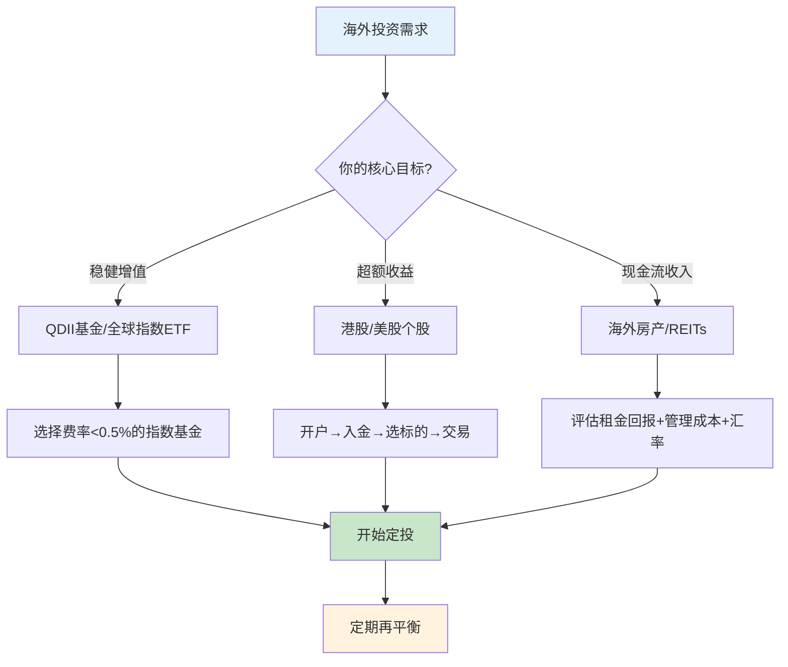
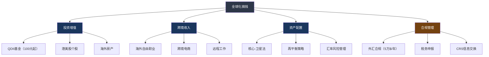

## 六、本节核心要点

本节从"道"的层面进入"术"的实战：海外投资渠道怎么选、跨境收入怎么赚、全球资产怎么配、外汇怎么管、不同国家怎么比。以下是对核心技巧全节的系统性提炼，既是复习巩固，也是快速索引。

### 6.1 海外投资渠道：四条路径的决策逻辑

海外投资不是"有钱就行"，而是"选对渠道才能事半功倍"。本节第一条核心技巧——海外投资渠道选择决策图——给出了一条清晰的决策链：

**按资金量级选渠道：**

| 资金规模 | 推荐渠道 | 核心优势 | 典型门槛 |
|----------|----------|----------|----------|
| <5万美元 | QDII基金 | 100元起投，支付宝/天天基金直接买 | 无资金门槛 |
| 5-50万美元 | 港股通/港美股互联网券商 | 标的全、费率低、操作灵活 | 互联网券商无门槛，港股通需50万 |
| >50万美元 | 私人银行/独立资管 | 定制化方案、税务规划、家族传承 | 专业机构准入门槛 |

**四条投资路径速览：**

| 路径 | 适合谁 | 核心要点 | 启动成本 |
|------|--------|----------|----------|
| 港股投资 | 想买中国龙头全球版的投资者 | AH溢价套利、高股息蓝筹、互联网券商开户 | 0元起（互联网券商） |
| 美股投资 | 想参与全球最大资本市场的投资者 | 科技巨头+指数ETF组合、碎股交易、定期定额 | 0元起（碎股1美元） |
| 海外基金 | 不想操作个股的稳健投资者 | QDII最简单（100元）、Vanguard/BlackRock费率低 | 100元（QDII） |
| 海外房产 | 高净值人群、想获取租金现金流者 | 租金回报率比房价更重要、汇率因素需长期考虑 | 50万人民币以上 |

**关键决策流程：**

**港股vs美股核心对比：**

| 维度 | 港股 | 美股 |
|------|------|------|
| 开户难度 | 互联网券商极简，港股通需50万 | 互联网券商1-3天审核 |
| 核心标的 | AH溢价股、高息蓝筹、新经济龙头 | 科技巨头FAANG+、标普500 ETF |
| 交易时间 | 北京时间9:30-16:00 | 北京时间21:30-4:00（夏令时） |
| 税费 | 印花税0.1%、无资本利得税 | 股息预提税10%（中美协定） |
| 适合策略 | 价值投资、高股息、AH溢价套利 | 定期定额、长期持有科技成长 |

### 6.2 跨境收入：三条赚美元的路径

除了投资增值，用技能直接赚取美元收入是"全球化搞钱"的第二条主线。跨境收入天然具备货币对冲功能——人民币贬值时，你的美元收入自动升值。

**三条路径对比：**

| 路径 | 核心能力要求 | 收入预期（月） | 启动周期 | 适合人群 |
|------|-------------|---------------|----------|----------|
| 海外自由职业 | 专业技能+基础英语 | $500-$5000 | 1-3个月 | 程序员、设计师、写手 |
| 跨境电商 | 供应链资源+运营能力 | ¥5000-¥50000+ | 3-6个月 | 有货源渠道者 |
| 远程工作 | 专业技能+流利英语 | $2000-$8000 | 3-12个月 | 互联网从业者 |

**海外自由职业实操要点：**

1. **平台选择**：Upwork（综合，佣金递减20%→10%→5%）、Fiverr（创意服务，20%佣金）、Toptal（高端开发，零佣金但门槛极高）
2. **起步策略**：初期定价可略低于市场均价，积累5-10个好评后逐步提价
3. **收入参考**：初级程序员$20-50/时、中级设计师$30-80/时、高级全栈$80-200/时
4. **关键能力**：英语写作能力（至少能写清晰的项目沟通邮件）比口语更重要

**跨境电商启动参考：**

- Amazon FBA：启动资金3-5万人民币，选品→1688采购→FBA发货→广告引流
- Shopify独立站：启动资金1-3万人民币，建站→Facebook/Google广告→品牌沉淀
- 选品原则：小众但有需求、避免过度竞争、产品质量是长期生命线

**远程工作核心渠道：**

- Remote.co、FlexJobs、We Work Remotely（专业远程平台）
- GitLab、Automattic、Zapier（知名远程文化公司直接申请）
- LinkedIn筛选"Remote"标签

**汇率风险管理：** 跨境收入持有外币资产时，需根据风险等级选择对冲策略——高风险用远期合约/货币期权，中风险做50%对冲，低风险自然持有并定期换汇。

### 6.3 全球资产配置：核心-卫星框架

配置比例比选标的更重要。这是本节最重要的认知之一。

**核心-卫星配置法：**

| 组成部分 | 比例 | 具体标的 | 作用 |
|----------|------|----------|------|
| 核心仓位 | 60-70% | 宽基指数基金（沪深300+标普500+全球债券） | 稳定底仓，获取市场平均收益 |
| 卫星仓位 | 30-40% | 行业ETF/个股/另类资产（黄金/REITs/加密货币） | 追求超额收益，增强组合弹性 |

**一个可供参考的配置方案（中等风险偏好）：**

| 资产类别 | 比例 | 推荐标的 | 为什么 |
|----------|------|----------|--------|
| 中国股市 | 25% | 沪深300ETF | 本土市场，你最了解 |
| 美国股市 | 25% | 标普500ETF（SPY/VOO） | 全球最大市场，长期年化~10% |
| 国际股市 | 10% | VXUS（全球除美股） | 分散单一国家风险 |
| 中国债券 | 15% | 国债ETF | 低波动，组合稳定器 |
| 海外债券 | 10% | BND（美国债券ETF） | 与股票负相关，对冲下行 |
| 黄金 | 10% | 黄金ETF/GLD | 抗通胀，危机中的避风港 |
| 现金/货基 | 5% | 货币基金 | 流动性储备 |

**再平衡策略：**

- **触发条件**：任何资产类别的偏离度超过目标比例5个百分点
- **操作方式**：卖出超配资产，买入低配资产，让比例回归目标
- **频率**：每季度检查一次，不必每月操作
- **核心逻辑**：再平衡本质上是"强制高卖低卖"，是纪律化投资的关键执行环节

**资产配置的数学基础：**

纯A股组合的年化波动率约25%，纯美股约18%，全球分散配置降至约14%。同样7-8%的年化预期收益，纯A股最大回撤可能达40-50%，全球分散配置通常在20-30%——最大回撤降低30%-50%。

### 6.4 海外银行开户与外汇管理

**开户要点：**
- 海外银行账户是接收跨境收入、进行海外投资的基础设施
- 香港银行账户是中国投资者最容易开通的海外账户
- 开户需要护照/港澳通行证、地址证明、资金来源说明
- 部分银行支持内地见证开户，无需亲自赴港

**外汇管理核心规则：**
- 中国个人年度便利化购汇额度：5万美元
- 购汇用途不能填写"境外证券投资"（需通过合规渠道如港股通、QDII）
- 超过5万美元需提供真实用途证明（留学、就医等）
- 合法合规是底线，切勿通过地下钱庄等非法渠道换汇

**跨境收款工具对比：**

| 工具 | 费率 | 到账时间 | 适合场景 |
|------|------|----------|----------|
| PayPal | 3.5%-4.5% | 即时 | 自由职业小额收款 |
| Wise | 0.5%-1% | 1-2天 | 国际转账，汇率最优 |
| Payoneer | 1%-2% | 1-3天 | 平台收款（Upwork/Amazon） |
| 银行电汇 | 固定费用+汇率差 | 2-5天 | 大额收款 |

### 6.5 不同国家投资环境：快速比较

**五大热门市场横向对比：**

| 维度 | 美国 | 香港 | 新加坡 | 日本 | 澳大利亚 |
|------|------|------|--------|------|----------|
| 市场规模 | 全球最大 | 亚洲第三 | 东南亚枢纽 | 全球第三 | 亚太重要 |
| 开户难度 | 中（线上可完成） | 低（互联网券商） | 中高 | 高（语言障碍） | 中 |
| 交易成本 | 低（零佣金券商多） | 中（印花税0.1%） | 低 | 中 | 中 |
| 核心标的 | 科技巨头、宽基指数 | AH溢价、新经济 | 东南亚龙头 | 汽车/电子/消费 | 矿业/银行/消费 |
| 税务负担 | 股息预提税10% | 无资本利得税 | 无资本利得税 | 预提税约20% | 预提税15% |
| 人民币投资者友好度 | 高 | 最高 | 中 | 中 | 中 |

**选择建议：**
- **入门首选**：港股（语言无障碍、互联网券商便捷、无资本利得税）
- **成长进阶**：美股（全球最大市场、标的最丰富、长期收益稳定）
- **区域布局**：新加坡（东南亚窗口）、日本（消费/科技/日元避险）
- **房产投资**：泰国（租金回报5-7%）、日本（4-6%+日元升值潜力）

### 6.6 进阶技巧：高净值人群的四把钥匙

当资产规模达到一定量级，需要更高阶的工具：

**1. 国际税务优化**
- 利用中国与100+国家签署的避免双重征税协定
- 股息预提税可通过协定优惠国中间持股公司降低
- 关键前提：必须满足"受益所有人"要求，有实质性经营

**2. 跨境支付企业工具**
- 连连支付、万里汇、PingPong——跨境电商卖家的标配
- 费率比PayPal低1-3个百分点，支持多币种结算

**3. 海外公司注册**
- 香港公司（税率8.25%-16.5%，成本5000-10000元/年）：适合初创
- 新加坡公司（税率17%）：适合东南亚业务
- BVI/开曼（零税率）：适合投资架构和基金
- 美国特拉华（联邦21%+州税）：适合美国市场

**4. 知识产权国际布局**
- PCT国际专利：一次申请，150+国家有效
- 马德里商标体系：一次申请，100+国家注册
- 提前布局避免被抢注，版权自动产生但登记利于维权

### 6.7 全球化搞钱的认知框架总结

将本节所有核心技巧浓缩为一张行动地图：

### 6.8 最容易犯的五个错误

在核心技巧的实操过程中，以下错误最为常见：

| 错误 | 为什么是错的 | 正确做法 |
|------|-------------|----------|
| 等有钱了再全球化 | 100元QDII就能开始，等是最大的成本 | 今天就开一个基金账户，先买100元标普500 |
| 追热点买个股 | 单只股票风险极高，亏损可能超50% | 先用指数ETF建底仓，个股只用卫星仓位 |
| 忽视汇率风险 | 持有美元资产时人民币升值吃掉收益 | 根据资产规模选择对冲策略 |
| 不做再平衡 | 涨的越配越多，跌的越配越少，偏离目标 | 每季度检查，偏离5%即调仓 |
| 用非法渠道换汇 | 地下钱庄=法律红线，可能面临刑事责任 | 合规使用5万$额度+港股通/QDII等正规渠道 |

### 6.9 从本节到下一步

核心技巧给了你"怎么做"的方法论，但方法论需要真实场景来验证。接下来的实战案例部分，将展示7个真实案例——从A股投资者的全球配置转型、程序员月入7万的跨境收入之路、到退休人士的全球养老规划——每一个都是本节核心技巧的完整应用。

**建议在进入案例之前，先完成以下自检：**

1. 我是否已经明确自己的资金规模属于哪个渠道层级？
2. 我是否已经确定了跨境收入的路径方向（自由职业/电商/远程）？
3. 我是否已经初步画出了自己的核心-卫星配置比例？
4. 我是否了解了5万美元额度的基本规则和合规底线？

如果以上4个问题的答案都是"是"，你已经具备了阅读实战案例的知识基础。如果还有"否"，建议回到对应的子章节再精读一遍。

***

> **本节一句话总结：** 全球化搞钱的核心技巧可以浓缩为四个动作——**选对渠道**（QDII/港美股/房产）、**赚取外币**（自由职业/电商/远程）、**科学配置**（核心-卫星+再平衡）、**合规底线**（外汇管制+税务申报）。掌握这四个动作，你就拥有了全球化搞钱的完整操作手册。
