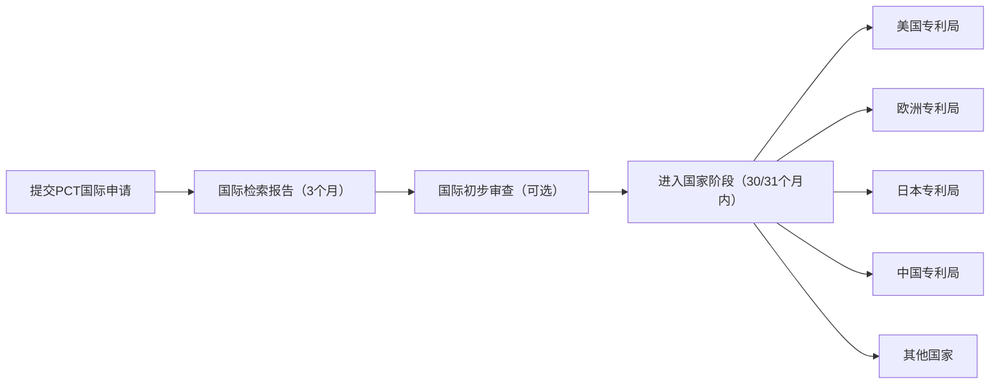
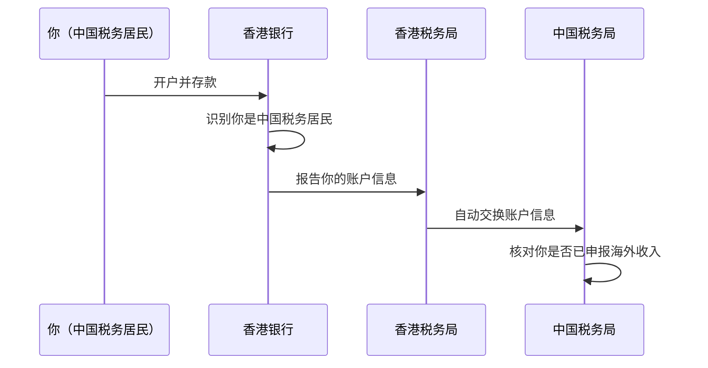

## 七、全球化搞钱的进阶技巧

当你已经完成了基础的海外投资（QDII基金、港股/美股开户），获取了初步的跨境收入（海外自由职业、远程工作），并且建立了基本的全球资产配置框架之后——你将进入一个更复杂的领域：**如何用更高级的策略来优化税负、保护资产、管理汇率风险、构建多层架构。** 这些就是本节要讲的"进阶技巧"。

> ⚠️ **重要提醒：** 进阶技巧涉及的领域（税务架构、公司注册、信托安排等）专业性极强，错误操作可能带来严重的法律风险。本节的目标是帮你建立知识框架、理解底层逻辑、与专业顾问有效沟通——而不是替代专业法律和税务建议。任何涉及跨境税务和公司架构的决策，务必在专业顾问指导下进行。

### 7.1 国际税务优化策略

#### 7.1.1 为什么跨境税务优化如此重要

先算一笔账：假设你通过海外投资获得年收入50万元人民币。在不做任何税务规划的情况下：

- 如果全部在中国申报：按照综合所得税率，边际税率可达30%-45%
- 如果涉及来源国预提税：可能被扣10%-30%的预提税
- 如果没有利用税收协定：同一笔收入可能被双重征税

**仅税务优化一项，合理规划与不规划之间的差异可能达到收入的10%-20%。** 对于年收入50万的人来说，这就是5万-10万元的差距。

#### 7.1.2 税收协定网络的利用

中国已与110多个国家和地区签署了避免双重征税协定（DTA），这是跨境税务优化的基石。协定的核心机制包括：

**（1）降低预提税率**

预提税是跨境收入最常见的税种。不同协定下的预提税率差异巨大：

| 收入类型 | 无协定标准税率 | 中美协定 | 中新（加坡）协定 | 中港协定 | 中英协定 |
|---------|-------------|---------|---------------|---------|---------|
| 股息 | 10%-30% | 10% | 10% | 5%-10% | 10% |
| 利息 | 10%-30% | 10% | 10% | 7% | 10% |
| 特许权使用费 | 10%-20% | 10% | 10% | 7% | 10% |

**实操要点：** 要享受协定优惠税率，你需要在投资前向券商或收款方提供《税收居民身份证明》。在中国，这个证明由主管税务机关开具，通常需要5-10个工作日。很多投资者不知道这个证明的存在，白白多交了税。

**（2）"受益所有人"要求**

这是税收协定中最容易被忽视、也最容易踩坑的条款。所谓"受益所有人"，是指你必须是这笔收入的真正拥有者，而不是为了享受协定优惠而设立的"空壳"安排。

举个例子：如果你在BVI（英属维尔京群岛）设立一家公司，通过这家公司持有美股并收取股息，试图享受中BVI税收协定的优惠——但这家公司没有实质性经营、没有员工、没有办公场所——税务机关很可能否认你的"受益所有人"身份，要求你按照正常税率补缴税款。

**判定"受益所有人"的核心要素：**

- 公司是否有真实的办公场所和员工
- 公司是否有实质性的经营活动（不仅仅是持股）
- 公司是否有独立的决策能力
- 收入是否最终流向了协定优惠范围之外的第三方
- 公司是否存在"导管安排"的嫌疑

```mermaid
flowchart TD
    A["收到跨境股息/利息/特许权使用费"] --> B{"你是这笔收入的\"受益所有人\"吗？"}
    B -->|"是"| C["可以享受协定优惠税率"]
    B -->|"否"| D["按正常税率缴纳预提税"]
    C --> E["准备《税收居民身份证明》"]
    E --> F["在投资前/收款前向券商/银行提交"]
    D --> G["评估是否需要调整架构"]
    G --> H["增加实质性经营要素"]
    H --> B
```

#### 7.1.3 高级税务架构设计

**（1）控股架构设计**

对于在多个国家有业务或投资的高净值人群，控股架构的设计直接影响整体税负。常见的架构层级包括：

```text
                    ┌─────────────────┐
                    │   个人（中国税务居民）│
                    └────────┬────────┘
                             │ 持股
                    ┌────────┴────────┐
                    │  顶层控股公司     │  ← 通常选择香港或新加坡
                    │  （中间控股层）    │     税率低、协定网络广
                    └────────┬────────┘
                 ┌───────────┼───────────┐
                 │           │           │
          ┌──────┴──────┐  ┌┴────────┐  ┌┴────────┐
          │ 美国子公司   │  │ 欧洲子公司│  │ 东南亚子公司│
          │ （运营实体）  │  │（运营实体）│  │（运营实体） │
          └─────────────┘  └─────────┘  └─────────┘
```

**为什么选香港或新加坡作为中间控股层？**

| 考量因素 | 香港 | 新加坡 | BVI/开曼 |
|---------|------|--------|---------|
| 企业所得税率 | 8.25%-16.5% | 17%（新创优惠可低至8.5%） | 0% |
| 税收协定数量 | 45+ | 90+ | 极少 |
| 中国DTA | ✅ 有 | ✅ 有 | ❌ 无 |
| CRS参与 | ✅ | ✅ | ✅ |
| 实质性要求 | 有（需有办公场所和员工） | 有（较严格） | 极低 |
| 国际声誉 | 高 | 高 | 中低（被视为避税天堂） |
| 设立成本 | 5000-10000元/年 | 10000-20000元/年 | 5000-15000元/年 |

**实操建议：**
- 如果你的主要业务在东南亚，新加坡公司作为控股层是最优选择——税率合理、协定网络广、国际声誉好
- 如果你的业务主要面向中国大陆，香港公司更方便——语言相通、地理便利、与中国大陆的税收安排成熟
- BVI/开曼适合纯控股或基金架构，但不要作为唯一的控股层——国际社会对"避税天堂"的审查越来越严格

**（2）知识产权（IP）架构**

如果你有可授权的知识产权（软件、内容、品牌等），通过合理的IP架构可以合法降低整体税负：

```text
流程：中国研发 → 香港/新加坡IP公司持有 → 全球子公司使用IP并支付特许权使用费
```

**具体操作：**

1. 在香港或新加坡设立一家IP控股公司
2. 将知识产权（专利、商标、版权、软件著作权等）转让或授权给该公司
3. 全球各地的子公司在使用该IP时，向IP公司支付特许权使用费
4. 特许权使用费在子公司层面作为成本扣除，降低当地应税收入
5. IP公司所在地的税率较低，整体税负降低

**关键注意事项：**

- 转让定价必须合理——支付的特许权使用费必须符合独立交易原则（arm's length principle），即如果两个没有关联的公司之间也会按照这个价格交易
- 需要准备转让定价文档，证明定价的合理性
- 中国有受控外国企业（CFC）规则——如果外国子公司不分配利润，中国税务机关可能视同分配并征税
- 近年来OECD的BEPS（税基侵蚀和利润转移）行动计划对IP架构的审查越来越严格

#### 7.1.4 个人层面的税务优化

**（1）税务身份规划**

不同的税务身份意味着完全不同的税负。全球主要地区的个人所得税率对比：

| 国家/地区 | 最高边际税率 | 资本利得税 | 是否全球征税 | 特殊说明 |
|---------|------------|----------|-----------|---------|
| 中国大陆 | 45% | 20%（股票暂免） | ✅ 全球征税 | CRS信息交换已启动 |
| 中国香港 | 15%（标准税率） | 0% | ❌ 仅属地征税 | 境外收入不征税 |
| 新加坡 | 22% | 0% | ✅ 但境外收入可豁免 | 需满足一定条件 |
| 美国 | 37%（联邦）+州税 | 20%-28% | ✅ 全球征税 | 公民和绿卡持有者 |
| 日本 | 45% | 20% | ✅ 全球征税 | 永久居民也适用 |
| 阿联酋（迪拜） | 0% | 0% | ❌ 无个税 | 数字游民签证友好 |
| 葡萄牙 | 48%（最高） | 28% | ✅ 但NHR可豁免 | 非惯常居民计划 |

**数字游民签证与税务身份：**

截至目前，全球已有50多个国家推出数字游民签证（Digital Nomad Visa），允许远程工作者合法长期居住。但要注意：**持有签证≠成为该国税务居民。** 大多数数字游民签证本身不改变你的税务居民身份，你需要同时满足该国的税务居民判定标准（通常是"183天规则"）。

对于中国公民来说，一个重要的现实是：即使你在海外居住超过183天，如果你在中国仍有住所（习惯性居处），中国税务机关仍可能认定你为中国税务居民。因此，"改变税务身份"并不是简单地搬个家就能实现的，需要系统规划。

**（2）海外收入的中国税务申报**

作为中国税务居民，你的全球收入都需要在中国申报纳税。但已经缴纳的境外税款可以进行抵免：

```text
应纳税额 = 境内所得应纳税额 + 境外所得应纳税额 - 境外已缴税款（抵免额）

抵免限额 = 境外所得应纳税额 × （境外所得 / 境内外所得总额）

实际抵免额 = min（境外已缴税款, 抵免限额）
```

**举例说明：** 假设你年收入100万元，其中境内收入70万元、海外收入30万元。海外收入在来源国已缴纳预提税5万元。在中国计算：

1. 境内外合计应纳税额：假设综合税率为25%，即25万元
2. 境外所得应纳税额：30万 × 25% = 7.5万元
3. 境外已缴税款：5万元
4. 可抵免额：min(5万, 7.5万) = 5万元
5. 最终应补缴：7.5万 - 5万 = 2.5万元

**关键操作：** 你需要保留所有海外收入的完税证明、收入凭证、银行流水等文件，在每年3-6月的个税汇算清缴时一并申报。如果没有申报海外收入，一旦被CRS信息交换系统发现，除了补税之外还可能面临罚款和滞纳金。

### 7.2 跨境支付与收款的高阶优化

#### 7.2.1 个人跨境收款工具深度对比

在前面的章节中我们已经介绍了基本的跨境收款工具，这里深入分析各工具的成本结构和适用场景：

| 工具 | 费率结构 | 隐性成本 | 到账速度 | 年度限额 | 最佳场景 |
|------|---------|---------|---------|---------|---------|
| **PayPal** | 交易金额的3.5%-4.5% | 提现到国内银行另收35美元/笔；汇率加点约2.5% | 即时（PayPal账户间） | 无明确限制 | 小额、临时性收款；欧美客户习惯用PayPal |
| **Wise（原TransferWise）** | 0.5%-1%（按金额阶梯递减） | 极低，使用中间市场汇率 | 1-2个工作日 | 无明确限制 | 大额、定期国际转账；追求最优汇率 |
| **Payoneer** | 1%-2%（平台收款） | 提现到国内银行1.2%；月管理费可能适用 | 1-3个工作日 | 按账户等级不同 | Upwork/Fiverr等自由职业平台收款 |
| **万里汇（WorldFirst）** | 0.3%-0.5% | 极低 | T+1 | 无限制 | 亚马逊/Shopify等电商平台收款 |
| **PingPong** | 最低0.5% | 提现到国内免费 | T+1 | 无限制 | 跨境电商卖家收款 |
| **银行电汇** | 手续费150-300元/笔 + 汇率差约1% | 中间行可能再扣15-25美元 | 2-5个工作日 | 受个人年度5万美元购汇限制 | 大额、一次性收款 |

**实操建议：** 不要只用一个工具。建议按照"主力+备用"的原则组合使用：

- **自由职业者：** Payoneer（主力，从平台收款）+ Wise（备用，客户直接转账）
- **跨境电商：** 万里汇或PingPong（主力，平台收款）+ 银行电汇（备用，大额B2B收款）
- **远程工作者：** Wise（主力，接收公司工资）+ Payoneer（备用，备用收款渠道）

#### 7.2.2 多币种账户管理策略

当你同时持有人民币、美元、港币等多种货币时，如何管理汇率风险是一个关键问题：

**（1）自然对冲（Natural Hedging）**

最简单的汇率风险管理方式：让收入和支出使用同一种货币。

```text
案例：小王是一名跨境电商卖家，主要在美国亚马逊销售产品。

收入端：以美元结算
支出端：
  - 采购成本：人民币（需换汇）→ 汇率风险点
  - 广告费：美元（Google Ads/Facebook Ads）→ 自然对冲
  - FBA仓储费：美元 → 自然对冲
  - 物流费：部分美元、部分人民币

优化方案：
  1. 增加美元计价的支出比例（如直接用美元支付广告费）
  2. 减少需要换汇的人民币支出比例
  3. 在美元强势时多换人民币，在美元弱势时少换
```

**（2）分批换汇策略**

不要一次性把所有外币换成人民币。按照"定投"的逻辑分批换汇：

| 策略 | 操作方式 | 适用场景 |
|------|---------|---------|
| 时间分散法 | 每月固定日期换汇1/12的年度预算 | 有固定外币收入 |
| 趋势跟踪法 | 当汇率达到预设目标时分批换汇 | 有时间关注汇率 |
| 阈值触发法 | 当汇率偏离均值超过5%时加大换汇比例 | 有预设心理价位 |
| 自动化定投 | 设置银行自动换汇，固定金额固定频率 | 无时间管理 |

**（3）高阶工具：外汇远期合约**

如果你有可预见的大额外币收支（如跨境电商的季度采购），可以考虑使用外汇远期合约锁定汇率。但这个工具的门槛较高：

- 最低合约金额通常为等值5万美元
- 需要在中国有合法的贸易背景
- 银行会要求缴纳一定比例的保证金（通常5%-10%）
- 合约到期时无论汇率如何变动，都按约定汇率执行

### 7.3 海外公司注册的深度指南

#### 7.3.1 为什么需要海外公司

在讨论"在哪里注册"之前，先要回答"是否需要注册"。海外公司不是必需品，但在以下场景中具有不可替代的价值：

1. **跨境电商需要：** 亚马逊、eBay等平台要求卖家在当地有公司实体
2. **品牌保护需要：** 在目标市场注册公司，可以更方便地注册当地商标和域名
3. **税务优化需要：** 在低税率地区设立控股公司，合法降低整体税负
4. **融资需要：** 某些投资机构要求被投企业有海外架构（如VIE结构）
5. **合规需要：** 某些行业（如金融科技）在当地经营必须持有牌照，而牌照只发给当地公司

**不需要海外公司的情况：**
- 你的收入全部来自国内
- 你的海外投资仅限于QDII基金或港股通
- 你只是一个个人自由职业者，年收入不超过30万元
- 你没有合规需求、没有融资计划

#### 7.3.2 主要注册地深度对比

| 注册地 | 企业所得税 | 增值税/GST | 最低注册资本 | 注册时间 | 年维护费用 | 核心优势 | 核心劣势 |
|--------|-----------|-----------|------------|---------|-----------|---------|---------|
| **香港** | 8.25%（前200万）/16.5% | 无 | 无最低要求 | 1-2周 | 5000-10000元（审计+年审） | 税制简单、无外汇管制、连接中国内地 | 需要每年审计、银行开户难 |
| **新加坡** | 17%（新创前3年可享75%免税） | 9% | 1新加坡元 | 1-3天 | 10000-20000元 | 税收协定广泛、东南亚枢纽、国际声誉好 | 租金和人工成本高、合规要求严格 |
| **美国（特拉华州）** | 联邦21%+州税（特拉华无州销售税） | 无联邦增值税 | 无最低要求 | 1-2周 | 5000-15000元 | 法律体系成熟、融资便利、科技公司首选 | 税务复杂（联邦+州+地方三层）、合规成本高 |
| **BVI** | 0% | 0% | 无 | 1周 | 5000-10000元 | 隐私保护好、设立快速 | 国际声誉下降、无税收协定、实质性要求增加 |
| **开曼群岛** | 0% | 0% | 无 | 2-3周 | 20000-30000元 | 基金和上市架构的标配 | 成本最高、监管趋严 |
| **迪拜（阿联酋）** | 9%（2023年起，37.5万迪拉姆以下免税） | 5% | 因自由区而异 | 1-2周 | 15000-30000元 | 零个税、地理位置优越、数字游民友好 | 部分行业限制、文化差异 |

#### 7.3.3 海外公司注册全流程

以香港公司为例，展示完整的注册和运营流程：

**第一步：前期准备（1-3天）**

1. **确定公司名称：** 中英文名称各一个，英文名必须以"Limited"结尾
2. **确定经营范围：** 香港对经营范围限制很少，通常可以写得比较宽泛
3. **确定股东和董事：** 至少1名股东和1名董事（可以是同一人），无国籍限制
4. **确定注册资本：** 通常设为1万港币（无需实缴）

**第二步：委托注册（1-2周）**

1. **选择注册服务商：** 比较常见的有卓信、骏德、瑞丰等，价格约3000-8000元
2. **提交资料：** 股东/董事的身份证或护照复印件、地址证明、签名样本
3. **签署注册文件：** 包括公司章程（Articles of Association）和注册申请表
4. **缴纳费用：** 政府注册费约1720港币 + 服务商费用

**第三步：银行开户（2-6周，最耗时的环节）**

香港银行开户是很多人的痛点。近年来由于反洗钱合规要求加强，银行的审核标准大幅提升：

| 银行 | 开户门槛 | 审核时间 | 推荐指数 | 说明 |
|------|---------|---------|---------|------|
| 汇丰银行 | 需预约面签，要求存款5万港币起 | 2-4周 | ⭐⭐⭐ | 最传统，但审核最严 |
| 渣打银行 | 需预约面签，要求存款5万港币起 | 2-4周 | ⭐⭐⭐ | 与汇丰类似 |
| 中国银行（香港） | 对内地客户较友好 | 2-3周 | ⭐⭐⭐⭐ | 中资背景，沟通方便 |
| 虚拟银行（众安、Mox等） | 线上开户，门槛低 | 1周内 | ⭐⭐⭐⭐ | 便捷但功能可能受限 |

**开户需要准备的材料：**
- 公司注册证书（Certificate of Incorporation）
- 商业登记证（Business Registration Certificate）
- 公司章程
- 董事/股东身份证件
- 业务证明（如合同、发票、商业计划书）
- 地址证明（近3个月水电费单或银行对账单）

**提高开户成功率的技巧：**
1. 提前准备好清晰的商业计划书，说明公司业务和预期交易量
2. 带上近期的业务证明材料（如已有的客户合同、采购订单）
3. 面签时如实回答银行经理的问题，不要夸大或隐瞒
4. 如果条件允许，先在内地的中国银行开户，再通过"见证开户"的方式开香港账户

**第四步：年度维护**

香港公司每年必须完成以下维护事项：

| 事项 | 时间 | 费用 | 逾期后果 |
|------|------|------|---------|
| 年审（Annual Return） | 注册周年日前后 | 105港币（政府费）+ 服务商费 | 罚款，严重可被除名 |
| 商业登记证续期 | 每年 | 2150港币 | 罚款 |
| 审计报告 | 财政年度结束后 | 3000-10000元（视业务复杂度） | 税务局可处以罚款 |
| 利得税申报 | 税务局发出报税表后 | 通常包含在审计服务中 | 罚款+加征附加税 |

#### 7.3.4 海外公司的常见陷阱

**陷阱一：注册了公司但不开户**

很多人觉得注册一家海外公司"放着"就行。但如果你的香港公司没有任何银行账户和交易记录，年审和审计时可能会遇到麻烦。更重要的是，没有实质经营的空壳公司在CRS信息交换中会被重点关注。

**陷阱二：用个人账户收公司款项**

一些创业者用个人PayPal或Wise账户收取属于公司的海外款项。这不仅在法律上构成公私不分，而且在税务申报时很难证明收入性质，可能被按照最高税率征收。

**陷阱三：忽视转让定价要求**

如果你的海外公司和国内公司之间有关联交易（如采购、服务费、特许权使用费），必须按照独立交易原则定价。中国税务机关近年来对转让定价的审查非常严格，不符合规定的关联交易可能被纳税调整。

**陷阱四：以为注册在BVI就不用交税**

BVI虽然没有企业所得税，但如果你是中国税务居民，BVI公司的利润仍然可能在中国被征税（通过CFC规则）。单纯因为"税率低"就在BVI注册公司，而没有实质经营需求，可能适得其反。

### 7.4 跨境知识产权布局

#### 7.4.1 为什么知识产权是全球化的"护城河"

知识产权（IP）是全球化搞钱中最具杠杆效应的资产。一个专利、一个商标、一个版权，可以在多个国家同时产生收入，而边际成本几乎为零。但反过来说，如果你没有在关键市场提前布局知识产权，你的竞争对手可能会抢先注册，反过来限制你进入那个市场。

**真实案例：** 中国某知名手机品牌在进入印度市场时发现，其品牌商标已被当地一家公司抢注。最终不得不花费数百万美元的法律费用，并改用当地子品牌名称进入市场，损失了至少两年的市场窗口期。

#### 7.4.2 专利的国际布局

**（1）PCT国际专利申请**

PCT（Patent Cooperation Treaty，专利合作条约）是目前最主要的国际专利申请途径。通过PCT，你可以用一份申请在150多个国家寻求专利保护。

**PCT申请流程：**



**关键时间节点：**

| 节点 | 期限 | 说明 |
|------|------|------|
| 优先权日起12个月内 | 提交PCT申请 | 从首次申请日起算 |
| 优先权日起16个月 | 国际检索报告 | 评估专利的新颖性和创造性 |
| 优先权日起22个月 | 国际初步审查报告 | 可选，提供更详细的评估 |
| 优先权日起30/31个月 | 进入国家阶段 | 必须在此期限前决定在哪些国家申请 |

**PCT申请费用估算：**

| 费用项目 | 金额（人民币） | 说明 |
|---------|-------------|------|
| PCT国际申请费 | 约10000-15000 | 包括国际局费用和检索费 |
| 国家阶段进入费 | 每个国家10000-50000 | 不同国家费用差异大 |
| 专利代理人费用 | 每个国家5000-20000 | 需要当地代理人翻译和提交 |
| 总计（10个国家） | 约20-50万 | 取决于选择的国家数量 |

**（2）优先策略**

不要在所有国家都申请专利——费用太高。优先考虑以下国家：

1. **你有制造基地的国家** —— 防止被竞争对手告侵权
2. **你有主要销售市场的国家** —— 保护你的市场份额
3. **竞争对手所在国家** —— 建立交叉许可谈判的筹码
4. **知识产权执法力度强的国家** —— 专利只有能执行才有价值

#### 7.4.3 商标的国际注册

**（1）马德里体系**

马德里商标国际注册体系让你通过一次申请、一种语言、一组费用，在120多个国家获得商标保护。这是目前最高效的国际商标注册方式。

**马德里注册流程：**

1. **前提条件：** 你必须先在本国（中国）有一个已注册或已申请的商标（基础商标）
2. **提交申请：** 通过中国国家知识产权局向WIPO（世界知识产权组织）提交国际注册申请
3. **WIPO审查：** 形式审查通过后，在国际注册簿上登记
4. **指定国审查：** 各指定国有12-18个月的审查期，可以提出异议或拒绝
5. **获得保护：** 未在期限内拒绝的国家，商标自动获得保护

**马德里注册费用估算：**

| 费用项目 | 金额（瑞士法郎） | 说明 |
|---------|----------------|------|
| 基础注册费 | 653（黑白商标）/ 903（彩色商标） | WIPO收取 |
| 补充注册费 | 每个类别超过1项商品/服务加收 100 | — |
| 指定国费用 | 每个国家单独计算 | 差异很大，美国约524，日本约318 |
| 中国代理费 | 约3000-8000元 | 通过国家知识产权局提交 |

**（2）单一国家注册 vs 马德里体系**

| 对比维度 | 马德里体系 | 单一国家注册 |
|---------|-----------|------------|
| 费用 | 批量申请更经济 | 每个国家单独付费，总量可能更高 |
| 时间 | 提交后即获得临时保护 | 每个国家需要单独申请 |
| 管理 | 统一管理，续展方便 | 各国分别管理 |
| 灵活性 | 受限于基础商标（"中心打击"风险） | 各国独立，互不影响 |
| 适用场景 | 需要在10+国家注册 | 只在2-3个重点国家注册 |

**实操建议：** 如果你需要在5个以下国家注册商标，可以考虑直接通过当地代理人进行单一国家注册（灵活、无"中心打击"风险）。如果需要在10个以上国家注册，马德里体系更经济。

#### 7.4.4 版权的跨境保护

版权与专利和商标不同，它在大多数国家是**自动产生**的——作品创作完成即享有版权，无需注册。但"自动产生"不等于"无需保护"：

**版权跨境保护的关键操作：**

1. **在关键市场进行版权登记：** 虽然版权自动产生，但登记可以作为权属的初步证据，在维权时大大简化流程
2. **利用数字平台的版权保护机制：**
   - YouTube Content ID：自动检测和管理你的视频内容
   - Amazon Brand Registry：保护你在亚马逊上的品牌和产品图片
   - DMCA（数字千年版权法案）通知：要求侵权平台下架侵权内容
3. **在合同中明确版权归属：** 与海外合作方签订合同时，必须明确约定作品的版权归属、使用范围和授权期限
4. **保留创作证据：** 保存作品的创作过程记录（如设计稿、修改历史、首次发布记录），作为版权归属的证据

#### 7.4.5 知识产权的商业化路径

拥有知识产权只是第一步，将其变现才是终极目标：

| 商业化方式 | 说明 | 典型收入模式 | 适合场景 |
|---------|------|------------|---------|
| 自主使用 | 直接用IP开发产品或服务 | 产品销售收入 | 有完整产品开发和销售能力 |
| 许可授权 | 允许他人使用你的IP | 一次性授权费+年度使用费 | 无生产能力，但有品牌/技术 |
| 特许经营 | 授权他人使用你的商业模式 | 加盟费+管理费+供应链利润 | 餐饮、零售等标准化业务 |
| 交叉许可 | 与对方互相授权使用各自的IP | 零现金交易，但获得使用权 | 双方都有对方需要的IP |
| 出售 | 将IP完全转让给他人 | 一次性转让收入 | 不再需要该IP，需要变现 |

### 7.5 外汇风险的系统化管理

#### 7.5.1 识别你的外汇风险敞口

在进行任何外汇管理之前，首先要清楚自己有多少"外汇风险敞口"——即你的资产和收入中，有多大比例以外币计价，这部分价值会随汇率波动而变化。

**外汇风险敞口自检清单：**

| 风险类型 | 你的敞口 | 影响程度 |
|---------|---------|---------|
| 交易风险：未来将收到的外币收入 | 例：每月3000美元自由职业收入 | 每1%的汇率变动 = 约200元/月 |
| 折算风险：以外币计价的资产 | 例：持有10万美元的美股 | 每1%的汇率变动 = 约7000元 |
| 经济风险：未来可能受影响的现金流 | 例：计划用美元支付留学费用 | 金额不确定，但影响可能很大 |

#### 7.5.2 个人投资者的外汇管理策略

对于大多数人来说，不需要使用复杂的金融衍生品来管理汇率风险。以下是适合个人投资者的实用策略：

**策略一：货币多元化配置**

不要把所有资产都换成同一种货币。一个合理的货币配置框架：

```text
人民币资产：50%-70%（生活开支、国内投资）
美元资产：20%-30%（美股、美元债、美元存款）
其他货币：5%-10%（港币、欧元、日元等）
黄金：5%-10%（对冲极端风险，黄金以美元计价但不完全跟随美元）
```

**策略二：定投换汇（Dollar Cost Averaging）**

将大额换汇需求分散到多个月份执行，平滑汇率波动的影响。例如，如果你计划年度换汇5万美元，可以每月换汇约4200美元，而不是在某一天一次性换完。

**策略三：利用多币种账户**

现在许多券商和银行提供多币种账户，你可以持有多种货币而不必立即兑换。在汇率有利时换汇，汇率不利时暂不操作。

#### 7.5.3 高净值人群的外汇对冲工具

对于资产规模较大（500万+人民币）且有明确外币收支计划的人群，可以考虑以下工具：

| 工具 | 最低门槛 | 操作方式 | 适合场景 |
|------|---------|---------|---------|
| 外汇远期合约 | 约5万美元 | 与银行签订远期合约锁定未来汇率 | 有明确的大额外币收支计划 |
| 外汇期权 | 约10万美元 | 购买汇率期权，获得按约定汇率兑换的权利（非义务） | 想保护下限但保留上升空间 |
| 多币种贷款 | 因银行而异 | 用人民币资产作抵押，借入外币 | 既需要资金又想持有外币敞口 |

### 7.6 全球合规框架：CRS、FATCA与反洗钱

#### 7.6.1 CRS（共同申报准则）

CRS是经合组织（OECD）推出的全球税务信息自动交换标准。截至目前，已有100多个国家和地区参与CRS，其中包括中国大陆、香港、新加坡、BVI、开曼群岛等几乎所有主要金融中心。

**CRS如何运作？**



**CRS报告的信息包括：**

- 账户持有人的姓名、地址、税务居民身份
- 纳税人识别号（TIN，中国为身份证号）
- 账户余额（年末余额和利息收入期间的最高余额）
- 利息、股息、保险收入、金融资产出售所得等

**CRS对中国投资者的实际影响：**

1. **海外存款不再是"秘密"：** 你在香港、新加坡等地的银行存款信息会被自动报送给中国税务机关
2. **海外投资收益需要申报：** 美股、港股的投资收益属于CRS报告范围
3. **海外公司信息也会被交换：** 如果你通过海外公司持有金融资产，公司的控制人信息也会被报告

**实操建议：** 不要试图通过拆分账户、分散存款等方式规避CRS——这不仅技术上很难实现，而且一旦被发现，后果比坦诚申报要严重得多。正确的做法是：如实申报海外收入，利用合法的税收抵免机制降低税负。

#### 7.6.2 FATCA（美国海外账户税收合规法案）

FATCA是美国的单边法案，要求全球金融机构向美国国税局（IRS）报告美国纳税人（公民和绿卡持有者）的海外金融账户信息。

**对中国投资者的影响：**
- 如果你不是美国公民或绿卡持有者，FATCA对你没有直接影响
- 但如果你通过美国券商投资美股，你需要填写W-8BEN表格（非美国居民声明），以证明你的非美国税务居民身份
- 如果你是美国公民或绿卡持有者但在中国生活，你的中国银行账户信息会被报告给IRS

#### 7.6.3 反洗钱（AML）与了解你的客户（KYC）

全球金融机构在开户时都必须执行AML/KYC程序。这意味着你在海外开户时需要提供的材料越来越多，审核时间也越来越长。

**应对策略：**

1. **提前准备好所有文件：** 护照、身份证、地址证明（近3个月水电费单或银行对账单）、收入证明（工资单、税单、银行流水）
2. **如实填写所有信息：** 不要隐瞒任何信息，虚报信息可能导致账户被冻结
3. **保持账户活跃：** 长期不活跃的账户可能被关闭或要求重新提交KYC资料
4. **保留交易记录：** 所有跨境交易的合同、发票、银行回单都要妥善保存

### 7.7 进阶技巧的实操决策矩阵

面对这么多进阶技巧，如何判断哪些适合你？以下是基于资产规模和需求的决策矩阵：

| 你的资产规模 | 优先做 | 可以做 | 暂时不需要 |
|------------|--------|-------|-----------|
| **<50万** | 学习外汇管理基础；用Wise/Payoneer优化收款费率 | 了解CRS规则 | 海外公司注册；税务架构设计 |
| **50-200万** | 优化跨境收款工具组合；开始货币多元化配置 | 注册马德里商标（如有品牌）；考虑简单的香港公司 | 多层控股架构；外汇远期合约 |
| **200-500万** | 注册海外公司（有业务需求时）；建立税务合规申报体系 | 设计控股架构；知识产权国际布局 | 离岸信托；复杂的转让定价安排 |
| **>500万** | 全面的税务架构设计；合规框架搭建 | 外汇对冲工具；离岸基金结构 | 请专业顾问全面规划 |

### 7.8 常见误区与纠偏

**误区一：注册BVI公司就能避税**

真相：BVI公司没有企业所得税，但如果你是中国税务居民，BVI公司的利润可能通过CFC规则在中国被征税。单纯因为"税率低"注册BVI公司，没有实质经营，不仅不能避税，还可能在CRS下被重点关注。

**误区二：有了海外公司就可以不交中国税**

真相：税务居民身份由你的实际居住地和住所决定，而不是由你的公司注册地决定。即使你有海外公司，只要你仍是中国税务居民，你的全球收入仍需在中国申报纳税。

**误区三：CRS意味着海外资产"透明了"，所以不用管了**

真相：CRS只报告金融账户信息（存款、投资、保险等），不包括不动产、实物资产等。而且CRS的信息交换有延迟（通常是上一年度的数据），主动合规申报远比被动等待好。

**误区四：知识产权布局太贵，小公司不需要**

真相：商标国际注册的费用远没有想象中那么高。通过马德里体系注册3-5个国家的商标，总费用可能只需1-3万元人民币。但如果不注册，被竞争对手抢注后要打回来，费用可能是注册费的10-50倍。

**误区五：外汇管理就是赌汇率方向**

真相：外汇管理的核心不是"猜汇率涨跌"，而是**降低汇率波动对你财务状况的影响**。分批换汇、货币多元化、自然对冲——这些策略的目的都是让你的财富不被汇率的随机波动所侵蚀。

***

> 📌 **本节核心结论：** 进阶技巧的核心不是"找到更复杂的避税方法"，而是在合法合规的前提下，通过合理的架构设计、工具选择和流程优化，让你的全球化搞钱之路更加高效、安全、可持续。记住两个原则：**第一，合规优先——任何优化都不能越过法律红线；第二，专业顾问的钱不能省——在跨境税务和法律领域，犯错的代价远远大于咨询费。**
