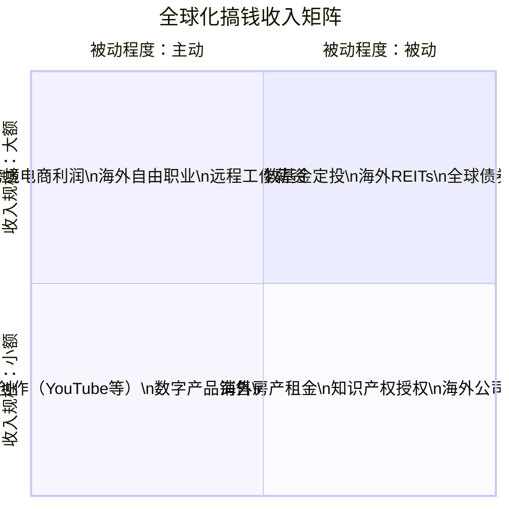

## 八、全球化搞钱的行动清单

前面七节已经系统讲解了全球化搞钱的渠道、策略、工具和进阶技巧。但**知识不落地，等于不知道**。本节将所有内容凝练为一份可执行的行动清单——从今天就能开始的第一步，到一年后构建完整全球资产体系的终极目标，每一步都有明确的动作、时间节点和验收标准。

---

### 8.1 行动总览：四阶段路线图

全球化搞钱不是一蹴而就的事情。它需要循序渐进——先认知、再小额试水、然后系统配置、最后持续优化。整个过程大约需要 6-18 个月，分为四个阶段：


| 阶段 | 时间跨度 | 核心目标 | 完成标志 |
|------|---------|---------|---------|
| **第一阶段：认知准备** | 第1-2周 | 建立全球配置思维，完成自我评估 | 写出自己的投资画像和目标清单 |
| **第二阶段：小额试水** | 第3-8周 | 完成第一笔海外投资或第一笔跨境收入 | 账户开好、第一笔交易完成 |
| **第三阶段：系统配置** | 第3-6月 | 建立完整的全球资产配置方案并执行 | 核心-卫星组合搭建完毕 |
| **第四阶段：持续优化** | 第7-12月+ | 再平衡、税务优化、收入多元化 | 年度回顾机制建立并运行 |

---

### 8.2 第一阶段：认知准备（第1-2周）

这一阶段不花一分钱，但决定了后面所有行动的方向。跳过这一步直接开户，大概率会犯"不知道买什么、买了拿不住、亏了不知道为什么"的错误。

#### 8.2.1 自我评估清单

在做任何投资决策之前，先回答以下问题，形成你的「全球化搞钱投资画像」：

**财务基础评估：**

| 评估项 | 你的答案 | 判断标准 |
|--------|---------|---------|
| 可投资资金总额 | ____ 万元 | <10万：从QDII开始；10-50万：可考虑港股通；>50万：可开海外券商 |
| 紧急备用金是否到位 | 是 / 否 | 必须先留够6个月生活费，再做海外投资 |
| 现有投资组合 | ____ | 列出A股、基金、债券、房产等各占比 |
| 年收入水平 | ____ 万元 | 决定每月可定投金额和风险承受能力 |
| 负债情况 | ____ 万元 | 高利率负债（信用卡、消费贷）必须先还清 |

**能力和认知评估：**

| 评估项 | 你的答案 | 行动建议 |
|--------|---------|---------|
| 英语能力 | 高/中/低/无 | 低或无：优先选中文界面券商（富途、老虎），同时开始学英语 |
| 海外投资知识 | 高/中/低/无 | 低或无：先读本章理论基础，再看2-3本推荐书 |
| 可用时间（每周） | ____ 小时 | <2小时：被动配置为主（QDII定投）；>5小时：可主动选股 |
| 风险偏好 | 保守/稳健/进取 | 保守：债券+黄金为主；稳健：核心-卫星；进取：可加个股和另类 |
| 海外银行账户 | 有 / 无 | 无：先不急，QDII和港股通不需要海外账户 |

#### 8.2.2 知识储备清单

**必读材料（第一周完成）：**

1. 本章理论基础部分——理解"为什么要全球化搞钱"
2. 本章核心技巧第一节「海外投资渠道选择决策图」——找到适合你的路径
3. 本章实战案例中与你最相似的1-2个案例——看看别人怎么做的

**推荐延伸阅读：**

| 书名/资源 | 作者/来源 | 适用人群 | 核心价值 |
|-----------|----------|---------|---------|
| 《全球资产配置》 | Meb Faber | 所有投资者 | 全球配置的经典框架，数据驱动 |
| 《投资最重要的事》 | Howard Marks | 有投资经验者 | 风险认知和逆向思维 |
| 雪球/富途社区的港股美股板块 | 社区 | 中文读者 | 实时信息和经验分享 |
| Investopedia | 网站 | 英语能力中等以上 | 投资术语和概念百科 |
| 《聪明的投资者》 | Benjamin Graham | 价值投资者 | 投资的基本原则 |

#### 8.2.3 工具准备清单

在正式开户和投资之前，先把以下工具准备好：

```text
必备工具：
├── 券商选择（先调研，第二阶段再开户）
│   ├── A股券商：已有（华泰/中信/招商等）
│   ├── 港股通：确认你的A股券商是否支持（50万门槛）
│   ├── 互联网券商：富途牛牛 / 老虎证券 / 盈透证券（三选一调研）
│   └── QDII基金：支付宝 / 天天基金 / 蛋卷基金（零门槛）
│
├── 信息工具
│   ├── 行情软件：富途牛牛（港美股行情免费）
│   ├── 财报查询：巨潮资讯（A股）/ SEC EDGAR（美股）
│   ├── 基金筛选：天天基金网 / 晨星中国
│   └── 宏观数据：世界银行 / IMF / 各国央行官网
│
├── 记录工具
│   ├── 投资记账表：Excel / Notion / 专门的记账App
│   ├── 换汇记录表：记录每次购汇金额、汇率、用途
│   └── 税务记录文件夹：保存所有交易凭证和收据
│
└── 学习工具
    ├── 英语学习：多邻国 / 扇贝（如需提升英语）
    ├── 财报阅读：SEC的10-K/10-Q模板（美股）
    └── 跟踪清单：关注3-5个高质量的投资博主/公众号
```

#### 8.2.4 目标设定模板

用以下模板写下你的全球化搞钱目标——具体、可衡量、有时间限制：

```markdown
## 我的全球化搞钱目标

### 短期目标（3个月内）
- [ ] 开通 ____ 账户（港股/QDII/互联网券商）
- [ ] 完成第一笔海外投资，金额 ____ 元
- [ ] 每月定投 ____ 元到全球配置组合

### 中期目标（6个月内）
- [ ] 海外资产占总投资资产的 ____%
- [ ] 建立核心-卫星配置，核心占 ____%
- [ ] （如有技能）尝试第一个跨境收入项目

### 长期目标（12个月内）
- [ ] 海外资产总额达到 ____ 万元
- [ ] 被动收入中海外部分占比 ____%
- [ ] 建立年度再平衡和税务申报流程

### 我的全球化搞钱路径选择
□ 路径A：纯投资配置（适合有闲置资金、无海外技能者）
□ 路径B：投资+跨境收入（适合有专业技能者）
□ 路径C：跨境电商+投资（适合有货源/供应链资源者）
□ 路径D：全方位布局（适合高净值人群）
```

---

### 8.3 第二阶段：小额试水（第3-8周）

认知准备完成后，是时候迈出第一步了。这个阶段的核心原则是：**用小钱试错，用真实经验替代纸上谈兵。**

#### 8.3.1 投资路径行动清单

**路径A：QDII基金（最简单，零门槛，100元起）**

| 步骤 | 具体动作 | 耗时 | 注意事项 |
|------|---------|------|---------|
| 1 | 打开支付宝/天天基金，搜索"标普500"或"纳斯达克100" | 10分钟 | 选择规模>5亿、费率<1%的基金 |
| 2 | 查看基金详情：跟踪误差、管理费率、历史表现 | 20分钟 | 跟踪误差越小越好，年化偏离<2%为优 |
| 3 | 设置定投：每周/每月自动扣款，金额量力而行 | 5分钟 | 建议先从每月200-500元开始 |
| 4 | 同时关注1-2只其他市场的QDII（如日经225、恒生指数） | 15分钟 | 不要只买美股，实现初步分散 |
| 5 | 记录买入时间、金额、净值，建立投资台账 | 持续 | 为后续税务申报和再平衡做准备 |

**推荐QDII入门组合（仅供参考，不构成投资建议）：**

| 基金类型 | 代表基金（示例） | 建议占比 | 起投金额 | 核心作用 |
|---------|----------------|---------|---------|---------|
| 标普500指数 | 博时标普500ETF联接 | 40% | 100元 | 美国大盘核心配置 |
| 纳斯达克100 | 广发纳斯达克100ETF联接 | 20% | 100元 | 科技成长配置 |
| 恒生指数 | 华夏恒生ETF联接 | 15% | 100元 | 港股配置 |
| 黄金ETF | 华安黄金ETF联接 | 15% | 100元 | 避险对冲 |
| 全球债券 | 南方亚洲美元债 | 10% | 100元 | 稳定器 |

> **注意：** 以上基金仅为示例，展示配置思路。实际投资前请自行研究，根据最新数据做出决策。基金过往表现不代表未来收益。

**路径B：港股通（50万门槛）**

| 步骤 | 具体动作 | 耗时 | 注意事项 |
|------|---------|------|---------|
| 1 | 确认你的A股券商支持港股通 | 5分钟 | 打电话或在App内查询 |
| 2 | 检查账户资产是否满足50万要求 | 5分钟 | 是"证券账户+资金账户"合计 |
| 3 | 在券商App内申请开通港股通权限 | 15分钟 | 需要完成风险测评和知识测试 |
| 4 | 通过港股通买入第一只港股 | 30分钟 | 建议从腾讯、汇丰等蓝筹开始 |
| 5 | 熟悉港股交易规则：T+0、无涨跌停、交易时间 | 1小时 | 港股交易时间比A股长（9:30-16:00） |

**路径C：互联网券商开户（零门槛，直接买港美股）**

| 步骤 | 具体动作 | 耗时 | 注意事项 |
|------|---------|------|---------|
| 1 | 选择券商：富途（中文体验好）/ 老虎（美股费率低）/ 盈透（专业） | 1-2小时调研 | 对比佣金、平台费、出入金方式 |
| 2 | 下载App，开始开户流程 | 30分钟 | 需要身份证/护照、银行卡信息 |
| 3 | 完成身份验证（KYC） | 1-3天 | 通常需要人脸识别+证件拍照 |
| 4 | 入金：通过银行电汇或平台合作渠道 | 1-5天 | 注意每年5万美元购汇额度限制 |
| 5 | 买入第一只港/美股 | 30分钟 | 建议先买ETF（如VOO、QQQ）而非个股 |

#### 8.3.2 跨境收入路径行动清单

如果你有专业技能（编程、设计、写作、翻译、营销等），在投资之外，还可以通过跨境收入直接赚取外币。这是"全球化搞钱"最直接的方式。

**海外自由职业启动清单：**

| 步骤 | 具体动作 | 耗时 | 具体建议 |
|------|---------|------|---------|
| 1 | 评估自身技能的国际市场价值 | 2小时 | 在Upwork/Fiverr搜索你的技能，看别人怎么定价 |
| 2 | 注册1-2个海外自由职业平台 | 1小时 | Upwork（综合）、Fiverr（创意）、Toptal（高端开发） |
| 3 | 完善个人资料和Portfolio | 3-5小时 | 英文资料必须专业，Portfolio放最好的3-5个作品 |
| 4 | 准备跨境收款账户 | 1-2天 | Wise账户最推荐，手续费低、汇率好 |
| 5 | 投标/发布第一个服务 | 持续 | 初期可以低价接2-3个单积累评价 |
| 6 | 获得第一笔美元收入 | 2-4周 | 到账后记录汇率、金额，留好凭证 |

**跨境电商启动清单：**

| 步骤 | 具体动作 | 耗时 | 具体建议 |
|------|---------|------|---------|
| 1 | 选择平台：亚马逊（全球）/ Shopee（东南亚）/ 独立站（Shopify） | 2-3小时调研 | 新手建议从亚马逊FBA开始 |
| 2 | 选品调研 | 1-2周 | 用Jungle Scout/Helium 10分析市场容量和竞争度 |
| 3 | 注册卖家账号 | 3-7天 | 亚马逊需要营业执照、双币信用卡 |
| 4 | 找供应商、打样、下单 | 2-4周 | 1688/阿里巴巴/线下工厂 |
| 5 | 发货到FBA仓库 | 1-2周 | 注意FBA费用计算，确保利润率>30% |
| 6 | 上架优化、开始广告投放 | 持续 | 初期预算每天50-100美元测试 |

---

### 8.4 第三阶段：系统配置（第3-6月）

经过试水阶段，你已经有了实操经验。现在要做的是从"零散尝试"升级为"系统配置"——搭建一个完整的全球资产组合。

#### 8.4.1 核心-卫星配置执行清单

根据你在第一阶段确定的风险偏好，选择对应的配置方案：

**稳健型配置（适合大多数人）：**

| 配置层 | 资产类别 | 占比 | 具体标的（示例） | 执行方式 |
|--------|---------|------|-----------------|---------|
| 核心 | 中国宽基指数 | 30% | 沪深300ETF | 已有，无需调整 |
| 核心 | 美国宽基指数 | 25% | 标普500 QDII / VOO | 按月定投 |
| 核心 | 全球债券 | 10% | 亚洲美元债QDII | 按月定投 |
| 卫星 | 港股蓝筹 | 10% | 腾讯/汇丰/港交所 | 港股通或互联网券商 |
| 卫星 | 黄金 | 10% | 黄金ETF QDII | 一次性配置或分批买入 |
| 卫星 | 新兴市场 | 10% | 印度/越南QDII | 小额配置，观察为主 |
| 卫星 | 现金/货币基金 | 5% | 余额宝/货币基金 | 随时可调用 |

**执行步骤：**

```text
第1步：盘点现有资产（第1周）
  └─ 列出所有投资账户的持仓和市值
  └─ 计算当前的中国/海外/现金比例

第2步：计算差额（第1周）
  └─ 目标比例 - 当前比例 = 需要调整的金额
  └─ 例：目标美股25%，当前0%，需投入总资产的25%

第3步：制定投入计划（第2周）
  └─ 确定每月可投入金额
  └─ 将差额分摊到3-6个月，避免一次性大额换汇
  └─ 注意每年5万美元购汇额度

第4步：逐步建仓（第3周-第6月）
  └─ 每月按计划执行：购汇→转入券商→买入标的
  └─ 不要试图"抄底"，按计划机械执行
  └─ 记录每笔交易的成本、汇率、时间

第5步：检查偏差（每月末）
  └─ 对比实际比例和目标比例
  └─ 偏差超过5个百分点时考虑再平衡
```

#### 8.4.2 外汇管理执行清单

| 执行项 | 具体动作 | 注意事项 |
|--------|---------|---------|
| 开通手机银行购汇功能 | 在银行App内搜索"购汇"，完成风险测评 | 选择"投资"用途需如实申报 |
| 了解年度额度 | 每人每年5万美元便利化额度 | 不要拆分购汇（分多人、多日小额购汇违规） |
| 建立换汇记录表 | 记录每次购汇日期、金额、汇率、用途 | 为年终税务申报做准备 |
| 关注汇率趋势 | 设置汇率提醒，不在汇率极端时集中换汇 | 可用Wise的汇率提醒功能 |
| 了解超额购汇 | 超过5万美元需到银行柜台提供证明材料 | 投资类需提供券商开户证明等 |

#### 8.4.3 记账与监控系统搭建

全球资产配置最怕的是"不知道自己有多少钱、放在哪里"。搭建一套清晰的记账系统至关重要。

**推荐记账方案：**

```text
方案一：Excel/Google Sheets（免费，灵活）
├── Sheet1：资产总览
│   ├── 列：资产类别 / 币种 / 平台 / 买入价 / 当前价 / 盈亏 / 占比
│   └── 每月末更新一次
├── Sheet2：交易记录
│   ├── 列：日期 / 操作 / 标的 / 金额 / 汇率 / 手续费
│   └── 每笔交易后即时记录
├── Sheet3：换汇记录
│   ├── 列：日期 / 金额 / 汇率 / 用途 / 累计额度
│   └── 每次购汇后记录
└── Sheet4：年度汇总
    ├── 各币种资产汇总
    ├── 全年收益计算
    └── 税务申报数据

方案二：专业工具
├── Portfolio Visualizer（portfoliovisualizer.com）—— 回测和分析
├── 富途/老虎的持仓分析功能 —— 实时盈亏
└── Personal Capital（海外用户）—— 全账户聚合
```

---

### 8.5 第四阶段：持续优化（第7-12月+）

系统配置完成后，全球化搞钱进入了"维护和优化"阶段。这个阶段的核心任务有三个：再平衡、税务管理、收入多元化。

#### 8.5.1 再平衡执行清单

| 频率 | 检查内容 | 具体动作 | 触发条件 |
|------|---------|---------|---------|
| 每月 | 各资产占比偏差 | 记录实际比例 vs 目标比例 | 仅记录，不操作 |
| 每季度 | 偏差超过阈值时再平衡 | 卖出超配资产，买入低配资产 | 偏差>5个百分点 |
| 每年 | 全面回顾和方案调整 | 重新评估目标比例，考虑年龄/收入变化 | 12月或1月执行 |
| 重大事件 | 市场剧烈波动时 | 检查是否需要调仓，但不要恐慌操作 | 单日跌幅>7%或涨跌幅>15% |

**再平衡操作模板：**

```markdown
## 再平衡记录 —— ____年____季度

### 当前持仓
| 资产类别 | 目标比例 | 实际比例 | 偏差 | 调整金额 |
|---------|---------|---------|------|---------|
| 中国宽基 | 30% | ____% | ____% | ____元 |
| 美国宽基 | 25% | ____% | ____% | ____元 |
| 全球债券 | 10% | ____% | ____% | ____元 |
| 港股 | 10% | ____% | ____% | ____元 |
| 黄金 | 10% | ____% | ____% | ____元 |
| 新兴市场 | 10% | ____% | ____% | ____元 |
| 现金 | 5% | ____% | ____% | ____元 |

### 操作计划
- 卖出：______________________
- 买入：______________________
- 预计手续费：________________
- 操作时间：__________________
```

#### 8.5.2 税务管理年度清单

| 时间 | 事项 | 具体动作 | 参考 |
|------|------|---------|------|
| 全年持续 | 保存交易凭证 | 所有买卖记录、分红记录、利息记录截图存档 | 电子+纸质双备份 |
| 全年持续 | 记录换汇信息 | 每次购汇的金额、汇率、用途 | 配合外汇管理 |
| 1-3月 | 个税汇算清缴 | 在"个人所得税"App中申报海外收入 | 包括利息、分红、资本利得 |
| 1-3月 | 抵免已缴外国税款 | 如在海外已缴税，可在国内申报时抵免 | 需提供海外完税证明 |
| 6月 | CRS信息交换 | 了解你的海外账户信息是否已被交换给中国税务机关 | 无需操作，但要心中有数 |
| 12月 | 年度税务规划 | 评估下一年的税务优化空间 | 可咨询专业税务师 |

> **重要提醒：** 中国税务居民的全球收入都需要在中国申报纳税。包括：海外股息收入（税率20%）、海外利息收入（税率20%）、海外资本利得（目前实操中对个人股票资本利得的征管尚不严格，但法律上应申报）。不要心存侥幸，合规永远是底线。

#### 8.5.3 跨境收入进阶清单

如果你在第二阶段已经开始了跨境收入，这个阶段要做的是扩大规模和多元化：

**自由职业者进阶路线：**

```text
月入0-5000美元（起步期）
├── 目标：积累5-10个好评，建立口碑
├── 动作：每天投3-5个标，不挑价格，重评价
└── 时间：3-6个月

月入5000-15000美元（成长期）
├── 目标：提高单价，筛选优质客户
├── 动作：涨价30-50%，拒绝低价单，建立回头客
├── 时间：6-12个月
└── 工具：建立个人网站展示Portfolio

月入15000美元以上（成熟期）
├── 目标：从自由职业者转型为小工作室/agency
├── 动作：外包部分工作，聚焦高端客户
├── 考虑：注册海外公司（如香港/新加坡），优化税务
└── 时间：12个月以上
```

**跨境电商进阶路线：**

```text
月销0-1万美元（验证期）
├── 目标：验证选品，跑通全流程
├── 动作：1-3个SKU，小批量测试
└── 关键指标：退货率<5%，好评率>4.5

月销1-5万美元（增长期）
├── 目标：扩展SKU，优化供应链
├── 动作：增加到5-10个SKU，谈更好的采购价
├── 关键指标：毛利率>30%，广告ACOS<25%
└── 考虑：注册商标，做品牌化

月销5万美元以上（规模化）
├── 目标：多平台运营，品牌建设
├── 动作：拓展到Shopify独立站、其他电商平台
├── 考虑：注册海外公司，优化物流和税务
└── 关键指标：复购率>15%，品牌搜索量增长
```

#### 8.5.4 收入多元化矩阵

真正的"全球化搞钱"不是只有投资收益，而是构建一个多元化的全球收入体系：



| 收入类型 | 代表形式 | 启动难度 | 维护难度 | 收入上限 | 建议优先级 |
|---------|---------|---------|---------|---------|-----------|
| 投资收益 | QDII分红、港美股股息 | 低 | 低 | 取决于本金 | ★★★★★（所有人） |
| 跨境自由职业 | Upwork接单、海外咨询 | 中 | 中 | 取决于技能和时间 | ★★★★（有技能者） |
| 跨境电商 | 亚马逊/Shopify | 高 | 高 | 可规模化 | ★★★（有供应链者） |
| 内容创作 | YouTube、付费Newsletter | 中 | 中 | 可规模化 | ★★★（有内容能力者） |
| 远程工作 | 海外公司远程岗位 | 中 | 低（稳定薪资） | 取决于岗位 | ★★★★（技术人才） |

---

### 8.6 不同人群的快速行动清单

不同背景的读者，起点和路径完全不同。以下是针对四类典型人群的"最小可行行动方案"——从今天就开始的、不需要太多前置条件的具体步骤。

#### 8.6.1 投资新手（资产<10万）

```text
今天就做（30分钟内）：
  □ 打开支付宝，搜索"标普500指数基金"
  □ 选一只规模>5亿的基金，设置每月200元定投
  □ 同样操作，再设一只"恒生指数基金"定投，每月100元

本周做（共2小时）：
  □ 下载富途牛牛App，注册账号（免费）
  □ 浏览港美股行情，熟悉界面
  □ 阅读本章理论基础部分

本月做（共5小时）：
  □ 读完本章核心技巧部分
  □ 在富途上建立一个"自选列表"，加入10只你感兴趣的海外股票/ETF
  □ 记录本月定投的金额和净值，建立投资台账

三个月后检查：
  □ 累计投入了多少？
  □ 海外资产占总资产比例是多少？
  □ 是否想进一步（开港股通/互联网券商）？
```

#### 8.6.2 有投资经验的中级投资者（资产10-50万）

```text
今天就做（1小时内）：
  □ 列出当前所有投资持仓，计算中国/海外/现金的比例
  □ 确定目标比例（参考8.4.1的稳健型配置方案）
  □ 计算差额，制定3-6个月的调整计划

本周做（共3小时）：
  □ 如果没有QDII持仓：在基金平台买入第一只标普500 QDII
  □ 调研互联网券商（富途/老虎/盈透），对比佣金和功能
  □ 了解港股通开通条件，看是否满足50万门槛

本月做（共8小时）：
  □ 开通互联网券商账户（或港股通）
  □ 入金并买入第一只港股/美股（建议先买ETF）
  □ 搭建Excel记账系统（参考8.4.3的模板）
  □ 建立每月再平衡检查的习惯

三个月后检查：
  □ 核心-卫星组合是否按计划搭建？
  □ 海外资产占比是否达到目标？
  □ 记账系统是否在正常运转？
```

#### 8.6.3 有专业技能的互联网从业者

```text
今天就做（1小时内）：
  □ 在Upwork注册账号，浏览与你技能匹配的项目
  □ 记录3-5个你想接的项目的客户要求和预算范围

本周做（共5小时）：
  □ 完善Upwork/Fiverr个人资料（英文）
  □ 准备3-5个作品的Portfolio
  □ 注册Wise账户，了解跨境收款流程
  □ 投标第一个项目（可以低价甚至免费试做）

本月做（共15小时）：
  □ 完成2-3个小项目，积累好评
  □ 根据市场反馈调整定价策略
  □ 同步开始：用QDII做小额投资（每月500-1000元）
  □ 学习基本的外汇知识和跨境税务知识

三个月后检查：
  □ 获得了几笔美元收入？总计多少？
  □ 收入渠道是否稳定（是否有回头客）？
  □ 是否想扩大规模（提价/拓展平台）？
  □ 投资部分是否在按计划执行？
```

#### 8.6.4 高净值人群（资产>200万）

```text
今天就做：
  □ 联系专业税务师/财务顾问，预约一次全球资产配置咨询
  □ 列出所有境内外资产清单（含房产、保险、信托等）

本周做：
  □ 评估现有资产的全球分散程度
  □ 了解CRS对你海外资产的影响
  □ 调研海外公司注册地（香港/新加坡/其他）

本月做：
  □ 制定完整的全球资产配置方案（可请专业顾问协助）
  □ 开通盈透证券（Interactive Brokers）账户——最专业的全球投资平台
  □ 开始执行配置方案的第一批交易
  □ 评估是否需要设立海外公司或信托架构

三个月后检查：
  □ 全球配置方案是否在按计划执行？
  □ 税务结构是否已优化？
  □ 是否需要调整策略（根据市场变化和个人情况）？
```

---

### 8.7 风险控制检查清单

全球化搞钱的风险控制不是一次性的事情，而是贯穿始终的持续检查。以下是每个月/每个季度应该执行的检查项。

#### 8.7.1 月度风险检查

| 检查项 | 合格标准 | 不合格时的行动 |
|--------|---------|---------------|
| 紧急备用金 | ≥6个月生活费，且在国内账户 | 暂停海外投资，先补齐备用金 |
| 单一资产占比 | 任何单一标的<总资产20% | 卖出超配部分，分散到其他资产 |
| 汇率敞口 | 外币资产<总资产50% | 评估是否需要增加人民币资产 |
| 换汇额度使用 | 当年已用额度<4万美元 | 留足余额应对突发需求 |
| 收入来源 | 至少2个收入来源 | 加速开拓新的收入渠道 |

#### 8.7.2 季度风险检查

| 检查项 | 合格标准 | 不合格时的行动 |
|--------|---------|---------------|
| 资产配置偏差 | 各类别偏差<5个百分点 | 执行再平衡 |
| 交易记录完整性 | 每笔交易都有记录 | 补录缺失的记录 |
| 海外账户安全 | 已启用双因素认证 | 立即启用所有账户的2FA |
| 合规检查 | 换汇用途申报准确 | 更正申报信息 |
| 投资知识更新 | 关注了重要政策变化 | 阅读相关政策文件和分析 |

#### 8.7.3 年度风险检查

| 检查项 | 合格标准 | 不合格时的行动 |
|--------|---------|---------------|
| 税务申报 | 已完成年度汇算清缴 | 尽快补报，避免滞纳金 |
| 全年收益回顾 | 计算了各类资产的真实收益 | 整理数据，计算年化收益 |
| 配置方案评估 | 根据生活变化调整了配置方案 | 重新评估风险偏好和目标 |
| 海外账户审计 | 确认所有账户余额和记录一致 | 对账，查找差异原因 |
| 知识体系更新 | 学习了至少2本投资新书/课程 | 制定下一年的学习计划 |

---

### 8.8 常见执行障碍与解决方案

知道"该做什么"和"真正去做"之间，往往隔着一些实际障碍。以下是读者最常遇到的执行障碍和对应的解决方案。

| 障碍 | 具体表现 | 解决方案 |
|------|---------|---------|
| **"没钱投资"** | 每月结余很少，觉得不值得做 | 100元就能买QDII，关键不是金额而是习惯。每月定投100元，一年后你会感谢今天的自己 |
| **"英语不好"** | 看不懂英文财报/平台界面 | 富途/老虎是全中文界面；QDII基金用支付宝就能买。英语可以边做边学，不要等"准备好了"再开始 |
| **"怕亏钱"** | 担心海外投资亏损 | 先用最小金额试水（100-500元），亏损也是学费。全球分散配置本身就是降低风险的手段 |
| **"太复杂了"** | 步骤太多，不知道从哪开始 | 回到8.6节，找到你对应的人群，只做"今天就做"那3步。完成后再做下一步 |
| **"政策会不会变"** | 担心外汇管制收紧、QDII限购 | 这正是"现在就开始"的理由——政策窗口期不等人。已经在途的投资通常不受新规影响 |
| **"时间不够"** | 工作忙，没时间研究 | QDII定投每月只需5分钟。被动配置的核心就是"少花时间，长期持有" |
| **"不知道买什么"** | 标的太多，选择困难 | 先只买标普500 QDII这一只。等你有了第一笔投资的经验，自然会有动力去研究更多 |
| **"家人反对"** | 配偶/父母不理解为什么要"把钱放到国外" | 用本章理论基础的数据说服他们：全球配置降低风险，不是"把钱转走"。先从小金额开始证明效果 |

---

### 8.9 进阶里程碑与自我评估

当你完成了前面所有阶段后，用以下里程碑来评估自己的"全球化搞钱"水平：

#### 青铜级：全球配置入门者

```text
达成条件（满足3项即可）：
  □ 持有至少1只QDII基金
  □ 了解标普500、恒生指数、日经225等基本概念
  □ 知道自己每年有5万美元购汇额度
  □ 能区分港股通和互联网券商的区别
  □ 有一个投资记账的习惯
```

#### 白银级：全球配置实践者

```text
达成条件（满足4项即可）：
  □ 海外资产占总投资资产的10%以上
  □ 持有至少3个不同市场的资产
  □ 开通了港股通或互联网券商账户
  □ 执行过至少1次再平衡操作
  □ 完成了海外投资收益的税务申报
  □ 有稳定的跨境收入来源
```

#### 黄金级：全球化搞钱达人

```text
达成条件（满足4项即可）：
  □ 海外资产占总投资资产的30%以上
  □ 持有5个以上不同市场的资产
  □ 有至少2个海外收入渠道（投资+跨境收入）
  □ 建立了完整的记账和税务管理系统
  □ 了解CRS和跨境税务的基本框架
  □ 能够独立分析一个海外投资标的
```

#### 钻石级：全球化财富架构师

```text
达成条件（满足3项即可）：
  □ 全球资产配置涵盖投资、收入、税务三个维度
  □ 有海外公司或信托架构
  □ 与专业税务/法律顾问建立了合作关系
  □ 被动收入中海外部分占比超过30%
  □ 能够指导他人进行全球化资产配置
```

---

### 8.10 一页纸行动清单速查版

以下是精简版行动清单，可以打印出来贴在墙上，每天对照检查：

```markdown
┌─────────────────────────────────────────────────────────────┐
│              全球化搞钱 · 一页纸行动清单                       │
├─────────────────────────────────────────────────────────────┤
│                                                             │
│  □ 今天：选一条路径（QDII / 港股 / 自由职业 / 电商）          │
│  □ 本周：完成第一个动作（买基金 / 注册平台 / 投第一个标）      │
│  □ 本月：建立记账习惯，记录每笔交易                           │
│  □ 三月：检查进度，调整计划                                   │
│  □ 半年：核心-卫星组合搭建完成                                │
│  □ 一年：再平衡 + 税务申报 + 评估升级                         │
│                                                             │
│  核心原则：                                                  │
│  1. 先开始，再优化                                           │
│  2. 小额试错，大额配置                                       │
│  3. 分散是免费的午餐——用好它                                 │
│  4. 合规是底线——不踩红线                                     │
│  5. 长期主义——时间是最好的朋友                               │
│                                                             │
│  每月自问：                                                  │
│  · 我的海外资产占比是多少？                                  │
│  · 本月有没有新的收入渠道？                                  │
│  · 交易记录是否完整？                                        │
│  · 有没有学到新的知识？                                      │
│                                                             │
└─────────────────────────────────────────────────────────────┘
```

---

### 8.11 本节小结

全球化搞钱的行动清单，本质上是一个**从认知到执行、从试水到体系化、从被动到主动**的渐进式路线图。总结核心要点：

1. **不要等"准备好了"再开始**——100元买QDII标普500，就是你全球化搞钱的第一步。完美主义是行动的最大敌人。

2. **小额试错，系统配置**——先用小钱验证路径，再用大钱搭建体系。不要一上来就ALL IN。

3. **记账比投资更重要**——没有清晰的记录，你不知道自己赚了多少、亏了多少、该交多少税。

4. **再平衡是纪律，不是判断**——按计划执行，不要凭感觉调仓。市场短期波动不是再平衡的理由。

5. **合规是生命线**——外汇管制、税务申报、CRS信息交换，每一条都是硬约束。侥幸心理的代价远大于合规成本。

6. **全球化搞钱是一场马拉松**——不是3个月见效的项目，而是3-5年才能充分体现出优势的长期策略。耐心，是你最重要的投资工具。

> 📌 **最后的提醒：** 这份清单不是读完就扔的文件。把它保存下来，每个月回顾一次，对照自己的进度。一年后，你会惊讶于自己走了多远。全球化搞钱的最大障碍，从来不是资金门槛或技术难度——而是"等一等再说"的拖延。**现在就开始。**
