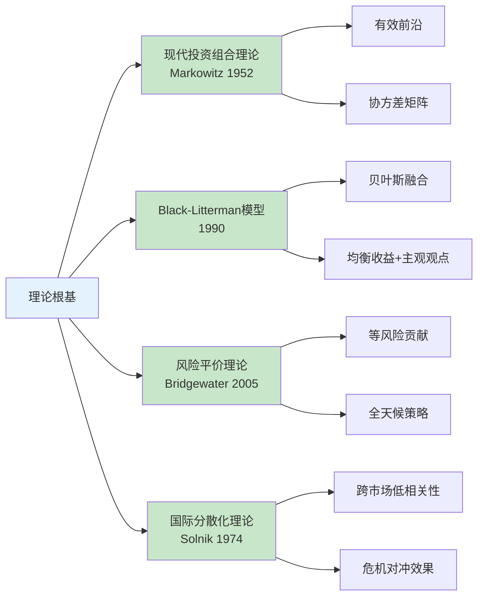
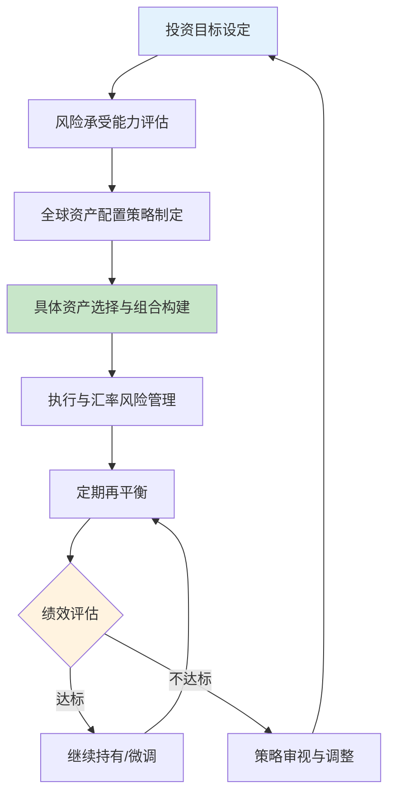
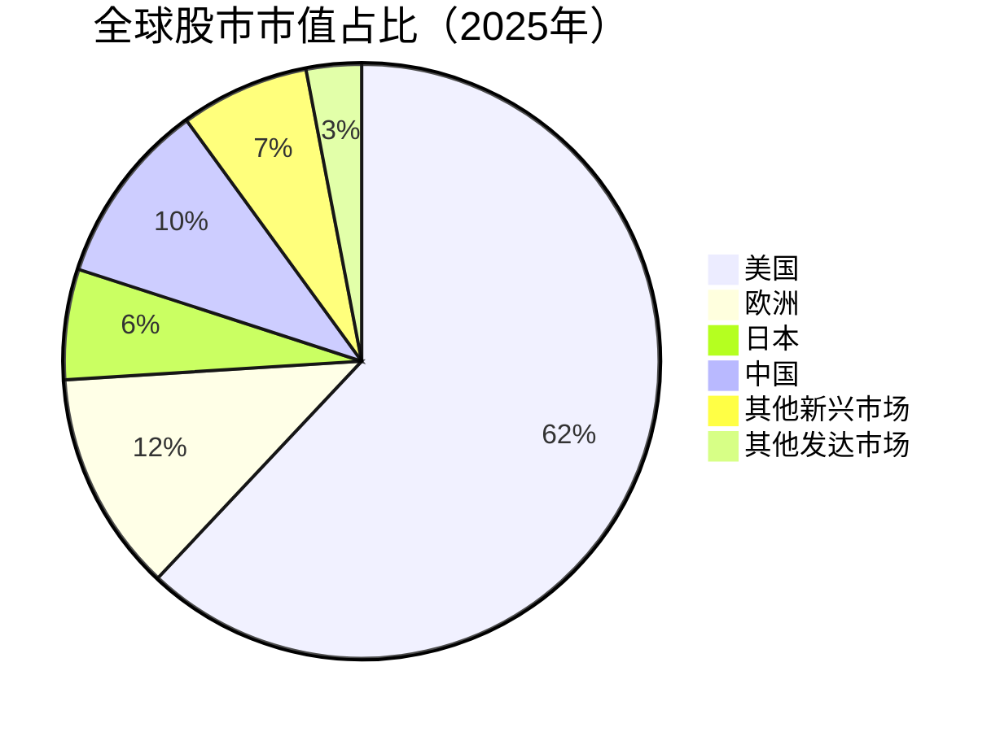
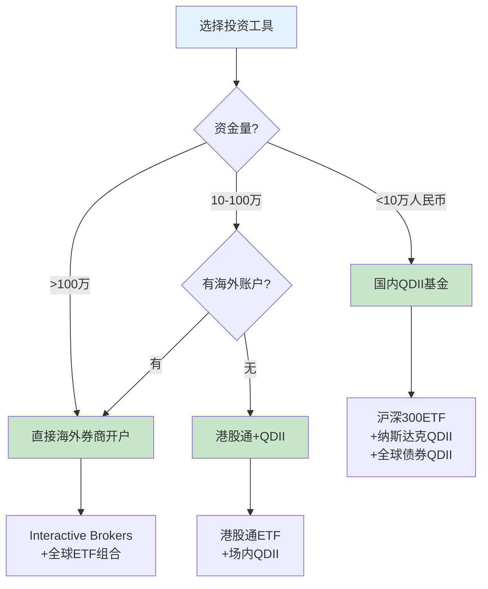
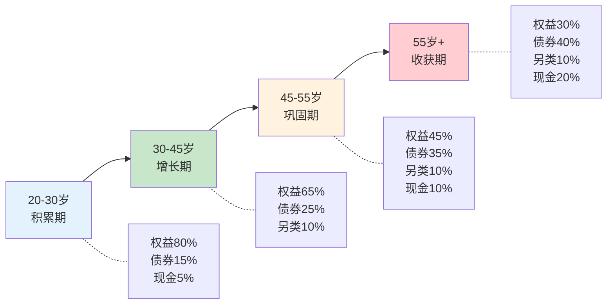
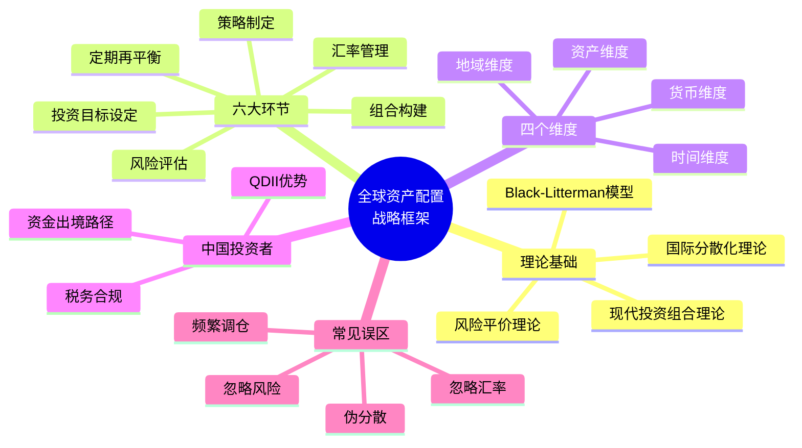

## 零、全球资产配置战略框架

在进入具体的投资工具和操作技巧之前，你需要先建立一个完整的**战略框架**。这个框架不是某一种具体的投资策略，而是一套思考方式——它帮助你在面对"该买什么""该投多少""该投哪里"这些问题时，有一条清晰的决策路径。

### 1. 什么是全球资产配置

#### 1.1 定义与本质

全球资产配置（Global Asset Allocation）是指投资者将资金分散配置到**不同国家、不同市场、不同资产类别**的投资组合构建过程。它的核心目标不是追求某一笔投资的最高回报，而是在给定风险水平下实现**整体组合回报最大化**。

举个最朴素的比喻：你不会把所有的钱都存在一家银行，同样，你也不应该把所有的钱都投在一个国家、一种资产里。当中国经济放缓时，美国可能在增长；当股票市场暴跌时，债券和黄金可能在上涨。全球资产配置的本质就是利用这种**经济周期的错位**来平滑你的收益曲线。

#### 1.2 与单一市场投资的根本区别

| 维度 | 单一市场投资 | 全球资产配置 |
|------|------------|-------------|
| 风险来源 | 集中于一个经济体 | 分散于多个经济体 |
| 收益驱动 | 依赖单一市场周期 | 多周期叠加，平滑收益 |
| 汇率风险 | 无（本币计价） | 有（多币种敞口） |
| 政策风险 | 高（一国政策变动即受影响） | 低（多国政策对冲） |
| 信息优势 | 本地信息获取容易 | 需要跨市场研究能力 |
| 交易成本 | 低 | 较高（跨境手续费、汇兑成本） |
| 税务复杂度 | 简单 | 复杂（多国税制） |
| 适合人群 | 初级投资者、资金量小 | 有一定资金量和认知基础的投资者 |

#### 1.3 全球资产配置的理论根基

全球资产配置并非拍脑袋的分散投资，它有坚实的学术理论支撑：

**现代投资组合理论（Modern Portfolio Theory, MPT）**

1952年，哈里·马科维茨（Harry Markowitz）在其博士论文中首次提出了均值-方差优化模型。核心思想是：通过将不完全正相关的资产组合在一起，可以在**不降低预期收益的情况下降低组合波动率**，或者在**给定风险水平下最大化收益**。这就是著名的"有效前沿"（Efficient Frontier）概念。

MPT 的数学表达：组合方差不是各资产方差的加权平均，而是要考虑资产间的**协方差**（相关性）。当两种资产的相关系数低于1时，组合的波动率就一定低于加权平均波动率。相关性越低，分散效果越好。

**为什么全球配置比国内分散更有效？** 因为同一国家内的资产（如A股的不同行业）相关性往往很高——2015年A股股灾时，几乎全部行业都在跌。但A股与美股的相关系数长期在0.3-0.5之间，A股与欧洲股市的相关性更低。这种**跨市场的低相关性**是全球配置的核心优势。

**布莱克-利特曼模型（Black-Litterman Model）**

1990年，高盛的Fischer Black和Robert Litterman改进了MPT的一个关键缺陷：均值-方差优化对输入参数（预期收益率）极其敏感，微小的估计误差会导致极端的配置结果。Black-Litterman模型的做法是：先用市场均衡收益率作为"先验"（即假设市场是有效的），然后让投资者在此基础上表达自己的**主观观点**（如"我认为未来三年中国市场会跑赢美国市场"），通过贝叶斯方法将两者融合，得到更稳健的配置建议。

这个模型的实际意义是：它告诉你**不要完全依赖历史数据**来做预测，而是要结合你自己的判断，并且用系统化的方式将主观判断嵌入到量化框架中。

**风险平价理论（Risk Parity）**

2005年前后，桥水基金的Ray Dalio推广了风险平价策略。传统组合按资金量分配（如60%股票+40%债券），但股票的风险贡献远大于债券——60/40组合中，股票贡献了90%以上的风险。风险平价的做法是：按**风险贡献相等**来分配权重。由于债券波动率远低于股票，风险平价组合中债券的权重会非常高，通常需要加杠杆来提升收益。

**全天候策略（All Weather Strategy）** 就是风险平价的典型应用，它将经济环境分为四种状态（增长上行/下行 × 通胀上行/下行），每种状态配置相应的资产，确保在任何宏观环境下都不会遭受重大损失。

**国际分散化理论（International Diversification）**

Solnik（1974）的开创性研究表明：在国际范围内分散投资可以显著降低组合风险，且效果远优于仅在国内分散。后续研究（如Baca et al. 2000, Eun & Shim 1989）进一步证实：尽管全球化使得市场间相关性有所上升，但跨市场分散的好处依然存在，尤其在危机时刻（2008年金融危机期间，新兴市场与发达市场的走势出现明显分化）。

### 2. 全球资产配置的战略框架全景

#### 2.1 框架总览

一个完整的全球资产配置战略框架包含六个核心环节，它们形成一个闭环：

下面逐一展开每个环节。

#### 2.2 环节一：投资目标设定

投资目标是整个框架的起点，它决定了后续所有决策的方向。目标设定需要回答三个核心问题：

**时间维度：你的钱要用在什么时候？**

- **短期目标（1-3年）**：如旅行基金、买车首付。这类目标对资金安全性要求高，应以低波动资产为主（货币基金、短期债券）
- **中期目标（3-10年）**：如子女教育、创业启动金。可以承受适度波动，配置一定比例的权益类资产
- **长期目标（10年以上）**：如退休养老。时间跨度长意味着可以承受更大波动，长期来看权益类资产的回报显著优于固定收益

**金额维度：你需要多少钱？**

不要只说"越多越好"。具体化：我需要在15年后有500万人民币的退休金，目前有100万本金。这样就能计算出需要的年化收益率，然后判断这个收益率目标是否现实。

**约束维度：有哪些限制条件？**

- 流动性需求：是否需要随时取用部分资金？
- 税务身份：是否涉及多个国家的税务申报？
- 合规限制：中国大陆居民每年5万美元购汇额度的约束
- 认知边界：你对哪些市场有足够了解？

#### 2.3 环节二：风险承受能力评估

风险承受能力由两个维度决定：**客观能力**和**主观意愿**。

**客观风险承受能力**取决于：

- 收入稳定性：公务员vs自由职业者，前者能承受更大波动
- 资产规模：100万和1000万的投资者，能承受的绝对损失额不同
- 负债水平：有高额房贷的投资者风险承受能力更低
- 年龄：25岁和55岁的人，投资时间窗口完全不同
- 家庭结构：单身vs上有老下有小的中年人

**主观风险承受意愿**取决于：

- 心理特质：面对20%的亏损能否安睡？
- 投资经验：新手和老手对波动的耐受度不同
- 信息获取能力：越了解市场越不容易恐慌

**关键原则：你的配置应该由客观能力决定，而不是主观意愿。** 如果你主观上想激进投资但客观上承受不起亏损（比如有房贷且收入不稳定），就应该以客观能力为准。很多人在牛市时自认为是"激进型投资者"，熊市一来才发现自己根本受不了。

一个实用的评估框架：

| 风险等级 | 适合人群 | 权益类资产占比 | 最大可接受回撤 |
|---------|---------|--------------|--------------|
| 保守型 | 退休人士、短期目标 | 10-20% | 5-10% |
| 稳健型 | 收入稳定的中年人 | 30-50% | 10-20% |
| 平衡型 | 有一定积蓄的上班族 | 50-70% | 20-30% |
| 成长型 | 年轻、收入增长潜力大 | 70-90% | 30-40% |
| 激进型 | 高净值、投资经验丰富 | 90-100% | 40%+ |

#### 2.4 环节三：全球资产配置策略制定

这是框架的核心。你需要决定在不同市场、不同资产类别之间如何分配资金。

**资产类别的选择**

全球可投资的资产类别远比国内丰富：

| 资产类别 | 代表标的 | 预期收益特征 | 风险特征 | 典型作用 |
|---------|---------|------------|---------|---------|
| 发达市场股票 | 标普500、纳斯达克100、欧洲斯托克50 | 长期年化8-10% | 高波动 | 核心增长引擎 |
| 新兴市场股票 | MSCI新兴市场、沪深300、印度Nifty50 | 长期年化10-12% | 极高波动 | 高增长潜力 |
| 全球债券 | 美国国债、投资级公司债 | 年化3-5% | 低波动 | 稳定器、危机对冲 |
| 房地产（REITs） | 全球REITs指数、新加坡REITs | 年化6-8% | 中等波动 | 抗通胀、稳定现金流 |
| 大宗商品 | 黄金、原油、铜 | 周期性强 | 中高波动 | 通胀对冲、危机避险 |
| 加密资产 | 比特币、以太坊 | 极高（但也可能归零） | 极高波动 | 投机/另类配置 |

**地域配置的基本框架**

全球股市中，美国占据了约62%的市值。这意味着如果你完全不投美股，你实际上是在做一个非常大的**反向押注**。全球配置的一个基本出发点是：不要与全球资本市场的权重做太大偏离，除非你有明确的理由。

**经典配置模型参考：**

- **标普500+全球债券（60/40）**：最经典的入门配置，简单有效
- **全天候策略**：25%股票+25%长期国债+25%中期国债+7.5%黄金+7.5%大宗商品+10%新兴市场债券
- **永久组合**：25%股票+25%长期国债+25%黄金+25%现金，每种资产应对一种经济环境
- **全球市场组合**：按全球市值权重配置所有可投资资产，最"正确"的理论配置

#### 2.5 环节四：组合构建

策略制定后，需要转化为具体的持仓。这一步要解决：**买什么、买多少、在哪里买**。

**工具选择的决策树：**

**组合构建的关键原则：**

1. **核心-卫星策略**：70-80%配置在低成本、宽基指数ETF上（核心），20-30%配置在你看好的特定市场或主题上（卫星）
2. **避免过度分散**：持有30只不同ETF并不能让你更安全，反而增加管理难度和成本。5-10只覆盖全球主要市场的ETF通常就够了
3. **关注费率**：全球配置涉及多层费用——基金管理费、交易佣金、汇兑成本。每年多付0.5%的费用，30年后的差异是惊人的

#### 2.6 环节五：汇率风险管理

全球配置绕不开汇率问题。当你持有美元资产时，人民币升值会侵蚀你的收益，人民币贬值则会增厚你的收益。

**汇率风险的量化影响：**

假设你投资了标普500，一年涨了10%，但同期人民币对美元升值了5%，那么你的实际收益（以人民币计）只有约4.76%（1.10/1.05-1）。反过来，如果人民币贬值5%，你的实际收益就变成约15.24%。

**管理汇率风险的三种策略：**

| 策略 | 做法 | 优点 | 缺点 |
|------|------|------|------|
| 自然对冲 | 不做任何对冲，接受汇率波动 | 零成本，长期汇率波动相互抵消 | 短期可能大幅偏离预期 |
| 货币分散 | 持有多种货币资产（美元、欧元、日元等） | 分散单一货币风险 | 管理复杂 |
| 金融对冲 | 使用外汇远期、期权等工具 | 精确控制汇率敞口 | 有对冲成本（通常每年1-3%） |

**对于大多数个人投资者，推荐"自然对冲+货币分散"的组合策略**，原因如下：
- 长期来看（10年+），汇率波动的影响远小于资产本身的价格波动
- 金融对冲的成本在低利率环境下可能吃掉大部分收益
- 货币分散本身就是全球配置的应有之义

#### 2.7 环节六：定期再平衡

再平衡（Rebalancing）是全球资产配置中最容易被忽视但最重要的环节之一。

**为什么需要再平衡？**

假设你初始配置为60%美股+40%全球债券。一年后美股大涨20%，债券只涨了3%，你的实际配置变成了65%/35%。如果不调整，你的风险敞口会越来越大——这恰好与"低买高卖"的原则相反。

再平衡的本质是**纪律化的逆向投资**：卖出涨得多的（减仓高位资产），买入涨得少的（加仓低位资产）。

**再平衡的频率与方法：**

| 方法 | 操作方式 | 适合场景 |
|------|---------|---------|
| 日历再平衡 | 每季度/半年/年固定调整一次 | 简单易行，适合大多数人 |
| 阈值再平衡 | 任何一类资产偏离目标超过5%时触发 | 更精准，但需要定期监控 |
| 现金流再平衡 | 新增资金投入偏离目标的资产 | 不需要卖出，降低交易成本 |

**最推荐的方法是"现金流再平衡+年度阈值检查"的组合**：日常用新增资金调整偏离，每年检查一次整体配置，偏离超过5个百分点时做一次卖出再平衡。

### 3. 战略框架的实施路径

#### 3.1 不同资金量的实施策略

| 资金量 | 建议策略 | 具体做法 |
|-------|---------|---------|
| 5万以下 | 国内QDII起步 | 1-2只宽基QDII（纳斯达克100+全球债券） |
| 5-30万 | 港股通+QDII | 港股通买恒生科技+QDII买标普500+全球债券 |
| 30-100万 | 海外券商开户 | 通过盈透证券等直接买全球ETF |
| 100万以上 | 专业配置 | 考虑专业顾问，使用Black-Litterman模型定制配置 |

#### 3.2 不同人生阶段的配置演变

#### 3.3 从理论到行动的检查清单

在开始实际投资之前，对照以下清单确认你已经准备就绪：

1. **目标清晰**：明确知道为什么要做全球配置，目标收益率和时间窗口是多少
2. **风险评估完成**：做过风险承受能力评估，知道自己的最大可接受回撤
3. **资金到位**：有至少3-6个月的应急资金（这部分不参与投资）
4. **账户准备**：已开通所需的海外投资账户（或QDII基金账户）
5. **配置方案确定**：已经制定了具体的资产类别和地域配置比例
6. **工具选好**：已经选定了具体的ETF或基金产品
7. **再平衡规则明确**：确定了再平衡的频率和触发条件
8. **税务方案清晰**：了解投资收益在各相关国家的税务处理方式

### 4. 全球资产配置的核心维度

要真正理解全球资产配置，需要从四个核心维度来思考：**地域维度、资产维度、时间维度、货币维度**。这四个维度相互交织，共同决定你的投资组合表现。

#### 4.1 地域维度：投哪些国家/地区

全球200多个国家和地区，并不是每个都值得投资。从流动性和制度成熟度来看，主要投资目的地可以分为三个梯队：

**第一梯队：发达市场（占全球可投资市值约80%）**

| 市场 | 代表性指数 | 特点 | 配置建议 |
|------|----------|------|---------|
| 美国 | 标普500、纳斯达克100 | 全球最大的资本市场，科技股集中度高 | 核心配置，20-40% |
| 欧洲 | 欧洲斯托克50 | 传统行业（金融、工业、医药）占比高 | 10-20% |
| 日本 | 日经225 | 出口导向型经济，日元贬值利好出口企业 | 5-10% |
| 澳大利亚 | ASX200 | 资源型经济，高股息率 | 3-5% |

**第二梯队：新兴市场（增长潜力大但波动也大）**

| 市场 | 代表性指数 | 特点 | 配置建议 |
|------|----------|------|---------|
| 中国 | 沪深300、恒生指数 | 全球第二大经济体，政策影响大 | 5-15% |
| 印度 | Nifty50 | 人口红利，内需驱动 | 3-8% |
| 东南亚 | 越南VN30、印尼综指 | 产业链转移受益者 | 2-5% |
| 巴西/拉美 | IBOVESPA | 资源型经济，与大宗商品周期高度相关 | 1-3% |

**第三梯队：前沿市场（高风险高回报）**

包括非洲（尼日利亚、肯尼亚）、中东（沙特、阿联酋）、越南等。这些市场通常通过专业基金参与，不建议个人投资者直接操作。

#### 4.2 资产维度：投什么类型

前文已详述，这里补充一个关键概念——**资产间的相关性矩阵**。这是全球配置的数学基础：

| | 美股 | 欧股 | A股 | 美债 | 黄金 | 商品 |
|---|------|------|------|------|------|------|
| 美股 | 1.00 | 0.75 | 0.35 | -0.20 | 0.05 | 0.30 |
| 欧股 | 0.75 | 1.00 | 0.30 | -0.15 | 0.08 | 0.35 |
| A股 | 0.35 | 0.30 | 1.00 | -0.05 | 0.10 | 0.25 |
| 美债 | -0.20 | -0.15 | -0.05 | 1.00 | 0.30 | -0.10 |
| 黄金 | 0.05 | 0.08 | 0.10 | 0.30 | 1.00 | 0.40 |
| 商品 | 0.30 | 0.35 | 0.25 | -0.10 | 0.40 | 1.00 |

*注：以上为长期历史相关性的近似值，实际相关性会随时间变化。*

从表中可以看到：
- **美股与A股相关性较低（0.35）**：这正是全球配置的价值所在
- **美股与美债负相关（-0.20）**：经典的"股债对冲"效果
- **黄金与大多数资产低相关**：天然的分散化工具

#### 4.3 时间维度：什么时候投

**择时是投资中最难的事之一。** 学术研究反复证明：即使是专业基金经理，长期择时的成功率也不超过50%。但这不意味着时间维度不重要——它体现在两个方面：

**定投（Dollar-Cost Averaging）**

如果你有一笔大额资金（比如100万），不要一次性全部投入。研究表明：将资金分成12-24份，每月定投一次，可以显著降低"买在最高点"的风险。虽然在持续上涨的市场中定投的收益会低于一次性投入，但它大幅降低了最坏情况的损失。

**再平衡的时间节奏**

如前所述，再平衡是纪律化的逆向投资。建议至少每年做一次全面的再平衡检查，同时用日常的新增资金做微调。

#### 4.4 货币维度：持有哪些货币

货币配置是全球资产配置中经常被忽略但非常重要的一个维度。你持有的资产以什么货币计价，实际上也是一种投资决策。

**主要货币的风险特征：**

| 货币 | 长期趋势 | 适合场景 |
|------|---------|---------|
| 美元 | 全球储备货币，长期稳定 | 核心配置货币 |
| 欧元 | 波动较大，受欧盟政治影响 | 适度配置 |
| 日元 | 低利率，通常在风险事件中升值 | 避险配置 |
| 人民币 | 有管制，长期走势取决于政策 | 本地资产配置 |
| 新加坡元 | 稳定，亚洲资产计价 | 东南亚配置 |
| 瑞士法郎 | 传统避险货币 | 避险配置 |

### 5. 案例分析：一个典型的全球配置方案

#### 案例：30岁互联网从业者，100万可投资资产

**背景假设：**
- 年龄30岁，已婚无子女
- 家庭年收入60万人民币
- 有房有贷，月供8000
- 可投资资产100万
- 风险承受能力：成长型
- 投资期限：15年以上（退休目标）

**配置方案：**

| 资产类别 | 配置比例 | 具体标的 | 金额 |
|---------|---------|---------|------|
| 美股（标普500） | 25% | VOO或SPY（QDII） | 25万 |
| 美股（科技） | 10% | QQQ（QDII） | 10万 |
| 港股（恒生科技） | 10% | 通过港股通 | 10万 |
| A股（沪深300） | 10% | 沪深300ETF | 10万 |
| 欧洲股市 | 5% | VGK（QDII） | 5万 |
| 新兴市场 | 5% | VWO（QDII） | 5万 |
| 全球债券 | 15% | BNDW（QDII） | 15万 |
| 黄金 | 5% | GLD或黄金ETF | 5万 |
| REITs | 5% | VNQ（QDII） | 5万 |
| 现金/货币基金 | 10% | 余额宝或货币基金 | 10万 |

**预期效果：**
- 权益类占比：65%（美股35%+港股10%+A股10%+欧洲5%+新兴市场5%）
- 固定收益+现金：25%
- 另类资产：10%（黄金5%+REITs5%）
- 预期年化收益：7-9%
- 最大回撤预期：25-35%
- 再平衡方式：每年1月做全面检查，日常用新增资金调整

### 6. 中国投资者的特殊考量

#### 6.1 资金出境的合规路径

中国大陆居民进行全球投资，首先要解决资金出境问题。合法路径包括：

| 路径 | 额度限制 | 适用场景 | 复杂度 |
|------|---------|---------|--------|
| 个人购汇 | 每年5万美元 | 日常投资 | 低 |
| QDII基金 | 无限额（基金层面） | 国内直接买海外资产 | 低 |
| 港股通 | 无限额 | 买港股 | 中 |
| 合格投资者境外投资 | 需审批 | 大额投资 | 高 |

#### 6.2 税务合规

中国税务居民的全球收入需要在中国申报纳税。主要涉及：

- **股息税**：海外股息需在中国缴纳20%个人所得税（已有境外已缴税款可抵扣）
- **资本利得**：海外股票买卖的资本利得需在中国纳税
- **美国预扣税**：美股股息通常被预扣30%（中美税收协定优惠税率10%，需申请W-8BEN表格）

**实操建议：** 如果投资规模不大（100万以下），通过QDII基金投资是税务最简单的方式——基金公司会统一处理税务问题。

### 7. 全球资产配置的常见误区

#### 误区一：全球配置=买很多只基金

很多人以为持有20只不同的基金就是"全球配置"。事实上，如果你的20只基金全部重仓了同样的股票（比如苹果、微软），你只是在做**伪分散**。真正的分散是**底层资产的分散**——不同市场、不同行业、不同资产类别。

#### 误区二：只看收益不看风险

2020-2021年，很多人看到比特币年化收益200%+就觉得应该重仓。但比特币的年化波动率超过70%，最大回撤超过80%。全球配置的核心不是追求最高收益，而是**在可承受的风险下获得尽可能高的收益**。

#### 误区三：忽略汇率的影响

持有美元资产时人民币升值5%，你的投资收益就被吃掉5%。反过来也一样。但长期来看（10年+），汇率的涨跌会相互抵消，不应因此放弃全球配置。

#### 误区四：频繁调仓

每次交易都有成本（手续费、买卖价差、税费），频繁调仓不仅增加成本，还容易被情绪驱动做出错误决策。设定好再平衡规则，然后**严格执行**，不要因为短期波动而改变策略。

#### 误区五：把全球配置当成投机

全球配置是长期投资策略，不是短期投机工具。它的价值在**一个完整的经济周期**（通常7-10年）中才能充分体现。如果你期望通过全球配置在一年内翻倍，那你需要的不是全球配置，而是赌博。

### 8. 本节核心要点

**一句话总结：** 全球资产配置不是"买什么股票"的问题，而是"如何用系统化的方法在多个国家、多种资产之间分配资金，以在可承受的风险下获得最优回报"的问题。这个框架是后续所有章节的基础——接下来的"为什么要做全球配置""四大支柱""风险框架"等内容，都是在这个框架的不同环节上展开深入讨论。
