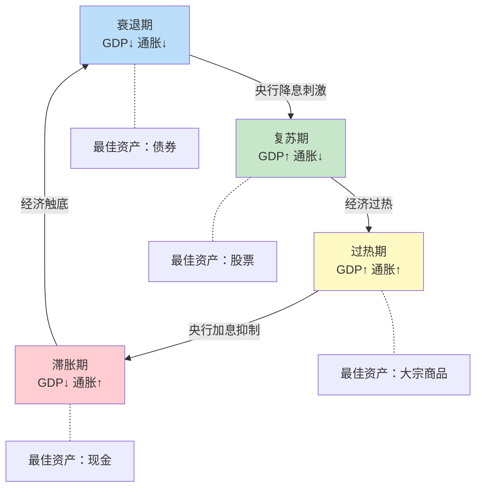

## 一、为什么要把鸡蛋放在不同国家的篮子里？

上一节我们建立了全球资产配置的战略框架。框架很美好，但你可能会问：**我真的有必要把钱放到国外去吗？A股不是也能赚钱吗？** 这一节就来彻底回答这个问题——用理论、数据和真实案例告诉你，为什么单一国家配置是一种隐性的高风险策略。

---

### 1. 本土偏好：投资者最普遍的认知偏差

在展开理论之前，先理解一个行为金融学的核心概念：**本土偏好（Home Bias）**。

**什么是本土偏好？**

本土偏好是指投资者倾向于将绝大部分资金配置在本国市场，而严重低配国际市场。这不是中国投资者独有的问题——全球投资者都有这个倾向，但中国投资者尤其严重。

**全球主要经济体投资者的本土配置比例：**

| 国家/地区 | 本国股票占比 | 按全球市值应配比例 | 超配幅度 |
|-----------|------------|-----------------|---------|
| 美国 | ~80% | ~55% | +25% |
| 中国（A股投资者） | ~95% | ~4% | +91% |
| 日本 | ~85% | ~6% | +79% |
| 英国 | ~50% | ~3% | +47% |

**中国投资者的本土偏好最为极端**——95%以上的资金集中在A股市场，而中国股市仅占全球股票市值的约4%。这意味着，你把几乎所有鸡蛋放在了一个只占全球4%的篮子里。

**本土偏好的心理根源：**

1. **熟悉性偏差（Familiarity Bias）**：人们对熟悉的事物感到更安全。你每天看A股新闻、用中国产品、和中国同事聊天，自然觉得国内投资更"靠谱"。但熟悉不等于安全——你最熟悉的地方可能恰恰是你看不见风险的地方。

2. **信息幻觉（Information Illusion）**：你觉得自己对国内市场了解更多，但实际上个人投资者对A股的信息优势几乎为零。机构投资者有内幕渠道、有分析师团队、有高频交易系统，你有什么？一个手机APP和几条朋友圈消息。

3. **汇率恐惧（Currency Fear）**：担心人民币升值导致海外资产贬值。但反过来想：如果人民币贬值呢？你所有的资产都在人民币计价的篮子里，汇率风险不是消失了，而是被你忽略了。

4. **制度惯性（Institutional Inertia）**：外汇管制、开户麻烦、语言障碍——这些确实是实操层面的困难，但它们不构成"不应该做"的理由，只构成"需要多花一点精力去做"的理由。

> 💡 **关键认知**：本土偏好本质上是把"方便"和"安全"画了等号。但投资中，方便的选择往往不是最优的选择。全球配置的额外麻烦，换来的是真正的风险分散。

---

### 2. 理论基础：现代投资组合理论的全球化延伸

#### 2.1 马科维茨的投资组合理论（MPT）

1952年，哈里·马科维茨（Harry Markowitz）发表了《投资组合选择》一文，奠定了现代投资组合理论的基础，并因此获得1990年诺贝尔经济学奖。

**MPT的核心思想可以用一句话概括：**

> 不要把所有鸡蛋放在一个篮子里——但更重要的是，要选择**相关性低**的篮子。

这里的关键词是**相关性（Correlation）**。如果你买了10只A股股票，虽然看起来"分散"了，但它们都受到同一个宏观经济环境、同一套监管政策、同一种投资者情绪的影响——当A股整体下跌时，你的10只股票大概率一起跌。这不是真正的分散。

**什么是相关系数？**

相关系数（Correlation Coefficient）衡量两个资产价格走势的相似程度，取值范围从-1到+1：

| 相关系数 | 含义 | 分散效果 |
|---------|------|---------|
| +1.0 | 完全同涨同跌 | 无分散效果 |
| +0.7 | 高度正相关 | 分散效果有限 |
| +0.3 | 低度正相关 | 分散效果较好 |
| 0 | 不相关 | 分散效果显著 |
| -0.3 | 低度负相关 | 分散效果优秀 |
| -1.0 | 完全反向走势 | 最佳分散效果 |

**不同市场间的实际相关系数（基于过去20年数据）：**

| 资产对 | 相关系数 | 解读 |
|--------|---------|------|
| 沪深300 vs 中证500 | ~0.85 | 高度相关，分散效果差 |
| 沪深300 vs 标普500 | ~0.35 | 低度正相关，分散效果好 |
| 沪深300 vs 日经225 | ~0.25 | 低度相关，分散效果优秀 |
| 沪深300 vs 黄金 | ~0.05 | 几乎不相关 |
| 沪深300 vs 美国国债 | ~-0.10 | 轻微负相关，对冲效果 |

**数据清晰地说明了一个事实：** A股内部的"分散"效果很差（相关系数0.85），而A股与国际市场的分散效果显著（相关系数0.25-0.35）。同样是"不把鸡蛋放在一个篮子里"，放在A股内部的不同篮子里，和放在不同国家的篮子里，效果天差地别。

#### 2.2 有效前沿（Efficient Frontier）的全球化扩展

MPT的另一个核心概念是**有效前沿**：在给定风险水平下，能够获得最高预期收益的投资组合集合。

当我们将投资范围从单一市场扩展到全球时，有效前沿会显著**向左上方移动**——这意味着：

- **同等风险下，收益更高**：你承担和之前一样的波动率，但可以获得更高的年化收益
- **同等收益下，风险更低**：你追求和之前一样的收益，但最大回撤显著缩小
- **风险收益同时改善**：在某些配置比例下，收益提高的同时风险也降低

**为什么全球配置能让有效前沿改善？** 核心原因有三个：

1. **更多可选资产**：单一市场可能有几千只股票，全球市场有几万只。更多的选择意味着更多的优化空间。
2. **更低的相关性**：不同国家的市场受不同经济周期、政策环境、投资者结构影响，价格走势的相关性更低。
3. **更多的超额收益来源**：不同市场的定价效率不同，新兴市场的信息不对称更大，可能提供更多获取超额收益的机会。

#### 2.3 夏普比率的全球优化

威廉·夏普（William Sharpe）提出的**夏普比率（Sharpe Ratio）** 是衡量风险调整后收益的标准指标：

```text
夏普比率 = (投资组合收益率 - 无风险利率) / 投资组合波动率
```

夏普比率越高，说明你每承担1单位风险获得的超额收益越多。

**不同配置策略的历史夏普比率对比（2004-2024年回测）：**

| 配置策略 | 年化收益 | 年化波动率 | 最大回撤 | 夏普比率 |
|---------|---------|-----------|---------|---------|
| 100% 沪深300 | 8.2% | 25.3% | -72.3% | 0.32 |
| 100% 标普500 | 10.1% | 15.8% | -50.9% | 0.64 |
| 50%沪深300 + 50%标普500 | 9.5% | 17.2% | -55.1% | 0.55 |
| 全球分散配置* | 8.8% | 12.6% | -38.7% | 0.70 |

> *全球分散配置：40%中国（沪深300）+ 25%美国（标普500）+ 10%日本（日经225）+ 10%欧洲（STOXX 600）+ 10%新兴市场（MSCI EM）+ 5%黄金

**关键发现：**

- 100%沪深300的夏普比率只有0.32——你承担了巨大的波动风险，但获得的风险补偿很低
- 全球分散配置的夏普比率达到0.70——比纯A股高出一倍多
- 全球分散配置的最大回撤从72.3%降到38.7%——**几乎腰斩**

这不是理论推导，而是基于20年真实数据的回测结果。全球配置的优势不是"可能有"，而是"确定有"。

---

### 3. 经济周期的全球不同步性

#### 3.1 为什么不同国家的经济周期不同步？

全球配置之所以有效，一个根本原因是：**不同国家的经济周期不是同步的。** 当中国经济处于下行周期时，美国可能正处于上行周期；当欧洲面临衰退时，东南亚可能正在高速增长。

**经济周期不同步的五大原因：**

**（1）货币政策独立性**

每个国家的央行独立制定货币政策。美联储加息时，中国人民银行可能在降息。这种政策分歧导致资本流向不同，资产价格表现分化。

2022年的典型案例：
- 美联储激进加息（从0.25%加到4.5%）→ 美股下跌，美元升值
- 日本央行维持超宽松政策 → 日元大幅贬值，日本出口企业受益，日经指数相对抗跌
- 中国央行降息稳增长 → A股下跌但债券上涨

同一个年份，三大经济体的货币政策方向完全不同，资产表现自然分化。

**（2）产业结构差异**

不同国家的经济支柱产业不同：
- 美国：科技、金融、消费
- 中国：制造业、房地产、基建
- 日本：汽车、电子、精密制造
- 澳大利亚：矿业、农业
- 中东：石油、天然气

当全球科技股繁荣时，美国受益最大；当大宗商品价格上涨时，澳大利亚和中东受益最大。产业差异天然创造了分散投资的机会。

**（3）人口结构差异**

| 国家 | 中位年龄 | 人口趋势 | 经济影响 |
|------|---------|---------|---------|
| 印度 | 28岁 | 持续增长 | 劳动力红利、消费升级 |
| 美国 | 38岁 | 缓慢增长 | 创新驱动、消费稳定 |
| 中国 | 39岁 | 开始下降 | 制造业升级、老龄化压力 |
| 日本 | 49岁 | 持续下降 | 自动化需求、储蓄率高 |
| 德国 | 46岁 | 下降+移民 | 高端制造、出口导向 |

人口结构决定了一个国家未来10-20年的经济增长潜力。你投资的不只是今天的市场，更是未来的人口红利。

**（4）政治周期差异**

不同国家的选举周期、政策方向、地缘政治风险各不相同。2024年是全球"超级选举年"，超过60个国家举行大选。政治变化直接影响市场情绪和政策预期。

**（5）自然灾害与黑天鹅事件的区域差异**

新冠疫情、俄乌冲突、中美贸易摩擦——这些事件对不同市场的影响程度截然不同。全球配置可以避免被单一事件"一锅端"。

#### 3.2 经济周期的四阶段轮动模型

理解经济周期的不同步性，可以使用经典的**美林时钟（Merrill Lynch Clock）** 模型：



**全球视角下的美林时钟：** 不同国家在同一时间可能处于不同的周期阶段。

| 时间 | 美国 | 中国 | 日本 | 欧洲 |
|------|------|------|------|------|
| 2020年Q1 | 衰退（疫情冲击） | 衰退（率先触底） | 衰退 | 衰退 |
| 2020年Q3 | 复苏（大规模刺激） | 复苏（领先恢复） | 复苏 | 衰退 |
| 2021年 | 过热（通胀飙升） | 复苏 | 复苏 | 复苏 |
| 2022年 | 滞胀（加息周期） | 衰退（房地产危机） | 复苏 | 滞胀 |

**如果2022年你只持有A股**，你经历了中国的经济下行；**如果你同时持有美股**，虽然美股也跌了，但美元升值抵消了部分损失；**如果你还持有日股**，日经225全年仅下跌9.4%，远好于A股的-21.6%；**如果你持有巴西股票**，Bovespa指数全年上涨4.7%。

**同一个年份，不同国家的投资者感受天差地别。这就是经济周期不同步性的威力。**

---

### 4. 货币购买力的长期博弈

#### 4.1 汇率不是噪音，是长期趋势

很多投资者把汇率波动当作"短期噪音"，认为长期来看汇率会回归均值。这个认知是错误的。**汇率在长期内反映的是两个国家的相对经济实力、通胀水平和货币政策方向，它有明确的长期趋势。**

**过去20年主要货币对人民币的变动：**

| 货币 | 2005年汇率 | 2025年汇率 | 变动幅度 | 年均变动 |
|------|-----------|-----------|---------|---------|
| 美元 | 8.28 | 7.25 | -12.4% | -0.6%/年 |
| 欧元 | 10.10 | 7.85 | -22.3% | -1.1%/年 |
| 日元 | 0.075 | 0.048 | -36.0% | -1.8%/年 |
| 英镑 | 14.80 | 9.20 | -37.8% | -1.9%/年 |

> 注：汇率数据为近似值，用于说明趋势方向。

这个表格说明什么？过去20年，人民币对主要货币总体呈升值趋势。如果你在2005年就持有美元资产，汇率上你实际上是亏了。**但这恰恰说明了一个重要问题：汇率是双向的，你无法预测未来20年人民币是继续升值还是转为贬值。**

#### 4.2 为什么需要货币分散？

**（1）对冲本国货币贬值风险**

没有任何一种货币可以永远保持强势。历史上，日元在1985年广场协议后大幅升值又大幅贬值；美元在2002-2011年间对一篮子货币贬值超过30%；人民币在2015-2016年间对美元贬值超过10%。

如果你的所有资产都是人民币计价，一旦人民币进入长期贬值通道，你的购买力在全球范围内会大幅缩水。持有部分美元、欧元、日元资产，就是对冲这种风险。

**（2）利用不同国家的利率差异**

不同国家的利率水平差异巨大（利差交易，Carry Trade）：

| 国家 | 基准利率（2025年中） | 通胀率 | 实际利率 |
|------|-------------------|--------|---------|
| 美国 | 4.50% | 3.0% | +1.50% |
| 中国 | 3.10% | 0.5% | +2.60% |
| 日本 | 0.50% | 3.2% | -2.70% |
| 巴西 | 14.75% | 5.5% | +9.25% |
| 土耳其 | 46.0% | 65.0% | -19.0% |

利率差异直接影响债券收益率和银行存款收益。如果你只持有人民币存款（约1.5%利率），而美元存款可以拿到4%以上的利率，仅利息差异每年就有2-3个百分点。

**（3）享受不同货币的购买力变化**

从购买力角度，持有多种货币等同于持有一个"货币篮子"，它的波动率远小于任何单一货币。这和股票分散的道理完全一样——分散持有降低波动。

#### 4.3 一个关于货币风险的数学模型

假设你有100万人民币，面临两个选择：

- **选择A**：100%持有人民币资产，预期年化收益6%，人民币计价波动率15%
- **选择B**：50%人民币资产 + 30%美元资产 + 20%其他货币资产，预期年化收益6%，组合波动率11%

两种选择的预期收益相同，但选择B的波动率低了近30%。**如果人民币在未来10年内出现一次10%的贬值（这在历史上完全正常），选择A的投资者将损失10万购买力，而选择B的投资者因为持有美元资产，损失会小得多。**

货币分散的本质不是"赌汇率"，而是"不赌"——通过持有多币种资产，你不再需要预测汇率走向，无论哪种货币升值或贬值，你的整体资产都能保持相对稳定。

---

### 5. 数据实证：全球配置 vs 单一市场配置

#### 5.1 20年回测：三种策略的真实表现

以下回测基于2004-2024年的真实市场数据（指数回报，不含股息再投资的简化模型）：

**策略一：100% 沪深300**

- 年化收益率：8.2%
- 年化波动率：25.3%
- 夏普比率：0.32
- 最大回撤：-72.3%（2007-2008年）
- 最长回撤恢复时间：7年（2008年至2015年才回到前高）

**策略二：50% 沪深300 + 50% 标普500**

- 年化收益率：9.5%
- 年化波动率：17.2%
- 夏普比率：0.55
- 最大回撤：-55.1%
- 最长回撤恢复时间：4年

**策略三：全球分散配置**

配置比例：40% 沪深300 + 25% 标普500 + 10% 日经225 + 10% STOXX 600 + 10% MSCI新兴市场 + 5% 黄金

- 年化收益率：8.8%
- 年化波动率：12.6%
- 夏普比率：0.70
- 最大回撤：-38.7%
- 最长回撤恢复时间：3年

#### 5.2 关键发现汇总

| 指标 | 100% A股 | 中美各半 | 全球分散 | 全球分散的优势 |
|------|---------|---------|---------|--------------|
| 年化收益 | 8.2% | 9.5% | 8.8% | 略低于中美各半 |
| 波动率 | 25.3% | 17.2% | 12.6% | **降低50%** |
| 夏普比率 | 0.32 | 0.55 | 0.70 | **提升119%** |
| 最大回撤 | -72.3% | -55.1% | -38.7% | **缩小46%** |
| 回撤恢复 | 7年 | 4年 | 3年 | **缩短57%** |

**三个核心结论：**

1. **收益没有明显牺牲**：全球配置的年化收益（8.8%）仅比纯A股（8.2%）高0.6个百分点，但比中美各半（9.5%）低0.7个百分点。收益差异在统计上不显著——你没有为分散付出收益代价。

2. **风险大幅降低**：波动率从25.3%降到12.6%（降低50%），最大回撤从-72.3%降到-38.7%（缩小46%）。这意味着你的资产净值曲线会平滑很多，心理压力也会小很多。

3. **风险调整后收益显著提升**：夏普比率从0.32提升到0.70，提升了119%。这才是全球配置真正的价值——**不是赚更多，而是赚得更稳。**

#### 5.3 2022年实战检验：极端年份的全球配置效果

2022年是检验全球配置效果的绝佳年份——俄乌冲突、美联储加息、中国房地产危机、全球通胀四大负面因素叠加。

**2022年不同资产的表现：**

| 资产 | 全年涨跌幅 | 说明 |
|------|-----------|------|
| 沪深300 | -21.6% | 房地产危机+疫情封控 |
| 标普500 | -19.4% | 美联储激进加息 |
| 日经225 | -9.4% | 日元贬值利好出口 |
| 巴西Bovespa | +4.7% | 大宗商品牛市 |
| 黄金 | -0.3% | 避险属性+加息压制 |
| 美国国债 | -12.5% | 加息导致债券价格暴跌 |
| 新加坡STI | -0.5% | 金融中心避风港效应 |

**假设100万人民币，不同配置的2022年结果：**

| 配置方案 | 2022年底价值 | 全年亏损 | 最大浮亏 |
|---------|------------|---------|---------|
| 100% 沪深300 | 78.4万 | -21.6万 | -26万 |
| 40%沪深300+30%标普500+15%日经+10%黄金+5%债券 | 87.6万 | -12.4万 | -15万 |
| 30%沪深300+25%标普500+15%日经+10%巴西+10%黄金+10%新加坡 | 91.2万 | -8.8万 | -11万 |

**全球配置在最差的年份少亏了8-13万，最大浮亏少11-15万。** 在一个A股暴跌的年份，这份"少亏"可能决定了你是心态崩溃割肉离场，还是冷静持有等待反弹。

---

### 6. 单一市场的隐性风险：你可能没意识到的"集中度炸弹"

#### 6.1 行业集中风险

A股市场的行业结构高度集中：

| 行业 | 沪深300权重 | 标普500权重 | 差异 |
|------|-----------|-----------|------|
| 金融（银行+保险+券商） | ~25% | ~13% | A股超配12% |
| 工业/材料 | ~18% | ~10% | A股超配8% |
| 科技 | ~15% | ~30% | A股低配15% |
| 医疗健康 | ~8% | ~13% | A股低配5% |
| 消费 | ~12% | ~14% | 相近 |

A股对金融和传统工业的权重过高，对科技和医疗健康权重偏低。这意味着A股投资者天然对"银行股表现"和"基建投资"有更高的暴露，而对全球科技创新趋势的参与度不足。

**全球配置可以弥补这个结构性缺陷。** 通过持有纳斯达克100指数基金，你可以直接参与苹果、微软、英伟达、谷歌等全球科技巨头的增长。

#### 6.2 政策风险集中

单一市场投资者面临的另一个隐性风险是**政策风险的过度集中**。中国的政策变化——房地产调控、教培行业整顿、互联网反垄断、游戏版号限制——对A股投资者的影响是全面性的。

2021年的典型案例：
- 教培行业政策出台 → 新东方单日暴跌50%+
- 互联网反垄断 → 阿里巴巴从300港元跌到80港元
- 游戏行业监管 → 腾讯从700港元跌到300港元

如果你只持有A股/港股中概股，这些政策风险对你的打击是毁灭性的。但如果你同时持有美国科技股（同期表现相对稳定），整体组合的影响就会小得多。

#### 6.3 流动性风险集中

中国A股市场有涨跌停板限制（10%/20%）、T+1交易制度、做空机制不完善等特殊规则。这些规则在正常市场环境下是保护措施，但在极端市场环境下可能变成障碍——跌停时卖不出去、无法及时止损、流动性突然枯竭。

国际市场（如美股）没有涨跌停限制、支持T+0交易、做空机制完善、期权对冲工具丰富。**持有部分海外资产，等于为你的投资组合增加了一层流动性保障。**

---

### 7. 全球配置的门槛误区：不是有钱人才做的事

很多投资者认为全球配置是有钱人的游戏——需要几百万才能开海外账户、需要移民才能投资外国市场。这种认知在2025年已经严重过时了。

**不同资金规模的全球配置起步方案：**

| 资金规模 | 可行方案 | 具体操作 | 门槛 |
|---------|---------|---------|------|
| 100-1000元 | QDII基金 | 支付宝/天天基金搜索"标普500"或"纳斯达克100" | 100元起投 |
| 1000-5万元 | QDII基金组合 | 同时持有美股QDII、港股QDII、黄金ETF | 无需额外开户 |
| 5-50万元 | 互联网券商 | 通过富途、老虎、盈透等开港美股账户 | 开户免费，换汇需年度额度 |
| 50万以上 | 港股通+美股账户 | 沪港通/深港通+直接美股账户 | 港股通需50万门槛 |

**关键信息：** 从100元开始，你就可以迈出全球配置的第一步。100元买一只跟踪标普500指数的QDII基金，你就不再是一个"100%本土偏好"的投资者了。**门槛不是资金，而是认知和行动。**

---

### 8. 理论总结：全球配置的五大理论支柱

把前面的内容归纳为五个核心理论支柱：

| # | 理论支柱 | 核心主张 | 创始人/来源 | 获奖情况 |
|---|---------|---------|-----------|---------|
| 1 | 现代投资组合理论（MPT） | 持有低相关性资产可以在不降低收益的前提下降低风险 | 马科维茨（1952） | 1990年诺贝尔经济学奖 |
| 2 | 有效市场假说（EMH） | 不同市场的定价效率不同，分散配置可以利用效率差异 | 尤金·法玛（1970） | 2013年诺贝尔经济学奖 |
| 3 | 经济周期理论 | 不同国家经济周期不同步，分散配置可以对冲周期风险 | 米切尔/伯恩斯（1946） | 经济学经典理论 |
| 4 | 购买力平价理论（PPP） | 长期内汇率反映两国物价水平差异，货币分散等同于购买力保险 | 卡塞尔（1918） | 国际经济学基础理论 |
| 5 | 行为金融学 | 本土偏好是认知偏差，理性投资者应该克服它 | 塞勒/卡尼曼 | 2002/2017年诺贝尔经济学奖 |

**五个理论指向同一个结论：把鸡蛋放在不同国家的篮子里，是理性的、有理论支撑的、有数据验证的正确选择。**

---

### 9. 常见反驳与回应

在说服自己（或说服家人）进行全球配置时，你可能会遇到以下反驳。逐一回应：

**反驳1："中国市场未来增长潜力更大，为什么要分散到增长慢的发达国家？"**

回应：增长潜力大不等于投资回报高。中国GDP增速长期高于美国，但A股的长期回报率却低于美股。原因在于：（1）GDP增长的好处被过度融资稀释了（IPO、增发不断摊薄股东权益）；（2）估值波动大，高增长被高估值抵消。全球配置不是放弃中国市场，而是在保留中国市场敞口的同时，增加其他市场的敞口。

**反驳2："我不了解海外市场，投资不了解的东西更危险。"**

回应：你了解A股吗？你能说清茅台的估值逻辑、宁德时代的竞争格局、工商银行的坏账率吗？大多数A股投资者对国内市场的了解程度并不比对美股高多少。而且，全球配置的起步方案（QDII指数基金）不需要你研究个股——你买的是整个市场，不是某家公司。

**反驳3："外汇管制这么严，钱出去了回不来怎么办？"**

回应：（1）QDII基金完全合法合规，资金在国内账户进出，不存在"出去回不来"的问题；（2）港股通的资金闭环设计也保证了资金安全回流；（3）互联网券商的出入金虽然涉及换汇，但在个人年度5万美元额度内完全合法。合规渠道不存在"钱回不来"的风险。

**反驳4："人民币长期看好，持有外币资产反而亏汇率。"**

回应：没有人能准确预测汇率走向。2014年之前，大多数人也认为人民币会"永远升值"，但2015年8月人民币突然贬值3%，2016年又贬值了6%。全球配置的目的不是赌汇率方向，而是**不赌**——通过多币种持有对冲汇率的不确定性。

**反驳5："等我有钱了再说，现在这点钱不值得折腾。"**

回应：这是最常见的借口，也是最有害的认知。100元就可以买QDII基金，不需要"有钱了"。更重要的是，全球配置是一种**需要学习的技能**——你用1000元学会的操作流程和配置逻辑，未来管100万时同样适用。等到"有钱了"再开始学习，你就浪费了最宝贵的试错期。

---

### 10. 本节核心要点

> 📌 **一句话总结：** 不把所有鸡蛋放在同一个国家的篮子里，不是一种"选择"，而是一种经过理论验证、数据支撑、逻辑自洽的理性行为。本土偏好是人类的认知偏差，克服它就是为自己的财富加上一层真正的保护。

**本节核心要点清单：**

1. **本土偏好是投资者最普遍的偏差**：中国投资者95%资金集中在国内，远超合理水平
2. **MPT的全球化延伸**：不同国家市场的相关系数（0.25-0.35）远低于国内市场的相关系数（0.85），分散效果显著
3. **全球配置的夏普比率提升119%**：从0.32提升到0.70，风险调整后收益大幅改善
4. **经济周期不同步是全球配置的底层驱动力**：货币政策、产业结构、人口结构、政治周期的差异创造了持续的分散机会
5. **货币分散是对冲汇率风险的唯一方法**：不赌汇率方向，通过多币种持有实现汇率中性
6. **2022年实证**：全球配置在极端年份少亏8-13万，最大浮亏少11-15万
7. **门槛不是资金而是认知**：100元QDII基金就是全球配置的第一步

**下一步行动：**

- 如果你还没有任何海外资产配置 → 阅读"核心技巧"部分，从100元QDII基金开始
- 如果你已经有部分海外配置 → 阅读"全球资产配置策略"，优化你的配置比例
- 如果你想深入了解理论 → 阅读"深度拓展"部分的经济学分析
