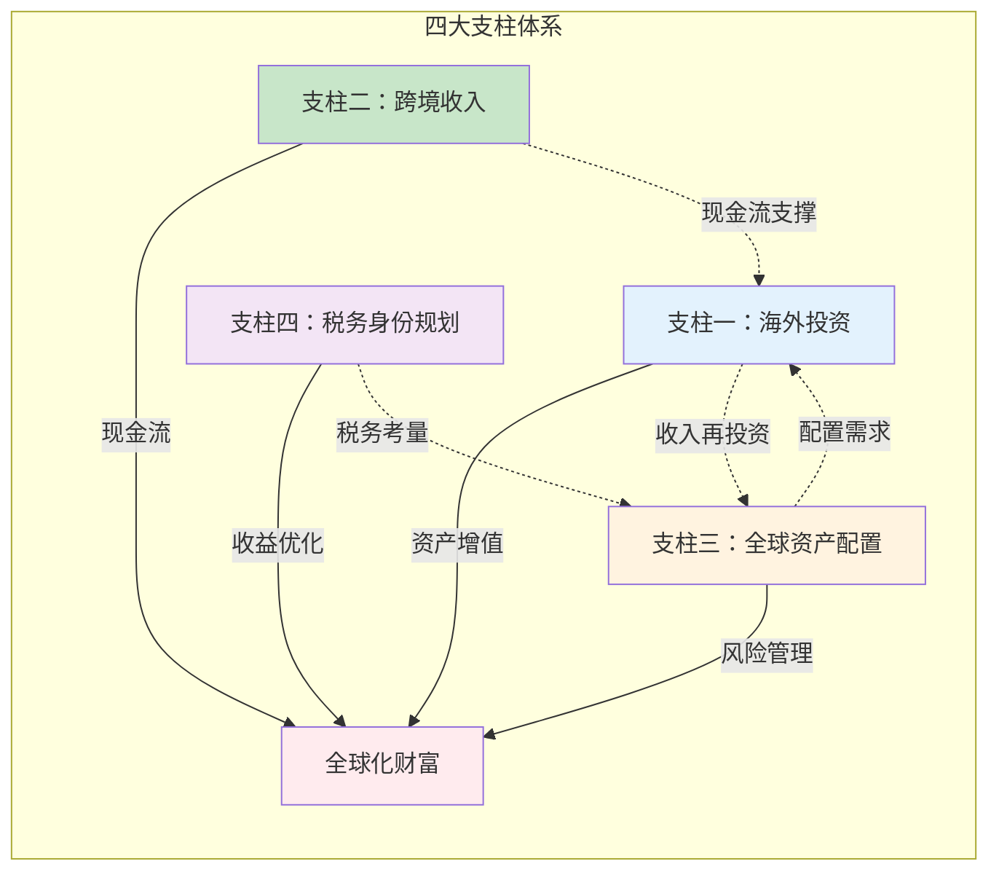
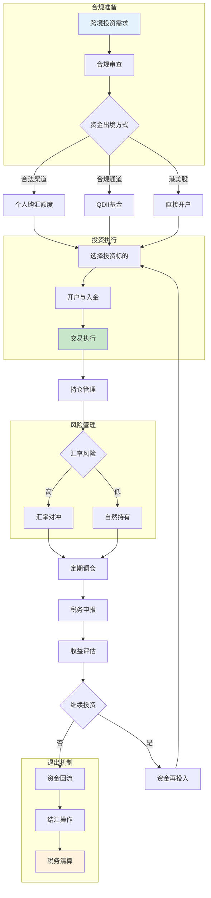
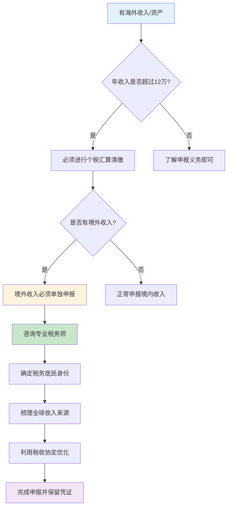

## 二、全球化搞钱的四大支柱

全球化搞钱不是"买点美股"那么简单。它是一个由四个相互支撑的支柱构成的系统工程——海外投资让你的钱跨越国界增值，跨境收入让你的劳动产出获取全球化定价，全球资产配置用系统化方法管理风险，税务身份规划则在合法框架内最大化你的真实收益。这四个支柱不是孤立的，它们之间存在深刻的协同关系：海外投资提供了资产增值的基础，跨境收入创造了持续的现金流，全球资产配置将前两者整合为一个风险可控的组合，而税务身份规划则决定了你最终能留下多少。

理解这四大支柱之间的关系，是避免"头痛医头"式碎片化操作的关键。



### 2.0 跨境投资操作流程总览

在深入每个支柱之前，先建立一个全局视角——从产生跨境投资需求到最终完成收益评估，整个流程涉及哪些环节、哪些决策点、哪些风险控制节点。



这个流程中有几个容易被忽视的关键节点：

- **合规审查**（第一步）：不是走形式。中国外汇管理局对个人购汇有严格规定，每人每年5万美元额度，且不得用于境外证券投资、购买人寿保险等资本项目。违反规定可能导致被列入"关注名单"，影响后续正常用汇。
- **汇率风险**（K节点）：很多人投资赚了10%，结果汇率亏了8%，实际收益只有2%。汇率风险管理不是可选项，而是必修课。
- **税务申报**（O节点）：海外投资收益在中国需要申报纳税。很多人不知道或选择性忽视这一点，但随着CRS（共同申报准则）信息交换的推进，税务合规的紧迫性在持续上升。

---

### 2.1 支柱一：海外投资——用钱生钱跨越国界

海外投资是全球化搞钱最直观的切入点。它的核心逻辑很简单：不同国家的经济发展阶段、产业结构、货币政策不同，意味着不同市场的风险收益特征存在差异。通过在多个市场配置资金，你可以捕获单一市场无法提供的收益机会，同时降低集中于单一市场的风险。

#### 2.1.1 股票市场投资

股票市场是海外投资最主要的渠道。不同市场有完全不同的特征，理解这些差异是做出正确配置决策的前提。

**港股市场**

港股是大陆投资者接触海外资本市场最便捷的通道。它的独特价值在于：一方面拥有大量中国优质企业（腾讯、美团、小米等），另一方面又有国际化的交易制度和估值体系。

- **进入渠道**：沪港通/深港通（通过A股券商直接操作，但标的有限，约500只港股）、直接开港股账户（盈透证券、富途证券、老虎证券等，标的更全）
- **核心优势**：同一家公司，港股往往比A股便宜20%-40%（AH溢价长期存在）；无涨跌停限制，T+0交易；港币与美元挂钩，天然的美元资产属性
- **关键风险**：流动性不如A股（中小盘股日成交额可能只有几百万港元）；做空机制成熟，下跌可能更猛烈；受中美关系影响大
- **适合标的**：恒生科技指数ETF（3032.HK）、H股ETF（2828.HK）、优质个股如腾讯（0700.HK）、汇丰（0005.HK）

**美股市场**

美股是全球最大的资本市场，总市值超过50万亿美元，约占全球股票市场总市值的45%。几乎所有全球顶级科技公司——苹果、微软、谷歌、亚马逊、英伟达——都在美股上市。

- **进入渠道**：通过港股券商的美股账户（盈透、富途、老虎均支持美股交易）；部分国内券商也提供美股代买卖服务
- **核心优势**：全球最大、最深、最具流动性的市场；机构投资者主导，定价效率高；衍生品市场发达，对冲工具丰富；美元计价，全球硬通货资产
- **关键风险**：时差问题（交易时间对应北京时间晚上9:30到次日凌晨4:00）；股息预扣税30%（可通过填写W-8BEN表格享受中美税收协定优惠税率10%）；美国遗产税对非居民最高40%
- **适合标的**：标普500指数ETF（VOO/SPY）、纳斯达克100 ETF（QQQ）、个股如苹果、微软、英伟达

**其他市场**

| 市场 | 特征 | 进入渠道 | 适合人群 | 代表性ETF |
|------|------|----------|----------|-----------|
| 日本 | 日元贬值周期+企业治理改革 | 港股券商日股账户 | 看好日本经济复苏的投资者 | EWJ（日本ETF） |
| 欧洲 | 估值低于美股，分红率高 | 美股上市的欧洲ETF | 追求稳健分红的投资者 | VGK（欧洲ETF） |
| 东南亚 | 人口红利，经济高增长 | 个股开户门槛高，建议用ETF | 长期看好新兴市场的投资者 | VWO（新兴市场ETF） |
| 印度 | 全球增长最快的主要经济体 | 美股上市印度ETF | 愿意承受高波动的长期投资者 | INDA（印度ETF） |

#### 2.1.2 基金投资

直接选股需要大量研究精力，基金投资是更高效的选择。

**QDII基金**

QDII（Qualified Domestic Institutional Investor，合格境内机构投资者）基金是国内投资者通过正规渠道投资海外市场最便捷的方式。它的核心优势是：用人民币直接申购，不需要换汇，不受个人5万美元购汇额度限制（基金公司统一换汇），且通过银行、券商、支付宝、天天基金等渠道均可购买。

- **主要类型**：股票型QDII（如易方达中概互联50ETF联接）、债券型QDII、商品型QDII（黄金ETF联接）、REITs型QDII
- **费率结构**：管理费通常1.0%-1.8%/年，托管费0.2%-0.35%/年，申购费0-1.5%（通常有折扣），赎回费0-1.5%
- **限额问题**：部分热门QDII基金经常出现限额申购甚至暂停申购的情况，需要关注基金公告
- **汇率风险**：虽然用人民币申购，但基金持有的是外币资产，汇率波动直接影响基金净值

**海外公募基金**

如果你已经拥有海外证券账户，可以直接购买国际基金公司的产品，选择面更广、费率更低。

- **Vanguard（先锋领航）**：指数基金的鼻祖，费率极低（VOO管理费仅0.03%），适合长期持有
- **BlackRock（贝莱德）**：全球最大的资产管理公司，iShares系列ETF覆盖全球各类资产
- **Fidelity（富达）**：主动管理基金的代表，研究能力强，适合希望超越指数的投资者

**REITs（房地产投资信托基金）**

REITs是一种将房地产证券化的投资工具。你不需要买一套房子，就可以投资全球优质物业——写字楼、商场、物流仓库、数据中心、医院。REITs的法律要求将90%以上的应税收入分配给投资者，因此分红率通常在4%-8%之间。

- **全球REITs ETF**：VNQ（美国REITs）、VNQI（国际REITs）
- **港股REITs**：领展房产基金（0823.HK）、置富产业信托（0778.HK）
- **核心优势**：高分红、与股票债券相关性低（组合分散效果好）、抗通胀（租金随通胀调整）
- **关键风险**：利率上升时承压（REITs的借贷成本上升，且高分红在利率上升时吸引力下降）

#### 2.1.3 房产投资

海外房产投资是很多人最感兴趣但也最容易踩坑的领域。它的真实回报率往往不如表面看起来那么美好。

**东南亚房产**

- **泰国**：外国人只能购买公寓（不能买土地和别墅），且同一栋公寓外国人持有比例不超过49%。曼谷核心区公寓均价约2-4万元人民币/平方米，租金回报率4%-6%
- **越南**：外国人可以购买公寓但仅有50年产权，且不能自由转卖给其他外国人。胡志明市房价近年涨幅较大，但流动性较差
- **马来西亚**：通过"第二家园计划"（MM2H）可以较方便地购置房产，吉隆坡房价相对较低，但需注意高额的外国人购房门槛税

**欧美房产**

- **美国**：外国人可以自由购买房产，但持有成本高——房产税1%-3%/年、保险费、物业维护费、租金收入需缴纳30%预扣税（除非选择按净收入报税）
- **欧洲**：部分国家有购房移民政策（希腊25万欧元、葡萄牙曾经的黄金签证等），但近年来政策在收紧

**海外房产投资的真实成本结构**

很多中介只告诉你"年化收益5%"，但不告诉你以下成本：

| 成本项目 | 占房价/租金比例 | 说明 |
|---------|---------------|------|
| 购置税/印花税 | 1%-8% | 因国家而异，泰国1%，英国最高可达8%（附加税） |
| 律师费 | 0.5%-2% | 海外买房必须请当地律师 |
| 中介费 | 1%-3% | 买方和卖方各付各的中介费 |
| 房产税/地税 | 0.5%-3%/年 | 美国较高，东南亚较低 |
| 物业管理费 | 5%-15%的租金收入 | 如果委托管理 |
| 租金所得税 | 10%-30% | 因国家和税务身份而异 |
| 汇率损失 | 1%-5% | 买入卖出的汇率差 |
| 空置损失 | 5%-15% | 不可能365天满租 |

把这些成本加起来，一个"表面回报6%"的海外房产，实际到手可能只有2%-3%。在做决策之前，务必用真实成本模型计算。

---

### 2.2 支柱二：跨境收入——劳动收入的全球化

海外投资是"用钱生钱"，跨境收入则是"用技能和时间赚全球的钱"。对于大多数人来说，跨境收入比海外投资更容易起步——你不需要本金，只需要技能和一台能上网的电脑。

跨境收入的核心价值不仅在于金额本身，还在于它提供了一种天然的货币对冲：当人民币贬值时，你的美元收入自动"增值"；当美元贬值时，你的人民币生活成本自动"降低"。

#### 2.2.1 海外自由职业

自由职业是获取跨境收入门槛最低的方式。全球自由职业市场规模在2025年已超过1.5万亿美元，且仍在快速增长。

**主要平台对比**

| 平台 | 主要领域 | 收费模式 | 收入水平 | 适合人群 |
|------|---------|---------|---------|---------|
| Upwork | 综合（开发、设计、写作、营销） | 平台抽成10%-20% | 中高级：$30-150/小时 | 有明确技能的专业人士 |
| Fiverr | 创意服务（设计、视频、文案） | 平台抽成20% | 变化大：$5-500/单 | 创意工作者 |
| Toptal | 高端软件开发 | 严格筛选，通过后收入高 | $60-200+/小时 | 顶级开发者 |
| 99designs | 设计 | 比赛制或1对1项目 | $300-5000/项目 | 设计师 |
| 独立站+内容营销 | 任何领域 | 无平台抽成 | 完全取决于个人品牌 | 有内容创作能力的人 |

**收入与税务的现实**

- 通过PayPal、Wise（原TransferWise）、Payoneer等工具收款
- 年收入超过12万元人民币需进行个税汇算清缴
- 境外收入在中国需缴纳个人所得税（综合所得税率3%-45%）
- 实际操作中，很多小额自由职业者没有主动申报，但随着CRS信息交换推进，合规压力在增大

#### 2.2.2 跨境电商

跨境电商是利用中国供应链优势赚取全球化利润的典型路径。中国制造业的全品类覆盖、成熟的物流体系、不断提升的产品品质，为跨境电商提供了坚实的基础。

**主要模式对比**

| 模式 | 代表平台 | 启动资金 | 运营难度 | 利润率 | 核心能力要求 |
|------|---------|---------|---------|--------|-------------|
| B2C平台卖家 | Amazon FBA | 5-20万元 | 中高 | 15%-30% | 选品、运营、广告 |
| B2C独立站 | Shopify | 3-10万元 | 高 | 20%-40% | 流量获取、品牌建设 |
| B2B批发 | 阿里巴巴国际站 | 2-5万元 | 中 | 10%-20% | 供应链管理、客户开发 |
| 跨境代购 | 微信/社交平台 | 1-3万元 | 低 | 10%-20% | 信任建设、选品 |
| POD按需印刷 | Redbubble/Merch | 几乎为零 | 低 | 变化大 | 设计能力 |

**跨境电商的关键成功因素**

1. **选品**：这是决定成败的第一步。好产品不是"我觉得好"，而是有数据支撑——利润率>30%、月搜索量>1万、竞争度中等、无专利/品牌壁垒、重量轻（降低物流成本）
2. **合规**：不同国家的产品标准差异巨大。欧盟的CE认证、美国的FCC认证、FDA审批、REACH法规等，不合规可能导致产品被扣押甚至面临法律诉讼
3. **物流**：FBA（亚马逊物流）是目前最成熟的跨境物流方案，但仓储费、长期库存费、退货处理费都需要精确计算
4. **知识产权**：这是跨境电商最大的"隐形炸弹"。在Amazon上，侵权投诉可以直接导致账户被冻结，库存被扣押。在上架前必须做好商标和专利排查

#### 2.2.3 远程工作

远程工作是一种介于自由职业和传统雇佣之间的模式——你有稳定的雇主和薪资，但不需要在固定地点办公。疫情后，远程工作从"临时方案"变成了"常态选项"。

**获取远程工作的渠道**

- **专业远程工作平台**：Remote OK、We Work Remotely、FlexJobs、AngelList（初创公司远程岗位）
- **大厂远程政策**：Airbnb、Spotify、Shopify等科技公司已宣布永久远程工作选项
- **中国公司出海岗位**：字节跳动、腾讯、阿里等公司的海外业务团队经常提供远程岗位
- **猎头渠道**：中高级岗位通常通过猎头获取，LinkedIn是核心平台

**远程工作的收入差距**

远程工作的薪资水平因雇主所在地而异，这正是其核心吸引力所在——你可以在生活成本较低的地方（如中国二三线城市），赚取生活成本较高地区（如硅谷、纽约）的薪资。

| 雇主所在地 | 初级开发者年薪 | 高级开发者年薪 | 初级产品经理年薪 | 高级设计师年薪 |
|-----------|--------------|--------------|----------------|--------------|
| 硅谷 | $120-180K | $250-400K | $130-200K | $120-180K |
| 纽约 | $100-160K | $200-350K | $120-180K | $100-160K |
| 欧洲 | €60-100K | €100-180K | €70-120K | €60-100K |
| 新加坡 | S$60-100K | S$120-200K | S$70-120K | S$60-100K |
| 远程（全球薪资） | $50-80K | $100-180K | $60-100K | $50-80K |

即使按"全球薪资"打个折扣，对于在国内生活的开发者来说，$50-80K的年薪（约35-55万元人民币）也远高于国内同级别岗位的平均水平。

**远程工作的隐性挑战**

- **时差管理**：与欧美团队协作意味着你需要在晚上或凌晨开会，长期来看对健康有影响
- **法律和税务**：为海外雇主远程工作涉及复杂的税务问题——你在中国的收入是否需要在中国纳税？是否需要在雇主所在国纳税？不同国家的"常设机构"认定标准不同
- **职业发展**：远程员工在晋升和加薪方面往往处于劣势，因为你不在管理层的日常视野中
- **社交孤立**：长期远程工作容易产生孤独感，需要主动建立社交网络

---

### 2.3 支柱三：全球资产配置——系统化的风险管理

全球资产配置是四大支柱中最具"科学性"的部分。它不是凭感觉买几只海外股票，而是一套基于现代投资组合理论（Modern Portfolio Theory, MPT）的系统化方法。

核心理论来源于诺贝尔经济学奖得主哈里·马科维茨（Harry Markowitz）的研究：通过将相关性较低的资产组合在一起，可以在不降低预期收益的情况下降低整体风险，或者在相同风险水平下提高预期收益。这就是"免费的午餐"——分散化投资。

#### 2.3.1 四大分散原则

**原则一：地域分散**

不同国家的经济周期并不完全同步。当美国经济衰退时，中国可能正处于增长期；当欧洲陷入债务危机时，东南亚可能正享受人口红利。地域分散的本质是"不要赌任何一个国家的未来"。

全球股票市场的相关性矩阵（过去20年数据）揭示了一个关键事实：发达市场之间的相关性在上升（全球化效应），但发达市场与新兴市场之间的相关性仍然相对较低。这意味着"发达+新兴"的组合分散效果优于"多个发达市场"的组合。

| 市场对 | 相关系数 | 分散效果 |
|--------|---------|---------|
| 美国 vs 欧洲 | 0.85 | 较弱 |
| 美国 vs 日本 | 0.65 | 中等 |
| 美国 vs 中国 | 0.45 | 较好 |
| 美国 vs 印度 | 0.40 | 较好 |
| 美国 vs 新兴市场 | 0.55 | 中等 |
| 中国 vs 日本 | 0.35 | 良好 |
| 中国 vs 印度 | 0.30 | 良好 |

**原则二：资产类别分散**

不同资产类别在不同经济环境下的表现截然不同：

| 经济环境 | 股票 | 债券 | 黄金 | 房地产 | 商品 |
|---------|------|------|------|--------|------|
| 经济增长+低通胀 | ★★★★★ | ★★★ | ★★ | ★★★★ | ★★★ |
| 经济增长+高通胀 | ★★★ | ★★ | ★★★★ | ★★★ | ★★★★★ |
| 经济衰退+低通胀 | ★★ | ★★★★★ | ★★★ | ★★ | ★ |
| 经济衰退+高通胀（滞胀） | ★ | ★★ | ★★★★★ | ★★ | ★★★★ |

没有一种资产在所有环境下都表现良好。这就是为什么必须进行资产类别分散。

**原则三：货币分散**

货币分散不仅仅是"把人民币换成美元"。真正有效的货币分散应该覆盖全球主要储备货币和经济增长体货币。每种货币背后代表的是一个经济体的信用和购买力。

- **美元**：全球储备货币，避险属性强，但长期面临财政赤字压力
- **欧元**：第二大储备货币，代表欧洲经济整体
- **日元**：传统避险货币，但日本央行超宽松政策导致日元持续贬值
- **港币**：与美元挂钩，间接美元资产
- **新加坡元**：亚洲最稳定的货币之一，新加坡央行管理能力强
- **人民币**：你的本币资产，持有比例自然最高，但需要通过其他货币资产来对冲

**原则四：时间分散**

即使你做出了正确的资产配置决策，入场时机仍然会影响最终收益。时间分散（也叫"定投"或"成本平均法"）的核心思想是：不试图预测市场顶部和底部，而是通过在固定时间间隔投入固定金额，在价格低时买入更多份额，价格高时买入更少份额，从而平滑整体买入成本。

定投的数学优势在波动越大的市场越明显。对于波动率30%的市场（如中国A股），定投相对于一次性投入的平均成本优势约为3%-5%；对于波动率15%的市场（如美国标普500），优势约为1%-2%。

#### 2.3.2 经典配置模型

全球资产配置有几种被广泛验证的经典模型，适合作为个人配置的起点。

**永久组合（Harry Browne Permanent Portfolio）**

由美国投资顾问Harry Browne在1980年代提出，核心理念是"无论经济环境如何，总有一部分资产会表现良好"。

| 资产类别 | 配置比例 | 对应经济环境 |
|---------|---------|-------------|
| 股票（标普500） | 25% | 经济繁荣 |
| 长期国债 | 25% | 利率下降/通缩 |
| 黄金 | 25% | 通胀上升/货币危机 |
| 现金/短期国债 | 25% | 经济衰退 |

历史回测显示，1972-2023年间，永久组合的年化回报约8.1%，最大回撤约12.8%，夏普比率约0.50。虽然回报低于纯股票组合，但波动和回撤大幅降低，适合风险厌恶型投资者。

**全天候策略（All Weather Strategy）**

由桥水基金创始人Ray Dalio提出，是永久组合的升级版。核心理念相同——平衡配置以应对不同经济环境，但资产类别更细致，加入了商品、新兴市场债券等。

| 资产类别 | 配置比例 | 经济环境适配 |
|---------|---------|-------------|
| 长期国债 | 40% | 通缩/衰退 |
| 股票 | 30% | 经济增长 |
| 中期国债 | 15% | 稳健 |
| 黄金 | 7.5% | 通胀 |
| 商品 | 7.5% | 高通胀 |

全天候策略的历史年化回报约7%-9%，波动率约7%-8%，最大回撤约12%。

**基于年龄的简化配置**

如果你不想深入研究复杂模型，一个简单实用的规则是：

- **股票配置比例 = 110 - 你的年龄**
- **剩余部分配置债券和现金**

例如，30岁的投资者：股票80%、债券15%、现金5%。60岁的投资者：股票50%、债券40%、现金10%。

在此基础上叠加地域分散：股票部分按"中国40%、美国30%、其他发达市场15%、新兴市场15%"分配。

#### 2.3.3 配置的再平衡机制

配置不是"设好就忘"。由于不同资产的涨跌幅不同，实际配置比例会逐渐偏离目标。例如，你的目标是股票60%、债券40%，但如果股票涨了20%而债券没变，实际比例就变成了约65%:35%。这就是"漂移"。

**再平衡策略**

| 策略 | 触发条件 | 优点 | 缺点 |
|------|---------|------|------|
| 定期再平衡 | 每季度/半年/年 | 简单，减少交易频率 | 可能错过最佳时机 |
| 阈值再平衡 | 任一资产偏离目标>5% | 更灵活，抓住机会 | 需要持续监控 |
| 现金流再平衡 | 有新资金投入时 | 无额外交易成本 | 需要有持续现金流 |
| 混合策略 | 定期检查+阈值触发 | 兼顾两者优点 | 稍复杂 |

实践中，"每年检查一次+任一资产偏离>5%时触发"的混合策略适合大多数人。再平衡的本质是"卖掉涨多的，买入跌多的"——这是反人性的，但长期来看是有效的。

---

### 2.4 支柱四：税务身份规划——合法节税的高级玩法

税务身份规划是四大支柱中最复杂、最敏感，也是最容易被误解的一个。很多人把"税务规划"和"逃税"混为一谈，或者被各种"避税天堂"的营销话术误导。这里需要明确一个边界：**合法的税务优化是公民权利，非法的逃税是犯罪行为。** 两者之间的界限有时确实模糊，但有几个基本原则可以帮助判断。

#### 2.4.1 税务基础概念

在讨论具体的税务策略之前，必须理解几个核心概念。

**税务居民身份**

税务居民身份决定了你在哪个国家承担纳税义务。不同国家的判定标准不同：

| 国家/地区 | 税务居民判定标准 | 征税范围 |
|----------|----------------|---------|
| 中国 | 境内有住所，或无住所但在一个纳税年度内居住满183天 | 全球收入（理论上） |
| 美国 | 公民/绿卡持有者，或满足实质居住测试 | 全球收入 |
| 新加坡 | 居住/工作满183天 | 仅境内收入+汇入新加坡的境外收入 |
| 香港 | 通常居住于香港 | 仅境内收入 |
| 阿联酋 | 获得居留签证 | 无个人所得税 |
| 葡萄牙 | 获得NHR税务居民身份 | 仅葡萄牙境内收入（NHR优惠期内） |

**全球征税 vs 属地征税**

这是税务规划中最关键的区别：

- **全球征税**（中国、美国、澳大利亚等）：你是这个国家的税务居民，那么你在这个星球上赚的每一分钱，都需要向这个国家申报纳税
- **属地征税**（新加坡、香港、巴拿马等）：你是这个国家的税务居民，但只有在这个国家境内赚的钱才需要纳税

对于有海外收入的中国公民来说，理论上你的全球收入（包括海外投资收益、海外自由职业收入）都需要向中国税务机关申报纳税。实际执行中，主动合规的比例不高，但CRS信息交换正在改变这一格局。

**CRS（Common Reporting Standard，共同申报准则）**

CRS是OECD主导的全球税务信息自动交换机制。截至目前，已有超过100个国家和地区加入CRS。这意味着：如果你在新加坡开了一个银行账户，新加坡的金融机构会自动将你的账户信息（余额、利息、股息等）报送给新加坡税务局，新加坡税务局再将这些信息交换给中国税务局。

CRS交换的信息包括：存款账户、托管账户、保险合同、基金份额等金融资产。它不直接交换房产信息，但房产产生的租金收入如果存入银行账户，仍然会被交换。

#### 2.4.2 税务规划的主要路径

**路径一：利用税收协定网络**

中国已与超过100个国家签署了避免双重征税协定（DTA）。这些协定的核心作用是：规定某类收入在哪国征税、税率上限是多少。

例如，中美税收协定规定：股息的预扣税率上限为10%（如果受益所有人是持有公司至少25%股份的居民，则为10%）；利息的预扣税率上限为10%；特许权使用费的预扣税率上限为10%。

实际操作中，你需要在投资所在国填写相应的税收表格（如美国的W-8BEN表格）来享受协定优惠税率，否则可能被按默认税率（如美国的30%）扣缴。

**路径二：税务身份的合理规划**

对于高净值人群或有长期海外规划需求的人，税务身份的规划是一个合法且被广泛使用的方法。

- **投资移民**：通过投资获得某些国家的居留权，从而享受该国的税务优惠。例如葡萄牙的NHR（Non-Habitual Resident）制度，允许新税务居民在10年内对大部分境外收入免税（该政策已于2024年调整，新申请人不再享受原有优惠，但已获批者仍有效）
- **数字游民签证**：葡萄牙、爱沙尼亚、迪拜、泰国等50多个国家推出了数字游民签证。这些签证允许你合法长期居住在海外，但不一定改变你的税务居民身份。关键在于：你是否成为了该国的税务居民，以及你是否不再是原国家的税务居民
- **新加坡EP（Employment Pass）**：在新加坡工作并获得EP，成为新加坡税务居民。新加坡对个人仅征收属地税，且个人所得税最高税率22%，远低于中国的45%

**中国不承认双重国籍**，但承认双重税务居民身份。如果你同时满足中国和另一个国家的税务居民条件，需要通过"加权规则"（tie-breaker rules）确定你的主要税务居民身份，通常考虑永久性住所、重要利益中心、习惯性居处、国籍等因素。

**路径三：收入结构优化**

在合法范围内，通过调整收入的结构和时间来优化税负。

- **利用免税额度**：中国个人所得税有每年6万元的基本减除费用，以及子女教育、住房贷款利息、赡养老人等专项附加扣除
- **资本利得 vs 股息**：不同收入类型的税率可能不同。在中国，个人转让上市公司股票的资本利得暂免征收个人所得税（限A股），但股息需要缴纳20%个人所得税（持股超过1年免税）
- **企业架构**：对于跨境电商或自由职业者，通过设立公司（如香港公司、新加坡公司）可以享受更优惠的企业税率，但需要确保架构的商业实质，避免被认定为"空壳公司"

#### 2.4.3 常见税务误区

**误区一："在海外赚的钱不用在中国交税"**

错。中国税务居民的全球收入理论上都需要申报纳税。虽然实际执行中存在大量灰色地带，但法律义务是明确的。随着CRS信息交换的推进，不申报的风险在持续上升。

**误区二："拿了外国永居就不用在中国交税了"**

错。外国永居（绿卡）不等于外国税务居民身份。税务居民身份的判定主要看"居住天数"和"住所"，而不是签证类型。你拿着美国绿卡但一年在中国住300天，你很可能仍然是中国税务居民。

**误区三："离岸公司就是避税"**

错。离岸公司本身不等于避税。关键在于公司的商业实质——是否有真实的办公场所、员工、业务活动。如果只是在避税地注册一个空壳公司来转移利润，这在CRS时代越来越容易被发现，且可能被认定为逃税。

**误区四："收入少就不用管税务"**

部分正确但有误导性。虽然中国税法规定年收入不超过12万元的免于汇算清缴（仅限境内综合所得），但境外收入不受此豁免。而且，即使金额小，养成合规习惯对未来的长期规划是有益的。

**误区五："找中介包装就能合法避税"**

高风险。市面上很多"税务优化"服务实际上是在打法律擦边球，甚至直接违法。一旦被查，补税、滞纳金、罚款的总成本可能远超你节省的税款。合法的税务规划应该由有资质的税务律师或注册会计师来设计。

#### 2.4.4 合规底线与行动建议

无论你的收入规模多大，以下几条合规底线不能突破：

1. **如实申报**：如果你有海外收入，至少应该了解申报义务。不知道不能作为免责理由
2. **保留凭证**：所有海外投资的交易记录、收入凭证、已缴税证明都需要保存至少5年
3. **专业咨询**：涉及跨境税务问题时，花几千元咨询专业税务师是性价比最高的投资
4. **动态调整**：税法在不断变化（如OECD的全球最低税率15%协议），你的税务策略也需要随之调整



---

### 四大支柱的协同运作

理解每个支柱只是第一步，真正的威力在于将它们协同运作。以下是几个典型的协同场景：

**场景一：程序员的全球化搞钱路径**

```text
跨境收入（支柱二）：通过Upwork接海外项目，月收入$3,000-5,000
    ↓
海外投资（支柱一）：将美元收入的一部分定投标普500 ETF
    ↓
全球配置（支柱三）：按年龄规则分配股债比例，年度再平衡
    ↓
税务优化（支柱四）：填写W-8BEN享受股息10%优惠税率，年度申报
```

**场景二：跨境电商卖家的全球化路径**

```text
跨境收入（支柱二）：Amazon店铺月销$50,000，利润率20%
    ↓
海外投资（支柱一）：用利润购买美国国债ETF，对冲人民币风险
    ↓
全球配置（支柱三）：保留3个月运营资金在美元账户，其余分散配置
    ↓
税务优化（支柱四）：通过香港公司持有海外利润，企业税率8.25%
```

这两个场景展示了四大支柱如何从"单点突破"发展为"系统运作"。起步阶段可以只做其中一个支柱（最容易的是跨境收入），但随着规模增长，逐步建立完整的四大支柱体系，才能真正实现全球化财富的持续增长和有效保护。

> **本节核心要点**：全球化搞钱的四大支柱——海外投资、跨境收入、全球资产配置、税务身份规划——不是互相独立的选项，而是一个有机整体。海外投资提供资产增值，跨境收入提供现金流，全球配置管理风险，税务规划优化净收益。从任何一个支柱切入都可以，但最终目标是建立四大支柱协同运作的完整体系。
