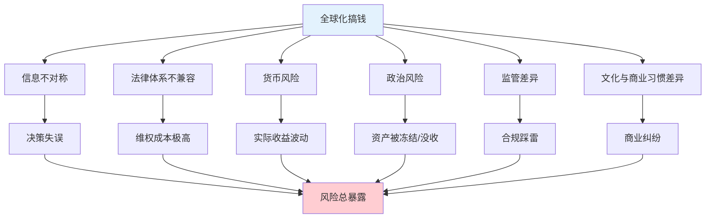
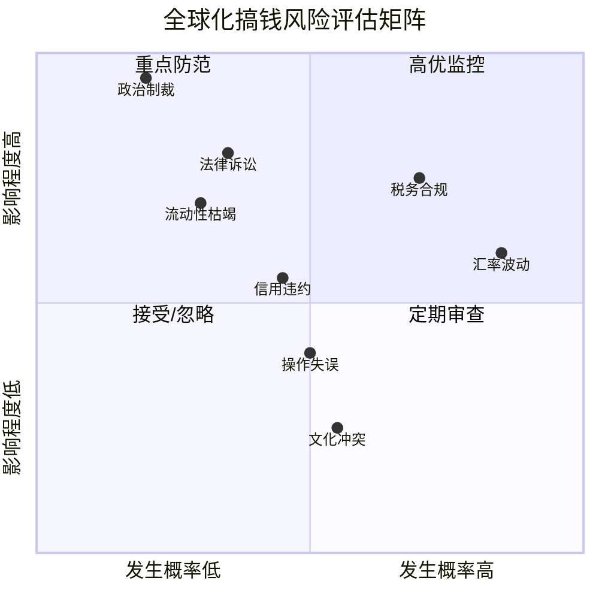
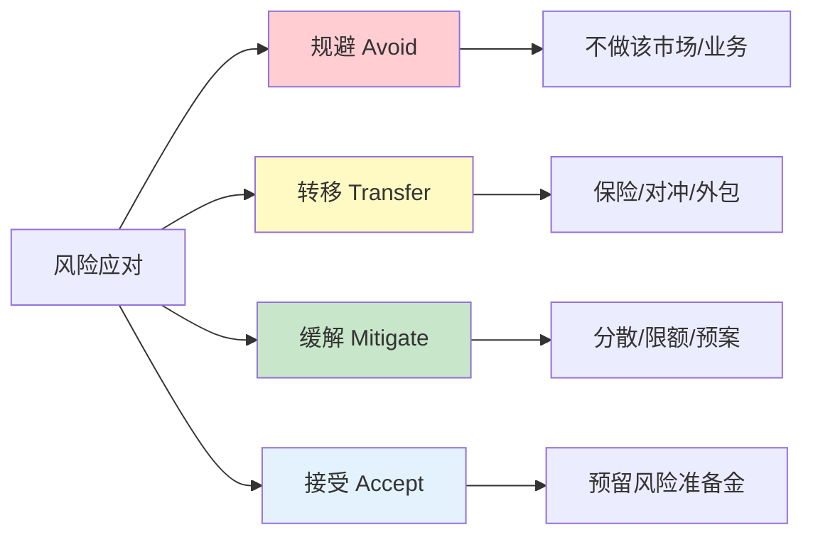

## 三、全球化搞钱的风险框架

全球化搞钱的收益诱人，但风险同样真实而严峻。2022年俄乌冲突爆发，俄罗斯股市单日暴跌45%，外资被冻结；2023年尼日利亚奈拉大幅贬值，持有当地资产的投资者一夜损失过半；2024年阿根廷比索再度崩盘，跨境电商业者的回款几乎归零——这些不是假设，而是活生生的教训。

风险框架不是用来吓退你的，而是让你在出海之前就知道：哪些风险可以通过对冲规避，哪些风险必须承受但可以量化，哪些风险应该直接避开。本节将系统构建全球化搞钱的完整风险认知体系，从识别、评估到应对，给出可落地的实操方案。

***

### 3.1 风险的本质：为什么全球化比国内搞钱更复杂

国内搞钱的风险相对单一：市场风险、信用风险、流动性风险，而且有相对完善的监管体系兜底。全球化搞钱之所以复杂，在于以下几个结构性差异：

**（1）信息不对称被放大**

你在A股研究一家公司，至少能看到完整的财报、研报、新闻。但在越南股市，一家上市公司的财务报告可能只有越南语版本，信息披露标准远低于中国。信息差越大，踩雷概率越高。

**（2）法律体系不兼容**

中国法律保护你的前提是对方也认这套规则。当你和一个美国客户发生纠纷，你需要在美国的法律体系下维权——费用、时间、语言门槛都是巨大的障碍。

**（3）货币风险无处不在**

你的收入可能是美元，支出是人民币，投资标的以欧元计价。三种货币之间的波动，每天都在侵蚀或增加你的实际收益，而且这种波动完全不在你的控制范围内。

**（4）政治风险不可预测**

一个国家突然改变外汇管制政策、提高外资税率、甚至冻结外国资产，你作为个人投资者几乎没有任何谈判筹码。



***

### 3.2 全球化搞钱的八大风险类别

全球化搞钱面临的风险可以系统分为八大类别。每一类都有不同的发生概率、影响程度和应对策略。

#### 3.2.1 汇率风险

**定义**：因汇率波动导致资产价值或收入缩水的风险。

**为什么排在第一位**：汇率风险是全球化搞钱中唯一"无处可逃"的风险。只要你的收入或资产以外币计价，汇率波动就会影响你的实际收益。

**汇率风险的三种形态：**

| 形态 | 说明 | 典型场景 |
|------|------|---------|
| 交易风险 | 签约到结算期间汇率变动 | 跨境电商从下单到收款的汇率波动 |
| 折算风险 | 合并报表时外币资产的折算差异 | 海外投资组合的人民币估值波动 |
| 经济风险 | 汇率变动影响企业长期竞争力 | 人民币升值导致出口商品价格优势下降 |

**真实案例**：2015年"8·11汇改"，人民币三天贬值4.6%。一位跨境电商卖家当月应收账款100万美元，汇改前折合620万人民币，汇改后只值591万人民币，三天蒸发29万。这笔钱够发三个员工一整年的工资。

**量化方法**：计算你的"汇率敞口"——所有外币资产和负债的净值。例如你持有10万美元资产和3万美元负债，净敞口为7万美元。人民币兑美元每变动1%，你就面临约700美元（约5000元人民币）的损益。

#### 3.2.2 政治与政策风险

**定义**：因目标国家政治变动、政策调整导致资产被限制、冻结或没收的风险。

**风险等级对照表：**

| 风险等级 | 典型国家/地区 | 风险表现 |
|---------|-------------|---------|
| 低风险 | 美国、日本、英国、德国、新加坡 | 政策稳定，产权保护强，偶有税率调整 |
| 中风险 | 印度、巴西、印尼、墨西哥 | 政策多变，外资限制频繁调整 |
| 高风险 | 阿根廷、土耳其、尼日利亚 | 外汇管制、资本冻结、货币崩溃 |
| 极高风险 | 委内瑞拉、伊朗、朝鲜 | 资产没收、全面制裁、无法汇出 |

**关键指标**：世界银行的"营商环境指数"（Ease of Doing Business Index）、透明国际的"腐败感知指数"（CPI）、经济学人智库的"国家风险评级"。这三个指标交叉使用，可以快速判断一个国家的政治风险水平。

**中国投资者的特殊风险**：中美关系紧张背景下，美国外国投资委员会（CFIUS）审查趋严。2023年TikTok面临强制出售，2024年对华半导体出口管制进一步升级。投资美国科技股或在美国设立公司时，必须关注CFIUS审查范围的扩大趋势。

#### 3.2.3 法律与合规风险

**定义**：因不了解或不遵守目标国家法律法规而导致的处罚、诉讼或经营限制。

**最容易踩雷的五大领域：**

**（1）证券法规**

不同国家对"合格投资者"的定义差异巨大。中国要求个人金融资产不低于300万元或近三年年均收入不低于50万元才能认定为合格投资者。而美国的Accredited Investor标准是净资产超过100万美元（不含住房）或年收入超过20万美元。在某些国家，向非合格投资者销售特定金融产品本身就是违法行为。

**（2）外汇管制**

中国个人每年5万美元购汇额度是硬性限制。通过"蚂蚁搬家"（多人分拆购汇）规避额度限制，一旦被发现会被列入"关注名单"，暂停购汇两年，并处以罚款。2023年外汇局处罚的违规案例中，个人分拆购汇占比超过40%。

**（3）数据保护法规**

欧盟的GDPR（通用数据保护条例）对跨境数据传输有严格要求。如果你的跨境电商业务涉及欧盟用户数据，未遵守GDPR最高可处以全球年营收4%或2000万欧元的罚款。2023年Meta因数据跨境传输问题被罚12亿欧元。

**（4）反洗钱法规**

大额跨境转账会触发反洗钱审查。美国《银行保密法》要求超过1万美元的现金交易必须报告。中国《反洗钱法》同样要求金融机构对大额和可疑交易进行报告。频繁的大额跨境资金流动，如果没有合理的商业解释，可能被冻结账户甚至面临刑事调查。

**（5）知识产权法规**

不同国家对知识产权的保护力度差异极大。在东南亚某些国家，商标被抢注后维权极其困难。跨境电商卖家经常遇到的一个问题是：你在中国注册的商标，在美国和欧洲不受保护。

#### 3.2.4 税务风险

**定义**：因税务规划不当或对各国税制理解不足而导致的额外税负、罚款或法律纠纷。

**核心概念——税务居民身份判定：**

| 判定标准 | 中国 | 美国 | 新加坡 | 香港 |
|---------|------|------|--------|------|
| 境内居住天数 | 满183天 | 满183天 | 满183天 | 满180天 |
| 征税范围 | 全球收入 | 全球收入 | 仅境内收入+汇入部分 | 仅境内收入 |
| 公民义务 | 有 | 有 | 无 | 无 |

**最容易忽视的税务风险：**

- **双重征税**：如果你同时是中国和新加坡的税务居民（比如在中国有住所，但在新加坡工作超过183天），两国都可能对你的全球收入征税。虽然有双边税收协定可以抵免，但申请流程复杂，且不一定覆盖所有收入类型。
- **CRS信息交换**：中国已加入全球税务信息自动交换体系（CRS）。你在新加坡、香港、瑞士等地的银行账户信息，会自动报送给中国税务机关。2018年以来，已有超过100个国家和地区参与CRS。试图通过海外账户隐匿收入的做法，在CRS时代几乎不可能成功。
- **数字服务税**：越来越多的国家开征数字服务税。如果你通过数字平台（如在线课程、SaaS服务）向法国、英国、印度等国用户提供服务，可能需要在当地缴纳数字服务税。

> ⚠️ **底线**：全球化搞钱的税务规划必须在合法合规的前提下进行。中国公民有义务向国内申报全球收入。任何逃税行为都是违法的，后果包括补缴税款、滞纳金、罚款，严重者可追究刑事责任。

#### 3.2.5 市场与流动性风险

**定义**：因市场波动导致资产价值下降，或因市场深度不足导致无法及时变现的风险。

**新兴市场的流动性陷阱**：

很多人被新兴市场的高回报吸引，却忽视了流动性问题。越南胡志明交易所日均成交额约5亿美元，而中国A股日均成交额超过1万亿人民币。这意味着：当你需要卖出时，可能找不到足够的买家，或者必须大幅折价才能成交。

**流动性风险评估框架：**

```text
流动性评分 = f(日均成交量, 买卖价差, 市场深度, 交易限制)

评分标准：
  5分：美国大盘股、沪深300成分股（秒级成交，价差<0.1%）
  4分：港股主板、欧洲主要指数ETF（分钟级成交，价差<0.5%）
  3分：东南亚主要交易所、日本中小盘（小时级成交，价差<1%）
  2分：越南、印度中小盘、新兴市场债券（天级成交，价差1-3%）
  1分：非洲市场、小国国债、非上市REITs（周级甚至更长，价差>5%）
```

**建议**：任何单一海外市场的配置，不要超过总资产的30%。同时保留至少20%的高流动性资产（如货币基金、短期国债），确保在极端情况下可以在3天内变现。

#### 3.2.6 操作与技术风险

**定义**：因系统故障、操作失误、账户安全问题导致的损失。

**典型场景：**

- **券商倒闭**：2022年FTX交易所崩盘，用户资产瞬间归零。虽然这是加密货币交易所，但传统券商同样存在风险。关键是要确认券商是否受到严格监管，是否参与投资者保护计划（如美国SIPC提供最高50万美元的保护）。
- **账户被盗**：海外投资账户的安全防护往往不如国内券商完善。启用双因素认证（2FA）、定期更换密码、不在公共WiFi下操作交易，是最基本的安全措施。
- **汇款错误**：跨境汇款一旦发出，撤回极其困难。收款银行名称、账号、SWIFT代码、附言，任何一个字段填写错误都可能导致资金丢失。曾有案例因SWIFT代码填错，10万美元被转入错误账户，追回耗时6个月。
- **税务申报错误**：不同国家的税务申报格式、截止日期、计算方法完全不同。美国要求海外金融账户申报（FBAR），逾期不报最高罚款10万美元或账户余额的50%（取较高者）。

#### 3.2.7 信用与交易对手风险

**定义**：因交易对手违约、欺诈或无力履约导致的损失。

**全球化场景下的信用风险特点：**

- **跨境电商**：买家拒付、恶意退款、信用卡欺诈是常见问题。PayPal和Stripe的买家保护政策有时会过度倾向买家，导致卖家钱货两空。
- **自由职业**：海外客户拖欠付款甚至消失。Upwork等平台有托管保护，但直接客户交易需要预付款机制。
- **海外房产**：开发商跑路、产权纠纷、物业管理不善。东南亚某些国家的"楼花"（期房）项目，烂尾率高达20%。
- **P2P借贷平台**：海外P2P平台的违约率远高于宣传数据。中国投资者参与的海外P2P项目，违约率中位数约为15%。

**降低信用风险的方法：**

1. 使用有买家/卖家保护的第三方平台
2. 大额交易要求预付款或信用证
3. 对交易对手进行基本的背景调查
4. 分散交易对手，不与单一客户/供应商绑定超过30%的业务

#### 3.2.8 声誉与文化风险

**定义**：因文化差异、沟通失误、品牌定位不当导致的商业声誉损失。

**常见文化陷阱：**

- **定价策略**：同样的商品，在美国定价$9.99是"便宜"，在瑞士定价9.99瑞郎可能被认为"廉价低质"。不了解目标市场的价格敏感度，可能导致定价失误。
- **营销内容**：颜色、数字、手势在不同文化中的含义截然不同。白色在西方代表纯洁，在东亚某些场合代表丧事。"4"在中文中谐音"死"，在日本和韩国则没有这个忌讳。
- **沟通风格**：德国人重视直接和精确，日本人重视含蓄和面子。在跨境商务中，用错了沟通风格可能导致合作失败。
- **社交媒体危机**：一条不当的推文或广告，在全球化传播下可能在24小时内演变成品牌危机。2018年Dolce & Gabbana因辱华广告在中国市场几乎被彻底封杀。

***

### 3.3 风险评估矩阵：量化你的风险暴露

识别了八大风险之后，需要用一个系统化的方法来评估每种风险对你的具体影响程度。

#### 3.3.1 风险评估矩阵



#### 3.3.2 个人风险评分表

根据你的实际情况，对每项风险进行评分（1-5分），然后计算加权总分：

| 风险类别 | 权重 | 你的评分(1-5) | 加权得分 | 应对优先级 |
|---------|------|-------------|---------|----------|
| 汇率风险 | 20% | _×_ | =_ | |
| 政治风险 | 15% | _×_ | =_ | |
| 法律合规 | 15% | _×_ | =_ | |
| 税务风险 | 15% | _×_ | =_ | |
| 市场流动性 | 10% | _×_ | =_ | |
| 操作风险 | 10% | _×_ | =_ | |
| 信用风险 | 10% | _×_ | =_ | |
| 声誉风险 | 5% | _×_ | =_ | |
| **总分** | **100%** | | **/5** | |

**评分标准**：1分=风险极低或已充分对冲；3分=中等风险，需要主动管理；5分=高风险，必须立即采取措施。

**总分解读**：
- **1.0-2.0**：风险可控，维持现有策略，定期复查
- **2.1-3.0**：中等风险，需要制定专项风险管理计划
- **3.1-4.0**：高风险，必须立即采取对冲措施，减少风险暴露
- **4.1-5.0**：极高风险，建议暂停相关业务，重新评估策略

***

### 3.4 风险应对策略：四类通用方法

无论面对哪种风险，应对策略都可以归纳为四类：



#### 3.4.1 规避（Avoid）

**适用场景**：风险发生概率高、影响程度大、且无法有效对冲。

**实操建议**：
- 不投资政治风险等级为"极高"的国家（委内瑞拉、伊朗等）
- 不参与不理解的复杂金融衍生品交易
- 不在没有投资者保护机制的平台存放大额资金
- 不在没有双边投资保护协定的国家进行大额直接投资

**案例**：2022年俄乌冲突前，多位中国投资者通过俄罗斯券商购买了俄罗斯国债和股票。冲突爆发后，这些资产被冻结，至今无法变现。如果他们在投资前评估了地缘政治风险，完全可以避免这一损失。

#### 3.4.2 转移（Transfer）

**适用场景**：风险可以通过金融工具或第三方服务转移。

**主要工具：**

| 工具 | 适用风险 | 成本 | 效果 |
|------|---------|------|------|
| 远期外汇合约 | 汇率风险 | 0.5-2% | 锁定未来汇率，消除波动 |
| 外汇期权 | 汇率风险 | 1-5% | 保留获利空间，限定最大损失 |
| 海外投资保险 | 政治风险 | 保费1-3% | 覆盖征收、汇兑限制等政治事件 |
| 信用证 | 信用风险 | 手续费0.1-0.5% | 银行担保付款，降低交易对手风险 |
| 离岸公司 | 法律风险 | 注册+维护费 | 资产隔离，分散法律管辖风险 |

**远期外汇合约实操示例**：

假设你是一名跨境电商卖家，预计3个月后收到10万美元货款，当前汇率7.25。你担心人民币升值（美元贬值），可以与银行签订3个月远期结汇合约，锁定汇率7.20。

- 如果3个月后汇率跌到7.00：远期合约帮你避免了2万元损失（10万×0.20）
- 如果3个月后汇率涨到7.40：你放弃了2万元收益（机会成本）

远期合约的本质是"用潜在收益换取确定性"，适合风险厌恶型的投资者。

#### 3.4.3 缓解（Mitigate）

**适用场景**：风险无法完全消除，但可以通过策略降低影响。

**七大缓解措施：**

**（1）地域分散**

不要把所有资金集中在单一国家。即使是美国这样的"安全"市场，也有系统性风险（如2008年金融危机）。建议单一国家配置不超过总资产的30%。

**（2）货币对冲**

持有多种货币资产，形成自然对冲。例如：50%美元资产+20%人民币资产+15%欧元资产+15%其他货币。当美元贬值时，其他货币资产相对升值，部分抵消损失。

**（3）仓位控制**

单笔投资不超过总资产的5-10%。即使某一投资完全归零，也不会影响整体财务安全。

**（4）止损机制**

为每笔海外投资设定止损线。建议：
- 股票类：下跌15-20%强制止损
- 债券类：下跌5-10%重新评估
- 房产类：租金回报率低于3%考虑退出

**（5）信息监控**

建立关键风险指标的监控机制：
- 目标国家的政治稳定性指标（CDS利差、外汇储备变动）
- 相关货币的汇率走势（关注央行货币政策信号）
- 行业监管政策变化（订阅当地律所/咨询公司的Newsletter）

**（6）应急预案**

为每种高风险场景准备应急预案：
- 账户被冻结：准备备用券商/银行账户
- 汇率剧烈波动：提前签订对冲合约或保留多币种现金
- 平台关闭/跑路：资产分散在2-3个以上平台

**（7）定期再平衡**

每季度或半年对全球投资组合进行再平衡。当某类资产因涨跌幅度过大偏离目标配置比例时，卖出超配资产，买入低配资产，回到原始配置比例。

#### 3.4.4 接受（Accept）

**适用场景**：风险发生概率低、影响可控，或对冲成本高于潜在损失。

**接受风险的前提条件**：
1. 已经充分了解该风险的性质和潜在损失
2. 潜在损失在可承受范围内（不超过总资产的5%）
3. 预留了足够的风险准备金

**风险准备金建议**：
- 全球化搞钱初期：保留总资产的15-20%作为风险准备金
- 成熟期：保留10-15%
- 准备金应以高流动性资产形式持有（货币基金、短期国债）

***

### 3.5 不同业务场景的风险管理重点

不同类型的全球化搞钱方式，面临的主要风险差异很大，需要针对性地制定管理策略。

#### 3.5.1 跨境电商

| 主要风险 | 发生概率 | 影响程度 | 重点应对措施 |
|---------|---------|---------|------------|
| 汇率风险 | 高 | 中 | 远期结汇+多币种收款账户 |
| 平台政策风险 | 中 | 高 | 多平台布局，不依赖单一平台 |
| 物流风险 | 中 | 中 | 多物流商备选，FBA+海外仓分散 |
| 知识产权风险 | 中 | 高 | 提前注册目标国商标和专利 |
| 税务合规风险 | 高 | 高 | 聘请当地税务顾问，按时申报VAT/GST |

#### 3.5.2 海外投资

| 主要风险 | 发生概率 | 影响程度 | 重点应对措施 |
|---------|---------|---------|------------|
| 市场风险 | 高 | 高 | 资产分散+定期再平衡 |
| 汇率风险 | 高 | 中 | 货币对冲或多币种配置 |
| 流动性风险 | 中 | 高 | 保留高流动性资产，避免过度配置新兴市场 |
| 政治风险 | 低-中 | 极高 | 关注地缘政治信号，分散国家配置 |
| 券商/平台风险 | 低 | 高 | 选择受严格监管的券商，确认SIPC/FSCS保护 |

#### 3.5.3 跨境自由职业/远程工作

| 主要风险 | 发生概率 | 影响程度 | 重点应对措施 |
|---------|---------|---------|------------|
| 收入不稳定 | 高 | 中 | 建立3-6个月应急资金 |
| 收款风险 | 中 | 中 | 使用可靠的跨境收款平台（Payoneer/Wise） |
| 税务合规风险 | 高 | 高 | 确认税务居民身份，按时申报 |
| 客户违约 | 中 | 中 | 预付款机制+平台托管 |
| 合规风险 | 中 | 高 | 了解自由职业的劳动法和税务规定 |

***

### 3.6 风险监控仪表盘：建立你的预警系统

风险管理不是一次性工作，而是持续的监控和调整过程。建议建立一个简单的风险监控仪表盘，定期更新。

#### 3.6.1 核心监控指标

| 指标类别 | 具体指标 | 监控频率 | 预警阈值 |
|---------|---------|---------|---------|
| 汇率 | 主要货币兑人民币汇率 | 每日 | 单月波动>3% |
| 政治 | 目标国CDS利差 | 每周 | 利差扩大>100bp |
| 市场 | 投资组合回撤幅度 | 每日 | 回撤>15% |
| 流动性 | 可变现资产占比 | 每月 | 低于20% |
| 集中度 | 单一国家/平台占比 | 每月 | 超过30% |
| 合规 | CRS信息交换状态 | 每年 | 有新增交换国 |

#### 3.6.2 实用监控工具

- **汇率监控**：XE.com、Investing.com的汇率提醒功能，设定阈值自动通知
- **政治风险**：订阅Economist Intelligence Unit（EIU）的国家风险报告
- **市场监控**：券商APP的价格提醒功能，TradingView的组合追踪
- **新闻监控**：Google Alerts设定关键词（目标国家+投资/政策/外汇等）
- **税务日历**：在日历中标注各国的税务申报截止日期，提前30天提醒

#### 3.6.3 定期风险审查清单

**每月审查（15分钟）：**

- [ ] 检查汇率变动对投资组合的影响
- [ ] 确认各平台账户安全（登录记录、2FA状态）
- [ ] 检查集中度是否超标（单一国家/平台/资产类别）
- [ ] 确认可变现资产比例是否足够

**每季度审查（1小时）：**

- [ ] 评估投资组合是否需要再平衡
- [ ] 检查目标国家的政治经济动态
- [ ] 更新风险评分表
- [ ] 检查是否有新的法规变化影响业务
- [ ] 评估对冲工具的到期情况和续期需求

**每年审查（半天）：**

- [ ] 全面评估八大风险类别的暴露情况
- [ ] 更新税务居民身份认定
- [ ] 审查所有海外账户的合规状态
- [ ] 评估是否需要调整全球化策略的大方向
- [ ] 更新应急预案

***

### 3.7 风险管理的常见误区

**误区一：只看收益不看风险**

很多人选择海外投资标的时只看历史回报率，完全忽视风险指标。一个年化收益20%但波动率40%的投资，可能不如一个年化收益10%但波动率10%的投资——因为前者在最坏情况下可能亏损超过50%。

**纠正方法**：用夏普比率（Sharpe Ratio）评估风险调整后的收益。夏普比率 =（预期收益率 - 无风险利率）/ 波动率。夏普比率>1为良好，>2为优秀。

**误区二：把鸡蛋放在一个"海外篮子里"**

有些人以为把资金从中国转移到美国就是"全球分散"。但如果全部配置美股，当美股系统性下跌时（如2022年纳斯达克跌33%），你同样会遭受重创。

**纠正方法**：真正的分散是"国家×资产类别×货币"三个维度的交叉分散。至少覆盖3个以上国家、2种以上资产类别、2种以上货币。

**误区三：忽视小额费用的累积效应**

跨境交易的各种费用——汇率差价、转账手续费、平台佣金、税务顾问费——单项看起来很小，但累积起来非常可观。假设你每年跨境转账10次，每次手续费0.5%，汇率差价0.3%，一年下来就是8%的摩擦成本。

**纠正方法**：建立费用清单，定期核算总摩擦成本。使用Wise等低手续费平台，集中大额转账减少次数，选择汇率透明的银行。

**误区四：过度依赖单一平台或中介**

所有资金放在一个券商、所有销售依赖一个电商平台、所有收款通过一个支付工具——这种集中本身就是巨大的风险。

**纠正方法**：核心资产分散在2-3个受严格监管的平台。每个平台的资金不超过总资产的40%。确保每个平台都有独立的登录凭证和2FA。

**误区五：风险准备金不足或没有**

很多全球化搞钱的新手把所有资金都投入了海外投资或业务，没有预留足够的应急资金。当遇到突发状况（汇率暴跌、账户冻结、平台政策变化）时，没有缓冲空间，被迫在最不利的时点止损。

**纠正方法**：始终保留总资产10-20%的风险准备金，以高流动性、低风险的形式持有（货币基金、活期存款）。这笔钱的唯一用途就是应对突发风险。

**误区六：忽视合规成本**

"先把业务做起来，合规以后再说"——这是最危险的心态。在很多国家，事后补救的罚款远高于事前合规的成本。GDPR的最高罚款是全球年营收的4%或2000万欧元；美国FBAR逾期申报的罚款是账户余额的50%。

**纠正方法**：在开展任何跨境业务之前，先了解目标国家的基本合规要求。对于复杂的法律和税务问题，聘请当地专业人士，这笔钱是值得的投资。

***

### 3.8 本节核心要点

1. **全球化搞钱的风险比国内更复杂**，主要源于信息不对称、法律体系不兼容、货币风险和政治风险四个结构性因素。

2. **八大风险类别**需要全面识别：汇率、政治政策、法律合规、税务、市场流动性、操作技术、信用交易对手、声誉文化。

3. **用风险评估矩阵量化你的暴露**，对每类风险打分（1-5分），加权计算总分，确定应对优先级。

4. **四类应对策略**——规避、转移、缓解、接受——根据风险的概率和影响程度选择合适的方法组合。

5. **不同业务场景有不同的风险管理重点**：跨境电商重点关注汇率和平台政策，海外投资重点关注市场和流动性，自由职业重点关注收入稳定性和税务合规。

6. **建立持续的风险监控机制**：每日关注汇率和市场，每周关注政治动态，每月审查集中度和流动性，每季度全面评估。

7. **六个常见误区**必须避免：只看收益不看风险、单一海外篮子、忽视小额费用、过度依赖单一平台、风险准备金不足、忽视合规成本。

8. **风险管理的目标不是消除风险**，而是在可承受的风险水平下实现收益最大化。完全无风险等于零收益，关键是在风险和收益之间找到你的最优平衡点。
