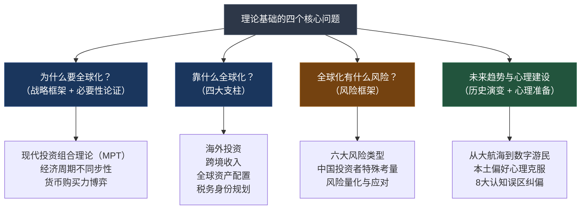
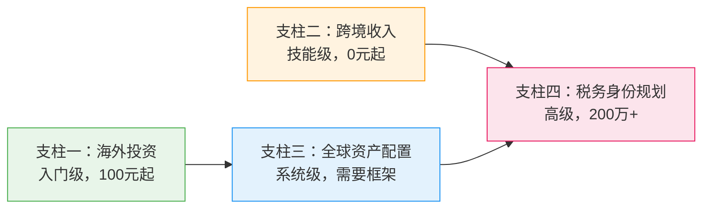

## 四、本节核心要点

> 📌 **本节定位：** 这是理论基础部分的"导航地图"。在读完前面的战略框架、全球化必要性、四大支柱和风险框架之后，本节将所有核心知识点浓缩为可快速查阅的要点集。建议先通读一遍建立全局感，后续在实操阶段随时回来对照。

***

### 4.1 理论基础全景回顾

理论基础部分回答了全球化搞钱最根本的四个问题——**为什么要出去、靠什么出去、出去有什么风险、历史上别人怎么做的**。这四个问题构成了整个第34章的"道"，后面的"法"（核心技巧）和"术"（实战案例）都建立在这个理论地基之上。



***

### 4.2 为什么必须全球化——三个不可反驳的理由

#### 理由一：现代投资组合理论（MPT）的全球化延伸

马科维茨在1952年提出的MPT核心结论：**持有相关性低的资产组合，可以在不降低预期收益的前提下显著降低风险。** 这个结论在全球化语境下尤为关键——不同国家的股市相关性远低于同一国家内不同行业的相关性。

**量化证据：**

| 配置类型 | 年化预期收益 | 年化波动率 | 最大回撤 | 夏普比率 |
|---------|------------|----------|---------|---------|
| 纯A股沪深300 | 7-8% | ~25% | -40%~-50% | ~0.30 |
| 纯美股标普500 | 9-10% | ~18% | -30%~-40% | ~0.50 |
| 全球分散配置 | 7-9% | ~14% | -20%~-30% | ~0.55 |

关键发现：全球分散配置在获得相近收益的同时，**波动率降低约40%，最大回撤降低约50%，夏普比率提升20%-40%**。这不是理论推演，是基于过去30年真实市场数据的回测结论。

#### 理由二：经济周期的全球不同步性

不同国家的经济周期并不同步，这是全球化分散的第二个理论支柱。

**2022年的极端案例：**

| 市场 | 2022年表现 | 原因 |
|------|-----------|------|
| A股沪深300 | -21.6% | 疫情封控+地产暴雷 |
| 美股标普500 | -19.4% | 美联储激进加息 |
| 日经225 | -9.4% | 日元贬值利好出口 |
| 巴西Bovespa | +4.7% | 大宗商品牛市 |

同一年份，四个市场的表现从亏损21%到盈利4.7%，**差距超过26个百分点**。如果你只持有A股，2022年是灾难性的一年；但如果你同时持有巴西和日本的资产，整体损失会大幅缩小。

#### 理由三：货币购买力的长期博弈

人民币在过去20年经历了从升值到贬值的完整周期。持有单一货币计价的资产，本质上是在赌这个国家的货币政策和经济走势。全球配置的第三个理论支撑是：**通过持有多种货币资产，对冲单一货币的购买力风险。**

| 时期 | 人民币兑美元走势 | 对持有美元资产的中国投资者影响 |
|------|----------------|---------------------------|
| 2005-2013 | 升值约35% | 汇率损失，但A股涨幅更大 |
| 2015-2016 | 贬值约12% | 汇率收益，美元资产增值 |
| 2018-2019 | 贬值约8% | 汇率收益 |
| 2020-2021 | 升值约10% | 汇率损失 |
| 2022-2023 | 贬值约10% | 汇率收益 |

**结论：没有任何一种货币能保证长期单向走势。** 全球配置的货币分散效果，相当于为你买了一份"汇率保险"。

***

### 4.3 四大支柱速览——全球化搞钱的行动框架

全球化搞钱不是单一动作，而是由四个支柱支撑的系统。每个支柱对应不同的能力要求和资金门槛，你可以从任何一个支柱切入。

| 支柱 | 核心定义 | 最低门槛 | 适合人群 | 典型路径 |
|------|---------|---------|---------|---------|
| **支柱一：海外投资** | 用钱生钱跨越国界 | 100元（QDII基金） | 所有投资者 | QDII→港股通→美股直开 |
| **支柱二：跨境收入** | 劳动收入的全球化 | 0元（需技能） | 有专业技能者 | 自由职业→跨境电商→远程工作 |
| **支柱三：全球资产配置** | 系统化的风险管理 | 10万+ | 有投资经验者 | 核心-卫星法→定期再平衡 |
| **支柱四：税务身份规划** | 合法节税的高级玩法 | 200万+ | 高净值人群 | 数字游民签证→税务架构设计 |

**四大支柱的递进关系：**



**支柱一详解——海外投资的三条路径：**

- **QDII基金**：国内基金公司发行的海外投资基金，支付宝/天天基金100元起投，无需换汇、无需海外账户。这是所有人全球化搞钱的第一步。
- **港股/港股通**：港股通50万门槛（互联网券商无门槛），可投资AH溢价股（同一公司H股通常比A股便宜20%-50%）。
- **美股直开**：通过盈透证券、富途、老虎等互联网券商直接开户，投资全球创新龙头。

**支柱二详解——跨境收入的三条路径：**

- **海外自由职业**：通过Upwork、Fiverr等平台接单，收入以美元计价，天然货币对冲。适合程序员、设计师、翻译、营销人才。
- **跨境电商**：Amazon、Shopify等平台将中国产品卖向全球，利用供应链优势获取海外市场溢价。
- **远程工作**：国际公司远程岗位，在国内生活享受海外薪资。需要英语能力和国际化工作习惯。

**支柱三详解——全球资产配置的四维分散：**

1. **地域分散**：资金分布在不同国家和地区（中国40% / 美国30% / 其他发达市场15% / 新兴市场15%）
2. **资产类别分散**：股票、债券、房产、商品多类别配置
3. **货币分散**：持有多种货币计价的资产
4. **时间分散**：定期定额投资，避免择时风险

**经典配置模型：**

| 配置类型 | 股票 | 债券 | 另类资产 | 现金 | 适合人群 |
|---------|------|------|---------|------|---------|
| 保守型 | 30% | 50% | 10% | 10% | 退休人群、风险厌恶者 |
| 平衡型 | 50% | 30% | 15% | 5% | 大多数投资者 |
| 进取型 | 70% | 15% | 10% | 5% | 年轻投资者、风险承受力强者 |

**支柱四详解——税务身份规划的三条路径：**

- **投资移民**：葡萄牙黄金签证、希腊购房移民等欧洲项目，或新加坡全球商业投资者计划。注意：中国不承认双重国籍。
- **数字游民签证**：50+国家推出，允许远程工作者在海外长期合法居住。通常有收入门槛，不一定改变税务居民身份。
- **合法税务优化**：利用不同国家的税率差异、税收协定、收入确认时间和地点的合理安排。

> ⚠️ **底线提醒：** 中国公民有义务向国内申报全球收入。税务规划必须在合法合规前提下进行，任何逃税行为后果严重。

***

### 4.4 风险框架速览——六大风险类型

全球化搞钱不是只有机会，还伴随着六大类风险。理解这些风险不是为了吓退你，而是为了让你在每一步都有预案。

| 风险类型 | 核心含义 | 严重程度 | 典型场景 | 应对策略 |
|---------|---------|---------|---------|---------|
| **汇率风险** | 人民币升值侵蚀海外收益 | ★★★★ | 2020-2021年人民币升值10%，美元资产账面缩水 | 货币分散+自然对冲 |
| **政策风险** | 外汇管制、资本流动限制 | ★★★★★ | 5万美元年度购汇额度限制 | QDII基金绕过个人换汇限制 |
| **法律风险** | 不熟悉当地法律法规 | ★★★★ | 海外房产交易中的法律纠纷 | 聘请当地律师+充分尽调 |
| **信息不对称** | 对海外市场了解不足 | ★★★ | 误买"壳公司"股票 | 优先投资指数ETF，降低个股选择风险 |
| **政治风险** | 地缘政治导致资产冻结 | ★★★★ | 制裁导致特定国家资产无法变现 | 分散到多个国家，避免集中于单一地缘风险区 |
| **税务风险** | 双重征税、合规遗漏 | ★★★ | 未申报海外收入被追缴税款和滞纳金 | 了解CRS规则+专业税务顾问 |

**中国投资者的特殊考量：**

中国投资者面临的全球化障碍比发达国家投资者更多：

1. **5万美元购汇限额**：每年个人便利化购汇额度有限，大额资金出境需要合规安排
2. **资本管制**：资本项下尚未完全开放，跨境投资渠道受限
3. **CRS信息交换**：100+国家自动交换税务居民的海外金融账户信息，隐匿海外资产越来越难
4. **税收制度差异**：中国是全球征税国家，税务居民需申报全球收入
5. **时差与信息差**：交易美股需要熬夜，海外市场信息获取不如A股方便

**应对框架——风险管理的"三道防线"：**

| 防线 | 内容 | 具体措施 |
|------|------|---------|
| 第一道：认知防线 | 理解风险本质 | 系统学习本章理论基础，不盲目跟风 |
| 第二道：结构防线 | 通过配置降低风险 | 地域分散+资产类别分散+货币分散+时间分散 |
| 第三道：操作防线 | 具体风险应对措施 | 汇率对冲工具+止损纪律+定期再平衡+专业顾问 |

***

### 4.5 历史演变与未来趋势——五个关键阶段

全球化搞钱不是新概念，它有400年的历史脉络。理解历史，是为了看清趋势。

| 时期 | 驱动因素 | 代表事件 | 对今天的启示 |
|------|---------|---------|------------|
| **大航海时代（15-17世纪）** | 地理发现 | 荷兰东印度公司成立（1602），全球第一只股票 | 跨国投资的起源就是寻找超额收益 |
| **殖民贸易时代（18-19世纪）** | 工业革命+殖民扩张 | 英国资本全球输出，伦敦成为金融中心 | 资本总是流向回报最高的地方 |
| **布雷顿森林时代（1944-1971）** | 二战后国际秩序 | 美元成为世界货币，IMF和世界银行成立 | 美元资产的"避风港"地位有制度基础 |
| **金融全球化时代（1980-2010）** | 资本流动自由化 | QFII制度（2002）、沪港通（2014）开放 | 中国投资者的全球化通道逐步打开 |
| **数字游民时代（2010至今）** | 远程工作+数字资产 | 50+国家推出数字游民签证，加密资产兴起 | 全球化搞钱的门槛正在快速降低 |

**未来趋势研判：**

1. **人民币国际化加速**：CIPS系统扩展、双边本币结算增多，未来跨境投资将更便利
2. **数字资产崛起**：加密货币、NFT等新资产类别提供了无国界的投资渠道（但监管不确定性高）
3. **远程工作常态化**：跨境收入获取的门槛持续降低，技能变现更直接
4. **监管趋严**：全球税务透明化（CRS扩展）、反洗钱力度加大，合规成本上升
5. **新兴市场机遇**：东南亚、印度等市场的人口红利和数字化进程带来新的投资机会

***

### 4.6 心理准备——跨越国境前先跨越心理障碍

全球化搞钱最大的障碍往往不是资金门槛，而是心理障碍。以下是必须克服的五种心理：

| 心理障碍 | 表现 | 根因 | 破解方法 |
|---------|------|------|---------|
| **本土偏好** | 只投资A股，觉得国内更安全 | 熟悉感偏好+信息不对称恐惧 | 从100元QDII基金开始，用小钱试水 |
| **损失厌恶放大** | 海外投资一亏就撤，觉得"果然不该出去" | 心理账户效应——把海外投资单独记账 | 建立"全球组合"思维，看整体而非单笔 |
| **完美主义拖延** | "等我研究透了再开始" | 对未知领域的过度谨慎 | 接受"先上车再补票"——买指数ETF不需要研究个股 |
| **锚定效应** | 用人民币思维看美元资产 | 货币计价的心理锚定 | 建立"实际购买力"思维，关注扣除通胀后的真实收益 |
| **从众恐慌** | 听到"海外投资风险大"就退缩 | 社会认同心理 | 回顾本节数学证据——全球配置降低而非增加风险 |

**心理建设的核心认知转变：**

```text
旧认知：全球化搞钱 = 有钱人的游戏 = 高风险 = 麻烦
新认知：全球化搞钱 = 基础风险分散 = 降低整体风险 = 100元即可开始
```

***

### 4.7 理论层面的八大认知误区

在进入实操之前，必须先纠正理论层面的八大认知误区。这些误区如果不在认知层面解决，后面的所有实操都会走偏。

| # | 误区 | 真相 | 纠正后的正确认知 |
|---|------|------|----------------|
| 1 | "全球化搞钱是有钱人的专利" | QDII基金100元起投，互联网券商无门槛 | 门槛不在资金，在认知 |
| 2 | "中国经济发展快，不需要投资海外" | 高增长不等于高回报——A股10年涨幅远低于GDP增速 | GDP增速和股市回报是两回事 |
| 3 | "海外投资就是把钱转出去" | QDII基金、港股通都是合规渠道，钱不需要出境 | 大部分海外投资不需要换汇 |
| 4 | "汇率风险太大，不值得" | 汇率风险可以通过货币分散和自然对冲管理 | 汇率风险是可管理的，不配置的风险更大 |
| 5 | "A股已经足够分散了" | A股不同行业之间的相关性远高于不同国家之间的相关性 | 同一市场的分散效果有限 |
| 6 | "海外投资太复杂，我搞不懂" | 买一只全球指数ETF就是最简单的全球配置 | 从最简单的开始，逐步深入 |
| 7 | "外汇管制意味着不能投资海外" | 5万美元购汇+QDII+港股通，合法渠道很多 | 管制限制的是规模，不是方向 |
| 8 | "CRS意味着海外资产会被查" | CRS是信息交换工具，合规申报就不存在"被查"的问题 | 合规是保护，不是威胁 |

***

### 4.8 核心公式与关键数字速查卡

在后续的实操过程中，以下数字和公式会反复出现，建议收藏本节作为速查参考。

**关键数字速查：**

| 数字 | 含义 | 出处/依据 |
|------|------|----------|
| 5万美元 | 中国个人年度便利化购汇额度 | 国家外汇管理局规定 |
| 50万人民币 | 港股通开户资金门槛 | 上交所/深交所规定 |
| 100元 | QDII基金最低起投金额 | 各基金公司产品说明 |
| 10% | 美股标普500长期历史年化收益率（1926-2023） | 标普公司历史数据 |
| 25% | 纯A股组合年化波动率 | 基于沪深300历史数据 |
| 14% | 全球分散配置年化波动率 | 基于多市场组合回测 |
| 30%-50% | 全球配置相比纯A股最大回撤的典型降幅 | 历史回测数据 |
| 20%-40% | 全球配置后夏普比率的典型提升幅度 | 历史回测数据 |
| 100+ | 参与CRS信息交换的国家和地区数量 | OECD官方数据 |
| 50+ | 推出数字游民签证的国家数量 | 2024年统计 |

**全球配置的数学本质：**

```text
投资组合风险 = f(各资产权重, 各资产波动率, 资产间相关系数)

当资产间相关系数 < 1 时，组合风险 < 加权平均风险

中国市场与美国市场的历史相关系数：约0.3-0.5
中国市场与日本市场的历史相关系数：约0.2-0.4
中国市场与巴西市场的历史相关系数：约0.1-0.3

→ 相关系数越低，分散效果越显著
→ 跨国分散的效果远大于同一市场内不同行业的分散
```

**一个直觉化的数字对比：**

假设你在2022年初有100万人民币，分别用两种策略投资到年底：

| 策略 | 2022年底价值 | 最大浮亏 | 心理感受 |
|------|------------|---------|---------|
| 100% 沪深300 | ~78万 | -26万 | 😰 焦虑失眠 |
| 40%沪深300 + 30%标普500 + 15%日经225 + 10%黄金 + 5%债券 | ~88万 | -15万 | 😌 还能睡着 |

同样的100万，全球配置少亏10万，最大浮亏少11万。**这就是"不把所有鸡蛋放在同一个国家篮子里"的数学证明。**

***

### 4.9 本节核心结论——三个必须记住的判断

经过理论基础全部内容的梳理，最终浓缩为三个必须记住的判断：

**判断一：全球化搞钱不是"要不要"的问题，而是"怎么开始"的问题。**

单一市场配置的风险已经被数学证明是不可忽视的。即使你只有100元，也应该通过QDII基金开始全球配置。这不是激进建议，而是基本的风险管理。

**判断二：四大支柱不是"四选一"，而是"逐步叠加"的。**

大多数人的路径是从支柱一（海外投资）开始，逐步发展到支柱三（全球资产配置）。有专业技能的人可以同时推进支柱二（跨境收入）。高净值人群才需要考虑支柱四（税务身份规划）。但无论你当前处于哪个阶段，四大支柱提供了一个完整的行动地图。

**判断三：风险管理的目标是"可控"，不是"消除"。**

全球化搞钱的风险不会消失，但可以通过结构化手段将其控制在可承受范围内。六大风险都有对应的管理策略，关键是在行动前了解风险、在过程中监控风险、在出问题时有预案。

***

### 4.10 从理论到实践的衔接——下一步行动指引

理论基础到此结束。在进入核心技巧部分之前，用以下自测清单确认你是否已经具备了足够的理论基础：

**理论自测清单：**

- [ ] 我能解释"为什么不能只投资国内市场"的三个理论依据
- [ ] 我了解全球化搞钱的四大支柱，知道哪个最适合我当前阶段
- [ ] 我知道六大风险类型中的至少四种，以及基本应对策略
- [ ] 我理解QDII基金、港股通、互联网券商的基本区别
- [ ] 我知道5万美元购汇额度的含义和限制
- [ ] 我克服了"全球化搞钱是有钱人的专利"这个认知误区
- [ ] 我理解全球配置降低波动率和最大回撤的数学原理

如果你有2项以上打不了勾，建议回头重读对应的理论章节。理论不扎实，实操会走弯路。

**如果你已经全部打勾——恭喜，进入核心技巧部分，开始真正的实操。**

> 📌 **一句话记住本节：** 全球化搞钱的理论基础可以用"一个公式、三个理由、四大支柱、六种风险、八个误区"概括——分散投资降低风险（MPT），因为经济周期不同步、货币购买力博弈、单一市场系统性风险太大，通过海外投资/跨境收入/资产配置/税务规划四条路径实现，同时管理好汇率/政策/法律/信息/政治/税务六种风险，纠正"有钱人才能做""太复杂搞不懂""管制不让做"等八个认知误区。
