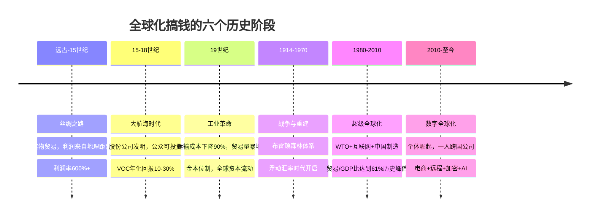

## 五、全球化搞钱的历史演变与未来趋势

理解全球化搞钱的历史演变，不是为了怀古，而是为了看清规律。每一个时代的全球化浪潮都创造了新的财富阶层，也淘汰了旧的赚钱模式。今天的数字游民和跨境电商业者，与五百年前的威尼斯商人和荷兰东印度公司股东，本质上在做同一件事——**利用信息差、效率差和制度差，在更大的市场里赚更多的钱。**

本节将从三条线索展开：一是全球化搞钱的**历史阶段**（每个时代怎么赚钱），二是**底层驱动力**（什么力量推动了每次变革），三是**未来趋势**（下一轮机会在哪里）。理解这三条线索，你就能在历史的坐标系中定位自己的位置，找到属于当下的最优策略。

***

### 1. 全球化搞钱的六个历史阶段

#### 1.1 远古至15世纪：丝绸之路与区域贸易网络

**核心特征：** 以实物贸易为主，利润来自地理距离造成的信息差和物资稀缺。

人类最早的"全球化搞钱"可以追溯到公元前2世纪的丝绸之路。从长安到罗马，一条横跨7000公里的贸易网络将东方的丝绸、茶叶、瓷器与西方的黄金、宝石、香料连接起来。丝绸在中国的生产成本约为每匹1-2两白银，到达罗马后售价高达12-15两白银——**利润率超过600%。**

这个时代的全球化搞钱有几个关键特征：

- **高利润、高风险：** 利润率极高，但路途艰险，商队可能遭遇盗匪、疾病、政治动荡，一次远行的成功率不到60%
- **信息垄断：** 谁掌握了路线和货源信息，谁就掌握了定价权。中间商（如粟特人、阿拉伯商人）之所以能积累巨额财富，靠的就是信息不对称
- **政府深度介入：** 从汉朝的"盐铁专营"到拜占庭对丝绸贸易的垄断，政府始终是全球化贸易的最大玩家

**对今天的启示：** 信息差依然是全球化搞钱的核心逻辑之一。今天的跨境电商卖家利用中国制造业的成本优势将商品卖到全球，本质上和丝绸之路上的商人没有区别——只不过骆驼换成了集装箱，集市换成了亚马逊。

#### 1.2 15-18世纪：大航海时代与殖民贸易

**核心特征：** 国家力量推动全球化扩张，"特许公司"成为最早的跨国企业。

1492年哥伦布到达美洲，1498年达·伽马绕过好望角抵达印度——大航海时代彻底改变了全球化搞钱的规则。这个时代最重要的创新不是航海技术本身，而是**公司制度的发明**。

1602年成立的荷兰东印度公司（VOC）是人类历史上第一家股份制公司，也是第一家允许公众买卖股份的公司。VOC的初始资本为650万荷兰盾，相当于当时荷兰GDP的约3%。投资者购买VOC的股份，按年度分红获取收益。到1669年，VOC成为世界上最富有的私人公司，拥有超过150艘商船、40艘战舰、5万名员工和1万名雇佣兵。

这个时代的赚钱模式包括：

| 模式 | 具体操作 | 典型利润率 | 风险等级 |
|------|---------|-----------|---------|
| 香料贸易 | 从东印度群岛采购胡椒、丁香，卖到欧洲 | 1000%-3000% | 极高（海难、海盗） |
| 奴隶贸易 | 非洲→美洲的"三角贸易" | 300%-500% | 高（道德风险+法律风险） |
| 殖民地种植园 | 在美洲种植甘蔗、烟草、棉花 | 200%-400% | 中（依赖奴隶劳动力） |
| 股份投资 | 购买东印度公司等特许公司的股份 | 年化10%-30% | 中低（分散投资） |

**对今天的启示：** 股份制公司的发明是人类金融史上最重大的创新之一。它让普通人也能参与全球化赚钱，而不必亲自出海冒险。今天的QDII基金、全球ETF，本质上和17世纪阿姆斯特丹证券交易所里交易的VOC股票是同一个逻辑——**通过金融工具参与全球市场的增长，而不需要亲自到海外去。**

#### 1.3 19世纪：工业革命与全球自由贸易

**核心特征：** 蒸汽机和铁路大幅降低运输成本，全球化从"奢侈品贸易"扩展到"大宗商品贸易"。

工业革命对全球化搞钱的影响是革命性的。1800年，将1吨货物从伦敦运到纽约的成本约为100美元（按2020年美元计价）；到1900年，这个成本降到了不到30美元。运输成本的下降意味着**更多人可以参与全球化贸易，利润空间被压缩但交易量暴增。**

这个时代的关键变化：

- **金本位制（1870-1914）：** 主要国家的货币都以黄金为基准，汇率基本固定。这降低了跨境交易的汇率风险，促进了全球贸易的繁荣。1870-1914年间，全球贸易量增长了约300%
- **国际资本流动：** 英国作为"世界银行家"，每年向海外投资约4-5%的GDP。阿根廷铁路、美国西部铁路、中国矿山，背后都有伦敦金融城的资本
- **第一批"全球化打工者"：** 大规模移民潮——爱尔兰人去美国、中国人去东南亚、印度人去东非，劳动力的全球流动创造了新的财富积累模式

**关键数据：** 1870年，全球贸易额约占世界GDP的10%；到1914年，这个比例上升到了约22%。这是人类历史上第一波真正意义上的"全球化"。

**对今天的启示：** 19世纪的全球化告诉我们，当基础设施（运输、通信、金融）成熟到一定程度，全球化的速度会呈指数级增长。今天的互联网、移动支付、跨境电商平台，就是这个时代的"铁路和蒸汽机"——基础设施已经搭好，接下来就是谁先跑起来的问题。

#### 1.4 1914-1970：战争、萧条与布雷顿森林体系

**核心特征：** 全球化遭遇两次世界大战的重创，战后在美国主导下重建。

这个阶段是全球化的"至暗时刻"。1914年一战爆发，全球贸易量在4年内暴跌了约60%。1929年大萧条更是雪上加霜——美国通过《斯穆特-霍利关税法》将平均关税提高到60%，引发全球贸易战，到1932年全球贸易量比1929年下降了约65%。

**历史教训：** 这段历史告诉所有想要全球化搞钱的人一个残酷的事实——**政治风险是全球化搞钱最大的"黑天鹅"**。当国家之间发生冲突时，资本流动被冻结，资产被没收，合同被撕毁。这不是理论风险，而是发生过的真实事件。

二战后的布雷顿森林体系（1944-1971）重新搭建了全球化的框架：

- 美元与黄金挂钩（35美元/盎司），其他货币与美元挂钩
- 成立国际货币基金组织（IMF）和世界银行
- 关贸总协定（GATT）推动关税削减

这个体系的稳定运行让全球贸易在1950-1970年间恢复了快速增长。但它的核心矛盾——"特里芬难题"（Triffin Dilemma）——最终导致了体系的崩溃：美国需要输出美元来提供全球流动性，但这意味着美国必须持续贸易逆差，最终削弱了美元的信用。

1971年尼克松宣布美元与黄金脱钩，布雷顿森林体系瓦解。从此，全球进入浮动汇率时代——**汇率波动本身成为了全球化搞钱的新变量和新机会。**

**对今天的启示：** 1971年之后，持有单一货币资产的风险急剧上升。人民币对美元从1980年的1.5:1贬值到1994年的8.7:1，再升值到2014年的6.0:1，再到2025年的约7.2:1。如果你的全部资产都是人民币计价，你的购买力就已经被汇率波动影响了——不管你有没有意识到。**全球化搞钱的第一步，就是认识到"货币本身就是一种风险"。**

#### 1.5 1980-2010：超级全球化时代

**核心特征：** 自由贸易、资本自由流动、互联网革命，三重力量叠加推动全球化达到历史巅峰。

1980年代开始的"超级全球化"（Hyperglobalization）是人类历史上规模最大的经济一体化浪潮。几个标志性事件：

- **1989年柏林墙倒塌：** 冷战结束，东欧和前苏联国家加入全球市场，全球可参与市场经济的人口从约25亿增加到约50亿
- **1995年WTO成立：** 全球贸易规则制度化，关税从1980年代的平均25%降到2010年代的约5%
- **1994年中国汇率并轨：** 人民币大幅贬值，中国制造开始大规模出口
- **2001年中国加入WTO：** 全球制造业格局被彻底改变

这个时代全球化搞钱的新模式：

| 阶段 | 时间 | 核心机会 | 代表人物/企业 |
|------|------|---------|-------------|
| 外贸红利期 | 1990-2005 | 利用中国制造的成本优势出口 | 义乌小商品卖家、深圳电子出口商 |
| 互联网红利期 | 1998-2010 | 互联网降低信息不对称，创造新市场 | 阿里巴巴、eBay卖家、域名投资者 |
| 资本全球化期 | 2000-2010 | 外资涌入中国，股权投资回报巨大 | 早期VC/PE投资者、Pre-IPO投资者 |
| 房地产全球化 | 2005-2015 | 全球主要城市房产价格上涨 | 海外房产投资者（伦敦、悉尼、温哥华） |

**关键数据：** 全球贸易占GDP的比重从1980年的约36%上升到2008年的约61%——这是历史最高峰。同期，全球跨境资本流动（相对于GDP）增长了约10倍。

**对今天的启示：** 2008年全球金融危机是一个分水岭。危机之后，全球化进入了一个新的阶段——增长速度放缓，但全球化搞钱的方式变得更加多元化、更加"个人化"。以前需要大公司才能做的跨境贸易，现在一个人用笔记本电脑就能完成。

#### 1.6 2010至今：数字全球化与个体崛起

**核心特征：** 数字技术让个体直接参与全球市场，"一个人的跨国公司"成为可能。

2010年代至今是全球化搞钱的"民主化"时代。以下几股力量正在重塑格局：

**第一，跨境电商的爆发式增长。** 2015年，全球跨境电商交易额约为3000亿美元；到2025年，这个数字已经超过2万亿美元。中国跨境电商出口额从2015年的约5000亿元增长到2024年的超过2.5万亿元。一个义乌的个体户，通过亚马逊或SHEIN，可以把商品卖给全球200多个国家的消费者。

**第二，远程工作的常态化。** 2020年新冠疫情是远程工作的催化剂。据统计，2025年全球约有3500万"数字游民"（Digital Nomads），他们通过互联网为全球客户工作，同时选择生活成本较低的地方居住。一个中国的前端工程师，可以为硅谷创业公司远程工作，拿着美国的薪水（年10-15万美元），住在成都或清迈。

**第三，加密货币和去中心化金融（DeFi）。** 2009年比特币的诞生开创了一种全新的全球资产类别。到2025年，全球加密货币市值超过3万亿美元。虽然波动性极大，但加密货币提供了一种不受传统金融体系限制的全球价值转移方式。

**第四，人工智能重塑全球价值链。** AI正在创造全新的全球化搞钱模式——AI生成内容（AIGC）让一个人就能运营全球化的媒体品牌，AI编程助手让非技术人员也能开发面向全球市场的产品，AI翻译让语言障碍大幅降低。

***

### 2. 驱动全球化搞钱演变的四股底层力量

理解历史阶段只是第一步，更重要的是理解驱动每次变革的底层力量。这些力量决定了未来的方向。

#### 2.1 技术革命：降低成本，创造可能

每一次重大的技术革命都催生了新的全球化搞钱模式：

| 技术革命 | 时间 | 对全球化搞钱的影响 | 新的赚钱模式 |
|---------|------|------------------|------------|
| 航海技术（指南针、卡拉维尔帆船） | 15世纪 | 远洋贸易成为可能 | 香料贸易、殖民地种植园 |
| 蒸汽机+铁路 | 19世纪 | 运输成本下降90% | 大宗商品贸易、国际资本流动 |
| 电报+电话 | 19-20世纪 | 信息传递从天缩短到秒 | 国际金融、套利交易 |
| 集装箱+喷气式飞机 | 1960年代 | 货运成本再降90% | 全球供应链、外包制造 |
| 互联网+移动通信 | 1990-2010 | 信息成本趋近于零 | 电子商务、远程服务、数字产品 |
| 人工智能+区块链 | 2020年代 | 智能化+去中心化 | AIGC、DeFi、AI自动化服务 |

**规律总结：** 技术革命的本质是**降低交易成本**。当跨境交易的成本从"需要组建船队"降低到"只需要一台手机"时，参与全球化搞钱的门槛就从"王室特许"变成了"人人可参与"。

**对个人的含义：** 2025年的技术基础设施——高速互联网、全球支付系统、AI翻译工具、无代码开发平台——已经把全球化搞钱的技术门槛降到了历史最低点。你不需要任何特殊资源，只需要一台电脑和一个互联网连接。

#### 2.2 制度变革：规则重塑机会

技术创造了可能性，但制度决定了这些可能性如何被实现。关键的制度变革包括：

**贸易制度：** 从重商主义（限制进口）到自由贸易（降低关税）到今天的"选择性脱钩"（在特定领域限制贸易）。2025年的全球贸易制度正处于一个微妙的转折点——一方面，RCEP（区域全面经济伙伴关系协定）在亚太地区推动更大范围的自由贸易；另一方面，美国对中国的技术出口管制和关税壁垒在制造新的障碍。

**金融制度：** 从金本位到布雷顿森林体系到浮动汇率，金融制度的每次变革都创造了新的赚钱机会。1971年美元与黄金脱钩后，外汇交易从一个边缘市场发展为日交易量超过7万亿美元的全球最大金融市场。2009年比特币的诞生则是对传统金融制度的一次"反叛"——它创造了一种不受任何政府控制的全球货币。

**税务制度：** CRS（共同申报准则，2017年开始实施）和全球最低企业税率（2024年开始实施，15%）正在重塑全球税务竞争的格局。以前高净值人群可以通过在低税率国家设立公司来合法避税，但CRS的实施让这种操作越来越困难。同时，数字游民签证的兴起（50+国家推出）又创造了新的税务身份规划空间。

**对个人的含义：** 制度变革既是风险也是机会。CRS让隐匿海外资产变得困难，但数字游民签证让你可以在合法框架内选择更优的税务环境。理解制度变化的方向，才能提前布局。

#### 2.3 地缘政治：大国博弈重塑全球分工

地缘政治是全球化搞钱的"隐藏变量"。近十年最重要的地缘政治变化包括：

**中美博弈：** 中美贸易战（2018年起）和科技脱钩正在重塑全球供应链。对中国投资者来说，这意味着：
- 美国市场的准入成本上升（关税、合规要求）
- 东南亚和中东市场的机会增加（供应链转移带来的配套需求）
- 技术自主和国产替代创造了新的投资主题

**俄乌冲突：** 2022年的俄乌冲突直接导致了西方对俄罗斯的金融制裁——SWIFT系统断连、资产冻结、跨国公司撤出。这给所有全球化搞钱的人敲响了警钟：**你的海外资产是否安全，取决于你的国家与西方的关系。** 这是一个残酷但必须面对的现实。

**"友岸外包"（Friendshoring）：** 全球供应链正在从"效率优先"转向"安全优先"。这意味着投资需要考虑地缘政治风险——你的资产所在地是否在"友好国家"的范围内。

**对个人的含义：** 地缘政治风险是不可控的，但可以通过分散化来对冲。不要把所有海外资产都放在同一个国家或地区。美国、新加坡、日本、阿联酋——不同法律体系、不同地缘政治阵营的市场都配置一些，才能真正实现风险分散。

#### 2.4 人口结构：老龄化与人才流动

人口结构是全球化搞钱的"慢变量"，但影响深远：

- **中国老龄化加速：** 2025年中国65岁以上人口占比已超过15%，到2035年预计超过22%。这意味着国内消费增长放缓、养老压力增大，但也创造了海外养老规划的需求
- **东南亚和印度的年轻人口红利：** 印度中位年龄约28岁（中国约39岁），东南亚约30岁。这些地区正在经历中国20年前的高速增长阶段
- **全球人才争夺战：** 50+国家推出数字游民签证，本质上是在争夺高收入、高消费的年轻人才。阿联酋、葡萄牙、泰国等国正在成为"全球化打工人"的热门目的地

**对个人的含义：** 人口结构决定了不同市场的长期增长潜力。如果你还年轻（20-35岁），你的技能和时间是你最大的全球化资产——学会用全球的视角选择在哪里工作、在哪里生活、在哪里投资。

***

### 3. 2025-2035：未来十年的五大趋势

基于历史规律和当前趋势，以下是未来十年最值得关注的五大方向：

#### 3.1 AI驱动的"超级个体"时代

**趋势描述：** AI正在让一个人具备过去需要一个团队才能完成的能力。2025年已经出现了"一人公司"年收入超过100万美元的案例——一个人用AI工具完成产品开发、内容创作、客户服务、营销推广的全流程。

**具体机会：**

- **AI+跨境电商：** 用AI生成多语言产品描述、客服话术、广告素材，一个人就能运营面向全球市场的小品牌
- **AI+内容创作：** 用AI辅助写作、视频制作、播客录制，面向全球受众输出内容并通过广告、订阅、赞助变现
- **AI+软件开发：** 用AI编程助手开发面向全球用户的SaaS产品，从"给老板打工"变成"给全球用户打工"
- **AI+专业服务：** 用AI增强翻译、设计、数据分析等专业能力，以更低的成本提供更高质量的全球服务

**时间窗口：** 2025-2028年是AI赋能个体的红利期。等到AI工具变成"标配"后，竞争将回归到创意、品味和执行的层面。先入场者有先发优势。

#### 3.2 跨境电商的"品牌化"转型

**趋势描述：** 跨境电商正在从"铺货模式"（大量上架低价商品）转向"品牌模式"（打造有辨识度的全球品牌）。Temu、SHEIN、TikTok Shop等平台的崛起证明了中国供应链+全球市场的巨大潜力，但低价竞争的可持续性存疑。

**具体机会：**

- **垂直品类品牌：** 选择一个细分品类（如宠物用品、户外装备、家居小物），通过DTC（Direct-to-Consumer）模式直接面向全球消费者
- **社交电商：** 利用TikTok、Instagram、YouTube等社交平台的内容营销能力，建立品牌认知
- **本地化运营：** 在目标市场建立本地化团队（客服、仓储、营销），提升用户体验

**关键数据：** 2024年，中国跨境电商出口品牌化率约为25%（即75%还是白牌/铺货）。发达国家市场对品牌商品的溢价通常在30%-100%以上。**从"卖便宜货"到"卖品牌"，利润率可以翻一倍。**

#### 3.3 加密货币与数字资产的主流化

**趋势描述：** 尽管波动性依然存在，但加密货币正在加速进入主流金融体系。2024年比特币现货ETF在美国获批，标志着传统金融体系正式接纳加密资产。全球加密货币用户从2020年的约1亿增长到2025年的超过5亿。

**具体机会：**

- **比特币作为"数字黄金"：** 将投资组合的5%-10%配置在比特币上，作为对冲法币贬值和地缘政治风险的工具
- **稳定币用于跨境支付：** USDT、USDC等稳定币提供了一种低成本、高速度的跨境价值转移方式，特别适合跨境电商和自由职业者收款
- **DeFi（去中心化金融）：** 通过去中心化交易所、借贷协议等获取收益，但需要注意智能合约风险和监管不确定性

**风险提示：** 加密货币市场的波动性远高于传统资产。比特币在2022年从约69000美元跌至约16000美元，跌幅超过75%。**永远不要把不能亏损的钱投入加密货币。** 建议配置比例不超过总资产的5%-10%。

#### 3.4 地缘政治碎片化下的"多极化配置"

**趋势描述：** 全球化正在从"美国主导的单一全球化"转向"多极化、区域化"的新格局。RCEP在亚太、非洲大陆自由贸易区（AfCFTA）在非洲、金砖国家扩容在新兴市场——不同区域正在形成各自的经济一体化框架。

**对投资者的含义：**

- **不能再"全押美国"：** 中美博弈意味着纯美股配置面临地缘政治风险。需要增加欧洲、日本、东南亚、中东等市场的配置
- **新兴市场的权重应该上升：** 印度、越南、印尼等国的经济增速远高于发达国家，且与中国制造业形成互补关系
- **黄金和大宗商品的配置价值上升：** 地缘政治不确定性增加时，黄金是终极的"避风港"资产

**建议配置框架（地缘政治维度）：**

| 地缘政治阵营 | 建议配置比例 | 主要市场 | 逻辑 |
|-------------|------------|---------|------|
| 美国及核心盟友 | 30%-40% | 美国、日本、澳大利亚、英国 | 依然全球最大最深的资本市场 |
| 中国及周边 | 30%-40% | A股、港股、中概股 | 本土优势+估值合理 |
| 欧洲中立区 | 10%-15% | 瑞士、新加坡、北欧 | 中立地位，分散风险 |
| 新兴市场 | 10%-15% | 印度、越南、巴西、中东 | 高增长潜力 |
| 避险资产 | 5%-10% | 黄金、大宗商品、比特币 | 对冲极端风险 |

#### 3.5 "气候经济"与绿色投资的全球化

**趋势描述：** 气候变化正在催生一个全新的全球经济领域。2024年全球绿色投资总额超过1.7万亿美元，预计到2030年将超过4万亿美元。碳交易市场、新能源产业链、ESG投资正在成为全球化搞钱的新赛道。

**具体机会：**

- **新能源产业链出口：** 中国在光伏、锂电池、电动汽车领域的全球领先地位，为相关产业链企业提供了巨大的出口机会
- **碳信用交易：** 全球碳交易市场正在快速扩张，欧盟碳边境调节机制（CBAM）将在2026年全面实施，这将影响所有出口欧盟的高碳排放产品
- **ESG主题投资：** ESG（环境、社会、治理）基金在全球范围内快速增长，将投资组合的10%-20%配置在ESG主题上，既能获取收益又能对冲气候政策风险

***

### 4. 历史规律总结：全球化搞钱的永恒法则

回顾500年的全球化搞钱史，有几条永恒的规律值得铭记：

**法则一：信息差永远是最大的利润来源。** 15世纪的威尼斯商人掌握着东西方贸易的信息，21世纪的跨境电商卖家掌握着中国供应链的信息。信息差会随着技术进步而缩小，但永远不会消失——因为总有人比你更早看到趋势、更深入地理解市场。

**法则二：基础设施的成熟是爆发的前奏。** 铁路催生了19世纪的大宗商品贸易，互联网催生了21世纪的电子商务。当新的基础设施（AI、区块链、5G/6G）成熟到一定程度时，全新的赚钱模式就会涌现。**在基础设施成熟时入场，比在基础设施建设中入场更有利。**

**法则三：制度套利是合法且高效的赚钱方式。** 不同国家的税率、监管、劳动力成本、市场准入条件不同，利用这些差异赚钱是完全合法的。新加坡的企业税率是17%，爱尔兰是12.5%，阿联酋对特定行业是0%——选择在哪里注册公司、在哪里纳税、在哪里运营，本身就是一种"制度套利"。

**法则四：分散是唯一的免费午餐。** 从17世纪的东印度公司投资者到21世纪的全球ETF持有者，历史反复证明：分散投资是降低风险、提高长期收益的最可靠方法。分散不仅是资产类别的分散，更是国家、货币、法律体系的分散。

**法则五：最大的风险是不参与。** 每一个时代的全球化浪潮都创造了巨额财富，而那些因为恐惧或惰性而错过的人，只能看着自己的购买力被通胀和货币贬值悄悄吞噬。**100年前的英国人如果把所有钱都存在英镑现金里，到今天购买力缩水了99%以上。**

***

### 5. 面向未来的行动建议

基于历史规律和未来趋势，以下是不同阶段读者的具体行动建议：

#### 5.1 如果你刚开始（0-1年经验）

1. **建立全球视野：** 每天花15分钟阅读国际财经新闻（推荐Bloomberg、Reuters、FT的免费内容），了解全球市场动态
2. **完成第一笔海外投资：** 在支付宝或天天基金上买入100元的QDII标普500指数基金，体验"用人民币投资全球市场"的感觉
3. **学习基础英语：** 如果英语能力不足，每天花30分钟用APP学习。英语是全球化搞钱的基础工具，不是可选项

#### 5.2 如果你有1-3年经验

1. **开设海外券商账户：** 选择富途、老虎或盈透证券，完成开户流程，开始直接投资美股或港股
2. **建立初步的全球配置：** 按照60%中国（A股+港股）+30%美国+10%其他的比例开始配置
3. **探索跨境收入可能性：** 评估自己的技能是否可以在海外自由职业平台（Upwork、Fiverr）上提供服务

#### 5.3 如果你有3年以上经验

1. **优化全球配置比例：** 根据自己的风险承受能力和投资目标，调整中国/美国/国际/新兴市场/另类资产的配置比例
2. **考虑税务身份规划：** 如果收入达到一定水平，了解数字游民签证、税务居民身份等概念，评估是否值得优化
3. **布局未来趋势：** 将投资组合的10%-20%配置在AI、新能源、加密货币等未来趋势主题上
4. **建立"第二收入来源"：** 通过跨境电商、内容创作或远程工作，建立一个以美元计价的收入来源——这是最自然的"货币对冲"

***

### 6. 常见问题解答

**Q：全球化搞钱是不是只有有钱人才能做？**

不是。全球化搞钱的门槛已经降到了历史最低点。100元人民币就能通过QDII基金投资全球市场；一台电脑就能在Upwork上为海外客户提供服务；几千元就能在亚马逊上开始跨境电商业务。关键不是"有多少钱"，而是"有没有全球化的思维和行动"。

**Q：中国有外汇管制，合法吗？**

中国个人每年有5万美元的便利化购汇额度，这是完全合法的。通过港股通投资港股、通过QDII基金投资海外市场，都是在监管框架内的合法操作。跨境电商收入可以通过正规渠道结汇。**关键是走正规渠道，不要用"地下钱庄"等非法手段。**

**Q：现在入场会不会太晚了？**

全球化搞钱不是"一次性机会"，而是一种长期的思维方式和行动模式。1990年代的外贸红利、2000年代的互联网红利、2010年代的跨境电商红利——每一个时代都有人说"太晚了"，但每一个时代都有新的机会出现。**2025年的AI红利、数字全球化趋势，正在创造比以往任何时候都更多的个人全球化机会。** 最好的入场时间是十年前，其次是现在。

**Q：人民币会不会升值，导致海外投资亏损？**

汇率波动是全球化搞钱必须面对的风险，但可以通过策略来管理：（1）分散货币配置，不要全押一种货币；（2）用跨境收入对冲汇率风险——如果你同时持有美元资产和美元收入，人民币升值时资产缩水但收入增值，反之亦然；（3）长期来看，汇率的波动会被资产本身的增值所覆盖——过去20年标普500年化收益约10%，人民币对美元的年化波动约2%-3%，资产增值远大于汇率波动。

***

> 📌 **本节核心要点：** 全球化搞钱不是新鲜事——它已经有500年的历史。每一次技术革命和制度变革都创造了新的全球化赚钱模式，而2025年的AI革命和数字全球化浪潮正在创造有史以来最大的个人全球化机会。理解历史规律，才能看清未来方向。最重要的行动建议只有一个：**不要再等了，从今天开始你的第一笔全球化投资。**
