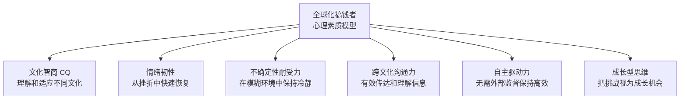

## 六、全球化搞钱的心理准备

全球化搞钱不只是技术和策略问题，更是一场心理修行。跨越国界赚钱意味着面对语言障碍、文化冲突、法律不确定性、时差折磨、孤独感、身份认同危机等一系列心理挑战。很多人技术能力过硬、资源也不缺，却在心理层面败下阵来——要么因为恐惧而迟迟不敢迈出第一步，要么因为初期挫折而过早放弃，要么在长期高压下身心俱疲最终退出。

本节系统梳理全球化搞钱过程中会遇到的心理挑战，并给出可操作的应对策略。这不是心灵鸡汤，而是基于跨文化心理学、行为经济学和大量一线从业者经验总结的实战心理指南。

### 1. 认知层：全球化搞钱需要哪些心智模型

#### 1.1 从"本地思维"到"全球思维"的认知跃迁

大多数人的思维框架默认以本地市场为中心——本地的消费习惯、本地的法律环境、本地的人际关系网络。全球化搞钱需要一次根本性的认知升级：

| 维度 | 本地思维 | 全球思维 |
|------|----------|----------|
| 市场认知 | 只看到国内市场 | 同时关注多个市场的机会和风险 |
| 竞争认知 | 本地同行是竞争对手 | 全球同行都是竞争对手，也是潜在合作伙伴 |
| 时间认知 | 朝九晚五的工作节奏 | 跨时区协作，7×24小时的机会窗口 |
| 风险认知 | 风险集中在国内 | 风险分散在多个国家，但也带来新风险 |
| 文化认知 | 以本国文化为默认 | 理解并尊重文化差异，灵活适应 |
| 收入认知 | 单一货币收入 | 多货币收入，汇率成为日常考量 |

从本地思维切换到全球思维不是一朝一夕的事。你需要刻意练习以下认知习惯：

**多市场扫描习惯**：每天花15分钟浏览目标市场的新闻、社交媒体和行业动态。不要只看中文信息源，至少覆盖一个英文信息源和一个目标市场语言的信息源。

**汇率感知习惯**：养成查看主要货币汇率的习惯。不是为了炒外汇，而是培养对全球经济波动的直觉。当美元走强时，以美元计价的外包成本会上升；当目标市场货币贬值时，你的服务在当地可能变得更贵。

**文化假设检验习惯**：每当你说"大家都知道……"或"正常人都会……"时，停下来问自己：这在我的文化里是常识，在目标市场里也是吗？

#### 1.2 概率思维：接受不确定性

全球化搞钱的不确定性远高于本地搞钱。你面对的变量更多：汇率波动、政策变化、文化误读、物流延误、支付纠纷……每一个环节都可能出问题。

**概率思维的核心原则**：

- **不追求100%确定才行动**：如果你要等到所有风险都消除才开始，你永远不会开始。接受"60%把握就可以试"的心态。
- **用组合策略对冲风险**：不要把所有希望押在一个市场、一个客户、一个平台上。同时布局2-3个市场，让概率为你工作。
- **预期值思维**：单次尝试可能失败，但只要预期值为正，多次尝试后总体必然盈利。一个项目成功率30%、成功收益10万元，预期值3万元，比一个100%成功但收益2万元的项目更值得尝试。
- **区分运气和能力**：短期结果可能受运气影响，长期结果反映真实能力。不要因为一次失败就否定自己，也不要因为一次成功就高估自己。

#### 1.3 长期主义：延迟满足的心理准备

全球化搞钱的回报周期通常比本地搞钱更长。建立跨境客户关系、适应新市场、积累海外信誉，都需要时间。

**典型的时间线预期**：

- **0-3个月**：探索期，大量学习和试错，几乎没有收入
- **3-6个月**：突破期，可能接到第一批海外订单或客户
- **6-12个月**：稳定期，收入开始稳定增长，但可能还不如本地工作
- **12-24个月**：收获期，复利效应显现，收入可能显著超过本地水平
- **24个月以后**：成熟期，建立稳定的海外收入流和客户网络

很多人在第3-6个月放弃，因为他们预期"国际化"能带来立竿见影的收入增长。现实是：前期投入的时间和精力远超预期，但一旦突破临界点，增长速度也会超预期。

### 2. 情绪层：全球化搞钱的核心心理挑战与应对

#### 2.1 冒充者综合征（Impostor Syndrome）

这是全球化搞钱者最常见的心理障碍之一。你可能会想：

- "我的英语不够好，怎么跟母语者竞争？"
- "我来自发展中国家，客户会看得起我吗？"
- "那些欧美自由职业者经验丰富，我凭什么跟他们抢饭碗？"
- "我只是运气好才接到这个单子，下次肯定露馅。"

**冒充者综合征的本质**：你把自己最弱的方面跟别人最强的方面比较。你拿自己的英语跟母语者比，拿自己的经验跟行业老手比，拿自己的背景跟精英比。

**应对策略**：

1. **列出你的独特优势**：中国开发者的性价比优势、对亚洲市场的深入理解、勤奋和响应速度、跨文化视角带来的创新。把这些写下来，每天看一遍。
2. **收集客观证据**：客户的好评、成功交付的项目、解决过的难题。建立一个"成就档案"，在自我怀疑时翻看。
3. **重新定义"专业"**：你不需要在所有方面都比别人强。你只需要在特定领域为特定客户提供足够好的价值。一个英语一般但代码质量极高的开发者，远比一个英语流利但交付质量不稳定的开发者更有价值。
4. **接受"不完美"并行动**：不要等到"准备好了"才开始。你永远不会觉得完全准备好。边做边学，在实战中成长。

#### 2.2 文化冲击与适应

在长期的跨境工作中，你会经历典型的"文化冲击曲线"：

**蜜月期**（0-3个月）：你对跨境工作充满热情，觉得一切都新鲜有趣。这个阶段要趁热打铁，建立初始客户关系和工作习惯。

**挫折期**（3-6个月）：文化差异开始显现。西方客户的直接反馈方式可能让你不舒服；不同的工作节奏和沟通风格可能产生误解；你可能觉得自己的文化背景是劣势而非优势。

**应对挫折期的具体策略**：

- **建立文化差异清单**：把你遇到的文化差异逐条记录下来，分析背后的文化逻辑。比如，美国客户直接说"这个方案不行"不是对你的人身攻击，而是他们的沟通习惯——直接=高效。
- **找到文化桥梁人物**：在目标市场找到一个既了解中国文化又了解当地文化的人，遇到文化困惑时可以请教。
- **保持文化锚点**：不要为了融入而完全放弃自己的文化特质。保持你的饮食习惯、社交方式、节日庆祝。文化多样性是你的资产，不是负债。

**调整期和适应期**：随着经验积累，你会逐渐发展出"文化代码切换"能力——在不同文化场景间自如切换沟通风格。这是一项高级软技能，也是全球化搞钱者的终极竞争力之一。

#### 2.3 孤独感与社交隔离

全球化搞钱者——尤其是远程工作者和自由职业者——面临的最大隐性成本是孤独感。你可能：

- 白天独自在家工作，跟客户只通过文字沟通
- 跟国内朋友的作息时间不同步，很难约出来见面
- 在目标市场没有社交网络，遇到困难无人倾诉
- 长期缺乏面对面的人际互动，社交技能退化

**孤独感的危害**：研究表明，长期社交隔离对健康的危害等同于每天吸15支烟。它不仅影响心理健康，还会降低工作效率和决策质量。

**具体的反孤独策略**：

1. **建立"虚拟同事圈"**：加入至少2个活跃的跨境工作者社群（Discord、Slack群组、微信群），每天参与讨论。选择有质量的社群，避免充斥抱怨和负能量的群。
2. **固定线下社交时间**：每周至少安排2次线下社交活动。可以是运动、聚餐、参加活动。把它当成工作任务来安排，而不是"有空再说"。
3. **寻找共同工作的伙伴**：在你的城市找到其他远程工作者或自由职业者，定期一起在咖啡馆或共享办公空间工作。即使各做各的项目，有人在身边的感觉完全不同。
4. **与客户建立"人"的连接**：不要把客户关系纯粹工具化。偶尔聊聊兴趣爱好、生活经历，建立真正的人际连接。很多跨境合作最终发展成了长期友谊。
5. **考虑共享办公空间**：如果你所在城市有共享办公空间，每月投入几百元可以获得社交环境、网络资源和专业形象。这笔投资的回报远超金钱。

#### 2.4 决策疲劳与选择过载

全球化搞钱意味着你要做大量决策：选择哪个市场、哪个平台、哪个定价策略、哪个支付方式、哪个法律结构……每一个选项都有利有弊，信息不完全，时间压力大。

**决策疲劳的信号**：

- 简单决定也要花很长时间
- 频繁改变已经做出的决定
- 倾向于选择"不行动"来逃避决策
- 感觉脑子被塞满了，无法思考

**减少决策疲劳的方法**：

1. **建立决策框架**：为常见决策类型建立标准流程。比如选择新市场时，统一用以下评估维度：市场规模（权重30%）、进入门槛（权重25%）、竞争强度（权重20%）、文化距离（权重15%）、支付便利性（权重10%）。有了框架，很多决策就变成了打分计算。
2. **设定决策截止时间**：小决定给自己5分钟，中等决定给自己1天，大决定给自己1周。到了截止时间就必须做出选择，即使信息不完美。
3. **二八法则筛选**：面对大量选项时，快速用二八法则筛掉80%的选项，只在剩余20%里深入比较。
4. **减少日常琐碎决策**：固定化日常流程（固定作息、固定工作流程、固定工具选择），把决策精力留给真正重要的战略决策。

#### 2.5 失败恐惧与风险厌恶

全球化搞钱的失败成本可能更高：跨境支付纠纷、汇率损失、文化误解导致的客户流失、投入大量时间学习新市场后发现不可行……

**失败恐惧的两种表现**：

- **行动瘫痪**：因为害怕失败而不敢开始。不断"准备"但永远不"行动"。
- **过度保守**：只做确定性很高的事情，回避任何有风险的机会。

**重构失败的认知框架**：

- **失败是数据，不是判决**：每一次失败都告诉你"这条路不通"，帮你缩小搜索范围。亚马逊的贝索斯说："失败和发明是不可分割的孪生兄弟。"
- **小失败优于大失败**：用小规模实验来测试想法，而不是all in一个大项目。先花10小时做一个最小可行产品（MVP），而不是花100小时做一个完美产品。
- **设立"失败预算"**：明确告诉自己"我允许自己在这6个月里损失X元和Y小时"。有了这个预算，每次失败都在可控范围内，不会引发恐慌。
- **失败复盘模板**：每次失败后，用以下模板复盘，把情绪转化为认知：
  - 发生了什么？（事实）
  - 我预期会发生什么？（预期）
  - 差距在哪里？（分析）
  - 我学到了什么？（认知）
  - 下次我会怎么做？（行动）

### 3. 行为层：建立可持续的全球化搞钱习惯

#### 3.1 心理能量管理

全球化搞钱对心理能量的消耗远超普通工作。跨时区沟通、文化适应、多语言切换、不确定性应对，都在持续消耗你的认知资源。

**心理能量的四个维度**：

| 维度 | 消耗行为 | 充电行为 |
|------|----------|----------|
| 体力 | 熬夜跟海外客户沟通、长时间久坐 | 规律运动、充足睡眠、健康饮食 |
| 情绪 | 文化冲突、客户投诉、孤独感 | 社交活动、兴趣爱好、情感支持 |
| 注意力 | 多任务切换、信息过载、频繁被打断 | 深度工作时间块、减少干扰、冥想 |
| 意志力 | 做大量决策、抵抗诱惑、坚持计划 | 固定化习惯、减少决策、设立奖励机制 |

**具体的能量管理策略**：

1. **保护你的黄金时间**：找到你一天中精力最旺盛的2-3小时，把它留给最重要的工作（深度思考、创作、关键沟通）。把低能量时间留给机械性任务（回邮件、整理文件、数据分析）。
2. **设立"充电仪式"**：每天固定时间做一件让你充电的事。可以是30分钟运动、15分钟冥想、听一段音乐、泡一杯好茶。关键是固定化，让它成为自动行为。
3. **识别能量黑洞**：记录一周内让你感到特别疲惫的活动和场景。找到规律后，要么减少这些活动，要么改变执行方式。比如，如果每次跟某个客户的沟通都让你精疲力竭，考虑是否值得继续合作。
4. **战略性休息**：不要等到精疲力竭才休息。每工作90分钟休息15分钟（番茄工作法的变体），每周至少1天完全不工作，每季度安排一次3-5天的短假期。

#### 3.2 自律与他律的结合

远程跨境工作最大的敌人不是技术能力不足，而是自律不够。没有老板盯着、没有同事看着、没有打卡机管着，很多人会陷入拖延和低效。

**自律的层级体系**：

1. **环境自律**：创造一个专属于工作的物理空间。哪怕只是一张固定的桌子，只要坐在那里就意味着"进入工作模式"。不要在床上、沙发上工作——大脑会把这些地方跟休息关联。
2. **时间自律**：设定固定的工作时间，并严格执行。跨境工作虽然时区灵活，但不意味着你可以在任何时间工作。选择一个适合你的节奏，比如"上午9点到下午6点是工作时间，晚上8点到10点处理海外事务"。
3. **行为自律**：用习惯堆叠（habit stacking）来建立工作习惯。比如"喝完早咖啡后立即打开工作邮箱"、"午餐后立即进行30分钟的深度工作"。
4. **他律机制**：当自律不够时，引入外部约束。找一个"问责伙伴"（accountability partner），每天互相汇报进展；加入付费的共学社群，损失厌恶会驱动你坚持；公开承诺你的目标和截止日期。

#### 3.3 建立心理韧性（Resilience）

心理韧性不是天生的，是可以训练的。全球化搞钱者需要在以下场景中保持韧性：

**场景一：连续被拒**

在Upwork、Fiverr等平台上，新手被拒是常态。可能投了50个proposal才有1个回复。这不代表你不行，只代表你需要优化策略。

韧性策略：把"被拒"重新定义为"数据采集"。每次被拒后分析原因（价格？方案？匹配度？），优化下一次的proposal。设定一个"被拒目标"——"这个月我要被拒30次"。当你主动追求被拒次数时，被拒的心理冲击会大幅降低。

**场景二：客户纠纷**

跨境交易中，客户纠纷不可避免。可能是对交付质量不满意、可能是沟通误解、可能是恶意欺诈。纠纷带来的情绪冲击（愤怒、委屈、焦虑）往往比经济损失更大。

韧性策略：在情绪激动时不做任何决定。给自己24小时冷静期。用事实和证据来回应，而不是情绪。建立标准的纠纷处理流程，让流程来引导你的行为，而不是情绪。必要时寻求平台仲裁或法律支持，不要试图自己扛所有问题。

**场景三：长期收入波动**

跨境收入通常比本地工资更不稳定。可能这个月赚了3万，下个月只有5千。收入波动会引发焦虑、自我怀疑，甚至影响生活决策。

韧性策略：建立"收入平滑机制"——在收入高的月份多存钱，在收入低的月份用存款补充。目标是建立6个月的生活费储备。这样即使连续几个月没有收入，你也不会恐慌。同时，建立多元收入来源（不同客户、不同平台、不同市场），降低单一来源波动的影响。

**场景四：身份认同危机**

长期在海外平台工作、用英语跟客户沟通、适应西方工作文化，你可能会产生身份认同困惑："我还是中国人吗？我属于哪里？我在国内社交圈格格不入，在海外社交圈也格格不入。"

这种"第三文化"体验其实是一种优势。你拥有两种文化的视角，能够在不同文化间架起桥梁。很多成功的跨境企业家都是"文化混血儿"——他们不完全属于任何一个文化圈，但能在所有文化圈中创造价值。

### 4. 具体场景的心理准备清单

#### 4.1 出海前的心理自检

在正式启动全球化搞钱之前，用以下清单评估自己的心理准备度：

- [ ] 我能接受至少6个月没有显著海外收入吗？
- [ ] 我有应对文化冲突的具体策略吗？
- [ ] 我的英语（或目标市场语言）足够进行基本商务沟通吗？如果不够，我有提升计划吗？
- [ ] 我有至少3个月的生活费储备吗？
- [ ] 我的家人/伴侣支持我的决定吗？
- [ ] 我有应对孤独感的社交计划吗？
- [ ] 我能接受跟国内朋友作息不同步吗？
- [ ] 我有处理跨境纠纷的基本知识吗？
- [ ] 我了解目标市场的基本文化禁忌吗？
- [ ] 我有"失败了也能接受"的心理底线吗？

如果超过3项答案是"否"，建议先补齐短板再启动。

#### 4.2 关键时刻的心理应对剧本

**第一次收到海外客户询价时**：

心理状态：兴奋+紧张+不确定。"真的有人来找我了？""我该怎么报价？""报高了吓跑客户，报低了亏待自己。"

应对：先深呼吸。客户来找你，说明你的产品或服务已经通过了初步筛选。报价时参考同行定价，取中间偏下的位置作为起点。记住：你的第一个海外客户的最大价值不是收入，而是经验。

**第一次交付海外项目时**：

心理状态：焦虑+完美主义。"如果客户不满意怎么办？""文化差异会不会导致理解偏差？""我的英语描述够清楚吗？"

应对：在交付前多沟通一轮确认需求。交付时附上详细的说明文档。明确告知客户"如果有任何不满意，请直接告诉我，我会修改"。西方客户通常欣赏这种开放态度。

**第一次收到差评或投诉时**：

心理状态：沮丧+委屈+愤怒。"我付出了这么多，客户居然不满意？""是不是因为我来自中国所以被歧视？"

应对：先看差评内容本身，区分事实和情绪。如果差评反映了真实问题，感谢客户的反馈并改进。如果是不合理的差评，按照平台规则申诉。不要在情绪激动时回复——写下回复草稿，过一晚上再看，通常你会改写得更专业。

**收入第一次出现断崖式下跌时**：

心理状态：恐慌+自我怀疑。"是不是我的方法不对？""要不要放弃回去上班？""还能撑多久？"

应对：先看数据，分析下跌原因。是季节性波动？某个大客户流失？市场环境变化？还是你的策略出了问题？不同的原因对应不同的应对方案。启动你的应急储蓄计划，给自己3个月的缓冲期来调整策略。

#### 4.3 长期全球化搞钱者的心理维护

如果你已经在全球化搞钱的路上走了1年以上，以下心理维护策略特别重要：

**防止倦怠（Burnout）**：

跨境工作者的倦怠往往比普通工作者更严重，因为工作和生活的边界更模糊。识别倦怠的早期信号：对工作失去热情、效率持续下降、身体出现不适（失眠、头痛、胃痛）、对客户和合作伙伴越来越不耐烦。

防止倦怠的关键是"战略性不完美"——不是每件事都要做到100分。有些任务做到80分就足够了，把省下来的精力留给真正重要的事情和自己的身心健康。

**持续成长的心理动力**：

在全球化搞钱的路上走了一段时间后，你可能会进入"舒适区"——收入稳定、客户稳定、流程稳定。这时候要警惕停滞。

保持成长动力的方法：
- 每季度学习一项新技能或进入一个新市场
- 定期跟行业顶尖人士交流，保持对差距的清醒认知
- 设定有挑战性的年度目标，把自己推出舒适区
- 记录和分享你的经验（写博客、做视频、参与社群讨论），教学相长

**处理"成功后的空虚"**：

有些人在实现了财务目标后会感到空虚："我赚到了想要的钱，然后呢？"

这是因为金钱本身不是目的，而是手段。全球化搞钱的终极意义不在于赚多少钱，而在于它给你带来的自由——选择在哪里生活、做什么工作、跟谁在一起的自由。当你赚到了足够的钱，下一步是思考"我真正想要的生活是什么样的"，然后用钱去实现它。

### 5. 心理工具箱：实用的心理调节技术

#### 5.1 认知重构技术

当你陷入消极思维时，用"ABCDE"模型来重构：

- **A（Activating event）**：触发事件是什么？（例：客户拒绝了我的提案）
- **B（Belief）**：我的信念/想法是什么？（例："我的能力不行，不适合做海外业务"）
- **C（Consequence）**：这个信念导致什么后果？（例：沮丧、想放弃）
- **D（Disputation）**：反驳这个信念的证据是什么？（例：之前成功交付过3个项目，被拒可能只是价格不匹配）
- **E（Effective new belief）**：新的有效信念是什么？（例："被拒是正常的，我需要优化定价策略"）

#### 5.2 正念呼吸法

在焦虑、紧张或愤怒时，用4-7-8呼吸法快速平静下来：

1. 用鼻子吸气4秒
2. 屏住呼吸7秒
3. 用嘴缓慢呼气8秒
4. 重复3-4个循环

这个方法激活副交感神经系统，能在60秒内显著降低焦虑水平。特别适合在重要客户通话前、处理纠纷时使用。

#### 5.3 情绪日记

每天花5分钟记录当天的情绪状态。不需要长篇大论，只需要记录：

- 今天的主要情绪是什么？（1-10分）
- 什么事情触发了这种情绪？
- 我是如何应对的？
- 如果重来一次，我会怎么处理？

坚持记录一段时间后，你会发现自己的情绪模式——什么场景最容易触发负面情绪、什么样的应对方式最有效。这些数据是你自我管理的基础。

#### 5.4 压力释放的物理方法

心理压力会积累在身体里。定期释放：

- **运动**：最有效的压力释放方式。每周3次、每次30分钟的中等强度运动（跑步、游泳、打球）可以显著降低焦虑和抑郁水平。
- **身体扫描**：躺下后从头到脚逐步感受身体各部位的紧张程度，有意识地放松。特别关注肩膀、下巴、胃部——这些是压力最容易积累的地方。
- **冷水冲澡**：2分钟的冷水冲澡能快速激活交感神经系统，之后副交感神经系统会带来强烈的放松感。这个方法在焦虑严重时特别有效。

### 6. 常见心理误区与纠正

| 误区 | 纠正 |
|------|------|
| "等我准备好了再开始" | 你永远不会"完全准备好"。边做边学，在实战中成长的速度远超在岸上学习。先迈出去，再调整。 |
| "我的英语太差，做不了海外业务" | 很多成功的跨境从业者英语并不流利。关键是你能用英语解决问题、交付价值。商务沟通中，清晰>流利，准确>优雅。 |
| "国内都做不好，海外更不行" | 海外市场的竞争逻辑跟国内不同。你在国内的劣势（比如不会搞关系）在海外可能是优势（海外客户更看重专业能力和交付质量）。 |
| "全球化搞钱是有钱人的游戏" | 你不需要大量资金启动。一台电脑、一个网络连接、一项可以变现的技能，就是全部启动成本。很多成功的跨境自由职业者启动资金不到1000元。 |
| "一次失败说明我不适合" | 单次失败只说明这一次的策略或执行有问题，不代表你不适合。复盘、调整、再试。成功者和失败者的区别不是失败次数，而是失败后的反应。 |
| "客户嫌贵是因为我来自发展中国家" | 更可能的原因是你的价值传递没做好，或者目标客户群体选错了。在海外市场，价值>价格，解决问题的能力>出身。 |
| "我需要同时做很多市场才能成功" | 贪多嚼不烂。先在一个市场站稳脚跟，建立口碑和经验，再逐步扩展到第二个、第三个市场。深度>广度。 |

### 7. 进阶：全球化搞钱者的心理素质模型

一个成熟的全球化搞钱者需要具备以下六项核心心理素质：

这些素质不是天生的，每一项都可以通过刻意练习来提升。本节介绍的心理策略和工具，就是提升这些素质的具体方法。

最后，记住一点：**全球化搞钱的心理准备不是一个完成时态，而是一个进行时态。** 你不需要在出发前就把所有心理问题都解决掉。你需要的是具备觉察自己心理状态的能力，以及在遇到问题时知道如何应对的工具箱。路上遇到问题很正常，重要的是你有解决问题的意愿和方法。

准备好了，就出发吧。
