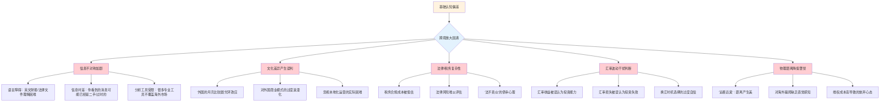
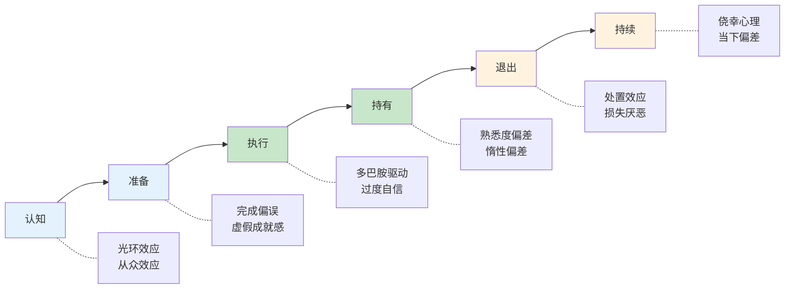
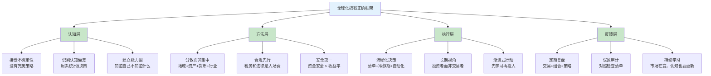

## 七、全球化搞钱的常见误区

全球化搞钱是一个涉及跨境法律、税务、金融市场、汇率、文化差异的复杂系统工程。正因为其复杂性，大量初学者乃至有经验的投资者都会陷入各种认知陷阱。这些误区不会一次把你击倒，但会像慢性毒药一样，缓慢侵蚀你的收益、放大你的风险，甚至让你在关键时刻做出灾难性的决策。

本节从理论层面系统拆解全球化搞钱中的误区成因、分类体系和识别方法，为后续实操提供认知校准基础。

***

### 7.1 误区的认知科学根源

理解误区的第一步不是记住"哪些是误区"，而是理解"人脑为什么会制造误区"。只有从认知科学的角度理解了误区的产生机制，你才能从根本上提高警惕，而不是每次都等到踩坑了才恍然大悟。

#### 7.1.1 双系统理论与全球化决策

诺贝尔经济学奖得主丹尼尔·卡尼曼（Daniel Kahneman）在《思考，快与慢》中提出的双系统理论，是理解误区产生的核心框架：

| 系统 | 特征 | 全球化搞钱中的表现 | 可靠性 |
|------|------|-------------------|--------|
| 系统1（快思考） | 直觉、自动、快速、无意识 | "朋友说港股打新赚钱，我也去开个户" | 低——容易被表面信息误导 |
| 系统2（慢思考） | 理性、分析、缓慢、费力 | "我需要评估港股打新的历史收益率、破发概率、资金占用成本再决定" | 高——但需要刻意调用 |

全球化搞钱涉及的决策维度极其复杂——不同国家的法律体系、税收制度、金融市场结构、汇率机制、监管环境——这些都需要系统2的深度分析。但大多数人习惯性地用系统1做判断，因为系统1消耗的认知资源更少、带来的即时满足感更强。

**核心矛盾**：全球化搞钱的决策复杂度要求系统2深度参与，但人类大脑天然偏好系统1的快速判断。这个矛盾是几乎所有误区产生的根本原因。

#### 7.1.2 全球化搞钱中的七大认知偏差

以下是全球化搞钱场景中最常见、危害最大的认知偏差：

| 认知偏差 | 心理学定义 | 全球化搞钱中的典型表现 | 危害等级 |
|---------|-----------|----------------------|---------|
| 确认偏差（Confirmation Bias） | 倾向于寻找支持已有观点的信息，忽略反面证据 | 决定买美股后只看利好文章，忽略估值过高的警告 | ★★★★ |
| 锚定效应（Anchoring Effect） | 过度依赖第一个接收到的信息作为判断基准 | "美股长期年化10%"成为不可动摇的信仰，忽视估值和周期 | ★★★★ |
| 从众效应（Bandwagon Effect） | 跟随大多数人的行为，认为多数人不会错 | "朋友圈都在炒港股，我也得跟上" | ★★★ |
| 过度自信（Overconfidence） | 高估自己的判断能力和信息质量 | "我能判断汇率走势" "这只股票我研究过，肯定涨" | ★★★★★ |
| 损失厌恶（Loss Aversion） | 对损失的痛苦感受是同等收益快乐感的2-2.5倍 | 海外投资亏了一次就"再也不碰"，错过长期机会 | ★★★★ |
| 沉没成本谬误（Sunk Cost Fallacy） | 因为已经投入的时间/金钱/精力而不愿放弃 | 海外房产持续亏损还死扛不卖，理由是"已经投入这么多" | ★★★ |
| 幸存者偏差（Survivorship Bias） | 只看到成功案例，看不到失败者 | "我朋友做跨境电商月入十万"——但他没说亏了多少人才出了一个他 | ★★★★ |

这些偏差不是个人缺陷，而是人类大脑的"出厂设置"。进化心理学认为，这些快速判断机制在原始环境中帮助人类生存，但在现代金融市场的复杂环境中，它们往往导致系统性的错误决策。

#### 7.1.3 跨境场景的认知放大效应

全球化搞钱相比国内投资，多了一层"跨境"的复杂性。这个跨境维度会放大上述认知偏差的影响：



理解这个放大效应至关重要：同样一个认知偏差，在国内投资场景中可能只让你亏5%，但在跨境场景中可能让你亏30%甚至更多——因为信息不对称更大、纠错成本更高、法律保护更弱。

***

### 7.2 全球化搞钱误区的分类框架

不是所有误区都一样危险。有些误区只是让你少赚一点，有些误区可能让你血本无归甚至面临法律风险。以下是一个实用的误区分类框架，帮助你区分轻重缓急。

#### 7.2.1 按危害程度分类

| 危害等级 | 定义 | 典型误区 | 可能后果 |
|---------|------|---------|---------|
| 🔴 致命级 | 可能导致重大财务损失或法律后果 | 忽视税务合规、使用非法换汇渠道、投资不受监管的平台 | 资金归零、刑事处罚、信用破产 |
| 🟠 严重级 | 会显著损害长期收益 | 过度集中单一市场、追求短期暴利、忽视汇率风险 | 大幅亏损、错过长期增长机会 |
| 🟡 中等级 | 会影响收益效率但不致命 | 开户就等于投资成功、忽略交易成本、不设止损 | 收益低于预期、资金效率低 |
| 🟢 轻微级 | 会降低体验但影响有限 | 选择手续费偏高的平台、错过最优汇率 | 少赚一点，体验不佳 |

**优先级原则**：永远先排查致命级和严重级误区，再处理中等级和轻微级误区。很多新手把大量精力花在"选哪个券商手续费最低"（轻微级）上，却完全忽视了税务合规（致命级）——这就是典型的注意力错配。

#### 7.2.2 按误区产生阶段分类

全球化搞钱是一个多阶段的过程，不同阶段容易产生不同类型的误区：

| 阶段 | 典型误区 | 心理根源 |
|------|---------|---------|
| **认知阶段**（了解和学习期） | "海外投资一定比国内好" | 光环效应、稀缺性偏差 |
| **准备阶段**（开户和入金期） | "开户就等于投资成功" | 完成偏误、虚假成就感 |
| **执行阶段**（实际投资期） | "追求短期暴利" "忽视交易成本" | 多巴胺驱动、可得性启发 |
| **持有阶段**（长期持有期） | "过度集中单一市场" "不做再平衡" | 熟悉度偏差、惰性偏差 |
| **退出阶段**（获利了结期） | "过早止盈" "死扛亏损" | 处置效应、损失厌恶 |
| **持续阶段**（长期运营期） | "忽视税务合规" "不做定期检视" | 侥幸心理、当下偏差 |



#### 7.2.3 按误区所属维度分类

全球化搞钱涉及多个维度，每个维度都有其独特的误区群：

| 维度 | 误区群 | 核心问题 |
|------|--------|---------|
| **投资维度** | 市场选择、资产配置、择时交易 | "投什么？投多少？什么时候投？" |
| **收入维度** | 跨境收入渠道、副业选择、技能变现 | "钱从哪里来？" |
| **合规维度** | 税务、法律、外汇管制 | "怎么合法地搞？" |
| **安全维度** | 平台选择、资金安全、信息保护 | "怎么不被骗？" |
| **心理维度** | 期望管理、情绪控制、长期心态 | "怎么不把自己搞崩？" |

这五个维度相互关联、相互影响。例如，投资维度的"过度集中"误区，可能导致合规维度的税务优化困难；安全维度的"选择小平台"误区，可能导致投资维度的资产损失。

***

### 7.3 七大核心误区的理论解析

以下是全球化搞钱中最普遍、危害最大的七个误区。每个误区从**理论机制→表现形式→危害分析**三个层次展开，帮你建立系统性的认知防线。具体案例和纠正方法在本章实操部分详细展开。

#### 7.3.1 误区一："海外投资一定比国内好"

**理论机制：光环效应 + 稀缺性偏差**

这是全球化搞钱中最普遍的认知偏差。"外国的月亮比较圆"这个心理在投资领域表现得尤为突出。光环效应（Halo Effect）让你对一个事物的正面印象扩散到其他方面——你看到苹果、英伟达等伟大公司在美股上市，就觉得"美股=好投资"。稀缺性偏差让你高估门槛更高的投资渠道的价值——越难获得的东西，越觉得它好。

**表现形式**：
- 听说美股长期收益好，就把大部分资金挪到美股
- 看到"印度GDP增速全球第一"就急着买印度基金
- 觉得A股"割韭菜"，认为海外市场更公平更理性
- 忽视自身对海外市场的了解程度，盲目跟风出海

**危害分析**：

这种误区的最大危害不是"亏钱"，而是"放弃信息优势"。你在A股市场有天然的信息优势——你是中国消费者，你了解中国公司的产品和服务，你能读懂中文财报，你能参加股东大会。进入海外市场后，这些优势全部归零，你面对的是占市场交易量80%以上的机构投资者，信息劣势比在A股更大。

| 对比维度 | 国内投资（A股） | 海外投资（美股） |
|---------|---------------|----------------|
| 信息获取 | 中文财报、实地调研、消费体验 | 英文财报、二手翻译、远程分析 |
| 市场理解 | 深度理解中国经济和政策 | 对美国经济和政策的理解有限 |
| 信息时效 | 实时、第一手 | 延迟、可能过时 |
| 纠错成本 | 低（交易成本低、监管保护强） | 高（交易成本高、跨境维权困难） |
| 信息优势评分 | 7-8分 | 3-4分 |

**理论纠正**：建立"能力圈"（Circle of Competence）思维。巴菲特反复强调，投资的关键不是知道多少，而是知道自己的能力边界在哪里。海外投资的目的是分散风险和捕捉机会，不是替代国内投资。

#### 7.3.2 误区二："开户就等于投资成功"

**理论机制：完成偏误 + 虚假成就感**

人类大脑喜欢完成任务带来的多巴胺快感。开户有明确的步骤（注册→认证→入金→完成），每完成一步都有成就感。但真正的投资决策是模糊的、没有明确终点的，大脑天然回避这种不确定性。

完成偏误（Completion Bias）让你把"开好户"当成目标完成，忽略了后续的投资策略制定、风险管理、持续学习才是核心。这就像买了健身卡就觉得自己开始健身了一样——开户只是给了你一个"亏钱的工具"。

**表现形式**：
- 花两个月研究哪家券商开户，但对投资策略一无所知
- 开好户、入好金后，不知道买什么，随便听消息全仓买入
- 把"开好户"当成里程碑庆祝，心理上觉得已经"开始了"

**危害分析**：

这个误区的危害在于**时机错配**。开户过程中你积累了兴奋感和行动欲望，但没有积累投资知识和策略。这种状态下的第一笔投资，往往是最冲动、最缺乏依据的一笔——而第一笔投资的结果，往往决定了你对整个海外投资市场的长期态度。

**理论纠正**：认识到"开户"和"投资"是两个完全独立的决策。开户只是获得了进入市场的资格，不等于你具备了在市场中获利的能力。正确的顺序是：先学习→再制定策略→然后开户→最后按策略执行。

#### 7.3.3 误区三："忽视税务合规"

**理论机制：侥幸心理 + 即时满足偏差 + 损失框架效应**

税务合规是全球化搞钱中最容易被忽视、后果最严重的误区。三种心理机制共同作用：

- **侥幸心理**：人类天然低估低概率高影响事件的风险。"被查到的概率很小"——但CRS让这个概率逐年上升。
- **即时满足偏差**：税务合规的成本是即时的（花时间学习、花钱请税务师、主动缴税），而收益是远期的（避免未来的罚款和法律风险）。大脑天然偏好即时满足。
- **损失框架效应**：缴税在心理上被编码为"损失"（钱从我手里出去了），而避税被编码为"收益"（钱留在了我手里）。但实际情况是，不缴税的风险远大于缴税的成本。

**危害分析**：

这个误区的危害具有**非线性特征**——平时看不到后果，一旦触发后果是毁灭性的。CRS（共同申报准则）的全面实施让"海外的钱国内不知道"这个假设彻底破产。已有120多个国家加入CRS，你的海外账户信息会自动交换给中国税务机关。

违规后果的层级：

| 层级 | 后果 | 触发条件 |
|------|------|---------|
| 第一层 | 补缴税款 + 滞纳金（年化约18%） | 被发现少报海外收入 |
| 第二层 | 补缴税款 + 滞纳金 + 罚款（少缴税款的50%-5倍） | 被认定为故意逃税 |
| 第三层 | 上述全部 + 信用记录受损 + 可能限制出境 | 逃税金额较大 |
| 第四层 | 上述全部 + 刑事责任（3-7年有期徒刑） | 逃税数额较大且占应纳税额10%以上 |

**理论纠正**：将税务合规视为"全球化搞钱的入场费"而非"额外负担"。主动申报不仅合法合规，还能通过税收抵免机制避免双重征税，实际上是更经济的选择。

#### 7.3.4 误区四："过度集中于单一海外市场"

**理论机制：熟悉度偏差 + 叙事陷阱 + 相关性忽视**

"我已经全球化了"——但你的全球化可能只是换了个国家集中投资。这个误区有三层递进：

1. **熟悉度偏差**：你倾向于投资你熟悉的东西。美股天天上新闻，苹果、微软你天天用，所以你自然把大部分海外资金投到美股。
2. **叙事陷阱**："美股长期一定涨""美国是全球最大经济体""美元是世界货币"——这些叙事让你觉得买美股就等于买全球。
3. **相关性忽视**：你同时持有苹果、微软、QQQ和纳指100，觉得这是分散投资。实际上这四类资产的相关性可能高达0.9以上——一个跌，其他全跌。

**危害分析**：

单一市场的历史最大回撤数据，是最有力的警示：

| 市场 | 黑天鹅事件 | 最大跌幅 | 恢复时间 |
|------|-----------|---------|---------|
| 纳斯达克 | 2000年互联网泡沫 | -78% | 15年 |
| 日经225 | 1989年泡沫破裂 | -80% | 34年 |
| 沪深300 | 2008年金融危机 | -72% | 至今未回到2007年高点 |
| 希腊ASE | 2008年主权债务危机 | -90% | 至今未恢复 |
| 俄罗斯RTS | 2022年地缘冲突 | -95%（美元计） | 可能永远无法恢复 |

这些数据的含义是：如果你在1989年底"全球化投资"只买了日本股市，你需要等到2024年才回本——整整34年。这期间美国标普500涨了超过20倍。

**理论纠正**：理解"分散投资"的真正含义。分散不是"买同一个篮子里的不同鸡蛋"，而是"买不同篮子里的鸡蛋"。真正的分散需要在地域、资产类别、货币、行业四个维度同时展开。

#### 7.3.3 误区五："追求短期暴利"

**理论机制：可得性启发 + 赌徒谬误 + 多巴胺驱动**

全球化搞钱涉及多个市场、多种资产、多条收入渠道，这给了追求短期暴利者更多的"赌桌"。三种心理机制推动这个误区：

- **可得性启发**：媒体大量报道"某某靠港股打新赚了100万"，却很少报道"某某靠港股打新亏了50万"。你的大脑高估成功案例的概率。
- **赌徒谬误**："我已经连续亏了三次，下次一定赚"——在金融市场，过去的结果不影响未来的概率。
- **多巴胺驱动**：短线交易带来的刺激与赌博类似。每次盈亏都触发多巴胺分泌，让人上瘾——越交易越频繁，越频繁越亏损。

**危害分析**：

交易成本是短期暴利的"隐性杀手"。假设10万港币本金，每月交易5次（10次操作），一年的总交易成本可能达到本金的20%以上——你的投资收益需要超过20%才能刚刚覆盖成本。

加州大学Barber和Odean教授的经典研究《Trading Is Hazardous to Your Wealth》发现：交易最频繁的投资者，年化收益比最不活跃的投资者低约7个百分点。这个结论在全球市场都得到了验证。

**理论纠正**：从"交易者"转变为"投资者"。交易者关注"今天买什么能涨"，投资者关注"这个资产5年后值多少钱"。全球化搞钱的核心优势在于长期的分散收益和汇率对冲，而不是短期的市场择时。

#### 7.3.4 误区六："忽视资金安全"

**理论机制：乐观偏差 + 信任转移 + 确认偏差**

全球化搞钱需要使用海外金融机构和平台，这带来了资金安全的新维度。乐观偏差让你觉得"坏事不会发生在我身上"；信任转移让你因为朋友推荐就信任一家小平台；确认偏差让你只关注平台的优点而忽视风险信号。

**危害分析**：

资金安全问题的后果往往是**不可逆的**。与投资亏损不同（亏损了还有机会赚回来），如果资金被非法平台卷走或因违法渠道被冻结，可能永远无法追回。

| 风险类型 | 典型案例 | 损失特征 | 可逆性 |
|---------|---------|---------|--------|
| 非法换汇渠道 | 地下钱庄被查 | 资金冻结 + 刑事风险 | 低——法律风险独立于资金追回 |
| 不受监管的平台 | 小型离岸券商跑路 | 资金全损 | 极低——跨境追讨成本极高 |
| 海外理财骗局 | "保证收益20%" | 资金全损 | 极低——通常资金已被转移 |
| 存款保险盲区 | 无保险银行倒闭 | 超过保险额度的部分全损 | 中——取决于银行资产清算 |

**理论纠正**：将资金安全视为"1"，投资收益视为后面的"0"。没有前面的"1"，后面多少个"0"都没有意义。选择金融机构时，安全性是第一优先级，收益性是第二优先级。

#### 7.3.5 误区七："存在完美的全球化搞钱策略"

**理论机制：乌托邦思维 + 确认偏差 + 幸存者偏差**

很多新手在开始全球化搞钱之前，会花大量时间寻找"完美策略"——收益高、风险低、操作简单、不需要太多知识、适合所有人。这个寻找过程本身就是误区。

- **乌托邦思维**：相信存在一种"正确答案"，只要找到它就能一劳永逸
- **确认偏差**：找到一个看起来不错的策略后，只关注支持它有效的证据
- **幸存者偏差**：看到别人用某个策略赚钱了，就觉得这个策略完美

**危害分析**：

寻找完美策略的最大危害不是"选错了策略"，而是"迟迟不行动"。在你花一年时间比较各种策略的时候，定投者已经积累了12个月的份额；在你研究哪家券商最好的时候，别人已经在真实市场中学到了更多东西。

更深层的危害是：当你终于"找到"一个"完美策略"并全情投入时，你会对这个策略产生过度自信，忽视它在特定市场环境下的局限性，导致在策略失效时遭受重大损失。

**理论纠正**：接受"没有完美策略，只有适合你当前阶段的策略"这个现实。一个好的策略不是永远赚钱的策略，而是你在理解其原理、知道其局限性、能够承受其最大回撤之后，仍然能够坚持执行的策略。

***

### 7.4 误区识别与自检框架

知道有哪些误区是第一步，能够在实际操作中识别自己是否正在陷入误区是更关键的第二步。以下是一个实用的自检框架。

#### 7.4.1 "三问法"——快速识别决策中的误区

在做任何与全球化搞钱相关的决策之前，问自己三个问题：

| 问题 | 如果答案是"是" | 可能的误区 |
|------|---------------|-----------|
| 1. 我做这个决定的主要依据是"别人也这么做"或"我看到一个成功案例"吗？ | 你可能在用系统1做决策 | 从众效应、幸存者偏差 |
| 2. 如果这个投资亏了50%，我能接受吗？我有应对计划吗？ | 如果不能接受或没有计划 | 过度自信、缺乏风险管理 |
| 3. 我是否了解这个决策涉及的法律、税务和合规要求？ | 如果不了解 | 忽视税务合规、法律风险 |

#### 7.4.2 "红队检验"——对抗性思维框架

借鉴军事领域的"红队"概念，为你的每一个投资决策假设一个反对方：

```text
红队检验流程：
1. 陈述你的决策
   "我打算把海外资金全部投入美股科技ETF"

2. 红队挑战（假设你是反对方）
   ├── 最好的情况是什么？（美股继续上涨10年）
   ├── 最坏的情况是什么？（科技股泡沫破裂，跌60%）
   ├── 最可能的情况是什么？（正常波动，年化6-8%）
   ├── 你可能忽略了什么？（汇率风险、税务成本、集中度风险）
   └── 如果你的判断完全错误，会怎样？（错过其他市场机会，单一市场崩盘）

3. 根据红队挑战调整决策
   "将海外资金分散到美股40%、欧洲15%、亚太15%、新兴市场10%、债券20%"
```

#### 7.4.3 误区预警信号清单

以下信号出现时，你应该暂停决策，审视自己是否正在陷入误区：

| 预警信号 | 可能的误区 | 建议行动 |
|---------|-----------|---------|
| "这次不一样" | 确认偏差、近因效应 | 回顾历史上"这次不一样"的结果 |
| "我已经研究透了" | 过度自信 | 用红队检验挑战自己的判断 |
| "大家都在赚钱" | 从众效应、幸存者偏差 | 查找被忽视的负面信息 |
| "再不进场就晚了" | FOMO（错失恐惧） | 设定冷静期，至少等24小时 |
| "亏了这么多不能卖" | 沉没成本谬误、损失厌恶 | 回到买入时的逻辑，重新评估 |
| "这点小事不用管" | 乐观偏差 | 列出最坏情况和应对方案 |
| "朋友说这个很赚钱" | 信任转移、可得性启发 | 独立验证，不依赖单一信息源 |

***

### 7.5 误区纠正的理论方法论

识别误区之后，如何系统性地纠正？以下是从行为金融学中提炼的四层纠正方法论。

#### 7.5.1 第一层：认知重构——改变思维方式

认知重构的核心是用"慢思考"替代"快思考"。具体方法：

1. **决策日志法**：记录每一次重大投资决策的理由、依据、预期和实际结果。定期回顾，识别自己的决策模式和反复出现的偏差。

2. **预承诺策略（Pre-commitment）**：在情绪平静时制定规则，在情绪波动时遵守规则。例如："无论市场涨跌，我每月固定投入X元"——这条规则在制定时是理性的，执行时不需要再做决策。

3. **外部视角法（Outside View）**：当你评估一个投资机会时，不要只看这个机会本身（内部视角），还要看"历史上类似机会的平均结果如何"（外部视角）。

#### 7.5.2 第二层：流程优化——用制度约束人性

单靠意志力对抗认知偏差是不可靠的。更好的方法是建立流程和制度，让"做正确的事"成为默认选项：

| 流程 | 约束的偏差 | 具体做法 |
|------|-----------|---------|
| 投资决策清单 | 过度自信、遗漏风险 | 每次投资前过一遍标准化检查清单 |
| 冷静期制度 | FOMO、冲动交易 | 决定投资后至少等24小时再执行 |
| 自动化定投 | 择时冲动、情绪化交易 | 设定自动扣款，减少人为干预 |
| 定期再平衡 | 惰性偏差、锚定效应 | 每季度/半年检查偏离度并调整 |
| 年度税务规划 | 侥幸心理、当下偏差 | 每年初制定全年税务计划 |

#### 7.5.3 第三层：环境设计——改变决策环境

行为经济学家理查德·塞勒（Richard Thaler）提出的"助推"（Nudge）理论认为：改变环境比改变人更容易。具体到全球化搞钱：

- **信息环境**：减少接触投机性信息（取关"炒股大V"），增加接触理性投资信息（订阅学术研究、理性分析类频道）
- **社交环境**：加入理性投资社群，远离"暴富故事"充斥的圈子
- **工具环境**：使用支持自动化策略的平台，减少需要频繁手动操作的工具
- **物理环境**：删除手机上的交易APP推送通知，只在固定时间查看账户

#### 7.5.4 第四层：持续反馈——建立纠错机制

即使有了前三层防护，误区仍然会发生。关键是要建立快速发现和纠正的机制：

| 反馈机制 | 频率 | 内容 |
|---------|------|------|
| 交易复盘 | 每周 | 回顾本周交易，检查是否符合策略 |
| 组合审视 | 每月 | 检查资产配置是否偏离目标 |
| 策略评估 | 每季 | 评估策略是否需要调整 |
| 年度总结 | 每年 | 全面回顾投资表现和决策质量 |
| 误区审计 | 每半年 | 对照误区清单，检查自己是否踩坑 |

***

### 7.6 从误区到正确框架：理论总结

理解误区的最终目的不是"不犯错"，而是"犯错后能快速识别和纠正"。以下是一个从误区理论中提炼的正确思维框架：



**核心原则总结**：

1. **认知校准**：接受自己会犯错，建立识别和纠正错误的机制，而不是追求"永不犯错"
2. **合规优先**：税务合规和法律合规是全球化搞钱的"入场费"，不是可选的"附加成本"
3. **安全第一**：资金安全是"1"，投资收益是后面的"0"
4. **分散配置**：真正的分散是多维度的（地域+资产+货币+行业），不是"换个地方集中投资"
5. **长期主义**：全球化搞钱的优势在于长期的分散收益和汇率对冲，不在于短期的市场择时
6. **渐进投入**：先学习→再制定策略→然后小规模试水→最后按策略执行
7. **持续迭代**：没有一劳永逸的策略，市场在变，你的认知也需要持续更新

> ⚠️ **重要提醒**：本节提供的是误区识别和纠正的理论框架。每个误区的具体案例分析、数据支撑和实操纠正方法，详见本章实操部分的对应章节。理论和实操结合使用，才能真正构建起对抗误区的防线。
