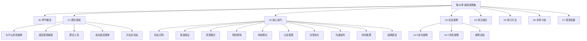

# 第35章：搞钱案例集

## 一、章节定位与核心理念

### 1.1 为什么案例是搞钱的终极教材

搞钱这件事，理论学得再多，不如看别人怎么干的。这不是说理论不重要——前面34章打下的认知基础、方法论框架、工具体系，都需要在真实场景中"对号入座"才能真正内化。

案例学习的独特价值在于三个维度：

**维度一：降低认知摩擦**

抽象的搞钱原则——比如"先验证再投入""找到供需缺口""建立正向飞轮"——读起来觉得有道理，但用起来往往不知道具体怎么做。案例把这些原则变成了看得见、摸得着的故事：一个人从什么起点出发，做了什么选择，踩了什么坑，最终拿到了什么结果。这个"具象化"过程，比任何理论讲解都有效。

**维度二：暴露隐性知识**

真正决定搞钱成败的，往往不是那些写在教科书上的"明规则"，而是只有做过的人才知道的"暗知识"。比如：

- 做社区团购，选品比流量重要10倍（因为生鲜损耗率直接吃掉利润）
- 做自媒体变现，粉丝质量比粉丝数量重要得多（1万精准粉比10万泛粉值钱）
- 做SaaS产品，续费率才是生死线（新客获取成本可能需要6-12个月才能回本）
- 做投资理财，回撤控制比收益率重要（亏50%需要赚100%才能回本）

这些隐性知识，只有通过大量案例的反复咀嚼才能领悟。

**维度三：建立决策直觉**

顶级棋手不是靠计算每一步棋的胜率来下棋的，而是靠多年积累形成的"棋感"。搞钱也一样——当你看过足够多的成功和失败案例后，面对一个新的搞钱机会，你能直觉性地感觉到"这个靠谱"或"这个有问题"。这种直觉不是玄学，而是大量案例在大脑中形成的模式识别能力。

### 1.2 本章的阅读方法论

这一章不是让你"读完就完"的。正确的打开方式是：

1. **先通读概览**（本文件），建立全局认知
2. **精读理论基础**（理论基础/目录），掌握案例分析的方法论
3. **逐个拆解案例**（实战案例/目录），每个案例至少花15分钟深度思考
4. **对照检查**（核心技巧/目录），看自己能用上哪些技巧
5. **避坑学习**（04-常见误区），提前识别自己可能踩的坑
6. **动手练习**（05-练习方法），用模板分析自己的搞钱路径

> **关键提醒**：不要跳过失败案例。成功案例教你"怎么做"，失败案例教你"不要怎么做"——后者的价值往往更大，因为它帮你省下的，是真金白银和宝贵时间。

***

## 二、案例分析方法论速览

在进入具体案例之前，你需要一套分析框架。这不是学术练习，而是帮你从案例中"榨取"最大价值的工具。

### 2.1 四维分析框架

每个案例都可以从四个维度来拆解：

| 维度 | 核心问题 | 分析要点 |
|------|----------|----------|
| **认知维度** | 他看到了什么别人没看到的？ | 趋势判断、机会识别、认知差 |
| **能力维度** | 他有什么核心能力？ | 专业技能、执行力、学习能力 |
| **资源维度** | 他调动了什么资源？ | 资金、人脉、平台、工具 |
| **时间维度** | 他的节奏把控如何？ | 入场时机、投入周期、复利积累 |

### 2.2 因果链追溯法

每个搞钱故事都是一条因果链。分析案例时，追问三层：

```text
结果 ← 直接原因 ← 深层原因 ← 底层逻辑
```

**举例**：某小红书博主年入100万

- 直接原因：粉丝30万 + 家居好物店铺 + 品牌广告
- 深层原因：室内设计师的专业背景 + 差异化内容策略 + 持续高频输出
- 底层逻辑：用专业能力建立信任 → 用信任撬动流量 → 用流量变现商业价值

只有追到底层逻辑，才能把个案经验变成可迁移的能力。

### 2.3 SWOT快速诊断

对每个案例做一个快速SWOT扫描：

| | 正面 | 负面 |
|---|------|------|
| **内部** | Strengths（核心优势） | Weaknesses（明显短板） |
| **外部** | Opportunities（时代红利） | Threats（外部风险） |

这个框架帮你快速定位：这个人的成功，多少靠实力，多少靠运气？如果环境变了，这个模式还成立吗？

### 2.4 幸存者偏差校正

这是最重要的分析纪律：**不要只看成功者说什么，要看失败者经历了什么**。

校正方法：
- 同一个赛道，至少看3个失败案例来对照
- 问自己：同样的做法，100个人做，成功的有几个？
- 关注成功案例中被轻描淡写的"运气成分"
- 看看成功者有没有经历过重大失败，以及如何翻盘的

***

## 三、20个案例全景速览

本章收录20个真实案例——10个成功，10个失败。下面是快速索引，帮你找到最相关的故事。

### 3.1 十个成功案例速览

| 编号 | 案例名称 | 赛道 | 起点 | 关键词 | 核心启示 |
|------|----------|------|------|--------|----------|
| 1 | 小红书家居博主 | 自媒体变现 | 90后设计师 | 内容差异化、变现阶梯 | 专业能力 × 内容平台 = 杠杆效应 |
| 2 | 程序员AI工具创业 | SaaS创业 | 85后被裁程序员 | 技术壁垒、时机把握 | 技术人创业要找到市场需求的结合点 |
| 3 | 宝妈社区团购 | 社区经济 | 80后全职宝妈 | 信任关系、本地供应链 | 从解决身边人的需求开始 |
| 4 | 退休教师知识付费 | 知识变现 | 60后退休教师 | 经验沉淀、平台借力 | 年龄不是障碍，经验是资产 |
| 5 | 大学生跨境电商 | 跨境电商 | 00后在校大学生 | 信息差、轻资产启动 | 年轻人的优势是试错成本低 |
| 6 | 工厂工人短视频 | 短视频变现 | 90后工厂工人 | 真实感、差异化人设 | 真实比精致更有吸引力 |
| 7 | 设计师NFT/数字资产 | 数字经济 | 90后自由设计师 | 数字产品、被动收入 | 把技能变成可复制的数字产品 |
| 8 | 前销售社群运营 | 社群经济 | 85后前销售 | 社群价值、信任变现 | 人脉经营的长期回报 |
| 9 | 农村小伙直播助农 | 直播电商 | 95后返乡青年 | 产地优势、政策红利 | 返乡不一定是退路，可能是出路 |
| 10 | 白领基金定投 | 投资理财 | 80后普通白领 | 长期主义、纪律投资 | 普通人最适合的投资方式 |

### 3.2 十个失败案例速览

| 编号 | 案例名称 | 赛道 | 核心败因 | 血泪教训 |
|------|----------|------|----------|----------|
| 1 | 餐饮创业血本无归 | 餐饮创业 | 选址失误+过度装修 | 实体生意，位置决定生死 |
| 2 | 微商囤货变废品 | 社交电商 | 盲目囤货+虚假宣传 | 不要被"轻松月入十万"洗脑 |
| 3 | 加盟骗局套牢 | 加盟连锁 | 尽调不足+合同陷阱 | 加盟前必须做独立调研 |
| 4 | 股票杠杆爆仓 | 投资理财 | 过度杠杆+心态失控 | 杠杆放大收益的同时也放大风险 |
| 5 | 知识付费翻车 | 知识付费 | 内容注水+口碑崩塌 | 没有真本事，包装再好也会翻车 |
| 6 | 盲目扩张资金链断裂 | 创业经营 | 贪大求快+现金流管理失败 | 规模不等于利润，现金流才是命 |
| 7 | 合伙人反目散伙 | 创业合伙 | 股权不清+理念冲突 | 合伙前先把"散伙规则"定好 |
| 8 | P2P理财血本无归 | 理财投资 | 贪高收益+风控意识为零 | 收益率超过8%就要高度警惕 |
| 9 | 自媒体流量焦虑 | 自媒体 | 追热点+失去自我 | 流量不等于变现能力 |
| 10 | 技术外包项目亏损 | 技术服务 | 低价竞标+需求蔓延 | 低价接单是慢性自杀 |

***

## 四、案例背后的六大搞钱规律

从20个案例中，我们提炼出六大共性规律。这些规律不是某一个案例的特例，而是反复出现的模式——理解它们，比记住20个故事更重要。

### 规律一：价值创造是搞钱的唯一正道

所有长期成功的案例，底层都是在创造真实价值。小红书博主提供家居改造方案，程序员提供AI效率工具，宝妈解决社区买菜难题。而失败案例中，微商囤货的本质是"击鼓传花"，P2P的本质是"借新还旧"——当搞钱脱离了价值创造，崩盘只是时间问题。

**检验标准**：问自己——如果没有我参与，这件事对客户有没有价值？如果答案是"没有"，那这不是搞钱，而是赌博。

### 规律二：能力圈决定搞钱的天花板

成功案例的共同特点是在能力圈内行动。设计师做家居内容，程序员做技术产品，退休教师做知识分享——都是用自己最擅长的东西赚钱。而失败案例中，工厂工人辞职全职炒股、白领盲目加盟餐饮，都是跨出了能力圈。

**巴菲特的忠告**依然有效：重要的不是能力圈的大小，而是你知道边界在哪里。在能力圈内搞钱，成功率至少提高3倍。

### 规律三：验证优先于投入

几乎每个成功案例都有一个"小成本验证"阶段。小红书博主先用业余时间发内容试水，程序员先做MVP测试市场反应，宝妈先在小区群里帮忙团购。而失败案例中，餐饮创业者一上来就签长租约、花大钱装修，微商一上来就囤几万块的货——没验证就all in，是搞钱最大的赌局。

**72小时验证法则**：任何搞钱想法，在投入超过月收入10%之前，先用72小时做最小化验证。

### 规律四：现金流比利润更重要

失败案例中，"资金链断裂"出现频率最高。不是因为项目不赚钱，而是因为账期错配、过度扩张、缺乏现金储备。成功案例的共同特征是：始终保持现金安全垫，宁可慢一点，也不让现金流断裂。

**安全垫公式**：个人搞钱，至少保留6个月生活费的现金储备；创业经营，至少保留3个月运营成本的现金。

### 规律五：长期主义是最大的竞争壁垒

10个成功案例中，没有一个是"一夜暴富"的。小红书博主坚持了3年才年入百万，程序员的产品迭代了2年才盈利，退休教师花了1年打磨课程。而失败案例中，追求"快速回本""短期暴利"的占了大多数。

**反直觉的真相**：在搞钱这件事上，"慢"就是"快"。因为大多数人不愿意等，所以愿意等的人反而竞争更少。

### 规律六：风险控制是搞钱的底线

所有失败案例都可以归结为一个词：**失控**。杠杆失控、扩张失控、合伙关系失控、心态失控。成功案例则无一例外都有明确的止损线和风险控制机制。

**三条铁律**：
1. 任何单一项目的投入不超过总资产的30%
2. 设定明确的止损线（时间止损 + 金额止损）
3. 绝不借钱搞钱（房贷除外）

***

## 五、搞钱原则提炼

将六大规律转化为可执行的行动原则：

### 5.1 搞钱决策清单

在做任何搞钱决策前，逐项检查：

- [ ] **价值检验**：这件事是否创造真实价值？
- [ ] **能力检验**：这在我的能力圈内吗？
- [ ] **验证检验**：我做过最小化验证了吗？
- [ ] **现金流检验**：最坏情况下，我能撑多久？
- [ ] **时间检验**：我愿意为这件事投入至少1年吗？
- [ ] **风险检验**：如果全亏了，我的生活质量会受多大影响？
- [ ] **独立检验**：去掉运气和外部因素，这个决策还成立吗？

**通过6项以上**：可以谨慎推进。**通过4-5项**：需要补强薄弱环节。**通过3项以下**：建议放弃或大幅调整。

### 5.2 搞钱的优先级矩阵

不是所有搞钱机会都值得做。用这个矩阵来排优先级：

| | 低投入（时间/金钱） | 高投入 |
|---|---|---|
| **高确定性** | 立刻做（副业、技能变现） | 规划后做（创业、投资） |
| **低确定性** | 小试一把（新平台、新模式） | 坚决不做（除非你能承受全部亏损） |

### 5.3 搞钱的阶段路线图

不同阶段的搞钱策略完全不同：

**阶段一：积累期（0-1年）**
- 核心目标：跑通一个最小化的赚钱模型
- 关键动作：找到能力 × 需求的交叉点，快速验证
- 常见错误：追求完美，迟迟不动手

**阶段二：成长期（1-3年）**
- 核心目标：稳定收入，建立个人品牌
- 关键动作：系统化运营，提高效率，扩大影响力
- 常见错误：急于扩张，忽视现金流管理

**阶段三：收获期（3-5年）**
- 核心目标：建立被动收入，实现时间自由
- 关键动作：搭建团队，开发产品/系统，布局第二曲线
- 常见错误：躺在功劳簿上，错过新机会

**阶段四：传承期（5年+）**
- 核心目标：知识和资产的代际传承
- 关键动作：总结方法论，培养团队，投资下一代
- 常见错误：路径依赖，不愿接受新事物

***

## 六、个人搞钱路径设计框架

这是本章最重要的工具——读完20个案例后，用这个框架设计你自己的搞钱路径。

### 6.1 自我盘点清单

**能力盘点**

| 类别 | 具体项 | 熟练度（1-5） | 变现潜力（1-5） |
|------|--------|---------------|-----------------|
| 专业技能 | | | |
| 通用技能 | | | |
| 兴趣爱好 | | | |
| 行业经验 | | | |

**资源盘点**

| 资源类型 | 具体内容 | 可调动程度 |
|----------|----------|------------|
| 资金 | | |
| 人脉 | | |
| 信息渠道 | | |
| 时间 | | |
| 平台/工具 | | |

**约束条件**

- 每天可投入搞钱的时间：___小时
- 可承受的最大亏损金额：___元
- 硬性约束（家庭、健康、地域等）：___

### 6.2 机会匹配矩阵

把你的能力和市场需求做一个交叉匹配：

```text
我擅长的 × 市场需要的 × 我喜欢做的 = 最佳搞钱方向
```

三者交集越大，搞钱的持久性和成功率越高。只有"擅长+需要"但不喜欢，容易倦怠；只有"擅长+喜欢"但没需求，只是自嗨；只有"需要+喜欢"但不擅长，需要先补能力。

### 6.3 90天行动计划模板

**第1-30天：验证期**
- 目标：验证搞钱方向的可行性
- 动作：发布10条内容 / 完成3个小订单 / 获得50个目标用户反馈
- 里程碑：获得第一个付费客户或明确的数据反馈

**第31-60天：优化期**
- 目标：跑通赚钱模型，优化转化率
- 动作：分析数据、迭代产品/服务、建立复购机制
- 里程碑：月收入稳定在目标的30%以上

**第61-90天：放大期**
- 目标：扩大规模，建立增长引擎
- 动作：增加投入、拓展渠道、考虑外包/合作
- 里程碑：月收入稳定在目标的60%以上

***

## 七、章节内容导航

本章共包含6个核心模块和7个补充模块，下面是完整的内容地图：



| 模块 | 文件路径 | 核心内容 | 建议用时 |
|------|----------|----------|----------|
| 理论基础 | 理论基础/ | 案例分析方法论、底层逻辑、理论工具 | 30分钟 |
| 核心技巧 | 核心技巧/ | 10大实操技巧（机会识别到品牌建设） | 45分钟 |
| 实战案例 | 实战案例/ | 10个成功+10个失败案例深度剖析 | 90分钟 |
| 常见误区 | 04-常见误区.md | 认知误区、行动误区、心态误区 | 20分钟 |
| 练习方法 | 05-练习方法.md | 案例分析练习、路径设计实战 | 45分钟 |
| 本章小结 | 06-本章小结.md | 核心要点回顾、行动清单 | 15分钟 |
| 深度拓展 | 07-深度拓展.md | 延伸阅读、进阶思考 | 按需 |

***

## 八、不同读者的阅读策略

### 8.1 搞钱新手（还没开始）

**你的核心需求**：找到方向，建立信心

**推荐阅读顺序**：
1. 本概览 → 建立全局认知
2. 实战案例/成功案例 → 找到与自己相似的故事
3. 核心技巧/机会识别 → 学会发现机会
4. 05-练习方法 → 动手做自我盘点

**重点关注**：案例1（小红书博主）、案例3（宝妈团购）、案例10（基金定投）——这几个门槛最低，最适合新手参考。

### 8.2 实践者（正在搞钱中）

**你的核心需求**：优化策略，突破瓶颈

**推荐阅读顺序**：
1. 本概览 → 快速定位薄弱环节
2. 实战案例/失败案例 → 看看自己有没有在犯同样的错
3. 核心技巧/风险控制+持续增长 → 补强短板
4. 04-常见误区 → 认知纠偏

**重点关注**：失败案例6（盲目扩张）、失败案例7（合伙人反目）——正在搞钱的人最容易在这两个地方翻车。

### 8.3 进阶者（已有稳定收入）

**你的核心需求**：系统化、规模化、被动化

**推荐阅读顺序**：
1. 本概览 → 审视自己的搞钱阶段
2. 理论基础/ → 建立完整的分析框架
3. 核心技巧/系统化+品牌建设 → 升级搞钱操作系统
4. 07-深度拓展 → 前沿趋势和高级策略

**重点关注**：成功案例2（程序员创业）、核心技巧中的"第二曲线"——这个阶段最重要的是建立系统和布局未来。

***

## 九、关键术语速查

| 术语 | 定义 | 相关案例 |
|------|------|----------|
| **MVP（最小可行产品）** | 用最低成本验证核心假设的产品/服务 | 案例2（程序员创业） |
| **信息差** | 不同人/地区/行业之间的信息不对称 | 案例5（跨境电商） |
| **复利效应** | 收益再投入产生的指数增长 | 案例10（基金定投） |
| **飞轮效应** | 正向循环导致的加速增长 | 案例1（小红书博主） |
| **能力圈** | 自己真正擅长和理解的领域 | 案例4（退休教师） |
| **幸存者偏差** | 只看到成功者而忽略大量失败者 | 所有失败案例 |
| **第二曲线** | 在主业稳定时提前布局的新方向 | 案例7（数字资产） |
| **止损线** | 预先设定的最大可承受损失 | 案例4失败（杠杆爆仓） |
| **SaaS** | 软件即服务，订阅制商业模式 | 案例2（程序员创业） |
| **社群运营** | 通过社群建立信任和商业价值 | 案例8（社群运营） |

***

## 十、阅读建议与注意事项

### 10.1 最佳阅读节奏

- **不要一口气读完**：案例密度高，信息量大，建议分3-4次阅读
- **每次读完做笔记**：记录触动你的点和联想到的自身情况
- **间隔1周回顾**：第一遍读的是故事，第二遍读的是规律

### 10.2 避免的阅读陷阱

| 陷阱 | 表现 | 纠正 |
|------|------|------|
| 简单模仿 | "他做小红书成功了，我也去做" | 先分析他的成功前提是否适用于你 |
| 选择性注意 | 只记住了成功的结果，忽略了过程 | 重点关注"他做了什么"而非"他赚了多少" |
| 过度乐观 | "这个我也能做到" | 先看失败案例，校准预期 |
| 过度悲观 | "我没有他的资源/能力" | 关注可迁移的部分，而非不可复制的部分 |
| 纸上谈兵 | 读完不做任何行动 | 读完立刻做一个小动作（哪怕只是写下自己的能力盘点） |

### 10.3 案例分析的黄金问题

读每个案例时，问自己这5个问题：

1. **如果是我，在同样的起点和环境下，我会怎么做？**
2. **他的成功/失败，最关键的3个因素是什么？**
3. **有哪些因素是可以迁移到我的情况中的？**
4. **如果环境变化（比如经济下行、政策变化），这个模式还成立吗？**
5. **我要模仿他的话，第一步该做什么？**

***

*准备好进入案例了？从[理论基础](理论基础/)开始，或者直接跳到[实战案例](实战案例/)看故事。*
