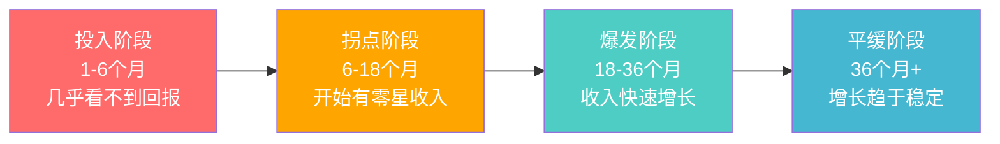
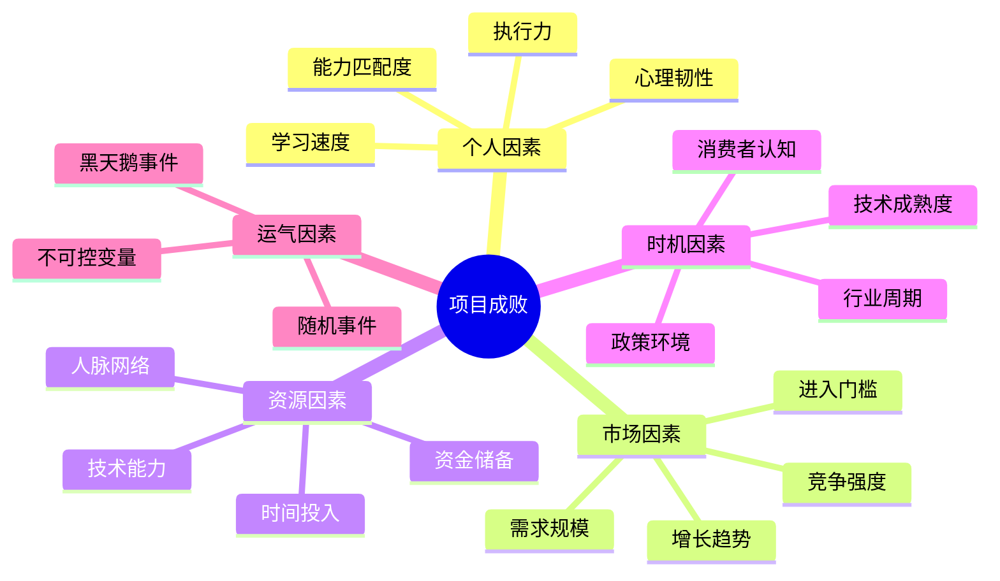
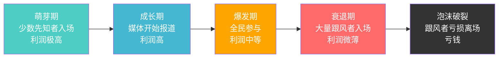
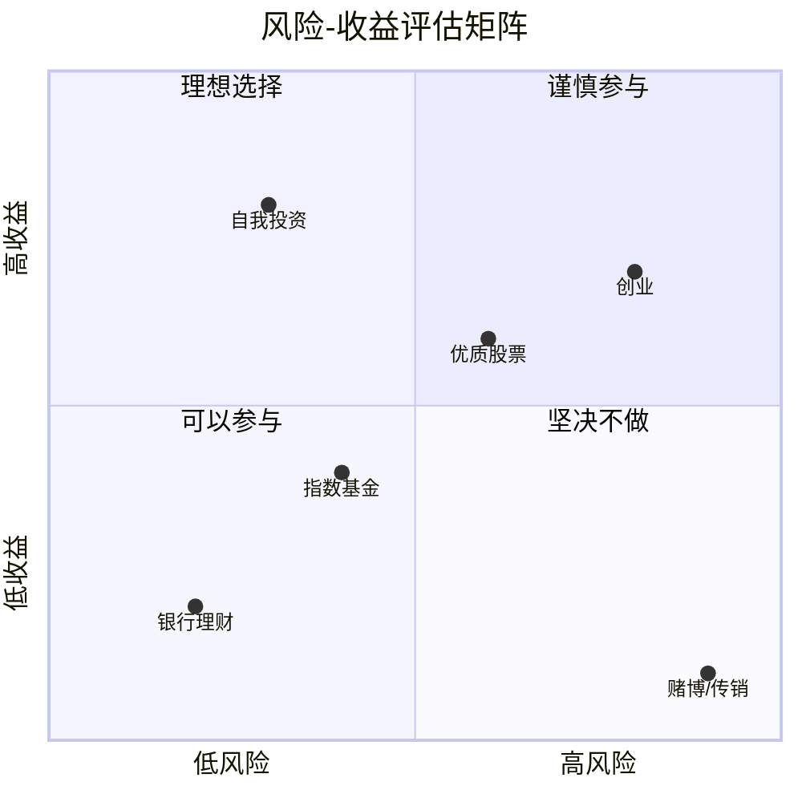
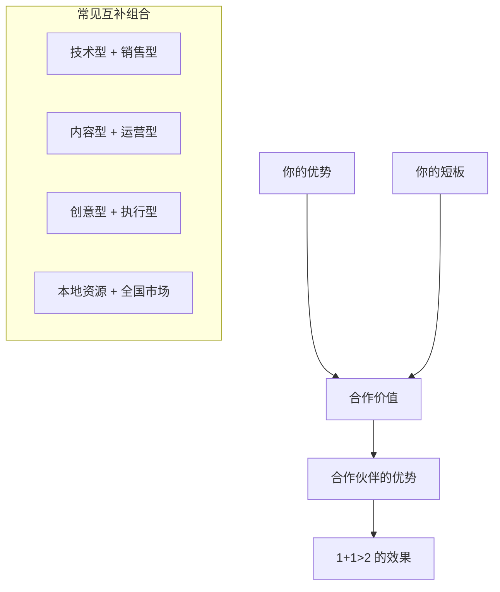
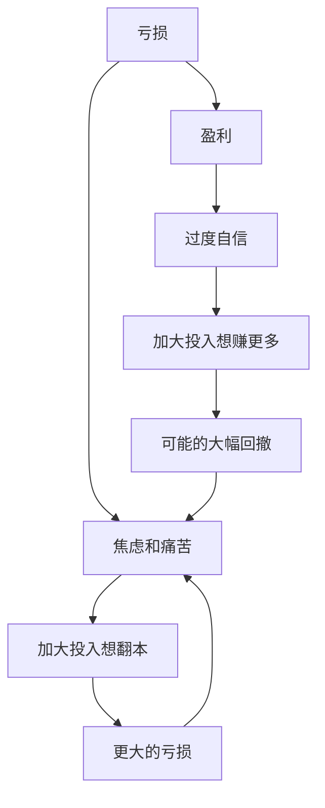
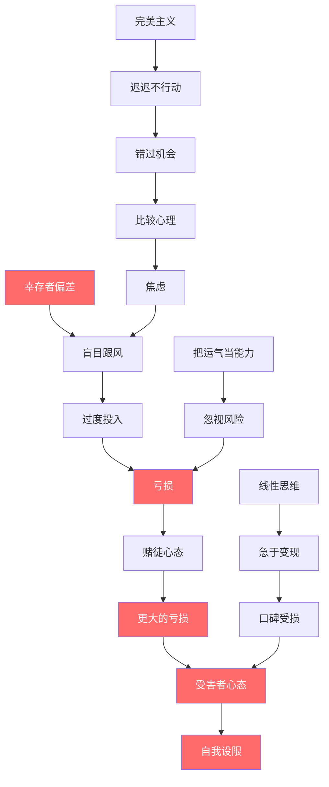

# 04-常见误区：搞钱过程中的认知和行动误区

> 人们在搞钱路上亏掉的钱，90%不是因为外部环境，而是因为自己的认知缺陷和行为陷阱。本章系统梳理15个高频误区，从认知层、行动层、心态层三个维度拆解每一个陷阱的心理机制、真实案例和破解工具，帮你建立一套「反脆弱」的决策系统。

---

## 一、认知误区：你以为的「常识」可能是陷阱

认知误区是最隐蔽的——你不知道自己不知道。它不直接让你亏钱，但会扭曲你对世界的理解，导致每一个后续决策都偏离正确方向。

### 误区1：幸存者偏差——只看到成功的，看不到失败的

**心理机制**

幸存者偏差（Survivorship Bias）是二战时期统计学家亚伯拉罕·瓦尔德发现的：军方想给飞机加装甲，统计了返航飞机的弹孔分布，发现机翼中弹最多，于是想加固机翼。瓦尔德指出：你应该关注的是那些没有返航的飞机——它们被打中的地方才是致命弱点。

这个偏差在搞钱领域无处不在：

| 你看到的（幸存者） | 你看不到的（阵亡者） | 真实成功率 |
|---|---|---|
| 某博主月入10万的自媒体 | 同期99%的博主已经停更 | <1% |
| 某奶茶店年赚百万 | 同品牌60%加盟店一年内倒闭 | ~40% |
| 某程序员创业融资千万 | 同批90%创业者已经关门 | <10% |
| 某炒币者财务自由 | 同期入场95%的人亏损离场 | <5% |

**真实案例**

2021年，某知识付费博主公开晒收入：「做自媒体2年，年收入突破500万」。这条视频播放量超过2000万，评论区无数人表示要辞职做自媒体。但根据新榜研究院的统计，全职自媒体人中，月收入超过1万元的不到5%，超过10万的不到0.3%。那条视频的2000万播放量里，可能有上百万人被误导进入了他们大概率无法成功的赛道。

**诊断工具：反向追问法**

当你看到一个成功案例时，立刻追问以下四个问题：

1. **基数是多少？** 这个赛道一共有多少参与者？
2. **幸存率是多少？** 活下来并且赚钱的比例有多大？
3. **时间维度？** 这个人成功了多久？是昙花一现还是持续盈利？
4. **可复制性？** 他的成功有多少来自个人特殊条件（资源、人脉、时机）？

**破解方法**

- **主动搜索失败案例**：在知乎、小红书搜索「XX失败」「XX亏了」，你会发现失败帖的数量通常是成功帖的5-10倍
- **看行业报告而非个人分享**：行业报告会告诉你整体成功率，个人分享只告诉你最好听的那个
- **计算期望值**：成功概率 × 成功收益 vs 失败概率 × 失败损失，如果期望值为负，这个游戏就不该玩

---

### 误区2：把运气当能力

**心理机制**

心理学家丹尼尔·卡尼曼在《思考，快与慢》中提出了「光环效应」：当一件事成功后，大脑会自动将成功归因于决策者的能力，而忽略运气、时机、环境等外部因素。这种归因偏差会让你产生虚假的自信，进而做出更冒险的决策。

**典型场景拆解**

| 场景 | 运气成分 | 能力成分 | 你的真实水平 |
|---|---|---|---|
| 2020年买茅台股票赚了50% | 大盘整体上涨30% | 选股眼光 | 可能只比平均水平高20% |
| 随手发的一条视频爆了 | 算法随机推荐 | 内容能力 | 需要多次验证才能确认 |
| 第一次摆摊就赚了钱 | 位置好、天气好 | 经营能力 | 至少连续5次才能评估 |
| 跟风炒币赚了3倍 | 整个市场都在涨 | 投资判断力 | 大概率是市场β收益 |

**真实案例**

某投资者在2020-2021年牛市期间，用10万本金赚到了80万。他认为自己天赋异禀，于是加大投入，把房子抵押贷款200万全部投入股市。2022年市场回调，他的账户缩水到60万，不仅利润全部回吐，还倒亏了140万本金和贷款利息。

**自我检验：三个问题**

1. **如果重来一次，我还能成功吗？** 如果答案是「不确定」，说明运气成分很大
2. **同行里有多少人也成功了？** 如果成功率很高，可能是行业红利而非个人能力
3. **去掉最幸运的那一次决策，总收益还是正的吗？** 这能帮你剥离运气的影响

**破解方法**

- **建立决策日志**：记录每次重要决策的理由、预期结果和实际结果，定期复盘
- **用长期业绩评估自己**：至少3年、跨越一个完整周期的业绩才有参考价值
- **设置「冷静期」**：连续盈利后，强制暂停1-2周，避免在过度自信时做大决策

---

### 误区3：线性思维——以为投入越多，回报越大

**心理机制**

线性思维是人类大脑的默认模式：我每天背100个单词，365天就是36500个；我投入10万做项目，回报应该是10万的某个倍数。但现实世界的财富增长几乎都是非线性的——它更像是一条S曲线：前期缓慢积累，中期快速爆发，后期趋于平缓。



**真实案例**

某自由撰稿人，前6个月写了200篇文章，总收入不到5000元（平均25元/篇）。他没有放弃，继续优化选题和写作技巧。到第8个月，一篇文章被大号转载，带来5000元稿费和大量约稿机会。到第12个月，月收入稳定在2万以上。如果他在第6个月放弃了（线性思维告诉他「我已经很努力了但收入很低，说明这条路不行」），他永远等不到拐点。

**投入产出比评估矩阵**

| 投入类型 | 线性回报 | 非线性回报 | 判断标准 |
|---|---|---|---|
| 体力劳动（送外卖、搬砖） | ✅ 干1小时赚1小时的钱 | ❌ 没有复利 | 只能做过渡，不能当长期策略 |
| 技能学习（编程、设计） | ❌ 前期投入大、回报低 | ✅ 后期边际成本趋近于零 | 值得长期投入 |
| 内容创作（写作、视频） | ❌ 前期几乎没有收入 | ✅ 内容有长尾效应 | 需要坚持6-12个月才能验证 |
| 人脉积累 | ❌ 短期看不到回报 | ✅ 关键时刻可能改变命运 | 持续投入，不要急功近利 |

**破解方法**

- **画投入产出曲线**：在开始一个项目前，先估算它的回报曲线是线性还是非线性的
- **设定最短验证周期**：非线性回报的项目至少给6个月，不要用1个月的结果做判断
- **关注边际成本**：如果每多赚1块钱需要的投入在减少，说明你走在正确的路上

---

### 误区4：完美主义——想清楚再行动

**心理机制**

完美主义的本质是恐惧——害怕失败、害怕被评价、害怕不完美。它会伪装成「认真负责」「深思熟虑」，让你觉得延迟行动是正确的。但实际上，完美主义是行动力的最大杀手。

行为经济学家丹·艾瑞里的研究表明：人们在面对不确定决策时，会倾向于「推迟决策」，即使推迟本身有明确的成本。这就是为什么很多人花3个月写商业计划书，却不愿意花3天做一个最小可行产品（MVP）去验证。

**真实案例对比**

| 行为模式 | 案例A（完美主义者） | 案例B（行动派） |
|---|---|---|
| 启动时间 | 花3个月做市场调研和商业计划 | 花3天做了一个最小版本 |
| 第一版产品 | 还在打磨中 | 已经上线，收到了10个用户反馈 |
| 3个月后 | 计划书写了100页，还没开始 | 已经迭代了5个版本，有了200个付费用户 |
| 6个月后 | 终于开始，但发现很多假设是错的 | 已经找到了PMF（产品市场契合），开始规模化 |

**「最小可行行动」框架（MVA）**

对于任何一个搞钱想法，用这个框架快速启动：

1. **最小验证**：用最低成本验证核心假设（比如，你想做线上课程，先写一篇干货文章看有没有人看）
2. **最小产品**：做一个最简版本（比如，先开一场免费直播，而不是先录100节课）
3. **最小收入**：找到第一个付费用户（哪怕只赚1块钱，也证明了商业模式可行）
4. **最小规模**：在小范围内跑通，再考虑扩大

**破解方法**

- **给自己设Deadline**：「这个想法最多想一周，第八天必须开始行动」
- **接受「60分产品」**：先上线一个能用的版本，根据反馈迭代到80分
- **把「完美」拆成「迭代」**：不要试图一次做到完美，而是计划做10个版本，每个版本比上一个好一点

---

### 误区5：单点归因——把复杂问题简单化

**心理机制**

人类大脑天生喜欢简单因果关系：「他成功是因为他有关系」「她赚钱是因为她长得好看」「那个项目失败是因为运气不好」。这种单点归因让我们感觉世界是可控的、可理解的，但它会让你错过真正重要的因素。

**真实案例**

某餐饮创业者开了一家火锅店，半年后倒闭了。他把失败归因于「位置不好」。但深入分析发现：
- **产品**：菜品没有特色，和周边5家火锅店同质化严重（权重30%）
- **运营**：没有做任何线上推广，完全靠自然流量（权重25%）
- **成本**：租金占营收40%，远超行业25%的健康水平（权重25%）
- **位置**：虽然不在主干道，但周边有3个小区（权重20%）

如果他只归因于「位置不好」，下次换个好位置开店，其他三个问题不解决，大概率还是会失败。

**多因素分析框架**



**破解方法**

- **列出所有可能因素**：至少从5个维度（个人、市场、资源、时机、运气）分析
- **给每个因素打权重**：哪些是主要原因（权重>20%），哪些是次要原因（权重<10%）
- **做对照分析**：找到同一个赛道里成功和失败的案例，对比他们的差异，找出真正的关键变量

---

## 二、行动误区：知道应该做什么，但做错了

行动误区比认知误区更容易察觉——因为你会直接感受到「做了但没效果」或「做了但亏了钱」。但很多人即使意识到问题，也很难改变行为模式。

### 误区6：盲目跟风——什么火做什么

**心理机制**

从众心理（Herd Behavior）是人类在进化中形成的生存本能：在原始社会，跟随大多数人的选择通常更安全。但在搞钱领域，从众心理是致命的——因为当大多数人都知道某个机会时，这个机会的红利期大概率已经过了。

经济学中有一个经典比喻：「当出租车司机都在谈论股票的时候，就是该卖出的时候了。」

**风口生命周期模型**



**真实案例**

| 风口 | 萌芽期入场者 | 爆发期跟风者 | 最终结果 |
|---|---|---|---|
| 比特币（2013年入场 vs 2017年底入场） | 早期入场者收益100倍+ | 2017年底入场者多数亏损50%+ | 追高者成为接盘侠 |
| 短视频（2018年入场 vs 2021年入场） | 早期创作者获得平台红利流量 | 2021年入场者流量成本飙升10倍 | 后来者获客成本极高 |
| 盲盒（2019年入场 vs 2021年入场） | 早期商家利润率达到60% | 2021年入场者面临激烈竞争和监管 | 后来者利润率不到10% |
| AI绘画（2022年入场 vs 2024年入场） | 早期入场者迅速积累粉丝 | 2024年入场者面临工具普及和价格战 | 后来者差异化困难 |

**破解方法**

- **评估时机**：问自己「这个风口处于生命周期的哪个阶段？」如果是爆发期或衰退期，不要入场
- **评估自身优势**：即使时机对了，你有没有别人没有的资源、技能或信息优势？
- **做「逆向思考」**：当所有人都在追某个风口时，想想有没有被忽略的机会

---

### 误区7：过度投入——把所有鸡蛋放在一个篮子里

**心理机制**

过度投入通常有两种驱动因素：
1. **沉没成本谬误**：「我已经投入这么多了，不能放弃」——过去的投入不应该影响未来的决策
2. **确认偏误**：你只关注支持你决策的信息，忽略反对的信息

**安全垫计算公式**

```text
最低安全垫 = 月固定支出 × 6 + 项目最大亏损额

其中：
- 月固定支出 = 房租/房贷 + 餐饮 + 交通 + 保险 + 其他刚性支出
- 项目最大亏损额 = 最坏情况下你会亏多少钱（包括直接损失和机会成本）
```

**真实案例**

某互联网公司员工，年薪40万，攒了100万。他看好一个朋友的餐饮项目，一次性投入80万（占积蓄80%）。结果项目失败，80万全部亏光。更惨的是，因为经济下行，他被公司裁员了。失去收入来源后，他连房租都交不起，被迫搬回老家。

如果他只投入20万（占积蓄20%），即使全亏了，剩余80万也够他生活2年，有足够的时间重新找工作或启动新项目。

**投入比例建议表**

| 项目风险等级 | 建议投入上限（占总资产） | 安全垫要求 | 适用场景 |
|---|---|---|---|
| 低风险（理财、国债） | 50-70% | 3个月生活费 | 稳健型投资者 |
| 中风险（股票、基金） | 20-40% | 6个月生活费 | 有一定投资经验 |
| 高风险（创业、投机） | 5-15% | 12个月生活费 | 有主业收入保障 |
| 极高风险（加密货币、期货） | 1-5% | 18个月生活费 | 只用「丢了不心疼」的钱 |

**破解方法**

- **严格执行投入上限**：任何单一项目投入不超过总资产的20%
- **先兼职验证**：辞职创业前，先用业余时间验证商业模式
- **设置「熔断线」**：亏损达到预设阈值时，强制退出，不管沉没成本

---

### 误区8：忽视风险——只看收益不看风险

**心理机制**

心理学中的「前景理论」（卡尼曼和特沃斯基提出）揭示：人们对收益的感知是递减的（赚10万到赚20万的快乐感 < 赚0到赚10万），但对损失的感知是递增的（亏10万到亏20万的痛苦 > 亏0到亏10万）。然而，在做决策时，人们往往过度关注收益而低估风险，因为收益是具体可想象的，而风险是抽象的。

**真实案例**

2018年，某P2P平台宣称「年化收益15%，保本保息」。大量投资者涌入，总规模超过50亿。很多人把全部积蓄都投进去了，因为他们只看到了15%的收益，没有想过「平台跑路了怎么办」。结果平台爆雷，50亿资金无法兑付，数十万投资者血本无归。

事后调查显示：
- 该平台的实际年化收益只有3-4%，所谓的15%是用新投资者的钱付老投资者的利息（庞氏骗局）
- 平台没有银行存管，资金流向不透明
- 平台关联公司有大量法律纠纷

这些问题任何一个都能说明风险极大，但在15%收益的诱惑下，大多数人选择了视而不见。

**风险评估矩阵**



**破解方法**

- **先算最坏情况**：在做任何投资或创业决策前，先问自己「如果最坏的情况发生，我能承受吗？」
- **设置止损线**：投资亏损超过15-20%必须止损；创业项目6个月没有正向反馈必须重新评估
- **不懂不碰**：巴菲特的这条原则看似简单，但90%的人做不到——他们总觉得自己「研究过了就懂了」

---

### 误区9：急于变现——还没积累就想赚钱

**心理机制**

即时满足偏好（Present Bias）是人类最根深蒂固的认知偏差之一：我们天然偏好「现在的100块」而非「一年后的200块」。在搞钱领域，这意味着人们倾向于选择「今天能赚100块」的短期机会，而非「三年后能赚100万」的长期积累。

**变现时机判断框架**

| 积累阶段 | 变现时机 | 后果 |
|---|---|---|
| 粉丝<1000，内容<50篇 | ❌ 不该变现 | 损害口碑，被用户贴上「割韭菜」标签 |
| 粉丝1000-10000，内容50-200篇 | ⚠️ 谨慎变现 | 可以尝试小额付费产品，但不要过度营销 |
| 粉丝>10000，内容>200篇，有明确的用户需求 | ✅ 适合变现 | 用户已经信任你，愿意为你的产品付费 |
| 有复购、有口碑、有转介绍 | ✅ 规模化变现 | 建立定价体系，扩大产品线 |

**真实案例**

某知乎大V在只有2000粉丝时就开始接广告，每条500元。短期内确实赚了一些钱，但粉丝发现他的内容质量下降（为了接广告写的软文增多），开始取关。3个月后粉丝降到800，广告商也不再找他。

另一位知乎大V，前18个月不接任何广告，专注于输出高质量内容。18个月后粉丝达到5万，开始推出付费专栏和咨询服务，月收入稳定在3万以上。因为用户已经建立了信任，愿意为他的产品付费。

**破解方法**

- **「100个铁粉」法则**：先积累100个真正认可你的铁杆粉丝，再考虑变现
- **价值先行**：先免费提供足够多的价值，让用户觉得「免费内容都这么好，付费内容一定更好」
- **设定变现时间线**：不是「越早变现越好」，而是「在正确的时机变现」

---

### 误区10：孤军奋战——不愿意合作和求助

**心理机制**

不愿合作通常源于两种心理：
1. **控制欲**：「只有自己干才能保证质量」
2. **信任缺失**：「别人会坑我」「分享利益就是吃亏」

但现实是：没有任何一个成功的商业案例是完全靠一个人做出来的。

**能力互补矩阵**



**真实案例**

两个程序员都想做SaaS产品：
- **程序员A**：一个人做产品、做开发、做销售、做客服。2年后产品勉强上线，但因为不懂销售，月收入只有3000元。
- **程序员B**：找了一个懂销售的合伙人，自己专注产品和开发，合伙人负责销售和市场。1年后产品上线，月收入3万。

B的成功不是因为他技术更好，而是因为他懂得借助别人的能力。

**破解方法**

- **列出你的能力清单**：哪些是你擅长的，哪些是你的短板
- **找到互补的人**：不是找和你一样的人，而是找能补你短板的人
- **学会分利**：把蛋糕做大比独占小蛋糕更有价值。合理的利益分配是合作的基础

---

## 三、心态误区：情绪是决策的最大敌人

心态误区是最难察觉的，因为它不体现在具体的行动上，而是渗透在你每一个决策的底层逻辑中。一个心态失衡的人，即使掌握了所有正确的方法，也会在关键时刻做出错误的选择。

### 误区11：比较心理——看到别人赚钱就焦虑

**心理机制**

社会比较理论（费斯廷格，1954年）指出：人类天生倾向于通过与他人比较来评估自己的能力和价值。在社交媒体时代，这种比较被无限放大——你每天看到的都是别人精心包装的「高光时刻」，而看不到他们背后的挣扎和失败。

**社交媒体信息失真对照表**

| 你在社交媒体上看到的 | 真实情况可能是什么 |
|---|---|
| 「自由职业第3个月，月入5万」 | 可能只算了收入，没算支出；可能是单月峰值而非平均值 |
| 「创业第一年，团队10人」 | 可能是靠融资撑起来的，实际还没盈利 |
| 「30岁实现财务自由」 | 可能是家里本来就有钱，或者对「财务自由」的定义不同 |
| 「全职妈妈做副业月入2万」 | 可能是广告，目的是卖课给你 |

**破解方法**

- **信息过滤**：取关让你焦虑的账号，关注能给你提供实际帮助的内容
- **建立自己的坐标系**：只和昨天的自己比，不和别人比
- **把焦虑转化为行动力**：焦虑的本质是「觉得自己不够好」，解决方法不是消除焦虑，而是通过行动提升自己

---

### 误区12：赌徒心态——亏了想翻本，赢了想赢更多

**心理机制**

赌徒心态的核心是「损失厌恶」——人们对损失的感知强度是同等收益的2-2.5倍（卡尼曼和特沃斯基的前景理论）。这意味着：
- 亏了1万块的痛苦，需要赚2-2.5万块才能弥补
- 这种不对称会让你在亏损时做出非理性决策：「再投一点，等回本就收手」
- 但「回本」的心理锚点会让你越陷越深

**赌徒心态的恶性循环**



**真实案例**

某期货交易者，初始资金50万。第一周赚了5万，信心满满加大仓位。第二周亏了8万，不甘心，继续加仓想翻本。第三周亏了15万，心态崩溃，开始频繁交易。一个月后，50万本金只剩12万。

如果他在第一周盈利后取出利润（5万），在第二周亏损后严格执行止损（亏损超过10%暂停交易），他的损失会控制在5万以内，而不是38万。

**破解方法**

- **设定硬性规则**：单日亏损超过5%暂停交易；单周亏损超过10%休息一周
- **分离账户**：把投资账户和生活账户分开，避免「把生活费也亏进去」
- **写交易日志**：记录每次交易的理由和情绪状态，事后复盘哪些决策是情绪化的

---

### 误区13：受害者心态——把失败归咎于外部

**心理机制**

心理学家马丁·塞利格曼提出的「习得性无助」理论解释了受害者心态的形成：当一个人反复经历失败且无法控制结果时，他会形成「无论我做什么都没用」的信念，从而放弃主动行动。

但在搞钱领域，受害者心态往往不是因为真的无能为力，而是因为「归咎于外部」比「承认自己的问题」更轻松。

**受害者心态 vs 成长心态对比**

| 维度 | 受害者心态 | 成长心态 |
|---|---|---|
| 面对失败 | 「大环境不好，没办法」 | 「我能从这次失败中学到什么？」 |
| 面对竞争 | 「他有关系/有资源，我比不了」 | 「他的优势是什么？我能从中学到什么？」 |
| 面对困难 | 「太难了，不是我能做的」 | 「难在哪里？我能怎么解决？」 |
| 面对批评 | 「他们不理解我」 | 「他们的反馈里有没有有价值的信息？」 |
| 最终结果 | 原地踏步，越来越消极 | 持续进步，越来越强 |

**破解方法**

- **区分「可控」和「不可控」**：大环境不可控，但你的行动、学习、策略是可控的
- **从每次失败中提取「我能做什么」**：即使90%是外部原因，也要找到那10%自己能改进的
- **找一个「成长型」的圈子**：你周围人的思维方式会直接影响你的思维方式

---

### 误区14：速成心态——想走捷径快速致富

**心理机制**

速成心态的根源是「延迟折扣」（Temporal Discounting）——人们会系统性地低估未来收益的价值。比如，「3年后赚100万」在心理上的吸引力可能只相当于「现在赚10万」。这让你倾向于选择「现在就能赚钱」的方案，即使它的长期价值远低于需要时间积累的方案。

**真实案例**

某大学生看到「配音兼职日入500」的广告，花了3980元报了培训班。培训结束后发现：
- 所谓的「日入500」是行业顶尖水平，普通配音员日收入不到100
- 平台上已经有数十万配音员，竞争极其激烈
- 培训班教的内容，B站上免费就能学到

他被骗的不是3980元，而是「速成」的幻想。如果他把同样的时间（3个月）用来学习编程或数据分析，3年后的收入差距可能是10倍以上。

**「速成项目」识别清单**

当一个项目宣称以下特征时，大概率是陷阱：
- ❌ 「零基础也能月入过万」
- ❌ 「每天只需2小时」
- ❌ 「保底收入XX万」
- ❌ 「名额有限，先到先得」
- ❌ 「已有XX万人通过这个方法赚到钱」

**破解方法**

- **接受「慢」的价值**：3年建立一个稳定赚钱的系统，比3个月尝试10个项目更有价值
- **投资能力而非项目**：项目会过时，但能力不会。学一门真正值钱的技能
- **建立长期视角**：每次决策前问自己「这个选择5年后会给我带来什么？」

---

### 误区15：自我设限——觉得自己不行

**心理机制**

自我设限的本质是「固定型思维」（Carol Dweck）：认为能力是天生的、固定的，而不是可以通过学习和努力提升的。这种思维会让你在遇到困难时立刻放弃，而不是想办法解决。

**常见的自我设限信念及其反驳**

| 自我设限信念 | 真实情况 | 反驳案例 |
|---|---|---|
| 「我学历低，做不了」 | 学历≠能力，很多领域看重实际成果 | 黄峥（拼多多创始人）并非顶级名校出身 |
| 「我年纪大了，来不及了」 | 很多成功者是35岁以后才开始的 | 褚时健74岁开始种橙子，85岁成为亿万富翁 |
| 「我没有启动资金」 | 很多项目可以零成本或低成本启动 | 自媒体、自由职业、代购都可以零成本开始 |
| 「我不懂技术」 | 技术可以学，也可以找人合作 | 很多非技术背景的人做出了成功的科技产品 |
| 「我没有人脉」 | 人脉是可以主动建立的 | 参加行业活动、线上社群、主动提供价值 |

**破解方法**

- **用行动打破信念**：不是「等我准备好了再开始」，而是「先开始，能力会在过程中提升」
- **收集「我做到了」的证据**：每次完成一个有挑战的任务，记录下来，建立自信的正反馈循环
- **找一个比你「高一级」的榜样**：不是找马云、马斯克这种遥不可及的目标，而是找一个比你高1-2个台阶的人，他的成功对你更有参考价值

---

## 四、系统性避坑工具

### 4.1 决策前检查清单

在做任何搞钱决策前，逐项检查：

```text
┌─────────────────────────────────────────────────────────┐
│                  搞钱决策检查清单                        │
├─────────────────────────────────────────────────────────┤
│ □ 市场调研   我是否做了充分的市场调研？                    │
│ □ 能力匹配   我是否有足够的能力和资源？                    │
│ □ 最坏情况   我是否评估了最坏情况？我能承受吗？              │
│ □ 止损设置   我是否设置了止损线？                          │
│ □ 安全垫     我是否留足了安全垫（6个月+生活费）？           │
│ □ 能力圈     我是否在能力圈内行动？                        │
│ □ 运气成分   我是否把运气当成了能力？                      │
│ □ 情绪状态   我是否在情绪激动时做决策？                    │
│ □ 多元意见   我是否听取了不同意见？                        │
│ □ 长期坚持   我是否愿意长期坚持？                          │
│ □ 时机评估   这个风口处于生命周期的哪个阶段？               │
│ □ 合作可能   有没有人可以合作，而不是单打独斗？             │
├─────────────────────────────────────────────────────────┤
│ 如果任何一项答案是「否」，请三思而后行。                    │
└─────────────────────────────────────────────────────────┘
```

### 4.2 误区自检问卷

以下15个问题，回答「是」计1分，总分越高说明你陷入的误区越多：

| 序号 | 问题 | 对应误区 |
|---|---|---|
| 1 | 我是否只关注成功案例，忽视了失败案例？ | 误区1 |
| 2 | 我最近的成功是否有很大的运气成分？ | 误区2 |
| 3 | 我是否认为「只要努力就一定能成功」？ | 误区3 |
| 4 | 我是否因为「没准备好」而迟迟没有开始？ | 误区4 |
| 5 | 我是否把某件事的成败归因于单一原因？ | 误区5 |
| 6 | 我是否在某个风口爆发后才入场？ | 误区6 |
| 7 | 我是否把大部分资金投入了单一项目？ | 误区7 |
| 8 | 我是否只问「能赚多少」不问「能亏多少」？ | 误区8 |
| 9 | 我是否在积累不足时就开始变现？ | 误区9 |
| 10 | 我是否什么事都想自己干？ | 误区10 |
| 11 | 我是否因为别人赚钱而焦虑？ | 误区11 |
| 12 | 我是否在亏损后加大投入想翻本？ | 误区12 |
| 13 | 我是否经常把失败归咎于外部原因？ | 误区13 |
| 14 | 我是否在寻找「快速致富」的方法？ | 误区14 |
| 15 | 我是否因为某些条件限制而放弃了尝试？ | 误区15 |

**评分解读**：
- 0-3分：认知健康，保持警惕即可
- 4-7分：有轻度误区倾向，需要有意识地纠正
- 8-11分：误区较多，建议暂停新的搞钱行动，先调整认知
- 12-15分：严重误区，强烈建议先系统学习再行动

### 4.3 误区之间的关联

这15个误区不是孤立的，它们会互相强化，形成恶性循环：



理解这些关联很重要——因为如果你只纠正一个误区而忽略了与之关联的其他误区，问题会以另一种形式再次出现。真正的解决方案是建立一套系统性的决策框架，而不是针对单个误区的「头痛医头」。

---

## 五、从误区中恢复：当你已经踩了坑怎么办

### 5.1 亏损后的心理重建

如果你已经在某个误区中遭受了损失，以下是恢复的步骤：

1. **接受现实**：已经发生的事情无法改变，沉没成本不是成本
2. **冷静期**：至少暂停1-2周，不做任何新的财务决策
3. **复盘分析**：用本章的多因素分析框架，找出真正的原因
4. **制定改进计划**：不是「下次不犯同样的错」这种空话，而是具体的、可执行的改变
5. **小步重启**：用更小的投入重新开始，验证你的改进是否有效

### 5.2 重建信心的五个步骤

| 步骤 | 具体行动 | 目标 |
|---|---|---|
| 第一步 | 回顾过去成功的经历，无论大小 | 提醒自己「我能做到」 |
| 第二步 | 设定一个「小而确定」的目标并完成它 | 重建行动的正反馈 |
| 第三步 | 找一个信任的人聊聊你的经历 | 获得外部视角和情感支持 |
| 第四步 | 学习一个新技能，提升能力感 | 用能力增长对冲信心缺失 |
| 第五步 | 重新评估你的搞钱策略，做出调整 | 确保下一步行动是基于新认知的 |

---

## 六、本节核心要点

1. **认知误区**（最隐蔽）：幸存者偏差、运气vs能力、线性思维、完美主义、单点归因——它们扭曲你对世界的理解，导致所有后续决策偏离
2. **行动误区**（最直接）：盲目跟风、过度投入、忽视风险、急于变现、孤军奋战——它们让你在执行层面犯错，直接造成经济损失
3. **心态误区**（最深层）：比较心理、赌徒心态、受害者心态、速成心态、自我设限——它们影响你的底层决策逻辑，让你在关键时刻做出错误选择
4. **系统性工具**：决策检查清单、误区自检问卷、误区关联图——用工具替代直觉，用系统替代情绪
5. **恢复机制**：踩坑不可怕，可怕的是踩了坑不复盘、不改进。接受现实→冷静复盘→小步重启

> 搞钱路上最大的敌人不是市场、不是竞争对手，而是你自己脑子里那些根深蒂固的错误认知。认识到这一点，你就已经比90%的人领先了。

---

*下一节：05-练习方法——案例分析练习和个人路径设计*
