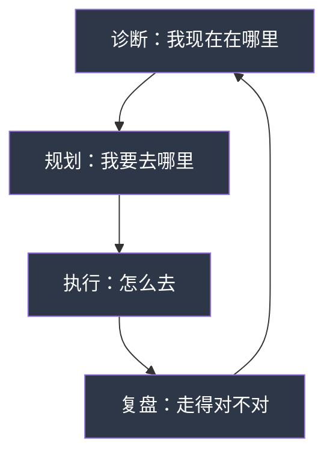

# 05-练习方法：案例分析练习和个人路径设计

## 一、为什么要用"练习"而不是"阅读"来学搞钱

很多人学搞钱的方式是：看文章→收藏→忘记→再看文章。这种"输入式学习"的转化率极低。认知科学的研究表明，被动阅读的知识留存率只有10%，而主动实践（做中学）的留存率高达75%。

### 1.1 费曼学习法在搞钱领域的应用

理查德·费曼提出的"以教促学"方法，核心是：如果你不能用简单的语言向别人解释一个概念，说明你还没有真正理解它。

在搞钱学习中的具体应用：

| 学习层级 | 方法 | 效果 |
|---------|------|------|
| 第一层：阅读 | 看案例故事 | 知道了这个案例 |
| 第二层：总结 | 提炼案例关键因素 | 理解了成功/失败原因 |
| 第三层：对比 | 对比多个案例找规律 | 发现了底层规律 |
| 第四层：应用 | 把规律用到自己身上 | 形成了可执行的方法 |
| 第五层：教别人 | 向他人讲解你的分析 | 内化为自己的认知体系 |

大多数人在第一层就停下了，所以学了等于没学。本节设计的练习，就是强迫你从第一层推进到第四层甚至第五层。

### 1.2 刻意练习的四个要素

安德斯·埃里克森在《刻意练习》中提出的四个核心要素，直接适用于搞钱学习：

1. **明确的目标**：不是"学习搞钱"，而是"分析某个案例中，主人公在关键节点的决策逻辑"
2. **专注的练习**：一次只做一个练习，不要同时分析三个案例
3. **即时反馈**：完成练习后立刻对照标准答案或找人评审
4. **走出舒适区**：分析自己不熟悉的领域比分析熟悉的领域更有价值

### 1.3 练习的正确心态

在开始练习之前，先调整心态：

- **不要追求"正确答案"**：案例分析没有标准答案，关键是锻炼你的分析能力
- **不要急于求成**：一个深度分析比十个浅层分析更有价值
- **不要只看不做**：读完本节不做练习，等于没读
- **接受不舒服的感觉**：如果做练习感觉很轻松，说明你在舒适区里

***

## 二、案例分析练习

### 练习1：成功案例深度剖析

**目的**：通过结构化分析成功案例，提炼可借鉴的方法论，训练"机会识别"和"成功归因"能力。

**适用对象**：所有层级读者

**预计时间**：60-90分钟/案例

**操作步骤**：

**第一步：选择案例**（5分钟）

从本章10个成功案例中选择1个最感兴趣的。选择标准：
- 和你当前情况最相似的（有参照价值）
- 和你当前情况最不同的（开阔视野）
- 你最想模仿的（有动力深入分析）

**第二步：通读案例，建立时间线**（10分钟）

不要急着分析，先完整读一遍案例，在脑海中建立时间线：
- 主人公从什么时候开始搞钱？
- 经历了哪些关键节点？
- 每个节点做了什么决策？
- 最终结果是什么？

**第三步：填写深度分析表**（30-40分钟）

```markdown
# 案例深度分析报告

## 基本信息
案例名称：________________
人物画像：________________
  - 年龄段：________
  - 起点条件：________
  - 所在领域：________
  - 搞钱方式：________

## 一、成功因素分析

### 主观因素（能力、决策、努力）
1. ____________
   - 具体表现：____________
   - 为什么这个因素重要：____________
2. ____________
   - 具体表现：____________
   - 为什么这个因素重要：____________
3. ____________
   - 具体表现：____________
   - 为什么这个因素重要：____________

### 客观因素（时机、运气、环境）
1. ____________
   - 具体表现：____________
   - 如果这个条件不具备，结果会怎样：____________
2. ____________
   - 具体表现：____________
   - 如果这个条件不具备，结果会怎样：____________

## 二、关键决策点分析

### 决策1
- 决策内容：________
- 当时的情境：________
- 可能的替代方案：________
- 选择这个方案的原因：________
- 实际结果：________
- 如果选了替代方案，可能的结果：________

### 决策2
- 决策内容：________
- 当时的情境：________
- 可能的替代方案：________
- 选择这个方案的原因：________
- 实际结果：________
- 如果选了替代方案，可能的结果：________

### 决策3
- 决策内容：________
- 当时的情境：________
- 可能的替代方案：________
- 选择这个方案的原因：________
- 实际结果：________
- 如果选了替代方案，可能的结果：________

## 三、能力-资源-时机匹配分析

| 维度 | 主人公具备的 | 我具备的 | 差距分析 |
|------|------------|---------|---------|
| 专业技能 | ________ | ________ | ________ |
| 通用能力 | ________ | ________ | ________ |
| 资金资源 | ________ | ________ | ________ |
| 人脉资源 | ________ | ________ | ________ |
| 信息渠道 | ________ | ________ | ________ |
| 时机窗口 | ________ | ________ | ________ |

## 四、可借鉴之处（必须具体到可执行）

1. 可借鉴的做法：____________
   - 具体怎么做：____________
   - 我需要什么条件：____________
   - 预计需要多长时间：____________

2. 可借鉴的做法：____________
   - 具体怎么做：____________
   - 我需要什么条件：____________
   - 预计需要多长时间：____________

## 五、不可复制之处

1. 不可复制的因素：____________
   - 为什么不可复制：____________
   - 有没有替代方案：____________

## 六、对我的行动启示

基于以上分析，我应该：
1. 立即行动的事项：________ 截止时间：________
2. 需要准备的事项：________ 截止时间：________
3. 需要进一步了解的事项：________ 截止时间：________
```

**第四步：自我检验**（10分钟）

完成分析后，回答以下检验问题：
- 我能否用3句话向别人讲清楚这个案例的核心成功因素？
- 我能否区分哪些是"能力"哪些是"运气"？
- 我列出的"可借鉴之处"是否足够具体，能否直接执行？
- 如果这个案例的主人公看到我的分析，他会认同吗？

**常见错误**：
- ❌ 只写"他很努力"——太抽象，要写具体做了什么
- ❌ 把所有成功归因于运气——这是偷懒，不是分析
- ❌ 列出一堆"可借鉴之处"但都不具体——宁少勿泛
- ❌ 忽略客观因素——成功从来不是纯靠能力

***

### 练习2：失败案例避坑分析

**目的**：通过结构化分析失败案例，建立"风险雷达"，训练"风险识别"和"自我检查"能力。

**适用对象**：所有层级读者

**预计时间**：45-60分钟/案例

**操作步骤**：

**第一步：选择案例**（5分钟）

从本章10个失败案例中选择1个。优先选择：
- 和你想做的方向相似的案例（避坑最直接）
- 失败原因最复杂的案例（锻炼分析深度）

**第二步：填写失败分析表**（25-35分钟）

```markdown
# 案例失败分析报告

## 基本信息
案例名称：________________
失败结果：________________
损失程度：________

## 一、失败原因层次分析

### 第一层：直接原因（表象）
什么事件直接导致了失败？
________________________________

### 第二层：根本原因（本质）
为什么这个事件会发生？
________________________________

### 第三层：系统原因（深层）
是什么思维模式或决策习惯导致了根本原因？
________________________________

## 二、因果链分析

用"因为A，所以B"的链条，从起点推导到终点：

起点事件：________
  → 因为________，所以________
  → 因为________，所以________
  → 因为________，所以________
  → 最终结果：________

## 三、关键转折点分析

在失败过程中，有没有某个节点，如果做了不同的决策，结果可能完全不同？

### 转折点1
- 当时的情况：________
- 实际的决策：________
- 更好的替代方案：________
- 为什么没有选这个方案：________

### 转折点2
- 当时的情况：________
- 实际的决策：________
- 更好的替代方案：________
- 为什么没有选这个方案：________

## 四、风险信号识别

这个案例在失败之前，有哪些"预警信号"被忽略了？

| 预警信号 | 什么时候出现的 | 当时的解读 | 正确的解读 |
|---------|-------------|-----------|-----------|
| ________ | ________ | ________ | ________ |
| ________ | ________ | ________ | ________ |
| ________ | ________ | ________ | ________ |

## 五、自我对照检查

如果是我，会犯同样的错误吗？

| 失败因素 | 我是否有类似倾向 | 具体表现 | 预防措施 |
|---------|---------------|---------|---------|
| ________ | 是/否 | ________ | ________ |
| ________ | 是/否 | ________ | ________ |
| ________ | 是/否 | ________ | ________ |

## 六、避坑行动项

基于以上分析，我需要：
1. 建立的预警机制：________
2. 设定的止损条件：________
3. 改变的决策习惯：________
```

**第三步：建立个人避坑清单**（10分钟）

将分析结果转化为个人避坑清单，格式如下：

```markdown
# 我的避坑清单

## 必须避免的行为
1. ________
2. ________

## 必须检查的条件（做决策前）
1. ________
2. ________

## 必须设定的止损线
1. ________
2. ________

## 我的风险信号（出现这些信号要警觉）
1. ________
2. ________
```

**常见错误**：
- ❌ 只分析表面原因，不挖深层原因——"他运气不好"不是分析
- ❌ 分析完不对照检查自己——分析别人容易，看自己难
- ❌ 不建立预警机制——分析完了就忘了，下次还会犯

***

### 练习3：案例对比分析

**目的**：通过对比同一领域的成功和失败案例，发现决定成败的关键变量，训练"系统性思维"和"关键因素识别"能力。

**适用对象**：有一定分析基础的读者

**预计时间**：90-120分钟

**操作步骤**：

**第一步：选择对比案例**（5分钟）

选择同一领域（如都是自媒体、都是电商、都是投资）的一个成功案例和一个失败案例。领域越接近，对比价值越高。

**第二步：填写结构化对比表**（40-60分钟）

```markdown
# 案例对比分析报告

## 对比案例
- 成功案例：________
- 失败案例：________
- 共同领域：________

## 一、基础条件对比

| 对比维度 | 成功案例 | 失败案例 | 差异分析 |
|---------|---------|---------|---------|
| 起点条件 | ________ | ________ | ________ |
| 教育背景 | ________ | ________ | ________ |
| 行业经验 | ________ | ________ | ________ |
| 启动资金 | ________ | ________ | ________ |
| 人脉资源 | ________ | ________ | ________ |
| 进入时机 | ________ | ________ | ________ |

## 二、决策过程对比

### 关键决策1：是否进入
| 维度 | 成功案例 | 失败案例 |
|------|---------|---------|
| 决策依据 | ________ | ________ |
| 调研深度 | ________ | ________ |
| 验证方式 | ________ | ________ |

### 关键决策2：如何起步
| 维度 | 成功案例 | 失败案例 |
|------|---------|---------|
| 启动方式 | ________ | ________ |
| 投入规模 | ________ | ________ |
| 验证节奏 | ________ | ________ |

### 关键决策3：遇到困难时
| 维度 | 成功案例 | 失败案例 |
|------|---------|---------|
| 应对策略 | ________ | ________ |
| 资源调配 | ________ | ________ |
| 心态表现 | ________ | ________ |

## 三、核心差异提炼

### 差异1（最关键）
- 差异内容：________
- 为什么这是关键差异：________
- 这个差异是能力问题还是运气问题：________

### 差异2（次要）
- 差异内容：________
- 为什么这是次要差异：________

### 差异3（补充）
- 差异内容：________
- 影响程度：________

## 四、规律总结

从这个对比中，我发现了以下规律：
1. ________
2. ________
3. ________

这些规律是否可以推广到其他领域？
________________________________

## 五、对我的指导意义

基于对比分析，如果我要在这个领域搞钱：
- 必须具备的条件：________
- 必须避免的行为：________
- 最佳进入策略：________
```

**第三步：验证规律**（15-20分钟）

用另外一对案例验证你总结的规律是否成立：
- 找同一领域的另一对成功/失败案例
- 检验你总结的规律是否依然适用
- 如果不适用，修正你的规律

**常见错误**：
- ❌ 选择差异太大的案例对比——一个做餐饮一个做投资，对比价值低
- ❌ 只列差异不分析原因——"他资金多"不是分析，要分析为什么资金多就能成功
- ❌ 忽略运气成分——有些差异确实是运气，要诚实面对

***

## 三、个人搞钱路径设计

### 3.1 为什么需要路径设计

没有路径的搞钱就像没有地图的旅行——你可能在走，但不知道走向哪里。路径设计的核心价值：

1. **明确方向**：知道自己要去哪里，才不会被各种"机会"带偏
2. **量化目标**：把模糊的"想赚钱"变成具体的数字和时间点
3. **识别差距**：知道自己缺什么，才能有针对性地补
4. **控制节奏**：避免要么太急（过度投入）要么太慢（永远在准备）
5. **建立反馈**：定期检查进度，及时调整方向

### 3.2 路径设计的底层逻辑

搞钱路径设计遵循"诊断→规划→执行→复盘"的循环：



每个环节都有对应的模板工具，下面逐一展开。

***

### 模板1：个人搞钱能力盘点

**目的**：全面盘点自己的资源和能力，找到搞钱的起点。不做盘点就开始搞钱，就像不体检就开始健身——你不知道自己的短板在哪里。

**使用时机**：开始搞钱之前，以及每次重大方向调整之前

**预计时间**：30-45分钟

**操作说明**：

```markdown
# 个人搞钱能力盘点报告

## 一、专业技能盘点

列出你掌握的所有专业技能，包括工作技能和业余技能。
评估标准：1星=知道概念，3星=能独立完成基础任务，
5星=能培训别人。

| 技能名称 | 熟练度 | 市场需求 | 变现潜力 | 备注 |
|---------|--------|---------|---------|------|
| ________ | ⭐⭐⭐⭐⭐ | 高/中/低 | 高/中/低 | ________ |
| ________ | ⭐⭐⭐⭐ | 高/中/低 | 高/中/低 | ________ |
| ________ | ⭐⭐⭐ | 高/中/低 | 高/中/低 | ________ |
| ________ | ⭐⭐ | 高/中/低 | 高/中/低 | ________ |
| ________ | ⭐ | 高/中/低 | 高/中/低 | ________ |

**关键发现**：
- 我最强的技能是：________
- 市场需求最高的技能是：________
- 变现潜力最大的技能是：________
- 三者的交集是：________（这可能是你的最佳起点）

## 二、通用能力评估

用1-10分评估自己的通用能力：

| 能力维度 | 自评分数 | 具体表现（举例说明） | 对搞钱的影响 |
|---------|---------|-------------------|------------|
| 学习能力 | __/10 | ________ | 高/中/低 |
| 沟通能力 | __/10 | ________ | 高/中/低 |
| 执行能力 | __/10 | ________ | 高/中/低 |
| 创新能力 | __/10 | ________ | 高/中/低 |
| 管理能力 | __/10 | ________ | 高/中/低 |
| 抗压能力 | __/10 | ________ | 高/中/低 |
| 社交能力 | __/10 | ________ | 高/中/低 |
| 分析能力 | __/10 | ________ | 高/中/低 |

**能力雷达图分析**：
- 我的核心优势能力（>7分）：________
- 我的关键短板（<5分）：________
- 短板是否影响搞钱：________
- 短板能否弥补：________

## 三、资源盘点

### 人脉资源
| 人脉类型 | 数量 | 代表人物 | 能提供的帮助 |
|---------|------|---------|------------|
| 行业前辈 | ________ | ________ | 经验指导、资源对接 |
| 同行伙伴 | ________ | ________ | 信息共享、合作机会 |
| 潜在客户 | ________ | ________ | 订单、反馈 |
| 技术人才 | ________ | ________ | 技术支持、产品开发 |
| 投资人脉 | ________ | ________ | 资金支持、背书 |

### 资金资源
- 可用于搞钱的启动资金：________元
- 可承受的最大亏损：________元
- 资金来源（自有/借贷/投资）：________
- 资金使用期限：________

### 时间资源
- 每周可用于搞钱的时间：________小时
- 时间段分布：工作日______小时，周末______小时
- 时间的连续性：是否能保证持续投入________

### 信息资源
- 日常关注的信息源：________
- 了解的行业领域：________
- 获取一手信息的渠道：________

## 四、SWOT分析

|  | 有利因素 | 不利因素 |
|--|---------|---------|
| **内部因素** | **优势(S)**： | **劣势(W)**： |
|  | 1. ________ | 1. ________ |
|  | 2. ________ | 2. ________ |
|  | 3. ________ | 3. ________ |
| **外部因素** | **机会(O)**： | **威胁(T)**： |
|  | 1. ________ | 1. ________ |
|  | 2. ________ | 2. ________ |
|  | 3. ________ | 3. ________ |

**策略推导**：
- SO策略（用优势抓机会）：________
- WO策略（弥补劣势抓机会）：________
- ST策略（用优势应对威胁）：________
- WT策略（避免劣势和威胁同时出现）：________
```

**填写要点**：
- 诚实评估，不要高估也不要低估自己
- "具体表现"一栏必须写真实例子，不要空泛描述
- 资源盘点要算实际数字，不要"大概"
- SWOT分析要从搞钱的角度出发，不是泛泛的人生分析

***

### 模板2：搞钱方向选择矩阵

**目的**：当有多个搞钱方向可选时，用结构化方法评估和比较，避免凭感觉决策。

**使用时机**：完成能力盘点后，有2-3个备选方向时

**预计时间**：20-30分钟

**操作说明**：

```markdown
# 搞钱方向选择评估

## 备选方向
- 方向A：________
- 方向B：________
- 方向C：________

## 评估矩阵

| 评估维度 | 权重 | 方向A | 方向B | 方向C | 评分说明 |
|---------|------|-------|-------|-------|---------|
| 市场需求 | 20% | __/10 | __/10 | __/10 | 目标用户是否愿意付费 |
| 能力匹配 | 20% | __/10 | __/10 | __/10 | 我现有能力能覆盖多少 |
| 资源可行 | 15% | __/10 | __/10 | __/10 | 我的资源是否支撑得起 |
| 风险可控 | 15% | __/10 | __/10 | __/10 | 最坏情况我能否承受 |
| 成长潜力 | 15% | __/10 | __/10 | __/10 | 3-5年后这个方向还在吗 |
| 启动难度 | 10% | __/10 | __/10 | __/10 | 能多快开始验证 |
| 兴趣程度 | 5% | __/10 | __/10 | __/10 | 我是否愿意长期做这个 |

**加权总分**：
- 方向A = ________
- 方向B = ________
- 方向C = ________

## 评分理由（每个维度必须写出具体理由）

### 方向A评分理由
- 市场需求：________
- 能力匹配：________
- 资源可行：________
- 风险可控：________
- 成长潜力：________

### 方向B评分理由
- 市场需求：________
- 能力匹配：________
- 资源可行：________
- 风险可控：________
- 成长潜力：________

### 方向C评分理由
（同上格式）

## 敏感性分析

如果把"市场需求"的权重从20%提高到30%，结果会变吗？
________

如果把"风险可控"的权重从15%提高到25%，结果会变吗？
________

**这说明**：我的选择对哪个因素最敏感？________

## 最终选择

选择的方案：________

选择理由（至少3条）：
1. ________
2. ________
3. ________

放弃其他方案的原因：
- 放弃______方案是因为：________
- 放弃______方案是因为：________

**风险提示**：我选择这个方案的最大风险是________，
我的应对措施是________。
```

**评分要点**：
- 每个评分必须有具体理由，不能凭感觉打分
- 如果两个方案分数接近（差距<5%），说明你需要更多信息才能决定
- 权重可以根据个人情况调整，但调整后要说明理由
- 敏感性分析能帮你发现决策的脆弱点

***

### 模板3：搞钱行动计划表

**目的**：将搞钱想法转化为具体可执行的行动计划，设定里程碑和止损条件。

**使用时机**：选定搞钱方向后

**预计时间**：45-60分钟

**操作说明**：

```markdown
# 搞钱行动计划

## 一、目标设定

### 最终目标（1-3年）
- 目标描述：________
- 量化指标：________
- 时间范围：________

### 阶段性里程碑
| 里程碑 | 目标描述 | 量化指标 | 截止时间 | 达成标准 |
|--------|---------|---------|---------|---------|
| M1 | ________ | ________ | ________ | ________ |
| M2 | ________ | ________ | ________ | ________ |
| M3 | ________ | ________ | ________ | ________ |

## 二、阶段一：验证期（第1-3个月）

**阶段目标**：用最小成本验证方向是否可行

### 主要任务
| 序号 | 任务 | 截止时间 | 产出物 | 完成标准 |
|------|------|---------|--------|---------|
| 1 | ________ | ________ | ________ | ________ |
| 2 | ________ | ________ | ________ | ________ |
| 3 | ________ | ________ | ________ | ________ |

### 成功标准（达到什么条件才进入下一阶段）
1. ________
2. ________

### 止损条件（出现什么情况必须停止或调整）
1. ________
2. ________

### 所需资源
- 资金：________
- 时间：________
- 技能：________
- 人脉：________

## 三、阶段二：启动期（第4-6个月）

**阶段目标**：在验证成功的基础上，建立稳定的运营模式

### 主要任务
| 序号 | 任务 | 截止时间 | 产出物 | 完成标准 |
|------|------|---------|--------|---------|
| 1 | ________ | ________ | ________ | ________ |
| 2 | ________ | ________ | ________ | ________ |
| 3 | ________ | ________ | ________ | ________ |

### 成功标准
1. ________
2. ________

### 止损条件
1. ________
2. ________

## 四、阶段三：增长期（第7-12个月）

**阶段目标**：扩大规模，提升效率，建立壁垒

### 主要任务
| 序号 | 任务 | 截止时间 | 产出物 | 完成标准 |
|------|------|---------|--------|---------|
| 1 | ________ | ________ | ________ | ________ |
| 2 | ________ | ________ | ________ | ________ |
| 3 | ________ | ________ | ________ | ________ |

### 成功标准
1. ________
2. ________

## 五、风险预案

| 风险 | 发生概率 | 影响程度 | 预防措施 | 应对方案 |
|------|---------|---------|---------|---------|
| ________ | 高/中/低 | 高/中/低 | ________ | ________ |
| ________ | 高/中/低 | 高/中/低 | ________ | ________ |
| ________ | 高/中/低 | 高/中/低 | ________ | ________ |

## 六、复盘机制

- 周复盘：每周日花15分钟回顾本周进展
- 月复盘：每月最后一个周末花1小时深度复盘
- 季度复盘：每季度花半天时间全面评估方向

复盘核心问题：
1. 本周/月最大的进展是什么？
2. 本周/月最大的问题是什么？
3. 下一步最重要的3件事是什么？
4. 方向需要调整吗？
```

**制定要点**：
- 验证期的任务必须是"最小可行"的，不要一上来就做大动作
- 止损条件必须是可量化的，"感觉不好"不算止损条件
- 每个阶段的任务不超过5个，多了执行不了
- 风险预案要覆盖"最不想面对但最可能发生"的情况

***

### 模板4：搞钱进度追踪表

**目的**：建立定期追踪机制，及时发现问题并调整。

**使用频率**：每周填写一次

**预计时间**：15-20分钟/次

**操作说明**：

```markdown
# 周进度追踪报告

## 基本信息
日期：________ 第____周
当前阶段：________

## 一、本周目标回顾
| 目标 | 完成情况 | 原因分析 |
|------|---------|---------|
| ________ | 完成/部分完成/未完成 | ________ |
| ________ | 完成/部分完成/未完成 | ________ |
| ________ | 完成/部分完成/未完成 | ________ |

**目标完成率**：______%

## 二、关键数据指标

| 指标名称 | 上周数据 | 本周数据 | 变化趋势 | 目标值 |
|---------|---------|---------|---------|--------|
| ________ | ________ | ________ | ↑/↓/→ | ________ |
| ________ | ________ | ________ | ↑/↓/→ | ________ |
| ________ | ________ | ________ | ↑/↓/→ | ________ |

**数据解读**：________

## 三、本周成果
1. ________
2. ________
3. ________

## 四、遇到的问题
| 问题 | 严重程度 | 解决方案 | 是否已解决 |
|------|---------|---------|-----------|
| ________ | 高/中/低 | ________ | 是/否 |
| ________ | 高/中/低 | ________ | 是/否 |

## 五、下周计划
| 优先级 | 任务 | 截止时间 | 预期产出 |
|--------|------|---------|---------|
| P0 | ________ | ________ | ________ |
| P1 | ________ | ________ | ________ |
| P2 | ________ | ________ | ________ |

## 六、反思与调整

### 做得好的地方
________

### 需要改进的地方
________

### 方向是否需要调整
是/否，原因：________

### 学到的经验
________
```

**追踪要点**：
- 数据指标必须是客观可量化的，不要用"感觉不错"
- 问题要分级，P0问题必须本周解决
- 如果连续两周目标完成率低于50%，需要重新评估计划的可行性
- 每月回顾4周的追踪报告，看趋势而不是单周数据

***

## 四、综合练习

### 练习4：个人搞钱路径设计（完整版）

**目的**：综合运用本章所学，完成从"自我诊断"到"行动落地"的完整路径设计。

**适用对象**：完成前面3个案例分析练习的读者

**预计时间**：2-3小时（建议分两次完成）

**操作步骤**：

**第一步：完成能力盘点**（30分钟）
使用模板1，填写完整的个人能力盘点报告。

**第二步：分析3个案例**（60分钟）
使用练习1-3的模板，分别分析1个成功案例、1个失败案例、1对对比案例。重点关注：
- 和你情况相似的案例
- 你想进入的领域

**第三步：选择搞钱方向**（20分钟）
使用模板2，评估你的备选方向。至少准备2-3个备选方向。

**第四步：制定行动计划**（30分钟）
使用模板3，为选定方向制定详细计划。

**第五步：找人评审**（15分钟+等待时间）

这是最容易被跳过但最重要的一步。找以下人评审你的计划：
- **同行朋友**：看计划是否务实
- **领域前辈**：看方向是否正确
- **理性朋友**：看逻辑是否自洽

评审时要求对方重点看：
1. 目标是否过于乐观或保守
2. 止损条件是否合理
3. 有没有明显的盲点
4. 第一步是否足够小

**第六步：修订并开始执行**（15分钟）
根据评审意见修订计划，然后立即开始第一步行动。

**注意事项**：
- 计划不是越详细越好，够用就行，边做边调整
- 第一步行动必须在24小时内开始，否则大概率永远不会开始
- 不要等"完全准备好"，不存在完全准备好的状态
- 保留计划的电子版，每周更新进度

***

### 练习5：案例研究日志

**目的**：培养持续从案例中学习的习惯，建立个人案例库。

**适用对象**：所有读者

**使用频率**：每周1次

**预计时间**：20-30分钟/次

**操作说明**：

每周研究一个新案例，填写以下日志：

```markdown
# 案例研究日志

## 基本信息
日期：________
案例来源：________（书籍/文章/播客/身边人/新闻）
案例类型：成功/失败/混合

## 案例概述（100字以内）
________________________________

## 关键信息提取

### 主人公画像
- 年龄：________
- 背景：________
- 起点：________

### 搞钱方式
________

### 结果
________

## 核心分析

### 成功/失败的关键因素（最多3个）
1. ________
2. ________
3. ________

### 最值得学习/警惕的一点
________

### 与之前研究的案例有什么共性
________

## 个人启发

### 对我的搞钱方向有什么启发
________

### 我可以借鉴的具体做法
________

### 我需要警惕的风险
________

## 行动项
1. ________（截止时间：________）
2. ________（截止时间：________）
```

**案例来源推荐**：

| 来源类型 | 推荐平台 | 特点 |
|---------|---------|------|
| 商业媒体 | 36氪、虎嗅、晚点LatePost | 深度报道，有数据支撑 |
| 知识社区 | 知乎、即刻、V2EX | 真实分享，互动性强 |
| 播客 | 疯投圈、商业就是这样、创业内幕 | 深度对话，细节丰富 |
| 书籍 | 《创业邦》《从0到1》 | 系统完整，有方法论 |
| 身边人 | 朋友、同事、校友 | 最真实，可直接交流 |
| 社交媒体 | 小红书、抖音、B站 | 趋势性强，但需甄别 |

**进阶用法**：
- 积累20个案例后，做一次跨案例分析，找共性规律
- 按领域分类建立个人案例库
- 定期回顾日志，看自己的认知有没有变化

***

### 练习6：搞钱复盘

**目的**：通过定期复盘，将实践经验转化为认知升级，持续优化搞钱策略。

**适用对象**：已经开始搞钱实践的读者

**复盘体系设计**：

复盘不是"回忆一下做了什么"，而是"从做过的事情中提炼出指导未来的原则"。有效的复盘需要三个层次：

| 复盘类型 | 频率 | 时间 | 核心问题 | 输出物 |
|---------|------|------|---------|--------|
| 周复盘 | 每周日 | 15-20分钟 | 这周做得怎么样 | 下周3个重点 |
| 月复盘 | 每月末 | 45-60分钟 | 方向对不对，节奏对不对 | 月度调整方案 |
| 季度复盘 | 每季度末 | 2-3小时 | 战略层面要不要调整 | 下季度战略规划 |

#### 周复盘模板（15分钟）

```markdown
# 周复盘 #___

## 本周数据
- 收入/支出：________
- 关键指标：________
- 目标完成率：______%

## 三个问题
1. 本周最大的收获是什么？
   ________

2. 本周最大的问题是什么？
   ________

3. 下周最重要的3件事是什么？
   ①________
   ②________
   ③________

## 一句话总结本周
________
```

#### 月复盘模板（45分钟）

```markdown
# 月复盘 #___

## 本月数据总览
| 指标 | 月初目标 | 实际结果 | 完成率 |
|------|---------|---------|--------|
| ________ | ________ | ________ | ________ |
| ________ | ________ | ________ | ________ |
| ________ | ________ | ________ | ________ |

## 本月关键事件
1. ________（影响：正面/负面）
2. ________（影响：正面/负面）
3. ________（影响：正面/负面）

## 深度分析

### 做得好的事情
- 事件：________
- 为什么做得好：________
- 能否复制到其他场景：________

### 做得不好的事情
- 事件：________
- 为什么做得不好：________
- 根本原因是什么：________
- 如何避免再犯：________

### 意外的发现
________

## 方向检查
- 当前方向是否正确？________
- 当前节奏是否合适？________
- 资源投入是否合理？________
- 需要调整什么？________

## 下月计划
- 继续做的事情：________
- 开始做的事情：________
- 停止做的事情：________
- 调整的事情：________
```

#### 季度复盘模板（2小时）

```markdown
# 季度复盘 #___

## 季度数据总览
| 指标 | Q初目标 | Q末结果 | 完成率 | 趋势 |
|------|--------|--------|--------|------|
| ________ | ________ | ________ | ________ | ↑/↓/→ |
| ________ | ________ | ________ | ________ | ↑/↓/→ |

## 战略层面分析

### 外部环境变化
- 市场趋势：________
- 竞争格局：________
- 政策变化：________
- 技术变化：________

### 内部能力变化
- 新增的能力：________
- 新增的资源：________
- 暴露的短板：________

### SWOT更新
|  | 有利 | 不利 |
|--|------|------|
| 内部 | S: ________ | W: ________ |
| 外部 | O: ________ | T: ________ |

## 关键教训
1. 最重要的一条教训：________
2. 次重要的教训：________

## 下季度战略
- 核心目标：________
- 关键策略：________
- 资源分配：________
- 风险预案：________

## 年度目标检查
- 年度目标完成进度：______%
- 是否需要调整年度目标：________
```

**复盘的关键原则**：

1. **诚实面对**：复盘是为了改进，不是为了自我感动。数据不好的时候更要诚实记录
2. **聚焦关键**：不要试图分析所有事情，每次复盘聚焦2-3个关键问题
3. **产出行动**：每次复盘必须产出具体的下一步行动，否则复盘没有意义
4. **记录变化**：把复盘记录保存下来，3个月后回头看，你会发现自己成长了很多
5. **固定时间**：把复盘时间固定下来，变成习惯，不要"有空再做"

***

## 五、练习中的常见问题和解决方案

### 问题1："我不知道选哪个案例分析"

**解决方案**：
- 如果你有明确的搞钱方向，选同领域的案例
- 如果你没有方向，选和你起点最相似的案例
- 如果都差不多，选你最感兴趣的——兴趣是最好的老师

### 问题2："分析表格太空，不知道填什么"

**解决方案**：
- 先通读案例2-3遍，用笔在纸上随手记关键词
- 不要追求完美，先填完再优化
- 如果某个维度确实没有信息，写"案例中未提及"即可
- 可以先做练习3（对比分析），对比比单独分析更容易找到切入点

### 问题3："分析完了但不知道怎么用到自己身上"

**解决方案**：
- 回到模板1（能力盘点），把案例中的因素和自己的条件对照
- 问自己："如果案例中的人是我，我会怎么决策？"
- 找到1个最小的可执行行动，24小时内开始做

### 问题4："坚持不下来，做两周就放弃了"

**解决方案**：
- 降低频率但不要停止——每周1个案例就够了
- 找一个伙伴一起做，互相监督
- 把案例日志变成固定习惯（比如每周日晚上8点）
- 允许自己偶尔"划水"——写得不好也比不写强

### 问题5："做了很多练习但感觉没有进步"

**解决方案**：
- 回顾你3个月前的分析报告，和现在的对比，你一定有进步
- 尝试用新学的框架重新分析之前的案例
- 把你的分析讲给别人听，看能否讲清楚
- 进步往往是渐进的，不会突然"顿悟"

***

## 六、练习进阶：从个人练习到社群学习

### 6.1 为什么要社群学习

个人练习有三个天然局限：
1. **视角盲区**：你只能看到自己的视角，看不到别人的分析角度
2. **反馈延迟**：没有人给你即时反馈，错误的认知可能持续很久
3. **动力不足**：一个人容易放弃，一群人更容易坚持

### 6.2 案例讨论会的操作方法

找3-5个志同道合的朋友，定期举办案例讨论会：

**频率**：每两周一次，每次1.5-2小时

**流程**：
1. **案例选定**（提前3天）：由一个人选定一个案例，发给大家预习
2. **独立分析**（提前完成）：每个人用模板独立完成分析
3. **轮流分享**（每人10分钟）：每人分享自己的分析结果
4. **交叉讨论**（30分钟）：讨论不同分析角度的差异
5. **总结提炼**（15分钟）：共同总结关键规律和行动项

**讨论会规则**：
- 不评价别人的分析对错，只补充不同视角
- 每个人必须发言，不能"听就好"
- 讨论聚焦在"能学到什么"，不要变成闲聊
- 每次讨论会必须产出1-3条共同认可的行动项

### 6.3 案例分析能力的自我评估

每隔3个月，用以下标准评估自己的案例分析能力：

| 能力维度 | 初级（1-3分） | 中级（4-6分） | 高级（7-10分） |
|---------|-------------|-------------|---------------|
| 分析深度 | 只看到表面原因 | 能分析到根本原因 | 能发现系统性原因 |
| 多角度思考 | 只有一个视角 | 能从2-3个角度分析 | 能全面系统分析 |
| 模式识别 | 看不出规律 | 能发现明显规律 | 能识别隐藏模式 |
| 自我应用 | 分析完不知道怎么用 | 能提取1-2个行动项 | 能形成系统方法论 |
| 表达能力 | 说不清楚 | 能基本讲清楚 | 能让别人完全理解 |

***

## 七、本节核心要点

1. **练习比阅读重要**：被动阅读的留存率只有10%，主动练习的留存率高达75%。看100个案例不如深度分析10个案例。

2. **结构化分析是核心能力**：用模板强制自己从多个维度分析，避免"凭感觉"的浅层思考。

3. **能力盘点是起点**：不盘点就开始搞钱，就像不体检就开始健身。知道自己在哪里，才能规划去哪里。

4. **对比分析最有价值**：同一领域的成功和失败案例对比，最能发现决定成败的关键变量。

5. **计划要可执行**：行动计划的核心不是"详细"，而是"第一步足够小，24小时内能开始"。

6. **复盘驱动成长**：没有复盘的实践是盲目的实践。周复盘看执行，月复盘看方向，季度复盘看战略。

7. **社群学习效果更好**：找3-5个伙伴定期讨论案例，比一个人闭门造车效率高3倍以上。

8. **坚持比完美重要**：每周1个案例，坚持半年，你的搞钱认知会有质的飞跃。不需要每次都完美，重要的是不停下来。

***

*下一节：06-本章小结——核心要点回顾和行动清单*
