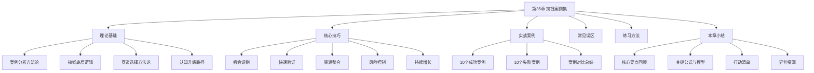
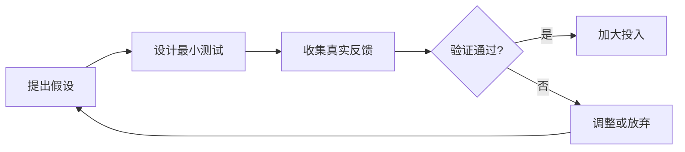
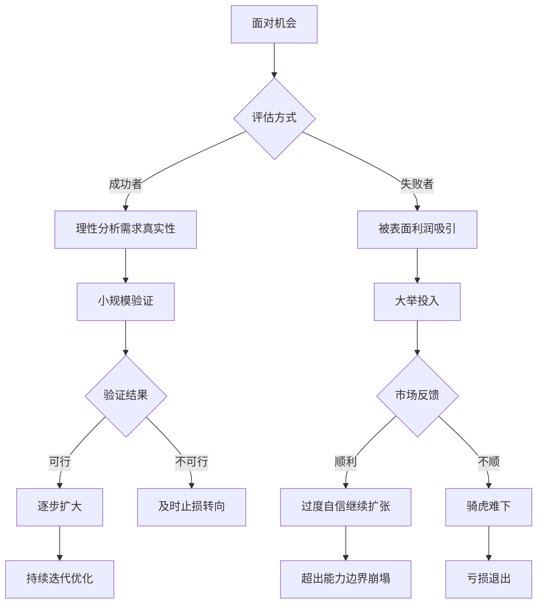
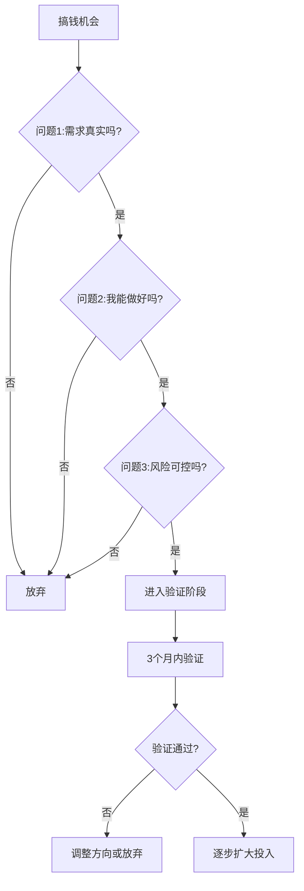
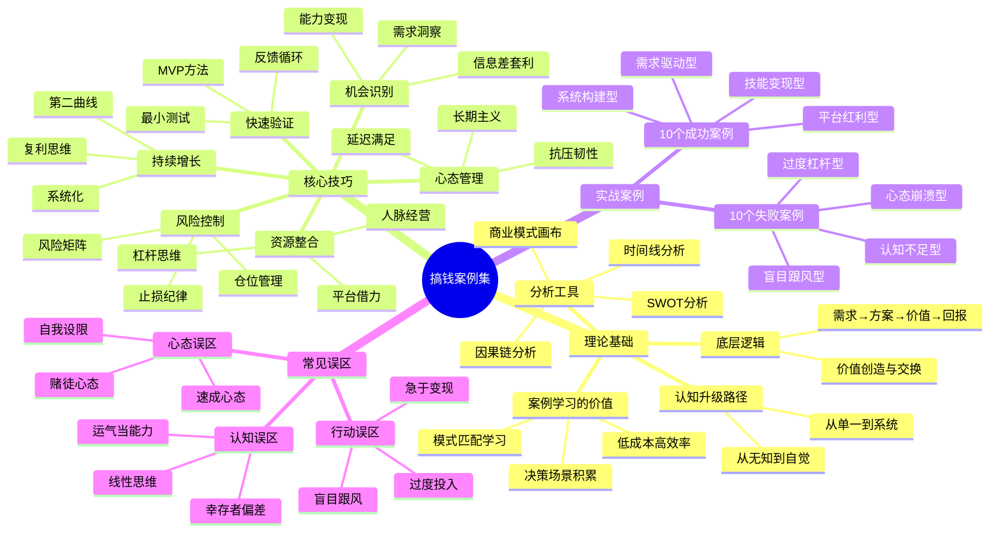

# 06-本章小结：核心要点回顾和行动清单

本章通过20个真实案例（10个成功+10个失败）的深度剖析，配合系统化的理论框架和实操工具，构建了一套完整的"从案例中学搞钱"方法论。本小结将回顾全章核心内容，提炼关键洞察，并提供可执行的行动清单，帮助读者将知识转化为行动。



---

## 一、全章核心要点回顾

### 1.1 理论基础回顾

本章的理论基础部分建立了案例学习的完整认知框架，核心要点如下：

**案例学习的价值逻辑**

案例学习之所以高效，本质上是因为它利用了人类大脑的"模式匹配"能力。神经科学研究表明，人脑通过观察他人经历来学习的效率，远高于单纯接受抽象理论。哈佛商学院的教学实践证明，案例教学能让学习者在短时间内接触到大量的决策场景，从而加速决策能力的积累。

案例学习的三个层次：

| 层次 | 目标 | 方法 | 产出 |
|------|------|------|------|
| 表层：知道 | 了解发生了什么 | 阅读案例事实 | 信息记忆 |
| 中层：理解 | 理解为什么发生 | 分析因果关系 | 模式识别 |
| 深层：应用 | 知道自己该怎么做 | 提炼可复制方法论 | 行动指南 |

**搞钱的底层逻辑框架**

搞钱的本质是价值创造与交换。这个过程可以用一个完整的因果链来表达：


这个循环的关键在于：每一次循环都应该比上一次效率更高、规模更大。搞钱高手与普通人的区别，在于他们能快速完成这个循环，并在每次循环中积累可复用的资产（技能、品牌、客户关系、系统）。

**四维框架：认知×能力×资源×时间**

本章提出的四维框架，是理解搞钱成果的关键模型：

- **认知维度**：决定方向是否正确。认知不足的人，努力越多可能错得越远。提高认知的方法包括：广泛阅读、深度案例研究、与高手交流、亲身实践验证
- **能力维度**：决定执行是否到位。能力包括硬技能（专业能力）和软技能（沟通、管理、决策）。能力需要在实践中磨练，而非纸上谈兵
- **资源维度**：决定规模能达到多大。资源包括资金、人脉、信息、平台。资源可以通过杠杆效应放大——用他人的钱、他人的时间、他人的平台
- **时间维度**：决定复利能积累多少。时间是最公平的资源，也是最不可逆的资源。长期主义者在时间维度上拥有巨大优势

**案例分析方法论**

本章介绍了四种核心分析工具，每种工具适用于不同的分析场景：

| 工具 | 适用场景 | 核心问题 | 输出 |
|------|----------|----------|------|
| SWOT分析 | 评估个人/项目的优劣势 | 内外部因素分别是什么？ | 策略矩阵 |
| 商业模式画布 | 理解商业运作逻辑 | 价值如何创造和传递？ | 9格画布 |
| 时间线分析 | 追踪事件发展脉络 | 关键节点是什么？ | 时间轴 |
| 因果链分析 | 深挖成功/失败根因 | 为什么会这样？ | 因果图 |

### 1.2 核心技巧回顾

**技巧一：机会识别**

机会识别是搞钱的起点。本章揭示了机会识别的三个核心路径：

1. **需求洞察法**：从生活痛点出发，观察人们在什么场景下感到不便或不满。好的需求满足三个条件——真实存在、足够普遍、现有方案不够好
2. **信息差套利法**：利用信息不对称创造价值。信息差存在于地域之间（一线城市经验下沉）、行业之间（技术在A领域成熟但在B领域是新事物）、人群之间（年轻人懂的老年人不懂）
3. **能力变现法**：盘点自己拥有的能力，思考这些能力能为谁解决什么问题。能力变现的关键不在于能力有多强，而在于能否找到愿意为这个能力付费的人

**技巧二：快速验证**

快速验证的核心思想是：在投入大量资源之前，先用最小成本验证方向是否可行。

MVP（最小可行产品）验证的四步法：



验证的关键指标：

| 验证维度 | 核心指标 | 及格线 | 优秀线 |
|----------|----------|--------|--------|
| 需求验证 | 是否有人愿意付费 | 有1个人付费 | 有10个人付费 |
| 定价验证 | 客户是否接受价格 | 不砍价购买 | 主动推荐 |
| 渠道验证 | 能否持续获取客户 | 自然流量>0 | 获客成本<客单价30% |
| 复购验证 | 客户是否重复购买 | 复购率>10% | 复购率>40% |

**技巧三：资源整合**

资源整合的核心是杠杆思维——用有限的资源撬动更大的成果。四种核心杠杆：

1. **资金杠杆**：用别人的钱做自己的事（贷款、融资、预售、代销）
2. **时间杠杆**：用别人的时间做自己的事（外包、团队、自动化）
3. **平台杠杆**：用别人的平台获取流量（电商、社交媒体、SaaS平台）
4. **人脉杠杆**：用别人的关系获取资源（合伙、分销、联名）

**技巧四：风险控制**

风险控制是搞钱过程中最被低估的能力。20个案例中，失败案例几乎都有一个共同特征——风险控制意识薄弱。

风险控制的三道防线：

- **第一道防线：认知防线**——在行动前充分调研，了解风险在哪里
- **第二道防线：仓位防线**——控制单一项目的投入比例，分散风险
- **第三道防线：止损防线**——提前设定止损条件，到了就执行，不犹豫

**技巧五：持续增长**

持续增长的关键是从"做事"升级为"建系统"：

| 阶段 | 模式 | 特征 | 收入天花板 |
|------|------|------|------------|
| 1.0 | 卖时间 | 亲自干活，按小时/项目收费 | 受限于个人时间 |
| 2.0 | 卖产品 | 将能力产品化，一次制作多次销售 | 受限于产品类型 |
| 3.0 | 卖系统 | 建立可复制的商业模式 | 受限于市场规模 |
| 4.0 | 卖平台 | 连接供需双方，从中抽成 | 受限于网络效应 |

**技巧六：心态管理**

心态管理不是鸡汤，而是实打实的搞钱能力。本章强调的三个核心心态：

- **延迟满足**：放弃眼前小利，追求长期大利。案例中几乎所有成功者都经历过"先亏后赚"或"先苦后甜"的过程
- **抗压韧性**：搞钱路上必然遇到挫折，关键不是不跌倒，而是跌倒后能爬起来。韧性来自三个方面——认知韧性（理解挫折是正常的）、情绪韧性（快速从负面情绪恢复）、行动韧性（不因挫折停止行动）
- **长期主义**：真正的大钱都是"熬"出来的。复利效应需要时间才能显现，前80%的回报往往来自最后20%的时间

### 1.3 实战案例核心洞察

**10个成功案例的共性规律提炼**

通过对10个成功案例的交叉分析，我们提炼出五条核心规律。这些规律不是孤立存在的，而是相互作用、形成合力：

| 规律 | 具体表现 | 案例印证 | 可复制性 |
|------|----------|----------|----------|
| 从需求出发 | 解决真实存在的问题，而非自嗨 | 小红书博主解决"家居改造灵感"需求 | 高——需求洞察可训练 |
| 能力匹配 | 做的事和自身能力高度匹配 | 程序员做AI工具、设计师做内容 | 中——需要诚实的自我评估 |
| 持续迭代 | 不断优化和调整策略 | 宝妈团购从微信群到小程序 | 高——迭代是可学习的方法 |
| 风险可控 | 初期小投入，验证后才扩大 | 几乎所有成功案例都先小规模验证 | 高——关键在于纪律 |
| 长期主义 | 愿意持续积累，不急于求成 | 自媒体博主平均6-12个月才见收益 | 低——反人性，需要刻意练习 |

**10个失败案例的共性教训提炼**

失败案例的教训比成功案例更有价值，因为成功往往依赖特定条件，而失败的模式具有高度普遍性：

| 教训 | 典型表现 | 失败案例印证 | 预防方法 |
|------|----------|--------------|----------|
| 盲目跟风 | 看别人赚钱就跟着做 | 奶茶店、健身房、教培 | 问自己：我有什么独特优势？ |
| 准备不足 | 资金、能力、调研都不够 | 餐饮扩张、直播带货 | 使用评估矩阵全面自检 |
| 急于求成 | 想快速赚钱，忽视风险 | 加杠杆炒股、炒币 | 设定最低验证周期 |
| 认知不足 | 对行业缺乏清醒认识 | 实体店选址失误 | 至少调研3个月再决策 |
| 心态失衡 | 贪婪、恐惧、侥幸心理 | 赌博式投资、盲目加仓 | 设定规则并强制执行 |

**成功与失败的关键分水岭**

通过对比分析，我们发现成功者与失败者在五个关键节点上做出了截然不同的选择：



### 1.4 常见误区深度回顾

本章系统梳理了15个搞钱误区，分为三大类。这里用一张决策树来帮助读者在遇到疑似误区时快速自检：

**认知误区自检清单**

- [ ] **幸存者偏差**：我看到的"成功案例"是不是只是极少数幸存者？真实的成功概率是多少？
- [ ] **把运气当能力**：如果重来一次，我还能成功吗？连续成功几次才能证明是能力？
- [ ] **线性思维**：投入越多一定回报越大吗？边际收益是不是在递减？
- [ ] **完美主义**：我是在"准备"还是在"拖延"？不完美的开始是否好过完美的等待？
- [ ] **单点归因**：成功/失败真的是因为这个单一原因吗？还有哪些被忽视的因素？

**行动误区自检清单**

- [ ] **盲目跟风**：我做这件事是因为自己分析过，还是因为看别人赚钱了？
- [ ] **过度投入**：如果这笔钱全部亏掉，我的生活会受多大影响？
- [ ] **忽视风险**：最坏的情况是什么？我能承受吗？
- [ ] **急于变现**：用户价值积累够了吗？现在变现会不会损害长期发展？
- [ ] **孤军奋战**：有没有人可以帮我？有没有人可以给我客观建议？

**心态误区自检清单**

- [ ] **比较心理**：我是在和昨天的自己比，还是在和别人比？
- [ ] **赌徒心态**：我是不是在想"这次一定能翻本"？
- [ ] **受害者心态**：我是在抱怨环境，还是在想办法应对？
- [ ] **速成心态**：我是不是在期待"一夜暴富"？现实中的回报周期是多久？
- [ ] **自我设限**：我是真的不行，还是觉得自己不行？

---

## 二、关键公式与决策模型

### 2.1 搞钱成功公式

```text
搞钱成果 = (认知 × 能力 × 资源) × 时间 × 运气
```

这个公式的深层含义：

- **乘法关系意味着短板效应**：认知、能力、资源中任何一个为零，结果都为零。许多人只注重提升其中一个维度而忽视其他维度，导致瓶颈
- **时间是唯一的被动增值项**：认知、能力、资源都需要主动投入，但时间会自动流逝。关键是在时间流逝的过程中，让其他三项持续增长
- **运气不可控但可优化**：运气的数学本质是概率。你可以通过以下方式增加"好运"的概率：扩大行动量（更多的尝试=更多的机会）、提升准备度（机会只留给有准备的人）、拓宽信息源（更多的信息=更多的可能性）

**公式应用示例**：

假设一个人的认知评分为6分（满分10），能力评分为7分，资源评分为5分，投入时间为2年，运气系数为0.8（略低于平均）：

```text
成果 = (6 × 7 × 5) × 2 × 0.8 = 210 × 1.6 = 336
```

如果此人提高认知到8分（通过深度案例学习），其他条件不变：

```text
成果 = (8 × 7 × 5) × 2 × 0.8 = 280 × 1.6 = 448
```

仅提高认知一项，成果就提升了33%。这印证了本章的核心观点——认知是搞钱的第一驱动力。

### 2.2 搞钱风险公式

```text
风险 = 不确定性 × 投入程度 × 不可逆性
```

三个变量的含义及降低方法：

| 变量 | 含义 | 降低方法 | 实操举例 |
|------|------|----------|----------|
| 不确定性 | 对结果的不可预测程度 | 充分调研、小规模验证、获取行业数据 | 开店前蹲点观察3天客流 |
| 投入程度 | 投入资源占总资源的比例 | 分散投资、分批投入、设置上限 | 单项目投入不超过总资金30% |
| 不可逆性 | 损失是否可以挽回 | 设置止损、保留退出选项、选择可逆模式 | 先租后买、先代理后自产 |

**风险管理矩阵**：

| | 不确定性低 | 不确定性高 |
|---|---|---|
| **投入低** | 绿灯：放心做 | 黄灯：小步试错 |
| **投入高** | 黄灯：充分论证 | 红灯：坚决不做 |

### 2.3 搞钱决策三问模型

面对任何搞钱机会时，先问自己三个问题：



- **问题1：需求真实吗？**——不是你觉得有需求，而是有人愿意为此付费。验证方法：找到10个潜在客户，告诉他们你的方案，看有没有人愿意预付
- **问题2：我能做好吗？**——不是你有没有能力，而是你有没有比竞争者更好的能力或独特优势。验证方法：列出3个竞争对手，找到你的差异化点
- **问题3：风险可控吗？**——最坏情况下你会损失多少？这个损失你能否承受？验证方法：计算最大亏损额，确认不影响基本生活

### 2.4 复利增长模型

搞钱的终极武器是复利。复利的数学公式为：

```text
终值 = 初始值 × (1 + 增长率)^时间
```

复利在搞钱中的三个应用场景：

**场景一：技能复利**

每天投入1小时学习某项技能，一年后：

| 技能水平 | 1个月 | 3个月 | 6个月 | 1年 | 3年 |
|----------|-------|-------|-------|-----|-----|
| 初学者（月入3K） | 入门 | 初级 | 中级 | 高级 | 专家 |
| 对应收入 | 3K | 5K | 8K | 15K | 30K+ |

**场景二：客户复利**

口碑传播带来的客户增长（假设每个满意客户平均带来0.3个新客户）：

```text
月1：10个客户
月6：10 × (1.3)^5 = 37个客户
月12：10 × (1.3)^11 = 179个客户
月24：10 × (1.3)^23 = 870个客户
```

**场景三：投资复利**

每月定投5000元，年化收益率8%：

| 时间 | 累计投入 | 账户总额 | 收益倍数 |
|------|----------|----------|----------|
| 5年 | 30万 | 36.7万 | 1.22x |
| 10年 | 60万 | 90.6万 | 1.51x |
| 20年 | 120万 | 294.5万 | 2.45x |
| 30年 | 180万 | 745.2万 | 4.14x |

注意：30年的收益倍数（4.14x）远高于10年（1.51x），这就是复利的力量——越到后期增长越快。

---

## 三、行动清单

### 3.1 立即行动（本周内）

这些行动不需要任何资金投入，只需要你的时间和决心：

- [ ] **完成个人能力盘点**：拿出一张纸，列出你所有的技能、资源、人脉。诚实地评估每一项的变现潜力。参考05-练习方法中的"模板1：个人搞钱能力盘点"
- [ ] **选择2-3个感兴趣的搞钱方向**：不要超过3个。贪多嚼不烂，聚焦是成功的第一步
- [ ] **深度分析3个案例**：从本章的10个成功案例中选择与你情况最接近的3个，用练习方法中的"分析表"逐项填写
- [ ] **做一次误区自检**：对照本小结第二部分的误区自检清单，诚实回答每个问题。记录下你发现自己存在的误区，这就是你的改进起点
- [ ] **找到一个搞钱伙伴**：找一个也在思考搞钱问题的朋友，约一次深度交流。两个人的视角比一个人更全面

### 3.2 短期行动（1个月内）

这些行动需要你投入一些时间和精力，但不需要大量资金：

- [ ] **用评估矩阵确定方向**：使用05-练习方法中的"模板2：搞钱方向选择矩阵"，对2-3个候选方向进行量化评估，选择综合得分最高的一个
- [ ] **制定MVP验证计划**：为选定的方向设计最小可行产品/服务，明确以下问题：
  - 验证什么假设？（需求真实？定价合理？渠道可行？）
  - 最小测试是什么？（用最少的时间和资金）
  - 验证周期多长？（建议2-4周）
  - 成功标准是什么？（至少获得1个付费客户）
  - 失败标准是什么？（没有达到什么条件就放弃）
- [ ] **开始执行验证**：不要等到"准备好"才开始。边做边调整是正确的方式
- [ ] **建立信息输入系统**：
  - 关注3个与你搞钱方向相关的行业信息源
  - 加入1-2个相关的社群或论坛
  - 每天花30分钟浏览行业动态
- [ ] **记录案例研究日志**：养成每周研究一个新案例的习惯，使用05-练习方法中的"案例研究日志"模板

### 3.3 中期行动（3个月内）

这些行动是搞钱路径的关键转折点：

- [ ] **完成MVP验证并做出决策**：
  - 如果验证通过：制定扩大计划，开始投入更多资源
  - 如果验证失败：分析失败原因，决定是调整方向还是换一个方向
  - 如果验证模糊：延长验证期或调整验证方式，但不要无限拖延
- [ ] **建立进度追踪机制**：使用05-练习方法中的"模板4：搞钱进度追踪表"，每周填写一次。数据是最好的反馈
- [ ] **完成第一次全面复盘**：回顾过去3个月的所有行动，分析：
  - 哪些做对了？为什么？可以复制吗？
  - 哪些做错了？为什么？如何避免？
  - 环境发生了什么变化？需要调整计划吗？
- [ ] **构建初步的人脉网络**：主动认识3-5个在你搞钱方向上有经验的人。方式包括：行业活动、线上社群、付费咨询、内容互动
- [ ] **开始系统学习**：选择05-练习方法中推荐的1-2本书籍，进行深度阅读（不是翻翻而已，而是做笔记、写思考、用到实践中）

### 3.4 长期行动（持续进行）

这些行动是搞钱的日常习惯，需要长期坚持：

- [ ] **每周研究一个新案例**：持续从案例中学习。关注点可以随阶段变化——初期关注"别人怎么开始的"，中期关注"别人怎么增长的"，后期关注"别人怎么避坑的"
- [ ] **每月进行一次进度复盘**：使用05-练习方法中的复盘框架，包括目标回顾、成功分析、失败分析、环境变化、下一步计划
- [ ] **每季度评估一次方向**：问自己三个问题：
  - 我的方向还是正确的吗？（市场环境有没有大变化？）
  - 我的投入产出比合理吗？（时间和资金是否用在了刀刃上？）
  - 我是否在进步？（能力和认知有没有提升？）
- [ ] **持续扩展认知边界**：每月至少阅读1本搞钱相关书籍，每周至少与1个高手交流，每天至少花30分钟获取行业信息
- [ ] **持续优化系统**：随着搞钱经验的积累，不断优化自己的方法论、工具库、人脉网络。从"做事"逐步升级到"建系统"

---

## 四、搞钱箴言与底层原则

以下箴言不是鸡汤，而是从20个案例中提炼出的铁律。每一条背后都有真实的成功或失败案例作为支撑：

### 4.1 关于方向

> "选择比努力重要，但选择的能力来自于努力的积累。"

翻译成操作语言：花70%的时间在选择方向上，30%的时间在执行上。但选择的能力不是天生的，而是通过大量的阅读、案例研究、行业交流积累出来的。案例1（小红书博主）之所以能选对方向，是因为她本身就是室内设计师，对行业有深刻理解。

> "不要追风口，要找自己的风口。"

翻译成操作语言：风口是别人的，能力是自己的。与其追逐一个你不了解的风口，不如在你已经有积累的领域寻找新机会。案例2（程序员AI创业）之所以成功，不是因为AI是风口，而是因为他本身就有技术能力，AI只是放大了这个能力。

> "在能力圈内搞钱，在舒适圈外成长。"

翻译成操作语言：搞钱要选择自己有能力做好的方向，但个人成长要刻意突破舒适区。两者不矛盾——在能力圈内赚钱，用赚来的钱和时间投资自己的成长，逐步扩大能力圈。

### 4.2 关于行动

> "想都是问题，做才有答案。"

翻译成操作语言：过度分析是行动的敌人。设定一个"最晚开始时间"，到了就动手。案例6（自媒体博主）如果等到"完全准备好"才开始，可能永远都不会开始。完美主义是搞钱最大的敌人之一。

> "先完成，再完美。"

翻译成操作语言：第一版产品/服务不需要完美，只需要能用、能验证需求。案例4（在线课程创作者）的第一版课程只有3节，内容粗糙，但验证了需求后才逐步完善。MVP的核心不是"做得差"，而是"做得快"。

> "小步快跑，快速迭代。"

翻译成操作语言：每次投入一小步，根据反馈快速调整。不要一次性投入所有资源。案例8（电商卖家）从一个品类开始，验证成功后才扩展到第二个品类，而不是一开始就铺开所有品类。

### 4.3 关于风险

> "永远不要借钱搞钱。"

翻译成操作语言：用闲钱搞钱，不要用借来的钱、应急储备金、生活必需资金。案例12（加杠杆炒股爆仓）就是血淋淋的教训——80万亏损中，30万是借来的。借钱搞钱的本质是用确定的债务去赌不确定的收益，这是负期望值的游戏。

> "先想怎么不亏，再想怎么赚。"

翻译成操作语言：每次决策前先问"最坏情况是什么？我能承受吗？"。如果最坏情况不可承受，就不做。案例13（盲目扩张的餐饮店）如果在扩张前问过这个问题，就不会一年开5家分店。防守是进攻的基础。

> "留得青山在，不怕没柴烧。"

翻译成操作语言：保住本金、保住健康、保住在行业中的信誉，是一切搞钱活动的前提。一旦这些"青山"没了，翻盘的难度会呈指数级增加。案例17（连续创业失败者）就是因为每次失败都不留退路，最终丧失了翻盘的资本。

### 4.4 关于心态

> "慢就是快，快就是慢。"

翻译成操作语言：前期花时间打好基础（调研、验证、学习），后期增长会加速。前期急于求成跳过基础，后期必然要补课，反而更慢。案例7（投资理财达人）前3年几乎没赚钱，但建立了完整的投资体系，之后收益远超平均水平。

> "和昨天的自己比，不和别人比。"

翻译成操作语言：比较是痛苦的根源，也是错误决策的诱因。别人的情况和你不同——起点不同、资源不同、运气不同。唯一有意义的比较是和过去的自己比：这个月比上个月进步了什么？

> "失败是学习，放弃才是失败。"

翻译成操作语言：案例中所有成功者都经历过失败，区别在于他们从失败中学习并继续前进，而不是因为失败就放弃。案例3（宝妈团购）在早期也遇到过供应链断裂、客户投诉等问题，但她把每次问题都当成了优化的机会。

### 4.5 关于长期

> "做时间的朋友，不做时间的敌人。"

翻译成操作语言：选择那些随着时间推移会越来越有价值的活动——积累技能、建立品牌、构建客户关系、学习投资。避免那些会随时间贬值的活动——纯粹出卖时间、追逐短期热点、频繁切换方向。

> "复利是世界第八大奇迹。"

翻译成操作语言：无论是技能复利、客户复利还是投资复利，关键在于两个条件——正向增长率和足够的时间。每天进步1%，一年后你的能力是年初的37.78倍。听起来不可思议，但数学不会说谎。

> "持续积累，终将爆发。"

翻译成操作语言：搞钱不是一条直线，而是一条指数曲线。前期增长缓慢，甚至感觉没有进展。但只要方向正确、持续投入，突破临界点后会迎来爆发式增长。耐心是搞钱最稀缺的品质。

---

## 五、本章知识体系图

以下思维导图展示了本章的完整知识体系，帮助读者建立全局视角：



---

## 六、本章总结

### 6.1 本章帮助读者建立了什么

1. **搞钱认知框架**：理解搞钱不是赌博，而是系统工程。通过四维框架（认知×能力×资源×时间）和底层逻辑（价值创造与交换），建立对搞钱的正确认知
2. **案例分析能力**：掌握从案例中提炼经验和教训的系统方法。不是听故事，而是用结构化工具（SWOT、因果链、对比分析）深度解剖案例
3. **误区识别能力**：通过15个常见误区的梳理，建立自检机制。知道自己可能在哪里犯错，比知道怎么成功更重要
4. **个人路径设计能力**：通过4个实操模板（能力盘点、方向评估、行动计划、进度追踪），拥有从0到1设计搞钱路径的工具

### 6.2 核心信息

- **搞钱不是赌博，是系统工程**：赌博靠运气，搞钱靠系统。系统包括认知系统（怎么判断）、执行系统（怎么行动）、风控系统（怎么防守）
- **搞钱需要能力、资源、时机的匹配**：有能力没资源不行，有资源没能力不行，两者都有但时机不对也不行。三者的匹配度决定了搞钱的成败
- **搞钱要控制风险，先求不败再求胜**：孙子兵法说"先为不可胜，以待敌之可胜"。搞钱也是如此——先确保不亏大钱，再寻找赚钱机会
- **搞钱是长期游戏，耐心和坚持最重要**：复利需要时间才能显现。所有急于求成的人，最终都会输给耐心积累的人

### 6.3 一句话总结

搞钱的本质是：在正确的方向上，用正确的方法，持续创造价值。方向靠认知，方法靠能力，持续靠心态。三者缺一不可。

---

## 七、下一步：从案例到行动

完成本章学习后，从"知道"到"做到"需要一个明确的衔接：

### 7.1 回顾全书理论框架

本章案例是前面各章理论的实战印证。建议回顾以下章节，将理论与案例对照：

| 前序章节 | 核心理论 | 本章对应案例 | 对照收获 |
|----------|----------|--------------|----------|
| 投资理财基础 | 风险与收益的关系 | 案例7（投资达人）vs 案例12（杠杆爆仓） | 理解风控的重要性 |
| 副业开发 | 能力变现路径 | 案例5（自由职业者）| 验证能力变现的可行性 |
| 自媒体运营 | 内容创作与变现 | 案例1（小红书博主）| 理解内容变现的完整路径 |
| 创业基础 | 商业模式设计 | 案例2（AI工具创业）| 理解SaaS模式的优势 |

### 7.2 开始执行

不要停留在"学完了"的满足感中。知识不转化为行动，就只是信息。现在就打开05-练习方法中的"模板1"，开始你的能力盘点。

### 7.3 建立持续学习机制

案例研究不是一次性活动，而是终身习惯。建议：
- 设定每周一个案例的研究目标
- 关注各行各业的案例，不限于自己的领域
- 每月回顾案例研究日志，提炼规律
- 和搞钱伙伴分享案例分析，互相启发

### 7.4 找到你的同行者

搞钱不是孤军奋战。找到2-3个志同道合的伙伴，定期交流进展、分享案例、互相监督。社群的力量在于：当你想放弃的时候，别人在坚持；当你看不到机会的时候，别人帮你发现。

---

*完成本章只是开始，真正的搞钱之路从行动起步。*
*记住：想都是问题，做才有答案。*

*——《搞钱指南》第35章完*
