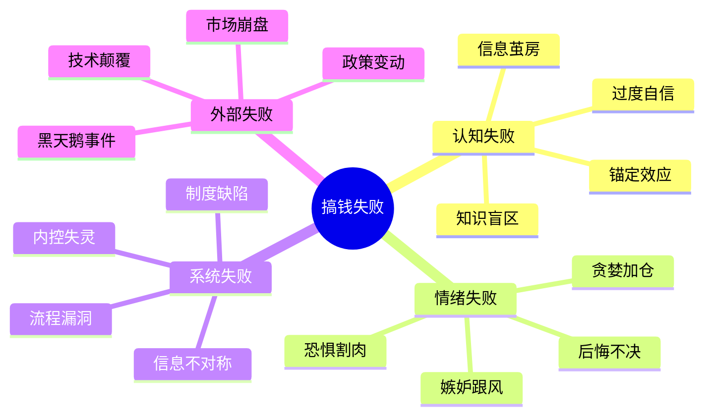
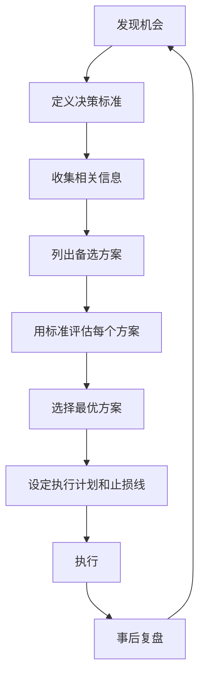
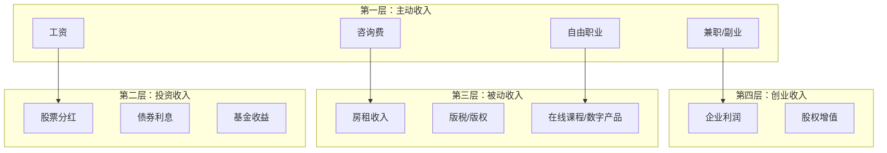
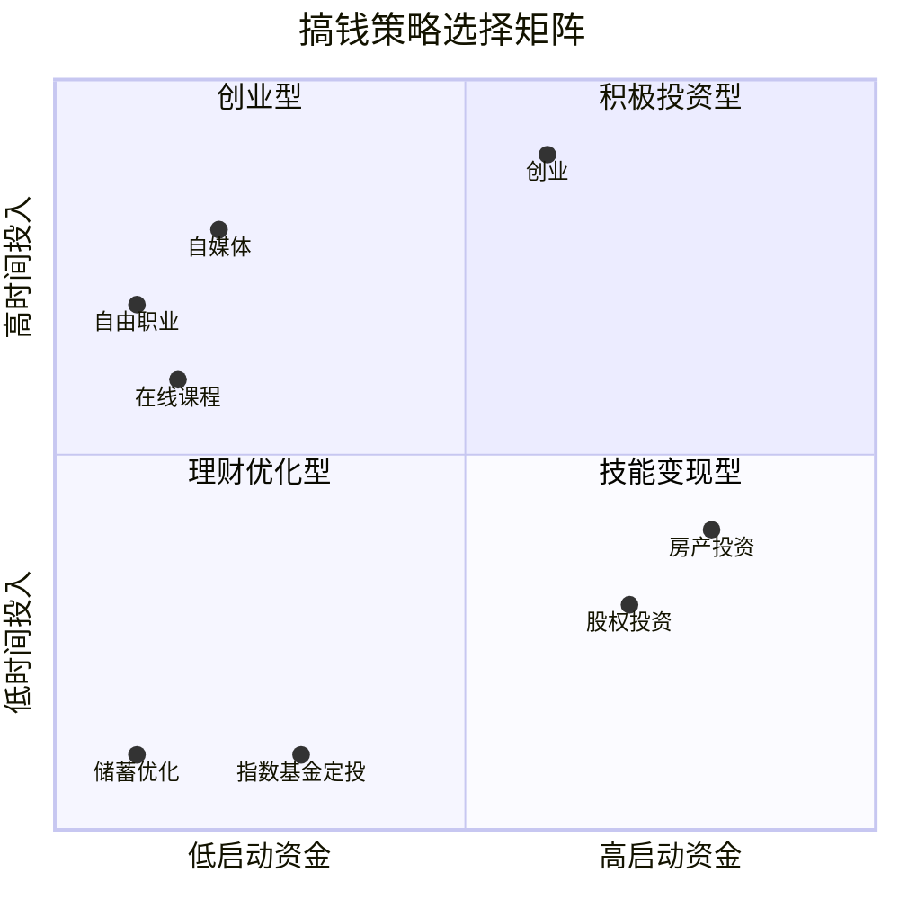

# 搞钱案例集深度拓展

本章是对前面案例分析的深度延伸。前面的章节通过20个真实案例提炼了成功与失败的规律，本章在此基础上做三件事：第一，建立一套科学的案例研究方法论，让你能够自主分析任何搞钱案例；第二，深入解剖失败与成功的底层机制，而不是停留在表面总结；第三，提供可执行的个人路径定制工具，把方法论变成你的行动方案。

---

## 一、案例研究方法论深度

### 1.1 为什么案例研究是搞钱的必修课

哈佛商学院从1920年代开始将案例教学法引入商学教育，至今已积累超过50,000个商业案例。案例研究之所以有效，核心原因在于它解决了知识迁移的难题——书本上的理论是抽象的，但商业世界是具体的。案例研究在"理论"和"实践"之间架起了一座桥。

案例研究有三种基本类型，各自适用不同场景：

| 类型 | 适用场景 | 优势 | 局限 |
|------|----------|------|------|
| 探索性案例研究 | 面对全新领域、形成初步假设 | 能发现未知变量和关系 | 结论初步，需后续验证 |
| 描述性案例研究 | 详细记录某个现象的完整面貌 | 信息丰富，便于理解 | 难以建立因果关系 |
| 解释性案例研究 | 回答"为什么会这样"和"如何发生的" | 能建立因果逻辑 | 需要更强的理论框架支撑 |

实际应用中，三种类型往往混合使用。比如你研究某个创业者的成功路径，先用探索性方法识别关键变量（他做了哪些不同于常人的决策），再用描述性方法还原完整过程（每个决策的背景、执行、结果），最后用解释性方法建立因果链（哪些决策真正导致了成功，哪些只是巧合）。

### 1.2 案例选择的策略与陷阱

不是所有案例都值得研究。案例选择的质量直接决定了你从中能学到什么。

**典型案例 vs 极端案例的选择逻辑**

典型案例是指能够代表一类情况的案例。比如研究"普通上班族如何通过副业实现月入过万"，就应该选择收入处于中位数附近的案例，而不是那些年入百万的头部玩家。典型案例的研究结论推广性更强，因为你的情况大概率更接近典型案例而非极端案例。

极端案例（特别成功或特别失败的）适合用来识别"天花板"和"地板"。比如研究"搞钱失败最惨烈的情况是什么样的"，极端案例能给你最深刻的警醒。但要注意：极端案例的结论往往不具普遍性，不能简单照搬。

**最大差异系统设计**

这是社会科学研究中一种强大的案例选择策略。核心思想是：如果你想找到"无论什么条件下都成立的规律"，就应该选择在其他变量上差异最大但在目标变量上表现一致的案例。

比如研究"搞钱成功者的共同特质"，就应该选择来自不同行业（互联网、制造业、服务业）、不同国家（中国、美国、日本）、不同起点（白手起家、继承家业、高学历精英）的成功案例。如果在这些极端不同的条件下，你仍然能找到某些共同特质，那这些特质就很可能是真正重要的成功因素。

**纵向案例研究的价值**

对同一个案例进行长期跟踪，观察其5年、10年甚至更长时间的变化，能揭示很多截面研究看不到的规律。比如一个创业者前3年高速增长，第4年遭遇危机，第5年转型成功——这种动态过程中的决策节点，比任何静态分析都更有学习价值。

### 1.3 案例分析的实战框架

理论框架的价值在于让你的分析不遗漏关键维度。以下是搞钱案例分析中最常用的三个框架：

**SWOT分析的正确用法**

大多数人做SWOT分析时只是罗列四类因素，然后就结束了。真正有价值的SWOT分析应该产出策略：

```text
优势 × 机会 → 进攻策略（SO）：利用优势抓住机会
劣势 × 机会 → 改进策略（WO）：弥补劣势以抓住机会
优势 × 威胁 → 防御策略（ST）：利用优势应对威胁
劣势 × 威胁 → 撤退策略（WT）：最小化劣势和威胁的双重打击
```

以一个程序员想转行做独立开发者为例：

- **优势**：技术能力强，能独立完成产品开发
- **劣势**：缺乏市场推广和商业运营经验
- **机会**：AI工具降低了独立开发的门槛，SaaS市场持续增长
- **威胁**：大厂入局小工具市场，竞争加剧

SWOT策略矩阵：

|  | 机会（AI降低门槛） | 威胁（大厂竞争） |
|--|---------------------|-------------------|
| **优势（技术强）** | 用AI快速开发垂直领域工具，抢占细分市场 | 做大厂不愿做的定制化服务 |
| **劣势（缺运营）** | 找有运营经验的合伙人，或通过社群学习 | 先做小而美的产品，不与大厂正面竞争 |

**波特五力分析的实际操作**

波特五力模型用来分析一个行业的竞争激烈程度。对搞钱者来说，五力分析的核心价值在于帮你判断"这个行业的钱好不好赚"。

操作步骤：

1. **现有竞争者**：搜索行业前10名的市场份额，计算集中度（CR4或HHI指数）。CR4超过60%说明行业高度集中，新进入者机会有限；CR4低于30%说明行业分散，仍有整合机会。
2. **潜在进入者**：列出进入这个行业需要的资源（资金、牌照、技术、渠道），评估门槛高低。
3. **替代品**：列出客户可能用来替代你的产品/服务的其他方案。替代品越多，你的定价能力越弱。
4. **供应商议价能力**：你的上游是否集中？切换供应商的成本高不高？
5. **买方议价能力**：你的客户是否集中？客户切换到竞品的成本高不高？

**价值链分析的切入点**

价值链分析帮助你找到"钱在哪里"。以电商为例：

```text
原材料 → 生产制造 → 品牌包装 → 渠道分销 → 终端零售 → 售后服务
```

每个环节的利润率不同。通常，越靠近消费者（品牌、渠道、零售）的环节利润越高，越上游（原材料、制造）的环节利润越薄。这就是为什么很多工厂想做自有品牌，因为品牌环节的利润率可能是制造环节的3-5倍。

### 1.4 案例研究的信度与效度

你分析案例得出的结论有多可靠？这取决于四个维度：

**构念效度**——你的测量是否准确反映了你想研究的概念。比如你想研究"一个人的风险承受力"，用"他投资了多少比例的资产在高风险产品上"来衡量，比用"他觉得自己能承受多大风险"更准确，因为行为比自我报告更可靠。

**内部效度**——你建立的因果关系是否成立。比如你发现"所有成功的创业者都有早起的习惯"，不能因此得出"早起导致创业成功"的结论——这是相关关系，不是因果关系。可能是勤奋的人既早起又创业成功，早起只是勤奋的一个表征。

**外部效度**——你的结论能否推广到其他情境。单个案例的结论推广性有限，多案例研究通过"复制逻辑"提高外部效度：如果在多个不同情境中都观察到了相同的模式，这个模式就更可能具有普遍性。

**信度**——别人重复你的研究能否得到相同结论。建立案例研究数据库，详细记录你的数据来源、分析过程和推理逻辑，是提高信度的基本方法。

### 1.5 案例叙述的SCQA框架

好的案例叙述不是平铺直叙地罗列事实，而是用故事结构让读者产生代入感。麦肯锡的SCQA框架是最实用的案例叙述工具：

- **S（Situation）**——情境：交代背景，让读者了解"故事发生在哪里"
- **C（Complication）**——冲突：引入问题或挑战，制造紧张感
- **Q（Question）**——问题：自然地引出核心问题"怎么办？"
- **A（Answer）**——答案：给出解决方案和结果

以"李佳琦从月薪3000的柜哥到年入过亿的直播一哥"为例：

- **S**：2016年，李佳琦是南昌某商场欧莱雅专柜的BA（美容顾问），月薪3000元。
- **C**：传统线下零售受到电商冲击，BA的职业前景堪忧。公司决定试水直播卖货，但大多数BA不愿意尝试。
- **Q**：一个普通的线下销售员，如何在全新的直播赛道上脱颖而出？
- **A**：李佳琦用极致的专业主义（每天试色300+口红）、独特的表达方式（"Oh my god，买它！"）和超强的执行力（连续直播30天不休息），在短短两年内成为直播带货的标杆人物。

***

## 二、搞钱失败的系统性分析

### 2.1 失败的分类学：搞清楚你正在经历哪种失败

搞钱失败不是一个单一现象，而是一个包含多种类型的系统。不同类型的失败，应对策略完全不同。

**按失败程度分类：**

| 程度 | 定义 | 典型表现 | 恢复周期 | 应对策略 |
|------|------|----------|----------|----------|
| 暂时性挫折 | 亏损在总资产10%以内 | 投资回撤、项目延期 | 1-6个月 | 保持冷静，分析原因，微调策略 |
| 重大损失 | 亏损在总资产30-50% | 股票腰斩、创业失败 | 1-3年 | 止损，重建现金流，调整方向 |
| 财务崩溃 | 亏损超过总资产80%或负债累累 | 破产、被追债 | 3-10年 | 法律保护，债务重组，从零开始 |

**按失败原因的四维分类：**



### 2.2 四大失败模式的深度解剖

#### 模式一：过度杠杆——以2015年A股股灾为例

**完整时间线：**

- **2014年7月**：A股启动牛市，上证指数从2000点附近开始上涨。
- **2014年12月**：指数突破3000点，场外配资开始大规模涌入。配资公司提供1:5甚至1:10的杠杆。
- **2015年3月**：指数突破4000点，两融余额突破1.5万亿，场外配资规模估计达2-4万亿。
- **2015年6月12日**：上证指数触及5178点高点。
- **2015年6月15日**：监管层清理场外配资，市场开始暴跌。
- **2015年6月26日**：单日超过2000只股票跌停，配资账户大面积爆仓。
- **2015年7月8日**：上证指数跌至3507点，三周跌幅超过30%。千股跌停、千股停牌，流动性枯竭。

**数据说话：**

| 指标 | 数值 |
|------|------|
| 牛市持续时间 | 约11个月（2014.7-2015.6） |
| 最大涨幅 | 159%（2000→5178） |
| 暴跌幅度 | -32%（5178→3507，三周） |
| 两融最高余额 | 2.27万亿 |
| 场外配资估计规模 | 2-4万亿 |
| 受影响投资者数 | 超过5000万 |

**深度分析：为什么杠杆在牛市是毒药？**

杠杆的本质是用借来的钱放大投资。在上涨阶段，杠杆让你赚更多；但在下跌阶段，杠杆让你亏更多——而且会触发"强制平仓→价格下跌→更多平仓"的死亡螺旋。

具体机制：假设你用1:5的杠杆（自有资金10万，借入50万，总仓位60万），当股票下跌16.7%时，你的自有资金就归零了。而如果你没有杠杆，同样的下跌你只亏16.7%，还剩8.33万。

更致命的是，杠杆投资没有"等反弹"的选项。没有杠杆时，股票跌了你可以选择持有等待反弹；但杠杆投资会在你亏损到一定程度时强制平仓，让你把浮亏变成实亏，错过后续可能的反弹。

**杠杆使用的安全边界：**

| 负债率 | 破产概率 | 适用人群 |
|--------|----------|----------|
| 0-30% | 极低 | 保守型投资者 |
| 30-50% | 低 | 稳健型投资者 |
| 50-70% | 中等 | 有一定风险承受力 |
| 70-80% | 高 | 需要非常强的现金流 |
| 80%以上 | 极高 | 不建议任何人 |

#### 模式二：从众心理——从郁金香泡沫到加密货币

**案例深度分析：2021年中国教培行业泡沫破裂**

这个案例的特殊之处在于，从众心理不仅发生在投资者身上，也发生在行业从业者身上。

**时间线：**
- **2015-2020年**：中国在线教育行业爆发式增长。好未来、新东方、猿辅导、作业帮等公司融资总额超过数百亿美元。
- **2020年**：疫情推动线上教育需求激增，在线教育融资额达到历史峰值，全年超过500亿元。
- **2021年初**：猿辅导完成新一轮融资，估值达155亿美元；作业帮估值约73亿美元。
- **2021年7月**：国务院印发《关于进一步减轻义务教育阶段学生作业负担和校外培训负担的意见》（"双减"政策），学科类培训机构不得上市融资，已上市的不得融资。
- **2021年下半年**：好未来股价从90美元跌至4美元以下，跌幅超过95%。新东方市值蒸发约90%。猿辅导、作业帮裁员超过70%。

**从众心理在这里是如何发挥作用的？**

1. **投资者层面**：当高瓴、软银、腾讯等顶级投资机构纷纷押注在线教育时，中小投资者认为"跟着聪明钱走"不会错。但顶级投资机构的钱是分散的，他们亏得起一个赛道；中小投资者往往押上全部身家，亏不起。
2. **从业者层面**：当身边所有同学都在往教育行业涌（因为工资高、期权多）时，很少有人会冷静思考"这个行业的增长是可持续的吗？"。
3. **创业者层面**：当每个赛道的头部公司都在疯狂烧钱获客时，后入场的创业者被迫加入烧钱大战，否则就会被淘汰。但当政策转向时，所有烧出去的钱都打了水漂。

**识别从众心理的三个信号：**
1. "这次不一样"——每当有人说这句话的时候，泡沫大概率已经形成。
2. "连我XX都在做"——当你的理发师、出租车司机、退休亲戚都在谈论某个投资机会时，风险信号已经非常强了。
3. 怀疑论者被嘲笑——当理性分析风险的人被嘲笑"你不懂""你太保守"的时候，市场已经偏离基本面。

#### 模式三：认知盲区——柯达和诺基亚的系统性失败

**柯达案例的深层分析**

柯达的故事通常被简化为"柯达发明了数码相机但没有转型"。但真实情况远比这复杂。

**关键时间线：**
- **1975年**：柯达工程师Steven Sasson发明了世界上第一台数码相机。分辨率0.01百万像素，拍摄一张照片需要23秒。
- **1981年**：柯达内部报告预测数码技术将在10年内取代胶片，建议公司转型。
- **1986年**：柯达开发了世界上第一块百万像素级别的图像传感器。
- **1990年代**：柯达在数码技术上投入了数十亿美元，但始终把数码产品定位为"胶片的补充"而非"胶片的替代"。
- **2000年**：胶片业务占柯达营收的72%和利润的2/3。
- **2003年**：柯达宣布大幅减少胶片业务投资，转向数码。但此时佳能、索尼、尼康已经在数码相机市场建立了强大的品牌和渠道。
- **2012年**：柯达申请破产保护。

**柯达的认知盲区是什么？**

柯达不是不知道数码技术会取代胶片——他们的内部报告早在1981年就做出了这个判断。柯达的问题是"成功者的诅咒"：胶片业务太赚钱了（毛利率高达70%），以至于公司无法说服自己主动放弃这块利润。

这在心理学上叫做"沉没成本谬误"和"现状偏见"的叠加。公司已经在胶片的生产、分销、品牌上投入了数十亿美元，这些投资让他们无法客观地看待数码技术的威胁。每个季度的财报都在告诉管理层"胶片业务很好"，而数码业务的利润微薄。在这种情况下，主动缩减胶片业务、全力押注数码，需要极大的战略勇气——而这恰恰是大多数企业管理层所缺乏的。

**认知盲区的三种常见形式：**

| 类型 | 表现 | 案例 |
|------|------|------|
| 确认偏误 | 只关注支持自己观点的信息 | 柯达只看到胶片的利润，忽视数码的增速 |
| 沉没成本谬误 | 因为已经投入太多而不愿放弃 | 诺基亚不愿放弃塞班系统的生态投入 |
| 框架效应 | 用错误的方式定义问题 | 把自己定义为"胶片公司"而非"影像公司" |

#### 模式四：道德风险——庞氏骗局的结构化解剖

**中国P2P暴雷案例：e租宝（2015年）**

e租宝是2015年中国最大的P2P诈骗案，涉案金额超过745亿元，受害投资者超过90万人。

**骗局结构：**
1. **虚假项目**：e租宝平台上的融资租赁项目95%以上是虚构的。实际控制人丁宁指使员工注册大量空壳公司，伪造租赁合同。
2. **高息诱惑**：承诺年化收益率9%-14.6%，远高于银行理财产品的4%-5%。
3. **华丽包装**：在央视等主流媒体投放大量广告，赞助知名节目，制造"正规大平台"的形象。
4. **拆东补西**：用新投资人的钱偿还老投资人的本息，维持"按时兑付"的假象。

**识别庞氏骗局的五个量化指标：**

| 指标 | 安全区间 | 危险信号 |
|------|----------|----------|
| 承诺收益率 | 3%-8%（年化） | 超过10%的固定收益承诺 |
| 信息披露 | 可验证的底层资产 | 无法查证的具体投资项目 |
| 资金托管 | 第三方银行存管 | 平台自管资金 |
| 成立时间 | 3年以上，有可追溯的业绩 | 成立时间短，无历史业绩 |
| 股东背景 | 可查询的工商注册信息 | 股权结构复杂、多层嵌套 |

**核心原则：如果回报看起来好得不真实，那大概率就不是真的。** 在低利率环境下，任何承诺固定收益超过10%的项目，都应该被视为高风险或欺诈嫌疑。

### 2.3 失败模式的量化规律

根据对大量搞钱失败案例的统计分析，可以总结出以下可量化的规律：

**规律一：杠杆与破产的非线性关系**

负债率与破产概率之间不是线性关系，而是指数关系。负债率从50%上升到60%时，破产概率增加不大；但从70%上升到80%时，破产概率会急剧跳升。这个拐点大约在75%左右。一旦负债率超过80%，一个10%的资产减值就可能导致资不抵债。

**规律二：集中度与亏损的放大效应**

单一投资占总资产比例超过50%时，重大亏损（超过30%）的概率是分散投资者（单一投资不超过20%）的3.2倍。这不是因为集中投资本身不好，而是因为大多数个人投资者不具备评估单一标的的分析能力。巴菲特可以集中投资，因为他有深度研究的能力和信息优势；普通投资者集中投资，更像是在赌博。

**规律三：交易频率与回报的负相关**

Barber和Odean在2000年发表的经典研究《Trading is Hazardous to Your Wealth》分析了66,465个家庭的交易记录，发现交易最频繁的20%投资者的年化回报率比市场平均低6.5个百分点（扣除费用前）和7.4个百分点（扣除费用后）。原因有二：一是频繁交易产生大量手续费和税费；二是频繁交易者更容易受到情绪驱动，在错误的时间买入卖出。

**规律四：信息来源与决策质量**

仅依赖社交媒体（微博、抖音、小红书上的"理财博主"）获取投资信息的投资者，决策失误率比使用专业研究报告（券商研报、行业白皮书）的投资者高40%以上。原因在于社交媒体算法会强化你的既有偏见（信息茧房），而专业研报会呈现正反两面的分析。

***

## 三、成功搞钱者的共同特质研究

### 3.1 学术研究发现了什么

**行为金融学的四大发现**

1. **情绪稳定性与投资回报正相关**：密歇根大学的一项研究追踪了1,000名投资者3年的情绪状态和投资业绩，发现情绪波动最小的20%投资者的年化回报率比情绪波动最大的20%高出4.1个百分点。原因很简单：情绪稳定的人不会在市场恐慌时割肉，也不会在市场狂热时追高。

2. **延迟满足能力是长期投资的心理基础**：斯坦福大学著名的"棉花糖实验"在40年后的跟踪研究发现，能够等待15分钟不吃棉花糖的孩子，在成年后的收入水平比立刻吃掉棉花糖的孩子平均高出20%。这种延迟满足的能力，与长期持有投资标的的能力高度相关。

3. **过度自信是投资者最大的敌人**：研究发现，超过70%的个人投资者认为自己的投资水平高于平均水平——这在统计学上是不可能的。过度自信导致投资者低估风险、过度交易、忽视反面证据。成功的投资者通常对自己的能力有更准确的评估。

4. **从错误中学习的能力区分了赢家和输家**：大多数人在投资亏损后会"选择性遗忘"失败的经历，而不是深入分析失败的原因。成功的投资者会把每一次亏损当作学费，系统性地复盘并更新自己的投资框架。

**企业家研究的五大发现**

哈佛商学院对全球超过1,000位成功企业家的长期追踪研究发现，成功的共同特质按重要性排序如下：

1. **机会识别能力**（排名第一）：不是等到机会砸到头上，而是主动扫描环境、发现被忽视的需求。这种能力可以通过训练提高——方法是大量阅读不同领域的信息，建立跨领域的知识网络。

2. **执行力**（排名第二）：想法不值钱，执行才值钱。成功的创业者不是那些有最多想法的人，而是能够把一个想法变成产品、推向市场、获得客户的人。

3. **韧性**（排名第三）：平均每位成功创业者在成功之前经历过2.3次重大失败。韧性不是"死扛"，而是"在失败中快速学习并调整方向"的能力。

4. **人际能力**（排名第四）：技术能力决定了一个人能做什么，但人际能力决定了一个人能调动什么资源。成功的创业者通常能够在早期吸引到比自己更优秀的人加入团队。

5. **财务素养**（排名第五）：对现金流、利润率、资本成本等财务概念的理解，是做出正确商业决策的基础。很多创业失败不是因为产品不好，而是因为现金流管理失误。

### 3.2 成功搞钱者的四种思维模式

#### 概率思维：用期望值做决策

**核心概念：** 任何决策的结果都是不确定的，但你可以计算每个选项的期望值（期望值 = 概率 × 回报），然后选择期望值最高的选项。

**实际应用：** 假设你有两个投资选择：

- **选项A**：70%概率赚20%，30%概率亏10%。期望值 = 0.7 × 20% + 0.3 × (-10%) = 11%。
- **选项B**：40%概率赚50%，60%概率亏15%。期望值 = 0.4 × 50% + 0.6 × (-15%) = 11%。

两者期望值相同，但选项A的波动更小。如果你是风险厌恶型，选A；如果你愿意承担更大波动来换取更高上限，选B。关键是要基于数字做决策，而不是基于直觉或情绪。

**注意事项：** 概率思维不是要你精确计算每个决策的概率（这在现实中很难做到），而是养成"用数字思考不确定性"的习惯。当你把模糊的感觉转化成具体的数字判断时，决策质量会显著提升。

#### 逆向思维：反过来想，总是反过来想

查理·芒格的这句名言背后有一个强大的方法论：与其问"如何成功"，不如问"怎样会失败"——然后避免那些失败因素。

**实操方法：事前验尸（Pre-mortem）**

这是心理学家Gary Klein提出的决策工具。在做任何重要决策之前，假设"这个决策已经失败了"，然后让团队成员各自写出"为什么会失败"。

具体步骤：
1. 描述你打算做的决策
2. 假设一年后这个决策已经彻底失败
3. 每个人独立写下"导致失败的三个最可能的原因"
4. 汇总所有原因，按可能性排序
5. 针对排名前5的原因，制定预防措施

这个方法之所以有效，是因为它克服了"规划谬误"（人类倾向于低估任务完成时间和风险），让团队成员有心理安全感去表达担忧——在正常的决策讨论中，提出反对意见可能会被视为"不支持团队"；但在事前验尸的框架下，找出潜在问题正是任务目标。

#### 长期思维：跨越短期噪音

贝佐斯的名言"如果你做的决策能够影响三年后的事情，那你的竞争对手就少得多"，揭示了长期思维的战略价值。

**为什么长期思维能带来竞争优势？**

因为在现实中，大多数人（包括大多数企业）都在优化短期结果。当所有人都在做短期优化时，愿意做长期投入的人就获得了稀缺的竞争优势。

**案例：亚马逊AWS的长期投入**

- **2002年**：亚马逊开始投入云计算技术研究。
- **2006年**：AWS正式对外提供服务。
- **2010-2015年**：AWS持续亏损，华尔街多次质疑亚马逊"不务正业"。
- **2015年**：AWS首次在财报中单独披露，营收78.8亿美元，运营利润18.6亿美元。
- **2022年**：AWS营收801亿美元，运营利润228亿美元，成为亚马逊最赚钱的业务。

亚马逊在AWS上的投入到回报用了10年以上的时间。这种时间跨度超过99%的企业的战略耐心。

#### 第一性原理思维：回到最基本的事实

马斯克解释SpaceX的火箭成本时说："火箭的原材料成本大约是发射价格的2%。如果我们可以自己制造，成本可以降低到原来的1/10。"这就是第一性原理思维——不是问"火箭现在卖多少钱"，而是问"火箭的材料成本是多少"。

**实操步骤：**
1. 明确你想解决的问题
2. 列出这个问题涉及的所有基本事实和物理/经济规律
3. 从这些基本事实出发，重新构建解决方案
4. 识别哪些"常识"其实只是"惯例"，是可以被挑战的

### 3.3 成功搞钱者的五大行为习惯

#### 习惯一：持续学习，但不只是读书

巴菲特每天花80%的时间阅读，但更重要的是他阅读的结构：财务报表（一手数据）、行业报告（专业分析）、传记（他人的决策过程）。大多数人的阅读缺乏结构，停留在"获取信息"的层面，没有转化为"决策框架"。

**建立决策导向的学习系统：**

1. **信息输入**：每天花30分钟阅读行业新闻和分析报告
2. **信息整理**：每周花1小时整理本周学到的关键信息，建立个人知识库
3. **框架更新**：每月花2小时审视自己的决策框架，根据新信息更新判断
4. **行动转化**：每个季度至少基于新学到的知识做出一个可执行的决策

#### 习惯二：系统化决策

成功搞钱者的决策不是拍脑袋，而是遵循一套系统化的流程：



**关键点在"定义决策标准"这一步。** 大多数人的决策失败不是因为分析能力不够，而是因为没有在决策前明确"什么对我来说是最重要的"。标准不明确，分析再深入也得不出结论。

#### 习惯三：风险量化管理

成功搞钱者不是风险回避者，而是风险管理专家。他们的风险管理有三个层次：

**第一层：知道自己在承担什么风险**

很多人投资亏钱，不是因为承担了风险，而是因为不知道自己承担了什么风险。比如买了一只"低风险"的债券基金，但实际上这只基金80%的资金投在了信用债上——信用债的违约风险远高于国债。

**第二层：为最坏情况做准备**

具体做法是"压力测试"你的财务状况：假设你的收入减少50%、你的投资下跌30%、你突然面临一笔大额支出（比如家人生病），你是否还能维持正常生活？如果答案是"不能"，说明你的风险准备不足。

**第三层：分散投资，但不是过度分散**

分散投资是降低非系统性风险的基本方法，但过度分散也会降低回报。学术研究表明，持有15-20只相关性较低的股票，就可以消除大约90%的非系统性风险。再多持股，风险降低的边际效果就很小了。

#### 习惯四：构建高质量人际网络

人际网络的质量比数量重要得多。成功搞钱者通常遵循"5-50-150"原则：

- **5人核心圈**：最信任的5个人，重大决策会咨询他们的意见
- **50人关键圈**：可以合作、互相帮助的50个人
- **150人熟人圈**：邓巴数——人类大脑能维持的最大社交关系数量

构建高质量人际网络的关键不是"认识多少人"，而是"你能为别人提供什么价值"。最有效的社交策略是成为某个领域的专家，让别人主动来找你。

#### 习惯五：建立个人复盘机制

成功搞钱者的最后一个共同习惯是定期复盘。他们不仅复盘失败的决策，也复盘成功的决策——因为成功的决策中也可能包含运气成分，需要区分"做对了什么"和"碰巧赢了什么"。

**复盘四问：**
1. 我当初为什么做这个决策？（决策逻辑）
2. 实际结果是什么？（客观事实）
3. 结果与预期的差距在哪里？（差异分析）
4. 如果重来一次，我会怎么做？（框架更新）

### 3.4 中国成功搞钱者的特色特质

在中国市场搞钱，有一些西方学术研究不常覆盖但极其重要的特质：

**政策敏感度**：中国经济受政策影响极大。2021年"双减"政策出台前，如果有人仔细研读了2018年教育部等四部门发布的《关于切实减轻中小学生课外负担开展校外培训机构专项治理行动的通知》，就应该能预判到更严格的监管即将到来。政策敏感度不是"有关系能提前知道消息"，而是"认真阅读和分析已经公开的政策文件"。

**关系网络的中国特色**：中国的商业环境高度依赖信任关系。与西方的"契约社会"不同，中国的商业合作往往先建立个人信任，再签订合同。这意味着在中国搞钱，"靠谱"的口碑比任何营销手段都有效。

**快速适应能力**：中国市场的变化速度远超大多数国家。一个好的商业模式可能只有6-12个月的窗口期，之后就会被大量模仿者涌入。能够在短时间内快速迭代和调整的人，在中国市场具有天然优势。

***

## 四、搞钱策略的演化趋势

### 4.1 收入结构的进化路径

传统的单一工资收入模式正在被多元收入结构取代。这不是一种时尚，而是一种必然——因为单一收入来源的风险太高了。

**多元收入的四层架构：**



**构建多元收入的时间规划：**

| 阶段 | 时间跨度 | 重点 | 收入来源数量 |
|------|----------|------|-------------|
| 起步期 | 0-1年 | 夯实主业收入，开始学习投资 | 1-2个 |
| 探索期 | 1-3年 | 开发第一个副业/投资收入 | 2-3个 |
| 扩展期 | 3-5年 | 副业收入稳定，开始构建被动收入 | 3-4个 |
| 成熟期 | 5年+ | 被动收入覆盖基本开支 | 4个以上 |

### 4.2 投资策略的范式转变：从选股到指数

**为什么指数投资正在成为主流？**

标准普尔每年发布的SPIVA报告（S&P Indices vs. Active）持续跟踪主动管理基金与指数基金的对比。2023年的数据显示：

| 时间跨度 | 主动基金跑输指数的比例（美国大盘股） |
|----------|--------------------------------------|
| 1年 | 60% |
| 5年 | 87% |
| 10年 | 92% |
| 20年 | 95% |

换句话说，20年后，95%的主动管理基金的回报率低于指数。这意味着，除非你能确定自己选中的基金经理属于那5%的赢家，否则直接买指数基金是统计上更优的选择。

**中国市场的指数投资工具：**

| 工具类型 | 代表产品 | 管理费率 | 适合人群 |
|----------|----------|----------|----------|
| 沪深300ETF | 华泰柏瑞沪深300ETF（510300） | 0.5% | 跟踪A股大盘 |
| 中证500ETF | 南方中证500ETF（510500） | 0.5% | 跟踪A股中盘 |
| 中证A500ETF | 各家基金公司均有产品 | 约0.15-0.2% | 2024年新推出 |
| MSCI中国A50互联互通ETF | 各家基金公司均有产品 | 约0.5% | 外资偏好的核心资产 |

### 4.3 从线下到线上的迁移地图

搞钱渠道的线上化不是简单的"把线下业务搬到线上"，而是利用互联网的特性（低成本获客、规模化交付、数据驱动决策）来创造新的商业模式。

**线上搞钱的四大赛道对比：**

| 赛道 | 启动成本 | 天花板 | 成功率 | 技能要求 |
|------|----------|--------|--------|----------|
| 电商/跨境电商 | 中（5-50万） | 高 | 中 | 供应链、运营、营销 |
| 内容创作/知识付费 | 低（0-5万） | 中高 | 低 | 内容创作、个人品牌 |
| SaaS/数字产品 | 中（10-100万） | 极高 | 低 | 技术开发、产品设计 |
| 远程服务/自由职业 | 极低（0-1万） | 中 | 高 | 专业技能 |

### 4.4 社群协作：从独狼到狼群

**社群搞钱的三种模式：**

1. **投资社群**：共同研究投资标的，分享信息和分析。代表平台：雪球、集思录。风险：社群可能变成"信息茧房"，强化群体偏见。

2. **创业社群**：共享资源、互补技能、分担风险。代表形式：联合创业、孵化器。关键：社群成员之间的互补性比相似性更重要。

3. **技能社群**：同类技能的人聚集在一起，互相学习、互相推荐机会。代表平台：GitHub（程序员）、Behance（设计师）。价值：降低学习成本，扩大机会来源。

### 4.5 从追求收入到追求自由

FIRE运动（Financial Independence, Retire Early——财务自由，提前退休）的核心理念正在被越来越多的中国年轻人接受。

**FIRE的三种模式：**

| 模式 | 年支出倍数 | 生活方式 |
|------|-----------|----------|
| 肥FIRE | 年支出的30倍以上 | 维持或提升当前生活水平 |
| 瘦FIRE | 年支出的25倍 | 大幅降低生活开支 |
| Coast FIRE | 积累足够投资，让复利自动增长到退休所需 | 继续工作但不再为钱焦虑 |

**25倍法则的数学原理：**

"年支出的25倍"来自4%安全提取率法则——1998年Trinity大学的研究发现，如果一个退休者每年从投资组合中提取不超过4%的金额，那么在绝大多数历史情景下，这个投资组合可以支撑30年以上的退休生活。

反过来说：如果你每年的生活支出是10万元，那么你需要积累250万元的投资资产（10万 × 25），然后每年提取10万元（250万 × 4%），就可以不再工作。

### 4.6 AI时代的搞钱策略

AI正在重塑搞钱的每一个环节。关键不是"AI会不会取代你的工作"，而是"你能不能用AI提升你的搞钱效率"。

**AI赋能搞钱的五个层面：**

| 层面 | 应用场景 | 效率提升 |
|------|----------|----------|
| 信息获取 | AI帮你快速整理行业报告、分析财报 | 10倍以上 |
| 内容创作 | AI辅助写作、设计、视频制作 | 3-5倍 |
| 决策分析 | AI提供数据分析、趋势预测 | 2-3倍 |
| 自动化运营 | AI客服、AI营销、AI财务 | 5-10倍 |
| 新商业模式 | AI原生产品和服务 | 创造全新赛道 |

**普通人利用AI搞钱的实际路径：**

1. **用AI提升现有工作的效率**：比如用AI工具写周报、做PPT、分析数据，节省时间后把省下来的时间用于副业。
2. **用AI降低创业门槛**：以前做一个App需要一个开发团队，现在用AI编程工具（Cursor、Copilot），一个有基本技术能力的人就能独立完成。
3. **做AI相关的服务**：帮企业部署AI工具、做AI培训、开发AI应用。

***

## 五、个人搞钱路径的定制方法

### 5.1 自我评估工具

在设计搞钱路径之前，你需要先了解自己的"搞钱基因"。以下是一个系统化的自我评估框架：

**维度一：技能盘点**

| 技能类别 | 你的技能 | 市场需求 | 变现潜力 |
|----------|----------|----------|----------|
| 硬技能 | （如编程、设计、写作） | 高/中/低 | 高/中/低 |
| 软技能 | （如沟通、领导、销售） | 高/中/低 | 高/中/低 |
| 行业知识 | （如金融、医疗、教育） | 高/中/低 | 高/中/低 |
| 独特资源 | （如人脉、信息、牌照） | 高/中/低 | 高/中/低 |

**维度二：风险承受力评估**

回答以下问题，计算你的风险承受力分数（1-10分）：

1. 如果你的投资一个月内亏损了20%，你会：（a）立刻卖掉（2分）（b）焦虑但不卖（5分）（c）考虑加仓（8分）
2. 你的应急储备金可以覆盖几个月的生活开支？（a）0-3个月（3分）（b）3-6个月（6分）（c）6个月以上（9分）
3. 你的收入来源有几个？（a）1个（3分）（b）2-3个（6分）（c）4个以上（9分）
4. 你的年龄？（a）45岁以上（3分）（b）30-45岁（6分）（c）30岁以下（9分）

**分数解读：**
- 4-12分：保守型。适合低风险策略：储蓄+指数基金+保险
- 13-24分：稳健型。适合中等风险策略：职业发展+指数基金+少量个股
- 25-36分：积极型。适合较高风险策略：创业+积极投资+多元收入

### 5.2 SMART目标设定的搞钱版本

把模糊的"我想搞钱"变成可执行的目标：

| 要素 | 模糊目标 | SMART目标 |
|------|----------|-----------|
| 具体 | 想多赚点钱 | 通过副业每月增加8000元收入 |
| 可衡量 | 投资赚钱 | 投资组合年化收益率达到8% |
| 可实现 | 一年内财务自由 | 5年内积累200万净资产 |
| 相关性 | 什么都想做 | 专注于与主业相关的副业 |
| 时限性 | 总有一天 | 2026年12月31日前完成 |

### 5.3 策略选择矩阵

根据你的个人条件选择最适合的搞钱起点：



### 5.4 不同人生阶段的搞钱路径

**20-30岁：能力积累期**

这个阶段的核心资产是"时间"——你有30-40年的复利增长期。这个阶段最值得的投资是投资自己。

| 优先级 | 行动 | 预期回报 |
|--------|------|----------|
| 1 | 提升核心技能，争取升职加薪 | 未来10年收入增长3-5倍 |
| 2 | 建立紧急储蓄基金（3-6个月支出） | 心理安全垫 |
| 3 | 开始指数基金定投（每月收入的10-20%） | 30年后复利可观 |
| 4 | 探索副业，测试变现能力 | 可能发展为第二收入来源 |

**30-40岁：收入加速期**

这个阶段通常收入已经有一定基础，但家庭支出也在增加（房贷、育儿）。核心挑战是"在支出增加的同时保持储蓄率"。

| 优先级 | 行动 | 预期回报 |
|--------|------|----------|
| 1 | 最大化主业收入（晋升、跳槽、谈判） | 收入增长50-100% |
| 2 | 建立多元收入来源（副业、投资） | 降低单一收入风险 |
| 3 | 优化投资组合（指数基金+少量个股） | 年化6-10% |
| 4 | 购买必要保险（重疾、寿险、意外） | 防止因病返贫 |

**40-50岁：财富积累期**

这个阶段收入达到峰值，应该开始认真构建被动收入和为退休做准备。

| 优先级 | 行动 | 预期回报 |
|--------|------|----------|
| 1 | 加速储蓄和投资（储蓄率争取30%以上） | 加速财富积累 |
| 2 | 构建被动收入来源 | 逐步减少对工资的依赖 |
| 3 | 优化资产配置（降低风险敞口） | 保护已有财富 |
| 4 | 开始遗产和传承规划 | 税务优化 |

**50岁以上：财富保全期**

| 优先级 | 行动 | 预期回报 |
|--------|------|----------|
| 1 | 保守投资（债券、存款、低风险理财） | 保本为主 |
| 2 | 确保充足的医疗保险 | 防止医疗支出侵蚀积蓄 |
| 3 | 制定退休生活计划 | 确保退休生活质量 |
| 4 | 完成传承规划 | 减少税务负担 |

### 5.5 个人搞钱路径定制案例

#### 案例一：程序员小王——从高薪打工到财务自由

**背景画像：**
- 年龄：28岁
- 职业：互联网公司高级工程师
- 年收入：50万元（税后约38万）
- 储蓄：100万元
- 风险承受力：中高

**路径设计：**

**第一阶段（1-3年）：夯实基础+探索副业**

| 行动项 | 具体措施 | 预期产出 |
|--------|----------|----------|
| 主业优化 | 争取晋升为技术专家或技术管理，年薪提升至70万+ | 年收入+20万 |
| 技能变现 | 开设技术博客，积累1万粉丝后开设付费专栏/课程 | 月入5000-2万 |
| 投资起步 | 60万投入沪深300+中证500指数基金，20万投入债券基金，20万保留现金 | 年化6-8% |
| 个人品牌 | 在GitHub上维护开源项目，参加技术大会演讲 | 提升行业影响力 |

**第二阶段（3-7年）：加速积累+创业尝试**

| 行动项 | 具体措施 | 预期产出 |
|--------|----------|----------|
| 创业尝试 | 以技术合伙人身份加入早期创业项目 | 潜在股权收益 |
| 被动收入 | 在线课程和咨询形成稳定被动收入，月入2-5万 | 年被动收入24-60万 |
| 投资增长 | 投资组合目标达到500万，增加房产配置 | 年投资收益30-50万 |

**第三阶段（7年+）：实现自由**

| 指标 | 目标值 |
|------|--------|
| 总资产 | 1000万+ |
| 被动收入 | 年50万+ |
| 工作状态 | 自主选择是否工作 |

#### 案例二：自由职业者小李——从个人接单到品牌工作室

**背景画像：**
- 年龄：32岁
- 职业：平面设计师，自由职业
- 年收入：30万元
- 储蓄：20万元
- 风险承受力：中

**路径设计：**

**第一阶段（1-3年）：建立品牌+规模化**

| 行动项 | 具体措施 | 预期产出 |
|--------|----------|----------|
| 品牌建设 | 在Behance、站酷建立高质量作品集，获得行业奖项 | 提升客单价30-50% |
| 团队搭建 | 招聘1-2名初级设计师，从个人接单转向团队运营 | 年收入提升至50万 |
| 数字产品 | 开发设计模板和素材包，在设计素材平台销售 | 月入3000-8000 |
| 培训输出 | 开设设计入门课程（录播+直播） | 月入5000-1.5万 |

**第二阶段（3-7年）：稳定增长+投资积累**

| 行动项 | 具体措施 | 预期产出 |
|--------|----------|----------|
| 工作室品牌化 | 注册公司，建立标准化流程，拓展企业客户 | 年收入100万+ |
| 投资配置 | 指数基金定投+少量房产投资 | 投资组合50-100万 |
| 知识IP | 出版设计类书籍或专栏，建立行业专家形象 | 提升整体品牌价值 |

### 5.6 路径调整的五个原则

1. **每季度复盘一次**：对比目标和实际进展，分析差距原因，调整下一步行动。
2. **保持灵活性**：环境在变化，你的路径也应该随之调整。2020年之前没人能预测到疫情会彻底改变远程工作的格局。
3. **风险监控是底线**：无论搞钱策略怎么变，都要确保自己有足够的应急储备和保险保障。
4. **学习不能停**：搞钱的环境在不断变化，昨天有效的方法明天可能就失效了。保持学习是保持竞争力的唯一方式。
5. **搞钱不是生活的全部**：健康、家庭、人际关系，这些是金钱买不到的。搞钱的目的是过上更好的生活，而不是让生活只剩下搞钱。

### 5.7 财务自由的四个层次

搞钱的终极目标不是拥有最多的钱，而是获得选择的自由。财务自由有四个递进的层次：

| 层次 | 定义 | 量化标准 | 你需要做什么 |
|------|------|----------|-------------|
| 基本安全 | 不必为基本生活担忧 | 应急储备≥6个月支出 | 建立紧急基金，购买基础保险 |
| 选择自由 | 可以选择做喜欢的工作 | 被动收入≥基本生活支出的50% | 构建多元收入来源 |
| 时间自由 | 可以自主安排时间 | 被动收入≥全部生活支出 | 投资组合达到年支出25倍 |
| 完全自由 | 按照价值观生活 | 被动收入远超生活支出 | 多元化资产+持续增长 |

大多数人的终极目标是达到第三层——时间自由。这一层意味着你不再需要为了钱而工作，可以把时间花在真正重要的事情上。

***

## 本章小结

本章从五个维度对搞钱案例集进行了深度拓展：

1. **方法论**：建立了从案例选择、分析框架到叙述技巧的完整研究方法论，让你能够独立分析任何搞钱案例。
2. **失败解剖**：深入分析了过度杠杆、从众心理、认知盲区、道德风险四大失败模式的底层机制，并给出了量化识别指标。
3. **成功特质**：基于学术研究和实践观察，总结了成功搞钱者的四种思维模式和五大行为习惯。
4. **趋势洞察**：梳理了收入结构、投资策略、搞钱渠道、协作模式和价值观五个维度的演化趋势。
5. **路径定制**：提供了从自我评估到目标设定、策略选择到执行迭代的完整工具链。

核心要记住的三句话：
- **搞钱是一门可以学习的技能，而不是靠运气的赌博。**
- **失败的原因往往比成功的原因更具普遍性——学会避坑比学习成功更重要。**
- **搞钱的终极目标是获得选择的自由，而不是积累最多的数字。**

