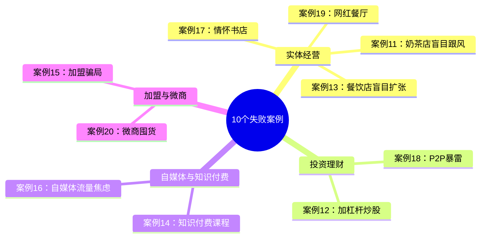
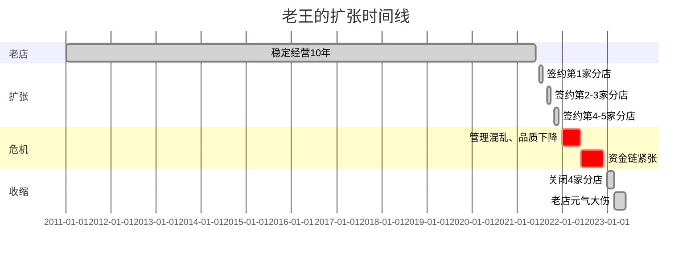
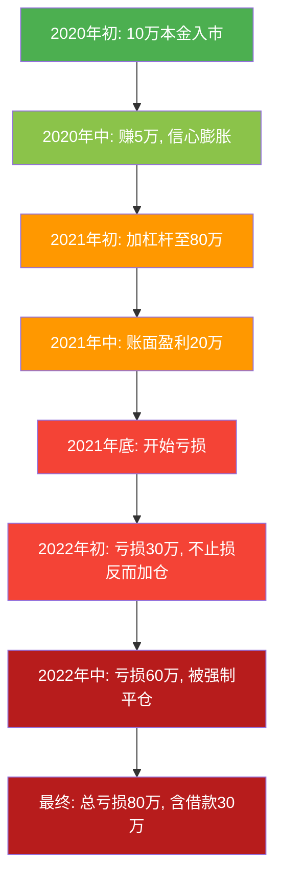

## 第二部分：10个失败搞钱案例

> 成功的故事总是相似的，失败的故事却各有各的教训。研究失败比研究成功更有价值——因为成功需要所有条件同时满足，而失败只需要一个致命错误。

### 为什么研究失败案例比成功案例更重要

很多人喜欢看成功学，觉得"照着做就能成功"。但现实是：**幸存者偏差**让成功案例天然带有误导性。你看到的是那个活下来的人，看不到同一赛道上99个倒下的人。

研究失败案例的价值在于：

1. **失败是确定性的**：成功需要天时地利人和，但失败往往只需要犯一个错
2. **失败是可复制的**：你可以精准复刻别人的失败，但很难复刻别人的成功
3. **失败是低成本的**：从别人的失败中学教训，比自己踩坑便宜得多

本节的10个失败案例涵盖四大领域：实体经营（4个）、投资理财（2个）、自媒体与知识付费（2个）、加盟与微商（2个）。每个案例都包含失败过程、根因分析、以及可操作的预防清单。



---

### 一、实体经营类失败案例

实体经营是失败率最高的搞钱方式之一。中国中小企业平均寿命仅2.5年，餐饮行业一年内倒闭率超过60%。以下四个案例覆盖了实体经营最常见的四种死法。

#### 案例11：盲目跟风开奶茶店——从"别人赚钱"到"自己亏钱"

**人物画像**：小李，90后白领，28岁，月薪1.2万，工作5年攒了30万

**背景**：小李公司楼下有一家奶茶店，每天排队。他观察了三个月，觉得"这生意太简单了，谁都能做"。于是辞职，投入全部积蓄30万加盟某奶茶品牌。

**失败过程**：

| 时间节点 | 事件 | 关键数据 |
|----------|------|----------|
| 第1个月 | 签约加盟，选址大学城 | 加盟费15万+装修8万+设备5万+首批原料2万=30万 |
| 第2个月 | 开业 | 日均流水800元 |
| 第3个月 | 尝试促销 | 日均流水1200元，但促销结束后回落 |
| 第5个月 | 发现问题 | 附近已有5家奶茶店，价格战激烈 |
| 第8个月 | 关门 | 总亏损25万，剩余5万是最后的生活费 |

**根因分析**：

**① 选择性观察偏差**
小李只看到了那家排队的奶茶店，没有看到同一商圈里已经倒闭的3家。他犯了典型的"幸存者偏差"——只看到活下来的，看不到倒下的。

**② 竞争环境误判**
大学城的奶茶市场已经饱和。5家奶茶店意味着人均消费被摊薄，而大学生的价格敏感度极高，谁便宜买谁。新品牌没有知名度，只能靠低价抢客，利润率被压缩到极限。

**③ 成本结构盲区**
小李只算了"投入多少钱"，没有算"每月固定成本多少"。他的月固定成本包括：房租1.2万+人工0.8万+原料成本（按流水40%算）+水电杂费0.2万=月固定支出约2.5万。日均流水需要达到8300元才能盈亏平衡，而他只做到了800元。

**④ 加盟陷阱**
品牌方承诺"全程扶持"，实际上只提供了开业时的3天培训和一套标准配方。选址建议、营销方案、运营指导全部缺失。

**预防清单**：

- [ ] 用"倒推法"计算盈亏平衡点：先算每月固定成本，再反推日均流水需要多少
- [ ] 实地蹲点竞争店铺，连续7天统计客流量和客单价
- [ ] 找3家以上同品牌加盟店（非品牌方推荐的）实地访谈
- [ ] 做SWOT分析：你的店相比现有竞争者有什么独特优势
- [ ] 预留至少6个月的运营资金，而不是"刚好够开店"

#### 案例13：盲目扩张的餐饮店——从"一家好店"到"五家烂店"

**人物画像**：老王，70后餐饮老板，45岁，经营一家老店10年，年利润80万

**背景**：老王的面馆在本地小有名气，经营10年积累了稳定的客源。2021年，他看到餐饮行业复苏，决定"抓住机会"一年内开5家分店。

**失败过程**：



**根因分析**：

**① 管理半径过载**
老王一个人管5家店，精力严重不足。老店的成功靠的是他本人的亲力亲为——每天凌晨4点去菜市场选食材，亲自盯后厨，跟熟客聊天。分店开了之后，他只能轮流巡店，每家店每周只能去一天。

**② 人才断层**
老王没有培养出合格的店长。分店的店长要么是临时招聘的，要么是老店的厨师提拔上来的。厨师会做菜，但不会管人、不会算账、不会处理客诉。

**③ 现金流陷阱**
5家分店的前期投入（租金押金、装修、设备、首批原料）消耗了老店多年的积累。更致命的是，分店前3个月都在亏损，需要老店的利润来"输血"。老店利润80万/年，但5家分店每月亏损合计15万，老店的利润根本填不满这个窟窿。

**④ 品质失控**
分店的厨师是新招的，做出来的味道跟老店不一样。老顾客尝了分店，觉得"味道变了"，对品牌的信任度下降。分店的差评反过来影响了老店的口碑。

**扩张的正确节奏**：

| 阶段 | 时间 | 目标 | 关键动作 |
|------|------|------|----------|
| 单店验证 | 1-2年 | 年利润稳定在50万以上 | 建立标准化SOP、培养储备店长 |
| 第2家店 | 第3年 | 复制成功模式 | 新店店长必须在老店实习6个月以上 |
| 第3家店 | 第4-5年 | 验证可复制性 | 建立中央厨房或供应链体系 |
| 批量扩张 | 第6年+ | 规模化 | 引入职业经理人、建立管理体系 |

**血泪教训**：扩张不是"多开几家店"，而是"把一家店的模式标准化后再复制"。没有标准化的扩张，就是在批量制造失败。

#### 案例17：情怀书店——当文艺理想遇上商业现实

**人物画像**：老张，70后文艺青年，48岁，前出版社编辑，热爱阅读

**背景**：老张在出版社工作了20年，一直梦想开一家"纯粹的书店"。退休后拿出积蓄60万，在写字楼区开了一家文艺书店，主打小众文学和独立出版物。

**失败过程**：
- 选址在写字楼附近，以为"白领=读书人"，实际上白领午休时间只够吃饭刷手机
- 坚持"不卖畅销书"的原则，拒绝了《三体》《人类简史》等热门书
- 店里只有书，没有咖啡、文创、活动等其他收入来源
- 月租金2万，月流水不到1万，每月净亏1.5万
- 2年后关门，亏损40万

**根因分析**：

**① 情怀与商业的错配**
老张把书店当成了"精神家园"，但书店首先是一门生意。他选择的书都是自己喜欢的，而不是市场需要的。他拒绝畅销书，等于拒绝了80%的购书人群。

**② 客群定位错误**
写字楼的白领是"效率型消费者"，他们买书会在网上买（更便宜、更方便），不会专门去实体店。真正的实体书店客群是：周末休闲的家庭、有社交需求的文艺青年、需要即时购买的冲动消费者。

**③ 盈利模式单一**
只靠卖书，毛利率只有30-40%，而租金占了营收的大部分。成功的独立书店通常有多种收入来源：

| 收入来源 | 占比 | 说明 |
|----------|------|------|
| 图书销售 | 30-40% | 核心但不是唯一 |
| 咖啡饮品 | 25-35% | 利润率高，延长停留时间 |
| 文创产品 | 15-20% | 毛利率60%以上 |
| 活动场地 | 10-15% | 读书会、签售会、分享会 |
| 会员年费 | 5-10% | 稳定现金流 |

**情怀型创业的生存法则**：
1. 情怀可以是起点，但商业逻辑必须是底层
2. 先算清楚"活下去需要多少钱"，再谈"我想做什么"
3. 找到情怀与市场的交集，而不是只取情怀
4. 至少有2-3个收入来源，不要把鸡蛋放在一个篮子里

#### 案例19：网红餐饮的昙花一现——流量来了又走，留下的只有债务

**人物画像**：小陈，90后创业者，29岁，之前做过3年餐饮营销

**背景**：小陈看到"网红餐厅"的流量红利，投入100万装修了一家"打卡型"餐厅——粉色ins风装修、巨型花墙、创意摆盘。开业初期靠小红书和抖音营销，确实火了。

**失败过程**：

| 阶段 | 时间 | 日流水 | 关键事件 |
|------|------|--------|----------|
| 蜜月期 | 第1-2周 | 3-5万 | 小红书探店笔记爆发，排队2小时 |
| 平稳期 | 第3-8周 | 1-2万 | 热度逐渐消退 |
| 衰退期 | 第2-6月 | 5000-8000 | 差评增多："好看不好吃""性价比低" |
| 勉强期 | 第6-12月 | 3000-5000 | 靠打折维持，利润率接近0 |
| 关门 | 第12个月 | - | 累计亏损70万 |

**根因分析**：

**① 把"打卡"当"复购"**
网红餐厅的流量本质上是"一次性打卡流量"。客户来拍照发朋友圈，任务就完成了，不会再来第二次。小陈需要的是"复购型客户"，但他的产品和服务留不住人。

**② 成本结构倒挂**
100万的装修投入，意味着每月折旧约3万（按3年折旧）。加上租金、人工、原料，月固定成本超过8万。而月流水从高峰期的10万跌到后期的5万，根本覆盖不了成本。

**③ 产品力缺失**
小陈把90%的精力放在了"怎么让餐厅好看"上，只有10%放在"怎么让菜好吃"上。网红餐厅的核心竞争力应该是：好看+好吃，而不是只有好看。

**网红餐饮的正确打法**：
1. 装修投入不超过总预算的30%，把大头留给产品研发
2. 设计1-2个"记忆点菜品"（好吃+好看+有话题性）
3. 从开业第一天就建立会员体系，把打卡客户转化为复购客户
4. 预留营销预算，但营销节奏要"脉冲式"而非"持续烧钱"

---

### 二、投资理财类失败案例

投资理财的失败往往比实体经营更惨烈——因为杠杆会放大损失，而且很多投资者根本不理解自己在买什么。

#### 案例12：加杠杆炒股爆仓——从"小赚"到"血亏80万"

**人物画像**：老刘，85后程序员，32岁，年薪40万，有一定积蓄

**背景**：2020年A股牛市初期，老刘用10万本金入市，赚了5万。信心膨胀后，他开始使用融资融券（1:1杠杆），本金+借款共计80万投入股市。

**失败过程**：



**根因分析**：

**① 把运气当能力**
2020年牛市，闭着眼睛买都能赚。老刘把市场给的β收益当成了自己的α能力，这是最危险的认知错误。

**② 杠杆的数学陷阱**
杠杆的本质是：放大收益的同时放大风险。1:1杠杆意味着：
- 股票涨20%，你的收益是40%（看起来很爽）
- 股票跌20%，你的亏损是40%（实际更常见）
- 股票跌50%，你的本金归零（被强制平仓）

更残酷的是：亏损50%后，需要涨100%才能回本。杠杆让"回本"变得极其困难。

**③ 沉没成本谬误**
亏损30万时，老刘想的是"已经亏了这么多，不能卖，卖了就真亏了"。这是典型的沉没成本谬误——过去的亏损不应该影响未来的决策。

**④ 借钱投资是大忌**
用借来的钱投资，意味着你在用"输不起的钱"赌博。当市场下跌时，你不仅要承受投资亏损，还要承担借款的利息和还款压力，双重压力下更容易做出错误决策。

**投资纪律清单**：

| 规则 | 说明 | 老刘违反了吗 |
|------|------|-------------|
| 永远不用杠杆 | 除非你是专业机构 | ✓ 用了1:1杠杆 |
| 不借钱投资 | 只用闲钱 | ✓ 借了30万 |
| 单只股票不超过总仓位20% | 分散风险 | ✗ 可能集中持仓 |
| 设定止损线（如-15%） | 到了就卖，不犹豫 | ✓ 亏损时不止损反而加仓 |
| 不把运气当能力 | 赚钱时想想"是不是市场给的" | ✓ 牛市赚钱后膨胀 |

#### 案例18：P2P投资的血本无归——高收益背后的庞氏骗局

**人物画像**：老赵，60后退休工人，55岁，积蓄80万，期望"稳健增值"

**背景**：老赵退休后，想让积蓄"钱生钱"。银行理财收益太低（3-4%），朋友推荐了一家P2P平台，年化收益12%。老赵投入全部积蓄80万。

**失败过程**：
- 第1年：按时收到利息，约9.6万，老赵非常满意
- 第2年：继续投资，本息合计约100万，更加信任平台
- 第3年：平台突然暴雷，网站打不开，客服失联
- 最终：本金全部损失，晚年生活陷入困境

**根因分析**：

**① 不理解"收益与风险成正比"**
银行理财3-4%是因为底层资产是国债、银行存款等低风险资产。P2P给12%，意味着底层资产的风险至少是银行理财的3倍以上。更高的收益（如18%、24%）意味着更高的违约概率。

**② 不理解资金池模式**
很多P2P平台的真实模式是：用新投资人的钱支付老投资人的利息。这就是庞氏骗局——只要新钱进来的速度够快，就能维持；一旦新钱减速，立刻崩盘。

**③ 全部身家投入单一平台**
80万全部放在一个平台，没有任何分散。即使P2P行业整体是正规的（实际上大部分不正规），单一平台的风险也极高。

**④ 被"按时付息"麻痹**
前两年按时收到利息，让老赵放松了警惕。但实际上，庞氏骗局在崩盘前都能"按时付息"——这恰恰是最危险的信号。

**投资安全的基本原则**：

1. **不懂的东西不投**：如果我说不清楚这个产品的底层资产是什么、风险从哪里来，我就不应该投
2. **高收益要问"为什么"**：如果一个产品给的收益明显高于市场平均水平，一定要问"这个超额收益从哪里来"
3. **分散是免费的午餐**：不同资产类别、不同平台、不同期限的分散，可以在不降低预期收益的情况下降低风险
4. **永远保留6个月生活费的流动资金**：这部分钱只能放在银行活期或货币基金里，不能做任何有风险的投资

---

### 三、自媒体与知识付费类失败案例

自媒体和知识付费是近年来最热门的"副业"选择，但大多数人在这两个领域的收入远低于预期。

#### 案例14：知识付费课程的失败——承诺太多，交付太少

**人物画像**：小周，90后自媒体人，27岁，某平台10万粉丝

**背景**：小周靠写"副业赚钱"相关的文章积累了10万粉丝。他觉得"教人赚钱"本身就能赚钱，于是推出了一门999元的课程《普通人副业赚钱实战课》。

**失败过程**：
- 投入3万做营销推广，首期招收了200人，收入约20万
- 课程上线后，学员反馈极差：内容空洞、案例过时、缺乏实操指导
- 退款率高达30%，约60人申请退款
- 口碑崩塌，社交媒体上出现大量差评
- 后续课程无人购买，自媒体账号也掉粉严重

**根因分析**：

**① 过度承诺，交付不足**
课程宣传页写着"学完月入过万""普通人也能逆袭"，但实际课程内容只是一些通用的方法论，没有任何可落地的实操步骤。学员花999元买到的，和免费文章里的内容差不多。

**② 把粉丝当"韭菜"**
小周把粉丝当成了"变现资源"，而不是"信任我的人"。他没有想过：粉丝买课是因为信任我，如果课程不好，我伤害的是自己的信誉。

**③ 不懂课程设计**
好的课程需要：明确的学习目标、循序渐进的内容结构、可操作的作业和反馈、持续的社群支持。小周的课程只有一堆录播视频，没有作业、没有答疑、没有社群。

**④ 定价策略错误**
999元的课程，意味着学员的期望值很高。他们期望的是"改变人生"级别的内容，而小周交付的只是"了解一下"级别的内容。价格与价值的巨大落差导致了极高的退款率。

**知识付费的正确做法**：

| 环节 | 错误做法 | 正确做法 |
|------|----------|----------|
| 定价 | 直接定高价 | 先做免费内容验证需求，再做低价产品（99-199元），最后做高价产品 |
| 内容 | 网上拼凑 | 基于自己的真实经验，提供可复制的方法论 |
| 交付 | 只有录播视频 | 视频+作业+答疑+社群的完整体系 |
| 营销 | 夸大承诺 | 如实描述，管理预期 |
| 售后 | 卖完就不管 | 持续运营社群，收集反馈迭代 |

#### 案例16：自媒体的流量焦虑——辞职全职做自媒体，半年只赚5000元

**人物画像**：小王，95后，24岁，月薪8000元的普通上班族

**背景**：小王看到很多博主"月入10万"的分享，心动了。他没有任何粉丝基础，直接辞职全职做自媒体，平台选择了抖音和小红书。

**失败过程**：
- 第1个月：每天发3条视频，追热点、模仿爆款，粉丝涨了500
- 第3个月：粉丝2000，开始接广告，一条广告200元
- 第6个月：粉丝5000，累计收入5000元，月均不到1000元
- 心态崩溃，放弃自媒体，重新找工作

**根因分析**：

**① 没有副业验证就辞职**
小王犯了最致命的错误：在副业收入为零的时候辞职。正确的做法是：先兼职做，等到副业收入稳定超过主业收入的50%以上，再考虑辞职。

**② 期望值管理失败**
"月入10万"的博主是极少数的幸存者。抖音上有超过2000万创作者，月入10万以上的不到0.1%。大多数创作者的月收入在1000元以下。

**③ 没有差异化定位**
小王追热点、模仿爆款，内容没有自己的特色。在信息过载的时代，没有差异化的内容等于没有内容。

**④ 变现路径不清晰**
小王只想着"涨粉"，没有想清楚"粉丝涨起来之后怎么变现"。自媒体的变现方式有广告、带货、知识付费、私域运营等，每种方式需要的粉丝画像和内容策略都不同。

**自媒体创业的安全路径**：

```text
阶段1：兼职试水（3-6个月）
├── 每天投入2小时
├── 找到自己的差异化定位
├── 验证内容方向是否有市场需求
└── 积累前1000个粉丝

阶段2：副业增长（6-12个月）
├── 形成稳定的内容生产节奏
├── 探索变现路径
├── 副业收入达到主业的30-50%
└── 建立自己的内容方法论

阶段3：全职转型（条件成熟时）
├── 副业收入稳定超过主业收入50%
├── 有至少6个月的生活费储备
├── 有清晰的商业模式和增长路径
└── 有应对收入波动的心理准备
```

---

### 四、加盟与微商类失败案例

加盟和微商是两种常见的"轻创业"方式，但也是骗局和坑最多的领域。

#### 案例15：加盟骗局的受害者——50万买了一个"3个月回本"的谎言

**人物画像**：小美，80后宝妈，34岁，全职带娃3年后想创业

**背景**：小美在某母婴展会上看到一个儿童教育品牌的加盟广告，宣传"3个月回本""全程扶持""0经验也能做"。品牌方安排了"成功加盟商"现身说法，现场签约还能减免5万加盟费。

**失败过程**：
- 签约缴纳加盟费20万+保证金5万+首批物料10万+装修15万=50万
- 选址时发现品牌方推荐的位置租金远高于市场价
- 开业后发现品牌方的"全程扶持"只是发了一本运营手册
- 招生困难，3个月只招到15个学生，远低于品牌方承诺的"每月50人"
- 半年后关门，50万全部打水漂，其中20万是向亲戚借的

**根因分析**：

**① 没有独立验证品牌方的说法**
品牌方说"3个月回本"，小美没有去验证。正确的做法是：找到至少5家非品牌方推荐的加盟店，亲自去实地考察，跟店主私下聊天，了解真实的经营数据。

**② 合同陷阱**
加盟合同里有很多对加盟商不利的条款：
- 加盟费不退，即使品牌方违约
- 物料必须从品牌方采购，价格是市场价的2-3倍
- 选址必须用品牌方推荐的（实际上品牌方跟地产商有回扣协议）
- 保证金的退还条件极其苛刻

**③ "成功案例"是安排好的**
展会上现身说法的"成功加盟商"，很可能是品牌方花钱请的托，或者是品牌方直营店的店长。真正赚钱的加盟商不会到处分享经验——他们忙着赚钱。

**④ 宝妈群体的特殊风险**
宝妈群体是加盟骗局的主要目标，因为：
- 长时间脱离职场，急于证明自己
- 社交圈相对封闭，信息获取渠道有限
- 对"低门槛、高回报"的项目特别敏感
- 决策时容易被情感驱动而非理性分析

**加盟防骗清单**：

- [ ] 找到至少5家非品牌方推荐的加盟店，实地考察
- [ ] 跟至少3个加盟商私下聊天，了解真实数据
- [ ] 请律师审查加盟合同，特别注意退款条款、竞业限制、物料采购
- [ ] 计算真实的盈亏平衡点，而不是相信品牌方的"预估数据"
- [ ] 不要在展会现场签约，给自己至少1个月的冷静期
- [ ] 在"国家企业信用信息公示系统"查询品牌方的注册信息、诉讼记录
- [ ] 警惕"3个月回本""0经验也能做""全程扶持"等话术

#### 案例20：微商囤货的惨痛教训——5万囤货，3万打水漂

**人物画像**：小林，90后宝妈，31岁，全职带娃，朋友圈有500人

**背景**：小林被朋友拉入某微商品牌，品牌宣传"月入10万""宝妈逆袭"。小林投入5万囤了一批面膜和保健品，开始在朋友圈卖货。

**失败过程**：
- 第1周：在朋友圈刷屏发广告，每天5-10条
- 第2周：被10多个朋友屏蔽或删除
- 第1个月：只卖出去3单，收入800元
- 第3个月：产品砸在手里，亏了3万，还得罪了朋友
- 被拉黑后，连那个"朋友"也不联系了

**根因分析**：

**① 微商模式的本质问题**
大多数微商的商业模式是：发展下级代理→让代理囤货→品牌方赚的是代理的钱，而不是消费者的钱。小林以为自己是"销售者"，实际上她是"消费者"——她买了5万的货，品牌方已经赚到了。

**② 社交关系的不可逆损耗**
朋友圈卖货的本质是：用社交信任换取商业利益。一旦朋友觉得你在"割韭菜"，这种信任损失是不可逆的。你失去的不只是一个客户，而是一段关系。

**③ 没有先测试市场**
小林没有先小规模测试市场反应，直接囤了5万的货。正确的做法是：先拿少量样品，看朋友圈的真实反馈，如果真的有人愿意买，再考虑加大投入。

**④ 产品质量存疑**
很多微商品牌的产品没有正规的生产资质，质量无法保证。小林卖的面膜和保健品，连她自己都不敢用。

**微商/社交电商的正确做法**：

1. **永远不要囤货**：真正的社交电商应该是"代发"模式，不需要自己压货
2. **先卖自己用过的产品**：只有自己真正认可的产品，才推荐给朋友
3. **控制广告频率**：朋友圈每天最多1条产品相关的内容，其他内容应该是生活分享
4. **保护社交关系**：如果朋友明确表示不感兴趣，永远不要再推销
5. **算清楚账**：囤货模式下，你的成本不只是货款，还有时间成本、社交成本、机会成本

---

### 五、10个失败案例的全景复盘

#### 失败模式的六大共性

通过分析这10个案例，可以提炼出失败的六大共性模式：

| 共性模式 | 涉及案例 | 核心问题 | 预防方法 |
|----------|----------|----------|----------|
| 信息不对称 | 11、15、18、20 | 不了解真实市场情况，被虚假信息误导 | 独立调研，不轻信任何单方面信息 |
| 过度自信 | 12、13、16 | 把运气当能力，高估自己的能力 | 保持谦逊，设定止损线 |
| 情怀驱动 | 14、17、19 | 用情怀代替商业逻辑 | 先算清楚商业账，再谈情怀 |
| 资金管理失误 | 11、12、13、18 | 要么投入太多，要么没有留够安全垫 | 永远保留6个月的生活费 |
| 缺乏验证 | 11、14、15、16、20 | 没有小规模测试就All In | 先兼职验证，再全职投入 |
| 社交透支 | 14、16、20 | 用社交关系变现，伤害长期价值 | 保护社交关系，不要透支信任 |

#### 决策前的"灵魂五问"

在做任何搞钱决策之前，先问自己这五个问题：

```text
1. 我真的了解这个领域吗？
   → 如果答案是"不太了解"，先花3个月深入学习

2. 我能承受最坏的结果吗？
   → 如果亏损全部投入，我的生活会受到多大影响？

3. 我有没有先小规模验证？
   → 如果没有，先用最小成本做测试

4. 我的信息来源可靠吗？
   → 是独立调研的，还是别人告诉我的？

5. 我是在用理性还是情感做决策？
   → 是"我觉得"还是"数据显示"？
```

#### 不同风险承受能力的搞钱策略

| 风险等级 | 适合人群 | 推荐策略 | 不推荐策略 |
|----------|----------|----------|------------|
| 极低风险 | 退休人员、收入不稳定者 | 银行理财、货币基金、国债 | 任何创业、股票、基金 |
| 低风险 | 在职人员、有稳定收入 | 副业试水、指数基金定投 | 全职创业、加杠杆投资 |
| 中风险 | 有一定积蓄和经验者 | 兼职创业、分散投资 | All In单一项目 |
| 高风险 | 年轻、有退路、有经验者 | 全职创业、风险投资 | 借钱投资、孤注一掷 |

#### 从失败中学习的框架


学习失败不是为了恐惧，而是为了更聪明地行动。每一次失败都是一面镜子，照出我们认知的盲区和决策的漏洞。把这些教训内化为自己的决策框架，才是研究失败案例的真正价值。

> 最后一句话：搞钱的路上，少犯一个致命错误，比多抓住一个机会更重要。因为机会错过了还有下一个，但致命错误可能让你永远失去上场的资格。

***
