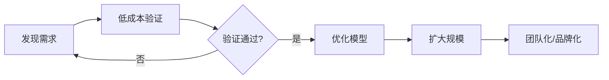
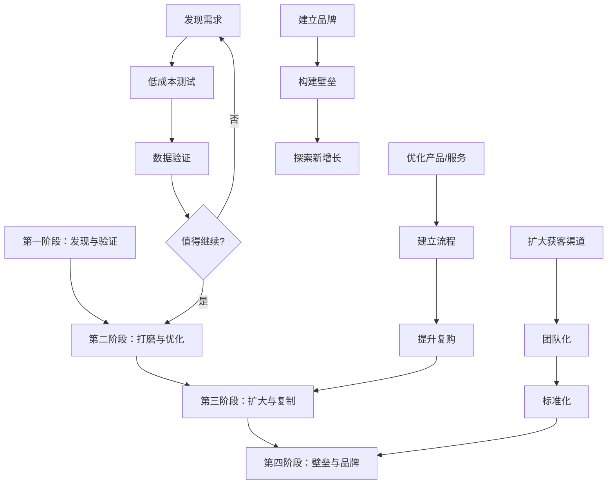

## 案例总结：20个案例背后的搞钱规律

20个案例，10条成功路径，10段失败教训。表面上看，每个案例都是独特的个体故事；但当我们把它们放在一起交叉分析，会发现搞钱这件事存在清晰的底层规律——成功的案例反复验证同几条原则，失败的案例则反复踩中同几个陷阱。

本章将从三个维度进行系统总结：成功者的共性规律、失败者的共性陷阱、以及可直接复用的行动框架。

***

### 一、成功案例的共性规律

把10个成功案例拆解后，提炼出五条反复出现的规律。这不是"正确的废话"，而是每个案例中都能找到对应证据的实证结论。

#### 1.1 起点：从真实需求出发，而非从"我想赚钱"出发

| 案例 | 起点需求 | 验证方式 |
|------|----------|----------|
| 小红书家居博主 | 朋友经常问装修建议 | 业余时间发内容，看互动数据 |
| 社区团购宝妈 | 疫情期间邻居买不到菜 | 帮忙团购，发现复购需求 |
| 外卖骑手转型 | 发现骑手管理有痛点 | 亲自送外卖2年，深入了解行业 |
| 农民短视频带货 | 展示农村生活意外走红 | 自然流量验证需求存在 |
| 健身教练线上转型 | 疫情期间线下无法开课 | 直播试水，看观众留存 |

**规律**：成功的搞钱者，起点都是"我发现了某个具体问题/需求"，而不是"我想搞钱所以选个项目"。前者有明确的用户和场景，后者只有模糊的方向。

**实操检验法**：在正式投入之前，问自己三个问题：

1. 我能用一句话说清"谁会为此付费"吗？（目标用户是否具体）
2. 这个需求是"止痛药"还是"维生素"？（刚需 vs 伪需求）
3. 我有没有低成本的方式先验证？（是否需要大量前期投入才能测试）

如果三个问题中有两个答不上来，说明需求还没想清楚，不要急着投入。

#### 1.2 路径：先小后大，逐步验证升级

成功的搞钱者几乎都遵循同一个节奏：**小规模验证 → 优化模型 → 规模化扩张**。

具体来看每个案例的验证节奏：

| 案例 | 验证阶段 | 投入成本 | 验证周期 | 规模化时机 |
|------|----------|----------|----------|------------|
| 小红书家居博主 | 业余发内容3个月 | 0元 | 3个月 | 涨粉5万后接广告 |
| AI工具创业 | 开发MVP上线 | 3个月时间 | 1个月 | 200付费用户后融资 |
| 社区团购 | 帮邻居团购蔬菜 | 0元 | 2个月 | 建群500人后扩展 |
| 跨境电商 | 速卖通代发测试 | 5000元 | 6个月 | 月利润稳定后全职 |
| 知识付费老师 | 抖音发解题视频 | 0元 | 6个月 | 50万粉后开课 |
| Excel培训 | B站发教程 | 0元 | 12个月 | 5万粉后推付费课 |
| 设计师IP周边 | 微博发原创IP | 0元 | 12个月 | 10万粉后众筹 |
| 配送站老板 | 送外卖2年 | 0元 | 24个月 | 借钱承包站点 |

**关键发现**：8个成功案例中，有6个的验证阶段投入成本接近0元，验证周期在1-12个月不等。这意味着——**搞钱不需要先投入大笔资金，但需要投入时间和注意力去做验证**。

#### 1.3 壁垒：从"我会"到"我比别人强"

会做某件事只是起点，不是壁垒。成功案例中的搞钱者都在验证可行后，迅速构建自己的竞争壁垒：

- **专业壁垒**：小红书博主的设计师背景、退休教师的30年教学经验、健身教练的专业认证——这些不是短期内能复制的
- **数据壁垒**：跨境电商用数据分析选品、社区团购积累的用户购买数据——越做越懂用户
- **关系壁垒**：配送站老板与骑手的信任关系、社区团购与供应商的长期合作——人脉是护城河
- **内容壁垒**：知识付费老师的课程体系、设计师的IP形象库——积累越久价值越高
- **品牌壁垒**：农民打造的区域农产品品牌、Excel培训师的个人品牌——品牌溢价随时间增长

**没有壁垒的搞钱方式**，本质上是在用时间换钱，一旦停下来收入就归零。有壁垒的搞钱方式，前期投入大但后期收益会指数增长。

#### 1.4 节奏：踩准时机窗口

10个成功案例中，有7个明确提到了"时机"因素：

| 案例 | 时机窗口 | 具体描述 |
|------|----------|----------|
| AI工具创业 | AI行业爆发期 | 2022年底ChatGPT引爆市场，早期入场享受红利 |
| 社区团购 | 疫情期间 | 居家隔离催生社区团购需求 |
| 跨境电商 | TikTok Shop开放 | 新平台早期流量红利 |
| 知识付费老师 | 短视频爆发期 | 抖音快速涨粉窗口 |
| 健身教练 | 疫情期间 | 线下健身关闭，线上需求爆发 |
| 农民短视频 | 短视频下沉期 | 三四线城市和农村用户涌入 |
| 设计师IP周边 | 盲盒/潮玩热潮 | 年轻人消费新趋势 |

**时机不是运气，是认知**。这些人之所以能抓住时机，是因为他们已经在相关领域有积累，当机会出现时能立刻识别并行动。没有任何积累的人，即使机会摆在面前也看不到。

#### 1.5 心态：长期主义，拒绝速成

成功案例的时间线揭示了一个反直觉的事实：**没有一个成功案例是"速成"的**。

| 案例 | 起步到稳定盈利 | 起步到年入百万 |
|------|----------------|----------------|
| 小红书家居博主 | 12个月 | 24个月 |
| AI工具创业 | 6个月 | 18个月 |
| 社区团购 | 12个月 | 24个月 |
| 跨境电商 | 12个月 | 36个月 |
| 知识付费老师 | 18个月 | 24个月 |
| 外卖骑手转型 | 24个月 | 36个月 |
| 健身教练 | 12个月 | 36个月 |
| Excel培训 | 18个月 | 48个月 |

最短的是AI工具创业（6个月），但这背后是程序员多年的编程积累。**所有"快速成功"的背后，都有长期的能力积累**。

***

### 二、失败案例的共性陷阱

10个失败案例，本质上踩中了6个陷阱。理解这些陷阱，比学习成功经验更重要——因为成功需要多种因素配合，但失败只需要一个致命错误。

#### 2.1 六大致命陷阱

**陷阱一：需求幻觉——把"我觉得"当成"市场需要"**

| 失败案例 | 幻觉表现 | 真实情况 |
|----------|----------|----------|
| 盲目开奶茶店 | "奶茶店都排队，肯定赚钱" | 附近已有5家，市场饱和 |
| 实体书店 | "大家都需要好书" | 目标客群太小，无法支撑租金 |
| 网红餐饮 | "装修好看就能火" | 产品一般，复购率极低 |
| 知识付费课程 | "我有粉丝就能卖课" | 课程质量差，退款率30% |

**检验方法**：在投入之前，找到10个目标用户做深度访谈。如果其中少于7个人表示"愿意现在就付费"，说明需求强度不够。

**陷阱二：成本失控——只算收入，不算成本**

失败案例中，几乎所有人都低估了成本、高估了收入：

- 奶茶店：只看到别人日流水多少，没算租金、人工、原料、损耗
- 网红餐饮：100万装修，3个月热度就消退，投资回报周期远超预期
- 加盟骗局：50万加盟费+装修费，还没开业就已经亏了一大半
- 微商囤货：5万囤货，卖不出去就是纯亏损

**成本控制原则**：

| 成本类型 | 常见遗漏 | 建议做法 |
|----------|----------|----------|
| 固定成本 | 租金、设备折旧、基础人工 | 先用最小规模验证 |
| 变动成本 | 原料损耗、营销费用、退款 | 按最坏情况估算 |
| 隐性成本 | 时间成本、机会成本、社交成本 | 算入总投入 |
| 储备资金 | 现金流断裂风险 | 至少留6个月运营资金 |

**陷阱三：杠杆过载——借钱投资，放大风险**

案例12（加杠杆炒股）和案例18（P2P投资）的共同点：**用借来的钱或全部积蓄去博高收益**。

杠杆的数学本质：假设你有10万本金，加1倍杠杆变成20万投资。如果涨10%，你赚2万，收益率20%，看起来很美。但如果跌10%，你亏2万，收益率-20%。如果跌50%，你亏10万，本金归零，还要倒贴——这就是"爆仓"。

**铁律**：

1. 投资的钱必须是"亏完也不影响生活"的钱
2. 永远不要借钱投资高风险资产
3. 单一投资不超过总资产的20%
4. 不懂的东西不要投，别人说再赚钱也不要投

**陷阱四：扩张过快——管理能力跟不上**

案例13（餐饮盲目扩张）和案例19（网红餐饮）说明：**生意能做起来不等于能做大**。

扩张需要三个前提同时满足：

1. **管理能力**：有没有成熟的管理体系和人才梯队
2. **现金流**：扩张期必然消耗现金，有没有足够的储备
3. **品质保证**：规模扩大后，能不能保证产品/服务品质不下降

三条缺任何一条，扩张就是赌博。

**陷阱五：社交透支——把朋友当客户**

案例20（微商囤货）是最典型的社交透支：

- 在朋友圈刷屏卖货 → 被屏蔽
- 朋友碍于面子买了 → 体验不好 → 连朋友都没了
- 产品卖不出去 → 囤货砸手里 → 钱也亏了，关系也断了

**社交变现的正确方式**：先提供价值（分享有用的内容、帮助解决问题），建立专业形象后，有需求的人会主动找你。而不是反过来——主动推销。

**陷阱六：过早全职——没验证就All in**

案例16（自媒体流量焦虑）的教训：辞职前没有任何积累，就全职做自媒体，结果半年只赚了5000元。

**正确的全职时机**：

| 条件 | 最低标准 |
|------|----------|
| 副业月收入 | ≥ 主业月收入的80% |
| 持续时间 | ≥ 6个月稳定 |
| 储备资金 | ≥ 12个月生活费 |
| 增长趋势 | 向上，而非持平或下降 |

四个条件必须同时满足。很多人的错误是只看其中一个（比如"副业收入已经超过主业了"），就急着辞职。

***

### 三、成功与失败的对比分析

将成功和失败案例放在一起对比，规律更加清晰：

| 维度 | 成功者做法 | 失败者做法 |
|------|-----------|-----------|
| **起点** | 从真实需求出发，低成本验证 | 从"想赚钱"出发，大笔投入 |
| **调研** | 深入了解行业和用户 | 看别人赚钱就跟风 |
| **投入** | 先小后大，边做边学 | 一次性大投入，赌一把 |
| **竞争** | 找到差异化定位 | 同质化竞争，拼价格 |
| **杠杆** | 量力而行，留有余地 | 借钱投资，不留后路 |
| **扩张** | 管理跟上后再扩张 | 先扩张再说 |
| **心态** | 长期主义，接受缓慢增长 | 速成心态，期望暴富 |
| **社交** | 提供价值建立信任 | 透支关系卖货 |
| **全职** | 副业验证后再全职 | 未验证就辞职 |
| **产品** | 重产品质量和服务 | 重营销包装 |

这张表值得打印出来贴在墙上。每次要做重大决策时，对照左边和右边，看看自己站在哪一边。

***

### 四、可复用的搞钱行动框架

基于20个案例的分析，提炼出一套可复用的行动框架。这套框架不保证成功，但能帮你避开最常见的坑。

#### 4.1 四阶段行动模型

#### 4.2 各阶段核心动作

**第一阶段：发现与验证（1-6个月）**

| 步骤 | 具体动作 | 判断标准 |
|------|----------|----------|
| 发现需求 | 观察身边人的痛点，列出10个方向 | 每个方向能说清"谁会付费" |
| 筛选评估 | 用"止痛药测试"筛选到2-3个 | 必须是刚需，不是可有可无 |
| 低成本测试 | 用最小成本验证（0-5000元） | 有人愿意付费，哪怕只有1个 |
| 数据验证 | 收集定量数据（转化率、复购意愿） | 转化率 > 5%，复购意愿 > 30% |

**第二阶段：打磨与优化（3-12个月）**

| 步骤 | 具体动作 | 判断标准 |
|------|----------|----------|
| 产品迭代 | 根据用户反馈持续改进 | 用户满意度 > 80% |
| 流程建立 | 把服务流程标准化、可复制 | 新人能在2周内上手 |
| 复购提升 | 建立客户关系管理机制 | 复购率 > 40% |
| 成本优化 | 砍掉不必要的开支 | 毛利率 > 50% |

**第三阶段：扩大与复制（6-24个月）**

| 步骤 | 具体动作 | 判断标准 |
|------|----------|----------|
| 渠道扩展 | 从单渠道到多渠道获客 | 每个新渠道ROI > 2 |
| 团队建设 | 招人分担核心工作 | 人效不低于自己80% |
| 标准化 | 建立SOP，降低对个人依赖 | 团队能独立运转 |
| 现金流管理 | 确保账上至少6个月运营资金 | 现金流为正 |

**第四阶段：壁垒与品牌（12个月+）**

| 步骤 | 具体动作 | 判断标准 |
|------|----------|----------|
| 品牌建设 | 从"卖产品"到"卖品牌" | 品牌溢价 > 20% |
| 壁垒构建 | 积累数据、关系、内容等护城河 | 新竞争者至少需要1年才能追上 |
| 新增长探索 | 在现有基础上探索第二曲线 | 新业务与核心业务有协同效应 |

#### 4.3 搞钱决策检查清单

每次做重大投入决策前，用这个清单过一遍：

- [ ] 我能用一句话说清目标用户是谁吗？
- [ ] 我有没有用低成本方式验证过这个需求？
- [ ] 我的投入资金是"亏完也不影响生活"的钱吗？
- [ ] 我有没有留至少6个月的运营储备金？
- [ ] 我的差异化是什么？别人为什么要选我？
- [ ] 如果最坏情况发生，我的损失是什么？能承受吗？
- [ ] 我有没有在相关领域有足够的积累？
- [ ] 我是被真实数据说服的，还是被别人的故事说服的？

8个问题中，如果有3个以上答"否"或"不确定"，建议暂缓行动，先解决不确定性。

***

### 五、案例数据全景

将20个案例的关键数据汇总，从数据角度再看一遍规律：

#### 5.1 成功案例数据

| 案例 | 启动资金 | 验证周期 | 月收入峰值 | 核心壁垒 |
|------|----------|----------|------------|----------|
| 小红书家居博主 | 0元 | 3个月 | 8万+ | 专业背景+粉丝基础 |
| AI工具创业 | 3个月时间 | 1个月 | 50万+ | 技术壁垒+先发优势 |
| 社区团购 | 0元 | 2个月 | 4万+ | 私域关系+供应链 |
| 跨境电商 | 5000元 | 6个月 | 16万+ | 数据能力+多平台 |
| 知识付费老师 | 0元 | 6个月 | 16万+ | 30年经验+人格魅力 |
| 配送站老板 | 借款启动 | 24个月 | 10万+ | 行业经验+管理能力 |
| 设计师IP周边 | 0元 | 12个月 | 25万+ | 原创IP+粉丝运营 |
| 健身教练 | 0元 | 6个月 | 16万+ | 专业能力+社群 |
| 农民短视频 | 0元 | 12个月 | 66万+ | 源头优势+真实性 |
| Excel培训 | 0元 | 12个月 | 16万+ | 实战经验+口碑 |

#### 5.2 失败案例数据

| 案例 | 投入资金 | 持续时间 | 总亏损 | 核心错误 |
|------|----------|----------|--------|----------|
| 盲目开奶茶店 | 30万 | 8个月 | 25万 | 市场调研不足 |
| 加杠杆炒股 | 50万本金+30万借款 | 18个月 | 80万 | 杠杆+借钱 |
| 盲目扩张餐饮 | 未披露 | 24个月 | 未披露 | 扩张过快 |
| 知识付费失败 | 营销投入 | 6个月 | 未披露 | 内容注水 |
| 加盟骗局 | 50万 | 6个月 | 50万 | 轻信承诺 |
| 自媒体焦虑 | 生活费 | 6个月 | 5000+机会成本 | 未验证就全职 |
| 实体书店 | 60万 | 24个月 | 40万 | 情怀大于商业 |
| P2P投资 | 80万 | 24个月 | 80万 | 贪图高收益 |
| 网红餐饮 | 100万 | 12个月 | 70万 | 重营销轻产品 |
| 微商囤货 | 5万 | 6个月 | 3万+社交关系 | 盲目囤货 |

**数据对比**：失败案例的平均投入（约45万）远高于成功案例的启动成本（多数在5000元以内）。这不是巧合——**低成本验证本身就是最重要的风险控制手段**。

***

### 六、不同人群的搞钱路径建议

根据20个案例的经验，针对不同人群给出差异化建议：

#### 6.1 有专业技能的人（程序员、设计师、教师、财务等）

**参考成功案例**：案例2（AI工具）、案例1（家居博主）、案例10（Excel培训）

**推荐路径**：

1. 在内容平台分享专业知识，积累粉丝和信任
2. 从免费内容到付费咨询/课程，验证变现能力
3. 产品化：把服务变成可规模化的产品（课程、工具、模板）
4. 品牌化：建立个人品牌，提升溢价

**核心优势**：专业能力是天然壁垒，内容生产成本低。

#### 6.2 有本地资源的人（宝妈、社区居民、农村从业者）

**参考成功案例**：案例3（社区团购）、案例9（农民带货）

**推荐路径**：

1. 从身边需求出发，服务好一个小圈子
2. 建立私域（微信群、小程序），提高复购
3. 整合本地资源，扩大服务范围
4. 品牌化，提升溢价空间

**核心优势**：信任关系是天然壁垒，获客成本极低。

#### 6.3 有一线经验的人（骑手、服务员、销售等）

**参考成功案例**：案例6（配送站老板）

**推荐路径**：

1. 在一线积累行业认知和人脉
2. 发现行业痛点和机会
3. 从执行者转变为管理者/经营者
4. 用管理能力而非体力赚钱

**核心优势**：对行业的理解是外行人无法复制的。

#### 6.4 想做副业的上班族

**参考所有成功案例的起步阶段**

**推荐路径**：

1. 不要辞职，先用业余时间做
2. 选择启动成本低、时间灵活的方向（内容创作、知识付费、技能服务）
3. 副业收入稳定超过主业80%且持续6个月后，再考虑全职
4. 全职前留足12个月生活费

**核心原则**：副业验证是最低成本的创业方式。

***

### 七、写在最后：搞钱的本质

20个案例看下来，搞钱的本质可以用一句话概括：**发现一个真实需求，用你的能力去满足它，持续做得比别人好**。

成功没有捷径，但有方法：

- 从需求出发，不从"想赚钱"出发
- 先验证后投入，不盲目All in
- 构建壁垒，不做没有积累的事
- 控制风险，不借钱不加杠杆
- 长期主义，不追求速成

失败也并非偶然，背后有清晰的因果：

- 需求幻觉导致方向错误
- 成本失控导致现金流断裂
- 杠杆过载导致满盘皆输
- 扩张过快导致品质崩塌
- 速成心态导致半途而废

最后提醒一句：**案例是用来学习思维方式的，不是用来复制路径的**。每个人的资源、能力、环境都不同，照搬别人的路径大概率失败。真正该学的是——他们是如何思考问题的、如何做决策的、如何控制风险的。

掌握了思维方式，你自然能找到属于自己的搞钱路径。
