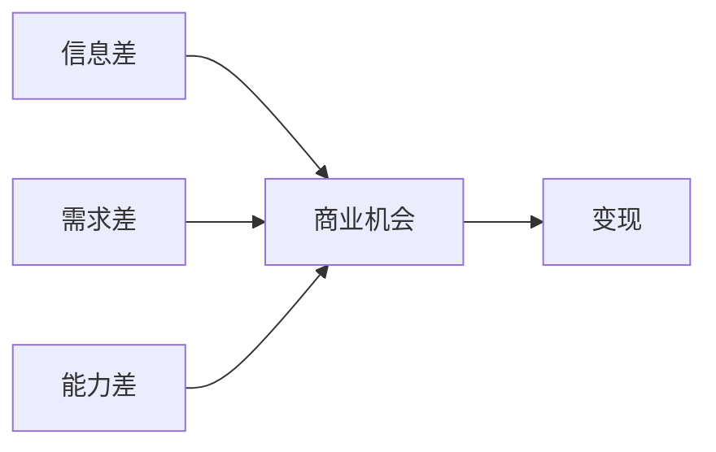
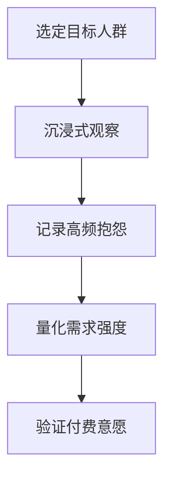
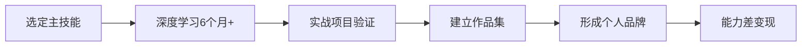
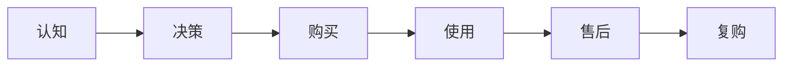
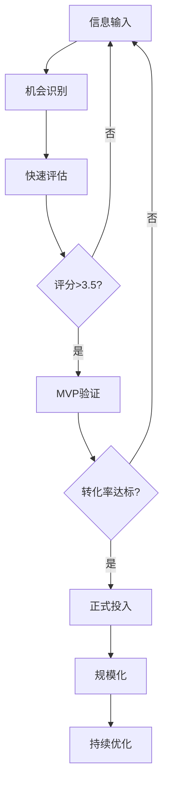

## 一、机会识别技巧

机会识别是所有赚钱能力的起点。99%的人不是缺少机会，而是缺少发现机会的眼睛。本节系统拆解机会识别的底层逻辑、实用方法和落地工具，帮助你建立一套可重复使用的机会捕捉系统。

### 1. 机会的本质：信息差 × 需求差 × 能力差

任何商业机会的底层结构都可以拆解为三个变量的交叉：



| 差距类型 | 含义 | 典型场景 |
|---------|------|---------|
| 信息差 | 你知道别人不知道的事 | 新政策解读、跨境信息搬运、行业内部消息 |
| 需求差 | 市场有需求但无人满足 | 特定人群的细分需求、新兴场景的配套服务 |
| 能力差 | 你能做别人做不了的事 | 技术壁垒、资源整合、专业资质 |

**关键认知：** 三者不需要同时具备。信息差可以单独变现（知识付费），能力差也可以单独变现（接单外包），但三者重叠时，机会的确定性和天花板最高。

#### 1.1 信息差的来源与变现

信息差是最低门槛的机会类型。信息差的本质是**信息不对称**——你比目标受众更早、更深入、更系统地掌握了某个领域的信息。

**信息差的六大来源：**

| 来源 | 获取方式 | 变现形式 | 典型收入 |
|------|---------|---------|---------|
| 跨语言信息 | 翻译/搬运外文内容 | 自媒体、课程 | 月入3000-30000元 |
| 跨行业信息 | 多行业经验交叉 | 咨询、培训 | 月入5000-50000元 |
| 跨地域信息 | 一线vs下沉市场 | 电商选品、代理 | 月入5000-100000元 |
| 时间差信息 | 抢先解读新政策/新工具 | 教程、攻略 | 单次爆款1000-50000元 |
| 专业门槛信息 | 行业深耕积累 | 知识付费、顾问 | 月入10000-100000元 |
| 数据分析信息 | 数据采集与挖掘 | 报告、决策支持 | 月入5000-30000元 |

**案例：** 2023年ChatGPT刚爆发时，第一批做中文教程的博主通过信息差（国外技术→国内用户）月收入轻松破万。到2024年信息差消失后，单纯的工具教程已经很难变现，但"AI+行业应用"的深度内容仍然有市场，因为这需要行业经验和AI能力的交叉——能力差依然存在。

#### 1.2 需求差的识别方法

需求差指的是市场存在未被满足的需求，或者现有解决方案不够好。识别需求差的核心方法是**观察痛点**。

**痛点的三个层级：**

1. **痒点**（Nice to have）——有更好，没有也行。变现难度高，用户付费意愿弱。
2. **痛点**（Must have）——不解决就很难受。变现中等，用户愿意付费但会比价。
3. **刚需**（Critical）——不解决就无法继续。变现容易，用户付费意愿强且不敏感价格。

**需求差识别的五步法：**



**步骤一：选定目标人群。** 不要试图服务所有人。选择你熟悉或有兴趣的人群，比如"自由职业者""宝妈""大学生""程序员"。

**步骤二：沉浸式观察。** 潜入目标人群的社群（微信群、贴吧、小红书、知乎），花至少2周时间观察他们在讨论什么、抱怨什么、求助什么。

**步骤三：记录高频抱怨。** 用表格记录出现频率最高的问题：

| 抱怨内容 | 出现频率 | 现有解决方案 | 方案满意度 |
|---------|---------|------------|----------|
| 示例：P图太慢 | 高 | Photoshop | 学习成本高 |
| 示例：找不到靠谱的XX服务 | 中 | 朋友推荐 | 覆盖面小 |

**步骤四：量化需求强度。** 用搜索指数（百度指数、微信指数）、社群讨论量、竞品销量等数据验证需求是否真实存在。

**步骤五：验证付费意愿。** 这是最关键的一步。发布一个MVP（最小可行产品）或预售页面，看是否有人愿意付钱。**没有付费意愿的需求不是真正的商业机会。**

#### 1.3 能力差的构建路径

能力差是最有护城河的机会类型。构建能力差的核心策略是**T型能力**——在一个领域足够深的同时，横向了解多个相关领域。

**能力差的构建模型：**



**关键原则：**
- **选主技能时看天花板：** 选择有明确定价且需求持续的技能（如编程、设计、写作、营销），而不是跟风热点。
- **深度优于广度：** 一个领域做到前10%比三个领域做到前50%有价值得多。
- **实战验证优于理论学习：** 做过3个真实项目的人比看过30门课程的人更值钱。

### 2. 机会识别的四大框架

#### 2.1 PEST宏观扫描法

从宏观环境的变化中捕捉机会。每次重大变化都意味着旧秩序被打破、新机会涌现。

| 维度 | 关注点 | 机会来源 | 2024-2026年实例 |
|------|--------|---------|----------------|
| P-政策 | 新法规、补贴、行业政策 | 政策红利期的先行者优势 | 数据安全法催生合规咨询、双碳政策催生碳交易服务 |
| E-经济 | 消费趋势、收入结构变化 | 消费降级/升级中的细分机会 | 平替经济、二手交易平台、临期食品 |
| S-社会 | 人口结构、生活方式变化 | 新人群的新需求 | 老龄化催生银发经济、单身经济催生一人食 |
| T-技术 | 新技术成熟度曲线 | 技术红利期的套利窗口 | AI工具替代人工、新能源汽车后市场 |

**实操建议：** 每月花1小时做一次PEST扫描。关注国务院政策文件、行业研报、技术博客、社会热搜。用一个简单的表格记录你发现的趋势，3个月后回头看，很多机会会变得清晰。

#### 2.2 SCAMPER创新思维法

当你面对一个现有产品或服务时，用SCAMPER七个维度思考改进机会：

| 维度 | 问题 | 机会方向 |
|------|------|---------|
| S-替代(Substitute) | 能用什么替代现有方案？ | 更便宜、更高效、更便捷的替代品 |
| C-合并(Combine) | 能把什么组合在一起？ | 跨品类组合创新 |
| A-调整(Adapt) | 能从其他领域借鉴什么？ | 跨行业模式迁移 |
| M-修改(Modify) | 能放大/缩小/改变什么？ | 针对特定人群的定制化 |
| P-另作他用(Put to other use) | 能用于其他场景吗？ | 场景迁移创新 |
| E-消除(Eliminate) | 能去掉什么环节？ | 简化流程、降低门槛 |
| R-重排(Rearrange) | 能颠倒/重新排序吗？ | 商业模式创新 |

**案例：** 健身房是传统模式。用SCAMPER分析——**消除**（去掉固定场地）→ 上门私教；**替代**（用APP替代教练）→ Keep等健身APP；**合并**（健身+社交）→ 健身社群、约跑平台。每一个维度都能产生新的商业机会。

#### 2.3 用户旅程痛点法

沿着目标用户的完整使用流程，逐环节寻找痛点：



| 阶段 | 常见痛点 | 机会方向 |
|------|---------|---------|
| 认知 | 不知道有这个产品/服务 | 信息整合、种草内容 |
| 决策 | 不知道选哪个好 | 评测、对比、推荐服务 |
| 购买 | 价格贵、渠道少 | 拼团、代购、二手交易 |
| 使用 | 学习成本高、体验差 | 简化工具、教程服务 |
| 售后 | 问题无人解答 | 客服外包、社区互助 |
| 复购 | 忘记续费、缺乏动力 | 提醒服务、会员体系 |

**实操步骤：**
1. 选定一个行业或产品品类
2. 以普通用户身份完整走一遍购买和使用流程
3. 每个环节记录你的不满、困惑、等待时间
4. 对比竞品，看哪些痛点竞品也没有解决
5. 评估每个痛点的解决难度和用户付费意愿
6. 选择性价比最高的痛点切入

#### 2.4 供需失衡分析法

当供给跟不上需求，或者需求突然爆发但供给滞后时，就存在套利窗口。

**供需失衡的五种信号：**

1. **价格飙升：** 某个商品或服务价格短期内大幅上涨（如疫情初期的口罩）
2. **排队等待：** 需要预约、排队、摇号才能获得的服务（如热门医院挂号、学区房）
3. **质量参差：** 市场充斥劣质产品，用户选择困难（如装修、教育培训）
4. **信息混乱：** 用户需要大量时间研究才能做出决策（如保险、理财产品）
5. **跨区价差：** 同一商品在不同地区/平台价差显著（如跨境电商、区域特产）

**实操工具：**

```python
# 简单的供需分析框架
supply_demand_checklist = {
    "需求信号": [
        "搜索指数上升趋势",
        "社群讨论量增加",
        "新进入者增多",
        "相关招聘岗位增加",
        "投资机构开始关注"
    ],
    "供给信号": [
        "现有供给商数量",
        "供给质量分布",
        "新供给的进入门槛",
        "供给的地域覆盖",
        "供给的时效性"
    ],
    "失衡判断": [
        "需求增速 > 供给增速 → 机会",
        "需求集中但供给分散 → 整合机会",
        "需求升级但供给老旧 → 替代机会",
        "需求存在但供给缺失 → 创造机会"
    ]
}
```

### 3. 机会评估的量化模型

发现机会只是第一步，更重要的是评估机会的质量。以下是经过实践验证的评估框架：

#### 3.1 机会评分卡

| 评估维度 | 权重 | 评分标准(1-5分) | 说明 |
|---------|------|----------------|------|
| 市场规模 | 20% | 1=极小众, 5=大众市场 | 目标人群是否足够大 |
| 需求强度 | 20% | 1=痒点, 5=刚需 | 用户的付费意愿有多强 |
| 竞争程度 | 15% | 1=红海, 5=蓝海 | 竞争对手的数量和质量 |
| 进入门槛 | 15% | 1=无门槛, 5=高壁垒 | 需要什么资质/资源/资金 |
| 变现速度 | 15% | 1=长周期, 5=快速变现 | 从开始到获得收入的时间 |
| 可扩展性 | 15% | 1=线性增长, 5=指数增长 | 是否能规模化 |

**评分方法：** 对每个维度打1-5分，乘以权重后求和。总分3.5以上的机会值得投入，4分以上的机会优先执行。

**案例评分——AI绘画教学：**

| 维度 | 评分 | 理由 |
|------|------|------|
| 市场规模 | 4 | 对AI绘画感兴趣的人群广泛 |
| 需求强度 | 3 | 有一定需求但非刚需 |
| 竞争程度 | 3 | 竞争者不少但质量参差 |
| 进入门槛 | 4 | 需要掌握AI工具+教学能力 |
| 变现速度 | 4 | 可快速上线课程/教程 |
| 可扩展性 | 4 | 课程一次制作反复销售 |

加权总分 = 4×0.2 + 3×0.2 + 3×0.15 + 4×0.15 + 4×0.15 + 4×0.15 = 3.65分，值得投入。

#### 3.2 快速验证的MVP方法

不要在不确定的事情上投入太多资源。用最小成本验证机会的真实性：

**MVP验证四步法：**

1. **假说定义（1天）：** 明确你要验证的核心假设——"XX人群愿意为XX服务付XX元"
2. **最小产品（3天）：** 用最低成本做出一个能展示核心价值的东西——可以是一个Landing Page、一段演示视频、一份样品
3. **测试投放（7天）：** 把MVP放到目标用户面前，收集反馈和付费意向
4. **数据决策（1天）：** 用数据判断是否继续——核心指标是转化率和用户反馈

| MVP类型 | 成本 | 适用场景 | 验证指标 |
|---------|------|---------|---------|
| Landing Page | 0-500元 | 服务类、课程类 | 留资率、付费意向 |
| 朋友圈测试 | 0元 | 所有类型 | 咨询量、下单量 |
| 社群内测 | 0-1000元 | 社群服务、工具 | 参与率、续费意愿 |
| 电商测品 | 500-2000元 | 实物产品 | 加购率、转化率 |
| 线下摆摊 | 200-500元 | 本地服务、食品 | 复购率、客单价 |

### 4. 日常机会捕捉的实操系统

机会识别不是灵感闪现，而是一套可以训练和系统化的习惯。

#### 4.1 建立机会日志

准备一个记录工具（Notion、飞书、备忘录均可），每天记录你发现的潜在机会：

```text
【机会日志模板】
日期：2026-06-25
来源：小红书热搜
现象：XX话题讨论量暴增
痛点：用户找不到XX
我的优势：有XX资源/技能
验证方式：XX
优先级：高/中/低
```

**关键习惯：**
- 每天至少记录1条观察，不限于商业机会，任何"这里可以做得更好"的想法都值得记录
- 每周回顾一次日志，把零散的观察串联成趋势
- 每月做一次机会评估，用评分卡筛选出值得行动的机会

#### 4.2 高效信息输入渠道

机会来自信息输入的质量。以下是经过验证的高质量信息源：

**行业信息：**
- 36氪、虎嗅、钛媒体——行业趋势和创业动态
- 艾瑞咨询、QuestMobile、易观——行业数据报告
- 各行业协会官网、政策发布平台——政策变化

**用户需求信息：**
- 小红书、抖音评论区——用户真实需求和吐槽
- 知乎、贴吧——深度问题和讨论
- 电商评价区（淘宝、京东、拼多多）——产品痛点
- 应用商店差评——用户未被满足的需求

**技术趋势信息：**
- Hacker News、Product Hunt——全球新产品和趋势
- GitHub Trending——技术热点
- arXiv、技术博客——前沿研究

**跨境信息：**
- Google Trends——全球搜索趋势
- Amazon Best Sellers——海外消费趋势
- YouTube、TikTok——海外内容趋势

#### 4.3 机会识别的思维训练

**日常训练方法：**

1. **反向思维训练：** 看到一个成功的商业模式，思考"如果反过来做会怎样"。比如大公司做标准化→你做个性化；线上做→你做线下。
2. **组合思维训练：** 随机选两个不相关的领域，思考它们的交叉点。比如"AI+宠物""区块链+农业""短视频+老年健康"。
3. **减法思维训练：** 看到一个复杂的产品，思考"如果去掉80%的功能，只保留核心，会怎样"。
4. **替换思维训练：** 看到一个服务，思考"如果目标用户换成另一群人，会有什么新机会"。

### 5. 常见的机会识别误区

#### 误区一：把兴趣当机会

**错误表现：** "我喜欢烘焙，所以我要开烘焙店。"

**纠正方法：** 兴趣和商业机会是两件事。先用需求差和付费意愿验证是否存在真实的市场机会，再考虑如何结合兴趣。如果只有兴趣没有需求，那烘焙只能是爱好，不是生意。

#### 误区二：追风口而不是造价值

**错误表现：** "AI很火，我要做AI相关的。"

**纠正方法：** 风口是大趋势，但赚钱的关键不是追风，而是找到风口下具体的、未被满足的需求。AI是技术浪潮，但"AI+具体行业+具体痛点"才是真正的机会。比如"AI帮律师写合同初稿"比"做AI产品"具体得多，也更容易变现。

#### 误区三：低估竞争、高估需求

**错误表现：** "这个领域没什么人在做，肯定有机会。"

**纠正方法：** 没人在做可能意味着需求不存在，也可能意味着变现路径不通。永远先验证需求和付费意愿，再进入。同时要区分"没有竞争"和"竞争形式不同"——你觉得没有同行，但用户可能正在用完全不同的方式解决问题。

#### 误区四：只看机会不看自身条件

**错误表现：** "这个机会评分很高，我要做。"

**纠正方法：** 机会评分只反映市场吸引力，还要评估你自己的资源匹配度。问自己三个问题：（1）我有什么独特优势？（2）我愿意投入多少时间和资金？（3）如果失败，我能承受的最大损失是多少？

#### 误区五：过度分析、从不行动

**错误表现：** "我还在研究市场，再等等看。"

**纠正方法：** 分析到70%就行动，用实际行动验证假设。过度分析的本质是害怕失败，但不行动才是最大的失败。设定一个明确的deadline——"两周内必须开始第一次测试"。

### 6. 从识别到变现的完整路径

发现机会只是起点，完整的路径如下：



**各阶段的核心指标：**

| 阶段 | 核心指标 | 达标线 | 周期 |
|------|---------|--------|------|
| 机会识别 | 记录数量 | 每周3条以上 | 持续 |
| 快速评估 | 评分卡打分 | 总分≥3.5 | 每月 |
| MVP验证 | 转化率 | ≥5%留资或≥2%付费 | 1-2周 |
| 正式投入 | 首月收入 | 覆盖成本的50% | 1-3个月 |
| 规模化 | 月增长率 | ≥20% | 3-6个月 |

### 7. 进阶：构建你自己的机会识别系统

当你积累了足够的经验后，可以建立一套自动化的信息收集和分析系统：

**基础版（每月投入2小时）：**
- 设置Google Alerts/百度订阅关键词
- 关注20个行业KOL和5个行业数据源
- 每周记录机会日志，每月做一次评估

**进阶版（每月投入5小时）：**
- 搭建自动化信息聚合（RSS、API）
- 建立机会评分数据库，跟踪每个机会的演变
- 定期与不同行业的人交流，获取跨界信息
- 参加行业展会和线下活动，获取一手信息

**高级版（系统化运作）：**
- 开发数据监控工具，自动追踪搜索指数、价格变动、社交热度
- 建立机会pipeline，用看板管理从发现到验证的全流程
- 组建小团队或社群，分工收集不同领域的信息
- 建立复盘机制，对每个机会的结果做归因分析

机会识别是一项可以刻意练习的能力。核心不在于天赋，而在于**持续的信息输入**、**结构化的分析框架**和**快速的验证行动**。从今天开始记录你的第一条机会日志，三个月后你会发现自己看世界的眼光完全不同了。
