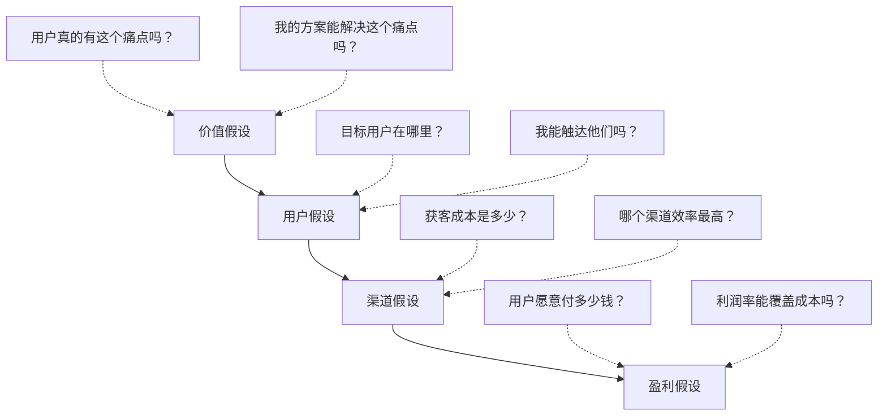
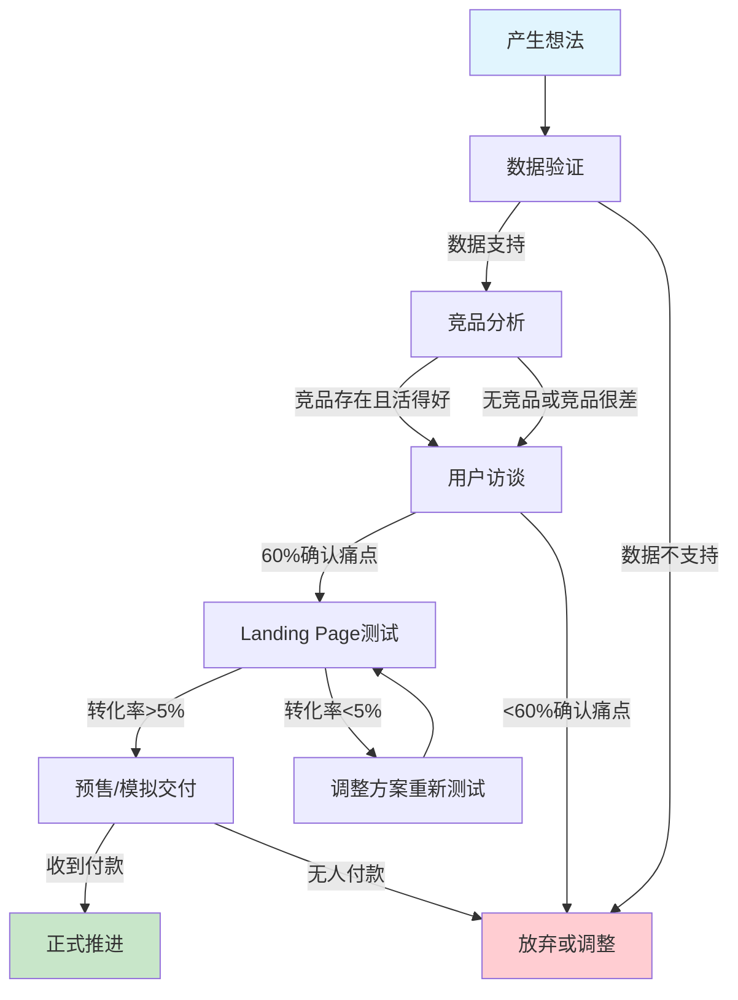

## 二、快速验证技巧

### 1. 为什么需要快速验证

很多人搞钱失败，不是因为能力不够，而是在错误的方向上投入了太多时间和金钱。快速验证的核心思想是：**在大规模投入之前，用最小的成本确认方向是否可行**。

这个理念源自精益创业（Lean Startup）方法论。埃里克·莱斯在《精益创业》中提出"构建-测量-学习"循环：先做一个最小可行产品（MVP），投放到真实市场中收集反馈，然后根据数据决定是坚持、调整还是放弃。

快速验证解决三个核心问题：

| 问题 | 不验证的后果 | 验证后的收益 |
|------|------------|------------|
| 需求是否真实存在？ | 花3个月做出没人要的产品 | 1周内知道方向对不对 |
| 用户愿意付费吗？ | 有100个"感兴趣"的人但0个付费用户 | 知道用户愿意付多少钱 |
| 获客成本是否可控？ | 投入5000元广告费只来3个客户 | 用50元测试出获客模型 |

**验证的本质是用确定性替代猜测。** 每一个未经验证的假设都是风险，快速验证就是在资金耗尽之前把这些风险消灭掉。

### 2. 快速验证的底层逻辑

#### 2.1 假设驱动思维

任何搞钱项目都建立在一系列假设之上。快速验证的第一步是把隐性假设显性化，然后逐一验证。

一个典型的搞钱项目至少包含四层假设：



**价值假设**是最底层的——如果用户根本没有这个痛点，后面的一切都是白搭。所以验证的优先级是：先验证价值假设，再验证其他假设。

#### 2.2 验证的三个层次

| 层次 | 目标 | 方法 | 成本 | 时间 |
|------|------|------|------|------|
| 第一层：需求验证 | 确认痛点真实存在 | 用户访谈、问卷、搜索数据分析 | 0-200元 | 1-3天 |
| 第二层：方案验证 | 确认用户愿意为解决方案付费 | Landing Page、预售、众筹 | 200-1000元 | 3-7天 |
| 第三层：模型验证 | 确认商业模型可持续 | MVP试运营、小批量交付 | 1000-5000元 | 2-4周 |

每一层验证通过后再进入下一层，避免过早优化。

#### 2.3 验证的判定标准

验证不是"感觉还行"，而是有明确的数据判定标准：

- **需求验证通过**：目标用户访谈中，超过60%的人确认痛点存在且正在寻找解决方案
- **方案验证通过**：Landing Page的转化率超过5%，或预售阶段有超过20人愿意付款
- **模型验证通过**：首批交付的客户复购率超过30%，且单客利润为正

如果数据不达标，应该调整假设重新验证，而不是盲目坚持。

### 3. 七种快速验证方法详解

#### 3.1 用户访谈法（成本：0元，时间：1-2天）

这是最基础也最有效的验证方法。很多人跳过这一步直接做产品，结果做出一堆没人要的东西。

**操作步骤：**

1. **定义目标用户画像**：年龄、职业、收入、痛点场景。越具体越好，"所有人"等于"没有人"。
2. **找到访谈对象**：去目标用户聚集的地方（社群、论坛、线下活动），至少找10个人。
3. **设计访谈提纲**：用开放式问题，避免引导性提问。
4. **执行访谈**：每次15-30分钟，录音记录。
5. **分析结果**：提炼共性痛点和需求模式。

**访谈提纲模板（以"帮中小企业做短视频代运营"为例）：**

```text
开场：
- 您目前有在做短视频吗？做了多久了？

痛点挖掘：
- 做短视频过程中，最让您头疼的是什么？
- 您试过哪些方法解决这个问题？效果如何？
- 如果有一个工具/服务能帮您解决这个问题，您会考虑吗？

付费意愿：
- 您现在每个月在短视频相关的投入是多少？
- 如果有一个服务能帮您每月节省X小时，您愿意为此付多少钱？
- 您选择这类服务时，最看重什么？（价格/效果/服务/口碑）

行为验证：
- 您能给我看一下您最近一条短视频的数据吗？
- 您有没有关注过同行中做得好的账号？他们是怎么做的？
```

**关键原则：问行为，不问观点。** "你会用吗"和"你已经在用了"是完全不同的验证强度。用户说"我会用"的可信度只有10%，但"我上个月刚花了200块买了类似的服务"的可信度超过90%。

**常见错误：**
- 只问朋友家人（碍于面子会说好话，数据失真）
- 问"你觉得这个想法怎么样"（引导性问题）
- 访谈人数不足5人（样本太小，无法发现规律）

#### 3.2 Landing Page测试法（成本：200-500元，时间：3-5天）

在还没有产品的时候，先做一个落地页描述你的服务，看有多少人愿意留下联系方式或直接付款。

**操作步骤：**

1. 用工具（WordPress、Wix、或直接一个HTML页面）搭建一个简洁的落地页
2. 核心元素：痛点描述、解决方案、价格、行动按钮（"立即预约"/"加入等候名单"）
3. 投放少量广告（微信朋友圈广告、抖音信息流、小红书种草）测试转化率
4. 收集数据，判断方向是否可行

**落地页核心结构：**

```text
[标题] 一句话说清你能帮用户解决什么问题
[副标题] 用数据或场景强化痛点
[痛点列举] 3-5个目标用户的真实痛点
[解决方案] 你打算怎么帮他们解决
[价格/方案] 透明定价（不标价会吓跑真正有需求的人）
[行动按钮] "立即咨询"/"限时优惠"/"加入等候名单"
[信任背书] 案例、数据、资质（前期没有可以用创始人故事替代）
```

**判定标准：**
- 广告点击率 > 1.5%：说明文案和定位有吸引力
- 落地页转化率 > 5%：说明需求真实存在
- 落地页转化率 > 10%：可以立刻推进，需求强烈

如果点击率高但转化率低，说明广告文案吸引了错误的人群，需要调整定向或落地页内容。

#### 3.3 预售验证法（成本：0元，时间：3-7天）

在产品/服务还没有完成之前，先收钱。这是最强的验证方式——用户用钱包投票远比用嘴投票可靠。

**操作步骤：**

1. 确定你的服务方案和定价
2. 在朋友圈、社群、小红书发布预售信息
3. 设置一个明确的交付时间和优惠价格
4. 观察转化情况

**预售文案框架：**

```text
我最近在做一个[服务名称]，专门帮[目标用户]解决[具体痛点]。

目前已经帮[早期测试用户]取得了[具体效果]。

现在开放[数量]个早鸟名额，价格是[原价的60-70%]。

如果你也有[痛点]，扫码/私信我了解更多。

[限时限额，售完即止]
```

**关键技巧：**
- 预售价格是正式价格的60-70%，给用户一个现在下单的理由
- 设置限量（如"仅限20人"），制造稀缺感
- 如果预售失败，可以退还所有款项，零风险

**判定标准：**
- 0人付款：方向可能有问题，重新验证需求
- 1-5人付款：值得继续，但需要优化定价和文案
- 5人以上付款：方向可行，立即推进交付

#### 3.4 社群测试法（成本：0-100元，时间：5-10天）

先建一个免费社群，聚集目标用户，在社群内测试需求和付费意愿。

**操作步骤：**

1. 在目标用户聚集的平台（知乎、小红书、豆瓣小组）发布"免费入群"信息
2. 群内持续分享有价值的内容，建立信任
3. 在群内发起需求调研（问卷、投票）
4. 测试付费意愿（推出付费服务或课程）

**社群规模与验证强度的关系：**

| 社群规模 | 验证强度 | 说明 |
|---------|---------|------|
| 10-30人 | 初步验证 | 可以做小规模访谈，了解需求 |
| 30-100人 | 中等验证 | 可以做问卷调研，发现共性需求 |
| 100-300人 | 强验证 | 可以测试付费转化率，数据有统计意义 |
| 300人以上 | 充分验证 | 可以做A/B测试，优化定价和产品 |

#### 3.5 模拟交付法（成本：0-500元，时间：1-2周）

不用真正做出完整产品，用人工方式模拟服务流程，验证用户是否接受。

**典型案例：**

- **想做AI写作工具**：先用ChatGPT+人工编辑的方式，帮10个客户写文章，看他们是否满意并愿意付费
- **想做自动化简历优化**：先手动帮20个人优化简历，收集反馈，确认用户愿意付多少钱
- **想做本地家政平台**：先自己接单、派单，用Excel管理，验证流程跑通后再做系统

**模拟交付的核心价值：**

1. **验证服务流程**：发现实际交付中的问题和瓶颈
2. **收集用户反馈**：真实用户的反馈远比想象中的用户画像有价值
3. **建立初始案例**：第一批成功案例是后续获客的核心资产
4. **测试定价模型**：在真实场景中测试用户的价格敏感度

#### 3.6 竞品验证法（成本：0元，时间：1-3天）

如果已经有竞品存在且活得不错，这本身就是需求存在的最强证据。

**操作步骤：**

1. **找到竞品**：在搜索引擎、应用商店、电商平台搜索相关关键词
2. **分析竞品数据**：销量、评价数量、评分、用户反馈
3. **研究竞品定价**：了解市场价格区间和用户的付费习惯
4. **挖掘竞品不足**：从差评和投诉中发现改进机会

**竞品分析数据清单：**

```text
基本信息：
- 竞品名称和品牌
- 上线时间和运营时长
- 主要销售渠道

数据指标：
- 月销量/下载量
- 评价数量和评分
- 社交媒体粉丝数和互动率

用户反馈：
- 好评关键词（用户最看重什么）
- 差评关键词（用户的痛点和不满）
- 用户期望但竞品未提供的功能

定价信息：
- 定价区间
- 促销策略
- 价格变动趋势
```

**竞品验证的判定标准：**
- 竞品月销100+且评分4.0以上：需求被充分验证，可以进入
- 竞品月销10-100且评分3.5以上：需求存在但可能不大，需要差异化
- 竞品月销<10或评分<3.0：需要谨慎，可能是伪需求或市场太小

#### 3.7 数据验证法（成本：0元，时间：1天）

利用公开数据验证需求是否存在，这是最快速的验证方式。

**数据来源和分析方法：**

| 数据来源 | 验证什么 | 怎么看 |
|---------|---------|-------|
| 百度指数/微信指数 | 搜索热度和趋势 | 搜索量>1000且持续增长=需求真实 |
| 淘宝/拼多多搜索 | 付费需求和价格 | 月销>1000且均价>50=市场足够大 |
| 小红书/抖音搜索 | 用户讨论和痛点 | 笔记/视频>1万且互动率高=用户关注度高 |
| 知乎问答 | 深度需求和决策因素 | 回答>100且有付费意愿讨论=需求明确 |
| 行业报告 | 市场规模和增速 | 市场规模>10亿且增速>20%=赛道有机会 |

### 4. 快速验证的完整流程

将上述方法组合成一个完整的验证流程，按顺序执行：



**时间线参考：**

| 阶段 | 耗时 | 成本 | 产出 |
|------|------|------|------|
| 数据验证 | 1天 | 0元 | 需求热度和市场规模判断 |
| 竞品分析 | 1-2天 | 0元 | 竞品格局和差异化方向 |
| 用户访谈 | 2-3天 | 0-200元 | 10+用户的真实痛点和付费意愿 |
| Landing Page | 3-5天 | 200-500元 | 转化率数据和用户画像 |
| 预售测试 | 3-7天 | 0元 | 实际收款和交付反馈 |
| **总计** | **10-18天** | **200-700元** | **完整的可行性判断** |

### 5. 不同搞钱类型的验证策略

不同类型的搞钱方式，验证的重点和方法不同：

#### 5.1 技能变现类（咨询、代运营、设计、开发）

**验证重点**：用户是否愿意为你的技能付费，以及付费金额是否值得你投入时间。

**推荐验证路径**：
1. 在猪八戒、威客、闲鱼等平台发布服务，观察询盘量
2. 在朋友圈/社群发布"限时优惠"服务，测试私域转化
3. 在行业社群免费回答问题，积累口碑后转付费

**关键数据**：
- 询盘转化率 > 20%：定价合理，需求真实
- 客单价 > 时薪×耗时×2：值得规模化投入
- 复购率 > 30%：服务有价值，可以持续经营

#### 5.2 内容创作类（知识付费、课程、社群）

**验证重点**：内容是否有足够的受众，以及用户是否愿意为内容付费。

**推荐验证路径**：
1. 先在免费平台（知乎、公众号、小红书）发布内容，观察数据
2. 粉丝达到1000+后，推出付费内容（小报童、知识星球）
3. 付费用户达到50+后，考虑做系统化课程

**关键数据**：
- 单篇内容阅读量 > 1000：受众足够大
- 付费转化率 > 3%：内容有付费价值
- 付费用户续费率 > 50%：内容持续有价值

#### 5.3 电商类（实物/虚拟商品）

**验证重点**：选品是否正确，以及供应链和物流是否可控。

**推荐验证路径**：
1. 用1688代发或闲鱼无货源模式测试选品
2. 测出爆款后，小批量进货在微信/社群销售
3. 验证供应链稳定后，入驻电商平台

**关键数据**：
- 点击率 > 3%：主图和标题有吸引力
- 转化率 > 5%：定价和详情页合理
- 复购率 > 15%：产品质量过关
- 毛利率 > 40%：扣除各项成本后有利润空间

#### 5.4 平台/工具类（SaaS、小程序、App）

**验证重点**：用户是否真正需要这个工具，以及获客成本是否可控。

**推荐验证路径**：
1. 先用无代码工具（Airtable、Notion、微信小程序）做出原型
2. 找10-20个种子用户免费试用，收集反馈
3. 根据反馈迭代后，推出付费版本

**关键数据**：
- 种子用户活跃度 > 70%：产品有粘性
- 付费转化率 > 10%：有付费意愿
- 月留存率 > 60%：产品有长期价值
- 获客成本 < 月付费的1/3：模型可持续

### 6. 验证过程中的常见误区

#### 误区一：把"感兴趣"当成"会购买"

"这个想法不错"和"我现在就付钱"之间隔着一条巨大的鸿沟。验证时只相信行为数据（付费、注册、留联系方式），不相信态度数据（点赞、说好、表示感兴趣）。

**纠正方法**：在访谈和测试中，始终设置一个"付费关卡"——哪怕只是1元的预付款，也能过滤掉90%的虚假需求。

#### 误区二：验证时间太长

有些人花3个月做市场调研，结果调研完了市场也变了。快速验证的核心是"快速"——整个验证周期控制在2-4周内完成。

**纠正方法**：设定明确的验证截止日期。如果2周内无法得出结论，大概率是方法有问题或者这个方向本身就不清晰。

#### 误区三：只验证需求，不验证支付能力

用户有痛点不代表愿意付钱，愿意付钱不代表付得起。一个年收入5万的人告诉你"我愿意花5000元"，可信度极低。

**纠正方法**：验证时不仅问"你愿意付多少钱"，还要问"你最近一次为类似服务花了多少钱"。历史消费行为比未来消费意愿可靠得多。

#### 误区四：样本量不足

跟3个朋友聊了聊，都说好，就觉得方向可行。3个样本在统计学上毫无意义。

**纠正方法**：至少需要10个独立样本才能看到初步趋势，30个以上才能做出可靠判断。而且样本必须是真实目标用户，不能是朋友家人。

#### 误区五：过早优化

还没验证需求就开始优化产品细节、设计Logo、搭建官网。这些都是在用忙碌感替代进展。

**纠正方法**：验证阶段的一切工作都围绕"这个方向是否可行"这一个问题展开。Logo、品牌、系统架构都是验证通过后才需要考虑的事情。

### 7. 实战案例

#### 案例一：知识付费的快速验证

**背景**：小李是某互联网公司的产品经理，想做一门"产品经理面试课"。

**验证过程**：
1. **数据验证**（1天）：在知乎搜索"产品经理面试"，发现相关问题有5000+回答，高赞回答点赞数过万。在小红书搜索，发现大量面试笔记和经验分享。数据确认需求真实存在。
2. **竞品分析**（1天）：找到5个竞品课程，价格99-399元，销量从200到2000不等。用户评价中，最常见的抱怨是"太理论化""没有真实案例"。
3. **用户访谈**（2天）：在产品经理社群中找了15个正在准备面试的人，发现他们的核心痛点是"不知道面试官会问什么"和"回答没有框架"。
4. **Landing Page测试**（3天）：做了一个落地页，标题是"30个产品经理高频面试题+标准回答框架"，定价199元。投放200元朋友圈广告，获得45个点击，12个人留了手机号，转化率26.7%。
5. **预售**（3天）：给12个留手机号的人发了预售链接，定价99元（早鸟价），6个人付款，转化率50%。

**结果**：用9天时间、200元成本，验证了方向可行性并获得594元预售收入。随后用2周时间完成课程制作，正式上线后首月销售127份，收入25,273元。

**关键教训**：竞品分析中发现的"太理论化"这个差异化机会，直接成为了课程的核心卖点。

#### 案例二：本地服务的快速验证

**背景**：小王想在所在城市做"上门收纳整理"服务。

**验证过程**：
1. **数据验证**（1天）：美团搜索"收纳整理"，发现当地有3家服务商，评分4.5+，月订单50+。抖音搜索"收纳整理"，相关视频播放量过亿。数据确认需求存在。
2. **竞品分析**（1天）：3家竞品定价在150-300元/小时，用户差评主要集中在"预约等待时间长""师傅不专业"。
3. **社群测试**（5天）：在小区业主群和本地生活群发布"免费收纳咨询"，收到23个咨询，其中8个明确表示愿意付费请人上门。
4. **模拟交付**（5天）：用业余时间为3个客户做了上门收纳，收费100元/小时（低于竞品）。3个客户都给了好评，并推荐了朋友。

**结果**：用12天时间、0成本验证了方向可行性。第一个月接了12单，收入8,400元。第三个月月入2.5万，开始招人扩大规模。

**关键教训**：社群测试比线上广告更有效——本地服务的信任门槛高，熟人推荐的转化率是广告的5倍以上。

#### 案例三：电商选品的快速验证

**背景**：小张想做一款"便携式筋膜枪"的电商。

**验证过程**：
1. **数据验证**（1天）：淘宝搜索"便携筋膜枪"，发现月销Top10的产品销量都在5000+，均价150-300元。市场足够大。
2. **竞品分析**（2天）：分析了20个竞品的评价，发现用户最在意的是"噪音大小""重量""续航"。差评中"噪音大"和"太重"出现频率最高。
3. **选品测试**（3天）：在1688找到3款候选产品，各买了1个样品。自己试用后，选了最轻、最安静的一款。
4. **闲鱼测试**（5天）：在闲鱼上架这款筋膜枪，定价199元（竞品均价250元），用手机拍了产品视频。5天内收到8个咨询，成交3单。

**结果**：用11天时间、约600元成本（3个样品+运费），验证了选品方向。随后批量进货，入驻拼多多，首月销售89台，利润约6,200元。

**关键教训**：闲鱼是电商选品的最佳测试平台——0开店成本，自然流量就能测出选品质量。

### 8. 快速验证工具箱

| 类别 | 工具 | 用途 | 成本 |
|------|------|------|------|
| 数据分析 | 百度指数、微信指数、巨量算数 | 搜索热度和趋势分析 | 免费 |
| 竞品分析 | 生意参谋、蝉妈妈、新红 | 竞品销量、流量、内容分析 | 免费/付费 |
| 用户调研 | 腾讯问卷、金数据、麦客 | 在线问卷设计和数据收集 | 免费 |
| Landing Page | WordPress、Wix、上线了 | 快速搭建落地页 | 免费/100元以内 |
| 社群运营 | 微信群、企业微信、飞书 | 建立用户社群 | 免费 |
| 原型设计 | Figma、墨刀、Axure | 产品原型和界面设计 | 免费 |
| 项目管理 | Notion、飞书文档、Trello | 验证流程管理和进度跟踪 | 免费 |
| 支付收款 | 微信收款、支付宝收款码 | 预售收款 | 免费 |

### 9. 验证后的决策框架

验证完成后，根据收集到的数据做决策：

| 验证结果 | 数据表现 | 决策 | 下一步 |
|---------|---------|------|-------|
| 强验证通过 | 预售收到10+付款，转化率>10% | 立即推进 | 全力投入产品开发和交付 |
| 弱验证通过 | 有询盘但付款少，转化率5-10% | 调整后推进 | 优化定价、文案或目标人群后重新测试 |
| 验证失败 | 无人问津或转化率<5% | 放弃或转向 | 分析失败原因，换方向或换人群重新验证 |
| 数据矛盾 | 部分指标好，部分指标差 | 深入调研 | 针对矛盾点做更细粒度的验证 |

**最重要的原则：验证失败不是终点，而是最有价值的信息。** 它帮你在损失几百元的时候止损，而不是在损失几万元甚至几十万元的时候才醒悟。每一次验证失败，都是在为最终的成功排除一个错误答案。

### 10. 本节核心要点

1. **快速验证的本质是用最小成本获取最大确定性**——在投入大量时间和金钱之前，先确认方向是否可行
2. **验证有三个层次**：需求验证→方案验证→模型验证，逐层推进
3. **七种验证方法**：用户访谈、Landing Page、预售、社群测试、模拟交付、竞品分析、数据验证，可以组合使用
4. **只相信行为数据**：付费、注册、留联系方式才是真验证，点赞、说好、表示感兴趣不算
5. **整个验证周期控制在2-4周**，成本控制在200-700元
6. **验证失败是有价值的信息**，它帮你用最小代价排除错误方向
