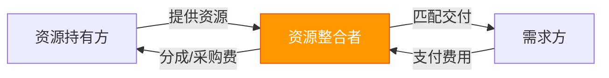
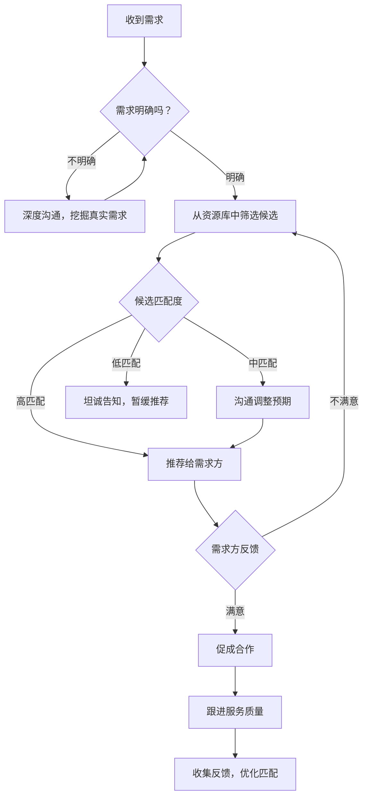
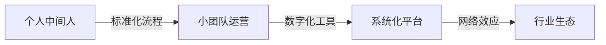

## 三、资源整合技巧

> 资源整合的本质，不是"拥有资源"，而是"调动资源"。你不需要拥有一家工厂、一个仓库、一支团队，你只需要知道谁有、谁需要、怎么连。

资源整合是普通人搞钱路径中杠杆效率最高的方式之一。它不要求你有大量启动资金，不要求你有顶尖技术，但它要求你具备三种核心能力：**信息差识别能力**、**需求匹配能力**和**信任构建能力**。本章将从底层逻辑到实操方法，系统拆解资源整合的完整打法。

---

### 1. 资源整合的底层逻辑

#### 1.1 什么是资源整合

资源整合，是指将分散在不同主体手中的资源（信息、人脉、渠道、技能、资金、设备等），通过你的组织和连接，重新组合成能够创造新价值的系统。

用一句话概括：**你是"连接器"和"组织者"，而不是"生产者"。**

资源整合与传统创业的核心区别：

| 维度 | 传统创业 | 资源整合 |
|------|----------|----------|
| 启动资金 | 通常需要较大投入 | 可以零成本或极低成本启动 |
| 核心能力 | 生产/技术能力 | 连接/匹配/协调能力 |
| 风险程度 | 高（资金沉没风险） | 低（试错成本极低） |
| 天花板 | 取决于自有资源 | 取决于可调动资源的规模 |
| 可复制性 | 低（依赖特定资源） | 高（模式可跨行业复制） |
| 典型代表 | 工厂主、餐厅老板 | 中介平台、社群团长、经纪人 |

#### 1.2 资源整合的三种基本模式

**模式一：信息差整合**

你掌握了一方不知道的信息，通过连接双方获取中间价值。

核心公式：`价值 = 甲方需求 × 乙方供给 × 信息不对称程度`

典型案例：
- 你发现某地水果滞销（供给端信息），同时知道城市社区团购群有大量需求（需求端信息），你做中间撮合，每单赚差价。
- 你知道某个自由设计师能力很强但缺客户，同时你的朋友圈有人要做品牌设计，你做推荐并收取佣金。

**模式二：能力差整合**

你没有某种能力，但你能找到有这种能力的人，组织他们为客户提供服务。

核心公式：`价值 = 交付能力 × 客户获取能力 - 协调成本`

典型案例：
- 你接到一个网站开发项目，自己不会写代码，但你找到前端、后端、设计师各一人组成临时团队，你负责项目管理和客户沟通。
- 你在短视频平台看到爆款产品，你不会生产，但你联系到工厂，谈好代发价格，自己只做流量和销售。

**模式三：渠道差整合**

你拥有某种渠道（流量、关系网、平台），别人有产品/服务但没有渠道。

核心公式：`价值 = 渠道流量 × 转化率 × 客单价 × 佣金比例`

典型案例：
- 你运营了一个本地生活公众号（3万粉丝），本地商家愿意付广告费或给你分成，让你推荐他们的服务。
- 你是某个行业社群的群主，群内成员有采购需求，供应商愿意给你返点。



#### 1.3 资源整合者的"不可替代性"从何而来

很多人担心：我只做中间连接，别人会不会绕过我直接对接？

这个问题的答案在于你是否构建了以下四种壁垒中的至少一种：

1. **信息壁垒**：你持续掌握双方不知道的信息（比如你有独特的选品眼光、行业洞察）
2. **信任壁垒**：双方都信任你，但彼此不信任（比如甲方信任你的交付能力，乙方信任你会及时付款）
3. **效率壁垒**：你的组织协调能力让合作效率远高于双方直接对接（比如你有标准化的流程、工具、团队）
4. **规模壁垒**：你同时对接了大量资源方和需求方，任何一方单独找都不如通过你高效（比如平台效应）

> **关键认知**：资源整合不是"倒买倒卖"那么简单。真正的资源整合者是"价值创造者"——你通过重组资源，创造了原本不存在的价值。

---

### 2. 资源整合的核心方法论

#### 2.1 第一步：盘点你的可用资源

在开始整合之前，先搞清楚你手里有什么。大多数人低估了自己的资源，因为他们只看到了"显性资源"（钱、设备），忽略了"隐性资源"（人脉、信息、技能、时间、位置）。

**资源盘点清单：**

| 资源类型 | 具体内容 | 你的评估 |
|----------|----------|----------|
| 人脉资源 | 你的通讯录、微信群、社交平台好友数量和质量 | 你认识多少人？他们在什么行业？什么职位？ |
| 信息资源 | 你掌握的行业信息、趋势判断、供需信息 | 你知道什么别人不知道的？ |
| 技能资源 | 你的专业技能、兴趣特长、可提供的服务 | 你能做什么？做得比大多数人好的是什么？ |
| 渠道资源 | 你拥有的流量入口、分销网络、媒体资源 | 你能触达多少人？通过什么方式？ |
| 信用资源 | 你的个人品牌、行业口碑、背书能力 | 别人提到你时会说什么？你的可信度如何？ |
| 时间资源 | 你每天/每周可投入的时间 | 你有多少自由时间可以用来做资源整合？ |
| 地理资源 | 你的地理位置优势（靠近产地、市场、人群） | 你所在的城市/区域有什么独特的资源？ |

**实操方法**：拿出一张纸或打开一个文档，把上面每一项你能想到的具体内容全部写下来。不要自我审查，先全部列出来，后面再筛选。

#### 2.2 第二步：找到资源错配的机会

资源整合的机会，藏在"资源错配"里——有人有资源但用不上，有人需要资源但找不到。

**五种常见的资源错配模式：**

**（1）供需信息错配**

买方不知道卖方存在，卖方不知道买方在哪里。

实操方法：
- 混入目标行业的社群、论坛、展会，观察有哪些"求购帖"没有得到有效回复
- 在社交平台上搜索"找XX"、"求推荐XX"、"XX哪里有"等关键词
- 关注行业垂直媒体的供需信息板块

**（2）能力-需求错配**

有人需要某种服务，但市场上的服务要么太贵、要么质量差、要么不存在。

实操方法：
- 在电商平台、本地服务平台看差评，找到"需求未被满足"的领域
- 跟身边朋友聊天，收集"我最近想找个XX，但一直没找到靠谱的"这类抱怨
- 分析目标人群的消费链路，找到断点

**（3）时间-空间错配**

某个资源在A地过剩、在B地稀缺；在A时段闲置、在B时段供不应求。

实操方法：
- 关注农产品、海鲜、鲜花等时效性强的品类，找到产地和消费地之间的价差
- 观察本地服务的淡旺季差异，做淡旺季的资源调度

**（4）技能-市场错配**

有人有很强的技能，但不知道怎么变现；市场有需求，但找不到合适的人。

实操方法：
- 在自由职业平台（猪八戒、Fiverr、Upwork）上观察哪些技能需求旺盛但供给不足
- 关注技术社区、设计社区，看哪些人有能力但没有商业化

**（5）规模-效率错配**

很多小商家、个人有好产品/服务，但缺乏规模化销售的能力。

实操方法：
- 找到有好产品但不会做线上销售的实体商家
- 找到有专业能力但不会包装和推广的个人

#### 2.3 第三步：设计你的整合方案

找到资源错配的机会后，你需要设计一个具体的整合方案。一个好的整合方案需要回答以下五个问题：

1. **你连接谁和谁？** 具体定义资源方和需求方
2. **你提供什么价值？** 不是简单的"撮合"，而是你做了什么让双方都受益的事
3. **你的盈利模式是什么？** 差价、佣金、服务费、会员费、广告费？
4. **你的最小可行测试是什么？** 用最低成本验证这个模式是否成立
5. **你的规模化路径是什么？** 验证成功后如何放大？

**整合方案模板：**

```markdown
## 资源整合方案

### 项目名称：[你的项目名]

### 核心连接：
- 资源方：[谁提供资源/产品/服务]
- 需求方：[谁需要这些资源/产品/服务]
- 我的角色：[我在中间做什么]

### 价值创造：
- 对资源方的价值：[他们通过我能获得什么]
- 对需求方的价值：[他们通过我能获得什么]
- 我创造的增量价值：[没有我，双方会怎样]

### 盈利模式：
- 主要收入来源：[差价/佣金/服务费/其他]
- 定价依据：[市场价/成本加成/价值定价]
- 预估毛利率：[X%]

### 最小可行测试：
- 测试范围：[限定地域/限定品类/限定人群]
- 测试周期：[X天/X周]
- 成功标准：[达成X单/获得X元收入/获得X个反馈]
- 测试成本：[预估投入]

### 规模化路径：
- 第一阶段：[验证核心模式]
- 第二阶段：[扩大连接数量]
- 第三阶段：[提升效率和利润率]
```

#### 2.4 第四步：获取第一批资源方和需求方

资源整合最难的是"冷启动"——刚开始你既没有资源方的信任，也没有需求方的流量。以下是一套经过验证的冷启动策略：

**先搞定资源方（供给端）：**

1. **以需求方身份切入**：先假装自己是需求方，去跟资源方建立联系，了解他们的产品/服务、价格、痛点
2. **提供免费价值**：帮资源方做一件小事（比如帮他们拍产品照片、写文案、介绍一个客户），建立信任
3. **从小单开始合作**：先拿一两个小单给资源方，证明你的价值，再谈长期合作
4. **签订简单协议**：保护双方权益，明确佣金比例、结算方式、违约责任

**再搞定需求方（需求端）：**

1. **从身边人开始**：你的朋友圈、微信群就是第一批需求方，不要忽视熟人市场
2. **内容获客**：在社交平台分享行业知识、产品评测、使用心得，吸引精准流量
3. **社群运营**：建立目标人群的社群，提供持续价值，在社群内完成转化
4. **转介绍机制**：为第一批客户提供超预期服务，设置转介绍奖励

**冷启动的关键原则：**

> 先做一件成功的小事，再用这个成功案例去撬动更多资源。不要一上来就想做平台，先做一个"小而美"的中间人。

---

### 3. 六大资源整合实战案例

#### 3.1 案例一：本地家政服务整合

**背景**：小王是一个二线城市上班族，发现身边朋友经常抱怨找不到靠谱的保洁阿姨。

**资源整合思路**：
- 资源方：散落在各个小区的保洁阿姨（能力强但没有获客渠道）
- 需求方：年轻上班族家庭（需要保洁但不知道去哪找靠谱的人）
- 小王的角色：建立品牌、制定标准、获取客户、匹配服务

**执行过程**：
1. 花两周时间，通过小区物业、业主群、家政公司离职阿姨等渠道，找到20位保洁阿姨
2. 跟每位阿姨面谈，了解服务内容、价格、可用时间，进行初步筛选
3. 制定统一的服务标准（清洁流程、验收标准、价格体系）
4. 建立微信群，把筛选后的阿姨拉到一个群里统一管理
5. 在本地生活公众号、小红书、朋友圈发布保洁服务内容
6. 客户下单后，小王根据地理位置、时间匹配阿姨，安排上门

**盈利模式**：每单收取15%-20%的服务费（比如客户付200元，小王抽30-40元，阿姨实收160-170元）。

**收入数据**：
- 第1个月：日均2单，月收入约1800元
- 第3个月：日均8单，月收入约7200元
- 第6个月：日均20单，月收入约18000元（开始拓展深度保洁、家电清洗等高客单价服务）

**关键成功因素**：
- 对阿姨进行服务标准培训，确保服务质量一致
- 建立客户评价体系，淘汰服务差的阿姨
- 提供售后保障（不满意免费返工），降低客户决策门槛

#### 3.2 案例二：跨境电商选品整合

**背景**：小李在义乌，发现很多小商品在海外平台（亚马逊、TikTok Shop）卖得很好，但很多工厂不会做跨境电商。

**资源整合思路**：
- 资源方：义乌小商品工厂（有产品、有产能，但不会做跨境销售）
- 需求方：海外消费者（通过亚马逊/TikTok Shop购买中国商品）
- 小李的角色：选品、对接、代运营

**执行过程**：
1. 研究亚马逊/TikTok Shop热销榜单，筛选出适合义乌供应链的产品
2. 到工厂实地考察，谈好代发价格和最低起订量
3. 拍摄产品图片、制作详情页、编写英文listing
4. 在平台上架产品，通过站内广告和短视频获取流量
5. 客户下单后通知工厂直接发货（或发到海外仓）

**盈利模式**：售价与采购价之间的差价，扣除平台费用和物流费用后为利润。

**收入数据**：
- 起步期（1-3月）：月均利润3000-5000元，主要在测试选品
- 成长期（3-6月）：月均利润15000-30000元，找到2-3个稳定爆款
- 成熟期（6-12月）：月均利润50000-80000元，拓展到5个品类

**关键成功因素**：
- 选品能力是核心（不是所有产品都能卖，需要数据驱动选品）
- 工厂关系维护（价格、账期、品控、交期都要谈好）
- 持续优化listing和广告投放，提升转化率

#### 3.3 案例三：企业培训资源整合

**背景**：小赵是一名HR，发现很多中小企业有员工培训需求，但请不起大培训机构，也找不到合适的讲师。

**资源整合思路**：
- 资源方：各行业的自由讲师、企业高管（有实战经验，愿意兼职授课）
- 需求方：中小企业（需要培训但预算有限）
- 小赵的角色：需求调研、讲师匹配、课程设计、项目交付

**执行过程**：
1. 通过行业社群、LinkedIn、前同事等渠道，建立一个50人左右的兼职讲师库
2. 与中小企业HR建立联系，了解他们的培训需求（领导力、销售技巧、沟通表达等）
3. 根据客户需求，从讲师库中匹配合适的讲师，设计定制化课程
4. 组织培训实施（线上或线下），收集反馈，持续优化

**盈利模式**：向企业收取培训费用，与讲师按约定比例分成（通常平台方拿30%-40%）。

**收入数据**：
- 单个培训项目收费：5000-30000元不等
- 讲师分成：60%-70%
- 月均项目数：3-8个
- 月均净利润：8000-50000元

**关键成功因素**：
- 讲师质量是生命线（差讲师会毁掉你的口碑）
- 需求挖掘要深入（很多企业自己都不清楚需要什么培训）
- 课程设计要有体系（不是随便找个讲师来讲就行）

#### 3.4 案例四：短视频内容代运营整合

**背景**：小陈会拍短视频但没有客户，本地很多餐饮店想做抖音但不会拍。

**资源整合思路**：
- 资源方：摄影爱好者、剪辑师（有技术但缺商业客户）
- 需求方：本地餐饮店、美容店、培训机构（想做短视频但不会）
- 小陈的角色：客户开发、内容策划、团队组织、项目管理

**执行过程**：
1. 自己先拍几条本地探店视频，证明能力，积累作品集
2. 拿着作品集去跟商家谈合作（"我帮你拍，效果好了再长期合作"）
3. 前3家免费拍摄，积累案例和口碑
4. 建立摄影师+剪辑师的协作团队（可以是兼职）
5. 制定标准化的服务套餐（基础版/进阶版/旗舰版）

**盈利模式**：按月收取代运营服务费，扣除团队成员费用后为利润。

**收入数据**：
- 基础套餐：3000元/月（4条视频+账号运营）
- 进阶套餐：6000元/月（8条视频+直播策划+数据分析）
- 旗舰套餐：10000元/月/以上（全案运营）
- 当服务10个客户时，月收入30000-60000元，扣除团队成本后利润约50%-60%

#### 3.5 案例五：社群团购整合

**背景**：小刘住在一个大型社区（3000户），发现社区居民有大量日常消费需求，但商家获客成本高。

**资源整合思路**：
- 资源方：生鲜供应商、日用品经销商、本地品牌（需要低成本获客渠道）
- 需求方：社区居民（需要性价比高的日常消费品）
- 小刘的角色：社群运营、选品、组织团购、售后服务

**执行过程**：
1. 建立社区微信群（通过地推、业主群引流），3个月内发展到500人
2. 每天在群里分享1-2个精选商品（生鲜、水果、日用品等），附带真实使用体验
3. 跟供应商谈好团购价格（通常比零售价低20%-30%）
4. 群内接龙下单，统一采购，统一配送到社区自提点
5. 建立售后机制（坏果包赔、不满意退款）

**盈利模式**：采购价与团购价之间的差价（毛利率通常15%-25%）。

**收入数据**：
- 日均订单：50-100单
- 客单价：30-80元
- 日流水：2000-5000元
- 月利润：6000-15000元（按20%毛利计算）

**关键成功因素**：
- 选品是核心（品质要好、价格要有优势、复购率要高）
- 社群活跃度维护（不能只卖东西，要提供生活价值）
- 供应链稳定性（经常断货会失去信任）

#### 3.6 案例六：技术外包项目整合

**背景**：小张是一名产品经理，经常有朋友找他做网站、小程序、APP，但他不会写代码。

**资源整合思路**：
- 资源方：自由开发者（前端、后端、移动端、UI设计师）
- 需求方：中小企业、创业公司（需要技术开发但养不起技术团队）
- 小张的角色：需求分析、项目管理、质量把控、客户沟通

**执行过程**：
1. 在技术社区、自由职业平台、前同事圈子建立开发者资源库（按技术栈分类）
2. 接到客户需求后，先做需求分析和方案设计（这一步小张自己做）
3. 根据项目需求，从资源库中匹配合适的开发者，组建临时项目团队
4. 制定项目计划、分配任务、跟踪进度、把控质量
5. 交付验收后，与开发者结算费用

**盈利模式**：项目报价与开发者费用之间的差价（通常加价30%-50%）。

**收入数据**：
- 小项目（小程序、简单网站）：报价1-3万，利润3000-10000元
- 中项目（企业官网、管理系统）：报价3-10万，利润1-3万
- 大项目（APP、复杂系统）：报价10-30万，利润3-10万
- 月均项目数：2-4个
- 月均净利润：15000-50000元

---

### 4. 资源整合的关键能力修炼

#### 4.1 信息差发现能力

资源整合的起点是"你知道别人不知道的"。如何持续发现信息差？

**具体方法：**

1. **跨圈层社交**：刻意进入你主业之外的圈子（不同行业、不同城市、不同年龄段），每个圈子都有独特的信息
2. **系统化信息收集**：每天花30分钟浏览行业资讯、政策动态、平台规则变化，建立自己的信息源体系
3. **供需两端同时观察**：既关注"谁在卖什么"，也关注"谁在找什么"，两者的交集就是机会
4. **记录和整理**：随手记录看到的供需信息，定期整理，很多机会是在整理时发现的

**信息差发现的日常练习：**

- 每周加入1-2个新的行业社群，观察群里的讨论内容
- 每月参加1次行业展会或线下活动，认识不同圈子的人
- 每天花15分钟在闲鱼、1688、拼多多上浏览，观察价格差异
- 建立一个"机会笔记本"，随时记录看到的供需信息

#### 4.2 需求匹配能力

找到供需双方只是第一步，更重要的是精准匹配。错误的匹配会浪费所有人的时间。

**匹配的三个维度：**

1. **需求匹配**：对方真正需要的是什么？（不是你以为的，而是对方实际的）
2. **能力匹配**：资源方的能力是否真的能满足需求方的要求？（不能夸大，不能将就）
3. **价格匹配**：双方的价格预期是否在合理范围内？（太高谈不拢，太低质量差）

**匹配流程：**



#### 4.3 信任构建能力

资源整合者最核心的资产是信任。没有信任，你连接不了任何人。

**构建信任的五个层次：**

**第一层：专业信任**——你懂行

- 了解你所整合领域的基本知识、行业术语、市场行情
- 能够给出专业的判断和建议，而不是简单的传话
- 持续学习，保持对行业的敏感度

**第二层：能力信任**——你靠谱

- 说到做到，承诺的交付时间和质量一定要达标
- 出了问题第一时间响应，不推卸责任
- 用数据和案例证明你的能力（过往成功案例、客户评价）

**第三层：利益信任**——你公平

- 佣金/差价透明，不暗箱操作
- 让资源方和需求方都觉得"通过你比直接对接更划算"
- 长期合作中逐步让利，而不是一锤子买卖

**第四层：情感信任**——你真诚

- 真心为客户和资源方着想，而不是只想着自己赚钱
- 主动提醒风险，即使这可能影响你的收入
- 在对方遇到困难时提供帮助，不计较短期得失

**第五层：品牌信任**——你是标杆

- 当行业内提到某个领域时，大家第一个想到你
- 你的名字本身就是品质保证
- 资源方主动找你合作，需求方主动找你推荐

#### 4.4 谈判与协调能力

资源整合者80%的时间在沟通协调。高效的谈判能力直接影响你的收入和效率。

**与资源方谈判的关键点：**

1. **先展示你的价值**：告诉资源方你能带来什么（客流量、品牌曝光、稳定订单）
2. **用数据说话**：如果你已经有客户基础，展示你的转化数据
3. **从小单开始**：不要一上来就谈大合作，先用一个小单证明你的能力
4. **灵活定价**：根据订单量、付款周期、合作深度调整价格

**与需求方沟通的关键点：**

1. **理解真实需求**：多问"为什么"，挖掘表面需求背后的真实诉求
2. **管理预期**：不要过度承诺，宁可少说多做
3. **提供选择**：给出2-3个方案让客户选择，而不是只给一个方案
4. **及时反馈**：进度有变化时第一时间告知客户

**协调多方的高效方法：**

- 建立标准化的沟通模板（需求确认单、报价单、进度表）
- 使用项目管理工具（飞书文档、Notion、Trello）跟踪每个项目的进度
- 定期复盘每个项目，总结沟通中的问题和改进点

---

### 5. 收入预期与阶段规划

#### 5.1 收入阶段详解

| 阶段 | 时间 | 核心任务 | 预期收入 | 关键指标 |
|------|------|----------|----------|----------|
| 冷启动期 | 第1-2月 | 盘点资源、找到第一个机会、完成第一单 | 0-2000元 | 完成1-5单，验证模式可行性 |
| 验证期 | 第3-4月 | 优化流程、积累口碑、拓展资源方 | 2000-5000元 | 月均10-20单，客户满意度>80% |
| 增长期 | 第5-8月 | 稳定获客渠道、扩大团队、提升客单价 | 5000-15000元 | 月均30-50单，复购率>30% |
| 规模期 | 第9-12月 | 标准化运营、建立品牌、拓展新品类 | 15000-50000元 | 月均100+单，团队化运营 |
| 成熟期 | 1年以上 | 平台化运营、多元化收入、被动收入 | 50000元以上 | 品牌溢价、系统自动运转 |

#### 5.2 影响收入的关键变量

1. **客单价**：你整合的资源价值越高，每单利润越大（家政服务 vs 企业培训 vs 技术外包）
2. **订单量**：你的获客能力越强，订单越多
3. **毛利率**：你的议价能力和成本控制越好，利润率越高
4. **复购率**：老客户的复购是收入稳定的基础
5. **团队化程度**：从个人接单到团队协作，产能可以翻倍

---

### 6. 风险控制与避坑指南

#### 6.1 常见风险及应对

**风险一：资源方交付质量差**

表现：你推荐的资源方服务/产品质量不达标，客户找你投诉。

应对：
- 建立资源方准入标准和考核机制
- 首次合作前进行小范围测试
- 保留替换资源方的备选方案
- 与客户签订明确的服务标准和免责条款

**风险二：供需双方绕过你直接对接**

表现：资源方和需求方建立联系后，下次不通过你交易。

应对：
- 提供不可替代的附加价值（质量保障、售后、资源整合、效率提升）
- 分批引入资源方，不要一次性暴露所有资源
- 用合同约束（竞业条款、保密协议）
- 持续拓展新资源方和新客户，降低对单一关系的依赖

**风险三：现金流断裂**

表现：你先垫付了资源方的费用，但需求方延迟付款或赖账。

应对：
- 尽量让需求方先付款（定金+尾款模式）
- 与资源方谈账期（先服务后付款）
- 控制单笔垫资金额不超过你能承受的损失
- 对新客户做基本的信用评估

**风险四：法律合规风险**

表现：你整合的资源涉及资质要求（如食品、医疗、教育），你没有相关资质。

应对：
- 了解所整合领域的法规要求
- 确保资源方具备必要的资质和许可证
- 必要时注册公司，取得相关经营许可
- 涉及食品、药品、金融等领域要格外谨慎

**风险五：规模扩张过快**

表现：订单暴增但你的人力、流程跟不上，导致服务质量下降。

应对：
- 设定订单上限，超出时告知客户等待时间
- 在扩张前先完善标准化流程
- 提前储备资源方，不要等需要时才找
- 宁可少接单保质量，也不要贪多砸口碑

#### 6.2 十大常见误区

| 误区 | 真相 | 纠正方法 |
|------|------|----------|
| 资源整合就是当中介 | 中介只是资源整合的一种形式，更高级的是组织者和价值创造者 | 思考你能提供什么附加价值 |
| 有资源就能赚钱 | 资源只有被正确匹配和组织时才有价值 | 先验证需求，再匹配资源 |
| 差价越大越好 | 差价太大供需双方都会流失 | 保持合理利润，让双方都觉得值 |
| 认识人多就是资源整合 | 人脉只是原材料，真正的能力是匹配和协调 | 精细化管理你的人脉，分类标签 |
| 一上来就做平台 | 平台需要双边网络效应，冷启动极难 | 先做垂直领域的中间人，验证后再平台化 |
| 只关注新客户 | 老客户的复购和转介绍成本远低于新客户 | 把80%的精力放在维护老客户上 |
| 不需要懂业务 | 不懂业务就无法判断质量、无法谈判、无法做匹配 | 至少花1-2个月深入了解你整合的领域 |
| 规模越大越好 | 规模超过你的管理能力就是灾难 | 先求精再求大，每一步都稳扎稳打 |
| 信息差永远不会消失 | 信息差会随着互联网发展逐渐缩小 | 持续学习，构建多重壁垒 |
| 资源整合不需要投入 | 虽然不需要大资金，但需要大量时间和精力 | 把时间当作你的核心投入来管理 |

---

### 7. 进阶：从中间人到平台

当你在某个领域积累了足够的资源方和需求方后，可以考虑从"个人中间人"升级为"平台型资源整合者"。

#### 7.1 升级路径



**阶段一：个人中间人**
- 特点：个人能力驱动，手工作业
- 收入：月入1-3万
- 瓶颈：时间和精力有限，无法规模化

**阶段二：小团队运营**
- 特点：2-5人团队，分工协作（你负责客户，助理负责协调，专人负责质检）
- 收入：月入3-10万
- 瓶颈：管理成本上升，需要建立流程

**阶段三：系统化平台**
- 特点：用数字化工具替代人工（小程序、SaaS、自动化流程）
- 收入：月入10-50万
- 瓶颈：技术投入大，需要融资或自筹资金

**阶段四：行业生态**
- 特点：你成为行业基础设施，资源方和需求方自动聚集
- 收入：月入50万以上
- 瓶颈：竞争加剧，需要持续创新

#### 7.2 数字化升级工具

| 阶段 | 工具推荐 | 用途 |
|------|----------|------|
| 个人中间人 | 微信+Excel | 客户沟通+数据记录 |
| 小团队运营 | 飞书/钉钉+石墨文档 | 团队协作+文档管理 |
| 系统化平台 | 有赞/微盟/自建小程序 | 订单管理+自动匹配+支付结算 |
| 行业生态 | 自研SaaS+API开放平台 | 生态连接+数据驱动+智能匹配 |

---

### 8. 实操清单：从零开始做资源整合的30天行动计划

**第1周：盘点与调研**

- [ ] Day 1-2：完成资源盘点清单（人脉、信息、技能、渠道、信用、时间、地理）
- [ ] Day 3-4：选定你要整合的领域（基于你的资源优势和市场需求）
- [ ] Day 5-7：深入调研该领域的供需现状（加入5个相关社群，访谈10个潜在客户）

**第2周：设计与验证**

- [ ] Day 8-9：完成整合方案设计（连接谁和谁、价值是什么、盈利模式是什么）
- [ ] Day 10-11：找到3-5个资源方，初步沟通合作意向
- [ ] Day 12-14：找到3-5个需求方，了解他们的具体需求和付费意愿

**第3周：冷启动**

- [ ] Day 15-17：完成第一单交易（即使不赚钱也要完成闭环）
- [ ] Day 18-19：复盘第一单的问题，优化流程
- [ ] Day 20-21：完成2-3单，验证模式可行性

**第4周：优化与扩展**

- [ ] Day 22-24：整理前几单的经验，建立标准化流程
- [ ] Day 25-27：拓展资源方和需求方数量
- [ ] Day 28-30：制定下个月的增长计划，设定具体目标

---

### 9. 本章小结

资源整合是一种"四两拨千斤"的搞钱方式。它的核心不是你拥有多少资源，而是你能调动多少资源、能创造多少价值。

**记住三个关键公式：**

1. **资源整合 = 信息差 + 匹配能力 + 信任基础**
2. **收入 = 连接数量 × 匹配精度 × 单次价值 × 复购率**
3. **壁垒 = 信息壁垒 + 信任壁垒 + 效率壁垒 + 规模壁垒**

**最后的建议：**

不要等到"准备好了"才开始。资源整合的最佳起步方式就是——**今天就做第一单**。哪怕只赚10块钱，你也完成了从0到1的突破。从那一单开始，你会看到越来越多的机会。
