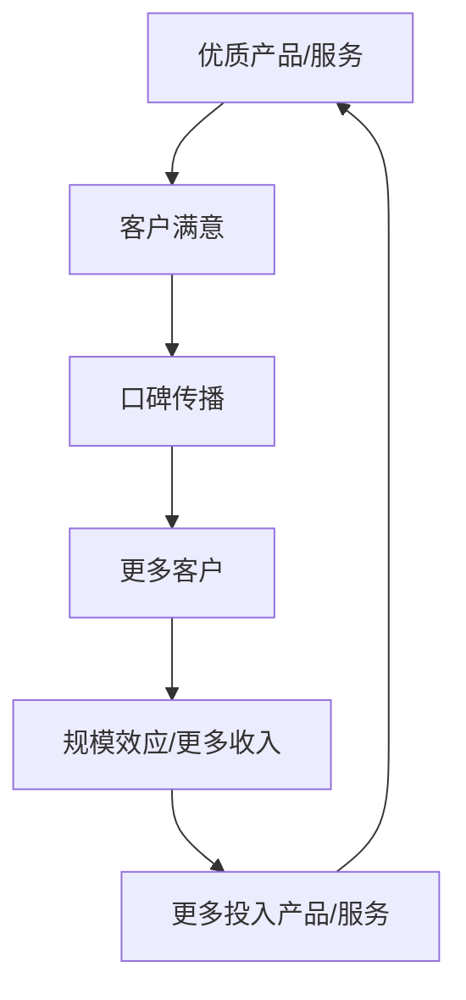
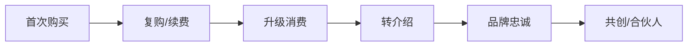
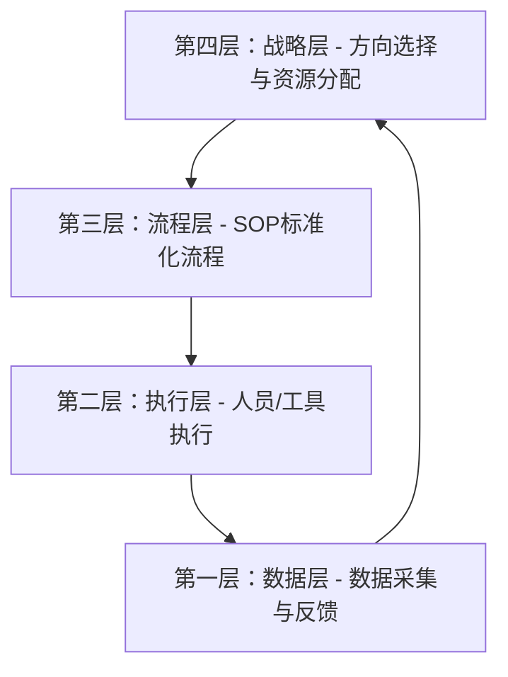
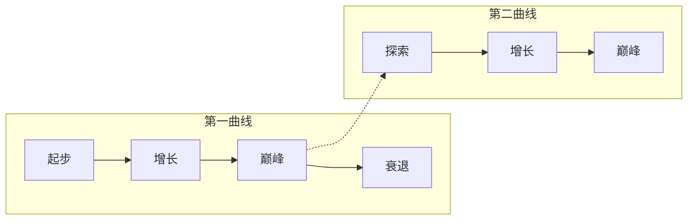
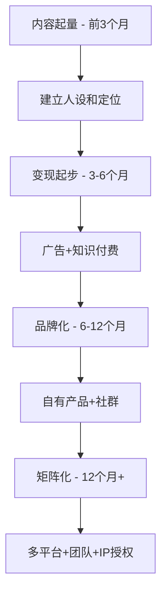
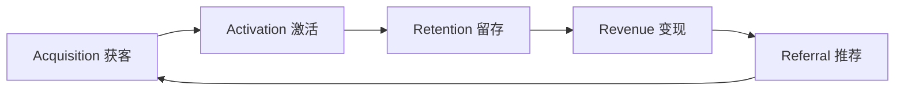

## 五、持续增长技巧

搞钱的第一桶金靠的是眼光和执行力，但从"赚到钱"到"持续赚更多的钱"，中间隔着一道巨大的鸿沟。很多人在起步阶段表现优秀——找到了一个好机会，快速验证，甚至跑通了盈利模型——但接下来就陷入了"增长停滞"：收入上不去，精力却越耗越多，最终要么倦怠放弃，要么原地踏步被后来者超越。

持续增长不是简单地"更多努力"，而是一套系统性的能力：如何让前期投入产生复利，如何构建自我强化的增长引擎，如何在变化的市场中保持上升曲线。本节将从底层原理到实操方法，完整拆解持续增长的技术体系。

---

### 1. 持续增长的底层原理

#### 1.1 什么是真正的"持续增长"

很多人把"持续增长"理解为线性增长——每月多赚一点。但真正有商业价值的增长模式是**指数增长**或**S型增长**，其核心特征是：**今天的努力在明天自动产生回报**。

三种增长模式的对比：

| 增长模式 | 特征 | 代表场景 | 长期结果 |
|----------|------|----------|----------|
| **线性增长** | 投入与产出1:1对应 | 按小时收费的自由职业 | 天花板=可用时间上限 |
| **指数增长** | 产出随时间加速放大 | 内容账号、SaaS产品、投资复利 | 天花板取决于市场容量 |
| **S型增长** | 初期缓慢→爆发增长→再次平台期 | 爆款产品、病毒传播 | 需要叠加第二曲线才能持续 |

搞钱的目标是**从线性模式切换到指数模式**。具体来说，你需要构建一种结构：前期投入固化为资产（内容、系统、品牌、客户关系），这些资产持续为你产生收入，而不需要你每小时都在场。

#### 1.2 增长飞轮理论

飞轮（Flywheel）是持续增长最核心的隐喻，由亚马逊创始人贝索斯系统化应用。飞轮的核心逻辑是：**每一个增长要素都推动下一个增长要素，形成自我强化的循环**。



关键洞察：飞轮最难的是**启动阶段**。从静止到转动需要巨大的推力，但一旦转起来，每一圈都会比上一圈更轻松。这解释了为什么搞钱的前6个月最难熬——你的飞轮还没转起来。

**不同赛道的飞轮结构**：

| 赛道 | 飞轮核心环 |
|------|-----------|
| 自媒体 | 优质内容 → 流量增长 → 品牌合作 → 更多资源 → 更优质内容 |
| 电商 | 好产品 → 好评价 → 平台推荐 → 更多销量 → 更多数据优化选品 |
| 知识付费 | 深度内容 → 学员口碑 → 新学员 → 收入支撑 → 深耕内容 |
| 技术服务 | 解决方案 → 客户成功 → 案例积累 → 行业口碑 → 更多客户 |
| 社群运营 | 核心成员 → 高质量互动 → 吸引新成员 → 更多价值 → 留住成员 |

**实操建议**：画出你当前搞钱方向的飞轮图，标出每个环节的当前状态（薄弱/中等/强），集中精力补强最薄弱的环节——木桶原理在飞轮中同样适用。

#### 1.3 复利效应的数学基础

爱因斯坦（据传）说过："复利是世界第八大奇迹。"在搞钱领域，复利的数学表达是：

```text
终值 = 初始值 × (1 + 增长率)^时间
```

这意味着两个关键杠杆：

- **提高增长率**：哪怕只提高10%的增长率，长期差异巨大
- **延长时间**：坚持越久，复利越恐怖

具体数字感受一下：

| 月增长率 | 6个月后 | 1年后 | 2年后 | 3年后 |
|----------|---------|-------|-------|-------|
| 5% | 1.34倍 | 1.80倍 | 3.23倍 | 5.79倍 |
| 10% | 1.77倍 | 3.14倍 | 9.85倍 | 30.9倍 |
| 15% | 2.31倍 | 5.35倍 | 28.6倍 | 153倍 |
| 20% | 3.00倍 | 8.92倍 | 79.7倍 | 713倍 |

这就是为什么两个看似起点差不多的人，3年后的收入可以差出10倍——差距不在起点，而在于是否构建了持续增长的引擎。

---

### 2. 持续增长的六大核心策略

#### 2.1 策略一：客户生命周期价值最大化

大多数搞钱者只关注"获取新客户"，却忽略了已有客户的巨大价值。一个残酷的事实：**获取新客户的成本是维护老客户的5-7倍**。持续增长的第一个杠杆，就是深度挖掘现有客户的价值。

**客户生命周期价值（LTV）模型**：



**提升LTV的五种方法**：

**方法一：建立复购机制**

复购不是等客户自己想起来，而是需要设计。具体做法：

- **订阅制/会员制**：将一次性交易变为持续性关系。比如：月度好物盒子、年度顾问服务、季度知识更新包
- **消耗品搭配**：卖了硬件卖耗材，卖了课程卖进阶版，卖了工具卖增值服务
- **定期触达**：每月给老客户发一次"专属福利"或"新内容通知"，保持存在感
- **复购阶梯**：设计3-5个消费层级，引导客户逐步升级

**方法二：转介绍体系**

满意的客户是最好的营销渠道，但你需要主动设计转介绍机制：

- **双向奖励**：推荐人和被推荐人各得好处（比如各减100元）
- **降低推荐门槛**：提供一键分享海报、推荐链接、专属口令
- **社交货币**：让推荐行为本身成为"有面子"的事（比如"我推荐的朋友都赚到了"）
- **数据追踪**：记录每个客户的推荐来源，分析哪类客户最愿意推荐

**案例：一个家政阿姨的增长飞轮**

李阿姨做家庭保洁，最初每小时收费50元，每天工作8小时，月收入约8000元。这是典型的线性增长——收入上限=时间上限。

她的增长策略：

1. **提升客单价**：学习收纳整理，将服务升级为"保洁+收纳"，客单价从50元/小时提升到80元/小时
2. **建立复购**：推出"月度包"（每月4次，每次打9折），锁定长期客户
3. **转介绍奖励**：老客户推荐新客户，双方各获一次免费深度清洁
4. **培训带人**：将标准化流程教给新人，自己抽成——从"卖时间"变成"卖系统"

半年后：月收入从8000元提升到2.5万元，其中60%来自团队抽成和复购客户，而她本人每天只需要工作4小时做质量把控。

#### 2.2 策略二：构建竞争壁垒

持续增长的前提是**不被轻易替代**。如果你的增长随时可能被竞争对手截断，那不叫持续增长，叫"借来的窗口期"。

**四种竞争壁垒类型**（按可持续性排序）：

| 壁垒类型 | 描述 | 建立时间 | 防御强度 | 案例 |
|----------|------|----------|----------|------|
| **品牌壁垒** | 客户对你的信任和偏好 | 1-3年 | ★★★★★ | 个人IP、行业口碑 |
| **网络效应** | 用户越多价值越大 | 1-2年 | ★★★★★ | 社群、平台、双边市场 |
| **数据壁垒** | 积累的行业数据和经验 | 6-18月 | ★★★★☆ | 客户画像、选品数据、用户行为 |
| **成本壁垒** | 规模化带来的成本优势 | 6-12月 | ★★★☆☆ | 供应链整合、批量采购 |

**对个人搞钱者来说，最现实的壁垒是品牌+数据**：

- **品牌壁垒的构建方法**：
  - 持续输出高质量内容（至少坚持6个月以上才能看到品牌效应）
  - 在特定领域建立"专家"认知（宁做小池大鱼，不做大池小虾）
  - 用真实案例和数据说话，而非自卖自夸
  - 保持一致性：人设、内容调性、服务质量长期稳定

- **数据壁垒的构建方法**：
  - 记录每一次成交的客户画像、来源渠道、转化路径
  - 积累行业Know-how：什么有效、什么无效、为什么
  - 将经验文档化、模板化、SOP化——变成可传承的系统

**警惕：最容易被攻破的"伪壁垒"**：

- 低价策略（任何人都能比你更低）
- 先发优势（后来者可以用更多资源快速追平）
- 单一平台依赖（平台规则一变，你就不复存在）

#### 2.3 策略三：打造增长引擎——杠杆运用

杠杆是持续增长的加速器。个人搞钱者的精力有限，必须学会借力。四种杠杆：

**杠杆一：内容杠杆**

一次创作，无限分发。一篇深度文章可以发布到公众号、知乎、小红书、头条、B站专栏等多个平台，触达数万甚至数十万人。内容的边际成本趋近于零，但收益可以持续累积。

内容杠杆的操作要点：
- **一次创作，多次分发**：同一篇内容根据平台特性改写成不同格式（长文→图文→短视频→音频）
- **常青内容优先**：优先创作"3年后依然有价值"的内容（方法论、底层原理），而非时效性热点
- **内容资产化**：将系列内容整理成课程、电子书、训练营，从"免费引流"升级为"付费变现"

**杠杆二：技术杠杆**

用工具和系统替代重复劳动。这是技术人员搞钱的天然优势，但非技术人员也可以借力。

| 重复劳动 | 技术杠杆替代方案 |
|----------|-----------------|
| 手动回复客户咨询 | 设置FAQ文档+智能客服机器人 |
| 逐个跟进订单 | CRM系统自动化跟进流程 |
| 手动发布内容 | 定时发布工具（如新媒体管家） |
| 手动统计数据 | 数据看板（如飞书/Notion仪表盘） |
| 逐个培训新人 | 标准化SOP文档+视频教程 |

**杠杆三：人脉杠杆**

单打独斗有上限，合作可以突破天花板。人脉杠杆不是"认识多少人"，而是"能调动多少资源"。

有效的人脉杠杆方式：
- **互推合作**：与同量级但不同赛道的创作者互相推荐
- **联合产品**：两个专长互补的人合作推出课程/产品（比如设计师+营销人合作出品牌设计课）
- **分销代理**：让他人帮你销售，按比例分成
- **专家顾问团**：遇到超出能力圈的问题，找到对的人咨询（付费咨询往往比自己摸索便宜10倍）

**杠杆四：资本杠杆**

当搞钱模型已经验证，可以用资金加速增长。但前提是**模型已经跑通**——在模型验证之前投入资金，是赌博不是杠杆。

资本杠杆的正确用法：
- 用利润（而非借款）再投入
- 投入产出比（ROI）> 2倍时才加大投入
- 保持6个月以上的现金安全垫
- 分批投入，边投边看数据

#### 2.4 策略四：建立可复制的增长系统

很多搞钱者的增长依赖个人英雄主义——自己能力很强，但无法规模化。持续增长要求你把"个人能力"变成"可复制的系统"。

**增长系统化的四层架构**：



**第一层：数据层** — 你必须知道什么在增长、什么在下降

必须追踪的核心指标：

| 指标类别 | 具体指标 | 追踪频率 |
|----------|----------|----------|
| **获客指标** | 新客户数、获客成本（CAC）、流量转化率 | 每周 |
| **留存指标** | 复购率、流失率、客户生命周期 | 每月 |
| **收入指标** | 月收入、客单价、LTV/CAC比值 | 每月 |
| **效率指标** | 人效（收入/工时）、毛利率 | 每月 |
| **增长指标** | 环比增长率、同比增长率 | 每月 |

关键比率：**LTV/CAC > 3** 是健康增长的标志。意思是：一个客户在整个生命周期内给你带来的收入，至少是你获取他成本的3倍。低于3倍说明增长不可持续。

**第二层：流程层** — 把重复工作SOP化

任何需要重复做两次以上的事情，都应该写成SOP（标准操作流程）。SOP的价值：

- 降低对个人能力的依赖（新人按SOP也能做到80分）
- 保证服务质量的一致性
- 为规模化扩张打下基础
- 释放你的时间去做更高价值的事

SOP模板结构：

```text
1. 目标：这个流程要达成什么结果？
2. 前置条件：开始前需要准备什么？
3. 步骤：一步一步的操作说明（配截图/示例）
4. 质量标准：怎样算"做好了"？
5. 常见问题：容易出错的地方和解决方法
6. 时间标准：正常情况下需要多久？
```

**第三层：执行层** — 谁来做、用什么工具

当SOP建立后，你需要决定每个环节是自己做、外包、还是用工具自动化。决策矩阵：

| | 高价值（需要判断力） | 低价值（重复性工作） |
|---|---|---|
| **核心业务** | 自己做 | SOP化后外包/工具化 |
| **非核心业务** | 找合伙人/顾问 | 直接外包或砍掉 |

**第四层：战略层** — 做正确的事

增长系统建立后，你的时间应该主要花在战略层：思考方向、分配资源、识别新机会。这是持续增长的最高层——从"做事的人"变成"决定做什么事的人"。

#### 2.5 策略五：第二曲线布局

任何增长都有天花板。当你的主营业务进入平台期（增长放缓、利润率下降、竞争加剧），你需要提前布局"第二曲线"。

**第二曲线的核心原则：在第一条曲线还在上升时就开始布局**



如果你等到第一曲线明显衰退才开始找第二条曲线，你已经晚了——因为新曲线也需要时间来起步和成长。

**第二曲线的三种类型**：

| 类型 | 描述 | 风险等级 | 案例 |
|------|------|----------|------|
| **能力延伸** | 用核心能力服务新市场 | 低 | 设计师从接单→开设计课→做设计工具 |
| **平台扩展** | 将业务扩展到新渠道/新地区 | 中 | 国内电商→跨境电商 |
| **全新赛道** | 进入完全不同的领域 | 高 | 自媒体人投资实体 |

**最推荐的路径是能力延伸**——风险最低，因为你用的是已验证的能力，只是换了交付方式或目标人群。

**第二曲线布局的时机信号**：

- 主营业务增长率连续3个月下降
- 竞争者数量明显增多，价格战开始
- 你的投入产出比（ROI）在持续下降
- 客户开始提出你的主营业务覆盖不了的新需求
- 行业出现技术变革或政策变化

#### 2.6 策略六：构建增长型团队

一个人走得快，一群人走得远。当你的搞钱模型验证成功后，单靠个人精力必然成为瓶颈。构建团队是突破增长天花板的必经之路。

**从个人到团队的三个阶段**：

**阶段一：外包协作（月收入5千-2万）**

不需要雇人，用外包解决非核心任务：
- 内容排版、封面设计 → 外包给设计（猪八戒、Fiverr）
- 视频剪辑 → 外包给剪辑师（闲鱼、剪映模板）
- 客服回复 → 外包给兼职（大学生、远程兼职平台）

关键原则：**先有稳定的现金流，再考虑外包支出**。外包费用不超过收入的30%。

**阶段二：核心团队（月收入2万-10万）**

组建2-3人的小团队：
- **你自己**：负责战略、核心内容、关键客户关系
- **执行搭档**：负责日常运营、内容发布、数据追踪
- **业务助理**：负责客服、订单处理、行政事务

薪酬模式建议：
- 基本薪资 + 业绩提成（激励与公司增长绑定）
- 初期可以用"合伙人"模式代替纯雇佣（给分红权而非高底薪）
- 先兼职试合作3个月，双方满意再全职

**阶段三：组织化运营（月收入10万+）**

建立完整的部门分工：
- 内容/产品团队
- 运营/营销团队
- 客服/售后团队
- 财务/行政

关键管理原则：
- 每个岗位有清晰的KPI和SOP
- 每周一次团队会议（不超过1小时）
- 用协作工具（飞书/钉钉/Notion）替代口头沟通
- 定期复盘：每月回顾增长数据，每季度调整策略

---

### 3. 持续增长的实操方法

#### 3.1 增长实验框架——ICE评分法

不是所有增长想法都值得投入资源。用ICE评分法筛选：

| 维度 | 含义 | 评分标准（1-10） |
|------|------|-----------------|
| **I - Impact（影响力）** | 如果成功，影响有多大？ | 1=微小改善，10=改变游戏规则 |
| **C - Confidence（信心）** | 成功的概率有多高？ | 1=纯赌博，10=几乎确定 |
| **E - Ease（简易度）** | 实施的难度和成本？ | 1=需要3个月+大量资金，10=1天内可完成 |

**ICE总分 = I × C × E**

每次有增长想法时，列出所有候选方案，打分排序，优先做总分最高的3个。

**示例**：

| 增长实验 | Impact | Confidence | Ease | 总分 | 优先级 |
|----------|--------|------------|------|------|--------|
| 优化标题提高点击率 | 7 | 8 | 9 | 504 | ★★★ |
| 推出高价进阶课程 | 9 | 5 | 4 | 180 | ★★ |
| 在B站开设视频号 | 8 | 6 | 5 | 240 | ★★ |
| 老客户转介绍计划 | 8 | 7 | 8 | 448 | ★★★ |
| 小红书矩阵账号 | 7 | 4 | 6 | 168 | ★ |

结论：先做"优化标题"和"转介绍计划"，投入产出比最高。

#### 3.2 每周增长复盘模板

持续增长需要持续复盘。每周花30分钟回答以下问题：

**一、数据回顾**
- 本周收入：____元（环比上周 +/-%）
- 新增客户/粉丝：____人
- 复购/回访率：____%
- 获客成本：____元/人

**二、增长实验回顾**
- 本周做了什么增长实验？结果如何？
- 什么有效？为什么有效？
- 什么无效？为什么无效？
- 下周要停止做什么？开始做什么？

**三、瓶颈诊断**
- 当前最大的增长瓶颈是什么？（流量？转化？复购？产能？）
- 这个瓶颈可以通过什么方式突破？
- 需要什么资源（时间/资金/人力/工具）？

**四、下周行动计划**
- 第一优先级：____
- 第二优先级：____
- 第三优先级：____

#### 3.3 不同阶段的增长重点

持续增长不是一个策略用到底，而是不同阶段有不同的重点：

| 阶段 | 收入范围 | 核心增长重点 | 关键动作 | 最大陷阱 |
|------|----------|-------------|----------|----------|
| **起步期** | 0-3000元/月 | 产品验证+获客 | 找到PMF（产品-市场契合） | 过早优化 |
| **成长期** | 3000-2万元/月 | 提升转化率+复购 | 优化销售流程，建立复购机制 | 盲目扩张 |
| **加速期** | 2万-10万元/月 | 规模化获客+团队 | 复制成功模式，搭建团队 | 管理失控 |
| **成熟期** | 10万+/月 | 效率优化+第二曲线 | 系统化运营，布局新业务 | 创新惰性 |

**起步期（0-3000元/月）的关键动作**：
- 用最少资源验证搞钱模型是否成立
- 重点关注"有没有人愿意付费"，而非"产品完不完美"
- 每天至少做3个获客动作（发内容、加社群、私信触达）
- 记录每一个客户反馈，快速迭代

**成长期（3000-2万元/月）的关键动作**：
- 分析哪些渠道的获客效率最高，集中资源
- 建立客户数据库，分析客户画像和行为
- 设计复购和转介绍机制
- 开始SOP化日常重复工作

**加速期（2万-10万元/月）的关键动作**：
- 复制已验证的增长模型到新渠道/新品类
- 搭建核心团队，从"自己干"变成"带人干"
- 建立数据仪表盘，用数据驱动决策
- 开始探索第二曲线

**成熟期（10万+/月）的关键动作**：
- 优化组织效率，降低边际成本
- 建立品牌壁垒和行业影响力
- 投入第二曲线，为下一个增长周期做准备
- 思考长期价值和社会影响

---

### 4. 持续增长中的常见陷阱与纠正

#### 陷阱一：追求虚荣指标

**表现**：粉丝数涨了很开心，但收入没涨；阅读量很高，但转化率为零。

**本质**：混淆了"增长的表象"和"增长的本质"。

**纠正方法**：
- 建立"北极星指标"——一个最能反映业务健康的数字
- 不同业务的北极星指标不同：
  - 自媒体：付费用户数（不是粉丝数）
  - 电商：月度GMV（不是浏览量）
  - 服务：客户满意度×复购率（不是客户数量）
  - 投资：年化收益率×最大回撤比（不是单次收益）
- 每周只看3-5个核心指标，拒绝数据焦虑

#### 陷阱二：过早优化

**表现**：产品还没验证就开始做品牌VI、注册商标、搭建复杂系统。

**本质**：用"做准备工作"的忙碌感替代"面对市场检验"的恐惧感。

**纠正方法**：
- 遵循"先脏后美"原则：先用最简陋的方式验证需求，再优化
- 在收入达到月均3000元之前，不要做任何"锦上添花"的事
- 问自己：这件事如果推迟3个月做，会损失什么？如果答案是"几乎不会"，那就推迟

#### 陷阱三：增长过快导致崩溃

**表现**：订单突然暴涨，但交付能力跟不上，客户体验急剧下降，口碑崩塌。

**本质**：增长速度超过了系统承载能力。

**真实案例**：某手工甜品师在小红书走红后，日订单从20单暴增到500单。她没有拒绝订单，而是全部接下来，结果：品质下降→大量差评→退货退款→资金链断裂→关店。

**纠正方法**：
- 设定"增长限速器"：当订单量超过产能的120%时，主动限流（涨价、排队、关闭入口）
- 增长前先扩产能：人手→流程→工具→库存，提前准备好
- 宁可慢一点，不可烂一点：口碑一旦崩塌，恢复成本是建立成本的10倍

#### 陷阱四：依赖单一增长渠道

**表现**：90%的客户来自一个平台（比如只做抖音、只做小红书）。

**本质**：把鸡蛋放在一个篮子里——平台规则变化、算法调整、政策收紧，任何一个都可能让你一夜归零。

**真实案例**：某母婴博主在某平台积累50万粉丝，因平台政策调整（限制商业导流），一夜之间失去90%的流量来源，月收入从5万降到3000。

**纠正方法**：
- 始终保持至少3个获客渠道
- 主要平台贡献不超过总收入的50%
- 将平台流量导入自己的私域（微信/企微/社群/邮件列表）
- 定期检查各渠道的健康度，及时分散风险

#### 陷阱五：忽视留存，只顾拉新

**表现**：每月新增100个客户，但同时流失80个，净增长只有20个。

**本质**：拉新是"往桶里倒水"，留存是"堵桶底的漏洞"。桶底漏水时，倒再多水也没用。

**纠正方法**：
- 先诊断流失原因：是产品质量问题？服务态度问题？还是客户不再需要了？
- 针对不同流失原因采取不同策略：
  - 质量问题→提升产品/服务质量
  - 服务问题→建立客户回访机制
  - 需求变化→开发新品类/新功能
- 建立客户健康度评分：根据活跃度、消费频次、互动程度打分，低分客户提前干预
- 流失率每降低5%，相当于获客效率提升20%以上

#### 陷阱六：线性思维做增长

**表现**：觉得"只要我多投入2倍的时间/精力，收入就能多2倍"。

**本质**：用体力劳动的逻辑来做增长，而不是用系统和杠杆。

**纠正方法**：
- 每次想要"更努力"之前，先问：这件事能不能用杠杆放大？
- 区分"杠杆活动"和"非杠杆活动"：

| 杠杆活动（高优先级） | 非杠杆活动（尽量委托/自动化） |
|---------------------|---------------------------|
| 创作常青内容 | 日常内容排版和发布 |
| 搭建自动化系统 | 手动回复常规客户咨询 |
| 建立合作关系 | 重复的数据录入工作 |
| 设计增长实验 | 日常运营的杂务 |
| 培训团队成员 | 维护社交账号日常互动 |

---

### 5. 不同搞钱路径的持续增长策略

#### 5.1 自媒体/内容创业的增长路径



各阶段具体增长动作：

**内容起量期**：
- 每天至少1条高质量内容，覆盖目标平台
- 研究同类Top10账号的选题、标题、封面，学习并超越
- 建立选题库（至少储备50个选题），保持更新频率
- 积极互动评论区，培养第一批铁粉

**变现起步期**：
- 开通平台创作者收益（如头条/知乎的创作者激励）
- 接第一批广告合作（哪怕价格低，积累案例）
- 推出第一个付费产品（9.9-99元的小产品试水）
- 建立私域社群（微信群/知识星球），将粉丝沉淀下来

**品牌化期**：
- 推出自有品牌产品（课程/训练营/实物产品）
- 与品牌方建立长期合作关系
- 出书/出版物建立权威性
- 开始做跨平台矩阵

**矩阵化期**：
- 主账号IP + 多个垂直子账号
- 培养团队内容生产能力
- 探索IP授权和品牌合作新模式
- 布局第二曲线（比如从内容到投资、到实业）

#### 5.2 电商/零售的增长路径

| 阶段 | 时间 | 关键增长动作 | 收入预期 |
|------|------|-------------|----------|
| 选品验证 | 1-2月 | 测试5-10个SKU，找到爆款潜力品 | 0-5000元 |
| 单品突破 | 2-4月 | 集中资源打爆1-2个单品 | 5000-3万元 |
| 品类扩展 | 4-8月 | 围绕爆款扩展相关品类 | 3万-10万元 |
| 供应链优化 | 8-12月 | 谈更好的进货价，提升利润率 | 10万+ |
| 多渠道+品牌 | 12月+ | 从平台电商到自有品牌 | 持续增长 |

电商持续增长的核心杠杆：
- **选品数据化**：用工具（生意参谋、蝉妈妈等）分析市场容量、竞争程度、利润空间
- **供应链深耕**：与工厂建立直供关系，获取独家货源和更低价格
- **客户资产化**：将平台客户导入私域，降低对平台流量的依赖
- **品牌溢价**：从卖"别人的货"到卖"自己的品牌"，利润率可以提升2-5倍

#### 5.3 技术服务/自由职业的增长路径

技术服务最容易陷入"时间换钱"的陷阱。持续增长的关键是**把时间卖多次**。

**增长阶梯**：

1. **接单模式**（月入5千-2万）：一对一服务客户，收入=时间×单价
2. **产品化模式**（月入2万-5万）：将服务标准化为"产品"——固定价格、固定交付物、固定流程
3. **订阅模式**（月入5万-15万）：推出月度/年度服务订阅（如技术顾问月费、系统维护年费）
4. **培训模式**（月入10万+）：将专业知识转化为课程/训练营，一对多交付
5. **SaaS模式**（无上限）：将解决方案做成软件产品，自动化交付

每一步都是在打破"时间=收入"的线性关系。最终目标是：即使你停止工作一个月，收入也不会归零。

#### 5.4 投资理财的持续增长策略

投资理财的持续增长遵循完全不同的逻辑——核心是**纪律+复利+时间**。

**持续增长的投资纪律**：

- **定投策略**：每月固定金额投入（不择时），长期摊平成本
- **再投资**：收益不取出，继续投入，享受复利
- **分散配置**：不把所有资金放在一个标的上
- **定期再平衡**：每季度/半年调整一次配比，卖出涨多的，买入跌多的
- **情绪隔离**：不因短期波动改变长期策略

**资产配置建议（仅供参考，非投资建议）**：

| 资产类别 | 占比建议 | 预期年化 | 风险等级 |
|----------|----------|----------|----------|
| 货币基金/银行存款 | 20-30% | 2-3% | 低 |
| 债券基金 | 20-30% | 4-6% | 中低 |
| 指数基金定投 | 30-40% | 8-12% | 中 |
| 个股/行业基金 | 10-20% | 不确定 | 高 |

---

### 6. 持续增长的检查清单

在每个月末，用以下清单审视你的增长状态：

**增长健康度检查**：

- [ ] 本月收入是否高于上月？（即使只高1%也是增长）
- [ ] 是否有至少3个获客渠道在正常运转？
- [ ] 老客户复购率是否在提升或维持？
- [ ] 是否投入了时间在"杠杆活动"而非只做"执行活动"？
- [ ] 核心数据指标是否清晰可见？（而不是"感觉还行"）
- [ ] 是否有一个正在测试的新增长实验？
- [ ] 客户满意度是否有追踪和反馈机制？
- [ ] 现金流是否健康？（至少有3个月的运营储备）
- [ ] 团队/合作伙伴关系是否稳定？
- [ ] 是否在为6个月后的增长做准备？（第二曲线探索）

**全部达标**：增长引擎运转良好，继续保持。
**7-9项达标**：增长基本健康，聚焦薄弱环节。
**5-6项达标**：增长出现隐患，需要认真诊断。
**5项以下**：增长可能已经停滞，需要重新审视整体策略。

---

### 7. 进阶：增长黑客思维

当基础增长策略跑通后，可以借鉴增长黑客（Growth Hacking）的思维方式来寻找非线性增长机会。

#### 7.1 AARRR海盗模型

这是增长黑客最经典的框架，覆盖用户全生命周期：



| 环节 | 核心问题 | 优化方法 |
|------|---------|----------|
| **获客** | 用户从哪里来？ | SEO、内容营销、社交裂变、付费投放 |
| **激活** | 新用户的首次体验是否足够好？ | 优化新手引导、降低使用门槛、提供即时价值 |
| **留存** | 用户为什么回来？ | 持续提供价值、建立使用习惯、社群连接 |
| **变现** | 用户愿意为什么付费？ | 付费墙设计、增值服务、阶梯定价 |
| **推荐** | 用户愿意推荐给别人吗？ | 双向奖励、社交货币、分享机制 |

#### 7.2 病毒系数（K因子）

衡量增长是否具有"自传播"能力的核心指标：

```text
K = 每个用户平均邀请人数 × 邀请转化率
```

- **K > 1**：每个用户带来的新用户超过1个，增长会自发加速（指数增长）
- **K = 1**：用户数量保持稳定
- **K < 1**：需要持续从外部获取新用户才能维持增长

提高K因子的三个杠杆：
1. **提高分享率**：让用户更愿意分享（奖励、社交货币、情感共鸣）
2. **提高邀请触达数**：让每个用户触达更多人（分享到更多平台、降低分享门槛）
3. **提高邀请转化率**：让被邀请的人更愿意注册/购买（优化落地页、提供专属优惠）

#### 7.3 增长实验的系统化方法

增长不是靠灵光一现，而是靠系统化的实验：

**增长实验四步法**：

1. **假设**：提出一个可验证的增长假设（如"优化落地页标题可以提升转化率20%"）
2. **设计**：设计最小化实验方案（如A/B测试，样本量100人）
3. **执行**：用最低成本执行实验（不要一次做太多变量）
4. **学习**：分析数据，得出结论，更新认知

**关键原则**：
- 每周至少运行1个增长实验
- 80%的实验会失败——这是正常的
- 记录每次实验的假设、方法、结果、结论
- 成功的实验要快速放大，失败的实验要快速止损

---

### 8. 案例深度拆解：从月入5千到月入5万的持续增长之路

**背景**：小王，90后，做了3年UI设计师，副业在闲鱼接设计单，月收入稳定在5000元左右。他想突破收入瓶颈。

**第一阶段：诊断瓶颈（第1个月）**

小王的现状分析：
- 收入来源：100%来自闲鱼接单（单一渠道）
- 工作模式：每单都自己做（无杠杆）
- 客单价：平均300元/单
- 月接单量：约17单
- 瓶颈：时间和精力已饱和，没有增长空间

**第二阶段：提升客单价（第2-3个月）**

- 将服务从"设计一个页面"升级为"品牌视觉方案"（含Logo+主图+详情页+社交媒体模板）
- 客单价从300元提升到1500元
- 月接单量从17单降到8单（精力有限），但收入从5100元提升到12000元
- 多出来的时间用来做内容和学习

**第三阶段：内容杠杆（第3-6个月）**

- 在小红书和B站开设账号，分享设计教程和接单经验
- 每周2条内容，每条花2小时
- 3个月后：小红书粉丝5000，B站粉丝3000
- 带来了新的客户来源（约30%的客户来自内容平台）
- 同时接到品牌合作邀约（设计工具推广），额外收入2000元/月

**第四阶段：产品化（第6-9个月）**

- 将常见设计需求整理成"设计模板包"，定价99-299元
- 上架到小报童和自己的小程序
- 月均模板销售：60份，月收入约8000元
- 这是**纯被动收入**——做一次，卖无数次

**第五阶段：团队化（第9-12个月）**

- 招了2个设计兼职（大学生），按单抽成
- 自己只做核心客户和质量把控
- 月接单量从8单提升到25单（自己做8单，团队做17单）
- 团队抽成收入：约5000元/月

**12个月后的收入结构**：

| 收入来源 | 月收入 | 占比 |
|----------|--------|------|
| 高端设计服务（自己做） | 12000元 | 24% |
| 团队设计服务（抽成） | 5000元 | 10% |
| 设计模板（被动收入） | 8000元 | 16% |
| 品牌合作/广告 | 5000元 | 10% |
| 设计课程（小报童） | 20000元 | 40% |
| **总计** | **50000元** | **100%** |

**关键增长节点复盘**：

| 节点 | 做了什么 | 结果 |
|------|---------|------|
| 提升客单价 | 从单页面→品牌方案 | 收入×2.4 |
| 内容杠杆 | 开小红书+B站 | 获客渠道从1个变3个 |
| 产品化 | 做设计模板 | 增加被动收入流 |
| 课程化 | 开设计训练营 | 打破时间天花板 |
| 团队化 | 招兼职设计师 | 产能翻倍 |

这个案例展示了持续增长的核心逻辑：**不是更努力地做同一件事，而是在不同阶段切换增长策略**。从接单→提价→内容→产品→团队，每一步都是在突破上一步的天花板。

---

*持续增长的本质不是速度，而是方向和结构。用对了杠杆，用对了系统，增长只是时间问题。回到本节的核心：**构建飞轮，让每一圈的努力推动下一圈的转动**。*
