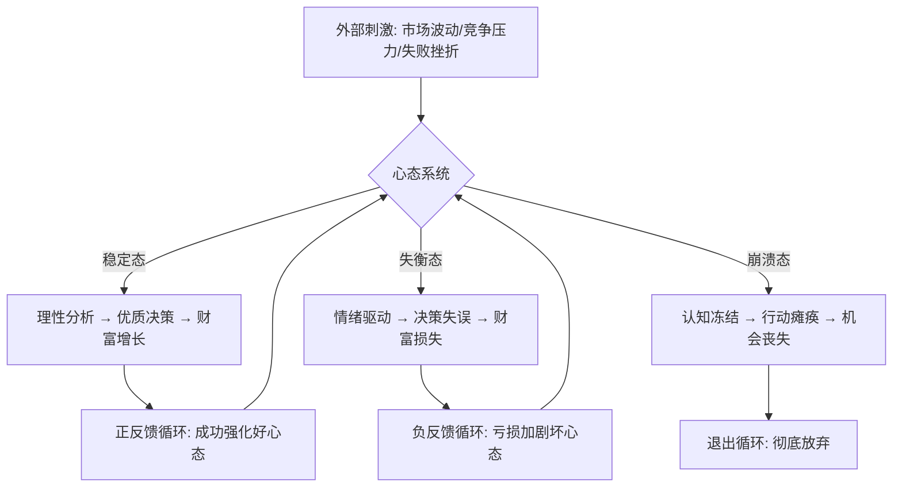
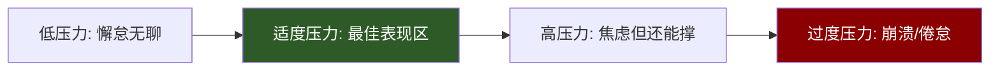

## 六、心态管理技巧

搞钱这件事，能力决定下限，心态决定上限。无数人有技术、有资源、有机会，却在关键时刻因为心态崩盘而功亏一篑。反过来，那些最终实现财富自由的人，往往不是最聪明的，而是心态最稳的。

心态管理不是心灵鸡汤，而是一套可以训练的心理操作系统。本节从认知重构、情绪调控、压力管理、长期主义思维、反脆弱心态五个维度，系统拆解搞钱路上的心态管理方法论。

### 1. 为什么心态是搞钱的核心基础设施

#### 1.1 心态对财富的影响机制

心理学研究表明，人类决策质量在情绪激动时会下降40%-60%。搞钱本质上是一系列高风险决策的累积过程——投资什么、投入多少、何时退出、如何分配资源——每一个决策节点都受到心态的直接影响。



#### 1.2 搞钱路上的四大心理陷阱

| 陷阱类型 | 典型表现 | 心理根源 | 实际危害 |
|---------|---------|---------|---------|
| 损失厌恶 | 亏损时死扛不止损，盈利时过早落袋 | 损失的痛苦感是同等收益快乐感的2.5倍 | 错过最佳退出时机，小亏变大亏 |
| 沉没成本谬误 | "已经投了这么多，不能放弃" | 对已投入资源的非理性执念 | 在错误方向上越陷越深 |
| 确认偏误 | 只看支持自己判断的信息，忽略反面证据 | 认知闭合需求，讨厌不确定性 | 决策质量持续下降 |
| 达克效应 | 初期小成后过度自信，低估风险 | 对自身能力的系统性高估 | 冒进导致严重亏损 |

#### 1.3 心态管理的ROI分析

投入心态管理的时间和精力，回报比远超大多数技能学习：

- **降低决策失误率**：稳定心态可将冲动决策减少70%以上
- **延长创业存活期**：心态管理能力与创业3年存活率正相关，相关系数约0.45
- **提升复利效应**：情绪稳定的投资者长期年化收益率比情绪化投资者高3-5个百分点
- **保护关系资本**：心态崩溃时的人际破坏往往不可逆，修复成本是维护成本的10倍以上

### 2. 认知重构：改变你看待钱和风险的方式

#### 2.1 从"打工思维"到"资产思维"的认知跃迁

打工思维的核心是用时间换钱——投入8小时产出固定的工资。资产思维的核心是构建能持续产生现金流的系统——前期投入大量时间，后期收入与时间脱钩。

这两种思维模式下，对同一件事的判断完全不同：

| 场景 | 打工思维反应 | 资产思维反应 |
|------|------------|------------|
| 花3个月做一个项目没赚到钱 | "浪费了3个月，亏大了" | "积累了经验和作品，这是资产" |
| 偶尔一个月收入为零 | "天塌了，下个月房租怎么办" | "正常波动，储备金够撑6个月" |
| 看到一个新机会 | "有风险，还是老实上班吧" | "评估风险收益比，值得试就试" |
| 别人赚到大钱 | "运气好/有关系/割韭菜" | "他做对了什么？我能学到什么？" |

#### 2.2 概率思维：用数学武装决策

搞钱不是赌博，但所有搞钱决策都涉及不确定性。概率思维是将不确定性转化为可管理风险的核心工具。

**贝叶斯更新法**：每获得新信息时，更新你对某个机会的判断概率，而不是固守第一印象。

```text
后验概率 = (先验概率 × 似然度) / 证据概率

实际应用：
初始判断：这个项目成功率 30%
发现团队很强（似然度 ×2）→ 更新为 60% × 0.3 / (0.6×0.3 + 0.4×0.7) ≈ 39%
拿到第一个客户（似然度 ×1.5）→ 再次更新...
```

**期望值计算**：每个决策都算期望值，而不是只看最好或最坏的情况。

```text
期望值 = 胜率 × 胜利收益 - 败率 × 失败损失

案例：
机会A：成功率60%，赚5万；失败率40%，亏2万
期望值 = 0.6×50000 - 0.4×20000 = 22000元 → 值得做

机会B：成功率20%，赚50万；失败率80%，亏5万
期望值 = 0.2×500000 - 0.8×50000 = 60000元 → 期望值更高，但需要评估你能否承受80%的亏损
```

#### 2.3 重新定义失败

传统定义：失败 = 不好的结果 = 应该避免的事

搞钱视角的定义：失败 = 一次实验的结果 = 有价值的数据点

硅谷创业文化中有一句话："Fail fast, fail cheap"（快速失败，低成本失败）。这不是在鼓励失败，而是在强调：失败是信息获取过程，关键在于控制每次失败的成本，同时最大化从失败中学到的东西。

**失败复盘四步法**：

1. **事实层**：发生了什么？客观记录过程和结果
2. **归因层**：哪些是可控因素，哪些是不可控因素？可控因素中哪些判断失误？
3. **学习层**：这个失败告诉了我什么之前不知道的信息？
4. **行动层**：基于这个学习，下次遇到类似情况我会怎么做？

完成这四步后，这次"失败"就转化成了一项"资产"——一个经过验证的认知升级。

### 3. 情绪调控：在高压环境下保持执行力

#### 3.1 搞钱路上的五种核心情绪及应对

**恐惧**：害怕亏损、害怕失败、害怕被嘲笑

恐惧是最普遍的搞钱障碍。它导致的不是"不做"，而是"做一半"——投入不够、承诺不足、遇到阻力就退缩。

应对策略：
- 设定"恐惧预算"：明确告诉自己"这笔钱我愿意用来学习"，把亏损重新定义为学费
- 恐惧具象化：写下你最害怕的具体场景（不是"亏钱"，而是"亏5万后需要吃3个月泡面"），然后评估这个场景的真实概率和真实后果
- 暴露训练：从小额风险开始，逐步提高承受阈值

**贪婪**：想要更多、更快、不满足

贪婪让人偏离既定策略，加杠杆、追热点、忽视风险信号。

应对策略：
- 制定卖出/退出规则并在情绪平静时写下来，贴在显眼位置
- 用"足够"代替"更多"——提前定义每个项目的成功标准
- 定期回顾自己的规则，问"我现在是因为贪婪还是理性在做这个决定？"

**焦虑**：不确定性带来的持续紧张感

搞钱路上的不确定性是常态。焦虑不会帮你做出更好的决策，只会消耗你的认知资源。

应对策略：
- 焦虑分流法：把焦虑的事分成"可行动"和"不可行动"两类，对可行动的立即制定计划，对不可行动的练习放下
- 设定"焦虑时间"：每天给自己15分钟专门焦虑，其他时间出现焦虑念头就告诉自己"等到焦虑时间再想"
- 身体先行：焦虑时先做5分钟高强度运动或深呼吸，生理层面打断焦虑循环

**嫉妒**：看到别人赚钱时的酸楚和自我怀疑

社交媒体放大了嫉妒效应。你看到的是别人的高光时刻，看不到的是他们的低谷和付出。

应对策略：
- 把嫉妒转化为信息：别人赚到钱说明市场有机会，分析他做对了什么
- 限制社交媒体浏览时间，尤其是投资/创业类内容
- 建立自己的进度跟踪系统，只和昨天的自己比较

**自满**：小有成就后的松懈和傲慢

自满是最隐蔽的杀手。它不会让你崩溃，但会让你停滞。

应对策略：
- 设定"增长飞轮"目标：每个阶段结束后立即设定下一个更高的目标
- 定期接触比你厉害的人，保持适度的不满足感
- 复盘时重点分析"运气成分"——哪些成功是可以复制的能力，哪些是不可复制的运气

#### 3.2 情绪日志：建立自我监控系统

每天花5分钟记录情绪状态，持续30天后你会发现自己的情绪模式。

**情绪日志模板**：

```text
日期：____
今日主导情绪：□平静 □兴奋 □焦虑 □恐惧 □愤怒 □沮丧 □自满
触发事件：____________________
情绪强度（1-10）：____
我的反应/决策：____________________
事后评估：这个反应是理性的吗？□是 □否
如果重新来过，我会：____________________
```

坚持记录后，你会识别出自己的情绪触发模式。比如：
- "每次看到竞争对手出新品我就焦虑，然后冲动跟进"
- "连续盈利3天后我就开始冒进"
- "和家人聊钱的事之后我会连续3天做保守决策"

识别模式后，你就可以在触发点和反应之间插入一个"暂停"——这就是情绪管理的核心：不是消灭情绪，而是在情绪和行动之间创造缓冲空间。

#### 3.3 TIPP技术：紧急情绪调控

当情绪已经失控（比如刚看到暴跌30%、刚被客户放鸽子、刚发现合伙人偷钱），需要快速把情绪从危险区拉回来。TIPP是辩证行为疗法（DBT）中的紧急干预技术：

- **T（Temperature，温度）**：用冰水洗脸或握住冰块30秒。冷刺激激活潜水反射，心率在30秒内下降10-20%
- **I（Intense exercise，高强度运动）**：做20个深蹲或快跑1分钟。高强度运动消耗肾上腺素
- **P（Paced breathing，节律呼吸）**：吸气4秒，屏气7秒，呼气8秒。重复3-5次，激活副交感神经
- **P（Paired muscle relaxation，渐进式肌肉放松）**：从脚趾到头顶，依次紧绷-放松每个肌肉群

TIPP不是解决根本问题的方法，但能让你在5分钟内恢复到可以做理性决策的状态。先稳住情绪，再处理问题。

### 4. 压力管理：在不确定性中保持长期战斗力

#### 4.1 压力的双刃剑效应

心理学中经典的"耶克斯-多德森曲线"表明：压力和表现之间是倒U型关系——完全没有压力时人会懈怠，适度压力时表现最佳，压力过大时表现崩溃。



搞钱的压力来源通常是叠加的：财务压力 + 时间压力 + 社交压力 + 自我期望压力。单独一个你可能扛得住，叠加在一起就容易崩。

#### 4.2 压力源分类与应对策略

| 压力类型 | 典型来源 | 短期应对 | 长期解决 |
|---------|---------|---------|---------|
| 财务压力 | 现金流紧张、债务、账单 | 紧急备用金、债务重组 | 建立3-6个月储备金系统 |
| 时间压力 | 截止日期、多项目并行 | 砍掉非核心任务 | 建立优先级矩阵和自动化流程 |
| 社交压力 | 家人不理解、同龄人比较 | 减少无效社交 | 找到同频社群，建立支持网络 |
| 信息压力 | 信息过载、决策疲劳 | 设定信息摄入限额 | 建立信息过滤和决策框架 |
| 健康压力 | 睡眠不足、久坐、缺乏运动 | 立即改善睡眠 | 把健康当作第一优先级资产 |

#### 4.3 建立压力缓冲系统

不要等到压力爆表才开始管理。建立日常的压力缓冲机制，让压力水平始终维持在最佳区间。

**身体层缓冲**：
- 睡眠是第一优先级。连续3天睡眠不足6小时，决策质量下降幅度等同于血液酒精浓度0.1%（超过醉驾标准）
- 每周至少3次30分钟以上的有氧运动，这是已知最强的抗焦虑处方
- 控制咖啡因摄入：下午2点后不喝咖啡，每天不超过400mg（约4杯标准咖啡）

**认知层缓冲**：
- 冥想不是玄学。每天10分钟正念冥想，持续8周后大脑前额叶皮层（负责理性决策）的灰质密度增加，杏仁核（负责恐惧反应）的灰质密度减少。这是神经科学的硬证据
- 阅读与搞钱无关的书——小说、历史、哲学。让大脑在"赚钱模式"和"休息模式"之间切换
- 定期与不搞钱的朋友交流，保持对生活的多元视角

**社交层缓冲**：
- 找到2-3个可以坦诚交流搞钱状态的"战友"。不是商业伙伴，而是可以互相倾诉压力、分享失败的同路人
- 与家人建立"搞钱透明度"：定期同步进展（包括坏消息），避免信息不对称导致的信任危机
- 必要时寻求专业心理咨询。这不是软弱的表现，而是高效能人士的标准操作

**财务层缓冲**：
- 建立"不可动用"的应急储备金，金额至少覆盖6个月基本生活开支
- 将搞钱项目的资金和个人生活资金严格隔离
- 设定最大亏损上限：任何单个项目/投资的亏损不超过总资产的10-20%

### 5. 长期主义思维：延迟满足与复利效应

#### 5.1 复利不只是数学公式

爱因斯坦（据传）说过："复利是世界第八大奇迹。"但大多数人在搞钱路上无法享受复利，不是因为数学不好，而是因为心理上无法承受前期的"几乎看不到增长"。

复利曲线的关键特征：**前期极其缓慢，后期指数爆发**。

```text
复利增长的直观感受（假设月增长5%）：
第1个月：100 → 105（增长5元，感觉"没什么用"）
第6个月：100 → 134（增长34元，"还行吧"）
第12个月：100 → 179（增长79元，"有点意思"）
第24个月：100 → 322（增长222元，"不错"）
第36个月：100 → 579（增长479元，"厉害了"）
第60个月：100 → 1867（增长1767元，"这就是复利的力量"）
```

大多数人在哪里放弃？第3-6个月——正好在"看不到明显效果"的阶段。

#### 5.2 延迟满足的心理训练

斯坦福棉花糖实验的后续研究发现，能够延迟满足的孩子在成年后收入更高、健康状况更好、人际关系更稳定。但延迟满足不是天生的，是可以训练的。

**训练方法一：把大目标拆成小里程碑**

"年入100万"太远了，你撑不过12个月的看不到头。拆解为：
- 第1个月：验证一个可行的方向（里程碑：第一个付费用户）
- 第3个月：月收入达到3000元（里程碑：覆盖基本生活费）
- 第6个月：月收入达到1万元（里程碑：超过上班工资）
- 第12个月：月收入达到3万元（里程碑：有了真正的自由感）

每个里程碑都给你一个"满足感补给点"，让你有动力继续走下去。

**训练方法二：建立"未来自我"连接**

神经科学研究发现，人们无法延迟满足的根本原因是：大脑把"未来的自己"当作"另一个人"。你不会为一个陌生人牺牲，所以也不会为"未来的自己"牺牲当下。

破解方法：经常想象未来的具体场景。不是"以后有钱了就好了"，而是"3年后我坐在自己办公室里，团队有5个人，每个月自动进账10万"。画面越具体，大脑越愿意为它付出。

**训练方法三：环境设计**

不要考验意志力——意志力是消耗品，每天用完就没了。通过环境设计减少诱惑：
- 手机上删掉短视频APP，想刷的时候需要重新下载（增加摩擦力）
- 工作时把手机放到另一个房间
- 和同样延迟满足的人在一起（社交影响力比意志力强10倍）

#### 5.3 拒绝短期暴利的诱惑

搞钱路上最大的心态考验之一，是看着别人"快速暴富"而你能稳住不动。

**短期暴利的真相**：

| 看到的现象 | 看不到的真相 |
|-----------|------------|
| 他3个月赚了100万 | 他背后可能有3年的人脉积累和行业认知 |
| 他靠XX币翻了10倍 | 和他同期入场亏了90%的人不会发朋友圈 |
| 他的副业月入5万 | 他可能在主业上有8年积累，副业只是变现 |
| 他辞职创业就成功了 | 90%的辞职创业者在18个月内回归打工 |

**建立自己的"机会过滤器"**：

当一个"暴利机会"出现在你面前时，问自己五个问题：

1. 我对这个领域有多少认知积累？（如果答案是"刚听说"，大概率是韭菜）
2. 这个机会的时间窗口有多长？（如果需要"现在立刻马上"，大概率是骗局）
3. 我能投入的最大损失是多少？（如果答案是"全部身家"，绝对不做）
4. 赚到钱的人有没有在持续赚？（如果是"只赚了一波"，那是运气不是能力）
5. 这个模式能否复制和规模化？（如果答案是"不能"，那是投机不是搞钱）

### 6. 反脆弱心态：从失败和逆境中变得更强

#### 6.1 脆弱、强韧与反脆弱

纳西姆·塔勒布在《反脆弱》中提出了三个概念：

- **脆弱**：遇到冲击就碎了（玻璃杯）
- **强韧**：遇到冲击不变（石头）
- **反脆弱**：遇到冲击反而变强（肌肉、免疫系统）

搞钱的目标不是成为石头——虽然不会碎，但也不会成长。目标是成为肌肉——每次经历压力后变得更强。

#### 6.2 构建反脆弱系统的四个策略

**策略一：杠铃策略**

不要把所有鸡蛋放在一个篮子里，也不要把鸡蛋平均放在10个篮子里。塔勒布建议：90%的资源放在极度安全的地方，10%放在极度高风险高回报的地方。

```text
杠铃配置示例：
├── 90% 低风险资产
│   ├── 60% 主业收入（稳定现金流）
│   ├── 20% 应急储备金（货币基金/定期）
│   └── 10% 低风险投资（指数基金/债券）
│
└── 10% 高风险探索
    ├── 5% 副业尝试（时间投入为主）
    └── 5% 高风险投资/创业（能承受100%损失的金额）
```

这样做的好处：最坏情况你损失10%，但10%中任何一项成功，回报可能是10倍、100倍。你的损失有上限，但收益没有上限。

**策略二：期权思维**

每个决策都当作买了一个期权——你付出了有限的成本（时间、金钱、精力），但获得了无限的上行空间。

搞钱中的期权思维应用：
- 学一门新技能 = 买了一个"未来可能用上"的期权
- 建立一段人脉 = 买了一个"未来可能合作"的期权
- 尝试一个副业 = 买了一个"未来可能爆发"的期权
- 写一篇文章/做一个产品 = 买了一个"未来可能被发现"的期权

关键原则：**控制下行（成本有限），开放上行（回报可能很大）**。

**策略三：冗余设计**

自然界中，人有两个肾、两片肺、两只眼睛。这种"冗余"看似浪费，实际上是生存的保障。

搞钱中的冗余设计：
- **收入冗余**：不依赖单一收入来源。主业之外至少有一个副业或投资在产生现金流
- **技能冗余**：不只掌握一种变现技能。当一个技能的市场需求下降时，另一个能接上
- **关系冗余**：不把所有社交资源押在一个圈子。不同圈子提供不同的信息和机会
- **现金冗余**：保持比"刚好够用"更多的现金储备。冗余的现金不是浪费，而是购买了"在机会出现时立即行动"的期权

**策略四：从失败中提取价值**

反脆弱的人不是不失败，而是每次失败都能从中提取价值。具体方法：

1. **快速失败**：控制每次失败的成本。用最小可行产品（MVP）验证想法，而不是一上来就投入全部资源
2. **记录失败**：建立"失败数据库"。记录每次失败的原因、损失、学到的东西
3. **分享失败**：把你的失败经历分享给同行。这不仅帮助别人避免同样的坑，也为你建立了"真实、可信"的个人品牌
4. **模式识别**：当失败积累到一定数量后，你会看到自己的"失败模式"——哪些类型的错误反复出现，哪些盲区一直没有填上

### 7. 心态管理的日常实践框架

#### 7.1 晨间心态准备（10分钟）

每天开工前，用10分钟做心态准备：

1. **感恩回顾**（2分钟）：写下3件你感恩的事。这不是鸡汤，而是神经科学验证的方法——感恩练习可以提升血清素水平，让你以更积极的状态开始一天
2. **今日目标确认**（3分钟）：明确今天最重要的1-3件事，以及它们与长期目标的关系
3. **预设困难**（3分钟）：想象今天可能遇到的最大困难，提前想好应对方案。这叫"心理预演"，运动员在大赛前都会做
4. **自我对话**（2分钟）：对自己说一句话，比如"今天我专注于我能控制的事，放下我不能控制的"

#### 7.2 晚间复盘（10分钟）

每天结束时，花10分钟做心态复盘：

1. **今日情绪复盘**：今天主导的情绪是什么？有没有被情绪影响决策？
2. **决策质量评估**：今天做的最重要的决策是什么？是理性驱动还是情绪驱动？
3. **进度确认**：今天向长期目标迈进了多少？哪怕只有1%也是进步
4. **明日准备**：明天最重要的事是什么？有没有需要提前准备的心态？

#### 7.3 月度心态体检

每个月做一次深度的心态自评：

| 评估维度 | 1分（很差） | 5分（一般） | 10分（很好） | 本月评分 |
|---------|-----------|-----------|------------|---------|
| 情绪稳定性 | 频繁失控 | 偶尔波动 | 基本稳定 | __ |
| 抗压能力 | 一压就垮 | 能撑但累 | 压力下依然高效 | __ |
| 延迟满足 | 只看眼前 | 能等但焦虑 | 享受长期过程 | __ |
| 失败韧性 | 一次失败就崩溃 | 能恢复但需要很久 | 快速恢复并学习 | __ |
| 决策质量 | 经常冲动 | 大部分理性 | 系统化决策 | __ |
| 自我认知 | 不了解自己 | 有基本认知 | 清楚自己的模式 | __ |

总分低于30分：需要立即调整节奏，暂停高风险决策
总分30-50分：正常范围，但有提升空间
总分50分以上：心态状态良好，可以承担更大的挑战

### 8. 案例：心态管理的真实影响

#### 8.1 案例一：从冲动交易到系统化投资

小李，28岁程序员，2023年开始接触加密货币投资。初期凭直觉交易，赚了一波后信心爆棚，加大投入。2024年初一次暴跌亏损了60%的本金。

心态变化过程：
- **崩溃期**（第1周）：失眠、焦虑、不断查看价格，甚至想过借钱抄底
- **调整期**（第2-4周）：开始记录情绪日志，意识到自己陷入了"损失厌恶 + 沉没成本"的双重陷阱
- **重构期**（第2-3个月）：建立了投资决策清单，设定了严格的仓位管理规则，不再凭感觉交易
- **稳定期**（第3个月后）：收益率不再大起大落，年化收益稳定在15-25%

关键转变：从"我要把亏的赚回来"变成"我要建立一个长期赚钱的系统"。

#### 8.2 案例二：从完美主义到快速迭代

小王，26岁设计师，想做自己的设计工作室。花了一年时间打磨作品集、设计网站、写商业计划书，始终觉得"还没准备好"，一直没开始接客户。

心态干预过程：
- 识别到核心问题：完美主义本质是恐惧的伪装——怕被拒绝、怕做得不好
- 设定"最小可行启动"标准：不再追求完美，设定"能展示80%的水平就够了"的门槛
- 行动：第1个月以极低价格接了3个小项目，边做边完善
- 结果：3个月后有了5个付费客户，6个月后月收入超过上班工资

关键转变：从"等我准备好了再开始"变成"在做的过程中变好"。

#### 8.3 案例三：从单点焦虑到系统性思考

小张，30岁电商卖家，每次看到竞品降价就焦虑，立刻跟进降价，导致利润越来越薄。每次平台规则变化就恐慌，频繁调整策略。

心态重构过程：
- 建立"焦虑分流表"：把所有焦虑事项分成"可控"和"不可控"
- 可控的：产品质量、客户服务、供应链效率、内容营销 → 制定行动计划
- 不可控的：平台规则、竞争对手定价、市场大环境 → 接受并做好预案
- 建立周度复盘机制：每周日花1小时评估本周的决策，区分"情绪驱动"和"数据驱动"
- 结果：6个月后利润率从8%提升到22%，因为不再盲目跟价，转而提升差异化价值

关键转变：从"对每个刺激做出反应"变成"对可控因素系统性优化"。

### 9. 常见误区与纠正

#### 误区一：心态管理 = 正能量 / 心灵鸡汤

纠正：心态管理不是"想开点""加油""相信自己"这种空洞口号。它是一套基于心理学和神经科学的系统方法，包括认知重构、情绪调控技术、行为设计、环境优化等具体可操作的手段。

#### 误区二：心态好 = 不会有负面情绪

纠正：心态管理的目标不是消灭负面情绪，而是不让负面情绪控制你的决策。恐惧、焦虑、愤怒都是正常的信号，关键是学会在情绪和行动之间插入一个"暂停"，让你有机会选择理性的回应而不是本能的反应。

#### 误区三：心态管理是天赋，有人天生心态好

纠正：大量研究表明，心态是可以通过训练改变的。神经可塑性（Neuroplasticity）意味着大脑可以通过重复的行为和思维模式被重塑。每天10分钟的正念冥想，持续8周就能在脑部扫描中看到物理变化。

#### 误区四：心态管理是软技能，不如学具体赚钱方法

纠正：同样的方法、同样的资源，心态不同的人执行出来结果天差地别。一个心态崩了的人拿着最好的项目也会搞砸；一个心态稳定的人拿着一般的项目也能做出成绩。心态不是"软"技能，而是"底层"技能——它决定了所有其他技能能否被有效发挥。

#### 误区五：只要赚钱了心态自然就好了

纠正：因果关系是反过来的——心态好了才能持续赚钱。很多人赚到第一桶金后心态膨胀，冒进导致更大亏损。也有人在亏损中保持冷静，逆势布局最终翻盘。心态不是结果的副产品，而是结果的因。

### 10. 进阶：高阶心态管理框架

#### 10.1 斯多葛控制二分法

古罗马斯多葛学派的核心智慧：把所有事情分为"你能控制的"和"你不能控制的"，然后把100%的精力放在前者上。

在搞钱场景中的应用：

| 你能控制的 | 你不能控制的 |
|-----------|------------|
| 你的努力程度 | 市场大环境 |
| 你的学习速度 | 竞争对手的行为 |
| 你的产品质量 | 客户是否购买 |
| 你的成本控制 | 平台的规则变化 |
| 你的情绪管理 | 别人对你的评价 |
| 你的风险敞口 | 黑天鹅事件 |

当你焦虑时，问自己："这件事我能控制吗？"如果能，制定行动计划；如果不能，练习放下。

#### 10.2 心流状态的刻意进入

心流（Flow）是心理学家米哈里·契克森米哈赖提出的概念：当你全身心投入一件事时，时间感消失，效率和创造力达到峰值。

进入心流的条件：
1. **明确的目标**：知道自己在做什么
2. **即时反馈**：能快速知道做得好不好
3. **挑战与技能匹配**：太简单会无聊，太难会焦虑，刚好在舒适区边缘最容易进入心流
4. **无干扰环境**：关掉通知，手机静音，告诉身边人不要打扰

在搞钱中的应用：
- 把大任务拆成有明确完成标准的小任务（条件1）
- 设置进度检查点，每完成一个模块就记录进度（条件2）
- 选择比你当前能力高10-20%的挑战（条件3）
- 建立"深度工作"时段，每天至少2小时不被打断（条件4）

#### 10.3 身份认同的重塑

最深层的心态管理，是改变你对自己的定义。

如果你认为自己是"一个打工的尝试做副业"，你遇到困难时会说"果然副业不靠谱"然后退回舒适区。

如果你认为自己是"一个正在构建资产系统的企业家"，你遇到困难时会说"这是必须克服的障碍"然后寻找解决方案。

**身份重塑练习**：

写下你5年后想成为的人的详细描述，包括：
- 你的身份标签是什么？（不是"有钱人"，而是具体的角色）
- 你每天的生活节奏是什么样的？
- 你的核心技能是什么？
- 你的社交圈是什么样的？
- 你解决问题的方式是什么？

然后问自己：这个人现在会怎么面对我当前的困境？

答案往往就是你应该做的选择。

### 11. 本节核心要点

1. **心态是搞钱的底层操作系统**：能力决定下限，心态决定上限。同样的方法和资源，心态不同结果天差地别
2. **认知重构是第一步**：从打工思维切换到资产思维，用概率思维替代直觉判断，把失败重新定义为数据点
3. **情绪不是敌人，失控才是**：学会识别五种核心情绪（恐惧、贪婪、焦虑、嫉妒、自满），用情绪日志建立自我监控，用TIPP技术做紧急干预
4. **压力需要系统管理**：建立身体层、认知层、社交层、财务层的四重压力缓冲系统
5. **长期主义靠的是方法论而非意志力**：拆解里程碑、建立未来自我连接、设计减少诱惑的环境
6. **反脆弱是终极目标**：用杠铃策略、期权思维、冗余设计、失败价值提取四套工具构建反脆弱系统
7. **心态管理是可训练的技能**：每天20分钟（晨间10分钟 + 晚间10分钟），一个月就能看到显著变化
