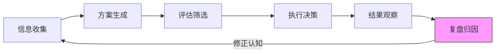
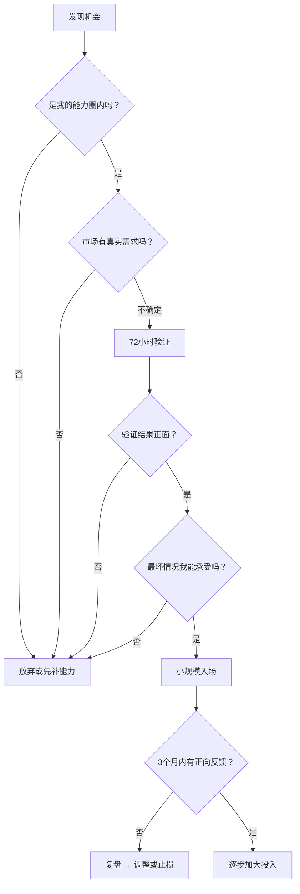

## 七、搞钱中的决策优化技巧

搞钱的过程本质上是一连串决策的叠加。从"做什么赛道"到"今天花不花钱推广"，从"要不要接这个客户"到"该不该放弃这个项目"——每一个决策都在塑造你的搞钱结果。数据显示，创业失败的案例中，超过 60% 的直接原因可以追溯到某个关键决策失误，而不是能力不足或运气不好。

决策优化不是让你变成"完美决策者"——那不存在。它的目标是：**在信息不完整、时间有限、资源受限的现实条件下，持续做出期望值更高的决策，并在犯错时快速修正。**

### 1. 决策的本质：为什么搞钱需要"决策优化"

#### 1.1 搞钱决策的三个特殊性

搞钱领域的决策，和日常生活决策有本质区别：

**特殊性一：反馈延迟长**

今天决定做一个产品，可能 6 个月后才知道这个决策对不对。不像打游戏——按一个键立刻看到效果。这种反馈延迟导致两个问题：决策者很难从结果中学习；坏决策的后果可能在你毫无察觉时慢慢积累。

**特殊性二：不可逆性强**

很多搞钱决策一旦做出就很难回头：签了租约、囤了库存、招了员工、投了广告。沉没成本会像锚一样把你拽在错误的方向上。不像选餐厅——选错了最多浪费一顿饭钱和一小时。

**特殊性三：信息永远不对称**

你不知道竞争对手在想什么，不知道市场明天怎么变，不知道你的客户内心真正要什么。你必须在"不完全信息"下做决策，同时对抗"我好像什么都知道"的错觉。

#### 1.2 决策质量 vs 决策结果

这是一个关键区分：**好的决策可能产生坏结果，坏的决策可能产生好结果。**

举个例子：
- 你花 3 个月做市场调研、验证需求、小规模测试，然后决定进入某赛道——这是好决策。但市场突变导致失败——这是坏结果，不是决策失误。
- 你朋友听了个赚钱的故事，第二天辞职 all in——这是坏决策。但恰好踩中风口赚到钱——这是好结果，不是决策正确。

**为什么要区分？** 因为如果你用结果来评判决策质量，你会：
- 把运气当实力（下次 all in 可能血亏）
- 把正确的谨慎当错误（放弃本来好的决策习惯）

搞钱中的决策优化，目标是提高"好决策"的比率，而不是追求每次都有好结果。



### 2. 六大认知偏差：搞钱路上的决策陷阱

人类大脑天生不适合做理性决策——这不是你的错，但你必须意识到并主动对抗。以下六个偏差在搞钱场景中出现频率最高、危害最大。

#### 2.1 沉没成本偏差

**表现**：因为已经投入了时间/金钱/精力，所以不愿意放弃一个明显不行的项目。

**搞钱场景**：
- "我已经投了 8 万块进去了，不能就这么放弃"——结果又亏了 5 万
- "这个副业我做了半年了，再坚持一下"——半年前的数据就已经说明方向错了
- "我花了 3 个月学这个技能，不用上太可惜了"——但市场根本不需要这个技能

**对抗方法**：

问自己一个关键问题：**"如果我现在从零开始，没有已经投入的成本，我还会做这个选择吗？"** 如果答案是"不会"，那应该立刻止损，不管已经投入了多少。

**实操框架——止损检查清单**：
- 当前项目每月净现金流是正是负？（连续 3 个月为负 = 红灯）
- 如果从零开始，我会选同样的方向吗？
- 剩余投入能否改变最终结果？（如果不能，止损）
- 我是在"坚持"还是在"逃避面对失败"？

#### 2.2 确认偏差

**表现**：只关注支持自己观点的信息，自动过滤掉反对意见。

**搞钱场景**：
- 想做一个项目，于是只搜"XX赛道赚钱"，跳过所有"XX赛道血亏"的帖子
- 听到朋友说"这个肯定赚钱"就信心倍增，听到"我觉得有风险"就自动忽略
- 看到竞品做得好，觉得"市场验证了"；看到竞品倒闭，觉得"他们能力不行"

**对抗方法**：

**"红队机制"**——每次做一个重要决策前，强制自己花 30 分钟专门搜集反对意见。具体步骤：

1. 把你的决策用一句话写下来
2. 搜索"[你的决策关键词] + 失败/亏钱/后悔/骗局"
3. 找到 3 条以上反对意见
4. 对每条反对意见认真评估：这个风险是否适用于我？
5. 如果有 2 条以上评估为"适用"，需要修改决策方案

**案例**：某创业者想做社区团购，先搜了"社区团购失败"，发现大量"生鲜损耗率高""团长管理难""用户忠诚度低"的案例。于是他调整策略：先从标品（米面粮油）切入，验证模型后再扩展生鲜，避免了最常见的损耗陷阱。

#### 2.3 从众效应（羊群效应）

**表现**：别人做什么就做什么，把"很多人在做"当成"这个能赚钱"的证据。

**搞钱场景**：
- "现在所有人都在做短视频，我也去做"
- "我身边 3 个人都在做跨境电商赚钱了，我也要入场"
- "这个赛道投资人都在投，肯定没问题"

**对抗方法**：

记住一个铁律：**当所有人都在涌入一个赛道时，这个赛道的红利期可能已经结束了。**

评估一个赛道时，关注三个信号：

| 信号 | 高红利期 | 红利消退期 |
|------|---------|-----------|
| 头部玩家利润率 | > 30% | < 15% |
| 新入场者成功率 | > 20% | < 5% |
| 行业讨论热度 | 专业圈内热议 | 大众媒体铺天盖地 |

**关键原则**：别人赚钱不等于你也能赚钱。你不知道别人的起点、资源、运气成分占比。进入一个赛道前，独立评估自己的竞争力，而不是看别人的结果。

#### 2.4 锚定效应

**表现**：被第一个接触到的数字/信息严重影响后续判断。

**搞钱场景**：
- 看到某个项目"月入 5 万"，就以 5 万为锚点来设定预期——实际上 90% 的人月入不到 5000
- 客户报价 500，你本来想收 2000，但被 500 锚定后只敢报 1000
- 看到某产品成本 10 元，就觉得卖 30 元"已经翻倍了"——但没算推广、物流、退货成本

**对抗方法**：

在做任何涉及数字的决策前，先独立建立自己的评估基准，再去看外部参考。具体做法：

1. 先用"自下而上法"估算：从成本结构、市场容量、竞争格局出发，得出自己的数字
2. 然后对比外部参考，看偏差有多大
3. 如果偏差超过 50%，先搞清楚差异原因，再做决策

**案例**：某自媒体博主接广告，品牌方报价 3000 元。如果被锚定，可能觉得"3000 不少了"。但他先按 CPM（千次曝光成本）独立计算：自己的平均阅读量 2 万，行业 CPM 约 50 元，合理报价应该是 1000 元/条。但加上精准粉丝的溢价和垂直领域的稀缺性，实际价值应该在 5000-8000 元。于是他报了 6000 元，最终以 5000 成交。

#### 2.5 过度自信偏差

**表现**：高估自己的能力、低估风险和不确定性。

**搞钱场景**：
- "我对这个领域很了解，不需要做市场调研"
- "别人失败是因为能力不行，我肯定没问题"
- "预计 3 个月就能盈利"（实际上行业平均是 12 个月）

**对抗方法**：

**"事前验尸"（Pre-mortem）法**——假设项目已经失败了，然后倒推失败原因。

操作步骤：
1. 在做决策之前，先写下："假设 6 个月后这个项目彻底失败了"
2. 团队或自己独立列出 5-10 个最可能的失败原因
3. 对每个原因评估：现在能做预防措施吗？
4. 把可以预防的措施加入行动计划

这个方法被心理学家 Gary Klein 提出，研究显示可以使决策准确率提高 30%。原因很简单：人在"已经失败"的假设下，更容易突破过度自信的屏障，看到真实风险。

#### 2.6 现状偏差

**表现**：倾向于维持现状，即使改变的期望收益明显更高。

**搞钱场景**：
- "现在的工作虽然工资低，但稳定啊"——不敢跳槽或开启副业
- "这个项目虽然不赚钱，但也不亏"——不敢停掉去做更有潜力的事
- "客户量还行，够生活了"——不敢投入精力做升级

**对抗方法**：

**计算"不行动的成本"**——大多数人只计算"行动的风险"，从不计算"不行动的代价"。

| 如果我不做X | 1年后 | 3年后 | 5年后 |
|------------|-------|-------|-------|
| 收入变化 | ? | ? | ? |
| 能力变化 | ? | ? | ? |
| 机会窗口 | 还开放 | 可能关闭 | 大概率关闭 |
| 竞争格局 | 竞争者少 | 竞争者增多 | 赛道拥挤 |

填完这张表，你会发现"保持现状"其实也有成本，而且往往随着时间推移成本越来越高。

### 3. 决策优化的四大核心框架

知道偏差还不够，你需要具体的决策框架来指导行动。以下四个框架覆盖搞钱决策中最常见的场景。

#### 3.1 期望值决策法

**适用场景**：面对多个搞钱选项，需要比较哪个更值得投入。

**核心公式**：

```text
期望值 = 成功概率 × 成功收益 - 失败概率 × 失败损失
```

**操作步骤**：

1. 列出所有可选方案
2. 对每个方案估算：成功概率、成功收益、失败概率、失败损失
3. 计算每个方案的期望值
4. 选择期望值最高的方案（前提：你能承受最坏情况）

**实战案例**：

假设你有两个副业选项：

| 维度 | 选项A：自媒体写作 | 选项B：代运营服务 |
|------|-------------------|-------------------|
| 成功概率 | 40% | 70% |
| 成功收益（年） | 20万元 | 6万元 |
| 失败概率 | 60% | 30% |
| 失败损失（年） | 2万元（时间成本） | 1万元 |
| 期望值 | 40%×20万 - 60%×2万 = **6.8万** | 70%×6万 - 30%×1万 = **3.9万** |

选项A期望值更高，但风险也更大。如果你的经济状况允许承受2万元损失，选A；如果你现在急需稳定收入，选B更合理。

**注意事项**：
- 概率估算不要拍脑袋——用行业数据、案例统计、小规模测试来估算
- 考虑"不可量化收益"：能力成长、人脉积累、品牌价值
- 当两个选项期望值差距小于 20% 时，选择"失败损失更小"的那个——活下来比赢一次更重要

#### 3.2 决策矩阵法

**适用场景**：涉及多个评价维度，需要综合权衡的复杂决策。

**操作步骤**：

1. 列出所有选项（行）
2. 列出所有评价维度（列）
3. 给每个维度分配权重（总和 = 100%）
4. 对每个选项在每个维度上打分（1-10分）
5. 加权求和，得分最高的为最优选项

**实战案例：选择搞钱赛道**

假设你有 3 个候选赛道，用决策矩阵评估：

| 评价维度 | 权重 | 赛道A：短视频 | 赛道B：技术咨询 | 赛道C：社群运营 |
|---------|------|--------------|----------------|----------------|
| 个人能力匹配 | 25% | 6分 | 9分 | 7分 |
| 市场需求 | 20% | 9分 | 7分 | 6分 |
| 启动成本 | 15% | 8分 | 5分 | 9分 |
| 天花板高度 | 15% | 9分 | 7分 | 5分 |
| 竞争程度 | 10% | 3分 | 7分 | 6分 |
| 学习曲线 | 10% | 6分 | 8分 | 7分 |
| 抗风险能力 | 5% | 5分 | 8分 | 6分 |

计算加权得分：
- 赛道A：6×0.25 + 9×0.20 + 8×0.15 + 9×0.15 + 3×0.10 + 6×0.10 + 5×0.05 = **6.85**
- 赛道B：9×0.25 + 7×0.20 + 5×0.15 + 7×0.15 + 7×0.10 + 8×0.10 + 8×0.05 = **7.20**
- 赛道C：7×0.25 + 6×0.20 + 9×0.15 + 5×0.15 + 6×0.10 + 7×0.10 + 6×0.05 = **6.50**

结论：赛道B（技术咨询）综合得分最高。虽然启动成本较高、天花板不算最高，但在最关键的"个人能力匹配"维度上得分最高，且风险最低。

**权重设定技巧**：
- 初创阶段：加大"启动成本""学习曲线"的权重
- 成长阶段：加大"市场需求""天花板高度"的权重
- 稳定阶段：加大"抗风险能力"的权重
- 不确定时：让 3 个你信任的人独立打分，取平均值

#### 3.3 二阶思维法

**适用场景**：评估一个决策的长远连锁影响，避免"看起来好但长远有害"的选择。

**核心逻辑**：不仅想"这个决策的直接结果是什么"，还要想"这个结果会引发什么后续反应"。

**操作框架**：

```text
一阶：这个决策直接带来什么？
二阶：这个直接结果会引发什么连锁反应？
三阶：这些连锁反应最终导向什么结局？
```

**实战案例**：

决策：要不要用低价策略抢占市场份额？

| 思维层级 | 分析 |
|---------|------|
| 一阶结果 | 价格降低 → 订单量增加 → 短期收入上升 |
| 二阶结果 | 利润率下降 → 竞争对手跟进降价 → 行业价格战 |
| 三阶结果 | 利润空间被压缩 → 没钱投入研发/服务 → 用户体验下降 → 客户流失 → 被迫提价但品牌已受损 |

**结论**：低价策略短期有效，但除非你有明确的"后续升级路径"（先用低价获客，再用增值服务提价），否则三阶结果是负面的。

**正确的做法**：不是"降价"，而是"提供差异化价值让客户觉得值"。比如同样的课程，别人卖 99，你卖 299 但包含 1 对 1 答疑——客户觉得 299 更值，你的利润率也更高。

#### 3.4 最小后悔值法（Minimax Regret）

**适用场景**：面对高度不确定的决策，目标不是"收益最大化"，而是"后悔最小化"。

**操作步骤**：

1. 列出所有选项和可能的市场情景
2. 计算每个选项在每个情景下的"后悔值"（该情景下的最优收益 - 该选项的收益）
3. 找到每个选项的"最大后悔值"
4. 选择"最大后悔值最小"的那个选项

**实战案例**：

你有 3 万元闲钱，面临三个选择：

| 情景 | 选项A：投入副业 | 选项B：稳健理财 | 选项C：学习投资 |
|------|----------------|----------------|----------------|
| 市场好 | +10万元 | +0.3万元 | +2万元（学费回报） |
| 市场一般 | +1万元 | +0.3万元 | +1万元 |
| 市场差 | -3万元 | +0.2万元 | +0.5万元 |

后悔值矩阵：

| 情景 | 选项A | 选项B | 选项C |
|------|-------|-------|-------|
| 市场好 | 0 | 9.7万 | 8万 |
| 市场一般 | 0 | 0.7万 | 0 |
| 市场差 | 3.2万 | 0 | 0.2万 |
| **最大后悔值** | **3.2万** | **9.7万** | **8万** |

选项A的最大后悔值最小（3.2万），意味着无论市场怎么变，你的"遗憾"都是可控的。而选项B虽然最安全，但在市场好的情况下你会后悔 9.7 万。

### 4. 数据驱动的决策系统

框架帮你做单次决策，但搞钱是一个持续决策的过程。你需要建立一个"数据决策系统"，让每次决策都有据可依。

#### 4.1 核心指标体系

搞钱过程中，你需要持续跟踪的指标分为三层：

**第一层：生存指标（每天看）**

| 指标 | 定义 | 健康基准 |
|------|------|---------|
| 日/周现金流 | 收入 - 支出 | 持续为正 |
| 客户获取成本（CAC） | 总营销支出 ÷ 新客户数 | < 客户终身价值的 1/3 |
| 转化率 | 成交数 ÷ 有效接触数 | 因行业而异，持续提升即可 |

**第二层：增长指标（每周看）**

| 指标 | 定义 | 健康基准 |
|------|------|---------|
| 月收入增长率 | (本月 - 上月) ÷ 上月 | > 5%/月（初期） |
| 客户留存率 | 续费/复购客户 ÷ 总客户 | > 60% |
| 口碑推荐率 | 推荐来的客户 ÷ 总新客 | > 20% |

**第三层：战略指标（每月看）**

| 指标 | 定义 | 健康基准 |
|------|------|---------|
| 客户终身价值（LTV） | 客户平均总消费额 | LTV > 3 × CAC |
| 毛利率 | (收入 - 直接成本) ÷ 收入 | > 50%（服务类）/ > 30%（实物类） |
| 时间投入产出比 | 月收入 ÷ 月投入小时数 | 持续上升 |

#### 4.2 决策日志系统

**这是最被低估的决策工具。** 每做一个重要决策时，花 5 分钟记录以下信息：

```markdown
## 决策日志模板

**日期**：YYYY-MM-DD
**决策内容**：（一句话描述你做了什么决定）
**决策背景**：（为什么要做这个决定？触发事件是什么？）
**预期结果**：（你期望发生什么？用具体数字）
**预期时间线**：（预计多久能看到结果？）
**信心程度**：（1-10分，你对这个决策有多大把握？）
**关键假设**：（这个决策成立的前提条件是什么？）
**替代方案**：（你还考虑了哪些选项？为什么排除了？）

---

**实际结果**：（回填：最终发生了什么？）
**复盘分析**：（预期 vs 实际，偏差在哪？原因是什么？）
**经验提炼**：（下次遇到类似情况，我会怎么做？）
```

**为什么有效**：
1. 强迫你把模糊的直觉变成清晰的文字，暴露逻辑漏洞
2. 积累 3-6 个月后，你能发现自己决策中的系统性偏差（比如总是高估成功率）
3. 复盘时有据可查，而不是靠模糊的记忆来"自我美化"

**案例**：某自由职业者做了 6 个月决策日志后发现，自己在"接大项目"时的成功率只有 30%（预期 70%），原因是大项目需求变更率高、自己的交付时间估算总是偏乐观。于是他调整策略：大项目拆成小里程碑、每个里程碑单独报价、预估工时乘以 1.5 的系数。调整后项目利润率从 15% 提升到 45%。

#### 4.3 A/B 测试思维

不要用"猜"来做决策，用"试"来获取数据。

**适合 A/B 测试的搞钱场景**：

| 场景 | 测试变量 | 方法 |
|------|---------|------|
| 定价策略 | 高价 vs 低价 | 两组客户分别报价，比较成交率和利润率 |
| 内容方向 | 题材A vs 题材B | 各发10条内容，比较数据表现 |
| 获客渠道 | 渠道A vs 渠道B | 各投入等量预算，比较获客成本 |
| 产品功能 | 有功能X vs 无功能X | 两组用户体验，比较留存率 |
| 话术脚本 | 版本A vs 版本B | 各用一周，比较转化率 |

**操作原则**：
1. 一次只测试一个变量——否则你不知道是哪个因素在起作用
2. 样本量足够大——至少各 30 个样本才有统计意义
3. 测试周期足够长——至少覆盖一个完整业务周期（比如一周/一个月）
4. 记录数据而非凭感觉——用表格或工具记录，不要靠"我觉得B更好"

### 5. 关键决策场景的实操指南

理论讲完了，下面进入搞钱过程中最常见的五个决策场景，给出具体操作方案。

#### 5.1 该不该入场？——赛道选择决策

**决策触发点**：你发现了一个看起来不错的搞钱机会。

**决策流程**：



**72小时验证法具体操作**：

- 第1天（0-8小时）：深度调研。搜索该赛道的行业报告、竞品分析、失败案例。重点回答：这个赛道的总盘子有多大？头部玩家的利润率是多少？入场门槛是什么？
- 第2天（8-24小时）：接触目标客户。找 5-10 个潜在客户聊天（微信群、朋友圈、论坛），问三个问题：你现在怎么解决这个问题？你愿意为更好的方案付多少钱？如果有个XX产品/服务，你会用吗？
- 第3天（24-72小时）：最小化测试。用最低成本做一个"假装有这个产品"的测试——可以是一个朋友圈、一个简单的落地页、一个微信群。观察有没有人真正表现出付费意愿。

**判断标准**：
- 有 3 个以上目标客户表示愿意付费 → 继续推进
- 只有 1-2 个表示有兴趣但不愿意付费 → 需要调整价值主张
- 没有人感兴趣 → 大概率方向有误，重新评估

#### 5.2 该不该坚持？——止损 vs 坚持的决策

**这是搞钱中最难的决策。** 没有标准答案，但有评估框架。

**坚持指数评估表**：

| 评估维度 | 坚持的信号（+1分） | 止损的信号（-1分） |
|---------|-------------------|-------------------|
| 趋势方向 | 行业整体在增长 | 行业整体在萎缩 |
| 核心指标 | 关键指标在缓慢改善 | 关键指标持续恶化 |
| 用户反馈 | 用户说"如果XX就好了" | 用户说"我不需要这个" |
| 竞争格局 | 竞争对手在退出 | 大量新竞争者涌入 |
| 现金流 | 还能撑 6 个月以上 | 3 个月内会断粮 |
| 团队状态 | 团队在学习和进化 | 团队在内耗和消耗 |
| 个人成长 | 即使失败也能收获能力 | 除了钱什么也学不到 |

**评分标准**：
- 总分 > +3：坚定继续，加大投入
- 总分 0 到 +3：继续但设严格止损线（比如再给 3 个月）
- 总分 < 0：立即止损，转向新方向

**关键提醒**：不要在情绪低谷时做"坚持还是放弃"的决策。给自己 48 小时冷静期，用数据和框架来判断，而不是用情绪。

#### 5.3 该不该扩张？——规模化决策

**决策触发点**：当前模式已经跑通，要不要加大投入扩大规模。

**扩张前的四道检验门**：

**检验门1：利润率检验**
- 当前模式的利润率是否 > 20%？
- 如果利润率 < 20%，扩张只会放大亏损
- 先优化单店/单项目利润，再谈扩张

**检验门2：可复制性检验**
- 当前的成功模式能被复制吗？关键依赖是什么？
- 如果成功高度依赖个人能力/特殊资源 → 不可复制，扩张风险极高
- 如果成功依赖标准化流程/SOP → 可复制，扩张风险较低

**检验门3：现金流检验**
- 扩张需要多少前期投入？
- 最坏情况下，这些投入能在多久内回本？
- 回本期间，你有没有足够的现金储备维持运营？

**检验门4：机会成本检验**
- 扩张这个方向的精力投入，有没有更好的替代方案？
- 有时候"深耕现有客户"比"获取新客户"的投入产出比更高

**扩张节奏公式**：

```text
合理的扩张速度 = 当前现金流 × 3个月安全系数 × 可复制性系数
```

- 可复制性系数：高（SOP完善）= 0.7，中 = 0.5，低（依赖个人）= 0.3
- 意思是：你最多投入"3个月安全现金"的 70% 用于扩张，留 30% 作为缓冲

#### 5.4 该不该合作？——合伙/合作决策

**决策核心**：合作能不能产生 1+1 > 2 的效果？

**合作前的五问清单**：

1. **互补性**：对方有我没有的，我有对方没有的吗？（同质化合作 = 内耗）
2. **价值观**：在"赚快钱还是长期做"这个问题上，我们看法一致吗？（不一致 = 定时炸弹）
3. **退出机制**：如果合作不顺利，怎么散伙？（没有退出机制 = 不要开始）
4. **贡献量化**：每个人的贡献怎么衡量？（模糊的贡献分配 = 未来的争吵源头）
5. **最坏假设**：如果这个合作亏了 10 万，我们的关系还能维持吗？（不能 = 不要合作）

**合作合同必备条款**（哪怕是朋友之间的口头合作，也要白纸黑字写下来）：

| 条款 | 内容 |
|------|------|
| 出资比例 | 每个人出多少钱/多少资源 |
| 利润分配 | 怎么分钱，什么时候分 |
| 决策权限 | 谁能拍板哪些事 |
| 退出机制 | 怎么退出，退出时怎么算账 |
| 竞业限制 | 退出后能不能做同类业务 |
| 争议解决 | 有分歧怎么处理 |

#### 5.5 该不该借钱/融资？——资金决策

**核心原则：用别人的钱搞钱，只有在"回报率远高于资金成本"时才合理。**

**借款决策检查清单**：

- [ ] 这笔钱的预期回报率 > 借款利率 × 2？（留安全边际）
- [ ] 最坏情况下，我能按时还本付息吗？
- [ ] 如果这笔钱全亏了，我的生活会不会陷入困境？
- [ ] 这笔钱是用来"撬动增长"还是"维持生存"？（后者不应该借）
- [ ] 我有没有比借钱更好的替代方案？（预售、合伙、压缩开支）

**绝对不能借钱搞钱的三种情况**：
1. 你还没有跑通赚钱模型——借钱只会加速亏损
2. 借款来源是高利贷/信用卡套现——资金成本太高
3. 你借钱的目的是"赌一把翻本"——这是赌博不是搞钱

### 6. 高效决策的日常习惯

决策优化不是一次性的事，而是需要通过日常习惯来持续训练。

#### 6.1 每日决策复盘（5分钟）

每天睡前花 5 分钟回答三个问题：
1. 今天我做的最重要的搞钱决策是什么？
2. 我是基于什么信息/逻辑做出这个决策的？
3. 如果重来一次，我会做同样的决定吗？

#### 6.2 每周决策审计（30分钟）

每周日花 30 分钟回顾本周的所有决策：
1. 列出本周做出的 5-10 个搞钱相关决策
2. 对每个决策标注：高信心 / 中信心 / 低信心
3. 重点回顾"低信心"的决策——这些是你最可能犯错的地方
4. 检查有没有"拖延的决策"——该做决定但一直拖着，本身就是一个决策（选择了不作为）

#### 6.3 每月决策校准（1小时）

每月花 1 小时做深度校准：
1. 回顾本月的决策日志，检查"预期 vs 实际"的偏差
2. 识别自己的系统性偏差——是总高估成功率？还是总低估成本？
3. 更新自己的决策参数——比如把"预期成功率"下调 20%
4. 设定下个月的决策重点——哪些决策需要特别谨慎

#### 6.4 建立决策委员会

一个人的视角有限。建立一个 3-5 人的"决策顾问团"：
- 至少 1 个比你经验丰富的人（看更远）
- 至少 1 个和你行业不同的人（看更广）
- 至少 1 个敢于直言反对你的人（看真相）

不需要正式组织，只需要在重大决策前，把你的方案发给他们看看，听听不同声音。这个简单的动作，可以过滤掉 50% 以上的冲动决策。

### 7. 决策优化的进阶工具

#### 7.1 贝叶斯更新思维

不要用"非黑即白"的方式看待搞钱机会，而是持续更新你对某个机会的"置信度"。

**操作方法**：

1. 初始置信度：在做任何调研之前，你对这个机会的信心程度（比如 30%）
2. 获取新证据：做市场调研、和客户聊天、看行业数据
3. 更新置信度：每个正面证据提高信心，每个负面证据降低信心
4. 决策阈值：当置信度超过 70% 时，开始行动

**实例**：
- 初始："AI 写作工具能赚钱吗？" → 置信度 30%
- 看到行业报告显示 AI 写作市场年增长 40% → 置信度 45%
- 和 10 个目标用户聊，7 个表示愿意付费 → 置信度 65%
- 做了 MVP，3 天内有 5 个付费用户 → 置信度 80%
- **决策**：开始投入更多资源

#### 7.2 决策矩阵的加权敏感性分析

当你用决策矩阵做完评估后，检查一下：**如果权重变 了，结论还成立吗？**

操作方法：
1. 把权重最高的维度的权重降低 10%，分配给其他维度
2. 重新计算得分
3. 如果结论变了 → 这个决策对权重很敏感，需要更谨慎
4. 如果结论没变 → 这个决策比较稳健

#### 7.3 10-10-10 法则

面对纠结的决策时，问自己三个问题：
- 这个决定在 10 分钟后，我会怎么想？
- 这个决定在 10 个月后，我会怎么想？
- 这个决定在 10 年后，我会怎么想？

这个方法帮助你跳出短期情绪，用更长远的视角来评估决策。很多让你现在纠结得要死的决策，放到 10 年的尺度上，根本无足轻重。

### 8. 决策误区与纠正

| 常见误区 | 表现 | 纠正方法 |
|---------|------|---------|
| 追求完美决策 | 纠结太久错过窗口期 | 设定决策截止时间——"这个决定我必须在周五前做出" |
| 过度依赖直觉 | "感觉这个能赚钱" | 直觉可以做起点，但必须用数据验证 |
| 分析瘫痪 | 收集了大量信息但不做决定 | 信息永远不完整——掌握 70% 的信息就该行动 |
| 随大流不做判断 | "大家都这么做" | 独立评估，关注"大家"的结果分布而非个案 |
| 只看收益不看风险 | "万一成了呢" | 每次决策前强制计算最坏情况 |
| 决策后不复盘 | 做完决定就不管了 | 用决策日志持续追踪 |
| 情绪化决策 | 心情好时过于激进，心情差时过于保守 | 重大决策不在情绪极端时做，等48小时 |

### 9. 本节核心要点回顾

1. **搞钱决策有三个特殊性**：反馈延迟长、不可逆性强、信息不对称——理解这些才能避免用日常决策的习惯来做搞钱决策
2. **六大认知偏差**是决策质量的最大敌人：沉没成本、确认偏差、从众效应、锚定效应、过度自信、现状偏差——认识它们是对抗的第一步
3. **四大决策框架**覆盖主要场景：期望值法（选赛道）、决策矩阵法（多维权衡）、二阶思维法（长远连锁反应）、最小后悔值法（高度不确定环境）
4. **数据驱动**是持续优化的基础：核心指标体系 + 决策日志 + A/B 测试
5. **五个关键场景**需要专门的决策流程：入场决策、止损决策、扩张决策、合作决策、资金决策
6. **日常习惯**比单次技巧更重要：每日复盘、每周审计、每月校准、决策顾问团
7. **决策优化的本质**不是追求每次正确，而是在信息不完整的条件下持续提高"好决策"的比率，并在犯错时快速修正

> **行动建议**：从今天开始，做三件事——①记录你做的第一个搞钱决策日志；②列出你当前面临的最重要的搞钱决策，用本节的框架分析一次；③找一个你信任的人，和他讨论你的决策。光是"把决策写下来"这一步，就能让你的决策质量提升 30%。
