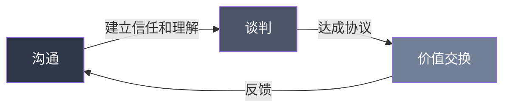
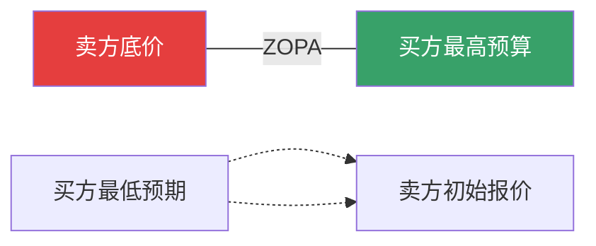
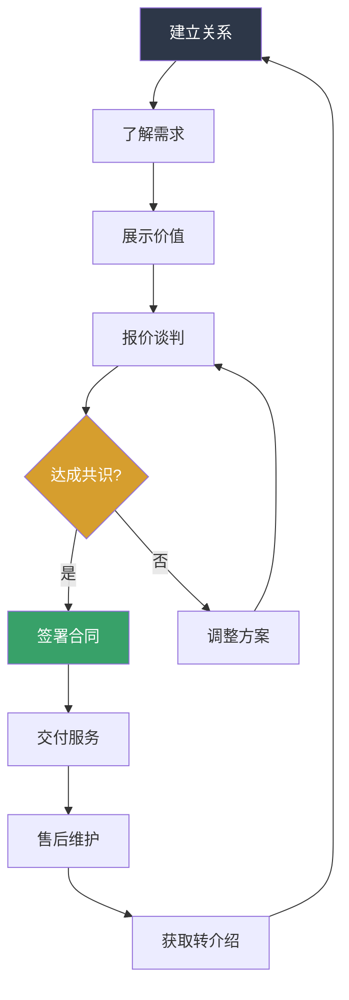

## 八、搞钱中的沟通与谈判技巧

搞钱的本质是价值交换，而沟通与谈判是价值交换的核心媒介。同样一个产品，会沟通的人能卖10倍价格；同一个岗位，会谈判的人能多拿50%薪资。本章系统拆解搞钱场景中的沟通与谈判体系，从底层心理机制到具体话术模板，帮你系统提升赚钱能力。

---

### 1. 为什么沟通与谈判是搞钱的核心能力

#### 1.1 价值传递的底层逻辑

赚钱的过程可以抽象为三步：创造价值→传递价值→获取回报。大多数人把精力花在"创造价值"上——学技能、做产品、写代码，却忽略了"传递价值"才是决定收入上限的关键。

举一个直白的例子：两个技术能力相当的程序员，A只会埋头写代码，B能清晰地向上级汇报技术决策的商业价值、能在跨部门会议中说服产品接受技术方案、能在客户面前把复杂系统讲得通俗易懂。三年后，B的收入大概率是A的2-3倍，因为B的价值被"看见"了。

#### 1.2 谈判能力的经济回报

谈判能力是可以量化的经济技能。以下是几个典型场景的回报：

| 场景 | 不谈判 | 善谈判 | 差距 |
|------|--------|--------|------|
| 薪资谈判（入职时） | 月薪15K | 月薪20K | 年差6万 |
| 项目报价（自由职业） | 报价5万 | 报价8万 | 单项目差3万 |
| 供应商采购（创业者） | 全价采购 | 折扣+账期 | 年节省10-30% |
| 商业合作分成 | 五五分 | 七三分 | 长期累积巨大 |

一次成功的谈判，可能相当于你多干几个月。这种能力的投资回报率极高。

#### 1.3 沟通与谈判的区别与联系

很多人把沟通和谈判混为一谈，但它们有本质区别：

**沟通**的目标是"理解与被理解"，重点是信息传递的准确性和情感连接的建立。日常的客户维护、团队协作、社交媒体运营，本质上都是沟通。

**谈判**的目标是"达成对自己有利的协议"，重点是利益分配。薪资讨论、合同签署、商业合作分成，这些是谈判场景。

两者的联系在于：好的谈判建立在好的沟通之上。如果你连对方的需求都没听懂，不可能谈出好结果。



---

### 2. 搞钱沟通的底层心理机制

#### 2.1 互惠原理：先给后取

罗伯特·西奥迪尼在《影响力》中提出的互惠原理，是搞钱沟通中最实用的心理机制。人类有一种根深蒂固的倾向：收到好处后，会本能地想要回报。

**实操应用：**
- **免费价值先行**：在谈合作之前，先免费帮对方解决一个小问题。比如给潜在客户发一份行业分析报告，或者帮对方的代码review一个PR。对方收到好处后，心理上就欠了你"人情债"，后续谈判的阻力会大幅降低。
- **主动让步策略**：在谈判中，先提一个略高的要求，然后主动让步到你的真实目标。对方会觉得你已经"让步"了，更容易接受。比如你想要8K报价，先报10K，然后"勉强"降到8K。
- **不对等互惠**：用低成本的付出获取高回报。帮人介绍一个资源（你只是转发了一条微信），对方可能回报你一个大订单。

#### 2.2 锚定效应：先发制人的报价权

锚定效应是指人们在做决策时，会被第一个接收到的数字"锚定"，后续的判断都围绕这个锚点展开。

**实操应用：**
- **永远先报价**：如果你有资格先报价，一定要先报。因为你的报价会成为谈判的起点。先报价的一方掌握了谈判的"锚"。比如客户问"这个项目大概多少钱"，不要反问"你的预算多少"，而是直接给出一个略高于你预期的报价。
- **锚要合理但偏高**：锚不能离谱到让对方直接走人，但要高于你的目标值。一般建议在目标值的120%-150%之间。比如你的底价是6K，报价可以报8K-9K。
- **拆分锚定**：把总价拆成多个小项，每项单独报价，总价看起来就"没那么贵"了。"这个项目包含需求分析2K、UI设计3K、前端开发5K、后端开发5K、测试部署2K，总计17K"，比直接报"17K"更容易被接受。

#### 2.3 损失厌恶：让对方看到"不行动"的损失

人们对"失去"的恐惧是"得到"的快乐的2倍。在沟通中，与其强调"做了能得到什么"，不如强调"不做会失去什么"。

**实操应用：**
- **销售话术**：不说"用了我们的系统能帮你提升30%效率"，而是说"你现在的流程每天浪费大约3小时，按你的时薪算，一年损失超过10万"。
- **催促决策**：不说"这个机会很好"，而是说"这个价格只到本周五，之后恢复原价"或者"这个档期只有一个，下周就有别人预定了"。
- **报价沟通**：不说"我能帮你赚更多"，而是说"不优化这个环节，你每个月在白白流失约2万的利润"。

#### 2.4 社会认同：用案例和数据说话

人们倾向于参考他人的行为来做决策，特别是在不确定的情况下。

**实操应用：**
- **客户案例**：跟潜在客户沟通时，说"我们的客户XX公司用了之后，营收增长了40%"比"我们的产品很好"有效10倍。
- **数量暗示**："已经有200多家企业在用我们的方案"，数量本身就是说服力。
- **权威背书**："这个方法论来自哈佛商学院的案例研究"或者"这是字节跳动内部在用的流程"。

#### 2.5 稀缺性：制造合理的紧迫感

稀缺性原理：越稀缺的东西越有价值。但稀缺性必须是真实的，否则会损害信任。

**实操应用：**
- **时间稀缺**：早鸟价、限时优惠、季度涨价计划。
- **数量稀缺**：只收10个学员、仅剩3个名额。
- **能力稀缺**：我这个月只有一个项目排期、这个技术栈全行业能做到的不超过10个人。

---

### 3. 谈判的核心框架：BATNA与ZOPA

#### 3.1 BATNA——你的最佳替代方案

BATNA（Best Alternative to a Negotiated Agreement，最佳替代方案）是谈判理论中最核心的概念。简单来说：如果你和对方谈崩了，你的B计划是什么？

**BATNA越强，谈判地位越高。**

举个例子：
- 你手里有3个offer去谈薪资，BATNA是3个offer中最高的那个。你的底气会非常足，因为谈崩了你还有别的选择。
- 你只有一个offer去谈薪资，BATNA是"继续找工作"或者"留在现公司"。你的谈判地位就弱得多。

**如何增强BATNA：**

1. **永远有备选方案**：在任何谈判之前，至少准备一个替代选项。谈薪资就多面几家公司，找供应商就多比价几家，接项目就同时推进多个线索。
2. **让对方知道你有备选（但不要威胁）**：可以说"我目前在评估几个机会"，而不要说"你不给到这个价我就去XX公司"。前者暗示你有选择权，后者是威胁，会破坏关系。
3. **评估BATNA的真实价值**：不是所有替代方案都一样好。诚实地评估你的每个替代方案的实际价值，这样才能准确判断"谈崩了我能接受吗"。

#### 3.2 ZOPA——双方可接受的协议区间

ZOPA（Zone of Possible Agreement，可能达成协议的区间）是买卖双方都能接受的价格区间。



**实例说明：**
- 你是一个设计师，做一套UI的底线是1万元（低于这个价不值得你花时间）
- 客户的预算上限是3万元（超过这个价他觉得不如找外包公司）
- ZOPA就是1万到3万之间，最终成交价取决于双方的谈判能力

**关键原则：**
1. **摸清对方的ZOPA边界**：通过提问了解对方的预算范围、决策标准、替代方案。"您对这个项目的预算范围大概是？""除了我们，您还在看哪些方案？"
2. **隐藏自己的底线**：永远不要让对方知道你的最低可接受价格。一旦对方知道了你的底线，他会直接给你底价。
3. **创造新的ZOPA**：当价格谈不拢时，引入其他变量。比如"价格降不了，但我可以延长售后支持期"或者"如果预付50%，可以给你9折"。

---

### 4. 六大搞钱场景的谈判实操

#### 4.1 薪资谈判

薪资谈判是最常见的搞钱谈判，也是大多数人最容易吃亏的环节。

**面试前的准备：**
- 调研市场行情：用脉脉、看准网、Glassdoor、Levels.fyi等平台，了解目标岗位在同城市同行业的薪资范围。
- 明确自己的底线和目标：底线是"低于这个数我不去"，目标是"拿到这个数我就很满意"，理想是"如果能到这个数最好"。
- 准备你的"价值故事"：不是罗列技能，而是用STAR法则（Situation-Task-Action-Result）准备3-5个你能带来具体价值的案例。

**谈判中的关键策略：**

1. **不要第一个报具体数字**：当HR问"你的期望薪资是多少"时，先反问"能了解一下这个岗位的薪资范围吗"。如果对方坚持让你先报，报你的"理想值"（而不是底线），并说明"这是基于我对市场行情和自身能力的综合评估"。
2. **报年薪而不是月薪**：报年薪听起来更专业，也更容易把各种福利（年终奖、股票、补贴）纳入谈判。"我期望的年薪总包在35-40万之间"。
3. **用"范围"而不是"精确数字"**：报一个范围，底部是你的目标，顶部留有谈判空间。"期望在25K-30K之间"，最终大概率落在25K-28K。
4. **谈判薪资之外的变量**：如果对方薪资卡得很死，谈判签字费、股票、弹性工作、远程办公、培训预算、试用期缩短、入职时间等。

**常见话术：**

> HR："你的期望薪资是多少？"
>
> 你："在谈薪资之前，我希望能更全面地了解这个岗位的职责和发展路径。能跟我介绍一下这个职位的薪资结构吗？比如基本工资、绩效、年终奖、股票等各部分的比例？"

> HR："我们这个岗位的预算在20K-25K。"
>
> 你："感谢分享。基于我的经验（简要说明你的核心价值），我期望的薪资在28K左右。我相信如果双方能找到一个都满意的平衡点，我能为团队带来的价值远超这个数字。"

> HR："我们最多只能给到23K。"
>
> 你："理解公司的薪资体系。那我们能不能探讨一下其他方面？比如签字费、试用期后的调薪机制、或者培训和学习的预算？"

**绝对不要做的事：**
- 不要说"我上一份工作的薪资是XX"——这是你过去的数字，不应该成为未来的锚点。
- 不要撒谎说有其他offer——背调可能拆穿你。
- 不要在拿到offer之前谈薪资——先让他们"选中你"，再谈价格。
- 不要在第一次面试就谈薪资——至少到终面或HR面再谈。

#### 4.2 自由职业报价

自由职业者的报价是一门艺术，报低了亏待自己，报高了吓跑客户。

**定价策略：**

1. **成本加成法**：计算你的月度成本（房租+生活费+保险+设备折旧+学习投入），除以你能工作的有效天数，得出日薪底线。然后加上30%-100%的利润空间。

```text
月成本：15000元
月有效工作天：20天
日薪底线：750元
建议报价：日薪1000-1500元
```

2. **价值定价法**：不按你的时间收费，而是按你创造的价值收费。你帮客户优化了一个转化率，从2%提升到4%，直接带来了100万的增收——你收10万合不合理？当然合理。
3. **项目定价法**：给客户一个固定的项目总价，而不是按小时/天计费。这样你效率越高，实际时薪越高。

**报价话术：**

> 客户："这个项目多少钱？"
>
> 你："在报价之前，我需要更详细地了解您的需求和期望的效果。（提问5-10个问题，了解范围、时间、质量要求、优先级）基于您刚才的描述，这个项目我预估需要X周，报价是XX元，包含：（列出交付物清单和3次修改次数）。"

> 客户："太贵了，能不能便宜点？"
>
> 你："我理解您对预算的考量。我们可以调整项目范围来匹配您的预算——比如先做核心功能，二期再做扩展功能。或者我们可以减少修改次数来降低成本。您觉得哪种方式更合适？"

**关键原则：**
- 永远不要直接降价，而是"调整范围"——减少工作量对应降低价格，而不是做同样的活收更少的钱。
- 第一次合作可以适当优惠，但要明确告知"这是首次合作价"。
- 报价时附上详细的工作范围说明（SOW），避免后续扯皮。

#### 4.3 商业合作谈判

商业合作谈判的核心是找到双方的利益交叉点，实现1+1>2。

**谈判前的准备清单：**

- 了解对方公司的业务模式、痛点和近期动态
- 明确你能提供什么价值（不是你的产品功能，而是对方能得到的商业结果）
- 准备至少2-3种合作方案，而不是只有一个方案
- 了解对方决策者的背景和决策风格

**谈判中的关键策略：**

1. **先谈愿景，再谈细节**：先用5-10分钟描绘合作后双方都能获得的美好图景，建立共识和兴奋感，然后再进入具体条款。
2. **用"我们"而不是"我"**："我们可以一起做到XX"比"我能给你XX"更有合作感。
3. **把蛋糕做大**：当对方在某一个点上不松口时，引入新的合作维度。"我知道在分成比例上我们有分歧，但如果我们把合作范围扩大到XX领域，双方的总收益都会增加，分成比例就不是关键问题了。"
4. **留有余地**：不要把所有牌一次性打完。先达成核心框架，细节可以后续再谈。

**合作分成谈判模板：**

| 谈判维度 | 你希望的 | 对方希望的 | 可妥协方案 |
|----------|----------|-----------|-----------|
| 分成比例 | 7:3 | 5:5 | 6:4 + 阶梯分成 |
| 结算周期 | 月结 | 季结 | 月结但账期30天 |
| 独家条款 | 不独家 | 独家 | 非独家但承诺优先级 |
| 投入资源 | 各自投入 | 你多投入 | 按投入比例调整分成 |

#### 4.4 卖货/销售谈判

不管是卖实体产品还是数字产品，销售沟通的本质是帮客户做出"对自己有利"的决策。

**FABE销售法：**

- **Feature（特征）**：产品是什么
- **Advantage（优势）**：比竞品好在哪里
- **Benefit（利益）**：客户能得到什么
- **Evidence（证据）**：为什么相信你说的

**示例（卖SEO服务）：**
- F："我们的SEO服务包含关键词优化、内容策略和技术SEO三个模块。"
- A："不同于只做关键词的传统SEO公司，我们结合了内容营销和技术优化，效果更持久。"
- B："上线3个月后，您的官网自然搜索流量预计提升80%-150%，每月额外带来50-100个精准询盘。"
- E："这是我们在同行业的XX客户的案例，他们3个月流量从2000提升到5000。"

**处理价格异议：**

客户说"太贵了"的时候，不要立刻降价。先搞清楚"太贵"的真正含义：

- **真的超出预算**：调整产品配置或分期付款
- **觉得不值这个价**：强化价值感知，用ROI数据说话
- **习惯性砍价**：坚持价格，赠送小礼品或增值服务
- **在跟竞品比价**：突出差异化价值，解释为什么贵

> "理解您对价格的关注。方便问一下，您主要是在跟什么方案做比较吗？（了解比较对象后）我理解XX方案价格确实低一些，但他们在XX方面不如我们。如果算上（具体差异带来的成本），实际上我们的方案总体投入更低。"

#### 4.5 供应商谈判

对于创业者和采购者，供应商谈判直接影响成本和利润。

**核心策略：**

1. **永远有多家报价**：至少3家。即使你已经有了意向供应商，也要拿到其他家的报价作为谈判筹码。
2. **不只看单价**：关注总拥有成本（TCO）——包括运输费、账期、售后响应速度、次品率、最小起订量等。
3. **用长期合作换优惠**："如果我承诺年度采购量达到XX，你能给什么价格？"
4. **账期谈判**：争取更长的付款周期（30天→60天→90天），这对现金流非常关键。

**砍价话术：**

> "您的报价我看到了，质量方面我们很认可。不过坦白说，这个价格比我们的预算高了15%。我们的预算在XX左右，如果能匹配这个价格，我们可以立即签约，并且承诺下季度的采购量增加30%。您觉得有空间吗？"

> "另外一家供应商给了我们XX的报价，产品规格基本一致。但我更倾向于跟您合作，因为（认可对方的某个优势）。能不能帮我在价格上想个办法？"

#### 4.6 投资/融资谈判

向投资人要钱、跟合伙人谈股权分配，这些是高风险高回报的谈判场景。

**融资谈判的核心原则：**

1. **先讲故事，再讲数字**：投资人每天看几十个BP，让他们记住你的是故事和人，而不是Excel表格。
2. **制造竞争**：同时跟多家投资机构接触，让对方知道你"不缺钱"。
3. **估值谈判的锚定**：用可比公司的融资数据来锚定你的估值，而不是凭感觉。
4. **关键条款比估值更重要**：优先清算权、反稀释条款、董事会席位——这些条款的实际影响可能远超估值的5%差距。

**合伙人股权分配谈判：**

这是创业中最容易埋雷的环节。几个原则：

- 股权≠平均分配：按贡献（资金、技术、资源、时间）加权分配
- 设置4年Vesting：分期释放股权，避免有人拿了股份就跑
- 预留期权池：通常10%-20%，用于后续招人
- 用白纸黑字写清楚：哪怕是兄弟合伙，也要签股东协议

---

### 5. 沟通中的高级技巧

#### 5.1 提问的力量：少说多问

好的谈判者，80%的时间在听，20%的时间在说。而"听"的最佳方式是"问"。

**关键提问类型：**

| 类型 | 目的 | 示例 |
|------|------|------|
| 开放式提问 | 获取信息 | "您对这个项目的期望是什么？" |
| 假设式提问 | 引导方向 | "如果我们能在两周内交付，您觉得怎么样？" |
| 确认式提问 | 锁定共识 | "所以我们的共识是XX，对吗？" |
| 压力式提问 | 制造紧迫 | "如果这个月无法启动，您觉得影响大吗？" |
| 反问式提问 | 化解攻击 | "您觉得什么样的价格是合理的？" |

**黄金问题清单（适用于大多数搞钱场景）：**

1. "您最看重的是什么？"——了解对方的核心诉求
2. "除了价格，还有什么是您做决策时会考虑的因素？"——打开谈判空间
3. "您理想的解决方案是什么样的？"——了解对方期望
4. "如果这个问题不解决，会有什么影响？"——强化行动紧迫性
5. "您还需要跟谁一起做这个决定？"——了解决策链条

#### 5.2 沉默的威力

大多数人讨厌沉默，会本能地用话填补沉默。在谈判中，这恰恰是可以利用的心理弱点。

**实操技巧：**
- 报完价后闭嘴。不要急着解释、辩护或降价。让对方先反应。
- 对方提出要求后，停顿3-5秒再回应。这个停顿暗示你在"认真考虑"，而不是随意答应。
- 当你拒绝对方的条件后，保持沉默。沉默会让对方觉得"我是不是要求过分了"，从而主动让步。

#### 5.3 情绪管理

谈判中最大的敌人不是对方，而是自己的情绪。

**常见情绪陷阱：**

1. **恐惧心理**：怕谈崩、怕对方不高兴、怕失去机会。应对：强化BATNA，提醒自己"最坏的结果不过是回到现状"。
2. **贪心心理**：把价格谈到极致，让对方觉得被"宰"了。应对：好的谈判是双赢，让对方也觉得"赚了"才能建立长期关系。
3. **急躁心理**：想赶紧谈完签字。应对：越是着急越容易做出不利决策。给自己设一个"24小时冷静期"——重大决策绝不当场拍板。
4. **面子心理**：被拒绝后恼羞成怒。应对：被拒绝是谈判的常态，不要把商业行为个人化。

**情绪管理的实操方法：**

- 谈判前写下来：我的目标是什么、我的底线是什么、如果谈崩了我有什么替代方案
- 谈判中记录关键数字和承诺，不要凭记忆
- 感觉情绪上来了，说"我需要喝口水/上个洗手间，稍等一下"
- 永远不要在愤怒、疲惫或饥饿时做重大谈判决策

#### 5.4 非语言沟通

研究表明，面对面沟通中55%的信息通过肢体语言传递，38%通过语调，只有7%通过文字内容。

**搞钱场景中需要注意的非语言信号：**

- **眼神接触**：保持60%-70%的时间有眼神接触。太少显得不自信，太多显得有攻击性。
- **坐姿**：身体微微前倾表示关注和兴趣；后仰表示放松或不认同。
- **手势**：说重要观点时配合手势，增强表达力。避免交叉双臂（防御姿态）。
- **语速和音量**：重要数字放慢语速、稍微降低音量，迫使对方集中注意力。
- **微笑**：在报价、让步等关键节点保持微笑，传达"我对这个方案有信心"。

**线上沟通的注意事项：**

- 视频会议：确保背景整洁、光线充足、摄像头角度平视
- 文字沟通（微信/邮件）：重要报价用正式文档（PDF），不要只在微信聊天里说
- 语音消息：适用于建立关系，不适用于正式谈判（缺乏记录和可追溯性）

---

### 6. 谈判中的常见错误与纠正

#### 6.1 十大谈判错误

| # | 错误 | 为什么是错的 | 正确做法 |
|---|------|-------------|---------|
| 1 | 没有准备就上谈判桌 | 被对方牵着走 | 至少花30分钟调研和准备 |
| 2 | 第一个暴露底线 | 失去谈判空间 | 先试探对方的范围 |
| 3 | 只关注价格 | 忽略其他可谈判的变量 | 把条件打包谈判 |
| 4 | 谈崩了就翻脸 | 损害长期关系 | 留有余地，保持联系 |
| 5 | 急于成交 | 可能答应了不利条件 | "我需要回去考虑一下" |
| 6 | 被情绪驱动 | 做出非理性决策 | 记录关键数字，冷静期决策 |
| 7 | 不做书面确认 | 口头承诺容易变卦 | 邮件确认、签合同 |
| 8 | 一开始就让步 | 对方会得寸进尺 | 让步要慢、要有条件 |
| 9 | 以为谈判是零和博弈 | 错失双赢机会 | 思考如何把蛋糕做大 |
| 10 | 不复盘 | 重复犯同样的错误 | 每次谈判后写复盘笔记 |

#### 6.2 如何应对强硬对手

有些谈判对手会使用高压策略：最后通牒、威胁走人、大声施压、人身攻击。应对方法：

1. **不要被吓到**：强硬往往是因为对方的BATNA其实不强，只能靠态度弥补。
2. **把人和问题分开**："我理解您的立场，我们来一起看看这个问题有什么解决办法。"
3. **用提问反击**："如果这个条件我无法接受，您建议我们怎么解决？"
4. **主动暂停**："我看得出这个问题对您很重要。不如我们都回去想一想，明天再讨论？"
5. **准备走人**：最强的谈判武器是"随时可以走开"。如果你的BATNA够强，不需要在高压下妥协。

#### 6.3 如何应对"没有预算"

当对方说"没有预算"时，90%的情况不是真的没有预算，而是你还没有让他觉得"值得花这个钱"。

**应对策略：**

1. "完全理解预算有限。那如果这个项目能帮您在X个月内收回成本，您觉得值得投入吗？"
2. "预算的事情我们可以灵活处理——比如分期付款，或者缩小第一期的范围？"
3. "那您目前的预算范围大概是多少？我看看能不能在您的预算内提供一个最核心的方案。"
4. 最后一招："好的，如果目前确实没有预算，没关系。我先把方案留给您，等您预算到位了我们再聊。"（制造稀缺感，让对方害怕错过你）

---

### 7. 线上搞钱的沟通技巧

#### 7.1 微信/社交媒体沟通

在搞钱场景中，微信是最常用的沟通工具。但大多数人不会用微信谈生意。

**核心原则：**

1. **开场白决定第一印象**：不要发"在吗？"。直接说明来意。"你好，我是XX公司的XX，看到您在做的XX项目很有意思，想聊一下合作的可能性。"
2. **重要事项用文字，不用语音**：语音不方便检索和转发，对方可能在开会没法听。
3. **报价用文件不用聊天**：发一份PDF报价单或报价邮件，而不是在微信里打一段数字。前者显得专业，后者显得随意。
4. **回复速度的节奏**：不要秒回（显得太闲/太急），也不要隔太久（显得不重视）。15分钟-2小时是合理的区间。重要谈判的回复，先写好草稿再发。
5. **朋友圈经营**：你的朋友圈就是你的"展厅"。定期分享专业内容、客户好评、项目案例，比自我介绍100遍都有说服力。

#### 7.2 邮件沟通

正式的商业沟通，邮件依然是主流。

**报价邮件模板：**

```text
主题：XX项目合作方案 — [你的公司/姓名]

XX总/经理，您好：

感谢上周的交流，对贵公司在XX领域的发展印象深刻。

基于我们的沟通，我整理了一份合作方案，核心要点如下：
- 服务范围：[简要列出]
- 交付周期：[时间]
- 报价：[金额]（含税/不含税）
- 付款方式：[分期/一次性]

详细方案请见附件PDF。

如有任何问题，欢迎随时沟通。期待合作。

此致
[你的姓名]
[联系方式]
```

#### 7.3 报价文档的制作

一份专业的报价文档，本身就是一种沟通能力的体现。

**报价文档必备要素：**

1. 封面（项目名称、日期、你的公司信息）
2. 需求理解（证明你听懂了对方的需求）
3. 解决方案（你打算怎么做）
4. 交付物清单（对方能拿到什么）
5. 时间计划（什么时候做完）
6. 价格明细（每一项多少钱）
7. 付款条件（怎么付、分几期）
8. 团队介绍（为什么你/你的团队能做好）
9. 案例参考（之前做过什么类似的项目）
10. 下一步行动（希望对方做什么）

---

### 8. 从沟通到成交的完整流程

把上面的技巧串起来，一个完整的搞钱沟通流程如下：



**每个阶段的关键动作：**

| 阶段 | 核心目标 | 关键技巧 | 时间占比 |
|------|----------|---------|---------|
| 建立关系 | 信任和好感 | 互惠、真诚、共同话题 | 20% |
| 了解需求 | 摸清真实诉求 | 开放式提问、积极倾听 | 30% |
| 展示价值 | 证明你值得 | FABE法、案例、数据 | 20% |
| 报价谈判 | 达成双赢协议 | 锚定、BATNA、打包策略 | 20% |
| 售后维护 | 持续合作和转介绍 | 超预期交付、定期回访 | 10% |

---

### 9. 进阶：建立长期的搞钱沟通体系

单次谈判技巧能帮你多赚一笔钱，但真正的搞钱高手会建立一套持续产生价值的沟通体系。

#### 9.1 个人品牌即沟通资产

当你在某个领域建立了个人品牌，沟通谈判的成本会大幅降低——因为对方已经信任你了，不需要你从零开始说服。

**建立路径：**
- 持续输出专业内容（公众号、知乎、GitHub、短视频）
- 积累可展示的案例和作品集
- 让客户为你背书（好评、推荐信、案例授权）
- 在行业社群中积极贡献价值

#### 9.2 人脉网络即谈判资本

你的社交网络越广，BATNA就越强。认识的人越多，你的选择越多，谈判地位越高。

**维护人脉的方法：**
- 每周至少主动联系1位旧关系（不是为了卖东西，而是真诚地关心和分享）
- 积极参加行业活动和社群
- 做"连接者"——帮别人互相介绍，你就是网络中的关键节点
- 用CRM工具（哪怕只是一个Excel表格）管理你的关系网络

#### 9.3 持续精进的练习方法

沟通和谈判是技能，不是天赋，可以通过刻意练习提升。

**推荐练习：**

1. **日常小谈判**：买菜砍价、跟房东谈租金、跟客服要优惠。这些"低风险"场景是绝佳的练习场。
2. **角色扮演**：找朋友模拟谈判场景，互相出难题。
3. **录音复盘**：重要的电话/会议录音（征得对方同意），事后分析自己的表现。
4. **阅读经典**：《谈判力》（Getting to Yes）、《掌控谈话》（Never Split the Difference）、《影响力》、《优势谈判》。
5. **记录谈判日志**：每次重要谈判后记录：目标、过程、结果、做得好的地方、下次改进的地方。

---

### 10. 实用工具与资源

#### 10.1 谈判准备检查表

在任何重要谈判前，用这个清单做最后检查：

```text
[ ] 我的BATNA是什么？（最差也能接受的结果）
[ ] 对方的BATNA可能是什么？
[ ] 我的底线（Walk-away Point）是多少？
[ ] 我的初始报价/要求是什么？（高于底线15%-30%）
[ ] 我准备了几个可选方案？
[ ] 有哪些变量可以打包谈判？（价格、时间、范围、付款方式、附加服务）
[ ] 对方的决策者是谁？决策流程是什么？
[ ] 我准备了哪些支撑材料？（案例、数据、报价文档）
[ ] 我准备了哪些关键问题要问？
[ ] 我的情绪状态如何？（是否冷静、自信、充分休息）
```

#### 10.2 推荐学习资源

| 类型 | 名称 | 核心价值 |
|------|------|---------|
| 书 | 《谈判力》Getting to Yes | 原则性谈判的奠基之作 |
| 书 | 《掌控谈话》Never Split the Difference | FBI谈判专家的实战技巧 |
| 书 | 《影响力》Influence | 理解说服背后的心理学原理 |
| 书 | 《优势谈判》Power Negotiating | 商务谈判的系统方法论 |
| 书 | 《关键对话》Crucial Conversations | 高风险沟通场景的处理方法 |
| 课程 | Coursera: Negotiation (Yale) | 耶鲁大学的谈判学公开课 |
| 工具 | 提示词模板 | 用AI帮你准备谈判话术和策略 |

---

### 11. 本章总结

搞钱中的沟通与谈判，不是"话术"，而是一套系统的能力。它的核心可以浓缩为三句话：

1. **准备比技巧重要**：90%的谈判胜负在上桌之前就决定了。BATNA、市场调研、方案准备——这些才是真正的武器。
2. **倾听比表达重要**：好的谈判者是好的倾听者。听懂对方的真实需求，才能找到双赢的方案。
3. **关系比单次利益重要**：为了多赚5%的利润而毁掉一段长期关系，是最大的谈判失败。好的谈判是双方都觉得自己"赚了"。

从今天开始，把每一次沟通都当作练习的机会。当你把沟通和谈判变成肌肉记忆，你会发现——赚钱，真的变得容易了很多。
