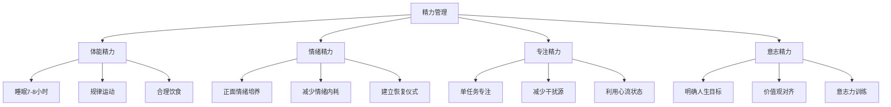

## 九、时间管理与效率提升

> 时间是唯一不可再生的资源。金钱亏了可以再赚，人脉断了可以再建，但每一个被浪费的小时都永远消失了。搞钱的本质，就是在有限时间内创造最大价值。

### 1. 为什么时间管理是搞钱的底层能力

#### 1.1 时间与收入的本质关系

所有收入形式本质上都是时间的函数：

| 收入类型 | 时间关系 | 天花板 | 典型例子 |
|---------|---------|--------|---------|
| 主动收入（卖时间） | 线性正比 | 24小时×时薪 | 上班、接单、咨询 |
| 杠杆收入（用时间建系统） | 前期投入，后期复利 | 几乎无限 | 课程、产品、内容 |
| 被动收入（系统自动运转） | 脱离时间绑定 | 取决于系统规模 | 版权、股息、租金 |

搞钱的终极目标是从第一列移动到第三列——但这个过程本身就需要极致的时间管理。你必须在有限的"卖时间"阶段，挤出时间来建造系统。

#### 1.2 时间贫困：现代人搞钱的最大障碍

"时间贫困"（time poverty）是指主观上感觉时间不够用的状态。加州大学洛杉矶分校的研究表明，时间贫困比物质贫困更能预测一个人的不幸福感和低生产力。具体表现为：

- **忙碌陷阱**：每天忙得不可开交，但月底一算，没有产出任何可积累的成果
- **救火模式**：永远在处理紧急的事，没有时间做重要的事
- **假性勤奋**：用战术上的勤奋掩盖战略上的懒惰，用"我很忙"逃避真正该做的事

搞钱者必须认清一个残酷现实：你的时间投入方向，比时间投入数量重要100倍。

#### 1.3 效率提升的复利效应

假设你每天通过优化节省1小时，一年就是365小时。如果把这365小时投入到：

- 学习一项技能：足以从入门到熟练
- 建一个副业项目：足以完成MVP并获取首批用户
- 写一本电子书：足以完成10万字以上的作品
- 做内容创作：足以积累数千粉丝

每天1小时，一年后的差距是巨大的。这就是效率提升的复利效应——它不是线性增长，而是指数级增长。

### 2. 时间审计：找到你的"时间黑洞"

#### 2.1 什么是时间审计

时间审计（time audit）是对过去一段时间内你如何使用时间的系统性记录和分析。不做时间审计就开始优化，就像不做体检就开始吃药——你根本不知道问题在哪。

#### 2.2 七天时间审计法

**第一步：记录（第1-7天）**

用手机备忘录或专用App，每30分钟记录一次你在做什么。记录格式：

```text
时间段 | 活动 | 类别 | 是否推进目标
08:00-08:30 | 刷手机看新闻 | 消遣 | 否
08:30-09:00 | 通勤 | 必要 | 否
09:00-10:30 | 写周报 | 工作 | 否（例行事务）
10:30-11:00 | 同事闲聊 | 干扰 | 否
11:00-12:00 | 开会 | 工作 | 部分
```

**第二步：分类（第8天）**

将所有活动归入四大类：

| 类别 | 定义 | 理想占比 | 典型活动 |
|------|------|---------|---------|
| 投资时间 | 推进长期目标的事 | ≥30% | 学习、写作、建系统、拓人脉 |
| 维持时间 | 必须做但不增值的事 | ≤40% | 通勤、家务、例行工作 |
| 消遣时间 | 刷手机、闲聊、无目的浏览 | ≤20% | 刷短视频、社交媒体、闲逛 |
| 睡眠时间 | 休息恢复 | 固定7-8小时 | 睡觉、午休 |

**第三步：分析（第8天）**

回答以下问题：
- 你实际的"投资时间"占比是多少？
- 你的消遣时间中，有多少是主动选择的，有多少是无意识滑进去的？
- 哪些"维持时间"可以通过外包、自动化或优化流程来压缩？
- 你的高能量时段被分配给了什么类型的任务？

**第四步：优化（第9天起）**

根据分析结果制定调整计划，目标是将投资时间从当前值提升到30%以上。

#### 2.3 常见的时间黑洞

| 黑洞 | 日均消耗 | 根因 | 解决方案 |
|------|---------|------|---------|
| 无意识刷手机 | 2-4小时 | 多巴胺成瘾+无聊逃避 | 设置屏幕时间限制，手机放到另一个房间 |
| 低效会议 | 1-3小时 | 没有议程，没有决策 | 要求提前发议程，超时即终止 |
| 频繁切换任务 | 1-2小时 | 没有时间块规划 | 批量处理同类任务 |
| 完美主义 | 不定 | 恐惧失败/被评价 | 设定"足够好"标准，先发布再迭代 |
| 无效社交 | 0.5-2小时 | 讨好型人格/FOMO | 学会拒绝，只参加高价值社交 |
| 重复性手工操作 | 0.5-2小时 | 没有自动化意识 | 学习脚本/工具/模板 |

### 3. 核心时间管理方法论

#### 3.1 艾森豪威尔矩阵（紧急-重要四象限）

这是所有时间管理方法的基石。将任务按"紧急"和"重要"两个维度分为四象限：

| | 紧急 | 不紧急 |
|---|------|--------|
| **重要** | 第一象限：立刻做 | 第二象限：计划做 |
| **不重要** | 第三象限：委托/快速处理 | 第四象限：不做 |

**第一象限（重要且紧急）**：危机处理、临近截止日期的任务、紧急客户问题。策略：立即行动，但要反思为什么这些事会变成紧急的。

**第二象限（重要不紧急）**：学习新技能、建立人脉、健康锻炼、长期规划、副业建设。策略：这是搞钱的核心象限，必须主动安排时间，否则永远不会做。

**第三象限（紧急不重要）**：大部分邮件、部分会议、他人的紧急请求。策略：委托、批量处理、设自动回复。

**第四象限（不重要不紧急）**：刷社交媒体、无目的浏览、过度娱乐。策略：识别并消除。

搞钱者的黄金法则：把80%的精力投入第二象限。大多数人失败不是因为不够忙，而是把太多时间花在了一、三象限，忽略了第二象限。

#### 3.2 时间块管理（Time Blocking）

时间块管理是Cal Newport在《Deep Work》中极力推崇的方法。核心思想：提前把一天的时间划分成若干块，每块只做一类事情。

**实操模板：**

```text
06:00-07:00  晨间仪式（运动+阅读）—— 投资时间
07:00-08:00  通勤+播客学习 —— 投资时间
08:00-10:00  深度工作（核心项目）—— 投资时间
10:00-10:15  休息
10:15-11:30  深度工作（副业建设）—— 投资时间
11:30-12:00  处理邮件和消息 —— 维持时间
12:00-13:00  午餐+午休 —— 睡眠时间
13:00-15:00  协作工作（会议、讨论）—— 维持时间
15:00-15:15  休息
15:15-17:00  常规工作 —— 维持时间
17:00-18:00  复盘+明日规划 —— 投资时间
18:00-19:00  通勤+播客 —— 投资时间
19:00-20:00  晚餐+家庭时间 —— 维持时间
20:00-21:30  副业/学习 —— 投资时间
21:30-22:30  放松（主动选择的）—— 消遣时间
22:30-06:00  睡眠 —— 睡眠时间
```

**时间块的三个关键原则：**

1. **深度工作在前**：把最高质量的时间段（通常是上午）分配给最需要脑力的工作
2. **同类任务批量处理**：邮件、消息、行政事务集中到固定时段，不要随时响应
3. **弹性空间**：每天留30-60分钟的缓冲时间，应对不可预见的事务

#### 3.3 番茄工作法（Pomodoro Technique）

适合需要高度专注但容易分心的任务。

**操作流程：**

1. 选择一个要完成的任务
2. 设定25分钟倒计时（一个"番茄钟"）
3. 在这25分钟内，只做这一件事，不看手机、不回消息
4. 25分钟到后，休息5分钟
5. 每完成4个番茄钟，休息15-30分钟
6. 记录每天完成了多少个番茄钟

**适用场景：**
- 写作（文章、代码、方案）
- 学习新知识
- 设计和创意工作
- 数据分析和报告

**不适用场景：**
- 需要长时间进入心流的深度工作（这时番茄钟的打断反而有害）
- 频繁被打断的协作型工作
- 需要快速响应的客服/运营工作

#### 3.4 GTD（Getting Things Done）

David Allen的GTD系统适合任务量大、多项目并行的人。核心流程：

```text
收集 → 明确 → 整理 → 回顾 → 执行
```

**收集**：把脑子里所有待办事项、想法、承诺全部倒出来，写到一个"收件箱"里（可以用纸笔、Notion、Todoist等任何工具）。

**明确**：对每个项目问自己：
- 这是什么？
- 需要行动吗？
- 下一步具体行动是什么？
- 能在两分钟内完成吗？能的话立刻做
- 需要我做吗？不需要就委托
- 有截止日期吗？有的话放入日历

**整理**：按上下文分类（@电脑、@电话、@外出、@等待），按项目归类。

**回顾**：每周回顾一次所有清单，更新状态，确保没有遗漏。

**执行**：根据当前情境、可用时间、精力状态和优先级，选择最合适的任务来执行。

#### 3.5 方法对比与选择建议

| 方法 | 适合人群 | 复杂度 | 适用场景 |
|------|---------|--------|---------|
| 艾森豪威尔矩阵 | 所有人 | 低 | 每日任务优先级判断 |
| 时间块管理 | 自由职业者、创业者 | 中 | 全天时间规划 |
| 番茄工作法 | 学生、写作者、程序员 | 低 | 需要专注的单一任务 |
| GTD | 多项目并行的管理者 | 高 | 复杂任务管理系统 |
| 单任务法（MIT） | 极简主义者 | 极低 | 只聚焦当天最重要的1-3件事 |

**推荐组合**：艾森豪威尔矩阵（判断优先级）+ 时间块管理（规划一天）+ 番茄工作法（执行专注任务）。大多数搞钱者用这个组合就够了。

### 4. 效率提升的实操技术

#### 4.1 批量处理（Batching）

批量处理的核心原理：同类任务集中做，减少上下文切换的认知损耗。

**可批量处理的任务：**

| 任务类型 | 传统做法 | 批量做法 | 节省时间 |
|---------|---------|---------|---------|
| 回复邮件 | 随到随回 | 每天2-3个固定时段 | 30-60分钟/天 |
| 发社交媒体 | 想到就发 | 一次写好一周的内容 | 2-3小时/周 |
| 采购/跑腿 | 想到就去 | 每周固定1-2次集中采购 | 1-2小时/周 |
| 处理行政事务 | 随时处理 | 周五下午统一处理 | 2-3小时/周 |
| 代码审查 | 来一个看一个 | 每天固定时段集中审查 | 1小时/天 |

#### 4.2 自动化（Automation）

能自动化的就不要手动做。以下是搞钱场景中最值得自动化的环节：

**营销和获客自动化：**
- 社交媒体定时发布（Buffer、Later、微小宝）
- 邮件自动回复序列（ConvertKit、Mailchimp）
- 客户跟进自动提醒（CRM系统）
- 询价表单自动分类（Typeform + Zapier）

**财务和行政自动化：**
- 记账自动化（随手记、MoneyWiz，或银行App自动分类）
- 发票自动生成（开票软件模板）
- 定期账单自动扣款
- 报表自动生成（Excel模板 + 数据透视表）

**内容创作自动化：**
- AI辅助写初稿（ChatGPT、Claude）
- 图片批处理（Canva批量模板、PS动作）
- 语音转文字（讯飞听见、飞书妙记）
- 会议纪要自动生成

**技术自动化：**
- 用Python脚本处理重复性数据操作
- 用Zapier/n8n连接不同SaaS工具
- 用GitHub Actions自动化部署和测试
- 用定时任务（cron）处理周期性任务

#### 4.3 委托与外包（Delegation）

搞钱者的终极效率杠杆：不是什么都要自己做。

**判断是否应该外包的公式：**

```text
外包价值 = (你的时薪 - 外包时薪) × 预估耗时 - 沟通管理成本
```

如果你的时薪是200元，某个任务外包只需要50元/小时，预估耗时4小时，沟通管理成本约30分钟（100元），那么：

```text
外包价值 = (200 - 50) × 4 - 100 = 500元
```

意味着外包这个任务，你净赚500元的机会成本。

**常见外包场景：**

| 任务 | 外包渠道 | 参考价格 | 适合外包条件 |
|------|---------|---------|-------------|
| 视频剪辑 | 猪八戒、Fiverr | 50-200元/条 | 你不是靠剪辑赚钱 |
| 文章初稿 | 写作平台、AI+人工 | 100-500元/篇 | 你能提供大纲和审核 |
| 设计素材 | Canva模板、设计师 | 20-500元/件 | 你不是专业设计师 |
| 数据录入 | 虚拟助理 | 20-50元/小时 | 纯机械操作 |
| 客服回复 | 客服外包 | 3000-6000元/月 | 标准化问题占比>80% |
| 代码开发 | 技术外包平台 | 200-800元/天 | 你有明确需求文档 |

#### 4.4 精力管理：时间管理的升级版

时间管理的终极形态是精力管理。你可能有8小时空闲，但如果精力耗尽，8小时的产出可能还不如精力充沛时的2小时。

**精力的四个维度：**



**体能精力是基础：**
- 睡眠不足6小时，认知能力下降40%以上（哈佛医学院研究）
- 每天30分钟中等强度运动，能提升20%的工作效率
- 血糖稳定比什么效率技巧都重要——少吃高GI食物，避免餐后昏沉

**情绪精力是倍增器：**
- 焦虑和愤怒会消耗大量认知资源，让你无法专注
- 建立情绪恢复仪式：深呼吸、散步、听音乐、和信任的人聊天
- 远离负能量的人和信息源——这不是鸡汤，是认知科学

**专注精力是产出引擎：**
- 人的注意力集中周期约90-120分钟（超日节律ultradian rhythm）
- 在精力高峰期做最难的事，低谷期做简单的事
- 干扰恢复需要23分钟（加州大学欧文分校研究），每打断一次就损失近半小时

**意志精力是持久引擎：**
- 意志力是有限资源，会消耗殆尽（决策疲劳）
- 减少无关紧要的决策（穿什么、吃什么用固定方案）
- 把最重要的决策放在上午精力最充沛时做

#### 4.5 识别并利用你的生物节律

每个人的精力曲线不同。有些人是"晨型人"（早起高效），有些人是"夜型人"（夜晚高效），还有些人是"双峰型"（早晚高效，午后低谷）。

**找到你的高能量时段：**

连续一周，每小时对自己的精力水平打分（1-10分），找出规律。典型分布：

| 时段 | 晨型人 | 夜型人 | 双峰型 |
|------|--------|--------|--------|
| 6:00-9:00 | ★★★★★ | ★★ | ★★★★★ |
| 9:00-12:00 | ★★★★ | ★★★ | ★★★★ |
| 12:00-14:00 | ★★ | ★★ | ★★ |
| 14:00-17:00 | ★★★ | ★★★★ | ★★★ |
| 17:00-20:00 | ★★ | ★★★★ | ★★★★ |
| 20:00-23:00 | ★ | ★★★★★ | ★★★★★ |

**核心原则**：高能量时段做高价值任务（深度工作、创意、决策），低能量时段做低价值任务（邮件、行政、整理）。

### 5. 搞钱场景中的效率实战

#### 5.1 副业时间管理：如何在全职工作之外搞钱

全职工作者每天可用的"搞钱时间"大约只有2-4小时。如何最大化利用这段时间：

**策略一：碎片时间体系化**

| 碎片时间 | 时长 | 适合做什么 | 工具 |
|---------|------|-----------|------|
| 通勤（地铁/公交）| 30-60分钟 | 听播客/课程、阅读、回复消息 | 喜马拉雅、微信读书 |
| 午休 | 30-60分钟 | 写文章初稿、处理简单任务 | 手机备忘录 |
| 等待时间 | 10-30分钟 | 记录灵感、学习闪卡 | Anki、flomo |
| 睡前 | 30-60分钟 | 规划明天、复盘今天、轻度学习 | 纸笔 |

**策略二：周末深度工作块**

把周末的某个半天（如周六上午9:00-12:00）固定为"副业深度工作时间"。雷打不动，不安排社交、不做家务。这3小时的产出可能超过一整周的碎片时间总和。

**策略三：减少启动摩擦**

每次开始副业工作时的"启动摩擦"是最浪费时间的。解决方案：
- 前一天晚上准备好第二天要做的第一个动作
- 固定工作环境和工作仪式（比如泡一杯咖啡，打开特定音乐）
- 用"最小启动动作"降低心理阻力：不是"今天写一章"，而是"今天打开文档，写第一句话"

#### 5.2 自由职业者的时间管理陷阱

自由职业者看似时间自由，实则面临更严峻的时间管理挑战：

**陷阱一：没有边界**
- 解决：设定固定工作时间，到点就停，哪怕"没做完"
- 不要在床上工作，不要在沙发上工作——物理空间要有工作/休息的边界

**陷阱二：收入焦虑导致的过度工作**
- 解决：设定每月收入目标，达标后强制休息
- 记住：长期过度工作→效率下降→质量下降→客户流失→更焦虑→更过度工作

**陷阱三：孤独导致的效率波动**
- 解决：加入同行社群，找accountability partner
- 使用"虚拟共同工作"（co-working）：和朋友视频连线，各自工作

**陷阱四：多项目并行导致的分散**
- 解决：同一时间最多专注2个项目（一个主力，一个辅助）
- 其他项目放入"停车场清单"，等当前项目有阶段性成果后再启动

#### 5.3 创业者的效率杠杆

创业者的时间价值远高于执行者。核心转变：从"我来做"到"我来安排"。

**创业者的效率金字塔：**

```text
            /\
           /  \        战略思考（最高价值）
          /    \       → 你来做
         /------\
        / 小团队 \      管理与协调
       /  管理    \     → 你主导，但可以委托
      /------------\
     /   标准化执行  \    流程化工作
    /                \   → 建SOP，委托他人
   /------------------\
  /   重复性行政工作    \  机械操作
 /                      \ → 外包或自动化
/------------------------\
```

**关键转变清单：**

| 阶段 | 时间分配 | 关键动作 |
|------|---------|---------|
| 0-1（验证期）| 80%亲自执行，20%规划 | 快速试错，不追求完美 |
| 1-10（增长期）| 50%执行，30%管理，20%规划 | 开始建流程，招第一个助手 |
| 10-100（规模化期）| 20%执行，40%管理，40%规划 | 大量委托，聚焦战略 |
| 100+（成熟期）| 10%执行，30%管理，60%规划 | 几乎不执行，专注于方向和机会 |

### 6. 工具推荐与选型

#### 6.1 任务管理工具

| 工具 | 价格 | 适合谁 | 核心优势 | 平台 |
|------|------|--------|---------|------|
| Todoist | 免费/Pro ¥28/月 | 个人GTD | 自然语言输入，跨平台同步 | 全平台 |
| Notion | 免费/Plus ¥70/月 | 全能型选手 | 数据库+文档+项目管理一体 | 全平台 |
| 滴答清单 | 免费/VIP ¥139/年 | 中文用户 | 日历+清单+番茄钟一体 | 全平台 |
| Things 3 | ¥688买断 | Apple生态用户 | 设计优雅，操作流畅 | Apple |
| Microsoft To Do | 免费 | Office用户 | 和Outlook深度集成 | 全平台 |

#### 6.2 专注力工具

| 工具 | 价格 | 功能 |
|------|------|------|
| Forest（专注森林）| ¥12 | 种树计时，放下手机才能让树长大 |
| 潮汐 | 免费/VIP | 白噪音+番茄钟+睡眠 |
| Cold Turkey | $39买断 | 最强网站/应用屏蔽工具 |
| RescueTime | 免费/Premium | 自动追踪电脑和手机使用时间 |
| 番茄Todo | 免费/VIP | 番茄钟+数据统计+自习室 |

#### 6.3 自动化工具

| 工具 | 价格 | 适合谁 | 典型用途 |
|------|------|--------|---------|
| Zapier | 免费/Pro $20/月 | 非技术人员 | 连接5000+个SaaS应用 |
| n8n | 自部署免费 | 技术人员 | 开源自动化，数据不出门 |
| IFTTT | 免费/Pro $3/月 | 个人用户 | 简单的if-then自动化 |
| 飞书/钉钉 | 免费 | 团队用户 | 审批流、机器人、多维表格 |
| Python脚本 | 免费 | 有编程能力者 | 任意自定义自动化 |

#### 6.4 时间追踪工具

| 工具 | 价格 | 核心功能 |
|------|------|---------|
| Toggl Track | 免费/Pro | 一键计时，生成时间报告 |
| Clockify | 免费 | 无限用户，团队时间追踪 |
| aTimeLogger | 免费 | 手动记录生活时间 |
| Screen Time（iOS）| 系统内置 | 自动追踪手机使用 |
| 数字健康（Android）| 系统内置 | 自动追踪手机使用 |

### 7. 常见误区与纠正

#### 7.1 误区一：早起=高效

**真相**：早起本身不等于高效。如果你是天生的夜型人，强迫自己5点起床只会导致一整天精神萎靡。高效的关键是在你的高能量时段做高价值的事，而不是盲目追求早起。

**纠正**：找到自己的生物节律，按精力曲线安排任务，而不是按别人的作息时间表。

#### 7.2 误区二：同时做多件事=效率高

**真相**：人脑不能真正"多任务处理"，只能快速切换。每次切换都有认知损耗（context switching cost），同时做三件事的效率可能只有专注做一件事的1/3。

**纠正**：单任务处理，完成一件事再做下一件事。如果必须多线程，用时间块法，每个时间块内只做一件事。

#### 7.3 误区三：工具越多效率越高

**真相**：工具过多反而增加管理成本。你花在学习工具、在工具间切换、同步数据上的时间，可能比工具节省的时间还多。

**纠正**：工具精简原则——同一类功能只用一个工具。任务管理一个，笔记一个，日历一个，够了。

#### 7.4 误区四：把日程排满=时间管理

**真相**：过度计划是另一种形式的控制幻觉。排得满满的日程没有弹性，一旦某个任务超时或有意外插入，整个计划就崩溃，反而导致焦虑和挫败。

**纠正**：每天只安排60-70%的时间，留30-40%作为缓冲。记住Parkinson定律：工作会膨胀到填满所有可用时间。给任务设定更紧的截止时间，反而能提高效率。

#### 7.5 误区五：忙=有产出

**真相**：忙碌和产出之间没有必然关系。你可能花了8小时回邮件、开会、处理杂事，感觉很忙，但这一天没有产出任何可积累的成果。

**纠正**：每天结束时问自己一个问题——"今天我产出了什么具体成果？"如果答不上来，说明你的一天被"维持性工作"填满了，没有"投资性工作"。

#### 7.6 误区六：完美主义是高标准

**真相**：完美主义是效率的最大杀手。花80%的时间把一个作品从80分打磨到95分，不如用同样的时间再做一个80分的作品。在搞钱场景中，"完成"比"完美"重要得多。

**纠正**：采用"最小可交付"原则——先发布一个"够用"的版本，收集反馈，再迭代优化。80分的作品如果方向对了，比100分的作品晚发布三个月有价值得多。

### 8. 高阶策略：从效率到效能

#### 8.1 效率与效能的区别

- **效率（Efficiency）**：用更少的资源做同样的事（做得更快）
- **效能（Effectiveness）**：做正确的事（方向对）

高效地做一件错误的事，是最大的浪费。搞钱者要先确保方向正确（效能），再优化执行速度（效率）。

#### 8.2 二八法则在时间管理中的应用

帕累托法则（80/20法则）在时间管理中的体现：
- 你80%的收入来自20%的活动
- 你80%的成果来自20%的努力
- 你80%的快乐来自20%的关系

**实操方法**：
1. 列出你所有的搞钱活动
2. 分析每项活动的投入时间 vs 产出收入
3. 找出那20%的高回报活动
4. 把更多时间分配给这20%
5. 对低回报活动：委托、自动化或直接砍掉

#### 8.3 反时间管理（Anti-Time Management）

Rory Vaden提出的"反时间管理"概念，核心思想是：不是管理时间，而是扩大时间的供给。

**策略一：投资时间以创造更多时间**
- 花2小时建一个自动化脚本，节省未来每周5小时
- 花1周写一篇长青内容，未来几年持续带来流量
- 花1个月做一门课程，之后每个学员都是被动收入

**策略二：用空间换时间**
- 搬到公司附近住，每天节省2小时通勤
- 在家办公，省去准备和通勤的时间
- 选择共同工作空间，减少居家办公的干扰

**策略三：用金钱换时间**
- 付费使用更快的工具（比如GPT-4而不是免费版）
- 花钱请人做家务、做饭、跑腿
- 购买已有的解决方案而不是从零开始

#### 8.4 系统化思维：一次投入，持续产出

搞钱的最高效率形态是"一次投入，持续产出"：

| 一次性投入 | 持续产出 | 例子 |
|-----------|---------|------|
| 写一本书 | 版税收入数年 | 电子书、实体书 |
| 做一门课程 | 学员付费持续 | 网易云课堂、Udemy |
| 建一个网站 | 流量和广告收入 | 博客、工具站 |
| 开发一个产品 | 销售收入 | SaaS、小程序 |
| 建立一个品牌 | 客户信任溢价 | 个人IP |
| 积累一个技能 | 每次使用都有回报 | 编程、设计、写作 |

把时间投入到这些"一次投入，持续产出"的事情上，是时间管理的终极形态。

### 9. 本节核心要点

1. **时间审计先行**：不记录就不知道问题在哪，花一周做时间审计，找到你的时间黑洞
2. **方法论组合使用**：艾森豪威尔矩阵判断优先级 + 时间块规划一天 + 番茄钟执行任务
3. **精力管理>时间管理**：在高能量时段做高价值的事，比增加工作时长有效得多
4. **批量+自动化+外包**：能不亲手做的就不要亲手做，把时间留给只有你能做的事
5. **方向比速度重要**：先确保做的事是对的（效能），再优化做得快不快（效率）
6. **一次投入持续产出**：把时间投入到能产生复利的事情上，而不是一次性消耗的事情
7. **保留弹性空间**：不要把日程排满，留30%缓冲，应对意外和休息
