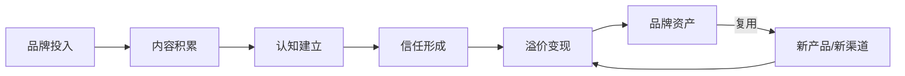
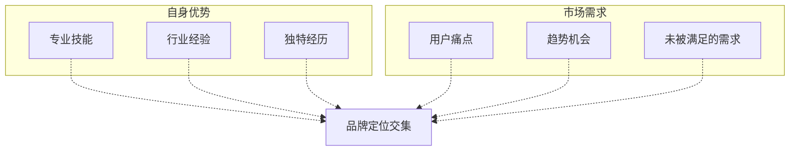
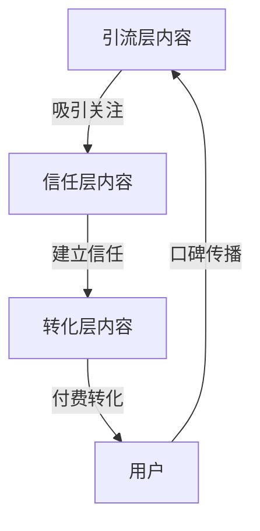
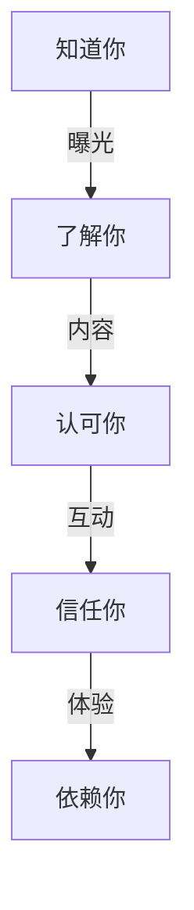
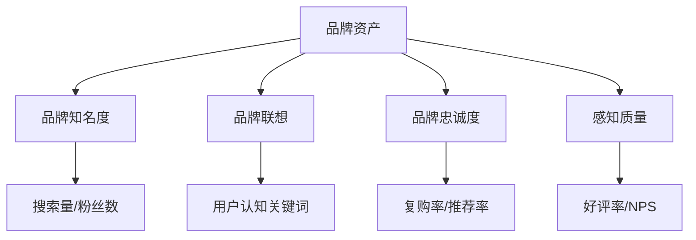

## 十、搞钱中的品牌建设

### 1. 为什么品牌是搞钱的终极护城河

#### 1.1 品牌的本质：降低交易成本的信用符号

很多人把品牌理解成"一个 Logo + 一句 Slogan"，这是最表层的认知。品牌的核心功能只有一个——**降低交易成本**。

当你在淘宝搜索一款充电宝，面对上百家店铺、上千个链接时，你最终选择"小米"或"安克"，不是因为它们的图片最好看，而是因为品牌帮你跳过了"这个东西质量行不行、售后靠不靠谱"的判断环节。这就是品牌的经济学本质：**用历史信用替代单次信任建立**。

从搞钱的角度看，品牌的价值体现在三个维度：

| 维度 | 没有品牌 | 有品牌 |
|------|----------|--------|
| 获客成本 | 每个客户都要从零建立信任，广告费占比高 | 客户主动搜索、老带新，边际获客趋近于零 |
| 定价能力 | 只能拼价格，利润薄如纸 | 可以溢价 30%-300%，利润空间大 |
| 抗风险能力 | 一个差评就可能毁掉生意 | 品牌信誉有缓冲，单次危机不会致命 |

一个残酷的现实是：同样的产品，贴上品牌标识和不贴品牌标识，售价可以相差 3-10 倍。这不是智商税，而是品牌信用的货币化。

#### 1.2 品牌建设的投入产出逻辑

品牌建设不是"花钱做广告"那么简单。它的投入产出逻辑是：

- **前期**：投入时间和精力，产出接近于零（0-3 个月）
- **中期**：品牌开始被识别，获客成本下降，利润率提升（3-12 个月）
- **后期**：品牌成为资产，可以复用到新产品、新渠道，产生复利效应（12 个月以上）



关键认知：品牌建设不是成本，是投资。而且是少数几个能产生复利效应的投资之一。

### 2. 品牌定位：找到你的生态位

#### 2.1 定位的核心公式

品牌定位的本质是回答三个问题：

1. **你是谁？** ——你的核心身份和专业领域
2. **你为谁服务？** ——你的目标用户画像
3. **你凭什么让人选你？** ——你的差异化价值

用一个公式表达：

> 品牌定位 = [目标人群] + [核心价值] + [差异化理由]

举例：
- "为中小卖家提供傻瓜式电商代运营服务"（目标人群：中小卖家；核心价值：电商代运营；差异化：傻瓜式）
- "为程序员提供可直接复制的系统设计面试方案"（目标人群：程序员；核心价值：系统设计面试；差异化：可直接复制）

#### 2.2 定位的四个层次

品牌定位有四个层次，越往上越难被替代：

| 层次 | 说明 | 举例 |
|------|------|------|
| 产品层 | "我卖什么" | 卖瑜伽课 |
| 功能层 | "我帮你解决什么问题" | 帮你减脂塑形 |
| 情感层 | "你选择我之后感受如何" | 成为更自律的自己 |
| 价值层 | "你因为我变成什么样的人" | 活出精彩人生的女性 |

大多数人卡在第一层，只说"我卖什么"。但真正有溢价能力的品牌，都打到了情感层甚至价值层。

#### 2.3 定位的实操三步法

**第一步：扫描自身资源**

列出你的所有优势，包括：
- 专业技能（编程、设计、写作、教学……）
- 行业经验（在哪些行业工作过、积累了多少认知）
- 人脉资源（认识哪些人、能调动哪些资源）
- 独特经历（创业经历、海外经历、跨界经历……）
- 兴趣特长（持续投入时间的非工作领域）

**第二步：扫描市场需求**

用以下工具和方法调研市场需求：
- **搜索引擎**：百度指数、微信指数、抖音热点，看相关关键词的搜索趋势
- **电商平台**：淘宝、京东的搜索下拉词和销量排行，看用户在买什么
- **社交媒体**：小红书、知乎、B站的热门话题和高赞回答，看用户在讨论什么
- **问答平台**：知乎、百度知道的高频问题，看用户在困惑什么
- **行业报告**：艾瑞咨询、36氪等平台的行业分析报告

**第三步：找到交集**

把自身优势和市场需求画成两个圆，交集部分就是你的品牌定位方向。交集越大、越独特，你的品牌越有竞争力。



### 3. 品牌视觉系统：让人一眼记住你

#### 3.1 品牌命名

品牌名是用户对你的第一印象，好的品牌名应该满足以下条件：

- **易记**：不超过 4 个字，朗朗上口
- **易搜索**：没有生僻字，搜索引擎能正确匹配
- **有联想**：能让人联想到你做的事或你的价值主张
- **可注册**：商标和域名可用

命名的常用方法：

| 方法 | 说明 | 举例 |
|------|------|------|
| 功能命名 | 直接说明做什么 | 剪映、美图秀秀 |
| 情感命名 | 传达感受或态度 | 喜茶、完美日记 |
| 叠词命名 | 重复音节增强记忆 | 拼多多、钉钉 |
| 人名命名 | 用创始人名字 | 老干妈、张小泉 |
| 造词命名 | 创造新词 | 小红书、抖音 |

**个人品牌的命名策略**：
- 如果你的名字好记且有一定知名度，直接用真名（如"罗翔说刑法"）
- 如果真名不好记或太普通，用"真名 + 领域"（如"半佛仙人"）
- 如果想做矩阵号或团队化运营，用独立品牌名（如"差评""硬核看板"）

#### 3.2 视觉识别系统（VI）

一个完整的品牌视觉系统包括：

**Logo 设计**：
- 个人品牌初期可以用文字 Logo（你的名字/品牌名的字体设计），成本低、辨识度高
- 使用 Canva、创客贴等工具可以零成本制作基础版 Logo
- 专业版建议找设计师定制，费用 500-5000 元不等

**色彩体系**：
- 选一个主色（代表品牌调性）+ 一个辅色（用于点缀）+ 黑白灰（用于文字和背景）
- 主色一旦确定，所有平台和物料保持一致

| 色系 | 传达的调性 | 适合的领域 |
|------|-----------|-----------|
| 红/橙 | 热情、活力、紧迫感 | 电商、促销、餐饮 |
| 蓝/青 | 专业、可信赖、科技 | 科技、金融、教育 |
| 绿 | 健康、自然、成长 | 健康、环保、农业 |
| 紫/金 | 高端、神秘、创意 | 美妆、奢侈品、艺术 |
| 黑/白 | 极简、高级、纯粹 | 设计、时尚、高端服务 |

**字体规范**：
- 标题字体：有辨识度，体现品牌调性
- 正文字体：清晰易读，不抢视觉注意力
- 中文推荐：思源黑体/宋体（免费商用）、站酷系列字体
- 英文推荐：Montserrat、Poppins、Inter

**图片风格**：
- 统一图片滤镜/调色风格
- 统一构图比例（如 16:9 或 4:3）
- 统一水印位置和样式

#### 3.3 低成本打造视觉系统

如果你是个人创业者或副业起步，不需要一开始就投入大量资金。以下是低成本方案：

1. **Logo**：Canva 免费模板 + 字体定制（0 元）
2. **主色调**：从 coolors.co 生成配色方案（0 元）
3. **模板**：为公众号、小红书、抖音各做一套封面模板（Canva，0 元）
4. **字体**：使用免费商用字体（0 元）
5. **图片**：Unsplash、Pexels 免费图库 + 自己拍摄（0 元）

总成本：0 元。但效果是——你的所有内容看起来像"一个品牌"，而不是东拼西凑。

### 4. 内容策略：用内容喂养品牌

#### 4.1 内容是品牌建设的核心引擎

在互联网时代，**内容 = 品牌的血液**。没有持续的内容输出，品牌就是一具空壳。

内容的作用：
- **建立认知**：让目标用户知道你的存在
- **传递价值**：让目标用户理解你能帮他们解决什么问题
- **培养信任**：通过持续输出专业内容，建立"这个人靠谱"的印象
- **筛选用户**：好内容天然会吸引对的人、过滤不对的人

#### 4.2 内容矩阵：三层内容模型

高效的内容策略不是拍脑袋发东西，而是用"三层内容模型"系统化运营：

| 内容层 | 目的 | 频率 | 内容类型 | 平台 |
|--------|------|------|----------|------|
| 引流层 | 吸引新用户 | 日更 | 热点解读、干货清单、争议话题 | 小红书、抖音、微博 |
| 信任层 | 建立专业度 | 周更 | 深度教程、案例拆解、行业分析 | 公众号、知乎、B站 |
| 转化层 | 促成付费 | 按需 | 产品介绍、用户见证、限时活动 | 私域、落地页、朋友圈 |

三层内容的关系：



#### 4.3 内容选题的方法论

选题是内容创作中最重要的一环。一个好选题决定了 80% 的传播效果。

**选题四象限**：

| | 用户需要 | 用户不知道自己需要 |
|--|----------|-------------------|
| **你擅长** | 最佳选题区（优先做） | 教育型内容（有潜力但慢热） |
| **你不擅长** | 合作/学习后做 | 不要做 |

**选题的四个来源**：
1. **用户问题**：从评论区、私信、社群聊天中提炼高频问题
2. **行业热点**：追踪行业新闻、政策变化、技术趋势
3. **竞品分析**：看同领域头部账号的爆款内容，分析为什么火
4. **个人经验**：你踩过的坑、总结的方法、验证过的路径

**选题自检清单**：
- [ ] 这个选题我的目标用户会关心吗？
- [ ] 这个选题我能提供独特的视角或信息增量吗？
- [ ] 这个选题有具体的痛点或场景吗？
- [ ] 这个选题能引发讨论或转发吗？
- [ ] 这个选题与我的品牌定位一致吗？

#### 4.4 内容创作的实操模板

**干货教程型模板**（适合信任层内容）：

```text
标题：[具体问题] 的 [具体方法]，[数字] 步搞定

开头（100字）：
- 痛点场景描写（让读者代入）
- 本文要解决什么问题
- 读完能得到什么

正文：
- 方法一：[名称]
  - 是什么（原理/定义）
  - 为什么（为什么这个方法有效）
  - 怎么做（具体步骤，可附截图/代码）
  - 注意事项

- 方法二：[名称]
  - 同上结构

- ……

结尾（100字）：
- 总结核心要点
- 引导互动（提问、收藏、关注）
- 软性引导（如有相关产品/服务）
```

**案例拆解型模板**（适合引流层 + 信任层内容）：

```text
标题：[知名案例] 做对了什么？[数字] 个关键动作拆解

开头：这个案例的背景和成绩

正文：
- 关键动作一：[具体做了什么]
  - 背景/问题
  - 具体做法
  - 效果/数据
  
- 关键动作二、三……

提炼：普通人可以借鉴什么

结尾：引导讨论
```

### 5. 平台策略：在哪里建品牌

#### 5.1 平台选择的决策框架

不是每个平台都适合你。选平台的核心原则是：**目标用户在哪里，你就在哪里**。

| 平台 | 用户画像 | 内容形式 | 适合的领域 | 变现方式 |
|------|----------|----------|-----------|----------|
| 公众号 | 25-45岁，职场人为主 | 长文、深度分析 | 知识付费、咨询、B2B | 广告、课程、咨询 |
| 小红书 | 18-35岁，女性为主 | 图文笔记、短视频 | 生活方式、美妆、教育 | 广告、带货、引流 |
| 抖音 | 全年龄段，下沉市场覆盖广 | 短视频、直播 | 娱乐、电商、本地生活 | 直播带货、广告、引流 |
| B站 | 18-30岁，男性略多 | 中长视频 | 科技、教育、二次元 | 广告、充电、带货 |
| 知乎 | 25-40岁，高学历 | 问答、文章 | 专业领域、深度内容 | 咨询、课程、引流 |
| 视频号 | 30-50岁，微信生态 | 短视频、直播 | 知识、生活、本地 | 直播带货、私域转化 |

#### 5.2 "1+2+N" 平台布局策略

不要一开始就铺所有平台，精力会严重分散。推荐"1+2+N"策略：

- **1 个主阵地**：投入 70% 精力，做深度内容，建立核心用户群
- **2 个辅助平台**：投入 20% 精力，做内容分发，扩大影响力
- **N 个测试平台**：投入 10% 精力，试探新机会

举例：一个做职场教育的个人品牌
- 主阵地：公众号（深度文章，建立专业形象）
- 辅助平台：小红书（图文干货，引流）+ 视频号（短视频，扩大覆盖）
- 测试平台：抖音（看能否跑通短视频模式）

#### 5.3 内容复用的工程化方法

一次创作，多平台分发，但不是简单地复制粘贴。每个平台的内容需要适配：

```text
原始内容：一篇 3000 字的公众号文章

适配为：
├── 公众号：完整版长文
├── 知乎：问答版（提炼核心观点 + 回答相关问题）
├── 小红书：5-8 张图文卡片（提炼核心要点 + 干货清单）
├── 抖音/视频号：1-3 分钟口播视频（讲故事 + 核心观点）
├── 朋友圈：一句金句 + 精美配图
└── 社群：核心观点 + 讨论引导
```

这样做的好处：创作一次内容，触达 6 个平台的用户，内容效率提升 5 倍以上。

### 6. 信任建设：从"知道你"到"信你"

#### 6.1 信任的五层阶梯

品牌建设的核心不是让人"知道你"，而是让人"信你"。信任是一个逐步积累的过程：



| 信任层级 | 用户心理 | 你需要做的 |
|----------|----------|-----------|
| 知道你 | "这人是谁？" | 持续曝光，出现在用户视野中 |
| 了解你 | "他做什么的？" | 清晰的品牌定位和内容输出 |
| 认可你 | "他说的有道理" | 输出高质量专业内容 |
| 信任你 | "找他准没错" | 展示成果、用户见证、持续稳定输出 |
| 依赖你 | "只有他能解决" | 深度服务、不可替代的专业能力 |

#### 6.2 社会证明：信任的加速器

社会证明（Social Proof）是心理学中最重要的影响力武器之一。在品牌建设中，社会证明的具体形态包括：

**数字证明**：
- 服务了 XX 位客户
- 累计阅读量 XX 万
- XX 人购买了课程
- 获得了 XX 个好评

**权威证明**：
- 行业专家推荐/背书
- 媒体报道/采访
- 行业奖项/认证
- 大公司合作案例

**同伴证明**：
- 用户评价和反馈截图
- 用户使用前后的对比
- 社群内的活跃讨论
- 老用户的自发推荐

**稀缺证明**：
- "仅剩 XX 个名额"
- "限量 XX 份"
- "价格即将上调"

**社会证明的展示位置**：
- 个人简介/品牌介绍页（核心数据 + 权威背书）
- 内容中（案例引用 + 数据佐证）
- 产品页/落地页（用户见证 + 成果展示）
- 朋友圈/社群（日常分享用户反馈）

#### 6.3 持续输出：信任的基石

信任的最大敌人不是犯错，而是消失。如果你三天打鱼两天晒网，用户对你的信任会快速衰减。

**持续输出的纪律**：
- 设定最低发布频率（如公众号每周 1 篇，小红书每天 1 条）
- 建立内容素材库，随时记录灵感和素材
- 批量创作，集中时间一次性产出一周的内容
- 使用排期工具（如新榜、微小宝）提前安排发布

**内容断更的代价**：
- 公众号：断更 1 周，打开率下降 10%-20%
- 小红书/抖音：断更 3 天，推荐流量大幅下降
- 社群：3 天不活跃，用户开始遗忘

### 7. 品牌变现路径

#### 7.1 品牌变现的五大模式

品牌建设的最终目的是变现。以下是品牌变现的五大模式，按门槛从低到高排列：

| 模式 | 说明 | 门槛 | 收入天花板 | 适合阶段 |
|------|------|------|-----------|----------|
| 广告变现 | 品牌方付费投放你的内容 | 低（粉丝 1000+即可） | 中（取决于粉丝量） | 起步期 |
| 带货分佣 | 推荐商品赚取佣金 | 低 | 中 | 起步期 |
| 知识付费 | 卖课程、咨询、社群 | 中（需要专业能力） | 高 | 成长期 |
| 自有产品 | 卖自己开发的产品/服务 | 高 | 很高 | 成熟期 |
| 品牌授权 | 品牌 IP 授权、联名合作 | 高（需要强品牌力） | 极高 | 成熟期 |

#### 7.2 从零开始的变现路径规划

```text
阶段一（0-3个月）：免费内容建立信任
├── 目标：积累 1000+ 精准粉丝
├── 动作：持续输出高质量免费内容
└── 收入：0 元（投入期）

阶段二（3-6个月）：低价产品验证需求
├── 目标：验证用户是否愿意为你付费
├── 动作：推出 9.9-99 元的低价产品（电子书、小课、模板）
└── 收入：500-5000 元/月

阶段三（6-12个月）：中价产品跑通模式
├── 目标：建立稳定的收入流
├── 动作：推出 199-999 元的产品（系列课程、社群、训练营）
└── 收入：5000-30000 元/月

阶段四（12个月+）：高价产品放大收入
├── 目标：品牌资产化
├── 动作：推出 1000 元+ 的产品（一对一咨询、高端社群、企业服务）
└── 收入：30000+ 元/月
```

#### 7.3 定价策略

定价不是拍脑袋，而是基于价值感知的系统工程：

**成本定价法**（最低限）：
> 价格 = 成本 × (1 + 利润率)
> 适用于实物产品，确保不亏本

**价值定价法**（推荐）：
> 价格 = 用户获得的价值 × 价值感知系数
> 适用于知识产品和服务

举例：你教别人做一个能月入 5000 元的副业，课程定价 999 元（相当于用户 2 个月的收益），这个价格对用户来说是"值"的。

**锚定定价法**（进阶）：
> 先展示高价选项作为锚点，再展示目标价格，让目标价格显得"便宜"
>
> 例："一对一咨询 3000 元/小时，社群年费 999 元"

### 8. 品牌危机管理

#### 8.1 常见的品牌危机类型

| 危机类型 | 触发场景 | 严重程度 |
|----------|----------|----------|
| 内容翻车 | 发布了有争议或错误的内容 | 中 |
| 客户投诉 | 产品/服务未达预期，客户公开投诉 | 中-高 |
| 竞品攻击 | 竞争对手抹黑、抄袭 | 中 |
| 负面新闻 | 被媒体或大V点名批评 | 高 |
| 个人丑闻 | 创始人的不当言行被曝光 | 极高 |

#### 8.2 危机处理的五步法

**第一步：快速响应（2小时内）**
- 不要沉默，沉默等于默认
- 不要删帖，删帖等于心虚
- 发布简短声明，表示已关注到问题，正在了解情况

**第二步：调查事实（24小时内）**
- 还原事情经过
- 确认问题出在哪里
- 评估影响范围

**第三步：真诚回应（24-48小时内）**
- 如果确实是你的问题：直接道歉 + 说明原因 + 给出补偿方案 + 公布改进措施
- 如果是误解：冷静解释事实 + 提供证据 + 不要攻击对方
- 如果是恶意攻击：保留证据 + 必要时法律维权

**第四步：执行补救**
- 按照承诺的方案执行
- 持续更新进展
- 不要只是嘴上说说

**第五步：复盘改进**
- 总结危机的根本原因
- 建立防止类似问题的机制
- 将危机转化为品牌升级的契机

#### 8.3 日常的品牌风险管理

- **内容审核机制**：发布前检查是否有敏感信息、数据错误、版权问题
- **舆情监控**：定期搜索品牌名，了解用户对你的评价
- **法律合规**：确保内容不涉及虚假宣传、侵犯知识产权等法律风险
- **备份预案**：提前准备好不同类型危机的回应模板
- **关系维护**：与行业内有影响力的人保持良好关系，危机时可能需要声援

### 9. 品牌建设的常见误区

#### 误区一：品牌 = 大公司的事

很多人觉得品牌是大公司才需要考虑的事，个人做副业不需要品牌。这是最大的认知错误。事实上，个人更需要品牌——因为你没有大公司的资源和渠道，品牌是你唯一的差异化武器。

#### 误区二：先做好产品，再考虑品牌

品牌建设和产品开发应该同步进行。如果你等到产品做好了才开始建品牌，你会浪费至少 3-6 个月的时间。正确的做法是：边做产品边建品牌，用内容记录你的产品开发过程本身就是一种品牌建设。

#### 误区三：品牌就是做广告

品牌建设 ≠ 花钱投广告。品牌建设的核心是"持续输出价值"，广告只是放大器。一个没有价值内核的品牌，投再多广告也只是烧钱。

#### 误区四：模仿头部就是品牌建设

看到某个大V用某种风格火了就去模仿，结果是"画虎不成反类犬"。品牌的核心是差异化，模仿别人只会让你成为廉价的替代品。

#### 误区五：品牌建设一蹴而就

品牌建设是一个长期过程，没有捷径。那些看起来"一夜爆红"的品牌，背后都有长期的积累。耐心和持续性是品牌建设最重要的品质。

#### 误区六：只注重线上品牌，忽视线下

线上和线下品牌应该是一体的。你的言行举止、社交表现、专业形象都是品牌的一部分。一个线上人设和线下真实表现严重不符的人，品牌随时可能崩塌。

### 10. 品牌建设的进阶框架

#### 10.1 品牌资产模型

品牌不是虚无缥缈的"感觉"，而是可以量化评估的资产。品牌资产由四个维度构成：

| 维度 | 含义 | 衡量指标 |
|------|------|----------|
| 品牌知名度 | 目标用户中知道你品牌的比例 | 搜索量、提及量、粉丝数 |
| 品牌联想 | 提到你的品牌时用户想到什么 | 用户调研、评论情感分析 |
| 品牌忠诚度 | 用户重复购买/推荐的意愿 | 复购率、推荐率、流失率 |
| 感知质量 | 用户对你产品/服务质量的主观评价 | 好评率、NPS值 |



#### 10.2 品牌延伸：从一个点到一个面

当你的品牌在一个领域建立了足够的认知和信任后，可以考虑品牌延伸：

**横向延伸**：在相关领域扩展
- 例：从"Excel 教学"延伸到"PPT 教学""数据分析教学"
- 风险：低，因为用户群体和品牌调性一致

**纵向延伸**：在产业链上下游扩展
- 例：从"卖课程"延伸到"卖工具"再到"卖服务"
- 风险：中，需要学习新的能力

**跨界延伸**：进入不相关的领域
- 例：从"科技博主"跨界到"生活方式品牌"
- 风险：高，容易稀释品牌认知

品牌延伸的原则：**不要为了扩展而扩展，每次延伸都要能强化而非弱化你的核心品牌认知**。

#### 10.3 从个人品牌到企业品牌的跃迁

当你一个人的品牌做到天花板时，下一步是从个人品牌升级为企业品牌：

| 维度 | 个人品牌 | 企业品牌 |
|------|----------|----------|
| 核心 | 你个人 | 团队/组织 |
| 依赖 | 高度依赖个人 | 系统化运营 |
| 可复制性 | 低（你走了品牌就没了） | 高（可脱离个人运转） |
| 天花板 | 个人时间和精力 | 取决于团队和系统 |
| 估值 | 较低 | 可以被收购/融资 |

跃迁的关键动作：
1. **团队化**：招募团队成员，将个人能力沉淀为团队能力
2. **系统化**：将个人经验转化为 SOP、课程、工具
3. **品牌人格化**：为品牌注入独立于个人的价值观和文化
4. **产品化**：从"卖时间"升级为"卖产品"（课程、工具、SaaS）

### 11. 品牌建设实战检查清单

以下是品牌建设的完整检查清单，可以作为你日常运营的参考：

**品牌基础**
- [ ] 品牌定位清晰（一句话说清你是谁、为谁、提供什么价值）
- [ ] 品牌名称确定（易记、易搜索、可注册）
- [ ] 视觉系统统一（Logo、配色、字体、图片风格）
- [ ] 各平台资料完善（头像、简介、背景图风格一致）

**内容体系**
- [ ] 内容选题库建立（至少 50 个选题储备）
- [ ] 内容排期表制定（至少提前 2 周的发布计划）
- [ ] 内容模板建立（引流、信任、转化各一套模板）
- [ ] 内容复用流程打通（一篇文章 → 多平台适配）

**信任建设**
- [ ] 社会证明素材收集（用户评价、数据、权威背书）
- [ ] 最低发布频率设定并执行
- [ ] 社群运营启动（至少 1 个核心用户群）
- [ ] 用户反馈收集机制建立

**变现准备**
- [ ] 变现路径规划（从低价到高价的产品阶梯）
- [ ] 第一个付费产品上线（哪怕是 9.9 元的电子书）
- [ ] 付款和交付流程跑通
- [ ] 用户见证和案例开始积累

**风险管理**
- [ ] 内容审核流程建立
- [ ] 舆情监控机制启动
- [ ] 危机回应模板准备
- [ ] 法律合规检查完成

### 12. 真实案例拆解

#### 案例一：从零到月入 5 万的编程教学个人品牌

**背景**：某程序员，3 年工作经验，在二线城市，月薪 1.2 万。

**品牌定位**："为转行程序员提供能直接拿 offer 的面试方案"

**关键动作**：
1. 第 1-3 个月：在掘金和知乎每天发布 1 篇面试题解析，不收费，纯积累内容和粉丝
2. 第 4-6 个月：推出 9.9 元的"面试题合集"电子书，2 个月卖出 800 份（收入 7920 元）
3. 第 7-9 个月：推出 299 元的"模拟面试训练营"，每月 2 期，每期 30 人（月收入 17940 元）
4. 第 10-12 个月：推出 1999 元的"一对一面试辅导"，每月服务 15 人（月收入 29985 元）
5. 第 13 个月起：将辅导经验沉淀为录播课程（499 元），实现半被动收入，加上其他产品，月收入稳定在 5 万以上

**关键数据**：
- 12 个月内容产出：360+ 篇技术文章
- 全平台粉丝：8 万+
- 付费用户累计：600+
- 月收入峰值：6.2 万

**核心启示**：免费内容 → 低价产品 → 中价产品 → 高价服务，逐步验证、逐步升级。

#### 案例二：小红书家居博主的品牌变现路径

**背景**：某室内设计师，全职妈妈，利用业余时间做小红书。

**品牌定位**："教普通人用最少的钱打造高级感的家"

**关键动作**：
1. 第 1-2 个月：每天发 1 条家居改造笔记（自己家 + 朋友家），主打"花小钱办大事"
2. 第 3 个月：一篇"3000 元改造出租屋"的笔记爆了，涨粉 2 万
3. 第 4-6 个月：接家居品牌广告，单条 2000-5000 元，月均收入 1.5 万
4. 第 7-12 个月：推出"小户型设计课"（定价 199 元），累计卖出 1200 份
5. 第 13 个月起：开设"家居改造咨询服务"（单次 500 元），并接品牌长期合作

**关键数据**：
- 小红书粉丝：15 万
- 广告收入：2-3 万/月
- 课程收入：1-2 万/月
- 咨询收入：1 万/月
- 综合月收入：4-6 万

**核心启示**：视觉类内容（家居、美妆、穿搭）在小红书最容易出圈，关键是找到"低成本 + 高效果"的内容切入点。

### 本节核心要点

1. **品牌是降低交易成本的信用符号**，不是 Logo 和 Slogan，而是你在用户心智中的综合印象
2. **定位是品牌的起点**，找到"你是谁 × 为谁服务 × 差异化理由"的交集
3. **内容是品牌的引擎**，用三层内容模型（引流、信任、转化）系统化运营
4. **信任是品牌的核心**，社会证明 + 持续输出是信任建设的两大支柱
5. **变现要分阶段推进**，免费内容 → 低价验证 → 中价跑通 → 高价放大
6. **品牌建设是长期投资**，没有捷径，但复利效应惊人
