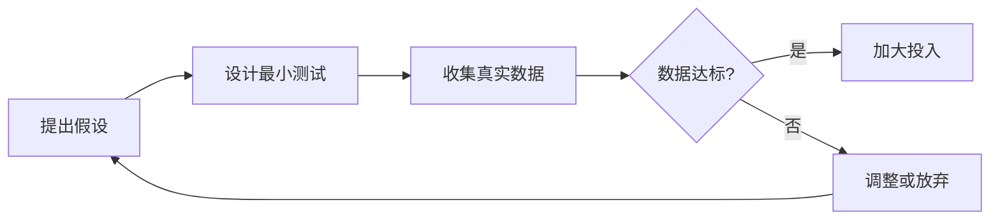
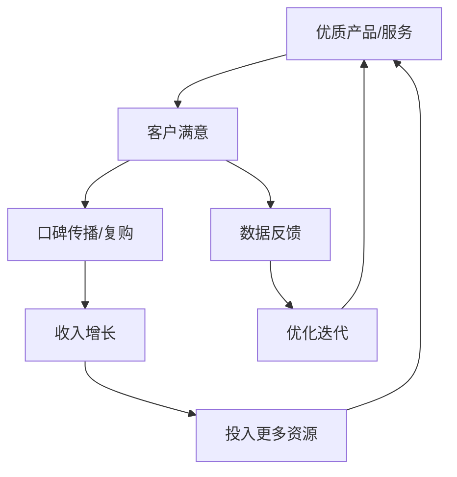
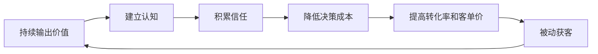
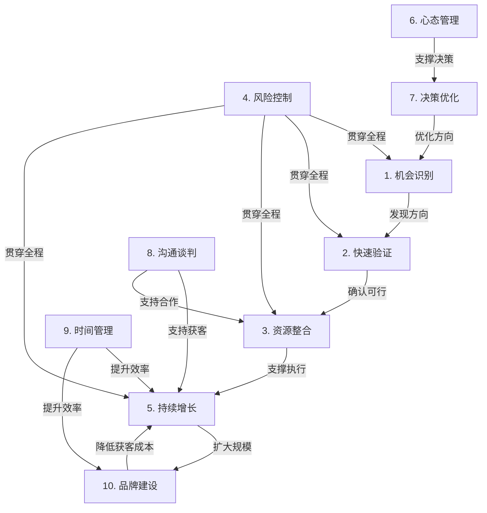

## 十一、本节核心要点

本节（核心技巧）覆盖了从机会识别到品牌建设的十大搞钱实操技巧。本文件将这十个技巧的核心要点提炼为可速查、可执行的精华总结，同时补充各技巧之间的内在联系和协同逻辑。

读完本文件，你将获得：
- 十大技巧的一句话核心定义
- 每个技巧的关键方法论和实操要点
- 技巧之间的协同关系图
- 一张完整的搞钱行动检查清单
- 常见的技巧误用和纠正方法

---

### 1. 十大核心技巧速查

#### 1.1 机会识别——"看见别人看不见的"

**一句话定义**：在信息过载的时代，从噪音中筛选出真实需求的能力。

**核心方法**：

| 方法 | 具体操作 | 适用场景 |
|------|----------|----------|
| 痛点挖掘法 | 从自身和周围人的不便中发现商机 | 个人副业起步 |
| 供需缺口分析 | 对比市场供给与消费者需求的错配 | 产品/服务创业 |
| 趋势外推法 | 从技术/政策/人口趋势预判未来需求 | 中长期布局 |
| 信息差套利 | 利用不同圈层/地域的信息不对称 | 跨境、跨平台机会 |
| 技能嫁接法 | 将A领域的成熟模式移植到B领域 | 蓝海市场开拓 |

**关键判断标准**：一个好机会同时满足三个条件——有真实需求（不是伪需求）、你能提供差异化价值（不是同质化竞争）、时机窗口未关闭（不是已经红海）。

**实操要点**：
- 每天花15分钟浏览目标领域的社群、论坛、评论区，记录高频出现的抱怨和需求
- 建立"机会日志"，记录每一个潜在想法，每周回顾一次，淘汰不靠谱的，深化有潜力的
- 用"反共识测试"验证：如果你的想法所有人都觉得好，可能已经没有信息差了；如果大多数人觉得没价值但你能解释为什么有价值，这个机会更有含金量

#### 1.2 快速验证——"先别投入，先证明"

**一句话定义**：用最小成本、最短时间验证一个搞钱想法是否可行。

**核心方法**：

验证流程遵循"假设→测试→数据→决策"四步循环：

**72小时验证法则**：任何搞钱想法，在投入超过月收入10%之前，先用72小时做最小化验证。具体操作：
- 第1天：明确核心假设（用户真的需要这个吗？愿意为此付费吗？）
- 第2天：用最低成本触达10-20个目标用户，收集反馈
- 第3天：分析数据，做出"继续/调整/放弃"决策

**验证工具箱**：

| 验证方式 | 成本 | 适用场景 | 时间 |
|----------|------|----------|------|
| 朋友圈发布测试 | 0元 | 本地服务、咨询类 | 24小时 |
| 问卷调查 | 0-50元 | 产品需求确认 | 48小时 |
| 落地页+投放 | 100-500元 | 线上产品、课程 | 72小时 |
| 线下摆摊/试卖 | 200-1000元 | 实体产品 | 周末2天 |
| MVP产品 | 500-2000元 | SaaS、工具类 | 1-2周 |

**关键数据指标**：验证期至少需要收集三个核心数据——（1）触达人数，（2）感兴趣的比例（点击/询问），（3）愿意付费的比例。如果"感兴趣→付费"的转化率低于5%，说明要么需求不强，要么定价有问题。

#### 1.3 资源整合——"用别人的资源办自己的事"

**一句话定义**：识别、调动和组合各类资源，以最小投入撬动最大产出。

**资源的四种类型**：

| 类型 | 说明 | 获取方式 |
|------|------|----------|
| 人脉资源 | 能帮你解决问题的人 | 主动社交、价值互换、社群经营 |
| 平台资源 | 可借力的流量/工具/渠道 | 平台规则研究、活动参与、合作洽谈 |
| 知识资源 | 行业信息、方法论、经验 | 付费课程、行业报告、前辈请教 |
| 资金资源 | 启动资金、运营资金 | 自有积蓄、小额贷款、合伙出资 |

**资源整合的核心原则**：
1. **先付出再索取**：帮别人解决问题是建立人脉最有效的方式。不要一上来就问"你能帮我什么"，先问"我能帮你什么"
2. **杠杆思维**：用你的优势资源换取你不具备的资源。比如你有技术但没流量，找有流量但没技术的人合作
3. **平台即杠杆**：善用已有平台（微信、抖音、淘宝、闲鱼）降低获客成本，不要一开始就自建渠道
4. **轻资产优先**：能租不买，能借不租，能合作不独立投入

**实操案例**：某宝妈做社区团购，零启动资金——她用"邻里信任关系"（人脉资源）换取小区物业允许她在群里发团购信息（平台资源），用"帮忙代购"的方式让供应商先供货后结款（资金资源），第一个月就做到了8000元流水。

#### 1.4 风险控制——"先想怎么不亏，再想怎么赚"

**一句话定义**：识别、评估和管理搞钱过程中可能遭受损失的各类风险。

**搞钱中的五类核心风险**：

| 风险类型 | 典型表现 | 控制方法 |
|----------|----------|----------|
| 资金风险 | 亏损超出承受能力 | 设定止损线，分批投入 |
| 时间风险 | 投入大量时间但无回报 | 设定时间止损点（如3个月无进展则调整） |
| 法律风险 | 无证经营、侵权、税务问题 | 咨询专业人士，合规先行 |
| 信用风险 | 合伙人违约、客户赖账 | 合同先行，分期收款 |
| 机会成本风险 | 沉没成本导致不愿放弃 | 定期复盘，及时止损 |

**三条铁律**（来自20个案例的血泪教训）：
1. 任何单一项目的投入不超过总资产的30%
2. 设定明确的止损线——时间止损（如6个月不见效就撤）+ 金额止损（如亏到X元就停）
3. 绝不借钱搞钱——房贷除外，信用卡、网贷、亲友借款都不行

**安全垫公式**：
- 个人搞钱：至少保留6个月生活费的现金储备
- 创业经营：至少保留3个月运营成本的现金
- 投资理财：任何单一标的不超过可投资资产的20%

**风险评估清单**（每次投入前必查）：
- [ ] 最坏情况是什么？我能承受吗？
- [ ] 有没有不可逆的风险（如法律风险、信用破产）？
- [ ] 退出机制是什么？退出成本有多高？
- [ ] 我对这个领域的风险了解多少？有没有做过独立调研？

#### 1.5 持续增长——"从赚钱到持续赚钱"

**一句话定义**：在验证成功后，建立可持续的收入增长引擎，避免增长停滞或倒退。

**增长飞轮模型**：

**持续增长的四个支柱**：

**支柱一：产品力持续迭代**
- 建立客户反馈收集机制（微信沟通、问卷、评价系统）
- 每月至少做一次产品/服务优化
- 关注客户流失原因，比关注新客户获取更重要

**支柱二：获客渠道多元化**
- 不要依赖单一渠道（如果只靠朋友圈，朋友圈屏蔽你就完了）
- 至少布局2-3个获客渠道，主力渠道贡献不超过60%的流量
- 定期测试新渠道，但不要同时铺太多——专注测试完一个再开下一个

**支柱三：客户终身价值（LTV）最大化**
- 建立复购机制：会员卡、订阅制、老客户优惠
- 开发产品线：从单点服务延伸到系列解决方案
- 提升客单价：通过增值服务、套餐组合提高单客收入

**支柱四：系统化运营**
- 把重复性工作标准化、流程化，减少对个人精力的依赖
- 记录关键数据（收入、成本、转化率、复购率），用数据驱动决策
- 在合适时机引入外包或团队，把自己从执行层解放出来

**增长阶段预期**：

| 阶段 | 时间 | 核心任务 | 月收入参考 |
|------|------|----------|-----------|
| 验证期 | 1-3个月 | 跑通最小模型 | 0-3000元 |
| 稳定期 | 3-6个月 | 优化转化，积累口碑 | 3000-10000元 |
| 增长期 | 6-12个月 | 扩大渠道，提升客单价 | 10000-30000元 |
| 成熟期 | 12-24个月 | 系统化运营，布局被动收入 | 30000元以上 |

#### 1.6 心态管理——"搞钱是持久战，心态决定上限"

**一句话定义**：在搞钱过程中保持理性、耐心和韧性，避免情绪化决策。

**搞钱路上的六大心态陷阱**：

| 陷阱 | 表现 | 后果 | 纠正方法 |
|------|------|------|----------|
| 急于求成 | 期望1个月就看到大回报 | 频繁换方向，一事无成 | 设定阶段性小目标，庆祝小胜利 |
| 损失厌恶 | 亏损后死扛不止损 | 小亏变大亏 | 提前设定止损线，严格执行 |
| 从众心理 | 看别人赚钱就跟风 | 高位接盘，成为韭菜 | 独立思考，先验证再投入 |
| 确认偏误 | 只看支持自己判断的信息 | 忽视危险信号 | 主动寻找反面证据 |
| 冒名顶替综合征 | 觉得自己不够格收钱 | 定价过低，不敢推广 | 用客户反馈和数据证明自己的价值 |
| 赌徒心态 | 亏了想翻本，赚了想赚更多 | 杠杆失控，血本无归 | 每次决策前冷静24小时 |

**心态管理的实操方法**：
1. **写决策日志**：每次重大决策前，写下你的理由和预期。事后复盘时回看，识别自己的决策模式和偏见
2. **设置冷静期**：涉及大额投入（超过月收入20%）的决策，强制等24小时再执行
3. **建立支持系统**：找2-3个志同道合的人组成"搞钱互助小组"，定期交流，互相纠偏
4. **接受不确定性**：搞钱没有100%确定的事。能做的是提高概率，而不是消除风险
5. **定期休息**：每周至少留半天完全不思考搞钱的事，防止过度焦虑导致判断力下降

#### 1.7 决策优化——"用框架代替直觉"

**一句话定义**：在搞钱过程中，用系统化的决策框架替代拍脑袋式判断，提高决策质量。

**决策优化三步法**：

**第一步：信息收集（防止信息不对称）**
- 同一问题至少收集3个独立信息源
- 区分事实（可验证的数据）和观点（个人看法）
- 警惕"信息茧房"——主动接触与自己判断相反的信息

**第二步：结构化分析（防止思维混乱）**

| 决策框架 | 适用场景 | 操作方法 |
|----------|----------|----------|
| 二×二矩阵 | 优先级排序 | 按"重要性×紧急性"或"确定性×投入"分类 |
| 决策树 | 多选项比较 | 列出每个选项的可能结果和概率 |
| 逆向思维 | 风险评估 | 先想"怎么做会失败"，然后避免 |
| 第一性原理 | 创新决策 | 剥离表象，回到最基本的真相 |
| 10-10-10法则 | 情绪干扰决策 | 想象10分钟后、10个月后、10年后你怎么看这个决定 |

**第三步：执行复盘（防止重复犯错）**
- 每个决策的预期结果和实际结果都要记录
- 每月做一次决策复盘：哪些判断对了？哪些错了？为什么？
- 建立自己的"决策黑名单"——记录导致过损失的决策模式

#### 1.8 沟通与谈判——"搞定人才能搞定钱"

**一句话定义**：在搞钱过程中，通过高效沟通和谈判技巧，最大化每次交互的价值。

**搞钱中的四个关键沟通场景**：

**场景一：销售沟通**
- 核心原则：先理解客户需求，再推荐解决方案。不是"我有什么"而是"你需要什么"
- FABE法则：Feature（特点）→ Advantage（优势）→ Benefit（利益）→ Evidence（证据）
- 实操话术模板："您的核心需求是___，我们的方案可以___，这能帮您___，之前有客户用了之后___"

**场景二：合作谈判**
- 核心原则：双赢思维。不要试图"赢"对方，而是找到双方利益的交集
- BATNA（最佳替代方案）：谈判前想清楚"如果谈不成，我的替代方案是什么"，这决定了你的谈判底线
- 实操要点：永远先让对方开价；用"如果...那么..."句式做条件交换；关键条款（价格、分成、退出机制）必须书面确认

**场景三：客户维护**
- 核心原则：售后才是长期关系的开始
- 主动沟通频率：新客户前3个月内至少联系2次（不是推销，是关心使用体验）
- 处理投诉的HEARD法则：Hear（倾听）→ Empathize（共情）→ Apologize（道歉）→ Resolve（解决）→ Diagnose（诊断根因）

**场景四：向上管理（对平台、对合作伙伴）**
- 核心原则：用数据说话，用结果证明价值
- 提案模板：现状→问题→方案→预期收益→请求支持
- 定期汇报关键数据，让对方看到你的成长和价值

#### 1.9 时间管理与效率提升——"时间是最稀缺的资源"

**一句话定义**：在有限的时间内，最大化搞钱的投入产出比。

**搞钱时间管理的核心原则**：

**原则一：精力管理优先于时间管理**
- 识别自己的高能量时段（多数人是上午9-12点），把最重要的搞钱工作放在这个时段
- 低能量时段（如午后）处理重复性、低决策的工作
- 每天保证7小时睡眠——疲劳状态下做的搞钱决策，质量比随机决策还差

**原则二：二八法则在搞钱中的应用**
- 80%的收入来自20%的客户或渠道——找到那20%，加倍投入
- 80%的成果来自20%的关键动作——识别你的"高杠杆动作"，优先做
- 80%的时间浪费来自20%的低效习惯——找到并消灭它们

**原则三：减少切换成本**
- 同类型的任务批量处理（集中回复消息、集中发货、集中内容创作）
- 设定"深度工作时间块"（至少90分钟不被打扰）
- 关闭非必要通知，设定固定时间查看消息（如每2小时一次）

**时间分配模板（兼职搞钱者）**：

| 时间段 | 活动 | 时长 |
|--------|------|------|
| 早起前/通勤 | 学习行业知识、听播客 | 30分钟 |
| 午休 | 处理客户消息、社群互动 | 20分钟 |
| 晚间深度工作 | 核心产出（内容创作、产品开发、方案制定） | 90-120分钟 |
| 睡前 | 复盘当天进展、规划明天任务 | 15分钟 |

**效率工具推荐**：
- 任务管理：滴答清单、Notion、飞书
- 时间追踪：番茄Todo、Forest
- 自动化：微信机器人、Zapier、定时发送
- 内容创作：AI辅助写作、模板复用、内容日历

#### 1.10 品牌建设——"从卖产品到卖信任"

**一句话定义**：通过持续输出价值，建立个人或产品品牌，降低获客成本，提升溢价能力。

**品牌建设的底层逻辑**：

**品牌建设的三个阶段**：

**阶段一：定位期（第1-2个月）**
- 明确你的品牌关键词：你希望别人提到你时想到哪3个词？
- 确定内容方向：你分享什么内容，为谁分享，解决什么问题
- 统一视觉和语言风格：头像、昵称、签名、内容调性保持一致

**阶段二：内容积累期（第3-6个月）**
- 保持稳定的内容输出频率（宁可低频但稳定，不要高频但断更）
- 内容结构：60%干货（建立专业度）+ 30%故事（建立情感连接）+ 10%产品（变现）
- 在1-2个主要平台深耕，不要一开始就全平台铺开

**阶段三：品牌变现期（第6个月起）**
- 建立产品/服务矩阵：免费内容引流→低价产品体验→高价服务深度交付
- 建立推荐机制：老客户转介绍激励、案例展示
- 开始布局被动收入：数字产品、课程、会员制

**品牌资产的衡量指标**：

| 指标 | 衡量方式 | 健康标准 |
|------|----------|----------|
| 品牌认知度 | 搜索量、被提及次数 | 月环比增长10%+ |
| 信任度 | 私域转化率、复购率 | 复购率>30% |
| 溢价能力 | 与同类产品/服务的价格对比 | 高于市场均价20%+ |
| 被动获客比例 | 不主动推广时的新客户占比 | 逐步提升至50%+ |

---

### 2. 十大技巧的协同关系

这十个技巧不是孤立的，而是一个有机系统。它们之间的协同关系如下：

**关键协同点**：
1. **机会识别×快速验证**：发现机会后必须验证，不验证就投入是最大的浪费
2. **快速验证×风险控制**：验证的本质就是风险控制——用最小成本排除最大风险
3. **资源整合×沟通谈判**：资源整合的实操就是沟通谈判——说服别人跟你合作
4. **持续增长×品牌建设**：品牌是持续增长的终极杠杆——有了品牌，获客成本趋近于零
5. **心态管理×决策优化**：心态不稳时做的决策，再好的框架也会被情绪扭曲
6. **时间管理×所有技巧**：时间管理是"底层操作系统"，决定了其他所有技巧的执行效率

---

### 3. 搞钱行动检查清单

将十大技巧转化为可执行的检查清单。每次启动新项目或做重大决策时，逐项对照：

#### 3.1 项目启动清单

| 序号 | 检查项 | 对应技巧 | 完成标准 |
|------|--------|----------|----------|
| 1 | 我的目标市场有真实需求吗？ | 机会识别 | 有至少10个目标用户的直接反馈 |
| 2 | 我能在多长时间内验证可行性？ | 快速验证 | 制定了72小时验证计划 |
| 3 | 我需要哪些资源？如何获取？ | 资源整合 | 列出了资源清单和获取方案 |
| 4 | 最坏情况是什么？我能承受吗？ | 风险控制 | 设定了时间和金额止损线 |
| 5 | 这个项目的增长模型是什么？ | 持续增长 | 描述了至少一条增长飞轮 |
| 6 | 我为什么适合做这件事？ | 心态管理 | 明确了能力和心态上的优势与短板 |
| 7 | 关键决策点有哪些？如何判断？ | 决策优化 | 设定了决策树和判断标准 |
| 8 | 我需要跟谁沟通？怎么谈？ | 沟通谈判 | 准备了关键沟通场景的话术 |
| 9 | 每天/每周投入多少时间？ | 时间管理 | 制定了时间分配方案 |
| 10 | 如何让人记住我？ | 品牌建设 | 确定了品牌关键词和内容方向 |

#### 3.2 月度复盘清单

每月末花1小时做以下复盘：

- [ ] **机会识别**：本月发现了几个新机会？评估了几个？推进了几个？
- [ ] **快速验证**：本月验证了什么假设？结果如何？学到了什么？
- [ ] **资源整合**：本月获取了哪些新资源？维护了哪些老关系？
- [ ] **风险控制**：本月有没有触发止损线？风险敞口是否在可控范围？
- [ ] **持续增长**：本月收入环比变化多少？增长引擎是否运转正常？
- [ ] **心态管理**：本月有没有情绪化决策？哪些事情让我焦虑？怎么缓解的？
- [ ] **决策优化**：本月最重要的3个决策是什么？结果如何？
- [ ] **沟通谈判**：本月关键沟通的效果如何？有没有需要改进的地方？
- [ ] **时间管理**：本月时间投入产出比如何？有没有可以优化的环节？
- [ ] **品牌建设**：本月内容输出了多少？粉丝/关注者增长了多少？

---

### 4. 常见技巧误用与纠正

| 技巧 | 常见误用 | 正确做法 |
|------|----------|----------|
| 机会识别 | 看到别人赚钱就跟风 | 先分析对方成功的核心前提，再判断自己是否具备 |
| 快速验证 | 用"我觉得"代替数据 | 必须收集目标用户的真实反馈（不是朋友的客气话） |
| 资源整合 | 只想索取不想付出 | 先提供价值，建立信任后再谈合作 |
| 风险控制 | 设了止损线但执行时犹豫 | 提前设定自动化触发机制，或找人监督执行 |
| 持续增长 | 盲目追求数据增长 | 关注增长质量——利润率、客户满意度、复购率 |
| 心态管理 | 强迫自己"永远积极" | 接受负面情绪的存在，关键是不让情绪影响决策 |
| 决策优化 | 过度分析导致决策瘫痪 | 设定决策时限，70%信息足够时就行动 |
| 沟通谈判 | 把客户当"待收割的韭菜" | 真诚沟通，建立长期信任关系 |
| 时间管理 | 把时间表排得满满当当 | 留出20%的弹性时间应对突发情况 |
| 品牌建设 | 一开始就追求"完美人设" | 真实比完美更有吸引力，先做再优化 |

---

### 5. 技巧组合拳——不同场景的最优组合

不同搞钱场景需要不同的技巧组合。以下是几种典型场景的最优组合：

**场景一：个人副业起步**
- 优先级：机会识别 → 快速验证 → 时间管理 → 心态管理
- 关键：用最小成本验证可行性，利用业余时间，在不影响主业的前提下试水

**场景二：从副业转全职**
- 优先级：风险控制 → 持续增长 → 决策优化 → 资源整合
- 关键：确保副业收入稳定达到主业的70%以上再辞职，建立现金安全垫

**场景三：已有稳定收入，想规模化**
- 优先级：品牌建设 → 持续增长 → 沟通谈判 → 资源整合
- 关键：从"卖时间"转向"卖系统"，建立品牌降低获客成本，引入团队或外包

**场景四：遭遇增长瓶颈**
- 优先级：决策优化 → 心态管理 → 机会识别 → 快速验证
- 关键：冷静分析瓶颈原因，是市场天花板还是自身能力瓶颈，决定是深耕还是转型

---

### 6. 核心要点一句话总结

将十大技巧浓缩为十个可随时回忆的关键句：

1. **机会识别**：从抱怨中找需求，从趋势中找方向，从能力圈中找切入点
2. **快速验证**：72小时、10%月收入以内、三个核心数据——验证完再投入
3. **资源整合**：先付出再索取，善用平台杠杆，轻资产优先
4. **风险控制**：三条铁律——30%上限、止损线、不借钱搞钱
5. **持续增长**：产品力×渠道多元×客户终身价值×系统化运营
6. **心态管理**：写决策日志、设冷静期、建支持系统、接受不确定性
7. **决策优化**：信息→结构化分析→执行复盘，用框架替代拍脑袋
8. **沟通谈判**：FABE销售法、BATNA谈判法、HEARD投诉处理法
9. **时间管理**：精力>时间，二八法则，减少切换成本，深度工作时间块
10. **品牌建设**：定位→内容积累→变现，60%干货+30%故事+10%产品

---

*本文件是核心技巧章节的精华总结。建议将此文件作为日常搞钱的速查手册，在做决策时随时对照。详细内容请回看各技巧对应的专题文件。*
