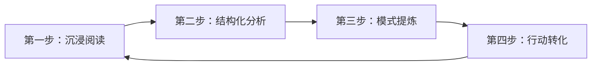

## 一、为什么要研究案例

在正式进入20个搞钱案例之前，我们必须先回答一个根本问题：**为什么案例研究是搞钱学习中最高效的方法？** 这不是一句空洞的口号——它背后有认知科学的支撑、有教育学的验证、有商业实践的反复检验。理解了"为什么"，你才能在后续的学习中做到"知其然，更知其所以然"。

### 1.1 从"知道"到"做到"的鸿沟

#### 1.1.1 知识的三层结构

人类掌握的知识可以分为三个层次：

| 层次 | 名称 | 特征 | 举例 |
|------|------|------|------|
| 第一层 | **陈述性知识**（Know What） | 知道"是什么"，可以通过阅读和记忆获得 | "搞钱要先验证再投入" |
| 第二层 | **程序性知识**（Know How） | 知道"怎么做"，需要通过练习和重复获得 | "用72小时验证一个搞钱想法的具体步骤" |
| 第三层 | **条件性知识**（Know When/Why） | 知道"什么时候用"和"为什么这样用"，需要通过大量场景积累获得 | "在什么情况下应该果断放弃验证，在什么情况下应该再给一次机会" |

大多数搞钱类书籍和课程，能有效传递的是第一层知识。你在读完一本书后，能记住很多"道理"——比如"要找到供需缺口""要控制风险""要坚持长期主义"。但当你真正去做的时候，你会发现这些道理根本不够用，因为你缺少第二层和第三层知识。

**案例研究的独特价值在于：它同时传递三个层次的知识。** 一个完整的案例，不仅告诉你"他做了什么"（陈述性知识），还告诉你"他具体怎么做的"（程序性知识），更告诉你"他为什么在这个时间点做这个决定"（条件性知识）。这种"情境化"的知识传递方式，远比抽象的原则列表更有效。

#### 1.1.2 为什么读书学不会搞钱

这是一个残酷但真实的观察：**绝大多数人读了100本搞钱相关的书，依然不会搞钱。** 原因不在于书的质量差，而在于人类大脑的学习机制。

认知心理学家丹尼尔·卡尼曼（Daniel Kahneman）在《思考，快与慢》中指出，人类有两套思维系统：

- **系统1（快思维）**：直觉、自动、快速，基于经验和模式匹配
- **系统2（慢思维）**：分析、刻意、缓慢，基于逻辑和推理

搞钱决策大多发生在高压、高不确定性、时间紧迫的环境中——这些环境恰恰是系统1主导的。而读书训练的是系统2。你读了一本书，系统2理解了"要控制风险"，但当一个看起来很好的机会摆在面前时，系统1的贪婪和FOMO（错失恐惧）会在毫秒级时间内压倒系统2的理性判断。

**案例研究的作用，就是通过大量真实场景的浸泡，把系统2的理性知识"写入"系统1的直觉反应。** 当你看过足够多的"因为没有验证就all in而失败"的案例后，下次面对类似场景时，系统1会自动发出警报："等等，这跟那个案例很像，先别急。"这就是所谓的"经验直觉"——它不是天赋，而是大量案例输入后的模式识别能力。

#### 1.1.3 具身认知：为什么"看别人做"比"听别人说"更有效

认知科学中有一个重要概念叫"具身认知"（Embodied Cognition）：人类的理解不仅仅是大脑的事，而是整个身体参与的过程。当我们观察一个动作时，大脑中负责执行该动作的镜像神经元（Mirror Neurons）会被激活——也就是说，**看别人做某件事，和自己亲自做，在大脑层面有高度相似的激活模式**。

案例研究本质上是一种"替代性经验"。当你阅读一个创业者从0到1的故事时，你的大脑在"模拟"他的决策过程、他的情绪波动、他的资源调配。这种模拟虽然不如真实经历深刻，但远比抽象的原则讲解更能形成深层理解。

哈佛商学院的教学法之所以以案例为核心，正是基于这个原理：让学生通过大量案例的"替代性体验"，在进入真实商业世界之前就积累大量的"虚拟经验"。

### 1.2 案例研究的五大独特优势

#### 1.2.1 优势一：降低认知摩擦

抽象的搞钱原则读起来觉得有道理，但用起来往往不知道具体怎么做。比如"找到供需缺口"这个原则——

- 什么是"供需缺口"？怎么发现它？
- 发现了之后怎么验证它是真实的需求而不是伪需求？
- 验证了之后怎么把它变成一个可执行的商业模式？
- 变成商业模式之后怎么定价、怎么获客、怎么交付？

这些问题，原则本身无法回答。但一个完整案例可以把这个过程"具象化"：

> 某宝妈发现小区里很多双职工家庭没时间买菜，但又对生鲜品质有要求（供需缺口）。她先在业主群里发了一条消息，问有没有人需要帮忙代买（验证需求）。收到20多个回复后，她联系了郊区的一个有机农场，谈了一个团购价格（商业模式）。第一单只做了5户人家，每户加收10%的服务费（定价和交付）。复购率达到80%后，才逐步扩大规模（规模化）。

这个案例把抽象原则变成了看得见、摸得着的故事。**认知摩擦被大幅降低——你不再需要"理解"原则，你只需要"看懂"故事。**

#### 1.2.2 优势二：暴露隐性知识

真正决定搞钱成败的，往往不是写在教科书上的"明规则"，而是只有做过的人才知道的"暗知识"。这些暗知识包括：

**行业特定的隐性知识：**

- 做社区团购，选品比流量重要10倍，因为生鲜损耗率直接吃掉利润
- 做自媒体变现，粉丝质量比粉丝数量重要，1万精准粉比10万泛粉值钱
- 做SaaS产品，续费率才是生死线，新客获取成本可能需要6-12个月才能回本
- 做跨境电商，物流时效和退货率比选品更重要，因为跨境退货成本极高
- 做短视频带货，完播率比播放量重要，因为算法推荐的核心指标是完播率

**执行层面的隐性知识：**

- 谈合作时，先给对方一个"小甜头"再谈大合作，成功率提高3倍
- 写文案时，前3秒决定80%的成败，因为用户的注意力窗口就这么短
- 做社群运营时，每天固定时间互动比随机互动效果好5倍，因为用户形成了习惯
- 定价时，尾数用".9"而不是整数，转化率能提高15-30%

**这些隐性知识几乎不可能通过读书获得——它们只存在于真实案例的细节中。** 你需要大量阅读案例，才能把这些散落的"暗知识"拼凑成完整的认知地图。

#### 1.2.3 优势三：建立决策直觉

顶级棋手不是靠计算每一步棋的胜率来下棋的，而是靠多年积累形成的"棋感"。搞钱也一样——当你看过足够多的成功和失败案例后，面对一个新的搞钱机会，你能直觉性地感觉到"这个靠谱"或"这个有问题"。

这种直觉不是玄学，而是大脑的模式识别能力。神经科学研究表明，专家的直觉判断来自于大脑中存储的大量"心理模型"（Mental Models）——这些模型是通过大量案例的反复暴露形成的。

**案例数量与决策质量的关系：**

```text
案例数量    决策能力
0-10个     几乎没有直觉判断能力，只能靠逻辑分析
10-50个    开始出现初步的模式识别，但准确率不稳定
50-100个   直觉判断开始可靠，能快速识别明显的"红旗"
100-500个  形成成熟的决策框架，能处理复杂场景
500个以上  接近专家水平，能在高不确定性环境中做出可靠判断
```

本章提供的20个案例（10个成功+10个失败）只是一个起点。真正的成长来自于你在后续实践中不断积累自己的案例库。

#### 1.2.4 优势四：规避幸存者偏差

幸存者偏差（Survivorship Bias）是搞钱学习中最大的认知陷阱。我们看到的大多数"搞钱教程"，讲的都是成功者的故事。但真实世界中，同一个赛道里，失败者的数量通常是成功者的10倍甚至100倍。

**只听成功者的话，你会犯两个严重错误：**

1. **高估成功率**：看到一个博主年入百万，就以为做自媒体很容易。实际上，能年入百万的博主不到0.1%。
2. **误判因果关系**：成功者往往把成功归因于自己的努力和方法，但实际上运气、时机、资源等外部因素可能占了50%以上。

**案例研究（尤其是失败案例）的价值在于：它帮你看到"硬币的另一面"。** 当你同时研究成功和失败案例时，你会发现：

- 同样的方法，有人成功有人失败——区别往往不在方法本身，而在执行条件
- 成功者口中的"关键因素"，在失败者身上同样存在——说明它不是真正的决定因素
- 很多成功案例中的"运气成分"被轻描淡写地略过了

本章特意收录了10个失败案例，就是为了帮你校正幸存者偏差。**失败案例的价值往往大于成功案例——因为它们帮你省下的，是真金白银和宝贵时间。**

#### 1.2.5 优势五：形成可迁移的思维框架

案例研究的终极目标不是记住20个故事，而是从这些故事中提炼出可迁移的思维框架。

什么是"可迁移"？就是你在A领域学到的分析方法，可以应用到B领域。比如：

- 你在案例中学会了"因果链追溯法"（结果 ← 直接原因 ← 深层原因 ← 底层逻辑），这个方法不仅适用于分析搞钱案例，也适用于分析职场晋升、人际关系、学习效率等任何领域
- 你在案例中学会了"SWOT快速诊断"，这个框架可以用于评估任何机会，不管是创业、投资还是职业选择
- 你在案例中学会了"72小时验证法则"，这个方法可以用于验证任何新想法，不管是副业、产品还是内容方向

**思维框架是"渔"，具体案例是"鱼"。** 授人以鱼不如授人以渔——案例研究的价值不仅在于案例本身，更在于从案例中提炼出的思维工具。

### 1.3 案例研究 vs 其他学习方式的对比

为了更清楚地说明案例研究的优势，我们把它与其他常见的搞钱学习方式做一个系统对比：

| 学习方式 | 知识传递效率 | 实操性 | 深度 | 可迁移性 | 成本 | 适用阶段 |
|----------|------------|--------|------|----------|------|----------|
| **读书/课程** | ★★★★☆ | ★★☆☆☆ | ★★★☆☆ | ★★★★☆ | 低 | 入门认知 |
| **案例研究** | ★★★★★ | ★★★★☆ | ★★★★★ | ★★★★★ | 低 | 全阶段 |
| **亲身实践** | ★★★★★ | ★★★★★ | ★★★★★ | ★★★☆☆ | 高 | 验证执行 |
| **导师指导** | ★★★★☆ | ★★★★☆ | ★★★★☆ | ★★★★☆ | 高 | 突破瓶颈 |
| **社群交流** | ★★★☆☆ | ★★★☆☆ | ★★☆☆☆ | ★★☆☆☆ | 中 | 信息获取 |
| **纯试错** | ★★☆☆☆ | ★★★★★ | ★★★☆☆ | ★★☆☆☆ | 极高 | 不推荐 |

**案例研究的独特定位：它是"低成本替代亲身实践"的最佳方式。** 你不可能亲自尝试100种搞钱方式来积累经验，但你可以通过研究100个案例来获得类似的认知深度。当然，案例研究不能完全替代实践——最好的学习方式是"案例研究 + 小成本验证"的组合。

### 1.4 案例研究的认知科学基础

#### 1.4.1 叙事传输理论（Narrative Transportation Theory）

心理学家梅拉妮·格林（Melanie Green）和蒂莫西·布洛克（Timothy Brock）在2000年提出了"叙事传输理论"：当人们沉浸在一个故事中时，他们会暂时"忘记"自己的现实，进入故事的世界。在这个过程中，人们对故事中的信息的接受度会大幅提高，批判性思维会暂时降低。

这意味着什么？**案例故事比抽象原则更容易被大脑接受和记忆。** 当你阅读一个创业者从0到1的故事时，你的大脑会自动"代入"他的视角，体验他的决策过程、情绪波动和结果反馈。这种沉浸式体验形成的记忆，远比干巴巴的原则列表更深刻、更持久。

#### 1.4.2 情境学习理论（Situated Learning Theory）

教育学家让·拉夫（Jean Lave）和艾蒂安·温格（Etienne Wenger）在1991年提出了"情境学习理论"：知识不是抽象的、脱离情境的，而是嵌入在具体的社会和物理情境中的。真正有效的学习，必须发生在"真实或仿真的情境"中。

案例研究正是情境学习的典型应用。每一个案例都是一个完整的情境——有具体的背景、人物、时间、资源约束、决策点和结果。通过在这些情境中反复"浸泡"，学习者能够获得在抽象教学中无法获得的深层理解。

#### 1.4.3 双重编码理论（Dual Coding Theory）

心理学家艾伦·佩维奥（Allan Paivio）在1971年提出了"双重编码理论"：人类的认知系统有两个独立但相互关联的编码系统——语言系统和非语言（意象）系统。当信息同时通过两个系统编码时，记忆效果最佳。

案例故事天然具备双重编码的特性：

- **语言编码**：文字描述的事件、数据、对话
- **意象编码**：你脑海中自动浮现的画面、场景、人物形象

这就是为什么你读完一个案例后，往往能记住故事的细节，但读完一章原则后却记不住几条。**案例利用了大脑的双重编码机制，让知识以更高效的方式存储在长期记忆中。**

### 1.5 案例研究的常见误区

在开始案例学习之前，必须先澄清几个常见的误区，否则你的学习效果会大打折扣。

#### 误区一：把案例当故事读

很多人读案例就像读小说——读完觉得"这个人真厉害"或者"这个故事真精彩"，然后就翻到下一个了。这是最低效的读法。

**正确的做法是：读案例时始终保持"分析模式"。** 每读一个案例，至少问自己以下问题：

1. 他的起点是什么？（资源、能力、环境）
2. 他做了哪些关键决策？每个决策的依据是什么？
3. 有哪些转折点？在转折点上他做了什么选择？
4. 他的成功/失败，最关键的3个因素是什么？
5. 如果环境变化，这个模式还成立吗？
6. 有哪些因素是可以迁移到我的情况中的？

#### 误区二：只看成功案例

这是最常见的误区。很多人只愿意看成功案例，因为成功故事让人感到鼓舞和希望。但只看成功案例会导致严重的认知偏差：

- **高估成功率**：你看到的都是成功者，会误以为成功很容易
- **误判因果**：成功者往往美化自己的成功路径，把运气说成实力
- **忽视风险**：你没有看到失败者的惨痛教训，会低估风险

**黄金比例：成功案例与失败案例的阅读比例应该是1:1。** 本章提供的10个成功+10个失败案例，正是基于这个原则。

#### 误区三：简单模仿

"他做小红书成功了，我也去做"——这种简单模仿是最危险的。每个案例的成功都有其特定的前提条件（时代背景、个人能力、资源禀赋、运气成分），这些条件你不一定具备。

**正确的做法是：先分析他的成功前提，再判断哪些前提适用于你。** 具体方法：

1. 列出案例中所有的"成功前提"
2. 逐个检查：这个前提我具备吗？
3. 如果不具备，有没有替代方案？
4. 如果大部分前提都不具备，说明这个案例不适合你参考

#### 误区四：只记结论不记过程

很多人读案例只记住了"他赚了多少钱"或"他用了什么方法"，却忽略了整个决策过程。但真正有价值的信息在过程中——他为什么在那个时间点做出那个决策？他考虑了哪些因素？他放弃了哪些选项？

**过程比结论重要10倍。** 结论是"做什么"，过程是"为什么这样做"——后者才是可迁移的知识。

#### 误区五：读完不行动

这是最致命的误区。很多人读了大量案例，做了大量笔记，但从不把学到的东西应用到实际行动中。这就像看了100个游泳教学视频却从不下水——你永远不会学会游泳。

**案例学习必须与行动结合。** 每读完一个案例，至少做一个"微行动"：

- 写下3个可以应用到自己情况的要点
- 列出1个可以立即尝试的小实验
- 更新自己的"搞钱决策清单"

### 1.6 高效案例学习的四步法

基于上述分析，我总结出一套高效的案例学习方法论：



#### 第一步：沉浸阅读（10分钟）

放下所有分析框架，像读小说一样完整地读一遍案例。目标是建立对案例的整体感知——了解故事的起承转合，感受主人公的情绪变化，形成直觉判断。

这一步不要做笔记，不要分析，就是单纯地"体验"这个故事。

#### 第二步：结构化分析（15分钟）

用分析框架重新审视案例。推荐使用"四维分析框架"：

| 维度 | 核心问题 | 分析要点 |
|------|----------|----------|
| 认知维度 | 他看到了什么别人没看到的？ | 趋势判断、机会识别、认知差 |
| 能力维度 | 他有什么核心能力？ | 专业技能、执行力、学习能力 |
| 资源维度 | 他调动了什么资源？ | 资金、人脉、平台、工具 |
| 时间维度 | 他的节奏把控如何？ | 入场时机、投入周期、复利积累 |

同时用"因果链追溯法"追问三层：

```text
结果 ← 直接原因 ← 深层原因 ← 底层逻辑
```

#### 第三步：模式提炼（10分钟）

从案例中提炼出可迁移的模式或原则。问自己：

- 这个案例中反复出现的模式是什么？
- 这个模式是否在其他案例中也出现过？
- 这个模式背后的底层逻辑是什么？
- 这个模式在什么条件下成立，什么条件下不成立？

#### 第四步：行动转化（5分钟）

把学到的东西转化为具体的行动。问自己：

- 这个案例中有哪些做法是我可以立即尝试的？
- 我需要做什么样的调整才能把这个方法应用到我的情况中？
- 我的下一步行动是什么？什么时候开始？

### 1.7 案例研究的边界与局限

案例研究不是万能的。在开始学习之前，你需要了解它的边界：

**案例研究擅长的领域：**

- 理解复杂系统中的因果关系（搞钱是一个复杂系统）
- 培养情境化的决策能力（面对不确定性时的判断力）
- 发现隐性知识和最佳实践（书本上学不到的东西）
- 建立直觉和模式识别能力（快速判断的能力）

**案例研究不擅长的领域：**

- 提供精确的量化预测（"做这个一定能赚多少钱"）
- 替代亲身实践（看100个游泳视频不如下水游一次）
- 处理全新的、无先例的场景（如果赛道太新，没有案例可参考）
- 提供放之四海而皆准的"正确答案"（每个案例都有其独特性）

**最佳学习策略：案例研究 + 小成本验证。** 用案例研究建立认知框架和直觉判断，用小成本验证把认知转化为实际经验。两者缺一不可。

### 1.8 本节核心要点

1. **知识的三层结构**：陈述性知识（是什么）、程序性知识（怎么做）、条件性知识（什么时候用）——案例研究同时传递三层知识
2. **系统1与系统2**：搞钱决策主要由系统1（直觉）驱动，案例研究通过大量场景浸泡，把理性知识"写入"直觉反应
3. **五大独特优势**：降低认知摩擦、暴露隐性知识、建立决策直觉、规避幸存者偏差、形成可迁移框架
4. **认知科学支撑**：叙事传输理论、情境学习理论、双重编码理论——案例学习有坚实的科学基础
5. **五大常见误区**：把案例当故事读、只看成功案例、简单模仿、只记结论不记过程、读完不行动
6. **四步学习法**：沉浸阅读 → 结构化分析 → 模式提炼 → 行动转化
7. **边界与局限**：案例研究不能替代实践，最佳策略是"案例研究 + 小成本验证"
