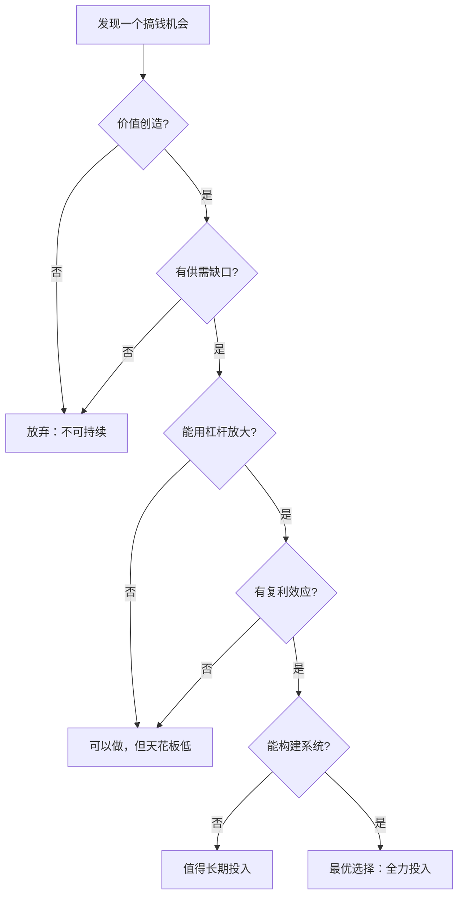

## 二、搞钱的底层逻辑框架

### 2.1 什么是"底层逻辑"——为什么你需要它

很多人搞钱失败，不是因为不够努力，而是因为用错误的逻辑在做正确的事。底层逻辑就像操作系统的内核——你日常使用的APP（具体搞钱方法）都运行在它之上。内核出错了，APP再精美也会崩溃。

**底层逻辑与具体方法的区别**：

| 层级 | 内容 | 举例 | 生命周期 |
|------|------|------|----------|
| **道**（底层逻辑） | 为什么能赚钱 | 价值创造、供需关系、杠杆原理 | 几十年甚至上百年不变 |
| **法**（方法论） | 用什么策略赚钱 | 内容营销、社群运营、SaaS模式 | 5-10年有效 |
| **术**（具体技巧） | 怎么执行赚钱 | 小红书爆款标题公式、SEO优化 | 1-3年有效 |
| **器**（工具） | 用什么工具赚钱 | ChatGPT、抖音、Shopify | 几个月到几年 |

本节聚焦"道"的层面——搞钱的底层逻辑。掌握了底层逻辑，你面对任何新机会时，都能快速判断"这个靠不靠谱"，而不是被表面的热闹所迷惑。

### 2.2 搞钱的七大底层逻辑

#### 2.2.1 逻辑一：价值创造逻辑——赚钱的本质是交换

**核心原理**：所有可持续的收入，本质上都是"价值交换"。你提供某种价值（产品、服务、信息、情感满足），对方为此付费。这个过程可以用一个公式表达：

```text
收入 = 价值 × 受众规模 × 转化率 × 客单价
```

**为什么很多人搞不到钱**：他们思考的起点是"我要赚钱"，而不是"我能为谁解决什么问题"。方向反了，后面所有的努力都是南辕北辙。

**价值创造的四种模式**：

| 模式 | 核心逻辑 | 典型案例 | 收入天花板 |
|------|----------|----------|------------|
| **解决问题** | 消除某个痛点 | 程序员开发效率工具 | 取决于问题的普遍性和严重程度 |
| **提升效率** | 让某件事做得更快/更好 | 自动化脚本、SaaS工具 | 取决于替代方案的成本差 |
| **满足情感** | 提供情绪价值 | 娱乐内容、心理咨询 | 取决于受众的情感需求强度 |
| **降低门槛** | 让原本做不到的人能做到 | 知识付费、技能培训 | 取决于目标人群的规模 |

**关键检验**：在投入任何搞钱项目之前，先回答这个问题——"如果把我的贡献从这件事中拿掉，对方还能获得同样的价值吗？"如果答案是"能"，那你创造的价值趋近于零，这个模式不可持续。

#### 2.2.2 逻辑二：供需关系逻辑——稀缺性决定定价权

**核心原理**：价格不是由成本决定的，而是由供需关系决定的。当供给稀缺而需求旺盛时，你拥有定价权；当供给过剩而需求不足时，你只能接受低价。

**供需矩阵与搞钱策略**：

```text
                需求强度
           低            高
        ┌──────────┬──────────┐
   高   │ 价格战    │  微利    │  ← 供给过剩
供      │ 不要进入  │  走量    │
给      ├──────────┼──────────┤
密   低 │ 无市场    │  暴利    │  ← 供给稀缺
度      │ 不要碰    │  黄金赛道 │
        └──────────┴──────────┘
```

**实操要点**：

1. **识别稀缺性来源**：稀缺性可能来自技术壁垒（别人做不了）、时间壁垒（需要长期积累）、资源壁垒（独占某种资源）、认知壁垒（别人看不到这个机会）。
2. **警惕虚假稀缺**：很多所谓的"蓝海"只是因为市场太小，不足以支撑一个生意。真正的稀缺是"需求大但供给不足"。
3. **稀缺性会消失**：任何高利润的赛道都会吸引竞争者涌入，导致供给增加、利润下降。你需要持续构建新的稀缺性（品牌、专利、网络效应、数据壁垒等）。

**真实案例对比**：

- **稀缺性高**：2023年初期做AI绘画教程的创作者，当时懂Midjourney的人极少，需求旺盛，单个课程售价可达数百元。
- **稀缺性低**：2024年底再做AI绘画教程，市场上已有大量免费教程和低价课程，新进入者很难获得溢价。

#### 2.2.3 逻辑三：杠杆逻辑——放大个人产出的倍增器

**核心原理**：普通人的时间和精力是有限的。如果只能用"1小时换1小时的钱"，你永远无法实现财务自由。杠杆的作用是让你的投入产出比从1:1变成1:10甚至1:1000。

**四种杠杆类型**（来自Naval Ravikant的框架）：

| 杠杆类型 | 含义 | 门槛 | 潜力 | 举例 |
|----------|------|------|------|------|
| **劳动力杠杆** | 让别人为你工作 | 需要管理能力 | 中等 | 开公司雇人 |
| **资本杠杆** | 用钱生钱 | 需要本金和信用 | 高 | 投资、借贷 |
| **代码杠杆** | 写一次，运行无数次 | 需要技术能力 | 极高 | SaaS产品、APP |
| **媒体杠杆** | 创作一次，传播无数次 | 需要内容能力 | 极高 | 自媒体、课程、书籍 |

**杠杆选择的关键原则**：

- **边际成本趋近于零**的杠杆最有价值。写一篇文章，1个人看和100万人看，成本几乎一样。
- **不需要许可**的杠杆最适合普通人。代码和媒体杠杆不需要别人的许可就能开始，而劳动力和资本杠杆往往需要。
- **杠杆有正负**。用杠杆赚钱快，亏钱也快。借贷炒股就是负面杠杆的典型。

**普通人最佳杠杆组合**：媒体（内容）+ 代码（工具/自动化）。先通过内容建立信任和影响力，再通过数字化产品实现规模化变现。

#### 2.2.4 逻辑四：复利逻辑——时间是最大的盟友

**核心原理**：复利不仅适用于投资，它适用于搞钱的方方面面——技能积累、客户关系、品牌影响力、内容资产，都遵循复利增长的规律。

**复利公式的搞钱解读**：

```text
最终价值 = 初始值 × (1 + 增长率)^时间
```

- **初始值**：你起步时的技能水平、资金、人脉
- **增长率**：你每天/每月的进步速度
- **时间**：你坚持的时长

**复利的三个关键变量**：

1. **增长率不需要很高，但必须为正**：每天进步1%，一年后就是原来的37.8倍。关键是方向正确，哪怕进步慢一点。
2. **时间是最大的变量**：前几个月可能看不到效果，但坚持2-3年后，增长曲线会急剧上升。大多数人在拐点到来之前就放弃了。
3. **复利被中断会大幅削弱**：中途放弃3个月，之前积累的势能可能归零。保持连续性比偶尔爆发重要得多。

**复利在搞钱中的具体体现**：

| 领域 | 复利载体 | 拐点通常在哪里 |
|------|----------|----------------|
| 自媒体 | 内容库 + 粉丝基数 | 50-100篇高质量内容后 |
| 技能变现 | 口碑 + 转介绍网络 | 服务过20-30个满意客户后 |
| 投资理财 | 本金 + 收益再投资 | 坚持定投5年以上 |
| 个人品牌 | 行业认知度 + 信任积累 | 持续输出2-3年后 |
| 产品创业 | 用户量 + 数据 + 网络效应 | 找到PMF后的12-18个月 |

**实操建议**：找到你的"复利载体"，然后每天往里面存一点点。不要追求单次爆发，要追求持续积累。

#### 2.2.5 逻辑五：信息差逻辑——认知就是购买力

**核心原理**：同一信息，不同人看到的价值完全不同。信息差的来源有三种：

1. **时间差**：你比别人更早知道某个信息（比如提前知道某个政策变化、行业趋势）
2. **认知差**：同一信息，你能解读出别人读不出来的价值（比如看到某个数据变化背后的商业含义）
3. **执行差**：大家都知道，但只有你真正去做（比如"人人都知道要做自媒体"，但只有1%的人真的持续输出）

**信息差的衰减规律**：

```text
信息差价值 = f(知晓人数) → 人数越多，价值越低
```

纯靠信息差赚钱是有保质期的。互联网时代，信息传播极快，任何信息差都会在6-12个月内被抹平。所以：

- **短期策略**：快速行动，在信息差消失前变现
- **长期策略**：把信息差转化为能力差——即使别人知道了同样的信息，也做不到你做的事

**信息差的三种变现方式**：

| 方式 | 操作 | 风险 | 持续性 |
|------|------|------|--------|
| **直接转卖** | 做信息中介、代购、咨询 | 低（但容易被替代） | 差 |
| **加工再卖** | 把信息整理成课程、报告、工具 | 中 | 中 |
| **转化执行** | 用信息差指导自己的行动 | 低 | 强 |

#### 2.2.6 逻辑六：网络效应逻辑——越多人用越有价值

**核心原理**：某些产品或服务的价值随着用户数量增加而增加。这就是网络效应——当你的产品有网络效应时，后来者几乎不可能追上你。

**网络效应的类型**：

| 类型 | 机制 | 举例 |
|------|------|------|
| **直接网络效应** | 用户之间直接产生价值 | 微信（朋友都在用所以你也得用） |
| **间接网络效应** | 用户多吸引供给方，供给多吸引用户 | 淘宝（买家多→卖家多→商品多→买家更多） |
| **数据网络效应** | 用户越多，产品越智能 | 推荐算法（用的人越多，推荐越准） |

**普通人如何利用网络效应**：

你不需要建一个微信级别的平台，但可以在小范围内构建网络效应：

- **社群运营**：100人的付费社群，成员之间互相产生价值（资源对接、经验分享），社群的价值就超越了你个人提供的内容。
- **UGC内容平台**：让用户为用户创造内容（比如问答社区），你的角色从"内容生产者"变成"平台搭建者"。
- **转介绍机制**：设计让老客户带新客户的激励机制，形成自增长飞轮。

#### 2.2.7 逻辑七：系统逻辑——从"做事"到"建系统"

**核心原理**：靠个人能力赚钱有天花板——你一天只有24小时。要突破这个天花板，必须建立"系统"——一个不需要你亲自参与也能运转并产生收入的机制。

**系统的四个要素**：

```text
┌─────────────────────────────────────────────┐
│                  搞钱系统                      │
│                                               │
│  ┌─────────┐    ┌─────────┐    ┌─────────┐  │
│  │ 流量入口  │───→│ 转化机制  │───→│ 交付系统  │  │
│  │(如何获客)│    │(如何成交)│    │(如何履约)│  │
│  └─────────┘    └─────────┘    └─────────┘  │
│        ↑                           │          │
│        │         ┌─────────┐       │          │
│        └─────────│ 复购引擎  │←──────┘          │
│                  │(如何留住)│                  │
│                  └─────────┘                  │
└─────────────────────────────────────────────┘
```

**从个人劳动到系统运营的进化路径**：

| 阶段 | 模式 | 月收入上限 | 时间自由度 |
|------|------|-----------|-----------|
| **阶段1：卖时间** | 一对一服务 | 1-3万 | 极低 |
| **阶段2：卖产品** | 一对多交付 | 5-20万 | 中等 |
| **阶段3：卖系统** | 自动化运营 | 20万+ | 高 |
| **阶段4：卖平台** | 让别人在你的平台上赚钱 | 100万+ | 极高 |

**实操路径**：不要跳级。先用阶段1验证需求，再用阶段2实现规模化，然后用阶段3建立护城河，最后考虑阶段4。每一步都需要前一步的基础。

### 2.3 七大逻辑的整合应用：搞钱决策矩阵

七大逻辑不是孤立的，它们相互交织、相互强化。在评估任何搞钱机会时，用这个矩阵做一个快速扫描：



**实际评分示例**：

以"做小红书家居博主"为例：

| 逻辑 | 评分(1-5) | 理由 |
|------|-----------|------|
| 价值创造 | 4 | 提供家居改造方案，有真实需求 |
| 供需关系 | 3 | 有一定竞争，但差异化空间存在 |
| 杠杆效应 | 5 | 内容杠杆，一篇笔记持续带来流量 |
| 复利效应 | 5 | 内容库持续积累，粉丝持续增长 |
| 信息差 | 2 | 家居知识越来越普及 |
| 网络效应 | 3 | 粉丝社区有一定互动价值 |
| 系统可建性 | 4 | 可以从接广告→开店铺→建品牌 |
| **总分** | **26/35** | **值得做，需要在差异化上下功夫** |

### 2.4 逻辑误用的常见陷阱

知道了逻辑不等于能用好。以下是最常见的逻辑误用场景：

**陷阱一：把"价值创造"等同于"我做了很多事"**

很多人觉得自己很努力、做了很多事，应该赚到钱。但价值是由接收方定义的，不是由付出方定义的。你花100小时做了一个没人需要的产品，价值为零。

**纠正方法**：在动手之前，先找到至少10个愿意付费的潜在客户，确认他们的真实需求。

**陷阱二：把"杠杆"等同于"借钱投资"**

有些人一听到"杠杆"就想到借钱炒股、借贷创业。这是对杠杆最大的误解。好的杠杆是"用低成本撬动高产出"，而不是"用高风险博高收益"。

**纠正方法**：只使用"下行风险有限、上行空间无限"的杠杆。写文章、做视频、开发产品都是这种杠杆——最坏的结果只是浪费时间，但潜在回报是无限的。

**陷阱三：把"复利"等同于"只要坚持就会成功"**

坚持是必要条件，但不是充分条件。如果你方向错了，坚持只会让你在错误的路上越走越远。复利的前提是增长率必须为正——如果你每天都在重复低效的工作，坚持10年也不会有质变。

**纠正方法**：每3个月做一次"方向校验"——检查你的增长率是否为正（收入、技能、影响力是否在增长）。如果连续两个周期没有增长，需要调整方向而非加倍投入。

**陷阱四：把"信息差"等同于"割韭菜"**

有些人利用信息差的本质是"我知道而你不知道"来收取高价，但提供的价值远低于价格。这不是信息差变现，这是欺诈。信息差变现的正确方式是：你确实拥有对方需要的信息或能力，并且对方获得的价值超过付出的价格。

**纠正方法**：问自己——"如果对方拥有和我一样的信息，他们还会付这个价吗？"如果答案是"不会"，说明你的价格不合理。

### 2.5 底层逻辑的动态演化

底层逻辑虽然相对稳定，但其表现形式会随着时代变化而演化。理解这种演化，能帮你预判未来的搞钱机会。

**三个值得关注的演化趋势**：

**趋势一：从"信息差"到"认知差"到"执行差"**

- 2010年代：信息差是最大的赚钱机会（代购、搬运、中间商）
- 2020年代：信息差收窄，认知差成为关键（能从公开信息中读出深层含义）
- 2030年代预测：认知差也会收窄（AI辅助决策），执行力成为最后的壁垒

**趋势二：从"卖产品"到"卖服务"到"卖体验"**

- 工业时代：有产品就能卖（供不应求）
- 互联网时代：产品过剩，服务成为差异化（定制化、售后）
- AI时代：服务也容易被替代，体验和情感价值成为核心（个性化、社群归属感、情绪满足）

**趋势三：从"个人能力"到"系统能力"到"生态能力"**

- 传统搞钱：靠个人技能和勤奋
- 平台时代：靠系统和杠杆
- 生态时代：靠连接和赋能——你不是自己做事，而是帮别人做成事，从中获取收益

### 2.6 本节核心要点

1. **底层逻辑是搞钱的操作系统**：具体方法会过时，但底层逻辑长期有效。投资时间理解逻辑，比追热点学技巧更有价值。
2. **七大逻辑缺一不可**：价值创造是基础，供需关系决定方向，杠杆放大产出，复利积累优势，信息差提供窗口，网络效应构建壁垒，系统实现规模化。
3. **用矩阵而非单一逻辑评估机会**：任何一个逻辑维度得分过低，都是潜在风险点。综合评分在25分以上的机会才值得重点投入。
4. **警惕逻辑误用**：最常见的错误是把"努力"等同于"价值"，把"冒险"等同于"杠杆"，把"坚持"等同于"复利"。
5. **逻辑会演化**：关注趋势变化，提前布局下一阶段的核心逻辑（从信息差到认知差到执行差，从产品到服务到体验）。

> **行动建议**：读完本节后，拿出纸笔（或打开备忘录），用七大逻辑矩阵对你当前正在做或考虑做的搞钱项目做一个快速评分。总分低于20分的，建议重新审视；任何单项低于2分的，重点补强。
