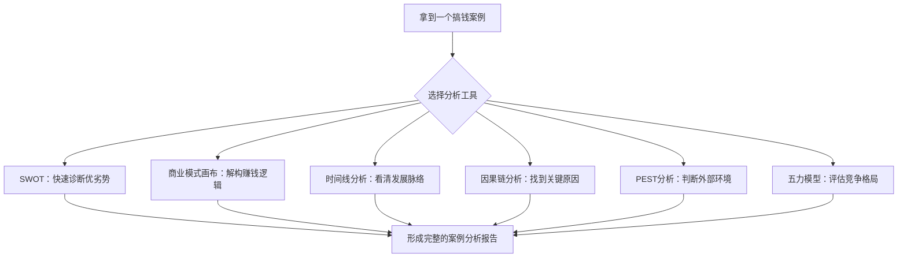
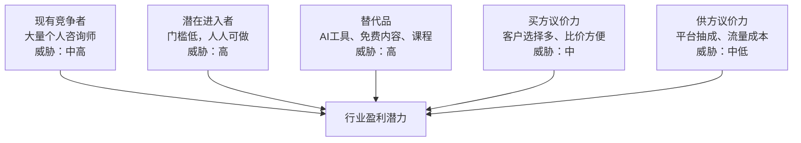

## 三、案例分析的理论工具

分析搞钱案例不能靠直觉和感觉，需要借助成熟的理论工具。就像医生诊断疾病需要听诊器、血压计、CT扫描一样，案例分析也需要一套系统化的"诊断工具"。本节介绍六种核心理论工具，从不同维度解剖搞钱案例，帮助你从"看热闹"升级为"看门道"。

### 为什么需要理论工具

很多案例初学者的问题在于：读完一个案例，觉得"这个人好厉害"或者"这个方法不错"，但说不出厉害在哪里、不错在何处。更无法判断这个经验能否迁移到自己的场景中。

理论工具解决的核心问题是**结构化思考**：

- **避免遗漏**：没有框架的分析容易只看到自己想看的，忽略关键因素
- **便于比较**：统一的分析维度让不同案例之间可以横向对比
- **可复制性**：结构化的分析方法可以反复使用，不依赖灵感
- **深度挖掘**：框架迫使你追问那些容易被忽略的深层问题



---

### 3.1 SWOT分析法：快速诊断全貌

SWOT是最经典的战略分析工具，由Albert Humphrey在1960年代于斯坦福研究院提出。它从四个维度对案例主角（个人或企业）进行快速诊断。

#### 四个维度详解

| 维度 | 英文 | 含义 | 搞钱场景中的典型问题 |
|------|------|------|----------------------|
| 优势 | Strengths | 内部的积极因素 | 案例主角有什么别人没有的技能、资源、人脉？ |
| 劣势 | Weaknesses | 内部的消极因素 | 存在哪些明显的短板？资金不足？经验欠缺？ |
| 机会 | Opportunities | 外部的积极因素 | 抓住了什么时代红利、市场空白、政策利好？ |
| 威胁 | Threats | 外部的消极因素 | 面临什么竞争压力、政策风险、市场变化？ |

#### SWOT的进阶用法：交叉矩阵

单纯的四个象限列出优劣势还不够，真正的分析价值在于**交叉配对**：

| 交叉策略 | 组合 | 策略方向 | 示例 |
|----------|------|----------|------|
| SO策略 | 优势×机会 | 用优势抓住机会 | 有编程技能（S）+ AI市场爆发（O）→ 开发AI工具 |
| WO策略 | 劣势×机会 | 克服劣势以利用机会 | 没有粉丝（W）+ 短视频红利（O）→ 矩阵号快速起量 |
| ST策略 | 优势×威胁 | 用优势化解威胁 | 技术壁垒高（S）+ 竞争加剧（T）→ 深耕垂直领域 |
| WT策略 | 劣势×威胁 | 防守策略，减少损失 | 资金少（W）+ 政策收紧（T）→ 轻资产模式降低风险 |

#### 实操模板：SWOT分析表

对任何一个搞钱案例，按以下模板填写：

```markdown
## 【案例名称】SWOT分析

### 优势 (S)
- S1: [核心技能/资源]
- S2: [独特经验/人脉]
- S3: [品牌/口碑积累]

### 劣势 (W)
- W1: [资金/资源短板]
- W2: [经验/认知不足]
- W3: [团队/能力缺陷]

### 机会 (O)
- O1: [市场趋势/红利]
- O2: [技术变革带来的机会]
- O3: [政策/环境利好]

### 威胁 (T)
- T1: [竞争者进入]
- T2: [政策/法规风险]
- T3: [市场变化/需求萎缩]

### 关键结论
- 最大优势 + 最大机会 = 主攻方向
- 最大劣势 + 最大威胁 = 核心风险
- 转化策略: [具体行动建议]
```

#### SWOT分析的常见陷阱

| 陷阱 | 表现 | 纠正方法 |
|------|------|----------|
| 罗列不分析 | 列出一堆优劣势就完事 | 必须做交叉配对，得出策略方向 |
| 内外混淆 | 把外部机会当成自身优势 | 问自己：如果环境变了，这个还在吗？ |
| 过于乐观 | 只看到优势和机会 | 刻意寻找威胁和劣势，找"唱反调"的人审核 |
| 静态思维 | 分析一次就完事 | 每3-6个月重新评估，环境在变 |
| 照搬模板 | 用通用词汇填空 | 必须结合具体案例，写出个性化内容 |

---

### 3.2 商业模式画布：解构赚钱逻辑

商业模式画布（Business Model Canvas）由Alexander Osterwalder在2010年提出，是分析任何赚钱模式最强大的工具之一。它将一个商业模式拆解为9个核心要素，让你一眼看清"这个钱是怎么赚的"。

#### 九大要素详解

```mermaid
block-beta
    columns 5
    block:kp:1["重要合作 KP"]
    end
    block:ka:1["关键活动 KA"] block:vp:1["价值主张 VP"] block:cr:1["客户关系 CR"] block:cs:1["客户细分 CS"]
    block:kr:1["核心资源 KR"] block:ch:1["渠道通路 CH"]
    block:cost:2["成本结构 C$"] block:rev:2["收入来源 R$"]
```

| 要素 | 核心问题 | 搞钱案例分析要点 |
|------|----------|------------------|
| 价值主张（VP） | 你为客户解决什么问题？ | 这个搞钱项目到底提供了什么独特价值？是省钱、省时间、还是提供情绪价值？ |
| 客户细分（CS） | 你的客户是谁？ | 目标客户画像是什么？他们在哪里？付费意愿如何？ |
| 渠道通路（CH） | 如何触达客户？ | 通过什么方式让客户知道你？获客成本是多少？ |
| 客户关系（CR） | 如何维护关系？ | 是一次性买卖还是长期关系？复购率如何？ |
| 收入来源（R$） | 靠什么赚钱？ | 收费模式是什么？单价、频次、毛利分别是多少？ |
| 核心资源（KR） | 需要什么关键资源？ | 技术、资金、人才、品牌中哪些是不可或缺的？ |
| 关键活动（KA） | 核心业务是什么？ | 最花时间精力的事情是什么？这些活动创造价值了吗？ |
| 重要合作（KP） | 需要哪些合作伙伴？ | 供应链、分销渠道、技术合作中谁是关键伙伴？ |
| 成本结构（C$） | 主要成本是什么？ | 固定成本和可变成本各占多少？盈亏平衡点在哪里？ |

#### 案例应用示例：自媒体知识付费

以一个通过自媒体做知识付费实现月入3万的案例为例：

| 要素 | 具体内容 |
|------|----------|
| 价值主张 | 帮助职场新人快速掌握Excel数据分析，节省自学时间 |
| 客户细分 | 25-35岁职场新人，有学习意愿但时间有限，月收入8K-20K |
| 渠道通路 | 抖音短视频引流 → 微信私域 → 课程转化（获客成本约15元/人） |
| 客户关系 | 社群运营 + 1对1答疑 + 定期直播，提高粘性和复购 |
| 收入来源 | 录播课299元（月销60份）+ 训练营1999元（月开1期20人）+ 1对1咨询500元/次 |
| 核心资源 | 个人专业能力 + 已积累的学员口碑 + 课程体系 |
| 关键活动 | 内容创作（40%）、社群运营（30%）、课程迭代（20%）、客服（10%） |
| 重要合作 | 平台（抖音/小红书）、支付工具、课程托管平台 |
| 成本结构 | 平台抽成15% + 工具费用500元/月 + 内容制作成本1000元/月 + 个人时间成本 |

**关键发现**：通过画布可以清晰看到，这个模式的核心壁垒在于**个人专业能力**和**学员口碑**，而主要风险在于**过度依赖个人IP**和**平台流量变化**。

#### 画布分析的检查清单

完成画布填写后，用以下问题检验分析质量：

1. **价值主张是否清晰？** 能用一句话说清楚"我帮你解决什么问题"吗？
2. **客户是否精准？** "所有人"不是客户细分，越具体越好
3. **收入能否覆盖成本？** 算清楚单位经济模型（Unit Economics）
4. **关键资源是否可控？** 核心资源掌握在自己手里还是依赖他人？
5. **模式是否可扩展？** 收入增长是否需要等比例增加成本？

---

### 3.3 时间线分析法：看清发展脉络

搞钱是一个动态过程，静态的快照无法反映全貌。时间线分析法通过梳理关键时间节点，帮助你看清一个搞钱故事的来龙去脉。

#### 时间线的四个关键阶段

| 阶段 | 时间跨度 | 分析要点 | 关键问题 |
|------|----------|----------|----------|
| 起步期 | 0-6个月 | 初始资源、切入点、第一桶金 | 用什么资源开始的？第一个客户/收入怎么来的？ |
| 探索期 | 6-18个月 | 试错过程、方向调整、模式验证 | 经历了哪些失败尝试？什么时候找到正确方向？ |
| 增长期 | 18-36个月 | 快速增长、资源积累、能力提升 | 增长的驱动力是什么？遇到什么瓶颈？如何突破？ |
| 成熟期 | 36个月+ | 稳定盈利、模式优化、生态扩展 | 如何保持竞争力？下一步怎么走？ |

#### 时间线分析模板

```markdown
## 【案例名称】时间线分析

### 起步期（YYYY.MM - YYYY.MM）
- **起点状态**：初始资金___元，核心技能___，人脉资源___
- **关键决策**：选择了___方向，原因是___
- **第一桶金**：通过___方式获得第一笔收入___元
- **踩过的坑**：___

### 探索期（YYYY.MM - YYYY.MM）
- **试错经历**：尝试了___，失败原因是___
- **转折点**：___事件/发现导致了方向调整
- **模式验证**：___指标达到___，证明模式可行
- **核心教训**：___

### 增长期（YYYY.MM - YYYY.MM）
- **增长引擎**：主要靠___驱动增长
- **关键里程碑**：月收入突破___元（YYYY.MM）
- **资源积累**：积累了___
- **遇到的瓶颈**：___，解决方案是___

### 成熟期（YYYY.MM - 至今）
- **当前状态**：月收入___元，团队___人，客户___个
- **竞争壁垒**：___
- **未来规划**：___
```

#### 时间线分析的核心价值

时间线分析最大的价值在于识别**关键转折点**——那些"如果当时做了不同选择，结果会完全不同"的时刻。例如：

- 某自媒体博主在粉丝1万时选择深耕垂直领域（而非继续泛内容），这是增长的转折点
- 某电商卖家在月销10万时投入自建供应链（而非继续代发），这是利润的转折点
- 某自由职业者在客户满负荷时选择涨价+筛选客户（而非继续接单），这是收入质量的转折点

找到这些转折点，分析当时的决策逻辑和外部环境，比笼统地总结"坚持就是胜利"有价值得多。

---

### 3.4 因果链分析法：找到关键原因

因果链分析是案例分析中最核心的工具。它的目标是回答一个根本问题：**这个搞钱案例成功（或失败）的真正原因是什么？**

#### 因果链的基本结构

```text
根本原因 → 中间因素1 → 中间因素2 → ... → 最终结果
```

区分三类原因至关重要：

| 原因类型 | 定义 | 示例 |
|----------|------|------|
| **根本原因** | 去掉它，结果就不会发生 | 选择了高增长赛道 |
| **辅助原因** | 有帮助但不是决定性的 | 执行力强、团队给力 |
| **运气成分** | 不可控的偶然因素 | 赶上政策利好、被大V转发 |

#### 5-Why分析法

丰田生产方式中经典的"5个为什么"方法，非常适合追溯搞钱案例的根本原因：

**案例：某知识付费博主月入10万**

| 层级 | 问题 | 回答 |
|------|------|------|
| Why 1 | 为什么月入10万？ | 因为课程卖得好，每月卖出300+份 |
| Why 2 | 为什么课程卖得好？ | 因为精准定位了"程序员转管理"这个细分需求 |
| Why 3 | 为什么能精准定位？ | 因为自己经历过这个转型，深挖了目标人群的痛点 |
| Why 4 | 为什么能把痛点变成课程？ | 因为先做了大量免费内容验证需求，再系统化成课程 |
| Why 5 | 为什么先验证再开发？ | 因为之前失败过一次（盲目开发课程卖不动），学到了教训 |

**根本原因浮现**：不是"运气好"或"内容好"，而是**从失败中学习并建立了"先验证再投入"的做事方法论**。

#### 鱼骨图（石川图）

当结果由多个因素共同作用时，用鱼骨图进行全面归因：

```mermaid
graph LR
    subgraph 鱼骨图：搞钱案例成败归因
    A[人员因素] --> R[最终结果]
    B[方法因素] --> R
    C[资源因素] --> R
    D[环境因素] --> R
    E[时机因素] --> R
    F[运气因素] --> R
    end
```

每个大类下面继续细分：

- **人员因素**：个人能力、性格特质、学习能力、抗压能力、人脉质量
- **方法因素**：商业模式、获客方式、定价策略、产品设计、运营流程
- **资源因素**：启动资金、技术积累、品牌影响力、供应链、团队
- **环境因素**：市场竞争、政策法规、经济周期、技术趋势、文化观念
- **时机因素**：进入时机、退出时机、扩张时机、融资时机
- **运气因素**：偶然事件、贵人相助、意外曝光

#### 因果链分析的常见误区

**误区一：幸存者偏差**

只分析成功案例，忽略大量用同样方法但失败的人。某人通过短视频卖货月入百万，但同期用同样方法亏本的人可能有1000个。

**纠正方法**：始终问"用同样方法失败的人有多少？失败的原因是什么？"

**误区二：后此谬误（Post Hoc Fallacy）**

"他做了A，然后成功了，所以A导致了成功"——这是典型的逻辑错误。

**纠正方法**：区分"相关"和"因果"，问"如果没做A，是否也可能成功？"

**误区三：单一归因**

把成功归结为一个简单原因（"他就是执行力强"），忽略了系统性的多因素作用。

**纠正方法**：用鱼骨图做全面归因，给每个因素打权重分。

---

### 3.5 PEST分析法：判断外部环境

PEST分析从宏观环境角度评估搞钱案例的外部条件，帮助判断"这个成功有多少归功于个人能力，多少归功于时代红利"。

#### 四个维度

| 维度 | 英文 | 分析内容 | 搞钱场景关注点 |
|------|------|----------|----------------|
| 政策 | Political | 政府政策、法规、税收 | 行业是否受政策鼓励？有无合规风险？税收优惠？ |
| 经济 | Economic | 经济周期、利率、消费力 | 目标客户的消费力如何？经济下行对业务影响？ |
| 社会 | Social | 人口结构、文化趋势、消费习惯 | 社会观念是否支持？目标人群规模在增长还是萎缩？ |
| 技术 | Technological | 技术发展、创新、数字化 | 有无新技术可以利用？技术变化会颠覆这个模式吗？ |

#### PEST分析示例：2024年跨境电商搞钱案例

| 维度 | 有利因素 | 不利因素 |
|------|----------|----------|
| 政策 | RCEP降低关税、跨境电商综试区扩大 | 部分国家收紧小额免税政策 |
| 经济 | 人民币汇率有利出口、海外通胀推高需求 | 全球经济放缓、消费降级趋势 |
| 社会 | 海外消费者习惯线上购物、中国供应链口碑提升 | "去中国化"情绪、对品质要求提高 |
| 技术 | AI工具降低运营门槛、物流追踪技术成熟 | 平台算法变化、广告成本上升 |

**结论**：这个案例的成功，政策红利和技术红利贡献了约40%，个人运营能力贡献了约60%。如果去掉政策红利，模式依然可行但利润率会下降。

#### PEST分析的使用时机

- **评估案例可复制性**：如果成功主要靠时代红利，换个人可能做不到
- **判断入场时机**：当前PEST环境是否仍然有利
- **风险预警**：哪些外部因素变化可能颠覆这个模式

---

### 3.6 波特五力模型：评估竞争格局

迈克尔·波特（Michael Porter）的五力模型帮助你评估一个搞钱领域的竞争激烈程度和盈利潜力。

#### 五力详解

| 力量 | 含义 | 搞钱场景分析要点 | 高威胁的信号 |
|------|------|------------------|--------------|
| 现有竞争者 | 同行之间的竞争 | 这个赛道已经有多少人在做？差异化程度如何？ | 价格战频繁、获客成本持续上升 |
| 潜在进入者 | 新玩家进入的容易度 | 别人模仿你的模式有多容易？ | 低门槛、无技术壁垒、模式容易复制 |
| 替代品威胁 | 其他方式满足同样需求 | 客户是否可以用其他方式解决同样问题？ | 免费替代品出现、技术路线变化 |
| 买方议价力 | 客户压价的能力 | 客户是否有大量选择？转换成本低吗？ | 客户集中度高、信息透明、转换成本低 |
| 供方议价力 | 供应商/资源方的控制力 | 核心资源是否被少数人控制？ | 供应商集中、资源稀缺、依赖单一渠道 |

#### 五力分析示例：个人咨询服务



**分析结论**：个人咨询服务的五力总体偏高威胁，意味着竞争激烈、利润空间有限。破局方向是**建立差异化壁垒**（独特方法论、强个人品牌、高转换成本的会员体系）。

#### 五力分析的行动指南

完成五力分析后，针对每种力量制定策略：

| 力量 | 高威胁时的应对策略 |
|------|-------------------|
| 现有竞争者激烈 | 差异化定位、深耕细分市场、建立品牌壁垒 |
| 潜在进入者容易 | 构建护城河（专利、品牌、网络效应、规模经济） |
| 替代品威胁大 | 持续创新、提高客户转换成本、绑定生态 |
| 买方议价力强 | 增加产品独特性、分散客户集中度、提升服务质量 |
| 供方议价力强 | 多元化供应来源、垂直整合、建立长期合作关系 |

---

### 工具组合使用：案例分析完整流程

单独使用某一个工具只能看到案例的一个侧面，真正有价值的分析需要**组合使用**。以下是推荐的完整分析流程：

#### 六步分析法

| 步骤 | 工具 | 目标 | 输出物 |
|------|------|------|--------|
| 第1步 | 时间线分析 | 搞清楚"发生了什么" | 关键事件时间轴 |
| 第2步 | SWOT分析 | 快速诊断优劣势和环境 | SWOT矩阵 + 策略方向 |
| 第3步 | 商业模式画布 | 解构赚钱逻辑 | 九大要素填写完成 |
| 第4步 | 因果链分析 | 找到根本原因 | 因果链图 + 根本原因 |
| 第5步 | PEST分析 | 评估外部环境贡献 | 环境因素评估表 |
| 第6步 | 五力模型 | 评估竞争格局 | 五力评估 + 竞争策略 |

#### 分析报告模板

```markdown
# 【案例名称】深度分析报告

## 一、案例概述
- 主角背景：
- 搞钱方式：
- 核心成果：
- 时间跨度：

## 二、时间线梳理
[按时间线模板填写]

## 三、SWOT诊断
[按SWOT模板填写]

## 四、商业模式解构
[按画布模板填写]

## 五、因果链分析
- 根本原因：
- 辅助因素：
- 运气成分：
- 权重分配：根本原因___% + 辅助因素___% + 运气___%

## 六、环境评估
- PEST环境贡献度：___%
- 个人能力贡献度：___%

## 七、竞争格局
- 五力评估总结：
- 护城河强度：强/中/弱

## 八、核心结论
1. 最值得借鉴的3个经验：
2. 最需要警惕的3个风险：
3. 可复制性评估：高/中/低，原因：

## 九、个人启示
- 结合自身情况，哪些可以借鉴？
- 哪些条件不具备，需要如何弥补？
- 行动计划：
```

---

### 常见误区与纠正

#### 误区一：工具崇拜

有些人学了分析工具后，每次分析都要把所有工具用一遍，结果花了大量时间做表格，却没有得出有价值的结论。

**纠正**：工具是手段不是目的。对于简单案例，一个SWOT就够了；对于复杂案例才需要组合使用。先有洞察，再用工具组织和验证。

#### 误区二：分析瘫痪

过度分析导致迟迟不行动。分析了10个案例，做了50页报告，但自己一个项目都没开始。

**纠正**：设定分析时间上限。每个案例的深度分析不超过2小时，分析的最终目的是指导行动，不是写论文。

#### 误区三：忽略量化

只做定性分析（"他很努力"、"市场很好"），缺乏量化支撑。

**纠正**：每个判断都要问"数据是什么？"。"市场很大"要变成"市场规模XX亿，年增长率XX%"；"他很努力"要变成"每天工作12小时，坚持了18个月"。

#### 误区四：照搬结论

看到别人用某个方法赚了钱，就直接照搬，不考虑自身条件和环境差异。

**纠正**：分析报告的最后一节"个人启示"是最重要的。任何经验都必须结合自身情况做适配，不存在"放之四海而皆准"的搞钱方法。

#### 误区五：忽视失败因素

只分析成功案例中的"做对了什么"，不分析"差点失败的原因"和"幸存者偏差"。

**纠正**：每个成功案例都要问三个问题：（1）同期用同样方法失败的人有多少？（2）这个案例差点失败的时刻是什么？（3）如果重来一次，成功的概率有多大？

---

### 进阶：构建个人分析能力

#### 初级阶段（分析1-10个案例）

- 目标：熟悉工具的使用方法
- 方法：选择一个工具（建议从SWOT开始），对每个案例都用同一个工具分析
- 产出：每个案例一页SWOT分析

#### 中级阶段（分析10-30个案例）

- 目标：能够灵活组合使用多个工具
- 方法：根据案例特点选择合适的工具组合，开始做案例间的横向对比
- 产出：完整的案例分析报告，包含2-3个工具的组合使用

#### 高级阶段（分析30+个案例）

- 目标：形成自己的分析框架
- 方法：在标准工具基础上，根据自己的经验添加自定义分析维度
- 产出：建立个人案例库，形成可复用的分析模板和检查清单

#### 持续精进的方法

1. **建立案例库**：用Notion或飞书多维表格建立案例数据库，字段包括行业、模式、时间线、关键指标、分析结论
2. **定期复盘**：每季度回顾自己的分析，看看之前的判断是否正确
3. **同行交流**：和搞钱伙伴互相分享案例分析，发现自己看不到的盲点
4. **跨领域迁移**：把A领域的成功经验用五力模型分析后，看看能否迁移到B领域
5. **反向验证**：对自己的搞钱项目也用这些工具分析，提前发现问题

---

### 本节核心要点

1. **理论工具是案例分析的基础**：没有框架的分析是感觉，有框架的分析是洞察
2. **六种工具各有侧重**：SWOT看全貌、画布看逻辑、时间线看脉络、因果链看本质、PEST看环境、五力看竞争
3. **工具要组合使用**：单一工具只能看到一个侧面，组合使用才能形成完整判断
4. **分析的目的是行动**：不要为了分析而分析，每个分析都要指向具体的行动建议
5. **警惕分析陷阱**：幸存者偏差、后此谬误、单一归因是最常见的三个错误
6. **能力需要刻意练习**：从单工具到多工具，从模仿模板到自建框架，循序渐进
