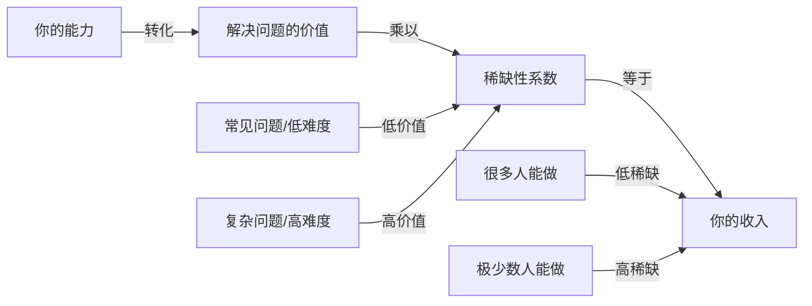
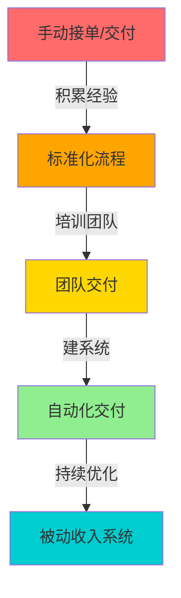
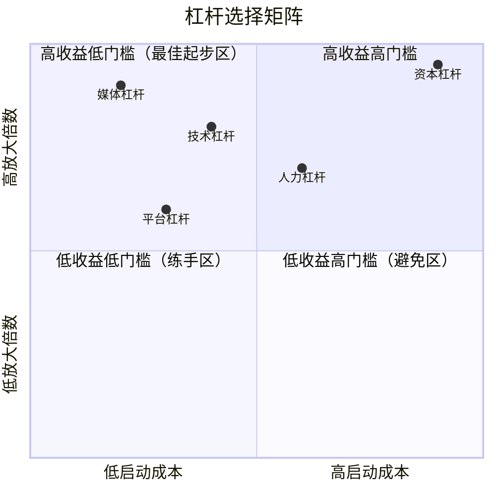
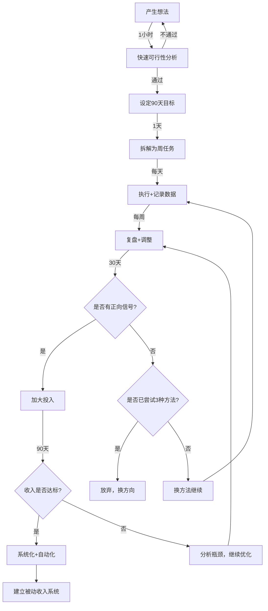
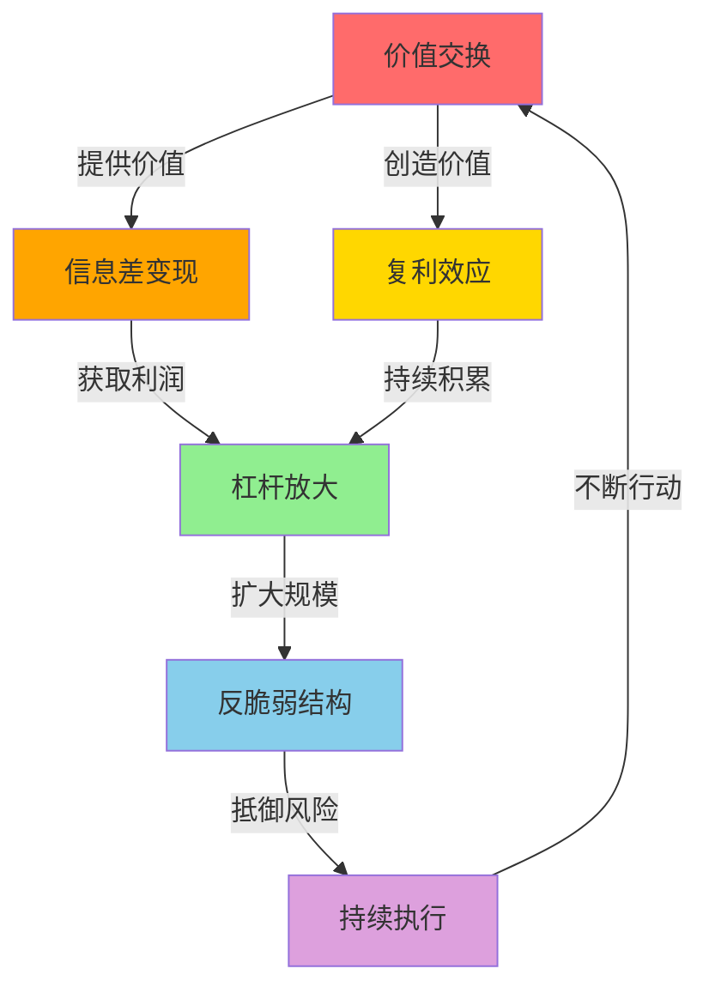

## 四、搞钱成功的底层规律

搞钱不是玄学，更不是运气。那些持续赚到钱的人，无论身处哪个行业、采用何种方式，都在遵循着同一套底层规律。这些规律不会因为时代变化而失效——它们是人类经济行为中最稳定的结构性特征。

本章将拆解搞钱成功的六大底层规律，从认知层面到执行层面逐一展开，帮助你建立一套可复制、可验证、可迭代的赚钱思维框架。

---

### 4.1 规律一：价值交换定律——所有收入都是价值的对价

#### 4.1.1 核心原理

经济学的基本公理：**收入 = 你创造的价值 × 价值的稀缺性系数**。

很多人搞不到钱，根本原因是他们提供的价值不够，或者提供的价值不稀缺。月薪3000和月薪30000的人，区别不在于谁更努力，而在于谁创造的单位价值更高、谁更难被替代。



#### 4.1.2 价值的四个层次

| 层次 | 描述 | 收入天花板 | 典型案例 |
|------|------|-----------|---------|
| 体力层 | 出卖时间和体力 | 低（月薪5K-8K） | 外卖骑手、搬运工 |
| 技能层 | 出卖专业技能 | 中（月薪8K-30K） | 程序员、设计师、会计 |
| 资源层 | 整合资源解决问题 | 高（年入50万-500万） | 猎头、供应链整合商 |
| 资本层 | 用资本撬动收益 | 极高（无上限） | 投资人、房东、品牌方 |

**关键认知**：从体力层到资本层，每一层的跃迁都需要不同的能力和资源积累。搞钱的第一步，是认清自己目前在哪一层，以及如何向上跃迁一层。

#### 4.1.3 如何提升自己的价值密度

**第一步：技能审计**

列出你目前掌握的所有技能，按照以下维度打分（1-10分）：

- **市场需要度**：有多少人/企业需要这个技能？
- **可替代性**：学会这个技能需要多长时间？门槛高不高？
- **变现效率**：这个技能能直接产生收入吗？
- **成长空间**：这个技能未来3-5年还有需求吗？

**第二步：找到高价值交叉点**

单一技能的价值有限，但技能组合可以创造稀缺性。例如：
- 会写代码的程序员 → 市场很多
- 会写代码 + 懂金融的程序员 → 量化交易岗位，稀缺度大增
- 会写代码 + 懂金融 + 有行业人脉的人 → 可以直接做金融科技创业

**第三步：持续输出价值证明**

价值不是你自认为有的，而是需要被市场验证的。具体做法：
- 写技术博客/行业分析，建立专业形象
- 做开源项目/免费分享，积累口碑
- 主动帮人解决问题，获取推荐和背书
- 记录并量化你的成果（帮公司省了多少钱、带来了多少客户）

---

### 4.2 规律二：复利效应定律——时间是最强的杠杆

#### 4.2.1 为什么复利是搞钱的终极武器

复利的本质是：**今天的成果成为明天的基础，每一轮增长都建立在上一轮的基础上**。

假设你每天进步1%：
- 1天后：1.01
- 30天后：1.01^30 = 1.35（增长35%）
- 365天后：1.01^365 = 37.78（增长37倍）

复利在搞钱领域的体现：

| 复利类型 | 机制 | 时间线 | 收益曲线 |
|---------|------|--------|---------|
| 技能复利 | 技能越练越纯熟，单位时间产出越来越高 | 6-12个月见效 | 前慢后快 |
| 人脉复利 | 认识的人越多，机会越多，介绍的机会也越多 | 1-2年见效 | 指数增长 |
| 内容复利 | 一篇文章/视频持续带来流量和客户 | 3-6个月见效 | 持续累积 |
| 资本复利 | 收益再投资，本金越来越大 | 3-5年见效 | 指数增长 |
| 信誉复利 | 口碑积累，获客成本趋近于零 | 2-3年见效 | 边际成本递减 |

#### 4.2.2 如何构建复利系统

**原则一：选择有累积效应的事情**

有些事情做完就归零（如打零工），有些事情做完会持续产生收益（如写一本电子书、建一个网站、积累一批忠实客户）。搞钱时优先选择后者。

判断标准：**这件事做完之后，是否会在未来持续为我创造价值？**

- ✅ 写一篇SEO优化的博客文章 → 持续带来搜索流量
- ✅ 建立一个自动化销售漏斗 → 持续转化客户
- ✅ 培养一个高技能团队 → 持续产出高质量交付
- ❌ 接一个一次性的外包项目 → 做完就没了
- ❌ 参加一个没有后续跟进的社交活动 → 关系不维护就断了

**原则二：把收益再投入**

很多人搞到一点钱就消费掉了，而不是再投入到能产生复利的地方。

具体策略：
- 副业收入的50%再投入到工具、学习、推广
- 建立"搞钱基金"，专门用于投资自己的赚钱能力
- 用钱买时间（外包低价值工作），把时间投入到高价值事情上

**原则三：建立自动化系统**

复利的最高境界是"睡后收入"——你睡觉的时候，系统还在为你赚钱。

自动化系统的常见形式：
- **内容系统**：博客/视频/播客持续吸引流量
- **产品系统**：数字产品（课程、模板、工具）一次制作多次销售
- **销售系统**：自动化邮件序列、着陆页、支付系统
- **团队系统**：培训好的团队能独立交付，你只负责接单和品控



---

### 4.3 规律三：信息差变现定律——知道别人不知道的，就是钱

#### 4.3.1 信息差的三种类型

| 类型 | 描述 | 时效性 | 变现难度 |
|------|------|--------|---------|
| 认知差 | 你懂别人不懂的原理/方法 | 长期有效 | 低（写教程/做咨询） |
| 时间差 | 你比别人早知道某条信息 | 中短期（几天到几个月） | 中（需要快速行动） |
| 渠道差 | 你能接触到别人接触不到的资源/人 | 持续有效 | 中高（需要关系维护） |

#### 4.3.2 如何构建信息差优势

**方法一：深耕垂直领域**

选择一个细分领域，花6-12个月成为这个领域的"知道分子"。

具体路径：
1. 选一个你感兴趣且有市场的细分领域
2. 每天花1小时阅读该领域的专业内容（论文、行业报告、专家博客）
3. 每周输出1篇该领域的深度分析
4. 加入该领域的核心社群，与从业者交流
5. 6个月后，你对这个领域的理解会超过90%的人

**方法二：跨领域信息桥接**

很多赚钱机会来自不同领域的交叉。例如：
- 懂AI + 懂教育 → AI教育工具开发
- 懂跨境电商 + 懂直播 → 海外直播带货
- 懂心理学 + 懂营销 → 高转化率文案撰写

**方法三：建立信息网络**

信息差的本质是关系网络。你需要：
- 加入行业核心社群（付费社群通常质量更高）
- 与行业KOL建立联系（先提供价值，再索取信息）
- 定期与不同领域的朋友交流（每月至少1次深度交流）
- 关注行业动态（设置关键词提醒、订阅专业newsletter）

#### 4.3.3 信息差变现的实操路径

```text
信息差变现路径：

1. 发现信息差
   ├── 关注行业报告和政策变化
   ├── 参加行业展会和会议
   ├── 与从业者深度交流
   └── 监控竞品和新兴玩家

2. 验证信息差价值
   ├── 这个信息能帮谁解决什么问题？
   ├── 有多少人需要这个信息？
   ├── 他们愿意为这个信息付多少钱？
   └── 信息差的窗口期有多长？

3. 选择变现方式
   ├── 咨询/培训（直接卖信息）
   ├── 内容创作（用信息吸引流量）
   ├── 中介/撮合（利用信息差促成交易）
   └── 自己做（利用信息差直接获利）

4. 快速执行
   ├── 信息差有保质期，过期就贬值
   ├── 先做最小可行产品（MVP）
   ├── 根据市场反馈快速迭代
   └── 建立壁垒防止信息差被抹平
```

---

### 4.4 规律四：杠杆放大定律——用小力撬动大结果

#### 4.4.1 五种搞钱杠杆

| 杠杆类型 | 描述 | 启动难度 | 放大倍数 | 典型案例 |
|---------|------|---------|---------|---------|
| 人力杠杆 | 雇人帮你干活 | 中 | 10-100倍 | 开工作室、建团队 |
| 资本杠杆 | 用钱生钱 | 高 | 10-1000倍 | 投资、开店、囤货 |
| 技术杠杆 | 用技术自动化重复工作 | 中低 | 100-10000倍 | 写脚本、建SaaS |
| 媒体杠杆 | 内容一次创作，无限传播 | 低 | 1000-100000倍 | 自媒体、课程 |
| 平台杠杆 | 借助已有平台的流量和信任 | 低 | 10-1000倍 | 电商开店、知识付费 |

#### 4.4.2 杠杆选择矩阵



#### 4.4.3 从零开始的杠杆升级路径

**阶段一：用媒体杠杆起步（0-6个月）**

适合：资金少、时间多的人

具体操作：
- 选择一个内容平台（公众号、B站、小红书、抖音）
- 每天输出1条高质量内容
- 3个月建立初步粉丝基础
- 6个月开始接广告/带货/引流到私域

成本：几乎为零（只需要时间和手机/电脑）
预期收益：0-5000元/月

**阶段二：叠加技术杠杆（6-12个月）**

适合：有一定技术基础或愿意学习的人

具体操作：
- 把重复性工作自动化（自动回复、自动发布、数据采集）
- 建立自己的工具集（提高效率10倍以上）
- 开发简单的产品/模板/工具并销售

成本：学习时间 + 少量工具费用
预期收益：5000-20000元/月

**阶段三：引入人力杠杆（12-24个月）**

适合：业务量增长，一个人忙不过来的人

具体操作：
- 把标准化的工作外包（找兼职/实习生）
- 建立SOP（标准操作流程），降低对个人的依赖
- 自己只做高价值工作（决策、谈客户、定战略）

成本：人员工资
预期收益：20000-100000元/月

**阶段四：使用资本杠杆（24个月以后）**

适合：有了一定资本积累的人

具体操作：
- 用利润再投资（扩大规模、开新品类、建新渠道）
- 投资其他人的项目（用钱+经验入股）
- 建立品牌资产（品牌溢价是最强的资本杠杆）

成本：前期利润
预期收益：10万+/月，上不封顶

---

### 4.5 规律五：反脆弱定律——在不确定性中获益

#### 4.5.1 什么是反脆弱

塔勒布在《反脆弱》中提出：有些事物不仅能承受冲击，还能从冲击中获益。

在搞钱领域：
- **脆弱型收入**：单一客户、单一平台、单一技能——任何一个出问题，收入归零
- **坚韧型收入**：能承受一定冲击，但不会从中获益
- **反脆弱型收入**：每次冲击都让你变得更强——客户流失了，你发现了新需求；平台规则变了，你发现了新机会

#### 4.5.2 构建反脆弱收入结构

**原则一：收入来源多元化**

理想的收入结构：

| 收入类型 | 占比 | 特点 | 示例 |
|---------|------|------|------|
| 主动收入（主业） | 40% | 稳定但有上限 | 工资、咨询费 |
| 半被动收入（副业） | 30% | 需要一定维护 | 课程、社群、代运营 |
| 被动收入（资产） | 20% | 几乎不需要维护 | 投资收益、版税、广告 |
| 机会收入（探索） | 10% | 高风险高回报 | 新项目、新平台、新领域 |

**原则二：保持冗余**

- 现金储备：至少6个月的生活费
- 技能储备：至少掌握2-3个可变现的技能
- 人脉储备：至少在2-3个不同领域有可靠的人脉
- 渠道储备：至少在2-3个平台有运营能力

**原则三：拥抱小失败**

反脆弱的核心是：**用小的、可控的失败来换取大的、不可预测的成功**。

具体做法：
- 每月投入收入的5-10%做新尝试
- 设定止损线（亏损超过X元就放弃）
- 快速试错、快速迭代
- 把失败当作信息收集，而不是挫折

#### 4.5.3 反脆弱搞钱的实操框架

```text
反脆弱搞钱实操框架：

Step 1: 盘点当前收入结构
   ├── 列出所有收入来源
   ├── 计算每个来源的占比
   ├── 评估每个来源的脆弱性（单一依赖度）
   └── 标记哪些收入来源可能在6个月内消失

Step 2: 设计多元化收入结构
   ├── 保留主业收入（稳定基础）
   ├── 发展1-2个副业（增长引擎）
   ├── 建立1个被动收入来源（安全网）
   ├── 预留10%预算用于探索新机会
   └── 确保任何单一来源占比不超过50%

Step 3: 建立应急机制
   ├── 现金储备 ≥ 6个月生活费
   ├── 关键技能备份（主业技能+副业技能）
   ├── 关键人脉维护（至少每月联系一次）
   └── 定期复盘收入结构（每季度一次）

Step 4: 持续优化
   ├── 追踪每个收入来源的增长趋势
   ├── 淘汰萎缩的收入来源
   ├── 加大投入增长的收入来源
   ├── 不断探索新的收入可能性
   └── 每年至少开辟一个新的收入来源
```

---

### 4.6 规律六：执行碾压定律——想法不值钱，执行才值钱

#### 4.6.1 为什么90%的人搞不到钱

不是因为他们没有好想法，而是因为他们不执行，或者执行不到位。

| 阶段 | 行为 | 占比 | 结果 |
|------|------|------|------|
| 想法阶段 | 想了很多，从不开始 | 60% | 零收入 |
| 起步阶段 | 开始了，但很快放弃 | 20% | 零星收入 |
| 坚持阶段 | 坚持了，但方法不对 | 10% | 小收入 |
| 执行阶段 | 坚持了，方法也对 | 8% | 可观收入 |
| 优化阶段 | 持续优化，建立系统 | 2% | 财务自由 |

#### 4.6.2 执行力的四个维度

**维度一：启动速度**

从想法到行动的时间越短越好。

常见拖延原因和对策：

| 拖延原因 | 本质 | 对策 |
|---------|------|------|
| "我还没准备好" | 完美主义 | 用MVP思维，先做60分的版本 |
| "我不知道从哪开始" | 缺乏拆解 | 把大目标拆成今天就能做的小任务 |
| "我怕失败" | 风险恐惧 | 设定止损线，失败了也不过如此 |
| "我没时间" | 优先级问题 | 每天早起1小时，专门搞钱 |

**维度二：执行密度**

同样做一件事，密度不同结果天差地别。

举例：做自媒体
- 低密度：每周发1篇，3个月后30篇，涨粉500
- 中密度：每天发1篇，3个月后90篇，涨粉3000
- 高密度：每天发3篇（图文+视频+互动），3个月后270条内容，涨粉10000+

**维度三：迭代速度**

不是一次做对，而是快速试错、快速调整。

迭代循环：
1. 做一个最小可行版本（1-3天）
2. 投放到市场测试（1-7天）
3. 收集反馈数据（1-3天）
4. 分析问题并调整（1天）
5. 回到第1步

一个完整的迭代周期控制在1-2周内，一年可以做26-52次迭代。

**维度四：抗干扰能力**

搞钱路上最大的敌人不是竞争对手，而是你自己的分心。

常见的干扰源：
- 新项目诱惑（总觉得别的项目更好）
- 负面反馈（有人说你不行，你就动摇了）
- 短期看不到结果（做了2周没效果就想放弃）
- 生活琐事（家务、社交、娱乐挤占搞钱时间）

应对策略：
- 设定90天专注期，只做一件事
- 关闭不必要的通知和社交
- 找一个搞钱搭子互相监督
- 每周复盘进度，用数据说话而不是感觉

#### 4.6.3 从想法到收入的完整执行路径



---

### 4.7 六大规律的综合运用

#### 4.7.1 规律之间的关系

六大规律不是孤立的，而是相互支撑的系统：



#### 4.7.2 一个完整的搞钱案例

下面用一个真实案例，展示六大规律如何综合运用：

**案例：小李从月薪8K到年入100万的副业之路**

**背景**：小李是一名前端程序员，月薪8K，工作3年，技术中等。

**第一阶段：找到价值点（第1-3个月）**

- 运用"价值交换定律"：分析自己的技能组合——前端开发 + 懂设计 + 英语能读文档
- 发现信息差：很多中小企业需要小程序/H5页面，但请不起专业团队
- 确定方向：面向中小企业提供"设计+开发"一站式H5/小程序服务

**第二阶段：建立复利系统（第3-6个月）**

- 运用"复利效应定律"：
  - 把每个项目做成案例，发布到社交媒体
  - 建立一套标准化的项目流程模板
  - 积累了一套可复用的组件库
- 结果：6个月后，80%的新客户来自老客户推荐和社交媒体

**第三阶段：用杠杆放大（第6-12个月）**

- 运用"杠杆放大定律"：
  - 媒体杠杆：在B站/小红书分享前端教程，吸引精准客户
  - 技术杠杆：用AI工具+组件库提高开发效率3倍
  - 人力杠杆：外包设计工作给兼职设计师，自己专注核心开发和客户沟通
- 结果：月收入从5000涨到30000

**第四阶段：构建反脆弱结构（第12-18个月）**

- 运用"反脆弱定律"：
  - 开发了3套小程序模板在模板市场销售（被动收入）
  - 录制了前端实战课程在知识付费平台销售（被动收入）
  - 主动收入 + 被动收入各占50%
- 结果：即使一个月不接新项目，被动收入也能覆盖生活成本

**第五阶段：持续执行+优化（第18-24个月）**

- 运用"执行碾压定律"：
  - 每周复盘数据，优化获客渠道
  - 每月迭代一次产品和服务
  - 建立了完整的SOP文档
- 结果：年收入突破100万

**收入结构变化表**：

| 阶段 | 时间 | 主动收入 | 被动收入 | 月总收入 |
|------|------|---------|---------|---------|
| 起步期 | 第1-3月 | 2000元 | 0元 | 2000元 |
| 增长期 | 第3-6月 | 8000元 | 0元 | 8000元 |
| 杠杆期 | 第6-12月 | 20000元 | 5000元 | 25000元 |
| 反脆弱期 | 第12-18月 | 30000元 | 25000元 | 55000元 |
| 系统期 | 第18-24月 | 40000元 | 40000元 | 80000元 |

---

### 4.8 常见误区与纠正

#### 误区一：只学不做

**表现**：看了100本搞钱的书，听了50个搞钱的播客，但从不行动。

**纠正**：学一个方法，立刻去试。哪怕只做一个小实验，也比看10本书有用。

**执行原则**：学习和行动的时间比不超过 3:7。也就是说，如果你有10小时搞钱，最多花3小时学习，至少7小时行动。

#### 误区二：追求完美再开始

**表现**：总觉得自己的产品/服务/内容还不够好，一直准备，从不发布。

**纠正**：市场是最好的老师。一个60分的产品投放市场后，根据反馈迭代到80分，比你闭门造车做出一个自认为100分的产品要好得多。

**执行原则**：如果一件事你能在48小时内做完，现在就开始。

#### 误区三：只看收入不看利润

**表现**：月入10万很兴奋，但扣除成本后只剩1万。

**纠正**：搞钱的目的是增加可支配收入，而不是增加营业额。

**计算公式**：
```text
实际收益 = 总收入 - 直接成本 - 时间成本 - 机会成本

其中：
- 直接成本：工具费、外包费、平台费、推广费
- 时间成本：你花的时间 × 你的时薪
- 机会成本：做这件事而放弃的其他机会的收益
```

#### 误区四：单打独斗

**表现**：什么都自己干，不愿意合作，不愿意付费请人帮忙。

**纠正**：一个人的时间和精力是有限的。搞到一定程度，必须学会借力。

**判断标准**：如果你做某件事的时薪低于100元/小时，就应该考虑外包，把时间省出来做时薪更高的事情。

#### 误区五：忽视税务和法律

**表现**：收入增加后不报税，合同不签就开干，知识产权不保护。

**纠正**：搞钱的底线是合法合规。被罚款、被起诉、被追税的成本远高于提前做好合规的成本。

**必须做的事**：
- 了解你所在行业的基本法规
- 收入达到一定金额后及时注册公司/个体户
- 与客户签正式合同（哪怕是电子合同）
- 了解个人所得税/增值税的基本规则
- 保护自己的知识产权（商标、版权、专利）

#### 误区六：短期思维

**表现**：做了1个月没效果就放弃，频繁换方向。

**纠正**：90%的搞钱项目需要3-6个月才能看到明显效果。前3个月是投入期，3-6个月是验证期，6个月以后才是收获期。

**心理建设**：
- 设定90天的最低承诺期
- 用数据而不是感觉来判断方向是否正确
- 记录每天的进展，哪怕很小
- 找到一个同行者，互相鼓励

---

### 4.9 底层规律的自检清单

每次开始一个新的搞钱项目时，用这个清单自检：

```text
□ 价值交换：我提供的价值是什么？稀缺吗？
□ 复利效应：这件事做完后会持续产生收益吗？
□ 信息差：我有什么别人不知道的信息/技能/资源？
□ 杠杆放大：我可以用什么杠杆放大结果？
□ 反脆弱：如果最大的客户/平台/渠道出问题，我怎么办？
□ 执行计划：我有具体的执行步骤和时间表吗？
□ 止损线：我愿意投入多少？什么情况下放弃？
□ 里程碑：30天/60天/90天的目标分别是什么？
```

如果以上8个问题你都能清晰回答，说明你想清楚了，可以开始行动了。

如果回答不上来，不要急着开始，先把每个问题想清楚。想清楚不是要你想完美，而是要你想清楚最小可行的答案。

---

### 4.10 本章小结

搞钱成功的六大底层规律：

1. **价值交换定律**：所有收入都是价值的对价，提升价值密度是搞钱的根本
2. **复利效应定律**：选择有累积效应的事情，让时间成为你的盟友
3. **信息差变现定律**：认知差、时间差、渠道差都是钱
4. **杠杆放大定律**：媒体、技术、人力、资本、平台是五种放大器
5. **反脆弱定律**：在不确定性中获益，而不是被不确定性摧毁
6. **执行碾压定律**：想法不值钱，快速执行+持续迭代才值钱

记住：这六大规律不是理论，而是经过无数人验证的实战法则。关键不在于你知道多少，而在于你用了多少。

**下一步行动**：从今天开始，选择一个规律，用在你正在做或准备做的事情上。哪怕只用一个规律，坚持90天，你会看到明显的变化。
