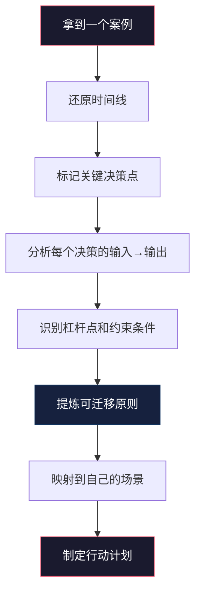
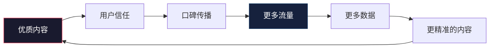

## 五、案例分析的方法论总结

前面四节分别拆解了不同维度的赚钱案例——从个人技能变现、平台红利捕捉、资源整合套利到长期复利构建。但光看案例远远不够，真正拉开差距的是你能不能**从别人的案例中提炼出可迁移的方法论**，然后用到自己的场景里。

这一节不是再给你一个新案例，而是退后一步，回答一个更根本的问题：**怎么分析案例，才能让每个案例都变成你脑子里的决策武器？**

### 5.1 为什么大多数人"看了100个案例还是不会赚钱"

#### 5.1.1 案例学习的三个常见陷阱

| 陷阱 | 表现 | 后果 |
|------|------|------|
| **看热闹心态** | "哇这个好厉害"，然后划走 | 零收获，纯粹消费内容 |
| **归因错误** | 把成功归结为运气、天赋或某个单一动作 | 学到错误的因果关系，执行时踩坑 |
| **脱离情境** | 忽略案例发生的时间、地域、行业背景 | 机械照搬，水土不服 |

举个例子：2020年有人靠做口罩月入百万。如果你的结论是"卖口罩能赚钱"，那就是典型的归因错误。正确的归因是：**在突发性供需失衡中，能快速响应供给端的人能吃到红利**。这个模式可以迁移到任何类似的供需缺口——比如AI工具刚爆发时做教程、某个新平台上线时做搬运。

#### 5.1.2 有效案例分析的本质

案例分析不是"读故事"，而是**逆向工程**。你要做的事情是：

1. **还原决策树**：在每个关键节点，当事人面临哪些选项？为什么选了这条路？
2. **识别杠杆点**：哪些动作带来了不成比例的回报？为什么？
3. **提取约束条件**：这个案例成功依赖哪些前提？去掉哪个前提会崩？
4. **寻找可迁移内核**：剥离掉不可复制的部分（运气、时代红利），剩下什么是可以学习的？



### 5.2 案例分析的四维框架

经过对大量赚钱案例的交叉比对，我总结出一个四维分析框架。每个维度回答一个核心问题，四个维度合在一起就能完整还原一个案例的底层逻辑。

#### 5.2.1 维度一：价值创造分析（What & Why）

**核心问题：这个案例创造了什么价值？为什么这个价值在当时能被市场买单？**

这个维度是最容易被忽略的。大多数人看案例只关注"怎么做的"，却不问"做对了什么"。但如果不理解价值创造的逻辑，你就不知道这个案例的根基在哪里。

分析步骤：

1. **明确价值类型**：这个案例创造的是信息价值（帮人省时间/降认知成本）、连接价值（帮人找到匹配的资源）、体验价值（帮人获得更好的感受）、还是效率价值（帮人用更少资源做到同样的事）？
2. **量化价值感知**：目标用户愿意为这个价值付多少钱？为什么是这个价格而不是更高或更低？
3. **评估价值可持续性**：这个价值是阶段性的（比如某次热点的解读）还是长期的（比如某个技能的教学）？

| 价值类型 | 典型案例 | 定价逻辑 | 可持续性 |
|----------|----------|----------|----------|
| 信息价值 | 付费社群、行业报告 | 节省的时间 × 时薪 | 取决于信息源的稀缺性 |
| 连接价值 | 猎头、中介、资源对接 | 成交额 × 抽佣比例 | 取决于关系网络的壁垒 |
| 体验价值 | 定制服务、内容创作 | 替代方案的体验差距 | 取决于个人品牌和口碑 |
| 效率价值 | SaaS工具、自动化方案 | 节省的成本 × 使用频率 | 取决于技术壁垒和替换成本 |

#### 5.2.2 维度二：时机窗口分析（When）

**核心问题：这个案例为什么在这个时间点成立？早半年或晚半年会怎样？**

时机是案例中最不可复制但最值得学习的部分。不可复制是因为你不可能回到那个时间点；值得学习是因为理解时机规律后，你能在未来的新窗口出现时识别它。

时机窗口通常由以下因素打开：

- **政策变化**：新法规出台创造合规需求（比如数据隐私法催生隐私合规咨询）
- **技术突破**：新工具降低某个领域的进入门槛（比如AI降低内容创作门槛）
- **供需失衡**：需求突然爆发但供给跟不上（比如疫情期间的在线教育）
- **平台红利**：新平台用流量补贴吸引创作者（比如任何新内容平台的冷启动期）
- **认知差**：大多数人还没意识到某个趋势已经成立

**时机分析的关键指标：**

| 指标 | 含义 | 判断方法 |
|------|------|----------|
| 窗口开启信号 | 标志性事件或数据拐点 | 搜索指数、政策文件、行业报告 |
| 窗口宽度 | 红利期持续多长时间 | 参考类似历史案例的周期 |
| 进入门槛变化 | 随时间推移门槛是升高还是降低 | 竞争者数量、利润空间变化 |
| 最佳进入时机 | 太早教育市场成本高，太晚红海 | 通常是早期多数人开始关注但尚未行动时 |

#### 5.2.3 维度三：资源杠杆分析（How）

**核心问题：当事人用了哪些资源？哪些是杠杆资源（投入小回报大）？**

每个赚钱案例都可以拆解为"资源→动作→结果"的链条。关键不是列出所有资源，而是识别哪些资源起到了**杠杆作用**——也就是投入产出比远高于平均的那些。

杠杆资源通常有三个特征：

1. **边际成本趋近于零**：比如一次制作的内容可以反复售卖，一套自动化系统可以无限复用
2. **具有网络效应**：用户越多价值越大，比如社群、平台
3. **存在复利效应**：前期投入在后期持续产生回报，比如品牌、信誉、技能树

```text
杠杆资源优先级排序：

高杠杆 ████████████████████ 
  → 数字产品（一次制作，无限销售）
  → 内容资产（SEO流量、教程、模板）
  → 自动化系统（降低人工干预）
  → 平台/社群（网络效应）

中杠杆 ████████████
  → 个人品牌（信任溢价）
  → 行业人脉（信息差和合作机会）
  → 专业技能（稀缺性带来议价权）

低杠杆 ████████
  → 纯时间投入（接单、咨询的时薪模式）
  → 纯资金投入（没有差异化的一般性投资）
```

#### 5.2.4 维度四：风险结构分析（Risk）

**核心问题：这个案例的风险在哪里？什么情况下会失败？失败的代价是什么？**

大多数案例分享只讲成功路径，不讲风险结构。但一个成熟的案例分析必须回答：如果去掉某个有利条件，这个案例还成立吗？

风险分析的三个层次：

1. **单点故障风险**：整个模式依赖的最关键一环是什么？如果这一环断裂怎么办？
2. **环境变化风险**：如果市场、政策、平台规则发生变化，模式还能运转吗？
3. **规模天花板风险**：这个模式做到顶能有多大？增长的瓶颈在哪里？

**风险矩阵评估表：**

| 风险类别 | 可能性(1-5) | 影响度(1-5) | 风险值 | 应对策略 |
|----------|:-----------:|:-----------:|:------:|----------|
| 平台规则变更 | 4 | 4 | 16 | 多平台分散，建立私域流量池 |
| 竞争加剧 | 3 | 3 | 9 | 深耕垂直领域，建立品牌壁垒 |
| 需求萎缩 | 2 | 5 | 10 | 持续市场调研，预留转型空间 |
| 供应链断裂 | 2 | 4 | 8 | 多供应商备选，核心能力内部化 |
| 个人精力瓶颈 | 4 | 3 | 12 | SOP化+外包/自动化 |

### 5.3 从案例到方法论的提炼术

#### 5.3.1 三层提炼法

看一个案例不能只停在表面，要做三层提炼：

```text
第一层：现象层 —— "他做了什么"
  ↓ 去掉不可复制的部分
第二层：模式层 —— "他的成功遵循什么模式"
  ↓ 抽象为通用原则
第三层：原则层 —— "这个模式背后的底层逻辑是什么"
```

**以一个真实案例说明：**

某程序员在B站做Python教程，3个月涨粉10万，月广告收入8000+元。

- **现象层**：做Python教程视频→涨粉→接广告变现
- **模式层**：在新兴需求领域（Python学习热潮），用高质量免费内容获取流量，再通过广告/付费课程变现
- **原则层**：**供需缺口 × 内容杠杆 × 流量变现**。当一个领域出现大量新需求但优质供给不足时，率先提供高质量内容的人能快速积累注意力资产，然后用注意力资产变现

提炼到原则层之后，你就可以把它迁移到任何类似的场景：AI工具教程、跨境电商指南、新能源行业解读……

#### 5.3.2 案例对比分析法

单个案例容易有偶然性，但如果你把多个类似案例放在一起对比，共性部分就是高确定性的方法论。

对比分析的操作方法：

1. **选3-5个同领域案例**：比如都是做知识付费的、都是做电商的
2. **提取每个案例的关键变量**：起步资源、核心动作、时间线、收入结构
3. **找交集**：所有案例都有的元素就是必要条件
4. **找差异**：不同案例的差异化部分决定了不同路径
5. **建模型**：用交集部分搭骨架，用差异部分标注分支选择

| 对比维度 | 案例A（Python教程） | 案例B（Excel教学） | 案例C（摄影教学） | 共性提炼 |
|----------|--------------------|--------------------|-------------------|----------|
| 起步门槛 | 有专业技能 | 有专业技能 | 有专业技能 | **核心技能是起点** |
| 内容形式 | 视频教程 | 图文+视频 | 作品+教程 | **免费内容获客** |
| 变现方式 | 广告+付费课 | 付费模板+咨询 | 约拍+课程 | **多元变现** |
| 增长引擎 | SEO+推荐算法 | 社群裂变 | 作品传播 | **需要一个放大器** |
| 耗时 | 3个月起步 | 6个月起步 | 2个月起步 | **2-6个月冷启动期** |

从这个对比中可以提炼出知识技能变现的通用公式：

> **技能变现 = 专业能力 × 内容杠杆 × 流量放大器 × 变现矩阵**

四个因子缺一不可，每个因子的强度决定最终收入上限。

#### 5.3.3 反面案例分析法

成功案例告诉你"应该做什么"，失败案例告诉你"不应该做什么"。但失败案例往往更难获取——因为失败者通常不分享。

**从失败案例中提取教训的方法：**

1. **关注"做了但没用"的动作**：很多案例里有些环节投入大量精力但没有产出，这些就是需要砍掉的低效动作
2. **关注"没做但很重要"的环节**：如果一个案例最终失败了，回溯看哪个关键环节缺失
3. **关注"做了反而有害"的决策**：比如过早扩张、定价过低、忽视复购

常见的失败模式：

| 失败模式 | 症状 | 根因 | 纠正方法 |
|----------|------|------|----------|
| 产品思维缺失 | 有流量但变现差 | 没有设计变现路径 | 先想清楚卖给谁、卖什么 |
| 完美主义拖延 | 准备很久但迟迟不开始 | 用"准备"代替"行动" | 设定MVP标准，到线就发 |
| 无视数据 | 凭感觉决策 | 没有建立数据追踪体系 | 每周复盘核心指标 |
| 过早扩张 | 一个人还没跑通就招团队 | 低估了管理成本 | 先个人跑通再考虑规模 |
| 抄袭式跟随 | 照搬别人的做法 | 没有理解底层逻辑 | 用四维框架分析后再行动 |

### 5.4 案例分析的实操模板

光有框架不够，你需要一个可以实际操作的分析模板。下面是经过验证的标准化分析流程。

#### 5.4.1 案例分析工作表

```markdown
## 案例分析工作表

### 基础信息
- 案例来源：___（书/文章/访谈/观察）
- 发生时间：___
- 所属行业/领域：___
- 当事人背景：___

### 四维分析

#### 维度一：价值创造
- 创造了什么价值：___
- 目标用户是谁：___
- 用户愿意付多少钱：___
- 价值的可持续性：高/中/低

#### 维度二：时机窗口
- 什么因素打开了窗口：___
- 窗口现在还在吗：是/否/部分
- 如果现在进入，条件有何不同：___

#### 维度三：资源杠杆
- 起步时的关键资源：___
- 杠杆动作（投入产出比最高的）：___
- 哪些资源是可复制的：___
- 哪些资源是不可复制的：___

#### 维度四：风险结构
- 最大单点故障：___
- 如果去掉最有利的条件：___
- 规模天花板：___

### 提炼
- 现象层总结：___
- 模式层总结：___
- 原则层总结：___
- 可迁移性评分：1-5
- 对我的启发：___
- 我可以怎么用：___
```

#### 5.4.2 案例打分卡

不是所有案例都值得深入学习。用这个打分卡快速筛选高价值案例：

| 评估维度 | 1分（低） | 3分（中） | 5分（高） | 得分 |
|----------|-----------|-----------|-----------|------|
| **可复制性** | 高度依赖个人天赋/运气 | 部分可复制，需要适配 | 模式清晰，步骤可拆解 | ___ |
| **时效性** | 已过时的红利 | 当前仍有效 | 趋势向上，未来更强 | ___ |
| **适配性** | 与我的资源/技能完全不匹配 | 有一定关联 | 高度匹配我的优势 | ___ |
| **回报潜力** | 天花板低（<月入5000） | 中等天花板（5000-3万） | 高天花板（>月入3万） | ___ |
| **学习成本** | 需要大量前置知识和资源 | 中等投入 | 上手快，试错成本低 | ___ |

**总分解读：**
- 20-25分：高优先级案例，值得花2-3小时深入分析
- 15-19分：中等价值，快速提取关键点即可
- 10-14分：低优先级，浏览了解即可
- 5-9分：跳过，不值得投入时间

#### 5.4.3 从分析到行动的转化流程

分析完了如果不落地就是自嗨。每个案例分析结束后，必须输出以下三样东西：

1. **一条可验证的假设**：比如"在小红书发XX类型内容，30天内能获得500+粉丝"
2. **一个最小实验方案**：用最少的时间和资源去验证这条假设
3. **一个明确的止损线**：投入多少时间/金钱后如果没达到预期就放弃

```text
案例分析 → 提炼原则 → 映射场景 → 形成假设 → 设计实验 → 执行验证 → 迭代优化
                                                         ↑
                                                    止损线在这里
```

### 5.5 建立你自己的案例库

#### 5.5.1 为什么要建案例库

单个案例的价值有限，但**案例库的价值是指数级的**。当你积累了50个以上经过深度分析的案例后，你会发现：

- 很多表面不同的案例，底层逻辑是相通的
- 你能快速识别一个新机会是否符合已知的成功模式
- 你能预判某个方向的风险点，因为你见过类似模式的失败案例
- 你的决策速度和质量会大幅提升

#### 5.5.2 案例库的组织方式

推荐按**模式**而非按**行业**来组织。因为同一模式可以跨行业迁移，而同一行业的案例可能用的是完全不同的模式。

**一级分类（按模式）：**
- 流量变现型（靠内容/工具获取流量，再变现）
- 信息差套利型（利用不同群体间的信息不对称）
- 技能服务型（用专业技能直接提供服务）
- 资源整合型（连接供需双方，赚取佣金/差价）
- 产品驱动型（打造可复制的数字/实体产品）
- 平台红利型（利用新兴平台的流量补贴期）

**二级标签（按属性）：**
- 启动成本：零成本 / 低成本（<5000） / 中成本（5000-5万） / 高成本（>5万）
- 见效速度：即时 / 1-3个月 / 3-6个月 / 6个月以上
- 天花板：月入5千以内 / 5千-3万 / 3万-10万 / 10万以上
- 可复制性：高 / 中 / 低

#### 5.5.3 持续积累的方法

1. **日常收集**：看到好的案例随手存到待分析清单
2. **批量分析**：每周固定2-3小时，用四维框架深度分析2-3个案例
3. **定期回顾**：每月回顾当月分析的案例，更新自己的模式认知
4. **交叉验证**：遇到新机会时，去案例库找类似模式做参照

### 5.6 案例分析的高阶心法

#### 5.6.1 逆向分析：从结果倒推必要条件

普通人看案例是正向的："他做了A、B、C，所以成功了。"
高手看案例是逆向的："他成功了，那A、B、C是不是必要条件？去掉任何一个还会不会成功？"

逆向分析的操作方法：

1. 拿到结果（月入X万）
2. 列出所有可能的解释变量
3. 逐一假设"如果这个变量不存在"，结果会怎样
4. 去掉之后结果仍然成立的变量→非必要条件
5. 去掉之后结果崩塌的变量→**核心必要条件**

这比正向分析更可靠，因为正向分析容易把"碰巧做了的事"误认为"必须做的事"。

#### 5.6.2 概率思维：从个案到分布

任何单个案例都可能有幸存者偏差。真正有用的信息不是"他成功了"，而是"这类模式成功的概率有多大"。

建立概率思维的方法：

- 如果一个模式你看到3个成功案例、0个失败案例→大概率是你没看到失败的（幸存者偏差），实际成功率可能只有10-20%
- 如果一个模式你看到10个成功案例且能追溯到5个失败案例→成功率约67%，这是比较可靠的数据
- 如果一个模式成功者和失败者的比例接近且你都能看到→说明成败取决于执行细节而非模式本身

#### 5.6.3 系统思维：从线性因果到反馈回路

初级分析是线性的："做了A所以得到B。"
高级分析是系统的："A导致B，B又强化了A，形成正反馈回路。"

识别案例中的反馈回路：



当你识别出案例中的正反馈回路后，你就知道启动这个飞轮的关键在哪——通常是第一步"优质内容"或"初始信任"。这就是为什么很多成功案例的早期都是"不计成本地做好一件事"，因为他们在启动飞轮。

### 5.7 本章总结

案例分析不是读故事，而是**训练你的商业直觉**。当你积累了足够多经过深度分析的案例后，你看到一个新机会时，脑子里会自动匹配已知模式，快速判断：

- 这个模式我见过没有？成功概率多大？
- 核心杠杆点在哪？我能撬动吗？
- 最大风险是什么？我能承受吗？
- 最佳进入时机是什么时候？

这就是从"看别人赚钱"到"自己能赚钱"的关键跨越。

**最后的核心提醒：**

> 不要用战术上的勤奋（大量看案例）掩盖战略上的懒惰（不深入分析、不转化为行动）。看100个案例的浅层信息，不如深度分析10个案例并尝试验证其中的3个。
