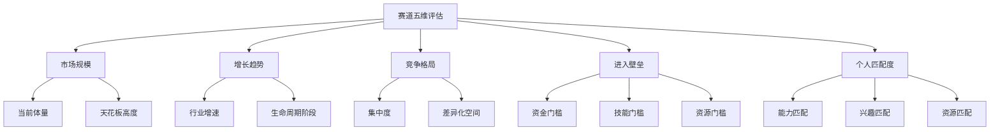
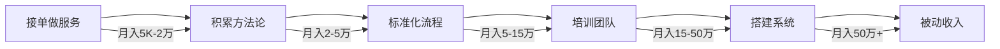

## 六、搞钱的赛道选择方法论

赛道选择，是搞钱过程中杠杆率最高的一个决策。选对赛道，普通人也能吃到时代红利；选错赛道，再努力也只是在盐碱地里刨食。本节将系统拆解赛道选择的底层逻辑、评估框架和实操方法，帮你建立一套可复用的决策系统。

### 6.1 为什么赛道选择是搞钱的第一要务

#### 6.1.1 赛道决定天花板

一个赛道的市场规模，决定了你能赚到多少钱的上限。在夕阳行业里做到顶尖，可能不如在新兴行业里做到中等。这不是能力问题，而是数学问题。

举个直观的例子：

| 赛道 | 市场规模 | 头部玩家年收入 | 中腰部玩家年收入 |
|------|----------|---------------|-----------------|
| 传统报刊亭 | 萎缩中 | 20-30万 | 5-10万 |
| 短视频内容 | 万亿级 | 数亿 | 数十万到数百万 |
| AI应用开发 | 高速增长 | 数千万 | 数十万 |
| 社区团购（成熟期） | 千亿级 | 数百万 | 数万 |

同一个能力水平的人，放在不同赛道，收入可能差10倍甚至100倍。这就是赛道的力量。

#### 6.1.2 赛道选择的"不可逆性"

赛道选择和普通决策不同，它具有显著的路径依赖特征。一旦你在某个赛道积累了人脉、技能、品牌和客户，切换赛道的成本会越来越高。这就是为什么赛道选择值得花大量时间去研究——它不是"试错"能解决的问题，因为试错的代价太高了。

**赛道选择的三层代价**：

- **时间代价**：在一个赛道从入门到熟练通常需要1-3年，换赛道意味着重新来过
- **机会代价**：投入A赛道的时间，就是放弃B赛道的时间
- **心理代价**：多次换赛道会严重打击信心，产生"我什么都做不好"的错觉

#### 6.1.3 赛道与个人能力的乘数效应

搞钱的公式可以简化为：

```text
搞钱成果 = 个人能力 × 赛道红利 × 执行质量
```

- 个人能力是1-10的变量
- 赛道红利是0.1-100的变量
- 执行质量是0.5-3的变量

一个能力值为5的人，在赛道红利为10的赛道上，执行质量为2，成果就是100。另一个能力值为8的人，在赛道红利为0.5的赛道上，执行质量为2，成果只有8。能力更强的人反而赚得更少，这就是赛道选择的乘数效应。

***

### 6.2 赛道评估的核心框架：五维模型

评估一个赛道是否值得进入，需要从五个维度进行系统分析。



#### 6.2.1 维度一：市场规模

市场规模决定了你的收入天花板。评估市场规模需要关注三个层次：

**TAM（Total Addressable Market，总可及市场）**：整个赛道的市场总规模。比如"在线教育"这个赛道的TAM是数千亿元。

**SAM（Serviceable Available Market，可服务市场）**：你实际能触达的那部分市场。如果你只做K12英语辅导，SAM就是K12英语在线辅导的市场规模，可能是TAM的几十分之一。

**SOM（Serviceable Obtainable Market，可获得市场）**：在SAM中，考虑到你的竞争能力、地域限制、资源约束后，你能实际获取的市场份额。对于一个刚入行的个人或小团队，SOM可能只有SAM的1%甚至更少。

**评估方法**：

| 方法 | 适用场景 | 数据来源 | 可靠度 |
|------|----------|----------|--------|
| 行业报告法 | 成熟行业 | 艾瑞、易观、Statista等 | ★★★★ |
| 需求侧推算法 | 新兴赛道 | 搜索量、社交媒体讨论量、淘宝销量 | ★★★ |
| 供给侧推算法 | 服务型赛道 | 竞品数量 × 竞品平均营收 | ★★★ |
| 标杆参照法 | 国内/外对标 | 海外成熟市场的同类赛道规模 | ★★★★ |
| 用户调研法 | 小众赛道 | 问卷、访谈、社群调研 | ★★ |

**实操建议**：不要只看一个数据源。至少用两种方法交叉验证。如果两种方法得出的市场规模差距超过3倍，说明你对这个赛道的理解还不够深。

#### 6.2.2 维度二：增长趋势

增长趋势比当前规模更重要。在一个快速增长的赛道里，即使你只吃到一小块蛋糕，绝对值也可能很可观。而在一个停滞或萎缩的赛道里，你可能需要从别人嘴里抢食。

**行业生命周期判断**：

| 阶段 | 特征 | 机会类型 | 风险等级 | 典型代表（2024-2025） |
|------|------|----------|----------|----------------------|
| **萌芽期** | 技术刚出现，商业模式未验证 | 高风险高回报的创业机会 | ★★★★★ | 具身智能、脑机接口 |
| **成长期** | 需求爆发，玩家涌入，格局未定 | 最佳入场窗口 | ★★★ | AI应用、新能源储能 |
| **成熟期** | 格局稳定，增速放缓，利润率下降 | 细分创新和效率提升 | ★★ | 电商、外卖、网约车 |
| **衰退期** | 需求萎缩，玩家退出 | 收割剩余需求 | ★ | 传统报业、DVD租赁 |

**判断增长趋势的五个信号**：

1. **资本流向**：VC/PE大量涌入的赛道，通常处于成长期。但要注意资本泡沫——2021年的社区团购就是资本催熟后一地鸡毛的典型案例
2. **人才流向**：大厂高管和优秀人才跳槽去的方向，往往代表未来的趋势
3. **政策导向**：国家重点扶持的产业（如新能源、半导体、AI）通常有政策红利期
4. **技术成熟度**：技术刚刚成熟到可商用的阶段，是最佳入场时机。太早会变成"先烈"，太晚红利已被吃尽
5. **用户行为迁移**：用户从旧习惯转向新习惯的过程，就是最大的机会窗口。比如从图文到短视频、从线下到线上

#### 6.2.3 维度三：竞争格局

竞争格局决定了你进入后面临的生存难度。

**波特五力模型的简化版**：

| 力量 | 评估问题 | 有利信号 | 不利信号 |
|------|----------|----------|----------|
| **现有竞争者** | 赛道里已经有多少玩家？ | 玩家少、差异化空间大 | 红海厮杀、价格战 |
| **潜在进入者** | 新玩家进入容易吗？ | 有壁垒（技术/品牌/资源） | 低门槛、随时有人涌入 |
| **替代品威胁** | 有没有其他方式满足同样需求？ | 替代品少、切换成本高 | 替代品多、用户忠诚度低 |
| **买方议价力** | 客户是否强势？ | 客户分散、需求刚性 | 客户集中、需求弹性大 |
| **供方议价力** | 供应商是否强势？ | 供应链成熟、可替代 | 核心资源被少数人把控 |

**竞争格局的四种典型状态**：

1. **蓝海**：需求存在但供给不足。这是最理想的赛道状态，但需要验证需求是否真实（很多"蓝海"其实是伪需求）
2. **差异化蓝海**：红海中存在未被满足的细分需求。比如在成熟的电商赛道中，"大码女装""二次元周边"等细分赛道仍有大量机会
3. **红海**：充分竞争，利润薄。进入红海需要有明显的差异化优势或成本优势
4. **死海**：恶性竞争，行业不赚钱。果断远离

#### 6.2.4 维度四：进入壁垒

进入壁垒是双刃剑——高壁垒意味着进入难，但也意味着进去后竞争少。

**进入壁垒的六种类型**：

| 壁垒类型 | 说明 | 突破方法 | 案例 |
|----------|------|----------|------|
| **资金壁垒** | 需要大量启动资金 | 选择轻资产模式、找合伙人分摊 | 开餐厅（50万+）vs 做外卖代运营（几乎零成本） |
| **技术壁垒** | 需要特定专业技能 | 学习、外包、找技术合伙人 | AI模型训练 vs 用现成API搭建应用 |
| **牌照壁垒** | 需要特定资质或许可证 | 寻找不需要牌照的细分领域 | 金融牌照 vs 财务咨询 |
| **品牌壁垒** | 用户只认老品牌 | 切入新渠道、新人群、新品类 | 传统白酒 vs 新消费果酒 |
| **网络效应壁垒** | 用户越多越有价值 | 找到切入点、创造初始价值 | 微信 vs 企业微信 |
| **资源壁垒** | 特定资源被少数人把控 | 通过合作、代理、授权等方式获取 | 产地农产品、独家代理权 |

**关键洞察**：对于个人搞钱者，应该优先选择"低资金壁垒、高技能壁垒"的赛道。因为资金是硬约束，而技能是可以持续积累的资产。技能壁垒越高，你的竞争护城河就越深。

#### 6.2.5 维度五：个人匹配度

这是最容易被忽视、但实际上最重要的维度。再好的赛道，如果你不匹配，也做不出成绩。

**个人匹配度的三个层次**：

**第一层：能力匹配**

| 能力类型 | 评估方法 | 权重 |
|----------|----------|------|
| 专业技能 | 你在这个领域的技能水平如何？ | ★★★★★ |
| 通用能力 | 沟通、销售、管理、学习能力 | ★★★★ |
| 行业认知 | 你对这个行业了解多深？ | ★★★ |
| 资源积累 | 你有什么行业人脉、渠道、信息？ | ★★★ |

**第二层：兴趣匹配**

这一点经常被低估。搞钱是一场马拉松，不是百米冲刺。如果你对一个赛道没有兴趣，很难坚持3-5年。兴趣不是"觉得有意思"，而是"即使遇到困难和挫折，你仍然愿意继续做"。

自测方法：想象你在这个赛道已经做了一年，月收入稳定在2万元。你每天早上起床，想到要做的事情，是期待还是抗拒？如果答案是抗拒，这个赛道可能不适合你。

**第三层：生活匹配**

| 约束条件 | 评估要点 |
|----------|----------|
| 时间 | 这个赛道需要每天投入多少时间？你有吗？ |
| 地域 | 是否需要特定地理位置？你愿意搬吗？ |
| 家庭 | 家人是否支持？收入波动期能否承受？ |
| 健康 | 工作强度和节奏对健康的影响？ |
| 阶段 | 你目前的人生阶段适合这个赛道吗？ |

***

### 6.3 赛道分类与特征分析

不同类型的赛道有截然不同的搞钱逻辑。以下是对主流赛道的系统分类和特征分析。

#### 6.3.1 内容赛道

**定义**：通过创作内容获取流量，再通过广告、电商、知识付费、品牌合作等方式变现。

| 子赛道 | 变现模式 | 启动成本 | 时间回报 | 天花板 |
|--------|----------|----------|----------|--------|
| 短视频（抖音/快手） | 广告、直播带货、星图 | 低（手机即可） | 3-6个月 | 高 |
| 图文种草（小红书） | 品牌合作、电商、知识付费 | 低 | 2-4个月 | 中高 |
| 长视频（B站/YouTube） | 广告分成、品牌合作、会员 | 中（设备+剪辑） | 6-12个月 | 高 |
| 自媒体写作（公众号/头条） | 广告、知识付费、社群 | 低 | 3-6个月 | 中 |
| 播客/音频（小宇宙/喜马拉雅） | 广告、知识付费、赞助 | 低 | 6-12个月 | 中低 |

**内容赛道的核心逻辑**：用优质内容换取注意力，再把注意力转化为商业价值。

**关键成功因素**：
1. **差异化定位**：在海量内容中找到你的独特角度。"又一个美食探店号"几乎没有机会，但"专门测评学校食堂的大学生"就有辨识度
2. **持续输出能力**：内容赛道是典型的"复利游戏"，前期看不到回报，但坚持半年到一年后，积累的内容资产会产生指数效应
3. **变现路径设计**：从第一天就想清楚怎么变现。很多内容创作者积累了百万粉丝却不知道怎么赚钱，因为一开始就没有设计变现路径

**风险提示**：平台算法变化可能导致流量断崖式下跌。不要把所有鸡蛋放在一个平台上，至少布局2-3个平台。

#### 6.3.2 服务赛道

**定义**：通过提供专业服务（咨询、设计、开发、代运营等）获取收入。

| 子赛道 | 典型服务 | 启动成本 | 收入模式 | 天花板 |
|--------|----------|----------|----------|--------|
| 技术外包 | 网站/APP开发、数据分析 | 低 | 项目制 | 中 |
| 设计服务 | 品牌设计、UI设计、视频制作 | 低 | 项目制/月费 | 中 |
| 咨询顾问 | 企业咨询、职业规划、财税咨询 | 低 | 小时费/项目费 | 高 |
| 代运营 | 电商代运营、自媒体代运营、广告投放 | 低 | 月费+提成 | 中高 |
| 培训教练 | 企业培训、健身教练、语言教学 | 低 | 课时费/套餐 | 中 |

**服务赛道的核心逻辑**：用专业能力换取报酬，本质是"卖时间"的升级版。

**从"卖时间"到"卖系统"的进化路径**：



**关键成功因素**：
1. **专业深度**：服务赛道拼的是专业能力，做到前20%才能获得溢价
2. **客户管理**：维护好老客户，复购和转介绍是服务赛道最优质的获客渠道
3. **标准化**：把个人经验变成可复制的流程，才能突破"卖时间"的天花板

#### 6.3.3 产品赛道

**定义**：创建或销售产品（实物或数字产品），通过规模化销售获取收入。

| 子赛道 | 典型产品 | 启动成本 | 利润模式 | 天花板 |
|--------|----------|----------|----------|--------|
| 电商（自有品牌） | 自有品牌实物产品 | 中高（库存+供应链） | 批量差价 | 高 |
| 电商（无货源/一件代发） | 代销产品 | 低 | 佣金差价 | 中低 |
| 数字产品 | 课程、模板、工具、素材包 | 低 | 边际成本趋零 | 高 |
| SaaS产品 | 软件工具、小程序 | 中高 | 订阅制 | 极高 |
| 手工艺品/定制品 | 手工饰品、定制礼品 | 低 | 溢价 | 中低 |

**产品赛道的核心逻辑**：前期投入时间/金钱创建产品，后期通过规模化销售实现"睡后收入"。

**关键成功因素**：
1. **需求验证**：在投入大量资源开发产品之前，先验证需求是否真实存在
2. **供应链管理**（实物产品）：供应链的效率和成本直接决定利润率
3. **用户获取成本（CAC）**：产品的利润空间必须能覆盖获客成本，否则卖得越多亏得越多
4. **复购和口碑**：好产品自带传播效应，降低长期获客成本

#### 6.3.4 平台/生态赛道

**定义**：在已有的平台或生态中找到商业机会。

| 平台/生态 | 典型玩法 | 启动成本 | 特点 |
|-----------|----------|----------|------|
| 淘宝/天猫 | 开店、代运营、淘客 | 低-中 | 竞争激烈，流量成本高 |
| 抖音电商 | 直播带货、短视频带货 | 低 | 流量大但不稳定 |
| 微信生态 | 公众号、小程序、企业微信 | 低 | 私域流量，复购率高 |
| 闲鱼/转转 | 二手交易、信息差套利 | 极低 | 适合新手试水 |
| 海外平台（亚马逊/Shopee/TikTok Shop） | 跨境电商 | 中 | 信息差机会，但有汇率和物流风险 |

**平台赛道的核心逻辑**：借平台的流量和基础设施做生意，本质是"在别人的地盘上开店"。

**风险提示**：平台规则变化可能直接影响你的生意。2023年抖音电商大幅调整流量分配规则，大量商家收入腰斩。在平台赛道中，一定要建立自己的私域流量池，不要完全依赖平台。

#### 6.3.5 投资赛道

**定义**：通过资本配置获取收益，包括股票、基金、房产、加密货币等。

| 子赛道 | 预期年化收益 | 风险等级 | 适合人群 |
|--------|-------------|----------|----------|
| 指数基金定投 | 8-12% | ★★ | 所有人 |
| 主动选股 | -50% ~ +100% | ★★★★ | 有专业研究能力的人 |
| 房产投资 | 3-8%（含租金） | ★★★ | 有大额资金的人 |
| 可转债 | 5-15% | ★★ | 有基础知识的稳健投资者 |
| 加密货币 | -90% ~ +1000% | ★★★★★ | 能承受全部亏损的人 |

**投资赛道的核心逻辑**：让钱生钱，本质是"用资本换取回报"。

**重要提醒**：投资赛道与前四类赛道有本质区别——前四类是"主动收入"，投资是"被动收入"。在没有足够的主动收入积累之前，不要把主要精力放在投资上。更不要借钱投资。

***

### 6.4 赛道选择的实操方法论

理论框架有了，接下来是具体的实操步骤。

#### 6.4.1 第一步：赛道扫描——建立你的赛道清单

**信息来源**：

| 来源 | 怎么用 | 举例 |
|------|--------|------|
| 行业报告 | 了解宏观趋势和市场规模 | 艾瑞咨询、36氪研究院、CB Insights |
| 社交媒体 | 发现新兴需求和用户痛点 | 小红书热门话题、抖音挑战赛、知乎热榜 |
| 电商数据 | 验证需求是否真实 | 淘宝生意参谋、蝉妈妈、飞瓜数据 |
| 招聘网站 | 判断行业人才需求和薪资水平 | Boss直聘、猎聘上某岗位的招聘量和薪资 |
| 投资动态 | 发现资本看好的方向 | IT桔子、天眼查上的融资信息 |
| 身边观察 | 发现被忽视的本地化需求 | 你所在城市/社区/行业里的未被满足的需求 |

**赛道扫描的输出**：列出5-10个你感兴趣的赛道，每个赛道简要记录：赛道名称、一句话描述、你初步了解到的市场规模和增长趋势。

#### 6.4.2 第二步：赛道深研——用数据替代直觉

对清单中的每个赛道进行深度研究，时长建议每个赛道3-5天。

**深研框架**：

```text
1. 市场数据收集
   ├── 行业规模（近3年数据 + 未来3年预测）
   ├── 增长率（CAGR复合年增长率）
   └── 主要玩家和市场份额

2. 需求验证
   ├── 目标用户画像（谁在买？为什么买？）
   ├── 需求频次（高频 vs 低频）
   ├── 需求刚性（刚需 vs 改善型）
   └── 用户痛点深度访谈（至少5人）

3. 竞争分析
   ├── 头部3家的商业模式和优劣势
   ├── 中腰部玩家的生存状态
   └── 新进入者的机会在哪里

4. 变现模型
   ├── 客单价范围
   ├── 获客成本（CAC）
   ├── 生命周期价值（LTV）
   └── LTV/CAC比值（>3为健康）

5. 风险评估
   ├── 政策风险
   ├── 技术风险
   ├── 竞争风险
   └── 周期风险
```

#### 6.4.3 第三步：赛道评分——量化决策

把主观判断转化为可比较的量化分数。

**赛道评分卡**：

| 评估维度 | 权重 | 赛道A评分 | 赛道B评分 | 赛道C评分 |
|----------|------|-----------|-----------|-----------|
| 市场规模（1-10） | 20% | | | |
| 增长趋势（1-10） | 20% | | | |
| 竞争友好度（1-10） | 15% | | | |
| 进入难度（1-10，越高越容易） | 10% | | | |
| 能力匹配度（1-10） | 15% | | | |
| 兴趣匹配度（1-10） | 10% | | | |
| 资源匹配度（1-10） | 10% | | | |
| **加权总分** | 100% | | | |

**评分标准参考**：
- 1-3分：明显不利或完全不匹配
- 4-6分：一般，有明显短板
- 7-8分：较好，有竞争力
- 9-10分：极佳，强烈推荐

**加权总分 > 7.5分**：值得深入验证并快速试水
**加权总分 6-7.5分**：有机会但需要补强短板
**加权总分 < 6分**：建议放弃或重新评估

#### 6.4.4 第四步：赛道验证——用最小成本试错

评分只是纸面功夫，真正的验证要靠市场反馈。

**72小时验证法**：

| 时间 | 动作 | 目的 |
|------|------|------|
| 第1天 | 在目标平台发布3-5条相关内容/产品 | 测试市场反应 |
| 第2天 | 主动联系5-10个目标用户，了解需求 | 验证需求真实性 |
| 第3天 | 尝试完成1-2笔小交易（哪怕亏本） | 验证变现可行性 |

**验证通过的信号**：
- 有人主动询问你的产品/服务
- 有人愿意付费（即使金额很小）
- 有人帮你转发或推荐
- 你收到的反馈中，"在哪里买""多少钱"比"有意思"多

**验证失败的信号**：
- 发布后几乎无人关注
- 所有人都说"挺好的"但没人行动
- 你自己都觉得说服力不够
- 目标用户表示"不需要"或"已经有了"

#### 6.4.5 第五步：赛道决策——果断选择，坚定执行

验证完成后，做出最终决策。

**决策矩阵**：

| 验证结果 | 建议行动 |
|----------|----------|
| 验证通过 + 高分赛道 | 立刻全力投入 |
| 验证通过 + 中分赛道 | 谨慎投入，边做边优化 |
| 验证失败 + 高分赛道 | 重新验证，可能是执行问题 |
| 验证失败 + 低分赛道 | 果断放弃，寻找下一个赛道 |

**决策后的关键纪律**：
1. 选定赛道后，至少坚持6个月再做评估
2. 不要因为看到"更好的机会"就中途跳槽
3. 每月复盘一次数据，但不要每周都质疑方向
4. 设置明确的止损线（时间止损 + 金额止损）

***

### 6.5 赛道选择的常见误区

#### 误区一：追风口

**典型表现**："AI火了做AI，区块链火了做区块链"

**问题分析**：当你看到风口的时候，风口往往已经过了最佳入场期。更重要的是，追风口的人通常缺乏该领域的核心能力，只能做最低层级的"搬运"工作，利润微薄且随时可能被淘汰。

**正确做法**：不追风口，而是提前布局。当一个趋势刚刚出现信号时（不是等到全民皆知时）就开始学习和积累。或者，选择与你的能力圈匹配的赛道，不被风口左右。

#### 误区二：只看收入不看成本

**典型表现**："做跨境电商年入百万"

**问题分析**：只看到收入数字，没看到背后的成本结构。跨境电商可能需要压货资金、物流成本、广告投放、平台佣金、退货损耗等。看起来月入10万的卖家，实际利润可能只有1-2万，甚至亏损。

**正确做法**：评估一个赛道时，必须计算"净收入"而非"毛收入"。列出所有成本项：时间成本、资金成本、学习成本、机会成本、健康成本。只有净收入让你满意，这个赛道才值得做。

#### 误区三：盲目模仿成功案例

**典型表现**："他做小红书年入百万，我也做小红书"

**问题分析**：成功案例的背后，往往有大量不可复制的因素：入场时机、个人背景、资源积累、甚至运气。简单模仿表面动作，不理解背后的逻辑，成功率极低。

**正确做法**：模仿的不是具体赛道，而是方法论。学习成功者如何评估赛道、如何验证需求、如何构建壁垒，然后用同样的方法论去分析你自己的情况。

#### 误区四：完美主义陷阱

**典型表现**："我还没准备好，等我学完XX再开始"

**问题分析**：永远不会有"完全准备好"的那一天。在你学习的同时，赛道也在变化，机会窗口可能关闭。

**正确做法**：70%准备就开始行动。边做边学比学完再做效率高10倍。用最小成本验证，而不是用最大准备来拖延。

#### 误区五：忽视个人兴趣和价值观

**典型表现**："虽然不喜欢但赚钱多就做吧"

**问题分析**：搞钱是长期游戏。如果赛道与你的兴趣和价值观冲突，你很难坚持到收获期。更重要的是，做自己不喜欢的事情会消耗大量心理能量，降低整体生活质量。

**正确做法**：在赚钱和个人兴趣之间找交集。如果暂时找不到，可以先做赚钱的赛道积累资本，同时持续探索兴趣方向，等待两者融合的机会。

#### 误区六：过度分散精力

**典型表现**："同时做自媒体、电商、投资、技术外包"

**问题分析**：同时做多个赛道，每个都做不深。看起来"鸡蛋不放在一个篮子里"，实际上是"每个篮子里只有一个鸡蛋，而且都碎了"。

**正确做法**：在同一时期，只深耕一个赛道。做到有稳定收入后，再考虑"第二曲线"。第二曲线也要选择与第一曲线有协同效应的方向，而不是完全无关的领域。

***

### 6.6 不同起点的赛道选择策略

不同背景的人，适合的赛道和策略完全不同。

#### 6.6.1 职场白领（有稳定收入，想做副业）

**核心约束**：时间有限（每天2-4小时），不能影响主业

**推荐赛道类型**：
1. **内容赛道**（小红书/公众号/短视频）：时间灵活，可以在业余时间创作
2. **知识/技能变现**（咨询、培训、课程）：利用主业积累的专业能力
3. **数字产品**（模板、工具、素材包）：一次创建，持续销售

**不推荐的赛道**：
- 需要大量在线时间的电商（客服、发货等）
- 需要频繁出差或线下活动的服务
- 高风险投资（除非你有专业知识）

**启动策略**：先用业余时间验证，月收入超过主业的50%时再考虑全职投入。

#### 6.6.2 应届毕业生/在校生

**核心约束**：资金少，经验少，但试错成本最低

**推荐赛道类型**：
1. **内容赛道**：年轻人更懂年轻人，天然有优势
2. **平台赛道**（电商/跨境）：学习门槛相对低，可以快速积累实战经验
3. **技术赛道**（开发/AI应用）：如果有技术背景，这是最佳入场时机

**启动策略**：不要追求第一个项目就赚大钱，把前2-3个项目当作"学费"。重点是积累认知和能力。

#### 6.6.3 全职宝妈/自由职业者

**核心约束**：时间碎片化，需要兼顾家庭

**推荐赛道类型**：
1. **社区经济**（社区团购、本地生活服务）：利用社区人脉资源
2. **内容赛道**（育儿/家居/美食）：生活本身就是内容素材
3. **社群运营**：围绕特定人群建立社群，提供价值和变现

**启动策略**：从身边的需求开始，不需要追求"大市场"。服务好100个忠实用户，比触达10000个泛用户更有价值。

#### 6.6.4 有技术背景的人

**核心约束**：容易陷入"技术思维"，忽视市场需求

**推荐赛道类型**：
1. **SaaS/工具产品**：技术壁垒高，竞争相对少
2. **AI应用开发**：当前最大的技术红利窗口
3. **技术咨询/外包**：将技术能力直接变现

**启动策略**：先找到真实的市场需求，再用技术去解决。不要"拿着锤子找钉子"。

#### 6.6.5 有行业资源的人

**核心约束**：资源可能有"保鲜期"，需要尽快变现

**推荐赛道类型**：
1. **行业服务**（咨询、代运营、培训）：用行业认知和人脉变现
2. **资源整合**（撮合交易、供应链服务）：做行业中的"连接者"
3. **行业内容**（行业分析、报告、社群）：将行业认知产品化

**启动策略**：优先选择能直接利用现有资源的赛道，不要从零开始进入陌生领域。

***

### 6.7 赛道切换的时机与方法

即使选对了赛道，也可能需要在某个时点切换。关键是识别信号和掌握方法。

#### 6.7.1 需要切换赛道的五个信号

| 信号 | 具体表现 | 紧急程度 |
|------|----------|----------|
| **赛道萎缩** | 市场规模连续2年下降，用户需求明显减少 | ★★★★★ |
| **政策变化** | 新政策直接限制或禁止你的商业模式 | ★★★★★ |
| **收入天花板** | 你已经做到赛道前10%，但收入仍不达预期 | ★★★ |
| **持续倦怠** | 对赛道内容完全失去兴趣，长期感到痛苦 | ★★★★ |
| **新机会** | 发现明显更优的赛道，且你的能力可以迁移 | ★★★ |

#### 6.7.2 赛道切换的正确姿势

**原则：不要"跳"，要"跨"**。

跳：直接放弃旧赛道，从零开始新赛道。风险极高，不推荐。

跨：利用旧赛道积累的能力、资源和品牌，平滑过渡到新赛道。

**跨赛道的三种路径**：

1. **能力迁移**：旧赛道积累的核心能力在新赛道同样适用。比如从"小红书家居博主"扩展到"家居品牌顾问"
2. **用户迁移**：旧赛道积累的用户在新赛道同样是目标用户。比如从"母婴内容"扩展到"母婴电商"
3. **资源迁移**：旧赛道积累的行业资源在新赛道可以复用。比如从"餐饮代运营"转向"餐饮供应链服务"

**切换的时间节奏**：
- 第1-3个月：新赛道探索期，同时维持旧赛道收入
- 第4-6个月：新赛道验证期，逐步增加投入
- 第7-12个月：新旧并行期，收入来源逐步切换
- 第13个月起：完全切换到新赛道（如果验证通过）

***

### 6.8 赛道选择的检查清单

在做出最终决策之前，逐项检查：

- [ ] **市场验证**：这个赛道的市场规模是否有可靠数据支撑？
- [ ] **趋势验证**：这个赛道未来3-5年是增长还是萎缩？
- [ ] **竞争验证**：我能在竞争中找到差异化定位吗？
- [ ] **能力验证**：我的能力是否匹配这个赛道的核心需求？
- [ ] **资源验证**：我有足够的资源（资金、时间、人脉）启动吗？
- [ ] **兴趣验证**：我对这个赛道是否有持续的兴趣？
- [ ] **变现验证**：是否有清晰的变现路径和盈利模型？
- [ ] **风险验证**：最坏情况下的损失，我能承受吗？
- [ ] **最小验证**：我是否做过至少一次低成本的市场测试？
- [ ] **独立思考**：这个决定是基于独立分析，还是跟风从众？

**通过8项以上**：可以启动。**通过5-7项**：需要补强后启动。**通过4项以下**：建议重新选择。

***

### 6.9 从赛道选择到持续深耕

选对赛道只是起点，真正的壁垒来自于在赛道中的持续深耕。

**深耕的三个阶段**：

**第一阶段：建立认知（0-6个月）**

目标：成为赛道的"知情者"。了解赛道的历史、现状、关键玩家、商业模式、用户需求。这个阶段的核心动作是"看"和"学"。

**第二阶段：建立能力（6-18个月）**

目标：成为赛道的"实践者"。通过实际操作积累核心能力，建立自己的方法论，形成可复用的工作流程。这个阶段的核心动作是"做"和"迭代"。

**第三阶段：建立壁垒（18-36个月）**

目标：成为赛道的"专家"。拥有独特的竞争优势——可能是技术壁垒、品牌壁垒、网络效应或规模效应。这个阶段的核心动作是"建"和"护"。

**赛道深耕的复利效应**：

```text
第1年：学习曲线，收入增长缓慢
第2年：能力积累，收入开始加速
第3年：品牌效应，收入指数增长
第4年+：壁垒形成，被动收入占比提升
```

这就是为什么"选对赛道 + 长期深耕"是搞钱最可靠的路径。它不性感，不刺激，但它有效，而且效果会随时间复利增长。

***

### 6.10 本节核心要点

1. **赛道选择是搞钱最高杠杆率的决策**，赛道的市场规模和增长趋势决定了收入天花板，个人能力决定了你在天花板内的位置
2. **五维评估模型**（市场规模、增长趋势、竞争格局、进入壁垒、个人匹配度）是赛道评估的核心框架
3. **五大赛道类型**（内容、服务、产品、平台、投资）各有不同的搞钱逻辑和风险特征，选择与自身最匹配的类型
4. **四步实操流程**（扫描→深研→评分→验证→决策）是可复用的赛道选择方法论
5. **72小时验证法**是最小成本试错的利器，任何赛道都必须经过市场验证才能投入
6. **六个常见误区**（追风口、只看收入、盲目模仿、完美主义、忽视兴趣、过度分散）是赛道选择中的高频陷阱
7. **赛道切换要"跨"不要"跳"**，利用旧赛道积累的能力和资源平滑过渡
8. **深耕产生复利**，选对赛道后坚持3年以上，才能收获真正的壁垒和被动收入
