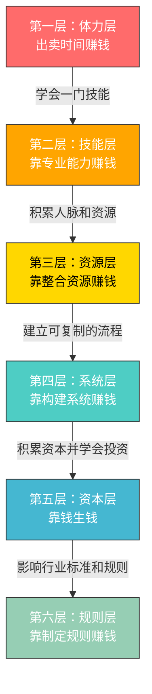
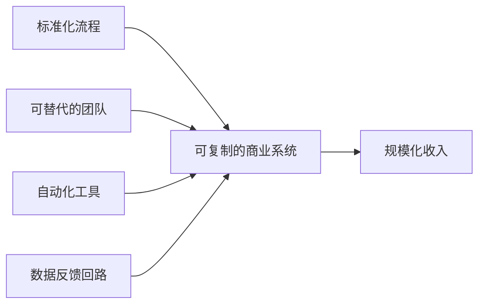

## 七、搞钱的认知升级路径

你赚不到认知之外的钱——这句话已经被说烂了，但大多数人对"认知"的理解停留在"知道更多事"的层面。事实上，搞钱领域的认知升级不是信息量的增加，而是**思维操作系统**的版本迭代。一个人从月入3000到月入30000，再到月入30万，每一次跃迁背后都是认知层级的质变，而非量变。

本节构建一个完整的认知升级框架，帮助你识别自己当前所处的认知层级，理解每一层级的瓶颈在哪里，以及如何系统性地突破到下一层。

### 7.1 为什么认知是搞钱的第一变量

#### 7.1.1 认知决定收入天花板

同样两个大学毕业生，A选择进入传统制造业做技术员，B选择进入互联网行业做产品经理。五年后，A月薪8000，B月薪30000。这不是能力差距，而是**赛道认知差距**——B在毕业时就知道互联网行业的薪资增长曲线远快于传统制造业。

再看一个更极端的例子：2015年，同样有10万元闲钱，甲存银行定期，乙买了比特币。到2021年，甲的存款变成约11.5万元（含利息），乙的资产超过300万元。这不是运气，而是对**新兴资产类别**的认知差距。

认知对收入的影响可以用一个公式来表达：

```text
实际收入 = 能力 × 认知系数 × 执行力 × 时代红利
```

其中认知系数是最关键的乘数。能力再强、执行力再高，如果认知系数为0（即选错了方向），结果也是0。而认知系数高的人，即使能力和执行力一般，也能借助趋势获得远超平均水平的回报。

#### 7.1.2 认知盲区的代价

认知盲区的代价不是"少赚了"，而是**根本不知道自己少赚了多少**。心理学上称之为"未知的未知"（Unknown Unknowns）——你不知道自己不知道什么。

以下是几个典型的认知盲区及其代价：

| 认知盲区 | 典型表现 | 代价估算 |
|---------|---------|---------|
| 不知道杠杆 | 只靠出卖时间赚钱 | 终身收入天花板 = 时薪 × 最大工作时间 |
| 不知道复利 | 月光或只存银行 | 错失30年复利，差距可达10-50倍 |
| 不知道信息差 | 等所有人都知道才行动 | 永远在红海中竞争，利润趋近于零 |
| 不知道系统 | 一个人单打独斗 | 收入上限 = 个人产出上限 |
| 不知道定价 | 只会打价格战 | 利润被压缩到生存线附近 |

最可怕的不是"不知道"，而是**不知道自己不知道**。一个从未接触过投资理财概念的人，不会觉得自己在"投资理财"上有盲区——他根本不会想到这个维度。这就是认知升级的第一步：意识到存在自己看不到的盲区。

#### 7.1.3 认知升级 vs 信息收集

很多人把"多看书、多听课、多关注行业资讯"等同于认知升级，这是一个根本性的误解。

| 维度 | 信息收集 | 认知升级 |
|------|---------|---------|
| 本质 | 增加数据量 | 改变处理数据的算法 |
| 问的问题 | "还有什么我不知道的？" | "我的思维框架哪里有问题？" |
| 结果 | 知道更多事实 | 看到之前看不到的关系 |
| 比喻 | 给硬盘扩容 | 给CPU升级 |
| 速度 | 线性增长 | 阶跃式突破 |
| 典型行为 | 刷资讯、收藏文章、报课 | 复盘、挑战假设、跨界迁移 |

真正的认知升级发生在一个时刻：**你突然意识到自己之前的某个核心假设是错的**。比如，一个人一直认为"赚钱就是多加班"，直到他发现有人用自动化工具一周完成他一个月的工作量——这时候他的"操作系统"需要更新了。

### 7.2 搞钱认知的六层模型

基于对大量搞钱案例的分析，我们提炼出搞钱认知的六层模型。每一层都有其典型特征、收入范围和突破瓶颈。



#### 7.2.1 第一层：体力层——出卖时间赚钱

**核心认知**：赚钱 = 工作时间 × 时薪

**典型人群**：工厂工人、外卖骑手、快递员、基础客服、保安

**收入范围**：月入2000-8000元

**思维特征**：
- 认为"多干就能多赚"
- 收入与体力投入直接挂钩
- 没有"睡后收入"的概念
- 用"忙"来衡量价值

**瓶颈分析**：这一层的根本问题是**没有杠杆**。一个人每天最多工作16小时，时薪有行业上限，所以收入天花板非常明确。更深层的问题是：处于这一层的人往往把"忙碌"等同于"努力"，把"努力"等同于"应该赚更多"，但市场不为努力付费，只为**价值**付费。

**突破关键**：意识到"时间是有限的，但技能的价值是可增长的"。开始投资自己学习一项市场需要的技能。

**案例**：张强，25岁，高中学历，在工厂做流水线工人，月薪4500。他发现同宿舍的工友下班后用手机剪辑短视频接单，一个月能多赚3000。张强花三个月自学了基础剪辑技能，开始在闲鱼和淘宝接单。半年后，他的剪辑副业收入超过了工厂工资，于是辞去工厂工作全职做视频剪辑。从"卖时间"到"卖技能"，他的月收入从4500提升到12000。

#### 7.2.2 第二层：技能层——靠专业能力赚钱

**核心认知**：赚钱 = 技能稀缺性 × 市场需求

**典型人群**：程序员、设计师、律师、医生、咨询师、高级技工

**收入范围**：月入8000-50000元

**思维特征**：
- 认为"把技术练到极致就能赚大钱"
- 关注个人能力的精进
- 有"一技之长"的意识
- 开始区分"低端技能"和"高端技能"

**瓶颈分析**：技能层的天花板是**个人产能上限**。一个优秀的程序员一天能写2000行代码，一个顶尖的律师一天能处理3个案件——无论如何精进，一个人的产出都有上限。更深层的问题是：技能层的人容易陷入"技术思维"，认为技术越好就该赚越多，但市场定价遵循的是**供需关系**而非技术难度。

**突破关键**：意识到"个人产出有上限，但通过整合资源可以突破这个上限"。开始思考如何让别人为自己工作，或者如何建立可复制的商业模式。

**案例**：李薇，28岁，平面设计师，在广告公司月薪15000。她的设计水平在公司数一数二，但涨薪空间有限。后来她开始在小红书分享设计教程，积累了5万粉丝。她把粉丝引流到私域，开设设计训练营，每人收费2999元，每期招收30人。一期训练营的收入就接近她两个月工资。关键转折点是她意识到：**同样的设计知识，卖给一个客户和卖给三十个客户，投入的时间差不多，但收入差30倍**。

#### 7.2.3 第三层：资源层——靠整合资源赚钱

**核心认知**：赚钱 = 连接效率 × 资源匹配度

**典型人群**：中介、经销商、猎头、MCN机构、供应链管理者

**收入范围**：月入30000-200000元

**思维特征**：
- 认为"不需要自己会做，只需要能整合会做的人"
- 关注信息差和资源差
- 开始建立人脉网络
- 理解"中间商"的价值

**瓶颈分析**：资源层的瓶颈是**信任成本和管理成本**。随着整合的资源越来越多，协调各方利益的难度指数级增长。一个房产中介可以同时管理20个客户，但200个客户就需要团队；一个猎头可以同时跟进10个候选人，但100个就需要系统化运营。更深层的问题是：资源层的收入高度依赖个人关系网络，一旦人脉断裂，收入也会断崖式下降。

**突破关键**：意识到"依赖个人关系的模式不可扩展，需要建立不依赖于任何个人（包括自己）的系统"。

**案例**：王磊，32岁，原来在房产中介做经纪人，月入2-3万（含佣金）。他发现很多小开发商有尾盘滞销的问题，而很多投资客在寻找低价房源。他建了一个微信群，把300多个投资客和20多个小开发商对接起来，每成交一套收取1%的服务费。第一年撮合成交47套，服务费收入超过80万。他不需要自己盖房子、不需要自己卖房子，只需要**让供需双方高效对接**。

#### 7.2.4 第四层：系统层——靠构建系统赚钱

**核心认知**：赚钱 = 系统效率 × 规模

**典型人群**：企业主、连锁品牌创始人、SaaS产品创业者、内容矩阵运营者

**收入范围**：月入10万-1000万（波动大）

**思维特征**：
- 认为"我要建一个能自动运转的系统"
- 关注流程标准化和可复制性
- 开始雇人、建团队
- 用数据驱动决策

**瓶颈分析**：系统层的核心挑战是**组织管理和现金流**。系统需要持续投入才能运转——员工工资、场地租金、营销费用，这些都是固定支出。很多创业者在这一层"赚了营收但没赚利润"，甚至"越做越大越缺钱"。另一个挑战是：创始人容易陷入"什么都自己管"的陷阱，成为系统的瓶颈而非推动者。

**突破关键**：学会放手，建立自运转的组织；同时将利润转化为资本，进入投资领域。

**系统层的四要素模型**：



**案例**：陈芳，35岁，原来是某连锁奶茶品牌的区域经理，月薪2万。她发现公司通过加盟模式实现了快速扩张——总部只需要维护品牌、供应链和培训体系，每个加盟店都是独立运转的"印钞机"。她辞职后，用积蓄在大学城开了一家特色饮品店，用了8个月打磨出标准化的运营手册（包括选址、装修、培训、供应链、营销的全套SOP）。第二年她开放加盟，到第三年发展了12家加盟店。每家加盟店收取3万加盟费+每月营业额5%的管理费。12家加盟店每月给她带来约6万的管理费收入，而她本人只需要3个人的团队来维护这套系统。

#### 7.2.5 第五层：资本层——靠钱生钱

**核心认知**：赚钱 = 资本规模 × 投资回报率 × 时间

**典型人群**：天使投资人、基金经理、房产投资组合持有者、股权投资者

**收入范围**：年入100万-上不封顶

**思维特征**：
- 认为"钱是最好的员工，24小时不休息"
- 关注资产配置和风险分散
- 理解复利的力量
- 用"机会成本"思考问题

**瓶颈分析**：资本层的瓶颈是**信息质量和决策纪律**。资本市场的信息极度不对称，一个错误的投资决策可能导致巨额亏损。此外，资本层的人容易过度自信，在连续成功后加大杠杆，一次黑天鹅事件就可能回到原点（参考2008年金融危机中大量对冲基金爆仓的案例）。

**突破关键**：建立系统化的投资决策框架，严格执行风控纪律，不追求暴利而追求长期稳定的复合回报。

**资本层的核心公式**：

```text
资产增值 = 本金 × (1 + 年化收益率)^年数 - 本金
```

| 本金 | 年化收益率 | 年数 | 最终资产 | 增值倍数 |
|------|-----------|------|---------|---------|
| 100万 | 8% | 10年 | 216万 | 2.16倍 |
| 100万 | 15% | 10年 | 405万 | 4.05倍 |
| 100万 | 8% | 20年 | 466万 | 4.66倍 |
| 100万 | 15% | 20年 | 1637万 | 16.37倍 |
| 100万 | 20% | 20年 | 3834万 | 38.34倍 |

注意看最后两行：年化收益率从15%提升到20%（只多了5个百分点），20年后的差距是3834万 vs 1637万——差了整整2200万。这就是复利的威力，也是为什么顶级投资者愿意花大量时间去提升哪怕1个百分点的年化收益率。

**案例**：赵明，40岁，前互联网公司高管，年薪80万+股票期权。他在工作期间积累了500万资产。辞职后，他没有创业，而是做了三件事：(1) 用200万配置了指数基金定投组合，预期年化10-12%；(2) 用200万投资了3个早期创业项目（每个50-80万），预期有一个能跑出来；(3) 用100万作为生活备用金和机会基金。他的策略是"不追求暴利，追求大概率的中等回报"。三年后，基金组合增值到280万，早期投资中有一个项目被收购，他获得了3倍回报（160万变480万）。总资产从500万增长到约900万，年化回报约22%。

#### 7.2.6 第六层：规则层——靠制定规则赚钱

**核心认知**：赚钱 = 控制关键节点 × 设计利益分配机制

**典型人群**：平台创始人、行业协会主导者、标准制定者、政策影响者

**收入范围**：上不封顶

**思维特征**：
- 认为"谁制定规则，谁就赢"
- 关注生态系统的构建
- 理解"平台比参与者更赚钱"
- 用"博弈论"思考利益分配

**瓶颈分析**：这一层的门槛极高，需要极强的资源整合能力、政策理解能力和时机把握能力。普通人很难直接进入这一层，但可以**借助规则层的力量**——比如选择在规则尚不完善的新兴领域率先建立标准。

**案例**：拼多多的黄峥不是在电商领域和淘宝正面竞争，而是在淘宝"忽略"的下沉市场重新定义了游戏规则——社交拼团、极致低价、游戏化购物。他不是在别人制定的规则里玩，而是自己创造了一套新规则。

### 7.3 认识你当前的认知层级

认知升级的前提是**准确定位自己当前的位置**。很多人高估了自己的认知层级——一个刚学会剪辑接单的人可能认为自己已经在"资源层"了，但实际上他还在"技能层"，因为他仍然是在出卖自己的时间（只不过时薪更高了）。

#### 7.3.1 自我诊断清单

回答以下问题，确定你当前的认知层级：

**体力层诊断**：
- [ ] 你的收入是否严格与工作时间成正比？
- [ ] 停止工作后收入是否立即归零？
- [ ] 你是否用"忙不忙"来衡量一天的价值？
- [ ] 你是否有"加班 = 多赚钱"的思维？

**技能层诊断**：
- [ ] 你是否有一项明确的、市场愿意付费的技能？
- [ ] 你的收入是否主要来自个人技能输出？
- [ ] 你是否在持续精进自己的专业能力？
- [ ] 你是否开始意识到"时间有上限"？

**资源层诊断**：
- [ ] 你是否经常为别人牵线搭桥并从中获益？
- [ ] 你的收入是否有一部分来自"连接"而非"亲自做"？
- [ ] 你是否有一个超过200人的有效人脉网络？
- [ ] 你是否理解"信息差"和"资源差"的价值？

**系统层诊断**：
- [ ] 你是否有一个可以不依赖你个人而运转的收入来源？
- [ ] 你是否在管理团队或合作伙伴？
- [ ] 你是否有标准化的流程和SOP？
- [ ] 你的收入是否与你的投入时间脱钩？

**资本层诊断**：
- [ ] 你的投资收益是否超过劳动收入？
- [ ] 你是否有系统的资产配置方案？
- [ ] 你是否用"机会成本"来做决策？
- [ ] 你是否理解并实践"复利"思维？

#### 7.3.2 常见的层级错觉

| 错觉 | 真相 | 实际层级 |
|------|------|---------|
| "我在做副业，已经是资源层了" | 副业仍然是出卖自己的时间 | 技能层 |
| "我是团队leader，已经在系统层了" | 离开你团队就散了 | 技能层（高级） |
| "我在做投资，已经是资本层了" | 还在用工资定投，投资收入占比<10% | 技能层（有资本意识） |
| "我有10个微信号，是资源层" | 粉丝/好友≠有效人脉 | 技能层（有资源意识） |
| "我是自由职业者，不受雇于人" | 仍然在按项目出卖时间 | 技能层 |

### 7.4 认知升级的具体路径

认知升级不是"读几本书"或"听几节课"就能完成的。它需要**思维模式的根本性转变**，而这种转变通常由三个要素驱动：足够的痛点（当前层级的瓶颈让你很痛苦）、新的认知输入（看到更高层级的人是怎么做的）、小规模的实践验证（在安全范围内尝试新方法）。

#### 7.4.1 从体力层到技能层：学会"卖技能"

**核心转变**：从"我有多少时间"到"我有什么技能"。

**具体步骤**：

**第一步：技能盘点**
列出你会的所有技能，按照"市场需求 × 你的擅长程度"打分。选择得分最高的1-2项作为主攻方向。

| 技能 | 市场需求(1-10) | 擅长程度(1-10) | 综合得分 |
|------|---------------|---------------|---------|
| Excel操作 | 7 | 8 | 56 |
| 视频剪辑 | 9 | 5 | 45 |
| 英语翻译 | 6 | 7 | 42 |
| PPT设计 | 8 | 6 | 48 |

**第二步：快速达到"及格线"**
不需要成为专家，只需要达到能接单赚钱的及格水平。通常需要100-200小时的刻意练习。以视频剪辑为例：
- 前20小时：学习基础操作（剪切、拼接、转场、字幕）
- 20-50小时：学习调色、音效、节奏感
- 50-100小时：临摹优秀作品，形成自己的风格
- 100-200小时：接真实项目，在实战中提升

**第三步：建立接单渠道**
- 平台接单：猪八戒网、闲鱼、淘宝、小红书
- 社群接单：加入目标行业的微信群、QQ群
- 内容引流：在抖音/B站/小红书分享作品和教程
- 口碑转介绍：服务好每一个客户，让他们帮你介绍

**第四步：提价策略**
- 初期低价接单积累案例和评价（1-3个月）
- 中期用案例证明能力，逐步提价（3-6个月）
- 后期筛选高价客户，拒绝低价单（6个月以后）

#### 7.4.2 从技能层到资源层：学会"整合"

**核心转变**：从"我能做什么"到"我能整合什么"。

**具体步骤**：

**第一步：建立"资源地图"**
把你所在领域或相关领域的资源方画出来：谁有客户？谁有产品？谁有渠道？谁有技术？谁有资金？

**第二步：找到"连接点"**
资源层的核心能力是**发现供需错配**。你不需要拥有资源，只需要知道"谁需要什么"和"谁有什么"。

**第三步：从最小撮合开始**
先撮合1-2个交易，验证你的"连接"是否有价值。每撮合成功一次，你的信息网络就扩大一次——买家会告诉你他还需要什么，卖家会告诉你他还能提供什么。

**第四步：建立系统化的对接机制**
当你手动撮合到一定量级（比如每月10单以上），就需要建立系统化的对接机制——微信群、小程序、公众号、邮件列表等。

#### 7.4.3 从资源层到系统层：学会"建系统"

**核心转变**：从"我来连接"到"系统自动连接"。

**具体步骤**：

**第一步：标准化你的核心流程**
把你的业务拆解为5-10个关键步骤，每个步骤都写出标准操作流程（SOP）。一个好的测试方法是：如果你离开一个月，团队能否按照SOP把业务正常运转下去？

**第二步：培养可替代的执行者**
找到能执行SOP的人，训练他们。关键原则是**"培养人，而不是依赖人"**——好的系统不应该因为任何一个人的离开而停摆。

**第三步：引入自动化工具**
把能自动化的环节全部自动化：客户管理用CRM、财务记账用会计软件、营销触达用邮件自动化、数据分析用BI工具。

**第四步：建立数据反馈回路**
系统运转后，需要持续监控关键指标：获客成本、转化率、复购率、利润率。用数据驱动优化决策。

#### 7.4.4 从系统层到资本层：学会"钱生钱"

**核心转变**：从"我建系统赚钱"到"让钱去建更多系统"。

**具体步骤**：

**第一步：积累"种子资本"**
从系统层的利润中拿出固定比例（建议30-50%）作为投资本金。

**第二步：建立投资知识体系**
- 学习资产配置的基本理论（股票、债券、房产、另类资产）
- 理解风险与收益的关系
- 掌握基本的财务分析方法
- 推荐入门读物：《聪明的投资者》《漫步华尔街》《穷查理宝典》

**第三步：从小额实践开始**
- 第一年：用10%的投资本金做实验，验证你的投资策略
- 第二年：如果策略有效，逐步加大投入
- 第三年：形成稳定的投资体系

**第四步：分散配置，严控风险**
- 不把所有资金放在一个篮子里
- 设定止损线和止盈线
- 不用杠杆（至少在前3-5年）
- 保持足够的现金储备（至少6个月生活费）

### 7.5 认知升级的五个加速器

除了理解层级模型和升级路径，还有五个方法可以加速你的认知升级。

#### 7.5.1 向上社交：接触更高层级的人

你的认知水平约等于你最常接触的5个人的平均水平。如果你身边都是月薪5000的人，你很难理解月入5万的人是怎么思考的。

**具体方法**：
- 加入付费社群（门槛越高，成员质量越高）
- 参加行业峰会和线下活动
- 在内容平台上主动连接目标层级的人
- 为比你厉害的人提供价值（帮忙、介绍资源、做内容传播）

**注意事项**：向上社交的核心不是"加微信"，而是**建立互利关系**。单方面索取不会持久，你需要找到自己能为对方提供的价值。

#### 7.5.2 逆向工程：拆解成功案例

不要只看成功案例的结果，要**逆向推导**整个过程。

**拆解框架**：

```text
1. 起点分析：这个人开始时有什么？（资源、技能、人脉、资金）
2. 关键转折：是什么事件或决策导致了质变？
3. 可复制部分：哪些因素是普通人也能具备的？
4. 不可复制部分：哪些因素依赖运气、背景或时机？
5. 底层规律：抛开个案，背后的普遍规律是什么？
```

**案例**：拆解"李佳琦从月薪3000柜哥到年入过亿"——

| 维度 | 内容 | 可复制性 |
|------|------|---------|
| 起点 | 化妆品专柜BA，了解产品和消费者 | 高（任何销售岗位都可以积累） |
| 关键转折 | 2018年淘宝直播邀请参加挑战赛 | 中（需要主动争取平台机会） |
| 核心能力 | 极强的表现力、感染力、选品能力 | 低（天赋+长期训练） |
| 外部条件 | 淘宝直播流量红利期 | 低（时机不可复制） |
| 底层规律 | 在新渠道红利期用差异化内容抢占注意力 | 高（适用于任何新渠道） |

可复制的规律：**当新平台/新渠道出现时，早期入局者享受流量红利**。这个规律可以迁移到任何新平台——抖音早期、小红书早期、视频号早期，每个平台的先行者都获得了超额回报。

#### 7.5.3 跨界迁移：从其他领域借鉴模式

很多搞钱的创新来自**跨界迁移**——把A领域验证过的模式搬到B领域。

**经典跨界迁移案例**：

| 源领域 | 目标领域 | 迁移内容 | 结果 |
|--------|---------|---------|------|
| 订阅制（Netflix） | 咖啡（瑞幸） | 月卡/季卡订阅模式 | 用户复购率提升40% |
| 游戏化（网游） | 电商（拼多多） | 砍一刀、签到、抽奖 | 用户活跃度翻倍 |
| 快时尚（ZARA） | 餐饮（海底捞） | 快速迭代菜单、限时菜品 | 客户新鲜感持续 |
| SaaS订阅 | 教育（知识付费） | 会员制课程平台 | 持续稳定的现金流 |
| 众筹（Kickstarter） | 房产（合伙买房） | 多人出资、共享收益 | 降低投资门槛 |

**如何练习跨界迁移**：
1. 每周研究一个你不熟悉的行业案例
2. 思考"这个模式的核心逻辑是什么？"
3. 问自己"这个逻辑能应用到我所在的领域吗？"
4. 如果能，设计一个最小化验证方案

#### 7.5.4 反面学习：从失败案例中提取教训

成功的因素千差万别，但失败的原因高度集中。从失败案例中学习，效率远高于从成功案例中学习。

**搞钱失败的七大常见原因**：

1. **过度自信**：连续成功后加大杠杆，一次失败回到原点
2. **沉没成本谬误**：明知方向错了，但因为已经投入太多而不愿止损
3. **跟风从众**：看到别人赚钱就跟进去，进去时已经是红海
4. **忽视现金流**：账面赚钱但现金流断裂，死在"盈利"的路上
5. **单点依赖**：所有收入来源依赖一个客户/一个平台/一个产品
6. **低估竞争**：以为自己发现了一个蓝海，其实别人已经试过了并且失败了
7. **合规风险**：为了短期利益忽视法律和合规要求，最终付出更大代价

**建立"失败案例库"**：专门收集和分析失败案例，建立一个"我绝对不能犯的错误"清单。每次要做重大决策前，先检查这个清单。

#### 7.5.5 实践复盘：从自己的经验中学习

理论学习和案例分析都是输入，但最深刻的认知升级来自**自己的实践和复盘**。

**复盘的ORID框架**：

| 层级 | 问题 | 示例 |
|------|------|------|
| O（事实） | 发生了什么？ | "这个月做了20单，总营收15000元" |
| R（感受） | 我的感受是什么？ | "前10单很兴奋，后10单开始疲惫" |
| I（洞察） | 我学到了什么？ | "单价太低的单子性价比很差，消耗精力但收入少" |
| D（行动） | 下一步怎么做？ | "提高最低接单价到800元，放弃低价单" |

**复盘频率建议**：
- 每日：5分钟快速复盘（今天最重要的3件事和1个教训）
- 每周：30分钟深度复盘（本周的目标完成度和关键发现）
- 每月：2小时战略复盘（月度目标、收入结构、方向调整）
- 每季：半天年度审视（认知层级评估、方向确认、目标重设）

### 7.6 认知升级的常见陷阱

认知升级的路上有很多坑，以下是最高频的五个陷阱。

#### 7.6.1 陷阱一：认知升级 = 学更多知识

**症状**：疯狂报课、买书、收藏文章，但收入没有变化。
**本质**：用"学习的忙碌感"代替"行动的不适感"。学100个小时比实际去做1个小时舒服得多。
**解法**：每学一个新概念，立刻设计一个24小时内可以执行的最小行动。学到"个人品牌很重要"，当天就注册一个账号开始发内容。

#### 7.6.2 陷阱二：跳级思维

**症状**：技能层还没站稳就想搞资本层，月入5000就想学投资。
**本质**：高估了自己的实际层级，低估了每一层的深度。
**解法**：在当前层级做到**同层级前10%**再考虑升级。一个在技能层做到前10%的人（月入3-5万），比一个"什么都知道一点"但什么都不精通的人，升级到资源层的概率大得多。

#### 7.6.3 陷阱三：路径依赖

**症状**：在A领域成功后，用同样的方法去做B领域，结果失败。
**本质**：把特定领域的成功经验错误地泛化为普遍规律。
**解法**：区分"底层规律"和"具体方法"。底层规律（比如"供需决定价格"）是普遍适用的，但具体方法（比如"在淘宝卖女装的定价策略"）有严格的适用条件。

#### 7.6.4 陷阱四：认知傲慢

**症状**：觉得自己"认知很高"，看不起低层级的人，不愿意做"低端"的事。
**本质**：用认知优越感代替实际行动。真正的高手知道"知道"和"做到"之间有巨大的鸿沟。
**解法**：用收入验证认知。如果你的认知真的很高，收入应该能体现出来。如果认知和收入严重不匹配，问题不在市场，在于你的认知只是"纸上谈兵"。

#### 7.6.5 陷阱五：忽略时代变量

**症状**：用过去10年的经验指导未来10年的行动。
**本质**：没有意识到技术变革和市场变化会重写规则。
**解法**：每半年做一次"时代变量审视"——AI、政策、人口结构、消费习惯等领域发生了哪些重大变化？这些变化对你的搞钱路径有什么影响？

### 7.7 AI时代认知升级的新维度

2023年以来，大语言模型（LLM）的爆发正在重新定义"能力"和"价值"的含义。很多过去需要专业技能才能完成的工作，现在AI可以在几秒内完成。这对认知升级提出了新的要求。

#### 7.7.1 AI对六层模型的冲击

| 层级 | AI的冲击程度 | 具体影响 |
|------|------------|---------|
| 体力层 | 高 | 自动化和机器人正在替代重复性体力劳动 |
| 技能层 | 极高 | 基础编程、设计、翻译、写作等技能被AI大幅提效 |
| 资源层 | 中 | AI提升信息匹配效率，但人际关系仍有不可替代性 |
| 系统层 | 高 | AI降低构建系统的成本和门槛 |
| 资本层 | 中高 | AI辅助投资决策，量化交易普及化 |
| 规则层 | 低 | 制定规则仍需人类的战略判断和政治智慧 |

#### 7.7.2 AI时代的认知升级策略

**策略一：从"会做"到"会指挥AI做"**
过去值钱的是"我能写代码"，现在值钱的是"我能定义问题并指挥AI写出正确的代码"。核心能力从执行转向**定义问题、评估质量、整合结果**。

**策略二：深耕AI无法替代的领域**
AI目前难以替代的能力包括：复杂人际关系的建立和维护、跨领域的创造性整合、高风险高不确定性的战略决策、深度的共情和信任建立。

**策略三：用AI降低每一层的升级门槛**
- 技能层：用AI加速学习，3个月达到过去1年才能达到的水平
- 资源层：用AI做信息匹配和初步筛选，把精力留给高价值的人际互动
- 系统层：用AI构建MVP，降低创业的试错成本
- 资本层：用AI辅助分析和决策，但最终判断仍需人类

### 7.8 本节核心要点

1. **认知是搞钱的第一变量**：能力 × 认知系数 × 执行力 × 时代红利，认知系数是关键乘数
2. **搞钱认知分六层**：体力层→技能层→资源层→系统层→资本层→规则层，每一层都有明确的瓶颈和突破方法
3. **准确定位自己**：不要高估自己的认知层级，用收入和结构来验证
4. **每一层的突破都有具体路径**：不是空洞的"提升认知"，而是有可执行的步骤
5. **五个加速器**：向上社交、逆向工程、跨界迁移、反面学习、实践复盘
6. **五个陷阱**：用学习代替行动、跳级、路径依赖、认知傲慢、忽略时代变量
7. **AI正在重写规则**：从"会做"转向"会指挥"，深耕AI无法替代的领域
8. **认知升级的核心标志**：你的核心假设被推翻了，你看到了之前看不到的东西

认知升级不是一蹴而就的。它是一个螺旋上升的过程：每次突破一个层级，你就会看到更广阔的世界，发现自己有更多的未知，然后继续升级。这个过程没有终点，但每一步都让你离"用正确的方式赚到足够的钱"更近一步。
