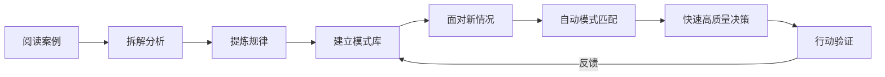

## 八、案例学习的系统化方法

案例学习是最古老的商业智慧传承方式，从古代商帮的"生意经"口口相传，到今天商学院的案例教学法，核心逻辑从未改变——**通过他人的经历，压缩自己的认知升级周期**。但同样是读案例，有人读完只是"知道了一个故事"，有人却能提炼出可复用的商业规律。差距不在智商，而在方法。

本章将案例学习拆解为一套可操作的系统：从案例库的搭建、分析框架的建立、到从案例中提炼行动方案的完整流程，帮助你把零散的案例阅读变成结构化的认知资产。

### 8.1 案例学习的底层逻辑

#### 8.1.1 为什么案例学习有效

案例学习的有效性有坚实的认知科学基础：

**认知心理学视角：** 人类大脑天然擅长处理具体叙事，而非抽象概念。心理学家Jerome Bruner的研究表明，以叙事形式（故事模式）呈现的信息，比以逻辑-命题形式呈现的信息记忆留存率高22倍。案例本质上就是一个结构化的商业叙事，它同时激活了大脑的逻辑分析区和情感共鸣区，形成更深刻的记忆编码。

**经验学习理论：** David Kolb的经验学习循环（具体经验→反思观察→抽象概括→主动实验）是案例学习的理论骨架。阅读案例是"具体经验"阶段，拆解分析是"反思观察"阶段，提炼规律是"抽象概括"阶段，付诸行动是"主动实验"阶段。大多数人的案例学习只完成了前两步，缺少了最关键的后两步。

**模式识别理论：** 国际象棋大师能同时观察40+棋子的位置关系，而新手只能逐个棋子分析。这不是天赋差异，而是长期模式积累的结果。案例学习的终极目标就是建立商业领域的"模式库"——当你见过足够多的创业路径、商业模式、失败陷阱后，面对新情况时大脑会自动调取相似模式进行比对，决策速度和质量都会显著提升。



#### 8.1.2 案例学习 vs 其他学习方式

| 维度 | 案例学习 | 理论学习 | 实践学习 |
|------|---------|---------|---------|
| 学习速度 | 中等 | 快 | 慢 |
| 知识深度 | 深 | 浅到中 | 最深 |
| 试错成本 | 低 | 无 | 高 |
| 可迁移性 | 强 | 强 | 弱（依赖具体场景） |
| 记忆留存率 | 高（叙事记忆） | 低（语义记忆） | 最高（肌肉记忆） |
| 适用阶段 | 全阶段 | 入门 | 进阶 |
| 风险 | 中等（归因偏差） | 低 | 高 |

最优策略是三者结合：**理论建框架→案例填血肉→实践验真伪**。本章聚焦案例学习这一环节，但要记住它不是孤立的。

#### 8.1.3 案例学习的复利效应

案例学习不是一次性活动，而是持续积累的过程。每读一个案例，你的模式库就多一个"参照物"。随着案例库扩大，你会形成四种核心能力：

1. **模式识别能力**：快速识别相似的商业逻辑。别人看到的是一个新项目，你看到的是"这不就是2015年XX的翻版吗"
2. **风险预判能力**：提前识别潜在的风险点。知道某个模式在历史上10次有7次失败，你就会更谨慎
3. **机会发现能力**：从不同案例的交叉中发现新的组合机会。A行业的成功模式移植到B行业，可能就是蓝海
4. **决策质量提升**：基于更多参照系做出更好的决策。不是拍脑袋，而是"历史上类似情况，采取XX策略的成功率更高"

这就是复利效应：**看得越多，理解越深，判断越准**。前100个案例可能感觉收获不大，但第101个案例开始，你会发现越来越多的"原来如此"时刻。

### 8.2 建立案例库：从零散到系统

#### 8.2.1 案例收集渠道

有效的案例收集需要多渠道、持续性地进行：

**一级渠道（高质量、深度信息）：**
- **商业传记和企业史**：如《鞋狗》（耐克创始人自传）、《腾讯传》《创业维艰》等。这类资料信息密度最高，通常包含创始人心路历程、关键决策的思考过程
- **商学院案例库**：哈佛商学院案例（HBS Case Studies）、长江商学院案例中心等。经过学术筛选，分析框架成熟
- **上市公司年报和招股书**：最真实的一手数据。招股书中的"业务与技术""风险因素"章节是了解行业和商业模式的宝矿

**二级渠道（中等质量、覆盖面广）：**
- **商业媒体深度报道**：36氪深度、虎嗅特稿、晚点LatePost、The Information等。时效性强，但需要甄别信息准确性
- **行业研究报告**：艾瑞咨询、易观分析、CB Insights、a16z发布的行业趋势报告。数据丰富，适合做行业级案例分析
- **创业者访谈和播客**：如《创业内幕》《疯投圈》《How I Built This》。能听到当事人的真实思考过程

**三级渠道（补充视角、真实接地气）：**
- **创业社区和论坛**：即刻、小红书创业板块、Reddit的r/Entrepreneur、Indie Hackers。草根创业者的真实分享，往往更接地气
- **身边的真实案例**：朋友、同学、前同事的创业经历。信息最真实，但样本有限
- **失败案例库**：CB Insights的"Startup Post-Mortems"、国内的"创业失败说"。失败案例的价值往往被低估

#### 8.2.2 案例分类体系

建立案例库的关键是分类体系。好的分类让你在需要时能快速找到相关案例。建议采用多维标签体系：

**按行业分类：**
- 科技（互联网、AI、SaaS、硬件）
- 消费（餐饮、零售、电商、新消费品牌）
- 服务（教育、医疗、金融、企业服务）
- 制造（传统制造、智能制造、供应链）

**按商业模式分类：**
- 平台模式（双边市场、多边市场）
- 订阅模式（SaaS、会员制、内容订阅）
- 交易模式（电商、经纪、撮合）
- 广告模式（流量变现、内容变现）
- 授权模式（IP授权、品牌授权、技术授权）

**按搞钱路径分类：**
- 创业型（从0到1建立企业）
- 投资型（通过资本增值获利）
- 副业型（在职期间的额外收入）
- 自由职业型（个人技能变现）
- 套利型（利用信息差、时间差、地域差获利）

**按结果分类：**
- 成功案例（可学习正面经验）
- 失败案例（可学习避坑经验）
- 转型案例（可学习应变能力）
- 平庸案例（可学习为什么不温不火的原因）

**按规模分类：**
- 个体户/微型（年收入<100万）
- 小型企业（年收入100万-1000万）
- 中型企业（年收入1000万-1亿）
- 大型企业（年收入>1亿）

#### 8.2.3 案例存储工具

| 工具 | 适合场景 | 优势 | 劣势 |
|------|---------|------|------|
| Notion数据库 | 个人案例库 | 多视图、标签系统强大、支持关联 | 需要付费，国内访问偶尔不稳 |
| 飞书多维表格 | 团队协作 | 免费、协作方便、支持自动化 | 模板灵活性稍弱 |
| Obsidian+Dataview | 知识管理爱好者 | 本地存储、双向链接、完全掌控 | 学习曲线较陡 |
| Excel/WPS表格 | 快速起步 | 零学习成本、随时可用 | 不支持富文本、关联性弱 |
| 自建数据库 | 技术型用户 | 完全自定义、可编程 | 需要开发和维护能力 |

**推荐方案：** 大多数人从Excel或Notion起步即可。当案例数量超过200个时，再考虑迁移到更专业的系统。工具不重要，持续积累才重要。

### 8.3 案例拆解框架：从故事到规律

#### 8.3.1 基础拆解模板

每个案例都应按照统一框架进行拆解，确保分析的完整性和可比性：

**第一层：基本信息**
- 人物背景：年龄、学历、职业经历、初始资源（资金/人脉/技能/认知）
- 时间跨度：从开始到出结果用了多久
- 所在行业和赛道：具体到细分赛道，越细越好
- 时代背景：案例发生时的宏观经济、政策环境、技术条件

**第二层：搞钱路径**
- 起点状态：初始资金、核心资源、面临的主要约束
- 关键决策：做了哪些重要选择？为什么这样选？
- 关键行动：具体做了什么？执行细节是什么？
- 转折点：哪些节点决定了成败？当时发生了什么？
- 最终结果：量化数据（收入/利润/用户量/估值）

**第三层：成败因素分析**
- 主观因素：能力、决策质量、执行力、学习速度
- 客观因素：时机、运气、市场环境、政策红利
- 可复制因素：哪些是可以学习和模仿的
- 不可复制因素：哪些依赖于特定条件（天赋、家境、时代）

**第四层：可迁移启示**
- 底层规律：这个案例反映了什么商业本质？
- 适用边界：在什么条件下这个规律成立？
- 行动指南：结合自身情况，可以怎么借鉴？

#### 8.3.2 进阶分析维度

在基础模板之上，加入以下维度可以让分析更深入：

**时机分析：** 案例主角进入的时间窗口有多宽？早一年或晚一年会怎样？这个维度能帮你判断"现在做类似的事还有没有机会"。

- 时间窗口宽度：这个机会存在了多久？是昙花一现还是持续数年？
- 先发优势大小：先做的人获得了什么壁垒？后来者还有没有机会？
- 周期位置：当时处于行业的上升期、平台期还是下降期？

**资源杠杆分析：** 案例主角用了哪些杠杆放大了自己的能力？

- 资本杠杆：是否借助了外部资金？融资节奏如何？
- 人力杠杆：团队规模变化？关键人才的作用？
- 技术杠杆：技术优势有多大？壁垒有多高？
- 平台杠杆：是否借助了某个平台的红利（淘宝、微信、抖音）？
- 品牌杠杆：品牌溢价能力如何？口碑传播效果？

**竞争格局分析：** 当时的市场环境是什么样的？

- 市场集中度：是蓝海还是红海？头部玩家是谁？
- 差异化空间：案例主角的差异化策略是什么？
- 壁垒构建：做了哪些事来建立竞争壁垒？

**规模化路径分析：** 从起步到规模化经历了哪些阶段？

- PMF验证阶段：如何确认产品市场匹配？
- 增长引擎：靠什么实现增长？（付费获客/口碑传播/内容营销/渠道合作）
- 规模化瓶颈：遇到了什么瓶颈？如何突破的？

#### 8.3.3 案例拆解实例

以下用一个完整的拆解示例展示框架的实际应用：

**案例：某社区团购创业者的搞钱路径**

```text
【基本信息】
人物：张强（化名），32岁，前快消品区域销售经理
时间：2020年3月-2022年6月
行业：社区团购/生鲜电商
时代背景：疫情初期，社区团购赛道爆发，资本大量涌入

【搞钱路径】
起点状态：
- 初始资金：15万（个人积蓄）
- 核心资源：5年快消品行业经验，熟悉供应链和渠道管理
- 面临约束：没有技术团队，没有互联网运营经验

关键决策：
1. 选择了自己熟悉的社区（而非整个城市），降低了履约复杂度
2. 以微信群+小程序的轻模式起步（而非自建APP）
3. 与本地批发市场建立独家供货关系，拿到了比大平台更有竞争力的价格

关键行动：
- 第1个月：在3个小区建立微信群，通过地推+裂变拉了800人
- 第2-3个月：日均GMV从500元增长到3000元，验证了模型
- 第4-6个月：扩展到12个小区，日均GMV达到1.5万
- 第7-12个月：建立了自己的分拣仓，雇佣了3个配送员
- 第13-24个月：美团优选、多多买菜等巨头入场，价格战开始

转折点：
- 正面转折：疫情期间日均GMV峰值达到8万，积累了忠实用户
- 负面转折：巨头入场后，用户被低价补贴吸引流失，毛利率从25%压到8%

最终结果：
- 巅峰期月GMV约50万，月净利润约4万
- 巨头价格战后月GMV下降到20万，月净利润不足1万
- 2022年6月转型为社区生鲜店，线上转线下

【成败因素分析】
主观因素（可复制）：
- 对供应链的深刻理解，能拿到优质低价货源
- 社群运营能力强，用户活跃度高
- 选择社区而非城市的聚焦策略

客观因素（部分可复制）：
- 疫情红利带来的需求爆发
- 当地没有强势竞争者的窗口期

不可复制因素：
- 特定时期的市场真空
- 巨头入场的时间节奏

【可迁移启示】
底层规律：小玩家的机会窗口通常在行业爆发初期，巨头尚未覆盖的缝隙市场
适用边界：这个路径在资本密集型行业中尤其明显，巨头一旦入场，小玩家的生存空间会被快速压缩
行动指南：
1. 如果要在一个巨头可能入场的赛道创业，必须在窗口期内建立不可替代的本地化优势
2. 纯线上模式的壁垒太低，考虑线上+线下的组合模式
3. 供应链能力比流量运营能力更持久
```

### 8.4 从案例到行动的转化方法

#### 8.4.1 六步转化流程

案例学习的最终目的是指导行动。以下是系统化的转化流程：

**第一步：信息收集——建立案例池**

针对你想解决的问题或想进入的领域，收集10-20个相关案例。数量要足够形成统计意义上的模式，但不要贪多导致分析深度不足。

收集时注意三个原则：
- **多样性原则**：成功和失败案例都要收集，建议比例6:4
- **时效性原则**：优先收集近5年的案例，但经典案例不受时间限制
- **可比性原则**：案例主角的初始条件与你越相似，借鉴价值越高

**第二步：模式识别——找共同点**

将收集到的案例并排放在一起，用"对比分析法"寻找共性：

- 成功案例有哪些共同点？（共性特征）
- 失败案例有哪些共同点？（共同陷阱）
- 成功案例之间的差异是什么？（多种成功路径）
- 成功和失败案例之间的关键差异是什么？（决定性因素）

制作一张对比表，将关键变量（初始资金、行业选择、核心能力、关键决策、时间窗口）横轴排列，每个案例纵轴排列，差异一目了然。

**第三步：规律提炼——从现象到本质**

从共性中提炼规律时，问自己三个问题：

1. **这个共性是因果关系还是相关关系？** 比如"成功创业者都早起"是相关关系而非因果关系，不要误把相关当因果
2. **这个规律的适用边界是什么？** 没有放之四海而准的规律，每条规律都有适用条件
3. **反面案例是否推翻了这个规律？** 如果有反例，说明规律还不够精确，需要加上更多限定条件

**第四步：方案设计——结合自身情况**

将提炼的规律转化为个人行动方案时，做一次"条件匹配分析"：

- 案例主角具备的条件，我具备哪些？缺少哪些？
- 缺少的条件能否弥补？弥补成本有多高？
- 我有哪些案例主角不具备的优势？
- 根据我的条件差异，方案需要做哪些调整？

**第五步：小步验证——最小成本试错**

不要一步到位全面执行，而是设计一个"最小可行验证"（Minimum Viable Test）：

- 选择方案中风险最高、不确定性最大的假设
- 用最小的成本和最短的时间去验证这个假设
- 设定明确的验证标准：达到什么数据算验证通过？低于什么数据算验证失败？
- 验证周期不超过2-4周

**第六步：迭代优化——反馈驱动调整**

根据验证结果进行调整：

- 验证通过 → 进入下一步，验证下一个假设
- 验证失败 → 分析失败原因，是方案问题还是执行问题？调整后重新验证
- 部分通过 → 保留有效的部分，修改无效的部分

#### 8.4.2 案例对比分析法

当你在两个或多个选择之间犹豫时，案例对比分析法特别有用：

**操作步骤：**

1. **确定决策变量**：列出影响你决策的关键因素（如投入成本、预期回报、风险等级、个人匹配度、学习曲线）
2. **寻找对比案例**：每个选项至少找3个案例
3. **制作对比矩阵**：将每个案例在各变量上的表现量化打分（1-10分）
4. **加权计算**：根据你对各变量的重视程度分配权重，计算加权总分
5. **敏感性分析**：调整权重看结论是否变化，如果结论对权重很敏感，说明你对这个决策还不够确定

**示例：副业选择对比**

| 决策变量 | 权重 | 选项A：自媒体 | 选项B：电商 | 选项C：技术咨询 |
|---------|------|-------------|-----------|--------------|
| 启动成本 | 20% | 9（几乎为零） | 5（需要库存） | 8（几乎为零） |
| 时间投入 | 25% | 6（持续产出） | 7（前期密集） | 5（按项目波动） |
| 收入上限 | 15% | 8（头部效应强） | 7（可规模化） | 6（受限于时间） |
| 风险等级 | 20% | 8（低风险） | 4（库存风险） | 9（几乎无风险） |
| 个人匹配 | 20% | 7（看个人） | 6（看选品） | 9（直接用技能） |
| **加权总分** | 100% | **7.5** | **5.8** | **7.4** |

这个表格只是决策参考，不是最终答案。每个选项的分数需要基于实际案例数据而非想象。

#### 8.4.3 案例学习的"行动清单"模板

每次完成一个案例的深度分析后，强制自己填写以下模板：

```text
案例名称：_______________
分析日期：_______________

1. 我从这个案例中学到的最重要的3件事：
   - 
   - 
   - 

2. 这个案例中有哪些做法我可以直接借鉴？
   - 
   - 

3. 这个案例中有哪些坑我可以提前避开？
   - 
   - 

4. 基于这个案例，我接下来要做的1个具体行动是什么？
   行动：_______________
   截止日期：_______________
   验证标准：_______________
```

这个模板的价值在于强制转化。没有行动清单的案例学习，本质上只是在消费信息，而非积累认知资产。

### 8.5 案例分析的常见误区与纠正

#### 8.5.1 幸存者偏差——只看成功案例

**表现：** 只研究成功者的路径，忽视了大量走同样路径但失败的人。读了10个成功的创业故事，就认为创业成功率很高。

**纠正方法：**
- 主动搜索失败案例，尤其是与成功案例同行业、同时期、同模式的失败案例
- 建立"反事实思维"：如果没有XX因素，这个案例还会成功吗？
- 参考基准成功率：中国创业企业5年存活率不到7%，即使你学习了所有成功案例，成功率也只是从7%提高到15-20%，而非100%

#### 8.5.2 简单归因——把多因素结果归结为单一原因

**表现：** "他成功是因为抓住了风口""他失败是因为产品不好"。现实中的商业成败几乎从来不是单一因素导致的。

**纠正方法：**
- 使用"五因素归因法"：每个案例至少找出5个影响因素，按影响力排序
- 区分必要条件和充分条件：好产品可能是成功的必要条件，但不是充分条件
- 考虑交互效应：因素之间可能存在协同或对冲关系

#### 8.5.3 时代错位——忽视时间背景

**表现：** 把2015年的成功经验直接套用到2025年。比如"当年做淘宝客月入十万"的经验在今天的淘宝生态中几乎完全失效。

**纠正方法：**
- 每个案例都标注时代背景：当时的宏观经济、行业阶段、技术条件、政策环境
- 做"时代变量替换"练习：假设把案例放到今天重做，哪些环节会不同？
- 关注"不变的本质"而非"变化的表象"：流量获取的具体渠道一直在变，但"低成本获取精准流量"的底层能力永远有价值

#### 8.5.4 过度自信——看了就会，会了就能做

**表现：** 看了案例觉得"这也不难嘛"，忽视了案例主角的隐性优势和执行中的无数细节。

**纠正方法：**
- 做"隐性因素排查"：列出案例主角可能拥有但没有明确提到的优势（人脉、资金储备、行业认知、失败经验）
- 估算"隐性学习时间"：案例呈现的是浓缩后的精华路径，背后往往是数年的试错积累
- 先做最小验证再下判断：不要基于阅读感受做判断，用实际数据说话

#### 8.5.5 确认偏误——只看到支持自己观点的证据

**表现：** 已经有了某个想法，然后只关注支持这个想法的案例，忽视甚至排斥反面证据。

**纠正方法：**
- 刻意寻找"反面案例"：如果你认为"做自媒体一定能赚钱"，主动搜索"自媒体失败"的案例
- 使用"魔鬼代言人"技巧：强制自己为反面观点辩护3分钟
- 建立"红队思维"：在做重大决策前，找一个信任的人专门挑毛病

#### 8.5.6 静态思维——忽视动态演变

**表现：** 把案例当作固定不变的"标准答案"，忽视了商业环境是持续变化的。

**纠正方法：**
- 关注案例的"后续发展"：案例主角3年后、5年后怎么样了？
- 建立"动态跟踪"习惯：定期更新案例库中重要案例的最新状态
- 区分"快变量"和"慢变量"：技术、平台规则是快变量（变化快），人性需求、商业本质是慢变量（变化慢）。重点学习慢变量相关的规律

### 8.6 高效案例学习的实操技巧

#### 8.6.1 批量阅读法

不要一个一个案例慢慢读，而是采用"批量阅读→集中分析"的方式：

1. **第一遍快速浏览**（每个案例15-20分钟）：了解基本情况，标注值得深入的案例
2. **第二遍深度拆解**（每个值得深入的案例1-2小时）：使用拆解框架做详细分析
3. **第三遍交叉对比**（2-3小时）：将所有深度拆解的案例放在一起做对比分析

这种"粗读→精读→对比"的三遍法，效率远高于逐个案例精读。

#### 8.6.2 "案例卡片"法

为每个案例制作一张标准化的案例卡片，积累到一定数量后可以像扑克牌一样"洗牌"对比：

```text
┌─────────────────────────────────────────┐
│ 案例卡片 #042                           │
│ 标题：社区团购创业者张强                 │
│ 行业：社区团购 | 时间：2020-2022        │
│ 模式：社群+本地供应链                    │
│ 结果：转型 | 评级：★★★☆☆              │
├─────────────────────────────────────────┤
│ 核心策略：聚焦社区，深耕供应链           │
│ 关键成功因素：本地化供应链优势           │
│ 关键失败因素：无法抵御巨头价格战         │
│ 一句话启示：小玩家要在巨头缝隙中建立     │
│            不可替代的本地化壁垒           │
├─────────────────────────────────────────┤
│ 标签：#社区团购 #供应链 #巨头竞争       │
│       #本地化 #线下转型                  │
└─────────────────────────────────────────┘
```

#### 8.6.3 定期复盘机制

案例学习需要定期复盘才能内化为能力：

- **周复盘**：本周读了哪些案例？提炼了哪些规律？有哪些启发？
- **月复盘**：本月的案例学习有哪些主题趋势？与上月相比认知有什么变化？
- **季复盘**：本季的案例学习是否指向了明确的行动方向？是否产生了实际成果？

复盘不需要写长文，用bullet point列出关键点即可。重点是"从案例到认知到行动"的转化率。

#### 8.6.4 跨界案例迁移

最有价值的洞察往往来自跨行业的案例对比。操作方法：

1. 确定你要解决的问题（如"如何低成本获客"）
2. 收集不同行业的获客案例（教育、电商、SaaS、线下零售等）
3. 提取各行业获客的底层逻辑（裂变机制、内容获客、渠道合作等）
4. 思考哪些底层逻辑可以移植到你的行业

**实例：** 拼多多的"砍一刀"裂变机制，底层逻辑是"用社交关系降低获客成本"。这个逻辑被迁移到了教育行业（邀请好友免费听课）、金融行业（邀请好友加息）、甚至B2B行业（老客户推荐返佣）。机制是通用的，只是表现形式不同。

### 8.7 案例学习的量化评估

#### 8.7.1 学习效果自评指标

定期评估案例学习的效果，避免"看起来在学习，实际在原地踏步"：

| 指标 | 初级（0-50案例） | 中级（50-200案例） | 高级（200+案例） |
|------|-----------------|-------------------|-----------------|
| 模式识别 | 能识别明显的商业套路 | 能识别行业级规律 | 能识别跨行业底层规律 |
| 归因能力 | 简单归因（单一因素） | 多因素归因 | 区分因果/相关/偶然 |
| 预判能力 | 基本无预判 | 能预判常见风险 | 能预判非显性风险 |
| 行动转化 | 看完就忘 | 偶尔有启发 | 系统性指导决策 |
| 跨界迁移 | 无法迁移 | 同行业迁移 | 跨行业迁移 |

#### 8.7.2 案例库健康度检查

每季度检查一次案例库的健康度：

- **数量维度**：案例库是否在持续增长？理想增速为每月新增5-10个深度案例
- **质量维度**：案例分析是否足够深入？是否有"只存了标题没做分析"的空壳案例？
- **多样性维度**：行业/模式/结果的分布是否均衡？是否过度偏向某类案例？
- **时效性维度**：是否有超过2年未更新的案例？其结论是否仍然适用？
- **行动转化率**：过去一个季度，案例学习产出了几个具体的行动方案？其中几个被执行了？

### 8.8 本章小结

案例学习是一种高效但容易被低估的学习方式。它的核心价值不在于"读了多少个故事"，而在于"提炼了多少可复用的规律，转化了多少具体的行动"。

**案例学习的核心公式：**

> 案例学习价值 = 案例数量 × 分析深度 × 行动转化率

三个因子缺一不可：
- 数量不够，模式识别无从谈起
- 深度不够，只是在消费信息
- 不转化为行动，只是纸上谈兵

**最后的建议：** 不要追求完美的案例库和分析框架。先从今天开始，每周深度拆解1个案例，一年后你就有50个高质量案例的分析积累。当你的案例库超过100个时，你会明显感受到自己在商业判断力上的质变。开始永远比完美更重要。
