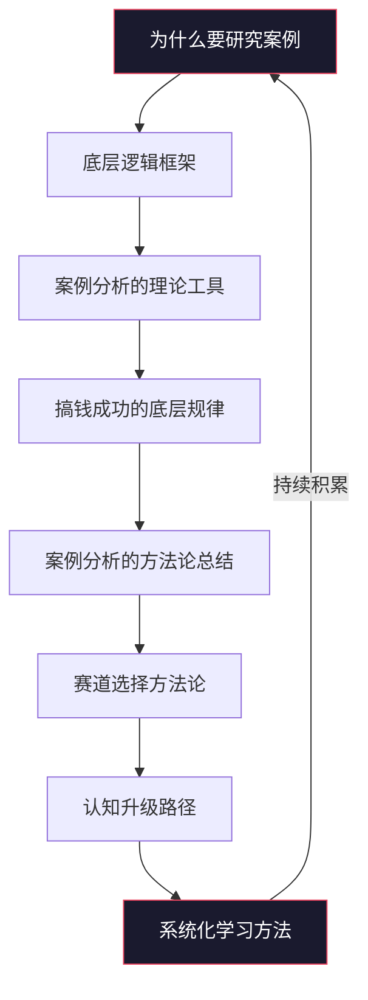

## 本节核心要点

本节是"搞钱案例集"理论基础部分的总结与提炼。前八章分别从研究案例的意义、底层逻辑框架、分析工具、成功规律、方法论、赛道选择、认知升级、系统化学习八个维度构建了一套完整的案例分析知识体系。本节将这些内容浓缩为可操作的核心要点，帮助你在面对任何搞钱机会时，能够快速调用正确的思维框架。

### 一、理论基础全景图



整个理论基础形成一个闭环：从"为什么学"出发，经过"学什么"和"怎么学"，最终回到"持续学"。这个闭环的核心驱动力是**案例积累的复利效应**——你看过的每一个案例都会成为未来判断的底层数据库。

### 二、八个章节的核心知识点

#### 2.1 为什么要研究案例（第一章）

**核心结论：案例是搞钱认知的最短路径。**

理论学习告诉你"应该怎么做"，案例学习告诉你"别人实际怎么做的"以及"为什么那样做能成功"。两者之间的差距就是**执行鸿沟**。

| 学习方式 | 优势 | 局限 | 适用场景 |
|----------|------|------|----------|
| 纯理论学习 | 建立系统认知框架 | 容易脱离实际，纸上谈兵 | 初学阶段建立基础 |
| 纯实践摸索 | 经验深刻 | 成本高、周期长、试错代价大 | 有充足资源和时间 |
| 案例研究 | 兼顾理论与实践，低成本获取他人经验 | 可能存在幸存者偏差 | 大多数人的最优选择 |

**关键洞察：** 搞钱本质上是一个信息不对称的游戏。研究案例的核心价值不在于模仿具体做法，而在于理解**决策背后的逻辑链**——为什么在那个时间点，面对那些条件，做出了那个选择。

#### 2.2 搞钱的底层逻辑框架（第二章）

**核心结论：所有搞钱行为都可以拆解为价值创造、价值传递、价值获取三个环节。**

```text
价值创造 → 价值传递 → 价值获取
（你做了什么）（怎么触达用户）（怎么收到钱）
```

**搞钱的底层公式：**

> 收入 = 流量 × 转化率 × 客单价 × 复购率

这个公式看似简单，但它是分析一切搞钱案例的万能框架：

- **流量**：你的潜在客户从哪里来？是自然流量还是付费流量？
- **转化率**：看到你产品/服务的人中，有多少真正付费？
- **客单价**：每个付费客户贡献多少收入？
- **复购率**：客户是否会再次购买？

四个变量中任何一个的提升都会直接增加收入。不同搞钱路径的本质区别，在于优先优化哪个变量：

| 搞钱路径 | 优先优化的变量 | 典型案例 |
|----------|----------------|----------|
| 自媒体变现 | 流量 | 公众号广告、短视频带货 |
| 高端咨询 | 客单价 | 一对一咨询、企业顾问 |
| 订阅制产品 | 复购率 | SaaS、会员制社群 |
| 电商运营 | 转化率 | 详情页优化、用户评价管理 |

#### 2.3 案例分析的理论工具（第三章）

**核心结论：好的分析工具让你不遗漏关键信息。**

案例分析不能只凭直觉，需要结构化工具辅助。以下是三个核心分析框架：

**（一）SWOT 分析**

用于评估一个搞钱机会的内外部条件：

| 维度 | 含义 | 自问清单 |
|------|------|----------|
| Strengths（优势） | 你有什么别人没有的 | 技能、资源、人脉、经验、时间 |
| Weaknesses（劣势） | 你的短板在哪 | 资金不足、经验欠缺、时间有限 |
| Opportunities（机会） | 外部有哪些有利条件 | 市场需求增长、政策利好、技术变革 |
| Threats（威胁） | 外部有哪些风险 | 竞争加剧、平台政策变化、经济下行 |

**（二）商业模式画布（Business Model Canvas）**

将一个搞钱项目拆解为九个核心模块：

1. **客户细分**：你服务谁？
2. **价值主张**：你解决什么问题？
3. **渠道通路**：怎么触达客户？
4. **客户关系**：怎么维护客户？
5. **收入来源**：怎么收钱？
6. **核心资源**：需要什么资源？
7. **关键业务**：需要做哪些事？
8. **重要合作**：需要谁的帮助？
9. **成本结构**：要花多少钱？

**（三）复盘四步法**

每个案例分析完毕后，用这个方法提炼可迁移的经验：

1. **回顾目标**：案例主角的原始目标是什么？
2. **评估结果**：实际结果与目标的差距有多大？
3. **分析原因**：哪些因素导致了成功或失败？
4. **提炼规律**：哪些经验可以迁移到自己的情况？

#### 2.4 搞钱成功的底层规律（第四章）

**核心结论：成功是概率游戏，我们要做的是提高成功概率。**

通过对大量搞钱案例的分析，可以提炼出以下底层规律：

**规律一：顺势而为比逆流而上重要十倍**

所谓"势"就是时代趋势、行业红利、平台红利。2014年做公众号、2018年做短视频、2023年做AI应用，都是顺势。同样的努力程度，在红利期和非红利期的产出可能相差十倍。

**规律二：先跑通最小闭环，再考虑规模化**

成功的搞钱案例几乎都有一个共同模式：先用最小成本验证需求→跑通从获客到交付的完整流程→确认能赚钱后再投入资源放大。失败案例则常常反过来：先投入大量资源搭建系统，然后再去找客户。

**规律三：深耕一个领域比广撒网更容易成功**

案例数据反复证明：在一个垂直领域做到前10%，比在十个领域做到前50%赚得多得多。原因很简单——垂直领域的竞争者更少，而客户的信任成本更低。

**规律四：搞钱的核心能力是"卖"的能力**

不管是卖产品、卖服务、卖时间还是卖注意力，本质上都是销售。很多技术型人才搞钱失败，不是因为产品不好，而是因为不会卖。

**规律五：现金流比利润更重要**

搞钱的生死线不是利润表上的数字，而是银行账户里的现金。很多看起来利润不错的项目，因为回款周期太长、前期投入太大，最终死在现金流断裂上。

#### 2.5 案例分析的方法论总结（第五章）

**核心结论：方法论决定分析质量。**

一套完整的案例分析方法论包括以下步骤：


**步骤详解：**

1. **选择案例**：选择与自己情况相近的案例（行业、资源、起点），优先选择有详细过程记录的案例，而非只看结果的"爽文"案例。
2. **收集信息**：多渠道交叉验证信息的真实性，关注案例主角自己公开的复盘，而非第三方的二次解读。
3. **结构化拆解**：用第二章的逻辑框架拆解每个环节，重点关注关键决策点和转折点。
4. **深度分析**：区分"可复制因素"和"不可复制因素"，思考"如果是我，会怎么选择"。
5. **提炼规律**：将单个案例的结论抽象为通用规律，用多个案例交叉验证。
6. **验证迁移**：小规模测试提炼出的规律，根据结果迭代调整。

**核心原则：分析案例时，永远问自己三个问题——**

- 这个做法的本质是什么？（透过现象看本质）
- 这个做法在什么条件下有效？（明确边界条件）
- 这个做法能迁移到我的情况吗？（落地可行性）

#### 2.6 搞钱的赛道选择方法论（第六章）

**核心结论：赛道选择决定了搞钱的上限。**

选赛道就像选电梯——你可以在电梯里做俯卧撑，但让你上楼的是电梯，不是俯卧撑。

**赛道评估五维模型：**

| 维度 | 评估标准 | 高分特征 | 低分特征 |
|------|----------|----------|----------|
| 市场规模 | 天花板有多高 | 万亿级市场 | 小众 niche 市场 |
| 增长速度 | 处于什么阶段 | 年增长 20%+ | 成熟期或衰退期 |
| 竞争程度 | 赛道拥挤度 | 蓝海或早期红海 | 高度饱和市场 |
| 进入门槛 | 你需要什么才能入场 | 资金/技能/资源门槛适中 | 门槛极高或极低 |
| 变现模式 | 怎么赚钱 | 模式清晰、已验证 | 模式模糊、靠想象 |

**选赛道的三条铁律：**

1. **不要进入你完全不懂的赛道**。信息差是搞钱的基础，如果你对一个赛道的了解和普通消费者一样多，那你没有任何信息差可以利用。
2. **优先选择"反脆弱"赛道**。反脆弱赛道是指那些在经济下行期反而可能增长的赛道，比如教育培训（就业压力大时人们更愿意学习）、平价消费品（消费降级受益者）、心理健康服务。
3. **关注"供给稀缺"而非"需求旺盛"**。需求旺盛的赛道往往已经竞争激烈，供给稀缺的赛道才是真正的机会。

#### 2.7 搞钱的认知升级路径（第七章）

**核心结论：搞钱的天花板不是能力，而是认知。**

认知升级是一个螺旋上升的过程，可以分为五个层级：

| 层级 | 认知状态 | 搞钱方式 | 典型表现 |
|------|----------|----------|----------|
| L1 | 卖时间 | 打工 | 用固定时间换取固定收入 |
| L2 | 卖技能 | 自由职业/兼职 | 用专业技能换取更高时薪 |
| L3 | 卖产品 | 做产品/电商 | 一次创造，多次销售 |
| L4 | 卖系统 | 创业/投资 | 搭建自动运转的赚钱系统 |
| L5 | 卖注意力 | 平台/IP | 用影响力撬动杠杆 |

**每一层级的认知跃迁都需要打破一个核心假设：**

- L1→L2：打破"只有上班才能赚钱"的假设
- L2→L3：打破"收入必须与时间挂钩"的假设
- L3→L4：打破"所有事都要亲力亲为"的假设
- L4→L5：打破"赚钱需要持续投入精力"的假设

**认知升级的关键方法：**

1. **向上社交**：接触比你高一个层级的人，观察他们的思维方式
2. **跨领域学习**：很多创新来自不同领域的交叉应用
3. **失败复盘**：从自己的失败中提取认知升级的素材
4. **付费学习**：用金钱购买他人多年积累的认知

#### 2.8 案例学习的系统化方法（第八章）

**核心结论：碎片化学习不如系统化积累。**

案例学习不是看到一个好案例就收藏，而是要建立一套从收集、分析、提炼到应用的完整系统。

**案例库建设四步法：**

1. **广泛收集**：商业媒体、行业报告、创业社区、播客访谈、身边真实案例，多渠道覆盖
2. **分类存储**：按行业、模式、结果、规模四维度交叉分类
3. **结构化拆解**：用统一模板（基本信息→搞钱路径→成败因素→可迁移启示）分析每个案例
4. **定期复盘**：每月回顾案例库，寻找新的模式和规律

**案例分析的五大常见误区：**

| 误区 | 表现 | 纠正方法 |
|------|------|----------|
| 只看成功案例 | 忽视失败案例的教训 | 成功与失败案例的比例保持 6:4 |
| 简单归因 | 把成功归因于单一因素 | 用多因素分析框架 |
| 忽视时代背景 | 照搬过时的成功模式 | 始终关注案例发生的时间和环境 |
| 过度自信 | 看了就会了 | 先小规模验证再放大 |
| 选择性忽略 | 只看自己想看的 | 保持开放心态，全面分析 |

### 三、本节关键公式与模型速查

为了方便在实际搞钱过程中快速调用，以下是本节所有核心模型的速查表：

| 模型/公式 | 核心要素 | 适用场景 |
|-----------|----------|----------|
| 搞钱底层公式 | 流量 × 转化率 × 客单价 × 复购率 | 分析任何收入来源 |
| 价值三环节 | 价值创造 → 价值传递 → 价值获取 | 梳理商业逻辑 |
| SWOT 分析 | 优势、劣势、机会、威胁 | 评估个人条件和外部环境 |
| 商业模式画布 | 9 个核心模块 | 设计搞钱项目的完整方案 |
| 赛道五维评估 | 市场规模、增长、竞争、门槛、变现 | 选择进入哪个赛道 |
| 认知五层级 | 卖时间→技能→产品→系统→注意力 | 定位自己的阶段和升级方向 |
| 复盘四步法 | 回顾目标→评估结果→分析原因→提炼规律 | 从每次实践中提取经验 |
| 案例分析六步 | 选→收→拆→析→提→验 | 系统分析任何搞钱案例 |

### 四、从理论到实践的行动清单

理论学完了，接下来怎么做？以下是按优先级排列的行动清单：

**第一步：建立认知基线（第1周）**

- 用"认知五层级"模型评估自己当前所处的层级
- 用"搞钱底层公式"分析自己目前的主要收入来源
- 列出自己可利用的资源清单（技能、人脉、资金、时间）

**第二步：收集案例库（第2-3周）**

- 收集 20-30 个与自己情况相近的搞钱案例
- 用"案例拆解模板"结构化分析其中 5 个最优质的案例
- 重点关注案例中的关键决策点和转折点

**第三步：选择赛道（第4周）**

- 用"赛道五维评估模型"评估 3-5 个感兴趣的赛道
- 选择一个综合评分最高的赛道作为主攻方向
- 确认这个赛道的变现模式已被验证

**第四步：跑通最小闭环（第5-8周）**

- 设计一个最小可行产品（MVP）或服务
- 用最低成本获取第一批客户
- 验证从获客到交付到收款的完整流程

**第五步：复盘与迭代（持续）**

- 每月用"复盘四步法"回顾自己的搞钱实践
- 持续补充案例库，保持每周分析 1-2 个新案例
- 根据实践反馈调整方向和策略

### 五、记住这三句话

如果本节内容你只记住了三句话，请记住这三句：

> **第一句：搞钱是概率游戏，案例研究是提高概率的最高效方式。**
>
> 你不需要亲自踩每一个坑。别人踩过的坑，你通过案例分析就可以绕过去。这就是案例学习的本质价值——用别人的学费买自己的经验。

> **第二句：赛道决定上限，执行决定下限，认知决定方向。**
>
> 选对赛道让你事半功倍，强悍的执行力让你不掉队，而认知水平决定了你能不能看到正确的赛道、做出正确的执行决策。三者缺一不可。

> **第三句：系统化积累优于碎片化学习，复利效应是搞钱的终极武器。**
>
> 每一个案例、每一次复盘、每一个规律的提炼，都是在给你的"认知银行"存入本金。时间越长，复利越明显。今天的分析能力，是过去所有案例学习的利息总和。

***

*本节作为理论基础部分的收束，将前八章的核心知识浓缩为可操作的框架和模型。接下来的"核心技巧"部分将聚焦于具体的搞钱实操技巧，将这些理论转化为可落地的方法。*
