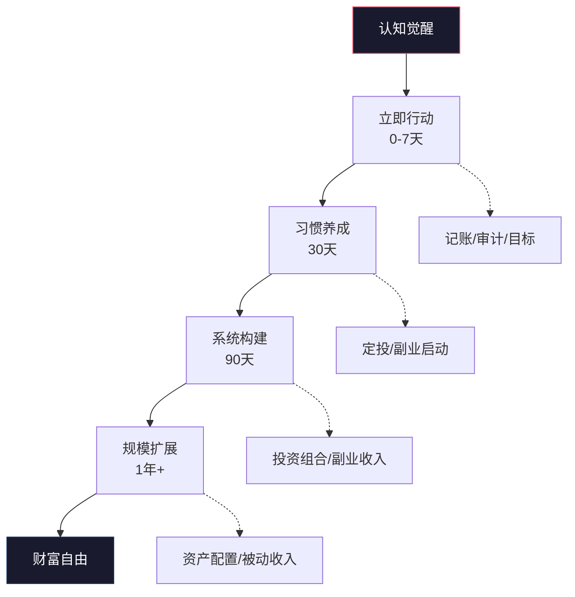
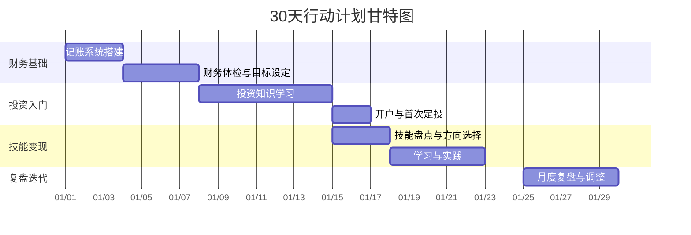
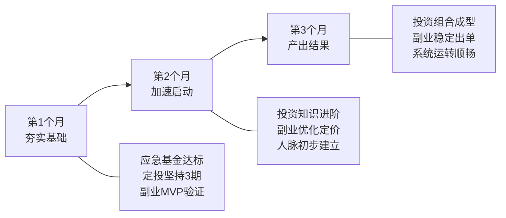

# 附录B：搞钱行动清单

> "千里之行，始于足下；九层之台，起于累土。" —— 《道德经》

知识如果不落地，就只是信息。本附录将全书的核心方法论转化为可执行的行动清单——从"今天就能做"的即时动作，到90天的系统推进，再到年度战略规划。每一条行动都附带了具体的执行标准、工具推荐、预期产出和验收指标，让你不是"知道该做什么"，而是"清楚怎么做、做到什么程度"。



---

## B.1 立即行动清单（今天就开始）

以下行动不需要任何前置条件，不需要资金投入，不需要等待时机——现在、立刻、马上就能开始。拖延是财富最大的敌人，而行动的惯性一旦建立，后续的每一步都会轻松得多。

### B.1.1 财务体检：看清你的起点

**为什么第一步必须是财务体检？** 大多数人对自己的财务状况只有模糊的概念——"大概存了多少""好像花了不少"。没有精确的数据，所有计划都是空中楼阁。财务体检就像去医院做全面检查，你得先知道哪里有问题，才能对症下药。

**行动1：建立记账系统**

记账不是为了省每一笔钱，而是为了看清资金流向，找到"财务漏洞"——那些你不知不觉花掉的钱。

| 工具 | 类型 | 核心功能 | 适合人群 | 费用 |
|------|------|---------|---------|------|
| 随手记 | App | 多账户管理、账单导入、报表分析 | 入门用户 | 免费/会员¥98/年 |
| 挖财 | App | 自动记账、银行账单同步 | 懒人记账 | 免费/会员¥128/年 |
| MoneyWiz | App | 多币种、高级报表、iCloud同步 | 有海外账户用户 | ¥68/年 |
| 飞书多维表格 | 在线表格 | 自定义字段、自动化、图表 | 喜欢自定义的用户 | 免费 |
| Excel/Google Sheets | 表格 | 完全自定义、数据透视表 | 数据分析爱好者 | 免费 |

**执行标准**：
- 第1天：选定工具，导入过去3个月的银行/支付宝/微信账单
- 第1周：每天花2分钟记录当天收支（建议设晚上9点闹钟提醒）
- 第2周：生成第一份月度报表，找出前三大支出类别
- 验收指标：能准确说出自己上个月花了多少钱，花在了哪里

**行动2：编制个人资产负债表**

资产负债表是你的"财务X光片"，一目了然地展示你的财务健康状况。

```markdown
## 个人资产负债表（模板）

### 资产（你拥有的）
| 类别 | 项目 | 金额（元） | 备注 |
|------|------|-----------|------|
| 现金类 | 银行活期 | ______ | 流动性最高 |
| 现金类 | 货币基金（余额宝等） | ______ | 年化1.5-2% |
| 投资类 | 基金 | ______ | 注明品种 |
| 投资类 | 股票 | ______ | 注明市值 |
| 投资类 | 其他（加密货币等） | ______ | |
| 固定资产 | 房产（市值） | ______ | 参考同小区成交价 |
| 固定资产 | 车辆（残值） | ______ | 参考二手车平台估价 |
| 其他 | 公积金余额 | ______ | |
| 其他 | 应收款项 | ______ | 别人欠你的 |
| **资产合计** | | **______** | |

### 负债（你欠的）
| 类别 | 项目 | 金额（元） | 月供 | 利率 |
|------|------|-----------|------|------|
| 房贷 | 住房贷款 | ______ | ______ | ______% |
| 车贷 | 汽车贷款 | ______ | ______ | ______% |
| 消费贷 | 信用卡欠款 | ______ | — | ______% |
| 消费贷 | 花呗/借呗 | ______ | — | ______% |
| 其他 | 亲友借款 | ______ | — | — |
| **负债合计** | | **______** | | |

### 净资产
**净资产 = 资产合计 - 负债合计 = ______元**
```

**关键指标**：
- **负债率** = 负债总额 / 资产总额 × 100%。健康范围：30%以下；警戒线：50%以上
- **流动性比率** = 流动资产 / 月支出。安全线：3-6（即3-6个月的应急资金）
- **储蓄率** = (月收入 - 月支出) / 月收入 × 100%。入门标准：20%；进阶标准：40%以上

**行动3：现金流分析**

资产负债表是"快照"，现金流分析是"视频"——它展示你的钱是怎么流动的。

| 分析维度 | 具体操作 | 验收标准 |
|---------|---------|---------|
| 收入结构 | 分类统计所有收入来源及占比 | 能画出收入来源饼图 |
| 支出结构 | 将支出分为必要/需要/想要三级 | 找出"想要"类支出占比 |
| 现金流向 | 计算每月结余和结余率 | 结余率≥20%为及格 |
| 趋势分析 | 对比近3个月的收支变化 | 发现趋势（增长/下降/平稳） |

**支出三级分类法**：
- **必要**（生存必需）：房租/房贷、基本伙食、交通通勤、水电通讯、保险
- **需要**（改善生活）：品质饮食、服装、日用品、医疗保健
- **想要**（欲望消费）：娱乐、奢侈品牌、冲动购物、攀比消费

执行要点：不是要你砍掉所有"想要"类支出，而是要你意识到哪些支出给你带来了真正的快乐，哪些只是习惯性消费。通常，砍掉30%的"想要"支出不会影响生活质量。

### B.1.2 目标设定：从模糊愿望到精确计划

**为什么大多数人设了目标却实现不了？** 因为他们的目标是"我要有钱""我要财务自由"——这不是目标，这是愿望。目标必须是具体的、可衡量的、有时间限制的。

**行动4：制定SMART财务目标**

| 维度 | 含义 | 反面案例 | 正面案例 |
|------|------|---------|---------|
| Specific（具体） | 明确要做什么 | "多存点钱" | "每月工资到账后自动转2000元到专用储蓄账户" |
| Measurable（可衡量） | 有数字指标 | "学投资" | "3个月内读完2本投资书籍并完成模拟盘50笔交易" |
| Achievable（可达成） | 跳一跳够得着 | "1年内资产翻10倍" | "1年内副业月入3000元" |
| Relevant（相关） | 与大方向一致 | "学做菜"（如果目标是搞钱） | "学Python自动化办公提升效率" |
| Time-bound（有时限） | 有截止日期 | "以后有钱了买房" | "2027年12月31日前攒够首付30万元" |

**目标分层模板**：

```markdown
## 我的财务目标体系

### 1年目标（短期）
- 存款目标：从当前____元增长到____元（增长____%）
- 收入目标：月收入从____元提升到____元
- 投资目标：建立____元的投资组合，年化收益目标____%
- 技能目标：掌握____技能，获得____证书/成果

### 3年目标（中期）
- 存款目标：累计____元
- 收入结构：主业收入占比____%，副业/投资收入占比____%
- 资产目标：____（如购房首付、创业启动资金等）
- 能力目标：成为____领域的____级别从业者

### 5-10年目标（长期）
- 净资产目标：____万元
- 被动收入目标：____元/月（覆盖____%的生活开支）
- 生活目标：____（如提前退休、环球旅行、子女教育基金等）
- 社会目标：____（如帮助____人、实现____社会价值）
```

### B.1.3 应急基金：你的财务安全网

**为什么应急基金是第一优先级？** 没有应急基金的人，遇到突发状况（失业、生病、意外）只能借债，而借债的利息会吞噬你所有的投资收益。应急基金不是"闲钱"，而是你财务体系的"地基"。

**行动5：建立应急基金**

| 阶段 | 目标金额 | 存放方式 | 预计时间 |
|------|---------|---------|---------|
| 第一阶段 | 1个月生活费 | 货币基金（余额宝/零钱通） | 1-3个月 |
| 第二阶段 | 3个月生活费 | 货币基金 + 银行活期 | 3-6个月 |
| 第三阶段 | 6个月生活费 | 货币基金 + 短债基金 | 6-12个月 |

**快速积累应急基金的方法**：
1. **收入到账先存**：工资到账当天自动转入应急账户，剩下的才是可支配收入（先支付给自己）
2. **找"隐形支出"**：取消不用的订阅服务（平均每人有3-5个忘记取消的订阅，每月浪费50-200元）
3. **30天冷静期**：想买非必需品时，等30天再决定。你会发现80%的冲动消费会自然消退
4. **卖闲置**：闲鱼/转转上卖掉不用的物品，既清理空间又回笼资金

### B.1.4 保险配置：守住财富的底线

**为什么搞钱之前要先谈保险？** 因为一场大病或意外可以让你一夜回到解放前。保险不是消费，是用小钱锁定大风险。搞钱的路上，保险是你最后的防线。

**行动6：检查并优化保险配置**

| 险种 | 优先级 | 保额建议 | 年费参考 | 适合人群 |
|------|--------|---------|---------|---------|
| 医保（社保） | ★★★★★ | 当地标准 | 由单位/个人缴纳 | 所有人 |
| 百万医疗险 | ★★★★★ | 200-400万 | 200-800元（30岁） | 所有人 |
| 意外险 | ★★★★ | 50-100万 | 100-300元 | 所有人 |
| 重疾险 | ★★★★ | 30-50万 | 3000-8000元（30岁） | 家庭经济支柱 |
| 定期寿险 | ★★★ | 年收入×10 | 1000-3000元（30岁） | 有房贷/家庭责任者 |

**保险配置的常见误区**：
- ❌ 先给孩子买保险，自己裸奔 → ✅ 先保家庭经济支柱（你自己）
- ❌ 买返还型保险，觉得"不亏" → ✅ 买消费型保险，省下的钱拿去投资收益更高
- ❌ 在银行/熟人那里买"理财型保险" → ✅ 纯保障型保险 + 独立投资，分离保险和理财
- ❌ 觉得有社保就够了 → ✅ 社保是基础，大病/意外需要商业保险补充

### B.1.5 投资入门：让钱开始为你工作

**行动7：开通投资账户并开始定投**

新手最容易犯的错误是"等我学好了再投"——然后永远在学习，永远不开始。正确的做法是"边学边投"，用小资金（每月500-1000元）边实践边积累经验。

**开户指南**：

| 平台 | 类型 | 费率 | 最低金额 | 适合人群 |
|------|------|------|---------|---------|
| 支付宝（蚂蚁财富） | 基金代销 | 申购费1折（0.15%） | 10元 | 入门用户，操作最简单 |
| 天天基金 | 基金代销 | 申购费1折 | 10元 | 品种齐全，数据丰富 |
| 券商账户（华泰/中信等） | 股票+基金+ETF | ETF佣金万1-万3 | 视品种而定 | 需要买ETF/股票的用户 |
| 且慢/蛋卷 | 智能投顾 | 组合管理费0-0.5% | 100-1000元 | 不想自己选基金的用户 |

**新手定投方案（月薪5000-10000元参考）**：

| 定投品种 | 每月金额 | 选择理由 |
|---------|---------|---------|
| 沪深300指数基金 | 500元 | 覆盖A股最大的300家公司，代表中国经济 |
| 中证500指数基金 | 300元 | 中盘股，成长性更强 |
| 货币基金（余额宝） | 工资的10% | 应急资金，随取随用 |

**定投纪律**：
- 每月固定日期自动扣款（设为工资日后2天）
- 不看盘、不择时、不中断（至少坚持1年以上）
- 下跌时坚持甚至加投——"别人恐惧我贪婪"
- 目标持有时间：3年以上（短期波动不等于亏损）

---

## B.2 30天行动计划：从0到1建立搞钱系统

30天不会让你变富，但足以建立搞钱的基础设施——记账习惯、投资账户、学习路径、行动节奏。这30天的核心目标不是赚多少钱，而是**把系统搭建起来**。



### B.2.1 第1周（Day 1-7）：财务觉醒——看清你的钱

**本周主题**：从"感觉有钱/没钱"到"精确知道自己有多少钱、钱去了哪里"

| 天数 | 行动内容 | 具体执行 | 完成标志 | 预计时间 |
|------|---------|---------|---------|---------|
| Day 1 | 建立记账系统 | 下载记账App，设置账户（银行卡、支付宝、微信），导入近3个月账单 | 能看到近3个月的收支明细 | 40分钟 |
| Day 2 | 编制资产负债表 | 按照B.1.1的模板，逐项填写资产和负债 | 得出净资产数字 | 1小时 |
| Day 3 | 收支分析 | 统计过去3个月的平均月收入和支出，按必要/需要/想要分类 | 得出储蓄率和支出结构 | 1.5小时 |
| Day 4 | 财务健康诊断 | 计算负债率、流动性比率、储蓄率，对照标准找差距 | 完成财务健康评分卡 | 30分钟 |
| Day 5 | 设定SMART目标 | 按照B.1.2的模板，制定1年/3年/10年财务目标 | 目标写入手机备忘录/笔记本 | 1小时 |
| Day 6 | 制定预算 | 根据收支分析，制定下月预算（50/30/20法则或自定义比例） | 预算表完成 | 45分钟 |
| Day 7 | 设立应急基金账户 | 开设专用账户，转入第一笔应急资金（哪怕只有100元） | 应急基金账户已开通并有余额 | 30分钟 |

**50/30/20预算法则**：
- 50% 用于必要支出（房租、伙食、交通、通讯）
- 30% 用于个人发展和生活品质（学习、社交、娱乐）
- 20% 用于储蓄和投资（应急基金 + 投资定投）

**本周验收清单**：
- [ ] 能准确说出自己的净资产是多少
- [ ] 能说出上个月的钱花在了哪里（前三大类别）
- [ ] 知道自己的储蓄率是多少
- [ ] 有了明确的1年财务目标
- [ ] 应急基金账户已开通

### B.2.2 第2周（Day 8-14）：投资启蒙——让知识先于资金

**本周主题**：建立投资认知框架，完成第一次投资实践

| 天数 | 行动内容 | 具体执行 | 完成标志 | 预计时间 |
|------|---------|---------|---------|---------|
| Day 8 | 学习投资基础概念 | 搞清楚：什么是通货膨胀、复利效应、风险收益比、资产配置 | 能向别人解释这4个概念 | 1.5小时 |
| Day 9 | 了解主流投资品种 | 学习：货币基金、债券基金、指数基金、主动基金、股票、ETF、REITs | 列出每个品种的风险等级和预期收益 | 2小时 |
| Day 10 | 阅读投资经典 | 《富爸爸穷爸爸》前半部分——理解资产vs负债的本质区别 | 做读书笔记，列出3个核心观点 | 2小时 |
| Day 11 | 阅读投资经典 | 《富爸爸穷爸爸》后半部分——理解现金流象限和财务自由路径 | 完成全书，总结行动启发 | 2小时 |
| Day 12 | 开通投资账户 | 在支付宝/天天基金开通基金账户，完成风险评估问卷 | 账户已开通，风险等级已确定 | 30分钟 |
| Day 13 | 选择定投标的 | 在晨星网/天天基金网查看指数基金的跟踪误差、费率、规模 | 选定2-3只基金，记录选择理由 | 1小时 |
| Day 14 | 完成首次定投 | 设置自动定投计划（金额、日期、品种） | 自动定投已设置，第一笔已扣款 | 20分钟 |

**基金筛选标准**（供第13天参考）：
- 跟踪误差 < 0.2%（越小越好，说明基金紧密跟踪指数）
- 管理费 < 0.5%/年（指数基金费率越低越好）
- 基金规模 > 10亿元（太小有清盘风险）
- 成立时间 > 3年（有足够历史数据参考）
- 基金公司选大厂：华夏、易方达、南方、嘉实、天弘等

**本周验收清单**：
- [ ] 能解释什么是复利效应，并计算"每月定投1000元、年化8%、30年后的终值"
- [ ] 知道指数基金和主动基金的区别
- [ ] 投资账户已开通，风险评估已完成
- [ ] 已设置自动定投计划

### B.2.3 第3周（Day 15-21）：技能变现——找到你的搞钱支点

**本周主题**：盘点你的可变现技能，探索第一个副业方向

| 天数 | 行动内容 | 具体执行 | 完成标志 | 预计时间 |
|------|---------|---------|---------|---------|
| Day 15 | 技能盘点 | 列出你所有的技能（工作技能、兴趣爱好、生活技能），评估每项技能的变现潜力 | 技能清单（至少10项） | 1小时 |
| Day 16 | 市场调研 | 在猪八戒/自由人/Upwork/Fiverr等平台搜索你的技能，了解市场需求和价格 | 整理5个可行的变现方向 | 1.5小时 |
| Day 17 | 选择副业方向 | 从5个方向中选出1个，评估：启动成本、时间投入、收入天花板、与主业协同性 | 确定1个副业方向 | 1小时 |
| Day 18 | 制定副业计划 | 确定：目标客户、服务内容、定价策略、获客渠道、MVP（最小可行产品） | 一页纸副业计划 | 1.5小时 |
| Day 19 | 搭建副业基础设施 | 注册平台账号、准备作品集/案例、设置收款方式 | 基础设施就绪 | 2小时 |
| Day 20 | 发布第一个产品/服务 | 在平台发布你的第一个服务/产品（哪怕免费也要先有案例） | 已发布，有可展示的链接 | 2小时 |
| Day 21 | 学习营销基础 | 学习如何写吸引人的产品描述、如何定价、如何获取第一批客户 | 完成产品描述优化 | 1.5小时 |

**副业方向评估矩阵**：

| 评估维度 | 权重 | 方向A | 方向B | 方向C |
|---------|------|-------|-------|-------|
| 我擅长吗？（能力匹配） | 25% | ___分 | ___分 | ___分 |
| 有人愿意付费吗？（市场需求） | 25% | ___分 | ___分 | ___分 |
| 启动成本低吗？（轻资产） | 20% | ___分 | ___分 | ___分 |
| 能积累长期价值吗？（复利性） | 15% | ___分 | ___分 | ___分 |
| 和主业能协同吗？（互哺性） | 15% | ___分 | ___分 | ___分 |
| **加权总分** | | **___** | **___** | **___** |

评分标准：1-5分，5分最高。选择总分最高的方向启动。

**本周验收清单**：
- [ ] 有完整的技能清单（至少10项）
- [ ] 确定了1个副业方向，有选择理由
- [ ] 有一页纸的副业计划
- [ ] 副业产品/服务已发布（即使只是最小可行版本）

### B.2.4 第4周（Day 22-30）：复盘迭代——把经验变成系统

**本周主题**：复盘第一个月的行动，优化系统，制定下月计划

| 天数 | 行动内容 | 具体执行 | 完成标志 | 预计时间 |
|------|---------|---------|---------|---------|
| Day 22 | 财务复盘 | 对比月初的预算和实际支出，分析差异原因 | 月度财务报告 | 1小时 |
| Day 23 | 投资复盘 | 查看定投执行情况，学习本月的市场走势 | 投资日志更新 | 30分钟 |
| Day 24 | 副业复盘 | 分析副业数据：曝光量、咨询量、成交量、收入 | 副业数据看板 | 1小时 |
| Day 25 | 学习复盘 | 整理本月读的书、学的知识、获得的技能 | 学习笔记整理 | 45分钟 |
| Day 26 | 习惯复盘 | 评估本月养成的新习惯（记账、学习、定投）的执行率 | 习惯打卡统计 | 30分钟 |
| Day 27 | 问题诊断 | 找出本月最大的3个问题，分析根因，制定对策 | 问题清单+对策 | 1小时 |
| Day 28 | 制定下月计划 | 根据复盘结果，调整目标和行动计划 | 下月计划表 | 1小时 |
| Day 29 | 优化系统 | 优化记账流程、投资策略、副业运营 | 系统优化记录 | 1小时 |
| Day 30 | 仪式感收尾 | 写一封信给3个月后的自己，描述你期望达到的状态 | 信件完成 | 30分钟 |

**月度复盘模板**：

```markdown
## 第____月度复盘报告

### 一、目标达成情况
| 目标 | 计划值 | 实际值 | 达成率 | 分析 |
|------|--------|--------|--------|------|
| 储蓄 | ____元 | ____元 | ____% | |
| 投资 | ____元 | ____元 | ____% | |
| 副业收入 | ____元 | ____元 | ____% | |
| 学习时长 | ____小时 | ____小时 | ____% | |

### 二、本月最大收获（Top 3）
1. 
2. 
3. 

### 三、本月最大问题（Top 3）
1. 问题：____，根因：____，对策：____
2. 问题：____，根因：____，对策：____
3. 问题：____，根因：____，对策：____

### 四、下月重点行动（Top 3）
1. 
2. 
3. 

### 五、心态/感悟记录

```

---

## B.3 90天行动计划：从1到N构建搞钱引擎

30天建立了基础设施，90天要让这个系统开始产生回报。这三个月的节奏是：**第1个月夯实基础，第2个月加速启动，第3个月产出结果**。



### B.3.1 第1个月（月度1-4周）：夯实基础

**核心目标**：让所有系统开始运转，形成稳定的执行节奏

| 行动领域 | 具体目标 | 验收标准 | 常见卡点 | 破解方法 |
|---------|---------|---------|---------|---------|
| 记账 | 连续30天记账 | 记账App连续打卡30天 | 忘记记/觉得麻烦 | 设晚上9点闹钟，只记大类（2分钟搞定） |
| 应急基金 | 存到1个月生活费 | 应急账户余额≥月支出 | 没有钱存 | 先存100元也行，建立"先支付给自己"的习惯 |
| 定投 | 完成3次定投 | 自动扣款3次成功 | 看到跌了想停 | 卸载行情App，只在每月定投日查看 |
| 副业 | MVP验证完成 | 有至少1个付费客户或10个免费用户 | 没人买/不知道怎么开始 | 先免费做3-5个案例，用案例吸引客户 |
| 学习 | 读完2本书 | 《富爸爸穷爸爸》+1本投资书 | 没时间/读不下去 | 用听书App通勤时间听，周末做笔记 |

**第1个月的里程碑事件**：
1. ✅ 第一笔自动定投扣款成功
2. ✅ 应急基金达到1个月生活费
3. ✅ 副业获得第一笔收入（哪怕只有1元）
4. ✅ 能清楚说出自己的财务状况（净资产、月结余、储蓄率）

### B.3.2 第2个月（月度5-8周）：加速启动

**核心目标**：在基础稳固后加速——加大投资金额、优化副业、拓展人脉

| 行动领域 | 具体目标 | 验收标准 | 进阶方法 |
|---------|---------|---------|---------|
| 投资 | 定投金额增加50%，学习ETF投资 | 定投金额从1000元提升到1500元 | 学习场内ETF交易，费率更低 |
| 副业 | 月收入突破1000元 | 有3-5个付费客户 | 优化产品描述，提高转化率 |
| 人脉 | 加入2个行业社群 | 每周参与1次社群讨论 | 主动提供价值（回答问题、分享资源） |
| 学习 | 学习资产配置理论 | 能画出标准普尔家庭资产象限图 | 阅读《漫步华尔街》或《指数基金投资指南》 |
| 保险 | 完成保险配置 | 百万医疗+意外险已购买 | 用蜗牛保险/深蓝保做方案对比 |

**资产配置入门——标准普尔家庭资产象限**：

| 象限 | 比例 | 用途 | 对应产品 | 特点 |
|------|------|------|---------|------|
| 要花的钱 | 10% | 3-6个月生活费 | 货币基金、活期 | 随取随用，牺牲收益换流动性 |
| 保命的钱 | 20% | 风险转移 | 百万医疗、重疾险、意外险 | 以小博大，防一夜返贫 |
| 生钱的钱 | 30% | 高收益投资 | 股票、指数基金、ETF | 高风险高收益，用闲钱投资 |
| 保本的钱 | 40% | 稳健增值 | 债券基金、银行理财、养老目标基金 | 低风险，跑赢通胀 |

> 注意：这个比例是参考值，不是固定值。年轻人可以适当提高"生钱的钱"比例（40-50%），减少"保本的钱"（20-30%），因为年轻人有时间承受波动。

### B.3.3 第3个月（月度9-12周）：产出结果

**核心目标**：让系统产出可衡量的结果，建立正反馈循环

| 行动领域 | 具体目标 | 验收标准 | 关键动作 |
|---------|---------|---------|---------|
| 投资 | 投资组合成型 | 持有3-5只不同类型的基金/ETF | 建立核心-卫星组合（核心80%宽基指数，卫星20%行业/主题） |
| 副业 | 月收入稳定在2000元以上 | 连续2周有稳定收入 | 建立SOP（标准化流程），提高效率 |
| 人脉 | 建立3-5个深度行业关系 | 有可以互相帮忙的同行 | 线下见面或深度1对1交流 |
| 被动收入 | 建立第一个被动收入来源 | 有不依赖主动劳动的收入 | 知识付费/数字产品/内容变现 |
| 复盘 | 完成90天总复盘 | 有完整的复盘报告 | 对比90天前后的财务变化 |

**90天复盘框架**：

```markdown
## 90天搞钱系统复盘报告

### 财务变化对比
| 指标 | 90天前 | 现在 | 变化 |
|------|--------|------|------|
| 净资产 | ____元 | ____元 | +____元（+____%） |
| 月收入 | ____元 | ____元 | +____元（+____%） |
| 月支出 | ____元 | ____元 | -____元（-____%） |
| 储蓄率 | ____% | ____% | +____% |
| 应急基金 | ____元 | ____元 | +____元 |
| 投资总额 | ____元 | ____元 | +____元 |
| 副业月收入 | ____元 | ____元 | +____元 |

### 系统运转评估
| 系统 | 状态 | 执行率 | 优化建议 |
|------|------|--------|---------|
| 记账系统 | 🟢正常/🟡需优化/🔴需重建 | ____% | |
| 定投系统 | 🟢/🟡/🔴 | ____% | |
| 副业系统 | 🟢/🟡/🔴 | ____% | |
| 学习系统 | 🟢/🟡/🔴 | ____% | |
| 人脉系统 | 🟢/🟡/🔴 | ____% | |

### 最大的3个收获
1. 
2. 
3. 

### 最大的3个教训
1. 
2. 
3. 

### 下一个90天的重点方向
1. 
2. 
3. 
```

---

## B.4 年度规划模板：从战术到战略

年度规划不是"年初许愿"，而是将长期愿景分解为可执行的季度里程碑。以下模板覆盖了搞钱的四大维度：收入、支出、投资、成长。

### B.4.1 年度财务总规划

```markdown
## 20____年度财务规划

### 一、年度核心目标（不超过3个）
1. 
2. 
3. 

### 二、收入规划
| 来源 | 月均目标 | 年度目标 | 增长策略 |
|------|---------|---------|---------|
| 主业工资 | ____元 | ____元 | 争取加薪/跳槽/升职 |
| 副业收入 | ____元 | ____元 | 扩大客户群/提价/新产品 |
| 投资收益 | ____元 | ____元 | 增加本金/优化策略 |
| 其他（房租/分红等） | ____元 | ____元 | |
| **合计** | **____元** | **____元** | |

### 三、支出规划
| 类别 | 月均预算 | 年度预算 | 优化空间 |
|------|---------|---------|---------|
| 住房（房租/房贷） | ____元 | ____元 | 是否可以优化？ |
| 饮食 | ____元 | ____元 | 自己做饭可省30-50% |
| 交通 | ____元 | ____元 | |
| 通讯/网络 | ____元 | ____元 | 检查套餐是否合理 |
| 保险 | ____元 | ____元 | |
| 学习投资自己 | ____元 | ____元 | 这是投资，不是消费 |
| 社交/娱乐 | ____元 | ____元 | |
| 其他 | ____元 | ____元 | |
| **合计** | **____元** | **____元** | |

### 四、投资规划
| 品种 | 月投入 | 年投入 | 目标配置比例 | 策略 |
|------|--------|--------|------------|------|
| 货币基金（应急） | ____元 | ____元 | ____% | 达到6个月生活费后停投 |
| 指数基金定投 | ____元 | ____元 | ____% | 每月自动扣款，不择时 |
| 主题/行业ETF | ____元 | ____元 | ____% | 根据研究选择1-2个行业 |
| 债券基金 | ____元 | ____元 | ____% | 作为组合稳定器 |
| 其他 | ____元 | ____元 | ____% | |

### 五、成长规划
| 维度 | 年度目标 | Q1 | Q2 | Q3 | Q4 |
|------|---------|----|----|----|----|
| 阅读 | ____本书 | | | | |
| 课程/证书 | ____个 | | | | |
| 技能 | 学会____ | | | | |
| 人脉 | 新增____个深度关系 | | | | |
```

### B.4.2 季度里程碑设定

每个季度设定3个关键结果（Key Results），用OKR思维管理进度：

| 季度 | 关键结果1 | 关键结果2 | 关键结果3 |
|------|----------|----------|----------|
| Q1 | KR：____ | KR：____ | KR：____ |
| Q2 | KR：____ | KR：____ | KR：____ |
| Q3 | KR：____ | KR：____ | KR：____ |
| Q4 | KR：____ | KR：____ | KR：____ |

**关键结果的写法**：必须是可衡量的数字指标。
- ❌ "提升投资能力" → ✅ "完成100笔模拟交易，胜率达到60%"
- ❌ "增加副业收入" → ✅ "副业月收入从0提升到3000元"
- ❌ "学习新技能" → ✅ "完成Python基础课程，能独立编写自动化脚本"

### B.4.3 月度复盘与调整机制

每月最后一个周末花2小时做月度复盘，使用以下标准化流程：

**月度复盘四步法**：

| 步骤 | 内容 | 时间 | 工具 |
|------|------|------|------|
| 第1步：数据回顾 | 导出本月收支数据、投资收益、副业收入 | 20分钟 | 记账App+投资平台 |
| 第2步：目标对比 | 将实际数据与月初目标逐项对比 | 20分钟 | Excel/表格 |
| 第3步：根因分析 | 分析未达标项的原因（外部因素/执行问题/目标不合理） | 30分钟 | 5 Why分析法 |
| 第4步：调整计划 | 根据分析结果调整下月计划 | 30分钟 | 下月计划模板 |

**5 Why分析法示例**：
```text
问题：本月副业收入为0
Why 1：没有客户来咨询 → 为什么？
Why 2：产品曝光量太低 → 为什么？
Why 3：只在1个平台发布了产品 → 为什么？
Why 4：没有时间去多个平台发布 → 为什么？
Why 5：主业加班太多，副业时间不够

根因：时间管理问题
对策：①利用碎片时间在多平台发布 ②周末集中处理副业事务 ③考虑降低主业工作量或换工作
```

### B.4.4 每周执行清单

将月度目标分解到每周，每周日晚上制定下周计划：

```markdown
## 第____周执行清单（__月__日 - __月__日）

### 本周核心目标（不超过3个）
1. 
2. 
3. 

### 每日执行清单

**周一（规划日）**：
- [ ] 回顾上周完成情况，确认本周目标
- [ ] 检查投资账户，确认定投状态
- [ ] 学习投入：阅读/课程 1小时
- [ ] 副业投入：____

**周二（执行日）**：
- [ ] 执行副业核心任务
- [ ] 学习投入：阅读/课程 1小时
- [ ] 记账

**周三（执行日）**：
- [ ] 执行副业核心任务
- [ ] 学习投入：阅读/课程 1小时
- [ ] 人脉维护：联系1位重要联系人

**周四（执行日）**：
- [ ] 执行副业核心任务
- [ ] 学习投入：阅读/课程 1小时
- [ ] 记账

**周五（收尾日）**：
- [ ] 完成本周副业任务
- [ ] 学习投入：阅读/课程 1小时
- [ ] 整理本周工作成果

**周六（深度日）**：
- [ ] 深度学习/技能提升：2-3小时
- [ ] 副业优化/新功能开发
- [ ] 社交活动/人脉拓展

**周日（复盘日）**：
- [ ] 本周复盘（30分钟）
- [ ] 下周计划（30分钟）
- [ ] 财务周报整理
- [ ] 休息调整
```

---

## B.5 不同人生阶段的搞钱策略

不同年龄段的人，拥有的资源（时间、精力、资金、人脉）完全不同，搞钱的策略也应该不同。20岁的人最大的资本是时间和学习能力，40岁的人最大的资本是经验和人脉，60岁的人最大的资本是积累的资产。用错了策略，就像拿着锤子去拧螺丝。

### B.5.1 20-30岁：积累期——投资自己是最高回报的投资

**这个阶段的核心逻辑**：收入基数低，但成长空间大。把80%的精力放在提升赚钱能力上，20%的精力放在投资上。不要急于追求投资收益——把月薪从5000提升到15000，比在5000的基础上追求10%的投资回报率，效果好10倍。

**财务基础行动清单**：
- [ ] 建立记账习惯，搞清楚自己的财务状况
- [ ] 建立应急基金（3个月生活费）
- [ ] 开始基金定投（每月500-1000元起步）
- [ ] 配置百万医疗险+意外险（每年500元以内搞定）
- [ ] 不要碰信用卡分期、花呗分期、消费贷

**职业发展行动清单**：
- [ ] 确定1个专业方向，深耕3年以上
- [ ] 每年学习1-2项新技能（优先学习：数据分析、编程、写作、演讲）
- [ ] 建立行业人脉（加入3个以上行业社群，参加线下活动）
- [ ] 打造个人品牌（写技术博客/做分享/运营社交媒体）
- [ ] 每2年评估一次是否需要跳槽（跳槽平均涨薪20-30%）

**副业探索行动清单**：
- [ ] 从主业延伸做副业（如程序员接外包、设计师做私活、运营做自媒体）
- [ ] 先免费/低价做5-10个案例，积累口碑
- [ ] 建立副业的标准化流程（SOP），提高效率
- [ ] 目标：副业收入达到主业收入的30-50%

**常见误区**：
- ❌ "我还年轻，不用着急" → ✅ 复利效应需要时间，25岁开始和35岁开始差距巨大
- ❌ "等我有钱了再投资" → ✅ 用小钱开始，先建立投资认知和纪律
- ❌ "副业会影响主业" → ✅ 好的副业与主业互哺，提升综合能力

### B.5.2 30-40岁：加速期——从单一收入到多元收入

**这个阶段的核心逻辑**：收入基数已经不错，但支出也在增长（房贷、车贷、孩子）。关键是优化收入结构——降低对单一工资的依赖，建立多元收入来源。

**收入多元化行动清单**：
- [ ] 主业争取升职加薪或跳槽涨薪
- [ ] 副业收入目标：达到主业收入的50%以上
- [ ] 投资收入目标：年投资收益覆盖3个月生活费
- [ ] 探索被动收入：知识付费、数字产品、内容变现

**资产配置行动清单**：
- [ ] 优化投资组合（核心+卫星策略）
- [ ] 核心资产（70-80%）：宽基指数基金+债券基金
- [ ] 卫星资产（20-30%）：行业ETF+个股+另类投资
- [ ] 定期再平衡（每半年/每年调整一次比例）
- [ ] 考虑房产投资（如果资金允许且有刚需）

**家庭财务行动清单**：
- [ ] 制定家庭财务预算（夫妻双方共同参与）
- [ ] 建立子女教育基金（每月定投1000-2000元）
- [ ] 建立养老金储备（每月定投1000-2000元）
- [ ] 优化保险配置（增加重疾险+定期寿险）
- [ ] 制定家庭应急计划（失业/大病/意外的应对方案）

### B.5.3 40-50岁：稳健期——守住财富比增加财富更重要

**这个阶段的核心逻辑**：上有老下有小，财务责任最重。投资策略从"进攻"转向"攻守平衡"，重点是保护已积累的财富，同时保持增长。

**资产保值行动清单**：
- [ ] 降低高风险资产比例（股票类资产不超过总资产的40%）
- [ ] 增加稳健型投资（债券基金、银行理财、REITs）
- [ ] 注重现金流——优先选择能产生稳定现金流的资产
- [ ] 每季度检视一次投资组合，及时调整

**财富传承行动清单**：
- [ ] 制定遗嘱/遗产规划
- [ ] 了解信托、保险金等财富传承工具
- [ ] 与配偶沟通家庭财务状况和传承计划
- [ ] 配置终身寿险或年金保险（作为财富传承工具）
- [ ] 考虑设立家庭财务手册（资产清单、账户密码、重要联系人）

**事业转型行动清单**：
- [ ] 评估当前职业的发展天花板
- [ ] 如果主业遇到瓶颈，考虑向管理岗/专家岗转型
- [ ] 将副业发展为第二事业
- [ ] 建立行业影响力（出书、做培训、成为KOL）

### B.5.4 50岁以上：收获期——让资产为你工作

**这个阶段的核心逻辑**：逐步从"人赚钱"过渡到"钱赚钱"。重点是确保退休后有稳定的现金流来源，同时做好财富传承。

**退休规划行动清单**：
- [ ] 计算退休后每月需要多少生活费（通常是退休前的70-80%）
- [ ] 计算社保养老金能覆盖多少（登录当地社保局网站查询）
- [ ] 计算缺口，制定补足计划（商业养老保险/投资收益/租金收入）
- [ ] 配置高端医疗保险（覆盖大病和长期护理）
- [ ] 制定退休生活计划（不只是"不工作"，而是"做什么"）

**资产配置调整**：
- [ ] 将高风险资产比例降至20-30%
- [ ] 增加能产生稳定现金流的资产（债券、REITs、分红股、年金）
- [ ] 逐步减少主动投资，增加被动投资（指数基金/目标日期基金）
- [ ] 考虑将部分资产转化为终身年金（锁定终身现金流）

**生活规划行动清单**：
- [ ] 培养至少2-3个兴趣爱好（退休后有事做）
- [ ] 维持社交网络（退休后社交圈容易萎缩）
- [ ] 关注健康管理（健康是最大的财富）
- [ ] 考虑志愿服务或社会活动（实现社会价值）

---

## B.6 行动执行的科学方法：从知道到做到

知道该做什么不难，难的是持续做到。本节基于行为科学和习惯养成研究，提供一套经过验证的行动执行框架。

### B.6.1 习惯养成：用系统代替意志力

**核心原理**：习惯 = 提示 + 渴求 + 反应 + 奖励（来自《原子习惯》James Clear）

| 步骤 | 含义 | 记账习惯示例 | 定投习惯示例 |
|------|------|------------|------------|
| 提示 | 触发行为的信号 | 晚上9点的闹钟 | 工资到账的短信 |
| 渴求 | 想要获得的奖励 | "今天的账都记了"的完成感 | "钱在为我工作"的安全感 |
| 反应 | 具体的行动 | 打开App，花2分钟记录 | 打开基金App，确认定投已扣款 |
| 奖励 | 行为后的正反馈 | 连续打卡天数+1 | 看到账户金额增长 |

**7个经过验证的习惯养成策略**：

1. **习惯叠加**：把新习惯绑定到已有习惯上
   - "刷牙后，我立刻打开记账App记录昨天的支出"
   - "收到工资短信后，我立刻确认定投已扣款"

2. **环境设计**：让好习惯更容易执行，坏习惯更难执行
   - 把记账App放在手机首屏，把游戏App放到第三屏
   - 设置工资到账自动转入储蓄账户（环境=自动化）

3. **两分钟法则**：任何新习惯的开始版本应该不超过2分钟
   - "记账" → "打开记账App"（先只做这一步，剩下的自然发生）
   - "学习投资" → "打开书翻一页"（降低启动阻力）

4. **习惯追踪**：用视觉化的记录保持动力
   - 在日历上画X（连续打卡链——不要断链）
   - 使用习惯打卡App（如Habitica、Loop Habit Tracker）

5. **承诺装置**：提前锁定未来的行为
   - 设置自动定投（让系统替你执行）
   - 向朋友公开宣布你的目标（社会压力）

6. **奖励机制**：完成阶段性目标后给自己奖励
   - 连续记账30天 → 奖励自己一顿好的
   - 投资收益首次为正 → 用收益的一部分犒劳自己

7. **身份认同**：从"我要做X"变成"我是做X的人"
   - 不是"我要记账"，而是"我是一个有财务纪律的人"
   - 不是"我要投资"，而是"我是一个投资者"

### B.6.2 保持动力：度过低谷期的5个方法

搞钱的路上一定会遇到低谷——投资亏损、副业没有起色、感觉进步太慢。以下是度过低谷期的具体方法：

**方法1：进度可视化**
- 制作一个"财富增长曲线图"，每月更新一次
- 即使是微小的增长，看到曲线在上升也能保持动力
- 工具：Excel图表、Notion数据库、手绘

**方法2：里程碑庆祝**
- 把大目标分解为小里程碑
- 每达到一个里程碑就庆祝一下（不必花很多钱）
- 示例：净资产首次突破10万 → 和朋友吃顿火锅庆祝

**方法3：找同行者**
- 加入搞钱社群（知识星球/微信群/线下沙龙）
- 找1-2个志同道合的朋友，互相监督
- 每周分享进展，互相鼓励

**方法4：回顾初心**
- 定期回顾你写给未来自己的那封信
- 回顾你当初为什么开始
- 想象达到目标后的生活场景

**方法5：允许失败**
- 投资亏损是学费，不是灾难
- 副业失败是经验，不是终点
- 计划没完成是信号，不是判决——分析原因，调整计划，继续前进

### B.6.3 克服常见障碍

| 障碍 | 表现 | 根因 | 解决方案 |
|------|------|------|---------|
| 拖延症 | "明天再开始" | 启动阻力太大 | 两分钟法则+环境设计 |
| 信息过载 | "我要先学完再行动" | 完美主义+恐惧 | 最小可行行动：先做再说 |
| 三分钟热度 | 坚持不了1个月 | 缺乏系统和反馈 | 习惯叠加+追踪+承诺装置 |
| 比较焦虑 | "别人赚得比我多" | 社交媒体滤镜 | 只和昨天的自己比 |
| 投资恐惧 | "怕亏钱不敢投" | 损失厌恶 | 先用小钱试水，建立认知 |
| 时间不够 | "太忙了没时间" | 优先级问题 | 每天固定30分钟，雷打不动 |
| 信息茧房 | "不知道学什么" | 缺乏方向 | 参考本书的推荐书单和课程 |

### B.6.4 时间管理：为搞钱腾出时间

**大多数人不是"没有时间"，而是没有为搞钱分配时间。** 以下方法帮你在不辞职、不牺牲生活的前提下，每周腾出10-15小时用于搞钱：

**时间审计**：记录1周的时间使用情况，找到"时间黑洞"

| 时间黑洞 | 典型时长 | 可回收时长 | 替代方案 |
|---------|---------|-----------|---------|
| 刷短视频 | 1-3小时/天 | 1小时/天 | 通勤时听投资/商业播客 |
| 追剧 | 1-2小时/天 | 0.5小时/天 | 周末集中看，工作日用来学习 |
| 无效社交 | 2-3小时/周 | 1.5小时/周 | 减少无意义的聚会 |
| 碎片化浏览 | 0.5-1小时/天 | 0.5小时/天 | 设置App使用时间限制 |

**每周时间分配建议**：

| 活动 | 周一至周五 | 周末 | 合计 |
|------|----------|------|------|
| 投资学习 | 每天30分钟 | 2小时 | 4.5小时 |
| 副业执行 | 每天30分钟 | 3小时 | 5.5小时 |
| 记账/复盘 | 每天10分钟 | 30分钟 | 1.3小时 |
| 人脉维护 | — | 1小时 | 1小时 |
| **合计** | | | **约12小时/周** |

---

## B.7 搞钱工具箱：效率倍增器

### B.7.1 记账与财务工具

| 工具 | 类型 | 核心功能 | 费用 | 推荐指数 |
|------|------|---------|------|---------|
| 随手记 | App | 多账户、账单导入、报表 | 免费/¥98年 | ★★★★ |
| MoneyWiz | App | 多币种、高级报表 | ¥68/年 | ★★★★★ |
| 飞书多维表格 | 在线 | 自定义、自动化 | 免费 | ★★★★ |
| Notion | 在线 | 灵活数据库、模板丰富 | 免费/$8/月 | ★★★★ |
| Excel/Sheets | 通用 | 完全自定义、数据透视 | 免费 | ★★★★ |

### B.7.2 投资研究工具

| 工具 | 用途 | 费用 | 推荐场景 |
|------|------|------|---------|
| 天天基金网 | 基金筛选、比较、评级 | 免费 | 选基金 |
| 晨星网（Morningstar） | 基金评级、风格分析 | 免费 | 深度研究基金 |
| 且慢 | 智能投顾、策略组合 | 管理费0-0.5% | 不想自己选基金 |
| 雪球 | 投资社区、个股分析 | 免费 | 学习投资思路 |
| 理杏仁 | 估值数据、指数估值 | 免费/付费 | 判断市场估值 |
| 乌龟量化 | 指数估值、定投参考 | 免费 | 定投择时参考 |

### B.7.3 学习资源推荐

| 类型 | 推荐资源 | 适合阶段 | 费用 |
|------|---------|---------|------|
| 入门书籍 | 《富爸爸穷爸爸》 | 零基础 | ~¥30 |
| 入门书籍 | 《小狗钱钱》 | 零基础 | ~¥25 |
| 投资经典 | 《聪明的投资者》 | 有基础 | ~¥50 |
| 投资经典 | 《漫步华尔街》 | 有基础 | ~¥50 |
| 实操指南 | 《指数基金投资指南》 | 入门-进阶 | ~¥40 |
| 实操指南 | 《基金投资的16堂课》 | 入门-进阶 | ~¥35 |
| 行为金融 | 《思考，快与慢》 | 进阶 | ~¥60 |
| 系统思维 | 《原则》（达利欧） | 进阶 | ~¥80 |
| 播客 | 知行小酒馆、半拿铁、投资奇葩说 | 通勤学习 | 免费 |
| 课程 | 中国大学MOOC-个人理财 | 系统学习 | 免费 |

### B.7.4 副业平台推荐

| 平台 | 类型 | 适合技能 | 收入模式 |
|------|------|---------|---------|
| 猪八戒网 | 综合外包 | 设计/开发/文案/营销 | 项目制 |
| 自由人协作平台 | 自媒体/运营 | 文案/设计/视频/运营 | 项目制 |
| 程序员客栈 | 技术外包 | 软件开发/测试 | 项目制/远程 |
| 小红书 | 内容创作 | 任何领域（种草/教程） | 广告/带货/知识付费 |
| 知乎 | 知识变现 | 专业领域知识 | 付费咨询/盐选/好物推荐 |
| B站 | 视频创作 | 任何领域 | 广告分成/充电/带货 |
| 得到/知识星球 | 知识付费 | 深度专业知识 | 订阅/付费社群 |
| Fiverr/Upwork | 国际外包 | 设计/开发/翻译/写作 | 项目制（美元结算） |

---

## B.8 常见问题与解答

**Q1：我没有钱，怎么开始投资？**

投资的门槛比你想象的低得多。支付宝上10元就能买基金，100元就能开始定投。重要的不是金额大小，而是建立投资的习惯和认知。每月存100元定投，按年化8%计算，30年后你会有约15万元——这就是复利的力量。先开始，再优化。

**Q2：记账太麻烦了，坚持不下去怎么办？**

记账不需要精确到每一笔。试试"大类记账法"：只记录大额支出（>50元的），小额支出（早餐、咖啡等）用一个"日常零花"类别统一记录。另外，善用自动导入功能——支付宝和银行App都支持账单导出，每周导入一次即可。

**Q3：投资亏了怎么办？**

短期亏损是正常的，不亏损才不正常。关键是你投资的钱是不是"闲钱"——3年内不会用到的钱。如果是闲钱，短期波动不等于永久亏损。坚持定投，在低位买入更多份额，等市场回升时收益反而更好。记住：投资者最大的敌人不是市场下跌，而是在最低点卖出。

**Q4：副业和主业冲突怎么办？**

好的副业不应该和主业冲突，而应该互哺。选择与主业技能相关的副业，可以：①降低学习成本 ②提升主业能力 ③建立行业影响力。如果确实冲突，优先保障主业——主业是你的基本盘，副业是锦上添花。先在主业上站稳，再发展副业。

**Q5：我按照清单做了，但看不到效果怎么办？**

财富积累是一个"长期无感、突然有感"的过程。前3个月你可能看不到明显变化，但6个月后回头看，你会发现已经建立了系统；1年后回头看，你会发现净资产有了可观的增长。关键指标不是"赚了多少钱"，而是"系统是否在运转"——记账还在坚持吗？定投还在执行吗？副业还在优化吗？只要系统在运转，结果只是时间问题。

**Q6：我应该先还债还是先投资？**

这取决于债务的利率。如果债务利率高于投资预期收益率（如信用卡分期18%、网贷24%），优先还债——消除高息债务就是最好的投资。如果债务利率较低（如房贷4%、公积金贷款3%），可以在还债的同时进行投资，因为投资的长期收益（8-10%）高于债务成本。

---

## 本附录小结

本附录将全书的搞钱方法论转化为可执行的行动体系：

| 模块 | 时间跨度 | 核心目标 | 关键行动 |
|------|---------|---------|---------|
| B.1 立即行动 | 今天 | 建立认知 | 财务体检、目标设定、应急基金、保险配置、首次定投 |
| B.2 30天计划 | 1个月 | 搭建系统 | 记账习惯、投资入门、副业启动、复盘机制 |
| B.3 90天计划 | 3个月 | 产出结果 | 投资组合成型、副业收入、人脉建立、被动收入探索 |
| B.4 年度规划 | 1年 | 战略布局 | 收入多元化、资产配置、成长规划、季度里程碑 |
| B.5 人生阶段 | 全生命周期 | 因时制宜 | 20-30积累、30-40加速、40-50稳健、50+收获 |
| B.6 执行方法 | 持续 | 知行合一 | 习惯养成、动力维持、障碍克服、时间管理 |
| B.7 工具箱 | 持续 | 效率倍增 | 记账工具、投资工具、学习资源、副业平台 |

记住，搞钱不是一场短跑，而是一场马拉松。你不需要第一天就做到完美，你需要的是**每天比昨天好一点点**。

从今天开始，打开B.1的清单，选择一个行动，立刻执行。不需要等"准备好了"——你永远不会"准备好"，但你可以**现在就开始**。

> "种一棵树最好的时间是十年前，其次是现在。" —— 中国谚语

***

*接下来，我们将提供常见问题解答（FAQ），帮助你解决搞钱路上的具体疑惑。*
