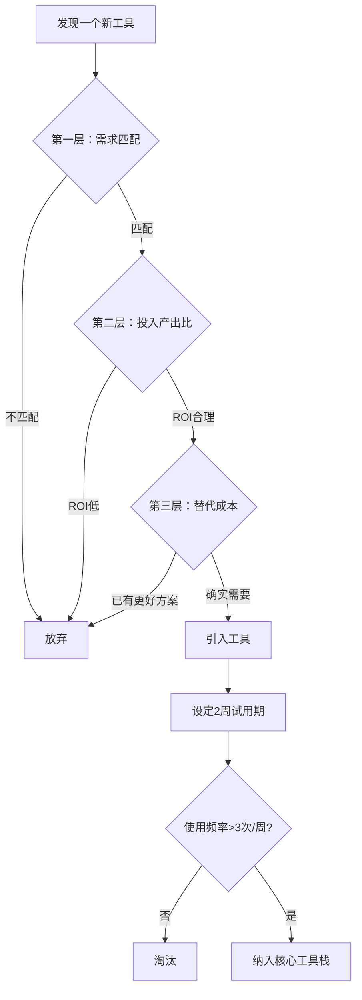
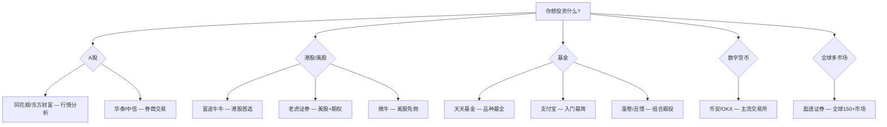
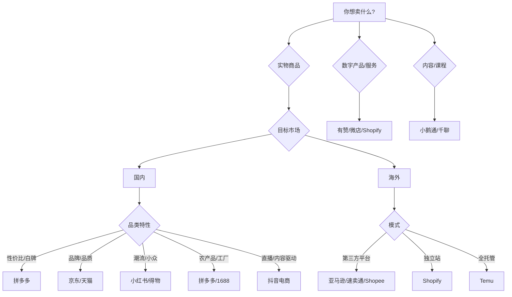
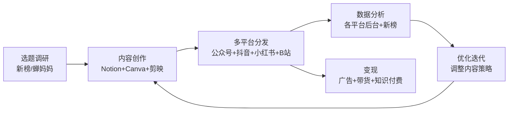
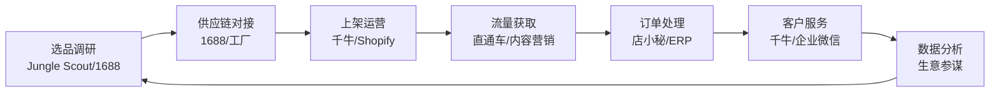
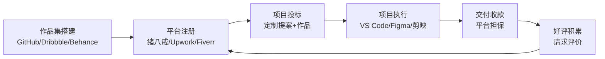

# 附录D 搞钱工具大全

> **工欲善其事，必先利其器。** 但比拥有工具更重要的，是知道什么时候用什么工具、为什么用、怎么用。本附录不仅列出100+款搞钱必备工具，更提供选择方法论、工具组合工作流和决策框架，帮你从"收藏一堆工具"进化到"构建自己的搞钱武器库"。

***

## 〇、工具选择方法论

在翻阅工具清单之前，先建立正确的工具观。多数人的问题不是缺少工具，而是工具太多、用得太浅。

### 工具选择的三层过滤模型

**第一层：需求匹配**——这个工具解决的是不是你当下真正的问题？很多人看到"好用的工具"就想试，但如果你当前的核心瓶颈是流量获取，那再好的记账工具也帮不上忙。先定义问题，再找工具。

**第二层：投入产出比**——学习成本、订阅费用、时间投入，与它能带来的效率提升或收入增长相比，是否值得？一个收费$100/月的工具如果能帮你每月多赚$1000，那就是好投资；如果只是"用起来舒服"，那就值得三思。

**第三层：替代成本**——你是否已经有类似功能的工具？每增加一个工具就增加一份上下文切换成本。能用现有工具解决的问题，不要引入新工具。

### 工具栈的"少而精"原则

搞钱工具栈的理想状态是**每个领域1-2个核心工具**，而不是每个领域收藏10个APP。核心工具的标准：

| 维度 | 合格标准 |
|------|---------|
| 使用频率 | 每周至少使用3次 |
| 学习曲线 | 1周内能上手核心功能 |
| 数据连通 | 能导出数据或与其他工具集成 |
| 成本可控 | 费用不超过该领域预期收入的10% |
| 稳定可靠 | 至少运营2年以上，非小型创业公司产品 |

### 数据安全红线

涉及财务数据的工具，必须遵守以下安全原则：

1. **大平台优先**——涉及银行账户、交易记录的工具，只用头部平台（支付宝、同花顺、富途等），不用小众不知名APP
2. **权限最小化**——只授权工具必要的权限，不给通讯录、相册等无关权限
3. **独立密码**——每个金融工具使用不同的强密码，配合密码管理器（如1Password、Bitwarden）
4. **双重验证**——所有涉及资金的账户开启二次验证（短信+TOTP）
5. **定期审计**——每季度检查一次各工具的授权和登录记录

***

## 一、记账与财务管理工具

记账是搞钱的起点。只有清楚每一分钱的流向，才能做出理性的财务决策。记账工具的选择核心是：**你愿意坚持用哪个，哪个就是最好的。**

### 记账工具横向对比

| 工具 | 平台 | 自动同步银行 | 多币种 | 预算管理 | 费用 | 最佳场景 |
|------|------|:---:|:---:|:---:|------|---------|
| 随手记 | iOS/Android | ✅(部分) | ❌ | ✅ | 免费/¥128年 | 国内个人/家庭综合记账 |
| MoneyWiz | 全平台 | ✅(海外) | ✅ | ✅ | 免费/¥348年 | 有海外账户的多币种用户 |
| YNAB | Web/移动端 | ✅(海外) | ✅ | ✅(核心) | $99/年 | 需要严格预算纪律的用户 |
| 挖财 | iOS/Android | ✅(部分) | ❌ | ✅ | 免费 | 需要综合财务管理+信用卡管理 |
| 鲨鱼记账 | iOS/Android | ❌ | ❌ | ✅ | 免费 | 只需要极简记账的用户 |
| Copilot Money | iOS/Mac | ✅(美国) | ✅ | ✅ | $49.99/年 | 美国银行账户用户 |

### 1. 随手记

**功能介绍：** 国内用户量最大的个人记账软件，支持手动、拍照、语音等多种记账方式。内置丰富的账本模板，支持多人共享账本、预算管理、账单分析，可自动同步部分银行账单并生成可视化财务报表。

**适用人群：** 个人用户、家庭用户、刚入门的理财新手。

**优势分析：** 功能全面是随手记最大的优势。从最简单的"今天花了多少"到"家庭年度财务报表"，随手记都能覆盖。社区功能让用户可以参考别人的记账分类和预算设置，降低入门门槛。多人共享账本功能适合情侣或家庭共同管理财务。

**局限提醒：** 免费版广告频繁，且部分高级功能（如多账本、高级报表）需要付费解锁。数据导出仅支持CSV格式，如果后续想迁移到其他工具会比较麻烦。隐私方面，同步银行账单意味着你的消费数据存储在随手记服务器上，需评估隐私接受度。

**费用：** 基础版免费；高级会员约 ¥128/年。

### 2. MoneyWiz

**功能介绍：** 全球知名的跨平台记账应用，支持iOS、Android、Mac、Windows多平台同步。可自动导入16000+家全球银行账单，支持预算管理、投资追踪、多币种管理，提供详细的财务报表和图表分析。

**适用人群：** 有海外账户的用户、多币种需求者、追求专业记账体验的用户。

**优势分析：** MoneyWiz的核心竞争力在于多币种支持和全球银行同步。如果你同时有国内和海外账户，MoneyWiz能把所有资产放在一个视图里。报表功能专业度高，支持自定义报告周期和分类维度。

**局限提醒：** 国内银行支持有限，主要是招商银行等少数几家。中文本地化不够完善，部分菜单和说明仍为英文。订阅价格不低，需要确认是否能充分利用其多币种和多账户功能。

**费用：** 免费版（功能受限）；Premium 订阅 ¥45/月 或 ¥348/年。

### 3. YNAB（You Need A Budget）

**功能介绍：** 以"零基预算"理念为核心的个人理财工具，核心原则是"每一元钱都有任务"。支持实时同步银行账户、目标追踪、债务管理、财务报告。YNAB不只是一款记账软件，更是一套完整的预算方法论。

**适用人群：** 有明确理财目标的用户、需要严格预算管理的人、海外用户。

**为什么值得单独说：** YNAB的四个核心原则构成了它独特的方法论：(1)给每一块钱分配工作——收入到账时就规划好用途；(2)接纳真实支出——为年度费用（保险、年费等）按月分摊；(3)灵活调整——超支时从其他类别借调，而非放弃预算；(4)活用上月收入——目标是用上个月的收入支付本月开销，实现财务缓冲。这套方法论比工具本身更有价值。

**局限提醒：** 不支持国内银行同步，全英文界面，学习曲线较陡。订阅价格较高（$99/年），且需要真正投入时间学习其方法论才能发挥价值。如果只是想简单记个账，YNAB太重了。

**费用：** $14.99/月 或 $99/年（约 ¥108/月 或 ¥720/年）。

### 4. 挖财

**功能介绍：** 国内老牌个人财务管理平台，集记账、理财、信用管理于一体。支持自动记账、账单导入、预算设置、资产分析，还提供理财产品推荐和信用卡管理服务。

**适用人群：** 需要综合财务管理的用户、关注信用卡权益的用户。

**特色功能：** 挖财的信用卡管理模块是其差异化优势，可以追踪多张信用卡的账单日、还款日、积分和权益。对于持有多张信用卡的用户，这个功能能避免逾期和浪费权益。

**局限提醒：** APP内推荐的理财产品需要谨慎对待——平台有推广利益关系，推荐的不一定是最优选择。界面功能堆砌较多，初次使用可能感到混乱。

**费用：** 基础功能免费；增值服务另计。

### 5. 鲨鱼记账

**功能介绍：** 极简风格的记账应用，主打快速记账。支持一键记账、周期记账、预算管理、账单统计等基础功能，界面清爽无广告。

**适用人群：** 喜欢简洁风格的用户、记账新手、只需要基础记账功能的人。

**最佳使用场景：** 如果你的需求就是"每天花了多少钱、花在哪里"，鲨鱼记账够用了。它的极简设计反而是一种优势——没有花哨功能的诱惑，让你专注于记账本身。打开→记一笔→关掉，3秒完成。对于记账习惯尚未养成的新手，低门槛和低干扰比功能全面更重要。

**费用：** 完全免费。

### 6. 叨叨记账

**功能介绍：** 创新的社交化记账应用，用户可设置虚拟"AI伴侣"陪伴记账。支持手动记账、分类管理、预算提醒等功能，通过拟人化对话增加记账趣味性。

**适用人群：** 年轻用户、觉得记账枯燥需要激励的人。

**本质分析：** 叨叨记账解决的核心问题是"记账坚持不下来"。通过社交化和游戏化机制提升粘性，对于确实需要外部激励才能坚持记账的用户有帮助。但要警惕：社交化功能容易分散注意力，如果发现自己花在"和AI伴侣聊天"的时间比记账还多，说明这个工具可能适得其反。

**费用：** 基础免费；增值服务 ¥30-100 不等。

### 7. Timi时光记账

以时间轴方式展示收支记录，支持多账本、预算管理、标签分类、数据导出。界面设计清新，适合喜欢时间线记录方式的用户。基础免费，Pro版 ¥98/年。

### 8. 财智理财

专业的家庭财务管理软件，支持收支管理、投资账户管理、房产估值、保险管理等全方位财务功能，提供详细的资产负债表和现金流分析。适合有复杂资产配置需求的家庭用户。基础免费，专业版 ¥168/年。

### 9. Copilot Money

基于AI的智能理财助手，自动分类交易、追踪预算、管理投资组合。AI分类准确率高，界面设计精美。仅支持美国银行，不适合中国用户。$5.99/月或$49.99/年。

### 10. Mint（已并入Credit Karma）

Intuit旗下的知名个人理财工具，2024年并入Credit Karma。提供免费的财务全景视图，包括账户追踪、信用评分监控、预算管理。仅限美国用户，免费。

### 11. 随享记账（微信小程序）

基于微信小程序的轻量级记账工具，无需下载安装。支持快速记账、分类管理、数据统计。适合不想下载APP的轻度记账需求者。免费。

***

## 二、投资交易平台

投资是让钱生钱的核心途径。选择交易平台的关键不是"哪个最好"，而是"你要交易什么品种"和"你在哪个市场"。

### 投资平台选择决策树

### A股投资工具对比

| 工具 | 定位 | 行情数据 | 交易接入 | 研报 | 费用 |
|------|------|---------|---------|------|------|
| 同花顺 | 行情+分析 | 最全面 | 多券商 | ✅ | 免费/L2 ¥198年 |
| 东方财富 | 门户+券商 | 全面 | 自家券商 | ✅ | 佣金万2.5起 |
| 巨潮资讯 | 官方公告 | 基础 | ❌ | ❌ | 免费 |
| 腾讯自选股 | 轻量看盘 | 基础 | ❌ | ❌ | 免费 |

### 港美股券商对比

| 券商 | 美股佣金 | 港股佣金 | 开户难度 | 期权 | 特色 |
|------|---------|---------|---------|:---:|------|
| 富途牛牛 | $0.0049/股 | 0.03% | 中(需港卡) | ✅ | 港股打新、社区 |
| 老虎证券 | $0.005/股 | 0.029% | 低 | ✅ | 多市场、开户快 |
| 微牛 | 免佣 | — | 低 | ✅ | 美股零佣金 |
| 盈透证券 | $0.0035/股起 | 0.015%起 | 中 | ✅ | 全球150+市场 |

### 12. 雪球

国内领先的投资社区和交易平台，提供A股、港股、美股的行情数据、研报分析和社区讨论。用户可以关注投资大V、参与话题讨论、创建模拟组合和实盘交易。

**核心价值：** 雪球的核心不是交易功能，而是社区内容。高质量的投资分析帖和讨论串是其护城河。但需要提醒：社区信息需自行甄别，任何人的"投资分析"都不应成为你买卖的唯一依据。建议把雪球当作信息来源和思路启发，而非交易信号。

**费用：** 基础免费；雪球Pro会员 ¥298/年。

### 13. 富途牛牛（Futu）

富途证券旗下的智能交易平台，支持港股、美股、A股（沪深港通）交易。提供实时行情、深度数据、智能盯盘、条件单等功能。

**为什么港股首选富途：** 港股打新是富途的核心优势——界面友好、中签率展示清晰、一键申购。对于想参与港股打新的用户，富途是体验最好的选择。此外，富途的行情速度在港美股券商中属于第一梯队。

**开户门槛：** 需要香港银行卡或其他海外银行账户。如果还没有，可以通过内地见证开户或亲自赴港办理。

**费用：** 美股佣金 $0.0049/股（最低 $0.99）；港股佣金 0.03%（最低 ¥3）。

### 14. 老虎证券（Tiger Brokers）

专注于美股和港股的互联网券商，支持全球市场的股票、期权、ETF交易。开户比富途更便捷，支持身份证直接开户。美股和港股佣金与富途相当。适合想快速开始港美股交易的用户。

**费用：** 美股佣金 $0.005/股（最低 $1）；港股 0.029%（最低 ¥3）。

### 15. 同花顺

国内最大的股票行情软件之一，A股数据全面，技术分析工具强大，支持多家券商交易接入。是A股投资者的标配工具。

**核心优势：** 同花顺的"问财"功能可以用自然语言选股，比如输入"连续3年ROE超过15%的消费股"，系统自动筛选。这个功能对基本面投资者非常实用。此外，同花顺的模拟炒股功能适合新手练手。

**费用：** 基础免费；Level-2行情 ¥198/年。

### 16. 东方财富

国内综合性财经门户和券商，信息全面及时，旗下天天基金是头部基金销售平台。券商佣金较低（万2.5起），基金申购费率1折起。缺点是广告泛滥、社区水军较多。

### 17. 天天基金

东方财富旗下的基金销售平台，基金品种最齐全，申购费率1折起。定投功能好用，支持智能定投（根据估值自动调整定投金额）。适合长期基金定投用户。

### 18. 蛋卷基金

雪球旗下的基金投资平台，主打智能投顾和基金组合投资。"蛋卷组合"提供一键跟投功能，省去选基金的烦恼。适合没时间研究基金但想做资产配置的用户。

### 19. 华泰证券（涨乐财富通）

国内头部券商，佣金可谈到万1.3（业内最低水平之一），研究报告质量高。适合A股交易量较大的用户——佣金每降0.1个万分点，年交易额100万就能省100元。

### 20. 微牛（Webull）

面向全球投资者的智能交易平台，美股、ETF免佣金，图表分析功能强大。开户门槛低，适合对交易成本敏感的美股投资者。

### 21. Interactive Brokers（盈透证券）

全球最大的网络券商之一，支持全球150+市场的股票、期权、期货、外汇、债券交易。全球市场覆盖最广，融资利率低（约5.8%），适合专业投资者和全球化资产配置者。缺点是界面复杂，学习成本高。

### 22. 支付宝（理财板块）

操作极其简单的理财入口。余额宝适合存放流动资金（随取随用），基金购买1折费率。适合理财新手的第一步——先从余额宝开始，养成"让闲钱生钱"的意识，再逐步学习基金等产品。

### 23. 且慢

盈米基金旗下的基金投顾平台，主打"帮你投"的基金组合策略。投顾服务费0.25%-0.5%/年，适合完全不想自己选基金、愿意付费让专业人士打理的用户。

### 24. 腾讯自选股

腾讯出品的轻量级股票行情工具，界面简洁，支持微信小程序直接使用。适合只需要看看行情、不需要复杂分析的轻度股票用户。

### 25. Portfolio Visualizer

专业的投资组合分析工具，支持回测、蒙特卡洛模拟、因子分析、资产配置优化。适合量化投资爱好者和专业投资者做深度策略研究。全英文，学习门槛高。基础免费，专业版$29/月。

### 26. 巨潮资讯

中国证监会指定的上市公司信息披露网站，所有上市公司公告、财报、监管信息的权威来源。做基本面分析必看，完全免费。

***

## 三、副业与自由职业平台

副业搞钱的核心不是"找到一个平台"，而是"把你的技能变成可交易的产品"。以下平台是你的"技能变现渠道"。

### 副业平台选择矩阵

| 你的技能 | 国内平台 | 海外平台 | 建议起步方式 |
|---------|---------|---------|------------|
| 编程开发 | 程序员客栈、码市 | Upwork、Toptal | 先在程序员客栈接小项目积累评价 |
| 设计 | 猪八戒、一品威客 | Fiverr、Dribbble | 闲鱼挂服务+小红书展示作品 |
| 文案写作 | 猪八戒、时间财富 | Upwork、Medium | 公众号投稿+知乎回答积累影响力 |
| 翻译 | 有道翻译、Gengo | Upwork、ProZ | 先做低价单积累评价和经验 |
| 数据分析 | 程序员客栈 | Upwork、Kaggle | 在Kaggle上做项目展示能力 |
| 咨询顾问 | 在行 | Clarity.fm | 先免费咨询3-5人积累口碑 |

### 自由职业平台费用对比

| 平台 | 抽成比例 | 结算周期 | 门槛 | 特色 |
|------|---------|---------|------|------|
| 猪八戒 | ~20% | 项目完成后 | 低 | 品类最全、单量大 |
| 一品威客 | 10%-20% | 项目完成后 | 低 | 悬赏/雇佣/计件多模式 |
| Fiverr | 20% | 订单完成后 | 低 | 全球客户、Gig模式 |
| Upwork | 10%-20% | 按周/项目 | 中 | 项目质量高、长期合作 |
| Toptal | 协商 | 按月 | 极高(3%通过率) | 顶级客户、时薪$60-200+ |
| 程序员客栈 | 10%-15% | 项目完成后 | 中高 | 技术社区、项目质量好 |

### 27. 猪八戒网

国内最大的服务众包平台，涵盖设计、开发、营销、文案、知识产权等数百个品类。

**实操建议：** 新手在猪八戒起步的关键是"低价跑量+好评积累"。前5单可以适当降价（但不要亏本），目标是拿到5个五星好评。有了好评基础后，再逐步提价。另外，完善个人主页和作品集比海投项目更有效——80%的客户是通过搜索和浏览找到服务商的，而不是通过竞标。

**费用：** 注册免费；平台抽成约20%。

### 28. 一品威客

另一个大型服务众包平台，支持悬赏模式、雇佣模式和计件模式。悬赏模式适合设计师（多个方案竞争，客户选最优），雇佣模式适合长期合作。平台服务费10%-20%。

### 29. Fiverr

全球最大的自由职业市场之一，以"Gig"（服务包）为单位展示服务。$5起步定价只是历史惯例，实际可以自由定价。

**中国卖家的机会：** Fiverr上中文相关的服务（中文翻译、中国市场调研、中文配音、中国社交媒体运营等）竞争相对较小，是差异化的好方向。另外，技术类服务（WordPress建站、数据处理、自动化脚本）的需求量大且标准化程度高，适合新手起步。

**费用：** 注册免费；平台抽取卖家20%佣金。

### 30. Upwork

全球最大的项目制自由职业平台，项目质量较高，支持长期合作。新账号获得第一个项目是最大难点——建议先投一些小型固定价格项目（$50-200），附上详细的提案和相关作品，而不是盲目投大项目。Connects是投递项目所需的"货币"，每个$0.15，合理使用。

**费用：** 注册免费；抽成10%-20%（阶梯式，收入越多抽成越低）。

### 31. 程序员客栈

国内专业的程序员远程工作平台，项目质量高、薪资水平好。入驻门槛较高，需要通过技术审核。适合有2年以上工作经验的程序员。平台服务费约10%-15%。

### 32. 开源众包

开源中国旗下的软件众包平台，项目技术性强，有技术社区背书。项目规模偏大，更适合团队而非个人接单。平台服务费约5%-10%。

### 33. 时间财富网

综合性服务外包平台，品类多样，支持竞标和直接雇用模式。知名度不如猪八戒，但竞争也相对小一些。平台服务费约10%-20%。

### 34. Toptal

全球顶级自由职业者平台，只接受前3%的申请者。时薪$60-$200+，客户包括Airbnb、HP等知名企业。入驻需要通过多轮技术面试和实操测试，但一旦进入，收入水平远超其他平台。

### 35. 市场调研平台（问卷星/调查派）

填写市场调查问卷获得报酬。每份问卷几元到几十元不等，适合利用碎片时间赚零花钱。注意：正规调研平台不会让你先交钱，遇到要交"会员费"或"保证金"的问卷平台，基本是骗局。

### 36. 淘宝客（淘宝联盟）

通过推广淘宝/天猫商品赚取佣金的模式。零成本启动，但核心挑战是获取流量。如果你有公众号、社群、小红书粉丝等流量来源，淘宝客是成熟的变现方式。佣金比例通常1%-50%不等，取决于品类。

### 37. 在行

果壳网旗下的知识付费平台，连接行业专家和需要咨询的人。一对一咨询，专家自定价（通常¥200-1000/次）。适合有行业知名度和独特经验的专业人士。平台抽成约20%-30%。

### 38. 闲鱼（技能服务）

闲鱼不仅是二手交易平台，也是技能服务的活跃市场。可以在闲鱼上出售设计、翻译、编程、写文案、PPT制作等各类服务。

**闲鱼副业的核心逻辑：** 闲鱼的流量来自搜索和推荐，关键在于标题关键词优化和主图吸引力。标题要包含用户会搜索的关键词（如"PPT代做""logo设计""Python爬虫"），主图要展示作品效果而非纯文字。定价策略：先用低价（如9.9元）引流，通过优质服务转化成高价复购客户。

### 39. 码市（Coding）

CSDN旗下的软件众包平台，依托CSDN技术社区。项目技术含量高，但数量有限，抽成比例不透明。

### 40. 拉勾大鲲

拉勾旗下的人才共享平台，提供技术人才的短期项目合作。平台靠谱，项目对接高效，结算有保障。品类集中在技术领域。

***

## 四、电商平台与工具

电商是最主流的搞钱方式之一，但不是"开个店就能赚钱"。选择平台的核心逻辑是：**你的产品是什么 × 你的目标客户在哪里 × 你能投入多少资源。**

### 电商平台选择决策矩阵

### 国内电商平台综合对比

| 平台 | 流量规模 | 入驻门槛 | 运营难度 | 适合品类 | 费用结构 |
|------|---------|---------|---------|---------|---------|
| 淘宝 | ★★★★★ | 低 | 高 | 全品类 | 免费开店/佣金3-5% |
| 天猫 | ★★★★★ | 高(5-15万) | 高 | 品牌商品 | 保证金+佣金3-5% |
| 京东 | ★★★★ | 中高 | 中 | 3C/家电/品质 | 保证金¥5K-5万+佣金3-10% |
| 拼多多 | ★★★★★ | 低 | 中 | 性价比/农产品 | 保证金¥1K-1万+0.6% |
| 抖音电商 | ★★★★★ | 中 | 高 | 内容驱动品类 | 保证金¥2K-2万+1-5% |
| 快手电商 | ★★★★ | 低 | 中 | 下沉市场 | 保证金¥500起+1-5% |
| 小红书 | ★★★ | 中 | 中 | 美妆/时尚/家居 | 保证金¥1K-5万+1-5% |
| 得物 | ★★★ | 中 | 低 | 潮流/球鞋/美妆 | 服务费5-10%+鉴别费 |

### 41. 淘宝/天猫

国内最大的C2C和B2C电商平台，流量巨大，生态完善。淘宝适合个体经营者和中小卖家，天猫适合品牌商家。

**2026年淘宝生态现状：** 流量成本持续上升，中小卖家获客越来越难。新卖家的突围策略：(1)找到细分品类的差异化切入点，不要和大卖家正面竞争；(2)做好内容化运营（短视频、直播、图文种草），淘宝正在大力扶持内容型商家；(3)重视老客户复购，私域运营（微信群、淘宝群）的ROI远高于拉新。

**费用：** 淘宝开店免费；天猫保证金5-15万；佣金3%-5%。

### 42. 拼多多

以社交拼团模式起家，主打性价比商品，用户规模超8亿。近年大力发展品牌化和农产品上行。

**拼多多的核心逻辑：** 拼多多的算法核心是"价格力"——同品类中价格越低，获得的流量越多。这意味着：如果你有供应链成本优势（工厂直供、产地直发），拼多多是最佳选择；如果你是中间商或品牌商，拼多多可能不是最优渠道（除非你愿意做特供款）。

**注意：** 拼多多的罚款规则非常严格，发货超时、虚假发货、描述不符都可能被罚款。务必仔细阅读平台规则。

**费用：** 保证金¥1000-10000；技术服务费0.6%。

### 43. 京东

国内第二大电商平台，以自营和物流见长。用户质量高、消费能力强，适合品质商品和品牌商家。入驻门槛较高，佣金3%-10%不等。

### 44. Shopify

全球最流行的独立站建站工具，一站式电商解决方案。建站简单快速，模板丰富，插件生态完善。

**Shopify vs 平台开店的核心区别：** 在淘宝/亚马逊上开店，流量来自平台；用Shopify建独立站，流量需要自己获取（SEO、社媒、广告）。独立站的优势是你拥有客户数据和品牌资产，不受平台规则变化影响；劣势是前期流量获取成本高。适合有一定品牌意识和营销能力的卖家。

**费用：** Basic $39/月；Shopify $105/月；Advanced $399/月。

### 45. 有赞

国内领先的SaaS服务商，特别适合微信生态内的电商运营。微商城+小程序商城+CRM+营销工具全链路覆盖。基础版¥6800/年起，适合已有一定客户基础的品牌做私域电商。

### 46. 微店

基于移动端的开店工具，开店零门槛，与微信深度整合。功能较简单，适合小微卖家和兼职开店者。交易手续费1%。

### 47. 1688

阿里巴巴旗下的B2B批发平台，是国内最大的供应链源头。**不是用来卖东西的，而是用来找货源的。** 电商卖家的核心技能之一就是在1688上找到质优价廉的供应商。支持一件代发，适合无库存的代发模式。

### 48. 抖音电商（抖店）

基于短视频和直播的电商模式，通过内容吸引用户购买。

**抖音电商的本质：** 抖音电商不是传统电商，而是"内容电商"。核心竞争力不是价格，而是内容能力——你能不能拍出让人想买的短视频，能不能在直播间里留住人。如果你或你的团队没有内容创作能力，抖音电商不适合你。

**费用：** 保证金¥2000-20000；技术服务费1%-5%。

### 49. 快手电商

依托快手的直播和短视频生态，用户粘性强，复购率高。下沉市场优势明显。适合面向三四线城市和农村市场的商家。费用结构与抖音类似。

### 50. 小红书商城

基于小红书内容社区的电商平台，主打"种草-拔草"闭环。用户质量高，种草转化效果好。特别适合美妆、时尚、家居、母婴等品类。2026年小红书电商正在快速发展，是值得关注的增长渠道。

### 51. 得物（Poizon）

潮流电商平台，采用"先鉴别，再发货"的模式。年轻用户多，鉴别服务增强信任。适合球鞋、潮牌、美妆等潮流品类。技术服务费5%-10%加鉴别费。

### 52. 千牛（淘宝卖家工具）

淘宝天猫商家的工作台，店铺管理、订单处理、客服沟通、数据分析、营销推广一站式搞定。免费，淘宝天猫卖家必装。

***

## 五、内容创作与变现工具

内容创作是2026年最具杠杆效应的搞钱方式。一次创作，长期收益——优质内容的长尾效应是其他赚钱方式无法比拟的。

### 内容创作工具选择逻辑

| 创作形式 | 入门工具 | 专业工具 | AI辅助工具 |
|---------|---------|---------|-----------|
| 短视频 | 剪映 | Premiere Pro | 剪映AI功能 |
| 图文设计 | Canva/稿定设计 | Photoshop/Illustrator | Canva AI |
| 长文写作 | 石墨文档/飞书 | Notion/Obsidian | ChatGPT/文心一言 |
| 播客音频 | 手机录音+小宇宙 | Audacity/Logic Pro | 讯飞听见 |
| 直播 | 手机直播 | OBS Studio | 虚拟背景/美颜 |
| 课程制作 | 小鹅通/千聊 | ScreenFlow+Keynote | AI字幕/配音 |

### 53. 剪映

字节跳动旗下的视频编辑工具，功能强大且基础版免费。AI字幕识别准确率高，模板丰富，与抖音深度整合。

**搞钱必备功能：** (1)一键成片——导入素材自动生成视频，适合批量生产内容；(2)图文成片——输入文字自动生成视频，适合知识类内容创作者；(3)AI去水印和智能抠像——提升视频质量。专业版¥30/月或¥168/年。

### 54. Canva

全球最流行的在线设计工具，零设计基础也能做出专业级作品。模板极其丰富，覆盖海报、社交媒体图片、演示文稿、视频等。

**Canva的搞钱场景：** (1)做社交媒体配图——小红书、公众号、抖音封面；(2)做电商主图和详情页——淘宝、Shopify产品图；(3)做课程PPT和资料——知识付费产品包装。Pro版¥99/月或¥588/年。

### 55. Notion

集笔记、知识库、项目管理、数据库于一体的全能工具。可以搭建个人写作系统、内容日历、项目看板、CRM等。适合内容创作者管理整个工作流。个人免费，Plus $10/月。

### 56. 小宇宙

国内最流行的播客平台，中文播客首选。社区氛围好，适合播客创作者发布和运营节目。播客变现方式包括：商业合作、付费节目、引流到其他变现渠道。

### 57. 稿定设计

国内在线设计工具，特别针对电商场景优化。电商主图、详情页、海报模板丰富，抠图功能强大。适合电商卖家快速出图。VIP ¥30/月或¥199/年。

### 58. 石墨文档

国内领先的在线协作文档工具，中文支持优秀，协作体验好。适合团队协作写作和内容策划。个人免费，高级版¥720/年/人。

### 59. 飞书文档

字节跳动旗下的协作平台，多维表格功能强大，标准版免费。适合内容团队做项目管理和知识管理。

### 60. 讯飞听见

科大讯飞的语音转文字工具，AI识别准确率高，支持多种方言。采访录音、会议记录、视频字幕生成的利器。转写¥0.33/分钟起。

### 61. EV剪辑

轻量级免费视频编辑工具，录屏+剪辑一体化。适合制作简单的教程和演示视频。完全免费。

### 62. Adobe Creative Cloud

Photoshop、Premiere Pro、After Effects、Illustrator等专业创作工具套装，行业标准。适合专业设计师和视频创作者。摄影计划¥888/年，全套¥6540/年。

### 63. 知乎（创作变现）

知乎的长尾流量和SEO效果是其核心优势。一篇高质量的知乎回答可以持续带来数月甚至数年的流量。变现方式多样：好物推荐（带货佣金）、知乎Live（付费讲座）、盐选专栏（付费内容）、付费咨询。关键策略：选择你擅长的垂直领域，持续输出深度内容，建立专业人设。

### 64. 公众号（微信公众号）

国内最重要的内容创作和私域流量阵地。2026年公众号的打开率虽然在下降，但其私域价值依然不可替代——公众号粉丝是你真正拥有的流量资产，不受算法变化影响。变现方式：广告（流量主）、付费阅读、带货、引流到其他变现渠道。

### 65. OBS Studio

开源免费的直播和录屏软件，功能强大专业，插件丰富。支持多场景切换、音视频混合、多平台推流。是专业主播和课程录制者的标配工具。学习门槛较高，但一旦掌握，是功能最强大的免费直播方案。

***

## 六、社交媒体运营工具

社交媒体是连接用户、建立个人品牌、实现变现的重要渠道。2026年的核心趋势是：**全域运营——不是只做一个平台，而是以一个核心内容为基础，分发到多个平台。**

### 社交媒体平台变现能力对比

| 平台 | 用户规模 | 内容形式 | 变现门槛 | 变现天花板 | 核心变现方式 |
|------|---------|---------|---------|-----------|------------|
| 微信生态 | 13亿+ | 图文/视频/直播 | 中 | 极高 | 广告/带货/知识付费/私域 |
| 抖音 | 7亿+DAU | 短视频/直播 | 低 | 极高 | 直播打赏/带货/广告 |
| 小红书 | 3亿+ | 图文/短视频 | 低 | 高 | 品牌合作/带货 |
| B站 | 3亿+ | 中长视频 | 高(1000粉+10万播放) | 中高 | 广告分成/充电/商单 |
| 微博 | 5亿+ | 图文/短视频 | 中 | 中高 | 广告/话题营销 |
| 快手 | 4亿+DAU | 短视频/直播 | 低 | 高 | 直播打赏/带货 |

### 66. 微信生态（公众号+视频号+小程序）

微信生态是国内最大的社交平台，三者组合构建完整的私域流量闭环：公众号做内容沉淀和粉丝触达，视频号做短视频和直播引流，小程序做服务和交易转化。

**2026年视频号的红利：** 视频号是微信生态中增长最快的板块，背靠微信13亿用户的社交关系链，天然具备"社交推荐"的分发优势。对于已有公众号粉丝基础的创作者，视频号是必须布局的增量渠道。

### 67. 抖音

国内最大的短视频平台，日活超过7亿。算法推荐机制相对公平——即使0粉丝，优质内容也能获得曝光。变现方式多样：直播打赏、直播带货、短视频带货、星图广告、引流私域。

**抖音搞钱的核心公式：** 收入 = 流量 × 转化率 × 客单价 × 复购率。提升每个变量的方法不同——流量靠内容质量和发布频率，转化率靠人设信任和产品匹配，客单价靠产品组合和价值包装，复购率靠产品质量和私域运营。

### 68. 小红书

国内领先的生活方式社区，用户以年轻女性为主。在美妆、时尚、家居、旅行、美食等领域有强影响力。

**小红书的独特变现逻辑：** 小红书的"种草"属性使其变现路径与抖音不同。在小红书上，内容本身就是广告——一篇真实的"好物分享"笔记，既是有价值的内容，也是有效的带货。关键是保持"真实感"，过度商业化的内容在小红书上效果很差。

### 69. B站（哔哩哔哩）

国内领先的年轻人文化社区，用户粘性极高，社区氛围好。长尾流量好——B站视频的生命周期远长于抖音。变现门槛较高（1000粉+10万播放才能开通收益），但一旦突破门槛，变现路径多样：广告分成、充电计划、花火商业合作。

### 70. 微博

国内最大的开放式社交媒体平台，热点传播速度快，适合打造个人影响力和品牌传播。但用户活跃度持续下降，广告泛滥。适合作为辅助渠道，不适合作为主阵地。

### 71. 新榜

国内领先的内容营销服务平台，提供跨平台数据分析、达人对接、内容营销等服务。适合内容运营人员和品牌方做数据驱动的决策。高级版¥3000+/年。

### 72. 蝉妈妈

抖音数据分析工具，达人分析、商品分析、直播分析、投放分析全覆盖。抖音从业者必备。专业版¥1688/年起。

### 73. 千聊/小鹅通

知识付费SaaS平台，帮助内容创作者搭建自己的知识店铺。支持直播课、录播课、训练营、社群等多种形式。小鹅通基础版¥4800/年，千聊免费入驻+抽成。

### 74. 西瓜视频

字节跳动旗下的中视频平台，有"中视频伙伴计划"，创作者可根据播放量获得收益。与抖音互通，适合中视频创作者。

### 75. 即刻

兴趣社交平台，用户群体偏互联网和创业圈。适合建立行业人脉和个人品牌，但用户规模较小，商业化能力有限。

### 76. 草料二维码

国内最大的二维码生成和管理平台，支持活码、批量生码、数据统计。适合营销推广中的二维码管理需求。基础免费，高级版¥2000+/年。

***

## 七、跨境电商工具

跨境电商是将中国商品卖向全球的重要方式。2026年跨境电商的核心趋势是：**全托管模式兴起**（Temu、TikTok Shop）降低了卖家运营门槛，但也压缩了利润空间。选平台还是建独立站，取决于你对品牌和利润的诉求。

### 跨境电商平台对比

| 平台 | 目标市场 | 模式 | 入驻门槛 | 利润空间 | 运营难度 |
|------|---------|------|---------|---------|---------|
| 亚马逊 | 北美/欧洲/日本 | 第三方卖家 | 中高 | 中高 | 高 |
| 速卖通 | 全球220+国家 | 第三方卖家 | 低 | 低 | 中 |
| Shopee | 东南亚 | 第三方卖家 | 低 | 低 | 中 |
| Temu | 北美/欧洲 | 全托管 | 低 | 极低 | 低 |
| TikTok Shop | 全球 | 社交电商 | 中 | 中 | 高 |
| Etsy | 全球 | 手工/创意 | 低 | 高 | 中 |
| eBay | 全球190+市场 | 拍卖/固定 | 低 | 中 | 中 |
| Shopify独立站 | 自定义 | 独立站 | 低 | 高 | 高 |

### 77. 亚马逊（Amazon）

全球最大的电商平台，FBA物流体系成熟，品牌信任度高。专业卖家$39.99/月，佣金8%-15%。竞争激烈、运营规则复杂、封号风险是主要挑战。适合有供应链优势和品牌意识的卖家。

### 78. 速卖通（AliExpress）

阿里巴巴旗下的跨境电商平台，覆盖全球220+国家。入驻门槛低，适合中小跨境卖家和有价格优势的工厂商家。保证金¥10000起，佣金5%-8%。

### 79. Shopee（虾皮）

东南亚最大的电商平台，市场增长快，入驻门槛低，平台补贴多。但利润率较低、物流时效长、客单价低。适合面向东南亚市场的跨境新手。免入驻费，佣金1%-6%。

### 80. Temu

拼多多旗下的跨境电商平台，采用全托管模式——卖家只需供货，平台负责运营、定价、物流。增长迅猛，但利润被压缩严重，定价权在平台手中。适合有强供应链优势的工厂商家。

### 81. TikTok Shop

TikTok旗下的电商平台，通过短视频和直播带货。流量红利大，社交电商模式新颖。规则不稳定、退货率高、需要内容能力。适合有内容创作能力的跨境卖家。佣金1%-8%。

### 82. Etsy

全球最大的手工艺品和创意商品电商平台，客单价高，买家愿意为独特性付费。适合手工艺人、设计师、创意商品卖家。Listing费$0.20/个，交易佣金6.5%。

### 83. eBay

全球老牌跨境电商平台，支持拍卖和固定价格销售。在二手商品、收藏品、电子产品等品类有优势。每月250个免费Listing，佣金2.9%-15%。

### 84. WorldFirst（万里汇）

蚂蚁集团旗下的跨境支付平台，支持多币种收款、换汇、付款。费率最高0.3%，到账快，支持亚马逊、eBay、Shopee等平台收款。开户免费。

### 85. PingPong

国内领先的跨境支付服务商，费率最高1%，到账速度快。提供全球收款、VAT缴纳、供应商付款等一站式资金解决方案。开户免费。

### 86. Jungle Scout

亚马逊卖家必备的选品和市场研究工具。产品数据库、关键词分析、竞品追踪、销量预估、利润计算功能齐全。Basic $49/月，Suite $69/月。

### 87. 店小秘

国内领先的跨境电商ERP工具，支持亚马逊、速卖通、Shopee等多平台的订单、库存、物流管理。基础免费，高级版¥3000+/年。

***

## 八、学习与成长资源

持续学习是提升搞钱能力的根本。但学习不是"囤课"——买了一堆课程不看，不如把一门课学透。

### 学习资源选择策略

| 学习目标 | 免费方案 | 付费方案 | 推荐路径 |
|---------|---------|---------|---------|
| 理财入门 | B站+微信读书 | 得到/樊登读书 | 先读《小狗钱钱》→B站系统课→实操 |
| 投资进阶 | 雪球社区+巨潮资讯 | 雪球Pro+极客时间 | 先模拟炒股→雪球学分析→小额实盘 |
| 副业技能 | B站+掘金 | 三节课/网易云课堂 | B站免费课→闲鱼接小单→付费进阶 |
| 电商运营 | B站+知乎 | 三节课/生财有术 | 先看免费教程→小成本试错→社群学 |
| 跨境电商 | YouTube+B站 | 亚马逊官方课程 | 平台官方培训→免费社区→付费社群 |
| 内容创作 | B站+小红书 | 极客时间/得到 | 模仿优秀账号→免费工具练手→付费学 |

### 88. 得到

罗辑思维旗下的知识服务平台，内容质量高，讲师阵容强大。适合系统学习商业、科技、人文等领域。电子书会员¥148/年，课程¥29.9-399不等。

### 89. 中国大学MOOC

网易与高教社合作的在线教育平台，国内顶尖高校的免费课程。完全免费，有认证证书（¥49-199）。适合系统学习专业知识。

### 90. 网易云课堂

网易旗下的职业技能学习平台，课程实用性强，价格亲民。IT互联网、职场办公、设计创意、电商运营等课程丰富。免费到¥500+不等。

### 91. B站学习

国内最大的免费学习平台之一，涵盖编程、设计、考研、考证、职场技能等。完全免费，内容极其丰富，但质量参差不齐。建议通过播放量、弹幕质量和评论区反馈来筛选优质课程。

### 92. 极客时间

面向技术人员的知识服务平台，内容专业深入，讲师都是业内大牛。专栏¥68-199，年卡¥388。适合程序员和技术人员。

### 93. Coursera

全球最大的在线教育平台之一，斯坦福、耶鲁、谷歌等顶级机构的课程。审计免费，证书$49-$99/课程，学位$15000+。适合想获得国际认证的学习者。

### 94. 吴晓波频道

知名财经作家吴晓波创办的财经内容平台，商业案例分析独到，宏观经济解读有深度。适合对企业管理和商业感兴趣的人。

### 95. 樊登读书

每周解读一本好书，讲解通俗易懂。适合没时间读书的职场人士。VIP ¥365/年。注意：听书不能替代深度阅读，建议听完觉得好的书买来细读。

### 96. 微信读书

腾讯旗下的电子书阅读平台，书籍资源丰富，社交化阅读体验好。基础免费额度多，无限卡¥19/月或¥228/年。是性价比最高的电子书阅读方案。

### 97. 播客推荐

值得订阅的商业和搞钱相关播客：
- **疯投圈**——投资与商业分析，黄海和Rio主理，内容有深度
- **商业就是这样**——商业故事解读，通俗易懂
- **三五环**——互联网行业观察，适合从业者
- **创业内幕**——创业案例深度分析
- **半拿铁**——商业历史和商业故事

免费收听，利用通勤和碎片时间学习。

### 98. 生财有术

国内最知名的搞钱社群，由亦仁创办。社群内分享各类赚钱案例、方法论和实操经验，定期组织线上线下活动。案例质量高，实战导向。会员¥2365/年，适合有一定搞钱基础、想系统提升的人。

### 99. 少数派

高质量的数字生活指南，效率工具测评、工作流分享、App推荐。内容质量极高，偏向苹果生态。基础免费，会员¥198/年。

### 100. GitHub

全球最大的代码托管平台和开源社区。不仅是程序员的必备工具，也是学习编程、参与开源项目、展示技术能力的最佳平台。个人免费。

### 101. Medium

全球最优质的英文内容平台之一，涵盖科技、商业、文化、个人成长。文章质量高，适合获取前沿信息和灵感。全英文，每月限3篇免费，会员$5/月。

### 102. 知识星球

付费社群工具，许多行业专家和KOL在上面运营付费社群。信息密度高，社群质量好。选择星球时重点看：(1)星主的专业背景和输出频率；(2)已有成员的评价和活跃度；(3)是否有你真正需要的信息和人脉。各星球定价通常¥50-2000/年。

### 103. 三节课

国内领先的互联网职业技能学习平台，产品、运营、营销、数据等领域课程实战性强。单课¥299-1999，会员¥1999/年。

### 104. 腾讯课堂

腾讯旗下的综合在线教育平台，课程种类丰富，有大量免费课程。但课程质量参差不齐，选择时重点看讲师背景和学员评价。

### 105. 掘金

国内高质量的技术社区，前端、后端、移动端、AI等技术领域的文章和教程。内容质量高，社区活跃。适合技术人员学习和交流。免费。

***

## 九、AI工具：2026年的搞钱加速器

2026年，AI工具不再是"锦上添花"，而是"不用就落后"的核心生产力。以下AI工具覆盖写作、设计、编程、数据分析等搞钱场景。

### AI工具应用场景矩阵

| 场景 | 免费方案 | 付费方案 | 适用人群 |
|------|---------|---------|---------|
| 文案写作 | ChatGPT免费版/Kimi | ChatGPT Plus/Claude Pro | 自媒体人/运营/文案 |
| 图片生成 | 通义万相/文心一格 | Midjourney/DALL-E 3 | 设计师/电商/自媒体 |
| 视频制作 | 剪映AI功能 | Runway/Pika | 视频创作者 |
| 编程辅助 | GitHub Copilot(学生免费) | Cursor/Copilot | 程序员 |
| 数据分析 | ChatGPT Code Interpreter | Julius AI | 运营/分析师 |
| 翻译 | DeepL免费版 | DeepL Pro | 跨境卖家/翻译 |
| 客服 | Coze/扣子 | 自建RAG系统 | 电商/服务型业务 |

### 核心AI工具推荐

**通用大模型（写作/分析/编程）：**
- **ChatGPT**——最通用的AI助手，GPT-4o免费版已够用，Plus $20/月解锁更高限制和高级功能
- **Claude**——长文写作和代码能力出色，适合深度内容创作
- **Kimi（月之暗面）**——国产大模型，长文本处理能力强，中文理解好
- **文心一言/通义千问**——国产大模型，与国内生态整合好

**AI设计工具：**
- **Midjourney**——图片生成质量最高，$10/月起
- **Canva AI**——在Canva内集成的AI设计功能，适合非设计师
- **稿定AI**——国产AI设计工具，中文场景优化好

**AI编程工具：**
- **GitHub Copilot**——代码自动补全和生成，$10/月，学生免费
- **Cursor**——AI原生代码编辑器，免费版已够用
- **Claude Code**——命令行AI编程助手，适合复杂项目

**AI效率工具：**
- **DeepL**——翻译质量最高的AI翻译工具
- **讯飞听见**——语音转文字，准确率高
- **Notion AI**——在Notion内集成的AI写作助手

### AI工具使用原则

1. **AI是加速器，不是替代品**——AI帮你更快完成80%的工作，但最后20%的质量把控、创意判断和品牌调性仍需要人来做
2. **先学会提示词工程**——同一个AI工具，提示词写得好和写得差，输出质量天差地别。花时间学习提示词技巧是最高ROI的学习投资
3. **不要过度依赖单一工具**——不同AI工具各有优势，ChatGPT擅长分析，Claude擅长写作，Midjourney擅长图片。组合使用效果更好
4. **关注AI工具的成本**——免费版通常有使用限制，评估你的实际使用量再决定是否付费

***

## 十、工具组合工作流

单独的工具有价值，但工具组合起来形成的工作流才是真正提升效率的关键。以下是几种常见的搞钱工作流。

### 工作流一：内容创作变现工作流

**工具串联说明：**
1. 用新榜/蝉妈妈分析热门话题和竞品数据，找到选题方向
2. 用Notion管理内容日历和写作素材，Canva做配图，剪映做视频
3. 同一内容根据平台特性调整后分发到多个平台
4. 通过各平台后台数据和新榜跨平台分析，评估内容表现
5. 根据数据反馈优化内容策略，形成正循环

### 工作流二：电商运营工作流

### 工作流三：自由职业接单工作流

***

## 附：工具选择建议

### 根据搞钱阶段选择工具

| 阶段 | 核心目标 | 推荐工具组合 | 月预算 |
|------|---------|-------------|--------|
| **入门期** | 学习+记账+试错 | 随手记 + 支付宝理财 + B站学习 + 微信读书 | ¥0-50 |
| **探索期** | 找到方向+小规模变现 | 雪球 + 闲鱼技能服务 + 小红书/抖音 + 得到 | ¥50-200 |
| **成长期** | 规模化+专业化 | 同花顺/富途 + 猪八戒/Upwork + 淘宝/Shopify + 剪映/Canva | ¥200-1000 |
| **成熟期** | 体系化+自动化 | IB/富途 + 独立站 + 亚马逊 + 生财有术 + Notion + AI工具 | ¥1000+ |

### 工具使用五原则

1. **少即是多**——每个领域选1-2个核心工具深入使用，不要贪多嚼不烂
2. **先免费后付费**——大多数工具都有免费版本，先用免费版验证需求再决定是否付费升级
3. **数据安全第一**——涉及财务数据的工具，优先选择大品牌、有口碑的平台，使用独立密码+双重验证
4. **定期复盘**——每季度检查一次工具使用情况，淘汰连续1个月没用过的付费工具
5. **善用自动化**——能自动化的流程尽量自动化（如定投、自动记账、内容定时发布），把时间花在创造性工作上

### 免费工具优先清单

如果预算有限，以下免费工具组合可以覆盖绝大部分需求：

| 领域 | 免费工具组合 |
|------|------------|
| 记账 | 鲨鱼记账 / 随享记账小程序 |
| 投资 | 支付宝理财 / 天天基金 / 腾讯自选股 |
| 副业 | 闲鱼 / 猪八戒（免费注册） |
| 电商 | 淘宝（免费开店）/ 1688 |
| 内容创作 | 剪映 / Canva免费版 / 石墨文档 / OBS Studio |
| 社交媒体 | 微信公众号 / 抖音 / 小红书 / B站 |
| AI工具 | ChatGPT免费版 / Kimi / DeepL免费版 |
| 学习 | B站 / 中国大学MOOC / 微信读书 / 掘金 |

### 工具升级信号

当你出现以下信号时，说明该考虑付费升级或引入新工具了：

- 每周因工具限制浪费超过2小时
- 免费版功能已经无法满足你的业务需求
- 付费工具的ROI明确为正（投入的费用 < 节省的时间 × 时薪）
- 你的竞争对手在用更专业的工具，形成了效率差距

***

> **结语：** 工具只是手段，思维才是核心。再好的工具，也需要你有清晰的目标、持续的行动和不断的学习。不要陷入"工具收集癖"——收藏了100个APP却一个都没用好，不如把3个工具用到极致。希望这份工具大全能成为你搞钱路上的实用参考，助你找到最适合自己的工具组合，高效实现财富增长。

***

*本附录信息更新于2026年，各平台政策和费用可能随时间变化，请以官方最新信息为准。*
