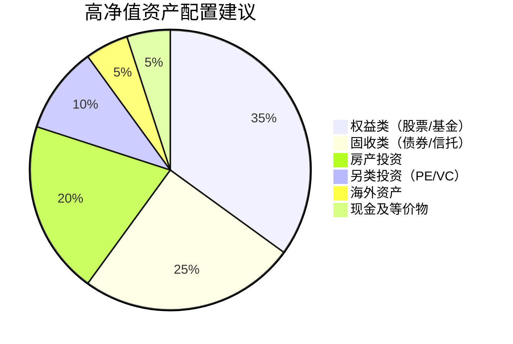

# 附录E：按收入分级行动清单

> 本附录按月收入水平分为四份详细行动清单，每份包含具体步骤、时间规划、预期收益和风险提示。找到最接近你当前情况的清单，立即开始行动。收入分级不是终点——每一级的终极目标都是向上跃迁。

***

## 如何使用本附录

### 选择你的起点

| 月收入范围 | 适用清单 | 核心挑战 | 12个月目标 |
|-----------|---------|---------|-----------|
| 3000-6000元 | 月入5000清单 | 收入低、可支配资金少、试错空间小 | 存款1万+副业月入1000+ |
| 6000-15000元 | 月入10000清单 | 有一定余量但容易消费升级 | 总资产9万+月入1.5-2万 |
| 15000-50000元 | 月入30000清单 | 收入不错但缺乏系统化管理 | 总资产30-50万+被动收入启动 |
| 50000元以上 | 月入100000+清单 | 财富保值增值、税务优化、传承 | 总资产100-500万+被动收入覆盖支出 |

### 收入之外的关键变量

在选择清单前，先评估这些变量——它们会影响你的执行策略：

- **所在城市**：一线城市生活成本高但机会多，二三线城市成本低但副业选择少。一线城市房租可能占收入30-50%，二三线可能只占15-25%。
- **家庭状况**：单身、已婚无孩、已婚有孩、赡养老人——每种情况的支出结构和风险承受能力完全不同。
- **负债情况**：有无房贷、车贷、消费贷、信用卡分期。高息负债（年化>6%）必须优先偿还，这是所有投资的前提。
- **职业阶段**：刚入职、成长期、瓶颈期、转型期——不同阶段的主业收入增长预期差异巨大。
- **风险偏好**：保守型、稳健型、进取型——决定你的投资配置比例。

### 高息负债优先原则

在执行任何投资计划之前，**必须先处理年化利率>6%的负债**。原因很简单：信用卡分期年化12-18%，花呗借呗年化10-14%，任何投资都很难稳定跑赢这个数字。

**处理顺序：**
1. 信用卡分期/最低还款（年化12-18%）→ 立即全额还清
2. 网贷/消费贷（年化10-24%）→ 优先偿还或协商降息
3. 花呗/借呗（年化10-14%）→ 尽快还清
4. 房贷（年化3-5%）→ 可以保留，用投资收益覆盖

***

## 一、月入5000元行动清单

> **适用人群**：刚毕业的大学生、基层岗位从业者、小城市低收入群体、自由职业起步期。
>
> **核心策略**：这个阶段的核心矛盾是"钱太少"。解决思路不是省钱省到极致，而是**用时间换钱**——通过学习和副业提升收入。节流有下限，开源无上限。

### 第一阶段：建立财务基础（第1-3个月）

**目标：** 搞清楚钱去哪了，存下第一个3000元应急金

#### 第1周：全面财务体检

导出过去3个月的所有消费数据，这是你财务状况的"体检报告"：

- [ ] 下载记账APP（推荐鲨鱼记账——免费无广告；随手记——功能更全但有广告）
- [ ] 导出支付宝账单：支付宝 → 我的 → 账单 → 右上角"..." → 开具交易流水证明
- [ ] 导出微信账单：微信 → 我 → 服务 → 钱包 → 账单 → 常见问题 → 下载账单
- [ ] 导出银行卡流水：手机银行APP → 明细查询 → 导出
- [ ] 分类统计每项支出，计算各项占比

**分类模板：**

| 支出类别 | 具体项目 | 月均金额 | 占比 | 是否必需 |
|---------|---------|---------|------|---------|
| 住房 | 房租、水电、物业、网费 | ___元 | ___% | 是 |
| 餐饮 | 外卖、食堂、自炊、零食饮料 | ___元 | ___% | 部分 |
| 交通 | 公交地铁、打车、共享单车 | ___元 | ___% | 是 |
| 通讯 | 手机话费、宽带 | ___元 | ___% | 是 |
| 社交 | 聚餐、送礼、娱乐 | ___元 | ___% | 部分 |
| 购物 | 衣物、日用品、数码产品 | ___元 | ___% | 部分 |
| 订阅 | 视频会员、音乐会员、APP会员 | ___元 | ___% | 否 |
| 其他 | 医疗、教育、杂项 | ___元 | ___% | 视情况 |

**关键指标计算：**
- 储蓄率 = (月收入 - 月支出) / 月收入 × 100%
- 恩格尔系数 = 食品支出 / 总支出 × 100%（<30%为富裕，30-40%为相对富裕，40-50%为小康）
- 如果储蓄率<10%，说明收支严重失衡，必须立即调整

#### 第2-4周：建立预算体系

**50/30/20预算法则（月入5000元示例）：**

| 类别 | 比例 | 金额 | 包含项目 |
|------|------|------|---------|
| 必需品 | 50% | 2500元 | 房租、水电、餐饮、交通、通讯 |
| 个人消费 | 30% | 1500元 | 社交、购物、娱乐、订阅 |
| 储蓄投资 | 20% | 1000元 | 应急金、基金定投 |

**节流实操清单（月省500-800元）：**

| 优化项 | 现状 | 优化后 | 月省金额 | 难度 |
|-------|------|-------|---------|------|
| 每天1杯奶茶15元 | 450元/月 | 改喝白水/自带咖啡 | 300-400元 | ★★☆ |
| 外卖午餐25元/天 | 750元/月 | 带饭+食堂 | 300-400元 | ★★★ |
| 打车通勤 | 300元/月 | 公交地铁+月卡 | 200元 | ★☆☆ |
| 视频+音乐+APP会员 | 80元/月 | 共享账号/免费版 | 50-80元 | ★☆☆ |
| 冲动购物 | 不定 | 72小时冷静期 | 200-500元 | ★★☆ |

**自动储蓄设置：**
- [ ] 支付宝：我的 → 余额宝 → 设置自动转入 → 工资到账次日自动转1000元
- [ ] 微信：服务 → 理财通 → 设置定额转入
- [ ] 银行APP：设置工资卡自动转账到专用储蓄账户

#### 第2-3个月：积累应急金

**应急金目标：3000元（约3个月极简生活费）**

这笔钱的意义不是"多"，而是**给你安全感和试错的底气**。没有应急金的人，遇到任何意外（生病、失业、设备损坏）都只能借贷，陷入恶性循环。

- [ ] 存入货币基金（余额宝/零钱通），年化约1.5-2%
- [ ] 设为"只进不出"——除非真正的紧急情况（生病、失业、家庭急事），绝不动用
- [ ] 同步学习：每天花30分钟阅读1篇理财文章（推荐公众号：银行螺丝钉、她理财）

**什么是"真正的紧急情况"：**
- ✅ 突发疾病需要就医
- ✅ 失业期间的生活费
- ✅ 必要的设备维修（电脑、手机坏了影响工作）
- ❌ 新款手机发布想换
- ❌ 朋友叫出去旅游
- ❌ 双十一打折想囤货

**预期收益：** 3个月后拥有3000元应急金 + 清晰的财务画像 + 良好的记账习惯

***

### 第二阶段：开源节流（第4-6个月）

**目标：** 月省500元以上，启动第一个副业，开始小额投资

#### 节流深化

- [ ] 整理所有订阅服务，用"订阅管理"小程序一键查看，取消不需要的
- [ ] 学会做5道基础菜（番茄炒蛋、蛋炒饭、煮面条、炒青菜、炖排骨），外卖从1500元/月降到800元
- [ ] 购物前执行"72小时冷静期"：加入购物车等3天，80%的冲动消费会自然消退
- [ ] 用返利APP购物：什么值得买（比价+优惠）、返利网（购物返现2-10%）
- [ ] 办理交通月卡：北京一卡通月累计满100元后打8折，上海Metro大都会有优惠

#### 副业启动（选择1-2个执行）

> **选副业的原则**：优先选择能积累技能和资源的，其次才是纯赚钱的。送外卖能赚钱但不积累，做自媒体初期不赚钱但长期价值大。

**方案A：闲鱼卖闲置（最快变现）**
- [ ] 整理家中不用的物品：旧手机、旧衣服、旧书、闲置数码产品
- [ ] 拍照技巧：自然光、白色背景、多角度、展示瑕疵
- [ ] 定价策略：新品价的30-50%，参考闲鱼同类商品价格
- [ ] 预计月收入：200-500元（清完库存后下降，但能培养销售意识）

**方案B：技能变现（中期价值最高）**
- [ ] 盘点你的技能：PS/PR/AI设计？写作/翻译？Excel/PPT？编程？
- [ ] 注册平台：猪八戒网（设计/文案）、有道翻译（翻译）、程序员客栈（开发）
- [ ] 前3单可以低价接（市场价的50-70%），积累好评和作品集
- [ ] 预计月收入：300-1000元，3个月后可达1000-3000元

**方案C：线下兼职（最稳定）**
- [ ] 周末兼职：餐饮服务员（150-200元/天）、活动执行（200-300元/天）、家教（80-150元/小时）
- [ ] 平台：兼职猫、斗米兼职、58同城兼职频道
- [ ] 预计月收入：800-1500元（每周兼职1-2天）

**方案D：内容创作（长期价值最大）**
- [ ] 选择平台：小红书（图文为主，适合生活/美妆/学习分享）、抖音（短视频，适合才艺/知识/搞笑）
- [ ] 确定方向：你的专业、兴趣、或独特经历
- [ ] 坚持日更或每周3次以上，前3个月不看数据只看内容质量
- [ ] 3个月后评估：粉丝>1000可以尝试变现，<1000考虑调整方向

#### 投资启蒙

- [ ] 开通基金账户：天天基金（费率最低，1折起）、蚂蚁财富（支付宝内直接操作）
- [ ] 了解指数基金：推荐《指数基金投资指南》（银行螺丝钉），用2周读完
- [ ] 开始定投沪深300指数基金，每月200元起步
- [ ] 设置自动定投：发工资日扣款，不要手动操作（手动容易犹豫和择时）

**为什么从指数基金开始：**
- 不需要研究个股，降低入门门槛
- 天然分散投资，降低单一股票风险
- 长期年化收益约8-12%，远超银行存款
- 巴菲特多次推荐普通人买指数基金

**预期收益：** 月省500-800元 + 副业月入300-1000元 + 基金定投开始

***

### 第三阶段：加速积累（第7-12个月）

**目标：** 存款达到1万元，副业收入稳定在1000元以上，投资体系初步建立

#### 存款冲刺

- [ ] 将储蓄率从20%提升到25-30%（通过副业增收而非进一步压缩生活）
- [ ] 副业收入100%存入投资账户（这笔钱本来就没有，全部存起来不心疼）
- [ ] 目标：年末存款1万元（含应急金3000元）

#### 副业深耕

- [ ] 选定1个副业方向深耕，停止撒网式尝试——样样通不如一样精
- [ ] 建立个人作品集/客户案例（截图好评、整理案例、制作作品集页面）
- [ ] 争取提升副业月收入到1000-2000元
- [ ] 开始建立个人品牌：注册一个与副业相关的社交媒体账号，定期输出内容

**副业收入增长路径（以设计接单为例）：**
- 第1-3月：低价接单，积累评价 → 月入300-500元
- 第4-6月：提价到市场价，提高接单量 → 月入1000-1500元
- 第7-9月：建立口碑，客户转介绍 → 月入1500-2500元
- 第10-12月：涨价20-30%，筛选优质客户 → 月入2000-3000元

#### 投资进阶

- [ ] 基金定投金额提升到每月300-500元
- [ ] 学习资产配置概念：股债平衡（年龄%配置债券，如28岁配28%债券）
- [ ] 了解可转债打新：零成本参与（只需开通证券账户），中签后卖出，年收益约2000-5000元
- [ ] 开通证券账户：推荐华泰证券（涨乐财富通）或东方财富（东方财富证券），佣金低

**可转债打新操作步骤：**
1. 开通证券账户（线上开户，10分钟完成）
2. 在APP中找到"新股/新债申购"入口
3. 每天查看是否有新债发行，有就点击申购
4. 中签后缴款（一般1000元），上市当天卖出
5. 坚持每天申购，中签率约0.5-2%，一年能中2-5签

#### 技能提升（与主业收入直接挂钩）

- [ ] 每月读1本理财/职业发展书籍
- [ ] 参加1个免费或低价的在线课程（B站、网易公开课、中国大学MOOC）
- [ ] 考取1个与职业相关的证书——这是提升主业收入最直接的方式

**证书选择参考：**

| 行业 | 推荐证书 | 备考时间 | 薪资提升预期 |
|------|---------|---------|------------|
| 会计 | 初级会计→CPA | 3-6个月 | 20-50% |
| IT | 软考中/高级 | 3-6个月 | 15-30% |
| 人力资源 | 人力资源管理师 | 2-4个月 | 10-20% |
| 教育 | 教师资格证 | 2-3个月 | 转行门槛 |
| 金融 | 基金/证券从业 | 1-2个月 | 入行门槛 |
| 项目管理 | PMP | 3-4个月 | 15-25% |

#### 年末目标检查清单

- [ ] 存款≥10000元
- [ ] 副业月收入≥1000元
- [ ] 基金定投账户≥3000元
- [ ] 掌握3种以上理财工具（余额宝、基金定投、可转债打新）
- [ ] 有明确的下一年收入增长计划（主业提薪路径+副业增长目标）

### 月入5000搞钱路线图总览

| 时间 | 核心任务 | 预期存款 | 副业收入 | 关键动作 |
|------|---------|---------|---------|---------|
| 第1月 | 财务体检+记账 | 1000元 | 0 | 导出账单、分类统计、设置自动储蓄 |
| 第2月 | 建立预算+节流 | 2000元 | 0 | 执行50/30/20法则、削减不必要支出 |
| 第3月 | 应急金完成+学习 | 3000元 | 0-200元 | 读完《指数基金投资指南》、开始副业探索 |
| 第4-6月 | 节流+副业启动 | 6000元 | 300-1000元 | 选定副业方向、开通基金定投 |
| 第7-9月 | 副业深耕+定投 | 8000元 | 1000-1500元 | 可转债打新、考取证书 |
| 第10-12月 | 冲刺+总结 | 10000元+ | 1000-2000元 | 复盘全年、制定下年计划 |

***

## 二、月入10000元行动清单

> **适用人群**：工作2-5年的白领、技术岗位从业者、二三线城市中等收入群体。
>
> **核心策略**：这个阶段的核心矛盾是"消费升级的诱惑"。收入从5000涨到10000，很多人不是存更多而是花更多。必须在收入增长的同时**锁定储蓄率**，让存款和投资同步增长。

### 第一阶段：财务优化（第1-2个月）

**目标：** 优化支出结构，月储蓄率达到30%，建立完整保险保障

#### 第1周：深度财务分析

- [ ] 导出过去6个月所有消费记录（支付宝+微信+银行卡）
- [ ] 用Excel或记账APP分类统计，生成饼图直观看到支出结构
- [ ] 计算恩格尔系数，评估消费健康度
- [ ] 全面评估当前资产：存款、基金、房产、车产、负债
- [ ] 计算净资产 = 总资产 - 总负债

**资产盘点模板：**

| 资产项目 | 金额（元） | 负债项目 | 金额（元） |
|---------|-----------|---------|-----------|
| 现金/活期 | ___ | 房贷余额 | ___ |
| 定期存款 | ___ | 车贷余额 | ___ |
| 货币基金 | ___ | 信用卡欠款 | ___ |
| 基金/股票 | ___ | 消费贷 | ___ |
| 房产市值 | ___ | 其他负债 | ___ |
| 车产市值 | ___ | | |
| 其他资产 | ___ | | |
| **总资产** | ___ | **总负债** | ___ |
| **净资产** | **___** | | |

#### 第2周：精细化预算

| 项目 | 预算 | 占比 | 控制要点 |
|------|------|------|---------|
| 房租/房贷 | 2500-3000元 | 25-30% | 合租可降到1500-2000元 |
| 餐饮 | 1500元 | 15% | 自炊为主，外卖每周≤2次 |
| 交通通讯 | 500元 | 5% | 地铁月卡+低价手机套餐 |
| 日用品 | 300元 | 3% | 批量购买、关注促销 |
| 娱乐社交 | 800元 | 8% | 每周1-2次社交活动 |
| 学习提升 | 500元 | 5% | 课程+书籍+考证 |
| 保险 | 400元 | 4% | 见下方保险配置 |
| 储蓄投资 | 3000元 | 30% | **发工资当天自动转出** |
| 弹性备用 | 500元 | 5% | 应对临时支出 |

- [ ] 设置工资卡自动转账：发工资当天自动转3000元到投资账户

#### 第3-4周：保险配置

> **保险的本质是用小钱转移大风险。** 月入10000元的人，一场大病可能花掉3-5年的积蓄。保险不是消费，是财务安全网。

**必备保险清单：**

| 险种 | 年保费 | 保额 | 作用 | 推荐产品 |
|------|--------|------|------|---------|
| 百万医疗险 | 200-400元 | 200-600万 | 报销大病住院费 | 好医保、尊享e生 |
| 意外险 | 100-200元 | 50-100万 | 意外伤残/身故赔付 | 小蜜蜂、大护甲 |
| 定期寿险 | 300-800元 | 50-100万 | 身故赔付（有房贷必买） | 定海柱、华贵大麦 |
| 重疾险 | 2000-4000元 | 30-50万 | 确诊重疾一次性赔付 | 达尔文、超级玛丽 |

- [ ] 检查公司社保缴纳基数是否按实际工资（很多公司按最低基数交）
- [ ] 配置百万医疗险（优先）+ 意外险（其次）
- [ ] 如有房贷，配置定期寿险
- [ ] 重疾险预算不够可以先买医疗险，收入增长后再加
- [ ] 总保费控制在年收入5%以内（月入1万 = 年保费≤6000元）

**购买渠道：**
- 线上：支付宝（蚂蚁保）、微信（微保）、慧择网、小雨伞
- 线下：保险经纪人（可对比多家产品，但注意辨别是否在推销高佣金产品）

**预期收益：** 月储蓄3000元 + 完整保险保障（覆盖大病、意外、身故风险）

***

### 第二阶段：投资体系搭建（第3-4个月）

**目标：** 建立基金投资组合，开始可转债打新，年化目标8-12%

#### 基金投资组合

**核心组合（每月2500元）：**

| 资产类别 | 配置比例 | 月投入 | 推荐标的 | 选择理由 |
|---------|---------|--------|---------|---------|
| 宽基指数基金 | 60% | 1500元 | 沪深300ETF联接+中证500ETF联接 | 大盘+中小盘，覆盖A股核心 |
| 债券基金 | 20% | 500元 | 纯债基金（如易方达稳健收益） | 降低波动，提供稳定收益 |
| 行业主题基金 | 20% | 500元 | 消费/医药/科技选1个 | 捕捉行业增长机会 |

**定投纪律：**
- [ ] 设置自动定投，发工资日扣款
- [ ] 坚持至少1年不中断——定投的核心是"穿越牛熊"
- [ ] 下跌时不要停扣，反而是低成本买入的好时机
- [ ] 每季度检视一次组合表现，但不做频繁调仓

#### 可转债打新

- [ ] 开通证券账户（推荐华泰证券/东方财富证券，佣金万1.5以下）
- [ ] 开通可转债交易权限（APP内一键开通）
- [ ] 每天查看新债申购（APP首页→新股新债→申购）
- [ ] 中签后缴款1000元，上市首日卖出（不要贪心持有）
- [ ] 预期年收益：2000-6000元（相当于"免费的年终奖"）

#### 学习投资知识

**必读书单（按顺序）：**
1. 《指数基金投资指南》（银行螺丝钉）——入门第一本，2周读完
2. 《投资最重要的事》（霍华德·马克斯）——建立投资思维框架
3. 《穷查理宝典》（查理·芒格）——多元思维模型

- [ ] 关注3-5个靠谱的投资博主/公众号（银行螺丝钉、ETF拯救世界、望京博格）
- [ ] **远离**以下类型：天天喊"抄底""逃顶"的、推荐个股的、承诺收益的
- [ ] 建立投资笔记：记录每笔投资的逻辑、买入理由、预期持有时间

**预期收益：** 基金账户月增2500元 + 可转债年收益3000-5000元

***

### 第三阶段：副业开拓（第5-8个月）

**目标：** 开辟第二收入来源，副业月入2000-5000元

> **副业选择的核心原则**：利用你已有的技能和资源，而不是从零开始学习新技能。你是程序员就接开发单，你是设计师就接设计单，你是会计就做代账。

#### 副业方向选择

**方向A：专业技能变现（推荐指数：★★★★★）**

这是投入产出比最高的副业方向，因为你已经在主业中积累了技能。

- [ ] 评估你的专业技能市场价值（在猪八戒网/Upwork搜索同类服务的报价）
- [ ] 注册平台：猪八戒网（国内）、Upwork/Fiverr（海外，收入更高但需要英语）
- [ ] 完善个人资料和作品集（这是客户决定是否选择你的关键）
- [ ] 前3单以市场价的60-70%接单，积累5星好评
- [ ] 目标：月接3-5单，每单500-2000元，月入2000-5000元

**方向B：内容创作变现（推荐指数：★★★★☆）**

前期投入大、回报慢，但一旦建立起来就是"睡后收入"。

- [ ] 选择平台：公众号（图文深度）、小红书（种草分享）、抖音/B站（视频）
- [ ] 确定内容方向：与专业或兴趣相关，选你能持续产出的领域
- [ ] 保持日更或每周3次以上，内容质量>数量
- [ ] 3个月后开通变现功能（公众号流量主、小红书品牌合作、抖音星图）
- [ ] 目标：粉丝5000+，月收入1000-3000元（6个月后可达3000-8000元）

**方向C：电商/微商（推荐指数：★★★☆☆）**

需要一定的供应链资源和运营能力。

- [ ] 选择品类：建议与主业相关或有供应链优势的领域
- [ ] 开通闲鱼（零成本起步）、微店/有赞（需要一定投入）
- [ ] 学习选品：关注1688批发价、分析竞品、测试市场反应
- [ ] 目标：月利润1000-3000元

**方向D：知识付费（推荐指数：★★★☆☆）**

需要有一定的知识积累和表达能力。

- [ ] 梳理你的知识体系，找到"你知道但别人不知道"的内容
- [ ] 制作课程大纲：5-10节课，每节15-30分钟
- [ ] 选择平台：千聊（操作简单）、荔枝微课（流量大）、小鹅通（功能全）
- [ ] 目标：月收入500-2000元（课程是一次制作、长期收益）

#### 时间管理

| 时间段 | 可用时间 | 适合做什么 |
|-------|---------|-----------|
| 工作日晚上 | 1-2小时 | 内容创作、学习、轻量接单 |
| 周末 | 4-6小时/天 | 集中接单、制作课程、运营店铺 |
| 通勤碎片时间 | 30-60分钟 | 回复客户、浏览素材、学习 |

**预期收益：** 副业月入2000-5000元

***

### 第四阶段：收入跃升（第9-12个月）

**目标：** 总月收入达到1.5-2万元，建立长期增长引擎

#### 主业提薪/跳槽

- [ ] 整理过去一年的工作成果（量化数据：完成了X个项目、节省了Y成本、带来了Z收入）
- [ ] 与领导沟通加薪：准备好你的贡献清单，目标涨幅20-30%
- [ ] 如内部无空间，开始看外部机会——跳槽涨薪30-50%是常态
- [ ] 更新简历，投递目标公司（Boss直聘、拉勾、猎聘）
- [ ] 目标：主业收入提升到1.2-1.5万

**谈判技巧：**
- 不要说"我需要更多钱"，要说"我为公司创造了X价值"
- 有外部offer是最好的谈判筹码，但不要虚报
- 如果加薪被拒，明确询问"我需要做到什么才能获得加薪"

#### 副业升级

- [ ] 提高客单价：涨价20-50%（你的经验和好评支撑得起）
- [ ] 从接单模式转向产品化：把重复做的事情做成模板/课程/工具
- [ ] 建立自动化收入流：课程自动销售、模板持续售卖
- [ ] 目标：副业收入稳定在3000-5000元

#### 投资复盘

- [ ] 检视基金组合表现：对比同期沪深300涨跌幅
- [ ] 根据市场情况调整股债比例（牛市多配债、熊市多配股）
- [ ] 学习进阶投资知识：可转债双低策略、ETF轮动策略
- [ ] 年末投资收益目标：5-10%

#### 年末目标检查清单

- [ ] 存款≥5万元
- [ ] 投资账户≥4万元
- [ ] 副业月收入≥3000元
- [ ] 主业收入≥1.2万元
- [ ] 有完整的保险保障
- [ ] 建立了3条以上收入来源（主业+副业+投资收益）

### 月入10000搞钱路线图总览

| 时间 | 核心任务 | 月储蓄 | 总资产 | 关键突破 |
|------|---------|--------|--------|---------|
| 第1-2月 | 预算+保险 | 3000元 | 6000元 | 建立财务纪律，配置保障 |
| 第3-4月 | 投资组合+打新 | 3000元 | 1.5万元 | 基金定投+可转债双引擎 |
| 第5-8月 | 副业开拓 | 4000-6000元 | 3.5万元 | 第二收入来源建立 |
| 第9-12月 | 收入跃升 | 6000-8000元 | 6-9万元 | 主业提薪+副业产品化 |

***

## 三、月入30000元行动清单

> **适用人群**：工作5-10年的中层管理者、高级技术人员、双收入家庭、二三线城市高收入群体。
>
> **核心策略**：这个阶段的核心矛盾是"有钱但不会管"。收入不低但缺乏系统化管理，钱不知不觉花掉，投资靠感觉，税务白白多交。核心任务是从"赚钱思维"升级到"管钱思维"。

### 第一阶段：财富管理升级（第1-2个月）

**目标：** 建立系统化财富管理体系，优化税务和支出结构

#### 全面资产评估

- [ ] 列出所有资产：现金、存款、基金、股票、房产、车产、其他投资
- [ ] 列出所有负债：房贷、车贷、信用卡、消费贷
- [ ] 计算净资产 = 总资产 - 总负债
- [ ] 计算财务自由度 = 被动收入 / 月支出（>100%即财务自由）
- [ ] 建立家庭资产负债表（用Excel或随手记的资产功能）

#### 优化支出结构

| 项目 | 预算 | 占比 | 控制要点 |
|------|------|------|---------|
| 房贷/房租 | 5000-8000元 | 17-27% | 月供不超过收入30% |
| 家庭生活 | 3000元 | 10% | 含餐饮、日用品、水电 |
| 交通出行 | 1500元 | 5% | 含油费、停车、保养 |
| 社交应酬 | 1500元 | 5% | 有选择地参加，学会拒绝无效社交 |
| 子女教育 | 2000元 | 7% | 含学费、课外班、学习资料 |
| 保险保障 | 1500元 | 5% | 全家保险配置 |
| 学习成长 | 1000元 | 3% | 课程、书籍、行业会议 |
| 储蓄投资 | 10000-15000元 | 33-50% | **这是核心，优先级最高** |
| 弹性消费 | 2000元 | 7% | 旅游、购物、娱乐 |

#### 税务优化

> **税务优化是合法的省钱方式。** 很多人不是赚得少，而是交得多。

**个人所得税优化清单：**

- [ ] 确认专项附加扣除是否全部申报：

| 扣除项 | 标准 | 需要的材料 |
|-------|------|-----------|
| 子女教育 | 2000元/月/孩 | 学籍信息 |
| 继续教育 | 400元/月（学历）或3600元/年（证书） | 学籍/证书 |
| 大病医疗 | 实际支出超1.5万部分，最高8万/年 | 医疗票据 |
| 住房贷款利息 | 1000元/月 | 贷款合同 |
| 住房租金 | 800-1500元/月（按城市） | 租房合同 |
| 赡养老人 | 3000元/月 | 老人身份信息 |
| 3岁以下婴幼儿照护 | 2000元/月/孩 | 出生证明 |

- [ ] 了解年终奖计税方式：单独计税 vs 并入综合所得，用个税APP两种方式都算一遍，选税低的
- [ ] 如有副业收入，了解劳务报酬的预扣税率（20-40%）和年度汇算清缴退税
- [ ] 考虑注册个体工商户：将部分副业收入走个体户，综合税负可降到3-5%

#### 保险升级

| 险种 | 保额 | 年保费 | 优先级 |
|------|------|--------|-------|
| 百万医疗险（全家） | 200-600万/人 | 1000-2000元 | 必备 |
| 重疾险 | 50万/人 | 5000-8000元 | 必备 |
| 定期寿险 | 100万（有房贷） | 500-1000元 | 必备 |
| 意外险（全家） | 50-100万/人 | 300-600元 | 必备 |
| 年金险/增额终身寿 | - | 10000-30000元 | 可选（锁定长期利率） |

- [ ] 总保费控制在年收入5-8%（月入3万 = 年保费1.8-2.9万）

**预期收益：** 完整的财务画像 + 优化后的支出结构 + 年省税5000-20000元 + 全面保险保障

***

### 第二阶段：投资组合构建（第3-5个月）

**目标：** 建立多资产类别的投资组合，年化目标8-15%

#### 核心投资组合

| 资产类别 | 配置比例 | 月投入 | 推荐标的 | 风险等级 |
|---------|---------|--------|---------|---------|
| 宽基指数基金 | 30% | 3000-4500元 | 沪深300ETF、中证500ETF | 中 |
| 行业主题基金 | 15% | 1500-2250元 | 消费/医药/科技轮动 | 中高 |
| 债券基金 | 20% | 2000-3000元 | 纯债基金、二级债基 | 低 |
| 港美股 | 15% | 1500-2250元 | 通过富途/老虎投资 | 中高 |
| REITs | 10% | 1000-1500元 | 公募REITs | 中 |
| 现金类 | 10% | 1000-1500元 | 货币基金 | 极低 |

#### 港美股开户指南

- [ ] 准备香港银行卡：见证开户（内地银行网点办理，如招商银行香港一卡通）或亲自赴港开户
- [ ] 开通富途牛牛/老虎证券账户（线上开户，需要身份证+银行卡）
- [ ] 了解港股通门槛：证券账户资产≥50万（不满足可以用富途直接买港股）
- [ ] 首批投资标的：腾讯（00700）、美团（03690）、苹果（AAPL）、微软（MSFT）
- [ ] 了解美股交易时间：北京时间21:30-04:00（夏令时）、22:30-05:00（冬令时）

#### 可转债进阶

- [ ] 除了打新，学习可转债投资策略
- [ ] 双低策略：选择价格低（<110元）+ 溢价率低（<20%）的可转债
- [ ] 分配5000-10000元用于可转债投资组合（分散持有5-10只）
- [ ] 止损线：单只亏损>10%强制卖出

#### 学习进阶

- [ ] 阅读《聪明的投资者》（本杰明·格雷厄姆）——价值投资圣经
- [ ] 阅读《漫步华尔街》（伯顿·马尔基尔）——理解市场效率
- [ ] 学习财报分析基础：看懂三大报表（资产负债表、利润表、现金流量表）
- [ ] 关注宏观经济指标：PMI（制造业景气度）、CPI（通胀水平）、LPR利率变化
- [ ] 建立投资决策框架：买入条件、持有逻辑、卖出条件必须提前写好

**预期收益：** 投资组合年化8-15%，月投入10000-15000元

***

### 第三阶段：多元收入构建（第6-9个月）

**目标：** 建立3-5条收入渠道，被动收入占比提升到20%以上

#### 主业收入优化

- [ ] 争取年度加薪或晋升（准备好你的KPI达成报告和超出预期的贡献）
- [ ] 如天花板明显，考虑跳槽涨薪30-50%（中高层跳槽谈判空间更大）
- [ ] 发展路线选择：管理路线（带团队）vs 专家路线（技术深耕）

#### 副业矩阵（选择2-3个执行）

**渠道1：专业咨询/培训（月入3000-10000元）**
- [ ] 整理你的行业经验为可交付的咨询服务
- [ ] 注册"在行"APP成为行家（1对1咨询，每次300-1000元）
- [ ] 或：申请成为企业内训讲师（每天2000-10000元）
- [ ] 关键：建立个人专业品牌（LinkedIn/知乎/公众号持续输出专业内容）

**渠道2：知识付费产品（月入2000-8000元）**
- [ ] 制作系统课程（10-20节，每节15-30分钟）
- [ ] 选择平台：小鹅通（自建品牌）、得到（流量大但分成高）、知乎（适合图文课程）
- [ ] 建立私域推广体系：公众号→社群→课程转化
- [ ] 长尾收益：课程一次制作，持续销售

**渠道3：投资收益（月入1000-3000元）**
- [ ] 股息收入：配置高股息股票组合（银行股、电力股、高速公路股，股息率4-6%）
- [ ] 基金分红：选择分红频率高的基金
- [ ] 可转债收益：打新+投资组合

**渠道4：内容创作（月入1000-5000元）**
- [ ] 公众号/知乎专栏：广告收入+赞赏+付费阅读
- [ ] 或短视频账号：带货+广告分成
- [ ] 关键：持续输出+找到差异化定位

**渠道5：小生意/合伙（月入2000-10000元，需前期投入）**
- [ ] 与朋友合伙开小店（奶茶/小吃/便利店）——投入5-20万，回本周期6-12个月
- [ ] 或成为某个品牌的区域代理
- [ ] 风险提示：合伙生意必须签合伙协议，明确出资比例、分红方式、退出机制

#### 被动收入建设

- [ ] 整理已有内容为付费产品（电子书、模板、工具包、SOP文档）
- [ ] 建立自动化销售漏斗：引流→转化→交付全程自动化
- [ ] 培养团队运营：雇佣兼职或助理处理日常事务，自己专注高价值工作
- [ ] 目标：被动收入占总收入20%以上

**预期收益：** 副业月入5000-20000元 + 被动收入占比提升

***

### 第四阶段：资产配置与加速（第10-12个月）

**目标：** 年末总资产达到30-50万元，建立成熟的财富管理系统

#### 资产配置检查与再平衡

- [ ] 检视投资组合表现：对比年初设定的目标
- [ ] 再平衡：偏离目标比例超过5%的调整回来（卖出超配的、买入低配的）
- [ ] 根据市场环境调整股债比例（参考：A股PE分位数——低于30%分位多配股，高于70%分位多配债）
- [ ] 记录全年投资收益和教训

#### 房产规划

- [ ] 评估是否需要购房：刚需（自住）vs 改善（换房）vs 投资
- [ ] 计算首付能力：首付 = 存款 × 70%（留30%作为应急和投资）
- [ ] 计算月供承受力：月供 ≤ 月收入 × 30%
- [ ] 研究目标城市和区域：关注政策、规划、学区、交通
- [ ] 如已有房产，评估是否需要置换或投资第二套（注意限购政策）

#### 税务筹划（年末必做）

- [ ] 整理全年收入和支出凭证
- [ ] 确保专项附加扣除全部申报（很多人漏报赡养老人和住房租金）
- [ ] 如有投资亏损，了解抵税规则（A股亏损可抵扣盈利后再计税）
- [ ] 考虑合理利用公益捐赠抵税（通过正规慈善组织捐赠，可抵扣应纳税所得额30%）

#### 年末总结与新年规划

- [ ] 全年收入汇总：主业+副业+投资收益+被动收入
- [ ] 全年支出分析：各项占比是否合理
- [ ] 资产负债表更新：净资产增长了多少
- [ ] 投资组合绩效：年化收益率、最大回撤、夏普比率
- [ ] 下一年收入目标和行动计划

### 月入30000搞钱路线图总览

| 时间 | 核心任务 | 月储蓄/投资 | 总资产目标 | 关键突破 |
|------|---------|------------|-----------|---------|
| 第1-2月 | 财务管理升级 | 10000元 | 2万元 | 税务优化+保险配置 |
| 第3-5月 | 投资组合构建 | 12000元 | 8万元 | 多资产配置+港美股 |
| 第6-9月 | 多元收入构建 | 15000元 | 20万元 | 3-5条收入渠道 |
| 第10-12月 | 资产配置加速 | 18000元 | 30-50万元 | 房产规划+财富系统化 |

***

## 四、月入100000元+行动清单

> **适用人群**：企业主、高管、高级合伙人、高收入自由职业者、双高收入家庭。
>
> **核心策略**：这个阶段的核心矛盾不再是"赚钱"，而是**保值、增值、传承**。高收入往往伴随着高支出、高税负、高风险。你需要的不是更多赚钱技巧，而是一套完整的财富管理系统——包括税务架构、法律保障、资产配置、风险隔离和财富传承。

### 第一阶段：财富系统化管理（第1-3个月）

**目标：** 从"高收入者"转型为"财富管理者"，建立完整的财富管理架构

#### 聘请专业团队

> **到了这个收入层级，专业的事交给专业的人。** 一个好的税务顾问每年能帮你省下的钱远超他的服务费。

- [ ] 聘请专业会计师/税务顾问（年费5000-20000元）
  - 找具有注册税务师（CTA）资质的
  - 通过朋友推荐或行业协会寻找
  - 面谈时问清楚：你的情况能省多少税？用什么方案？
- [ ] 如资产超过500万，考虑聘请家族财富顾问
- [ ] 建立律师关系：至少认识一个擅长公司法/婚姻法/继承法的律师

#### 财富全景图

- [ ] 全面盘点资产和负债（包括公司股权、期权、知识产权等无形资产）
- [ ] 计算真实净资产（注意扣除隐性负债：担保、或有负债）
- [ ] 建立家庭资产负债表（季度更新）
- [ ] 制作现金流预测表：未来12个月的收入和支出预测

#### 企业架构优化（如适用）

- [ ] 评估是否需要注册公司：有限公司可以将个人所得税（最高45%）转化为企业所得税（25%）+ 分红税（20%）
- [ ] 了解个体户vs有限公司的税务差异：

| 类型 | 综合税负 | 适用场景 | 风险 |
|------|---------|---------|------|
| 个人直接收入 | 最高45% | 工资薪金 | 无隔离 |
| 个体工商户 | 3-10% | 小规模副业/咨询 | 无限责任 |
| 小规模有限公司 | 5-15% | 中等规模业务 | 有限责任 |
| 一般纳税人有限公司 | 10-25% | 大规模业务 | 有限责任 |

- [ ] 合理设计薪酬结构：工资（基本生活）+ 分红（投资回报）+ 报销（合理避税）
- [ ] 咨询税务师：年节税潜力5-15万元

#### 保险全面升级

| 险种 | 保额 | 年保费 | 作用 |
|------|------|--------|------|
| 高端医疗险 | 不限 | 10000-30000元 | 覆盖私立医院、海外就医 |
| 重疾险 | 100万+ | 10000-20000元 | 确确诊重疾一次性赔付 |
| 定期寿险 | 覆盖家庭5年支出 | 3000-10000元 | 身故后家庭生活保障 |
| 年金险/增额终身寿 | - | 50000-200000元 | 锁定长期利率，强制储蓄 |
| 家族信托 | 起步100万 | 管理费0.5-1%/年 | 资产隔离、传承规划 |

- [ ] 年保费预算：3-10万元（占年收入3-5%）

#### 法律保障

- [ ] 婚前/婚后财产协议（如适用）：明确个人财产和共同财产的边界
- [ ] 遗嘱规划：通过公证遗嘱明确资产分配意愿
- [ ] 重要资产的法律文件整理：房产证、股权协议、投资合同等
- [ ] 建立家族宪章：资产传承规划、家族价值观、决策机制

**预期收益：** 完整的财富管理体系 + 节税5-15万元/年 + 法律风险隔离

***

### 第二阶段：高端投资配置（第4-7个月）

**目标：** 构建高净值人群资产配置组合，年化目标10-20%

#### 资产配置框架

| 资产类别 | 配置比例 | 预期年化 | 风险等级 | 最低门槛 |
|---------|---------|---------|---------|---------|
| 权益类（股票/基金） | 30-40% | 10-20% | 高 | 无 |
| 固收类（债券/信托） | 20-30% | 4-8% | 中低 | 1万-100万 |
| 房产投资 | 15-25% | 5-10% | 中 | 首付30万+ |
| 另类投资（PE/VC） | 5-15% | 15-30% | 高 | 100万 |
| 现金及等价物 | 5-10% | 2-3% | 极低 | 无 |
| 海外资产 | 5-15% | 8-15% | 中高 | 1万+ |

#### 权益投资升级

**A股策略：**
- [ ] 核心持仓（60%）：消费+医药+科技龙头（茅台、恒瑞医药、宁德时代等）
- [ ] 卫星仓位（40%）：行业轮动、主题投资
- [ ] 量化基金/对冲基金（门槛100万+）：适合不想自己选股的投资者

**港美股：**
- [ ] 港股：通过富途/盈透投资港股通标的（腾讯、美团、小米等）
- [ ] 美股：FAANG（Meta、Apple、Amazon、Netflix、Google）+ 中概股 + 指数ETF（VOO、QQQ）
- [ ] 投资金额：每月3-5万元

**私募基金（合格投资者门槛）：**
- [ ] 私募证券基金：门槛100万，适合追求绝对收益
- [ ] 选择标准：管理人历史业绩、策略容量、回撤控制

#### 固收投资

- [ ] 国债/地方政府债：安全性最高，年化3-4%
- [ ] 银行大额存单：20万起存，利率较普通存款高0.5-1%
- [ ] 信托产品：门槛100万，年化6-8%，选择央企/国企背景的信托公司
- [ ] 债券基金组合：分散投资降低单一债券违约风险

#### 另类投资

- [ ] 私募股权基金（PE）：门槛100万，锁定期3-7年，预期年化15-30%
  - 选择标准：GP团队背景、历史IRR、投资策略、退出案例
  - 风险提示：流动性极差，锁期内无法赎回
- [ ] 天使投资：单项目5-20万，分散投资10+个项目
  - 90%的项目会失败，但1个成功项目可能带来10-100倍回报
  - 只用"丢了不心疼"的钱做天使投资
- [ ] 艺术品/收藏品投资：需要专业知识，流动性差，不建议作为主要投资方向
- [ ] 加密货币：配置比例不超过总资产5%，做好归零的心理准备

#### 海外配置

- [ ] 开通盈透证券（Interactive Brokers）：全球化投资平台，支持全球150+市场
- [ ] 美股指数基金：VOO（标普500）、QQQ（纳斯达克100）
- [ ] 海外房产：东南亚（泰国、越南）或日本，租金回报率4-8%
- [ ] 美元资产：美元存款（年化4-5%）、美国国债

**预期收益：** 投资组合年化10-20%

***

### 第三阶段：被动收入引擎（第8-10个月）

**目标：** 建立可持续的被动收入体系，被动收入覆盖基本生活支出

#### 被动收入矩阵

| 来源 | 预期月收入 | 前期投入 | 维护成本 | 建设周期 |
|------|-----------|---------|---------|---------|
| 股息收入 | 5000-10000元 | 已有 | 低 | 即时 |
| 基金分红 | 2000-5000元 | 已有 | 低 | 即时 |
| 房租收入 | 5000-20000元 | 高（首付） | 中 | 3-6个月 |
| 知识产品 | 3000-20000元 | 中（时间） | 低 | 3-6个月 |
| 版权收入 | 1000-5000元 | 中（创作） | 低 | 6-12个月 |
| 合伙分红 | 5000-30000元 | 高（资金） | 中 | 6-12个月 |

#### 房产投资策略

- [ ] 研究目标城市租金回报率：年租金/房价 > 3%为佳
- [ ] 长租公寓运营：整租后装修分租，利润率20-40%
- [ ] 民宿运营：Airbnb/途家，适合旅游城市，利润率30-50%但管理成本高
- [ ] 公募REITs：门槛低（1000元起）、流动性好、分红稳定
- [ ] 目标：月租金收入1-2万元

#### 知识资产化

- [ ] 将专业知识系统化：课程、书籍、工具、SOP文档
- [ ] 建立自动化销售渠道：自有网站+第三方平台+社群分销
- [ ] 培养团队运营：雇佣1-2名助理处理日常运营，自己退出日常执行
- [ ] 目标：知识产品月收入1-3万元

#### 企业/合伙投资

- [ ] 寻找优质创业项目投资（通过天使投资社群、创业孵化器）
- [ ] 参与朋友的生意（小比例入股，5-20%为宜）
- [ ] 建立投资组合：分散5-10个项目，降低单一项目失败的影响
- [ ] 目标：合伙分红月入1-3万元

**预期收益：** 被动收入月入2-8万元

***

### 第四阶段：财富传承与自由（第11-12个月）

**目标：** 建立财富传承体系，向财务自由迈进

#### 财富传承规划

- [ ] 完善遗嘱和信托架构
  - 家族信托：资产100万+可设立，实现资产隔离和定向传承
  - 保险金信托：将保险金纳入信托管理
  - 慈善信托：兼顾公益和税务优惠
- [ ] 子女财商教育计划
  - 6-12岁：零花钱管理、储蓄罐、简单记账
  - 12-18岁：基金定投体验、创业模拟、财商书籍
  - 18岁+：独立管理一个小额投资账户
- [ ] 家族资产配置策略：跨代际的资产配置方案
- [ ] 慈善规划：设立公益基金或定期捐赠（可抵税+社会价值）

#### 财务自由评估

**4%法则**：当年投资组合的4%能覆盖你的年支出时，你就实现了财务自由。

| 年支出 | 财务自由所需资产 | 按年化10%计算所需时间 |
|-------|----------------|---------------------|
| 20万元 | 500万元 | 约8年（月投3万） |
| 30万元 | 750万元 | 约10年（月投4万） |
| 50万元 | 1250万元 | 约13年（月投5万） |
| 100万元 | 2500万元 | 约16年（月投8万） |

- [ ] 计算你的财务自由数字 = 年支出 × 25
- [ ] 评估当前进度和预计到达时间
- [ ] 制定加速计划：增加收入、提高投资收益率、降低支出

#### 生活品质提升（不等于消费升级）

- [ ] 建立家庭应急基金：覆盖6-12个月支出（放在货币基金中）
- [ ] 投资健康：年度全面体检、健身私教、营养师咨询
- [ ] 投资关系：高质量的家庭旅行、深度社交、人脉维护
- [ ] 投资体验而非物品：研究表明，体验消费（旅行、学习、社交）比物质消费带来更持久的幸福感

#### 年终总结

- [ ] 全年收入汇总：主业+副业+投资+被动收入
- [ ] 资产负债表更新：净资产年增长率
- [ ] 投资组合绩效评估：年化收益率、最大回撤、夏普比率
- [ ] 下一年度目标设定：收入目标、资产目标、被动收入目标

### 月入100000+搞钱路线图总览

| 时间 | 核心任务 | 月投资 | 总资产目标 | 关键突破 |
|------|---------|--------|-----------|---------|
| 第1-3月 | 财富系统化 | 5万元 | 30万元 | 税务架构+法律保障 |
| 第4-7月 | 高端投资配置 | 8万元 | 70万元 | 多元资产+海外配置 |
| 第8-10月 | 被动收入引擎 | 10万元 | 120万元 | 被动收入覆盖基本支出 |
| 第11-12月 | 财富传承自由 | 12万元 | 150-500万元 | 传承规划+财务自由评估 |

***

## 通用行动建议

### 每日必做（5分钟）

- [ ] 查看投资账户净值（**只看不动**，避免频繁操作）
- [ ] 记录当日重要支出（养成随手记账的习惯）
- [ ] 阅读1篇财经资讯（推荐：财联社、第一财经、华尔街见闻）

### 每周必做（30分钟）

- [ ] 本周支出回顾：是否超预算？哪些可以优化？
- [ ] 检查副业进度：完成了什么？下周计划？
- [ ] 学习1小时投资/理财知识（看书、听播客、看课程）

### 每月必做（2小时）

- [ ] 月度财务报表更新：收入、支出、储蓄率、投资收益
- [ ] 投资组合检视：是否偏离目标配置？
- [ ] 副业收入复盘：增长还是下降？原因是什么？
- [ ] 下月预算制定：根据实际情况调整

### 每季必做（半天）

- [ ] 投资组合再平衡：偏离目标比例>5%的调整回来
- [ ] 保险保障检视：是否需要加保或调整？
- [ ] 收入增长策略调整：主业和副业的方向是否需要改变？
- [ ] 资产负债表更新：净资产增长了多少？

### 每年必做（1-2天）

- [ ] 全年财务复盘：总收入、总支出、净资产变化、投资收益率
- [ ] 税务筹划：确保所有扣除项已申报，合理规划下一年税务
- [ ] 保险全面检视：保额是否足够？是否需要新增险种？
- [ ] 新年目标设定：收入目标、资产目标、投资目标、学习目标
- [ ] 投资策略年度调整：根据市场环境和个人情况调整配置

***

## 搞钱心态建设

### 核心原则

**1. 先支付自己**

收入到账的第一件事不是还信用卡、不是交房租，而是**先把储蓄和投资的部分转走**。剩下的才是你可以花的钱。这个顺序决定了你是在"为别人工作"还是"为自己工作"。

**2. 长期主义**

复利需要时间才能展现威力。假设年化10%：
- 第1年：10万 → 11万（赚1万，感觉不多）
- 第5年：10万 → 16.1万（赚6.1万）
- 第10年：10万 → 25.9万（赚15.9万）
- 第20年：10万 → 67.3万（赚57.3万）
- 第30年：10万 → 174.5万（赚164.5万）

**前10年你可能觉得复利没什么了不起，但后20年它会让你惊叹。** 所以不要急于求成，更不要因为短期波动就放弃。

**3. 持续学习**

财商不是天生的，是可以不断提升的。今天你看不懂基金年报，半年后你就能看懂；今天你不会做资产配置，一年后你就能独立决策。关键是要**持续学习、持续实践**。

**4. 风险意识**

高收益必然伴随高风险，这是金融学的第一定律。任何告诉你"保本保收益高回报"的都是骗子。你能做的是：理解风险、管理风险、分散风险——而不是逃避风险或无视风险。

**5. 行动第一**

最好的计划不执行也是零。很多人花了大量时间研究"最优方案"，却从未迈出第一步。你不需要完美的计划，你需要的是**今天就开始行动**，然后在行动中不断调整。

### 常见陷阱

| 陷阱 | 表现 | 后果 | 纠正方法 |
|------|------|------|---------|
| 盲目跟风投资 | 朋友买什么我买什么 | 高位接盘，深度套牢 | 独立研究，建立自己的投资逻辑 |
| 过度消费升级 | 收入涨多少花多少 | 永远存不下钱 | 收入增长时，储蓄率同步提升 |
| 忽视保险 | "我还年轻不需要保险" | 一场大病归零 | 用小额保费转移大额风险 |
| 借贷投资 | 信用卡套现炒股 | 亏损+高息双重打击 | 只用闲钱投资，绝不借钱投资 |
| 孤注一掷 | 把所有钱押在一个标的 | 一次失败回到原点 | 分散是唯一的免费午餐 |
| 频繁交易 | 每天盯盘、频繁买卖 | 手续费吃掉收益 | 定投+长期持有，减少操作 |
| 追涨杀跌 | 涨了追、跌了卖 | 高买低卖 | 提前制定买卖规则，严格执行 |
| 轻信"大师" | 花钱买荐股课程 | 被割韭菜 | 学习基础知识，独立判断 |

### 坚持的动力

- ✅ **可视化进度**：每月记录净资产变化，看到增长曲线是最好的激励
- ✅ **搞钱日记**：记录每次投资决策的逻辑和结果，回顾时会发现自己的成长
- ✅ **找搞钱伙伴**：和志同道合的朋友互相监督、分享信息、讨论策略
- ✅ **阶段性奖励**：达到一个里程碑就犒劳自己（但不要过度消费）
- ✅ **想象未来**：闭上眼睛想象财务自由后的样子——那个画面值得你现在的每一分努力

***

> **最后的话：** 不管你现在的收入是多少，最重要的是**开始行动**。哪怕从每月存100元开始，也比永远在计划要强。复利的奇迹需要时间来实现，而时间从你行动的那一刻就开始计算了。
>
> 你不需要等到"准备好了"才开始，因为没有人是完全准备好的。你需要的是**在不完美中开始，在行动中完善**。
>
> 本清单是你的行动指南，不是你的束缚。根据自己的实际情况灵活调整，但核心原则不变：**先储蓄后消费、分散投资、持续学习、长期坚持**。
>
> 祝你早日实现财务自由。💰
