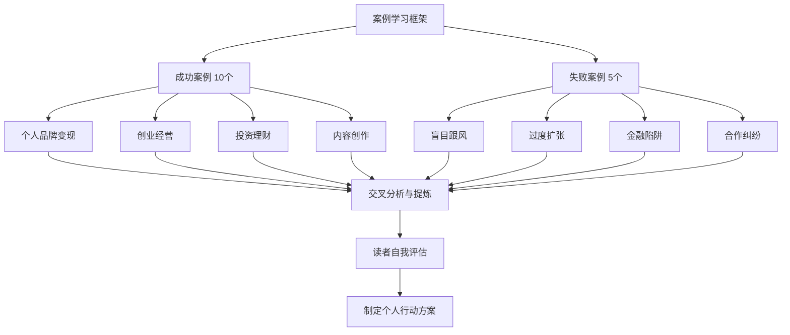
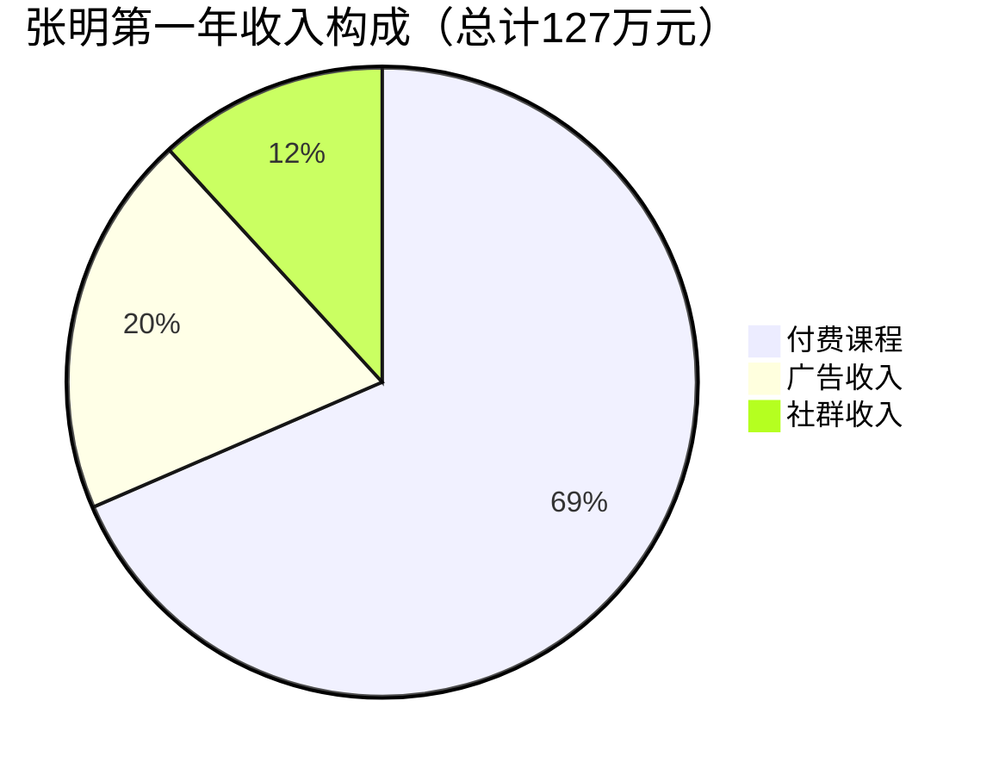
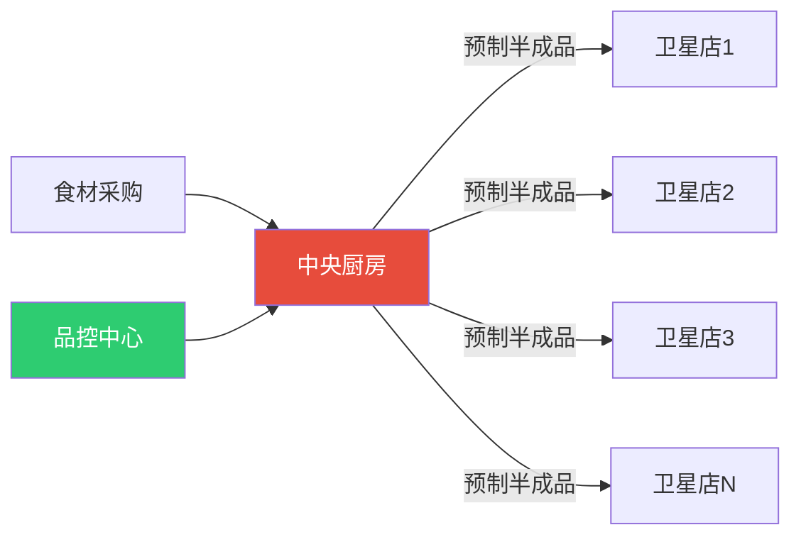
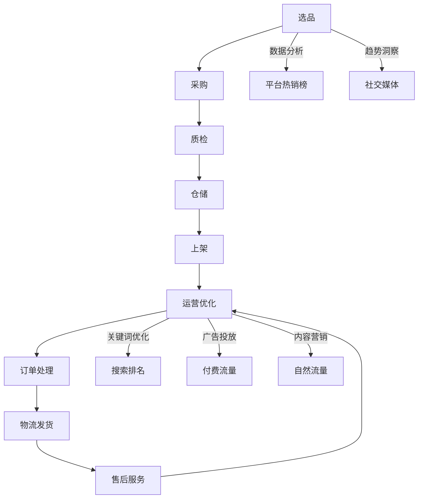
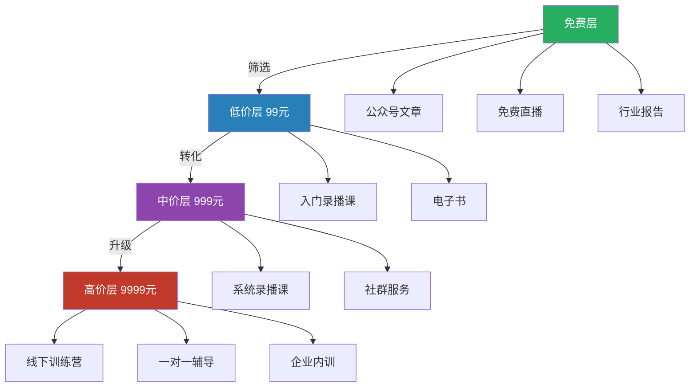
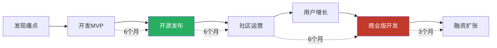
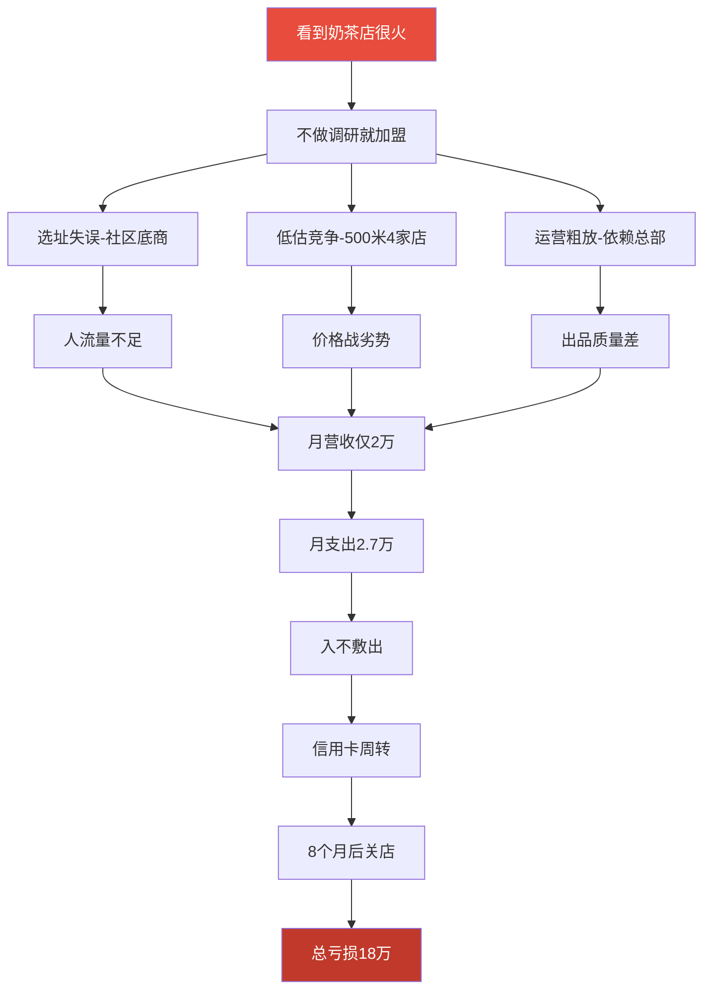
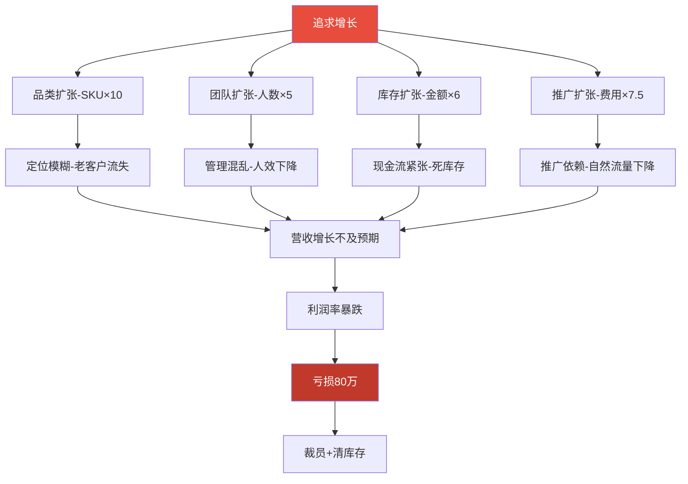
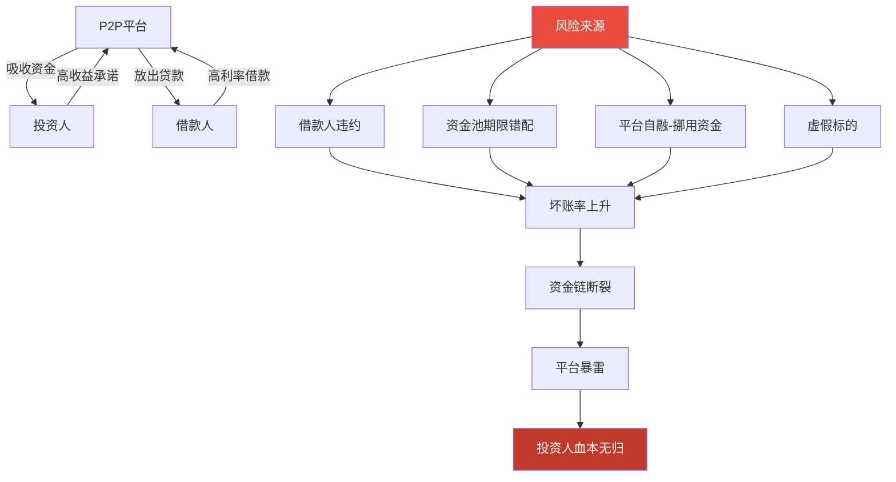
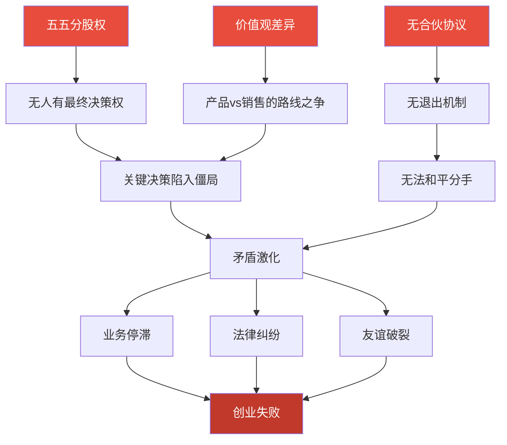

# 附录G：搞钱案例深度分析

## 前言：为什么案例分析是最高效的学习方式

人类的认知天然偏好"故事"而非"理论"。神经科学研究表明，当人听到一个具体的故事时，大脑中负责"体验"的区域会被激活——你不是在"听别人的事"，而是在"模拟自己的经历"。这就是为什么案例分析是商学院、法学院和军事院校的核心教学方法。

但案例学习有一个致命陷阱：**幸存者偏差**。你看到的成功案例，只是冰山露出水面的那一角；水面下沉没的无数失败尝试，才是更值得研究的对象。因此，本附录同时收录了成功案例和失败案例，并且对失败案例的分析深度不亚于成功案例。

**阅读本附录的正确姿势：**

1. 不要急于找"我可以复制的模式"，先理解每个案例背后的**结构性因素**
2. 关注案例主人公的**决策过程**，而不仅是结果
3. 对比成功和失败案例中的**相似情境**，理解"同样的起点，不同的结局"
4. 用文末的"自我评估框架"检验自己当前的状态

---

## 第一部分：成功案例深度剖析

### 成功案例一：从程序员到年入百万的技术博主

**人物画像**

| 维度 | 详情 |
|------|------|
| 人物 | 张明，32岁 |
| 背景 | 前大厂P7程序员，坐标深圳 |
| 起始资源 | 技术专长、大厂背景、零粉丝 |
| 风险承受 | 中等（有存款，但需覆盖房贷） |
| 时间投入 | 前期每天2-3小时，后期全职 |

**战略决策分析**

2022年初，张明面临的核心问题不是"要不要做副业"，而是"做什么副业"。他做了三个关键判断：

1. **赛道判断**：选择Rust语言而非Python/Java。Python教程市场已经红海，竞争者众多且头部效应明显；Rust当时在国内处于"早期增长期"——有真实需求（越来越多公司开始用Rust），但优质内容供给严重不足。这是一个经典的"供给缺口"机会。

2. **形式判断**：选择"文字+视频"双轨而非单一形式。文字平台（掘金、知乎）适合深度技术内容，SEO效果好，长尾流量持久；视频平台（B站）适合入门教程和实操演示，粉丝粘性更强。两种形式互补，覆盖不同学习偏好的用户。

3. **变现判断**：选择"免费内容→付费课程→高端社群"的三级漏斗，而非一开始就卖课。免费内容建立信任和专业形象，是后续一切变现的基础。

**执行时间线与关键里程碑**

| 阶段 | 时间 | 核心动作 | 关键数据 | 转折点 |
|------|------|----------|----------|--------|
| 冷启动 | 第1-3月 | 掘金/知乎周更3篇 | 累计阅读10万+ | 第一篇破万阅读的文章出现 |
| 扩展期 | 第4-6月 | B站视频+GitHub开源项目 | 粉丝破1万 | 开源项目被Rust官方社区推荐 |
| 变现期 | 第7-9月 | 接广告+推出付费课程 | 课程首月销售200+份 | 付费用户口碑传播形成正循环 |
| 放大期 | 第10-12月 | 付费社群+多平台矩阵 | 全平台粉丝20万+ | 决定辞职全职做内容 |
| 稳定期 | 第2-3年 | 课程迭代+品牌合作 | 年收入200万+ | 建立了稳定的内容生产系统 |

**收入结构详解**

需要注意的是，这个收入结构中付费课程占比68%，说明**系统化的知识产品是技术内容变现的核心引擎**。广告收入虽然看起来不错（25万），但它高度依赖粉丝量级和品牌方预算，不稳定且天花板明显。社群收入（15万）虽然占比最低，但它提供了最高质量的用户反馈和续费率，是长期价值最高的变现形式。

**核心经验拆解**

1. **细分赛道选择的"三要素模型"**

   判断一个细分赛道是否值得进入，需要同时满足三个条件：
   - **需求真实存在**：Rust在2022年已经被多家大厂采用（字节、华为、阿里），不是"伪需求"
   - **供给明显不足**：当时国内Rust高质量中文教程不超过10个，而Python教程有数百个
   - **你能做到前3名**：张明有大厂P7的实战经验，在Rust内容创作者中属于最专业的梯队

2. **持续输出的真正门槛不是"毅力"**

   很多人以为坚持更新靠的是意志力，实际上张明能坚持下来的关键是**建立了内容生产系统**：
   - 每周固定时间写作（周日晚上+周三晚上）
   - 从工作中遇到的真实技术问题中提炼选题
   - 建立了文章模板库，降低每次写作的启动成本
   - 用GitHub issue收集读者问题，形成"用户驱动"的选题机制

3. **三级变现漏斗的具体设计**

   | 层级 | 产品 | 价格 | 目的 | 转化率 |
   |------|------|------|------|--------|
   | 免费层 | 文章+视频+开源项目 | 0 | 建立信任、获取流量 | — |
   | 低价层 | 系统课程（录播） | 399元 | 筛选付费意愿用户 | 约3% |
   | 中价层 | 付费社群（年费） | 299元/年 | 持续服务、获取反馈 | 约8% |

**可复制的策略清单**

- [ ] 选择一个你精通且处于"早期增长期"的技术/领域
- [ ] 分析该领域现有内容的质量和数量，找到"供给缺口"
- [ ] 用"人话"写专业内容，降低读者的理解门槛
- [ ] 坚持至少6个月的免费内容输出，建立专业形象
- [ ] 设计"免费→低价→中价"的三级变现产品
- [ ] 多平台分发但根据平台特性调整内容形式

---

### 成功案例二：宝妈的社群电商之路

**人物画像**

| 维度 | 详情 |
|------|------|
| 人物 | 李芳，29岁 |
| 背景 | 全职宝妈，坐标成都，前服装行业销售 |
| 起始资源 | 销售经验、宝妈身份认同、零启动资金 |
| 风险承受 | 低（家庭单收入，需谨慎投入） |
| 时间投入 | 碎片化（孩子午睡+晚上） |

**战略决策分析**

李芳的成功不是偶然的"运气"，而是精准地利用了三个结构性优势：

1. **身份优势**：作为宝妈推荐母婴产品，天然具有"同类人"的信任背书。这比任何广告文案都有效——消费者信任"和我一样的人"远胜于信任"专业的推销员"。

2. **场景优势**：宝妈群体有天然的社交网络——小区群、幼儿园家长群、兴趣班群。这些群本身就是精准的流量池，获客成本几乎为零。

3. **时间优势**：全职在家意味着可以全天候运营社群，而上班族做社群最大的痛点就是"没时间互动"。

**社群运营体系详解**

李芳建立的"内容+互动+福利"体系，本质上是一个**信任积累系统**：

| 时段 | 内容类型 | 目的 | 示例 |
|------|----------|------|------|
| 早上8:00 | 育儿知识 | 提供价值、建立专业形象 | "宝宝辅食添加的5个阶段" |
| 中午12:00 | 产品介绍 | 软性种草、建立需求 | "我给宝宝试了3款纸尿裤，这款最透气" |
| 晚上20:00 | 互动活动 | 增强粘性、促进交流 | "晒晒你家宝宝今天吃了什么" |
| 不定期 | 限时福利 | 促进转化、制造紧迫感 | "厂家清仓，这款湿巾直降30%" |

**关键转折点：从个人到网络的跃迁**

李芳的年收入从18万到60万再到150万，核心驱动力是**分销网络的建立**。她不是简单地"招代理"，而是建立了一套完整的"宝妈团长赋能体系"：

1. **筛选标准**：只选择在自己社群中已经有影响力的真实宝妈，不要"什么人都能做"
2. **培训体系**：每周一次线上培训，内容包括产品知识、社群运营技巧、售后处理方法
3. **激励机制**：阶梯式佣金（月销1万以下15%，1-3万20%，3万以上25%），鼓励持续增长
4. **品控保障**：所有团长推荐的产品，李芳自己先试用，确保质量一致性

**核心经验拆解**

1. **"身份即信任"的信任经济学**

   在信息过载的时代，消费者面临的核心问题不是"找不到产品"，而是"不知道该信任谁"。李芳的案例证明：**身份认同是最高效的信任建立机制**。一个宝妈推荐母婴产品，其说服力超过10个明星代言。

   这个原理可以推广到其他领域：
   - 健身爱好者推荐运动装备
   - 游戏玩家推荐外设
   - 程序员推荐开发工具
   - 学生推荐学习资源

2. **社群运营的"二八法则"**

   李芳严格遵循"80%价值内容+20%商业推广"的比例。这不是一个随意的数字，而是经过反复测试得出的最优解：
   - 推广比例超过30%：群成员开始觉得"这个群就是卖东西的"，活跃度急剧下降
   - 推广比例低于10%：商业化不足，无法持续运营
   - 20%左右：群成员觉得"这个群很有料，偶尔推荐的东西也靠谱"

3. **分销网络的"信任传递"机制**

   宝妈团长本质上是李芳信任网络的"节点"。每个团长在自己的社群中积累的信任，可以"传递"到李芳的供应链上。这种信任传递比任何广告投放都高效，因为它是**基于真实人际关系的信任链**。

**可复制的策略清单**

- [ ] 找到你的"身份优势"——你是什么身份，你就最懂什么人群
- [ ] 从你身边的真实社交网络开始，不要急着"引流"
- [ ] 严格遵循"80%价值+20%推广"的内容比例
- [ ] 只推荐你真正用过的产品，真诚是最大的竞争力
- [ ] 当模式验证成功后，通过赋能更多"节点"实现规模化

---

### 成功案例三：从负债50万到年入300万的餐饮创业

**人物画像**

| 维度 | 详情 |
|------|------|
| 人物 | 王强，35岁 |
| 背景 | 前广告公司中层，坐标武汉，因创业失败负债50万 |
| 起始资源 | 5万现金+15万借款，广告营销经验 |
| 风险承受 | 极低（已负债，必须成功） |
| 时间投入 | 全职（每天16小时以上） |

**战略决策分析**

王强的案例是一个典型的"绝境逆袭"故事，但他的成功不是因为"运气好"，而是因为**在绝境中做出了理性的战略选择**：

1. **赛道选择的逻辑**：疫情后"健康快餐"需求激增，这是一个结构性的变化，不是短期风口。他看到的不是"大家都在做外卖"，而是"健康外卖这个细分品类有真实需求但供给不足"。

2. **启动方式的智慧**：用15万开30平米的外卖店，而不是借100万开堂食店。外卖店的试错成本极低——如果失败，损失可控；如果成功，可以快速复制。

3. **产品策略的精准**：菜单精简到12个SKU，主打"低卡高蛋白"。这不是"偷懒"，而是**聚焦策略**——SKU越少，越容易做到标准化和品质控制。

**单店经济模型拆解**

| 指标 | 数值 | 说明 |
|------|------|------|
| 月营收 | 约12万 | 日均4000元，客单价35元，日均114单 |
| 食材成本 | 约3.6万（30%） | 通过供应链优化控制在30%以内 |
| 平台佣金 | 约2.4万（20%） | 美团/饿了么平均佣金比例 |
| 房租 | 约0.8万 | 30平米外卖店，非核心地段 |
| 人工 | 约1.5万 | 2名员工+老板自己 |
| 水电杂费 | 约0.3万 | |
| **月净利润** | **约3.4万（28%）** | 单店模型验证成功 |

**"中央厨房+卫星店"模式详解**

这是王强规模化的核心策略。传统餐饮扩张的痛点是：每开一家新店，都需要一个完整的厨房团队，成本高、标准化难。中央厨房模式解决了这两个问题：

**中央厨房的核心价值：**
- **标准化**：所有菜品的调味、配料在中央厨房统一完成，卫星店只需要简单加热和组装
- **成本控制**：集中采购食材，议价能力更强；集中加工，人工效率更高
- **品控保障**：所有出品都经过中央厨房的品控流程，口味一致性极高
- **快速复制**：新店只需要一个小厨房+简单设备，开业周期从1个月缩短到1周

**核心经验拆解**

1. **绝境中的"最小可行模式"思维**

   王强在负债50万的情况下，没有选择"搏一把大的"，而是选择了试错成本最低的路径。这种思维叫做**最小可行模式（Minimum Viable Model）**：用最小的投入，验证一个商业模型是否可行，成功后再放大。

2. **餐饮创业的"产品力铁律"**

   在餐饮行业，产品力是一切的基础。王强前期"所有菜品亲自研发、试吃、调整"，这不是形式主义，而是**产品力打磨的必经之路**。再好的营销和运营，也留不住不好吃的产品。

3. **从"手艺人"到"系统"的跃迁**

   很多餐饮创业者困在"手艺人陷阱"里——自己做的东西好吃，但无法标准化、无法复制。王强的突破点在于建立了"中央厨房+卫星店"系统，把个人手艺变成了可复制的商业系统。

**可复制的策略清单**

- [ ] 选择有明确需求但竞争不充分的细分品类
- [ ] 从最小可行的门店模型开始（外卖店/档口/摊位）
- [ ] 先把单店模型跑通（月净利润率>20%），再考虑扩张
- [ ] 建立标准化的供应链体系支撑规模化
- [ ] 菜单精简聚焦，SKU越少越容易控制品质

---

### 成功案例四：自由设计师的年入百万之路

**人物画像**

| 维度 | 详情 |
|------|------|
| 人物 | 陈雪，28岁 |
| 背景 | 前互联网公司UI设计师，坐标杭州 |
| 起始资源 | 设计专业技能、行业人脉、3个月生活费储备 |
| 风险承受 | 中低（无房贷，但无稳定收入） |
| 时间投入 | 全职 |

**战略决策分析**

陈雪面临的核心问题是：**自由设计师如何突破"按小时计费"的收入天花板？**

传统自由设计师的收入模型是：接项目→交付→收款→再接项目。这个模型的问题是：
- 收入与时间强绑定，一天只有24小时
- 客户预算有限，单个项目收入有天花板
- 获客依赖口碑和平台，收入不稳定

陈雪的突破策略是**从"执行者"升级为"策略顾问"**，同时通过**内容营销建立个人品牌**来解决获客问题。

**定价策略的跃迁**

| 阶段 | 服务类型 | 客单价 | 年项目数 | 年收入 |
|------|----------|--------|----------|--------|
| 传统自由设计师 | UI设计执行 | 5000-2万 | 30-50个 | 30-60万 |
| 陈雪的第一年 | 品牌视觉设计 | 2-5万 | 15-20个 | 45万 |
| 陈雪的第二年 | 品牌视觉策略 | 5-15万 | 10-15个 | 100万+ |
| 陈雪的第三年 | 品牌视觉咨询 | 10-30万 | 8-12个 | 150万+ |

关键变化：**项目数量在减少，但客单价在大幅提升**。这意味着陈雪用更少的时间赚了更多的钱——自由职业的理想状态。

**内容营销获客体系**

陈雪的内容营销不是"随便发发作品"，而是一个精心设计的系统：

1. **小红书**：发设计思考和行业观点，吸引潜在客户和同行关注。内容形式以图文为主，强调"观点独特性"。
2. **站酷**：发完整的设计案例和作品集，展示专业深度。内容形式以长图和案例分析为主，强调"专业性"。
3. **电子书《商业设计的底层逻辑》**：系统性的知识产品，既是获客工具（免费下载需要留联系方式），也是专业形象的背书。
4. **设计大会分享**：线下演讲建立深度信任，转化率远高于线上内容。

**客户筛选机制的设计逻辑**

陈雪"只接5万以上项目"的策略，表面上看是"放弃了大量潜在客户"，但实际上是**用价格门槛筛选出高质量客户**：

- 预算5万以上的客户，通常是真正重视设计的企业，沟通成本低、执行效率高
- 高客单价意味着可以投入更多时间打磨作品，作品质量更高
- 优质作品带来更多优质客户，形成正循环
- 宁可少接项目也不降低标准，维护了"高端"的品牌定位

**核心经验拆解**

1. **自由职业的"定位公式"**

   自由职业的收入天花板 = 专业能力 × 个人品牌 × 定价策略

   三个因素缺一不可：
   - 专业能力是基础，没有能力的高定价就是诈骗
   - 个人品牌解决"客户从哪里来"的问题
   - 定价策略决定"同样的时间能赚多少钱"

2. **内容营销的"筛选效应"**

   持续输出高质量内容，不仅能吸引客户，更能**筛选客户**。陈雪的内容风格（极简、专业、有深度）天然吸引了认同这种审美和价值观的客户，大大降低了沟通成本。

3. **从"卖时间"到"卖策略"的价值跃迁**

   | 维度 | 执行者模式 | 策略顾问模式 |
   |------|-----------|-------------|
   | 交付物 | 设计稿 | 品牌视觉策略+设计规范+部分执行 |
   | 价值主张 | "帮你做好看的设计" | "帮你建立有效的品牌视觉体系" |
   | 客户关系 | 甲方-乙方 | 合作伙伴 |
   | 复购率 | 低（项目结束即结束） | 高（长期顾问关系） |
   | 收入天花板 | 时间限制 | 价值限制（更高） |

**可复制的策略清单**

- [ ] 建立鲜明的个人风格和专业定位
- [ ] 通过持续的内容输出建立行业影响力
- [ ] 设定明确的客户筛选标准，不接低质量项目
- [ ] 从执行服务升级为策略咨询服务
- [ ] 用"免费内容+低价产品+高价服务"的漏斗模型获客

---

### 成功案例五：利用信息差做跨境电商

**人物画像**

| 维度 | 详情 |
|------|------|
| 人物 | 赵伟，31岁 |
| 背景 | 前外贸公司业务员，坐标义乌 |
| 起始资源 | 供应链资源、外贸经验、10万启动资金 |
| 风险承受 | 中等（有经验但资金有限） |
| 时间投入 | 全职 |

**战略决策分析**

赵伟的案例展示了**"信息差+供应链优势"的组合威力**：

1. **信息差的识别**：同一款家居收纳产品，在1688上的采购价是8元，在Shopee泰国站的售价是35泰铢（约7元人民币），但在Shopee马来西亚站的售价是15马币（约23元人民币）。这种价差来源于：中国卖家对东南亚不同市场的定价能力差异、物流成本的差异、以及消费者对价格敏感度的差异。

2. **供应链优势的利用**：义乌是全球最大的小商品集散地，赵伟在这里有直接的工厂资源，采购成本比普通卖家低20-30%。

3. **平台选择的逻辑**：选择Shopee和Lazada而非Amazon，是因为东南亚市场的竞争强度远低于欧美市场，且对中国卖家更友好。

**跨境电商的核心运营体系**

**本地化运营的关键细节**

赵伟的本地化不是简单的"翻译产品描述"，而是深入到多个维度：

| 维度 | 泰国市场 | 马来西亚市场 | 印尼市场 |
|------|----------|-------------|----------|
| 语言 | 泰语 | 马来语+英语 | 印尼语 |
| 价格敏感度 | 高 | 中 | 高 |
| 偏好品类 | 家居、美妆 | 电子、时尚 | 家居、母婴 |
| 支付方式 | 银行转账+COD | 电子钱包+银行卡 | 银行转账+COD |
| 物流时效 | 3-7天 | 2-5天 | 5-10天 |
| 营销节点 | 宋干节、水灯节 | 开斋节、双11 | 开斋节、双12 |

**核心经验拆解**

1. **信息差的本质是"行动差"**

   很多人知道跨境电商能赚钱，但真正行动的人很少。赵伟的优势不在于"他知道这个信息"，而在于他**花了一个月时间深入调研，并且立即行动**。信息差的窗口期通常只有6-18个月，错过就没了。

2. **小团队大生意的"系统化思维"**

   3个人的团队能做到年销1000万，关键在于**用系统替代人力**：
   - ERP系统管理订单和库存，减少人工操作
   - 自动化定价工具，根据市场变化实时调整价格
   - 标准化的选品流程，减少决策时间
   - 模板化的客服话术，提高响应效率

3. **供应链优势的"护城河效应"**

   赵伟的供应链优势不是简单的"进货便宜"，而是一个综合优势：
   - 更低的采购成本（直接对接工厂）
   - 更快的上新速度（工厂配合打样和生产）
   - 更好的品控能力（驻厂质检）
   - 更灵活的起订量（工厂关系好，小批量也做）

**可复制的策略清单**

- [ ] 利用你在特定领域的信息优势或资源优势
- [ ] 深入研究目标市场的消费习惯和平台规则
- [ ] 建立稳定的供应链和品控体系
- [ ] 用系统化思维做规模化运营
- [ ] 本地化运营要深入到语言、支付、物流、营销节点等细节

---

### 成功案例六：知识付费的系统化运营

**人物画像**

| 维度 | 详情 |
|------|------|
| 人物 | 刘洋，38岁 |
| 背景 | 前咨询公司高级顾问，人力资源管理专家，坐标北京 |
| 起始资源 | 12年专业经验、行业人脉、零内容创业经验 |
| 风险承受 | 中等（有积蓄，但家庭负担较重） |
| 时间投入 | 前期每天1-2小时，后期全职 |

**知识付费产品矩阵的完整设计**

刘洋的核心创新不是"做课程"，而是**构建了一个完整的产品矩阵**：

**产品矩阵的经济学逻辑**

| 层级 | 价格 | 用户画像 | 年用户数 | 年收入 | 服务成本 |
|------|------|----------|----------|--------|----------|
| 免费层 | 0 | 所有对HR感兴趣的人 | 15万+ | 0（间接价值） | 内容制作时间 |
| 低价层 | 99元 | 想了解HR领域的职场人 | 3000+ | 约30万 | 极低（录播课） |
| 中价层 | 999元 | 想系统学习的HR从业者 | 1500+ | 约150万 | 中等（社群维护） |
| 高价层 | 9999元 | 想快速提升的HR管理者 | 120+ | 约120万 | 高（线下+一对一） |
| **合计** | | | | **约300万** | |

关键洞察：**高价层虽然用户数最少（120人），但贡献了40%的收入，且利润率最高**。这是因为高价用户购买的不仅是知识，更是"加速"——他们愿意为"缩短学习路径"支付溢价。

**训练营模式为什么复购率高达40%？**

刘洋的训练营复购率远超行业平均水平（通常10-15%），原因在于：

1. **社交关系的建立**：线下训练营让学员之间建立了真实的人际关系，这些关系在训练营结束后仍然存在，形成了一个"校友网络"
2. **即时反馈的体验**：训练营中的一对一辅导和小组讨论，让学员获得了录播课无法提供的即时反馈
3. **承诺的一致性**：花9999元参加训练营的学员，本身就做出了"我要认真学习"的承诺，行为一致性会驱动他们持续学习
4. **内容的迭代**：刘洋每期训练营都会根据学员反馈迭代内容，确保每期都有新收获

**核心经验拆解**

1. **知识付费的"漏斗逻辑"**

   知识付费的本质不是"卖知识"，而是**用知识建立信任，然后卖服务**。免费内容是信任的起点，付费产品是信任的兑现。每一层产品都在筛选出更精准、更有付费意愿的用户。

2. **"系统化"是知识付费的真正壁垒**

   刘洋花3个月把12年经验梳理成108个知识点+36个案例，这个"系统化"的过程才是真正的壁垒。很多人有经验，但能把经验**结构化、可交付、可复制**的人极少。

3. **免费内容的"信任投资"逻辑**

   刘洋每天发布一篇高质量行业分析文章，这不是"白给"，而是一种**信任投资**。每篇文章都在积累读者的信任资产，这个资产在未来的某个时刻会转化为付费用户。

**可复制的策略清单**

- [ ] 把你的专业经验系统化为可交付的知识产品
- [ ] 设计多层次的产品矩阵覆盖不同用户群体
- [ ] 用高质量的免费内容持续获取流量和建立信任
- [ ] 用训练营模式提高用户满意度和复购率
- [ ] 每期产品都根据用户反馈迭代优化

---

### 成功案例七：从摆摊到连锁品牌的逆袭

**人物画像**

| 维度 | 详情 |
|------|------|
| 人物 | 孙磊，26岁 |
| 背景 | 高中学历，前工厂工人，坐标长沙 |
| 起始资源 | 2万存款、吃苦耐劳、零商业经验 |
| 风险承受 | 极低（全部身家只有2万） |
| 时间投入 | 全职（每天14小时以上） |

**战略决策分析**

孙磊的案例打破了"创业需要高学历、高资金、高资源"的刻板印象。他的成功关键在于**在传统行业中找到了"升级"的机会**：

夜市烤串行业在2020年是什么状态？
- 绝大多数摊位是"夫妻店"，没有品牌意识
- 卫生条件参差不齐，消费者对此不满但无选择
- 产品同质化严重，竞争主要靠"位置"和"价格"
- 没有任何标准化运营的概念

孙磊看到的机会是：**在一个"低标准"的行业中，用"高标准"来建立差异化**。

**品牌升级的四个阶段**

| 阶段 | 形态 | 月收入 | 关键动作 |
|------|------|--------|----------|
| 摆摊期 | 夜市摊位 | 3万 | 统一装修、食材公示、员工着装 |
| 单店期 | 街边小店 | 10万 | 注册商标、设计VI系统、建立标准化流程 |
| 扩张期 | 商场档口 | 各店5-8万 | 中央厨房、标准化培训体系 |
| 加盟期 | 连锁品牌 | 各店5-10万 | 加盟商支持体系、供应链网络 |

**加盟体系的设计逻辑**

孙磊的加盟不是"收完加盟费就不管了"，而是建立了一套完整的加盟商支持体系：

1. **选址支持**：提供人流量评估模型和竞品分析工具
2. **装修支持**：统一的设计方案和供应商清单
3. **培训支持**：7天标准化培训+3天驻店指导
4. **供应链支持**：统一的食材采购和物流配送
5. **运营支持**：标准化的运营手册+远程督导
6. **营销支持**：统一的品牌宣传和活动方案

**核心经验拆解**

1. **"降维打击"在传统行业同样有效**

   孙磊做的事情并不复杂——统一装修、食材公示、员工着装。这些在互联网行业是基本功，但在夜市烤串行业就是"降维打击"。**当所有人都在用最低标准经营时，你用高标准，你就赢了**。

2. **品牌化是"可复制性"的前提**

   没有品牌，你只是一个"好吃的摊位"；有了品牌，你是一个"可以复制的商业系统"。品牌化的核心价值不是"logo好看"，而是**标准化**——让每一家店都能提供一致的产品和服务。

3. **学历不是搞钱的门槛，思维方式才是**

   孙磊只有高中学历，但他比很多大学生更懂得商业的本质：**用系统替代个人能力，用标准替代个人经验，用品牌替代个人口碑**。

**可复制的策略清单**

- [ ] 在传统行业中找"升级"的机会（高标准打低标准）
- [ ] 用标准化和品牌化建立竞争壁垒
- [ ] 先做好一家店，验证模型后再考虑连锁扩张
- [ ] 建立完善的加盟商支持体系，不要"收完钱就不管"

---

### 成功案例八：程序员的开源商业化

**人物画像**

| 维度 | 详情 |
|------|------|
| 人物 | 周杰，33岁 |
| 背景 | 某大厂资深后端工程师，坐标上海 |
| 起始资源 | 技术能力、大厂背书、业余时间 |
| 风险承受 | 中高（有稳定工资收入） |
| 时间投入 | 前期业余时间，后期全职 |

**开源商业化的完整路径**

周杰的案例展示了**技术人如何用开源项目实现商业化**的完整路径：

**"开源核心+商业扩展"模式详解**

这个模式被GitLab、MongoDB、Elastic等公司验证过，其核心逻辑是：

| 维度 | 开源版 | 商业版 |
|------|--------|--------|
| 目标用户 | 个人开发者、小团队 | 企业用户 |
| 核心功能 | 完整可用 | 团队协作、权限管理、审计日志 |
| 定价 | 免费 | 按座位/按用量收费 |
| 获客方式 | 口碑传播、社区推广 | 销售团队、合作伙伴 |
| 壁垒 | 社区活跃度、生态完整性 | 企业级功能、技术支持 |

**GitHub Star到商业收入的转化路径**

周杰从0到500万年收入的转化路径：

1. **Star阶段（0-5000）**：在技术社区推广，快速迭代，认真对待每一个issue
2. **用户阶段（5000-15000）**：用户开始在生产环境中使用，反馈质量问题和功能需求
3. **商业化阶段（15000-25000）**：推出企业版，开始有付费用户
4. **融资阶段（25000+）**：项目获得投资机构关注，完成天使轮融资

**核心经验拆解**

1. **开源是技术人最有效的"个人品牌"建设方式**

   一个好的开源项目 = 你的技术能力证明 + 你的产品能力证明 + 你的社区运营能力证明。它比任何简历、博客、演讲都有说服力。

2. **"先社区后商业"的顺序不能颠倒**

   在没有用户基础的情况下做商业化，注定困难重重。用户不会为一个没有社区、没有口碑、没有生态的产品付费。

3. **解决真实痛点比技术创新更重要**

   周杰的项目成功不是因为技术多先进，而是因为它**真正解决了开发者的痛点**。技术创新是手段，解决痛点才是目的。

**可复制的策略清单**

- [ ] 从你工作中发现的真实痛点出发
- [ ] 用开源模式快速获取用户和建立口碑
- [ ] 采用"开源核心+商业扩展"的变现模式
- [ ] 积极参与技术社区，建立专业影响力
- [ ] 先做社区，再做商业化，顺序不能颠倒

---

### 成功案例九：房产投资的稳健策略

**人物画像**

| 维度 | 详情 |
|------|------|
| 人物 | 吴敏，40岁 |
| 背景 | 企业中层管理，坐标杭州，家庭年收入约60万 |
| 起始资源 | 70万家庭积蓄、稳定收入、良好的信用记录 |
| 风险承受 | 中等（有家庭负担，不能承受大额亏损） |
| 时间投入 | 前期学习1年，后续每月10-20小时 |

**房产投资评估模型**

吴敏的核心竞争力是建立了一套**量化的投资评估模型**：

| 评估维度 | 权重 | 评分标准 |
|----------|------|----------|
| 区位发展潜力 | 30% | 地铁规划、产业导入、城市规划 |
| 价格合理性 | 25% | 周边均价对比、历史涨幅、估值水平 |
| 租金回报率 | 20% | 月租金/房价，要求>1.5% |
| 流动性 | 15% | 周边成交活跃度、户型接受度 |
| 政策风险 | 10% | 限购政策、学区政策、税收政策 |

**投资组合分析**

| 房产 | 购入时间 | 购入价 | 当前市值 | 贷款余额 | 月租金 | 月供 |
|------|----------|--------|----------|----------|--------|------|
| 未来科技城1套 | 2019年 | 230万 | 350万 | 140万 | 4500元 | 8500元 |
| 良渚1套 | 2020年 | 180万 | 260万 | 120万 | 3800元 | 6800元 |
| 萧山1套 | 2021年 | 200万 | 280万 | 130万 | 4200元 | 7200元 |
| 临平1套 | 2023年 | 220万 | 310万 | 150万 | 4500元 | 7800元 |
| **合计** | | **830万** | **1200万** | **540万** | **17000元** | **30300元** |

月租金收入17000元，月供30300元，月净现金流为-13300元。但考虑到房产增值370万（账面收益），以及租金逐年上涨的趋势，长期来看这是一个合理的投资组合。

**核心经验拆解**

1. **房产投资的"现金流底线"原则**

   吴敏始终坚持一个原则：**租金必须能覆盖月供的50%以上**。如果租金太低，说明房价相对于租金过高，泡沫风险大；如果现金流压力太大，一旦收入中断就会面临断供风险。

2. **"装修提升"的杠杆效应**

   吴敏的每套投资房都花了5-8万进行精装修，装修后租金提升了30-50%。这是一个**低成本高回报的杠杆**——8万的装修投入，每年多收2万租金，4年回本，之后都是净收益。

3. **长期主义 vs 短期投机**

   吴敏的投资策略是"买入→装修→出租→等待增值"，周期通常在5年以上。这与"低买高卖"的短期投机完全不同。长期主义的核心是**选择有真正增值潜力的资产**，而不是预测短期价格波动。

**重要风险提示**

房产投资有其特殊性，需要注意以下风险：
- **政策风险**：限购、限贷、房产税等政策变化可能影响投资收益
- **流动性风险**：房产不像股票可以随时卖出，变现周期长
- **杠杆风险**：贷款比例过高时，房价下跌可能导致资不抵债
- **区域风险**：不同城市的房产市场差异巨大，不能简单套用经验

**可复制的策略清单**

- [ ] 花足够的时间学习房产投资知识（至少6个月）
- [ ] 建立量化的投资评估模型，不靠"感觉"决策
- [ ] 选择有长期增值潜力的区域（地铁、产业、城市规划）
- [ ] 确保租金能覆盖月供的50%以上，控制现金流风险
- [ ] 适度装修提升房产价值和租金水平
- [ ] 不要过度杠杆，保留足够的安全边际

---

### 成功案例十：从0到1的个人品牌变现

**人物画像**

| 维度 | 详情 |
|------|------|
| 人物 | 林婷，27岁 |
| 背景 | 前4A广告公司文案策划，坐标深圳 |
| 起始资源 | 品牌专业知识、文案能力、零粉丝 |
| 风险承受 | 中低（有3个月生活费储备） |
| 时间投入 | 全职 |

**三级服务体系的设计逻辑**

林婷的服务设计遵循了**"信任阶梯"原则**——每个层级都在为下一层级建立信任：

| 层级 | 服务 | 价格 | 目的 | 客户转化路径 |
|------|------|------|------|-------------|
| 入门层 | 品牌诊断报告 | 199元 | 低门槛体验、建立初步信任 | 免费内容→199元诊断 |
| 核心层 | 品牌策略方案 | 2999元 | 深度服务、展示专业能力 | 199元诊断→2999元方案 |
| 高端层 | 品牌全案服务 | 19999元起 | 全面合作、长期关系 | 2999元方案→19999元全案 |

**免费直播获客的效率分析**

林婷每周一次的免费品牌诊断直播，是她最核心的获客渠道。其效率远超其他获客方式：

| 获客方式 | 月均获客数 | 客户质量 | 成本 | 转化率 |
|----------|-----------|---------|------|--------|
| 免费直播 | 15-20人 | 高（已建立信任） | 时间成本 | 约40% |
| 小红书内容 | 10-15人 | 中（需要进一步筛选） | 时间成本 | 约20% |
| 客户转介绍 | 5-10人 | 极高（有信任背书） | 零成本 | 约60% |
| 付费广告 | 20-30人 | 低（质量参差不齐） | 5000-8000元/月 | 约5% |

关键洞察：**免费直播的获客成本几乎为零，但转化率高达40%**，远超付费广告。这是因为直播能同时展示专业能力和个人魅力，是一种"高带宽"的信任建立方式。

**超预期交付的具体做法**

林婷的199元品牌诊断报告，市面上同类产品通常只给3-5页的模板化分析。但林婷的报告通常有15-20页，包含：
- 品牌现状的详细分析（含竞品对比）
- 3-5个具体可执行的改进建议
- 每个建议的预期效果和实施优先级
- 附赠一份品牌视觉参考图库

这种超预期交付让客户觉得"199元买到2999元的价值"，自然会主动推荐给朋友。

**核心经验拆解**

1. **个人品牌的"自证效应"**

   林婷最聪明的做法是**先给自己做品牌**。当一个"品牌教练"自己的品牌做得很好时，这就是最好的证明。你不需要说服客户"我很专业"，你的品牌本身就是证明。

2. **免费直播的"高带宽"优势**

   文字内容是"低带宽"的——读者只能看到你的文字，无法感知你的语气、表情和气场。直播是"高带宽"的——观众可以看到你的专业能力、沟通风格和个人魅力。这就是为什么直播的转化率远高于文字内容。

3. **口碑驱动的"飞轮效应"**

   超预期交付→客户满意→主动推荐→新客户→超预期交付→...

   这个飞轮一旦转起来，获客成本会持续降低，客户质量会持续提高。林婷40%的客户转介绍率，就是这个飞轮效应的体现。

**可复制的策略清单**

- [ ] 先给自己建立专业的个人品牌（你的品牌就是你最好的作品）
- [ ] 用免费内容和免费服务吸引潜在客户
- [ ] 设计多层次的产品和服务满足不同预算的客户
- [ ] 超预期交付，用口碑驱动增长
- [ ] 优先使用"高带宽"的获客方式（直播、线下活动）

---

## 第二部分：失败案例深度剖析

### 失败案例一：盲目跟风的奶茶店创业

**人物画像**

| 维度 | 详情 |
|------|------|
| 人物 | 小陈，25岁 |
| 背景 | 刚毕业两年，坐标二线城市，存款8万 |
| 起始资源 | 8万存款+7万借款=15万启动资金 |
| 失败核心原因 | 未经调研盲目跟风 |

**失败的因果链分析**

**关键决策失误逐一拆解**

1. **决策失误：不做市场调研就投入全部积蓄**

   小陈犯的第一个错误是**用"感觉"代替"数据"**。他看到奶茶店"生意火爆"，但没有去验证：
   - 这些奶茶店真的赚钱吗？（很多奶茶店的火爆是靠低价促销维持的，实际亏损）
   - 周围有多少家竞争店铺？（500米范围内4家，已经是过度竞争）
   - 目标区域的消费水平如何？（社区底商的消费能力远低于商圈）
   - 加盟品牌的实际运营支持如何？（很多品牌的核心盈利模式是收加盟费）

2. **决策失误：选择社区底商而非商圈**

   奶茶是"冲动消费"品类，需要高人流量支撑。社区底商的人流量通常只有商圈的1/5-1/10，不足以支撑一家奶茶店的运营。

3. **决策失误：加盟后放弃主动学习和运营**

   小陈以为"加盟了就万事大吉"，但实际上总部提供的运营支持非常有限。在竞争激烈的市场中，**加盟商自身的运营能力才是决定成败的关键**。

**奶茶行业的真实数据**

| 指标 | 行业平均 | 优秀水平 | 小陈的店 |
|------|----------|----------|----------|
| 日均杯数 | 150-200杯 | 300+杯 | 不到80杯 |
| 客单价 | 12-15元 | 15-20元 | 12元 |
| 月营收 | 6-9万 | 12万+ | 约2万 |
| 净利润率 | 10-15% | 20%+ | -35%（亏损） |
| 回本周期 | 12-18个月 | 6-12个月 | 无法回本 |

**核心教训拆解**

1. **"看起来很火"≠"真的赚钱"**

   很多奶茶店的火爆是靠低价促销、平台补贴或亏本引流维持的。真正赚钱的奶茶店，通常不会让你觉得"特别火"——因为它们不需要用极端手段吸引顾客。

2. **加盟≠成功保障**

   中国加盟行业存在一个普遍现象：很多品牌的核心盈利模式是**收加盟费和卖设备/原料给加盟商**，而不是帮助加盟商赚钱。在选择加盟品牌时，必须搞清楚：品牌方的主要收入来源是什么？

3. **"All In"心态的危险性**

   小陈把全部积蓄+借款都投入了一个他不了解的行业，这种"All In"心态在投资领域是极其危险的。**永远保留足够的安全边际，不要把所有鸡蛋放在一个篮子里**。

**如果你正在考虑开奶茶店/餐饮店，这份检查清单能帮你避开大部分坑：**

- [ ] 你是否亲自调研过目标区域的竞争格局？（500米内同品类店铺数量）
- [ ] 你是否了解目标区域的人流量和消费水平？
- [ ] 你是否计算过保本点需要的日均杯数/客流？
- [ ] 你是否了解加盟品牌的真实盈利模式？
- [ ] 你是否与该品牌的现有加盟商聊过（不是品牌方介绍的）？
- [ ] 你是否有至少6个月的运营资金储备？
- [ ] 你是否愿意在前6个月每天工作12小时以上？

---

### 失败案例二：被割韭菜的知识付费

**人物画像**

| 维度 | 详情 |
|------|------|
| 人物 | 老李，42岁 |
| 背景 | 工厂中层管理，坐标三线城市，想搞副业 |
| 起始资源 | 一定的积蓄，零短视频/直播经验 |
| 失败核心原因 | 贪婪心理+缺乏辨别能力 |

**知识付费割韭菜的典型套路拆解**

老李遇到的"短视频带货训练营"，是一个典型的割韭菜套路。这个套路的每一步都经过精心设计：

| 步骤 | 套路设计 | 心理机制 | 老李的反应 |
|------|----------|----------|-----------|
| 1. 广告引流 | "零基础月入3万" | 贪婪+焦虑 | 被吸引点击 |
| 2. 制造紧迫感 | "限时优惠""仅剩3个名额" | 稀缺效应 | 匆忙决策 |
| 3. 高价锚定 | 原价39800，现价19800 | 锚定效应 | 觉得"赚到了" |
| 4. 承诺保证 | "一对一指导""流量扶持""保底收入" | 确认偏误 | 信任承诺 |
| 5. 课程注水 | 东拼西凑的基础知识 | 信息不对称 | 学完发现没用 |
| 6. 二次收割 | "进阶班""VIP服务" | 沉没成本谬误 | 继续投入 |
| 7. 推卸责任 | "你执行不到位""需要更多时间" | 归因偏差 | 怪自己不够努力 |

**老李的投入产出分析**

| 项目 | 金额 | 说明 |
|------|------|------|
| VIP全案服务学费 | 19800元 | 20节录播课+3次直播答疑 |
| 进阶班学费 | 9800元 | 内容更加空洞 |
| 设备购买 | 3000元 | 手机支架、补光灯、麦克风 |
| 样品购买 | 1500元 | 按课程要求购买带货样品 |
| 推广费用 | 500元 | 投放了少量DOU+ |
| **总投入** | **34600元** | |
| **总收入** | **不到2000元** | |
| **净亏损** | **约32600元** | |
| **时间成本** | **约6个月** | 每天3-4小时 |

**如何识别知识付费中的割韭菜产品**

以下特征出现3个以上，基本可以判断是割韭菜：

1. **承诺具体收入数字**："月入3万""年入百万"——任何承诺具体收入的课程都不可信，因为收入取决于太多个人因素
2. **强调"零基础"**：真正有价值的技能培训，通常需要一定的基础；"零基础速成"往往意味着内容浅薄
3. **高价但内容模糊**：不敢在付费前详细展示课程大纲和讲师背景的，大概率有问题
4. **没有退款机制**：正规的知识付费产品通常有7天无理由退款
5. **大量"学员见证"但无法验证**：截图可以伪造，视频可以摆拍
6. **销售话术比课程介绍还长**：如果一个产品的销售页面比课程介绍还详细，说明它的核心竞争力是"销售"而不是"产品"
7. **催促立即付款**："限时优惠""仅剩X个名额"——制造紧迫感是为了让你来不及理性思考

**核心教训拆解**

1. **"沉没成本谬误"是割韭菜者的帮凶**

   老李在发现第一个课程没有价值后，又花了9800元报名进阶班，原因就是"已经花了2万，不继续学就浪费了"。这就是**沉没成本谬误**——过去的投入不应该影响未来的决策。正确的做法是：**发现被割韭菜后，立即止损，不要因为"已经花了钱"而继续投入**。

2. **免费资源永远是第一选择**

   在付费之前，先看看有没有免费的学习资源。B站上有大量高质量的短视频教程，知乎上有详细的行业分析，YouTube上有专业的运营教学。绝大多数知识付费课程的内容，在网上都能找到免费的版本。

3. **真正的技能需要时间积累**

   任何需要长期积累的技能，都不可能"速成"。短视频带货需要：选品能力、内容创作能力、平台运营能力、直播表达能力——这些能力每一样都需要数月甚至数年的积累。

**可复制的策略清单（防割韭菜指南）**

- [ ] 对"轻松赚大钱"的宣传保持高度警惕
- [ ] 付费前先用免费资源学习，确认兴趣和能力
- [ ] 仔细阅读合同条款，特别关注退款机制
- [ ] 设置止损线，不要因为"沉没成本"而继续投入
- [ ] 搜索该课程/品牌的负面评价
- [ ] 与已购买的学员私下沟通（不是品牌方介绍的"学员"）

---

### 失败案例三：过度扩张的淘宝店铺

**人物画像**

| 维度 | 详情 |
|------|------|
| 人物 | 阿华，30岁 |
| 背景 | 服装行业从业者，坐标广州 |
| 起始资源 | 2年淘宝运营经验、年利润30万的成熟店铺 |
| 失败核心原因 | 误把"规模扩大"等同于"利润增长" |

**扩张前后的关键指标对比**

| 指标 | 扩张前（2021年） | 扩张后（2023年） | 变化 |
|------|-----------------|-----------------|------|
| SKU数量 | 20个 | 200个 | +900% |
| 团队规模 | 3人 | 15人 | +400% |
| 库存金额 | 50万 | 300万 | +500% |
| 月推广费 | 2万 | 15万 | +650% |
| 月营收 | 15万 | 40万 | +167% |
| 推广ROI | 1:5 | 1:1.5 | -70% |
| 年利润 | 30万 | -80万（亏损） | -367% |

**过度扩张的恶性循环**

**三个致命错误的深度拆解**

1. **品类扩张：从20个SKU到200个SKU**

   阿华原来的店铺定位清晰——"韩系简约风"女装，20个SKU都是精心挑选的。扩张到200个SKU后：
   - 品类分散，品牌定位模糊，老客户不知道这家店到底卖什么
   - 每个SKU的运营精力被稀释，选品质量下降
   - 库存管理复杂度指数级增长，滞销品增多

2. **团队扩张：从3人到15人**

   3个人的小团队，沟通成本低、决策速度快、执行力强。扩张到15人后：
   - 需要建立管理层级，管理成本急剧上升
   - 新员工的培训和磨合需要时间
   - 人效（人均产出）从10万/月下降到2.7万/月

3. **推广依赖：月推广费从2万到15万**

   推广费增长了7.5倍，但营收只增长了1.67倍。ROI从1:5暴跌到1:1.5，意味着每花1元推广费只能带来1.5元的收入——扣除商品成本后几乎不赚钱。更严重的是，**推广依赖形成后，一旦停止推广就没有流量**，说明产品和品牌本身没有竞争力。

**核心教训拆解**

1. **增长≠扩张**

   真正的增长应该是在原有基础上的**深耕**，而不是简单的规模放大。阿华如果把精力放在优化现有的20个SKU上（提升品质、优化详情页、提高复购率），可能比盲目扩张100个SKU赚得更多。

2. **库存是零售业最大的杀手**

   库存占用现金流、产生仓储成本、面临贬值风险。阿华的库存从50万膨胀到300万，其中约100万变成了"死库存"（滞销品），最终只能以1-2折清仓，直接亏损80万以上。

3. **自然流量才是健康的流量**

   如果你的店铺80%以上的流量来自付费推广，那么你的商业模式是不健康的。健康的流量结构应该是：自然搜索40%+老客户复购30%+付费推广20%+其他10%。

**可复制的策略清单（防过度扩张指南）**

- [ ] 不要把"规模扩大"等同于"利润增长"
- [ ] 扩张前先问自己：管理能力跟得上吗？
- [ ] 严格控制库存周转率（服装行业建议<90天）
- [ ] 建立不依赖付费推广的自然流量来源
- [ ] 品类扩张前先验证新品类的市场需求
- [ ] 团队扩张前先优化现有团队的效率

---

### 失败案例四：P2P投资的惨痛教训

**人物画像**

| 维度 | 详情 |
|------|------|
| 人物 | 张阿姨，55岁 |
| 背景 | 退休教师，坐标北京，积蓄约80万 |
| 起始资源 | 80万退休积蓄 |
| 失败核心原因 | 高收益诱惑+忽视风险信号 |

**P2P暴雷的底层逻辑**

张阿姨的案例不是一个"运气不好"的故事，而是一个**结构性风险**的典型案例。P2P行业的暴雷不是意外，而是必然：

**张阿姨忽视的风险信号**

| 风险信号 | 张阿姨的反应 | 正确的判断 |
|----------|-------------|-----------|
| 年化收益12% | "比银行划算多了" | 当时银行理财4%，12%意味着底层资产风险极高 |
| 频繁线下活动送礼品 | "平台很靠谱" | 正常经营的金融公司不需要用礼品拉客户 |
| 底层资产信息不透明 | 没有关注 | 你不知道钱去了哪里，就是最大的风险 |
| "老带新奖励" | 推荐朋友投资 | 传销式推广是P2P平台资金链紧张的信号 |
| 资金去向不明 | 没有追问 | 合规的理财产品必须披露资金投向 |

**投资风险的"四不原则"**

从张阿姨的案例中，可以提炼出投资风险的"四不原则"：

1. **不投不懂的东西**：如果你不能用3句话说清楚这个投资产品是怎么赚钱的，就不要投
2. **不投不透明的东西**：底层资产不明确、资金去向不清楚的产品，坚决不碰
3. **不投承诺保底的东西**：任何承诺"保本保收益"的金融产品都是骗局（银行存款除外）
4. **不把大部分积蓄投入单一产品**：分散投资是风险管理的基本原则

**核心教训拆解**

1. **"高收益低风险"是世界上最大的谎言**

   金融学的基本原理是：**收益与风险成正比**。如果一个产品承诺高收益但声称低风险，要么是骗局，要么是你不了解其中的风险。12%的年化收益，在当时的市场环境下，必然意味着借款人信用极差或平台在做自融。

2. **"杀熟"是金融诈骗的常见模式**

   很多P2P平台利用"老带新奖励"鼓励投资人推荐亲朋好友。这种"杀熟"模式让受害者不仅损失金钱，还损失人际关系。**永远不要向亲友推荐你不完全了解的金融产品**。

3. **投资决策必须独立思考**

   张阿姨的投资决策受到了"朋友推荐"和"从众心理"的影响。在投资领域，**独立思考和独立判断是最重要的能力**。别人赚钱不代表你也能赚钱，别人推荐不代表产品安全。

**可复制的策略清单（投资安全指南）**

- [ ] 对"高收益低风险"的承诺保持高度警惕
- [ ] 任何投资都要搞清楚底层资产和资金去向
- [ ] 分散投资，不要把鸡蛋放在一个篮子里
- [ ] 不要因为"别人都在赚"就跟风投资
- [ ] 不要向亲友推荐你不完全了解的金融产品
- [ ] 设定投资上限，单一产品不超过总资产的20%

---

### 失败案例五：合伙人撕裂的创业故事

**人物画像**

| 维度 | 详情 |
|------|------|
| 人物 | 小王（技术）和小李（商务），大学同学 |
| 背景 | 坐标深圳，2021年一起创业做SaaS产品 |
| 起始资源 | 技术能力+商务能力+少量启动资金 |
| 失败核心原因 | "五五分"股权+无合伙协议+价值观冲突 |

**合伙创业失败的因果链**

**"五五分"为什么是最差的股权结构？**

| 股权结构 | 优点 | 缺点 | 适用场景 |
|----------|------|------|----------|
| 五五分（50:50） | 表面"公平" | 无人有最终决策权，容易僵局 | 几乎不适用 |
| 六四分（60:40） | 有明确的大股东 | 大股东有决策权，小股东有参与权 | 最常见的合伙结构 |
| 七三分（70:30） | 决策效率高 | 小股东话语权较弱 | 能力/资源差距明显时 |
| 动态股权 | 根据贡献调整 | 设计复杂 | 早期创业团队 |

**合伙协议必须包含的核心条款**

小王和小李的悲剧根源是没有签订合伙协议。以下是一份合伙协议必须包含的核心条款：

| 条款 | 内容 | 为什么重要 |
|------|------|-----------|
| 股权分配 | 明确各合伙人的股权比例和出资方式 | 避免后续争议 |
| 决策机制 | 重大决策的投票规则（一票否决权等） | 避免决策僵局 |
| 退出机制 | 合伙人退出时的股权回购价格和方式 | 避免"散伙"时撕破脸 |
| 知识产权归属 | 公司代码、客户资源等知识产权的归属 | 避免"谁带走什么"的争议 |
| 竞业限制 | 合伙人退出后的竞业限制条款 | 保护公司利益 |
| 利润分配 | 利润分配的时间、方式和比例 | 避免"赚了钱怎么分"的争议 |
| 僵局处理 | 当合伙人无法达成一致时的处理机制 | 避免公司陷入瘫痪 |

**核心教训拆解**

1. **"五五分"是最差的股权结构**

   "五五分"看起来最"公平"，但实际上是**最危险的股权结构**。因为在关键时刻，没有人有最终决策权，公司会陷入决策僵局。正确的做法是：**必须有一个大股东（哪怕只多1%），在关键时刻能做最终决策**。

2. **友情和商业是两回事**

   小王和小李是十年的好朋友，他们以为"关系好就可以先做着，以后再说"。但商业世界有其自身的规则——利益分配、决策权力、退出机制——这些规则不会因为你们关系好就自动解决。

3. **价值观一致比能力互补更重要**

   小王（技术派）和小李（销售派）的能力是互补的，但他们的价值观有根本分歧：小王认为"产品为王"，小李认为"销售为王"。这种价值观冲突在公司顺利时可能不明显，但在遇到困难时会彻底爆发。

**可复制的策略清单（合伙创业指南）**

- [ ] 合伙创业前必须签订详细的法律协议
- [ ] 避免"五五分"的股权结构，要有明确的大股东
- [ ] 在重大决策上建立投票或仲裁机制
- [ ] 定期进行合伙人之间的深度沟通
- [ ] 选择价值观一致的合伙人，能力可以互补但价值观必须一致
- [ ] 预设退出机制，不要等到矛盾激化时才讨论

---

## 第三部分：交叉分析与核心提炼

### 案例全景对比表

| 维度 | 技术博主 | 宝妈电商 | 餐饮创业 | 自由设计师 | 跨境电商 | 知识付费 | 烤串连锁 | 开源商业化 | 房产投资 | 个人品牌 |
|------|---------|---------|---------|-----------|---------|---------|---------|-----------|---------|---------|
| 启动资金 | 极低 | 极低 | 15万 | 低 | 10万 | 低 | 2万 | 极低 | 70万 | 低 |
| 专业门槛 | 高 | 中 | 中 | 高 | 中 | 高 | 低 | 高 | 中 | 中 |
| 风险等级 | 低 | 低 | 中高 | 低 | 中 | 低 | 中 | 低 | 中 | 低 |
| 天花板 | 中高 | 高 | 高 | 中 | 高 | 高 | 高 | 极高 | 中 | 中 |
| 核心壁垒 | 专业+内容 | 信任+网络 | 产品+系统 | 个人品牌 | 供应链 | 系统化知识 | 品牌+标准 | 社区+技术 | 区位+杠杆 | 个人品牌 |
| 成功周期 | 6-12月 | 12-18月 | 12-24月 | 6-12月 | 12-24月 | 12-24月 | 12-36月 | 12-24月 | 24-60月 | 6-12月 |

### 成功者的五大共同特质

通过分析10个成功案例，可以提炼出以下共同特质：

**特质一：深思熟虑的决策，而非冲动行动**

每个成功案例背后，都有充分的调研和思考。张明花时间分析Rust赛道的竞争格局，李芳从自己的真实社交网络中发现了需求，王强在绝境中依然做了理性的赛道分析。**决策质量决定结果质量**。

**特质二：从最小可行模式开始验证**

所有成功者都没有一开始就做大投入。张明先在掘金写文章验证需求，李芳从小区群开始，王强用15万开外卖店，孙磊从夜市摆摊开始。**先用最小的成本验证模式，成功后再放大**。

**特质三：建立系统而非依赖个人能力**

王强的"中央厨房+卫星店"、刘洋的"产品矩阵"、赵伟的"ERP系统"、孙磊的"标准化运营手册"——所有成功者都在某个时刻完成了从"依赖个人能力"到"依赖系统"的跃迁。**系统是可复制的，个人能力不是**。

**特质四：长期主义思维**

张明坚持了6个月才开始变现，吴敏的房产投资周期在5年以上，周杰的开源项目花了2年才开始商业化。**真正的成功需要时间的积累，没有捷径**。

**特质五：风险管理意识**

所有成功者都在"大胆"和"谨慎"之间找到了平衡。他们敢于承担可控的风险（王强借钱开店），但从不"All In"（保留安全边际）。**风险管理不是"不做"，而是"知道什么时候该做、什么时候不该做"**。

### 失败者的五大共同教训

**教训一：盲目跟风，不做调研**

小陈不做调研就开奶茶店，老李不做验证就交学费，张阿姨不了解产品就投资。**"看起来很火"不等于"真的赚钱"，"别人都在做"不等于"你也应该做"**。

**教训二：贪婪心理，忽视风险**

老李被"零基础月入3万"吸引，张阿姨被12%年化收益诱惑，阿华追求"更大的规模"。**贪婪是决策的最大敌人，它会让你忽视明显的风险信号**。

**教训三：过度扩张，基础不牢**

阿华从20个SKU扩张到200个，团队从3人扩张到15人。**在基础不牢固时急于做大，是创业失败的常见模式**。

**教训四：不做最坏打算**

小陈没有保留安全边际，张阿姨把大部分积蓄投入单一产品，小王和小李没有签订退出协议。**永远问自己："最坏的情况是什么，我能承受吗？"**

**教训五：关系处理不当**

小王和小李的"五五分"股权和无协议创业，最终导致友谊破裂和法律纠纷。**合伙创业中的人际关系问题，可以毁掉一个好项目**。

### 成功与失败的"分水岭"分析

同样的起点，为什么有人成功有人失败？关键在于**决策质量的差异**：

| 决策维度 | 成功者的选择 | 失败者的选择 |
|----------|-------------|-------------|
| 赛道选择 | 深入调研后选择细分赛道 | 看到别人赚钱就跟风 |
| 启动方式 | 最小可行模式，先验证再放大 | All In，一次性大投入 |
| 资源配置 | 聚焦核心能力，不分散 | 追求规模，盲目扩张 |
| 风险管理 | 保留安全边际，设置止损线 | 不做最坏打算，无止损线 |
| 合作关系 | 签订详细协议，明确权责 | "先做着以后再说" |
| 学习方式 | 先免费学习，验证后再付费 | 被"速成"承诺吸引 |

---

## 第四部分：读者自我评估与行动框架

### 你的搞钱起点评估

在选择搞钱路径之前，先诚实地评估自己的起点：

| 评估维度 | 低（1分） | 中（3分） | 高（5分） |
|----------|----------|----------|----------|
| **资金** | 几乎无存款 | 有3-6个月生活费储备 | 有10万以上可动用资金 |
| **时间** | 只有碎片时间 | 每天能投入2-3小时 | 可以全职投入 |
| **技能** | 无特殊技能 | 有一技之长但不突出 | 有稀缺/高价值技能 |
| **人脉** | 社交圈窄 | 有一定行业人脉 | 有丰富的人脉资源 |
| **风险承受** | 不能承受任何亏损 | 能承受小额亏损 | 能承受较大亏损 |
| **学习能力** | 学习意愿弱 | 愿意学习但效率一般 | 学习能力强且高效 |
| **执行力** | 经常半途而废 | 能坚持但需要外部激励 | 自驱力强，说到做到 |

**评分解读：**
- **7-15分**：建议从低风险、低投入的路径开始（内容创作、技能变现）
- **16-25分**：可以选择中等投入的路径（社群电商、自由职业、小规模创业）
- **26-35分**：有能力尝试较高投入的路径（创业、投资）

### 路径匹配矩阵

根据你的评估结果，选择最适合的搞钱路径：

| 你的优势 | 推荐路径 | 参考案例 | 预期启动周期 |
|----------|----------|----------|-------------|
| 专业技能强 | 技术博客/开源商业化/知识付费 | 案例一、六、八 | 6-12个月 |
| 社交能力强 | 社群电商/个人品牌 | 案例二、十 | 6-12个月 |
| 商业嗅觉敏锐 | 创业/连锁经营 | 案例三、七 | 12-24个月 |
| 设计/创意能力强 | 自由职业/内容创作 | 案例四 | 6-12个月 |
| 供应链资源 | 跨境电商/供应链创业 | 案例五 | 12-24个月 |
| 资金充裕 | 房产投资/股权投资 | 案例九 | 24-60个月 |
| 执行力超强 | 任何路径都可以 | 所有案例 | 取决于路径 |

### 90天行动计划模板

无论你选择哪条路径，以下是一个通用的90天行动计划框架：

**第1-30天：调研与准备**

| 周次 | 核心任务 | 交付物 |
|------|----------|--------|
| 第1周 | 行业调研，了解目标市场的供需状况 | 市场调研报告（1-2页） |
| 第2周 | 竞品分析，研究前5名竞争对手的优劣势 | 竞品分析表 |
| 第3周 | 制定商业计划，明确目标、策略和预算 | 商业计划书（1-2页） |
| 第4周 | 准备启动资源（账号、设备、资金等） | 启动清单checklist |

**第31-60天：冷启动与验证**

| 周次 | 核心任务 | 交付物 |
|------|----------|--------|
| 第5-6周 | 发布第一批内容/产品，获取初始反馈 | 首批内容/产品上线 |
| 第7-8周 | 根据反馈迭代优化，验证核心假设 | 迭代优化报告 |

**第61-90天：优化与放大**

| 周次 | 核心任务 | 交付物 |
|------|----------|--------|
| 第9-10周 | 优化转化流程，提高效率 | 转化漏斗分析 |
| 第11-12周 | 制定放大策略，规划下一阶段 | 增长计划 |

### 搞钱的"反脆弱"原则

最后，分享一个贯穿所有案例的核心原则：**反脆弱性**。

纳西姆·塔勒布在《反脆弱》一书中提出：真正的强者不是"不怕打击"（那是韧性），而是**能从打击中变得更强**（那是反脆弱）。

在搞钱的语境下，反脆弱意味着：

1. **分散收入来源**：不要把所有收入押注在一个渠道上。成功的案例中，几乎所有人都有多元化的收入结构。
2. **保持安全边际**：永远保留足够的现金储备，让你在遇到意外时不会被迫做出糟糕的决策。
3. **从失败中学习**：每一次失败都是一次学习机会。王强从广告公司倒闭中发现了餐饮机会，这就是"从打击中变强"。
4. **建立可调整的系统**：不要建立僵化的系统，要建立可以根据反馈快速调整的系统。

---

*以上案例基于真实事件改编，部分细节经过处理以保护当事人隐私。案例中的数据和结果仅供参考，实际情况因人而异。投资有风险，决策需谨慎。*
