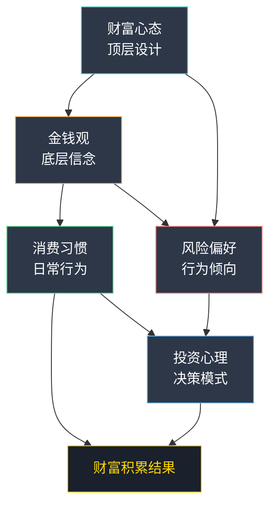
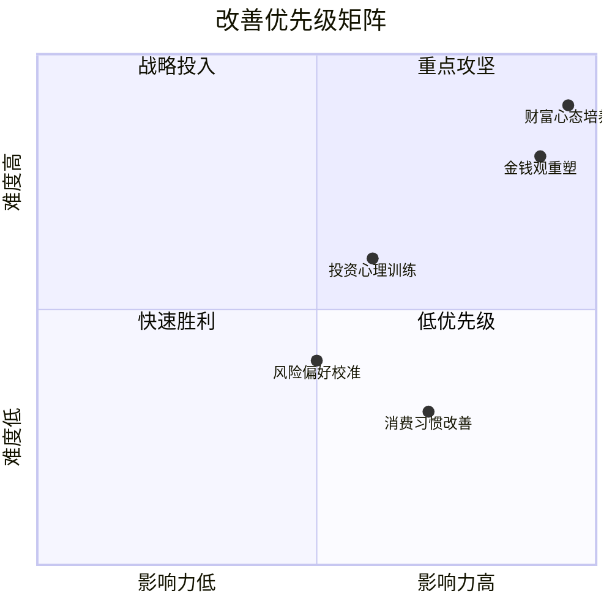

# 附录H：搞钱心理测试——五维财富心理诊断

## 前言：为什么搞钱需要先懂自己

行为金融学的大量研究证明：**投资者的收益差异中，心理因素的解释力超过技术因素**。诺贝尔经济学奖得主丹尼尔·卡尼曼（Daniel Kahneman）在《思考，快与慢》中指出，人类的决策系统分为直觉性的"系统1"和理性的"系统2"，而大多数财务决策失误源于系统1的自动化反应未经系统2的检验。

搞钱这件事，表面上看是技能问题——你会不会投资、懂不懂商业、能不能抓住机会。但底层驱动这些行为的，是你的心理结构：

- **金钱观**决定了你与金钱的关系模式
- **风险偏好**决定了你在不确定性面前的行为选择
- **投资心理**决定了你在市场波动中的决策质量
- **消费习惯**决定了你的财富积累效率
- **财富心态**决定了你能在这条路上走多远

这五个维度并非独立运作，而是相互影响、动态变化的整体。一个消费冲动的人，即使投资能力很强，财富积累也会被消费习惯拖累；一个风险偏好极高的人，如果投资心理不够成熟，高风险反而会成为毁灭性因素。



本附录包含5套经过设计的心理测试，覆盖上述五个维度。每套测试配有评分标准、心理机制解析和个性化改善方案。请诚实作答——**自我欺骗是搞钱路上最大的障碍**。

### 使用指南

| 步骤 | 操作 | 预计时间 |
|------|------|----------|
| 1 | 逐套完成5套测试，记录每题选项 | 30-40分钟 |
| 2 | 按评分标准计算各维度得分 | 10分钟 |
| 3 | 填写「五维诊断总表」 | 5分钟 |
| 4 | 阅读各维度的分析和建议 | 20分钟 |
| 5 | 阅读跨维度综合分析 | 10分钟 |
| 6 | 制定个人改善行动计划 | 15分钟 |

> **重要提示**：所有测试均基于自我报告，结果反映的是你的自我认知而非客观事实。如果你的自我认知与他人评价存在明显差异，说明存在盲区——这本身就是有价值的信息。

---

## 测试一：金钱观测试

### 理论背景

金钱观（Money Beliefs）是指个体对金钱的本质、功能和意义的核心信念体系。心理学家Brad Klontz提出的"金钱剧本"（Money Scripts）理论认为，人的金钱观在童年时期就已形成，主要通过观察父母的金钱行为和聆听家庭中关于金钱的对话而内化。常见的金钱剧本包括：金钱回避（money avoidance）、金钱崇拜（money worship）、金钱地位（money status）和金钱警觉（money vigilance）。

你的金钱观像一副有色眼镜，你透过它看到的"金钱世界"会与别人截然不同。更关键的是，你往往意识不到自己戴了这副眼镜。

### 测试题目

请根据你的**真实感受**（而非你认为"正确"的答案）选择最符合的选项。

**第1题：当你收到一笔意外之财（比如奖金或红包），你的第一反应是？**

A. 太好了，马上想想怎么花掉，犒劳一下自己
B. 存起来，这是我的安全储备
C. 研究一下怎么用这笔钱赚更多的钱
D. 感觉不安，担心这笔钱会带来麻烦

**第2题：你认为金钱的本质是什么？**

A. 金钱是享受生活的工具，该花就花
B. 金钱是安全感的来源，越多越安心
C. 金钱是实现目标的资源，需要高效配置
D. 金钱是万恶之源，但又不得不面对

**第3题：如果你的朋友向你借一大笔钱，你会？**

A. 看关系，关系好就借，不太考虑能不能还
B. 借一部分，但会在心里一直惦记这件事
C. 评估对方的还款能力和意愿，再决定借不借、借多少
D. 尽量不借，怕影响关系也怕收不回来

**第4题：你对"财务自由"的理解是？**

A. 想买什么就买什么，不用看价格
B. 有足够的存款，不用担心失业或生病
C. 被动收入超过生活支出，可以自由选择工作和生活方式
D. 不确定，感觉离自己很遥远

**第5题：你如何看待富人？**

A. 羡慕，他们能享受最好的生活
B. 有点嫉妒，但觉得他们可能也有烦恼
C. 学习，研究他们是怎么做到的
D. 复杂的感觉，觉得很多富人的钱来路不正

**第6题：你愿意为赚钱牺牲多少个人时间？**

A. 少量，生活质量比赚钱更重要
B. 中等，但不会牺牲健康和家庭
C. 较多，年轻时就应该拼一把
D. 不太愿意，赚钱不应该以牺牲生活为代价

**第7题：你如何看待借钱/贷款？**

A. 正常，现代人谁不借钱
B. 能不借就不借，背着债务很不舒服
C. 好的负债是杠杆，能帮我赚更多钱
D. 非常排斥，借钱是件很丢脸的事

**第8题：你在做消费决策时，最看重什么？**

A. 能不能让我开心
B. 是不是在预算范围内
C. 性价比和投资回报
D. 别人怎么看我买这个东西

**第9题：你对"谈钱"这件事的态度是？**

A. 正常，钱就是用来花的
B. 有点尴尬，不太想让别人知道自己的财务状况
C. 坦然，钱是重要的资源，应该认真讨论
D. 回避，觉得谈钱伤感情

**第10题：如果让你选择一种赚钱方式，你更倾向于？**

A. 做自己喜欢的事，顺便赚点钱
B. 找一份稳定的工作，慢慢积累
C. 抓住机会，快速积累财富
D. 随缘，不强求

### 评分标准

统计你选择A、B、C、D的数量，数量最多的选项代表你的主导金钱观类型。如果出现两个选项数量相同，说明你具有混合型金钱观。

**A选项最多——享乐型金钱观**

- 核心信念：钱是用来享受生活的，人生苦短，及时行乐
- 心理机制：倾向于即时满足，对未来收益的折现率很高（行为经济学称之为"双曲贴现"）。多巴胺驱动的消费决策占主导，购买行为本身带来的快感往往超过物品的使用价值
- 优势：懂得享受生活，不会过度压抑自己；消费能带来积极的情绪体验；在人际关系中通常比较大方，社交资源丰富
- 潜在陷阱：容易过度消费，难以积累财富；可能陷入"月光族"甚至负债困境；当收入增长时，消费往往同步增长（"生活方式通胀"），导致无论赚多少都存不下钱
- 财富指数：★★☆☆☆

**B选项最多——安全型金钱观**

- 核心信念：钱是安全感的来源，手中有粮心中不慌
- 心理机制：损失厌恶倾向显著——卡尼曼的研究表明，损失100元带来的痛苦约为获得100元快乐的2-2.5倍。安全型的人这个比例可能更高，因此极度回避任何形式的财务风险
- 优势：善于储蓄，有较强的风险意识；财务状况通常比较稳健；在经济下行期表现出色，不容易遭受重大损失
- 潜在陷阱：可能过于保守，错过投资和创业的机会；过度储蓄会降低生活质量，形成"有钱不敢花"的困境；长期来看，纯粹储蓄可能跑不赢通胀，实际购买力在下降
- 财富指数：★★★☆☆

**C选项最多——投资型金钱观**

- 核心信念：钱是需要管理的资源，让钱生钱才是正道
- 心理机制：延迟满足能力强，能够为长期收益放弃短期诱惑。倾向于系统性思考，将金钱视为可量化、可优化的变量
- 优势：善于让钱生钱，有清晰的财务目标；通常能实现较好的财富积累；对复利效应有直觉理解
- 潜在陷阱：可能过于理性，忽略了金钱的情感价值和社会功能；有时会因为追求收益而承担过高风险；容易把生活中的每件事都用"投入产出比"来衡量，导致关系和健康被忽视
- 财富指数：★★★★★

**D选项最多——回避型金钱观**

- 核心信念：金钱是复杂而危险的，最好少碰为妙
- 心理机制：对金钱存在焦虑甚至恐惧情绪，可能源于童年时期的负面经历（如家庭因钱争吵、经历过贫困）。回避行为是一种心理防御机制——不去想、不去管，就不用面对焦虑
- 优势：不容易被金钱冲昏头脑；可能在精神层面有更高的追求；不会为了钱做出违背原则的事
- 潜在陷阱：回避金钱问题会导致财务状况恶化——不记账、不理财、不谈薪，所有需要主动处理的财务问题都被拖延；可能因为不了解金钱规律而遭受损失（如被高利贷坑骗、不了解税收优惠）
- 财富指数：★☆☆☆☆

### 个性化改善方案

**给享乐型的行动方案**：

| 时间 | 行动 | 具体做法 |
|------|------|----------|
| 立即 | 建立自动储蓄 | 设置工资卡自动转账，发薪日当天自动转20%到独立储蓄账户 |
| 第1周 | 开始记账 | 使用随手记/钱迹等APP，记录每一笔支出，坚持30天 |
| 第2周 | 实施48小时规则 | 想买的东西先加购物车，等48小时后仍想买再下单 |
| 第1月 | 区分消费类型 | 将支出分为"体验型"和"物质型"，逐步提高体验型占比（研究表明体验型消费的幸福感更持久且不易后悔） |
| 持续 | 季度财务回顾 | 每季度检查一次储蓄率，目标是从0提升到20%以上 |

**给安全型的行动方案**：

1. **量化你的安全感需求**：计算出"安全垫"的具体数字（通常为6个月生活费），达到这个数字后开始投资
2. **从1%开始投资**：拿出储蓄的1%用于指数基金定投，体验"钱在工作"的感觉。3个月后如果心理上能接受，逐步提升到10%、20%
3. **设定"享受预算"**：每月拿出收入的5%专门用于"不理性但让自己开心"的消费，这笔钱必须花完——这是在训练你的大脑接受"花钱不是危险的"
4. **学习通胀知识**：了解近10年的平均通胀率（约2-3%），计算你的储蓄每年实际贬值了多少，用数据说服自己"不投资也是一种风险"

**给投资型的行动方案**：

1. **设定"生活预算"**：每月至少拿出收入的10%用于"没有回报"的消费——请朋友吃饭、给家人买礼物、体验新事物。这是在平衡你的理性倾向
2. **建立情绪检查机制**：每次做重大投资决策前，问自己三个问题：（1）如果这笔钱全部亏光，我的生活会受影响吗？（2）我是基于分析还是基于兴奋在做决定？（3）一年后回看，我会为这个决定骄傲吗？
3. **设定"不可投资"底线**：明确哪些钱不能用于投资——应急资金、保险费用、教育支出、家庭日常开支。把这些钱放在完全安全的地方，绝不动摇
4. **定期"非金钱日"**：每月选一天完全不想钱的事，专注于关系、健康、兴趣爱好

**给回避型的行动方案**：

1. **从5分钟开始**：每天只花5分钟看一眼自己的银行余额和信用卡账单。不需要做任何改变，只是"看见"。坚持21天，让大脑适应面对金钱信息
2. **找一个安全的起点**：找一个你信任的、不会评判你的人（朋友、伴侣、理财顾问），进行第一次"金钱对话"。告诉他/她你不是要借钱，只是想聊聊钱的事
3. **学习一个概念**：每周只学一个基础财务概念——第一个月学记账、预算、储蓄、利息；第二个月学复利、通胀、保险、信用。小步前进，不要给自己压力
4. **处理源头情绪**：如果面对金钱会引发强烈的焦虑或恐惧，考虑寻求专业心理咨询。金钱回避往往与更深层的心理创伤有关，单靠"学习知识"可能不够

---

## 测试二：风险偏好测试

### 理论背景

风险偏好（Risk Preference）是指个体在面对不确定性时的行为倾向。现代投资组合理论（Markowitz, 1952）将风险定义为收益的波动性，而行为经济学进一步发现，人们对风险的感知并非客观的——它受到框架效应、心理账户、损失厌恶等认知偏差的深刻影响。

一个关键发现是：**风险偏好不是固定的人格特质，而是随情境变化的状态变量**。同一个人在盈利状态下和亏损状态下的风险偏好可能截然不同（"私房钱效应"，House Money Effect）。因此，了解自己的"基准"风险偏好，以及哪些情境会改变它，对搞钱至关重要。

### 测试题目

**第1题：你有10万块钱，以下四个投资机会你会选哪个？**

A. 银行定期存款，年化收益3%，保本保息
B. 债券基金，预期年化收益5-8%，可能有小幅波动
C. 股票型基金，预期年化收益10-20%，可能有较大波动
D. 初创公司股权投资，可能翻10倍，也可能血本无归

**第2题：你投资的某只基金一个月内下跌了20%，你会？**

A. 立刻卖出，不能再亏了
B. 先观望，如果继续跌就卖
C. 不动，相信长期会涨回来
D. 加仓，觉得这是抄底的好机会

**第3题：你更认同以下哪句话？**

A. "保住本金是第一位的"
B. "稳稳的幸福比大起大落好"
C. "高风险高回报，年轻人应该敢于冒险"
D. "不入虎穴焉得虎子"

**第4题：你创业时，更倾向于哪种方式？**

A. 保留主业，用业余时间做副业
B. 辞职创业，但保留足够的安全垫
C. 全力以赴，必要时可以借钱创业
D. 借钱+融资，做大事业

**第5题：面对一个有70%成功率的投资机会，你的态度是？**

A. 30%的失败风险太高，不参与
B. 可以小金额参与试试
C. 值得投入较大资金
D. 会全力以赴，甚至借钱参与

**第6题：你如何看待"杠杆"（借钱投资/创业）？**

A. 绝对不用，风险太大
B. 非常谨慎地使用，确保能还得起
C. 合理使用杠杆是聪明的做法
D. 大胆使用杠杆，这是加速财富增长的利器

**第7题：你的投资组合中，能接受的最大亏损比例是多少？**

A. 不能接受任何亏损
B. 最多接受10%的亏损
C. 可以接受20-30%的亏损
D. 可以接受50%甚至更高的亏损

**第8题：你更喜欢哪种收入模式？**

A. 稳定的工资收入
B. 工资为主，少量投资收入
C. 工资和投资收入各占一半
D. 投资和创业收入为主

**第9题：你身边的人如何评价你的风险偏好？**

A. "你太保守了"
B. "你还挺稳健的"
C. "你胆子挺大的"
D. "你太冒险了"

**第10题：如果你只能选择一种投资方式持有30年，你会选？**

A. 国债
B. 沪深300指数基金
C. 个股组合
D. 加密货币

### 评分标准

A=1分，B=2分，C=3分，D=4分。统计你的总分。

**10-16分：保守型投资者**

- 风险承受能力：低
- 适合的投资工具：银行存款、国债、货币基金、保本理财产品、大额存单
- 核心特征：极度厌恶损失，宁可少赚也不能亏钱。在预期效用理论中，你的效用函数呈高度凹形——收益的边际效用递减极快
- 心理特点：在投资亏损时容易焦虑和恐慌，可能出现失眠、反复查看账户等行为。对"确定性"有强烈偏好，即使面对明显更优的期望值选项也会选择确定性收益
- 典型陷阱：在低利率环境下，保守型投资者最容易被"保本高收益"的骗局吸引——因为正常渠道无法满足他们对"安全+高收益"的双重需求

**17-23分：稳健型投资者**

- 风险承受能力：中低
- 适合的投资工具：债券基金、平衡型基金、银行理财产品、REITs
- 核心特征：追求稳定的收益，能接受小幅波动。理解"风险与收益成正比"的基本原理，但倾向于控制在可承受范围内
- 心理特点：能理性看待短期波动，但对超过预期的大幅亏损感到不安。会做基本的资产配置，但不会过于激进
- 典型陷阱：容易被"稳健型理财"的营销话术吸引，忽略了产品的真实风险等级

**24-32分：积极型投资者**

- 风险承受能力：中高
- 适合的投资工具：股票型基金、指数基金、优质个股、可转债
- 核心特征：追求较高的收益，能承受较大的波动。对投资有较深的理解，明白短期波动不等于永久亏损
- 心理特点：对投资有较深的理解，能在波动中保持相对冷静。但可能在连续盈利后变得过度自信，在连续亏损后变得过度悲观
- 典型陷阱：过度自信导致的集中持仓——觉得自己"看准了"，把太多资金押在少数标的上

**33-40分：激进型投资者**

- 风险承受能力：高
- 适合的投资工具：高波动性个股、期权期货、创业投资、加密货币、另类投资
- 核心特征：追求高收益，愿意承担高风险。对不确定性有较高的容忍度，甚至可能享受风险带来的刺激感
- 心理特点：对风险有较高的容忍度，但可能低估潜在损失的严重性。容易混淆"敢于冒险"和"善于冒险"——前者是勇气，后者是能力
- 典型陷阱：赌徒心理——把投资当成赌博，享受过程中的肾上腺素分泌。连续成功会强化冒险行为，直到遭遇一次毁灭性打击

### 风险偏好校准表

你的自评风险偏好可能与实际承受能力不匹配。完成以下校准：

| 校准项目 | 你的回答 | 参考标准 |
|----------|----------|----------|
| 过去1年你实际承受的最大单笔亏损金额 | ____元 | 超过月收入的3倍时你的实际反应是？ |
| 如果明天你的投资亏损30%，你能否正常吃饭睡觉？ | 能/不能 | 如果不能，说明实际承受力低于自评 |
| 你是否有投资经验超过3年？ | 是/否 | 经历过完整牛熊周期的投资者，风险偏好评估更准确 |
| 你的应急储蓄是否达到6个月生活费？ | 是/否 | 安全垫不足时，不应承担高风险 |
| 你的投资资金占总资产的比例？ | ____% | 超过50%时需要降低风险等级 |

**校准规则**：如果上述任何一个校准项触发"降级"信号，将你的风险等级下调一档。例如，自评为积极型但应急储蓄不足，应按稳健型配置资产。

### 个性化改善方案

**给保守型的建议**：

1. 你的风险偏好没有问题——知道自己要什么是最重要的。不要被"你太保守了"的评价动摇
2. 可以用"核心+卫星"策略：90%的资金做保守投资，10%尝试低风险投资产品（如沪深300指数基金定投）。用10%的部分"练手"，积累投资经验
3. 学习通货膨胀的知识：近10年中国平均CPI约2-3%，你的存款利率如果低于这个数字，实际上每天都在亏钱。这不是让你冒险，而是让你理解"不投资也有风险"
4. 考虑用定投的方式逐步进入基金市场——定投天然具有平滑波动的效果，降低择时风险，非常适合保守型投资者的心理需求

**给稳健型的建议**：

1. 你已经有了不错的风险意识，继续保持
2. 可以学习资产配置的基本原理——经典的60/40组合（60%股票+40%债券）在历史上长期跑赢纯债券投资，且波动可控
3. 考虑增加指数基金定投的比例。巴菲特的赌注证明：10年期来看，低成本指数基金跑赢了绝大多数主动管理基金
4. 设定长期的财务目标——有了目标才知道需要多少收益，进而反推需要多少风险敞口

**给积极型的建议**：

1. 你的风险偏好适合做长期投资，但要注意分散风险。单只股票占比不要超过总资产的10%
2. 设定明确的止损线，防止在极端行情中遭受重大损失。建议单笔投资止损线设在15-20%
3. 定期检视你的投资组合，确保实际风险水平与你的承受能力匹配。每年至少做一次风险评估
4. 警惕"过度自信"偏差：记录你的每笔投资决策和预测，3个月后回头看你的准确率。大多数人会发现自己的判断准确率远低于预期

**给激进型的建议**：

1. 你的高风险偏好可能是优势，但也可能是陷阱。关键区别在于：你是"有纪律的冒险"还是"无纪律的赌博"
2. 务必保留足够的安全垫——至少6个月的生活费放在货币基金中，绝不动用
3. 设定严格的止损纪律。你可能觉得自己能承受50%的亏损，但当它真正发生时，生理反应（失眠、焦虑、食欲下降）会告诉你真实答案
4. 考虑用"模拟投资"验证你的策略：先用模拟盘跑3-6个月，如果策略确实有效，再投入真金白银
5. 警惕"赌徒谬误"和"热手效应"：连续成功可能让你越来越冒进，连续失败可能让你想"翻本"。两种情况都需要暂停交易

---

## 测试三：投资心理测试

### 理论背景

行为金融学发现，投资者在决策过程中会系统性地偏离理性假设。这些偏差不是个别人的"错误"，而是人类认知系统的固有特征——它们在进化上是有意义的（快速决策有助于生存），但在现代金融市场中却会导致系统性的决策失误。

丹尼尔·卡尼曼和阿莫斯·特沃斯基提出的"前景理论"（Prospect Theory）是理解投资心理的核心框架。其三个关键发现是：

1. **损失厌恶**：损失的心理权重约为等额收益的2-2.5倍
2. **参考点依赖**：人们对结果的评估取决于参考点（通常是买入价），而非绝对水平
3. **概率权重**：人们会高估小概率事件、低估大概率事件

这套测试帮你识别你在投资中最容易犯的心理错误。

### 测试题目

**第1题：你买入的一只股票连续涨了三天，你会？**

A. 赶紧卖掉，落袋为安
B. 卖掉一部分，保留一部分
C. 持有不动，等更大的涨幅
D. 加仓买入，趋势这么好

**第2题：你看好一只股票但一直没买，它涨了30%后，你会？**

A. 不买了，已经错过了最佳买点
B. 等它回调再买
C. 买入，觉得还会继续涨
D. 追涨买入，怕它继续涨

**第3题：你投资亏了2万块钱，现在有一个机会可以"翻本"，你会？**

A. 不参与，止损最重要
B. 用小部分资金参与
C. 参与，想把亏损补回来
D. 大额参与，必须翻本

**第4题：你做投资决策时，主要依据是什么？**

A. 自己的研究和分析
B. 专业机构的研报和建议
C. 朋友或KOL的推荐
D. 直觉和感觉

**第5题：你持有一只股票已经半年了，一直横盘不动，而其他股票都在涨，你会？**

A. 卖掉换股，不能浪费时间成本
B. 再等等看，给自己设定一个期限
C. 继续持有，相信自己的判断
D. 加仓，觉得它迟早会涨

**第6题：市场大跌时，你的第一反应是？**

A. 恐慌，想尽快卖出止损
B. 紧张，密切关注市场动态
C. 平静，觉得这是正常的市场波动
D. 兴奋，觉得是抄底的好机会

**第7题：你投资的逻辑更接近以下哪种？**

A. 别人都在买，应该不会错
B. 这个公司我了解，产品很好
C. 技术指标显示买入信号
D. 我相信这个行业的长期趋势

**第8题：你如何处理投资中的"后悔"情绪？**

A. 经常后悔，反复想"如果当初..."
B. 偶尔后悔，但能很快调整
C. 很少后悔，每次决策都是当时最好的选择
D. 从不后悔，过去的就过去了

**第9题：你对"止损"的态度是？**

A. 完全认同，止损是投资纪律
B. 认同，但执行起来很困难
C. 不太认同，觉得止损会导致卖在最低点
D. 坚决不止损，亏了就放着

**第10题：你投资时更容易犯以下哪个错误？**

A. 过早卖出盈利的股票
B. 不愿意卖出亏损的股票
C. 频繁交易
D. 把所有资金集中在一只股票上

### 评分标准与心理偏差诊断

根据以下对照表，统计你在各心理偏差中出现的次数：

| 题号 | A（偏差） | B | C（偏差） | D（偏差） |
|------|-----------|---|-----------|-----------|
| 1 | 处置效应 | 理性 | 过度自信 | 追涨心理 |
| 2 | 锚定效应 | 理性 | 过度自信 | FOMO |
| 3 | 理性 | 适度 | 赌徒谬误 | 报复性交易 |
| 4 | 独立思考 | 理性依赖 | 从众心理 | 直觉依赖 |
| 5 | 机会成本焦虑 | 理性 | 坚持偏差 | 沉没成本 |
| 6 | 损失厌恶 | 正常 | 情绪稳定 | 逆向思维 |
| 7 | 从众心理 | 基本面 | 技术分析 | 趋势投资 |
| 8 | 后悔厌恶 | 正常 | 理性 | 过度自信 |
| 9 | 理性 | 知行不合一 | 处置效应 | 鸵鸟心态 |
| 10 | 处置效应 | 处置效应 | 过度交易 | 集中风险 |

### 心理偏差详解与应对

**处置效应（出现2次以上）**：倾向于过早卖出盈利的股票，却死守亏损的股票。

- 严重程度：★★★★☆
- 行为表现：盈利时想"落袋为安"，亏损时想"等回本再卖"。本质上是损失厌恶的直接体现——卖出亏损股票意味着"确认损失"，这比账面浮亏更痛苦
- 科学解释：Odean（1998）的研究发现，个人投资者卖出盈利股票的概率比卖出亏损股票高约50%。这导致投资组合中"赢家被过早卖出，输家被长期持有"，系统性地拖累收益
- 改善方法：（1）设定机械化的买卖规则——"盈利50%卖出一半，亏损15%强制止损"；（2）用"买入价归零"的思想实验：如果你今天空仓，你还会买入这只股票吗？如果不会，就应该卖出

**从众心理（出现2次以上）**：倾向于跟随大众做投资决策。

- 严重程度：★★★☆☆
- 行为表现：看到别人赚钱就跟进，看到"热门"就买入，社交媒体上的投资观点对你影响很大
- 科学解释：Asch的从众实验证明，即使答案明显错误，约75%的人至少会从众一次。在投资领域，信息级联（information cascade）效应会放大这种倾向——"如果这么多人在买，他们一定知道什么我不知道的"
- 改善方法：（1）建立独立的投资分析框架，每次投资前写下你的独立判断，然后才看别人的观点；（2）警惕"所有人都在赚钱"的时刻——当出租车司机都在谈股票时，往往离崩盘不远

**过度自信（出现2次以上）**：高估自己的判断能力。

- 严重程度：★★★★☆
- 行为表现：觉得自己比市场更聪明，频繁交易，集中持仓，预测准确率的自我评估远高于实际
- 科学解释：过度自信是被研究最多的投资心理偏差。Barber和Odean（2001）的研究发现，交易最频繁的投资者年化收益比最不活跃的投资者低约7%——频繁交易的收益被交易成本吃掉了
- 改善方法：（1）建立投资日记，记录每笔投资的逻辑和预测，定期回顾准确率；（2）把你的投资决策告诉一个理性的朋友，让他/她挑毛病；（3）记住巴菲特的话："风险来自于你不知道自己在做什么"

**损失厌恶（第6题选A）**：对亏损的感受远大于盈利的快乐。

- 严重程度：★★★★★
- 行为表现：市场下跌时极度焦虑，可能会恐慌性卖出。对"亏钱"的恐惧远超对"赚钱"的期待
- 科学解释：这是前景理论的核心发现，也是大多数投资心理偏差的底层原因。进化心理学的解释是：在资源稀缺的原始环境中，失去食物可能意味着死亡，而获得额外食物只是锦上添花
- 改善方法：（1）接受"投资必然有亏损"的事实——即使是巴菲特也有亏损的投资；（2）设定止损线并严格执行，把"可能的亏损"变成"确定的、可控的小亏损"；（3）减少看盘频率——每天看一次波动带来的痛苦是每月看一次的数倍

**锚定效应（第2题选A）**：过度依赖某个参考价格做决策。

- 严重程度：★★★☆☆
- 行为表现：以买入价作为判断股票"贵"或"便宜"的唯一标准。"已经涨了30%所以太贵了"或"已经跌回我的买入价了所以不亏了"
- 科学解释：Tversky和Kahneman的经典实验中，即使参考数字是随机的（转轮盘得到的数字），也会显著影响人们对后续问题的估计。在投资中，买入价就是那个"随机"的锚
- 改善方法：（1）关注公司的基本面和未来价值，而非过去的价格；（2）问自己："如果我今天第一次看到这家公司，我愿意以当前价格买入吗？"

**FOMO心理（第2题选D）**：害怕错过机会而做出冲动决策。

- 严重程度：★★★★☆
- 行为表现：看到别人赚钱就焦虑，害怕错过"最后的上车机会"，在FOMO驱动下追涨买入
- 科学解释：FOMO（Fear of Missing Out）与损失厌恶密切相关——"错过收益"在心理上被编码为"损失"。社交媒体放大了这种效应，因为你每天都能看到别人的投资收益截图
- 改善方法：（1）记住"机会永远都有"——错过了这只股票还有下一只，错过了这个牛市还有下一个周期；（2）关闭投资类社交媒体，减少信息干扰；（3）制定投资计划并严格执行，用规则替代情绪

**报复性交易（第3题选D）**：亏损后急于"翻本"，加大赌注。

- 严重程度：★★★★★
- 行为表现：亏损后情绪失控，想通过更大的交易把亏损补回来。这是赌徒的典型行为模式
- 科学解释：前景理论的另一个发现在"亏损区域"人会变成风险偏好者——正常情况下你可能是风险厌恶的，但一旦处于亏损状态，你会变得更愿意冒险，期望"一把翻盘"
- 改善方法：（1）亏损后强制暂停交易至少24小时，让情绪冷却；（2）设定单日/单周最大亏损限额，达到后强制停止交易；（3）把每次亏损视为"学费"，重点分析亏损原因而非急于翻本

**鸵鸟心态（第9题选D）**：亏损后不看账户，拒绝面对现实。

- 严重程度：★★★★☆
- 行为表现：投资亏损后删除行情软件、不看账户报告、拒绝止损。觉得"不看就不亏了"
- 科学解释：这是一种信息回避行为——当信息可能引发负面情绪时，人们倾向于主动回避。但回避不能解决问题，只会让问题恶化
- 改善方法：（1）设定固定时间查看投资账户（如每周日晚上），养成习惯后焦虑会减少；（2）设定止损线，用规则替代情绪决策；（3）记住：账面亏损和实际亏损是同一件事，只是你选择面对的时间不同

### 综合改善方案

无论你的主要偏差是什么，以下五项措施都适用：

1. **建立投资日记**：记录每笔投资的买入理由、预期、情绪状态和实际结果。每月回顾一次，你会惊讶地发现自己的决策模式如此清晰。模板：

```text
日期：____
标的：____
买入/卖出理由：____
当时的情绪状态：____（冷静/兴奋/焦虑/恐惧）
预期：____
实际结果：____
回顾时的感想：____
```

2. **设定机械化的交易规则**：在冷静的时候制定规则，在冲动的时候执行规则。例如：
   - 亏损超过15%，强制止损
   - 盈利超过50%，卖出一半
   - 单只股票占比不超过总资产的15%
   - 每月交易不超过3次

3. **减少看盘频率**：频繁查看账户会放大情绪波动。对于长期投资，每周看一次就够了。可以卸载手机上的行情APP，只在电脑上查看

4. **做反向思考**：当你想买入时，先列出三个不该买的理由；当你想卖出时，先列出三个不该卖的理由。这能激活你的"系统2"理性思维

5. **保持投资组合的多样性**：分散投资不仅降低风险，也降低情绪波动——当你的投资组合足够分散时，单一标的的涨跌不会对你造成太大的心理冲击

---

## 测试四：消费习惯测试

### 理论背景

消费行为是财富积累方程中最容易被忽视的变量。大多数人关注"赚更多"，却忽略了"花更少"和"花更聪明"同样重要。行为经济学家理查德·塞勒（Richard Thaler）提出的"心理账户"理论（Mental Accounting）揭示了一个关键现象：人们对不同来源和不同用途的钱赋予不同的心理价值，导致消费决策偏离理性。

例如，同样是1000元，"工资收入"和"年终奖"在心理上是不同的——后者更容易被挥霍。理解这些心理机制，是优化消费习惯的前提。

### 测试题目

**第1题：你多久记一次账？**

A. 从来不记
B. 偶尔记一下
C. 大部分时间都记
D. 每笔消费都记

**第2题：你在购物前会列清单吗？**

A. 从来不列
B. 偶尔列一下
C. 大部分时候会列
D. 每次都列

**第3题：你在网上看到一个"限时折扣"的商品，你会？**

A. 马上买，错过就没了
B. 先加入购物车，看看明天还想不想买
C. 评估一下是不是真的需要，再决定
D. 直接忽略，大部分限时折扣都是营销套路

**第4题：你每个月的消费中，"非必要消费"占比大约是多少？**

A. 50%以上
B. 30-50%
C. 10-30%
D. 10%以下

**第5题：你使用信用卡/花呗的情况是？**

A. 经常分期或最低还款
B. 偶尔分期
C. 每月全额还清
D. 尽量不用

**第6题：你购买一件较贵的商品前，会花多长时间考虑？**

A. 看到就买，不想等
B. 考虑一两天
C. 考虑一周以上
D. 考虑一个月以上，甚至做详细的对比分析

**第7题：你如何看待"品牌溢价"？**

A. 品牌代表品质，多花点钱值得
B. 看情况，有些品牌确实好
C. 大部分品牌溢价不值得，性价比更重要
D. 坚决不为品牌买单

**第8题：你的衣柜里有多少东西是买了之后很少穿/用的？**

A. 超过一半
B. 大约三分之一
C. 不到四分之一
D. 几乎没有

**第9题：你和朋友聚餐时，买单的习惯是？**

A. 经常抢着买单
B. 大家轮流，差不多AA
C. 严格AA
D. 能不参加就不参加

**第10题：你对"省钱"这件事的态度是？**

A. 省钱降低生活质量，不值得
B. 该省的省，该花的花
C. 省钱是一种美德和能力
D. 非常热衷于找优惠券、比价、薅羊毛

**第11题：你的情绪和消费有关系吗？**

A. 心情不好就想买东西
B. 偶尔会情绪化消费
C. 基本不会
D. 情绪越差越舍不得花钱

**第12题：你购买大件商品（如手机、电脑）的策略是？**

A. 买最新最贵的
B. 买中高端的
C. 买性价比最高的
D. 买能满足需求的最便宜的

### 评分标准

A=4分，B=3分，C=2分，D=1分。统计你的总分。

**12-18分：节俭型消费者**

- 核心特征：消费非常克制，善于节省，对支出有严格的控制
- 优势：财富积累速度快，不容易陷入消费陷阱。储蓄率通常远高于平均水平
- 潜在问题：可能过度节省影响生活品质（如吃不健康的食物、不体检、不社交）；可能因为舍不得花钱而错过提升自己的机会（如不投资学习、不参加社交活动）；极端节俭可能损害人际关系
- 消费心理特点：对"失去金钱"的痛苦特别敏感，花钱时的心理摩擦力很大
- 储蓄潜力：★★★★★

**19-26分：理性型消费者**

- 核心特征：消费有计划，懂得平衡，在"享受当下"和"积累未来"之间找到平衡点
- 优势：既能享受生活，又能保持良好的储蓄习惯。消费决策基于需求和价值判断，不容易被营销手段影响
- 潜在问题：偶尔会有冲动消费的情况，但通常能控制在合理范围内。可能在"大额消费"上缺乏系统的决策框架
- 消费心理特点：消费决策相对理性，但也会受情绪和环境的短期影响
- 储蓄潜力：★★★★☆

**27-34分：感性型消费者**

- 核心特征：消费容易受情绪、环境和社交压力影响。"想要"的冲动经常压过"需要"的理性
- 优势：懂得享受生活，对自己比较大方。消费能带来即时的满足感和社交价值
- 潜在问题：容易冲动消费和情绪化消费，储蓄可能不足。"限时折扣""最后一件"等营销话术对你特别有效。消费后容易产生后悔情绪
- 消费心理特点：消费决策更多由情感驱动，理性分析能力在消费场景中"掉线"
- 储蓄潜力：★★★☆☆

**35-48分：冲动型消费者**

- 核心特征：消费缺乏计划，容易被营销手段、情绪波动和社交压力影响。购买行为往往先于需求判断
- 优势：生活品质较高，对自己很大方。在社交场合中通常比较慷慨
- 潜在问题：消费远超收入，可能陷入债务困境。信用卡分期、花呗等"先享后付"工具对你的伤害最大。长期来看，消费习惯是搞钱路上最大的绊脚石
- 消费心理特点：消费带来的快感是短暂的，消费后的空虚和后悔是持续的。形成"消费-后悔-情绪低落-再次消费"的恶性循环
- 储蓄潜力：★☆☆☆☆

### 个性化改善方案

**给节俭型的行动方案**：

1. 你的储蓄能力很强，但记得金钱是用来改善生活的，而不是用来囤积的
2. 每月设定一个"必须花完"的享受预算——这笔钱必须花在让自己开心的事情上（建议为月收入的5-10%）。到月底没花完也要花掉
3. 投资自己是回报率最高的消费：教育、健康检查、社交活动、提升形象的衣物。这些"消费"的长期回报率远超任何投资产品
4. 区分"节俭"和"吝啬"：节俭是不浪费，吝啬是该花的也不花。问问自己：你有没有因为省钱而错过了真正重要的东西？
5. 建立"价值消费"框架：不是问"能不能不花"，而是问"这笔钱花出去能带来什么价值"

**给理性型的行动方案**：

1. 你已经有了不错的消费习惯，继续保持
2. 进一步优化消费结构：减少"中间地带"的消费——那些既不太贵也不太便宜、既不太需要也不太想要的东西。把这些钱省下来，投入到真正有价值的地方
3. 建立自动化的储蓄和投资机制：发薪日自动转出储蓄和投资金额，剩下的才是可消费金额。这样你的消费决策在"可消费金额"内就是自由的
4. 定期回顾消费记录：每季度分析一次消费结构，找出"花得不值"的部分，持续优化
5. 学习"体验型消费"的研究：在同等金额下，体验型消费（旅行、学习、社交）带来的幸福感通常高于物质型消费（物品、装饰）

**给感性型的行动方案**：

1. 建立"消费冷静期"：想买的东西先等24-48小时。研究证明，大多数冲动消费的欲望在24小时后会大幅减弱
2. 卸载不必要的购物APP，关闭购物平台的推送通知。减少消费诱惑的"暴露频率"是降低冲动消费最有效的方法
3. 找到情绪化消费的替代品：当你心情不好想买东西时，改为去运动、阅读、和朋友聊天、散步。这些活动同样能提升情绪，但不会伤害你的钱包
4. 建立预算制度：给每个消费类别设定月度上限。当某个类别的预算用完时，该类别本月不再消费
5. 使用"等待清单"：想买的东西记在一个清单上，一周后回看。你会惊讶地发现，很多东西你已经不想要了

**给冲动型的行动方案**：

1. 你的消费习惯是搞钱的最大障碍，必须正视和改变。这不是建议，而是警告
2. 从记账开始——了解你的钱都去了哪里。很多人第一次记账后会震惊地发现，自己每月有30-50%的消费是"不知道花在哪了"
3. 建立严格的预算制度：每月收入到账后，按以下顺序分配——（1）储蓄/投资30%（2）固定支出（房租/房贷、水电、交通、通讯）（3）生活必需品（4）可自由支配金额。用完就停
4. 删除信用卡和花呗，改用现金或借记卡。普林斯顿大学的研究表明，使用现金消费比刷卡平均少花12-18%，因为"掏钱"的动作会激活大脑的"疼痛"区域，起到天然的消费刹车作用
5. 找一个"消费监督人"：让你信任的人监督你的大额消费决策（如超过月收入10%的消费）。购买前必须向他/她解释"为什么需要买这个"
6. 设置"无消费日"：每周选一天完全不花钱，带饭上班、不网购、不出去吃饭。从一天开始，逐步扩展

### 消费优化检查清单

在每次消费前，快速过一遍这个清单：

```text
□ 这是"需要"还是"想要"？
□ 如果没有折扣，我还会买吗？
□ 我有没有类似的东西？
□ 一个月后我还会记得这次购买吗？
□ 如果把这笔钱用于投资，10年后值多少？
□ 这笔消费能带来持久的价值还是一时的快感？
□ 我是因为情绪（开心/难过/焦虑/无聊）在买吗？
```

如果超过3个问题的答案指向"不应该买"，那就不要买。

---

## 测试五：财富心态测试

### 理论背景

斯坦福大学心理学家卡罗尔·德韦克（Carol Dweck）提出的"成长型思维"与"固定型思维"理论，在财富领域同样适用。具有成长型财富思维的人相信能力可以通过学习提升、机会可以通过努力创造；而具有固定型财富思维的人认为财富是天生注定的——出身、运气、天赋决定了一个人能赚多少钱。

财富心态不是"乐观"或"悲观"这么简单。它是一个包含自我效能感、归因方式、时间偏好、价值信念等多个子维度的复合结构。

### 测试题目

**第1题：你认为自己能成为有钱人吗？**

A. 不可能，我这辈子就这样了
B. 有可能，但很难
C. 只要努力，完全可以
D. 我一定会成为有钱人

**第2题：你如何看待"赚钱"这件事？**

A. 赚钱很辛苦，是不得已而为之
B. 赚钱是生活的必需，但不是最重要的
C. 赚钱是一种能力，需要不断学习和提升
D. 赚钱是一种乐趣，我享受这个过程

**第3题：当别人比你赚得多时，你的心态是？**

A. 嫉妒和不满
B. 有点酸，但能接受
C. 向他们学习
D. 为他们高兴，同时激励自己

**第4题：你对"运气"在搞钱中的作用怎么看？**

A. 运气决定一切，努力没什么用
B. 运气很重要，但努力也重要
C. 运气是给有准备的人的
D. 我不相信运气，我只相信自己的努力和策略

**第5题：你愿意为搞钱投入多少学习时间？**

A. 不想学，赚钱靠运气和关系
B. 偶尔看看相关文章
C. 每周花几个小时系统学习
D. 每天都在学习和研究

**第6题：面对搞钱过程中的挫折和失败，你会？**

A. 放弃，觉得不适合自己
B. 沮丧很长时间
C. 分析原因，调整策略
D. 把失败当作宝贵的经验，越挫越勇

**第7题：你对"长期主义"怎么看？**

A. 太遥远了，我只想关注眼前
B. 认同，但执行起来很难
C. 坚持长期主义，但也会关注短期收益
D. 深信不疑，所有的成功都需要时间积累

**第8题：你认为赚钱最重要的是什么？**

A. 家庭背景和人脉
B. 学历和技能
C. 思维方式和行动力
D. 持续学习和适应变化的能力

**第9题：你对"价值创造"的理解是？**

A. 不太理解，赚钱就是赚钱
B. 大概知道，赚钱要为别人提供价值
C. 深入理解，所有可持续的财富都来自于价值创造
D. 不仅理解，而且在实践中不断验证

**第10题：你如何看待金钱与幸福的关系？**

A. 有钱不一定幸福，没钱一定不幸福
B. 金钱能解决大部分烦恼
C. 金钱是幸福的必要条件，但不是充分条件
D. 金钱是工具，幸福是目标，两者需要平衡

**第11题：你是否有明确的财务目标？**

A. 没有，走一步看一步
B. 有一些模糊的想法
C. 有明确的短期和中期目标
D. 有详细的短中长期财务规划

**第12题：你对"延迟满足"的态度是？**

A. 人生苦短，及时行乐
B. 能做到一些延迟满足
C. 经常有意识地练习延迟满足
D. 延迟满足是我的核心习惯

**第13题：你是否有"富人思维"？以下哪句话最像你会说的？**

A. "这个我买不起"
B. "我怎么才能买得起？"
C. "这个投资的回报率是多少？"
D. "这件事能创造什么价值？"

**第14题：你对金钱的信念更接近以下哪个？**

A. 金钱是有限的，你多了我就少了
B. 金钱需要努力才能获得
C. 金钱是价值交换的媒介
D. 金钱是无限的，关键是创造价值

**第15题：你对未来的财务状况有信心吗？**

A. 没信心，觉得越来越难
B. 有一些信心，但不太确定
C. 比较有信心，我有计划和能力
D. 非常有信心，我知道该怎么做

### 评分标准

A=1分，B=2分，C=3分，D=4分。统计你的总分。

**15-25分：匮乏心态**

- 核心特征：对金钱和财富持有消极、被动的态度。潜意识里认为财富是有限的、自己不配拥有、赚钱是痛苦的
- 思维模式：固定型思维——觉得能力是天生的，无法改变；外控型归因——把结果归因于运气、环境、他人，而非自己的行动
- 行现表现：不敢谈薪、不敢投资、不敢创业。面对机会时，第一反应是"我不行"而不是"我试试"
- 影响：这种心态会限制你的行动和选择，让你错过很多机会。更严重的是，它会形成"自我实现的预言"——因为你觉得自己不会成功，所以不努力，所以真的不成功
- 需要重点突破的领域：金钱信念体系、自我效能感、归因方式

**26-35分：成长心态**

- 核心特征：对财富有积极的态度，但还在学习和成长中。相信能力可以提升，但信心还不够稳固
- 思维模式：成长型思维的初级阶段——知道应该学习和努力，但执行力和持续性不足
- 行为表现：愿意学习搞钱知识，能接受挑战，但遇到重大挫折时容易退缩。有时会在"学习"和"行动"之间反复摇摆——学了很多但不行动，或行动了但不学习
- 影响：正在正确的道路上，需要更多的实践和信心积累。关键是从"学习者"转变为"实践者"
- 需要重点突破的领域：执行力、持续性、从知识到行动的转化

**36-45分：富足心态**

- 核心特征：对金钱和财富有成熟、理性的认知。相信自己能创造财富，善于学习和调整，有长期思维
- 思维模式：成长型思维的成熟阶段——既有信念又有能力，既看长期也兼顾短期
- 行为表现：有明确的财务目标和行动计划，能理性面对成功和失败，善于从经验中学习。在搞钱的同时也关注价值创造
- 影响：具备了搞钱的心理基础，能有效抓住机会。需要的是规模化和系统化
- 需要重点突破的领域：规模化思维、影响力扩展、从个人能力到系统能力的跃迁

**46-60分：卓越心态**

- 核心特征：对财富有深刻的理解和坚定的信念。不仅关注赚钱，更关注价值创造；不仅自己搞钱，还能带动和帮助别人
- 思维模式：系统型思维——能看到个人、组织、社会之间的关联，理解财富创造的底层逻辑
- 行为表现：有长期的愿景和使命，能承受短期的困难和不确定性。善于整合资源、建立系统、创造影响力
- 影响：具备了成为财富创造者的所有心理素质。需要关注的是保持初心和平衡发展
- 需要重点关注的领域：保持初心、平衡发展、回馈社会

### 个性化改善方案

**给匮乏心态的行动方案**：

1. **重塑金钱信念**（最关键的第一步）：拿出一张纸，写下你对金钱的所有信念。然后逐一审视——这个信念是事实还是观点？它从哪里来（父母？社会？个人经历）？它对我有什么影响？有没有反例？用更准确、更有建设性的信念替代那些限制你的信念
2. **从小目标开始建立信心**：不要一上来就想着"财务自由"。先设定一个月存1000块钱的小目标。完成后，再设一个月存2000的目标。小成功会带来信心，信心会带来更大的行动，更大的行动会带来更大的成功——这是正向螺旋
3. **改变信息环境**：远离那些整天抱怨"社会不公""赚钱太难"的人和内容。多接触有正能量、有搞钱思维的人。你接受的信息塑造了你的思维，你的思维决定了你的行动
4. **学习基础财务知识**：恐惧往往来自于无知。从记账、预算、储蓄这些最基础的知识开始学习。当你了解了搞钱的基本原理和方法，恐惧就会减少，取而代之的是"我可以做到"的信心
5. **寻求专业帮助**：如果匮乏心态严重影响了你的生活——比如不敢找工作、不敢谈薪、不敢社交——考虑寻求心理咨询师的帮助。深层的金钱创伤需要专业的干预

**给成长心态的行动方案**：

1. **从学习者转变为实践者**：你可能已经学了很多搞钱知识，现在需要的是行动。设定一个"30天挑战"——在30天内完成一个具体的搞钱行动（如开通基金账户并开始定投、启动一个副业项目、完成一次成功的谈薪）
2. **建立系统**：把零散的学习和实践系统化——建立你的搞钱知识体系、投资体系和行动体系。可以用Notion或飞书建立一个"个人财务管理系统"
3. **找到导师或同伴**：找一个你信任的、有经验的人指导你。一个好的导师可以帮你在一年内走完别人三年的弯路。如果没有导师，至少找到志同道合的同伴
4. **记录成长轨迹**：建立"搞钱日志"，记录你的学习、实践、成功和失败。每个月回顾一次，你会发现自己进步了多少。这种"可见的进步"是维持动力的最佳燃料
5. **保持耐心**：成长需要时间，不要因为短期内看不到大的成果就放弃。复利效应不仅适用于投资，也适用于能力成长——前期的进步很慢，但积累到临界点后会加速

**给富足心态的行动方案**：

1. **从个人到系统**：你已经有了很好的个人能力，现在需要思考如何建立系统——让钱自动为你工作（投资系统）、让别人帮你工作（团队/外包）、让流程替代你的决策（自动化）
2. **扩大影响圈**：从"自己搞钱"到"帮助别人搞钱"。教学相长，帮助别人的过程也是提升自己的过程。可以开始写作、分享、做社群
3. **关注价值创造**：把注意力从"怎么赚钱"转移到"怎么创造价值"。当你专注于解决真实问题、满足真实需求时，钱是价值创造的自然结果
4. **保持谦逊和学习**：成功容易让人自满，自满是衰退的开始。保持每天学习的习惯，定期接触新的领域和观点，避免认知固化

**给卓越心态的行动方案**：

1. **回馈社会**：当你拥有了足够的财富和能力，考虑如何回馈社会。这不是道德绑架，而是财富的最高境界——创造的价值超越个人利益
2. **传承智慧**：把你的搞钱经验和智慧传递给更多的人。可以通过写作、教学、 mentoring 等方式
3. **保持初心**：不要让金钱成为你的主人。定期问自己：我搞钱的初心是什么？我现在的生活与初心一致吗？
4. **关注全面发展**：再多的金钱也买不回健康和真挚的关系。在追求财富的同时，不要忽视身体、心理、关系和精神层面的发展

---

## 五维综合诊断

完成全部五套测试后，将各维度结果填入下表：

### 五维诊断总表

| 维度 | 你的类型 | 得分 | 核心优势 | 核心短板 | 改善优先级 |
|------|----------|------|----------|----------|------------|
| 金钱观 | ____型 | 主导选项：____ | | | 高/中/低 |
| 风险偏好 | ____型 | ____分 | | | 高/中/低 |
| 投资心理 | ____偏差 | 主要偏差：____ | | | 高/中/低 |
| 消费习惯 | ____型 | ____分 | | | 高/中/低 |
| 财富心态 | ____型 | ____分 | | | 高/中/低 |

### 跨维度关联分析

五个维度之间存在显著的关联效应，了解这些关联能帮你更精准地定位问题：

**关联1：金钱观 → 消费习惯**

你的金钱观直接塑造了你的消费行为。享乐型金钱观的人几乎必然是感性或冲动型消费者；安全型金钱观的人通常是节俭型消费者。如果你想改变消费习惯，需要先审视底层的金钱观——否则只是治标不治本。

**关联2：风险偏好 × 投资心理 = 实际投资行为**

风险偏好是你的"基准设定"，投资心理是"实时修正"。一个积极型投资者如果同时有严重的处置效应和过度自信偏差，实际表现可能不如一个稳健型但投资心理成熟的投资者。这就是为什么很多高风险偏好的人反而亏钱——不是因为他们"敢于冒险"，而是因为心理偏差让他们在冒险时做出了错误决策。

**关联3：财富心态 → 所有其他维度**

财富心态是顶层设计。一个拥有匮乏心态的人，即使在其他四个维度上得分不错，也很难持续行动——因为底层信念会不断把他拉回舒适区。反之，一个拥有富足心态的人，即使其他维度暂时薄弱，也会主动学习和改善。

**关联4：消费习惯 × 风险偏好 = 财富积累速度**

消费习惯决定了你能留下多少钱，风险偏好决定了这些钱能增长多快。节俭型消费者+积极型投资者 = 最佳财富积累组合；冲动型消费者+保守型投资者 = 最差组合（赚得少花得多，存款还跑不赢通胀）。

**关联5：投资心理 ↔ 消费心理**

投资中的心理偏差和消费中的心理偏差有共同的底层机制。一个在投资中存在FOMO的人，在消费中也容易被"限量""限时"营销影响。一个在投资中有处置效应的人，在消费中也可能"舍不得扔掉不需要的东西"（沉没成本谬误）。改善一个领域的心理习惯，往往会正向影响另一个领域。

### 综合改善优先级矩阵

根据你的五维诊断结果，参考以下优先级矩阵制定改善计划：



**建议的改善顺序**：

1. **第一步：消费习惯**（影响力高、难度低）——建立记账和预算制度，这是最容易见效的改变
2. **第二步：风险偏好校准**（影响力中、难度低）——了解自己真实的承受能力，避免不匹配
3. **第三步：投资心理训练**（影响力中、难度中）——建立投资日记和交易规则，逐步克服心理偏差
4. **第四步：金钱观重塑**（影响力高、难度高）——识别和改变限制性的金钱信念
5. **第五步：财富心态培养**（影响力最高、难度最高）——这是一个长期的、持续的过程

---

## 行动计划模板

完成诊断后，用以下模板制定你的90天改善计划：

```text
=== 我的90天财富心理改善计划 ===

【当前状态】
金钱观：____型 → 目标：____型
风险偏好：____型 → 目标：____型（或保持）
主要投资心理偏差：____ → 目标：____
消费习惯：____型 → 目标：____型
财富心态：____型 → 目标：____型

【第1-30天：基础建设】
重点：消费习惯改善
具体行动：
1. ____
2. ____
3. ____
里程碑：____

【第31-60天：能力提升】
重点：投资心理训练 + 风险偏好校准
具体行动：
1. ____
2. ____
3. ____
里程碑：____

【第61-90天：心态升级】
重点：金钱观重塑 + 财富心态培养
具体行动：
1. ____
2. ____
3. ____
里程碑：____

【每日必做】
1. ____
2. ____

【每周必做】
1. ____
2. ____

【每月必做】
1. ____
2. ____
```

---

## 后记

这五套测试覆盖了搞钱心理的五个核心维度。它们之间的关系不是简单的线性叠加，而是相互影响、动态变化的系统。改变任何一个维度，都会对其他维度产生连锁反应。

**三个关键提醒**：

1. **心理成长是渐进的**。不要期望一夜之间改变根深蒂固的心理模式。给自己时间，关注进步而非完美
2. **每半年重新测试一次**。你的心态、偏好和习惯会随着经历和学习而变化。定期重新测试，追踪自己的成长轨迹
3. **结果不是标签**。测试结果帮你认识自己，而不是定义自己。无论结果如何，都不应该成为自我否定的理由。它只是你当前状态的快照，而你有能力改变

最后，记住这句话：**了解自己是改变自己的第一步，而改变自己是改变财务状况的第一步**。

祝你在搞钱的道路上，不仅收获财富，更收获成长和智慧。

***

*本测试基于行为金融学、行为经济学和积极心理学的研究成果设计，仅供参考，不构成专业的心理咨询或投资建议。如果你在金钱或心理方面有严重困扰，请寻求专业人士的帮助。*
