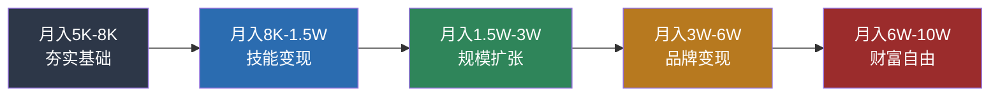
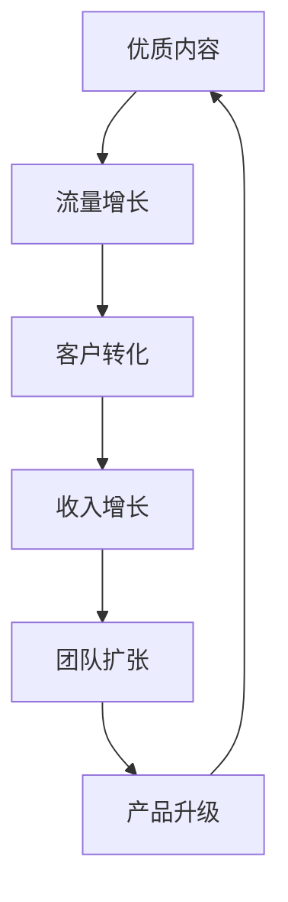
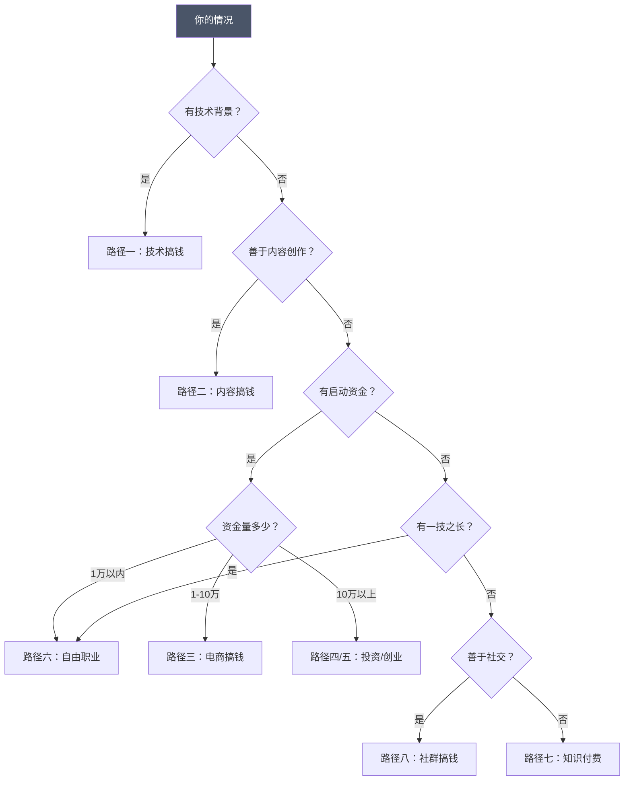
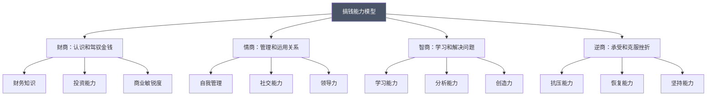

# 附录I：完整的搞钱路线图

## 前言

搞钱不是一蹴而就的事情，而是一场需要系统规划、持续执行、不断迭代的长期战役。本附录为你提供一份从月入5000元到月入10万元的完整路线图，涵盖五阶段收入跃迁路径、十条可落地的搞钱路径、四维能力模型和完整的年度计划模板。

这份路线图的核心逻辑是"道法术器"四层贯通：

- **道**：搞钱的底层逻辑——价值创造、杠杆放大、复利积累
- **法**：搞钱的方法论——路径选择、阶段规划、资源配置
- **术**：搞钱的实操技巧——获客、转化、交付、复购
- **器**：搞钱的工具链——平台、软件、模板、系统

无论你现在是月入5000的职场新人，还是月入30000寻求突破的中坚力量，都能在这里找到适合自己的搞钱方向和行动指南。记住：路线图只是方向，真正的财富来自于日复一日的执行和不断优化。



***

## 第一部分：月入5K到10W的五阶段路线图

### 阶段一：月入5000-8000元——夯实基础期（第1-6个月）

#### 阶段定位

这个阶段的本质是"从0到1"——从一个没有副业收入的普通人，变成一个有明确方向、初步技能和第一笔副业收入的人。大多数人卡在这个阶段，不是因为能力不够，而是因为方向不清晰、行动不持续。

#### 阶段目标

- 建立正确的搞钱思维和习惯
- 掌握至少一项可变现的核心技能
- 建立基本的财务管理体系
- 实现收入从5000元到8000元的突破

#### 具体行动清单

**第1个月：自我评估与方向确定**

| 周次 | 核心任务 | 交付物 | 预计耗时 |
|------|---------|--------|---------|
| 第1周 | 技能盘点：列出所有你会的技能，按"市场需求×个人兴趣×变现难度"三维打分 | 技能矩阵表 | 3小时 |
| 第2周 | 市场调研：在各大平台（闲鱼、淘宝、猪八戒、小红书）搜索你选定技能的定价和需求 | 竞品分析文档 | 5小时 |
| 第3周 | 路径选择：参考本附录第二部分的十条路径，选定1-2条主攻方向 | 路径选择书 | 2小时 |
| 第4周 | 基础建设：注册账号、建立记账习惯、设定收入目标 | 平台账号清单+记账模板 | 3小时 |

**自我评估的实操方法**：拿一张白纸，画三列——"我擅长什么"、"市场需要什么"、"我喜欢什么"。每列至少写10项。三列交叉重叠的部分，就是你的最优搞钱方向。如果三列没有交集，优先选"市场需要×我擅长"的组合，因为搞钱的本质是用你的能力满足市场需求。

**第2个月：技能学习与基础建设**

每天投入至少2小时进行技能训练。学习方式优先级排序：

1. **免费实战**：直接在平台上接低价单练手（比如闲鱼挂9.9元的服务）
2. **免费教程**：B站、YouTube、知乎上的免费教程
3. **付费课程**：只在免费学习遇到瓶颈时才付费，且优先选择有实战项目的课程

平台账号建设清单：

- 微信公众号/视频号（内容沉淀主阵地）
- 小红书（图文种草，适合技能展示）
- 闲鱼（最低门槛的变现测试平台）
- 知乎（长尾流量，适合专业内容）
- 行业垂直平台（根据你的方向选择）

**第3个月：初步实践与市场验证**

这是最关键的月份——你要产出第一个有市场价值的产品或服务，并获得真实用户反馈。

市场验证的"三步法"：

1. **免费试做**：找3-5个朋友或社群成员，免费提供你的服务，换取真实反馈
2. **低价测试**：在闲鱼或社群以低于市场价50%的价格出售，测试真实需求
3. **数据复盘**：记录每个客户的来源、转化率、满意度，用数据而非感觉来判断方向是否正确

**第4个月：优化流程与提升效率**

根据第3个月的反馈，做三件事：

- **优化产品**：根据用户反馈调整服务内容和交付标准
- **提价20-50%**：如果你的服务获得了正面反馈，立即提价
- **建立SOP**：把重复性工作流程化，用文档记录每个步骤

**第5个月：稳定收入与扩展规模**

- 确保每月有稳定的副业收入（目标：1000-2000元/月）
- 建立客户转介绍机制：每完成一个项目，主动请求客户推荐
- 开始思考"如何从单打独斗转向协作"

**第6个月：复盘总结与下一阶段规划**

用以下框架进行半年复盘：

| 复盘维度 | 关键问题 | 输出 |
|---------|---------|------|
| 收入 | 半年总收入多少？月均多少？增长曲线如何？ | 收入报表 |
| 技能 | 掌握了哪些新技能？哪些技能变现效果最好？ | 技能评估 |
| 客户 | 累计服务了多少客户？复购率多少？NPS多少？ | 客户分析 |
| 时间 | 每天投入多少小时？时薪是多少？ | 时间审计 |
| 认知 | 对搞钱的理解有什么变化？最大的教训是什么？ | 认知升级笔记 |

#### 里程碑节点

| 里程碑 | 达标标准 | 未达标的调整方向 |
|--------|---------|----------------|
| 第1个月末 | 完成技能盘点，确定搞钱方向 | 如果无法确定方向，先用闲鱼测试3个不同方向 |
| 第2个月末 | 掌握基础技能，完成平台账号建设 | 技能学习不要追求完美，能用就行 |
| 第3个月末 | 产出第一个有价值的作品或产品 | 如果无人购买，降低价格或调整产品形态 |
| 第4个月末 | 实现第一笔副业收入 | 如果连续2个月零收入，果断换方向 |
| 第5个月末 | 副业月收入稳定在1000-2000元 | 收入不达标，分析是流量问题还是转化问题 |
| 第6个月末 | 总收入达到8000元 | 如果副业收入未达2000元，延长此阶段1-2个月 |

#### 关键成功因素

- **执行力**：想到就做，不拖延不犹豫。搞钱最大的敌人是"明天再说"
- **学习力**：快速掌握新技能，适应市场变化。但要避免"学习成瘾"——用学习逃避行动
- **耐心**：前期可能看不到明显回报，需要坚持。大多数人在第3个月放弃
- **复盘力**：定期总结经验教训，持续优化。不复盘的执行是盲目执行

#### 常见误区

| 误区 | 后果 | 正确做法 |
|------|------|---------|
| 方向选太多，同时搞3个以上 | 精力分散，哪个都做不好 | 最多同时主攻1-2个方向 |
| 追求完美再开始 | 永远在准备，永远不开始 | 先完成再完美，先上线再优化 |
| 只学习不实践 | 学了很多但没赚到钱 | 学一点用一点，边学边干 |
| 低价竞争 | 利润微薄，容易被替代 | 用差异化而非低价竞争 |
| 不记账不复盘 | 不知道自己赚了多少、亏了多少 | 从第一天开始记账 |

***

### 阶段二：月入8000-15000元——技能变现期（第7-12个月）

#### 阶段定位

这个阶段的核心是从"有副业收入"到"稳定的多元收入"。你已经验证了方向的可行性，现在要做的是深耕细分领域、扩大客户规模、建立被动收入。

#### 阶段目标

- 将核心技能打磨到行业平均水平以上
- 建立稳定的客户来源和收入渠道
- 实现收入从8000元到15000元的跃升
- 开始建立被动收入来源

#### 具体行动清单

**第7-8个月：技能深化与专业定位**

选择一个细分领域进行深度钻研。"细分"的含义是：在你的大方向下，找到一个更小的切入点。

举例说明"细分"的威力：

- 大方向：设计 → 细分：餐饮品牌VI设计 → 再细分：奶茶店品牌设计
- 大方向：写作 → 细分：商业文案 → 再细分：电商详情页文案
- 大方向：编程 → 细分：小程序开发 → 再细分：餐饮小程序开发

越细分，竞争越小，客户越精准，客单价越高。

专业定位的"三件套"：

1. **作品集**：整理前6个月的优质作品，做成在线作品集
2. **专业内容**：每周在至少2个平台输出1篇专业内容（文章/视频/案例分析）
3. **行业认证**：考取1-2个行业认可的证书（如果有的话）

**第9-10个月：渠道拓展与客户积累**

开发3-5个稳定的获客渠道：

| 渠道类型 | 具体渠道 | 适合场景 | 预期占比 |
|---------|---------|---------|---------|
| 平台获客 | 闲鱼、淘宝、猪八戒、威客 | 低价单、练手单 | 30% |
| 内容获客 | 小红书、知乎、公众号、B站 | 中高价单、精准客户 | 30% |
| 转介绍 | 老客户推荐 | 最高转化率、最低获客成本 | 25% |
| 社群获客 | 行业社群、付费社群 | 精准客户、高端客户 | 15% |

客户管理系统（CRM）搭建：

用一个简单的Excel或Notion表格管理所有客户，包含以下字段：

| 字段 | 说明 |
|------|------|
| 客户名称 | 联系人姓名/公司名 |
| 来源渠道 | 从哪个渠道获得的客户 |
| 需求描述 | 客户需要什么服务 |
| 报价 | 你报了多少钱 |
| 成交价 | 最终成交价格 |
| 成交状态 | 跟进中/已成交/已流失 |
| 服务进度 | 进行中/已完成 |
| 满意度 | 客户评价 |
| 复购/转介绍 | 是否有后续合作或推荐 |

**第11-12个月：收入多元化与被动收入**

被动收入不是"不劳而获"，而是"前期投入、后期持续收益"的收入模式。常见的被动收入形式：

| 被动收入形式 | 前期投入 | 收益周期 | 月收入预期 |
|------------|---------|---------|-----------|
| 数字产品（模板、素材、工具） | 1-4周开发 | 上架后持续 | 500-5000元 |
| 在线课程（录播课） | 1-2个月制作 | 上架后持续 | 1000-10000元 |
| 电子书/专栏 | 1-3个月写作 | 上架后持续 | 500-3000元 |
| 自媒体广告收入 | 持续内容输出 | 粉丝积累后 | 1000-20000元 |
| 小额投资理财 | 学习+本金 | 本金积累后 | 视本金而定 |

#### 里程碑节点

| 里程碑 | 达标标准 |
|--------|---------|
| 第8个月末 | 成为细分领域的专业人士，有3个以上成功案例 |
| 第10个月末 | 建立稳定的3-5个获客渠道 |
| 第12个月末 | 总收入达到15000元，拥有2个以上收入来源 |

#### 关键成功因素

- **专业性**：在细分领域建立专业权威。客户愿意为专业付溢价
- **品牌力**：个人品牌开始产生溢价。同样的服务，有品牌的人收费可以高2-3倍
- **系统化**：工作流程标准化，可复制可扩展。从"做项目"变成"做产品"
- **多元收入**：不依赖单一收入来源。任何单一收入来源都可能突然消失

#### 常见误区

| 误区 | 后果 | 正确做法 |
|------|------|---------|
| 不敢提价 | 永远在低价区间挣扎 | 每完成3-5个项目就提价一次 |
| 客户来者不拒 | 接到劣质客户，浪费时间和精力 | 建立客户筛选标准 |
| 只做交付不做内容 | 获客完全依赖平台，没有自己的流量 | 每周至少花5小时做内容 |
| 忽视老客户 | 获客成本越来越高 | 维护好老客户，复购和转介绍是最优质的获客方式 |

***

### 阶段三：月入15000-30000元——规模扩张期（第13-24个月）

#### 阶段定位

这个阶段的核心是从"个人赚钱"到"系统赚钱"。你需要从一个执行者，变成一个管理者和系统建设者。瓶颈不再是技能，而是时间和精力——你需要学会借力。

#### 阶段目标

- 将个人能力转化为可规模化的商业模式
- 建立团队或系统来放大个人产出
- 实现收入从15000元到30000元的突破
- 建立至少2个稳定的被动收入来源

#### 具体行动清单

**第13-15个月：商业模式升级**

分析当前收入结构，用"收入四象限"模型找到增长点：

```text
              高利润
                |
    【明星业务】  |  【问号业务】
    利润高+规模大 |  利润高但规模小
                |
  ─────────────┼─────────────
                |
    【现金牛】    |  【瘦狗业务】
    规模大但利润低 |  规模小+利润低
                |
              低利润
         低规模 ──────── 高规模
```

- **明星业务**：加大投入，优先扩张
- **问号业务**：测试验证，看能否放大
- **现金牛**：优化提效，提高利润率
- **瘦狗业务**：果断砍掉，释放精力

外包非核心工作的判断标准：

| 工作类型 | 是否外包 | 原因 |
|---------|---------|------|
| 核心交付（你的专业技能） | 不外包 | 这是你的核心竞争力 |
| 客户沟通（高价值客户） | 不外包 | 关系维护需要你本人 |
| 客户沟通（低价值客户） | 可外包 | 用标准话术和FAQ处理 |
| 设计/排版/修图等执行 | 外包 | 执行层工作可以标准化 |
| 记账/报税/行政 | 外包 | 专业的事交给专业的人 |
| 内容初稿 | 部分外包 | 你提供框架，助手写初稿 |

**第16-18个月：团队建设与系统搭建**

第一个助手的招聘策略：

- 不要一开始就招全职，先从兼职/实习生开始
- 优先从你的学员/粉丝中招聘（了解你的风格，学习成本低）
- 给明确的SOP和KPI，不要"看着办"
- 试用期1-2周，不合格立即更换

自动化运营系统清单：

| 系统 | 功能 | 推荐工具 |
|------|------|---------|
| CRM | 客户管理 | Notion、飞书多维表格 |
| 营销自动化 | 自动回复、定时发布 | 微伴助手、wetool替代品 |
| 财务管理 | 记账、发票、报表 | 随手记、简易Excel模板 |
| 项目管理 | 任务分配、进度跟踪 | 飞书、钉钉、Trello |
| 内容管理 | 内容日历、素材库 | Notion、语雀 |

**第19-21个月：市场扩展与品牌升级**

从"执行者"到"专家/顾问"的身份转变：

- **定价方式改变**：从按件收费变成按价值收费（比如从"一个Logo收500元"变成"品牌全案收50000元"）
- **交付方式改变**：从亲手做变成带队做（你负责方案和质量把控，团队负责执行）
- **获客方式改变**：从平台接单变成品牌吸引（客户主动找上门）
- **内容定位改变**：从教程分享变成行业洞察和趋势分析

**第22-24个月：收入优化与财富积累**

收入结构优化目标：

| 收入来源 | 目标占比 | 说明 |
|---------|---------|------|
| 主营业务（服务/产品） | 50% | 核心收入来源 |
| 被动收入（课程/数字产品） | 30% | 不需要你亲自动手的收入 |
| 投资理财收益 | 10% | 让钱为你工作 |
| 其他收入（咨询/演讲等） | 10% | 偶发性高价值收入 |

#### 里程碑节点

| 里程碑 | 达标标准 |
|--------|---------|
| 第15个月末 | 商业模式验证成功，收入稳定在20000元以上 |
| 第18个月末 | 团队搭建完成，系统化运营 |
| 第21个月末 | 品牌影响力显著提升，客单价翻倍 |
| 第24个月末 | 总收入达到30000元，被动收入占比30%以上 |

***

### 阶段四：月入30000-60000元——品牌变现期（第25-36个月）

#### 阶段定位

这个阶段的核心是从"赚钱"到"值钱"。你的个人品牌成为核心资产，开始产生远超劳动时间的回报。你需要思考的不再是"如何接更多单"，而是"如何让品牌价值持续放大"。

#### 阶段目标

- 将个人品牌打造成为行业知名IP
- 建立多元化的收入矩阵
- 实现收入从30000元到60000元的跨越
- 建立完善的被动收入体系

#### 具体行动清单

**第25-27个月：IP打造与内容矩阵**

内容矩阵的"1+N"策略：

- **1个核心平台**：选择一个最适合你的平台作为主阵地，投入60%的内容精力
- **N个分发平台**：同一内容改编后分发到其他平台

| 平台 | 内容形式 | 适合领域 | 优先级 |
|------|---------|---------|--------|
| 公众号 | 长文、深度分析 | 专业领域、知识类 | 核心平台候选 |
| 小红书 | 图文笔记、种草 | 生活方式、消费品 | 核心平台候选 |
| 抖音 | 短视频、直播 | 大众消费、娱乐 | 分发平台 |
| B站 | 中长视频、教程 | 技术、教育、创意 | 核心平台候选 |
| 知乎 | 问答、专栏 | 专业领域、学术 | 分发平台 |
| 视频号 | 短视频、直播 | 本地服务、社交 | 分发平台 |

**第28-30个月：产品矩阵与收入多元化**

产品矩阵的"金字塔"模型：

```text
           ┌──────────┐
           │ 高价定制  │  ← 1对1私教/咨询/定制方案
           │ 5000-5万  │     利润最高，数量最少
           ├──────────┤
           │ 中价标准  │  ← 训练营/小班课/社群
           │ 500-5000 │     规模化交付
           ├──────────┤
           │ 低价体验  │  ← 录播课/电子书/模板
           │ 9.9-299  │     低门槛获客，建立信任
           ├──────────┤
           │ 免费引流  │  ← 文章/视频/直播/公开课
           │   免费    │     获取流量，展示专业
           └──────────┘
```

每一层的作用：

- **免费层**：获取流量和信任，是整个体系的入口
- **低价层**：筛选付费意愿强的用户，建立初步信任
- **中价层**：主要利润来源，规模化交付
- **高价层**：利润最高，数量最少，提升品牌价值

**第31-33个月：资源整合与生态构建**

从"个体户"到"生态建设者"的转变：

- **纵向整合**：打通上下游。比如你是设计师，可以整合文案、摄影、印刷资源，提供品牌全案服务
- **横向合作**：与互补型IP合作。比如你是理财博主，可以和法律博主、税务博主联合做内容
- **投资布局**：用利润投资相关项目。比如投资你学员的创业项目，或者投资相关领域的优质内容

**第34-36个月：体系优化与持续增长**

建立"增长飞轮"：



当飞轮转起来后，每一个环节的提升都会带动其他环节的增长。

#### 里程碑节点

| 里程碑 | 达标标准 |
|--------|---------|
| 第27个月末 | 成为行业知名IP，核心平台粉丝量突破5万 |
| 第30个月末 | 产品矩阵完善，收入来源超过5个 |
| 第33个月末 | 商业生态初步形成，资源整合能力强大 |
| 第36个月末 | 总收入达到60000元，被动收入占比50%以上 |

***

### 阶段五：月入60000-100000元——财富自由期（第37-48个月）

#### 阶段定位

这个阶段的核心是从"赚钱"到"值钱"再到"钱生钱"。你的收入不再依赖于你的时间投入，而是依赖于你建立的系统、品牌和资产。你需要开始用资本思维来思考财富增长。

#### 阶段目标

- 实现从个人赚钱到系统赚钱的转变
- 建立可持续的财富增长引擎
- 实现收入从60000元到100000元的突破
- 基本实现财务自由

#### 具体行动清单

**第37-39个月：资本运作与资产配置**

资产配置的基本框架（参考标准普尔家庭资产象限图）：

| 资产类别 | 建议占比 | 用途 | 具体配置 |
|---------|---------|------|---------|
| 日常开销账户 | 10% | 3-6个月生活费 | 银行活期、货币基金 |
| 杠杆保障账户 | 20% | 风险保障 | 重疾险、意外险、寿险 |
| 投资收益账户 | 30% | 钱生钱 | 基金、股票、债券 |
| 长期稳健账户 | 40% | 养老、教育 | 年金险、房产、养老金 |

**第40-42个月：平台化与生态化**

将个人业务平台化，意味着从"自己做"变成"让别人在你的平台上做"。

平台化的三种模式：

1. **联盟模式**：建立分销/代理体系，让别人帮你卖产品
2. **孵化器模式**：投资/孵化学员的项目，获得股权收益
3. **平台模式**：建立交易平台，连接供需双方，收取佣金

**第43-45个月：传承与扩展**

- 培养接班人或核心管理团队
- 将个人品牌转化为企业品牌
- 开始考虑业务的传承和延续

**第46-48个月：财富自由与人生升级**

财富自由的定义：**被动收入 > 生活开支**

计算你的财富自由数字：

```text
月生活开支 × 12 ÷ 年化投资收益率 = 财富自由所需资产

举例：
月开支2万 × 12 = 24万/年
÷ 4%（保守年化收益率）= 600万资产
```

#### 里程碑节点

| 里程碑 | 达标标准 |
|--------|---------|
| 第39个月末 | 资产配置完善，投资收益稳定 |
| 第42个月末 | 平台化运营成功，生态系统初步形成 |
| 第45个月末 | 团队成熟，业务可独立运转 |
| 第48个月末 | 总收入达到100000元，实现财务自由 |

***

## 第二部分：十条具体搞钱路径详解

### 如何选择适合你的路径

在深入每条路径之前，先用下面的决策框架找到最适合你的方向：

| 你的情况 | 推荐路径 | 原因 |
|---------|---------|------|
| 有技术背景，逻辑思维强 | 路径一：技术搞钱 | 技能可直接变现，需求稳定 |
| 有表达欲，善于创作内容 | 路径二：内容搞钱 | 门槛低，天花板高 |
| 有少量资金，善于选品 | 路径三：电商搞钱 | 现金流快，可规模化 |
| 有闲置资金，善于分析 | 路径四：投资搞钱 | 被动收入，长期增值 |
| 有创业激情，有行业资源 | 路径五：创业搞钱 | 天花板最高，风险也最高 |
| 有一技之长，追求自由 | 路径六：自由职业 | 灵活性强，门槛中等 |
| 有深度专业知识 | 路径七：知识付费 | 高利润，可规模化 |
| 有社交能力，有影响力 | 路径八：社群搞钱 | 低风险，可持续 |
| 有行业经验，善于诊断 | 路径九：咨询搞钱 | 高客单价，高利润 |
| 有广泛人脉，善于整合 | 路径十：资源整合 | 天花板极高，需要积累 |



路径可以组合，但初期最多选2条。建议一条"快速变现"路径（如电商、自由职业）+ 一条"长期积累"路径（如内容、知识付费）。

***

### 路径一：技术搞钱路线

#### 路径概述

技术路线是通过掌握一门或多项技术技能，为企业或个人提供技术服务来获取收入。这是最稳定、最可预期的搞钱路径之一，适合逻辑思维强、喜欢钻研技术的人。

#### 核心技能矩阵

| 技能方向 | 学习周期 | 市场需求 | 薪资天花板 | 推荐指数 |
|---------|---------|---------|-----------|---------|
| Web前端开发 | 3-6个月 | ★★★★★ | 月入3-5万 | ★★★★★ |
| Python开发 | 3-6个月 | ★★★★★ | 月入3-8万 | ★★★★★ |
| AI/大模型应用 | 2-4个月 | ★★★★★ | 月入5-15万 | ★★★★★ |
| 移动端开发 | 4-8个月 | ★★★★☆ | 月入3-5万 | ★★★★☆ |
| 数据分析 | 2-4个月 | ★★★★☆ | 月入2-4万 | ★★★★☆ |
| 云计算运维 | 3-6个月 | ★★★★☆ | 月入3-6万 | ★★★★☆ |
| 网络安全 | 4-8个月 | ★★★☆☆ | 月入3-10万 | ★★★☆☆ |

#### 启动成本

| 成本项 | 金额范围 | 说明 |
|--------|---------|------|
| 学习成本 | 0-5000元 | B站免费教程为主，付费课程按需 |
| 设备成本 | 5000-15000元 | 一台性能足够的电脑 |
| 证书成本 | 2000-8000元 | 阿里云/AWS/华为等云认证 |
| **合计** | **7000-28000元** | |

#### 时间投入与收益预期

| 阶段 | 时间 | 月收入 | 核心任务 |
|------|------|--------|---------|
| 学习期（0-6个月） | 每天2-4小时 | 0-5000元 | 系统学习+做练习项目 |
| 接单期（6-12个月） | 每天3-5小时 | 5000-15000元 | 平台接单+积累案例 |
| 稳定期（12-24个月） | 每天4-6小时 | 15000-30000元 | 私域客户+技术咨询 |
| 高级期（2年以上） | 每天4-8小时 | 30000-80000元 | 技术团队+产品开发 |

#### 六条搞钱策略

**策略一：技术外包接单**

| 平台 | 特点 | 适合阶段 | 客单价 |
|------|------|---------|--------|
| 程序员客栈 | 国内最大技术外包平台 | 中级 | 5000-50000元 |
| 猪八戒网 | 综合外包平台 | 初级 | 1000-20000元 |
| 开源众包 | 技术类众包 | 初级 | 500-10000元 |
| Upwork | 海外平台，美元结算 | 高级 | $500-$5000 |

**策略二：技术博客/自媒体**

- 选择一个技术方向，持续输出高质量技术文章
- 变现方式：广告收入、付费专栏、技术咨询引流、课程引流
- 周期：6-12个月积累粉丝，12个月后开始变现

**策略三：开源项目**

- 在GitHub上维护一个有价值的开源项目
- 积累Star和影响力，吸引企业合作或赞助
- 变现方式：赞助、商业授权、技术支持

**策略四：SaaS产品开发**

- 发现一个细分需求，开发一个小工具或SaaS产品
- 定价：月费制，9.9-99元/月
- 目标：100-1000个付费用户 = 月入1000-100000元

**策略五：技术培训**

- 录制技术课程上架到腾讯课堂、网易云课堂等平台
- 或者做一对一技术辅导
- 客单价：课程99-999元，私教500-2000元/小时

**策略六：AI应用开发（2024-2026热门方向）**

- 基于大模型API开发垂直场景应用
- 比如：AI写作助手、AI客服、AI数据分析工具
- 变现方式：订阅制、按量付费

#### 常见误区

| 误区 | 后果 | 正确做法 |
|------|------|---------|
| 追求学完所有技术 | 永远在学习，不赚钱 | 选一个方向深入，学到能接单的水平就开始赚钱 |
| 只在平台接低价单 | 时薪低于打工 | 逐步建立私域客户，脱离平台 |
| 不做技术内容 | 获客完全依赖平台 | 每周写一篇技术文章，建立专业形象 |
| 忽视沟通能力 | 技术好但客户不买账 | 学会用非技术语言解释技术方案 |

***

### 路径二：内容搞钱路线

#### 路径概述

内容路线是通过创作优质内容吸引粉丝，然后通过广告、带货、知识付费等方式变现。这是近年来最火的搞钱路径之一，门槛相对较低，但需要持续输出和创新能力。

#### 核心技能矩阵

| 技能方向 | 学习周期 | 重要程度 | 说明 |
|---------|---------|---------|------|
| 文案写作 | 1-3个月 | ★★★★★ | 所有内容形式的基础 |
| 短视频拍摄剪辑 | 1-2个月 | ★★★★★ | 当前流量最大的内容形式 |
| 图文排版设计 | 2-4周 | ★★★★☆ | 小红书、公众号必备 |
| 直播互动 | 1-2个月 | ★★★★☆ | 变现效率最高的形式 |
| 数据分析 | 2-4周 | ★★★☆☆ | 优化内容策略的基础 |

#### 启动成本

| 成本项 | 金额范围 | 说明 |
|--------|---------|------|
| 设备成本 | 3000-10000元 | 手机+麦克风+补光灯（初期手机就够） |
| 学习成本 | 0-3000元 | 免费教程为主 |
| 软件成本 | 0-2000元 | 剪映免费，PR/FCP按需付费 |
| **合计** | **3000-15000元** | |

#### 平台选择指南

| 平台 | 用户画像 | 变现方式 | 起号难度 | 推荐方向 |
|------|---------|---------|---------|---------|
| 小红书 | 18-35岁女性为主 | 品牌合作、带货、引流 | ★★★☆☆ | 生活方式、美妆、穿搭、家居 |
| 抖音 | 全年龄段 | 直播带货、广告、引流 | ★★★★☆ | 娱乐、知识、生活、电商 |
| B站 | 18-30岁，偏男性 | 广告、充电、引流 | ★★★★☆ | 科技、教育、游戏、创意 |
| 公众号 | 25-45岁 | 广告、知识付费、电商 | ★★☆☆☆ | 深度内容、行业分析 |
| 视频号 | 30-50岁 | 直播带货、引流 | ★★☆☆☆ | 本地生活、知识、情感 |

#### 变现路径设计

内容创作者的收入公式：

```text
月收入 = 流量 × 转化率 × 客单价 × 复购率
```

| 变现方式 | 适合粉丝量 | 月收入预期 | 操作难度 |
|---------|-----------|-----------|---------|
| 平台广告分成 | 1000+粉丝 | 100-5000元 | ★☆☆☆☆ |
| 品牌合作/软广 | 5000+粉丝 | 1000-50000元 | ★★☆☆☆ |
| 直播带货 | 1000+粉丝 | 500-100000元 | ★★★☆☆ |
| 知识付费 | 5000+粉丝 | 2000-50000元 | ★★★★☆ |
| 私域变现 | 3000+粉丝 | 3000-100000元 | ★★★☆☆ |

#### 常见误区

| 误区 | 后果 | 正确做法 |
|------|------|---------|
| 追热点没有定位 | 粉丝不精准，变现困难 | 选一个垂直领域深耕 |
| 只追求数量不追求质量 | 粉丝增长但不活跃 | 宁可少发，也要保证质量 |
| 不做私域 | 平台封号或规则变化就归零 | 从第一天开始引导粉丝到微信 |
| 急于变现 | 粉丝觉得你只想着赚钱 | 先提供价值，再考虑变现 |

***

### 路径三：电商搞钱路线

#### 路径概述

电商路线是通过线上销售商品来获取收入。包括传统电商（淘宝、京东）、社交电商（拼多多、微信）、跨境电商（亚马逊、速卖通）等多种形式。这是最成熟的搞钱路径之一，但竞争也非常激烈。

#### 电商模式对比

| 模式 | 启动资金 | 风险 | 利润率 | 适合人群 |
|------|---------|------|--------|---------|
| 无货源电商 | 1000-5000元 | ★★☆☆☆ | 10-30% | 新手，无库存压力 |
| 一件代发 | 2000-10000元 | ★★☆☆☆ | 15-35% | 有选品能力的人 |
| 自有品牌 | 50000-200000元 | ★★★★☆ | 30-60% | 有资金和供应链的人 |
| 跨境电商 | 10000-100000元 | ★★★☆☆ | 20-50% | 有外贸经验的人 |
| 直播电商 | 5000-30000元 | ★★★☆☆ | 20-40% | 有表达能力和粉丝的人 |

#### 选品方法论

选品的"四维评估法"：

| 维度 | 评估标准 | 数据来源 |
|------|---------|---------|
| 市场容量 | 月搜索量>1万，有持续需求 | 生意参谋、蝉妈妈 |
| 竞争程度 | 首页卖家月销<5000单，非大品牌垄断 | 平台搜索 |
| 利润空间 | 毛利率>40%，客单价50-500元 | 1688比价 |
| 供应链 | 有稳定供应商，品质可控 | 实地考察或样品测试 |

#### 启动成本

| 成本项 | 金额范围 | 说明 |
|--------|---------|------|
| 店铺保证金 | 1000-50000元 | 视平台和品类 |
| 首批进货 | 5000-50000元 | 或从无货源模式起步 |
| 营销推广 | 3000-20000元 | 直通车、引力魔方等 |
| 工具软件 | 1000-5000元 | ERP、数据分析工具 |
| **合计** | **10000-125000元** | |

#### 电商运营SOP

每日必做清单：

| 时间 | 任务 | 耗时 |
|------|------|------|
| 9:00 | 查看昨日数据：访客、转化率、客单价、退款率 | 30分钟 |
| 9:30 | 处理客服消息和售后问题 | 60分钟 |
| 10:30 | 优化商品标题、主图、详情页 | 60分钟 |
| 11:30 | 调整直通车/推广计划 | 30分钟 |
| 14:00 | 上新或补货 | 60分钟 |
| 15:00 | 竞品分析和市场调研 | 30分钟 |
| 16:00 | 内容营销：小红书种草、短视频拍摄 | 60分钟 |
| 17:00 | 处理发货和供应链对接 | 30分钟 |

#### 常见误区

| 误区 | 后果 | 正确做法 |
|------|------|---------|
| 选品凭感觉 | 进了一堆卖不出去的货 | 用数据选品，先测品再大量进货 |
| 打价格战 | 利润越来越薄 | 用差异化竞争，不打价格战 |
| 只做平台不做私域 | 平台规则变化就归零 | 从包裹卡、客服引导等方式积累私域 |
| 忽视售后 | 差评影响店铺权重 | 把售后当获客机会处理 |

***

### 路径四：投资搞钱路线

#### 路径概述

投资路线是通过投资股票、基金、房产、数字货币等资产来获取收益。这是实现财富增值的重要途径，但需要较强的风险承受能力和专业知识。

**重要前提**：投资不是赌博。在开始投资之前，确保你有稳定的收入来源和3-6个月的应急资金。

#### 投资品种对比

| 投资品种 | 起步资金 | 预期年化收益 | 风险等级 | 适合人群 |
|---------|---------|------------|---------|---------|
| 货币基金 | 1元 | 2-3% | ★☆☆☆☆ | 所有人 |
| 债券基金 | 100元 | 3-8% | ★★☆☆☆ | 稳健型投资者 |
| 指数基金定投 | 100元 | 8-15% | ★★☆☆☆ | 长期投资者 |
| 股票 | 5000元 | -30%-100% | ★★★★☆ | 有研究能力的人 |
| 房产投资 | 50万+ | 5-15% | ★★★☆☆ | 资金充足的人 |
| 数字货币 | 1000元 | -90%-1000% | ★★★★★ | 高风险承受能力 |

#### 投资学习路线

| 阶段 | 学习内容 | 推荐资源 | 时间 |
|------|---------|---------|------|
| 入门 | 理解复利、通胀、资产配置 | 《小狗钱钱》《富爸爸穷爸爸》 | 1-2周 |
| 基础 | 学习基金投资、指数定投 | 《指数基金投资指南》 | 2-4周 |
| 进阶 | 学习股票分析、财报阅读 | 《聪明的投资者》《手把手教你读财报》 | 1-3个月 |
| 高级 | 学习资产配置、风险管理 | CFA教材、专业课程 | 持续学习 |

#### 指数基金定投实操方案

这是最适合普通人的投资方式——定期定额投资宽基指数基金：

| 项目 | 内容 |
|------|------|
| 推荐标的 | 沪深300指数基金、中证500指数基金 |
| 定投金额 | 月收入的10-30% |
| 定投频率 | 每月固定日期（发工资后第二天） |
| 止盈策略 | 累计收益达到30%时分批止盈 |
| 持有周期 | 至少3年，建议5年以上 |

#### 常见误区

| 误区 | 后果 | 正确做法 |
|------|------|---------|
| 没有稳定收入就投资 | 亏损时没有回旋余地 | 先确保有稳定收入和应急资金 |
| 追涨杀跌 | 高买低卖，亏损严重 | 制定计划，严格执行，不追涨杀跌 |
| 把所有钱投一个品种 | 一次亏损就归零 | 分散投资，鸡蛋不放一个篮子 |
| 借钱/加杠杆投资 | 可能血本无归 | 只用闲钱投资，不借钱炒股 |
| 频繁交易 | 手续费吃掉收益 | 减少交易频率，长期持有 |

***

### 路径五：创业搞钱路线

#### 路径概述

创业路线是通过创立自己的公司或项目来获取收入。这是风险最高但收益也最大的搞钱路径，适合有强烈事业心和领导力的人。

#### 创业前的自检清单

在创业之前，诚实地回答以下问题：

| 检查项 | 达标标准 | 你的答案 |
|--------|---------|---------|
| 需求验证 | 已找到10个以上愿意付费的潜在客户 | ______ |
| 技能准备 | 具备产品/技术/营销中至少2项核心能力 | ______ |
| 资金准备 | 有12-18个月的生活费+创业启动资金 | ______ |
| 家庭支持 | 家人理解并支持你的创业决定 | ______ |
| 心理准备 | 能接受连续12个月没有收入 | ______ |
| 退出计划 | 如果失败，你知道下一步做什么 | ______ |

如果以上有3项以上不达标，建议先在副业阶段验证想法，不要全职创业。

#### 精益创业的五个步骤


1. **发现问题**：找到一个真实存在、足够痛、有人愿意付费解决的问题
2. **提出假设**：假设你的解决方案能解决这个问题
3. **构建MVP**：用最低成本、最快速度做出最小可行产品
4. **市场测试**：用MVP获取10-50个真实用户，收集反馈
5. **数据验证**：用数据（转化率、留存率、付费率）验证假设是否成立

#### 启动成本

| 成本项 | 金额范围 | 说明 |
|--------|---------|------|
| 项目启动 | 10000-500000元 | 视项目类型 |
| 运营资金 | 50000-1000000元 | 至少准备12个月运营资金 |
| 人力成本 | 视团队规模 | 初期可以用股权代替现金 |
| **合计** | **60000-1500000元** | |

#### 常见误区

| 误区 | 后果 | 正确做法 |
|------|------|---------|
| 产品做出来再找客户 | 做出来没人要 | 先找到客户再做产品 |
| 合伙人平均分配股权 | 决策效率低，容易扯皮 | 必须有一个大股东（>51%） |
| 一开始就租大办公室 | 固定成本太高 | 能远程就远程，能省就省 |
| 只关注产品不关注现金流 | 产品很好但公司死了 | 现金流是创业公司的生命线 |
| 融资后大手大脚 | 钱烧完了公司也完了 | 把融资当救命钱，不当消费钱 |

***

### 路径六：自由职业搞钱路线

#### 路径概述

自由职业路线是通过提供专业服务来获取收入。这是介于打工和创业之间的搞钱路径，适合有一技之长、追求自由的人。

#### 自由职业收入公式

```text
月收入 = 时薪 × 日工作小时数 × 月工作天数 × 利用率

举例：
时薪200元 × 6小时/天 × 22天/月 × 70%利用率 = 18480元/月
```

关键指标是"利用率"——你有多少工作时间是在做有收入的项目。自由职业者通常只有50-70%的利用率，其余时间在做获客、沟通、行政等非创收工作。

#### 提高收入的四个杠杆

| 杠杆 | 方法 | 效果 |
|------|------|------|
| 提高时薪 | 建立专业品牌，从低价竞争转向价值竞争 | 时薪从100→500元 |
| 提高利用率 | 建立稳定的客户来源，减少获客时间 | 利用率从50%→80% |
| 团队化 | 雇佣助手处理低价值工作 | 从1人产出变成3人产出 |
| 产品化 | 将服务标准化，降低对个人时间的依赖 | 从卖时间变成卖产品 |

#### 自由职业者的必备工具

| 类别 | 工具 | 用途 |
|------|------|------|
| 合同 | 标准服务合同模板 | 保护双方权益 |
| 报价 | 报价单模板 | 专业报价，提升成交率 |
| 项目管理 | Notion/飞书 | 管理多个项目和客户 |
| 时间追踪 | Toggl/时间块 | 记录工作时间，计算真实时薪 |
| 发票 | 电子发票工具 | 合规收款 |
| 备份 | 云存储 | 防止文件丢失 |

#### 常见误区

| 误区 | 后果 | 正确做法 |
|------|------|---------|
| 有活就接，没活就闲 | 收入不稳定 | 建立稳定的获客渠道，保持70%以上利用率 |
| 不签合同 | 客户赖账或需求无限变更 | 每个项目必须签合同，明确范围和付款方式 |
| 不留应急资金 | 淡季时现金流断裂 | 保持3-6个月的应急资金 |
| 不持续学习 | 技能过时被淘汰 | 每年投入至少10%的时间学习新技能 |

***

### 路径七：知识付费搞钱路线

#### 路径概述

知识付费路线是通过将专业知识制作成课程、训练营、社群等产品来获取收入。这是近年来增长最快的搞钱路径之一，适合有专业积累和表达能力的人。

#### 知识付费产品形态对比

| 产品形态 | 开发周期 | 定价范围 | 交付方式 | 收入模式 |
|---------|---------|---------|---------|---------|
| 电子书/PDF | 1-4周 | 9.9-99元 | 自动交付 | 被动收入 |
| 录播课程 | 1-3个月 | 99-999元 | 平台自动 | 被动收入 |
| 直播课/公开课 | 1天 | 免费-199元 | 实时直播 | 引流+成交 |
| 训练营 | 1-2个月开发 | 999-9999元 | 社群+直播 | 交付型收入 |
| 私教/1对1 | 即时 | 5000-50000元 | 1对1服务 | 高客单价 |
| 会员/订阅 | 1个月 | 99-999元/年 | 持续内容 | 持续收入 |

#### 课程开发的"四步法"

**第一步：需求调研（1-2周）**

- 在目标用户社群中调研痛点和需求
- 分析竞品课程的内容和定价
- 确定课程的核心卖点和差异化

**第二步：课程设计（1-2周）**

- 设计课程大纲：从结果倒推，学员学完能达到什么水平
- 设计学习路径：由浅入深，循序渐进
- 设计作业和实践：学以致用，知行合一

**第三步：内容制作（2-6周）**

- 录制视频/撰写文字/制作PPT
- 准备配套资料：模板、工具、参考文献
- 内测：找3-5个目标用户试学，收集反馈

**第四步：上线推广（持续）**

- 选择平台上架（知识星球、小鹅通、自建小程序等）
- 用免费内容引流（文章、短视频、直播）
- 用限时优惠、早鸟价等促销手段促进首销

#### 常见误区

| 误区 | 后果 | 正确做法 |
|------|------|---------|
| 课程内容太多太杂 | 学员学不完，完课率低 | 一门课解决一个核心问题 |
| 只做课程不做社群 | 学员买了不学，没有口碑 | 用社群督促学习，用作业巩固效果 |
| 定价太低 | 利润微薄，吸引低质量学员 | 敢于定价，用价值而非价格竞争 |
| 不做售后 | 差评影响后续招生 | 重视学员反馈，及时答疑和迭代 |

***

### 路径八：社群搞钱路线

#### 路径概述

社群路线是通过建立和运营付费社群来获取收入。包括会员制社群、行业社群、兴趣社群等多种形式。这是建立私域流量、实现持续变现的重要方式。

#### 社群的四种盈利模式

| 模式 | 收入来源 | 运营重点 | 月收入预期 |
|------|---------|---------|-----------|
| 会员制 | 会员费 | 持续提供高价值内容和服务 | 5000-50000元 |
| 社群+课程 | 课程销售 | 用社群做课程的交付和复购 | 10000-100000元 |
| 社群+电商 | 商品销售 | 用社群做选品和种草 | 5000-80000元 |
| 社群+广告 | 广告/合作 | 用社群做品牌曝光和推广 | 3000-30000元 |

#### 社群运营SOP

| 频率 | 动作 | 目的 |
|------|------|------|
| 每日 | 早报/晚报、话题讨论 | 保持活跃度 |
| 每周 | 1次直播/分享/答疑 | 提供核心价值 |
| 每月 | 1次线下活动/线上大课 | 增强归属感 |
| 每季 | 1次复盘和优化 | 迭代社群内容 |

#### 常见误区

| 误区 | 后果 | 正确做法 |
|------|------|---------|
| 社群只拉人不运营 | 变成死群，口碑崩塌 | 建立运营SOP，持续提供价值 |
| 不设门槛 | 进来大量不相关的人 | 用价格和问卷筛选成员 |
| 没有退出机制 | 社群质量持续下降 | 设置年度考核，淘汰不活跃成员 |

***

### 路径九：咨询搞钱路线

#### 路径概述

咨询路线是通过为企业或个人提供专业咨询服务来获取收入。这是高客单价、高利润的搞钱路径，适合有深厚行业积累的专业人士。

#### 咨询师的定价策略

| 定价方式 | 适用场景 | 计算方法 |
|---------|---------|---------|
| 按小时收费 | 1对1咨询、诊断 | 专家：500-3000元/小时 |
| 按项目收费 | 有明确交付物的项目 | 根据项目复杂度和价值定价 |
| 按结果收费 | 能量化结果的服务 | 基础费+效果分成 |
| 年度顾问费 | 长期合作关系 | 5万-50万/年 |

#### 咨询项目的标准流程

1. **需求沟通**（1-2小时）：了解客户的问题和期望
2. **方案设计**（3-5天）：制定解决方案和报价
3. **合同签订**：明确范围、时间、费用、交付物
4. **项目执行**（1-4周）：调研、分析、制定方案
5. **方案交付**：提交报告/方案，讲解和答疑
6. **跟踪复盘**（1-3个月）：跟踪执行效果，提供后续支持

#### 常见误区

| 误区 | 后果 | 正确做法 |
|------|------|---------|
| 没有成功案例就做咨询 | 客户不信任 | 先积累3-5个成功案例（可以免费做） |
| 方案太理论化 | 客户无法执行 | 方案必须可落地，有具体步骤和时间表 |
| 不跟踪效果 | 无法形成口碑 | 项目结束后主动跟踪效果，收集案例 |

***

### 路径十：资源整合搞钱路线

#### 路径概述

资源整合路线是通过整合各方资源来创造价值并获取收入。这是最高级的搞钱路径，适合有广泛人脉和商业洞察力的人。

#### 资源整合的三种模式

| 模式 | 说明 | 收入方式 | 案例 |
|------|------|---------|------|
| 信息差整合 | A有需求，B有资源，你做连接 | 佣金/服务费 | 帮企业找供应商，收取5-10%佣金 |
| 能力整合 | A有能力，B有需求，你做匹配 | 项目管理费 | 组建虚拟团队接大项目 |
| 资本整合 | A有资金，B有项目，你做对接 | 中介费/股权 | 帮创业者对接投资人 |

#### 常见误区

| 误区 | 后果 | 正确做法 |
|------|------|---------|
| 只做中间人不做价值 | 被上下游抛弃 | 在整合过程中建立自己的核心价值 |
| 不签协议 | 合作成功后被踢开 | 提前签订合作协议，明确分成比例 |
| 贪多嚼不烂 | 什么都想整合，什么都不专业 | 选一个垂直领域深耕 |

***

## 第三部分：搞钱能力模型

搞钱不只是"做事"，更是"做人"。以下四维能力模型，帮你系统性地提升搞钱的底层能力。



### 一、财商维度

#### 定义

财商是指认识金钱和驾驭金钱的能力。高财商的人能让钱为自己工作，低财商的人只能为钱工作。

#### 核心能力要素与提升方法

**1. 财务知识——搞钱的基础语言**

你需要掌握的财务知识清单：

| 知识点 | 为什么重要 | 学习资源 |
|--------|-----------|---------|
| 资产负债表 | 了解自己的财务健康状况 | 《手把手教你读财报》 |
| 现金流量表 | 掌握钱从哪来到哪去 | 同上 |
| 复利原理 | 理解时间的力量 | 《小狗钱钱》 |
| 通货膨胀 | 理解钱为什么会贬值 | 基础经济学课程 |
| 税务知识 | 合法节税，保护收益 | 税务局官网、税务师咨询 |

**2. 投资能力——让钱生钱**

投资能力的四个层次：

| 层次 | 能力描述 | 达标标准 |
|------|---------|---------|
| L1 入门 | 理解不同投资品种的风险收益特征 | 能说清楚股票、基金、债券的区别 |
| L2 基础 | 能进行简单的资产配置 | 有自己的投资组合，年化收益>通胀 |
| L3 进阶 | 能分析个股/项目的价值 | 能独立分析一家公司是否值得投资 |
| L4 高级 | 能在不同市场周期中调整策略 | 牛市能赚钱，熊市能控制回撤 |

**3. 商业敏锐度——发现赚钱机会的能力**

商业敏锐度的核心是"供需思维"——看到任何现象，都能思考：这里有没有未被满足的需求？有没有可以优化的效率？

训练方法：

- 每天观察一个商业现象，分析它的商业模式
- 每周拆解一个成功案例，理解它为什么赚钱
- 每月做一次市场调研，发现新的商业机会

#### 评估标准

| 等级 | 能力描述 | 对应行为 |
|------|---------|---------|
| 初级 | 能记账和做预算 | 每月记账，知道钱花在哪里 |
| 中级 | 能投资理财，实现资产增值 | 有投资组合，年化收益>8% |
| 高级 | 能进行复杂的财务规划 | 有多元收入来源，被动收入>30% |
| 专家 | 能识别和把握重大财务机会 | 能发现并抓住大的投资/商业机会 |

***

### 二、情商维度

#### 定义

情商是指识别、理解和管理自己及他人情绪的能力。在搞钱过程中，情商帮助我们建立人脉、处理关系、应对压力、把握机会。

#### 核心能力要素与提升方法

**1. 自我认知——知道自己几斤几两**

自我认知的"镜子练习"：

每天花5分钟回答以下问题：

- 今天我做了什么让自己满意的事？
- 今天我做了什么让自己后悔的事？
- 如果重来一次，我会怎么做？
- 我的情绪今天有什么变化？是什么触发的？

**2. 关系管理——人脉就是钱脉**

关系管理的"5-5-5法则"：

- **每周**：深度链接5个人（私聊、电话、见面）
- **每月**：参加5个社群活动（线上/线下）
- **每季**：维护5个关键人脉（定期联系、提供价值）

关系维护的核心原则：**先给予，再索取**。在请求帮助之前，先想想你能为对方提供什么价值。

**3. 沟通能力——把想法变成钱**

搞钱场景中的关键沟通技巧：

| 场景 | 技巧 | 示例 |
|------|------|------|
| 电梯演讲 | 30秒说清楚你是谁、你能提供什么价值 | "我是做餐饮品牌设计的，帮30多家奶茶店从0做到月销百万" |
| 报价谈判 | 先说价值，再说价格 | "这个方案能帮你提升30%的转化率，费用是2万元" |
| 处理拒绝 | 不要纠缠，留下好印象 | "没关系，如果以后有需要随时联系我" |
| 促成成交 | 制造紧迫感，降低决策门槛 | "这个月报名享受早鸟价，下周恢复原价" |

#### 评估标准

| 等级 | 能力描述 | 对应行为 |
|------|---------|---------|
| 初级 | 能识别自己的基本情绪 | 知道自己什么时候焦虑、开心、愤怒 |
| 中级 | 能管理自己的情绪 | 压力大时不会失控，能保持理性 |
| 高级 | 能理解他人情绪 | 能读懂客户的真实需求和顾虑 |
| 专家 | 能影响他人情绪 | 能让客户、团队保持积极状态 |

***

### 三、智商维度

#### 定义

智商不是指天生的聪明程度，而是指认知能力、学习能力、解决问题的能力。在搞钱过程中，智商帮助我们快速学习新知识、分析复杂问题、做出正确决策。

#### 核心能力要素与提升方法

**1. 学习能力——快速掌握新技能**

高效学习的"费曼学习法"：

1. **选择概念**：确定你要学习的概念
2. **教授他人**：用最简单的语言解释给别人听
3. **发现盲区**：解释不清楚的地方就是你的知识盲区
4. **简化优化**：用更简单的语言重新解释

**2. 分析能力——看透事物本质**

分析问题的"5W2H框架"：

| 要素 | 问题 | 作用 |
|------|------|------|
| What | 是什么问题？ | 明确问题本质 |
| Why | 为什么会出现？ | 找到根本原因 |
| Who | 谁受影响？ | 确定利益相关方 |
| When | 什么时候发生的？ | 确定时间线 |
| Where | 在哪里发生的？ | 确定范围 |
| How | 如何解决？ | 制定解决方案 |
| How much | 需要多少资源？ | 评估可行性 |

**3. 决策能力——在不确定性中做出正确选择**

决策的"10-10-10法则"：

面对重大决策时，问自己三个问题：

- 这个决定在**10分钟后**会有什么影响？
- 这个决定在**10个月后**会有什么影响？
- 这个决定在**10年后**会有什么影响？

这个方法帮你区分短期冲动和长期价值。

#### 评估标准

| 等级 | 能力描述 | 对应行为 |
|------|---------|---------|
| 初级 | 能学习和应用基本知识 | 能通过教程学会一个新工具 |
| 中级 | 能分析和解决常见问题 | 能独立分析业务数据并找到问题 |
| 高级 | 能解决复杂问题 | 能设计商业模式、制定战略 |
| 专家 | 能创新性地解决难题 | 能在行业层面创造新方法论 |

***

### 四、逆商维度

#### 定义

逆商是指面对逆境、困难、挫折时的应对能力。搞钱路上最大的挑战不是技能不足，而是在遇到困难时能否坚持下去。

#### 核心能力要素与提升方法

**1. 抗压能力——在压力下保持冷静**

压力管理的"STOP技术"：

- **S**（Stop）：暂停，不要在情绪激动时做决定
- **T**（Take a breath）：深呼吸3次，让身体放松
- **O**（Observe）：观察自己的情绪和身体反应
- **P**（Proceed）：冷静后继续行动

**2. 恢复能力——从失败中快速反弹**

失败复盘的"3R框架"：

| 步骤 | 内容 | 输出 |
|------|------|------|
| Review（回顾） | 发生了什么？ | 事实描述 |
| Reflect（反思） | 为什么会发生？我能控制的因素是什么？ | 原因分析 |
| Revise（修正） | 下次遇到类似情况我会怎么做？ | 行动计划 |

**3. 坚持能力——长期主义的践行者**

坚持的"小赢策略"：

- 不要只盯着大目标，把大目标拆解成每天的小任务
- 每完成一个小任务就给自己一个小奖励
- 记录每天的"小赢"，积累成就感
- 定期回顾进步，看到自己的成长轨迹

#### 评估标准

| 等级 | 能力描述 | 对应行为 |
|------|---------|---------|
| 初级 | 能承受基本的压力 | 遇到困难不会立即放弃 |
| 中级 | 能从失败中恢复 | 失败后能在1周内调整状态 |
| 高级 | 能在逆境中找到机会 | 危机中能发现别人看不到的机会 |
| 专家 | 能带领团队克服重大困难 | 在最困难的时候能稳定军心 |

***

## 第四部分：年度搞钱计划模板

### 如何使用这些模板

以下是完整的计划模板体系。**不要只是看，现在就填上你的数字。** 计划的价值在于执行，而执行的前提是有一个具体的、量化的、可追踪的计划。

### 一、年度目标设定

#### 1. 收入目标

| 目标项 | 你的目标 | 填写说明 |
|--------|---------|---------|
| 年度总收入目标 | ______元 | 基于去年收入×(1+增长率) |
| 月均收入目标 | ______元 | 年度目标÷12 |
| 收入增长率目标 | ______% | 对比去年月均收入的增长比例 |
| 被动收入目标 | ______元/月 | 不需要你亲自劳动的收入 |
| 被动收入占比目标 | ______% | 建议逐年提高，目标50%以上 |

**填写示范**（假设当前月入10000元）：

| 目标项 | 示范值 | 计算逻辑 |
|--------|--------|---------|
| 年度总收入目标 | 180000元 | 月均15000元×12个月 |
| 月均收入目标 | 15000元 | 从10000提升到15000 |
| 收入增长率目标 | 50% | (15000-10000)/10000 |
| 被动收入目标 | 3000元/月 | 占月收入的20% |
| 被动收入占比目标 | 20% | 从0%提升到20% |

#### 2. 资产目标

| 目标项 | 你的目标 | 填写说明 |
|--------|---------|---------|
| 年度储蓄目标 | ______元 | 收入-支出后的净储蓄 |
| 投资收益目标 | ______元 | 投资本金×预期收益率 |
| 资产增值目标 | ______元 | 包括投资增值、房产增值等 |
| 负债减少目标 | ______元 | 计划还清的债务金额 |

#### 3. 能力目标

| 目标项 | 你的目标 | 填写说明 |
|--------|---------|---------|
| 技能提升目标 | ______ | 要掌握的新技能或要提升的技能 |
| 证书考取目标 | ______ | 要考取的行业证书 |
| 知识学习目标 | ______ | 要读的书、要学的课程 |
| 人脉拓展目标 | ______ | 要结识的行业人脉数量或质量 |

#### 4. 生活目标

搞钱不是生活的全部。设定生活目标，确保在赚钱的同时不失去健康和幸福。

| 目标项 | 你的目标 |
|--------|---------|
| 健康目标 | 每周运动3次，每次30分钟 |
| 家庭目标 | 每周至少1天全身心陪伴家人 |
| 个人成长目标 | 每月读2本书，每季度学1个新技能 |
| 生活质量目标 | 年度旅行1-2次，升级居住环境 |

***

### 二、季度目标分解

#### 第一季度（1-3月）：基础建设期

| 维度 | 目标 | 里程碑 |
|------|------|--------|
| 收入 | 月均收入____元，季度总收入____元 | [ ] 达成月收入目标 |
| 渠道 | 搭建/优化____个获客渠道 | [ ] 渠道搭建完成 |
| 产品 | 开发/优化____个产品或服务 | [ ] 产品上线 |
| 学习 | 完成____的学习计划 | [ ] 学习完成 |

#### 第二季度（4-6月）：快速增长期

| 维度 | 目标 | 里程碑 |
|------|------|--------|
| 收入 | 月均收入____元，收入增长率____% | [ ] 达成增长目标 |
| 客户 | 新增____个客户，复购率____% | [ ] 客户增长达标 |
| 产品 | 推出____个新产品/服务 | [ ] 新品上线 |
| 品牌 | 发布____篇内容，粉丝增长____ | [ ] 内容目标完成 |

#### 第三季度（7-9月）：稳定优化期

| 维度 | 目标 | 里程碑 |
|------|------|--------|
| 收入 | 月均收入____元，被动收入____元 | [ ] 被动收入达标 |
| 效率 | 优化____个流程，节省____小时/周 | [ ] 效率提升 |
| 团队 | 招聘/培养____个助手 | [ ] 团队搭建 |
| 投资 | 投资收益____元 | [ ] 投资目标 |

#### 第四季度（10-12月）：收获总结期

| 维度 | 目标 | 里程碑 |
|------|------|--------|
| 收入 | 年度总收入____元 | [ ] 年度目标达成 |
| 总结 | 完成年度复盘报告 | [ ] 复盘完成 |
| 规划 | 制定下一年计划 | [ ] 新年计划 |
| 休息 | 安排年度旅行/休假 | [ ] 休息充电 |

***

### 三、月度行动计划模板

每月第一天填写，月底复盘。

```markdown
# ____年____月 搞钱计划

## 本月收入目标：______元

## 本月三大重点
1. ______
2. ______
3. ______

## 本月行动计划

### 收入行动
| 行动 | 预期产出 | 截止日期 | 完成 |
|------|---------|---------|------|
| ______ | ______ | ______ | [ ] |
| ______ | ______ | ______ | [ ] |
| ______ | ______ | ______ | [ ] |

### 学习计划
| 学习内容 | 学习方式 | 投入时间 | 完成 |
|---------|---------|---------|------|
| ______ | ______ | ______ | [ ] |
| ______ | ______ | ______ | [ ] |

### 客户开发
| 渠道 | 目标 | 行动 | 完成 |
|------|------|------|------|
| ______ | ______ | ______ | [ ] |
| ______ | ______ | ______ | [ ] |

### 本月财务预算
| 项目 | 金额 |
|------|------|
| 预计收入 | ______元 |
| 固定支出 | ______元 |
| 投资计划 | ______元 |
| 储蓄目标 | ______元 |

### 风险预案
| 潜在风险 | 应对措施 |
|---------|---------|
| ______ | ______ |
| ______ | ______ |
```

***

### 四、周度复盘模板

每周日晚上花30分钟填写。

```markdown
# 第____周复盘（____月____日 - ____月____日）

## 收入情况
- 本周收入：______元（目标：______元）
- 完成率：______%
- 收入来源明细：
  - 来源1：______元
  - 来源2：______元

## 本周成果
1. ______
2. ______
3. ______

## 本周问题
| 问题 | 原因分析 | 解决方案 | 责任人 | 截止日期 |
|------|---------|---------|--------|---------|
| ______ | ______ | ______ | ______ | ______ |

## 本周学习
- 新知识：______
- 新技能：______
- 新认知：______

## 下周计划
- 收入目标：______元
- 重点行动1：______
- 重点行动2：______
- 重点行动3：______

## 自评打分
| 维度 | 分数（1-10） | 说明 |
|------|------------|------|
| 执行力 | ____/10 | ______ |
| 效率 | ____/10 | ______ |
| 心态 | ____/10 | ______ |
| 综合 | ____/10 | ______ |
```

***

### 五、每日执行清单

这是经过验证的高效搞钱日程模板，根据你的情况调整：

**早晨（6:00-9:00）——黄金学习时间**

- [ ] 阅读行业资讯/竞品动态（30分钟）
- [ ] 规划今日三件最重要的事（15分钟）
- [ ] 学习新技能或阅读专业书籍（60分钟）

**上午（9:00-12:00）——核心产出时间**

- [ ] 处理最重要的工作任务（2小时）
- [ ] 客户沟通和服务（1小时）

**中午（12:00-14:00）——社交维护时间**

- [ ] 午餐和休息
- [ ] 社交媒体互动和内容回复（30分钟）
- [ ] 行业社群交流（30分钟）

**下午（14:00-18:00）——项目推进时间**

- [ ] 继续核心工作或项目推进（2小时）
- [ ] 新客户开发或获客行动（1小时）
- [ ] 产品或服务优化（1小时）

**晚上（18:00-22:00）——复盘与创作时间**

- [ ] 内容创作：写文章/拍视频/录课程（60分钟）
- [ ] 学习提升：读书/课程/练习（60分钟）
- [ ] 今日复盘：记录成果和教训（15分钟）
- [ ] 明日计划：规划明天的三件要事（15分钟）

**重要提醒**：这个日程是理想状态。现实生活中不可能每天都严格执行。关键是保证"核心产出时间"不被侵占——上午的3小时是搞钱的命脉，这段时间不要刷手机、不要开会、不要处理琐事。

***

## 第五部分：风险管理与常见陷阱

### 搞钱路上的十大陷阱

| 陷阱 | 表现 | 后果 | 预防方法 |
|------|------|------|---------|
| 1. 急于求成 | 3个月没赚到钱就放弃 | 永远在起点 | 设定合理预期，至少给自己6个月 |
| 2. 方向摇摆 | 频繁换方向，每个都浅尝辄止 | 什么都做不好 | 选定方向后至少坚持6个月 |
| 3. 学习成瘾 | 一直在学习，从不开始行动 | 学了很多但没赚钱 | 学到60分就开始干 |
| 4. 低价竞争 | 用价格而非价值竞争 | 利润越来越薄 | 用差异化和品牌溢价竞争 |
| 5. 单一收入 | 只有一个收入来源 | 一旦失去就归零 | 始终保持2个以上收入来源 |
| 6. 忽视现金流 | 只看收入不看支出 | 收入高但存不下钱 | 每月记账，控制支出 |
| 7. 透支健康 | 为了赚钱牺牲睡眠和运动 | 身体垮了一切归零 | 每天保证7小时睡眠和30分钟运动 |
| 8. 孤军奋战 | 不寻求帮助，不建立人脉 | 效率低，视野窄 | 主动加入社群，寻找导师 |
| 9. 法律风险 | 不了解税务和合同法律 | 被罚款或被坑 | 学习基础税务知识，重要合同找律师 |
| 10. 心态崩盘 | 一次失败就全盘否定自己 | 从此不敢尝试 | 用"失败复盘3R框架"理性分析 |

### 税务基础：搞钱必须懂的税务常识

| 收入类型 | 税务处理 | 注意事项 |
|---------|---------|---------|
| 工资薪金 | 公司代扣代缴 | 了解专项附加扣除 |
| 劳务报酬 | 预扣20%，年度汇算 | 年度汇算可能退税 |
| 经营所得 | 个体户按5-35%缴纳 | 可以核定征收降低税负 |
| 投资收益 | 股票暂免个税，基金分红免税 | 了解不同投资品种的税务政策 |
| 稿酬所得 | 预扣20%×70% | 年度汇算可能退税 |

**重要提醒**：当你的副业收入超过一定规模时，建议注册个体工商户或咨询专业税务师。合法节税不是逃税，而是用好国家给的税收优惠政策。

### 心理健康：搞钱路上的心理维护

搞钱是一场持久战，心理健康和身体健康同样重要。

**常见心理问题及应对**：

| 心理问题 | 表现 | 应对方法 |
|---------|------|---------|
| 焦虑 | 担心收入不稳定，夜不能寐 | 设定最低收入底线，有底线就有安全感 |
| 比较心理 | 看到别人赚钱多就焦虑 | 关注自己的成长曲线，不和别人比 |
| 冒名顶替综合征 | 觉得自己不配收那么多钱 | 记录客户好评，建立成就清单 |
| 倦怠 | 对搞钱失去动力 | 定期休息，重新连接初心 |
| 孤独感 | 自己搞钱没有同事交流 | 加入同行社群，找到志同道合的伙伴 |

***

## 结语

搞钱是一场马拉松，不是百米冲刺。这份路线图为你提供了方向和方法，但真正的成功来自于日复一日的执行和坚持。

八条搞钱铁律：

1. **选择比努力重要**：选对方向，事半功倍。但不要用"选择"来逃避"执行"
2. **执行力是关键**：想到就做，不拖延。完成比完美更重要
3. **持续学习**：市场在变化，你需要不断学习。但要学以致用，不是学以致学
4. **建立系统**：从做事到建系统，实现被动收入。系统是你最大的杠杆
5. **长期主义**：不要急于求成，注重可持续发展。复利是世界第八大奇迹
6. **风险管理**：控制风险，不要把所有鸡蛋放在一个篮子里
7. **人脉积累**：人脉就是钱脉，用心经营关系。先给予，再索取
8. **心态调整**：保持积极心态，享受搞钱的过程。钱是工具，不是目的

现在，放下这份路线图，去做你计划中的第一件事。记住：**最好的计划是被执行的计划。**

***

**附录完**
