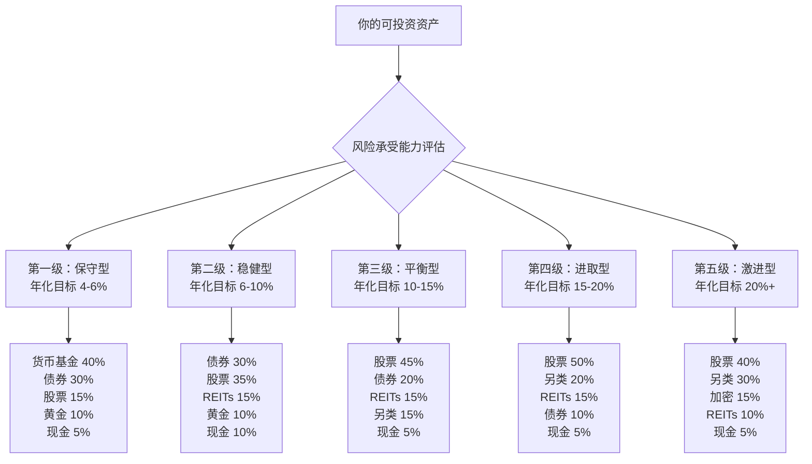
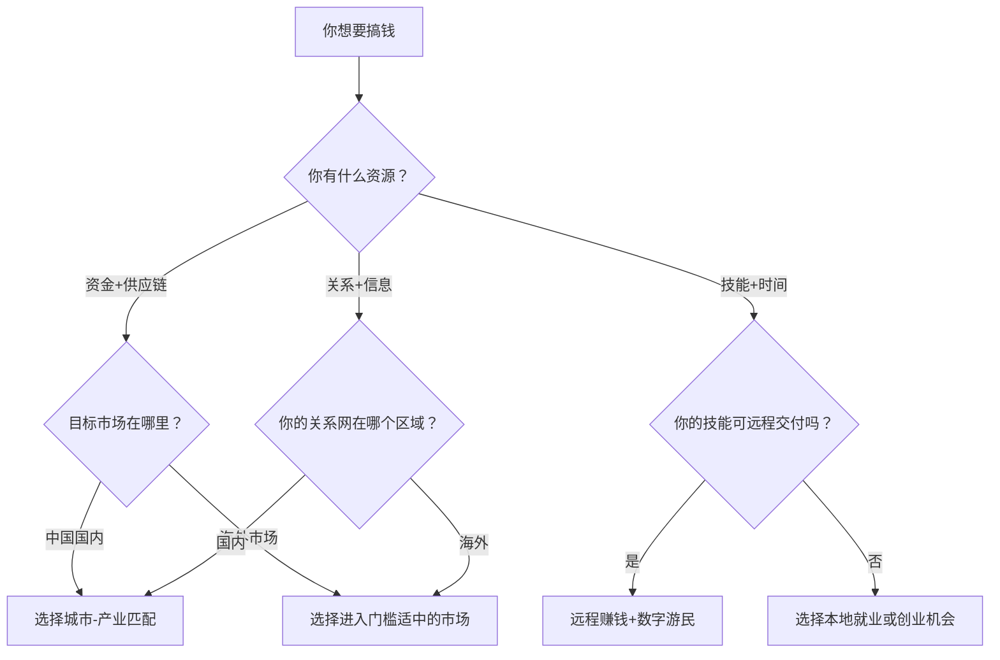

# 附录J：全球搞钱地图

## 前言

搞钱这件事，从来不是闭门造车。你所在的地理位置、你选择的市场、你配置资产的地域分布——这些"空间变量"往往比"时间变量"更能决定你的财富上限。一个人在深圳华强北做电子元器件分销，和在义乌做小商品出口，面对的是完全不同的游戏规则、客户画像和利润结构。

本附录不是一份"各国概况介绍"，而是一份**实战导向的全球搞钱地图**。我们按照"总—分—总"的逻辑展开：

- **先看中国内部**——你最容易触及的市场，按城市能级拆解，给出真实的城市数据和产业图谱
- **再看全球各区域**——东亚、东南亚、欧美、新兴市场、大洋洲，每个区域聚焦1-2个深度机会，而非面面俱到的浅尝辄止
- **最后回到你个人**——远程赚钱的实操路径、全球资产配置的具体工具、海外开户汇款税务的落地指南，以及一个帮你做出决策的框架

读完本附录，你应该能回答三个问题：**我应该去哪个市场？我应该怎么进去？我应该配置多少比例？**

---

## 第一部分：中国各区域——你脚下的金矿

中国是全球第二大经济体，2024年GDP超过126万亿元人民币。但"中国"不是一个市场，而是几十个截然不同的市场。选对城市，可能比选对行业更重要。

### 一、一线城市：北上广深

一线城市的核心逻辑是**资源密度**。人才、资本、信息、政策在这里以最高密度聚集，竞争也最为惨烈。适合有明确技术壁垒或资本优势的玩家。

#### 上海：金融与消费的双引擎

上海2024年GDP约4.72万亿元，是中国唯一一个第三产业占比超过75%的城市。陆家嘴聚集了超过1700家持牌金融机构，外滩到南京西路一带是中国高端消费品牌的策源地。

**深度机会：跨境消费品品牌。** 上海是中国品牌出海的最佳跳板。SHEIN的供应链虽然在广东，但其品牌运营和国际团队大量依托上海的人才池。安克创新（Anker）虽然总部在长沙，但其品牌战略和海外营销核心团队也在上海布局。如果你要做一个面向全球消费者的DTC品牌，上海的人才密度和国际化程度是不可替代的。

#### 深圳：硬件供应链的全球枢纽

深圳2024年GDP约3.46万亿元，但这个数字远不能反映其在全球供应链中的地位。华强北方圆一公里内，你可以找到任何电子元器件的现货——从芯片到传感器到连接器，应有尽有。深圳及周边的东莞、惠州形成了全球最完整的电子消费品供应链集群。

**深度机会：智能硬件出海。** 大疆（DJI）2023年营收超过500亿元，其中海外收入占比超过60%。深圳的优势不只是"便宜"，而是"快"——从设计到打样到量产，深圳的供应链可以在60天内完成一个新品从概念到出货的全过程。如果你做消费电子、IoT设备、机器人，深圳是全球范围内最优的起步地。

#### 北京：政策与技术的制高点

北京2024年GDP约4.38万亿元，但其真正的独特性在于两点：一是中国顶尖高校和科研院所的集中（清华、北大、中科院系统），二是政策制定的核心位置。中关村到望京一带，是中国AI创业的绝对中心。百度、字节跳动、美团、小米等巨头的总部都在北京。

#### 广州：贸易与供应链的传统强市

广州2024年GDP约3.04万亿元。广州的独特优势在于其千年商埠的基因——十三行的贸易传统延续至今，广州是中国最大的服装、皮具、化妆品批发集散地。白云区的化妆品产业集群占全国产量的半壁江山。

### 二、新一线城市：各有所长的第二梯队

新一线城市的共同特征是：运营成本比一线低30-50%，但人才和产业链依然足够支撑规模化运营。选择新一线城市，关键是选对**城市-产业匹配**。

#### 杭州：电商与数字经济的绝对主场

杭州2024年GDP约2.01万亿元。阿里巴巴的总部效应让杭州成为中国电商生态的核心节点。余杭区未来科技城一带，聚集了超过3000家电商服务企业，涵盖代运营、直播MCN、数据服务、物流仓储等全产业链。杭州直播电商交易额2024年超过5000亿元，占全国约15%。

**深度机会：直播电商服务。** 不是自己做直播——那是红海。而是做直播电商的"卖水人"：帮品牌做抖音/快手/TikTok代运营，提供直播间搭建、投流优化、达人对接等服务。这个赛道的年增速超过30%，且高度依赖本地化团队。

#### 成都：游戏与休闲消费的西部中心

成都2024年GDP约2.21万亿元。成都是中国游戏产业的第二大城，仅次于上海。天象互动、尼毕鲁、数字天空等游戏公司均在成都。成都高新区聚集了超过800家游戏企业，从业人员超过5万人。成都的优势在于：生活成本低（程序员薪资约为北京的60%）、人才留存率高（成都高校毕业生留蓉率超过70%）、生活品质好（有利于创意类团队的长期稳定性）。

#### 苏州：生物医药与高端制造

苏州2024年GDP约2.47万亿元，是中国GDP最高的地级市。苏州工业园区聚集了超过2300家生物医药企业，被称为"中国药谷"。信达生物、基石药业等创新药企均在苏州。同时，苏州昆山是中国最大的笔记本电脑和电子设备代工基地。

#### 其他新一线城市的独特定位

| 城市 | 2024年GDP（万亿元） | 核心产业标签 | 一句话定位 |
|------|---------------------|-------------|-----------|
| 重庆 | 3.16 | 汽车、电子信息、装备制造 | 中国内陆制造业的龙头 |
| 武汉 | 2.01 | 光电子、汽车、生物医药 | 光谷是中国光纤光缆的全球基地 |
| 南京 | 1.79 | 软件、集成电路、新医药 | 中国软件名城，高校密度仅次于北京 |
| 长沙 | 1.43 | 工程机械、文娱传媒、食品 | 三一重工的主场，短视频内容创作之都 |
| 西安 | 1.22 | 航空航天、硬科技、文旅 | 中国航天动力的摇篮 |

### 三、二三线城市与县域：低成本高确定性

二三线城市的搞钱逻辑与一线完全不同——不是追逐风口，而是**深耕垂直赛道**。

#### 产业集群型城市

中国的二三线城市分布着大量"隐形冠军"产业集群：

- **曹县**（山东）：汉服和演出服产业占全国市场份额超过70%，年产值超过100亿元。一个县城的汉服产业，支撑了整个淘宝汉服品类的半壁江山。
- **许昌**（河南）：假发产业占全球市场份额超过50%，年产值超过200亿元。瑞贝卡（Rebecca）是全球最大的发制品供应商。
- **南通**（江苏）：家纺产业年产值超过2000亿元，中国每卖出3件床品就有1件来自南通。
- **泉州**（福建）：运动鞋服产业链完整，安踏、特步、361度等品牌均起源于此。
- **义乌**（浙江）：小商品出口额超过4000亿元，是全球最大的小商品集散中心。

#### 县域经济的搞钱逻辑

中国有1800多个县和县级市，覆盖超过7亿人口。县域经济的核心机会不是"做新东西"，而是"用新渠道卖老东西"。拼多多的崛起，本质上就是打通了县域供应链与全国消费者之间的通路。如果你在某个县域有独特的供应链资源（比如家乡特产、家族工厂），用直播电商和跨境电商把产品卖出去，是当前性价比最高的搞钱路径之一。

---

## 第二部分：东亚市场——高成熟度、高客单价

东亚是中国企业出海的"近水楼台"——文化相近、消费力强、基础设施完善。但正因为市场成熟，进入门槛也相对较高。

### 一、日本：全球第四大经济体的"慢钱"

日本2024年GDP约4.2万亿美元，人口1.24亿。日本市场的关键词是**"品质信任"**——日本消费者对产品品质的要求极高，但一旦建立信任，复购率和品牌忠诚度也极高。

#### 深度机会：跨境电商与品牌收购

日本电商市场规模2024年超过20万亿日元（约1500亿美元），但线上渗透率仅约10%，远低于中国（约30%）和美国（约15%），增长空间巨大。

**实操路径：**
1. 通过乐天（Rakuten）或亚马逊日本站切入，测试市场反应
2. 重点品类：家居收纳、户外运动、宠物用品、健康食品——这些是日本消费者愿意为"中国制造"买单的品类
3. 进阶策略：收购日本本土的中小品牌（价格通常在5000万-3亿日元，约250万-1500万人民币），利用中国供应链降低成本，保留日本品牌溢价

**真实案例：** 安克创新（Anker）在日本充电器市场占有率超过30%，2023年日本市场贡献收入约30亿元人民币。其成功关键不是"便宜"，而是"品质+设计+本地化售后"的组合拳。

#### 日本市场的进入壁垒

| 壁垒类型 | 具体内容 | 应对策略 |
|---------|---------|---------|
| 语言 | 日语是商业语言，英语普及率低 | 必须有日语团队或本地合作伙伴 |
| 品质标准 | JIS认证、PSE电气安全认证等 | 提前做好产品认证，周期约3-6个月 |
| 渠道 | 日本零售渠道高度集中，便利店和商超话语权强 | 先走电商，再拓展线下 |
| 文化 | 日本商务文化注重长期关系和信任建立 | 不要急于求成，先做小单试水 |

### 二、韩国：K-文化驱动的消费市场

韩国2024年GDP约1.72万亿美元，人口5100万。韩国市场的独特之处在于其**文化输出能力**——K-pop、韩剧、韩国美妆的全球影响力，造就了一个高度数字化、品牌敏感度极高的消费市场。

#### 深度机会：K-beauty供应链与内容电商

韩国美妆市场规模2024年超过15万亿韩元（约110亿美元）。中国消费者对韩国美妆的需求虽然有所下降，但东南亚和欧美市场对K-beauty的需求正在爆发。

**实操路径：**
1. 不要试图在韩国本土与爱茉莉太平洋、LG生活健康正面竞争
2. 而是做"K-beauty供应链整合商"——从韩国代工厂采购ODM产品，贴上自己的品牌，通过TikTok Shop和亚马逊卖到东南亚和欧美
3. Coupang（韩国版亚马逊）是中国卖家进入韩国市场的首选平台，其物流网络"火箭配送"覆盖韩国全境

**真实案例：** 花西子（Florasis）通过与韩国KOL合作，在韩国社交媒体上建立了"东方美学"的品牌认知，2023年韩国市场销售额突破1亿元人民币。

### 三、新加坡：东南亚的金融与商业枢纽

新加坡2024年GDP约5000亿美元，人口仅590万，但人均GDP超过8.5万美元，是亚洲最富裕的国家之一。新加坡的核心价值不在于其本土市场容量，而在于其**区域枢纽地位**。

#### 为什么搞钱要关注新加坡

1. **税务优势**：新加坡企业所得税标准税率17%，且对海外收入有免税政策（符合条件的新设公司前三年海外股息免税）
2. **资金自由**：新加坡没有外汇管制，资金进出自由
3. **法律透明**：普通法体系，合同执行力强，知识产权保护好
4. **区域跳板**：通过新加坡设立控股公司，可以高效辐射东南亚、南亚、澳洲市场

**实操路径：**
- 如果你做跨境电商业务，在新加坡注册公司（注册费约3000新币），开设公司银行账户（推荐DBS或OCBC），然后通过Shopify+Stripe收款，资金可以自由汇出
- 如果你做科技SaaS产品，新加坡公司可以帮助你获得东南亚客户的信任，同时享受税收优惠
- 如果你做投资，新加坡的家族办公室（Family Office）门槛约2000万新币（约1亿人民币），可以享受税务豁免

### 四、港澳台：跨境桥梁与高消费市场

#### 香港

香港的核心价值在于其**国际金融中心地位**和**连接中国内地与全球市场的桥梁作用**。2024年港股IPO融资额虽然下降，但香港作为人民币离岸中心、财富管理中心的角色依然稳固。

- **实操价值**：通过香港开设银行账户（推荐汇丰、渣打或中银香港），可以方便地进行跨境资金调度。香港公司注册费用约5000港币，维护成本约1万港币/年。

#### 台湾

台湾2024年GDP约7900亿美元，人口2300万。台湾市场的独特优势在于半导体产业链（台积电）和电子制造服务（鸿海/富士康）。对于普通搞钱者，台湾市场的机会在于：

- **跨境电商**：台湾消费者对中国大陆的淘宝、1688产品接受度高，虾皮（Shopee）是台湾最大的电商平台
- **内容创作**：YouTube在台湾的渗透率超过85%，中文内容创作者可以通过台湾市场获得更高的CPM（千次展示收入）

---

## 第三部分：东南亚——下一个十年的增长引擎

东南亚11国总人口超过6.8亿，2024年GDP总量约3.8万亿美元，中位年龄仅29岁。这个市场的核心叙事是：**年轻人口+移动互联网渗透+消费升级=巨大的增量机会**。

但东南亚不是一个市场，而是十几个截然不同的市场。与其面面俱到，不如聚焦两个最具代表性的机会。

### 一、越南：制造业转移的最大受益者

越南2024年GDP约4300亿美元，人口1亿，经济增长率超过6%。越南正在经历中国2000年代的故事——大量制造业从中国转移到越南，带动了就业、消费和城市化。

#### 深度机会：制造业供应链服务

不要直接去越南开工厂——那是资本密集型游戏。更好的机会是做**服务制造业转移的"卖水人"**：

1. **工业地产**：越南北部（北宁、海防）和南部（平阳、同奈）的工业园区厂房租金过去3年上涨了40-60%。如果你有资金，投资工业园区的标准厂房出租给转移过来的中国企业，年化收益率可达12-18%。
2. **供应链服务**：为在越南设厂的中国企业提供原材料采购、报关清关、人力资源、法律财税等一站式服务。这类企业的利润率通常在20-30%。
3. **跨境电商**：TikTok Shop在越南2024年GMV超过100亿美元。越南消费者对中国商品的接受度很高，尤其是电子产品、美妆、家居用品。

**真实案例：** 比亚迪在越南投资超过6亿美元建设电动车工厂，预计2025年投产。这带动了大量中国零部件供应商在越南设厂，催生了一个庞大的配套服务市场。

### 二、印度尼西亚：东南亚最大的消费市场

印尼2024年GDP约1.4万亿美元，人口2.8亿，是东南亚最大的经济体和消费市场。印尼的独特之处在于其**岛屿地理**（17000+岛屿）和**穆斯林文化**（全球穆斯林人口最多的国家）。

#### 深度机会：穆斯林消费经济

印尼的穆斯林人口超过2.3亿，催生了一个巨大的"清真经济"市场：

- **清真食品**：印尼清真食品市场规模2024年超过2000亿美元，且每年增长8-10%。中国企业如果能获得清真认证（Halal），其食品和饮料产品在印尼有很大的增长空间。
- **穆斯林时尚**：印尼是全球最大的穆斯林时尚市场之一。头巾（hijab）和保守服饰的需求持续增长。中国供应链在面料和成衣制造上的优势，可以直接转化为在印尼市场的竞争力。
- **金融科技**：印尼的银行渗透率仅约50%，但智能手机渗透率超过70%。这意味着移动支付和数字金融服务有巨大的增长空间。GoPay、OVO、Dana等平台已经证明了这一点。

**真实案例：** 名创优品（MINISO）在印尼开设了超过300家门店，2023年印尼市场贡献收入超过10亿元人民币。其成功关键在于"高性价比+本地化选品+密集开店"的策略。

### 三、东南亚其他市场的快速指南

| 国家 | 人口（亿） | GDP（亿美元） | 核心机会 | 进入难度 | 关键提示 |
|------|-----------|-------------|---------|---------|---------|
| 泰国 | 0.7 | 5100 | 医疗旅游、汽车零部件、电商 | 中 | 泰国华人控制约60%的经济命脉，找对本地合作伙伴是关键 |
| 菲律宾 | 1.1 | 4300 | BPO外包、汇款服务、社交电商 | 中 | 英语普及率高，是做英文客服和内容运营的理想地点 |
| 马来西亚 | 0.34 | 4000 | 清真食品、半导体封测、教育 | 中低 | 华人占比约23%，中文商业环境友好 |
| 缅甸 | 0.55 | 600 | 基建、农业、矿业 | 高 | 政治风险极高，不建议个人投资者进入 |
| 柬埔寨 | 0.17 | 300 | 房地产、基建、旅游 | 中 | 美元化经济，汇率风险低但政治风险需关注 |

---

## 第四部分：欧美市场——高门槛、高回报

欧美市场的共同特征是：市场规模大、消费能力强、法律体系完善、竞争激烈。进入这些市场需要更多的资金、更强的合规能力和更长的时间投入，但一旦站稳脚跟，回报也更为丰厚。

### 一、美国：全球最大消费市场的"终局之战"

美国2024年GDP约28.8万亿美元，人口3.3亿，人均GDP超过8.7万美元。美国是全球最大的消费市场，也是中国品牌出海的"终极考场"。

#### 深度机会：DTC品牌与跨境电商

美国电商市场规模2024年超过1.1万亿美元，线上渗透率约16%。中国企业在美成功的路径已经非常清晰：

**路径一：亚马逊品牌矩阵。** 通过亚马逊FBA（Fulfillment by Amazon）快速切入，重点品类包括家居、户外、宠物、健身器材。关键成功因素：选品精准（用Helium 10或Jungle Scout工具做数据驱动选品）、供应链成本控制、Review管理。

**路径二：独立站DTC品牌。** 用Shopify建站，通过Facebook/Meta Ads和Google Ads获取流量，建立品牌溢价。这条路更难，但天花板更高。SHEIN是这条路的极端成功案例——2023年美国市场收入超过200亿美元，估值超过600亿美元。

**路径三：TikTok Shop。** TikTok Shop美国站2024年GMV目标为175亿美元。这是一个快速增长的新渠道，目前竞争还没有亚马逊那么白热化。适合有短视频内容能力的团队。

#### 美国市场的合规要点

| 合规领域 | 具体要求 | 实操建议 |
|---------|---------|---------|
| 税务 | 需申请EIN（雇主识别号），部分州需要缴纳Sales Tax | 使用TaxJar或Avalara自动计算和申报销售税 |
| 产品安全 | CPSC（消费品安全委员会）认证、FDA（食品药品）认证 | 提前3-6个月做产品合规认证 |
| 知识产权 | USPTO商标注册，避免专利侵权 | 注册美国商标费用约300-500美元，周期8-12个月 |
| 数据隐私 | CCPA（加州消费者隐私法案） | 使用合规的支付和数据处理服务商 |

### 二、英国：脱欧后的新格局

英国2024年GDP约3.3万亿美元，人口6700万。脱欧后的英国正在重新定位其全球贸易关系，这为中国企业创造了新的机会。

**深度机会：** 英国是欧洲最大的电商市场之一，在线零售渗透率超过28%（全球最高之一）。中国跨境电商卖家可以通过亚马逊英国站和eBay英国站切入。需要注意的是，英国脱欧后对进口商品的VAT（增值税，标准税率20%）要求更严格，建议使用英国本地的VAT代理进行申报。

**真实案例：** 华为在英国的运营虽然受到地缘政治影响，但其消费电子品牌Honor（荣耀）独立后，在英国市场通过运营商渠道和线上销售，2023年出货量增长超过200%。

### 三、德国：工业4.0与精密制造

德国2024年GDP约4.5万亿美元，人口8300万。德国是欧洲最大的经济体，也是全球制造业的标杆。

**深度机会：** 德国的机会不在于直接面向消费者，而在于**B2B供应链整合**。德国的中小企业（Mittelstand）是全球工业的支柱，它们需要高质量、低成本的零部件和原材料供应商。如果你有制造业背景，可以通过以下方式切入：

1. 参加汉诺威工业展（Hannover Messe）、科隆五金展（Eisenwarenmesse）等行业展会
2. 通过德国的B2B平台如Wer liefert was（wlw.de）寻找客户
3. 在德国设立代表处或与当地贸易商合作

**真实案例：** 格力电器在德国设有研发中心和销售子公司，其商用空调产品在德国市场占有率约8%。

### 四、法国：奢侈品与消费文化

法国2024年GDP约3.1万亿美元，人口6800万。法国是全球奢侈品行业的中心，LVMH、开云（Kering）、爱马仕三大奢侈品集团均总部在巴黎。

**深度机会：** 法国市场的进入策略应该"借势"——利用法国在时尚、美妆、食品领域的品牌溢价能力。具体路径：

1. **代理法国品牌进入中国市场**：帮助法国中小品牌做中国市场分销，利润率通常在30-50%
2. **学习法国品牌建设方法论**：法国品牌的"故事性"和"文化感"是其核心竞争力，中国品牌可以借鉴
3. **法国本土电商**：Cdiscount是法国第二大电商平台，中国卖家可以通过Cdiscount进入法国消费市场

### 五、北欧市场：高福利下的创新高地

北欧四国（瑞典、挪威、丹麦、芬兰）合计人口约2700万，GDP约1.7万亿美元。北欧市场的特点是人均消费力极强、数字化程度全球领先、对可持续发展高度关注。

**深度机会：清洁科技与SaaS。** 北欧是全球清洁科技和SaaS创业的热土。Spotify（瑞典）、Klarna（瑞典）、Supercell（芬兰）等全球知名科技公司均来自北欧。如果你有SaaS产品或清洁技术，北欧是一个极好的"标杆市场"——在北欧获得客户背书后，可以更容易地拓展到整个欧洲市场。

---

## 第五部分：新兴市场——高风险、高潜力

新兴市场的共同特征是：基础设施不完善、政策风险高、竞争相对较少、增长空间大。适合有风险承受能力和本地资源的玩家。

### 一、印度：14亿人口的数字化浪潮

印度2024年GDP约3.9万亿美元，人口14.3亿（已超过中国成为全球第一），中位年龄仅28岁。印度正在经历一场前所未有的数字化浪潮——2016年的废钞令和2020年的Jio电信革命，让超过8亿印度人接入了移动互联网。

#### 深度机会：印度出海的"反向思维"

直接进入印度市场的难度很大——政策限制多、本土竞争激烈、利润率低。但有一个"反向"机会值得关注：**利用印度的人才和成本优势，服务全球市场**。

- **软件开发外包**：印度软件工程师的薪资约为中国的40-60%，英语沟通能力好。通过印度团队为中国或全球客户做软件开发、数据标注、AI训练等工作，利润率可达40-60%。
- **内容创作**：印度的YouTube创作者数量全球第二。如果你有面向印度市场的内容需求（比如教育、娱乐），可以与印度MCN合作，成本仅为国内的1/3。

**真实案例：** 字节跳动旗下的TikTok在2020年被印度封禁后，印度本土替代品Josh和Moj迅速崛起。这说明印度市场的竞争更多来自本土，而非国际玩家。

### 二、中东：石油财富的转型红利

中东市场（重点是沙特和阿联酋）2024年GDP合计约2万亿美元。沙特"2030愿景"和阿联酋的经济多元化战略，正在将石油财富转化为基建、科技、娱乐和旅游投资。

#### 深度机会：基建与科技服务

沙特正在建设NEOM（一座造价5000亿美元的未来城市）和The Line（一条170公里长的线性城市）。这些超级项目创造了巨大的基建和科技服务需求。

**实操路径：**
1. 通过参加沙特LEAP科技展、迪拜GITEX科技展等行业展会，建立本地联系
2. 为中国基建和科技公司做中东市场的代理或咨询服务
3. 利用阿联酋的自由贸易区（如迪拜DMCC、阿布扎比ADGM）设立公司，享受零企业税和100%外资所有权

**真实案例：** 中国建筑在沙特承接了多个大型基建项目，合同金额超过100亿美元。华为在中东5G市场份额超过30%。

### 三、非洲：移动支付的"跨越式发展"

非洲大陆2024年GDP约3万亿美元，人口超过14亿，中位年龄仅19岁。非洲的独特之处在于其**跨越式发展**——跳过了固定电话和PC时代，直接进入移动互联网时代。

**深度机会：移动支付与数字金融。** 非洲的移动支付市场规模2024年超过8000亿美元交易额。M-Pesa（肯尼亚）的成功证明了移动支付在非洲的巨大潜力。

**真实案例：** 传音控股（Transsion）是非洲最大的智能手机品牌，市场份额超过40%。2023年传音在非洲市场收入超过400亿元人民币。传音的成功不是靠技术领先，而是靠"本地化"——针对非洲消费者需求做了深肤色美颜算法、多SIM卡支持、超长待机等功能。

### 四、拉美：被低估的消费市场

拉美2024年GDP约5.5万亿美元，人口6.5亿。巴西和墨西哥是拉美最大的两个经济体。

**深度机会：** 墨西哥正在成为"近岸外包"（nearshoring）的热门目的地——美国企业将供应链从亚洲转移到墨西哥，以缩短供应链距离。这为中国企业创造了在墨西哥设厂、服务北美市场的机会。

**真实案例：** 比亚迪在巴西投资超过6亿美元建设电动车工厂，是其在南美的最大投资。上汽集团的MG品牌在墨西哥市场2023年销量增长超过300%。

---

## 第六部分：大洋洲与加拿大——高消费力的英语市场

### 一、澳大利亚与新西兰

澳大利亚2024年GDP约1.8万亿美元，人口2600万；新西兰GDP约2500亿美元，人口500万。这两个市场的共同特征是：英语环境、消费力强、与中国经贸关系紧密。

**深度机会：** 

- **跨境电商**：澳洲消费者对中国商品接受度高，eBay澳洲站和Amazon澳洲站是主要渠道。澳洲电商市场规模2024年约500亿澳元，且增速超过15%。
- **教育与移民服务**：澳洲是全球第三大留学目的地，中国留学生超过15万人。留学中介、移民咨询、海外置业等服务需求持续旺盛。
- **农产品出口**：澳洲和新西兰的乳制品、牛肉、蜂蜜、红酒在中国市场有很强的品牌溢价。

### 二、加拿大

加拿大2024年GDP约2.1万亿美元，人口4000万。加拿大的核心优势是其与美国的经济一体化（USMCA协定）和对移民的友好政策。

**深度机会：** 

- **北美跳板**：通过加拿大设立公司，可以利用USMCA协定的优势进入美国和墨西哥市场。加拿大的企业税率（联邦+省）约为26.5%，低于美国。
- **科技人才**：加拿大的移民政策吸引了大量全球科技人才。多伦多和温哥华的科技生态日益成熟，是AI和软件创业的重要节点。
- **资源投资**：加拿大是全球最大的矿产资源国之一，锂、镍、钴等新能源关键矿产储量丰富。

---

## 第七部分：远程赚钱与数字游民

远程工作正在从"临时安排"变成"永久模式"。如果你的工作可以在线完成，你就可以选择在生活成本最低的地方工作，赚取高收入地区的薪资——这就是"地理套利"。

### 一、远程赚钱的主要模式

| 模式 | 收入范围（月） | 适合人群 | 时间自由度 | 技能要求 |
|------|-------------|---------|-----------|---------|
| 自由职业（设计/开发/写作） | 5000-50000美元 | 有专业技能的人 | 高 | 高 |
| 远程全职工作 | 3000-20000美元 | 有稳定技能的人 | 中 | 中高 |
| 在线课程/知识付费 | 1000-100000美元 | 有专业经验的人 | 极高 | 中 |
| 跨境电商运营 | 2000-50000美元 | 有供应链资源的人 | 中 | 中 |
| 内容创作（YouTube/Blog） | 500-50000美元 | 有表达能力的人 | 极高 | 中低 |
| SaaS产品 | 0-无限 | 有技术能力的人 | 高 | 极高 |

### 二、数字游民的热门目的地

| 目的地 | 月生活成本（美元） | 签证政策 | 网速 | 时区便利性（对中国） |
|-------|------------------|---------|------|---------------------|
| 泰国清迈 | 800-1500 | 落地签60天，DTV数字游民签证5年 | 优秀 | 好（UTC+7） |
| 印尼巴厘岛 | 1000-2000 | B211A签证6个月 | 良好 | 好（UTC+8） |
| 葡萄牙里斯本 | 1500-3000 | D7被动收入签证 | 优秀 | 差（UTC+0） |
| 哥伦比亚麦德林 | 800-1500 | 旅游签90天 | 良好 | 差（UTC-5） |
| 格鲁吉亚第比利斯 | 500-1000 | 免签1年 | 良好 | 中（UTC+4） |
| 马来西亚吉隆坡 | 1000-2000 | DE Rantau数字游民签证 | 优秀 | 好（UTC+8） |

### 三、远程工作的税务注意事项

远程赚钱最大的陷阱是**税务合规**。核心原则：

1. **税务居民身份**：大多数国家以"183天规则"判定税务居民——在一个国家停留超过183天，通常被视为该国税务居民
2. **中国税务居民**：如果你是中国税务居民（户籍在中国或在中国有住所），你需要就全球收入向中国缴纳个人所得税
3. **避免双重征税**：中国与超过100个国家签署了避免双重征税协定，可以抵免在海外已缴纳的税款
4. **实操建议**：如果年收入超过50万元人民币，建议咨询专业的跨境税务顾问。使用Deel、Remote.com等平台可以帮助你合规地处理跨境薪酬

---

## 第八部分：全球资产配置实操指南

### 一、五级资产配置模型

### 二、具体投资工具与标的

#### 中国市场的投资工具

| 资产类别 | 推荐标的 | 代码/平台 | 费率 | 适合人群 |
|---------|---------|----------|------|---------|
| A股宽基指数 | 沪深300ETF | 510300（华泰柏瑞） | 0.15%/年 | 所有人 |
| A股成长指数 | 中证500ETF | 510500（南方） | 0.15%/年 | 进取型投资者 |
| 港股 | 恒生科技ETF | 513180（华夏） | 0.50%/年 | 看好中国科技 |
| 中国债券 | 十年国债ETF | 511260（国泰） | 0.15%/年 | 保守型投资者 |
| 黄金 | 黄金ETF | 518880（华安） | 0.50%/年 | 避险需求 |

#### 海外市场的投资工具（通过QDII基金）

| 资产类别 | 推荐标的 | 代码/平台 | 费率 | 说明 |
|---------|---------|----------|------|------|
| 美国标普500 | 标普500ETF联接 | 050025（博时） | 0.85%/年 | 人民币申购 |
| 美国纳斯达克 | 纳斯达克100ETF | 513100（国泰） | 0.80%/年 | 美元资产对冲 |
| 日本股市 | 日经225ETF | 513880（华夏） | 0.50%/年 | 日元资产 |
| 德国股市 | 德国DAX ETF | 513030（华安） | 0.80%/年 | 欧元资产 |
| 印度股市 | 印度基金LOF | 164824（工银） | 1.50%/年 | 新兴市场 |
| 全球债券 | 全球债券基金 | 000369（广发亚太） | 1.00%/年 | 分散风险 |
| REITs | 鹏华美国房地产 | 206011 | 1.50%/年 | 美国不动产 |

#### 直接投资海外证券的渠道

| 平台 | 开户门槛 | 支持市场 | 费用结构 | 适合人群 |
|------|---------|---------|---------|---------|
| 富途牛牛（Futu） | 无最低门槛 | 美股、港股、A股 | 美股佣金$0.99/笔 | 新手友好 |
| 老虎证券（Tiger） | 无最低门槛 | 美股、港股、澳股 | 美股佣金$0.99/笔 | 有经验投资者 |
| 盈透证券（IBKR） | 无最低门槛 | 全球150+市场 | 按量阶梯计费 | 专业投资者 |
| 嘉信理财（Schwab） | 无最低门槛 | 美股 | 零佣金 | 纯美股投资 |

### 三、外汇管制与资金出境

中国的外汇管制是全球资产配置的最大实操障碍。核心规则：

- **个人年度购汇额度**：每人每年5万美元等值外汇
- **资金用途限制**：购汇不得用于境外买房、证券投资、购买人寿保险等资本项目
- **合法的资金出境渠道**：
  1. **QDII基金**：通过公募基金间接投资海外市场，不受个人购汇额度限制
  2. **港股通/沪深港通**：通过A股账户直接买卖港股，每日额度520亿元人民币
  3. **合法贸易项下**：如果有真实的贸易背景，可以通过贸易项下汇出资金
  4. **ODI（对外直接投资）**：通过商务部门和外汇管理局审批，可以合法对外投资，但流程复杂
  5. **已在海外的资金**：如果你在海外有合法收入（如工资、投资收益），可以自由使用

**重要提示：** 任何通过地下钱庄、虚拟货币、分拆购汇等方式规避外汇管制的行为都是违法的，可能面临行政处罚甚至刑事责任。

### 四、海外开户实操指南

#### 海外银行开户

| 地区 | 推荐银行 | 开户方式 | 最低存款 | 账户维护费 | 用途 |
|------|---------|---------|---------|-----------|------|
| 香港 | 汇丰银行 | 亲临开户 | 1万港币 | 免费（达标） | 跨境资金调度 |
| 香港 | 中银香港 | 亲临开户 | 1万港币 | 免费 | 人民币业务 |
| 新加坡 | DBS星展银行 | 远程开户（部分情况） | 3000新币 | 免费（达标） | 东南亚业务 |
| 美国 | 华美银行 | 远程开户（需ITIN） | 1500美元 | 免费（达标） | 美元资产 |
| 瑞士 | Swissquote | 在线开户 | 无最低 | 按交易收费 | 欧元资产 |

#### 汇款渠道对比

| 渠道 | 费率 | 速度 | 安全性 | 适合金额 |
|------|------|------|-------|---------|
| 银行电汇 | 0.1%+电报费 | 1-3个工作日 | 最高 | 大额（>5万人民币） |
| 支付宝/微信跨境汇款 | 约0.5-1% | 即时-1天 | 高 | 小额（<5万人民币） |
| Wise（原TransferWise） | 约0.5% | 1-2天 | 高 | 中等金额 |
| Payoneer | 约1-2% | 1-2天 | 高 | 跨境电商收款 |
| Western Union | 2-5% | 即时 | 中 | 紧急小额 |

### 五、税务规划要点

#### 中国税务居民的全球纳税义务

根据中国个人所得税法，在中国有住所的个人，就其全球收入缴纳个人所得税。税率表：

| 年应纳税所得额 | 税率 | 速算扣除数 |
|--------------|------|-----------|
| 不超过36000元 | 3% | 0 |
| 36000-144000元 | 10% | 2520 |
| 144000-300000元 | 20% | 16920 |
| 300000-420000元 | 25% | 31920 |
| 420000-660000元 | 30% | 52920 |
| 660000-960000元 | 35% | 85920 |
| 超过960000元 | 45% | 181920 |

#### 海外收入的税务处理

1. **股息收入**：海外公司分红需在中国缴纳20%个人所得税（股息红利所得）
2. **资本利得**：买卖海外股票的盈利需在中国缴纳20%个人所得税
3. **税收抵免**：如果在海外已缴纳税款，可以在中国税额中抵免（不超过该所得按中国税法计算的应纳税额）
4. **实操建议**：保留所有海外交易记录和完税凭证，通过年度汇算清缴进行申报

---

## 第九部分：市场选择决策框架

选择进入哪个市场，不是拍脑袋的决定，而是一个结构化的分析过程。

### 一、决策矩阵

### 二、基于个人情况的市场推荐

| 你的背景 | 首选市场 | 次选市场 | 核心策略 | 预期回报周期 |
|---------|---------|---------|---------|------------|
| 有供应链资源（工厂/批发） | 跨境电商（美国/东南亚） | 国内直播电商 | 用供应链优势切入 | 3-6个月见效 |
| 有技术能力（编程/设计） | 远程自由职业 | SaaS产品创业 | 用技能变现 | 1-3个月见效 |
| 有资金（100万+） | 海外资产配置 | 跨境品牌投资 | 用资本获取收益 | 1-3年见效 |
| 有行业经验（医疗/教育等） | 行业垂直市场 | 知识付费 | 用专业度变现 | 6-12个月见效 |
| 有语言能力（英语/日语等） | 相关语言市场 | 翻译/本地化服务 | 用语言优势切入 | 1-3个月见效 |
| 有本地资源（政府/企业关系） | 本地服务市场 | 政府采购/项目 | 用关系网络变现 | 6-12个月见效 |

### 三、风险评估清单

在进入任何新市场之前，回答以下问题：

**市场风险**
- [ ] 这个市场的增长率是多少？是否有数据支撑？
- [ ] 竞争格局如何？我与现有玩家的差异化是什么？
- [ ] 这个市场的消费者愿意为我的产品/服务付多少钱？

**政策风险**
- [ ] 这个国家/地区的政策环境是否稳定？
- [ ] 是否有针对外国投资者的限制性政策？
- [ ] 外汇管制如何？资金能否自由进出？

**运营风险**
- [ ] 我是否有足够的本地知识和人脉？
- [ ] 物流、支付、客服等基础设施是否完善？
- [ ] 我能承受多大的亏损？最坏情况是什么？

**合规风险**
- [ ] 我是否需要在当地注册公司或取得牌照？
- [ ] 税务义务是什么？是否有双重征税的风险？
- [ ] 知识产权保护如何？我的品牌/技术是否安全？

---

## 结语

全球搞钱的本质，是**在正确的时间、正确的地点、用正确的方式，获取超额回报**。本附录为你画了一张地图，但地图不是领土——你需要亲自去探索、去试错、去迭代。

最后，用五句话总结本附录的核心观点：

1. **选城市比选行业更重要**——同一个行业在不同城市的利润结构可能完全不同
2. **做"卖水人"比做"淘金者"更稳**——服务机会的提供者，往往比机会的追逐者赚得更多
3. **合规是底线，不是天花板**——在海外市场，合规不是成本，而是竞争力
4. **远程赚钱是最大的地理套利**——用发达国家的收入，在发展中国家生活，是普通人力所能及的最优策略
5. **资产配置的核心是分散，不是押注**——不要把所有资金放在一个国家、一种资产、一个账户里

搞钱路上，全球视野，本地行动。祝你好运。

**附录完**
