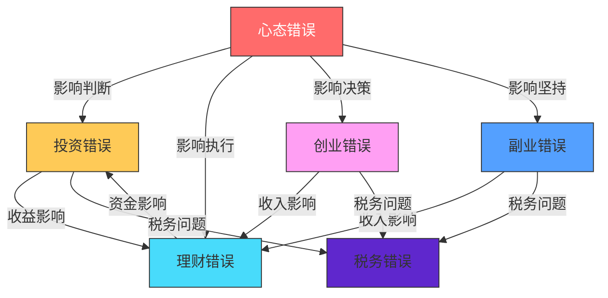

# 附录K：搞钱常见错误大全

> 本文收录了100个搞钱过程中最常见的错误，涵盖投资、理财、创业、副业、税务和心态六大类别。每个错误均包含严重度评级、发生频率、错误描述、常见表现、真实案例、正确做法、预防措施和相关错误交叉引用，帮助读者系统性地识别和避免这些"坑"。

---

## 导读：如何使用本文

### 严重度评级说明

本文对每个错误标注了**严重度**和**发生频率**，帮助你快速判断优先级：

| 标记 | 严重度 | 含义 | 典型后果 |
|------|--------|------|----------|
| 🔴🔴🔴 | **致命** | 可能导致倾家荡产或法律风险 | 本金归零、负债累累、刑事追诉 |
| 🔴🔴 | **严重** | 造成重大财务损失或长期影响 | 损失年收入以上、信用受损、错失重大机会 |
| 🔴 | **中等** | 造成一定损失但可恢复 | 损失数月收入、效率低下、发展受限 |
| 🟡 | **轻微** | 影响效率或收益，但不致命 | 少赚了一些钱、多花了一些冤枉钱 |

| 标记 | 频率 | 含义 |
|------|------|------|
| ⭐⭐⭐ | 极高 | 超过60%的人犯过此错 |
| ⭐⭐ | 高 | 约30-60%的人犯过此错 |
| ⭐ | 中 | 约10-30%的人犯过此错 |

### 错误关联图

搞钱错误不是孤立的，它们往往相互关联、互为因果。以下是六大类别之间的典型关联关系：



> **核心洞察**：心态是一切错误的根源。追涨杀跌（投资错误）的根源是损失厌恶和从众心理（心态错误）；过度消费（理财错误）的根源是盲目攀比（心态错误）；急于求成（创业错误）的根源是过度乐观（心态错误）。因此，本文将"心态错误"放在最后，但**建议你最先阅读**。

### 快速自检评分表

在阅读之前，先给自己做一次"搞钱健康体检"。对以下60个关键问题回答"是"或"否"，统计每个类别的得分：

**投资维度（0-10分，得分越高越健康）**
1. 我有明确的买入和卖出规则 ✅+1
2. 我的单只股票持仓不超过总资产的10% ✅+1
3. 我只用闲钱投资，从不借钱炒股 ✅+1
4. 我每笔交易都有书面的分析记录 ✅+1
5. 我设置了止损线并严格执行 ✅+1
6. 我了解自己持有资产的基本面 ✅+1
7. 我的交易频率低于每月一次 ✅+1
8. 我有明确的资产配置方案 ✅+1
9. 我不听消息炒股，有独立判断能力 ✅+1
10. 我定期复盘投资表现 ✅+1

**理财维度（0-10分）**
1. 我有记账习惯并知道每月支出结构 ✅+1
2. 我有3-6个月生活费的应急基金 ✅+1
3. 我有完善的保险保障 ✅+1
4. 我每月先储蓄后消费 ✅+1
5. 我了解复利效应并有长期投资计划 ✅+1
6. 我有明确的财务目标（1年/5年/10年） ✅+1
7. 我不为面子消费 ✅+1
8. 我了解自己的信用状况 ✅+1
9. 我有退休规划 ✅+1
10. 我每年做财务体检 ✅+1

**创业维度（0-10分）**
1. 我在创业前做了需求验证 ✅+1
2. 我有清晰的商业模式 ✅+1
3. 我关注现金流甚于利润 ✅+1
4. 我做过竞品分析 ✅+1
5. 我有合理的股权结构 ✅+1
6. 我了解相关法律法规 ✅+1
7. 我有风险管理预案 ✅+1
8. 我用数据驱动决策 ✅+1
9. 我有系统化的获客策略 ✅+1
10. 我重视客户反馈 ✅+1

**副业维度（0-10分）**
1. 我的副业能发挥我的核心技能 ✅+1
2. 我的副业不影响主业表现 ✅+1
3. 我计算过副业的实际时薪 ✅+1
4. 我有书面合同保护自己 ✅+1
5. 我的副业收入来源不单一 ✅+1
6. 我在建立个人品牌 ✅+1
7. 我的副业有长期积累效应 ✅+1
8. 我按时申报副业收入的税款 ✅+1
9. 我核算过副业的隐性成本 ✅+1
10. 我定期复盘优化副业策略 ✅+1

**税务维度（0-10分）**
1. 我了解个税专项附加扣除政策 ✅+1
2. 我按时完成年度汇算清缴 ✅+1
3. 我保存了所有税务凭证 ✅+1
4. 我个人财务和企业财务严格分开 ✅+1
5. 我不做虚开发票等违法行为 ✅+1
6. 我了解自己适用的最优纳税身份 ✅+1
7. 我每年做税务规划 ✅+1
8. 我定期进行税务自查 ✅+1
9. 我了解投资相关的税务规定 ✅+1
10. 我知道海外收入的申报义务 ✅+1

**心态维度（0-10分）**
1. 我能接受"慢慢变富"的理念 ✅+1
2. 我不盲目攀比他人的财富 ✅+1
3. 我能理性面对投资亏损 ✅+1
4. 我有明确的财务目标和行动计划 ✅+1
5. 我定期反思和复盘自己的决策 ✅+1
6. 我持续学习理财和投资知识 ✅+1
7. 我能接受不确定性 ✅+1
8. 我不因沉没成本影响决策 ✅+1
9. 我知道就去做，不拖延 ✅+1
10. 我把健康放在赚钱之前 ✅+1

**评分解读**：

| 总分 | 评级 | 说明 |
|------|------|------|
| 50-60 | 🟢 优秀 | 你已经建立了成熟的搞钱体系，本文可以帮你查漏补缺 |
| 35-49 | 🟡 良好 | 你有一定基础，但存在明显短板，重点阅读低分的类别 |
| 20-34 | 🟠 警告 | 你正在犯多个严重错误，建议认真阅读并立即行动 |
| 0-19 | 🔴 危险 | 你的搞钱方式存在重大风险，请从头到尾认真阅读本文 |

---

## 一、投资错误（共20个）

> 投资错误是最直接导致财富缩水的错误类型。据统计，A股市场中约70%的散户长期处于亏损状态，其中绝大多数亏损源于本节所述的常见错误。理解这些错误的底层逻辑，比学会任何投资技巧都重要。

***

### 错误1：追涨杀跌 🔴🔴🔴 ⭐⭐⭐

**错误描述：** 看到某只股票或资产价格上涨就急于买入，下跌时又恐慌性卖出，完全被市场情绪牵着走。

**为什么这个错误如此致命：** 追涨杀跌的本质是"高买低卖"，与投资的基本原则完全相反。行为金融学研究表明，人类大脑对损失的敏感度是对收益的2.5倍（前景理论），这导致投资者在下跌时过度恐慌、上涨时过度贪婪，形成系统性的亏损模式。

**常见表现：**
- 某股票连续涨停几天后才开始关注并买入
- 买入后稍有下跌就恐慌性抛售
- 频繁查看账户，情绪随涨跌剧烈波动
- 在牛市高点大量入场，在熊市低点割肉离场
- 用"这次不一样"来合理化自己的追涨行为

**真实案例：** 2015年A股牛市期间，大量散户在5000点以上追涨入场，很多人甚至加了杠杆。当市场从5178点暴跌至2850点时，这些追涨者损失惨重。一位杭州的投资者小王，在牛市末期投入80万元（其中30万是信用卡套现），短短两个月亏损超过60万，还背负了信用卡债务。2021年初"抱团股"行情中，同样的故事再次上演——大量投资者在茅台2600元、宁德时代690元时追入，随后跌幅超过50%。

**数据佐证：** 某大型券商内部统计显示，在2015年牛市中，持仓成本在4500点以上的投资者占比达42%，而这些投资者的平均亏损率为58%。

**正确做法：**
- 制定明确的买入和卖出计划，不被短期波动影响
- 学会估值，在价格低于内在价值时买入（参考本附录错误10"低买高卖的幻想"）
- 采用定投策略，分散买入时间点
- 设定合理的止盈止损线并严格执行
- 在市场极度恐慌时逆向思考："现在是该恐惧还是该贪婪？"

**预防措施：** 每次交易前写下买入/卖出理由，事后复盘。避免在情绪激动时做交易决策，给自己设置24小时冷静期。将"不追涨杀跌"写在交易软件的备注里。

**相关错误：** [错误6：不设止损](#错误6不设止损) | [错误13：从不止盈](#错误13从不止盈) | [错误85：损失厌恶](#错误85损失厌恶) | [错误86：从众心理](#错误86从众心理)

**诊断清单：** 你是否在追涨杀跌？
- [ ] 过去一年中，你是否在某只股票连续上涨3天以上后买入？
- [ ] 你是否在持有股票下跌10%以上时恐慌性卖出？
- [ ] 你的交易决策是否主要受市场情绪驱动？
- [ ] 你是否经常在卖出后发现卖在了最低点？

如果以上4个问题有2个以上回答"是"，你很可能正在追涨杀跌。

***

### 错误2：频繁交易 🔴🔴 ⭐⭐⭐

**错误描述：** 短期内大量买卖，试图通过频繁操作获取超额收益，实际上往往适得其反。

**为什么这个错误危害大：** 频繁交易的危害不仅仅是手续费，更重要的是它破坏了投资的纪律性，让情绪主导决策。诺贝尔经济学奖得主丹尼尔·卡尼曼的研究表明，交易频率与投资收益呈显著负相关——交易越多，亏得越多。

**常见表现：**
- 每天都要交易，一天不操作就手痒
- 总觉得自己能抓住每一个波段
- 交易成本（佣金、印花税）远超收益
- 账户资金越来越少，但交易笔数越来越多
- 把"炒股"当作一种消遣而非投资

**真实案例：** 某券商统计数据显示，交易频率最高的前10%客户，年化收益率平均为-15%，而交易频率最低的10%客户，年化收益率平均为+8%。两者相差23个百分点。深圳一位股民老张，2020年全年交易超过2000次（日均8次），手续费和印花税就花了3万多元，全年净亏损12万元。如果他同期买入并持有沪深300ETF，可以获得约27%的正收益。

**计算公式：** 假设每次交易的佣金为万分之三（双边），印花税为千分之一（卖出），则一年交易2000次的总成本约为：

```text
年交易成本 = 交易次数 × 平均每次交易金额 × (佣金率×2 + 印花税率)
           = 2000 × 5万 × (0.03%×2 + 0.1%)
           = 2000 × 5万 × 0.16%
           = 16万元
```

也就是说，你需要每年赚16万元才能覆盖交易成本。

**正确做法：**
- 减少交易频率，一年交易3-5次足矣
- 每笔交易前问自己：这笔交易的理由是什么？预期持有期多长？
- 将注意力从盯盘转移到学习和研究上
- 采用"买入并持有"的长期投资策略
- 设定每年的最大交易次数上限（如12次）

**预防措施：** 卸载手机上的行情软件，改为每周或每月查看一次。设置交易冷却期，每笔交易之间至少间隔一周。将交易权限密码设置为复杂字符串并写在纸上锁起来，增加交易的"摩擦成本"。

**相关错误：** [错误1：追涨杀跌](#错误1追涨杀跌) | [错误7：忽视交易成本](#错误7忽视交易成本) | [错误8：过度关注短期波动](#错误8过度关注短期波动) | [错误11：迷信技术分析](#错误11迷信技术分析)

***

### 错误3：不分散投资 🔴🔴🔴 ⭐⭐⭐

**错误描述：** 将全部资金集中在单一资产或少数几只股票上，没有进行有效的分散化配置。

**为什么这个错误致命：** 现代投资组合理论（马科维茨，1952年诺贝尔经济学奖）证明，分散投资可以在不降低预期收益的情况下显著降低风险。不分散投资意味着你把所有鸡蛋放在一个篮子里，一旦篮子掉了，全部碎光。

**常见表现：**
- 只买一只股票，且是自己公司的股票（双重集中风险）
- 全仓押注某个行业或主题
- 把所有钱都放在银行存款或某一种理财产品中
- 因为某次集中投资赚了钱就更加坚信集中策略（幸存者偏差）
- 不了解"相关性"的概念，以为买几只同行业股票就是分散

**真实案例：** 某知名互联网公司员工，将90%的资产都持有本公司股票（包括股票期权和RSU）。2022年公司股价下跌70%，他的资产缩水超过60%。更糟糕的是，他还面临裁员风险——股价下跌往往伴随着公司裁员，这意味着他的收入来源和投资同时受到打击。还有一位投资者将全部积蓄200万买入某地产股，最终该股退市，几乎血本无归。

**分散投资的数学原理：** 假设每只股票的年波动率为30%，持有1只股票的组合波动率就是30%。但持有30只相关性为0.3的股票，组合波动率可以降到约15%。也就是说，分散投资可以在不降低预期收益的情况下，把风险降低一半。

| 持有股票数量 | 组合波动率（假设个股波动率30%，相关性0.3） | 风险降低幅度 |
|:---:|:---:|:---:|
| 1只 | 30% | 基准 |
| 5只 | 20.2% | -33% |
| 10只 | 17.8% | -41% |
| 20只 | 16.8% | -44% |
| 30只 | 16.4% | -45% |
| 50只 | 16.1% | -46% |

> 可以看出，持有20-30只股票基本可以实现充分分散。再多的边际收益很小。

**正确做法：**
- 资产配置至少覆盖3-5个不同类别（股票、债券、基金、房产、黄金等）
- 单只股票持仓不超过总资金的10%
- 跨行业、跨地域分散投资
- 定期再平衡，保持目标配置比例
- 不要把超过20%的资产放在自己工作的行业

**预防措施：** 制定书面的资产配置计划，明确每类资产的目标比例和上下限。每年至少检查一次是否偏离目标配置。如果公司给的股票/期权超过总资产的30%，制定计划逐步减持。

**相关错误：** [错误4：借钱炒股/加杠杆](#错误4借钱炒股加杠杆) | [错误19：不做资产配置](#错误19不做资产配置) | [错误14：盲目跟风名人投资](#错误14盲目跟风名人投资)

***

### 错误4：借钱炒股/加杠杆 🔴🔴🔴 ⭐⭐

**错误描述：** 通过借贷、融资融券等方式放大投资本金，期望获得更高收益，但同时也放大了风险。

**为什么这个错误致命：** 杠杆是一把双刃剑。它放大收益的同时也放大亏损。更重要的是，杠杆投资有"爆仓"的风险——当亏损达到一定比例时，会被强制平仓，不仅损失全部本金，还可能倒欠债务。这种亏损是"不可恢复"的，因为你已经失去了翻身的资本。

**常见表现：**
- 信用卡套现炒股
- 向亲友借钱投资
- 使用融资融券满仓操作
- 借消费贷、经营贷投入股市
- 使用场外配资（杠杆可达5-10倍）
- 用房贷、车贷的钱投资

**真实案例：** 2015年股灾期间，大量使用场外配资的投资者被强制平仓，不仅赔光本金，还背负巨额债务。一位上海白领通过5倍杠杆配资炒股，投入50万本金借了250万，股市下跌20%就被强平，本金全部亏光还倒欠配资公司钱。在2022年中概股暴跌中，使用杠杆抄底的投资者很多被"打穿"——股价下跌50%以上，100万本金变成0甚至负数。

**杠杆的数学效应：**

| 杠杆倍数 | 市场下跌10%时的亏损 | 市场下跌20%时的亏损 | 市场下跌30%时的亏损 |
|:---:|:---:|:---:|:---:|
| 1倍（无杠杆） | -10% | -20% | -30% |
| 2倍 | -20% | -40% | -60% |
| 3倍 | -30% | -60% | -90%（接近爆仓） |
| 5倍 | -50% | -100%（爆仓） | 倒欠债务 |

**正确做法：**
- 只用闲钱投资，即短期内不需要使用的资金
- 借贷资金用于提升自我或创业，而非投机
- 如果使用杠杆（如融资融券），控制在1.5倍以内，且有充足的备用资金
- 记住：杠杆在放大收益的同时，也同样放大亏损
- 永远不要用"借来的钱"投资高波动资产

**预防措施：** 在投资前确保有至少6个月的应急基金。制定铁律：绝不动用生活必需资金和借贷资金进行投资。将这条铁律写下来，贴在电脑旁边。

**相关错误：** [错误1：追涨杀跌](#错误1追涨杀跌) | [错误3：不分散投资](#错误3不分散投资) | [错误15：忽视流动性风险](#错误15忽视流动性风险) | [错误90：过度乐观](#错误90过度乐观)

***

### 错误5：听消息炒股 🔴🔴 ⭐⭐⭐

**错误描述：** 依赖所谓的"内部消息"、朋友推荐或网络小道消息进行投资决策，不做独立研究。

**为什么这个错误危害大：** 在金融市场中，信息有明确的层级。真正有价值的"内幕消息"（如果存在的话）永远不会传到普通散户耳朵里。传到你耳朵里的"消息"，要么是过时的信息，要么是有人故意散布的假消息，目的是让你接盘。

**常见表现：**
- 加入各种股票推荐群
- 听说某只股票要重组就立即买入
- 信任"股神"、"老师"的荐股
- 对消息来源不做任何验证
- 轻信朋友的"确定性"推荐

**真实案例：** 某微信群群主每天推荐股票，群友跟风买入，结果该群主实际是在"割韭菜"——提前买入后推荐给群友（即"抢帽子"交易），等股价上涨后自己卖出获利。跟风的群友最终平均亏损30%以上。这种行为在中国属于违法行为，已有多起判例。2023年，某知名财经博主因操纵证券市场被判处有期徒刑三年，并处罚金500万元。

**"消息"的传播链条分析：**


> 当消息传到你耳朵里时，最早知道消息的人可能已经准备卖出获利了。

**正确做法：**
- 养成独立研究的习惯，学会看财报和分析行业
- 对任何消息都要持怀疑态度，多方验证
- 记住：如果消息已经传到你耳朵里，往往已经晚了
- 只投资自己能理解的公司和行业
- 建立自己的投资分析框架（如：行业分析→公司分析→估值分析→买入时机）

**预防措施：** 退出所有荐股群，取关所有荐股博主。建立自己的投资分析框架，每笔投资决策必须有书面的分析报告。

**相关错误：** [错误1：追涨杀跌](#错误1追涨杀跌) | [错误86：从众心理](#错误86从众心理) | [错误14：盲目跟风名人投资](#错误14盲目跟风名人投资) | [错误9：不了解自己买的是什么](#错误9不了解自己买的是什么)

***

### 错误6：不设止损 🔴🔴🔴 ⭐⭐⭐

**错误描述：** 买入股票后不设置止损线，任由亏损扩大，总幻想会涨回来。

**为什么这个错误致命：** 不设止损的最大危害是让小亏变成大亏，大亏变成巨亏。从数学角度看，亏损50%需要上涨100%才能回本，亏损80%需要上涨400%才能回本。越亏越深，回本的难度呈指数级增长。

**亏损与回本的数学关系：**

| 亏损幅度 | 回本所需涨幅 | 难度系数 |
|:---:|:---:|:---:|
| -10% | +11.1% | 1.1x |
| -20% | +25% | 1.3x |
| -30% | +42.9% | 1.4x |
| -50% | +100% | 2x |
| -70% | +233% | 3.3x |
| -80% | +400% | 5x |
| -90% | +900% | 10x |

**常见表现：**
- 亏损后安慰自己"只是浮亏，不卖就没亏"
- 从盈利持有到亏损，再从小亏变成大亏
- 总觉得"再等等就会涨回来"
- 深套后选择"装死"不看账户
- 不愿意承认自己的判断错误

**真实案例：** 2007年高点买入中国石油的投资者，如果不止损，到2024年仍未回本，17年时间亏损超过80%。一位投资者在48元买入中石油，一路持有到只剩7元多，40多万变成不到8万。这个案例的残酷之处在于：即使投资者有足够的耐心等待17年，依然无法回本。止损虽然痛苦，但可以保存实力等待下一个机会。

**正确做法：**
- 买入前就确定止损位（如亏损8%-10%）
- 使用技术分析确定关键支撑位作为止损参考
- 止损后冷静分析原因，而非急于翻本
- 记住：止损是为了保护本金，留得青山在，不怕没柴烧
- 区分"暂时的波动"和"基本面恶化"——前者可以承受，后者必须止损

**预防措施：** 每笔交易必须在买入时就设好止损价，可以使用券商的条件单功能自动执行。建立交易日志，记录每笔止损的原因和反思。

**相关错误：** [错误1：追涨杀跌](#错误1追涨杀跌) | [错误13：从不止盈](#错误13从不止盈) | [错误20：沉没成本影响投资决策](#错误20投资决策受到沉没成本影响) | [错误85：损失厌恶](#错误85损失厌恶)

***

### 错误7：忽视交易成本 🔴 ⭐⭐⭐

**错误描述：** 在投资决策时不考虑佣金、印花税、管理费、申购赎回费等各种费用的侵蚀作用。

**为什么这个错误容易被忽视：** 交易成本是"隐形杀手"——每次交易的费用看起来很少（万分之几），但日积月累会非常可观。巴菲特曾说："成本是投资收益的天敌。"

**各类交易成本详解：**

| 费用类型 | 典型费率 | 支付频率 | 影响 |
|----------|----------|----------|------|
| 股票佣金 | 万1-万3（双向） | 每笔交易 | 频繁交易时成本很高 |
| 印花税 | 千分之一（卖出） | 每笔卖出 | A股特有的成本 |
| 基金申购费 | 0-1.5% | 买入时 | 第三方平台通常打1折 |
| 基金赎回费 | 0-1.5% | 卖出时 | 持有时间越短费用越高 |
| 基金管理费 | 0.15%-1.5%/年 | 每日从净值扣除 | 主动基金远高于指数基金 |
| 基金托管费 | 0.05%-0.25%/年 | 每日从净值扣除 | 容易被忽视 |

**真实案例：** 一位投资者10年间交易基金的总申购赎回费高达15万元，而同期基金投资收益仅为12万元。如果他选择低费率的指数基金并长期持有，交易成本可以降低90%以上。另一位投资者买了管理费1.5%的主动基金，持有10年仅管理费就扣掉了15%的本金，而该基金的累计收益仅为20%，实际到手收益只有5%。

**正确做法：**
- 选择佣金较低的券商（目前最低可到万1）
- 基金投资优先选择低费率的指数基金（管理费0.5%以下）
- 减少交易频率，长期持有
- 定期统计自己的交易成本
- 对比不同平台的费率，选择最优惠的

**预防措施：** 开户前货比三家，选择佣金最低的券商。基金投资优先选择ETF或指数基金，管理费通常只有主动基金的1/3。

**相关错误：** [错误2：频繁交易](#错误2频繁交易) | [错误27：盲目追求高收益理财产品](#错误27盲目追求高收益理财产品)

**不同投资方式的年化成本对比（以10万元为例）：**

| 投资方式 | 年化管理费 | 年交易成本（假设年换手200%） | 年总成本 | 10年累计成本 |
|----------|-----------|---------------------------|---------|-------------|
| 主动基金（高换手） | 1.5% = 1500元 | 申购赎回约2000元 | 3500元 | 3.5万元 |
| 指数基金（低换手） | 0.2% = 200元 | 长期持有约0元 | 200元 | 2000元 |
| ETF（自己操作） | 0.15% = 150元 | 佣金约300元 | 450元 | 4500元 |

> 选择低成本的投资方式，10年可以省下3万元以上的费用，这本身就是一种"收益"。

***

### 错误8：过度关注短期波动 🔴 ⭐⭐⭐

**错误描述：** 每天盯盘，被短期价格波动严重影响情绪和判断，忽略了长期趋势。

**为什么这个错误危害大：** 股票市场短期是"投票机"（受情绪驱动），长期是"称重机"（受基本面驱动）。过度关注短期波动，等于在噪音中做决策。更严重的是，频繁查看账户会导致"短视损失厌恶"——研究表明，每天查看账户的投资者比每月查看的投资者承受的心理压力大3倍以上。

**查看频率与心理压力的关系：**

| 查看频率 | 遇到亏损的概率 | 心理影响 |
|----------|---------------|---------|
| 每天 | 约46%（随机涨跌） | 极高焦虑 |
| 每周 | 约39% | 高焦虑 |
| 每月 | 约33% | 中等焦虑 |
| 每季度 | 约28% | 低焦虑 |
| 每年 | 约25% | 几乎无焦虑 |

> 查看频率越高，遇到亏损的概率越大，心理压力也越大。

**常见表现：**
- 每天看盘超过2小时
- 股价每波动1%就焦虑不安
- 因为一两天的涨跌就改变长期策略
- 失眠、食欲不振等因投资引起的身体症状
- 开盘时间无法集中精力工作

**真实案例：** 一位退休老人每天盯盘8小时以上，因为股票波动导致血压升高，最终住院治疗。而他的邻居采用定投策略，从不看盘，同期收益反而更高。哈佛大学的一项研究发现，减少查看投资账户频率的投资者，其投资收益平均提高了12%，因为他们不会在恐慌时做出冲动决策。

**正确做法：**
- 设定固定的查看频率（如每周一次）
- 关注公司基本面而非短期股价
- 将投资视为长期事业，而非短期博弈
- 培养投资以外的兴趣爱好
- 设定"投资检查日"（如每周日晚上），其他时间不看盘

**预防措施：** 删除手机上的行情App，只在电脑上查看。设置每周固定的"投资检查日"，其他时间不看盘。

**相关错误：** [错误2：频繁交易](#错误2频繁交易) | [错误1：追涨杀跌](#错误1追涨杀跌) | [错误94：不接受不确定性](#错误94不接受不确定性)

***

### 错误9：不了解自己买的是什么 🔴🔴 ⭐⭐

**错误描述：** 在不理解投资标的的情况下盲目买入，完全不知道钱投到了哪里。

**为什么这个错误危害大：** 巴菲特的投资第一原则是"不要亏损"，第二原则是"不要忘记第一原则"。而避免亏损的前提是理解你买的是什么。如果你不理解一个投资产品，你就无法判断它的风险，也无法在市场波动时做出理性决策。

**常见表现：**
- 看到基金名字高大上就买（如"量子科技""人工智能"主题基金）
- 不知道股票背后的公司是做什么的
- 被复杂的金融产品名称迷惑
- 无法用简单语言解释自己的投资逻辑
- 不了解产品的底层资产和运作机制

**真实案例：** 2008年金融危机前，很多投资者购买了自己完全不理解的复杂衍生品（如CDO、CDS），结果损失惨重。国内也有投资者购买结构化理财产品，以为是"保本"，实际亏损了30%。2022年，某银行的一款"稳健型"理财产品亏损超过20%，很多投资者表示"完全没想到稳健型也会亏"。

**"能力圈"测试：** 在投资任何产品之前，问自己以下问题：
1. 这个产品投资的是什么？（底层资产）
2. 它是怎么赚钱的？（盈利模式）
3. 它可能在什么情况下亏损？（风险因素）
4. 它的费用是多少？（成本结构）
5. 如果市场下跌30%，它会怎样？（极端情况）

如果以上5个问题中有2个以上无法回答，说明这个产品超出了你的能力圈。

**正确做法：**
- 只投资自己能理解的产品
- 投资前阅读产品说明书和招募说明书
- 学习基础的金融知识
- 对看不懂的产品坚决说"不"
- 建立自己的"能力圈清单"——明确自己懂什么、不懂什么

**预防措施：** 建立投资检查清单，其中第一条就是"我是否理解这个投资标的？"如果不能用一句话说清楚投资逻辑，就不要买。

**相关错误：** [错误5：听消息炒股](#错误5听消息炒股) | [错误18：被高收益诱惑](#错误18被高收益诱惑) | [错误27：盲目追求高收益理财产品](#错误27盲目追求高收益理财产品)

***

### 错误10：被"低买高卖"的幻想迷惑 🔴🔴 ⭐⭐⭐

**错误描述：** 以为自己能精准预测市场的最低点和最高点，追求完美时机。

**为什么这个错误危害大：** 精准择时是一个"不可能完成的任务"。即使是华尔街最顶级的对冲基金经理，也无法持续准确预测市场短期走势。追求完美时机的结果往往是：等待的过程中错过了大段行情，最终在更差的价格入场。

**常见表现：**
- 总想等到"最低点"再买入
- 卖出后看到继续涨就后悔
- 反复计算"如果当时买了/卖了会怎样"
- 因为追求完美时机而错过大段行情
- 不断推迟投资计划，等待"更好的时机"

**真实案例：** 2020年3月全球股市暴跌，很多投资者觉得"还会更低"没有入场，结果错过了之后两年的大牛市。一位投资者等待沪深300跌破3000点再买入，结果指数从3500直接涨到5900，等他入场时已经是高位。错过底部的代价有多大？如果在2020年3月23日（标普500低点2237点）投入10万美元，到2024年底可以增长到约25万美元。而等待"更低点"的投资者，可能至今还在等待。

**"择时"的数学困境：** 假设股市年均上涨10%，但其中有几天的大幅上涨贡献了大部分收益。如果错过了每年最好的5个交易日，年化收益会从10%降到4%。如果错过了最好的10个交易日，年化收益会降到1%。这意味着，择时不仅要卖对，还要买对——两次都对的概率非常低。

| 策略 | 10万美元20年后的价值（假设年化10%） |
|------|-----------------------------------|
| 始终持有（不择时） | 67.3万美元 |
| 错过每年最好的5天 | 26.5万美元 |
| 错过每年最好的10天 | 10.8万美元 |
| 错过每年最好的20天 | 1.8万美元 |

**正确做法：**
- 采用分批买入策略，不要试图抄底
- 接受"买不到最低、卖不到最高"的现实
- 关注估值区间而非精确点位
- 使用定投淡化择时的重要性
- 设定一个"足够好"的入场标准，而非"完美"的标准

**预防措施：** 设置自动定投计划，消除人为择时的干扰。将目标设定为"买在合理区间"而非"买在最低点"。

**相关错误：** [错误1：追涨杀跌](#错误1追涨杀跌) | [错误92：完美主义](#错误92完美主义) | [错误97：不行动](#错误97不行动)

