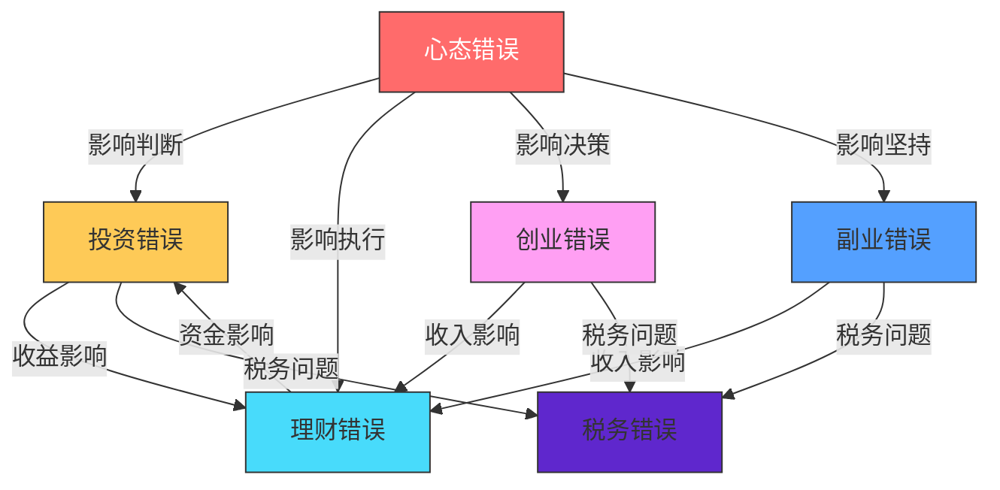

# 附录K：搞钱常见错误大全

> 本文收录了100个搞钱过程中最常见的错误，涵盖投资、理财、创业、副业、税务和心态六大类别。每个错误均包含严重度评级、发生频率、错误描述、常见表现、真实案例、正确做法、预防措施和相关错误交叉引用，帮助读者系统性地识别和避免这些"坑"。

---

## 导读：如何使用本文

### 严重度评级说明

本文对每个错误标注了**严重度**和**发生频率**，帮助你快速判断优先级：

| 标记 | 严重度 | 含义 | 典型后果 |
|------|--------|------|----------|
| 🔴🔴🔴 | **致命** | 可能导致倾家荡产或法律风险 | 本金归零、负债累累、刑事追诉 |
| 🔴🔴 | **严重** | 造成重大财务损失或长期影响 | 损失年收入以上、信用受损、错失重大机会 |
| 🔴 | **中等** | 造成一定损失但可恢复 | 损失数月收入、效率低下、发展受限 |
| 🟡 | **轻微** | 影响效率或收益，但不致命 | 少赚了一些钱、多花了一些冤枉钱 |

| 标记 | 频率 | 含义 |
|------|------|------|
| ⭐⭐⭐ | 极高 | 超过60%的人犯过此错 |
| ⭐⭐ | 高 | 约30-60%的人犯过此错 |
| ⭐ | 中 | 约10-30%的人犯过此错 |

### 错误关联图

搞钱错误不是孤立的，它们往往相互关联、互为因果。以下是六大类别之间的典型关联关系：



> **核心洞察**：心态是一切错误的根源。追涨杀跌（投资错误）的根源是损失厌恶和从众心理（心态错误）；过度消费（理财错误）的根源是盲目攀比（心态错误）；急于求成（创业错误）的根源是过度乐观（心态错误）。因此，本文将"心态错误"放在最后，但**建议你最先阅读**。

### 快速自检评分表

在阅读之前，先给自己做一次"搞钱健康体检"。对以下60个关键问题回答"是"或"否"，统计每个类别的得分：

**投资维度（0-10分，得分越高越健康）**
1. 我有明确的买入和卖出规则 ✅+1
2. 我的单只股票持仓不超过总资产的10% ✅+1
3. 我只用闲钱投资，从不借钱炒股 ✅+1
4. 我每笔交易都有书面的分析记录 ✅+1
5. 我设置了止损线并严格执行 ✅+1
6. 我了解自己持有资产的基本面 ✅+1
7. 我的交易频率低于每月一次 ✅+1
8. 我有明确的资产配置方案 ✅+1
9. 我不听消息炒股，有独立判断能力 ✅+1
10. 我定期复盘投资表现 ✅+1

**理财维度（0-10分）**
1. 我有记账习惯并知道每月支出结构 ✅+1
2. 我有3-6个月生活费的应急基金 ✅+1
3. 我有完善的保险保障 ✅+1
4. 我每月先储蓄后消费 ✅+1
5. 我了解复利效应并有长期投资计划 ✅+1
6. 我有明确的财务目标（1年/5年/10年） ✅+1
7. 我不为面子消费 ✅+1
8. 我了解自己的信用状况 ✅+1
9. 我有退休规划 ✅+1
10. 我每年做财务体检 ✅+1

**创业维度（0-10分）**
1. 我在创业前做了需求验证 ✅+1
2. 我有清晰的商业模式 ✅+1
3. 我关注现金流甚于利润 ✅+1
4. 我做过竞品分析 ✅+1
5. 我有合理的股权结构 ✅+1
6. 我了解相关法律法规 ✅+1
7. 我有风险管理预案 ✅+1
8. 我用数据驱动决策 ✅+1
9. 我有系统化的获客策略 ✅+1
10. 我重视客户反馈 ✅+1

**副业维度（0-10分）**
1. 我的副业能发挥我的核心技能 ✅+1
2. 我的副业不影响主业表现 ✅+1
3. 我计算过副业的实际时薪 ✅+1
4. 我有书面合同保护自己 ✅+1
5. 我的副业收入来源不单一 ✅+1
6. 我在建立个人品牌 ✅+1
7. 我的副业有长期积累效应 ✅+1
8. 我按时申报副业收入的税款 ✅+1
9. 我核算过副业的隐性成本 ✅+1
10. 我定期复盘优化副业策略 ✅+1

**税务维度（0-10分）**
1. 我了解个税专项附加扣除政策 ✅+1
2. 我按时完成年度汇算清缴 ✅+1
3. 我保存了所有税务凭证 ✅+1
4. 我个人财务和企业财务严格分开 ✅+1
5. 我不做虚开发票等违法行为 ✅+1
6. 我了解自己适用的最优纳税身份 ✅+1
7. 我每年做税务规划 ✅+1
8. 我定期进行税务自查 ✅+1
9. 我了解投资相关的税务规定 ✅+1
10. 我知道海外收入的申报义务 ✅+1

**心态维度（0-10分）**
1. 我能接受"慢慢变富"的理念 ✅+1
2. 我不盲目攀比他人的财富 ✅+1
3. 我能理性面对投资亏损 ✅+1
4. 我有明确的财务目标和行动计划 ✅+1
5. 我定期反思和复盘自己的决策 ✅+1
6. 我持续学习理财和投资知识 ✅+1
7. 我能接受不确定性 ✅+1
8. 我不因沉没成本影响决策 ✅+1
9. 我知道就去做，不拖延 ✅+1
10. 我把健康放在赚钱之前 ✅+1

**评分解读**：

| 总分 | 评级 | 说明 |
|------|------|------|
| 50-60 | 🟢 优秀 | 你已经建立了成熟的搞钱体系，本文可以帮你查漏补缺 |
| 35-49 | 🟡 良好 | 你有一定基础，但存在明显短板，重点阅读低分的类别 |
| 20-34 | 🟠 警告 | 你正在犯多个严重错误，建议认真阅读并立即行动 |
| 0-19 | 🔴 危险 | 你的搞钱方式存在重大风险，请从头到尾认真阅读本文 |

---

## 一、投资错误（共20个）

> 投资错误是最直接导致财富缩水的错误类型。据统计，A股市场中约70%的散户长期处于亏损状态，其中绝大多数亏损源于本节所述的常见错误。理解这些错误的底层逻辑，比学会任何投资技巧都重要。

***

### 错误1：追涨杀跌 🔴🔴🔴 ⭐⭐⭐

**错误描述：** 看到某只股票或资产价格上涨就急于买入，下跌时又恐慌性卖出，完全被市场情绪牵着走。

**为什么这个错误如此致命：** 追涨杀跌的本质是"高买低卖"，与投资的基本原则完全相反。行为金融学研究表明，人类大脑对损失的敏感度是对收益的2.5倍（前景理论），这导致投资者在下跌时过度恐慌、上涨时过度贪婪，形成系统性的亏损模式。

**常见表现：**
- 某股票连续涨停几天后才开始关注并买入
- 买入后稍有下跌就恐慌性抛售
- 频繁查看账户，情绪随涨跌剧烈波动
- 在牛市高点大量入场，在熊市低点割肉离场
- 用"这次不一样"来合理化自己的追涨行为

**真实案例：** 2015年A股牛市期间，大量散户在5000点以上追涨入场，很多人甚至加了杠杆。当市场从5178点暴跌至2850点时，这些追涨者损失惨重。一位杭州的投资者小王，在牛市末期投入80万元（其中30万是信用卡套现），短短两个月亏损超过60万，还背负了信用卡债务。2021年初"抱团股"行情中，同样的故事再次上演——大量投资者在茅台2600元、宁德时代690元时追入，随后跌幅超过50%。

**数据佐证：** 某大型券商内部统计显示，在2015年牛市中，持仓成本在4500点以上的投资者占比达42%，而这些投资者的平均亏损率为58%。

**正确做法：**
- 制定明确的买入和卖出计划，不被短期波动影响
- 学会估值，在价格低于内在价值时买入
- 采用定投策略，分散买入时间点
- 设定合理的止盈止损线并严格执行
- 在市场极度恐慌时逆向思考："现在是该恐惧还是该贪婪？"

**预防措施：** 每次交易前写下买入/卖出理由，事后复盘。避免在情绪激动时做交易决策，给自己设置24小时冷静期。将"不追涨杀跌"写在交易软件的备注里。

**相关错误：** [错误6：不设止损](#错误6不设止损) | [错误13：从不止盈](#错误13从不止盈) | [错误85：损失厌恶](#错误85损失厌恶) | [错误86：从众心理](#错误86从众心理)

**诊断清单：** 你是否在追涨杀跌？
- [ ] 过去一年中，你是否在某只股票连续上涨3天以上后买入？
- [ ] 你是否在持有股票下跌10%以上时恐慌性卖出？
- [ ] 你的交易决策是否主要受市场情绪驱动？
- [ ] 你是否经常在卖出后发现卖在了最低点？

如果以上4个问题有2个以上回答"是"，你很可能正在追涨杀跌。

***

### 错误2：频繁交易 🔴🔴 ⭐⭐⭐

**错误描述：** 短期内大量买卖，试图通过频繁操作获取超额收益，实际上往往适得其反。

**为什么这个错误危害大：** 频繁交易的危害不仅仅是手续费，更重要的是它破坏了投资的纪律性，让情绪主导决策。诺贝尔经济学奖得主丹尼尔·卡尼曼的研究表明，交易频率与投资收益呈显著负相关——交易越多，亏得越多。

**常见表现：**
- 每天都要交易，一天不操作就手痒
- 总觉得自己能抓住每一个波段
- 交易成本（佣金、印花税）远超收益
- 账户资金越来越少，但交易笔数越来越多
- 把"炒股"当作一种消遣而非投资

**真实案例：** 某券商统计数据显示，交易频率最高的前10%客户，年化收益率平均为-15%，而交易频率最低的10%客户，年化收益率平均为+8%。两者相差23个百分点。深圳一位股民老张，2020年全年交易超过2000次（日均8次），手续费和印花税就花了3万多元，全年净亏损12万元。如果他同期买入并持有沪深300ETF，可以获得约27%的正收益。

**计算公式：** 假设每次交易的佣金为万分之三（双边），印花税为千分之一（卖出），则一年交易2000次的总成本约为：

```text
年交易成本 = 交易次数 × 平均每次交易金额 × (佣金率×2 + 印花税率)
           = 2000 × 5万 × (0.03%×2 + 0.1%)
           = 2000 × 5万 × 0.16%
           = 16万元
```

也就是说，你需要每年赚16万元才能覆盖交易成本。

**正确做法：**
- 减少交易频率，一年交易3-5次足矣
- 每笔交易前问自己：这笔交易的理由是什么？预期持有期多长？
- 将注意力从盯盘转移到学习和研究上
- 采用"买入并持有"的长期投资策略
- 设定每年的最大交易次数上限（如12次）

**预防措施：** 卸载手机上的行情软件，改为每周或每月查看一次。设置交易冷却期，每笔交易之间至少间隔一周。将交易权限密码设置为复杂字符串并写在纸上锁起来，增加交易的"摩擦成本"。

**相关错误：** [错误1：追涨杀跌](#错误1追涨杀跌) | [错误7：忽视交易成本](#错误7忽视交易成本) | [错误8：过度关注短期波动](#错误8过度关注短期波动) | [错误11：迷信技术分析](#错误11迷信技术分析)

***

### 错误3：不分散投资 🔴🔴🔴 ⭐⭐⭐

**错误描述：** 将全部资金集中在单一资产或少数几只股票上，没有进行有效的分散化配置。

**为什么这个错误致命：** 现代投资组合理论（马科维茨，1952年诺贝尔经济学奖）证明，分散投资可以在不降低预期收益的情况下显著降低风险。不分散投资意味着你把所有鸡蛋放在一个篮子里，一旦篮子掉了，全部碎光。

**常见表现：**
- 只买一只股票，且是自己公司的股票（双重集中风险）
- 全仓押注某个行业或主题
- 把所有钱都放在银行存款或某一种理财产品中
- 因为某次集中投资赚了钱就更加坚信集中策略（幸存者偏差）
- 不了解"相关性"的概念，以为买几只同行业股票就是分散

**真实案例：** 某知名互联网公司员工，将90%的资产都持有本公司股票（包括股票期权和RSU）。2022年公司股价下跌70%，他的资产缩水超过60%。更糟糕的是，他还面临裁员风险——股价下跌往往伴随着公司裁员，这意味着他的收入来源和投资同时受到打击。还有一位投资者将全部积蓄200万买入某地产股，最终该股退市，几乎血本无归。

**分散投资的数学原理：** 假设每只股票的年波动率为30%，持有1只股票的组合波动率就是30%。但持有30只相关性为0.3的股票，组合波动率可以降到约15%。

| 持有股票数量 | 组合波动率 | 风险降低幅度 |
|:---:|:---:|:---:|
| 1只 | 30% | 基准 |
| 5只 | 20.2% | -33% |
| 10只 | 17.8% | -41% |
| 20只 | 16.8% | -44% |
| 30只 | 16.4% | -45% |
| 50只 | 16.1% | -46% |

> 持有20-30只股票基本可以实现充分分散。再多的边际收益很小。

**正确做法：**
- 资产配置至少覆盖3-5个不同类别（股票、债券、基金、房产、黄金等）
- 单只股票持仓不超过总资金的10%
- 跨行业、跨地域分散投资
- 定期再平衡，保持目标配置比例
- 不要把超过20%的资产放在自己工作的行业

**预防措施：** 制定书面的资产配置计划，明确每类资产的目标比例和上下限。每年至少检查一次是否偏离目标配置。

**相关错误：** [错误4：借钱炒股/加杠杆](#错误4借钱炒股加杠杆) | [错误19：不做资产配置](#错误19不做资产配置) | [错误14：盲目跟风名人投资](#错误14盲目跟风名人投资)

***

### 错误4：借钱炒股/加杠杆 🔴🔴🔴 ⭐⭐

**错误描述：** 通过借贷、融资融券等方式放大投资本金，期望获得更高收益，但同时也放大了风险。

**为什么这个错误致命：** 杠杆是一把双刃剑。它放大收益的同时也放大亏损。更重要的是，杠杆投资有"爆仓"的风险——当亏损达到一定比例时，会被强制平仓，不仅损失全部本金，还可能倒欠债务。

**常见表现：** 信用卡套现炒股、向亲友借钱投资、使用融资融券满仓操作、借消费贷/经营贷投入股市、使用场外配资（杠杆可达5-10倍）、用房贷/车贷的钱投资。

**真实案例：** 2015年股灾期间，大量使用场外配资的投资者被强制平仓。一位上海白领通过5倍杠杆配资炒股，投入50万本金借了250万，股市下跌20%就被强平，本金全部亏光还倒欠配资公司钱。

**杠杆的数学效应：**

| 杠杆倍数 | 市场下跌10% | 市场下跌20% | 市场下跌30% |
|:---:|:---:|:---:|:---:|
| 1倍（无杠杆） | -10% | -20% | -30% |
| 2倍 | -20% | -40% | -60% |
| 3倍 | -30% | -60% | -90%（接近爆仓） |
| 5倍 | -50% | -100%（爆仓） | 倒欠债务 |

**正确做法：** 只用闲钱投资；借贷资金用于提升自我或创业；如果使用杠杆控制在1.5倍以内；永远不要用"借来的钱"投资高波动资产。

**预防措施：** 在投资前确保有至少6个月的应急基金。制定铁律：绝不动用生活必需资金和借贷资金进行投资。

**相关错误：** [错误1：追涨杀跌](#错误1追涨杀跌) | [错误3：不分散投资](#错误3不分散投资) | [错误15：忽视流动性风险](#错误15忽视流动性风险)

***

### 错误5：听消息炒股 🔴🔴 ⭐⭐⭐

**错误描述：** 依赖所谓的"内部消息"、朋友推荐或网络小道消息进行投资决策，不做独立研究。

**为什么这个错误危害大：** 真正有价值的"内幕消息"永远不会传到普通散户耳朵里。传到你耳朵里的"消息"，要么是过时的信息，要么是有人故意散布的假消息，目的是让你接盘。

**常见表现：** 加入各种股票推荐群、听说某只股票要重组就立即买入、信任"股神""老师"的荐股、对消息来源不做任何验证。

**真实案例：** 某微信群群主每天推荐股票，群友跟风买入，结果该群主实际是在"割韭菜"——提前买入后推荐给群友（即"抢帽子"交易），等股价上涨后自己卖出获利。跟风的群友最终平均亏损30%以上。

**"消息"的传播链条：**


> 当消息传到你耳朵里时，最早知道消息的人可能已经准备卖出获利了。

**正确做法：** 养成独立研究的习惯；对任何消息都要持怀疑态度；只投资自己能理解的公司和行业；建立自己的投资分析框架。

**预防措施：** 退出所有荐股群，取关所有荐股博主。每笔投资决策必须有书面的分析报告。

**相关错误：** [错误1：追涨杀跌](#错误1追涨杀跌) | [错误86：从众心理](#错误86从众心理) | [错误14：盲目跟风名人投资](#错误14盲目跟风名人投资)

***

### 错误6：不设止损 🔴🔴🔴 ⭐⭐⭐

**错误描述：** 买入股票后不设置止损线，任由亏损扩大，总幻想会涨回来。

**为什么这个错误致命：** 不设止损的最大危害是让小亏变成大亏。从数学角度看，亏损50%需要上涨100%才能回本，亏损80%需要上涨400%才能回本。越亏越深，回本的难度呈指数级增长。

**亏损与回本的数学关系：**

| 亏损幅度 | 回本所需涨幅 | 难度系数 |
|:---:|:---:|:---:|
| -10% | +11.1% | 1.1x |
| -20% | +25% | 1.3x |
| -30% | +42.9% | 1.4x |
| -50% | +100% | 2x |
| -70% | +233% | 3.3x |
| -80% | +400% | 5x |
| -90% | +900% | 10x |

**常见表现：** 亏损后安慰自己"只是浮亏"、从盈利持有到亏损、总觉得"再等等就会涨回来"、深套后选择"装死"不看账户、不愿意承认自己的判断错误。

**真实案例：** 2007年高点买入中国石油的投资者，如果不止损，到2024年仍未回本，17年时间亏损超过80%。一位投资者在48元买入中石油，一路持有到只剩7元多，40多万变成不到8万。

**正确做法：**
- 买入前就确定止损位（如亏损8%-10%）
- 使用技术分析确定关键支撑位作为止损参考
- 止损后冷静分析原因，而非急于翻本
- 区分"暂时的波动"和"基本面恶化"——前者可以承受，后者必须止损

**预防措施：** 每笔交易必须在买入时就设好止损价，使用券商的条件单功能自动执行。

**相关错误：** [错误1：追涨杀跌](#错误1追涨杀跌) | [错误13：从不止盈](#错误13从不止盈) | [错误85：损失厌恶](#错误85损失厌恶)

***

### 错误7：忽视交易成本 🔴 ⭐⭐⭐

**错误描述：** 在投资决策时不考虑佣金、印花税、管理费、申购赎回费等各种费用的侵蚀作用。

**各类交易成本详解：**

| 费用类型 | 典型费率 | 支付频率 | 影响 |
|----------|----------|----------|------|
| 股票佣金 | 万1-万3（双向） | 每笔交易 | 频繁交易时成本很高 |
| 印花税 | 千分之一（卖出） | 每笔卖出 | A股特有的成本 |
| 基金申购费 | 0-1.5% | 买入时 | 第三方平台通常打1折 |
| 基金赎回费 | 0-1.5% | 卖出时 | 持有时间越短费用越高 |
| 基金管理费 | 0.15%-1.5%/年 | 每日从净值扣除 | 主动基金远高于指数基金 |

**真实案例：** 一位投资者10年间交易基金的总申购赎回费高达15万元，而同期基金投资收益仅为12万元。

**不同投资方式的年化成本对比（以10万元为例）：**

| 投资方式 | 年化管理费 | 年交易成本 | 年总成本 | 10年累计成本 |
|----------|-----------|-----------|---------|-------------|
| 主动基金（高换手） | 1500元 | 约2000元 | 3500元 | 3.5万元 |
| 指数基金（低换手） | 200元 | 约0元 | 200元 | 2000元 |
| ETF（自己操作） | 150元 | 约300元 | 450元 | 4500元 |

**正确做法：** 选择佣金最低的券商；基金投资优先选择低费率的指数基金；减少交易频率，长期持有；定期统计自己的交易成本。

**相关错误：** [错误2：频繁交易](#错误2频繁交易) | [错误27：盲目追求高收益理财产品](#错误27盲目追求高收益理财产品)

***

### 错误8：过度关注短期波动 🔴 ⭐⭐⭐

**错误描述：** 每天盯盘，被短期价格波动严重影响情绪和判断，忽略了长期趋势。

**查看频率与心理压力的关系：**

| 查看频率 | 遇到亏损的概率 | 心理影响 |
|----------|---------------|---------|
| 每天 | 约46% | 极高焦虑 |
| 每周 | 约39% | 高焦虑 |
| 每月 | 约33% | 中等焦虑 |
| 每季度 | 约28% | 低焦虑 |
| 每年 | 约25% | 几乎无焦虑 |

**常见表现：** 每天看盘超过2小时、股价每波动1%就焦虑不安、因为一两天的涨跌就改变长期策略、失眠/食欲不振等因投资引起的身体症状。

**正确做法：** 设定固定的查看频率（如每周一次）；关注公司基本面而非短期股价；培养投资以外的兴趣爱好。

**相关错误：** [错误2：频繁交易](#错误2频繁交易) | [错误1：追涨杀跌](#错误1追涨杀跌)

***

### 错误9：不了解自己买的是什么 🔴🔴 ⭐⭐

**错误描述：** 在不理解投资标的的情况下盲目买入，完全不知道钱投到了哪里。

**"能力圈"测试：** 在投资任何产品之前，问自己以下问题：
1. 这个产品投资的是什么？（底层资产）
2. 它是怎么赚钱的？（盈利模式）
3. 它可能在什么情况下亏损？（风险因素）
4. 它的费用是多少？（成本结构）
5. 如果市场下跌30%，它会怎样？（极端情况）

如果以上5个问题中有2个以上无法回答，说明这个产品超出了你的能力圈。

**正确做法：** 只投资自己能理解的产品；投资前阅读产品说明书；对看不懂的产品坚决说"不"。

**相关错误：** [错误5：听消息炒股](#错误5听消息炒股) | [错误18：被高收益诱惑](#错误18被高收益诱惑)

***

### 错误10：被"低买高卖"的幻想迷惑 🔴🔴 ⭐⭐⭐

**错误描述：** 以为自己能精准预测市场的最低点和最高点，追求完美时机。

**"择时"的数学困境：** 假设股市年均上涨10%，但其中有几天的大幅上涨贡献了大部分收益。如果错过了每年最好的5个交易日，年化收益会从10%降到4%。

| 策略 | 10万美元20年后的价值 |
|------|-----------------------------------|
| 始终持有（不择时） | 67.3万美元 |
| 错过每年最好的5天 | 26.5万美元 |
| 错过每年最好的10天 | 10.8万美元 |
| 错过每年最好的20天 | 1.8万美元 |

**正确做法：** 采用分批买入策略；接受"买不到最低、卖不到最高"的现实；使用定投淡化择时的重要性。

**相关错误：** [错误1：追涨杀跌](#错误1追涨杀跌) | [错误92：完美主义](#错误92完美主义) | [错误97：不行动](#错误97不行动)

***

### 错误11：迷信技术分析 🔴🔴 ⭐⭐

**错误描述：** 过度依赖K线形态、MACD、布林带等技术指标做投资决策，忽视基本面和宏观环境。

**为什么这个错误危害大：** 技术分析的本质是用历史价格预测未来，但金融市场并非物理定律。学术研究（如Fama的效率市场假说）表明，纯技术分析策略在扣除交易成本后很难持续跑赢大盘。

**常见表现：** 研究各种复杂的K线组合和指标形态、在技术面和基本面矛盾时只看技术面、用"金叉买入、死叉卖出"作为唯一交易信号。

**正确做法：** 将技术分析作为辅助工具而非决策核心；基本面决定"买什么"，技术面辅助"什么时候买"；理解技术分析的概率本质。

**相关错误：** [错误2：频繁交易](#错误2频繁交易) | [错误12：忽视基本面](#错误12忽视基本面)

***

### 错误12：忽视基本面 🔴🔴 ⭐⭐

**错误描述：** 买入股票时不研究公司的财务状况、行业地位、管理层质量等基本面因素。

**为什么这个错误危害大：** 股价短期受情绪驱动，但长期必然回归基本面。不关注基本面的投资者，就像不看航海图的船长。

**正确做法：** 养成阅读财报的习惯；了解行业竞争格局和趋势；关注管理层的言行一致性；使用PE、PB、ROE等估值指标；建立自己的基本面分析框架。

**预防措施：** 建立"投资必看清单"：营收增长率、净利润率、资产负债率、自由现金流、管理层持股比例。

**相关错误：** [错误11：迷信技术分析](#错误11迷信技术分析) | [错误9：不了解自己买的是什么](#错误9不了解自己买的是什么)

***

### 错误13：从不止盈 🔴🔴 ⭐⭐⭐

**错误描述：** 股票盈利后不舍得卖出，总觉得"还会涨"，结果利润回吐甚至由盈转亏。

**为什么这个错误危害大：** 很多投资者会严格执行止损（亏了就跑），但从不止盈（赚了不跑），导致"小亏小赚大坐过山车"。

**正确做法：** 买入时就设定止盈目标；采用"移动止盈"策略；达到止盈目标后分批卖出；定期评估持有的股票是否还值得持有。

**相关错误：** [错误6：不设止损](#错误6不设止损) | [错误1：追涨杀跌](#错误1追涨杀跌) | [错误85：损失厌恶](#错误85损失厌恶)

***

### 错误14：盲目跟风名人投资 🔴🔴 ⭐⭐

**错误描述：** 看到某位名人、大佬或基金经理买入某只股票就跟着买。

**为什么这个错误危害大：** 名人投资有三个致命信息差：持仓披露有延迟、资金量和信息渠道不同、可承受的亏损幅度不同。

**正确做法：** 名人投资可以作为研究参考，但不能作为买入依据；了解名人的投资逻辑，而非仅仅模仿其行为；建立自己的投资判断体系。

**相关错误：** [错误5：听消息炒股](#错误5听消息炒股) | [错误86：从众心理](#错误86从众心理)

***

### 错误15：忽视流动性风险 🔴🔴 ⭐

**错误描述：** 投资时不考虑资产的变现能力，把大量资金锁定在难以快速变现的资产中。

**为什么这个错误危害大：** 流动性是资产的"生命线"。当你急需用钱时，如果资产无法快速变现或变现时需要大幅折价，可能被迫在最差的时机卖出。

**正确做法：** 保持至少3-6个月生活费的高流动性资产；投资前确认资产的变现周期和条件；建立"流动性阶梯"。

**相关错误：** [错误4：借钱炒股/加杠杆](#错误4借钱炒股加杠杆) | [错误28：不留应急基金](#错误28不留应急基金)

***

### 错误16：把所有钱投入股市 🔴🔴 ⭐⭐

**错误描述：** 将几乎全部可投资资产都投入股票市场，没有其他资产类别作为缓冲。

**为什么这个错误危害大：** 股票是所有主流资产中波动性最高的类别之一。日本股市从1989年的38957点跌到2003年的7607点（跌80%），直到2024年才重回高点——整整35年。

**正确做法：** 根据年龄和风险承受能力配置股票比例；至少配置20%的低波动资产；保持5-10%的现金类资产。

**相关错误：** [错误3：不分散投资](#错误3不分散投资) | [错误19：不做资产配置](#错误19不做资产配置)

***

### 错误17：频繁更换投资策略 🔴 ⭐⭐

**错误描述：** 今天学价值投资、明天做趋势交易、后天搞量化对冲，频繁切换投资方法。

**为什么这个错误危害大：** 每种投资策略都有其适用的市场环境和需要忍受的"不适期"。频繁切换的结果是：你永远在"策略A最差的时候切换到策略B"。

**正确做法：** 选择一种适合自己的策略，至少坚持2-3年再评估；将策略的长期表现作为评估标准；记录每次策略切换的原因。

**相关错误：** [错误2：频繁交易](#错误2频繁交易) | [错误99：不复盘](#错误99不复盘)

***

### 错误18：被高收益诱惑 🔴🔴🔴 ⭐⭐

**错误描述：** 被"年化收益30%""稳赚不赔"等宣传语诱惑，投资了远超自己风险承受能力的高风险产品。

**为什么这个错误致命：** 金融学第一定律：高收益必然伴随高风险。P2P暴雷、庞氏骗局、非法集资——每年都有大量投资者因为贪图高收益而血本无归。

**识别高收益陷阱的"四个凡是"：**
1. 凡是承诺"保本高收益"的，一定是骗局
2. 凡是收益远超同类产品的，一定有你看不到的风险
3. 凡是催你"赶紧投、机会有限"的，一定是想让你来不及思考
4. 凡是"拉人头"有奖励的，很可能是庞氏结构

**正确做法：** 牢记"高收益=高风险"的铁律；只投资持牌金融机构的产品；将"不亏钱"放在"赚钱"之前。

**相关错误：** [错误27：盲目追求高收益理财产品](#错误27盲目追求高收益理财产品) | [错误89：急于求成](#错误89急于求成)

***

### 错误19：不做资产配置 🔴🔴 ⭐⭐

**错误描述：** 没有系统的资产配置方案，投资决策随意、碎片化。

**为什么这个错误危害大：** 诺贝尔经济学奖得主威廉·夏普的研究表明，投资收益的91.5%来自于资产配置，而择时和选股分别只贡献了1.8%和4.7%。

**资产配置的"核心-卫星"模型：**

| 配置层级 | 比例 | 目标 | 典型资产 |
|----------|------|------|----------|
| 核心资产 | 60-70% | 稳健增值 | 宽基指数基金、债券基金 |
| 卫星资产 | 20-30% | 博取超额收益 | 行业主题基金、个股 |
| 现金储备 | 5-10% | 应急和抄底 | 货币基金、活期存款 |

**相关错误：** [错误3：不分散投资](#错误3不分散投资) | [错误16：把所有钱投入股市](#错误16把所有钱投入股市)

***

### 错误20：投资决策受到沉没成本影响 🔴🔴 ⭐⭐

**错误描述：** 因为已经在某项投资上投入了大量时间和金钱，即使判断失误也不愿意止损退出。

**为什么这个错误危害大：** 沉没成本谬误让你基于"已经付出了多少"而非"未来能获得多少"来做决策。在投资中，这是导致深套和巨亏的头号杀手。

**正确做法：** 做决策时只考虑"如果现在重新选择，我还会投吗？"；忽略已投入的时间和金钱；建立"归零思维"。

**相关错误：** [错误6：不设止损](#错误6不设止损) | [错误85：损失厌恶](#错误85损失厌恶) | [错误93：沉没成本谬误](#错误93沉没成本谬误)

***

## 二、理财错误（共20个）

> 理财错误看似"小打小闹"，实则影响深远。一个人如果从25岁开始每月多存1000元并合理理财，到60岁可以积累超过200万元。而如果从25岁起就是"月光族"，到60岁可能一无所有。

***

### 错误21：不记账 🔴 ⭐⭐⭐

**错误描述：** 从不记录自己的收入和支出，不知道钱花到了哪里。

**为什么这个错误危害大：** 不记账就像不看地图开车。行为经济学研究表明，人类对自己消费的估计误差通常在30%-50%之间。你以为自己每月花5000元，实际可能花了8000元。

**真实案例：** 一位月薪2万的程序员，从不记账。在朋友建议下开始记账后发现：每月外卖花费3500元、奶茶咖啡800元、冲动购物2000元、订阅服务600元。仅这四项就占了月收入的35%。通过记账和针对性削减，他每月多存了4000元。

**正确做法：** 选择一款记账APP，每天花2分钟记录；至少区分"必要支出"和"想要支出"；每月底统计各类支出占比。

**相关错误：** [错误22：月光族/无储蓄](#错误22月光族无储蓄) | [错误23：过度消费/盲目攀比](#错误23过度消费盲目攀比)

***

### 错误22：月光族/无储蓄 🔴🔴 ⭐⭐⭐

**错误描述：** 每月收入全部花光，没有任何储蓄，处于"手停口停"的危险状态。

**为什么这个错误危害大：** 没有储蓄意味着你没有任何抗风险能力。更深远的影响是，你失去了利用复利效应积累财富的机会——30年时间里，每月存2000元并投资（年化8%），最终可以积累超过300万元。

**正确做法：** 采用"先储蓄后消费"原则：工资到账后先转走储蓄部分；设置自动转账：工资日自动将20%-30%转入储蓄账户；从"小额开始"：哪怕每月只存500元，也比0元强一万倍。

**预防措施：** 工资到账当天自动转走30%到不常用的储蓄账户。

**相关错误：** [错误21：不记账](#错误21不记账) | [错误28：不留应急基金](#错误28不留应急基金)

***

### 错误23：过度消费/盲目攀比 🔴🔴 ⭐⭐⭐

**错误描述：** 为了面子、社交压力或攀比心理而大量消费，购买远超自己实际需求和承受能力的商品。

**真实案例：** 一位刚工作两年的年轻人，月薪8000元，但为了在朋友圈维持"精致生活"的形象，每月花3000元在餐厅打卡、名牌服饰和网红产品上。一年下来不仅没有存款，还欠了信用卡2万元。而他的同学月薪也是8000元，但每月只花4000元，两年后积累了超过5万元。

**正确做法：** 区分"需要"和"想要"；建立"24小时冷静期"规则；减少社交媒体使用时间；将消费与个人目标挂钩。

**相关错误：** [错误33：被消费主义洗脑](#错误33被消费主义洗脑) | [错误96：盲目攀比](#错误96盲目攀比)

***

### 错误24：不买保险 🔴🔴🔴 ⭐⭐⭐

**错误描述：** 认为自己身体好、不会出事，拒绝购买任何保险保障。

**为什么这个错误致命：** 保险的本质是用小额确定的支出对冲大额不确定的风险。不买保险意味着你在"裸奔"。

**保险配置的"四大金刚"：**

| 保险类型 | 作用 | 建议保额 | 年保费参考 |
|----------|------|----------|-----------|
| 医疗险 | 报销医疗费用 | 200-400万 | 300-800元/年 |
| 重疾险 | 确诊即赔，弥补收入损失 | 年收入×3-5倍 | 3000-8000元/年 |
| 意外险 | 意外伤残/身故保障 | 50-100万 | 100-300元/年 |
| 定期寿险 | 身故保障，保护家人 | 房贷+子女教育费用 | 1000-3000元/年 |

**正确做法：** 优先配置医疗险和意外险；30岁前配置重疾险；有家庭负担的必须配置定期寿险；每年保费支出控制在家庭年收入的5%-10%。

**相关错误：** [错误38：不重视保险配置](#错误38不重视保险配置) | [错误100：忽视健康](#错误100忽视健康)

***

### 错误25：不做预算 🔴 ⭐⭐

**错误描述：** 没有每月的消费预算和支出计划，花钱随心所欲，月底总是超支。

**正确做法：** 采用"50/30/20"预算法则：50%必要支出、30%想要支出、20%储蓄投资；每月初制定当月预算；预留5%-10%的"弹性额度"应对意外支出。

**相关错误：** [错误21：不记账](#错误21不记账) | [错误22：月光族/无储蓄](#错误22月光族无储蓄)

***

### 错误26：忽视复利效应 🔴 ⭐⭐

**错误描述：** 不理解也不利用复利效应，把钱放在活期存款里，任由通货膨胀侵蚀购买力。

**复利的惊人力量：**

| 投资方式 | 月投入 | 年化收益 | 10年后 | 20年后 | 30年后 |
|----------|--------|----------|--------|--------|--------|
| 活期存款 | 2000元 | 0.2% | 24.5万 | 49.5万 | 75万 |
| 稳健理财 | 2000元 | 4% | 29.3万 | 73.5万 | 139万 |
| 指数基金 | 2000元 | 8% | 36.5万 | 117万 | 300万 |

> 同样每月投入2000元，30年后活期存款只有75万，而指数基金可以达到300万——差距是4倍。

**正确做法：** 学习复利的基本原理；从现在开始投资，哪怕金额很小；使用72法则快速估算。

**相关错误：** [错误22：月光族/无储蓄](#错误22月光族无储蓄) | [错误34：忽视通货膨胀](#错误34忽视通货膨胀)

***

### 错误27：盲目追求高收益理财产品 🔴🔴 ⭐⭐

**错误描述：** 被各种"高收益"理财产品的宣传吸引，购买了超出自己风险承受能力的产品。

**真实案例：** 2022年11月债市暴跌，大量银行理财产品出现亏损，其中不乏标称"稳健型"的产品。某投资者购买了一款"固收增强"理财产品，以为和存款一样安全，结果一个月内亏损了3.5%。

**正确做法：** 理解"预期收益≠保证收益"；购买前阅读产品说明书，了解底层资产；根据风险承受能力选择产品。

**相关错误：** [错误18：被高收益诱惑](#错误18被高收益诱惑) | [错误9：不了解自己买的是什么](#错误9不了解自己买的是什么)

***

### 错误28：不留应急基金 🔴🔴 ⭐⭐⭐

**错误描述：** 没有预留3-6个月生活费的应急资金，所有资金都投入了投资或消费。

**真实案例：** 2020年疫情期间，一位自由职业者突然失去收入来源，但因为没有应急基金，不得不在股市低点割肉20万元的股票。

**正确做法：** 计算每月必要支出；预留3-6个月的必要支出作为应急基金；将应急基金放在高流动性的产品中。

**相关错误：** [错误15：忽视流动性风险](#错误15忽视流动性风险) | [错误24：不买保险](#错误24不买保险)

***

### 错误29：过度依赖单一收入 🔴🔴 ⭐⭐

**错误描述：** 仅靠一份工资收入生活，没有其他收入来源。

**为什么这个错误危害大：** 单一收入源就像单腿站立——一旦这条腿出了问题，你将瞬间失去全部收入。

**正确做法：** 尝试发展1-2个副业收入源；建立投资收入；发展被动收入；目标：让工资收入占总收入的比例逐步下降到70%以下。

**相关错误：** [错误61：副业影响主业](#错误61副业影响主业) | [错误30：不做财务规划](#错误30不做财务规划)

***

### 错误30：不做财务规划 🔴🔴 ⭐⭐

**错误描述：** 没有短期（1年）、中期（3-5年）和长期（10年以上）的财务目标和行动计划。

**正确做法：** 设定1年/3年/5年/10年的具体财务目标；为每个目标制定月度储蓄/投资计划；使用SMART原则设定目标。

**相关错误：** [错误35：不做退休规划](#错误35不做退休规划) | [错误95：不行动/拖延](#错误95不行动拖延)

***

### 错误31：盲目贷款消费 🔴🔴 ⭐⭐

**错误描述：** 大量使用消费贷、花呗、借呗等信贷工具购买非必需品，负债率持续攀升。

**正确做法：** 消费贷只用于真正紧急的必要支出；理解"分期免息"的真实成本；设定负债红线：月还款额不超过月收入的30%。

**相关错误：** [错误39：被"零首付"诱惑](#错误39被零首付诱惑) | [错误23：过度消费/盲目攀比](#错误23过度消费盲目攀比)

***

### 错误32：不了解自己的信用状况 🔴 ⭐⭐

**错误描述：** 从不查询自己的征信报告，不知道自己的信用评分。

**正确做法：** 每年至少查询一次央行征信报告；核查所有贷款、信用卡记录是否准确；按按时还款，保持良好的信用习惯。

**相关错误：** [错误31：盲目贷款消费](#错误31盲目贷款消费) | [错误40：不做家庭财务体检](#错误40不做家庭财务体检)

***

### 错误33：被消费主义洗脑 🔴🔴 ⭐⭐

**错误描述：** 深度认同"买买买"的生活方式，认为消费等于幸福，用购物来填补心理空虚。

**为什么这个错误危害大：** 消费主义通过广告、社交媒体不断制造"你不够好"的焦虑。心理学研究表明，物质消费带来的幸福感极其短暂（"享乐适应"效应），而财务安全带来的幸福感更为持久。

**正确做法：** 认识到消费主义的本质是一种营销策略；用体验替代消费；区分"功能性消费"和"符号性消费"。

**相关错误：** [错误23：过度消费/盲目攀比](#错误23过度消费盲目攀比) | [错误96：盲目攀比](#错误96盲目攀比)

***

### 错误34：忽视通货膨胀 🔴 ⭐⭐

**错误描述：** 不考虑通货膨胀对购买力的侵蚀，把钱放在零收益或低收益的地方"安全地贬值"。

**真实案例：** 一位老人20年前存了50万元在银行定期，20年后本息合计约90万元。但20年前50万元可以在市中心买一套房，20年后90万元可能只够在郊区买一个小户型。

**正确做法：** 确保投资收益率超过通胀率；将资金分散配置在能够"抗通胀"的资产中。

**相关错误：** [错误26：忽视复利效应](#错误26忽视复利效应)

***

### 错误35：不做退休规划 🔴🔴 ⭐

**错误描述：** 从不考虑退休后的财务需求，认为"退休还早"。

**为什么这个错误危害大：** 假设60岁退休、寿命85岁、每月需要5000元，退休后25年需要150万元。如果从30岁开始每月投资2000元（年化8%），到60岁可以积累约300万元。如果从50岁才开始，每月需要投入1.5万元——难度增加了7.5倍。

**正确做法：** 估算退休后的月度需求；了解社保养老金预期金额；利用个人养老金账户（每年最高12000元，享受税收优惠）。

**相关错误：** [错误26：忽视复利效应](#错误26忽视复利效应) | [错误30：不做财务规划](#错误30不做财务规划)

***

### 错误36：过度节省影响生活质量 🔴 🟡

**错误描述：** 为了省钱而过度压缩生活开支，影响了健康、社交和个人发展。

**正确做法：** 区分"聪明的节省"和"愚蠢的节省"；在健康、教育、核心社交上舍得投入；优化大额支出，而非纠结于小额支出。

**相关错误：** [错误100：忽视健康](#错误100忽视健康)

***

### 错误37：盲目跟风消费升级 🔴 ⭐⭐

**错误描述：** 看到周围人都在升级消费，也跟着升级，不考虑自己的实际财务状况。

**正确做法：** 升级消费前评估：升级后的月供是否超过月收入的40%？；优先升级"生产性消费"（如教育），而非"消耗性消费"（如奢侈品）。

**相关错误：** [错误23：过度消费/盲目攀比](#错误23过度消费盲目攀比) | [错误96：盲目攀比](#错误96盲目攀比)

***

### 错误38：不重视保险配置 🔴 ⭐⭐

**错误描述：** 虽然买了保险，但配置不合理——保额不足、险种缺失或被捆绑销售了不需要的产品。

**正确做法：** 定期审视保险配置；优先配置纯保障型产品；仔细阅读保险条款；货比三家。

**相关错误：** [错误24：不买保险](#错误24不买保险)

***

### 错误39：被"零首付"诱惑 🔴🔴 ⭐

**错误描述：** 被"零首付""免息分期"等营销话术吸引，购买了超出自己支付能力的大件商品。

**正确做法：** 购买大件商品时计算"总拥有成本"；如果无法一次性付清，说明你当前负担不起；设立"大件购买基金"，提前为大额消费储蓄。

**相关错误：** [错误31：盲目贷款消费](#错误31盲目贷款消费)

***

### 错误40：不做家庭财务体检 🔴 ⭐⭐

**错误描述：** 从不对家庭整体财务状况进行系统性检查和评估。

**正确做法：** 每年做一次家庭财务体检（资产清单、负债清单、收入结构、支出结构、保险覆盖、退休准备）；计算关键指标：负债率、储蓄率、流动性比率。

**相关错误：** [错误21：不记账](#错误21不记账) | [错误30：不做财务规划](#错误30不做财务规划)

***

## 三、创业错误（共20个）

> 创业是搞钱最激进的方式，也是风险最高的方式。中国中小企业的平均寿命仅2.5年，创业成功率不到5%。绝大多数创业失败不是因为市场不好，而是因为创始人犯了本节所述的常见错误。

***

### 错误41：没有验证需求就创业 🔴🔴🔴 ⭐⭐⭐

**错误描述：** 花大量时间和资金开发产品/服务，但从没验证过是否有人愿意为此付费。

**为什么这个错误致命：** CB Insights的统计显示，42%的创业公司失败是因为"没有市场需求"。很多创始人沉浸在自己的"好点子"中，却忽略了最根本的问题：用户真的需要这个吗？

**真实案例：** 一位技术创业者开发了一款"智能水杯"，花了80万元研发和生产，结果上市后月销不到100个。问题在于：用户"知道应该多喝水"，但"不认为需要一个300元的杯子来提醒"。

**正确做法：** 在开发产品之前，先用最小成本验证需求；至少访谈30个目标用户；使用MVP方法；如果验证失败，果断放弃或调整方向。

**相关错误：** [错误44：过度追求完美产品](#错误44过度追求完美产品) | [错误45：不做竞品分析](#错误45不做竞品分析)

***

### 错误42：股权结构不合理 🔴🔴🔴 ⭐

**错误描述：** 创业团队的股权分配不合理（如平均分配），或没有签署股东协议。

**为什么这个错误致命：** 股权结构是创业公司的"宪法"。不合理的股权结构会导致：决策效率低下、合伙人纠纷、融资困难、控制权丧失。

**股权分配的"黄金比例"：**
- 创始人/CEO：51%-70%（确保控制权）
- 联合创始人：10%-25%
- 期权池：10%-15%
- 关键原则：必须有一个"老大"，绝不能平均分配

**正确做法：** 创业初期就明确股权分配，签署书面股东协议；设置4年股权成熟期（vesting）；设计好退出机制。

**相关错误：** [错误46：创业合伙人选择失误](#错误46创业合伙人选择失误) | [错误47：创业合伙人分工不清](#错误47创业合伙人分工不清)

***

### 错误43：忽视现金流 🔴🔴🔴 ⭐⭐⭐

**错误描述：** 只关注利润和收入增长，忽视现金流管理，最终"死于"资金链断裂。

**为什么这个错误致命：** "利润是意见，现金是事实。"现金流断裂是创业公司死亡的第二大原因。

**正确做法：** 制作12个月的现金流预测表；严格控制应收账款；减少库存占用；保持至少3个月运营资金的现金储备。

**相关错误：** [错误53：产品定价错误](#错误53产品定价错误) | [错误56：不做财务模型](#错误56不做财务模型)

***

### 错误44：过度追求完美产品 🔴🔴 ⭐⭐

**错误描述：** 花大量时间打磨产品细节，迟迟不推向市场，错过了最佳时机。

**为什么这个错误危害大：** "Done is better than perfect"——在创业中，速度比完美更重要。

**正确做法：** 设定明确的产品上线日期；MVP只保留核心功能；将发布作为"开始"而非"结束"；设定"发布-反馈-迭代"的快速循环。

**相关错误：** [错误92：完美主义](#错误92完美主义) | [错误95：不行动/拖延](#错误95不行动拖延)

***

### 错误45：不做竞品分析 🔴 ⭐⭐

**错误描述：** 不了解竞争对手的产品、定价、策略和市场份额。

**正确做法：** 列出3-5个直接竞品和间接竞品；逐一体验竞品产品；分析竞品的定价模型和获客渠道；从竞品的用户差评中发现未被满足的需求。

**相关错误：** [错误41：没有验证需求就创业](#错误41没有验证需求就创业)

***

### 错误46：创业合伙人选择失误 🔴🔴🔴 ⭐⭐

**错误描述：** 选择了能力不互补、价值观不一致或投入度不够的合伙人。

**为什么这个错误致命：** 研究显示，约65%的创业失败与团队问题相关。选错合伙人的代价极高。

**正确做法：** 选择能力互补的合伙人；在合伙前进行"试婚"；明确各自的职责范围和决策权限；签署合伙协议。

**相关错误：** [错误42：股权结构不合理](#错误42股权结构不合理) | [错误52：不重视团队建设](#错误52不重视团队建设)

***

### 错误47：创业合伙人分工不清 🔴 ⭐⭐

**错误描述：** 合伙人之间没有明确的职责分工，导致重复劳动、职责空白和决策冲突。

**正确做法：** 制定明确的分工表；遵循"一人一主"原则；建立决策机制；定期同步进展。

**相关错误：** [错误42：股权结构不合理](#错误42股权结构不合理) | [错误46：创业合伙人选择失误](#错误46创业合伙人选择失误)

***

### 错误48：不重视获客成本 🔴🔴 ⭐⭐

**错误描述：** 不计算或不控制获客成本（CAC），盲目投入营销费用。

**为什么这个错误危害大：** 如果CAC高于客户生命周期价值（LTV），你在每获取一个客户时就在亏钱。

**关键指标：**

| 指标 | 健康值 | 警戒值 |
|------|--------|--------|
| LTV/CAC | >3 | <1.5 |
| CAC回收期 | <12个月 | >18个月 |

**正确做法：** 计算每个渠道的CAC；确保LTV/CAC > 3；优化高ROI渠道，削减低ROI渠道。

**相关错误：** [错误43：忽视现金流](#错误43忽视现金流) | [错误53：产品定价错误](#错误53产品定价错误)

***

### 错误49：融资时机错误 🔴🔴 ⭐

**错误描述：** 在不需要钱的时候不融资，在急需钱的时候才去融资，导致谈判地位极差。

**正确做法：** 账上还有12个月资金时就开始准备下一轮融资；了解融资周期（通常3-6个月）；在业务数据最好的时候融资。

**相关错误：** [错误43：忽视现金流](#错误43忽视现金流)

***

### 错误50：忽视法律法规 🔴🔴🔴 ⭐

**错误描述：** 不了解创业相关的法律法规，在经营过程中踩了法律红线。

**为什么这个错误致命：** 法律风险是创业中"看不见的地雷"。一旦被查，可能面临巨额罚款甚至刑事责任。

**正确做法：** 创业前咨询律师；确保所有必要的证照和许可证齐全；使用正规合同模板；了解劳动法基本规定。

**相关错误：** [错误73：虚开发票](#错误73虚开发票) | [错误59：忽视知识产权保护](#错误59忽视知识产权保护)

***

### 错误51：把创业当赌博 🔴🔴 ⭐⭐

**错误描述：** 带着"赌一把"的心态创业，不做系统性准备，全凭运气和直觉做决策。

**正确做法：** 创业是一项需要系统性规划的事业；做好市场调研、财务规划、风险评估；设定明确的里程碑和止损线。

**相关错误：** [错误90：过度乐观](#错误90过度乐观) | [错误89：急于求成](#错误89急于求成)

***

### 错误52：不重视团队建设 🔴🔴 ⭐⭐

**错误描述：** 只关注产品和市场，忽视团队建设和人才培养。

**正确做法：** 建立明确的招聘标准；投入时间和资源建设团队文化；为团队成员提供学习和成长机会。

**相关错误：** [错误46：创业合伙人选择失误](#错误46创业合伙人选择失误)

***

### 错误53：产品定价错误 🔴🔴 ⭐⭐

**错误描述：** 产品定价过高或过低，没有基于成本、竞品和用户价值进行科学定价。

**正确做法：** 使用"价值定价法"；参考竞品定价；进行价格测试（A/B测试）；设计不同价格层级。

**相关错误：** [错误48：不重视获客成本](#错误48不重视获客成本) | [错误43：忽视现金流](#错误43忽视现金流)

***

### 错误54：忽视客户反馈 🔴🔴 ⭐⭐

**错误描述：** 不收集、不分析、不回应客户反馈，闭门造车式地迭代产品。

**正确做法：** 建立多渠道的反馈收集机制；设立"客户反馈日"；对重要的反馈及时回应。

**相关错误：** [错误41：没有验证需求就创业](#错误41没有验证需求就创业)

***

### 错误55：过度依赖单一客户 🔴🔴 ⭐⭐

**错误描述：** 公司80%以上的收入来自一个客户，一旦这个客户流失，公司将面临生存危机。

**正确做法：** 设定客户集中度红线：单一客户收入不超过总收入的30%；持续开拓新客户。

**相关错误：** [错误3：不分散投资](#错误3不分散投资)

***

### 错误56：不做财务模型 🔴 ⭐⭐

**错误描述：** 没有建立基本的财务模型来预测收入、成本和现金流。

**正确做法：** 建立至少12个月的财务预测模型；设计三种场景：乐观、中性、悲观；每月将实际数据与预测对比。

**相关错误：** [错误43：忽视现金流](#错误43忽视现金流) | [错误53：产品定价错误](#错误53产品定价错误)

***

### 错误57：忽视合伙人沟通 🔴 ⭐

**错误描述：** 合伙人之间缺乏定期、深入的沟通，小矛盾积累成大裂痕。

**正确做法：** 每周一次"合伙人对话"；建立"问题不过夜"的原则；每季度做一次"战略对齐"。

**相关错误：** [错误46：创业合伙人选择失误](#错误46创业合伙人选择失误) | [错误47：创业合伙人分工不清](#错误47创业合伙人分工不清)

***

### 错误58：盲目扩张 🔴🔴 ⭐⭐

**错误描述：** 在商业模式还没验证、核心指标还没跑通之前，就急于扩大规模。

**为什么这个错误危害大：** 扩张是"放大镜"——它会放大你的优势，也会放大你的问题。

**正确做法：** 扩张前确认核心指标达标；先在一个市场做到足够好，再复制到下一个；设定扩张的触发条件。

**相关错误：** [错误43：忽视现金流](#错误43忽视现金流) | [错误52：不重视团队建设](#错误52不重视团队建设)

***

### 错误59：忽视知识产权保护 🔴 ⭐

**错误描述：** 不注册商标、不申请专利、不保护核心技术。

**正确做法：** 创业初期就注册核心商标；评估核心技术是否适合申请专利；使用正版软件和合法素材；与员工签署保密协议。

**相关错误：** [错误50：忽视法律法规](#错误50忽视法律法规)

***

### 错误60：情绪化决策 🔴🔴 ⭐⭐

**错误描述：** 创业过程中被恐惧、焦虑、愤怒、兴奋等情绪驱动做重大决策。

**正确做法：** 重大决策设置"48小时冷静期"；建立"决策日志"；定期复盘过去的决策；培养情绪管理能力。

**相关错误：** [错误98：情绪化决策](#错误98情绪化决策) | [错误90：过度乐观](#错误90过度乐观)

***

## 四、副业错误（共10个）

> 副业是增加收入的重要途径，但盲目开展副业可能得不偿失——浪费时间、影响主业、甚至触犯法律。本节收录的错误可以帮助你在副业之路上少走弯路。

***

### 错误61：副业影响主业 🔴🔴 ⭐⭐⭐

**错误描述：** 副业投入过多时间和精力，导致主业表现下降，甚至面临失业风险。

**为什么这个错误危害大：** 主业是你最稳定的收入来源和最大的"本金"。副业收入通常不稳定且难以预测，用不稳定的收入替代稳定的收入，是一种典型的"捡了芝麻丢了西瓜"行为。

**常见表现：** 上班时间处理副业事务、因副业疲劳影响主业工作质量、副业收入超过主业后开始懈怠主业工作。

**正确做法：** 设定副业时间上限（如每周不超过10小时）；副业不能在工作时间进行；当副业收入稳定超过主业收入的3倍时，再考虑全职转型。

**相关错误：** [错误62：选择低价值副业](#错误62选择低价值副业) | [错误65：收入来源过于单一](#错误65收入来源过于单一)

***

### 错误62：选择低价值副业 🔴 ⭐⭐⭐

**错误描述：** 选择与自己核心技能无关、没有积累效应的低时薪副业。

**为什么这个错误危害大：** 低价值副业的特点是：门槛低、可替代性强、时薪低、没有技能积累。你在副业上花的每一小时，都是从学习、社交或休息中挤出来的——如果这些时间不能产生高回报，就是在浪费生命。

**常见表现：** 做与专业技能完全无关的兼职（如程序员去送外卖）；做纯体力型副业（如搬货、发传单）；做没有品牌积累的"一次性"工作。

**正确做法：** 选择能发挥核心技能的副业（如设计师接设计私活、程序员做技术咨询）；选择有积累效应的副业（如内容创作、知识付费、个人品牌建设）；计算副业的实际时薪，确保高于主业时薪的1.5倍。

**相关错误：** [错误63：不计算实际时薪](#错误63不计算实际时薪) | [错误69：忽视副业的隐性成本](#错误69忽视副业的隐性成本)

***

### 错误63：不计算实际时薪 🔴 ⭐⭐

**错误描述：** 只看副业的总收入，不计算实际投入的时间和成本，高估了副业的"性价比"。

**为什么这个错误危害大：** 很多副业的"总收入"看起来不错，但扣除了时间成本、设备折旧、交通费、学习成本后，实际时薪可能远低于主业。

**正确做法：** 计算副业的实际时薪：（收入 - 直接成本）÷ 实际投入时间；如果实际时薪低于主业时薪，这个副业就不值得做；定期复盘，淘汰低效副业。

**相关错误：** [错误62：选择低价值副业](#错误62选择低价值副业) | [错误69：忽视副业的隐性成本](#错误69忽视副业的隐性成本)

***

### 错误64：没有合同保护 🔴 ⭐⭐

**错误描述：** 副业合作不签书面合同，全凭口头约定，出了纠纷没有法律保障。

**正确做法：** 每次副业合作都签署书面合同；合同至少包含：工作内容、交付标准、付款方式和时间、违约责任、知识产权归属；重要合作请律师审核。

**相关错误：** [错误50：忽视法律法规](#错误50忽视法律法规)

***

### 错误65：收入来源过于单一 🔴 ⭐⭐

**错误描述：** 副业只有一个客户或一个平台，一旦失去这个来源，副业收入归零。

**正确做法：** 发展2-3个副业收入渠道；建立个人品牌，让客户主动找你；逐步从"出卖时间"转向"出卖成果"（如产品化）。

**相关错误：** [错误29：过度依赖单一收入](#错误29过度依赖单一收入) | [错误55：过度依赖单一客户](#错误55过度依赖单一客户)

***

### 错误66：忽视税务申报 🔴🔴 ⭐⭐

**错误描述：** 副业收入不申报纳税，被税务机关查处后面临罚款和滞纳金。

**为什么这个错误危害大：** 金税四期系统上线后，个人银行账户的大额资金流动都会被监控。副业收入不申报，被查到的可能性越来越大。一旦被查，不仅要补缴税款，还要缴纳0.5-5倍的罚款，甚至可能被追究刑事责任。

**正确做法：** 了解副业收入的纳税义务（劳务报酬、经营所得等）；及时申报纳税；保留完整的收入和成本凭证；合理利用税收优惠政策。

**相关错误：** [错误71：不了解个税专项附加扣除](#错误71不了解个税专项附加扣除) | [错误73：虚开发票](#错误73虚开发票)

***

### 错误67：不建立个人品牌 🔴 ⭐⭐

**错误描述：** 副业只做"接活"，不注重个人品牌建设，导致客户获取成本越来越高。

**正确做法：** 在副业领域建立专业形象（如技术博客、行业社群、作品集）；让口碑为你带来客户；逐步提升议价能力。

**相关错误：** [错误62：选择低价值副业](#错误62选择低价值副业) | [错误65：收入来源过于单一](#错误65收入来源过于单一)

***

### 错误68：盲目跟风热门副业 🔴 ⭐⭐

**错误描述：** 看到什么副业赚钱就做什么，没有考虑自己的技能和优势是否匹配。

**正确做法：** 从自己的核心技能出发选择副业；评估市场需求和个人能力的交集；做有积累效应的副业而非纯消耗型副业。

**相关错误：** [错误62：选择低价值副业](#错误62选择低价值副业)

***

### 错误69：忽视副业的隐性成本 🔴 ⭐

**错误描述：** 不计算副业的隐性成本（如设备折旧、软件订阅、交通费、学习成本、健康成本）。

**正确做法：** 建立副业成本清单，每月更新；将所有直接和间接成本纳入计算；确保扣除所有成本后仍然有利可图。

**相关错误：** [错误63：不计算实际时薪](#错误63不计算实际时薪) | [错误7：忽视交易成本](#错误7忽视交易成本)

***

### 错误70：不做长期规划 🔴 ⭐

**错误描述：** 副业只看眼前收入，不做长期规划，没有明确的发展方向。

**正确做法：** 为副业设定1年/3年的发展目标；评估副业是否能发展成主业或被动收入来源；定期复盘副业策略，淘汰低效项目。

**相关错误：** [错误30：不做财务规划](#错误30不做财务规划) | [错误99：不复盘](#错误99不复盘)

***

## 五、税务错误（共15个）

> 税务错误轻则多花冤枉钱，重则面临罚款、滞纳金甚至刑事追诉。在金税四期的监管环境下，税务合规比以往任何时候都重要。本节帮助你了解常见的税务错误，做到合法纳税、合理节税。

***

### 错误71：不了解个税专项附加扣除 🔴 ⭐⭐⭐

**错误描述：** 不知道自己可以享受哪些个税专项附加扣除政策，多交了冤枉税。

**为什么这个错误常见：** 个税专项附加扣除政策自2019年起实施，但很多纳税人不了解或忘记申报。这些扣除可以大幅降低你的应纳税额。

**七项专项附加扣除详解：**

| 扣除项目 | 扣除标准 | 条件 |
|----------|----------|------|
| 子女教育 | 每孩每月2000元 | 3岁至博士毕业 |
| 继续教育 | 每月400元（学历）/3600元/年（证书） | 在学或取得证书当年 |
| 大病医疗 | 每年最高8万元 | 自付超1.5万元部分 |
| 住房贷款利息 | 每月1000元 | 首套房贷，最长240个月 |
| 住房租金 | 每月800-1500元 | 工作城市无房，按城市等级 |
| 赡养老人 | 每月3000元 | 父母年满60岁 |
| 婴幼儿照护 | 每孩每月2000元 | 3岁以下 |

**正确做法：** 在"个人所得税"APP上及时申报所有符合条件的扣除项；每年12月确认下一年的扣除信息；保留相关证明材料备查。

**相关错误：** [错误72：不做年度汇算清缴](#错误72不做年度汇算清缴) | [错误84：不了解税收优惠政策](#错误84不了解税收优惠政策)

***

### 错误72：不做年度汇算清缴 🔴🔴 ⭐⭐⭐

**错误描述：** 每年3-6月的个人所得税年度汇算不清缴，导致多退税款或面临罚款。

**为什么这个错误危害大：** 年度汇算清缴是多退少补的机会——如果你年度内有大额支出（如大病医疗、房贷利息），未申报汇算就无法退税。反之，如果你有两处以上收入来源，未汇算可能导致少缴税款，被税务机关追缴并处罚。

**正确做法：** 每年3月1日至6月30日完成年度汇算；通过"个人所得税"APP操作；核对全年收入、扣除项和已缴税额；如有退税，及时申请。

**相关错误：** [错误71：不了解个税专项附加扣除](#错误71不了解个税专项附加扣除) | [错误78：隐瞒收入](#错误78隐瞒收入)

***

### 错误73：虚开发票 🔴🔴🔴 ⭐

**错误描述：** 为了多抵扣成本或报销，开具与实际业务不符的发票。

**为什么这个错误致命：** 虚开发票是刑事犯罪，可处2-10年有期徒刑，并处罚金。金税四期系统可以自动比对发票流、资金流和物流，虚开发票被发现的概率极高。

**正确做法：** 只开具与实际业务相符的发票；不接受虚开的发票用于抵扣；了解"善意取得"和"恶意取得"虚开发票的法律后果。

**相关错误：** [错误50：忽视法律法规](#错误50忽视法律法规) | [错误74：公私不分](#错误74公私不分)

***

### 错误74：公私不分 🔴🔴 ⭐⭐

**错误描述：** 个人账户和企业账户混用，个人消费走企业账目，企业收入进个人账户。

**为什么这个错误危害大：** 公私不分会导致：税务稽查风险（被认定为偷税漏税）、公司法人人格否认（股东个人承担公司债务）、账务混乱无法准确核算。

**正确做法：** 开设独立的企业银行账户；企业支出走企业账户，个人支出走个人账户；保留完整的收支凭证；个体工商户也应区分经营收支和个人收支。

**相关错误：** [错误73：虚开发票](#错误73虚开发票) | [错误82：不做税务自查](#错误82不做税务自查)

***

### 错误75：不保存税务凭证 🔴 ⭐⭐

**错误描述：** 不保留发票、合同、收据等税务凭证，导致无法税前扣除或无法证明收入来源。

**正确做法：** 建立凭证保存制度，所有收入和支出的凭证至少保存5年；使用电子化方式备份重要凭证；发票及时认证和抵扣。

**相关错误：** [错误72：不做年度汇算清缴](#错误72不做年度汇算清缴) | [错误40：不做家庭财务体检](#错误40不做家庭财务体检)

***

### 错误76：不了解最优纳税身份 🔴 ⭐

**错误描述：** 个体工商户/自由职业者不了解"查账征收"和"核定征收"的区别，选择了不划算的纳税方式。

**正确做法：** 了解自己的收入适合哪种纳税方式；如果年收入较低且成本凭证不全，核定征收可能更划算；咨询税务师获取最优方案。

**相关错误：** [错误71：不了解个税专项附加扣除](#错误71不了解个税专项附加扣除) | [错误77：不做税务规划](#错误77不做税务规划)

***

### 错误77：不做税务规划 🔴🔴 ⭐

**错误描述：** 从不在年初做税务规划，被动地等到年底才发现多交了很多税。

**正确做法：** 每年1月进行税务规划；合理安排收入确认时间（如年终奖的计税方式选择）；充分利用税收优惠政策；选择合适的企业组织形式。

**相关错误：** [错误71：不了解个税专项附加扣除](#错误71不了解个税专项附加扣除) | [错误84：不了解税收优惠政策](#错误84不了解税收优惠政策)

***

### 错误78：隐瞒收入 🔴🔴🔴 ⭐

**错误描述：** 部分收入不申报纳税，试图逃避纳税义务。

**为什么这个错误致命：** 金税四期系统通过银行、社保、海关等多维度数据交叉比对，隐瞒收入被发现的概率极高。一旦被查，不仅要补缴税款，还要缴纳0.5-5倍的罚款，情节严重的追究刑事责任。

**正确做法：** 如实申报所有收入来源；利用合法的税收优惠政策降低税负；不要因小失大。

**相关错误：** [错误66：忽视税务申报](#错误66忽视税务申报) | [错误73：虚开发票](#错误73虚开发票)

***

### 错误79：不了解海外收入申报义务 🔴 ⭐

**错误描述：** 有海外收入但不了解中国的全球征税义务，未进行申报。

**正确做法：** 中国税务居民的全球收入都需要在中国申报纳税；了解税收协定中的抵免条款；及时申报海外收入并提供完税证明。

**相关错误：** [错误72：不做年度汇算清缴](#错误72不做年度汇算清缴)

***

### 错误80：不了解投资相关税务 🔴 ⭐⭐

**错误描述：** 不知道股票、基金、房产等投资收益需要缴纳哪些税，导致少缴或多缴。

**投资相关税务速查：**

| 投资类型 | 税种 | 税率 | 说明 |
|----------|------|------|------|
| 股票转让 | 印花税 | 0.05%（卖出） | A股特有 |
| 股票转让 | 资本利得税 | 0%（个人） | 暂免征收 |
| 股票分红 | 个人所得税 | 持有>1年免税；1月-1年10%；<1月20% | 差别化征收 |
| 基金分红 | 个人所得税 | 0%（个人投资者） | 暂免征收 |
| 房产转让 | 增值税+个税+契税 | 综合约5%-10% | 持有年限影响税率 |
| 银行存款利息 | 个人所得税 | 0% | 自2008年起暂免 |

**正确做法：** 了解各类投资产品的税务规定；利用长期持有优惠（如股票分红持有超1年免税）；房产交易前了解满五唯一等优惠政策。

**相关错误：** [错误71：不了解个税专项附加扣除](#错误71不了解个税专项附加扣除) | [错误77：不做税务规划](#错误77不做税务规划)

***

### 错误81：盲目节税踩红线 🔴🔴 ⭐

**错误描述：** 为了少交税而使用不合规的"节税"手段，如阴阳合同、虚构业务等。

**为什么这个错误危害大：** 合法节税和非法逃税的界限有时很模糊。很多所谓的"节税方案"实际上是违法行为，一旦被查后果严重。

**正确做法：** 只使用合法的税收优惠政策；不确定的方案先咨询税务师；不要轻信网上流传的"避税秘籍"；宁可多交税也不要冒法律风险。

**相关错误：** [错误73：虚开发票](#错误73虚开发票) | [错误78：隐瞒收入](#错误78隐瞒收入)

***

### 错误82：不做税务自查 🔴 ⭐⭐

**错误描述：** 从不对自己的税务状况进行自查，不知道是否存在少缴税款或税务风险。

**正确做法：** 每年至少做一次税务自查；核对收入、扣除项和已缴税额是否准确；检查是否有遗漏的申报项；发现问题及时补正。

**相关错误：** [错误72：不做年度汇算清缴](#错误72不做年度汇算清缴) | [错误74：公私不分](#错误74公私不分)

***

### 错误83：忽视社保公积金 🔴 ⭐⭐

**错误描述：** 不了解社保公积金的缴纳标准和权益，或者不按规定缴纳。

**正确做法：** 确保单位按规定足额缴纳社保和公积金；了解自己的社保权益（医疗、养老、失业、工伤、生育）；灵活就业人员也应缴纳社保；公积金可以用于租房或购房提取。

**相关错误：** [错误50：忽视法律法规](#错误50忽视法律法规) | [错误35：不做退休规划](#错误35不做退休规划)

***

### 错误84：不了解税收优惠政策 🔴 ⭐

**错误描述：** 不知道自己可以享受哪些税收优惠政策，多交了冤枉税。

**常见税收优惠政策：**
- 小微企业：年应纳税所得额不超过300万元，实际税率5%-10%
- 高新技术企业：企业所得税15%（正常25%）
- 研发费用加计扣除：研发费用可按100%-200%加计扣除
- 个人养老金：每年12000元，享受税前扣除
- 创业投资：投资额70%可抵扣应纳税所得额

**正确做法：** 关注国家和地方的税收优惠政策；评估自己是否符合条件；及时申请享受优惠。

**相关错误：** [错误71：不了解个税专项附加扣除](#错误71不了解个税专项附加扣除) | [错误77：不做税务规划](#错误77不做税务规划)

***

### 错误85：被"合理避税"忽悠 🔴🔴 ⭐

**错误描述：** 轻信各种"合理避税"方案，使用了实际违法的手段。

**为什么这个错误危害大：** 很多所谓的"合理避税"实际上是偷税漏税的包装。一旦被税务机关认定为违法行为，所有"节税"金额都要补缴，还要加处罚款。

**正确做法：** 区分合法节税和非法逃税；不确定的方案先咨询专业税务师；不要轻信"100%合法""税务筹划大师"等宣传；记住：税务局比你聪明。

**相关错误：** [错误81：盲目节税踩红线](#错误81盲目节税踩红线) | [错误78：隐瞒收入](#错误78隐瞒收入)

***

## 六、心态错误（共15个）

> 心态是一切错误的根源。追涨杀跌、过度消费、急于求成——这些表面错误背后，都是心态问题在作祟。本节收录的15个心态错误，是搞钱路上最隐蔽也最致命的"坑"。建议你先阅读本节，再回头看前面五大类别的错误，你会发现一切都有迹可循。

***

### 错误86：损失厌恶 🔴🔴 ⭐⭐⭐

**错误描述：** 对损失的痛苦感受远大于同等金额收益的快乐感受，导致在投资中"拿不住盈利、舍不得止损"。

**为什么这个错误危害大：** 前景理论（卡尼曼，2002年诺贝尔经济学奖）表明，人类对损失的敏感度是对收益的2.5倍。这意味着：亏100元的痛苦，需要赚250元的快乐才能抵消。在投资中，损失厌恶导致投资者过早卖出盈利股票（害怕利润回吐）、过晚卖出亏损股票（不愿意"认赔"），最终形成"小赚大亏"的亏损模式。

**常见表现：** 盈利20%就赶紧卖出、亏损50%还在等反弹、对浮亏股票视而不见、因为害怕亏损而不敢投资。

**正确做法：** 理解损失厌恶是人性而非错误——承认它、管理它而非被它控制；设定明确的止盈止损规则，用纪律对抗情绪；将止损视为"保护本金的保险费"而非"损失"。

**相关错误：** [错误1：追涨杀跌](#错误1追涨杀跌) | [错误6：不设止损](#错误6不设止损) | [错误13：从不止盈](#错误13从不止盈)

***

### 错误87：从众心理 🔴🔴 ⭐⭐⭐

**错误描述：** 看到别人做什么就跟着做什么，缺乏独立判断能力。

**为什么这个错误危害大：** 从众心理是人类的社会本能——我们天生倾向于跟随群体行动。但在金融市场中，从众往往是亏损的根源。当所有人都在买入时，价格已经过高；当所有人都在卖出时，价格已经过低。

**常见表现：** 看到别人买某只股票就跟着买、看到别人做某副业就跟着做、看到别人投资某项目就跟着投、害怕"错过"而盲目跟进。

**正确做法：** 建立自己的判断标准，不依赖他人的选择；在群体狂热时保持冷静；在群体恐慌时逆向思考；问自己："如果世界上只有我一个人，我会做这个决定吗？"

**相关错误：** [错误1：追涨杀跌](#错误1追涨杀跌) | [错误5：听消息炒股](#错误5听消息炒股) | [错误14：盲目跟风名人投资](#错误14盲目跟风名人投资)

***

### 错误88：过度自信 🔴🔴 ⭐⭐

**错误描述：** 高估自己的判断能力、知识水平和预测能力，做出超出能力范围的决策。

**为什么这个错误危害大：** 过度自信是"能力错觉"——你以为自己懂，其实不懂。在投资中，过度自信导致：频繁交易（以为能战胜市场）、集中投资（以为能选对标的）、忽视风险（以为不会出错）。

**常见表现：** "我一定能赚""这次不一样""我比别人更懂"、在连续盈利后更加激进、对负面信息视而不见。

**正确做法：** 承认自己的无知和局限；保持谦逊和学习的心态；用概率思维而非确定性思维；定期回顾过去的决策，识别过度自信的信号。

**相关错误：** [错误14：盲目跟风名人投资](#错误14盲目跟风名人投资) | [错误91：过度乐观](#错误90过度乐观)

***

### 错误89：急于求成 🔴🔴 ⭐⭐

**错误描述：** 期望在短时间内获得巨大的财富回报，不愿意接受"慢慢变富"的过程。

**为什么这个错误危害大：** "急于求成"是财富增长的最大敌人。它导致：选择高风险产品（追求一夜暴富）、频繁切换策略（等不及看到结果）、忽视复利效应（想要快速翻倍）、在机会还没成熟时就行动。

**常见表现：** "我要3年财务自由""我要10年赚1000万"、看到别人快速致富就焦虑、不愿意做需要长期积累的事情。

**正确做法：** 接受"慢慢变富"的理念——巴菲特用了50多年才成为世界首富；设定合理的财富增长预期（年化8%-12%已经非常优秀）；关注"过程"而非"结果"。

**相关错误：** [错误18：被高收益诱惑](#错误18被高收益诱惑) | [错误90：急于求成](#错误89急于求成) | [错误10：被"低买高卖"的幻想迷惑](#错误10被低买高卖的幻想迷惑)

***

### 错误90：过度乐观 🔴🔴 ⭐⭐

**错误描述：** 对未来过于乐观，高估收益、低估风险，做出超出自己承受能力的决策。

**为什么这个错误危害大：** 过度乐观是"规划谬误"——你总是认为事情会比实际情况更好。在搞钱中，过度乐观导致：高估副业收入、低估创业风险、低估投资波动、高估自己的执行力。

**常见表现：** "这个项目一定能成""我肯定能坚持""风险不会发生在我身上"、制定过于激进的财务目标、不考虑最坏情况。

**正确做法：** 做计划时考虑三种场景：乐观、中性、悲观；为最坏情况准备预案；用历史数据而非想象来评估概率；定期回顾过去的乐观预测是否过于乐观。

**相关错误：** [错误88：过度自信](#错误87过度自信) | [错误51：把创业当赌博](#错误51把创业当赌博)

***

### 错误91：害怕错过（FOMO） 🔴🔴 ⭐⭐

**错误描述：** 因为害怕错过某个"机会"而匆忙行动，没有经过充分的思考和验证。

**为什么这个错误危害大：** FOMO（Fear Of Missing Out）是社交媒体时代最普遍的心理陷阱。它让你看到别人赚钱就焦虑，看到别人投资就跟进，看到别人创业就模仿。结果往往是：在最高点买入、在最差的时机入场、做了不适合自己但别人在做的事情。

**常见表现：** 看到别人做短视频赚钱就赶紧做、看到别人投资某只股票涨了就跟投、看到别人创业就辞职创业、因为"别人都在做"就行动。

**正确做法：** 接受"错过"是常态——你不可能抓住每一个机会；建立自己的机会评估标准；问自己："如果没人知道这个机会，我还会做吗？"；关注自己的目标和计划，而非他人的行动。

**相关错误：** [错误1：追涨杀跌](#错误1追涨杀跌) | [错误87：从众心理](#错误86从众心理) | [错误68：盲目跟风热门副业](#错误68盲目跟风热门副业)

***

### 错误92：完美主义 🔴 ⭐⭐

**错误描述：** 追求完美的计划和方案，迟迟不行动，导致错过最佳时机。

**为什么这个错误危害大：** 完美主义在搞钱中是"行动的敌人"。它让你永远在"准备"而不在"行动"——研究完美的投资策略、等待完美的创业时机、追求完美的副业方案。但现实是：没有完美的时机，只有不断试错和调整。

**常见表现：** "等准备好了再开始""再研究一下""再等一个更好的机会"、在细节上纠结而忽略大局、因为害怕犯错而不敢开始。

**正确做法：** 接受"60分的行动好过100分的计划"；设定"最小可行行动"——用最小的成本开始尝试；用"迭代思维"替代"完美思维"；记住：完成比完美更重要。

**相关错误：** [错误44：过度追求完美产品](#错误44过度追求完美产品) | [错误10：被"低买高卖"的幻想迷惑](#错误10被低买高卖的幻想迷惑) | [错误96：不行动/拖延](#错误95不行动拖延)

***

### 错误93：沉没成本谬误 🔴🔴 ⭐⭐

**错误描述：** 因为已经在某件事上投入了大量时间、金钱或精力，即使已经判断失误也不愿意放弃，继续追加投入。

**为什么这个错误危害大：** 沉没成本谬误让你基于"已经付出了多少"而非"未来能获得多少"来做决策。在搞钱中，这是导致"越陷越深"的根本原因。

**常见表现：** "我已经投入了这么多，不能放弃"、在亏损的项目上追加投资"回本"、因为买了贵的课程就强迫自己学完、因为创业投入了积蓄就不愿意转型。

**正确做法：** 做决策时只考虑"如果现在重新选择，我还会做吗？"；忽略已投入的时间和金钱；建立"归零思维"——假设所有投入都是今天刚发生的；设定明确的止损线。

**相关错误：** [错误20：投资决策受到沉没成本影响](#错误20投资决策受到沉没成本影响) | [错误6：不设止损](#错误6不设止损) | [错误86：损失厌恶](#错误85损失厌恶)

***

### 错误94：不接受不确定性 🔴 ⭐⭐

**错误描述：** 无法接受搞钱过程中的不确定性，总想找到"确定性"的答案，导致错失机会或过度焦虑。

**为什么这个错误危害大：** 搞钱本质上就是与不确定性共舞。投资有波动、创业有风险、副业有波动——这些都是不确定的。不接受不确定性意味着：在不确定时不行动（错失机会）、在不确定时过度焦虑（影响判断）、在不确定时寻求虚假的确定性（如听消息炒股）。

**常见表现：** "有没有100%赚钱的方法""这个投资会不会亏""创业会不会失败"、在不确定时反复纠结、因为害怕不确定而不敢开始。

**正确做法：** 接受"不确定性是搞钱的常态"；用概率思维替代确定性思维；做好风险管理，而非追求"零风险"；在不确定的情况下也能做出合理的决策。

**相关错误：** [错误8：过度关注短期波动](#错误8过度关注短期波动) | [错误91：害怕错过（FOMO）](#错误90害怕错过FOMO)

***

### 错误95：不行动/拖延 🔴🔴 ⭐⭐⭐

**错误描述：** 知道该做什么但迟迟不行动，用"等一等"来逃避行动。

**为什么这个错误危害大：** 拖延是搞钱路上最隐蔽的"财富杀手"。它不会让你直接亏损，但会让你错过复利效应——晚开始1年，财富差距可能相差10万甚至100万。

**常见表现：** "等有钱了再投资""等有时间了再学理财""等准备好了再创业"、把计划写在纸上但从不执行、用"研究"来替代"行动"。

**正确做法：** 设定"最小行动"——今天就能做的最小一步；用"2分钟法则"——如果一件事能在2分钟内完成，现在就做；设定行动截止日期；把"行动"本身作为目标，而非"结果"。

**相关错误：** [错误10：被"低买高卖"的幻想迷惑](#错误10被低买高卖的幻想迷惑) | [错误92：完美主义](#错误91完美主义) | [错误44：过度追求完美产品](#错误44过度追求完美产品)

***

### 错误96：盲目攀比 🔴 ⭐⭐

**错误描述：** 总是拿自己的财务状况与他人比较，因为"不如别人"而焦虑，做出不理性的决策。

**为什么这个错误危害大：** 攀比是"幸福感的杀手"。在搞钱中，攀比导致：过度消费（为了跟上别人的消费水平）、盲目投资（看到别人赚钱就跟进）、放弃自己的节奏（用别人的标准衡量自己）。

**常见表现：** 看到别人换了大房子就焦虑、看到别人晒投资收益就眼红、看到别人创业成功就辞职、因为"不如别人"而自卑或焦虑。

**正确做法：** 接受"每个人的起点和节奏不同"；关注自己的进步而非他人的成就；建立自己的财务目标和评估标准；减少社交媒体使用时间。

**相关错误：** [错误23：过度消费/盲目攀比](#错误23过度消费盲目攀比) | [错误33：被消费主义洗脑](#错误33被消费主义洗脑) | [错误91：害怕错过（FOMO）](#错误90害怕错过FOMO)

***

### 错误97：不学习 🔴 ⭐⭐

**错误描述：** 不持续学习搞钱相关的知识，用旧有的认知做新时代的决策。

**为什么这个错误危害大：** 搞钱的知识和方法在不断进化——新的投资工具、新的商业模式、新的税收政策。不学习意味着你的认知停留在过去，用旧地图找新大陆。

**常见表现：** 从不阅读理财书籍、不关注财经新闻、不学习新的投资工具、用10年前的理财方法做今天的决策。

**正确做法：** 每年至少读3本搞钱相关的书；关注1-2个高质量的财经/理财公众号或博主；学习新的投资工具和方法；参加理财/投资相关的课程或社群。

**相关错误：** [错误100：不复盘](#错误99不复盘) | [错误98：不行动/拖延](#错误97不行动拖延)

***

### 错误98：情绪化决策 🔴🔴 ⭐⭐

**错误描述：** 在恐惧、焦虑、愤怒、兴奋等情绪驱动下做重大财务决策。

**为什么这个错误危害大：** 情绪是人类进化过程中形成的"快速反应系统"，但在现代金融环境中，情绪往往是"错误决策的催化剂"。恐惧导致在低点卖出，兴奋导致在高点买入，焦虑导致频繁交易，愤怒导致冲动消费。

**常见表现：** 因为市场大跌就恐慌性卖出、因为市场大涨就兴奋性买入、因为生气就冲动消费、因为焦虑就频繁查看账户。

**正确做法：** 重大决策设置"48小时冷静期"；建立决策清单，用理性流程替代情绪冲动；培养情绪管理能力（冥想、运动、心理咨询）；在情绪激动时不做任何财务决策。

**相关错误：** [错误60：情绪化决策](#错误60情绪化决策) | [错误1：追涨杀跌](#错误1追涨杀跌)

***

### 错误99：不复盘 🔴 ⭐⭐

**错误描述：** 从不对自己的搞钱行为进行回顾和反思，不总结经验教训。

**为什么这个错误危害大：** 不复盘意味着你永远在重复同样的错误。每一次投资、每一笔消费、每一个决策都是学习的机会——不复盘就是浪费了这些机会。

**常见表现：** 从不回顾过去的投资决策、不统计自己的消费习惯、不总结创业/副业的经验教训、不分析成功和失败的原因。

**正确做法：** 每月做一次搞钱复盘：投资表现、消费情况、收入变化、目标进度；每季度做一次深度复盘：策略有效性、心态变化、知识积累；每年做一次年度复盘：整体财务状况、目标达成情况、来年计划。

**相关错误：** [错误97：不学习](#错误96不学习) | [错误98：不行动/拖延](#错误97不行动拖延)

***

### 错误100：忽视健康 🔴🔴🔴 ⭐⭐⭐

**错误描述：** 为了赚钱而忽视健康，长期熬夜、过度劳累、不运动、不体检。

**为什么这个错误致命：** 健康是搞钱的"1"，财富是后面的"0"——没有"1"，再多的"0"也没有意义。一旦健康出问题，不仅医疗费用高昂，还可能失去赚钱的能力。

**常见表现：** 长期熬夜工作、从不运动、不规律饮食、不体检、用"等有钱了再注意健康"来合理化。

**正确做法：** 将健康视为最重要的资产；每天至少30分钟运动；保持规律作息；每年至少一次全面体检；记住：赚再多的钱，也换不回健康。

**相关错误：** [错误36：过度节省影响生活质量](#错误36过度节省影响生活质量) | [错误24：不买保险](#错误24不买保险)

***

---

## 总结：搞钱错误的底层逻辑

本文收录的100个搞钱错误，看似分布在六大类别中，实则遵循着共同的底层逻辑：

1. **心态决定行为**：所有投资、理财、创业、副业、税务错误，根源都是心态问题。损失厌恶导致追涨杀跌，从众心理导致盲目跟风，过度自信导致忽视风险。

2. **认知决定上限**：你的搞钱能力不会超过你的认知水平。不了解复利就存不下钱，不了解基本面就赚不到钱，不了解法律就守不住钱。

3. **行动决定结果**：知道100个错误没用，关键是避免它们。从今天开始，选一个你最常犯的错误，制定改进计划，立即行动。

4. **系统大于技巧**：搞钱不是靠"一招鲜"，而是靠系统性的财务管理体系——记账、预算、储蓄、投资、保险、税务、心态，缺一不可。

> **最后的话**：搞钱是一场马拉松，不是百米冲刺。避免错误比追求"暴富"更重要。用100个错误的清单对照自己，找出最常犯的几个，逐一改进。三年后，你会感谢今天开始行动的自己。

***