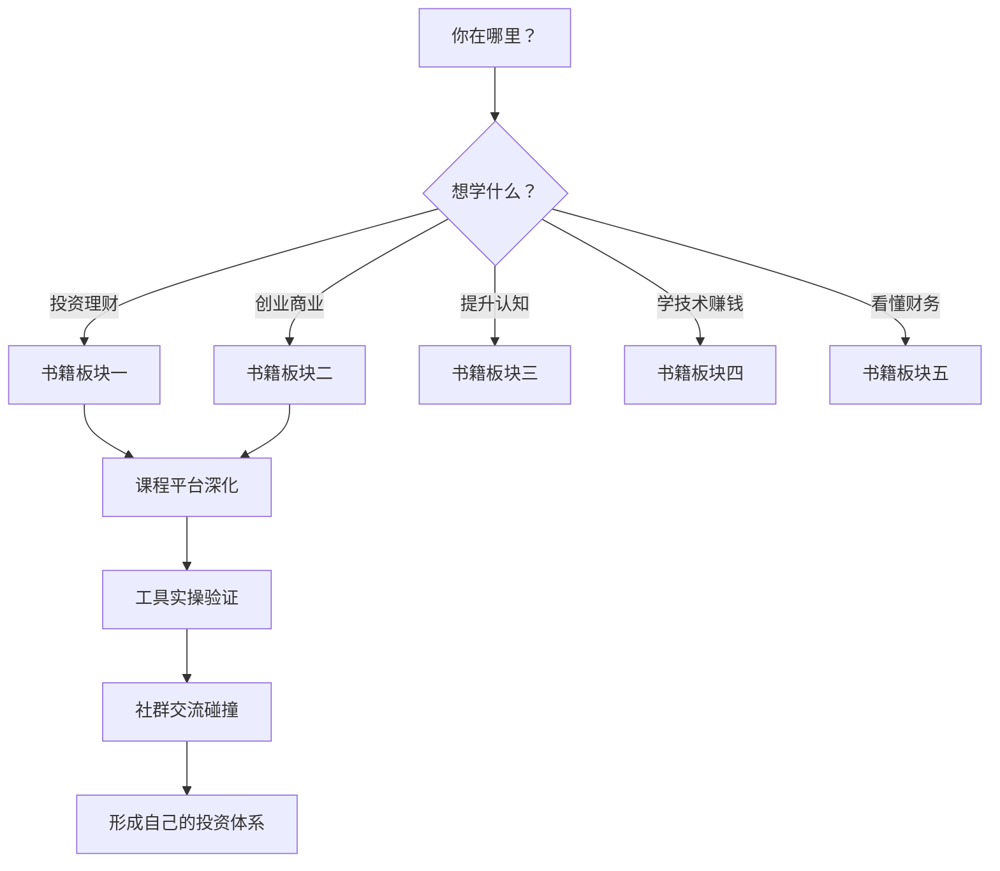
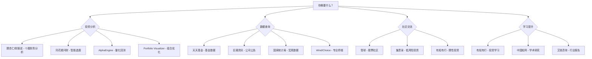

# 附录L：搞钱书单与资源大全

> 精选150+优质资源，助你系统学习理财、创业与财富增长。每个资源均包含简介、推荐理由和使用建议，可根据自身阶段和兴趣选择性深入。

## 本附录导航

本附录按功能分为 **七大板块**，涵盖从阅读、听课、实践到交流的完整学习闭环：

| 板块 | 内容 | 数量 | 适用场景 |
|------|------|------|----------|
| 书籍推荐 | 投资理财、创业商业、心理认知、技术互联网、财务会计 | 65本 | 系统学习，建立知识体系 |
| 课程平台 | 在线课程、知识付费、MOOC | 15个 | 结构化学习，名师指导 |
| 音视频频道 | 播客、YouTube/B站 | 35个 | 碎片时间学习，获取行业动态 |
| 工具与网站 | 数据平台、分析工具、信息源 | 20个 | 实操分析，辅助决策 |
| 社群与论坛 | 投资社区、创业圈、知识星球 | 15个 | 交流讨论，获取一手信息 |
| 官方数据源 | 宏观数据、监管信息、行业报告 | 10个 | 深度研究，政策研判 |
| 学习方法论 | 阅读路径、资源选择、知识管理 | — | 高效学习，少走弯路 |

---

## 一、投资理财经典书籍（20本）

> 投资理财是"搞钱"的基本功。这20本书覆盖了从入门认知到高级策略的完整光谱，建议按自身水平选择起点，逐级深入。

### 阅读顺序速查表

| 阶段 | 推荐书籍 | 核心收获 | 预计阅读时间 |
|------|----------|----------|-------------|
| 入门 | 《富爸爸穷爸爸》《指数基金投资指南》《定投十年财务自由》 | 建立金钱认知，学会定投 | 各1-2周 |
| 基础 | 《聪明的投资者》《漫步华尔街》《手把手教你读财报》 | 理解投资本质，学会看财报 | 各2-3周 |
| 进阶 | 《投资最重要的事》《巴菲特致股东的信》《彼得·林奇的成功投资》 | 建立投资框架 | 各3-4周 |
| 高级 | 《穷查理宝典》《金融炼金术》《周期》《原则》 | 多元思维，周期判断 | 各1-2月 |

### 1.《聪明的投资者》——本杰明·格雷厄姆

**核心观点**：投资的核心在于"安全边际"原则，即以低于内在价值的价格买入资产。区分"防御型投资者"和"进取型投资者"，强调长期投资和情绪控制。

**适合人群**：所有层次的投资者，尤其适合初学者建立正确的投资观念。

**关键收获**：学会区分投资与投机；掌握安全边际概念；理解市场波动不是风险而是机会。

**推荐理由**：被誉为"投资圣经"，巴菲特称之为"有史以来最伟大的投资著作"。

**使用建议**：建议先读注疏版（贾森·茨威格注释），每章配合思考题，反复阅读第二十章和第八章。第八章"市场先生"寓言是全书精华——把市场想象成一个每天上门报价的躁郁症患者，你可以选择接受或忽略他的报价，但绝不能被他的情绪左右。

**互补阅读**：《证券分析》（格雷厄姆的学术版，更严谨但更难读）；《巴菲特致股东的信》（价值投资的实战应用）。

### 2.《漫步华尔街》——伯顿·马尔基尔

**核心观点**：有效市场假说的通俗解释，股价已反映所有已知信息，普通投资者应通过指数基金实现分散投资。

**适合人群**：希望了解市场运行机制的投资者，特别是对主动投资持怀疑态度的人。

**关键收获**：理解为何大多数主动型基金跑不赢指数；学会构建低成本投资组合。

**推荐理由**：半个世纪以来不断修订再版，兼具学术深度和可读性。

**使用建议**：结合书中方法论评估自己的投资组合，每年重读一次以巩固信念。特别关注书中对"技术分析"和"基本面分析"局限性的论证——这不是说这两种方法无用，而是理解它们的边界在哪里。

**互补阅读**：《指数基金投资指南》（中国市场的指数投资实操）；《共同基金常识》（约翰·博格，指数基金之父的原典）。

### 3.《富爸爸穷爸爸》——罗伯特·清崎

**核心观点**：资产是能把钱放进你口袋的东西，负债是把钱从你口袋拿走的东西。真正的财商教育是学会让钱为你工作。

**适合人群**：理财初学者，尤其是刚进入职场、对金钱缺乏系统认知的年轻人。

**关键收获**：建立资产与负债的正确认知；理解现金流的重要性；激发创业和投资意识。

**推荐理由**：全球畅销书，改变了数百万人的金钱观念，语言通俗易懂。

**使用建议**：作为理财入门读物，读完后需结合更专业的书籍深化理解。注意：书中的"资产/负债"定义与会计学不同（自住房在会计上是资产，但在现金流视角下是负债），理解这种视角差异本身就是一种收获。书中关于房地产投资的建议需要结合中国国情调整。

**互补阅读**：《财务自由之路》（博多·舍费尔，更系统的财务规划方法）；《小狗钱钱》（如果觉得富爸爸太抽象，这本更通俗）。

### 4.《股票作手回忆录》——埃德温·勒费弗

**核心观点**：通过传奇交易员杰西·利弗莫尔的故事，揭示市场心理、趋势交易和风险管理的核心法则。

**适合人群**：对股票交易有兴趣的投资者，尤其是技术分析爱好者。

**关键收获**：理解市场情绪周期；学会顺势而为；认识止损的重要性。

**推荐理由**：华尔街百年经典，交易智慧至今适用，故事性强易读。

**使用建议**：重点阅读关于"等待"和"耐心"的章节，结合自身交易经历反思。利弗莫尔的名言"市场从不犯错，犯错的永远是人"值得反复品味。注意利弗莫尔最终破产的结局——这本身就是最好的风险管理反面教材。

**互补阅读**：《海龟交易法则》（系统化交易方法）；《交易心理分析》（马克·道格拉斯，交易心理学专著）。

### 5.《巴菲特致股东的信》——沃伦·巴菲特

**核心观点**：价值投资的核心原则——以企业所有者的角度投资，关注内在价值、护城河和管理层质量。

**适合人群**：有一定投资基础的中高级投资者。

**关键收获**：学习如何评估企业价值；理解"护城河"概念；掌握长期投资哲学。

**推荐理由**：直接来自"股神"的第一手投资智慧，比任何解读都更准确。

**使用建议**：按主题分类阅读（劳伦斯·坎宁安编排版本），配合伯克希尔年报对照学习。建议精读而非泛读，每年通读一遍伯克希尔年报（免费），观察巴菲特如何在不同市场环境下坚持原则。

**互补阅读**：《巴菲特的护城河》（帕特·多尔西，护城河概念的系统化）；《价值》（张磊，中国视角的价值投资）。

### 6.《彼得·林奇的成功投资》——彼得·林奇

**核心观点**：普通投资者可以通过观察日常生活发现投资机会，"十倍股"往往就在你身边。

**适合人群**：业余投资者，特别是有消费洞察力的人。

**关键收获**：学会六种股票分类法；掌握基本面分析的简化方法；建立"从生活中选股"的思维。

**推荐理由**：林奇管理麦哲伦基金13年，年化回报29%，实战经验极为丰富。

**使用建议**：读完后尝试用书中的分类法（缓慢增长型、稳定增长型、快速增长型、周期型、转型困境型、隐蔽资产型）分析自己熟悉的行业和公司。林奇的方法论核心是"投资你了解的东西"——如果你在某个行业工作，你天然比华尔街分析师更早发现趋势。

**互补阅读**：《战胜华尔街》（林奇的实战续作，案例更丰富）；《彼得·林奇的成功投资》和《战胜华尔街》建议一起读，前者讲方法论，后者讲实战。

### 7.《指数基金投资指南》——银行螺丝钉

**核心观点**：普通投资者通过定投宽基指数基金，长期可以战胜大多数专业投资者。

**适合人群**：投资新手，工作繁忙没时间研究个股的上班族。

**关键收获**：掌握指数基金的选择标准；学会估值定投法；理解"低买高卖"的纪律执行。

**推荐理由**：国内指数投资领域的标杆之作，案例贴近中国市场。

**使用建议**：按照书中策略建立定投计划，结合蛋卷基金等平台实践操作。书中给出的"盈利收益率法"是适合中国市场的简化估值方法——当指数的盈利收益率大于10%时分批买入，小于无风险收益率时分批卖出。

**互补阅读**：《定投十年财务自由》（同作者的进阶版）；《漫步华尔街》（指数投资的理论基础）。

### 8.《投资最重要的事》——霍华德·马克斯

**核心观点**：成功的投资不在于"买好的"而在于"买得好"，关键在于理解市场周期、风险控制和逆向思维。

**适合人群**：有一定经验的投资者，希望提升投资认知层级。

**关键收获**：学会"第二层思维"；理解风险不等于波动；掌握周期判断方法。

**推荐理由**：巴菲特称"我会第一时间读马克斯的备忘录"，投资智慧的集大成之作。

**使用建议**：每章读完后写读书笔记，特别关注"理解风险"和"关注周期"章节。"第二层思维"是全书核心——第一层思维说"这是一家好公司，让我们买入"，第二层思维说"这是一家好公司，但所有人都认为它好，所以它被高估了，让我们卖出"。

**互补阅读**：《周期》（同作者，周期理论的系统化展开）；《穷查理宝典》（逆向思维的另一个视角）。

### 9.《穷查理宝典》——查理·芒格

**核心观点**：多元思维模型——从多个学科借鉴思维框架来分析问题，避免"铁锤人倾向"。

**适合人群**：所有投资者和追求智慧的人。

**关键收获**：建立跨学科思维框架；理解人类误判心理学；学会"反过来想"。

**推荐理由**：芒格一生智慧的结晶，不仅限于投资，更是人生哲学。

**使用建议**：重点阅读"人类误判心理学"演讲（25种心理偏误清单），结合自身决策经历反思偏误。建议制作一张偏误清单卡片，每次做重大决策前对照检查。"反过来想，总是反过来想"——当你想知道如何成功时，先研究如何失败，然后避免那些错误。

**互补阅读**：《影响力》（西奥迪尼，说服心理学的系统阐述）；《思考，快与慢》（卡尼曼，认知偏误的学术基础）。

### 10.《原则》——瑞·达利欧

**核心观点**：通过系统化的原则来指导生活和投资决策，拥抱现实、极度透明和可信度加权决策。

**适合人群**：追求系统化思维的投资者和管理者。

**关键收获**：学会建立个人决策原则；理解"全天候"投资组合；掌握系统化决策方法。

**推荐理由**：全球最大对冲基金创始人的实战智慧，方法论极具操作性。

**使用建议**：先读"生活原则"部分，逐步建立自己的原则体系。达利欧的"可信度加权决策"（给不同人的意见赋予不同权重）是一种非常实用的决策框架——不是所有人的话都值得同等对待，在某个领域有成功track record的人应该获得更高权重。

**互补阅读**：《债务危机》（达利欧，理解经济周期的债务驱动模型）；《思考，快与慢》（理解为什么我们需要原则来对抗直觉偏误）。

### 11.《价值》——张磊

**核心观点**：长期主义——做时间的朋友，选择具有持续创造价值能力的企业，与优秀的企业家同行。

**适合人群**：关注中国市场的投资者和创业者。

**关键收获**：理解"重仓中国"的投资逻辑；学会"哑铃理论"和动态护城河分析。

**推荐理由**：高瓴资本创始人张磊的首部著作，融合中西方投资智慧。

**使用建议**：结合中国产业发展趋势理解书中的投资案例。张磊的"哑铃理论"（一头是科技创新，一头是消费升级，中间由数字化连接）是理解中国投资机会的实用框架。

**互补阅读**：《巴菲特致股东的信》（价值投资的原典）；《创新者的窘境》（理解动态护城河的来源）。

### 12.《周期》——霍华德·马克斯

**核心观点**：市场周期是投资中最重要的变量，理解并利用周期可以显著提高投资回报。

**适合人群**：中高级投资者，尤其是对宏观趋势感兴趣的人。

**关键收获**：识别周期的不同阶段；学会"在别人贪婪时恐惧"的时机把握。

**推荐理由**：《投资最重要的事》的姊妹篇，将周期理论系统化。

**使用建议**：结合历史市场数据验证书中的周期理论，建立自己的周期判断框架。马克斯的周期钟摆模型非常实用——市场情绪在"极度乐观"和"极度悲观"之间摆动，大多数时间在中间区域快速穿过，而在两端停留较久。

**互补阅读**：《投资最重要的事》（先读这本再读《周期》）；《逃不开的经济周期》（拉斯·特维德，更全面的周期理论）。

### 13.《基金定投大全》——老罗

**核心观点**：基金定投是普通人参与资本市场的最优方式，通过纪律性投资穿越牛熊周期。

**适合人群**：理财入门者，工薪阶层。

**关键收获**：掌握定投品种选择、止盈策略和组合搭配方法。

**推荐理由**：国内定投实操的权威指南，案例丰富且可操作性强。

**使用建议**：按照书中方法在支付宝或天天基金上开始实践定投。重点掌握"目标收益率止盈法"——设定一个合理的年化收益目标（如15-20%），达到后分批止盈，重新开始定投。

**互补阅读**：《指数基金投资指南》（银行螺丝钉，定投的标的物选择）；《定投十年财务自由》（长期视角的定投规划）。

### 14.《可转债投资魔法书》——安道全

**核心观点**：可转债具有"下有保底、上不封顶"的独特属性，是适合保守投资者的品种。

**适合人群**：风险厌恶型投资者，希望获取稳健收益的人。

**关键收获**：理解可转债的定价逻辑；掌握双低策略和轮动策略。

**推荐理由**：国内可转债投资的经典之作，帮助投资者发现被忽视的投资品种。

**使用建议**：从模拟交易开始，逐步建立可转债投资组合。"双低策略"（低价格+低溢价率）是入门可转债最简单有效的方法——价格低意味着下跌空间有限，溢价率低意味着跟涨能力强。

**互补阅读**：集思录网站（可转债数据和讨论社区）；《投资要义》（刘诚，低风险投资策略体系）。

### 15.《手把手教你读财报》——唐朝

**核心观点**：财报是投资者了解企业的最重要工具，普通人也能通过系统学习掌握财报分析能力。

**适合人群**：价值投资者，需要分析上市公司基本面的人。

**关键收获**：掌握三大财务报表的阅读方法；学会识别财务造假信号。

**推荐理由**：用茅台等真实案例讲解，通俗易懂，实操性强。

**使用建议**：边读边拿一家上市公司财报对照练习。建议选择一家你熟悉消费场景的公司（如茅台、伊利、海天），下载最近3年年报，按照书中方法逐项分析。特别关注"合并利润表"和"现金流量表"的勾稽关系——净利润与经营活动现金流净额长期背离是财务造假的重要信号。

**互补阅读**：《财务报表分析与股票估值》（郭永清，更系统的财务分析框架）；《一本书读懂财报》（肖星，零基础入门财报）。

### 16.《金融炼金术》——乔治·索罗斯

**核心观点**：反身性理论——市场参与者的认知会影响市场本身，导致市场价格与基本面之间产生系统性偏差。

**适合人群**：有较强理论基础的高级投资者。

**关键收获**：理解市场泡沫的形成机制；学会识别趋势的自我强化和逆转。

**推荐理由**：索罗斯哲学思维的深度展现，有助于理解市场的非理性行为。

**使用建议**：阅读难度较大，建议配合其他索罗斯传记类书籍一起阅读。反身性理论的核心洞察是：市场不是被动反映现实，而是主动参与塑造现实。当所有人都认为房价会涨并因此买入时，需求增加真的推高了房价，这又"验证"了最初的预期——这就是正反馈循环。

**互补阅读**：《索罗斯传》（理解反身性理论的实战应用）；《叙事经济学》（席勒，从另一个角度理解市场预期的自我实现）。

### 17.《战胜华尔街》——彼得·林奇

**核心观点**：业余投资者有独特的优势，通过勤奋研究和独立思考可以战胜专业机构。

**适合人群**：有一定股票投资经验的个人投资者。

**关键收获**：学习25条股票投资黄金法则；了解不同行业的投资逻辑。

**推荐理由**：比《成功投资》更贴近实战，案例更丰富。

**使用建议**：重点学习书中对零售、餐饮等消费行业的分析方法。林奇的"鸡尾酒会理论"很有趣——当聚会上没人谈论股票时，市场可能接近底部；当出租车司机都给你推荐股票时，市场可能接近顶部。

**互补阅读**：《彼得·林奇的成功投资》（先读方法论再读实战）。

### 18.《海龟交易法则》——柯蒂斯·费思

**核心观点**：成功的交易不在于预测，而在于严格执行经过验证的交易系统，风险管理是核心。

**适合人群**：对系统化交易感兴趣的人。

**关键收获**：理解完整的交易系统设计方法；掌握头寸管理和止损规则。

**推荐理由**：传奇交易实验的亲历者所写，系统化交易的入门经典。

**使用建议**：理解系统逻辑后，在模拟环境中测试再实盘操作。海龟交易法的核心不是具体的入场规则，而是"头寸规模管理"——根据市场波动性（ATR）动态调整仓位大小，这才是控制风险的关键。

**互补阅读**：《通向财务自由之路》（范·K·撒普，更完整的交易系统设计方法论）；《股票作手回忆录》（交易心理的另一个视角）。

### 19.《钱：7步创造终身收入》——托尼·罗宾斯

**核心观点**：通过七个步骤构建终身收入系统，包括储蓄、投资、保险和遗产规划。

**适合人群**：希望建立全面财务规划的中产家庭。

**关键收获**：学会构建"财务自由目标"；了解年金和保险的合理运用。

**推荐理由**：访谈了全球顶级投资者后的总结，兼具策略性和操作性。

**使用建议**：按照七个步骤逐一对照自己的财务状况并制定改进计划。书中的"财务自由数字"计算方法很实用：年支出 × 25 = 你需要的本金（基于4%安全提取率）。例如年支出10万，你需要250万本金。

**互补阅读**：《财务自由之路》（博多·舍费尔，德国视角的财务规划）；《定投十年财务自由》（中国市场的积累路径）。

### 20.《定投十年财务自由》——银行螺丝钉

**核心观点**：通过科学的定投方法，普通人可以在十年内实现财务自由的基础积累。

**适合人群**：年轻上班族、理财新手。

**关键收获**：学会估值定投和止盈策略；了解不同指数基金的特点。

**推荐理由**：结合中国市场特点的定投实操手册，案例接地气。

**使用建议**：按照书中推荐的组合开始定投，每月检查并调整策略。书中提出的"四步定投法"（选品种、定金额、估值买卖、定期检视）是可直接执行的操作流程。

**互补阅读**：《指数基金投资指南》（同作者，定投的理论基础）。

---

## 二、创业与商业书籍（15本）

> 创业是"搞钱"最直接但也最具挑战的路径。这15本书覆盖了从创意验证、商业模式设计到团队管理、增长黑客的全链条。

### 1.《从零到一》——彼得·蒂尔

**核心观点**：真正的创新是创造新事物（从0到1），而非复制已有模式（从1到N）。垄断比竞争更有利于企业和社会。

**适合人群**：创业者、产品经理、有创新思维的人。

**关键收获**：学会判断创业方向的"从0到1"属性；理解垄断企业的特征。

**推荐理由**：硅谷创投教父的经典之作，颠覆传统商业竞争思维。

**使用建议**：创业前精读此书，用于评估商业模式的创新性和可持续性。蒂尔的"竞争是留给失败者的"观点极具颠覆性——真正的商业目标不是在红海中厮杀，而是找到一个你能垄断的小市场（如亚马逊从网上书店开始），然后逐步扩张。

**互补阅读**：《精益创业》（如何验证你的"从0到1"想法）；《创新者的窘境》（为什么大公司反而做不出"从0到1"）。

### 2.《精益创业》——埃里克·莱斯

**核心观点**：创业应采用"构建-测量-学习"的反馈循环，通过最小可行产品（MVP）快速验证假设。

**适合人群**：初次创业者、互联网创业者。

**关键收获**：掌握MVP方法论；学会"转型还是坚持"的判断标准；建立数据驱动的决策习惯。

**推荐理由**：现代互联网创业的方法论基础，被全球创业公司广泛采用。

**使用建议**：将自己的创业想法用MVP框架拆解，设计最简单的验证实验。MVP不是"简陋的产品"，而是"能验证核心假设的最简方案"——有时一个Landing Page加上一个报名表单就够了，关键是要在最短时间内验证"用户是否真的需要这个"。

**互补阅读**：《精益数据分析》（如何用数据驱动"构建-测量-学习"循环）；《从零到一》（先想清楚方向，再用精益方法验证）。

### 3.《增长黑客》——肖恩·埃利斯

**核心观点**：通过数据驱动的方法实现低成本、高效率的用户增长，增长是产品和运营的核心。

**适合人群**：互联网创业者、增长负责人、产品经理。

**关键收获**：掌握AARRR模型；学会设计增长实验；理解用户留存的核心地位。

**推荐理由**：硅谷增长方法论的开山之作，实战性强。

**使用建议**：结合自己的产品，按照书中的增长框架建立增长看板。AARRR模型（获取→激活→留存→收入→推荐）的关键洞察是：漏斗的每一层都有优化空间，但"留存"是增长的地基——如果留不住用户，拉新再多也是往漏桶里倒水。

**互补阅读**：《上瘾》（如何设计让用户上瘾的产品）；《精益数据分析》（增长实验的数据分析方法）。

### 4.《定位》——艾尔·里斯、杰克·特劳特

**核心观点**：商战的本质是在消费者心智中占据一个独特位置，而非在产品层面竞争。

**适合人群**：创业者、市场营销人员、品牌管理者。

**关键收获**：学会心智定位法则；理解品类思维；掌握品牌命名和传播策略。

**推荐理由**：营销领域的奠基之作，影响了全球数十年的商业实践。

**使用建议**：用书中的定位理论分析自己的产品或服务，找到差异化切入点。定位的核心公式是：品牌名 = 品类名。当人们说"搜索一下"时，他们说的是"百度一下"；当人们说"打个车"时，他们说的是"滴滴一下"——这就是定位的终极目标。

**互补阅读**：《超级转化率》（陈勇，定位之后如何提升转化）；《定位》系列的其他几本（《22条商规》《品牌的起源》）。

### 5.《创新者的窘境》——克莱顿·克里斯坦森

**核心观点**：优秀企业往往因为过度关注现有客户和延续性创新而错失颠覆性创新机会。

**适合人群**：企业高管、创业者、关注产业趋势的人。

**关键收获**：理解破坏性创新的规律；学会识别潜在的颠覆者；建立危机意识。

**推荐理由**：被乔布斯、贝索斯等商业领袖极力推崇的管理经典。

**使用建议**：用书中的分析框架审视自己所在行业的颠覆性威胁。克里斯坦森的"破坏性创新"模型可以总结为：低端市场被忽视→新技术/模式从低端切入→性能快速提升→向高端市场进攻→老牌企业措手不及。理解这个循环，你就能识别下一个颠覆性机会。

**互补阅读**：《从零到一》（如何创造破坏性创新）；《浪潮之巅》（科技产业中破坏性创新的历史案例）。

### 6.《创业维艰》——本·霍洛维茨

**核心观点**：创业最难的不是开始，而是在逆境中做出艰难决策，好的CEO是"在痛苦中做决策的人"。

**适合人群**：正在经历困难的创业者、管理者。

**关键收获**：学会在无好选项时做决策；理解如何裁员、如何面对竞争。

**推荐理由**：硅谷最真实的创业经验分享，没有成功学的虚伪包装。

**使用建议**：在遇到困难时翻阅相关章节获取力量和方法。霍洛维茨关于"如何裁员"的章节是所有创业者必须提前阅读的——裁员的关键是快速、透明、有尊严，拖泥带水只会让所有人都痛苦。

**互补阅读**：《重新定义公司》（谷歌的管理智慧作为对照）；《高产出管理》（格鲁夫，管理决策的底层方法论）。

### 7.《重新定义公司》——埃里克·施密特

**核心观点**：在互联网时代，创意精英是最宝贵的资产，管理者应创造让创意精英自由发挥的环境。

**适合人群**：科技公司管理者、创业者。

**关键收获**：理解OKR管理法；学会如何招聘和留住顶尖人才；掌握扁平化组织管理。

**推荐理由**：谷歌前CEO亲述的管理智慧，对互联网公司极具参考价值。

**使用建议**：将OKR管理方法引入团队管理实践中。OKR的关键不是设定目标，而是"透明"和"对齐"——每个人都能看到其他人的OKR，确保整个组织朝同一个方向使劲。

**互补阅读**：《奈飞文化手册》（另一种极端的管理文化）；《高产出管理》（OKR的原始出处）。

### 8.《商业的本质》——杰克·韦尔奇

**核心观点**：商业的核心是增长，而增长的引擎是团队、创新和营销。

**适合人群**：中层管理者、创业者。

**关键收获**：学会领导力的基本法则；理解如何激励团队；掌握危机管理方法。

**推荐理由**：通用电气传奇CEO的管理精华，适合所有规模的企业。

**使用建议**：重点阅读"领导力"和"增长"相关章节，结合团队实际情况改进管理。韦尔奇的"活力曲线"（20-70-10法则）虽然有争议，但其核心思想——识别和奖励顶尖人才、帮助中间层提升、果断处理末位——是所有管理者必须面对的课题。

### 9.《超级转化率》——陈勇

**核心观点**：转化率优化是互联网商业的核心技能，通过系统方法提升从流量到成交的每一步转化。

**适合人群**：电商运营、市场人员、创业者。

**关键收获**：掌握"超级转化率"六步法；学会落地页优化和用户行为分析。

**推荐理由**：国内转化率优化的实战专家之作，案例全部来自中国市场。

**使用建议**：选择一个转化环节，用书中的方法进行A/B测试优化。陈勇的"超级转化率六步法"核心是把用户从"看到"到"成交"的路径拆解为6个微观步骤，每一步都用具体技巧消除犹豫。这套方法直接可操作，不需要高深的技术背景。

### 10.《奈飞文化手册》——帕蒂·麦考德

**核心观点**：自由与责任并存的文化是最高效的企业文化，取消休假政策、差旅审批等控制措施。

**适合人群**：企业管理者、HR、创业者。

**关键收获**：理解"人才密度"的重要性；学会如何打造高自由度团队。

**推荐理由**：Netflix企业文化的第一手资料，颠覆传统管理认知。

**使用建议**：选择其中一两个文化准则在团队中试点推行。奈飞文化的核心是"人才密度先行"——只有当团队中大多数人都是高绩效者时，才可能实行高自由度管理。如果团队中混入了平庸者，自由只会变成混乱。

### 11.《平台革命》——杰奥夫雷·帕克

**核心观点**：平台商业模式正在颠覆传统管道商业模式，理解平台的运作机制是创业的必修课。

**适合人群**：互联网创业者、商业模式研究者。

**关键收获**：学会设计平台商业模式；理解网络效应和平台治理。

**推荐理由**：系统阐述平台经济的理论和实践，案例丰富。

**使用建议**：用平台思维重新审视自己的商业机会。平台模式的核心挑战是"鸡生蛋问题"——没有买家就没有卖家，没有卖家就没有买家。书中提供了多种破解冷启动问题的策略，如"单边补贴"和"先用工具吸引单边用户"。

### 12.《俞敏洪：我的成长观》——俞敏洪

**核心观点**：创业的本质是创造价值，成长比成功更重要，逆境是最好的老师。

**适合人群**：中国创业者、教育行业从业者。

**关键收获**：学习如何在逆境中坚持；理解中国创业的独特挑战。

**推荐理由**：新东方创始人的真实创业故事，接地气且有深度。

**使用建议**：在创业低谷时翻阅，从中获取精神力量。俞敏洪从新东方的创立到"双减"后的转型（东方甄选），本身就是一个完整的创业案例——如何在行业被颠覆时找到新的增长曲线。

### 13.《高产出管理》——安迪·格鲁夫

**核心观点**：管理者的产出等于其管辖团队的产出总和，高效管理的关键在于杠杆效应。

**适合人群**：中高层管理者、创业者。

**关键收获**：掌握一对一会议、绩效评估和决策制定的方法。

**推荐理由**：硅谷管理的奠基之作，被比尔·坎贝尔等人极力推荐。

**使用建议**：将一对一会议和OKR管理法引入日常管理。格鲁夫的"管理杠杆率"概念非常实用——管理者应该把时间花在杠杆率最高的活动上：那些影响人数多、影响程度深、影响时间长的事情。培训团队就是高杠杆率活动的典型例子。

### 14.《卖晾衣杆的小贩为何能赚大钱》——项保华

**核心观点**：商业模式创新比技术创新更重要，好商业模式的核心是解决真实的用户痛点。

**适合人群**：创业者、商业模式设计师。

**关键收获**：学会分析商业模式的六个维度；理解中国市场的商业模式创新。

**推荐理由**：国内商业模式研究的权威之作，案例全部来自中国市场。

**使用建议**：用书中的框架分析自己所在行业的商业模式机会。书名本身就是最好的商业洞察——看似不起眼的小生意，因为找到了正确的商业模式（低成本、高频次、强需求），反而比很多"高大上"的创业更赚钱。

### 15.《执行》——拉里·博西迪

**核心观点**：执行不是战术层面的细节，而是一套系统和纪律，是战略和结果之间的桥梁。

**适合人群**：企业管理者、团队负责人。

**关键收获**：学会将战略转化为可执行的行动计划；掌握跟进和问责的方法。

**推荐理由**：系统化解决"想法很好但执行不了"的企业通病。

**使用建议**：在团队中建立每周执行复盘的制度。执行的三大基石是：领导者的七项基本行为、建立文化变革框架、知人善任。其中"跟进"是最容易被忽视也最关键的一环——没有跟进的会议等于没有开。

---

## 三、心理学与行为经济学书籍（10本）

> 投资和创业的终极对手不是市场，而是自己的大脑。这10本书帮你理解人类决策的非理性模式，从而做出更理性的选择。

### 1.《思考，快与慢》——丹尼尔·卡尼曼

**核心观点**：人类有两套思维系统——快速直觉的系统1和慢速理性的系统2，大多数决策偏误源于系统1的过度主导。

**适合人群**：所有投资者和决策者。

**关键收获**：识别常见的认知偏误（锚定效应、可得性偏误、损失厌恶等）；学会在关键决策时激活系统2。

**推荐理由**：诺贝尔经济学奖得主的巅峰之作，行为经济学的奠基文献。

**使用建议**：逐一对照书中的偏误清单检查自己的投资决策，建立"偏误日志"。特别注意"损失厌恶"——人对损失的痛苦感受是同等收益快乐感受的2-2.5倍，这解释了为什么大多数人"拿不住盈利，死扛亏损"。

**互补阅读**：《穷查理宝典》（芒格的25种人类误判心理学，更精炼的清单）；《预测非理性》（更轻松的行为经济学入门）。

### 2.《影响力》——罗伯特·西奥迪尼

**核心观点**：六大影响力原则——互惠、承诺一致、社会认同、喜好、权威、稀缺，解释了人类被说服的心理机制。

**适合人群**：营销人员、销售人员、创业者，以及所有希望避免被操纵的人。

**关键收获**：学会识别和防御商业操纵；同时学会合法地运用影响力原则。

**推荐理由**：心理学领域的经典畅销书，实用价值极高。

**使用建议**：在日常消费和投资决策中练习识别影响力武器的使用。例如"稀缺性"原则——"限时特价""仅剩3件"这类话术就是利用稀缺心理让你冲动消费。识别了这个机制，你就能在冲动时按下暂停键。

**互补阅读**：《思考，快与慢》（理解影响力为什么有效——因为它利用了系统1的自动反应）；《上瘾》（影响力原则在产品设计中的应用）。

### 3.《助推》——理查德·塞勒

**核心观点**：通过巧妙的"选择架构"设计，可以在不限制自由的前提下引导人们做出更好的决策。

**适合人群**：政策制定者、产品设计师、投资者。

**关键收获**：理解"选择架构"概念；学会设计更好的默认选项；认识到自由家长主义的价值。

**推荐理由**：诺贝尔经济学奖得主的行为经济学代表作，理论与实践并重。

**使用建议**：用"助推"思维优化自己的储蓄和投资默认选择。例如：设置工资到账后自动转入投资账户（默认储蓄），而不是"花剩下的再存"——这就是一个自我助推。

**互补阅读**：《稀缺》（理解为什么穷人更需要好的选择架构）；《自控力》（如何用助推对抗自控力不足）。

### 4.《贪婪的多巴胺》——丹尼尔·利伯曼

**核心观点**：多巴胺不是"快乐分子"而是"欲望分子"，它驱动我们追求更多但永远不满足。

**适合人群**：想要理解消费欲望和投资冲动的人。

**关键收获**：理解消费主义的神经机制；学会区分"想要"和"喜欢"。

**推荐理由**：从神经科学角度解释行为经济学现象，视角独特。

**使用建议**：在做出重大购买或投资决策前，等待24小时以降低多巴胺驱动的冲动。多巴胺的机制是"预期奖赏"而非"获得奖赏"——你对购物的期待比购物本身更让你兴奋，理解这一点就能更好地控制冲动消费。

### 5.《上瘾》——尼尔·埃亚尔

**核心观点**：通过触发-行动-酬赏-投入四步模型，可以让用户对产品形成习惯性依赖。

**适合人群**：产品经理、创业者、营销人员。

**关键收获**：理解"上瘾"产品的设计原理；学会构建习惯养成型产品。

**推荐理由**：互联网产品设计的必读书目，影响了无数产品经理。

**使用建议**：用上瘾模型分析自己常用的产品，理解它们如何"钩住"你。同时用这个模型审视自己的产品——你的产品是否能形成"内部触发"（用户在特定情绪/场景下自动想到你的产品）？如果不能，用户留存就很难突破。

### 6.《稀缺》——塞德希尔·穆来纳森

**核心观点**：稀缺心态会降低人的认知带宽，导致短视决策，形成贫穷的恶性循环。

**适合人群**：想要理解贫困问题的人，以及处于经济压力中的人。

**关键收获**：理解"管窥效应"对决策的影响；学会在稀缺状态下保持理性。

**推荐理由**：从心理学角度解释贫困陷阱，颠覆传统认知。

**使用建议**：在经济紧张时期，特别注意避免短视决策，给自己留出缓冲余地。书中最重要的实操建议是：建立"余闲"——无论是时间还是金钱，都要留出10-15%的缓冲，这能显著减少稀缺心态对决策质量的侵蚀。

### 7.《预测非理性》——丹·艾瑞里

**核心观点**：人类的经济行为是系统性非理性的，理解这些非理性行为可以帮助做出更好的决策。

**适合人群**：投资者、消费者、行为经济学爱好者。

**关键收获**：理解"锚定效应"在消费中的作用；认识到"免费"的强大心理力量。

**推荐理由**：行为经济学的入门读物，实验设计有趣且发人深省。

**使用建议**：在购物和投资时有意识地对抗书中描述的非理性倾向。特别注意"锚定效应"——商家先展示高价商品再推荐中价商品，中价商品就会显得"便宜"。在投资中，你买入的价格也会成为"锚"，影响你后续的持有/卖出决策。

### 8.《乌合之众》——古斯塔夫·勒庞

**核心观点**：群体心理具有冲动、易变、轻信和极端的特征，个人在群体中会丧失理性判断力。

**适合人群**：投资者、社交媒体用户、所有参与市场的人。

**关键收获**：理解市场泡沫和恐慌的心理机制；学会在群体狂热中保持独立思考。

**推荐理由**：群体心理学的开山之作，对理解金融市场极有价值。

**使用建议**：在市场极度疯狂或恐慌时翻阅此书，帮助保持冷静。勒庞的核心洞察是：群体中个人的智力会被拉平，情绪会被放大。在投资中，这意味着——当你发现自己和大多数人想的一样时，要警惕了。

### 9.《自控力》——凯利·麦格尼格尔

**核心观点**：自控力像肌肉一样可以通过锻炼增强，关键在于理解自控力的工作机制和科学训练方法。

**适合人群**：希望提升自律能力的人。

**关键收获**：学会冥想等增强自控力的方法；理解意志力的"道德许可"陷阱。

**推荐理由**：斯坦福大学心理学课程的精华，科学性强且实用。

**使用建议**：每天练习10分钟冥想，按照书中的方法逐步提升自控力。特别注意"道德许可"效应——当你做了一件"好事"（如坚持了一周定投），你会觉得自己"有权"做一件"坏事"（如冲动消费一次），这是自控力的最大敌人。

### 10.《叙事经济学》——罗伯特·席勒

**核心观点**：经济事件往往由流行叙事驱动，理解叙事传播机制有助于预测经济走势。

**适合人群**：投资者、经济研究者。

**关键收获**：学会识别影响市场的"流行叙事"；理解故事如何影响经济行为。

**推荐理由**：诺贝尔经济学奖得主的创新之作，将心理学、流行病学与经济学结合。

**使用建议**：关注当前流行的经济叙事，判断其对市场的影响方向和力度。席勒的核心方法是把经济叙事当作"病毒"来研究——它如何传播、如何变异、如何衰退。例如"AI将取代所有工作"这个叙事，它的情绪传染力很强，但我们需要冷静分析其真实影响程度。

---

## 四、技术与互联网书籍（10本）

> 技术是这个时代最大的财富创造引擎。这10本书帮你理解技术趋势、建立技术思维，从而抓住技术带来的赚钱机会。

### 1.《浪潮之巅》——吴军

**核心观点**：科技产业的发展遵循一定规律，理解技术浪潮的节奏有助于把握投资和创业机会。

**适合人群**：科技投资者、互联网从业者。

**关键收获**：了解硅谷科技公司兴衰史；学会判断技术趋势；理解"基因决定论"。

**推荐理由**：中文世界最好的科技产业分析著作，兼具历史感和洞察力。

**使用建议**：关注书中描述的产业规律在当前AI浪潮中的体现。吴军的"基因决定论"——企业的基因（核心能力和组织文化）决定了它能做什么和不能做什么——可以帮你判断哪些传统企业能成功转型AI，哪些不能。

### 2.《黑客与画家》——保罗·格雷厄姆

**核心观点**：程序员本质上是创造者，优秀的软件如同艺术品，创业是实现技术理想的最佳途径。

**适合人群**：程序员、技术创业者。

**关键收获**：理解硅谷创业文化；学会"做不可扩展的事"的创业智慧。

**推荐理由**：Y Combinator创始人的经典文集，对技术创业者影响深远。

**使用建议**：选择几篇最相关的文章精读，如"如何创业"和"财富与不平等"。格雷厄姆的核心观点是"财富是创造出来的，不是零和游戏"——创业不是抢别人的蛋糕，而是把蛋糕做大。

### 3.《技术的本质》——布莱恩·阿瑟

**核心观点**：技术是"被捕获并加以利用的现象的集合"，技术进化遵循自身的发展规律。

**适合人群**：科技投资者、技术战略规划者。

**关键收获**：理解技术组合创新的规律；学会判断技术成熟度。

**推荐理由**：复杂经济学创始人对技术的深刻洞察，有助于理解技术投资。

**使用建议**：用书中的技术进化理论分析当前的AI技术发展路径。阿瑟的核心洞察是：新技术总是已有技术的组合——GPT = Transformer架构 + 大规模预训练 + 海量数据，每一项技术都不是全新的，但组合在一起产生了革命性效果。

### 4.《创新公司》——艾德·卡特穆尔

**核心观点**：创意是脆弱的，管理者需要创造一个让创意安全生长的环境，保护"丑陋的婴儿"。

**适合人群**：创意产业管理者、技术团队负责人。

**关键收获**：学习皮克斯的创意管理方法；理解"智囊团"会议的价值。

**推荐理由**：皮克斯联合创始人的管理智慧，对创意型团队极具参考价值。

**使用建议**：在团队中建立类似"智囊团"的反馈机制。皮克斯的"智囊团"规则很值得借鉴：参与者可以对创意提出尖锐的批评，但决策权始终属于项目负责人——这既保证了反馈质量，又保护了创作者的自主权。

### 5.《失控》——凯文·凯利

**核心观点**：复杂系统具有自组织、去中心化的特征，未来的技术和社会将趋向"蜂群思维"。

**适合人群**：科技趋势研究者、未来主义者。

**关键收获**：理解去中心化系统的运作机制；预见技术发展的长期趋势。

**推荐理由**：1994年出版却精准预测了互联网和区块链的发展，极具前瞻性。

**使用建议**：结合当前的Web3和AI发展理解书中的预言。KK在1994年就预见了"去中心化组织""大规模协作""人工智能"等概念——这种前瞻性思维对识别下一个技术浪潮非常有价值。

### 6.《AI未来》——李开复

**核心观点**：人工智能将深刻改变全球经济格局，中国在AI领域有独特优势，但也带来就业挑战。

**适合人群**：关注AI投资机会的人、需要应对AI冲击的职场人。

**关键收获**：了解AI技术的发展现状和趋势；理解AI对各行业的影响。

**推荐理由**：AI领域权威人士对中国AI发展的深度分析。

**使用建议**：评估自己所在行业受AI影响的程度，提前做好转型准备。李开复的"AI替代象限"（按"社交性"和"创造性"两个维度划分）是评估职业风险的实用框架——高社交+高创造的工作最安全，低社交+低创造的工作最先被替代。

### 7.《人月神话》——弗雷德里克·布鲁克斯

**核心观点**：软件项目中"向已经延期的项目增加人力只会使其更加延期"，复杂系统的本质困难无法消除。

**适合人群**：技术团队管理者、软件工程师。

**关键收获**：理解软件项目的复杂性本质；学会合理估算和管理技术团队。

**推荐理由**：软件工程领域的永恒经典，出版50年仍有现实意义。

**使用建议**：在管理技术项目时牢记"人月不是万能单位"的原则。布鲁克斯的核心洞察是：软件开发的核心困难在于"概念完整性"——项目越大，越需要少数人（最好是1-2人）把控整体设计，否则系统会变得支离破碎。

### 8.《精益数据分析》——阿利斯泰尔·克罗尔

**核心观点**：不同阶段的创业公司应该关注不同的关键指标，数据驱动的决策优于直觉决策。

**适合人群**：创业者、数据分析师、产品经理。

**关键收获**：学会识别不同商业模式的关键指标；掌握数据分析驱动增长的方法。

**推荐理由**：将精益创业方法论与数据分析相结合的实战指南。

**使用建议**：为自己的产品建立数据仪表盘，追踪关键指标变化。书中最关键的概念是"第一关键指标"（OMTM, One Metric That Matters）——每个阶段只关注一个最重要的指标，避免信息过载。

### 9.《硅谷钢铁侠》——阿什利·万斯

**核心观点**：极端的使命驱动和第一性原理思维是马斯克取得突破性成就的关键。

**适合人群**：创业者、科技爱好者。

**关键收获**：学习第一性原理思维方法；理解使命驱动型创业的力量。

**推荐理由**：马斯克最权威的传记之一，激励人心且有启发性。

**使用建议**：在遇到困难时，尝试用"第一性原理"重新思考问题。第一性原理的核心是：抛开类比和传统做法，回到最基本的事实和物理定律，从头推导解决方案。马斯克用这个方法把火箭发射成本降低了90%。

### 10.《代码大全》——史蒂夫·迈克康奈尔

**核心观点**：软件构建是软件开发中最核心的活动，写出好代码需要系统的方法论和持续的实践。

**适合人群**：软件工程师、技术创业者。

**关键收获**：掌握代码质量的核心原则；学会软件构建的最佳实践。

**推荐理由**：软件开发领域的百科全书，适合反复查阅。

**使用建议**：针对自己最薄弱的领域选择性阅读相关章节。不需要通读，但每个程序员都应该读第7章（高质量的子程序）和第11章（变量命名）。

---

## 五、财务与会计书籍（10本）

> 财务是商业的"语言"，看不懂财务就像不懂英语出国旅游——你能走，但很多东西看不懂。这10本书从零基础到专业级，帮你掌握这门语言。

### 1.《财务报表分析与股票估值》——郭永清

**核心观点**：财务报表是企业价值的"翻译器"，通过系统的分析框架可以还原企业真实的经营状况。

**适合人群**：价值投资者、财务工作者。

**关键收获**：掌握财务报表分析的系统方法；学会从财报中发现投资机会和风险。

**推荐理由**：国内财务分析领域最权威的著作之一，理论与实践并重。

**使用建议**：选择一家上市公司，用书中的方法进行完整的财报分析。郭永清提出的"财务报表三维分析框架"（经营、投资、筹资活动的现金流组合）是判断企业健康状况的实用工具。

### 2.《小艾上班记》——陈艳红

**核心观点**：会计不是枯燥的数字游戏，而是理解企业经营的语言，通过真实工作场景学习最有效。

**适合人群**：会计初学者、创业者。

**关键收获**：掌握会计基础知识；理解会计分录的实际含义；学会基本的税务处理。

**推荐理由**：用小说体写就的会计入门书，趣味性强且实用。

**使用建议**：通读一遍建立会计基础概念，之后作为参考手册查阅。这本书最大的价值是让你理解"会计分录背后的业务逻辑"——每一笔分录都对应一笔真实的经济业务。

### 3.《一本书读懂财报》——肖星

**核心观点**：财报分析的核心是理解三大报表之间的逻辑关系，以及它们如何反映企业的经营实质。

**适合人群**：财务零基础的投资者和管理者。

**关键收获**：快速掌握资产负债表、利润表和现金流量表的核心逻辑。

**推荐理由**：清华大学教授的精品课程精华，深入浅出。

**使用建议**：读完后找一家公司年报进行实战练习。肖星教授的核心教学方法是"三表联动"——资产负债表是"照片"（某个时点的财务状况），利润表是"视频"（一段时间的经营成果），现金流量表是"验钞机"（验证利润的真实性）。

### 4.《审计学》——叶陈刚

**核心观点**：审计是保证财务信息可靠性的重要机制，理解审计逻辑有助于识别财务造假。

**适合人群**：投资者、财务分析师。

**关键收获**：了解审计流程和方法；学会识别常见的财务舞弊手段。

**推荐理由**：系统介绍审计理论，对投资者识别风险极有价值。

**使用建议**：重点阅读内部控制和审计证据相关章节。作为投资者，不需要成为审计师，但需要了解"审计意见"的含义——"标准无保留意见"是干净的，"保留意见""否定意见"和"无法表示意见"都是红灯信号。

### 5.《税法》——刘颖

**核心观点**：税收是影响投资回报的重要因素，合理的税务筹划可以显著增加实际收益。

**适合人群**：投资者、企业主、财务人员。

**关键收获**：了解中国主要税种的计算方法；学会基本的税务筹划思路。

**推荐理由**：中国税法的权威解读，内容全面且更新及时。

**使用建议**：关注与个人投资和创业相关的税种（个人所得税、增值税、企业所得税），必要时咨询专业税务师。合法节税是每个赚钱人的必修课——同样的收入，不同的结构可能导致税负差异巨大。

### 6.《管理会计》——于增彪

**核心观点**：管理会计的核心是为企业内部决策提供有用的财务信息，包括成本分析、预算管理和绩效评估。

**适合人群**：企业管理者、创业者。

**关键收获**：学会用管理会计思维分析企业经营；掌握本量利分析方法。

**推荐理由**：将财务知识与管理决策紧密结合的实用教材。

**使用建议**：将本量利分析方法应用于自己的创业项目或业务决策。本量利分析的核心问题只有一个：卖多少才能不亏？知道"盈亏平衡点"，你就能做出更理性的定价和扩张决策。

### 7.《成本与管理会计》——查尔斯·亨格瑞

**核心观点**：成本信息是管理决策的基础，理解成本行为模式有助于做出更好的定价、生产和投资决策。

**适合人群**：企业管理者、MBA学生。

**关键收获**：掌握成本分类和成本行为分析；学会制定预算和差异分析。

**推荐理由**：全球最权威的管理会计教材，被顶尖商学院广泛采用。

**使用建议**：选择与自己业务相关的章节深入学习。"变动成本法"和"完全成本法"的区别对定价决策影响很大——很多创业者亏钱是因为没有真正理解自己的成本结构。

### 8.《会计原来这么有趣》——马靖昊

**核心观点**：会计准则背后的逻辑是为了真实反映经济实质，理解了这个逻辑就能轻松掌握会计知识。

**适合人群**：会计初学者、非财务背景的管理者。

**关键收获**：快速建立会计思维框架；理解会计准则背后的逻辑。

**推荐理由**：用通俗幽默的语言讲解会计，降低了学习门槛。

**使用建议**：作为会计入门的第一本书，建立基础后再读更专业的著作。

### 9.《价值评估》——蒂姆·科勒

**核心观点**：企业价值评估是投资和并购的核心技能，需要结合财务分析和商业判断。

**适合人群**：投资者、投行从业者、企业管理者。

**关键收获**：掌握DCF估值法和相对估值法；学会分析企业价值驱动因素。

**推荐理由**：麦肯锡估值方法论的权威指南，全球投资银行的标准参考。

**使用建议**：选择一家公司用DCF方法进行估值练习。DCF（现金流折现）的核心思想很简单：一家公司的价值等于它未来能产生的所有自由现金流的现值之和。难点在于对"未来现金流"和"折现率"的假设。

### 10.《财务自由之路》——博多·舍费尔

**核心观点**：财务自由的关键是提高收入、控制支出并让储蓄自动增值，每个人都可以通过系统方法实现。

**适合人群**：希望建立财务基础的普通人。

**关键收获**：学会制定个人财务计划；理解复利效应和储蓄的重要性。

**推荐理由**：德国理财大师的入门之作，操作性强且适合中国读者。

**使用建议**：按照书中的方法制定自己的财务自由计划。舍费尔的"50-50法则"很实用：每次加薪，把增加部分的50%用于改善生活，50%用于储蓄/投资——这样既享受了收入增长，又加速了财富积累。

---

## 六、副业与自由职业书籍（5本）

> 不是所有人都适合创业，但所有人都可以通过副业增加收入。这5本书覆盖了从副业选择、时间管理到自由职业的全链条。

### 1.《副业赚钱之道》——安晓辉

**核心观点**：每个人都可以通过系统方法找到适合自己的副业，关键是找到"能力×兴趣×市场需求"的交集。

**适合人群**：有稳定工作但想增加收入来源的上班族。

**关键收获**：学会用"甜蜜点模型"定位副业方向；掌握时间管理方法平衡主业和副业。

**推荐理由**：国内副业领域最系统的实操指南，方法论清晰。

**使用建议**：用书中的"甜蜜点模型"（你擅长什么×你喜欢什么×市场需要什么）画一个三圆交集图，找到自己的副业方向。然后用"最小可行副业"（MVS）方法快速验证——先用最少的时间投入测试市场反应，再决定是否加大投入。

### 2.《斜杠创业家》——金伯莉·帕尔默

**核心观点**：多重职业身份是未来趋势，通过"斜杠"方式可以分散收入风险并实现自我价值。

**适合人群**：希望建立多重职业身份的职场人。

**关键收获**：理解"斜杠"模式的运作机制；学习成功斜杠创业者的经验。

**推荐理由**：通过大量真实案例展示斜杠模式的可行性和方法。

**使用建议**：从"技能型斜杠"开始——把主业中积累的技能（写作、设计、编程、咨询）包装成副业产品，这是门槛最低的起步方式。

### 3.《自由职业之道》——猪八戒网

**核心观点**：自由职业不是"不上班"，而是"自己当老板"，需要同时掌握专业能力和商业能力。

**适合人群**：考虑离开职场成为自由职业者的人。

**关键收获**：了解自由职业的真实面貌；学会定价、获客和自我管理。

**推荐理由**：结合中国自由职业市场的真实情况，实操性强。

**使用建议**：在辞职前先用业余时间建立副业收入，当副业收入连续3个月超过主业收入时再考虑全职转型。书中关于"自由职业者的定价策略"章节尤其重要——大多数自由职业者定价过低，因为他们只看到了"时间成本"而忽略了"机会成本"和"品牌溢价"。

### 4.《一人企业》——保罗·贾维斯

**核心观点**：不是所有企业都需要做大，"一人企业"通过精简运营和自动化工具，可以实现高利润低压力的商业模式。

**适合人群**：不想管理团队但想拥有自己事业的独立工作者。

**关键收获**：学会设计"以利润为导向"而非"以规模为导向"的商业模式；掌握自动化和外包策略。

**推荐理由**：反"增长至上"的创业思维，适合追求生活质量的创业者。

**使用建议**：用书中的"一人企业画布"设计自己的商业模式——明确你提供的价值、目标客户、收入来源和自动化程度。关键指标不是"收入多少"而是"每小时收入多少"和"有多少自由时间"。

### 5.《纳瓦尔宝典》——埃里克·乔根森

**核心观点**：财富来自于杠杆（代码、媒体、资本、劳动力），找到你的"专属知识"并用杠杆放大它。

**适合人群**：所有想用更聪明的方式赚钱的人。

**关键收获**：理解四种杠杆类型；学会找到自己的"专属知识"；建立"特定知识+杠杆+复利"的财富创造框架。

**推荐理由**：硅谷天使投资人纳瓦尔·拉维坎特的智慧精华，Twitter时代的《穷查理宝典》。

**使用建议**：纳瓦尔的核心框架是：特定知识（Specific Knowledge）+ 杠杆（Leverage）+ 判断力（Judgment）= 财富。"特定知识"是你天生擅长且难以被培训出来的能力——它往往看起来像"爱好"而非"工作"。找到它，然后用代码或媒体作为杠杆放大它。

---

## 七、个人品牌与内容创作资源（5本+工具）

> 在注意力经济时代，个人品牌是最有价值的无形资产。这5本书帮你从零开始建立个人品牌，并通过内容创作实现变现。

### 1.《个人品牌技能篇》——秋叶大叔

**核心观点**：个人品牌不是"包装自己"，而是"放大你的专业价值"，关键是找到差异化定位并持续输出。

**适合人群**：有专业技能但缺乏知名度的职场人。

**关键收获**：学会个人品牌定位方法；掌握内容创作和传播技巧。

**推荐理由**：国内个人品牌领域最系统的实操指南，案例全部来自中国市场。

**使用建议**：用书中的"三圈定位法"（你擅长什么×你愿意分享什么×市场需要什么）确定个人品牌方向，然后选择1-2个核心平台持续输出内容。

### 2.《内容引爆增长》——王子乔

**核心观点**：优质内容是最低成本的获客方式，通过系统的内容营销方法可以实现用户增长和品牌建设。

**适合人群**：创业者、营销人员、内容创作者。

**关键收获**：学会内容营销的系统方法；掌握不同平台的内容策略。

**推荐理由**：结合中国市场的内容营销实战指南，案例丰富。

### 3.《写作是最好的自我投资》——Spenser

**核心观点**：写作是这个时代最被低估的技能，它能放大你的专业影响力，创造意想不到的机会。

**适合人群**：所有想建立个人影响力的职场人。

**关键收获**：学会用写作建立个人品牌；掌握新媒体写作的技巧。

**推荐理由**：作者从普通英语老师通过公众号写作实现年入千万的真实案例。

### 4.《学会写作》——粥左罗

**核心观点**：写作是可以通过刻意练习掌握的技能，关键是建立正确的写作方法论和持续练习的习惯。

**适合人群**：想提升写作能力的内容创作者。

**关键收获**：掌握新媒体写作的底层逻辑；学会爆款文章的创作方法。

**推荐理由**：从月薪5000到年入百万的写作成长路径，方法论可复制。

### 5.《自媒体之道》——吴晓波频道

**核心观点**：自媒体不是"随便发发"，而是需要系统规划、专业运营和持续迭代的事业。

**适合人群**：想通过自媒体赚钱的内容创作者。

**关键收获**：了解自媒体的商业模式；学会平台运营和变现策略。

**推荐理由**：中国最成功的自媒体团队的运营经验总结。

### 内容创作工具推荐

| 工具 | 用途 | 费用 | 适用平台 |
|------|------|------|----------|
| Canva | 图文设计、封面制作 | 免费/Pro版 | 全平台 |
| 剪映 | 视频剪辑、字幕生成 | 免费 | 抖音/视频号 |
| Notion | 内容管理、选题库 | 免费 | 全平台 |
| 5118 | 关键词研究、热点追踪 | 付费 | 全平台 |
| 新榜 | 自媒体数据分析 | 付费 | 全平台 |

---

## 八、在线课程平台推荐（15个）

### 1. 得到APP

**课程类型**：商业、经济、管理、人文、科技等领域的知识付费课程。

**费用**：单课199-399元，年度会员约2000元。

**推荐课程**：《香帅的北大金融学课》《薛兆丰的经济学课》《刘润·5分钟商学院》。

**使用建议**：每天通勤时间学习一门课程，坚持完成一个完整课程体系。建议先听"发刊词"和"试听章节"再决定是否购买，避免冲动消费。

**推荐理由**：中国最优质的知识付费平台之一，讲师阵容强大，内容精炼。

### 2. 网易公开课

**课程类型**：全球顶尖大学的免费公开课，涵盖金融、经济、计算机等。

**费用**：免费。

**推荐课程**：耶鲁大学《金融市场》、哈佛大学《公正》、斯坦福大学《机器学习》。

**使用建议**：选择一门系统课程完整跟下来，建立学科基础。

**推荐理由**：免费获取全球顶级教育资源的最佳渠道。

### 3. 中国大学MOOC

**课程类型**：国内高校的正式课程，涵盖经管、计算机、数据科学等。

**费用**：免费学习，认证证书收费。

**推荐课程**：《金融学》（中央财经大学）、《财务分析与决策》（清华大学）、《Python数据分析》。

**使用建议**：选择名校名师的课程，完成作业和考试以检验学习效果。

**推荐理由**：国内最权威的MOOC平台，课程质量有保障。

### 4. Coursera

**课程类型**：全球顶尖大学和企业提供的专业课程和学位项目。

**费用**：旁听免费，证书费49-99美元/课，学位项目数千美元。

**推荐课程**：耶鲁大学《金融市场》、沃顿商学院《商业基础》、Google数据分析证书。

**使用建议**：先旁听评估课程质量，值得投入的课程再申请证书。

**推荐理由**：全球最大的在线教育平台，课程质量最高。

### 5. 小鹅通

**课程类型**：独立讲师和机构的付费课程，涵盖投资、创业、个人成长等。

**费用**：单课99-999元不等。

**推荐课程**：根据个人需求选择，注意查看讲师背景和学员评价。

**使用建议**：购买前先试听免费内容，评估讲师风格是否适合自己。

**推荐理由**：独立讲师的最佳平台，能找到许多垂直领域的优质内容。

### 6. B站学习区

**课程类型**：免费的自制教学视频，涵盖理财入门、编程、数据科学等。

**费用**：免费。

**推荐课程**：搜索"理财入门""Python教程""Excel进阶"等关键词。

**使用建议**：关注播放量高、评价好的系列教程，系统学习。

**推荐理由**：年轻人最喜爱的学习平台，学习氛围好且免费。

### 7. 学堂在线

**课程类型**：清华大学发起的MOOC平台，偏重经管和理工科。

**费用**：免费学习，认证证书收费。

**推荐课程**：《财务分析与决策》（肖星）、《创业管理》、《人工智能导论》。

**使用建议**：选择清华等名校的精品课程深入学习。

**推荐理由**：清华背景的MOOC平台，课程质量有保障。

### 8. 混沌学园

**课程类型**：商业思维和创新方法论课程，面向企业家和创业者。

**费用**：年度会员约5000-12000元。

**推荐课程**：李善友的创新思维课程、各行业企业家的实战分享。

**使用建议**：适合有一定商业经验的人，用于提升商业认知和思维框架。

**推荐理由**：中国最有影响力的商业学习平台之一，校友网络强大。

### 9. 极客时间

**课程类型**：技术和数据科学课程，偏重实战。

**费用**：单课68-199元，年度VIP约500元。

**推荐课程**：《数据分析实战45讲》《Python核心技术与实战》。

**使用建议**：适合想提升技术能力的职场人，特别是数据分析方向。

**推荐理由**：IT领域最专业的知识付费平台，内容深度足够。

### 10. 三节课

**课程类型**：互联网运营、产品、增长等领域的实战课程。

**费用**：单课数百至数千元不等。

**推荐课程**：《互联网运营P系列》《产品经理课程》。

**使用建议**：适合想进入或已在互联网行业的人，注重实战能力提升。

**推荐理由**：互联网领域实战课程的头部平台。

### 11. 喜马拉雅

**课程类型**：音频课程，涵盖理财、商业、个人成长等。

**费用**：免费和付费内容混合，单课几十至几百元。

**推荐课程**：《每天听见吴晓波》《齐俊杰看财经》。

**使用建议**：适合通勤和碎片时间收听，建立日常学习习惯。

**推荐理由**：音频学习的最佳平台，随时随地可以学习。

### 12. 樊登读书

**课程类型**：书籍精华解读，涵盖商业、心理、管理等领域。

**费用**：年度会员365元。

**推荐课程**：每周更新一本新书解读，累计已有数百本。

**使用建议**：适合没时间读原著但想快速获取知识精华的人。建议用樊登读书做"筛选器"——听了解读觉得好的书再买原著精读。

**推荐理由**：高效获取书籍核心观点的渠道，每周一本的节奏适合养成学习习惯。

### 13. 腾讯课堂

**课程类型**：综合性在线教育平台，涵盖IT、设计、职业考证等。

**费用**：免费和付费内容混合。

**推荐课程**：搜索理财入门、Excel财务应用等实用技能课程。

**使用建议**：选择评分高、学员多的课程，先试听再决定。

**推荐理由**：课程种类丰富，价格相对亲民。

### 14. MBA智库

**课程类型**：管理、财务、营销等商科知识。

**费用**：部分内容免费，VIP会员年费约200元。

**推荐课程**：《MBA核心课程精讲》《财务管理基础》。

**使用建议**：作为商业知识的补充学习资源。

**推荐理由**：中文世界最全的商业知识百科，适合查阅和系统学习。

### 15. Skillshare / Udemy

**课程类型**：国际平台，涵盖创意、技术、商业等领域。

**费用**：Udemy单课9.99-199.99美元（常有折扣），Skillshare月费约10美元。

**推荐课程**：Udemy的《The Complete Financial Analyst Course》，Skillshare的创业类课程。

**使用建议**：Udemy等大促时购入性价比最高，适合英语基础较好的学习者。

**推荐理由**：国际课程资源丰富，经常有大幅折扣。

---

## 九、播客推荐（20个）

> 播客是碎片时间学习的最佳载体。这20个播客覆盖了投资理财、创业商业、科技趋势等领域，建议根据自身兴趣选择2-3个长期订阅。

### 播客选择速查表

| 需求 | 推荐播客 | 风格 |
|------|----------|------|
| 理财入门 | 知行小酒馆、老蒋巨靠谱 | 通俗易懂，贴近生活 |
| 商业认知 | 半拿铁、商业就是这样 | 叙事精彩，分析深入 |
| 创业实战 | 创业内参、泡腾VC | 一线视角，信息前沿 |
| 科技趋势 | 硅谷101、What's Next | 国际视野，深度分析 |
| 宏观视野 | 财经郎眼、忽左忽右 | 视角犀利，独立思考 |
| 英文提升 | Tim Ferriss、Invest Like the Best | 全球顶级，原汁原味 |

### 1. 知行小酒馆

**主题**：投资理财、生活消费、职业规划。

**更新频率**：每周1-2期。

**适合人群**：年轻白领、理财新手。

**推荐理由**：有知有行出品，内容兼具专业性和趣味性，嘉宾质量高。

**使用建议**：每周追听最新一期，建立理财知识框架。

### 2. 半拿铁

**主题**：商业故事、产业分析、商业模式拆解。

**更新频率**：每周1期。

**适合人群**：对商业感兴趣的职场人和创业者。

**推荐理由**：叙事风格精彩，商业案例分析深入，每期都是一个精彩的商业故事。

**使用建议**：通勤时收听，积累商业认知和案例库。

### 3. 泡腾VC

**主题**：风险投资、创业、科技趋势。

**更新频率**：每周1期。

**适合人群**：创业者、投资人、科技从业者。

**推荐理由**：两位VC投资人的真实视角，对一级市场洞察深刻。

**使用建议**：关注VC视角下的行业趋势分析，辅助投资决策。

### 4. 商业就是这样

**主题**：商业新闻解读、行业分析。

**更新频率**：每周2-3期。

**适合人群**：关注商业新闻的职场人。

**推荐理由**：第一财经出品，时效性强，解读专业。

**使用建议**：结合每期内容关注相关的投资机会。

### 5. 不合时宜

**主题**：社会文化、国际视野、深度思考。

**更新频率**：每周1-2期。

**适合人群**：希望拓宽视野的知识工作者。

**推荐理由**：深度长对话，视角独特，有助于培养独立思考能力。

**使用建议**：选择与经济、科技相关的专题收听。

### 6. 贝望录

**主题**：市场营销、品牌策略、商业创新。

**更新频率**：每周1期。

**适合人群**：市场人员、品牌经理、创业者。

**推荐理由**：广告界资深人士主持，行业洞见深刻。

**使用建议**：学习品牌营销的方法论，应用于自己的业务。

### 7. 忽左忽右

**主题**：历史、政治、文化深度访谈。

**更新频率**：每周1-2期。

**适合人群**：希望培养深度思考能力的人。

**推荐理由**：高质量的知识性播客，有助于理解宏观经济和社会趋势。

**使用建议**：选择经济史和产业史相关专题深入学习。

### 8. 疯投圈

**主题**：消费行业投资、商业模式分析。

**更新频率**：每月2-3期。

**适合人群**：消费品投资者、创业者。

**推荐理由**：专注消费领域的投资播客，行业分析深入。

**使用建议**：结合消费投资主题选择收听。

### 9. 创业内参

**主题**：创业方法论、融资策略、管理实践。

**更新频率**：每周1期。

**适合人群**：创业者、创业服务机构从业者。

**推荐理由**：创业实战经验分享，案例贴近中国市场。

**使用建议**：在创业各阶段选择相关主题收听。

### 10. 硅谷101

**主题**：硅谷科技趋势、AI发展、创业生态。

**更新频率**：每周1-2期。

**适合人群**：科技投资者、关注硅谷动态的人。

**推荐理由**：来自硅谷的第一手资讯和深度分析。

**使用建议**：关注AI和科技投资相关的专题。

### 11. 东亚观察局

**主题**：东亚经济、中日韩商业比较。

**更新频率**：每月2-3期。

**适合人群**：关注东亚市场的投资者和商业人士。

**推荐理由**：独特的东亚视角，有助于理解区域经济格局。

**使用建议**：结合东亚市场投资机会选择收听。

### 12. 枫言枫语

**主题**：科技产品、创业故事、生活方式。

**更新频率**：每周1-2期。

**适合人群**：科技爱好者、苹果生态用户。

**推荐理由**：内容轻松有趣，涵盖科技和商业的交叉话题。

**使用建议**：在休闲时间收听，获取科技行业的有趣观点。

### 13. 财经郎眼

**主题**：宏观经济、政策解读、市场分析。

**更新频率**：每周1期。

**适合人群**：关注宏观政策的投资者。

**推荐理由**：郎咸平教授的节目，风格犀利，观点鲜明。

**使用建议**：结合宏观政策变化理解其对投资的影响。

### 14. 三五环

**主题**：互联网行业、产品经理、商业分析。

**更新频率**：每月2-4期。

**适合人群**：互联网从业者、产品经理。

**推荐理由**：互联网行业内幕和深度分析，视角专业。

**使用建议**：关注与自身职业发展相关的主题。

### 15. What's Next|科技早知道

**主题**：科技趋势、投资机会、行业变革。

**更新频率**：每周2-3期。

**适合人群**：科技投资者、创业者。

**推荐理由**：声动活泼出品，内容时效性强，分析有深度。

**使用建议**：定期收听保持对科技趋势的敏感度。

### 16. 日谈公园

**主题**：生活消费、文化娱乐、个人成长。

**更新频率**：每周3-5期。

**适合人群**：年轻消费群体。

**推荐理由**：了解年轻消费者趋势的窗口，对消费投资有参考价值。

**使用建议**：关注其中与消费趋势相关的专题。

### 17. The Tim Ferriss Show

**主题**：自我优化、商业策略、高效能习惯（英文）。

**更新频率**：每周1期。

**适合人群**：英语较好、追求高效能的职场人。

**推荐理由**：全球最知名的成长类播客，嘉宾包括众多顶级企业家和投资者。

**使用建议**：选择与商业和投资相关的专题收听。Tim Ferriss的采访风格很独特——他会追问嘉宾的"晨间习惯""最常送人的书""失败经历"等具体问题，答案往往出人意料地实用。

### 18. Invest Like the Best

**主题**：投资策略、资产管理、市场分析（英文）。

**更新频率**：每周1期。

**适合人群**：专业投资者、有英语能力的投资爱好者。

**推荐理由**：深度访谈全球顶级投资者，投资智慧密度极高。

**使用建议**：精选与自己投资风格相关的专题深入学习。

### 19. 无聊斋

**主题**：创业、设计、创意产业。

**更新频率**：每月2-3期。

**适合人群**：设计师、创意产业从业者、创业者。

**推荐理由**：创意领域的深度对话，有助于理解创意经济。

**使用建议**：结合自身创意产业实践选择收听。

### 20. 声东击西

**主题**：社会现象、科技趋势、文化观察。

**更新频率**：每周1期。

**适合人群**：希望拓宽认知边界的知识工作者。

**推荐理由**：K星球出品，深度对话和多元视角有助于培养系统思维。

**使用建议**：选择与经济和科技相关的专题收听。

---

## 十、YouTube/B站频道推荐（15个）

### 1. 李永乐老师（B站）

**主题**：数学、物理、经济学原理科普。

**特色**：用最通俗的语言解释复杂的科学和经济原理，深受年轻观众喜爱。

**推荐理由**：理解经济和投资背后的数学逻辑，知识密度高且免费。

**使用建议**：搜索经济和金融相关的专题视频系统学习。

### 2. 巫师财经（B站）

**主题**：商业分析、资本市场、企业故事。

**特色**：深度分析商业事件和企业战略，叙事精彩，制作精良。

**推荐理由**：国内商业分析类视频的标杆之作。

**使用建议**：观看历史经典商业分析案例，积累商业认知。

### 3. 半佛仙人（B站）

**主题**：商业揭秘、互联网行业、消费陷阱。

**特色**：风格犀利幽默，擅长揭露商业套路和消费陷阱。

**推荐理由**：帮助消费者和投资者识破商业套路，极具实用价值。

**使用建议**：观看商业揭秘系列，提升商业判断力。半佛仙人的核心价值是"反忽悠"——他帮你识别那些看似合理实则割韭菜的商业模式。

### 4. 回形针PaperClip（B站）

**主题**：科技、工业、经济的可视化解释。

**特色**：用精美的可视化动画解释复杂的科技和商业现象。

**推荐理由**：理解产业链和商业模式的最佳视觉化学习资源。

**使用建议**：选择与投资相关的产业链视频学习。

### 5. 何帆报告（B站/YouTube）

**主题**：宏观经济、中国经济趋势、政策解读。

**特色**：经济学家的深度分析，每年发布中国经济年度报告。

**推荐理由**：理解宏观经济趋势的权威视角。

**使用建议**：每年观看何帆的年度报告，把握宏观趋势。

### 6. 小Lin说（B站）

**主题**：金融市场、经济热点、投资入门。

**特色**：投行背景的年轻博主，讲解清晰，贴近年轻人视角。

**推荐理由**：年轻投资者的最佳入门学习资源之一。

**使用建议**：系统观看金融入门系列，建立基础知识框架。

### 7. 老高与小茉Mr & Mrs Gao（YouTube）

**主题**：奇闻、科技、商业故事。

**特色**：轻松有趣的叙事风格，涵盖科技和商业的有趣话题。

**推荐理由**：在轻松的氛围中获取商业和科技知识。

**使用建议**：选择与商业和经济相关的专题观看。

### 8. FinTech 前沿（YouTube）

**主题**：金融科技、区块链、数字银行。

**特色**：专注金融科技领域的深度分析和行业报告解读。

**推荐理由**：了解金融科技发展前沿的最佳渠道。

**使用建议**：关注与自己投资方向相关的FinTech趋势。

### 9. 吴晓波频道（B站）

**主题**：中国经济、商业评论、企业家访谈。

**特色**：财经作家吴晓波的官方频道，深度解读中国经济。

**推荐理由**：理解中国经济转型和商业趋势的权威视角。

**使用建议**：定期观看经济热点解读和企业家访谈。

### 10. 看懂公司（B站）

**主题**：上市公司分析、财报解读、投资逻辑。

**特色**：用可视化方式拆解上市公司商业模式和财务数据。

**推荐理由**：学习如何分析上市公司的实用教程。

**使用建议**：按照频道方法论分析自己关注的上市公司。

### 11. MBA商业经典案例（B站）

**主题**：全球商业经典案例分析。

**特色**：系统拆解全球知名企业的成功和失败案例。

**推荐理由**：通过案例学习商业规律，知识密度高。

**使用建议**：系统观看案例系列，建立案例分析能力。

### 12. 硅谷王川（YouTube）

**主题**：科技投资、硅谷趋势、第一性原理。

**特色**：硅谷投资人的深度思考，视角独特且前瞻性极强。

**推荐理由**：理解科技投资的第一性原理思维。

**使用建议**：关注AI和科技前沿的投资机会分析。

### 13. 36氪（B站/YouTube）

**主题**：创投新闻、创业故事、行业分析。

**特色**：中国最大的创投媒体，信息量大且更新及时。

**推荐理由**：获取创投行业最新动态的最佳渠道。

**使用建议**：每天浏览最新内容，关注与自己相关的行业动态。

### 14. 老蒋巨靠谱（B站）

**主题**：理财入门、基金投资、个人财务规划。

**特色**：实操性强的理财教学，风格亲切接地气。

**推荐理由**：适合理财新手的入门学习资源。

**使用建议**：按照视频教程一步步建立自己的投资体系。

### 15. Ray Dalio（YouTube）

**主题**：宏观经济、投资原则、经济机器运作。

**特色**：桥水基金创始人的官方频道，分享投资和经济的核心原则。

**推荐理由**：全球顶级投资者的第一手投资智慧，配有优秀的动画解释。

**使用建议**：观看"How the Economic Machine Works"等经典视频，理解经济周期。这个30分钟的动画视频是理解经济周期最好的入门资源，没有之一。

---

## 十一、网站与工具推荐（20个）

### 工具选择决策树

### 1. 天天基金网（1234567.com.cn）

**功能**：基金数据查询、基金筛选、定投计算器、基金评级。

**使用建议**：在选择基金前用天天基金的数据工具进行全面筛选和对比。

**推荐理由**：中国最全面的基金数据平台，数据权威且免费。

### 2. 雪球（xueqiu.com）

**功能**：股票社区讨论、投资组合跟踪、个股分析、财经新闻。

**使用建议**：建立自己的投资组合进行跟踪，同时关注高质量投资者的观点。

**推荐理由**：中国最大的投资者社区，信息密度高且互动性强。

### 3. 乌龟量化（guorn.com）

**功能**：指数估值数据、定投计算器、指数基金对比。

**使用建议**：在定投前查看指数估值百分位，判断是否适合买入。

**推荐理由**：指数投资的必备工具，数据直观实用。

### 4. 理杏仁（lixinger.com）

**功能**：A股上市公司财务数据、估值分析、分红数据。

**使用建议**：用于个股的深度财务分析和估值判断。

**推荐理由**：数据颗粒度细，适合价值投资者使用。

### 5. 东方财富网（eastmoney.com）

**功能**：综合财经门户，包含股票行情、基金数据、财经新闻、研报。

**使用建议**：作为日常财经信息的综合入口，关注重要市场新闻。

**推荐理由**：中国最大的财经门户网站，信息最全面。

### 6. 同花顺（10jqka.com.cn）

**功能**：股票行情、技术分析、资金流向、研报。

**使用建议**：使用技术分析工具辅助投资决策，关注资金流向变化。

**推荐理由**：专业级的股票分析工具，功能强大。

### 7. 蛋卷基金（danjuanfunds.com）

**功能**：基金组合投资、指数估值、定投计划。

**使用建议**：按照平台推荐的组合进行定投，适合懒人投资。

**推荐理由**：界面友好，基金组合投资的入门好选择。

### 8. 且慢（qieman.com）

**功能**：基金投顾服务、策略组合、投资方案定制。

**使用建议**：选择适合自己风险偏好的策略组合跟随投资。

**推荐理由**：有知有行旗下的投顾平台，策略透明且专业。

### 9. 中国知网（cnki.net）

**功能**：学术论文、行业报告、政策文件数据库。

**使用建议**：深度研究特定行业或投资主题时使用。

**推荐理由**：中国最权威的学术数据库，深度研究的必备工具。

### 10. 巨潮资讯（cninfo.com.cn）

**功能**：上市公司公告、财报、招股说明书。

**使用建议**：投资前查阅公司的官方公告和财务数据。

**推荐理由**：官方信息披露平台，数据最权威。

### 11. 同花顺问财（iwencai.com）

**功能**：自然语言股票筛选、条件选股、智能分析。

**使用建议**：用自然语言描述选股条件，快速筛选符合要求的股票。例如输入"连续5年ROE大于15%且PE小于20的公司"，问财就能自动筛选。

**推荐理由**：AI驱动的智能选股工具，使用门槛低。

### 12. 有知有行（youzhiyouxing.cn）

**功能**：投资知识学习、投资组合管理、市场温度计。

**使用建议**：在平台上系统学习投资知识，用市场温度计辅助判断。

**推荐理由**：投资知识与工具结合的最佳平台，社区氛围好。

### 13. 财报说（caibaoshuo.com）

**功能**：上市公司财报可视化分析、同行业对比。

**使用建议**：快速了解一家公司的财务状况和行业地位。

**推荐理由**：将复杂的财报数据可视化，降低分析门槛。

### 14. AlphaEngine

**功能**：量化投资策略回测、因子分析、投资组合优化。

**使用建议**：适合有一定量化基础的投资者，用于策略开发和验证。

**推荐理由**：国内最易用的量化投资工具之一。

### 15. 拉勾招聘（lagou.com）

**功能**：互联网行业招聘、薪资数据、职业发展。

**使用建议**：了解互联网行业的薪资水平和发展趋势，辅助职业决策。

**推荐理由**：互联网行业最专业的招聘平台，薪资数据有参考价值。

### 16. IT桔子（itjuzi.com）

**功能**：创投数据库、融资事件、创业公司信息。

**使用建议**：了解一级市场融资动态，发现新兴行业机会。

**推荐理由**：中国最全的创投数据库，信息更新及时。

### 17. 艾瑞咨询（iresearch.com.cn）

**功能**：行业研究报告、市场数据、趋势分析。

**使用建议**：深度了解特定行业的市场规模和发展趋势。

**推荐理由**：中国最权威的行业研究机构之一，报告质量高。

### 18. 冰冰数据（bingdata.com）

**功能**：宏观经济数据、行业数据、数据可视化。

**使用建议**：跟踪宏观经济指标变化，辅助投资判断。

**推荐理由**：数据种类全面，可视化效果好。

### 19. 韭圈儿（jiuquaner.com）

**功能**：可转债数据、打新数据、基金数据。

**使用建议**：可转债投资者的必备工具，用于筛选和分析可转债。

**推荐理由**：可转债数据最全面的中文平台。

### 20. Portfolio Visualizer（portfoliovisualizer.com）

**功能**：投资组合回测、资产配置分析、蒙特卡洛模拟。

**使用建议**：用于验证和优化自己的资产配置方案。

**推荐理由**：全球最专业的投资组合分析工具之一。

---

## 十二、社群与论坛推荐（15个）

### 社群选择指南

| 你的需求 | 推荐社群 | 特点 |
|----------|----------|------|
| 学习投资基础 | 有知有行社区 | 理念正，氛围好，适合入门 |
| 讨论个股/基金 | 雪球社区 | 人多信息多，需要筛选 |
| 低风险投资 | 集思录 | 专业度高，可转债/打新 |
| 创业交流 | 即刻/V2EX | 前沿信息，创业者多 |
| 拓宽视野 | 知乎/豆瓣小组 | 综合性强，深度内容多 |
| 国际视角 | Discord/Telegram | 英文社区，全球视野 |

### 1. 雪球社区

**主题**：股票、基金、投资策略讨论。

**活跃度**：极高，日均发帖数万条。

**加入方式**：注册雪球账号即可参与讨论。

**推荐理由**：中国最大的投资者社区，能找到各种投资风格的讨论。

**使用建议**：关注高质量用户，建立自己的投资信息流。雪球的核心价值在于"关注"功能——关注那些有长期track record的投资人，过滤掉噪音。

### 2. 有知有行社区

**主题**：价值投资、长期投资、理性投资理念。

**活跃度**：高，社区氛围好。

**加入方式**：下载有知有行APP注册。

**推荐理由**：投资理念最正的社区之一，适合长期投资者。

**使用建议**：参与社区讨论，学习理性投资的方法论。

### 3. 集思录

**主题**：低风险投资、可转债、分级基金、打新。

**活跃度**：高，讨论质量高。

**加入方式**：注册集思录账号。

**推荐理由**：低风险投资者的聚集地，信息价值极高。

**使用建议**：学习低风险投资策略，关注可转债和打新机会。集思录的"数据"板块是可转债投资的必备工具——它提供了每只可转债的双低值、到期收益率等关键指标。

### 4. V2EX

**主题**：技术创业、互联网行业、程序员生活。

**活跃度**：高，日均发帖数百条。

**加入方式**：注册V2EX账号（需邀请码或等待开放注册）。

**推荐理由**：互联网从业者最活跃的中文社区之一。

**使用建议**：关注创业和职业发展相关节点的讨论。

### 5. 即刻

**主题**：创业、投资、科技、生活方式。

**活跃度**：高，互动性强。

**加入方式**：下载即刻APP注册。

**推荐理由**：年轻创业者和投资者的社交平台，信息前沿。

**使用建议**：加入创业和投资相关圈子，获取一手行业信息。

### 6. 知乎

**主题**：综合性问答社区，涵盖投资、创业、职业等。

**活跃度**：极高，用户基数大。

**加入方式**：注册知乎账号。

**推荐理由**：能找到各领域的深度回答，信息密度高。

**使用建议**：搜索特定投资和商业问题，关注高质量答主。

### 7. 豆瓣小组

**主题**：读书、理财、消费主义反思等。

**活跃度**：中等，讨论质量参差不齐。

**加入方式**：注册豆瓣账号，加入感兴趣的小组。

**推荐理由**：能找到许多小众但有深度的投资和理财讨论。

**使用建议**：加入"理财""投资"相关小组，筛选高质量内容。

### 8. 破竹社区

**主题**：宏观经济、股票投资、基金投资。

**活跃度**：中高。

**加入方式**：注册破竹账号。

**推荐理由**：由专业财经分析师运营的社区，讨论质量较高。

**使用建议**：关注宏观经济分析和投资策略讨论。

### 9. 交个朋友投资社群

**主题**：基金投资、资产配置、财务规划。

**活跃度**：中等，需付费加入。

**加入方式**：通过交个朋友平台申请加入。

**推荐理由**：由专业投资顾问运营，服务质量有保障。

**使用建议**：适合有一定资金量且需要专业指导的投资者。

### 10. 小红书理财圈

**主题**：理财入门、消费降级、存钱技巧。

**活跃度**：极高，年轻用户多。

**加入方式**：在小红书搜索"理财"话题。

**推荐理由**：了解年轻人理财观念和消费趋势的窗口。

**使用建议**：筛选高质量内容，避免被营销号误导。小红书理财圈的价值在于"生活方式视角"的理财——它不教你复杂的投资策略，而是教你如何在日常生活中省钱、存钱、合理消费。

### 11. Telegram投资频道

**主题**：加密货币、海外投资、科技趋势。

**活跃度**：高，信息更新快。

**加入方式**：通过Telegram搜索相关频道加入。

**推荐理由**：获取海外投资信息和加密货币动态的重要渠道。

**使用建议**：加入多个频道交叉验证信息，保持警惕。加密货币领域骗子极多，任何"保证收益"的频道都值得怀疑。

### 12. Discord投资服务器

**主题**：美股投资、量化交易、编程。

**活跃度**：中高，国际化社区。

**加入方式**：通过Discord搜索相关服务器加入。

**推荐理由**：与全球投资者交流的平台，视角国际化。

**使用建议**：加入英语投资社区，提升英语能力的同时获取国际视角。

### 13. 微信读书书友圈

**主题**：读书笔记、书评交流、知识分享。

**活跃度**：高。

**加入方式**：在微信读书APP中参与书友圈讨论。

**推荐理由**：与其他读者交流读书心得，发现好书。

**使用建议**：在阅读投资和商业书籍时参与讨论，加深理解。

### 14. 脉脉

**主题**：职场社交、行业八卦、薪资讨论。

**活跃度**：高，以职场人为主。

**加入方式**：注册脉脉账号，认证职场身份。

**推荐理由**：了解行业薪资水平和发展趋势的重要渠道。

**使用建议**：关注自己所在行业的薪资和发展趋势讨论。

### 15. 投资作业本知识星球

**主题**：价值投资、个股分析、投资方法论。

**活跃度**：中等，需付费加入。

**加入方式**：通过知识星球APP搜索加入。

**推荐理由**：高质量的投资讨论社群，由资深投资者运营。

**使用建议**：适合有一定投资基础的人，用于深入学习和交流。

---

## 十三、数据与信息来源（10个）

> 投资决策的质量取决于信息的质量。这10个数据源覆盖了从宏观政策到微观公司的完整信息链条。

### 1. 国家统计局（stats.gov.cn）

**内容类型**：GDP、CPI、PMI、就业等宏观经济数据。

**获取方式**：官网免费查询和下载。

**使用建议**：定期跟踪关键宏观经济指标，辅助投资时机判断。重点关注：GDP增速（经济整体）、CPI/PPI（通胀水平）、PMI（制造业景气度）、社零（消费趋势）。

**推荐理由**：中国最权威的官方统计数据来源。

### 2. 中国人民银行（pbc.gov.cn）

**内容类型**：货币政策、利率、信贷数据、外汇储备。

**获取方式**：官网免费查询。

**使用建议**：关注货币政策变化和利率走势，理解其对投资的影响。央行的"货币政策执行报告"（每季度发布）是理解政策方向的最重要文件。

**推荐理由**：货币政策的第一手信息来源。

### 3. 中国证监会（csrc.gov.cn）

**内容类型**：证券市场监管政策、IPO信息、违规处罚公告。

**获取方式**：官网免费查询。

**使用建议**：关注监管政策变化，了解市场规则调整。

**推荐理由**：证券市场监管政策的官方发布平台。

### 4. Wind万得

**内容类型**：金融数据终端，涵盖股票、债券、基金、宏观数据。

**获取方式**：付费订阅（机构版较贵，个人版相对便宜）。

**使用建议**：专业投资者的核心数据工具，用于深度数据分析。

**推荐理由**：中国最专业的金融数据终端，数据最全面。

### 5. 东方财富Choice

**内容类型**：股票、基金、债券、宏观数据。

**获取方式**：付费订阅，价格低于Wind。

**使用建议**：作为Wind的平替方案，性价比更高。

**推荐理由**：功能全面的数据终端，价格更亲民。

### 6. 同花顺iFinD

**内容类型**：金融数据、研报、量化分析。

**获取方式**：付费订阅。

**使用建议**：适合需要研报和量化分析功能的投资者。

**推荐理由**：数据质量高，研报覆盖全面。

### 7. Bloomberg Terminal

**内容类型**：全球金融市场的实时数据、新闻、分析工具。

**获取方式**：年费约2万美元（专业机构使用）。

**使用建议**：机构投资者的标配工具，个人投资者可通过Bloomberg网站获取免费新闻。

**推荐理由**：全球金融数据的黄金标准。

### 8. 中国债券信息网（chinabond.com.cn）

**内容类型**：债券市场数据、债券发行信息、收益率曲线。

**获取方式**：官网免费查询。

**使用建议**：跟踪债券市场走势，辅助大类资产配置决策。

**推荐理由**：中国债券市场最权威的数据来源。

### 9. 巨潮资讯（cninfo.com.cn）

**内容类型**：上市公司公告、财报、股权变动信息。

**获取方式**：官网免费查询。

**使用建议**：投资前查阅目标公司的官方信息披露。

**推荐理由**：上市公司信息披露的官方平台，数据最权威。

### 10. 世界银行数据（data.worldbank.org）

**内容类型**：全球经济数据、发展指标、国别比较。

**获取方式**：官网免费查询和下载。

**使用建议**：用于全球宏观经济比较研究和长期趋势分析。

**推荐理由**：全球最全面的经济发展数据来源，数据质量高。

---

## 附：资源使用方法论

### 一、按目标的阅读路径

不同目标需要不同的知识组合。以下是五条典型路径：

#### 路径A：上班族稳健理财（6个月入门）

| 阶段 | 时间 | 书籍/资源 | 实践动作 |
|------|------|-----------|----------|
| 认知建立 | 第1-2月 | 《富爸爸穷爸爸》+《小狗钱钱》 | 记账1个月，了解自己的现金流 |
| 工具学习 | 第2-3月 | 《指数基金投资指南》+蛋卷基金 | 开始定投一只宽基指数基金 |
| 策略深化 | 第3-5月 | 《定投十年财务自由》+有知有行 | 建立3-5只基金的定投组合 |
| 认知升级 | 第5-6月 | 《漫步华尔街》+知行小酒馆 | 理解为什么定投有效，坚定信念 |

**预期成果**：建立每月自动定投的习惯，理解基本的投资逻辑，不再被"理财课"割韭菜。

#### 路径B：价值投资入门到进阶（1-2年）

| 阶段 | 时间 | 书籍/资源 | 实践动作 |
|------|------|-----------|----------|
| 基础建立 | 第1-3月 | 《聪明的投资者》+《手把手教你读财报》 | 选一家公司读完3年年报 |
| 方法论 | 第3-6月 | 《巴菲特致股东的信》+《彼得·林奇的成功投资》 | 用林奇分类法分析10家公司 |
| 认知深化 | 第6-12月 | 《投资最重要的事》+《穷查理宝典》 | 建立自己的投资检查清单 |
| 实战检验 | 第12-24月 | 《周期》+《金融炼金术》 | 用小资金实盘验证投资体系 |

**预期成果**：建立自己的投资分析框架，能独立判断一家公司是否值得投资。

#### 路径C：创业准备（6-12个月）

| 阶段 | 时间 | 书籍/资源 | 实践动作 |
|------|------|-----------|----------|
| 思维建立 | 第1-2月 | 《从零到一》+《精益创业》 | 用MVP框架验证一个创业想法 |
| 方法论 | 第2-4月 | 《定位》+《增长黑客》 | 为自己的产品/服务做定位分析 |
| 管理能力 | 第4-6月 | 《创业维艰》+《高产出管理》 | 如果已有团队，引入一对一会议 |
| 商业深度 | 第6-12月 | 《平台革命》+混沌学园 | 建立系统的商业分析能力 |

**预期成果**：完成至少一次MVP验证，建立商业分析的基本框架。

#### 路径D：副业增收（3-6个月）

| 阶段 | 时间 | 书籍/资源 | 实践动作 |
|------|------|-----------|----------|
| 方向定位 | 第1月 | 《副业赚钱之道》+《纳瓦尔宝典》 | 用甜蜜点模型找到副业方向 |
| 技能提升 | 第2-3月 | 相关技能课程（极客时间/得到） | 建立副业的最小可行产品 |
| 品牌建设 | 第3-5月 | 《个人品牌技能篇》+B站/小红书 | 开始在1-2个平台输出内容 |
| 收入增长 | 第5-6月 | 《超级转化率》+实战 | 优化转化流程，提升副业收入 |

**预期成果**：找到一个可执行的副业方向，开始产生收入。

#### 路径E：财务知识补课（3-6个月）

| 阶段 | 时间 | 书籍/资源 | 实践动作 |
|------|------|-----------|----------|
| 入门 | 第1-2月 | 《小艾上班记》+《会计原来这么有趣》 | 理解基本会计概念 |
| 进阶 | 第2-4月 | 《一本书读懂财报》+《手把手教你读财报》 | 读一家上市公司的完整年报 |
| 专业 | 第4-6月 | 《财务报表分析与股票估值》+理杏仁 | 独立完成一份财报分析报告 |

**预期成果**：能看懂三大财务报表，理解企业的经营状况。

### 二、资源选择的"二八法则"

150+资源不是让你全部读完的，而是让你根据自身情况选择最适合的。每个领域遵循"二八法则"——20%的资源提供80%的价值。

**每个领域最核心的3个资源：**

| 领域 | 第一优先 | 第二优先 | 第三优先 |
|------|----------|----------|----------|
| 投资入门 | 《富爸爸穷爸爸》 | 《指数基金投资指南》 | 有知有行APP |
| 投资进阶 | 《聪明的投资者》 | 《投资最重要的事》 | 雪球社区 |
| 创业 | 《精益创业》 | 《从零到一》 | 混沌学园 |
| 认知提升 | 《思考，快与慢》 | 《穷查理宝典》 | 知行小酒馆 |
| 财务分析 | 《手把手教你读财报》 | 理杏仁 | 巨潮资讯 |
| 副业增收 | 《纳瓦尔宝典》 | 《副业赚钱之道》 | B站学习区 |

### 三、高效学习的五条原则

**1. 少即是多：深度优于广度**

每个阶段精选3-5个核心资源深入学习，而非广泛涉猎。读透一本书比泛读十本书更有价值。方法：读完一本书后，用自己的话写出3-5个核心洞察，并举出至少1个实际应用场景。

**2. 输出倒逼输入：学了就用**

学习后写读书笔记、在社群分享心得、或者直接应用到实践中。输出的过程会暴露你理解的薄弱环节，迫使你重新深入学习。方法：每读完一本书，在雪球或知乎写一篇500字以上的读书笔记。

**3. 知行合一：小额验证**

学到的投资知识立即在小额实践中验证。纸上谈兵的投资知识永远不是"真正懂了"。方法：读完指数基金投资指南后，第二天就开始定投（哪怕每月只投100元）；读完财报分析后，立刻找一家公司实践。

**4. 定期复盘：每季度调整**

每季度回顾学习成果和投资表现，调整学习计划。复盘不是"看了多少书"，而是"改变了多少决策质量"。方法：每季度末花2小时回顾——这个季度我做了哪些投资决策？哪些决策是受哪本书影响的？结果如何？

**5. 保持批判：没有万能书**

任何资源都有局限性，保持独立思考。格雷厄姆的方法在今天的市场是否完全适用？彼得·林奇的方法在中国市场是否需要调整？方法：每读完一本书，写下"这本书可能错在哪里"或"这本书的适用边界是什么"。

### 四、个人知识管理建议

**建立你的投资知识库**

推荐使用Notion或Obsidian建立一个结构化的投资知识库，包含以下模块：

| 模块 | 内容 | 更新频率 |
|------|------|----------|
| 读书笔记 | 每本书的核心洞察和金句 | 每读完一本 |
| 公司研究 | 关注公司的分析报告 | 每季度更新 |
| 投资决策日志 | 每笔交易的理由和结果 | 每次操作后 |
| 认知偏误记录 | 记录自己犯过的偏误 | 发现时记录 |
| 宏观观察 | 关键经济指标和趋势 | 每月更新 |

**建立你的资源评估框架**

在投入大量时间学习一个资源之前，先快速评估：

1. **作者背景**：作者是否有实战经验？（避免"纸上谈兵"的作者）
2. **口碑验证**：在雪球/知乎上的评价如何？（避免营销过度的"畅销书"）
3. **时效性**：内容是否过时？（技术类书籍尤其需要注意）
4. **互补性**：和你已读的书是否互补？（避免重复学习同类内容）

### 五、避免常见的学习陷阱

| 陷阱 | 表现 | 纠正方法 |
|------|------|----------|
| "收藏即学会" | 收藏了大量文章/视频但从未看 | 设定"收藏不超过待读的3倍"规则 |
| "只学不做" | 读了50本书但从未实盘投资 | 每读完一本投资书就做一笔小额投资 |
| "追新弃旧" | 总是追最新的畅销书，经典没读透 | 先读完"核心3本"再扩展 |
| "碎片化学习" | 只听播客看短视频，没有系统学习 | 播客/短视频是补充，不是主力 |
| "知识焦虑" | 觉得学得不够所以不敢行动 | 投资100元比读100本书更有效 |
| "过度优化" | 花大量时间选"最优"基金/策略 | 80分的策略+执行力 > 100分的策略+纸上谈兵 |

---

> **免责声明**：本附录中的推荐资源仅为学习参考，不构成任何投资建议。投资有风险，决策需谨慎。请根据自身情况选择适合的学习资源和投资方式。
