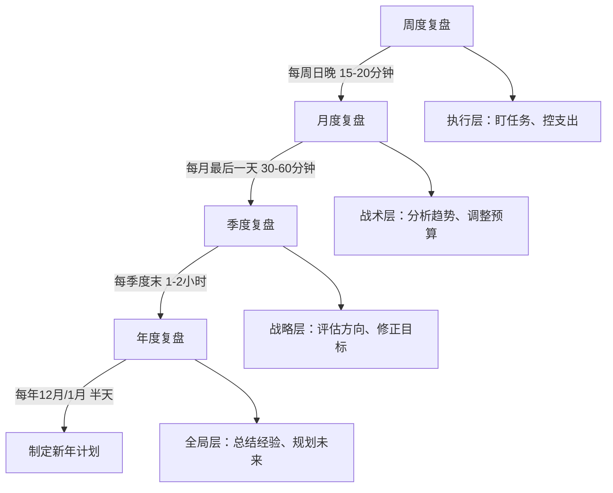

# 附录M：搞钱复盘与规划模板大全

> **使用说明**：本附录收录了一整套搞钱复盘与规划模板，覆盖年度、季度、月度、周度四个时间维度，以及投资、副业、支出、税务、债务等专项领域。建议打印或复制到电子表格中使用，在每个时间节点认真填写，坚持一年，你的财务状况将发生质的飞跃。

## 复盘方法论：为什么复盘比努力更重要

### 复盘的本质

复盘不是"填表格"，而是一套**结构化的自我审视系统**。它帮你回答三个根本问题：

1. **钱从哪里来？** ——搞清楚你的收入结构是否健康
2. **钱到哪里去？** ——识别消费黑洞和投资陷阱
3. **钱该怎么走？** ——制定可执行的优化策略

多数人的财务问题不是"赚得少"，而是"不知道自己赚了多少、花了多少、亏在哪里"。复盘就是让模糊的财务状况变得**可量化、可追踪、可优化**。

### 复盘的频率与节奏

不同时间维度的复盘承担不同职责，缺一不可：

| 复盘维度 | 核心问题 | 耗时 | 关键产出 |
|---------|---------|------|---------|
| 周度 | 本周任务完成了吗？花了多少？ | 15-20分钟 | 下周三个重点 |
| 月度 | 月度目标达标了吗？趋势如何？ | 30-60分钟 | 下月调整策略 |
| 季度 | 方向对不对？需要加速还是转向？ | 1-2小时 | 季度行动计划 |
| 年度 | 这一年财务状况质变了吗？ | 半天 | 新年财务愿景与计划 |

### 复盘常见误区

| 误区 | 正确做法 |
|------|---------|
| 只看数字不分析原因 | 每个异常数字都要追问"为什么" |
| 复盘完就忘，不执行 | 复盘后必须确定1-3个具体行动项，写入日历 |
| 报喜不报忧，自我美化 | 诚实面对亏损和浪费，才能真正改进 |
| 只复盘收入，忽略支出 | 支出优化比收入提升更容易见效 |
| 照搬别人的模板不调整 | 根据自己的实际情况增删模板字段 |
| 追求完美，迟迟不动笔 | 80%的复盘比100%的空白有价值 |

### 评分系统说明

本模板中大量使用⭐评分系统，统一标准如下：

| 评分 | 含义 | 行动指引 |
|------|------|---------|
| ⭐⭐⭐⭐⭐ | 卓越 | 保持并分享经验 |
| ⭐⭐⭐⭐ | 优秀 | 继续优化细节 |
| ⭐⭐⭐ | 合格 | 有改进空间，重点突破 |
| ⭐⭐ | 预警 | 需要立即制定改善计划 |
| ⭐ | 危险 | 紧急状态，全面整改 |

***

## 一、年度财务复盘模板

> **使用时机**：每年12月下旬或1月上旬，预留半天时间，找一个安静的地方，关掉手机，认真填写。如果已婚/有伴侣，建议双方一起参与。

### 1.1 基本信息

| 项目 | 填写内容 |
|------|----------|
| 复盘年度 | ____年 |
| 填写日期 | ____年____月____日 |
| 填写人 | ____________ |
| 家庭成员参与 | □ 是 □ 否 |
| 使用的记账工具 | ____________ |
| 数据完整度 | □ 全年完整 □ 部分缺失 □ 大量缺失 |

### 1.2 年度收入总览

#### 1.2.1 收入汇总表

| 收入来源 | 年初目标（元） | 实际收入（元） | 完成率 | 同比增长 |
|----------|---------------|---------------|--------|---------|
| 工资/薪金 | | | % | % |
| 年终奖/奖金 | | | % | % |
| 副业收入 | | | % | % |
| 投资收益 | | | % | % |
| 租金收入 | | | % | % |
| 知识产权/版税 | | | % | % |
| 兼职/外包 | | | % | % |
| 其他收入 | | | % | % |
| **合计** | | | **%** | **%** |

> **填写示例**（供参考，数字仅为示例）：
>
> | 收入来源 | 年初目标 | 实际收入 | 完成率 | 同比增长 |
> |----------|---------|---------|--------|---------|
> | 工资/薪金 | 240,000 | 264,000 | 110% | 15% |
> | 副业收入 | 36,000 | 28,800 | 80% | — |
> | 投资收益 | 20,000 | 31,200 | 156% | 42% |
> | 合计 | 296,000 | 324,000 | 109% | 18% |
>
> **解读**：工资超额完成（涨薪+加班费），副业未达标（客户流失），投资大幅超额（行情好+策略对）。明年重点：稳定副业客户群，不依赖投资超额。

#### 1.2.2 收入结构分析

填写完收入汇总表后，计算以下三个关键比率：

- **主动收入占比**：____% （工资+兼职+副业劳动所得 ÷ 总收入）
  - 目标：逐步降低至总收入的60%以下
  - 为什么重要：主动收入与你的时间直接挂钩，一旦停下来收入就归零
- **被动收入占比**：____% （投资收益+租金+版税等不依赖劳动的收入 ÷ 总收入）
  - 目标：逐步提升至总收入的40%以上
  - 为什么重要：被动收入是实现财务自由的核心指标
- **最大单一收入来源占比**：____%
  - 风险提示：超过80%说明收入过于集中，一旦失去这个来源将陷入危机

**收入结构评分标准**：

| 评分 | 主动收入占比 | 被动收入占比 | 收入来源数量 | 诊断 |
|------|------------|------------|------------|------|
| ⭐⭐⭐⭐⭐ | <50% | >30% | ≥4个 | 收入结构健康，抗风险能力强 |
| ⭐⭐⭐⭐ | 50%-60% | 20%-30% | 3个 | 结构良好，仍有优化空间 |
| ⭐⭐⭐ | 60%-70% | 10%-20% | 2个 | 合格水平，需加速被动收入建设 |
| ⭐⭐ | 70%-80% | 5%-10% | 2个 | 依赖主动收入，风险偏高 |
| ⭐ | >80% | <5% | 1个 | 高度依赖单一收入，急需多元化 |

本年度收入结构评分：________ / ⭐⭐⭐⭐⭐

**结构优化建议**（根据你的评分勾选适用项）：

- □ 开拓第二收入来源（副业/兼职/技能变现）
- □ 增加投资本金，提升投资收益占比
- □ 探索被动收入渠道（租金/版税/自动化副业）
- □ 争取加薪或跳槽，提高主动收入效率

### 1.3 年度支出总览

#### 1.3.1 支出汇总表

| 支出类别 | 年初预算（元） | 实际支出（元） | 预算偏差 | 占总支出比 |
|----------|---------------|---------------|---------|-----------|
| 住房（房贷/房租） | | | % | % |
| 餐饮/食品 | | | % | % |
| 交通出行 | | | % | % |
| 通讯/网络 | | | % | % |
| 服饰/日用品 | | | % | % |
| 医疗/健康 | | | % | % |
| 教育/学习 | | | % | % |
| 娱乐/社交 | | | % | % |
| 保险 | | | % | % |
| 孝亲/人情 | | | % | % |
| 旅行/度假 | | | % | % |
| 其他支出 | | | % | % |
| **合计** | | | **%** | **100%** |

**填写技巧**：

1. 如果你使用记账APP（如随手记、钱迹、MoneyWiz），直接导出年度报表填入
2. 如果数据不全，先估算一个范围，明年开始认真记账
3. 预算偏差 = (实际 - 预算) ÷ 预算 × 100%，正数=超支，负数=节余

#### 1.3.2 支出质量评估

不是所有支出都是"坏"的。把支出分为三类，评估你的消费质量：

- **消费支出占比**：____%（衣食住行等维持基本生活的必要消费）
- **投资性支出占比**：____%（学习、健康、人脉、技能提升等能带来未来回报的消费）
- **浪费性支出占比**：____%（冲动消费、闲置物品、无用订阅、人情攀比等）

**为什么投资性支出很重要？** 很多人为了"省钱"砍掉学习和社交预算，这其实是最大的浪费。每月花500元学习一个新技能，可能带来每月5000元的收入增长——投资回报率1000%。

**支出质量评分标准**：

| 评分 | 消费支出占比 | 投资性支出占比 | 浪费性支出占比 | 诊断 |
|------|------------|--------------|--------------|------|
| ⭐⭐⭐⭐⭐ | <60% | >20% | <5% | 支出结构优秀，钱花在刀刃上 |
| ⭐⭐⭐⭐ | 60%-70% | 15%-20% | 5%-10% | 良好，适当减少浪费即可 |
| ⭐⭐⭐ | 70%-80% | 10%-15% | 10%-15% | 合格，浪费性支出需要控制 |
| ⭐⭐ | 80%-90% | 5%-10% | 15%-20% | 预警，消费占比过高 |
| ⭐ | >90% | <5% | >20% | 危险，入不敷出风险 |

本年度支出质量评分：________ / ⭐⭐⭐⭐⭐

### 1.4 年度储蓄与投资

| 指标 | 年初目标 | 实际值 | 完成情况 |
|------|---------|--------|---------|
| 储蓄率 | % | % | □ 超额 □ 达标 □ 未达标 |
| 投资总额 | 元 | 元 | □ 超额 □ 达标 □ 未达标 |
| 投资收益率 | % | % | □ 超额 □ 达标 □ 未达标 |
| 应急基金 | 元 | 元 | □ 超额 □ 达标 □ 未达标 |
| 净资产增长 | 元 | 元 | □ 超额 □ 达标 □ 未达标 |

> **储蓄率** = (总收入 - 总支出) ÷ 总收入 × 100%。这是衡量财务健康最核心的单一指标。

**储蓄率评分标准**：

| 评分 | 储蓄率 | 对应描述 | 财务自由进度 |
|------|--------|---------|------------|
| ⭐⭐⭐⭐⭐ | >40% | 财务自由快车道 | 约10-15年可达 |
| ⭐⭐⭐⭐ | 30%-40% | 优秀储蓄能力 | 约15-20年可达 |
| ⭐⭐⭐ | 20%-30% | 健康储蓄水平 | 约20-30年可达 |
| ⭐⭐ | 10%-20% | 需要加强 | 30年以上或不可达 |
| ⭐ | <10% | 紧急状态 | 当前路径不可达 |

### 1.5 年度资产负债表

| 项目 | 年初金额（元） | 年末金额（元） | 变动幅度 |
|------|---------------|---------------|---------|
| **资产** | | | |
| 现金及活期存款 | | | % |
| 定期存款/货币基金 | | | % |
| 股票/基金 | | | % |
| 债券/理财产品 | | | % |
| 房产（市值） | | | % |
| 车辆（净值） | | | % |
| 其他资产 | | | % |
| **资产合计** | | | **%** |
| **负债** | | | |
| 房贷余额 | | | % |
| 车贷余额 | | | % |
| 信用卡欠款 | | | % |
| 其他负债 | | | % |
| **负债合计** | | | **%** |
| **净资产** | | | **%** |

**关键指标计算**：

- **资产负债率** = 负债合计 ÷ 资产合计 × 100%。健康值：<50%
- **净资产增长率** = (年末净资产 - 年初净资产) ÷ 年初净资产 × 100%。目标：>10%
- **流动比率** = 流动资产（现金+活期+货币基金） ÷ 流动负债（信用卡+短期借款）。健康值：≥2

### 1.6 年度搞钱大事记

按时间顺序记录本年度与搞钱相关的重要事件。这个表格的价值在于：帮你识别"关键转折点"——那些对财务状况产生重大影响的决策和事件。

| 月份 | 事件 | 影响（正面/负面） | 经验教训 |
|------|------|------------------|---------|
| 1月 | | | |
| 2月 | | | |
| 3月 | | | |
| 4月 | | | |
| 5月 | | | |
| 6月 | | | |
| 7月 | | | |
| 8月 | | | |
| 9月 | | | |
| 10月 | | | |
| 11月 | | | |
| 12月 | | | |

> **填写示例**：
> | 月份 | 事件 | 影响 | 经验教训 |
> |------|------|------|---------|
> | 3月 | 跳槽到新公司 | 正面（月薪+4000） | 谈薪时要有数据支撑，提前调研市场价 |
> | 6月 | 冲动买了PS5 | 负面（花了3800，玩了2周就吃灰） | 大额消费强制72小时冷静期 |
> | 9月 | 开始基金定投 | 正面（建立了投资纪律） | 选对工具比选对时机更重要 |

### 1.7 年度反思与总结

**做得好的三件事**：

1. ________________________________________________
2. ________________________________________________
3. ________________________________________________

**做得不好的三件事**：

1. ________________________________________________
2. ________________________________________________
3. ________________________________________________

**最意外的收获**：______________________________________

**最大的遗憾**：________________________________________

**如果重来一次，会做的一件事**：__________________________

**综合财务评分**：________ / 100分

| 维度 | 权重 | 得分 | 加权分 |
|------|------|------|--------|
| 收入增长 | 25% | /100 | |
| 支出控制 | 20% | /100 | |
| 储蓄积累 | 20% | /100 | |
| 投资表现 | 20% | /100 | |
| 财务知识提升 | 15% | /100 | |
| **综合** | **100%** | | **/100** |

> **评分参考**：
> - 收入增长：同比增长>15%=90分，10-15%=75分，5-10%=60分，0-5%=40分，负增长=20分
> - 支出控制：预算偏差<5%=90分，5-10%=75分，10-20%=60分，>20%=40分
> - 储蓄积累：储蓄率>40%=90分，30-40%=75分，20-30%=60分，10-20%=40分，<10%=20分
> - 投资表现：跑赢基准=90分，持平=60分，跑输<5%=40分，跑输>5%=20分
> - 财务知识：读>5本理财书=90分，3-5本=75分，1-2本=60分，0本=30分

***

## 二、年度搞钱计划模板

> **使用时机**：年度复盘完成后立即填写。复盘是"诊断"，计划是"处方"。没有计划的复盘等于白复盘。

### 2.1 新年度财务愿景

**用一句话描述你新一年的搞钱目标**：

> ________________________________________________

> **填写示例**：
> - 「2026年，我要实现年收入突破50万，储蓄率达到35%，副业收入超过主业收入的30%。」
> - 「2026年，我要还清所有消费贷，建立6个月应急基金，开始每月定投3000元。」
> - 「2026年，我要把投资收益率做到12%以上，被动收入占比提升到15%。」

**好目标 vs 坏目标**：

| ❌ 坏目标 | ✅ 好目标 | 为什么好 |
|----------|---------|---------|
| 多赚点钱 | 年收入达到36万，月均3万 | 具体、可衡量 |
| 少花点钱 | 月度非必要支出控制在2000元以内 | 有明确上限 |
| 学投资 | 6月前读完3本投资书并完成实盘模拟 | 有时限、有动作 |
| 存钱买房 | 年底前存款达到20万（首付目标50万） | 有进度节点 |

### 2.2 新年度收入目标规划

| 收入来源 | 当前值（元） | 目标值（元） | 增长率 | 具体策略 |
|----------|-------------|-------------|--------|---------|
| 工资/薪金 | | | % | |
| 年终奖/奖金 | | | % | |
| 副业收入 | | | % | |
| 投资收益 | | | % | |
| 租金收入 | | | % | |
| 其他收入 | | | % | |
| **合计** | | | **%** | |

**策略填写指引**（不要写空话，要写可执行的动作）：

- 工资增长策略示例：「Q1完成PMP认证→Q2申请晋升→预期月薪+3000」
- 副业增长策略示例：「小红书账号从500粉做到5000粉→接广告月均2000」
- 投资收益策略示例：「每月定投5000到沪深300+中证500，预期年化8-10%」

### 2.3 新年度支出预算规划

| 支出类别 | 月预算（元） | 年预算（元） | 优化措施 |
|----------|-------------|-------------|---------|
| 住房 | | | |
| 餐饮 | | | |
| 交通 | | | |
| 通讯/网络 | | | |
| 服饰/日用品 | | | |
| 医疗/健康 | | | |
| 教育/学习 | | | |
| 娱乐/社交 | | | |
| 保险 | | | |
| 孝亲/人情 | | | |
| 旅行 | | | |
| 弹性备用金 | | | |
| **合计** | | | |

**预算编制原则**：

1. **50/30/20法则**作为起点：50%必要支出、30%个人消费、20%储蓄投资
2. **弹性备用金**必须留：月预算的5-10%，应对突发支出
3. **教育/学习预算**不要砍：这是投资回报率最高的支出
4. **优化措施**要具体：不说"少吃饭店"，改说"工作日带饭，周末限一次外食"

### 2.4 新年度搞钱目标分解

**年度总目标**：________________________

| 季度 | 收入目标 | 储蓄目标 | 投资目标 | 关键动作 |
|------|---------|---------|---------|---------|
| Q1 | | | | |
| Q2 | | | | |
| Q3 | | | | |
| Q4 | | | | |

**分解技巧**：不要简单地把年目标除以4。考虑季节性因素：

- **Q1**：年终奖发放期，收入通常最高，适合设定高储蓄目标
- **Q2**：常规收入期，适合启动新的副业/投资计划
- **Q3**：年中评估期，根据上半年实际调整下半年策略
- **Q4**：双十一/年底消费高峰，重点控制支出

### 2.5 新年度搞钱行动计划

#### 2.5.1 收入提升计划

| 行动项 | 预期收益 | 投入时间 | 启动时间 | 优先级 |
|--------|---------|---------|---------|--------|
| | | | | □高 □中 □低 |
| | | | | □高 □中 □低 |
| | | | | □高 □中 □低 |

> **填写示例**：
>
> | 行动项 | 预期收益 | 投入时间 | 启动时间 | 优先级 |
> |--------|---------|---------|---------|--------|
> | 考取PMP证书加薪 | +3,000/月 | 3个月备考 | 1月 | □高 |
> | 开设小红书账号做内容 | +2,000/月 | 5h/周 | 2月 | □高 |
> | 学习基金定投 | 年化8%+ | 2h/周 | 1月 | □中 |
> | 接外包项目 | +5,000/单 | 周末10h | 3月 | □低 |

#### 2.5.2 支出优化计划

| 优化项 | 预期节省（元/月） | 具体措施 | 执行难度 |
|--------|-----------------|---------|---------|
| | | | □容易 □中等 □困难 |
| | | | □容易 □中等 □困难 |
| | | | □容易 □中等 □困难 |

**低难度高回报的优化项参考**：

| 优化项 | 月省金额 | 难度 | 说明 |
|--------|---------|------|------|
| 取消无用订阅 | 50-200元 | 容易 | 审计所有自动续费 |
| 工作日带饭 | 500-1000元 | 中等 | 周末批量备餐 |
| 话费套餐降级 | 30-100元 | 容易 | 多数人套餐远超实际用量 |
| 健身房→户外运动 | 200-500元 | 容易 | 跑步/骑行/徒手训练 |

#### 2.5.3 投资计划

| 投资品种 | 配置比例 | 月定投金额 | 预期年化 | 策略说明 |
|----------|---------|-----------|---------|---------|
| | | | | |
| | | | | |
| | | | | |

**新手投资配置参考**（仅供参考，不构成投资建议）：

| 风险偏好 | 股票类 | 债券类 | 现金类 | 其他 |
|---------|--------|--------|--------|------|
| 保守型 | 20% | 50% | 20% | 10%（黄金等） |
| 稳健型 | 40% | 35% | 15% | 10% |
| 平衡型 | 60% | 25% | 10% | 5% |
| 成长型 | 80% | 10% | 5% | 5% |

#### 2.5.4 学习计划

| 学习内容 | 学习方式 | 目标完成时间 | 预期应用 |
|----------|---------|-------------|---------|
| | | | |
| | | | |

> **学习资源推荐**：
> - 入门：《小狗钱钱》《穷爸爸富爸爸》《财务自由之路》
> - 进阶：《聪明的投资者》《漫步华尔街》《投资最重要的事》
> - 实操：《指数基金投资指南》《定投十年财务自由》
> - 深度：《证券分析》《周期》《价值》

### 2.6 新年度风险预案

| 潜在风险 | 发生概率 | 影响程度 | 应对措施 |
|----------|---------|---------|---------|
| 失业/降薪 | □高 □中 □低 | □高 □中 □低 | |
| 大额意外支出 | □高 □中 □低 | □高 □中 □低 | |
| 投资亏损 | □高 □中 □低 | □高 □中 □低 | |
| 副业失败 | □高 □中 □低 | □高 □中 □低 | |
| 健康问题 | □高 □中 □低 | □高 □中 □低 | |
| 家庭变故 | □高 □中 □低 | □高 □中 □低 | |

**风险应对策略库**（根据情况选用）：

- **失业风险**：保持6个月应急基金 + 持续更新简历 + 维护行业人脉
- **大额支出**：弹性备用金 + 了解保险理赔流程 + 避免信用卡分期
- **投资亏损**：设定止损线 + 分散配置 + 不借钱投资
- **副业失败**：控制前期投入 + 设定止损时间 + 保留主业稳定性

### 2.7 里程碑与奖励机制

| 里程碑 | 目标日期 | 达成奖励 | 惩罚机制 |
|--------|---------|---------|---------|
| | | | |
| | | | |

> **填写示例**：
>
> | 里程碑 | 目标日期 | 达成奖励 | 惩罚机制 |
> |--------|---------|---------|---------|
> | 储蓄达到5万 | 3月31日 | 买一本想看的书 | 每天早起跑步1周 |
> | 副业月入过万 | 6月30日 | 请自己吃一顿大餐 | 取消下月娱乐预算 |
> | 投资收益率>10% | 12月31日 | 买一件心仪已久的东西 | 写5000字复盘报告 |
>
> **设计原则**：奖励要即时、具体、有吸引力；惩罚要有约束力但不伤身体。避免用"吃大餐"作为惩罚（那还是奖励）。

***

## 三、季度复盘模板

> **使用时机**：每季度最后一周的周末，预留1-2小时。季度复盘的核心价值是"纠偏"——如果方向错了，越努力越浪费。

### 3.1 基本信息

| 项目 | 填写内容 |
|------|----------|
| 复盘季度 | ____年第____季度 |
| 填写日期 | ____年____月____日 |

### 3.2 季度财务数据

| 指标 | 季度目标 | 实际值 | 完成率 | 上季度值 | 环比变化 |
|------|---------|--------|--------|---------|---------|
| 总收入 | | | % | | % |
| 总支出 | | | % | | % |
| 净储蓄 | | | % | | % |
| 储蓄率 | % | % | | % | |
| 投资收益 | | | % | | % |
| 副业收入 | | | % | | % |

**环比分析要点**：

- 收入环比下降>10%：立即排查原因（是临时波动还是趋势性下降？）
- 支出环比上升>15%：检查是否有一次性大额支出，还是消费习惯恶化
- 储蓄率连续两个季度下降：触发预警，必须制定改善计划

### 3.3 季度搞钱目标完成情况

| 目标 | 目标值 | 完成值 | 状态 | 备注 |
|------|--------|--------|------|------|
| | | | □✅超额 □✅达标 □⏳进行中 □❌未完成 | |
| | | | □✅超额 □✅达标 □⏳进行中 □❌未完成 | |
| | | | □✅超额 □✅达标 □⏳进行中 □❌未完成 | |

**目标状态解读**：

- ✅超额完成：分析超额原因，是目标太低还是方法有效？可以提高下季度目标
- ✅达标：保持节奏，关注可持续性
- ⏳进行中：评估是否能在年内完成，不能则调整目标或加速
- ❌未完成：必须分析原因并决定——调整目标、改变策略、还是放弃

### 3.4 季度支出分析

**本季度三大支出类别**：

| 排名 | 支出类别 | 金额（元） | 占比 | 是否合理 |
|------|---------|-----------|------|---------|
| 1 | | | % | □是 □否 |
| 2 | | | % | □是 □否 |
| 3 | | | % | □是 □否 |

**本季度最大一笔非必要支出**：________________________

**这笔支出如果省下来，一年能多存**：________________元

**本季度最值得的一笔消费**：__________________________

**为什么值得？**：______________________________________

### 3.5 季度投资回顾

| 投资品种 | 季初市值 | 季末市值 | 收益率 | 基准对比 |
|----------|---------|---------|--------|---------|
| | | | % | □跑赢 □跑输 |
| | | | % | □跑赢 □跑输 |

**本季度投资决策回顾**：

- 最正确的一个决策：________________________________
- 最后悔的一个决策：________________________________
- 学到的最重要教训：________________________________

### 3.6 季度复盘总结

**本季度做得好的**：

1. ________________
2. ________________

**本季度需要改进的**：

1. ________________
2. ________________

**下季度三个重点目标**：

1. ________________
2. ________________
3. ________________

**季度搞钱能量指数**（1-10分）：______

> **评分参考**：10分=动力满满、收入暴涨；5分=一般般、有进步也有退步；1分=完全躺平、毫无进展
>
> 如果连续两个季度低于5分，说明当前搞钱方式可能不适合你，需要重新评估方向。

***

## 四、月度复盘模板

> **使用时机**：每月最后一天或次月第一天，30-60分钟。月度复盘是最关键的频率——既不会太频繁导致疲劳，又不会太久导致遗忘。

### 4.1 基本信息

| 项目 | 填写内容 |
|------|----------|
| 复盘月份 | ____年____月 |
| 填写日期 | ____年____月____日 |

### 4.2 月度收支快照

| 项目 | 本月预算 | 本月实际 | 偏差 | 上月实际 | 环比 |
|------|---------|---------|------|---------|------|
| 工资收入 | | | | | % |
| 副业收入 | | | | | % |
| 其他收入 | | | | | % |
| **收入合计** | | | | | **%** |
| 固定支出 | | | | | % |
| 可变支出 | | | | | % |
| **支出合计** | | | | | **%** |
| **月结余** | | | | | **%** |

**快速诊断**：

- 结余为正且环比增长：✅ 良好趋势
- 结余为正但环比下降：⚠️ 需要关注支出变化
- 结余为负：🚨 本月入不敷出，立即找出原因
- 连续两个月结余为负：🔴 紧急状态，必须削减支出

### 4.3 月度搞钱任务清单

| 序号 | 任务 | 优先级 | 截止日 | 完成状态 | 备注 |
|------|------|--------|--------|---------|------|
| 1 | | □高 □中 □低 | | □✅ □⏳ □❌ | |
| 2 | | □高 □中 □低 | | □✅ □⏳ □❌ | |
| 3 | | □高 □中 □低 | | □✅ □⏳ □❌ | |
| 4 | | □高 □中 □低 | | □✅ □⏳ □❌ | |
| 5 | | □高 □中 □低 | | □✅ □⏳ □❌ | |

**任务管理原则**：

- 高优先级任务不超过2个——聚焦才能产出
- 未完成任务要明确"顺延"还是"放弃"，不要无限拖延
- 每月任务完成率低于60%时，下月减少任务数量

### 4.4 月度支出明细Top 10

| 排名 | 日期 | 类别 | 金额（元） | 必要性 |
|------|------|------|-----------|--------|
| 1 | | | | □必要 □想要 □浪费 |
| 2 | | | | □必要 □想要 □浪费 |
| 3 | | | | □必要 □想要 □浪费 |
| 4 | | | | □必要 □想要 □浪费 |
| 5 | | | | □必要 □想要 □浪费 |
| 6 | | | | □必要 □想要 □浪费 |
| 7 | | | | □必要 □想要 □浪费 |
| 8 | | | | □必要 □想要 □浪费 |
| 9 | | | | □必要 □想要 □浪费 |
| 10 | | | | □必要 □想要 □浪费 |

**三分类法**：

- **必要**：不花会严重影响生活（房租、伙食、交通、医疗）
- **想要**：花了更好，不花也行（新衣服、外出就餐、娱乐）
- **浪费**：花了后悔（冲动购物、攀比消费、闲置物品）

**浪费性支出占比**：Top10中"浪费"项金额 ÷ Top10总金额 = ____%

### 4.5 月度习惯追踪

| 搞钱习惯 | 第1周 | 第2周 | 第3周 | 第4周 | 完成率 |
|----------|-------|-------|-------|-------|--------|
| 每日记账 | □□□□□□□ | □□□□□□□ | □□□□□□□ | □□□□□□□ | % |
| 学习理财知识30分钟 | □□□□□□□ | □□□□□□□ | □□□□□□□ | □□□□□□□ | % |
| 检查投资组合 | □ | □ | □ | □ | % |
| 记录副业进展 | □□□□□□□ | □□□□□□□ | □□□□□□□ | □□□□□□□ | % |
| 控制冲动消费 | □□□□□□□ | □□□□□□□ | □□□□□□□ | □□□□□□□ | % |
| 自定义：_______ | □□□□□□□ | □□□□□□□ | □□□□□□□ | □□□□□□□ | % |

**习惯养成建议**：

- 不要同时追踪超过6个习惯——注意力会被分散
- 习惯完成率低于50%说明难度太高，降低标准或拆分
- "控制冲动消费"建议用"消费冷静期"替代：想买的东西先加入购物车，等24小时再决定

### 4.6 月度复盘三问

**本月搞钱方面最大的一个进步是什么？**

________________________________________________

**本月搞钱方面最大的一个浪费/失误是什么？**

________________________________________________

**下个月必须做到的一件事是什么？**

________________________________________________

**月度搞钱评分**：______ / 10分

***

## 五、周度复盘模板

> **使用时机**：每周日晚上，15-20分钟。周度复盘不需要太复杂，核心是"保持节奏感"和"及时纠偏"。

### 5.1 基本信息

| 项目 | 填写内容 |
|------|----------|
| 复盘周次 | ____年第____周（____月____日 - ____月____日） |
| 填写日期 | ____年____月____日 |

### 5.2 本周收支速览

| 项目 | 金额（元） |
|------|-----------|
| 本周总收入 | |
| 本周总支出 | |
| 本周净结余 | |
| 累计月收入 | |
| 累计月支出 | |
| 月预算剩余 | |

**快速检查**：月预算剩余 ÷ 剩余周数 = 每周可支出额度。如果当前周支出已超标，下周需要克制。

### 5.3 本周搞钱任务完成情况

| 任务 | 优先级 | 计划完成日 | 实际状态 | 延期原因 |
|------|--------|-----------|---------|---------|
| | □A □B □C | | □✅ □❌ □→下周 | |
| | □A □B □C | | □✅ □❌ □→下周 | |
| | □A □B □C | | □✅ □❌ □→下周 | |
| | □A □B □C | | □✅ □❌ □→下周 | |

> **优先级说明**：A=必须本周完成；B=本周应完成；C=可以顺延
>
> **延期限额**：同一个任务最多延期2次，第3次必须决定——是真正重要的事就全力以赴，不是就果断放弃。

### 5.4 本周搞钱亮点

- **收入亮点**：____________________________________
- **省钱亮点**：____________________________________
- **学习亮点**：____________________________________
- **人脉亮点**：____________________________________

### 5.5 本周复盘反思

**本周搞钱状态自评**（1-10分）：______

**本周最聪明的一笔钱（花/赚/省）**：__________________

**本周最蠢的一笔钱**：________________________________

**下周三个搞钱重点**：

1. ________________
2. ________________
3. ________________

***

## 六、投资组合年度复盘模板

> **使用时机**：年度复盘的一部分，或单独在年末使用。投资复盘的核心不是"赚了多少"，而是"你的投资行为是否理性"。

### 6.1 基本信息

| 项目 | 填写内容 |
|------|----------|
| 复盘年度 | ____年 |
| 投资组合总市值（年初） | 元 |
| 投资组合总市值（年末） | 元 |
| 年度总投入 | 元 |
| 年度总收益 | 元 |
| 年度总收益率 | % |
| 基准收益率（沪深300等） | % |

**收益率计算方法**：

- **简单收益率** = (年末市值 - 年初市值 - 年度投入) ÷ (年初市值 + 年度投入) × 100%
- **资金加权收益率（XIRR）**：考虑资金进出时间，更准确。Excel/Sheets中用XIRR函数计算
- **对比基准**：A股投资者用沪深300，港股用恒生指数，美股用标普500

### 6.2 资产配置分析

#### 6.2.1 年末资产配置

| 资产类别 | 市值（元） | 占比 | 目标占比 | 偏差 |
|----------|-----------|------|---------|------|
| 现金/货币基金 | | % | % | |
| 债券/债券基金 | | % | % | |
| A股/股票基金 | | % | % | |
| 港股/美股 | | % | % | |
| ETF指数基金 | | % | % | |
| 黄金/贵金属 | | % | % | |
| 房产/REITs | | % | % | |
| 加密货币 | | % | % | |
| 其他 | | % | % | |
| **合计** | | **100%** | **100%** | |

#### 6.2.2 配置评估

- **股债比例**：____:____（参考公式：股票占比 ≈ 100 - 年龄，如30岁→70%股票+30%债券）
- **单一品种最高占比**：____%（建议<30%，避免过度集中）
- **单一市场最高占比**：____%（建议<50%，考虑跨市场分散）
- **是否需要再平衡**：□ 是 □ 否（偏差>5%时建议再平衡）

**再平衡操作指南**：

1. 偏差在5%以内：不需要调整，频繁交易反而增加成本
2. 偏差5%-10%：通过新增资金调整，卖出超配、买入低配
3. 偏差>10%：必须主动再平衡，可能涉及卖出部分盈利品种
4. 再平衡频率：建议每半年或每年一次，与年度复盘同步

### 6.3 个股/基金表现明细

| 投资标的 | 买入价 | 现价/卖出价 | 持仓数量 | 收益额 | 收益率 | 持有天数 |
|----------|--------|-----------|---------|--------|--------|---------|
| | | | | | % | |
| | | | | | % | |
| | | | | | % | |
| | | | | | % | |
| | | | | | % | |

**分析要点**：

- 赚钱的标的有什么共同特征？（行业、市值、持有时间）
- 亏钱的标的有什么共同特征？（追高、频繁交易、不了解标的）
- 收益率最高和最低的差距有多大？说明了什么问题？

### 6.4 投资行为分析

#### 6.4.1 交易频率统计

| 指标 | 数值 |
|------|------|
| 全年买入次数 | |
| 全年卖出次数 | |
| 平均持仓天数 | |
| 最长持有标的 | |
| 最短持有标的 | |

**交易频率诊断**：

| 交易频率 | 风格 | 适合人群 | 风险提示 |
|---------|------|---------|---------|
| <10次/年 | 价值/指数投资者 | 有耐心、相信长期 | 需要承受短期波动 |
| 10-50次/年 | 中线波段 | 有一定经验 | 需要纪律，容易情绪化 |
| 50-200次/年 | 趋势交易 | 技术分析能力强 | 交易成本侵蚀收益 |
| >200次/年 | 频繁交易 | — | 大概率亏损，需警惕 |

#### 6.4.2 投资决策回顾

| 决策 | 买入理由 | 卖出理由 | 结果 | 反思 |
|------|---------|---------|------|------|
| | | | □赚 □亏 | |
| | | | □赚 □亏 | |
| | | | □赚 □亏 | |

**决策反思框架**：

- 买入理由是否在买入时就明确？还是事后编的？
- 卖出是计划内的操作还是情绪驱动？
- 赚钱的决策是靠能力还是靠运气？（问自己：同样条件再来一次，还会做同样决策吗？）

### 6.5 投资风格评估

**你今年的投资风格更接近哪种？**

- □ 价值投资（长期持有优质标的，关注基本面）
- □ 成长投资（追逐高增长公司，关注营收增速）
- □ 指数投资（被动定投宽基指数，不做择时）
- □ 趋势交易（跟随市场趋势，技术分析为主）
- □ 投机交易（短线频繁操作，追热点概念）
- □ 佛系投资（买了不管，想起来才看）

**风格-收益匹配度分析**：

| 风格 | 如果收益好 | 如果收益差 |
|------|----------|----------|
| 价值投资 | 说明选股能力强 | 检查是否真的理解了公司价值 |
| 成长投资 | 说明眼光准 | 高增长=高估值=高风险，需要更强的止损纪律 |
| 指数投资 | 说明坚持定投有效 | 检查是否在低点恐慌停止了定投 |
| 趋势交易 | 说明纪律好 | 大概率是频繁交易导致成本侵蚀 |
| 投机交易 | 可能是运气 | 概率上必亏，建议转型 |
| 佛系投资 | 可能买对了标的 | 需要主动管理，不能完全放任 |

**实际收益与风格匹配度**：□ 高度匹配 □ 部分匹配 □ 严重错配

### 6.6 投资情绪日志

| 时间 | 市场状态 | 我的情绪 | 我的操作 | 事后评估 |
|------|---------|---------|---------|---------|
| | 大涨 | □贪婪 □兴奋 □平静 | | □正确 □错误 |
| | 大跌 | □恐惧 □焦虑 □平静 | | □正确 □错误 |
| | 震荡 | □迷茫 □焦虑 □平静 | | □正确 □错误 |

**情绪管理要点**：

- 大涨时最正确的操作往往是"什么都不做"或"适度止盈"
- 大跌时最正确的操作往往是"坚持定投"或"逢低加仓"
- 如果你的情绪和操作总是在"追涨杀跌"，说明需要建立投资纪律体系

### 6.7 投资年度评分卡

| 维度 | 评分（1-10） | 备注 |
|------|-------------|------|
| 收益表现 | | |
| 风险控制 | | |
| 资产配置 | | |
| 投资纪律 | | |
| 学习成长 | | |
| 情绪管理 | | |
| **综合评分** | **/10** | |

### 6.8 下年度投资计划

| 调整方向 | 具体措施 | 目标 |
|----------|---------|------|
| 增配 | | |
| 减配 | | |
| 清仓 | | |
| 新增 | | |

***

## 七、副业/创业年度复盘模板

> **使用时机**：有副业或创业项目的读者使用。副业复盘的核心是判断——这个副业值得继续投入吗？投入产出比合理吗？

### 7.1 基本信息

| 项目 | 填写内容 |
|------|----------|
| 副业/项目名称 | ____________ |
| 启动时间 | ____年____月 |
| 当前阶段 | □探索期 □增长期 □成熟期 □衰退期 |
| 投入方式 | □全职 □兼职（每周____小时） |

**阶段特征判断**：

| 阶段 | 特征 | 关键任务 |
|------|------|---------|
| 探索期（0-6月） | 收入低、不确定、在试错 | 验证商业模式，控制投入 |
| 增长期（6-18月） | 收入快速增长、需求明确 | 加大投入，优化流程 |
| 成熟期（18月+） | 收入稳定、增长放缓 | 提高效率，探索第二曲线 |
| 衰退期 | 收入下滑、竞争加剧 | 评估是否转型或退出 |

### 7.2 收入与利润分析

| 指标 | Q1 | Q2 | Q3 | Q4 | 全年合计 |
|------|----|----|----|----|---------|
| 总收入 | | | | | |
| 直接成本 | | | | | |
| 运营费用 | | | | | |
| 营销费用 | | | | | |
| **净利润** | | | | | |
| **利润率** | % | % | % | % | **%** |

**利润率健康度**：

| 利润率 | 评价 | 行动 |
|--------|------|------|
| >50% | 暴利 | 维护好产品/服务，谨慎扩大规模 |
| 30-50% | 优秀 | 可以适度投入增长 |
| 15-30% | 合格 | 优化成本结构 |
| 5-15% | 偏低 | 检查定价策略和成本控制 |
| <5% | 微利 | 认真考虑是否值得继续 |

### 7.3 关键业务指标

| 指标 | 年初 | 年末 | 增长率 |
|------|------|------|--------|
| 客户/用户数量 | | | % |
| 复购率/续费率 | % | % | |
| 客单价/ARPU | 元 | 元 | % |
| 获客成本 | 元 | 元 | % |
| 月均订单量 | | | % |
| 好评率/满意度 | % | % | |

**指标解读**：

- **获客成本 > 客户终身价值**：商业模式有问题，要么降成本要么提客单价
- **复购率持续下降**：产品/服务质量可能在退化，需要客户回访
- **客单价上升但订单量下降**：可能进入高端市场，也可能失去大众客户

### 7.4 成本效益分析

**时间投入分析**：

| 项目 | 数值 |
|------|------|
| 全年投入总时间 | 小时 |
| 月均投入时间 | 小时 |
| 小时收入（总收入÷总时间） | 元/小时 |
| 与主业时薪对比 | □高于 □持平 □低于 |

> **重要判断**：如果副业时薪持续低于主业时薪，需要认真考虑是否值得继续投入，或如何提升效率。副业时薪应该至少达到主业时薪的1.5倍才有长期价值——因为副业还消耗你的休息时间和精力恢复。

**提高副业时薪的方法**：

1. **砍掉低价值任务**：把重复性工作外包或自动化
2. **提高客单价**：提升服务质量，定位更高端客户
3. **建立模板化流程**：减少每次交付的时间
4. **从按时间收费转为按价值收费**：卖结果，不卖时间

### 7.5 产品/服务评估

| 产品/服务 | 收入占比 | 利润率 | 增长趋势 | 决策 |
|-----------|---------|--------|---------|------|
| | % | % | □上升 □平稳 □下降 | □加大投入 □维持 □缩减 □砍掉 |
| | % | % | □上升 □平稳 □下降 | □加大投入 □维持 □缩减 □砍掉 |
| | % | % | □上升 □平稳 □下降 | □加大投入 □维持 □缩减 □砍掉 |

**BCG矩阵决策法**：

- **明星产品**（高增长+高占比）：加大投入
- **现金牛**（低增长+高占比）：维持并用利润养其他产品
- **问题产品**（高增长+低占比）：评估能否成为明星，能则投，不能则弃
- **瘦狗产品**（低增长+低占比）：果断砍掉

### 7.6 竞争与市场分析

- **核心竞争优势**：____________________________________
- **主要竞争对手**：____________________________________
- **市场变化趋势**：____________________________________
- **明年最大的机会**：__________________________________
- **明年最大的威胁**：__________________________________

### 7.7 副业可行性评估

| 评估维度 | 评分（1-10） | 说明 |
|----------|-------------|------|
| 盈利能力 | | |
| 增长潜力 | | |
| 时间友好度 | | |
| 可持续性 | | |
| 技能匹配度 | | |
| 热情持久度 | | |
| **综合评分** | **/10** | |

**继续/调整/放弃决策**：

- □ **加大投入**：综合评分≥7分，且盈利能力≥7分
- □ **优化调整**：综合评分5-7分，需找到瓶颈突破
- □ **缩减规模**：综合评分3-5分，降低投入保底
- □ **果断放弃**：综合评分<3分，及时止损

### 7.8 下年度副业计划

| 季度 | 核心目标 | 关键行动 | 预期收入 |
|------|---------|---------|---------|
| Q1 | | | |
| Q2 | | | |
| Q3 | | | |
| Q4 | | | |

***

## 八、财务健康年度体检模板

> **使用时机**：每年至少做一次全面的财务健康体检，建议放在年度复盘的第一步。就像身体体检一样，早发现早治疗。

### 8.1 基本体检信息

| 项目 | 填写内容 |
|------|----------|
| 体检日期 | ____年____月____日 |
| 体检人 | ____________ |
| 年龄 | ____岁 |
| 家庭结构 | □单身 □已婚无孩 □已婚有孩 □其他 |
| 职业类型 | □体制内 □私企 □自由职业 □创业 □其他 |
| 收入稳定性 | □极稳定 □较稳定 □一般 □不稳定 |

### 8.2 核心财务指标检测

| 指标 | 你的数值 | 健康标准 | 状态 | 等级 |
|------|---------|---------|------|------|
| 储蓄率 | % | ≥20% | □健康 □预警 □危险 | |
| 应急基金月数 | 个月 | ≥6个月 | □健康 □预警 □危险 | |
| 负债收入比 | % | ≤40% | □健康 □预警 □危险 | |
| 资产负债率 | % | ≤50% | □健康 □预警 □危险 | |
| 投资收益率 | % | ≥通胀率+3% | □健康 □预警 □危险 | |
| 保险覆盖率 | | 覆盖主要风险 | □健康 □预警 □危险 | |
| 被动收入占比 | % | 趋势上升 | □健康 □预警 □危险 | |
| 净资产增长率 | % | ≥10% | □健康 □预警 □危险 | |
| 财务自由度 | % | 趋势上升 | □健康 □预警 □危险 | |
| 流动比率 | | ≥2 | □健康 □预警 □危险 | |

> **关键指标解读**：
>
> - **财务自由度** = 被动收入 ÷ 必要生活支出 × 100%。达到100%即实现财务自由
> - **负债收入比** = 每月还款额 ÷ 每月收入 × 100%。超过40%会严重影响生活质量
> - **应急基金月数** = 应急基金总额 ÷ 月均必要支出。低于3个月是危险信号
> - **投资收益率** = 年投资收益 ÷ 投资本金 × 100%。至少要跑赢通胀（约3%）

**指标异常处理指南**：

| 异常指标 | 紧急程度 | 第一步行动 |
|---------|---------|----------|
| 储蓄率<10% | 🔴 紧急 | 立即审计支出，砍掉所有非必要消费 |
| 应急基金<3个月 | 🔴 紧急 | 暂停所有投资，全力补充应急基金 |
| 负债收入比>50% | 🔴 紧急 | 制定债务偿还计划，优先还高息债 |
| 投资收益率<0% | ⚠️ 关注 | 检查是否是市场系统性风险还是选股问题 |
| 保险未覆盖 | ⚠️ 关注 | 优先配置意外险+医疗险，费用最低保障最高 |

### 8.3 风险承受能力评估

| 评估项 | 你的回答 | 评分 |
|--------|---------|------|
| 你的年龄阶段 | □25以下 □25-35 □35-45 □45-55 □55以上 | |
| 收入稳定性 | □极稳定 □较稳定 □一般 □不稳定 □极不稳定 | |
| 家庭负担 | □无 □较轻 □一般 □较重 □很重 | |
| 应急基金充足度 | □>12月 □6-12月 □3-6月 □<3月 □无 | |
| 投资经验年限 | □>10年 □5-10年 □3-5年 □1-3年 □<1年 | |
| 最大可承受亏损 | □<5% □5-10% □10-20% □20-30% □>30% | |
| **风险承受等级** | □保守型 □稳健型 □平衡型 □成长型 □进取型 | |

**风险等级与资产配置对应关系**：

| 风险等级 | 股票类 | 债券类 | 现金类 | 适合人群 |
|---------|--------|--------|--------|---------|
| 保守型 | 10-20% | 40-50% | 30-40% | 临近退休、收入不稳定 |
| 稳健型 | 20-40% | 30-40% | 20-30% | 有家庭负担、风险厌恶 |
| 平衡型 | 40-60% | 25-35% | 10-20% | 有稳定收入、中等风险偏好 |
| 成长型 | 60-80% | 10-20% | 5-10% | 年轻、收入增长期 |
| 进取型 | 80-90% | 5-10% | 5% | 年轻、高收入、强风险承受力 |

### 8.4 保险保障体检

| 保险类型 | 是否购买 | 保额（元） | 年缴保费（元） | 是否充足 |
|----------|---------|-----------|---------------|---------|
| 社保（五险一金） | □是 □否 | — | — | □是 □否 |
| 重疾险 | □是 □否 | | | □是 □否 |
| 医疗险 | □是 □否 | | | □是 □否 |
| 意外险 | □是 □否 | | | □是 □否 |
| 寿险 | □是 □否 | | | □是 □否 |
| 车险 | □是 □否 | | | □是 □否 |
| 家财险 | □是 □否 | | | □是 □否 |

**保险年总支出**：______元，占收入比：______%（建议范围：5%-10%）

**保险配置优先级**（预算有限时按此顺序配置）：

1. **社保**（必须）：覆盖基础医疗和养老
2. **百万医疗险**（优先）：年费200-800元，保额200-600万，性价比最高
3. **意外险**（优先）：年费100-300元，覆盖意外伤残和身故
4. **重疾险**（重要）：年费3000-8000元，确诊即赔，覆盖收入中断风险
5. **定期寿险**（重要）：有房贷/家庭负担时必配，保额覆盖负债+5年生活费

### 8.5 财务健康综合评分

| 维度 | 满分 | 得分 | 诊断意见 |
|------|------|------|---------|
| 收支平衡 | 20 | | |
| 储蓄积累 | 20 | | |
| 投资增值 | 20 | | |
| 风险保障 | 20 | | |
| 负债管理 | 10 | | |
| 财务知识 | 10 | | |
| **总分** | **100** | | |

**体检结论**：

| 分数区间 | 健康等级 | 处方建议 |
|---------|---------|---------|
| 90-100 | 🟢 财务健康 | 维持现状，持续优化，可以分享经验 |
| 75-89 | 🟡 基本健康 | 针对性改善薄弱项，重点突破低分维度 |
| 60-74 | 🟠 亚健康 | 制定3个月改善计划，每月底复查进展 |
| 40-59 | 🔴 需要治疗 | 紧急调整，聚焦核心问题（通常是支出失控或债务过高） |
| <40 | ⚫ 重症 | 全面整改，建议寻求专业财务顾问帮助 |

**你的财务健康等级**：__________________

**医生处方（改善建议）**：

1. ________________________________________________
2. ________________________________________________
3. ________________________________________________

***

## 九、搞钱目标追踪表

> **使用时机**：年初设定目标时填写，每月/季度更新进度。这张表是你的"搞钱GPS"——随时知道你在哪、离目标还有多远。

### 9.1 年度搞钱目标看板

| 编号 | 目标名称 | 类型 | 目标值 | 当前值 | 完成率 | 截止日 | 状态 |
|------|---------|------|--------|--------|--------|--------|------|
| G01 | | □收入 □储蓄 □投资 □减支 □技能 | | | % | | |
| G02 | | □收入 □储蓄 □投资 □减支 □技能 | | | % | | |
| G03 | | □收入 □储蓄 □投资 □减支 □技能 | | | % | | |
| G04 | | □收入 □储蓄 □投资 □减支 □技能 | | | % | | |
| G05 | | □收入 □储蓄 □投资 □减支 □技能 | | | % | | |

> **填写示例**：
>
> | 编号 | 目标名称 | 类型 | 目标值 | 当前值 | 完成率 | 截止日 | 状态 |
> |------|---------|------|--------|--------|--------|--------|------|
> | G01 | 年收入突破30万 | 收入 | 300,000 | 185,000 | 62% | 12月31日 | ⏳进行中 |
> | G02 | 储蓄率达到30% | 储蓄 | 30% | 26% | 87% | 12月31日 | ⏳进行中 |
> | G03 | 考取基金从业资格 | 技能 | 通过 | 备考中 | 50% | 6月30日 | ⏳进行中 |

**目标数量建议**：年度核心目标不超过5个。目标太多=没有目标。

### 9.2 目标月度进度追踪

以热力图形式追踪每个目标的月度进展：

| 目标 | 1月 | 2月 | 3月 | 4月 | 5月 | 6月 | 7月 | 8月 | 9月 | 10月 | 11月 | 12月 |
|------|-----|-----|-----|-----|-----|-----|-----|-----|-----|------|------|------|
| G01 | | | | | | | | | | | | |
| G02 | | | | | | | | | | | | |
| G03 | | | | | | | | | | | | |
| G04 | | | | | | | | | | | | |
| G05 | | | | | | | | | | | | |

**图例**：🟢=超额完成 🟡=基本完成 🔴=未完成 ⚪=无进展 ⬛=已完成

**使用技巧**：

- 如果某个目标连续3个月🔴，说明目标可能不合理或策略有问题，需要调整
- 如果某个目标全部🟢，说明目标太容易，明年可以提高标准
- 热力图一眼能看出全年节奏——是前松后紧还是持续稳定

### 9.3 目标SMART检验

对每个目标进行SMART原则检验：

| 目标 | S具体 | M可衡量 | A可实现 | R相关性 | T有时限 | 通过 |
|------|-------|---------|---------|---------|---------|------|
| G01 | □ | □ | □ | □ | □ | □ |
| G02 | □ | □ | □ | □ | □ | □ |
| G03 | □ | □ | □ | □ | □ | □ |

> **SMART原则详解**：
> - **S（Specific）具体**：目标描述不含糊，明确知道要做什么
> - **M（Measurable）可衡量**：有数字指标，可以判断是否达成
> - **A（Achievable）可实现**：基于当前条件有可能达成，不是空中楼阁
> - **R（Relevant）相关**：与你的财务愿景和人生目标相关
> - **T（Time-bound）有时限**：有明确的截止日期
>
> **不合格目标修正示例**：
> - ❌ "多赚点钱" → ✅ "2026年副业收入达到6万元，月均5000元"
> - ❌ "少花点钱" → ✅ "月度非必要支出控制在2000元以内"
> - ❌ "学投资" → ✅ "6月30日前读完3本投资书籍并完成实盘模拟"

### 9.4 目标障碍与对策

| 目标编号 | 最大障碍 | 障碍类型 | 对策 | 需要的资源/帮助 |
|---------|---------|---------|------|---------------|
| G01 | | □时间 □资金 □技能 □动力 □环境 | | |
| G02 | | □时间 □资金 □技能 □动力 □环境 | | |
| G03 | | □时间 □资金 □技能 □动力 □环境 | | |

**障碍突破策略**：

| 障碍类型 | 常见表现 | 突破方法 |
|---------|---------|---------|
| 时间不够 | "太忙了没时间搞副业" | 审计时间使用，砍掉无效社交和刷手机时间 |
| 资金不足 | "没钱投资" | 从每月100元开始，关键是建立习惯 |
| 技能不足 | "不会做" | 用1个月集中学习，边学边做 |
| 动力不足 | "坚持不下去" | 找到搞钱伙伴互相监督，设置小里程碑奖励 |
| 环境限制 | "身边人都不搞钱" | 加入搞钱社群，用环境影响行为 |

***

## 十、支出分析报告模板

> **使用时机**：每季度或每半年做一次深度支出分析。月度复盘看趋势，季度分析找规律。

### 10.1 报告基本信息

| 项目 | 填写内容 |
|------|----------|
| 分析期间 | ____年____月____日 至 ____年____月____日 |
| 分析人 | ____________ |
| 数据来源 | □记账APP □银行账单 □手动记录 |

### 10.2 支出总量分析

| 指标 | 本期 | 上期 | 同比 | 环比 |
|------|------|------|------|------|
| 总支出 | 元 | 元 | % | % |
| 日均支出 | 元 | 元 | % | % |
| 笔均支出 | 元 | 元 | % | % |
| 交易笔数 | 笔 | 笔 | % | % |
| 最大单笔 | 元 | 元 | — | — |
| 最小单笔 | 元 | 元 | — | — |

**日均支出参考基准**（仅供对比，根据城市和个人情况调整）：

| 城市级别 | 节俭型 | 正常型 | 宽裕型 |
|---------|--------|--------|--------|
| 一线城市 | <150元 | 150-300元 | >300元 |
| 二线城市 | <100元 | 100-200元 | >200元 |
| 三四线城市 | <70元 | 70-150元 | >150元 |

### 10.3 分类支出详细分析

| 类别 | 金额 | 占比 | 预算 | 偏差 | 趋势 | 评价 |
|------|------|------|------|------|------|------|
| 餐饮 | | % | | % | □↑ □→ □↓ | □合理 □偏高 □失控 |
| 住房 | | % | | % | □↑ □→ □↓ | □合理 □偏高 □失控 |
| 交通 | | % | | % | □↑ □→ □↓ | □合理 □偏高 □失控 |
| 购物 | | % | | % | □↑ □→ □↓ | □合理 □偏高 □失控 |
| 娱乐 | | % | | % | □↑ □→ □↓ | □合理 □偏高 □失控 |
| 教育 | | % | | % | □↑ □→ □↓ | □合理 □偏高 □失控 |
| 医疗 | | % | | % | □↑ □→ □↓ | □合理 □偏高 □失控 |
| 社交 | | % | | % | □↑ □→ □↓ | □合理 □偏高 □失控 |
| 其他 | | % | | % | □↑ □→ □↓ | □合理 □偏高 □失控 |

**各品类合理占比参考**：

| 支出类别 | 建议占比 | 超标信号 |
|---------|---------|---------|
| 住房 | <30% | 超过35%考虑换房或合租 |
| 餐饮 | 15-25% | 外卖/外食频率过高 |
| 交通 | 5-10% | 通勤距离过长或打车过多 |
| 购物 | 5-15% | 囤货过多或频繁冲动消费 |
| 娱乐 | 5-10% | 娱乐消费占比持续上升需警惕 |
| 教育 | 5-15% | 低于5%说明投资自己不够 |

### 10.4 支出时间分布分析

**按周分布**：

| | 周一 | 周二 | 周三 | 周四 | 周五 | 周六 | 周日 |
|------|------|------|------|------|------|------|------|
| 金额 | | | | | | | |
| 笔数 | | | | | | | |

**按时段分布**：

| 时段 | 6-9时 | 9-12时 | 12-14时 | 14-18时 | 18-21时 | 21-24时 |
|------|-------|--------|---------|---------|---------|---------|
| 金额 | | | | | | |
| 占比 | % | % | % | % | % | % |

**分析洞察**：

- 消费高峰日：____________（通常因为____________）
- 消费高峰时段：____________（通常因为____________）
- **行动建议**：在消费高峰时段设置"消费冷静提醒"

### 10.5 消费心理分析

| 消费动机 | 笔数 | 金额 | 占比 | 满意度 |
|----------|------|------|------|--------|
| 刚需（不得不花） | | | % | — |
| 改善（提升生活品质） | | | % | □满意 □一般 □后悔 |
| 冲动（临时起意） | | | % | □满意 □一般 □后悔 |
| 社交（人情面子） | | | % | □满意 □一般 □后悔 |
| 情绪（开心/难过时消费） | | | % | □满意 □一般 □后悔 |
| 攀比（跟风/面子） | | | % | □满意 □一般 □后悔 |

**消费心理学要点**：

- **冲动消费占比**：如果超过总支出的15%，说明你需要建立消费冷静机制
- **情绪消费**：识别自己的情绪消费模式（有人心情好时消费，有人心情差时消费），针对性设置防线
- **后悔率**：如果你对某类消费的后悔率超过30%，说明这类消费大概率是浪费

### 10.6 订阅服务审计

| 订阅服务 | 月费（元） | 使用频率 | 使用率 | 继续/取消 |
|----------|-----------|---------|--------|----------|
| | | □每天 □每周 □偶尔 □几乎不用 | % | □继续 □取消 □降级 |
| | | □每天 □每周 □偶尔 □几乎不用 | % | □继续 □取消 □降级 |
| | | □每天 □每周 □偶尔 □几乎不用 | % | □继续 □取消 □降级 |
| | | □每天 □每周 □偶尔 □几乎不用 | % | □继续 □取消 □降级 |
| | | □每天 □每周 □偶尔 □几乎不用 | % | □继续 □取消 □降级 |

**订阅总月费**：______元，年费：______元

**审计结论**：可取消______项，月省______元，年省______元

**订阅审计技巧**：

1. 查看银行/支付宝/微信的自动扣费列表，列出所有订阅
2. 使用率<50%的订阅：立即取消或降级
3. 有免费替代品的订阅：切换到免费方案
4. 年付比月付便宜30%以上：如果你确定会持续使用，改年付

### 10.7 支出优化建议

| 优化方向 | 当前支出 | 优化后支出 | 月省金额 | 实施难度 | 实施计划 |
|----------|---------|-----------|---------|---------|---------|
| | | | | □容易 □中等 □困难 | |
| | | | | □容易 □中等 □困难 | |
| | | | | □容易 □中等 □困难 | |
| | | | | □容易 □中等 □困难 | |
| | | | | □容易 □中等 □困难 | |

**优化潜力合计**：月省______元，年省______元

### 10.8 支出分析总结

**本期支出评分**：______ / 100分

| 评分维度 | 分值 | 得分 |
|---------|------|------|
| 预算执行度 | 30 | |
| 支出合理性 | 25 | |
| 订阅管理 | 15 | |
| 冲动消费控制 | 15 | |
| 优化行动力 | 15 | |
| **合计** | **100** | |

**三条核心改善建议**：

1. ________________________________________________
2. ________________________________________________
3. ________________________________________________

***

## 十一、债务管理复盘模板

> **使用时机**：有负债（房贷除外的消费贷、信用卡分期、网贷等）的读者使用。债务是搞钱路上最大的绊脚石，必须正视和管理。

### 11.1 债务全景图

| 债务类型 | 债权人 | 欠款金额（元） | 年利率 | 月还款额 | 剩余期数 | 优先级 |
|---------|--------|---------------|--------|---------|---------|--------|
| 信用卡 | | | % | | | |
| 消费贷 | | | % | | | |
| 网贷 | | | % | | | |
| 花呗/白条 | | | % | | | |
| 亲友借款 | | | % | | | |
| 其他 | | | % | | | |
| **合计** | | | | | | |

### 11.2 债务健康指标

| 指标 | 你的数值 | 健康标准 | 评价 |
|------|---------|---------|------|
| 债务收入比 | % | ≤40% | □健康 □预警 □危险 |
| 高息债务占比 | % | <20% | □健康 □预警 □危险 |
| 月还款/月收入 | % | ≤30% | □健康 □预警 □危险 |
| 债务总额/年收入 | 倍 | ≤0.5倍 | □健康 □预警 □危险 |

### 11.3 债务偿还策略

**两种主流策略**：

**雪球法（Snowball）**——先还最小债务：
- 优点：快速消灭债务数量，心理激励强
- 适合：需要动力坚持还款的人

**雪崩法（Avalanche）**——先还最高利率：
- 优点：总利息支出最少，数学上最优
- 适合：有纪律、能坚持长期计划的人

| 还款顺序 | 债务名称 | 欠款金额 | 利率 | 月还款 | 预计还清日期 | 策略 |
|---------|---------|---------|------|--------|------------|------|
| 第1还 | | | | | | □雪球 □雪崩 |
| 第2还 | | | | | | |
| 第3还 | | | | | | |

### 11.4 债务消除进度追踪

| 月份 | 月初余额 | 本月还款 | 新增借款 | 月末余额 | 消除进度 |
|------|---------|---------|---------|---------|---------|
| 1月 | | | | | % |
| 2月 | | | | | % |
| ... | | | | | |
| 12月 | | | | | % |

**关键规则**：在还清所有高息债务之前，停止一切非必要消费和投资。

***

## 十二、税务筹划年度回顾模板

> **使用时机**：每年3-6月个税汇算清缴前后，以及年度复盘时使用。合理的税务筹划是合法的"省钱"。

### 12.1 年度税务概况

| 项目 | 金额（元） |
|------|-----------|
| 年度税前收入 | |
| 专项扣除合计 | |
| 应纳税所得额 | |
| 已缴税款 | |
| 应退税/补税 | |

### 12.2 专项附加扣除检查

| 扣除项目 | 是否享受 | 扣除金额 | 备注 |
|---------|---------|---------|------|
| 子女教育 | □是 □否 | 元/月 | 每个子女1000-2000元/月 |
| 继续教育 | □是 □否 | 元/月 | 学历400元/月，职业资格3600元/年 |
| 大病医疗 | □是 □否 | 元/年 | 超1.5万部分，上限8万 |
| 住房贷款利息 | □是 □否 | 元/月 | 首套房1000元/月，最长240个月 |
| 住房租金 | □是 □否 | 元/月 | 800-1500元/月（按城市） |
| 赡养老人 | □是 □否 | 元/月 | 独生子女3000元/月 |
| 3岁以下婴幼儿照护 | □是 □否 | 元/月 | 每个婴幼儿2000元/月 |

**提醒**：很多纳税人因为不了解政策而少填了专项附加扣除。检查一遍，可能每年多省几千元税款。

### 12.3 税务优化记录

| 优化措施 | 节税金额 | 实施情况 |
|---------|---------|---------|
| 补填专项附加扣除 | 元 | □已完成 □未完成 |
| 年终奖计税方式选择 | 元 | □单独计税 □合并计税 |
| 个人养老金缴纳 | 元 | □已缴 □未缴 |
| 公益捐赠抵扣 | 元 | □已完成 □未完成 |
| 其他 | 元 | |

**年终奖计税选择**：年收入较高时，年终奖"单独计税"通常更省税；年收入较低时，"合并计税"可能更优。用个税APP两种方式都算一遍，选税少的那个。

***

## 十三、家庭财务复盘模板

> **使用时机**：已婚或有固定伴侣的读者使用。家庭财务需要双方透明、共同规划，避免因金钱问题产生矛盾。

### 13.1 家庭基本信息

| 项目 | 填写内容 |
|------|----------|
| 复盘年度 | ____年 |
| 家庭成员 | ____________ |
| 收入模式 | □共同账户 □各自管理+公共支出AA □混合模式 |
| 财务沟通频率 | □每周 □每月 □每季度 □很少 □从不 |

### 13.2 家庭收支汇总

| 成员 | 年收入（元） | 占家庭总收入比 | 年支出（元） | 年储蓄（元） |
|------|------------|--------------|------------|------------|
| 成员A | | % | | |
| 成员B | | % | | |
| **家庭合计** | | **100%** | | |

### 13.3 家庭财务目标共识

| 目标 | 目标值 | 负责人 | 进度 | 优先级 |
|------|--------|--------|------|--------|
| | | | | □高 □中 □低 |
| | | | | □高 □中 □低 |
| | | | | □高 □中 □低 |

### 13.4 家庭财务沟通记录

| 沟通日期 | 讨论主题 | 达成共识 | 待跟进事项 |
|---------|---------|---------|----------|
| | | | |
| | | | |

**沟通建议**：

- 每月至少一次正式的"家庭财务会议"，30分钟即可
- 用数据说话，不要用情绪指责
- 双方都要有"个人自由支配额度"，避免因消费观差异产生矛盾
- 大额支出（>月收入10%）需要双方同意

***

## 模板使用全指南

### 复盘日历

把以下时间节点写入你的日历：

| 时间 | 任务 | 预计耗时 | 使用模板 |
|------|------|---------|---------|
| 每周日晚 | 周度复盘 | 15-20分钟 | 第五章 |
| 每月最后一天 | 月度复盘 | 30-60分钟 | 第四章 |
| 每季度末 | 季度复盘 | 1-2小时 | 第三章、第十章 |
| 每年12月/1月 | 年度复盘+计划 | 半天 | 第一、二章 |
| 每年12月/1月 | 投资组合复盘 | 1-2小时 | 第六章 |
| 每年12月/1月 | 副业复盘 | 1小时 | 第七章 |
| 每年12月/1月 | 财务健康体检 | 1小时 | 第八章 |
| 每年3-6月 | 税务筹划 | 1-2小时 | 第十二章 |

### 工具推荐

| 工具类型 | 推荐工具 | 适用场景 |
|---------|---------|---------|
| 记账APP | 随手记、钱迹、MoneyWiz | 日常收支记录 |
| 电子表格 | Excel、Google Sheets、WPS | 复盘模板填写 |
| 目标管理 | Notion、飞书文档、语雀 | 目标追踪与协作 |
| 投资追踪 | 天天基金、蛋卷基金、且慢 | 投资组合管理 |
| 思维导图 | XMind、幕布 | 年度复盘思考 |

### 从"知道"到"做到"的行动清单

光有模板不够，关键是从现在开始行动。以下是你的立即行动清单：

- [ ] **今天**：选择一个模板开始填写（建议从"财务健康体检"开始）
- [ ] **本周**：设置每周日晚的复盘闹钟
- [ ] **本月**：完成第一次月度复盘
- [ ] **本季**：完成第一次季度复盘
- [ ] **今年**：建立完整的复盘体系并坚持12个月

> **结语**：复盘不是目的，行动才是。每完成一次复盘，至少确定一个具体的下一步行动，并在日历上标注执行时间。记住——**不被执行的复盘，比不复盘更浪费时间**。祝你搞钱顺利，早日实现财务自由！

***

*本模板收录于《搞钱指南》附录M，建议配合正文相关章节使用。*
