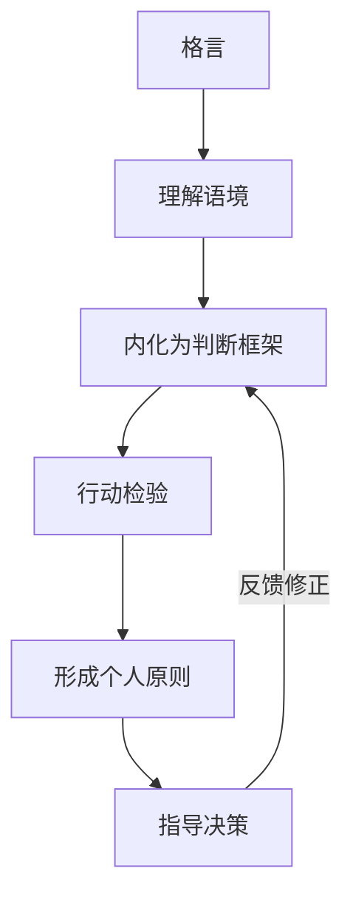

# 附录N 搞钱格言与金句

> 精选210余条财富格言、商业金句与搞钱箴言，涵盖财富观、投资理财、创业商业、勤奋努力、风险勇气、思维认知、时间复利、人脉合作、学习成长、失败坚持、数字时代财富观等十大主题。每条格言附出处与应用场景说明，并在每个主题前提供核心思想导读，助你在搞钱路上时时自勉、处处启发。

## 格言的正确打开方式

格言不是心灵鸡汤，而是**压缩的认知模型**。一句话背后往往浓缩了一个人几十年的商业实践或一个文化千年的智慧沉淀。正确使用格言需要三个步骤：

1. **理解语境**：格言诞生于特定时代和场景，脱离语境容易误用。"富贵险中求"在有准备的前提下是智慧，在盲目赌博时是毒药。
2. **内化为判断框架**：不要只是"知道"格言，要在决策时主动调用。比如投资前问自己——"别人贪婪时我恐惧"，此刻市场是贪婪还是恐惧？
3. **行动检验**：格言的价值在于实践。选择3-5条最触动你的格言，贴在每天能看到的地方，让它们成为你决策的默认参考系。

**使用建议**：本附录按主题分类，每个主题有核心思想导读。建议通读一遍后，标记最触动自己的5-10条，然后反复咀嚼。格言不在于记住多少，而在于实践多少。

---

## 一、财富与金钱观

> **核心思想**：金钱是工具而非目的。健康的财富观是搞钱的心理基础——既不回避金钱的重要性，也不让金钱异化为人生唯一目标。本节格言帮助你校准对金钱的认知坐标。

***

**1.** 「金钱不是万能的，但没有金钱是万万不能的。」
**出处：** 中国民间俗语
**应用场景：** 提醒人们正视金钱的重要性，既不拜金也不回避金钱话题，树立健康的财富观。这句话的价值在于打破两种极端——谈钱色变和唯钱是图。

***

**2.** 「君子爱财，取之有道。」
**出处：** 《增广贤文》
**应用场景：** 强调赚钱要走正道，不搞歪门邪道。在当今社会，"道"不仅指法律底线，还包括商业伦理——不割韭菜、不赚信息差中的欺诈钱。

***

**3.** 「金钱是好的仆人，却是糟糕的主人。」
**出处：** 弗朗西斯·培根（Francis Bacon）
**应用场景：** 告诫人们要做金钱的主人而非奴隶。具体表现：不因省钱而浪费大量时间，不因赚钱而牺牲健康和家庭，不因贪婪而做出违背原则的事。

***

**4.** 「财富不是朋友，但朋友却是财富。」
**出处：** 中国谚语
**应用场景：** 提醒人们在追求财富的同时，不要忽视人际关系的价值。商业世界的本质是人的连接，很多机会来自于信任关系而非冷冰冰的交易。

***

**5.** 「钱不是攒出来的，而是赚出来的。」
**出处：** 商业圈流传
**应用场景：** 鼓励人们提升赚钱能力，而非一味节流。但需要注意：这句话的适用场景是"收入有提升空间时优先提升收入"，而非鼓励不储蓄。正确的做法是**开源为主、节流为辅**。

***

**6.** 「真正的财富不是你拥有多少，而是你需要多少。」
**出处：** 古希腊哲学思想，伊壁鸠鲁思想延伸
**应用场景：** 引导人们反思消费欲望，减少不必要的开支。这就是"财务自由"的核心定义——当被动收入覆盖生活开支时，你就自由了。需要越少，自由越容易达到。

***

**7.** 「人为财死，鸟为食亡。」
**出处：** 中国古语
**应用场景：** 警示人们不要被金钱蒙蔽双眼，做出损害自身长远利益的事情。短线投机、违法牟利、透支健康赚钱，都是"人为财死"的现代版本。

***

**8.** 「钱是身外之物，但没有它，身内之物也保不住。」
**出处：** 现代商业格言
**应用场景：** 幽默地说明金钱的基础重要性。没有钱，你连基本的健康、教育、安全都无法保障。这不是拜金，而是对现实的清醒认知。

***

**9.** 「富在深山有远亲，穷在闹市无人问。」
**出处：** 《增广贤文》
**应用场景：** 揭示社会现实，提醒人们提升自身经济实力的重要性。但反过来理解：当你穷的时候，正好可以看清谁是真朋友。穷是最好的人际关系过滤器。

***

**10.** 「不谋万世者，不足谋一时；不谋全局者，不足谋一域。」
**出处：** 陈澹然《寤言二迁都建藩议》
**应用场景：** 做财富规划要有长远眼光和全局思维。具体表现为：不为短期高薪选择没有成长性的行业，不为眼前利益放弃长期资产的积累。

***

**11.** 「你不理财，财不理你。」
**出处：** 中国理财界流行语
**应用场景：** 强调主动管理财富的重要性。很多人把钱放在活期账户里任其贬值，就是"不理财"的典型表现。哪怕只是做一个简单的货币基金配置，也比什么都不做强。

***

**12.** 「金钱是一种工具，关键在于使用它的人。」
**出处：** 安·兰德（Ayn Rand）
**应用场景：** 引导人们正确看待金钱的工具属性。同样的100万，有人用来投资自己、创业、学习，有人用来挥霍、赌博、炫耀。工具无罪，关键在使用者。

***

**13.** 「贫穷不是社会主义，富裕也不是资本主义。」
**出处：** 邓小平改革思想
**应用场景：** 打破人们对财富的偏见，鼓励合法致富。在中国文化语境中，这句话帮助人们摆脱"有钱就是坏人"的道德绑架，理直气壮地追求合法财富。

***

**14.** 「金钱买不到幸福，但可以买到让你不幸福的东西的替代品。」
**出处：** 现代幽默格言
**应用场景：** 以幽默方式说明金钱的实用价值。钱买不到健康，但能买到更好的医疗；买不到时间，但能买到别人的服务来节省你的时间。

***

**15.** 「财富就像海水，喝得越多，渴得越厉害。」
**出处：** 叔本华（Arthur Schopenhauer）
**应用场景：** 提醒人们知足常乐，不要陷入无止境的贪欲。心理学研究证实，当收入达到一定水平后（在中国约年收入50-80万），更多的钱带来的幸福感提升非常有限。

***

**16.** 「经济独立是一切独立的基础。」
**出处：** 弗吉尼亚·伍尔夫（Virginia Woolf）思想延伸（《一间自己的房间》）
**应用场景：** 鼓励女性和年轻人追求经济独立。没有经济独立，你的选择权就掌握在别人手中——无论是父母、伴侣还是老板。

***

**17.** 「不要用健康去换钱，再用钱去买健康。」
**出处：** 现代养生格言
**应用场景：** 提醒人们在赚钱过程中注意身体健康。996赚的钱可能还不够将来治病的。正确做法：在健康的前提下高效赚钱，而非用透支身体的方式低效赚钱。

***

**18.** 「有钱不是目的，有选择才是。」
**出处：** 现代财富观念
**应用场景：** 重新定义财富的意义——财务自由的本质是拥有选择权。可以选择不做自己不喜欢的工作，可以选择住在自己喜欢的地方，可以选择和谁在一起。

***

**19.** 「贫穷限制了你的想象力，但想象力可以打破贫穷。」
**出处：** 网络流行语改编
**应用场景：** 鼓励人们突破思维局限，用创意和想象力创造财富。很多商业模式的创新（如共享经济、订阅模式）都是想象力的产物。

***

**20.** 「会花钱的人才会赚钱，但会赚钱的人不一定懂得花钱。」
**出处：** 商业管理格言
**应用场景：** 强调资金使用效率的重要性。会花钱的意思是：把钱花在回报率最高的地方——投资自己、建立人脉、提升效率，而非挥霍享受。

***

**21.** 「世上最沉重的负担不是贫穷，而是没有希望的贫穷。」
**出处：** 社会学思想
**应用场景：** 激励处于困境中的人不要放弃希望。贫穷+无望=绝望；贫穷+希望=暂时的困难。保持对未来的信心，是走出困境的第一步。

***

**22.** 「金钱是社会的奖章，它奖励那些为社会创造了价值的人。」
**出处：** 现代商业哲学
**应用场景：** 帮助人们理解赚钱的本质——为他人创造价值。当你专注于解决问题、满足需求、创造价值时，金钱只是自然的副产品。

***

---

## 二、投资与理财

> **核心思想**：投资的本质是让钱为你工作。本节格言涵盖风险管理、价值投资、资产配置、长期主义四大投资哲学。记住：投资不是赌博，不是预测，而是基于概率和纪律的系统化决策。

***

**23.** 「不要把所有鸡蛋放在同一个篮子里。」
**出处：** 西方投资谚语，常归于马克·吐温
**应用场景：** 强调分散投资的重要性。但分散不是越多越好——篮子太多你也管不过来。关键是在不同资产类别（股票、债券、房产、现金）之间做合理配置。

***

**24.** 「别人贪婪时我恐惧，别人恐惧时我贪婪。」
**出处：** 沃伦·巴菲特（Warren Buffett），2004年致股东信
**应用场景：** 提醒投资者逆向思考，在市场极端情绪中保持理性。但前提是：你恐惧时买入的必须是优质资产，而不是垃圾。逆向投资不等于抄底垃圾股。

***

**25.** 「投资的第一条原则是不要赔钱，第二条原则是永远不要忘记第一条。」
**出处：** 沃伦·巴菲特（Warren Buffett）
**应用场景：** 强调风险控制在投资中的首要地位。数学上，亏损50%需要上涨100%才能回本。所以控制回撤比追求高收益更重要。

***

**26.** 「复利是世界第八大奇迹。」
**出处：** 常归于阿尔伯特·爱因斯坦（Albert Einstein），但出处存疑
**应用场景：** 说明长期投资和复利效应的威力。10万元年化10%，30年后变成174万。复利需要两个条件：足够高的收益率和足够长的时间。

***

**27.** 「市场就像上帝，帮助那些自助的人。但不像上帝的是，市场不会原谅那些不知道自己在做什么的人。」
**出处：** 沃伦·巴菲特（Warren Buffett）
**应用场景：** 强调投资前必须学习和了解自己所投资的领域。不懂的不投，是投资最重要的纪律之一。

***

**28.** 「最好的投资就是投资自己。」
**出处：** 沃伦·巴菲特（Warren Buffett）
**应用场景：** 鼓励人们把时间和金钱用于提升自身能力和知识。投资自己的回报率可能是最高的——提升赚钱能力的复利效应远超任何金融产品。

***

**29.** 「股市短期是投票机，长期是称重机。」
**出处：** 本杰明·格雷厄姆（Benjamin Graham）《聪明的投资者》
**应用场景：** 提醒投资者不要被短期波动左右，关注企业长期价值。短期股价受情绪驱动，长期股价回归企业基本面。

***

**30.** 「买入好公司的股票，然后永远不要卖出。」
**出处：** 菲利普·费雪（Philip Fisher）《怎样选择成长股》
**应用场景：** 强调长期投资优质资产的价值。但"永远不卖"的前提是你买的是真正的好公司，且买入价格合理。

***

**31.** 「风险来自于你不知道自己在做什么。」
**出处：** 沃伦·巴菲特（Warren Buffett）
**应用场景：** 提醒投资者在投资前做好功课。跟风买股票、听消息炒股、不了解产品就投资，都是"不知道自己在做什么"的典型表现。

***

**32.** 「不要试图预测市场的走向，而是要为各种情况做好准备。」
**出处：** 雷·达里奥（Ray Dalio）《原则》
**应用场景：** 强调资产配置和风险管理的重要性。做好"全天候"资产配置，无论市场涨跌都能保持相对稳定。

***

**33.** 「投资中最昂贵的四个字是：这次不同。」
**出处：** 约翰·邓普顿（John Templeton）
**应用场景：** 警示投资者不要被市场情绪蒙蔽。每一次泡沫破裂前，都有人说"这次不同"。历史规律往往不会改变，人性更是如此。

***

**34.** 「你不需要成为火箭科学家。投资不是智商160打败智商130的游戏。」
**出处：** 沃伦·巴菲特（Warren Buffett）
**应用场景：** 鼓励普通人也可以通过学习成为好的投资者。投资成功的关键是性格（耐心、纪律、独立思考），而非智商。

***

**35.** 「定投是普通人最好的投资策略。」
**出处：** 现代理财理念
**应用场景：** 推荐定期定额投资策略。定投的核心优势是：不需要择时，利用市场波动自动实现"低买多、高买少"，适合工薪阶层。

***

**36.** 「永远不要借钱炒股。」
**出处：** 股市投资格言
**应用场景：** 严厉警告不要使用杠杆进行高风险投机。杠杆会放大亏损，让你在市场正常波动中被迫出局。投资只能用闲钱——3-5年内不会用到的钱。

***

**37.** 「股市有风险，投资需谨慎。」
**出处：** 中国证监会提示语
**应用场景：** 提醒投资者认识到投资风险，量力而行。这不是一句废话，而是无数人用血泪换来的警示。

***

**38.** 「知道什么时候不投资，和知道什么时候投资一样重要。」
**出处：** 乔治·索罗斯（George Soros）
**应用场景：** 强调耐心等待机会的重要性。现金不是垃圾，它是在等待机会的弹药。没有好机会时，持有现金等待也是一种投资决策。

***

**39.** 「先保住本金，再考虑收益。」
**出处：** 投资金律
**应用场景：** 提醒投资者风险控制永远是第一位的。保本思维的具体实践：设置止损线、分散投资、避免杠杆、只投自己懂的领域。

***

**40.** 「房产是最好的投资。」
**出处：** 马克·吐温（Mark Twain）原话："Buy land, they're not making it anymore."
**应用场景：** 说明不动产投资的价值。但需结合当前市场环境判断——在人口流出的城市，房产可能不是好投资。投资决策要基于数据，而非格言。

***

**41.** 「不要把投资当成赌博，要把它当成事业来经营。」
**出处：** 彼得·林奇（Peter Lynch）《彼得·林奇的成功投资》
**应用场景：** 强调投资的专业性和认真态度。事业需要：研究、计划、执行、复盘。投资也一样。

***

**42.** 「买入时机是当街上血流成河的时候。」
**出处：** 罗斯柴尔德男爵（Baron Rothschild）
**应用场景：** 说明极端恐慌中可能隐藏着巨大投资机会。但需辨别系统性风险——2008年金融危机中抄底是勇气，2015年股灾中抄底杠杆资金可能是灾难。

***

**43.** 「理财不是有钱人的专利，而是每个人的必修课。」
**出处：** 现代理财教育理念
**应用场景：** 鼓励所有人不论收入高低都要学习理财知识。月薪5000也需要理财——至少要会管理现金流、建立应急基金、避免不必要的负债。

***

**44.** 「多元化是唯一的免费午餐。」
**出处：** 哈里·马科维茨（Harry Markowitz），现代投资组合理论奠基人
**应用场景：** 强调资产配置多元化可以在不降低收益的情况下降低风险。不同资产之间的低相关性是实现这一效果的关键。

***

**45.** 「投资是一场马拉松，不是百米冲刺。」
**出处：** 投资界格言
**应用场景：** 提醒投资者保持耐心，追求长期稳健收益。频繁交易不仅增加成本，还容易被情绪左右做出错误决策。

***

**46.** 「流动性是投资的生命线。」
**出处：** 金融管理格言
**应用场景：** 提醒投资者保持一定的现金储备，不要将所有资金锁死。建议至少保持6个月生活费的流动性储备，以应对突发情况。

***

**47.** 「永远不要忽视费用的力量，它会像白蚁一样蚕食你的回报。」
**出处：** 约翰·博格尔（John Bogle），先锋基金创始人
**应用场景：** 强调选择低费率投资产品的重要性。1%的管理费差异，30年后可能让你的最终收益相差30%以上。

***

---

## 三、创业与商业

> **核心思想**：商业的本质是价值创造和价值交换。本节格言涵盖创业心态、商业模式、团队管理、竞争策略四大维度。记住：创业不是浪漫主义，而是一门需要系统学习的手艺。

***

**48.** 「天下没有难做的生意，只有不会做生意的人。」
**出处：** 马云（Jack Ma）
**应用场景：** 鼓励创业者提升商业能力，而不是抱怨环境不好。但要辩证理解——有些生意确实因为政策、技术变革而变得更难，关键是你能否适应变化。

***

**49.** 「今天很残酷，明天更残酷，后天很美好，但绝大部分人死在明天晚上。」
**出处：** 马云（Jack Ma），2008年演讲
**应用场景：** 鼓励创业者在最艰难的时候坚持住。创业最难的不是开始，而是"黎明前的黑暗"——资金快烧完、产品还没起色、团队开始动摇的阶段。

***

**50.** 「创业者最重要的是要认清自己，不要高估自己。」
**出处：** 雷军（Lei Jun）
**应用场景：** 提醒创业者保持清醒的自我认知。过度自信是创业失败的主要原因之一——高估自己的能力、低估竞争的激烈、忽视市场的残酷。

***

**51.** 「风口上猪都能飞起来，但风停了摔死的都是猪。」
**出处：** 雷军（Lei Jun）原话为"站在风口上猪都能飞起来"，后半句为网络改编
**应用场景：** 提醒创业者不要盲目追逐风口，要建立核心竞争力。风口来时借势起飞，风口过后靠实力站稳。

***

**52.** 「商业模式的核心是：你能为用户创造什么价值？」
**出处：** 彼得·德鲁克（Peter Drucker）思想延伸
**应用场景：** 帮助创业者回归商业本质。在设计商业模式之前，先回答三个问题：你为谁解决什么问题？你的解决方案比现有方案好在哪里？用户愿意为此付多少钱？

***

**53.** 「最好的商业模式是让客户离不开你。」
**出处：** 商业管理格言
**应用场景：** 强调建立客户粘性和护城河。实现方式：高转换成本（如企业软件）、网络效应（如社交平台）、品牌忠诚度（如苹果）。

***

**54.** 「现金流是企业的血液，利润是企业的脂肪。」
**出处：** 企业财务管理格言
**应用场景：** 提醒创业者关注现金流管理。很多企业倒闭不是因为没利润而是没现金——应收账款太多、库存积压、盲目扩张，都会导致现金流断裂。

***

**55.** 「创业就是九死一生，但那一生的可能让你值得去试。」
**出处：** 创业圈格言
**应用场景：** 鼓励有准备的创业者勇敢尝试，同时做好最坏的打算。创业前要问自己：如果失败了，我能承受最坏的结果吗？

***

**56.** 「先活下来，再活得好，最后活得久。」
**出处：** 企业管理三阶段理论
**应用场景：** 指导创业者的阶段性目标设定。创业初期：活下来（有现金流）→成长期：活得好（有利润）→成熟期：活得久（有壁垒）。

***

**57.** 「客户第一，员工第二，股东第三。」
**出处：** 马云（Jack Ma）/亚马逊杰夫·贝索斯（Jeff Bezos）
**应用场景：** 指导企业利益相关方的优先级排序。客户满意→员工有动力→股东有回报，这是一个正向循环。

***

**58.** 「小公司的成功在于专注，大公司的成功在于体系。」
**出处：** 创业管理格言
**应用场景：** 指导不同规模企业的经营策略。小企业切忌贪大求全——资源有限时，把一件事做到极致比做十件事平庸要强得多。

***

**59.** 「天下武功，唯快不破。」
**出处：** 武侠小说理念延伸至商业
**应用场景：** 强调在商业竞争中速度的重要性。但"快"不是盲目求快，而是：快速验证假设、快速迭代产品、快速响应市场反馈。

***

**60.** 「如果你的产品需要推销，那说明它还不够好。」
**出处：** 埃隆·马斯克（Elon Musk）
**应用场景：** 强调产品力为王。好产品自己会说话——用户会自发传播。把花在营销上的钱和精力，拿出一部分来打磨产品，回报率可能更高。

***

**61.** 「创新不是从0到1，而是从1到N的过程中不断优化。」
**出处：** 商业创新理念
**应用场景：** 帮助创业者理解创新的多种形态。颠覆性创新（从0到1）很少见，持续改进（从1到N）更现实。把现有产品做得更好、更快、更便宜，也是创新。

***

**62.** 「用人不疑，疑人不用。」
**出处：** 中国古语
**应用场景：** 指导创业者如何建立信任、管理团队。但更现代的理解是：信任但验证（Trust but verify）。给予信任的同时建立制度和流程来保障。

***

**63.** 「一个企业的天花板就是创始人的眼界和格局。」
**出处：** 商业管理格言
**应用场景：** 鼓励创业者持续学习成长。企业做到一定规模后，创始人最大的瓶颈不再是能力，而是认知。持续学习、接触新事物、与高手交流，是突破天花板的方法。

***

**64.** 「最好的竞争策略是避免竞争。」
**出处：** 彼得·蒂尔（Peter Thiel）《从0到1》
**应用场景：** 强调差异化竞争和蓝海战略的重要性。与其在红海中厮杀，不如找到一个没有竞争的细分市场，建立垄断优势。

***

**65.** 「做生意就是做人，人做好了，生意自然就好了。」
**出处：** 中国商界古训
**应用场景：** 强调商业中诚信和人品的重要性。在中国商业文化中，信任是最重要的商业资源。一次失信可能毁掉多年积累的商业关系。

***

**66.** 「不要试图满足所有人，只要让你的核心用户尖叫。」
**出处：** 互联网产品理念
**应用场景：** 指导产品定位和目标用户的选择。试图取悦所有人，最终谁也取悦不了。找到你的核心用户群，为他们做到极致。

***

**67.** 「利润来自垄断或创新，其他都是辛苦钱。」
**出处：** 彼得·蒂尔（Peter Thiel）思想延伸
**应用场景：** 帮助创业者思考如何建立竞争壁垒。完全竞争市场中利润趋零，只有建立某种形式的"垄断"（品牌、技术、网络效应、规模效应），才能获得超额利润。

***

**68.** 「合伙人比商业模式更重要。」
**出处：** 创业投资圈共识
**应用场景：** 提醒创业者在找合伙人时要慎重。好的合伙人应该：能力互补、价值观一致、利益分配清晰。合伙人内讧是创业失败的第二大原因（第一是没市场）。

***

**69.** 「能用钱解决的问题都不是问题，问题是没钱。」
**出处：** 商业圈流行语
**应用场景：** 幽默地说明资金的重要性，同时提醒创业者要解决核心问题。很多创业者把时间花在"找钱"上，却忽略了"赚钱"——先证明商业模式可行，钱自然会来。

***

**70.** 「创业不是请客吃饭，是打仗。」
**出处：** 创业圈格言
**应用场景：** 提醒创业者做好充分的心理准备。创业意味着：长时间高强度工作、承受巨大心理压力、面对不确定性和可能的失败。没有这个心理准备，不要轻易开始。

***

**71.** 「先做出一个让用户离不开的产品，再想怎么赚钱。」
**出处：** 互联网创业理念
**应用场景：** 指导初创企业的产品策略。用户价值优先于商业变现——没有用户，变现无从谈起。微信先做到10亿用户，再做支付和广告。

***

**72.** 「商业的本质是交易，交易的本质是信任。」
**出处：** 商业哲学
**应用场景：** 强调建立商业信任的重要性。在数字化时代，信任的建立方式在变（从面对面到在线评价），但信任的本质没有变——它是所有商业关系的基础。

***

---

## 四、勤奋与努力

> **核心思想**：勤奋是搞钱的基本功，但勤奋不等于蛮干。本节格言强调"聪明地勤奋"——有方向、有方法、有节奏的努力，而非盲目的苦干。

***

**73.** 「天道酬勤，功不唐捐。」
**出处：** 中国古语 / 佛经
**应用场景：** 鼓励人们相信付出必有回报，持续努力终将有所成就。但要注意：酬的是"有效努力"，不是"假装努力"。方向错了，越勤快离目标越远。

***

**74.** 「勤能补拙是良训，一分辛苦一分才。」
**出处：** 华罗庚
**应用场景：** 鼓励天赋一般的人通过勤奋来弥补不足。华罗庚本人就是最好的例证——初中学历的他通过自学成为世界级数学家。

***

**75.** 「台上一分钟，台下十年功。」
**出处：** 中国戏曲界谚语
**应用场景：** 说明任何成功都离不开长期的积累和准备。别人看到的是你的成功，看不到的是你无数个默默努力的日日夜夜。

***

**76.** 「业精于勤荒于嬉，行成于思毁于随。」
**出处：** 韩愈《进学解》
**应用场景：** 强调勤奋和独立思考对事业成功的重要性。前半句说勤奋，后半句说思考——两者缺一不可。

***

**77.** 「不积跬步，无以至千里；不积小流，无以成江海。」
**出处：** 荀子《劝学》
**应用场景：** 鼓励人们重视日常积累。财富也是从小到大积累起来的——每月存2000元，年化8%，20年后就是117万。

***

**78.** 「早起的鸟儿有虫吃。」
**出处：** 西方谚语
**应用场景：** 鼓励勤奋和行动力，抢占先机。在商业中，先发优势很重要——第一个进入市场的人往往能建立品牌认知和用户习惯。

***

**79.** 「世界上最可怕的两个词，一个叫执着，一个叫认真。认真的人改变自己，执着的人改变命运。」
**出处：** 励志格言
**应用场景：** 鼓励人们用认真和执着的态度对待工作和事业。认真让你把事情做对，执着让你把事情做成。

***

**80.** 「你今天的努力，是幸运的伏笔。当下的付出，是明日的花开。」
**出处：** 现代励志格言
**应用场景：** 鼓励人们在看不到结果时依然坚持付出。努力和回报之间往往有时间差——你现在学的技能、建的人脉、积累的经验，可能在几年后才发挥作用。

***

**81.** 「种一棵树最好的时间是十年前，其次是现在。」
**出处：** 非洲谚语
**应用场景：** 鼓励人们立即行动，不要因为错过了时机而放弃。后悔过去没有意义，重要的是从现在开始。

***

**82.** 「成功没有捷径，但有方向。」
**出处：** 现代励志格言
**应用场景：** 提醒人们在勤奋努力的同时也要找准方向。正确的方向+持续的努力=成功。错误的方向+持续的努力=南辕北辙。

***

**83.** 「自律是自由的前提。」
**出处：** 康德（Immanuel Kant）思想延伸
**应用场景：** 强调通过自律实现财务自由。先苦后甜——自律地储蓄、自律地学习、自律地工作，才能获得未来的自由。

***

**84.** 「努力不一定成功，但放弃一定失败。」
**出处：** 励志格言
**应用场景：** 在人们想要放弃时给予鼓励。但要注意：坚持不等于死撑。如果方向明显错误，及时止损也是一种智慧。

***

**85.** 「每天进步一点点，坚持带来大改变。」
**出处：** 现代自我提升理念
**应用场景：** 鼓励持续的小进步，日积月累实现质变。每天进步1%，一年后你会进步37倍（1.01^365=37.78）。

***

**86.** 「不怕慢，就怕站。」
**出处：** 中国民间谚语
**应用场景：** 鼓励持续前进，即使速度慢也不要停下脚步。在搞钱的路上，哪怕每个月只多赚1000元，一年也是1.2万。

***

**87.** 「吃得苦中苦，方为人上人。」
**出处：** 中国古语
**应用场景：** 鼓励人们在创业和赚钱过程中不怕吃苦。但现代理解是：吃"聪明的苦"——学习的苦、思考的苦、自律的苦，而非盲目消耗体力的苦。

***

**88.** 「你不能决定太阳几点升起，但可以决定自己几点起床。」
**出处：** 现代励志格言
**应用场景：** 强调在无法控制的环境中掌控自己能控制的部分。经济形势你无法改变，但你可以改变自己的技能、态度和行动。

***

**89.** 「穷则独善其身，达则兼济天下。」
**出处：** 孟子
**应用场景：** 引导人们在不同阶段做好自己能做的事。穷的时候先管好自己，提升自己；有能力时回馈社会、帮助他人。

***

**90.** 「成功的人找方法，失败的人找借口。」
**出处：** 现代管理格言
**应用场景：** 鼓励积极解决问题的态度。遇到困难时，问自己"怎么解决"而不是"为什么不行"。

***

**91.** 「少壮不努力，老大徒伤悲。」
**出处：** 《长歌行》
**应用场景：** 提醒年轻人珍惜时光，趁年轻努力奋斗。年轻时精力最充沛、试错成本最低、时间复利最长。

***

**92.** 「把每一件简单的事做好就是不简单，把每一件平凡的事做好就是不平凡。」
**出处：** 张瑞敏（海尔集团）
**应用场景：** 强调在平凡的工作中做到极致也能创造巨大价值。很多赚钱的机会就藏在把"小事做到极致"中。

***

---

## 五、风险与勇气

> **核心思想**：搞钱必然伴随风险，关键不是避免所有风险，而是学会管理风险。本节格言帮助你区分"有准备的冒险"和"盲目的赌博"，培养在不确定性中做出理性决策的能力。

***

**93.** 「不敢冒险的人永远不会有大的成功。」
**出处：** 商业励志格言
**应用场景：** 鼓励人们在可控范围内勇于冒险。但冒险的前提是：你已经评估了风险、准备了应对方案、能够承受最坏的结果。

***

**94.** 「富贵险中求。」
**出处：** 中国古语
**应用场景：** 说明高回报往往伴随着高风险。但这句话常被误用为赌博的借口。正确的理解是：在有准备的前提下，敢于承担经过计算的风险。

***

**95.** 「最大的风险是不承担任何风险。」
**出处：** 马克·扎克伯格（Mark Zuckerberg）
**应用场景：** 鼓励人们跳出舒适区。过度保守本身就是一种风险——通货膨胀会侵蚀你的购买力，不学习会被时代淘汰，不社交会失去机会。

***

**96.** 「勇气不是没有恐惧，而是面对恐惧依然前行。」
**出处：** 纳尔逊·曼德拉（Nelson Mandela）
**应用场景：** 鼓励人们在面对未知和不确定性时依然勇敢行动。创业、转行、投资，都会让你害怕。害怕是正常的，关键是在害怕中行动。

***

**97.** 「船停在港湾里是最安全的，但那不是造船的目的。」
**出处：** 西方谚语
**应用场景：** 鼓励人们走出安全区。钱放在银行是最安全的，但它的回报率跑不赢通胀。适度的风险是获得回报的必要代价。

***

**98.** 「所有伟大的行动和思想都有一个微不足道的开始。」
**出处：** 阿尔贝·加缪（Albert Camus）
**应用场景：** 鼓励人们勇敢迈出第一步。苹果在车库起步，阿里巴巴在公寓起步。不要因为起点低而不敢开始。

***

**99.** 「不入虎穴，焉得虎子。」
**出处：** 《后汉书·班超传》
**应用场景：** 说明要想获得丰厚回报，必须敢于承担风险。班超出使西域的故事告诉我们：关键时刻的勇气可以改变命运。

***

**100.** 「当你决定出发的那一刻，最困难的部分已经结束了。」
**出处：** 塞万提斯（Cervantes）思想延伸
**应用场景：** 鼓励人们克服心理障碍，勇敢迈出第一步。很多时候，阻碍我们行动的不是困难本身，而是对困难的想象。

***

**101.** 「安全边际越大，投资越安全。」
**出处：** 本杰明·格雷厄姆（Benjamin Graham）《聪明的投资者》
**应用场景：** 强调在投资和创业中预留足够的安全缓冲。比如：投资时以低于内在价值的价格买入，创业时留够12-18个月的运营资金。

***

**102.** 「冒险的前提是做好准备，而不是盲目赌博。」
**出处：** 风险管理格言
**应用场景：** 区分有准备的冒险和盲目的赌博。有准备的冒险：学习投资知识后再入市、做好市场调研后再创业、存够应急金后再辞职。

***

**103.** 「没有退路就是最好的出路。」
**出处：** 创业励志格言
**应用场景：** 鼓励在关键决策时全力以赴。但这句话要慎用——真正的勇气不是烧掉所有退路，而是在有退路的情况下依然选择全力以赴。

***

**104.** 「世界会为有目标和远见的人让路。」
**出处：** 杰西·杰克逊（Jesse Jackson）
**应用场景：** 鼓励人们树立远大目标，坚定前行。当你清楚地知道自己要去哪里，全世界都会帮你找到路。

***

**105.** 「勇敢不是不害怕，而是害怕了仍然去做。」
**出处：** 约翰·韦恩（John Wayne）
**应用场景：** 帮助人们理解勇气的真正含义。勇气不是天生的无畏，而是在恐惧面前做出正确选择的能力。

***

**106.** 「机遇只偏爱有准备的头脑。」
**出处：** 路易·巴斯德（Louis Pasteur）
**应用场景：** 提醒人们在等待机会的同时做好充分准备。机会来了抓不住，等于没有机会。

***

**107.** 「犯错误不可怕，可怕的是不敢犯错。」
**出处：** 现代创新管理理念
**应用场景：** 鼓励人们勇于尝试，允许自己犯错。快速试错、快速学习、快速迭代，是现代商业的核心方法论。

***

**108.** 「人生最大的遗憾不是失败，而是我本可以。」
**出处：** 现代励志格言
**应用场景：** 激励人们勇敢追求，不要留下遗憾。临终研究显示，人们最大的遗憾往往不是做错了什么，而是没有做什么。

***

**109.** 「胆大心细，是创业者最重要的品质。」
**出处：** 创业管理格言
**应用场景：** 说明创业者需要兼具冒险精神和谨慎态度。胆大让你敢于尝试，心细让你避免翻船。

***

**110.** 「没有人能预知未来，但每个人都能创造未来。」
**出处：** 现代励志格言
**应用场景：** 鼓励人们主动创造机会，而不是被动等待。等风来不如追风去。

***

**111.** 「富贵不能淫，贫贱不能移，威武不能屈。」
**出处：** 孟子
**应用场景：** 强调在追求财富过程中保持原则和底线。有钱了不变坏，穷了不变节，被威胁不屈服——这是做人的底线。

***

**112.** 「成功者与失败者的区别，往往不在于能力，而在于勇气。」
**出处：** 商业励志格言
**应用场景：** 鼓励人们在关键时刻敢于决断、敢于行动。很多人的能力足以成功，只是缺少迈出那一步的勇气。

***

---

## 六、思维与认知

> **核心思想**：你永远赚不到超出认知范围之外的钱。思维和认知是搞钱的底层操作系统——操作系统不升级，硬件再好也发挥不出性能。本节格言帮你建立富人思维框架。

***

**113.** 「你永远赚不到超出你认知范围之外的钱。」
**出处：** 现代商业认知格言
**应用场景：** 强调提升认知水平是扩大财富的前提。认知决定财富上限——你的知识边界就是你的收入天花板。

***

**114.** 「思维方式决定行为方式，行为方式决定结果。」
**出处：** 认知心理学
**应用场景：** 强调改变思维模式是改变财务状况的根本。想要不同的结果，首先要用不同的方式思考。

***

**115.** 「有钱人和你想的不一样。」
**出处：** 哈维·艾克（T. Harv Eker）同名书
**应用场景：** 引导人们学习富人的思维模式。核心差异：富人关注机会，穷人关注障碍；富人让钱为自己工作，人为钱工作。

***

**116.** 「跳出盒子思考。」
**出处：** 创新思维格言（Think outside the box）
**应用场景：** 鼓励人们打破常规思维，寻找创新的解决方案。当所有人都在做同一件事时，换个角度思考可能发现蓝海。

***

**117.** 「穷人思维关注价格，富人思维关注价值。」
**出处：** 财商教育理念
**应用场景：** 引导人们从关注价格转向关注价值。穷人问"这个多少钱"，富人问"这个能给我带来什么"。

***

**118.** 「悲观者正确，乐观者成功。」
**出处：** 硅谷投资格言
**应用场景：** 鼓励人们保持乐观心态。悲观者能准确预测问题，但只有乐观者才会行动并创造改变。在搞钱这件事上，行动比分析更重要。

***

**119.** 「第一性原理思考。」
**出处：** 埃隆·马斯克（Elon Musk）推崇的思维方式，源自亚里士多德
**应用场景：** 鼓励人们回归事物本质，从基本原理出发思考问题。马斯克用第一性原理思考电池成本，发现可以比市场价便宜80%。

***

**120.** 「格局决定结局，思路决定出路。」
**出处：** 现代管理格言
**应用场景：** 强调格局和思维方式对事业发展的重要影响。格局大的人看到机会，格局小的人看到困难。

***

**121.** 「不是因为事情难我们才不敢做，而是因为我们不敢做事情才变得难。」
**出处：** 塞内卡（Seneca）
**应用场景：** 帮助人们认识到很多时候困难是心理层面的。改变思维就能改变结果——很多"不可能"只是"还没试过"。

***

**122.** 「赚钱的本质是解决问题，解决的问题越大，赚的钱越多。」
**出处：** 商业认知格言
**应用场景：** 引导人们从解决问题的角度思考赚钱方式。谷歌解决了信息检索问题，淘宝解决了买卖连接问题——都是解决了巨大的问题。

***

**123.** 「信息就是金钱，但知识才是力量。」
**出处：** 信息时代格言
**应用场景：** 强调在信息爆炸时代，能够将信息转化为有用知识的能力更重要。信息人人可得，但能把信息变成洞察和行动的人很少。

***

**124.** 「大多数人高估了他们一年内能做的事，却低估了十年内能做的事。」
**出处：** 比尔·盖茨（Bill Gates）
**应用场景：** 鼓励人们制定合理的长期目标，保持耐心。短期不要太激进，长期不要太保守。

***

**125.** 「不要用战术上的勤奋掩盖战略上的懒惰。」
**出处：** 雷军（Lei Jun）
**应用场景：** 提醒人们在努力工作的同时，也要花时间思考方向和策略。方向不对，努力白费。每周至少花2小时思考战略。

***

**126.** 「普通人改变结果，优秀的人改变原因，顶级优秀的人改变思维模型。」
**出处：** 现代认知科学理念
**应用场景：** 引导人们从根本上改变思维方式。遇到收入不够的问题：普通人加班（改结果），优秀的人跳槽（改原因），顶级的人转行（改模型）。

***

**127.** 「利他思维是最好的商业模式。」
**出处：** 稻盛和夫（Inamori Kazuo）
**应用场景：** 强调以利他为出发点的商业思维。稻盛和夫创办了两家世界500强企业（京瓷、KDDI），核心理念就是"敬天爱人"。

***

**128.** 「所有你想要的东西都在恐惧的另一边。」
**出处：** 现代认知格言
**应用场景：** 帮助人们认识到突破恐惧的思维障碍才能获得想要的东西。你害怕的那件事，往往就是你最应该做的那件事。

***

**129.** 「注意力是最稀缺的资源。」
**出处：** 赫伯特·西蒙（Herbert Simon）思想延伸
**应用场景：** 提醒人们合理分配注意力。在信息过载的时代，能把注意力集中在最重要的事情上，本身就是一种竞争优势。

***

**130.** 「升维思考，降维打击。」
**出处：** 互联网商业格言，源自刘慈欣《三体》
**应用场景：** 鼓励人们用更高维度的思维来看待和解决问题。比如：用互联网思维做传统行业，就是一种降维打击。

***

**131.** 「逆向思维是最好的创新方法。」
**出处：** 查理·芒格（Charlie Munger）
**应用场景：** 鼓励人们反过来思考问题。芒格的名言："反过来想，总是反过来想。"想要成功，先研究失败；想要赚钱，先研究别人怎么亏钱。

***

**132.** 「知识的诅咒：你知道的越多，越难理解不知道的人。」
**出处：** 认知心理学
**应用场景：** 提醒在商业沟通中要考虑受众的认知水平。做产品、写文案、做营销，都要用目标用户听得懂的语言，而非专业人士的术语。

***

**133.** 「边界思维：知道自己不知道什么，比知道自己知道什么更重要。」
**出处：** 查理·芒格（Charlie Munger）思想延伸
**应用场景：** 强调认识自身知识边界的重要性。在能力圈内做决策，不懂的不碰——这是避免重大损失的关键。

***

**134.** 「系统思维：局部最优不等于全局最优。」
**出处：** 系统论思想
**应用场景：** 指导人们在做决策时考虑整体系统的影响。比如：为了省钱不培训员工，短期省了钱（局部最优），长期损失了效率（全局非最优）。

***

**135.** 「成长型思维：能力是可以培养的，失败是学习的机会。」
**出处：** 卡罗尔·德韦克（Carol Dweck）《终身成长》
**应用场景：** 鼓励人们用成长型思维看待挑战和失败。固定型思维的人害怕失败，成长型思维的人从失败中学习。

***

**136.** 「概率思维：做大概率正确的事，接受小概率的失败。」
**出处：** 投资与决策理论
**应用场景：** 帮助人们在不确定环境中做出更理性的决策。不追求每次都对，追求长期期望值为正。

***

**137.** 「长期思维是区分平庸和卓越的关键。」
**出处：** 杰夫·贝索斯（Jeff Bezos）
**应用场景：** 鼓励人们把眼光放长远。贝索斯说："如果你做一件事，眼光放到未来三年，和你同台竞技的人很多；但如果你的眼光放到未来七年，那么可以和你竞争的人就很少了。"

***

---

## 七、时间与复利

> **核心思想**：时间是最公平也最稀缺的资源。本节格言的核心是"时间的复利效应"——无论是投资、学习还是人脉，时间都是放大器。关键不是你做了什么，而是你持续做了多久。

***

**138.** 「时间就是金钱。」
**出处：** 本杰明·富兰克林（Benjamin Franklin），1748年《给年轻商人的建议》
**应用场景：** 提醒人们珍惜时间，高效利用每一分钟。但更重要的是理解：时间可以转化为金钱，但金钱买不回时间。

***

**139.** 「一寸光阴一寸金，寸金难买寸光阴。」
**出处：** 中国古语
**应用场景：** 强调时间比金钱更宝贵。在做决策时，要考虑时间成本——花3小时比价省50元，你的时薪是16.7元，值得吗？

***

**140.** 「让时间成为你的朋友，而不是敌人。」
**出处：** 沃伦·巴菲特（Warren Buffett）投资哲学
**应用场景：** 强调长期投资的力量。时间是复利的放大器——投资时间越长，复利效果越明显。20岁开始投资和30岁开始投资，最终结果可能相差数倍。

***

**141.** 「复利的力量在于时间，时间的价值在于复利。」
**出处：** 现代理财格言
**应用场景：** 说明时间和复利相互作用的威力。复利不仅适用于投资，也适用于知识积累、技能提升、人脉经营——这些都在时间的加持下产生指数级增长。

***

**142.** 「今天的一块钱比明天的一块钱更值钱。」
**出处：** 货币时间价值理论（Time Value of Money）
**应用场景：** 解释货币的时间价值概念。这是金融学的基本原理——同样的钱，越早拿到手，越能通过投资产生更多回报。

***

**143.** 「耐心是投资者最大的美德。」
**出处：** 沃伦·巴菲特（Warren Buffett）
**应用场景：** 鼓励投资者保持耐心，不要频繁交易。巴菲特95%的财富是在60岁之后获得的——这就是耐心的复利。

***

**144.** 「罗马不是一天建成的，财富也不是一夜积累的。」
**出处：** 西方谚语
**应用场景：** 提醒人们财富积累需要时间和耐心。那些"一夜暴富"的故事，要么是幸存者偏差，要么背后有你看不到的多年积累。

***

**145.** 「七十二法则：用72除以年回报率，就是资金翻倍所需的年数。」
**出处：** 投资数学法则
**应用场景：** 帮助投资者快速估算复利效果。年化8%→9年翻倍；年化12%→6年翻倍；年化24%→3年翻倍。

***

**146.** 「时间是最公平的资源，每个人每天都只有24小时。」
**出处：** 现代时间管理理念
**应用场景：** 提醒人们善用时间资源。区别在于：你把这24小时用在了什么上面。高价值活动 vs 低价值活动的时间分配，决定了你的收入水平。

***

**147.** 「选择大于努力，但时间大于选择。」
**出处：** 商业认知格言
**应用场景：** 强调长期坚持的重要性。好的选择加上足够的时间才能产生巨大效果。选对了方向但不坚持，和没选对一样。

***

**148.** 「不要让今天的懒惰成为明天的遗憾。」
**出处：** 励志格言
**应用场景：** 鼓励人们珍惜当下，立即行动。拖延的代价是巨大的——拖一年投资，可能少赚几万；拖一年学习，可能错过一个时代。

***

**149.** 「慢慢来，比较快。」
**出处：** 商业智慧格言
**应用场景：** 在快节奏的社会中提醒人们做好基础。稳扎稳打反而更快到达目标——因为避免了推倒重来的时间浪费。

***

**150.** 「年轻时你偷的每一个懒，都会在中年时加倍奉还。」
**出处：** 现代励志格言
**应用场景：** 提醒年轻人珍惜时光。20多岁是建立能力基础、积累人脉、培养习惯的黄金期。错过这个窗口期，后面要花数倍的努力才能弥补。

***

**151.** 「收入是暂时的，资产是持久的。」
**出处：** 财务规划理念
**应用场景：** 引导人们把收入转化为资产。工资会停，但资产会持续产生收益。每赚一笔钱，都要问自己：能把它变成资产吗？

***

**152.** 「投资最大的敌人是时间的浪费，最大的盟友是时间的利用。」
**出处：** 投资哲学
**应用场景：** 鼓励人们尽早开始投资，善用时间的复利效应。晚开始一年，可能最终少赚几十万。

***

**153.** 「你能做的最好的投资就是尽早开始。」
**出处：** 投资教育格言
**应用场景：** 鼓励年轻人尽早开始学习投资和储蓄。25岁开始每月投2000元（年化8%），到60岁有约520万。35岁开始，只有约220万。

***

**154.** 「时间管理的本质是精力管理和优先级管理。」
**出处：** 现代管理学
**应用场景：** 帮助人们理解时间管理的深层含义。不是把每一分钟都排满，而是在精力最好的时候做最重要的事。

***

**155.** 「延迟满足是获得更大回报的前提。」
**出处：** 斯坦福棉花糖实验（Walter Mischel）
**应用场景：** 鼓励人们控制即时消费欲望，为长期目标积累财富。能延迟满足的人，在财务、事业、健康等方面都表现更好。

***

**156.** 「今天多花的每一分钱，都是从未来的自己那里借来的。」
**出处：** 财务规划格言
**应用场景：** 提醒人们理性消费。每次冲动消费前问自己：未来的我会感谢现在的这个决定吗？

***

**157.** 「不要用时间换钱，要用钱买时间。」
**出处：** 现代效率管理理念
**应用场景：** 引导人们思考时间的价值。当你的时间价值高于外包成本时，就应该外包低价值工作（打扫、跑腿、简单重复劳动），专注高价值活动。

***

---

## 八、人脉与合作

> **核心思想**：商业世界的本质是人的连接。本节格言的核心是"价值交换"——人脉不是认识多少人，而是你能为多少人创造价值，以及多少人愿意为你创造价值。

***

**158.** 「一个人走得快，一群人走得远。」
**出处：** 非洲谚语
**应用场景：** 强调团队合作和人脉关系在事业中的重要性。一个人创业可能更快启动，但要做大做强必须有团队。

***

**159.** 「你是你最常交往的五个人的平均值。」
**出处：** 吉姆·罗恩（Jim Rohn）
**应用场景：** 提醒人们有意识地选择交往对象。你的收入、思维方式、生活习惯，都会被身边的人同化。想变有钱，就多和有钱且正能量的人在一起。

***

**160.** 「多个朋友多条路，多个敌人多堵墙。」
**出处：** 中国谚语
**应用场景：** 强调人脉关系在商业和社会中的重要性。在商业中，一个关键的人脉可能为你打开一扇意想不到的门。

***

**161.** 「生意场上没有永远的朋友，也没有永远的敌人，只有永远的利益。」
**出处：** 商业格言，源自帕默斯顿勋爵（Lord Palmerston）
**应用场景：** 帮助人们理性看待商业关系。以利益共赢为基础建立合作，不要把商业关系过度情感化。

***

**162.** 「好的人脉不是认识多少人，而是多少人认可你。」
**出处：** 现代社交理念
**应用场景：** 引导人们注重自身价值的提升。人脉的基础是你的能力和价值——你有价值，人脉自然来；你没价值，名片收再多也没用。

***

**163.** 「独行快，众行远，合作者共赢。」
**出处：** 商业合作格言
**应用场景：** 鼓励企业间和个人间的合作共赢。在商业生态中，找到互补的合作伙伴，比单打独斗更能创造价值。

***

**164.** 「帮助别人就是帮助自己。」
**出处：** 中国谚语
**应用场景：** 强调利他精神在人脉经营中的重要性。先付出再收获——主动帮助别人解决问题，当你需要帮助时，别人也会伸出援手。

***

**165.** 「你的圈子决定了你的眼界，你的眼界决定了你的格局。」
**出处：** 现代社交格言
**应用场景：** 鼓励人们拓展社交圈。接触不同领域的人和思想，可以打破信息茧房，发现新的机会。

***

**166.** 「人脉的本质是价值交换。」
**出处：** 商业社交理念
**应用场景：** 帮助人们理解人脉的底层逻辑。提升自身可交换价值是经营人脉的根本——你要先成为别人愿意交往的人。

***

**167.** 「弱关系比强关系更有价值。」
**出处：** 马克·格兰诺维特（Mark Granovetter）《弱关系的力量》（1973）
**应用场景：** 引导人们重视弱关系的拓展。强关系（亲友）提供情感支持，弱关系（点头之交）提供新信息和新机会。找工作、找投资、找合作，往往来自弱关系。

***

**168.** 「永远不要看不起任何人，你永远不知道谁会在关键时刻帮你一把。」
**出处：** 中国谚语
**应用场景：** 提醒人们善待每一个人，保持谦逊和尊重。今天的小人物，明天可能成为大人物。

***

**169.** 「最好的关系是互相成就，而不是互相利用。」
**出处：** 现代社交格言
**应用场景：** 引导人们建立基于真诚和互利的长期关系。互相利用的关系是短期的，互相成就的关系是长期的。

***

**170.** 「己所不欲，勿施于人。」
**出处：** 孔子《论语》
**应用场景：** 在商业合作中以换位思考的方式建立良好关系。想要别人对你诚信，你先对别人诚信；想要别人帮你，你先帮别人。

***

**171.** 「人脉就是钱脉。」
**出处：** 商业格言
**应用场景：** 强调社交网络在商业中的重要价值。很多商业机会（投资、合作、客户、人才）都来自于人脉网络。

***

**172.** 「不要等需要别人的时候才去联系别人。」
**出处：** 社交管理格言
**应用场景：** 提醒人们平时就要维护好人脉关系。临时抱佛脚式的社交是最无效的。定期问候、主动帮忙、分享价值，才能建立真正的人脉。

***

---

## 九、学习与成长

> **核心思想**：学习是搞钱的永动机。在快速变化的时代，你今天的优势可能明天就变成劣势。持续学习、不断升级自己的认知和技能，才能保持竞争力。本节格言强调"学以致用"的学习观。

***

**173.** 「活到老，学到老。」
**出处：** 中国古语
**应用场景：** 强调终身学习的重要性。在AI时代，知识的半衰期越来越短，停止学习等于加速淘汰。

***

**174.** 「知识改变命运。」
**出处：** 中国教育理念
**应用场景：** 鼓励人们通过学习知识来改变自己的经济状况和社会地位。但要注意：知识本身不改变命运，运用知识才改变命运。

***

**175.** 「投资自己的大脑是回报率最高的投资。」
**出处：** 沃伦·巴菲特（Warren Buffett）
**应用场景：** 鼓励人们把时间和金钱用于学习和自我提升。一个新技能可能让你的收入翻倍，一本书可能改变你的思维方式。

***

**176.** 「每天进步1%，一年后你将强大37倍。」
**出处：** 复利成长理论（1.01^365=37.78）
**应用场景：** 鼓励人们坚持每天学习和进步。关键是持续性——每天进步一点点，比偶尔猛学一天有效得多。

***

**177.** 「学习的敌人是自己的满足。」
**出处：** 毛泽东
**应用场景：** 提醒人们保持谦虚的学习态度。觉得自己"已经够了"的那一天，就是开始退步的那一天。

***

**178.** 「读万卷书，行万里路。」
**出处：** 中国古语
**应用场景：** 强调理论学习和实践经验的结合。光读书不实践是纸上谈兵，光实践不读书是盲目摸索。

***

**179.** 「三人行，必有我师焉。」
**出处：** 孔子《论语》
**应用场景：** 鼓励人们保持谦虚，向身边的人学习。每个人都有你值得学习的地方——同事的效率、客户的洞察、甚至对手的策略。

***

**180.** 「学而不思则罔，思而不学则殆。」
**出处：** 孔子《论语》
**应用场景：** 强调学习和思考的结合。只学习不思考会被信息淹没，只思考不学习会陷入空想。

***

**181.** 「经验是最好的老师，但学费很贵。」
**出处：** 商业格言
**应用场景：** 提醒人们要善于从自己的经验和他人的经验中学习。最好的学习方式是：从别人的错误中学习，这比自己犯错便宜得多。

***

**182.** 「读书破万卷，下笔如有神。」
**出处：** 杜甫
**应用场景：** 鼓励通过大量阅读积累知识和提升能力。阅读是获取他人经验和智慧的最高效方式。

***

**183.** 「赚钱的能力比赚钱本身更重要。」
**出处：** 现代财商教育
**应用场景：** 引导人们重视提升赚钱能力。钱可能失去，但能力不会。有赚钱的能力，即使从零开始也能重新站起来。

***

**184.** 「无知是最大的成本。」
**出处：** 商业管理格言
**应用场景：** 提醒人们因为无知而做出的错误决策代价最高。不懂税法可能多交几万税，不懂投资可能亏掉本金，不懂法律可能吃官司。

***

**185.** 「不要用昨天的知识解决明天的问题。」
**出处：** 现代管理格言
**应用场景：** 鼓励人们持续学习新知识。昨天有效的商业模式明天可能失效，昨天的技能明天可能被AI取代。

***

**186.** 「最好的学习方式是教别人。」
**出处：** 学习理论（费曼学习法）
**应用场景：** 鼓励人们通过分享和教学来深化自己的理解。如果你能把一个概念讲给小白听懂，说明你真正理解了它。

***

**187.** 「向有结果的人学习。」
**出处：** 现代商业学习理念
**应用场景：** 引导人们选择学习对象时注重实际成果。理论家的书要看，但更重要的是向已经做成的人学习实战经验。

***

**188.** 「学以致用是学习的最终目的。」
**出处：** 中国教育理念
**应用场景：** 强调把学到的知识应用到实践中。学到一个新知识，马上想：这个可以用在哪里？怎么用？

***

**189.** 「博学之，审问之，慎思之，明辨之，笃行之。」
**出处：** 《中庸》
**应用场景：** 描述完整的学习和实践过程：广泛学习→深入提问→谨慎思考→明确辨别→坚定实践。这是最系统化的学习方法论。

***

**190.** 「信息差就是利润差。」
**出处：** 商业认知格言
**应用场景：** 强调掌握信息和知识的优势可以转化为商业利润。在信息不对称的市场中，拥有更多信息的一方往往能获得超额利润。

***

**191.** 「不耻下问。」
**出处：** 孔子《论语》
**应用场景：** 鼓励人们放下身段，虚心向任何人请教学习。向下属请教、向年轻人请教、向行业外的人请教，往往能获得意想不到的启发。

***

**192.** 「书到用时方恨少，事非经过不知难。」
**出处：** 中国古语
**应用场景：** 提醒人们在平时就要注重知识积累。等到需要时再学就晚了——机会不等人。

***

---

## 十、失败与坚持

> **核心思想**：失败是搞钱路上的必修课，而非终点。本节格言的核心是"从失败中提取价值"——每一次失败都是一次付费学习，关键是你从中学到了什么。坚持不是死撑，而是在正确方向上的持续投入。

***

**193.** 「失败是成功之母。」
**出处：** 中国古语
**应用场景：** 鼓励人们正确看待失败。但要注意：失败本身不会自动变成成功，只有从失败中总结教训、调整方向，失败才能成为成功之母。

***

**194.** 「成功的反面不是失败，而是不去尝试。」
**出处：** 现代励志格言
**应用场景：** 鼓励人们勇敢尝试。不尝试=确定的0，尝试=有机会得到1。即使失败了，你也获得了经验和教训。

***

**195.** 「马云曾被拒绝过30多次，但他从不放弃。」
**出处：** 马云创业经历
**应用场景：** 用真实案例鼓励创业者在遭遇拒绝时坚持不放弃。但要注意：马云的坚持是建立在对方向的正确判断上的，不是盲目坚持。

***

**196.** 「我并没有失败，我只是找到了一万种行不通的方法。」
**出处：** 托马斯·爱迪生（Thomas Edison）
**应用场景：** 帮助人们重新定义失败。每一次"失败"都是排除了一种不可行的方案，让你离正确答案更近一步。

***

**197.** 「跌倒了，爬起来，这就是成功。」
**出处：** 现代励志格言
**应用场景：** 简单直接地鼓励人们在跌倒后重新站起来。成功不是从不跌倒，而是每次跌倒都能站起来。

***

**198.** 「逆境是最好的大学。」
**出处：** 西方谚语
**应用场景：** 帮助人们在逆境中看到成长的机会。顺境培养不出真正的强者——逆境教会你的韧性、智慧和抗压能力，是顺境无法给你的。

***

**199.** 「坚持不一定成功，但放弃一定失败。」
**出处：** 励志格言
**应用场景：** 在人们想要放弃时给予鼓励。但要坚持在正确的方向上——如果方向错了，及时止损比盲目坚持更明智。

***

**200.** 「所有的伟大都是熬出来的。」
**出处：** 中国商业格言
**应用场景：** 鼓励创业者和职场人耐得住寂寞。华为熬了30年才成为世界通信巨头，腾讯差点卖掉QQ。伟大需要时间。

***

**201.** 「不经一番寒彻骨，怎得梅花扑鼻香。」
**出处：** 黄蘖禅师《上堂开示颂》
**应用场景：** 鼓励人们经历苦难和磨练后终将迎来成功。梅花之所以珍贵，正是因为它在寒冬中绽放。

***

**202.** 「千磨万击还坚劲，任尔东西南北风。」
**出处：** 郑燮《竹石》
**应用场景：** 鼓励人们在各种困难和打击面前保持坚韧不拔的精神。竹子之所以能屹立不倒，是因为它有韧性——能屈能伸。

***

**203.** 「只有经历过地狱般的磨练，才能炼出创造天堂的力量。」
**出处：** 现代励志格言
**应用场景：** 鼓励人们把苦难看作成长的阶梯。那些让你痛苦的经历，正在锻造你未来成功所需要的能力。

***

**204.** 「不是因为看到希望才坚持，而是因为坚持了才看到希望。」
**出处：** 俞敏洪（新东方创始人）
**应用场景：** 帮助人们理解坚持和希望之间的因果关系。很多人在黎明前放弃，就是因为误以为"看到希望才能坚持"。

***

**205.** 「宝剑锋从磨砺出，梅花香自苦寒来。」
**出处：** 《警世贤文》
**应用场景：** 鼓励人们经受住考验和磨练。成功需要吃苦耐劳——不是被动地吃苦，而是主动地磨砺自己。

***

**206.** 「创业者最大的敌人是自己，最大的失败是放弃。」
**出处：** 创业管理格言
**应用场景：** 帮助创业者认识到坚持和自我管理的重要性。创业路上最大的挑战不是外部竞争，而是自己的恐惧、懒惰和动摇。

***

**207.** 「塞翁失马，焉知非福。」
**出处：** 《淮南子·人间训》
**应用场景：** 帮助人们在遭遇失败和损失时保持乐观心态。今天看起来是坏事，明天可能变成好事。保持开放心态，把每次挫折都当作转机。

***

**208.** 「三起三落才是人生。」
**出处：** 中国古语
**应用场景：** 帮助人们理解人生的起伏是正常的。没有人能一直成功，也没有人会一直失败。关键是在低谷时不放弃，在高峰时不骄傲。

***

**209.** 「失败只有一种，那就是半途而废。」
**出处：** 现代励志格言
**应用场景：** 鼓励人们在困难面前坚持到底。只要你不放弃，你就还没有失败——只是还在成功的路上。

***

**210.** 「行百里者半九十。」
**出处：** 《战国策·秦策五》
**应用场景：** 提醒人们越接近成功越不能松懈。最后10%的路程往往是最难的，也是最需要坚持的。

***

**211.** 「水滴石穿，非一日之功。」
**出处：** 中国古语
**应用场景：** 强调持续坚持的力量。小的持续努力终将产生巨大效果。每天写500字，一年就是18万字——够出一本书了。

***

**212.** 「苦难是化了妆的祝福。」
**出处：** 励志格言
**应用场景：** 帮助人们用积极的视角看待困难和挫折。回头看，那些让你最痛苦的经历，往往是你成长最快的时期。

***

---

## 附录：格言速查指南

### 按场景速查

| 场景 | 推荐格言编号 | 核心要点 |
|------|-------------|---------|
| 刚开始理财，不知从何下手 | 11, 35, 43 | 主动管理、定投策略、人人需要理财 |
| 投资亏损，心态崩溃 | 24, 25, 39 | 逆向思考、保住本金、风险控制 |
| 想创业但害怕失败 | 55, 96, 102 | 九死一生、勇气在恐惧中行动、做好准备再冒险 |
| 工作遇到瓶颈 | 82, 125, 126 | 找对方向、战略思维、改变思维模型 |
| 坚持不下去了 | 81, 200, 204 | 现在开始不晚、伟大是熬出来的、坚持才看到希望 |
| 想提升赚钱能力 | 28, 113, 175 | 投资自己、认知决定财富、大脑是最好投资 |
| 人际关系困扰 | 159, 162, 167 | 选对圈子、人脉靠实力、弱关系更有价值 |
| 时间管理混乱 | 146, 154, 157 | 时间最公平、精力管理、用钱买时间 |

### 按人物速查

| 人物 | 格言编号 | 核心理念 |
|------|---------|---------|
| 沃伦·巴菲特 | 24,25,27,28,29,34,140,143,175 | 价值投资、长期主义、风险控制 |
| 马云 | 48,49,57 | 创业坚持、客户第一 |
| 雷军 | 50,51,125 | 自我认知、顺势而为、战略思维 |
| 彼得·蒂尔 | 64,67 | 差异化竞争、垄断利润 |
| 查理·芒格 | 131,133 | 逆向思维、能力圈 |
| 孔子 | 170,179,180,191 | 仁义礼智、学思结合 |
| 孟子 | 89,111 | 穷达之道、大丈夫精神 |

---

## 后记

> 以上210余条格言涵盖了财富观、投资理财、创业商业、勤奋努力、风险勇气、思维认知、时间复利、人脉合作、学习成长、失败坚持等十大主题。每条格言都是前辈智慧的结晶，希望读者能够将这些格言内化为自己的行动指南，在搞钱的道路上不断前行。
>
> 格言不在于记住多少，而在于实践多少。选择最触动你的几条，放在你每天能看到的地方，让它们成为你前进的动力。
>
> 三条建议：
>
> 1. **选5条**：从210条中选出最触动你的5条，写在便签上贴在电脑旁。
> 2. **周复盘**：每周回顾一次，问自己"这周我实践了哪条格言？"
> 3. **教别人**：把格言讲给朋友听，在教学中加深理解。
>
> 祝每一位读者都能实现自己的财富目标！
